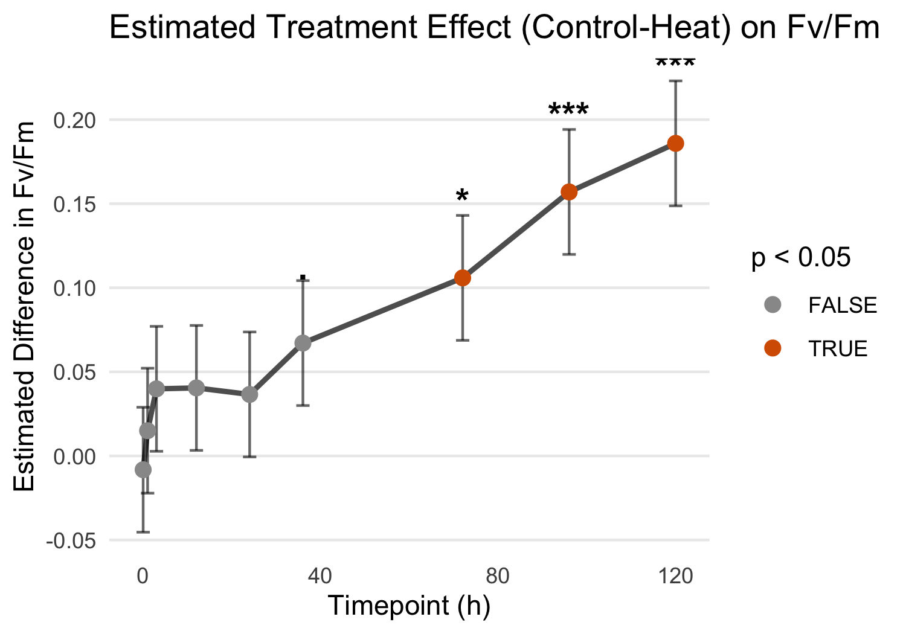
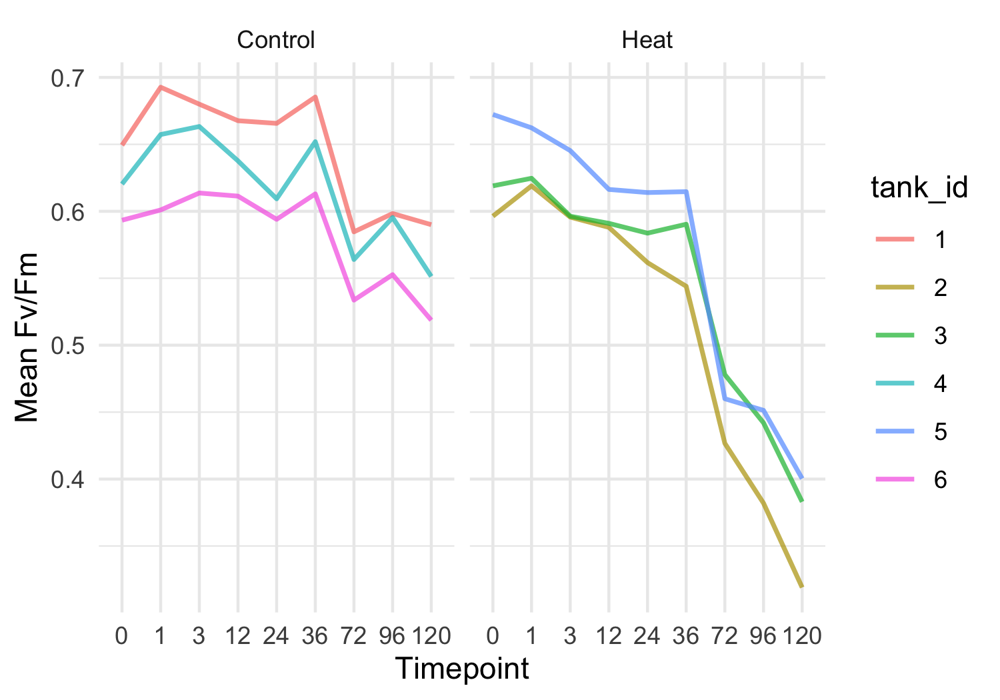

PAM
================
Zoe Dellaert
2025-06-24

- [0.1 Statistical Mixed Model by treatment, timepoint, and
  tank_id](#01-statistical-mixed-model-by-treatment-timepoint-and-tank_id)

``` r
library(tidyverse)
library(janitor)
library(ggpubr)
library(lme4)
library(lmerTest)
library(emmeans)


custom_colors <- c("Control" = "lightblue4", "Heat" = "#D55E00")

PAM <- read.csv("../data/PAM.csv") %>% clean_names() %>% filter(date != "20250519")
PAM <- PAM %>% mutate(date = as.factor(date)) %>% 
                mutate(timepoint = factor(timepoint)) %>%#,levels = c("0","1","3","6","12",
                                                    #           "24","36","48","72","120","170"), ordered = TRUE)) %>% 
                mutate(plug = as.factor(plug)) %>%
                mutate(treatment = factor(treatment,levels = c("Acclimation","Recovery","Control","Heat", ordered=TRUE)))

ggplot(PAM,aes(x = date, y = fv_fm_y_1000)) + 
    geom_boxplot(aes(fill = tank_id)) + labs(x = "Date", y = "Fv/Fm", title = "Fv/Fm by Date and Tank") +
  theme_minimal()
```


``` r
outlier_dates <- c("20250609","20250610","20250620")
  
PAM <- PAM %>% filter(!(date %in%outlier_dates))

ggplot(PAM,aes(x = date, y = fv_fm_y_1000)) + 
    geom_boxplot(aes(fill = treatment)) + labs(x = "Date", y = "Fv/Fm", title = "Fv/Fm by Date and Tank") +
  theme_minimal()
```


``` r
ggsave("../output/FvFm_recovery_acclimation.png", plot = last_plot(), width = 8, height = 4)
```

``` r
PAM_exp <- PAM %>% filter(treatment!="Acclimation" & treatment!="Recovery")
table(PAM_exp$plug)
```

    ## 
    ## 1043 1065 1102 1122 1130 1133 1209 1244 1281 1337 1473 1555 1575 1615 1626 1761 
    ##    5    5    5    5    5    5    5    5    5    5    5    5    5    5    5    5 
    ## 1771 2730 
    ##    5    5

``` r
ggplot(PAM_exp,aes(x = timepoint, y = fv_fm_y_1000)) + 
    geom_boxplot(aes(fill = treatment)) +theme_minimal() +scale_fill_manual(values = custom_colors) 
```


``` r
ggplot(PAM_exp,aes(x = timepoint, y = fv_fm_y_1000, group = plug)) + 
    geom_path(aes(color=plug)) + theme_minimal() #+facet_wrap(tank_id~treatment)
```


## 0.1 Statistical Mixed Model by treatment, timepoint, and tank_id

``` r
# mixed model
model <- lmer(fv_fm_y_1000 ~ treatment * timepoint + (1 | treatment:tank_id), data = PAM_exp)
summary(model)
```

    ## Linear mixed model fit by REML. t-tests use Satterthwaite's method [
    ## lmerModLmerTest]
    ## Formula: fv_fm_y_1000 ~ treatment * timepoint + (1 | treatment:tank_id)
    ##    Data: PAM_exp
    ## 
    ## REML criterion at convergence: -189.2
    ## 
    ## Scaled residuals: 
    ##      Min       1Q   Median       3Q      Max 
    ## -2.21639 -0.40337  0.01968  0.63168  1.85437 
    ## 
    ## Random effects:
    ##  Groups            Name        Variance  Std.Dev.
    ##  treatment:tank_id (Intercept) 0.0006687 0.02586 
    ##  Residual                      0.0039206 0.06261 
    ## Number of obs: 90, groups:  treatment:tank_id, 6
    ## 
    ## Fixed effects:
    ##                            Estimate Std. Error        df t value Pr(>|t|)    
    ## (Intercept)                0.621000   0.025661 16.922477  24.200 1.44e-14 ***
    ## treatmentHeat              0.008222   0.036291 16.922477   0.227    0.823    
    ## timepoint1                 0.029333   0.029517 76.000000   0.994    0.323    
    ## timepoint3                 0.031333   0.029517 76.000000   1.062    0.292    
    ## timepoint12                0.017889   0.029517 76.000000   0.606    0.546    
    ## timepoint24                0.002000   0.029517 76.000000   0.068    0.946    
    ## treatmentHeat:timepoint1  -0.023222   0.041743 76.000000  -0.556    0.580    
    ## treatmentHeat:timepoint3  -0.048111   0.041743 76.000000  -1.153    0.253    
    ## treatmentHeat:timepoint12 -0.048667   0.041743 76.000000  -1.166    0.247    
    ## treatmentHeat:timepoint24 -0.044778   0.041743 76.000000  -1.073    0.287    
    ## ---
    ## Signif. codes:  0 '***' 0.001 '**' 0.01 '*' 0.05 '.' 0.1 ' ' 1
    ## 
    ## Correlation of Fixed Effects:
    ##             (Intr) trtmnH tmpnt1 tmpnt3 tmpn12 tmpn24 trtH:1 trtH:3 trH:12
    ## treatmentHt -0.707                                                        
    ## timepoint1  -0.575  0.407                                                 
    ## timepoint3  -0.575  0.407  0.500                                          
    ## timepoint12 -0.575  0.407  0.500  0.500                                   
    ## timepoint24 -0.575  0.407  0.500  0.500  0.500                            
    ## trtmntHt:t1  0.407 -0.575 -0.707 -0.354 -0.354 -0.354                     
    ## trtmntHt:t3  0.407 -0.575 -0.354 -0.707 -0.354 -0.354  0.500              
    ## trtmntHt:12  0.407 -0.575 -0.354 -0.354 -0.707 -0.354  0.500  0.500       
    ## trtmntHt:24  0.407 -0.575 -0.354 -0.354 -0.354 -0.707  0.500  0.500  0.500

``` r
# Estimated marginal means (adjusted for random effects and model structure)
emm <- emmeans(model, ~ treatment | timepoint)
pairs(emm)
```

    ## timepoint = 0:
    ##  contrast       estimate     SE   df t.ratio p.value
    ##  Control - Heat -0.00822 0.0363 16.9  -0.227  0.8235
    ## 
    ## timepoint = 1:
    ##  contrast       estimate     SE   df t.ratio p.value
    ##  Control - Heat  0.01500 0.0363 16.9   0.413  0.6846
    ## 
    ## timepoint = 3:
    ##  contrast       estimate     SE   df t.ratio p.value
    ##  Control - Heat  0.03989 0.0363 16.9   1.099  0.2871
    ## 
    ## timepoint = 12:
    ##  contrast       estimate     SE   df t.ratio p.value
    ##  Control - Heat  0.04044 0.0363 16.9   1.114  0.2807
    ## 
    ## timepoint = 24:
    ##  contrast       estimate     SE   df t.ratio p.value
    ##  Control - Heat  0.03656 0.0363 16.9   1.007  0.3280
    ## 
    ## Degrees-of-freedom method: kenward-roger

``` r
summary_table <- as.data.frame(pairs(emm)) %>%
  transmute(
    Timepoint = as.numeric(as.character(timepoint)),
    `Estimate (Control-Heat)` = round(estimate, 4),
    `SE` = round(SE, 4),
    `t-ratio` = round(t.ratio, 2),
    `p-value` = signif(p.value, 3),
    `Significant?` = case_when(
      p.value < 0.001 ~ "***",
      p.value < 0.01 ~ "**",
      p.value < 0.05 ~ "*",
      p.value < 0.1 ~ ".",
      TRUE ~ ""
    )
  )

print(summary_table)
```

    ##   Timepoint Estimate (Control-Heat)     SE t-ratio p-value Significant?
    ## 1         0                 -0.0082 0.0363   -0.23   0.823             
    ## 2         1                  0.0150 0.0363    0.41   0.685             
    ## 3         3                  0.0399 0.0363    1.10   0.287             
    ## 4        12                  0.0404 0.0363    1.11   0.281             
    ## 5        24                  0.0366 0.0363    1.01   0.328

``` r
write.csv(summary_table, "../output/FvFm_treatment_effect_summary.csv", row.names = FALSE)
```

``` r
contrast_table <- as.data.frame(pairs(emm)) %>%
  mutate(
    timepoint = as.numeric(as.character(timepoint)),
    signif = case_when(
      p.value < 0.001 ~ "***",
      p.value < 0.01 ~ "**",
      p.value < 0.05 ~ "*",
      p.value < 0.1 ~ ".",
      TRUE ~ ""
    )
  )

ggplot(contrast_table, aes(x = timepoint, y = estimate)) +
  geom_errorbar(aes(ymin = estimate - SE, ymax = estimate + SE),width = 3, alpha = 0.6) +
  geom_line(size = 1, aes(group = 1), color = "black", alpha = 0.7) +
  geom_point(size = 2.5, aes(color = p.value < 0.05)) +
  geom_text(aes(label = signif), vjust = -2.5, size = 5, fontface = "bold", color = "black") +
  scale_color_manual(values = c("TRUE" = "#D55E00", "FALSE" = "grey60"), name = "p < 0.05") +
  labs(
    title = "Estimated Treatment Effect (Control-Heat) on Fv/Fm",
    x = "Timepoint (h)",
    y = "Estimated Difference in Fv/Fm") +
  theme_minimal() +
  theme(panel.grid.minor = element_blank(),panel.grid.major.x = element_blank())
```



``` r
ggsave("../output/FvFm_line_treatment_tank_modelestimates.png", plot = last_plot(), width = 8, height = 4)
ggsave("../output/pdf_figs/FvFm_line_treatment_tank_modelestimates.pdf", plot = last_plot(), width = 8, height = 4)
```

``` r
PAM_means_treatment <- PAM_exp %>%
  group_by(date, timepoint, treatment) %>%
  summarise(
    FvFm_mean = mean(fv_fm_y_1000, na.rm = TRUE),
    FvFm_SE = sd(fv_fm_y_1000, na.rm = TRUE) / sqrt(n()),
    .groups = 'drop'
  )

ggplot(PAM_means_treatment, aes(x = timepoint, y = FvFm_mean, color = treatment,group = treatment)) +
  geom_point(size = 2.5) +
  geom_errorbar(aes(ymin = FvFm_mean - FvFm_SE, ymax = FvFm_mean + FvFm_SE),
                width = 0.2) +
  geom_line(stat = "summary", fun = mean, size = 1.2, aes(group = treatment)) +
  labs(x = "Timepoint",y = "Mean Fv/Fm") +
  theme_minimal() +scale_color_manual(values = custom_colors)
```


``` r
PAM_means <- PAM_exp %>%
  group_by(date, timepoint, treatment, tank_id) %>%
  summarise(
    FvFm_mean = mean(fv_fm_y_1000, na.rm = TRUE),
    FvFm_SE = sd(fv_fm_y_1000, na.rm = TRUE) / sqrt(n()),
    .groups = 'drop'
  )

ggplot(PAM_means, aes(x = timepoint, y = FvFm_mean, color = treatment, shape = tank_id)) +
  geom_point(stat = "summary", fun = mean, aes(group = treatment), size=2.5) +
  geom_point(position = position_dodge(width = 0.5), size = 2.5, alpha=0.5) +
  geom_errorbar(aes(ymin = FvFm_mean - FvFm_SE, ymax = FvFm_mean + FvFm_SE),
                width = 0.2, position = position_dodge(width = 0.5), alpha=0.5) +
  geom_line(stat = "summary", fun = mean, size = 1.2, aes(group = treatment)) +
  labs(x = "Timepoint",y = "Mean Fv/Fm") +
  theme_minimal() +scale_color_manual(values = custom_colors) +
  stat_compare_means(aes(group = treatment),method = "anova",label = "p.format",size = 2.5)
```


``` r
ggsave("../output/FvFm_line_treatment_tank_means.png", plot = last_plot(), width = 8, height = 4)
ggsave("../output/pdf_figs/FvFm_line_treatment_tank_means.pdf", plot = last_plot(), width = 8, height = 4)

ggplot(PAM_exp, aes(x = timepoint, y = fv_fm_y_1000, color = treatment, shape = tank_id)) +
  geom_point(stat = "summary", fun = mean, aes(group = treatment), size=2.5) +
  geom_point(position = position_dodge(width = 0.5), size = 2.5, alpha=0.5) +
  geom_line(stat = "summary", fun = mean, size = 1.2, aes(group = treatment)) +
  labs(x = "Timepoint",y = "Mean Fv/Fm") +
  theme_minimal() +scale_color_manual(values = custom_colors) +
  stat_compare_means(aes(group = treatment),method = "anova",label = "p.format",size = 3)
```


``` r
ggplot(PAM_means, aes(x = timepoint, y = FvFm_mean, color = tank_id, group = tank_id)) +
  geom_line(size = 0.8, alpha = 0.7) +
  labs(x = "Timepoint",y = "Mean Fv/Fm") +
  theme_minimal() + facet_wrap(~treatment)
```



``` r
ggplot(PAM_exp, aes(x = timepoint, y = fv_fm_y_1000, color = treatment)) +
  geom_boxplot(outlier.colour = "red", outlier.shape = 8) 
```


