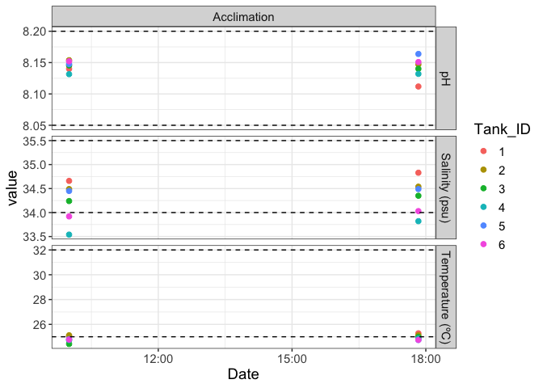

Daily measurement plotting
================
Zoe Dellaert
6/24/2025

- [0.1 Load packages](#01-load-packages)
- [0.2 Load data](#02-load-data)
- [0.3 Calculate total pH from Probe Set
  1](#03-calculate-total-ph-from-probe-set-1)
- [0.4 Change to long format](#04-change-to-long-format)
- [0.5 Plot](#05-plot)
- [0.6 HOBO Temps, based on Jill’s
  Script](#06-hobo-temps-based-on-jills-script)

This script plots daily measurements from the experiment, and is based
on the Putnam Lab script available here:
<https://github.com/Putnam-Lab/CBLS_Wetlab/tree/main>

## 0.1 Load packages

## 0.2 Load data

``` r
## Read in data
daily <- read.csv("../data/water_chemistry/DMs.csv")
head(daily)
```

    ##       Date   Treatment Tank_ID  Time Initials Temperature_C pH_mv Salinity_psu
    ## 1 20250624 Acclimation       1 10:00       NB         25.04 -63.1        34.66
    ## 2 20250624 Acclimation       2 10:00       NB         25.12 -64.0        34.49
    ## 3 20250624 Acclimation       3 10:00       NB         24.42 -63.0        34.24
    ## 4 20250624 Acclimation       4 10:00       NB         24.73 -62.5        33.54
    ## 5 20250624 Acclimation       5 10:00       NB         24.81 -63.4        34.45
    ## 6 20250624 Acclimation       6 10:00       NB         24.77 -63.7        33.92
    ##   tris.date Probe.Set                                              notes
    ## 1  20250618    Probe1 Immediately after water change, no corals in tanks
    ## 2  20250618    Probe1 Immediately after water change, no corals in tanks
    ## 3  20250618    Probe1 Immediately after water change, no corals in tanks
    ## 4  20250618    Probe1 Immediately after water change, no corals in tanks
    ## 5  20250618    Probe1 Immediately after water change, no corals in tanks
    ## 6  20250618    Probe1 Immediately after water change, no corals in tanks

``` r
tail(daily) # check to make sure data from today is there
```

    ##        Date   Treatment Tank_ID  Time Initials Temperature_C pH_mv Salinity_psu
    ## 7  20250624 Acclimation       1 17:50       ZD         25.28 -61.6        34.83
    ## 8  20250624 Acclimation       2 17:50       ZD         25.12 -63.6        34.54
    ## 9  20250624 Acclimation       3 17:50       ZD         24.98 -63.1        34.35
    ## 10 20250624 Acclimation       4 17:50       ZD         24.87 -62.6        33.82
    ## 11 20250624 Acclimation       5 17:50       ZD         24.74 -64.3        34.49
    ## 12 20250624 Acclimation       6 17:50       ZD         24.75 -63.6        34.03
    ##    tris.date Probe.Set notes
    ## 7   20250618    Probe1      
    ## 8   20250618    Probe1      
    ## 9   20250618    Probe1      
    ## 10  20250618    Probe1      
    ## 11  20250618    Probe1      
    ## 12  20250618    Probe1

``` r
daily$Date <- as.Date(as.character(daily$Date), format = "%Y%m%d")
daily$tris.date <- as.character(daily$tris.date)
daily$Tank_ID <- as.character(daily$Tank_ID)

daily$DateTime <- as.POSIXct(paste(daily$Date, daily$Time), format="%Y-%m-%d %H:%M")
```

``` r
daily.probe1 <- daily %>% filter(Probe.Set == "Probe1") 

range(na.omit(daily.probe1$Temperature_C))
```

    ## [1] 24.42 25.28

``` r
range(na.omit(daily.probe1$pH_mv))
```

    ## [1] -64.3 -61.6

``` r
range(na.omit(daily.probe1$Salinity_psu))
```

    ## [1] 33.54 34.83

## 0.3 Calculate total pH from Probe Set 1

Calculate the calibration curve from the Tris calibration and calculate
pH on the total scale from pH.mV.

``` r
pHcalib <- read_csv("../data/water_chemistry/Tris_Calibration.csv")
```

    ## Rows: 14 Columns: 3
    ## ── Column specification ────────────────────────────────────────────────────────
    ## Delimiter: ","
    ## dbl (3): tris.date, mVTris, TTris
    ## 
    ## ℹ Use `spec()` to retrieve the full column specification for this data.
    ## ℹ Specify the column types or set `show_col_types = FALSE` to quiet this message.

``` r
pHcalib$tris.date<-as.character(pHcalib$tris.date)

pHSlope <- pHcalib %>%
  group_by(tris.date) %>%
  nest() %>%
  mutate(fitpH = map(data, ~ lm(mVTris ~ TTris, data = .x))) %>%
  mutate(tidy_fit = map(fitpH, broom::tidy)) %>%
  unnest(tidy_fit) %>%
  select(tris.date, term, estimate) %>%
  pivot_wider(names_from = term, values_from = estimate) %>%
  left_join(daily.probe1, ., by = "tris.date") %>%
  mutate(mVTris = Temperature_C * TTris + `(Intercept)`)

pHSlope <- pHSlope %>%
  mutate(pH.total = seacarb::pH(Ex = pH_mv, Etris = mVTris, S=Salinity_psu, T=Temperature_C))
```

Convert date to ymd for plotting

``` r
pHSlope$Date <- ymd(pHSlope$Date) # convert 8 digit date into datetime format

pHSlope <- pHSlope%>% relocate("pH.total", .after = Salinity_psu) %>%
  relocate(pH_mv, .after = pH.total)
```

## 0.4 Change to long format

Change data format to long format

``` r
pHSlope.long <-pHSlope %>% pivot_longer(cols=Temperature_C:pH.total,
  names_to = "metric",
  values_to = "value")
```

## 0.5 Plot

Make a list of dataframes, each containing a horizontal line that will
correspond to the upper and lower threshold of each parameter
(temperature, salinity, pH total)

``` r
hlines_data <- list(
  data.frame(yintercept = 25.0, metric = "Temperature_C"), # lower threshold for temperature in C°
  data.frame(yintercept = 32, metric = "Temperature_C"), # upper threshold for temperature in C°
  data.frame(yintercept = 34, metric = "Salinity_psu"), # lower threshold for salinity in psu
  data.frame(yintercept = 35.5, metric = "Salinity_psu"), # upper threshold for salinity in psu
  data.frame(yintercept = 8.05, metric = "pH.total"), # lower threshold for total pH
  data.frame(yintercept = 8.2, metric = "pH.total") # upper threshold for total pH
    )
```

``` r
facet_labels <- c(unique(pHSlope.long$metric), unique(pHSlope.long$Treatment))
names(facet_labels) = facet_labels
facet_labels <- replace(facet_labels, which(facet_labels == "pH.total"), "pH")
facet_labels <- replace(facet_labels, which(facet_labels == "Salinity_psu"), "Salinity (psu)")
facet_labels <- replace(facet_labels, which(facet_labels == "Temperature_C"), "Temperature (ºC)")

daily_tank<-pHSlope.long %>% filter(Treatment !=  "Ramp") %>%
  ggplot(aes(x=DateTime, y=value, colour=Tank_ID))+
  geom_point(size=2)+
  xlab("Date")+
  facet_grid(factor(metric,c("pH.total","Salinity_psu","Temperature_C")) ~ Treatment, scales = "free", labeller = as_labeller(facet_labels))+
  geom_hline(data = hlines_data[[1]], aes(yintercept = yintercept), linetype = "dashed") +    
  geom_hline(data = hlines_data[[2]], aes(yintercept = yintercept), linetype = "dashed") +
  geom_hline(data = hlines_data[[3]], aes(yintercept = yintercept), linetype = "dashed") +
  geom_hline(data = hlines_data[[4]], aes(yintercept = yintercept), linetype = "dashed") +
  geom_hline(data = hlines_data[[5]], aes(yintercept = yintercept), linetype = "dashed") +
  geom_hline(data = hlines_data[[6]], aes(yintercept = yintercept), linetype = "dashed") +
  theme_bw() +
  theme(text = element_text(size = 14)); daily_tank
```

<!-- -->

``` r
daily_tank<-pHSlope.long %>% filter(Treatment !=  "AcclimationRecovery" & Treatment !=  "Ramp") %>%
  ggplot(aes(x=DateTime, y=value, colour=Tank_ID))+
  geom_point(size=2)+
  xlab("Date")+
  facet_grid(factor(metric,c("pH.total","Salinity_psu","Conductivity_mScm","Temperature_C")) ~ Treatment, scales = "free", labeller = as_labeller(facet_labels))+
  geom_hline(data = hlines_data[[1]], aes(yintercept = yintercept), linetype = "dashed") +    
  geom_hline(data = hlines_data[[2]], aes(yintercept = yintercept), linetype = "dashed") +
  geom_hline(data = hlines_data[[3]], aes(yintercept = yintercept), linetype = "dashed") +
  geom_hline(data = hlines_data[[4]], aes(yintercept = yintercept), linetype = "dashed") +
  geom_hline(data = hlines_data[[5]], aes(yintercept = yintercept), linetype = "dashed") +
  geom_hline(data = hlines_data[[6]], aes(yintercept = yintercept), linetype = "dashed") +
  theme_bw() +
  theme(text = element_text(size = 14)); daily_tank
```

<!-- -->

``` r
# Save plot 
ggsave("../output/pdf_figs/Daily_Measurements_Exp.pdf", daily_tank, width = 10, height = 10, units = c("in"))
ggsave("../output/Daily_Measurements_Exp.png", daily_tank, width = 10, height = 10, units = c("in"))
```

Summarize daily measurements during the heat stress experiment

``` r
daily_exp <- pHSlope %>% 
  filter(Treatment != "AcclimationRecovery" & Treatment !=  "Ramp")

summary <- daily_exp%>%
  group_by(Tank_ID)%>%
  select(Temperature_C:pH_mv) %>%
  summarise(across(everything(), list(mean = mean, sd = sd), na.rm = TRUE)); summary
```

    ## Adding missing grouping variables: `Tank_ID`

    ## Warning: There was 1 warning in `summarise()`.
    ## ℹ In argument: `across(everything(), list(mean = mean, sd = sd), na.rm =
    ##   TRUE)`.
    ## ℹ In group 1: `Tank_ID = "1"`.
    ## Caused by warning:
    ## ! The `...` argument of `across()` is deprecated as of dplyr 1.1.0.
    ## Supply arguments directly to `.fns` through an anonymous function instead.
    ## 
    ##   # Previously
    ##   across(a:b, mean, na.rm = TRUE)
    ## 
    ##   # Now
    ##   across(a:b, \(x) mean(x, na.rm = TRUE))

    ## # A tibble: 6 × 9
    ##   Tank_ID Temperature_C_mean Temperature_C_sd Salinity_psu_mean Salinity_psu_sd
    ##   <chr>                <dbl>            <dbl>             <dbl>           <dbl>
    ## 1 1                     25.2           0.170               34.7          0.120 
    ## 2 2                     25.1           0                   34.5          0.0354
    ## 3 3                     24.7           0.396               34.3          0.0778
    ## 4 4                     24.8           0.0990              33.7          0.198 
    ## 5 5                     24.8           0.0495              34.5          0.0283
    ## 6 6                     24.8           0.0141              34.0          0.0778
    ## # ℹ 4 more variables: pH.total_mean <dbl>, pH.total_sd <dbl>, pH_mv_mean <dbl>,
    ## #   pH_mv_sd <dbl>

## 0.6 HOBO Temps, based on [Jill’s Script](https://github.com/JillAshey/Astrangia_repo/blob/0041652d5b2a01145c1c049f10dbc53a8513cb86/scripts/Hobo_Temps.Rmd#L27)

``` r
library(lubridate)
library(tidyverse)
library(emmeans)
library(gridExtra)

# Read in temp data 
Tank1 <- read.csv("../data/LoggerData/Tank1_9893752.csv", sep=",", skip=c(1), header=TRUE, na.strings = "NA")[ ,2:4]
Tank2 <- read.csv("../data/LoggerData/Tank2_10655123.csv", sep=",", skip=c(1), header=TRUE, na.strings = "NA")[ ,2:4]
Tank3 <- read.csv("../data/LoggerData/Tank3_10655130.csv", sep=",", skip=c(1), header=TRUE, na.strings = "NA")[ ,2:4]
Tank4 <- read.csv("../data/LoggerData/Tank4_10655129.csv", sep=",", skip=c(1), header=TRUE, na.strings = "NA")[ ,2:4]
Tank5 <- read.csv("../data/LoggerData/Tank5_10655120.csv", sep=",", skip=c(1), header=TRUE, na.strings = "NA")[ ,2:4]
Tank6 <- read.csv("../data/LoggerData/Tank6_10655122.csv", sep=",", skip=c(1), header=TRUE, na.strings = "NA")[ ,2:4]

col_names <- c("DateTimeGMTmin10","TempC","IntensityLux")

# combine all dataframes into list
Tanks <- list(Tank1 = Tank1,
              Tank2 = Tank2,
              Tank3 = Tank3,
              Tank4 = Tank4,
              Tank5 = Tank5,
              Tank6 = Tank6)

# find dataframe with the fewest number of rows
min_rows <- min(sapply(Tanks, nrow))

# trim them all to be this length
Tanks <- lapply(Tanks, function(df) {df[1:min_rows, ]
                                    colnames(df) <- col_names
                                    return(df)
})

Tank1 <- Tanks$Tank1
Tank2 <- Tanks$Tank2
Tank3 <- Tanks$Tank3
Tank4 <- Tanks$Tank4
Tank5 <- Tanks$Tank5
Tank6 <- Tanks$Tank6

Tank1$Tank <- "Tank1"
Tank2$Tank <- "Tank2"
Tank3$Tank <- "Tank3"
Tank4$Tank <- "Tank4"
Tank5$Tank <- "Tank5"
Tank6$Tank <- "Tank6"

Tank1$Treatment <- "Heated"
Tank2$Treatment <- "Heated"
Tank3$Treatment <- "Heated"
Tank4$Treatment <- "Control"
Tank5$Treatment <- "Control"
Tank6$Treatment <- "Control"

tank_df <- rbind(Tank1, Tank2, Tank3, Tank4, Tank5, Tank6)

tank_df$DateTimeGMTmin10 <- parse_date_time(tank_df$DateTimeGMTmin10, "%m/%d/%y %I:%M:%S %p")

# Assign raw timezone as GMT-10 (Hawaii)
tank_df$DateTimeGMTmin10 <- force_tz(tank_df$DateTimeGMTmin10, tzone = "Etc/GMT+10")

# Convert to Eastern Time
tank_df$DateTimeEST <- with_tz(tank_df$DateTimeGMTmin10, tzone = "America/New_York")

Temps <- tank_df %>% ggplot(aes(x=DateTimeEST, y=TempC)) +
  geom_line(aes(color = Tank), size = 0.5) +
  facet_grid(~Treatment)+
  ylab("Temperature (°C)") +theme_minimal()
Temps

#remove commas from light data and make numeric
tank_df$IntensityLux <- as.numeric(gsub(",", "", tank_df$IntensityLux))

Light <- tank_df %>% ggplot(aes(x=DateTimeEST, y=IntensityLux)) +
  geom_line(aes(color = Tank), size = 0.5) +
  facet_grid(~Treatment)+
  ylab("Light (Lux)") +theme_minimal()

Light
```

``` r
# filter for our experimental dates 
tank_df_Exp <- tank_df %>% filter(DateTimeEST >= "2025-05-22 00:00:00" & DateTimeEST <= "2025-05-29 12:00:00")

write.csv(tank_df_Exp,file="../output/Experimental_Tank_HoboTempLight_data.csv")

Temps <- tank_df_Exp %>% ggplot(aes(x=DateTimeEST, y=TempC)) +
  geom_line(aes(color = Tank), size = 0.5) +
  facet_grid(~Treatment)+
  ylab("Temperature (°C)") +theme_minimal()
Temps
ggsave("../output/pdf_figs/Experimental_Tank_HoboTemp.pdf", plot = last_plot(), width = 8, height = 4)
ggsave("../output/Experimental_Tank_HoboTemp.png", plot = last_plot(), width = 8, height = 4)

Light <- tank_df_Exp %>% ggplot(aes(x=DateTimeEST, y=IntensityLux)) +
  geom_line(aes(color = Tank), size = 0.5) +
  facet_grid(~Treatment)+
  ylab("Light (Lux)") +theme_minimal()

Light
ggsave("../output/pdf_figs/Experimental_Tank_HoboLight.pdf", plot = last_plot(), width = 8, height = 4)
ggsave("../output/Experimental_Tank_HoboLight.png", plot = last_plot(), width = 8, height = 4)
```
