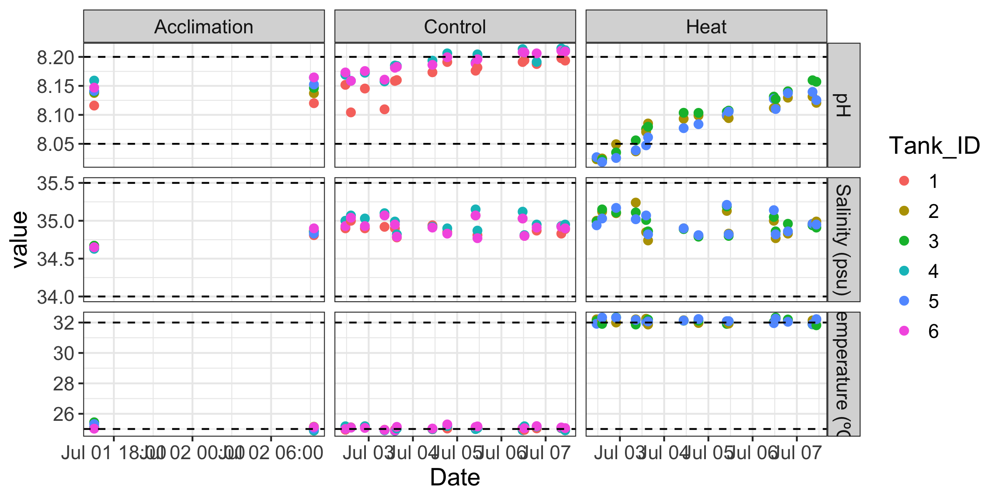
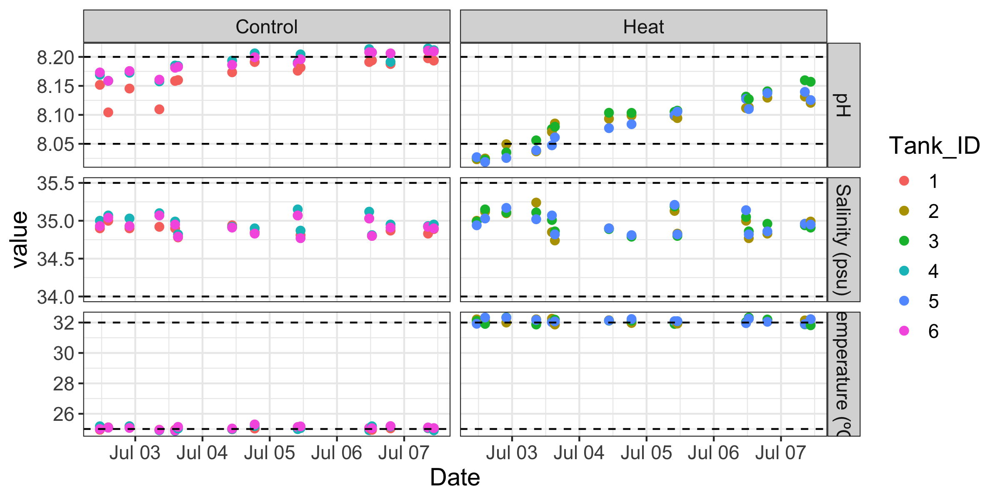
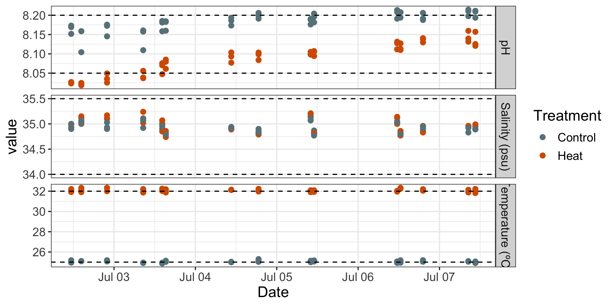
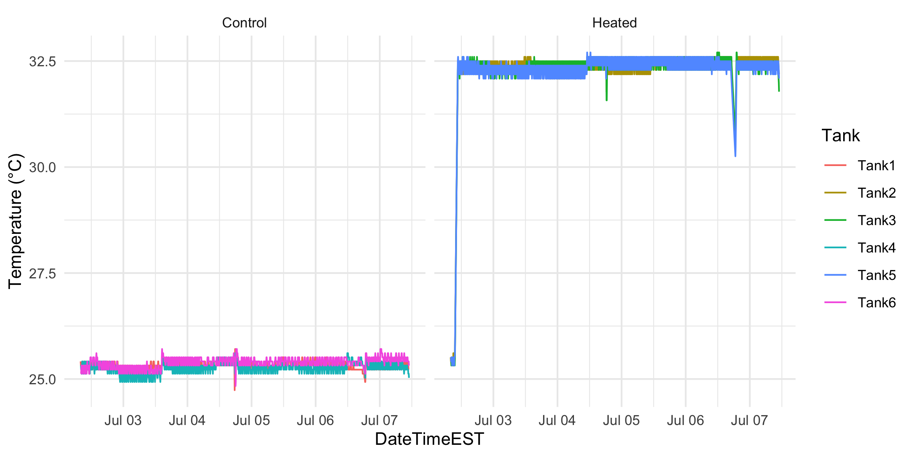
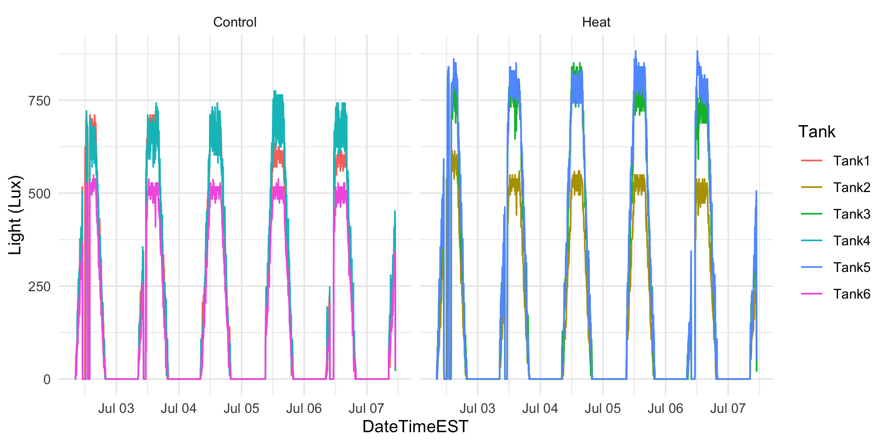
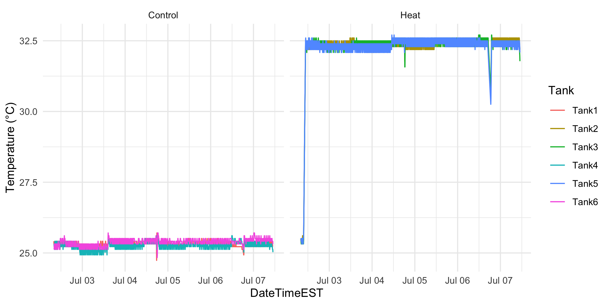
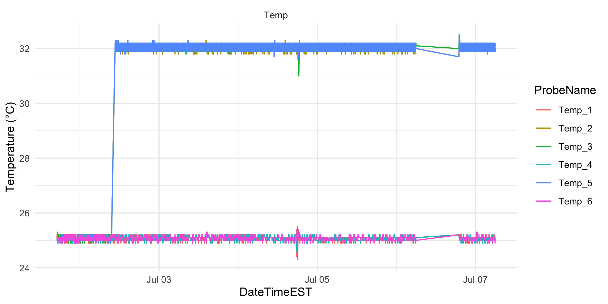

Daily measurement plotting, Mcap
================
Zoe Dellaert
7/2/2025

- [0.1 Load data](#01-load-data)
- [0.2 Calculate total pH from Probe Set
  1](#02-calculate-total-ph-from-probe-set-1)
- [0.3 Change to long format](#03-change-to-long-format)
- [0.4 Plot](#04-plot)
- [0.5 HOBO Temps, based on Jill’s
  Script](#05-hobo-temps-based-on-jills-script)
- [0.6 Apex Log from csv](#06-apex-log-from-csv)

This script plots daily measurements from the experiment, and is based
on the Putnam Lab script available here:
<https://github.com/Putnam-Lab/CBLS_Wetlab/tree/main>

``` r
library(tidyverse)
library(lubridate) # used for converting 8 digit date into datetime format for R
library(RColorBrewer)
library(rmarkdown)
library(tinytex)

## If seacarb needs to be downloaded:
#packageurl <- "https://cran.r-project.org/src/contrib/Archive/seacarb/seacarb_3.2.tar.gz"
#install.packages(packageurl, repos = NULL, type = "source")
#install.packages("seacarb")
library(seacarb) 

custom_colors <- c("Control" = "lightblue4", "Heat" = "#D55E00")
```

## 0.1 Load data

``` r
## Read in data
daily <- read.csv("../data/water_chemistry/DMs.csv")
head(daily)
```

    ##       Date   Treatment Tank_ID  Time Initials Temperature_C pH_mv Salinity_psu
    ## 1 20250701 Acclimation       1 16:30    PP;ZD         25.06 -61.7        34.64
    ## 2 20250701 Acclimation       2 16:30    PP;ZD         25.08 -63.0        34.67
    ## 3 20250701 Acclimation       3 16:30    PP;ZD         25.44 -63.4        34.67
    ## 4 20250701 Acclimation       4 16:30    PP;ZD         25.12 -64.3        34.63
    ## 5 20250701 Acclimation       5 16:30    PP;ZD         25.32 -63.4        34.65
    ## 6 20250701 Acclimation       6 16:30    PP;ZD         25.02 -63.5        34.65
    ##   tris.date Probe.Set           notes
    ## 1  20250618    Probe1                
    ## 2  20250618    Probe1                
    ## 3  20250618    Probe1 temp a bit high
    ## 4  20250618    Probe1                
    ## 5  20250618    Probe1                
    ## 6  20250618    Probe1

``` r
tail(daily) # check to make sure data from today is there
```

    ##         Date Treatment Tank_ID  Time Initials Temperature_C pH_mv Salinity_psu
    ## 97  20250707   Control       1 10:35       ZD         24.98 -66.2        34.89
    ## 98  20250707      Heat       2 10:35       ZD         32.21 -67.5        34.99
    ## 99  20250707      Heat       3 10:35       ZD         31.82 -69.4        34.91
    ## 100 20250707   Control       4 10:35       ZD         24.91 -67.2        34.95
    ## 101 20250707      Heat       5 10:35       ZD         32.22 -67.8        34.95
    ## 102 20250707   Control       6 10:35       ZD         25.06 -67.2        34.90
    ##     tris.date Probe.Set notes
    ## 97   20250618    Probe1      
    ## 98   20250618    Probe1      
    ## 99   20250618    Probe1      
    ## 100  20250618    Probe1      
    ## 101  20250618    Probe1      
    ## 102  20250618    Probe1

``` r
daily$Date <- as.Date(as.character(daily$Date), format = "%Y%m%d")
daily$tris.date <- as.character(daily$tris.date)
daily$Tank_ID <- as.character(daily$Tank_ID)

daily$DateTime <- as.POSIXct(paste(daily$Date, daily$Time), format="%Y-%m-%d %H:%M")
```

``` r
daily.probe1 <- daily %>% filter(Probe.Set == "Probe1") 

range(na.omit(daily.probe1$Temperature_C))
```

    ## [1] 24.87 32.34

``` r
range(na.omit(daily.probe1$pH_mv))
```

    ## [1] -69.6 -61.0

``` r
range(na.omit(daily.probe1$Salinity_psu))
```

    ## [1] 34.63 35.24

## 0.2 Calculate total pH from Probe Set 1

Calculate the calibration curve from the Tris calibration and calculate
pH on the total scale from pH.mV.

``` r
pHcalib <- read_csv("../data/water_chemistry/Tris_Calibration.csv")
pHcalib$tris.date<-as.character(pHcalib$tris.date)

pHSlope <- pHcalib %>%
  group_by(tris.date) %>%
  nest() %>%
  mutate(fitpH = map(data, ~ lm(mVTris ~ TTris, data = .x))) %>%
  mutate(tidy_fit = map(fitpH, broom::tidy)) %>%
  unnest(tidy_fit) %>%
  select(tris.date, term, estimate) %>%
  pivot_wider(names_from = term, values_from = estimate) %>%
  left_join(daily.probe1, ., by = "tris.date") %>%
  mutate(mVTris = Temperature_C * TTris + `(Intercept)`)

pHSlope <- pHSlope %>%
  mutate(pH.total = seacarb::pH(Ex = pH_mv, Etris = mVTris, S=Salinity_psu, T=Temperature_C))
```

Convert date to ymd for plotting

``` r
pHSlope$Date <- ymd(pHSlope$Date) # convert 8 digit date into datetime format

pHSlope <- pHSlope%>% relocate("pH.total", .after = Salinity_psu) %>%
  relocate(pH_mv, .after = pH.total)
```

## 0.3 Change to long format

Change data format to long format

``` r
pHSlope.long <-pHSlope %>% pivot_longer(cols=Temperature_C:pH.total,
  names_to = "metric",
  values_to = "value")
```

## 0.4 Plot

Make a list of dataframes, each containing a horizontal line that will
correspond to the upper and lower threshold of each parameter
(temperature, salinity, pH total)

``` r
hlines_data <- list(
  data.frame(yintercept = 25.0, metric = "Temperature_C"), # lower threshold for temperature in C°
  data.frame(yintercept = 32, metric = "Temperature_C"), # upper threshold for temperature in C°
  data.frame(yintercept = 34, metric = "Salinity_psu"), # lower threshold for salinity in psu
  data.frame(yintercept = 35.5, metric = "Salinity_psu"), # upper threshold for salinity in psu
  data.frame(yintercept = 8.05, metric = "pH.total"), # lower threshold for total pH
  data.frame(yintercept = 8.2, metric = "pH.total") # upper threshold for total pH
    )
```

``` r
facet_labels <- c(unique(pHSlope.long$metric), unique(pHSlope.long$Treatment))
names(facet_labels) = facet_labels
facet_labels <- replace(facet_labels, which(facet_labels == "pH.total"), "pH")
facet_labels <- replace(facet_labels, which(facet_labels == "Salinity_psu"), "Salinity (psu)")
facet_labels <- replace(facet_labels, which(facet_labels == "Temperature_C"), "Temperature (ºC)")

daily_tank<-pHSlope.long %>% filter(Treatment !=  "Ramp") %>%
  ggplot(aes(x=DateTime, y=value, colour=Tank_ID))+
  geom_point(size=2)+
  xlab("Date")+
  facet_grid(factor(metric,c("pH.total","Salinity_psu","Temperature_C")) ~ Treatment, scales = "free", labeller = as_labeller(facet_labels))+
  geom_hline(data = hlines_data[[1]], aes(yintercept = yintercept), linetype = "dashed") +    
  geom_hline(data = hlines_data[[2]], aes(yintercept = yintercept), linetype = "dashed") +
  geom_hline(data = hlines_data[[3]], aes(yintercept = yintercept), linetype = "dashed") +
  geom_hline(data = hlines_data[[4]], aes(yintercept = yintercept), linetype = "dashed") +
  geom_hline(data = hlines_data[[5]], aes(yintercept = yintercept), linetype = "dashed") +
  geom_hline(data = hlines_data[[6]], aes(yintercept = yintercept), linetype = "dashed") +
  theme_bw() +
  theme(text = element_text(size = 14)); daily_tank
```



``` r
daily_tank<-pHSlope.long %>% filter(Treatment !=  "Acclimation") %>%
  ggplot(aes(x=DateTime, y=value, colour=Tank_ID))+
  geom_point(size=2)+
  xlab("Date")+
  facet_grid(factor(metric,c("pH.total","Salinity_psu","Conductivity_mScm","Temperature_C")) ~ Treatment, scales = "free", labeller = as_labeller(facet_labels))+
  geom_hline(data = hlines_data[[1]], aes(yintercept = yintercept), linetype = "dashed") +    
  geom_hline(data = hlines_data[[2]], aes(yintercept = yintercept), linetype = "dashed") +
  geom_hline(data = hlines_data[[3]], aes(yintercept = yintercept), linetype = "dashed") +
  geom_hline(data = hlines_data[[4]], aes(yintercept = yintercept), linetype = "dashed") +
  geom_hline(data = hlines_data[[5]], aes(yintercept = yintercept), linetype = "dashed") +
  geom_hline(data = hlines_data[[6]], aes(yintercept = yintercept), linetype = "dashed") +
  theme_bw() +
  theme(text = element_text(size = 14)); daily_tank
```



``` r
# Save plot 
ggsave("../output/pdf_figs/Daily_Measurements_Exp.pdf", daily_tank, width = 10, height = 10, units = c("in"))
ggsave("../output/Daily_Measurements_Exp.png", daily_tank, width = 10, height = 10, units = c("in"), bg = "white")
```

``` r
daily_tank<-pHSlope.long %>% filter(Treatment !=  "Acclimation") %>%
  ggplot(aes(x=DateTime, y=value, colour=Treatment))+
  geom_point(size=2)+
  xlab("Date")+
  facet_grid(factor(metric,c("pH.total","Salinity_psu","Conductivity_mScm","Temperature_C")) ~ ., scales = "free", labeller = as_labeller(facet_labels))+
  geom_hline(data = hlines_data[[1]], aes(yintercept = yintercept), linetype = "dashed") +    
  geom_hline(data = hlines_data[[2]], aes(yintercept = yintercept), linetype = "dashed") +
  geom_hline(data = hlines_data[[3]], aes(yintercept = yintercept), linetype = "dashed") +
  geom_hline(data = hlines_data[[4]], aes(yintercept = yintercept), linetype = "dashed") +
  geom_hline(data = hlines_data[[5]], aes(yintercept = yintercept), linetype = "dashed") +
  geom_hline(data = hlines_data[[6]], aes(yintercept = yintercept), linetype = "dashed") +
  theme_bw() + scale_color_manual(values = custom_colors) +
  theme(text = element_text(size = 14)); daily_tank
```



``` r
# Save plot 
ggsave("../output/pdf_figs/Daily_Measurements_Exp_byTreatment.pdf", daily_tank, width = 10, height = 10, units = c("in"))
ggsave("../output/Daily_Measurements_Exp_byTreatment.png", daily_tank, width = 10, height = 10, units = c("in"), bg = "white")
```

Summarize daily measurements during the heat stress experiment

``` r
daily_exp <- pHSlope %>% 
  filter(Treatment != "Acclimation")

write.csv(daily_exp,file="../output/DMs_Processed.csv")

summary <- daily_exp%>%
  group_by(Tank_ID)%>%
  select(Temperature_C:pH_mv) %>%
  summarise(across(everything(), list(mean = mean, sd = sd), na.rm = TRUE)); summary
```

    ## # A tibble: 6 × 9
    ##   Tank_ID Temperature_C_mean Temperature_C_sd Salinity_psu_mean Salinity_psu_sd
    ##   <chr>                <dbl>            <dbl>             <dbl>           <dbl>
    ## 1 1                     25.0           0.0717              34.9          0.0840
    ## 2 2                     32.1           0.121               35.0          0.150 
    ## 3 3                     32.1           0.163               35.0          0.127 
    ## 4 4                     25.0           0.113               35.0          0.105 
    ## 5 5                     32.1           0.136               35.0          0.135 
    ## 6 6                     25.1           0.0992              34.9          0.0982
    ## # ℹ 4 more variables: pH.total_mean <dbl>, pH.total_sd <dbl>, pH_mv_mean <dbl>,
    ## #   pH_mv_sd <dbl>

## 0.5 HOBO Temps, based on [Jill’s Script](https://github.com/JillAshey/Astrangia_repo/blob/0041652d5b2a01145c1c049f10dbc53a8513cb86/scripts/Hobo_Temps.Rmd#L27)

``` r
Tank1 <- read.csv("../data/LoggerData/Tank1_9893752.csv", sep=",", skip=c(1), header=TRUE, na.strings = "NA")[ ,2:4]
Tank2 <- read.csv("../data/LoggerData/Tank2_10655123.csv", sep=",", skip=c(1), header=TRUE, na.strings = "NA")[ ,2:4]
Tank3 <- read.csv("../data/LoggerData/Tank3_10655130.csv", sep=",", skip=c(1), header=TRUE, na.strings = "NA")[ ,2:4]
Tank4 <- read.csv("../data/LoggerData/Tank4_10655129.csv", sep=",", skip=c(1), header=TRUE, na.strings = "NA")[ ,2:4]
Tank5 <- read.csv("../data/LoggerData/Tank5_10655120.csv", sep=",", skip=c(1), header=TRUE, na.strings = "NA")[ ,2:4]
Tank6 <- read.csv("../data/LoggerData/Tank6_10800713.csv", sep=",", skip=c(1), header=TRUE, na.strings = "NA")[ ,2:4]

col_names <- c("DateTimeEST","TempC","IntensityLux")

# combine all dataframes into list
Tanks <- list(Tank1 = Tank1,
              Tank2 = Tank2,
              Tank3 = Tank3,
              Tank4 = Tank4,
              Tank5 = Tank5,
              Tank6 = Tank6)

# find dataframe with the fewest number of rows
min_rows <- min(sapply(Tanks, nrow))

# trim them all to be this length
Tanks <- lapply(Tanks, function(df) {df[1:min_rows, ]
                                    colnames(df) <- col_names
                                    return(df)
})

Tank1 <- Tanks$Tank1
Tank2 <- Tanks$Tank2
Tank3 <- Tanks$Tank3
Tank4 <- Tanks$Tank4
Tank5 <- Tanks$Tank5
Tank6 <- Tanks$Tank6

Tank1$Tank <- "Tank1"
Tank2$Tank <- "Tank2"
Tank3$Tank <- "Tank3"
Tank4$Tank <- "Tank4"
Tank5$Tank <- "Tank5"
Tank6$Tank <- "Tank6"

Tank1$Treatment <- "Control"
Tank2$Treatment <- "Heat"
Tank3$Treatment <- "Heat"
Tank4$Treatment <- "Control"
Tank5$Treatment <- "Heat"
Tank6$Treatment <- "Control"

tank_df <- rbind(Tank1, Tank2, Tank3, Tank4, Tank5, Tank6)

tank_df$DateTimeEST <- parse_date_time(tank_df$DateTimeEST, "%m/%d/%y %I:%M:%S %p")

# Assign raw timezone as EST
tank_df$DateTimeEST <- force_tz(tank_df$DateTimeEST, tzone = "Etc/GMT+10")

Temps <- tank_df %>% ggplot(aes(x=DateTimeEST, y=TempC)) +
  geom_line(aes(color = Tank), size = 0.5) +
  facet_grid(~Treatment)+
  ylab("Temperature (°C)") +theme_minimal()
Temps
```



``` r
#remove commas from light data and make numeric
tank_df$IntensityLux <- as.numeric(gsub(",", "", tank_df$IntensityLux))

Light <- tank_df %>% ggplot(aes(x=DateTimeEST, y=IntensityLux)) +
  geom_line(aes(color = Tank), size = 0.5) +
  facet_grid(~Treatment)+
  ylab("Light (Lux)") +theme_minimal()

Light
```



``` r
# filter for our experimental dates (use GMT for the time, so +6)
tank_df_Exp <- tank_df %>% filter(DateTimeEST >= "2025-07-02 14:00:00" & DateTimeEST <= "2025-07-07 17:00:00")

# there was one measurement in all tanks where the light was SUPER high due to us turning on white light in the tanks to take pictures of bleaching. Removing this outlier

# tank_df_Exp <- tank_df_Exp %>% filter(DateTimeEST <= "2025-07-04 11:35:00" | DateTimeEST >= "2025-07-04 11:40:00")
# (use GMT for the time, so +6)

tank_df_Exp <- tank_df_Exp %>% filter(DateTimeEST <= "2025-07-04 17:35:00" | DateTimeEST >= "2025-07-04 17:40:00")

write.csv(tank_df_Exp,file="../output/Experimental_Tank_HoboTempLight_data.csv")

Temps <- tank_df_Exp %>% ggplot(aes(x=DateTimeEST, y=TempC)) +
  geom_line(aes(color = Tank), size = 0.5) +
  facet_grid(~Treatment)+
  ylab("Temperature (°C)") +theme_minimal()
Temps
```



``` r
ggsave("../output/pdf_figs/Experimental_Tank_HoboTemp.pdf", plot = last_plot(), width = 8, height = 4)
ggsave("../output/Experimental_Tank_HoboTemp.png", plot = last_plot(), width = 8, height = 4, bg = "white")

Light <- tank_df_Exp %>% ggplot(aes(x=DateTimeEST, y=IntensityLux)) +
  geom_line(aes(color = Tank), size = 0.5) +
  facet_grid(~Treatment)+
  ylab("Light (Lux)") +theme_minimal()

Light
```


``` r
ggsave("../output/pdf_figs/Experimental_Tank_HoboLight.pdf", plot = last_plot(), width = 8, height = 4)
ggsave("../output/Experimental_Tank_HoboLight.png", plot = last_plot(), width = 8, height = 4, bg = "white")
```

## 0.6 Apex Log from csv

1.  Open xml file with microsoft excel (this can take a while)
2.  Save as \> csv
3.  import csv into R

``` r
apex <- read.csv("../data/LoggerData/Apex_log.csv", sep=",", skip=c(1), header=TRUE, na.strings = "NA")[6:9]

colnames(apex) <-  c("DateTime","ProbeName","ProbeType","Value")

head(apex)
```

    ##              DateTime ProbeName ProbeType Value
    ## 1 07/01/2025 04:41:00     Btemp      Temp  20.7
    ## 2 07/01/2025 04:41:00      Salt      Cond  39.3
    ## 3 07/01/2025 04:41:00    Temp_1      Temp  21.0
    ## 4 07/01/2025 04:41:00    Temp_4      Temp  21.0
    ## 5 07/01/2025 04:41:00    Temp_2      Temp  20.8
    ## 6 07/01/2025 04:41:00    Temp_3      Temp  20.9

``` r
apex$DateTimeHST <- parse_date_time(apex$DateTime, "%m/%d/%y %H:%M:%S", tz = "Pacific/Honolulu")
apex$DateTimeEST <- with_tz(apex$DateTimeHST, tzone = "America/New_York")
head(apex)
```

    ##              DateTime ProbeName ProbeType Value         DateTimeHST
    ## 1 07/01/2025 04:41:00     Btemp      Temp  20.7 2025-07-01 04:41:00
    ## 2 07/01/2025 04:41:00      Salt      Cond  39.3 2025-07-01 04:41:00
    ## 3 07/01/2025 04:41:00    Temp_1      Temp  21.0 2025-07-01 04:41:00
    ## 4 07/01/2025 04:41:00    Temp_4      Temp  21.0 2025-07-01 04:41:00
    ## 5 07/01/2025 04:41:00    Temp_2      Temp  20.8 2025-07-01 04:41:00
    ## 6 07/01/2025 04:41:00    Temp_3      Temp  20.9 2025-07-01 04:41:00
    ##           DateTimeEST
    ## 1 2025-07-01 10:41:00
    ## 2 2025-07-01 10:41:00
    ## 3 2025-07-01 10:41:00
    ## 4 2025-07-01 10:41:00
    ## 5 2025-07-01 10:41:00
    ## 6 2025-07-01 10:41:00

``` r
# filter for our experimental dates (use GMT for the time, so +6)
apex_Exp <- apex %>% filter(DateTimeEST >= "2025-07-01 17:00:00" & DateTimeEST <= "2025-07-07 18:00:00")

apex_temps <- apex_Exp %>% filter(ProbeType == "Temp" & ProbeName != "Btemp")

apex_temps %>% ggplot(aes(x=DateTimeEST, y=Value)) +
  geom_line(aes(color = ProbeName), size = 0.5) +
  facet_grid(~ProbeType)+
  ylab("Temperature (°C)") +theme_minimal()
```


