PAM Mcap
================
Zoe Dellaert
2025-06-24

- [0.1 Statistical Mixed Model by treatment, timepoint, and
  tank_id](#01-statistical-mixed-model-by-treatment-timepoint-and-tank_id)
- [0.2 Outliers](#02-outliers)
  - [0.2.1 Remove outliers via IQR](#021-remove-outliers-via-iqr)
- [0.3 Statistical Mixed Model by treatment, timepoint, and
  tank_id](#03-statistical-mixed-model-by-treatment-timepoint-and-tank_id)

``` r
library(tidyverse)
library(janitor)
library(ggpubr)
library(lme4)
library(lmerTest)
library(emmeans)


custom_colors <- c("Control" = "lightblue4", "Heat" = "#D55E00")

PAM <- read.csv("../data/PAM.csv") %>% clean_names()
PAM <- PAM %>% mutate(date = as.factor(date)) %>% 
                mutate(timepoint = factor(timepoint)) %>%#,levels = c("0","1","3","6","12",
                                                    #           "24","36","48","72","120","170"), ordered = TRUE)) %>% 
                mutate(plug = as.factor(plug)) %>%
                mutate(treatment = factor(treatment,levels = c("Acclimation","Recovery","Control","Heat", ordered=TRUE)))

ggplot(PAM,aes(x = date, y = fv_fm_y_1000)) + 
    geom_boxplot(aes(fill = tank_id)) + labs(x = "Date", y = "Fv/Fm", title = "Fv/Fm by Date and Tank") +
  theme_minimal()
```

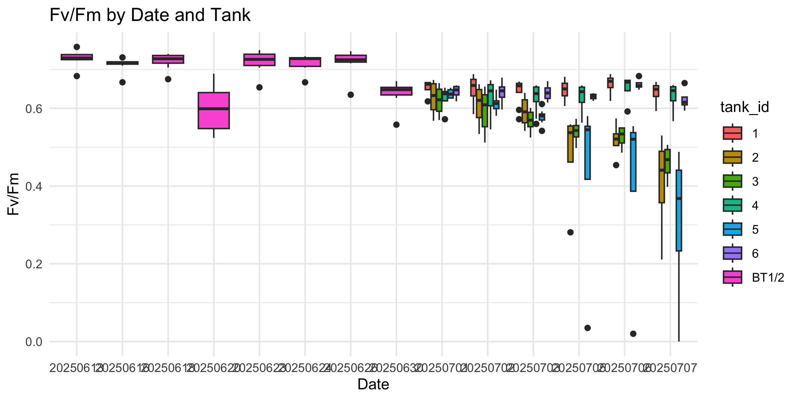

``` r
outlier_dates <- c("20250620")
  
PAM <- PAM %>% filter(!(date %in% outlier_dates))

ggplot(PAM,aes(x = date, y = fv_fm_y_1000)) + 
    geom_boxplot(aes(fill = treatment)) + labs(x = "Date", y = "Fv/Fm", title = "Fv/Fm by Date and Tank") +
  theme_minimal()
```

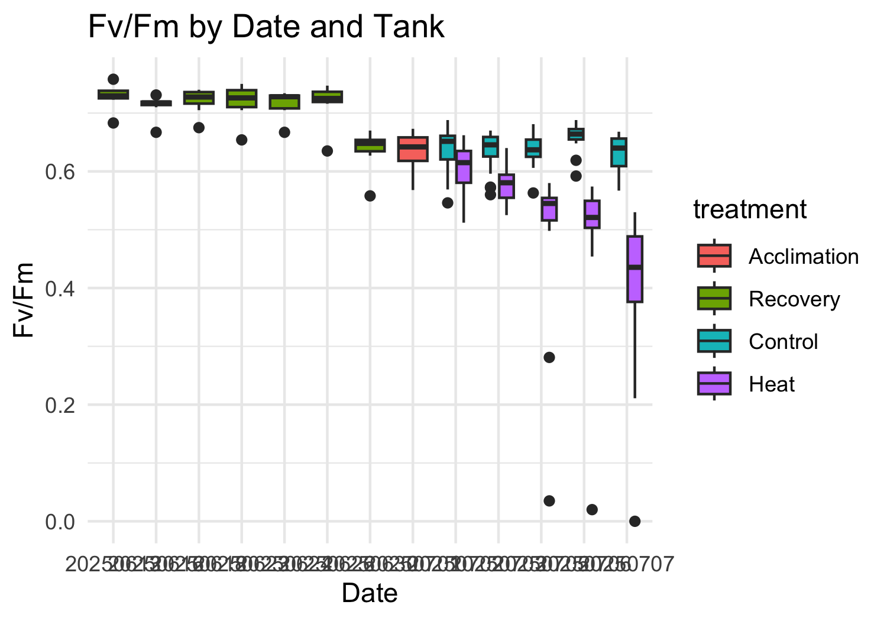

``` r
ggsave("../output/FvFm_recovery_acclimation.png", plot = last_plot(), width = 8, height = 4, bg = "white")
```

``` r
PAM_exp <- PAM %>% filter(treatment!="Acclimation" & treatment!="Recovery") %>% mutate(plug = fct_drop(plug))
table(PAM_exp$plug)
```

    ## 
    ## 1041 1056 1086 1108 1113 1211 1248 1250 1252 1339 1441 1458 1461 1472 1494 1549 
    ##    9    9    9    8    9    9    9    9    9    9    9    9    9    8    9    9 
    ## 1560 1563 1597 1631 1739 2084 2360 2852 
    ##    9    9    9    9    9    9    9    9

``` r
ggplot(PAM_exp,aes(x = timepoint, y = fv_fm_y_1000)) + 
    geom_boxplot(aes(fill = treatment)) +theme_minimal() +scale_fill_manual(values = custom_colors) 
```

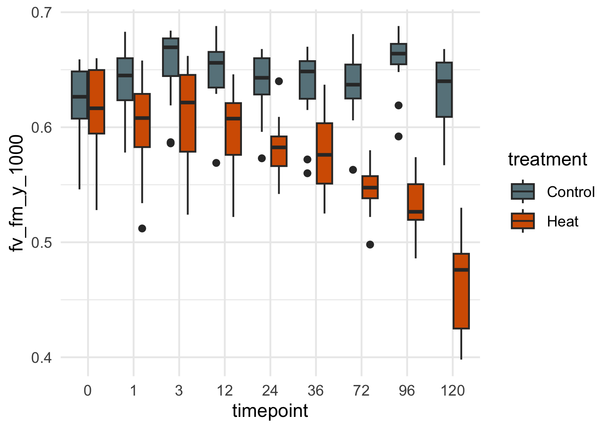

``` r
ggplot(PAM_exp,aes(x = timepoint, y = fv_fm_y_1000, group = plug)) + 
    geom_path(aes(color=plug)) + theme_minimal() #+facet_wrap(tank_id~treatment)
```

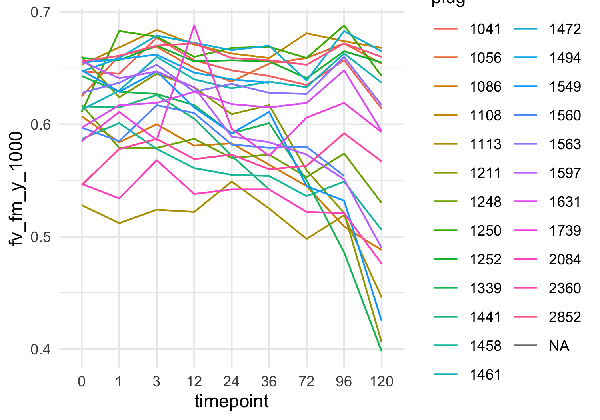

``` r
ggplot(PAM_exp,aes(x = timepoint, y = fv_fm_y_1000, group = plug)) + 
    geom_path(aes(color=tank_id)) + theme_minimal() #+facet_wrap(tank_id~treatment)
```

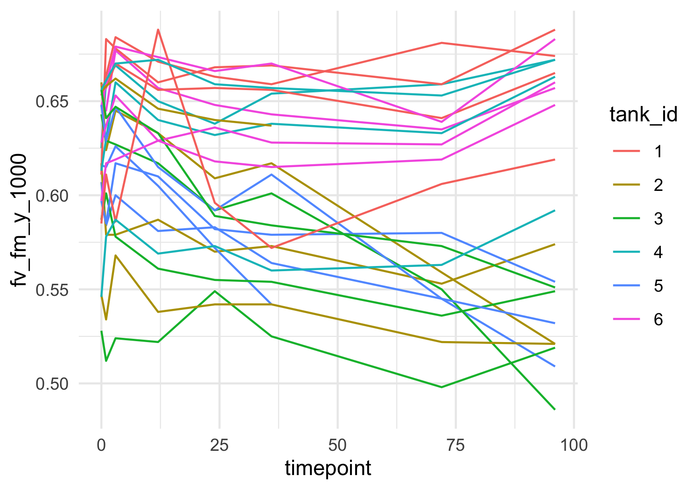

``` r
# mixed model
model <- lm(fv_fm_y_1000 ~ timepoint, data = PAM_exp)
summary(model)
```

    ## 
    ## Call:
    ## lm(formula = fv_fm_y_1000 ~ timepoint, data = PAM_exp)
    ## 
    ## Residuals:
    ##      Min       1Q   Median       3Q      Max 
    ## -0.55012 -0.03336  0.00868  0.04230  0.15742 
    ## 
    ## Coefficients:
    ##                Estimate Std. Error t value Pr(>|t|)    
    ## (Intercept)   0.6178333  0.0187457  32.959  < 2e-16 ***
    ## timepoint1    0.0008623  0.0267970   0.032   0.9744    
    ## timepoint3    0.0135000  0.0265104   0.509   0.6111    
    ## timepoint12   0.0025580  0.0267970   0.095   0.9240    
    ## timepoint24  -0.0082917  0.0265104  -0.313   0.7548    
    ## timepoint36  -0.0115833  0.0265104  -0.437   0.6626    
    ## timepoint72  -0.0598333  0.0265104  -2.257   0.0251 *  
    ## timepoint96  -0.0477083  0.0265104  -1.800   0.0734 .  
    ## timepoint120 -0.1072500  0.0265104  -4.046 7.39e-05 ***
    ## ---
    ## Signif. codes:  0 '***' 0.001 '**' 0.01 '*' 0.05 '.' 0.1 ' ' 1
    ## 
    ## Residual standard error: 0.09183 on 205 degrees of freedom
    ## Multiple R-squared:  0.1471, Adjusted R-squared:  0.1138 
    ## F-statistic:  4.42 on 8 and 205 DF,  p-value: 5.927e-05

``` r
# Estimated marginal means (adjusted for random effects and model structure)
emm <- emmeans(model, ~ timepoint)
pairs(emm)
```

    ##  contrast                    estimate     SE  df t.ratio p.value
    ##  timepoint0 - timepoint1    -0.000862 0.0268 205  -0.032  1.0000
    ##  timepoint0 - timepoint3    -0.013500 0.0265 205  -0.509  0.9999
    ##  timepoint0 - timepoint12   -0.002558 0.0268 205  -0.095  1.0000
    ##  timepoint0 - timepoint24    0.008292 0.0265 205   0.313  1.0000
    ##  timepoint0 - timepoint36    0.011583 0.0265 205   0.437  1.0000
    ##  timepoint0 - timepoint72    0.059833 0.0265 205   2.257  0.3734
    ##  timepoint0 - timepoint96    0.047708 0.0265 205   1.800  0.6824
    ##  timepoint0 - timepoint120   0.107250 0.0265 205   4.046  0.0024
    ##  timepoint1 - timepoint3    -0.012638 0.0268 205  -0.472  0.9999
    ##  timepoint1 - timepoint12   -0.001696 0.0271 205  -0.063  1.0000
    ##  timepoint1 - timepoint24    0.009154 0.0268 205   0.342  1.0000
    ##  timepoint1 - timepoint36    0.012446 0.0268 205   0.464  0.9999
    ##  timepoint1 - timepoint72    0.060696 0.0268 205   2.265  0.3684
    ##  timepoint1 - timepoint96    0.048571 0.0268 205   1.813  0.6739
    ##  timepoint1 - timepoint120   0.108112 0.0268 205   4.034  0.0025
    ##  timepoint3 - timepoint12    0.010942 0.0268 205   0.408  1.0000
    ##  timepoint3 - timepoint24    0.021792 0.0265 205   0.822  0.9961
    ##  timepoint3 - timepoint36    0.025083 0.0265 205   0.946  0.9899
    ##  timepoint3 - timepoint72    0.073333 0.0265 205   2.766  0.1321
    ##  timepoint3 - timepoint96    0.061208 0.0265 205   2.309  0.3417
    ##  timepoint3 - timepoint120   0.120750 0.0265 205   4.555  0.0003
    ##  timepoint12 - timepoint24   0.010850 0.0268 205   0.405  1.0000
    ##  timepoint12 - timepoint36   0.014141 0.0268 205   0.528  0.9998
    ##  timepoint12 - timepoint72   0.062391 0.0268 205   2.328  0.3302
    ##  timepoint12 - timepoint96   0.050266 0.0268 205   1.876  0.6311
    ##  timepoint12 - timepoint120  0.109808 0.0268 205   4.098  0.0019
    ##  timepoint24 - timepoint36   0.003292 0.0265 205   0.124  1.0000
    ##  timepoint24 - timepoint72   0.051542 0.0265 205   1.944  0.5840
    ##  timepoint24 - timepoint96   0.039417 0.0265 205   1.487  0.8606
    ##  timepoint24 - timepoint120  0.098958 0.0265 205   3.733  0.0074
    ##  timepoint36 - timepoint72   0.048250 0.0265 205   1.820  0.6689
    ##  timepoint36 - timepoint96   0.036125 0.0265 205   1.363  0.9104
    ##  timepoint36 - timepoint120  0.095667 0.0265 205   3.609  0.0114
    ##  timepoint72 - timepoint96  -0.012125 0.0265 205  -0.457  0.9999
    ##  timepoint72 - timepoint120  0.047417 0.0265 205   1.789  0.6897
    ##  timepoint96 - timepoint120  0.059542 0.0265 205   2.246  0.3803
    ## 
    ## P value adjustment: tukey method for comparing a family of 9 estimates

## 0.1 Statistical Mixed Model by treatment, timepoint, and tank_id

``` r
# mixed model
model <- lmer(fv_fm_y_1000 ~ treatment * timepoint + (1 | treatment:tank_id), data = PAM_exp)
summary(model)
```

    ## Linear mixed model fit by REML. t-tests use Satterthwaite's method [
    ## lmerModLmerTest]
    ## Formula: fv_fm_y_1000 ~ treatment * timepoint + (1 | treatment:tank_id)
    ##    Data: PAM_exp
    ## 
    ## REML criterion at convergence: -437.5
    ## 
    ## Scaled residuals: 
    ##     Min      1Q  Median      3Q     Max 
    ## -6.4601 -0.2193  0.1405  0.4029  1.9322 
    ## 
    ## Random effects:
    ##  Groups            Name        Variance  Std.Dev.
    ##  treatment:tank_id (Intercept) 7.338e-05 0.008566
    ##  Residual                      4.961e-03 0.070436
    ## Number of obs: 214, groups:  treatment:tank_id, 6
    ## 
    ## Fixed effects:
    ##                              Estimate Std. Error         df t value Pr(>|t|)
    ## (Intercept)                  0.622250   0.020926  98.476538  29.736  < 2e-16
    ## treatmentHeat               -0.008833   0.029594  98.476538  -0.298 0.765960
    ## timepoint1                   0.017917   0.029406 192.260382   0.609 0.543049
    ## timepoint3                   0.030417   0.028755 192.040112   1.058 0.291485
    ## timepoint12                  0.025128   0.029406 192.260382   0.855 0.393881
    ## timepoint24                  0.015583   0.028755 192.040112   0.542 0.588494
    ## timepoint36                  0.012833   0.028755 192.040112   0.446 0.655886
    ## timepoint72                  0.012333   0.028755 192.040112   0.429 0.668471
    ## timepoint96                  0.035500   0.028755 192.040112   1.235 0.218503
    ## timepoint120                 0.008333   0.028755 192.040112   0.290 0.772280
    ## treatmentHeat:timepoint1    -0.032084   0.041129 192.153451  -0.780 0.436306
    ## treatmentHeat:timepoint3    -0.033833   0.040666 192.040112  -0.832 0.406453
    ## treatmentHeat:timepoint12   -0.042878   0.041129 192.153451  -1.043 0.298475
    ## treatmentHeat:timepoint24   -0.047750   0.040666 192.040112  -1.174 0.241769
    ## treatmentHeat:timepoint36   -0.048833   0.040666 192.040112  -1.201 0.231292
    ## treatmentHeat:timepoint72   -0.144333   0.040666 192.040112  -3.549 0.000486
    ## treatmentHeat:timepoint96   -0.166417   0.040666 192.040112  -4.092 6.28e-05
    ## treatmentHeat:timepoint120  -0.231167   0.040666 192.040112  -5.685 4.82e-08
    ##                               
    ## (Intercept)                ***
    ## treatmentHeat                 
    ## timepoint1                    
    ## timepoint3                    
    ## timepoint12                   
    ## timepoint24                   
    ## timepoint36                   
    ## timepoint72                   
    ## timepoint96                   
    ## timepoint120                  
    ## treatmentHeat:timepoint1      
    ## treatmentHeat:timepoint3      
    ## treatmentHeat:timepoint12     
    ## treatmentHeat:timepoint24     
    ## treatmentHeat:timepoint36     
    ## treatmentHeat:timepoint72  ***
    ## treatmentHeat:timepoint96  ***
    ## treatmentHeat:timepoint120 ***
    ## ---
    ## Signif. codes:  0 '***' 0.001 '**' 0.01 '*' 0.05 '.' 0.1 ' ' 1

``` r
# Estimated marginal means (adjusted for random effects and model structure)
emm <- emmeans(model, ~ treatment | timepoint)
pairs(emm)
```

    ## timepoint = 0:
    ##  contrast       estimate     SE  df t.ratio p.value
    ##  Control - Heat  0.00883 0.0296  98   0.298  0.7660
    ## 
    ## timepoint = 1:
    ##  contrast       estimate     SE  df t.ratio p.value
    ##  Control - Heat  0.04092 0.0302 102   1.353  0.1789
    ## 
    ## timepoint = 3:
    ##  contrast       estimate     SE  df t.ratio p.value
    ##  Control - Heat  0.04267 0.0296  98   1.442  0.1526
    ## 
    ## timepoint = 12:
    ##  contrast       estimate     SE  df t.ratio p.value
    ##  Control - Heat  0.05171 0.0302 102   1.710  0.0902
    ## 
    ## timepoint = 24:
    ##  contrast       estimate     SE  df t.ratio p.value
    ##  Control - Heat  0.05658 0.0296  98   1.912  0.0588
    ## 
    ## timepoint = 36:
    ##  contrast       estimate     SE  df t.ratio p.value
    ##  Control - Heat  0.05767 0.0296  98   1.949  0.0542
    ## 
    ## timepoint = 72:
    ##  contrast       estimate     SE  df t.ratio p.value
    ##  Control - Heat  0.15317 0.0296  98   5.176  <.0001
    ## 
    ## timepoint = 96:
    ##  contrast       estimate     SE  df t.ratio p.value
    ##  Control - Heat  0.17525 0.0296  98   5.922  <.0001
    ## 
    ## timepoint = 120:
    ##  contrast       estimate     SE  df t.ratio p.value
    ##  Control - Heat  0.24000 0.0296  98   8.110  <.0001
    ## 
    ## Degrees-of-freedom method: kenward-roger

``` r
summary_table <- as.data.frame(pairs(emm)) %>%
  transmute(
    Timepoint = as.numeric(as.character(timepoint)),
    `Estimate (Control-Heat)` = round(estimate, 4),
    `SE` = round(SE, 4),
    `t-ratio` = round(t.ratio, 2),
    `p-value` = signif(p.value, 3),
    `Significant?` = case_when(
      p.value < 0.001 ~ "***",
      p.value < 0.01 ~ "**",
      p.value < 0.05 ~ "*",
      p.value < 0.1 ~ ".",
      TRUE ~ ""
    )
  )

print(summary_table)
```

    ##   Timepoint Estimate (Control-Heat)     SE t-ratio  p-value Significant?
    ## 1         0                  0.0088 0.0296    0.30 7.66e-01             
    ## 2         1                  0.0409 0.0302    1.35 1.79e-01             
    ## 3         3                  0.0427 0.0296    1.44 1.53e-01             
    ## 4        12                  0.0517 0.0302    1.71 9.02e-02            .
    ## 5        24                  0.0566 0.0296    1.91 5.88e-02            .
    ## 6        36                  0.0577 0.0296    1.95 5.42e-02            .
    ## 7        72                  0.1532 0.0296    5.18 1.21e-06          ***
    ## 8        96                  0.1753 0.0296    5.92 4.72e-08          ***
    ## 9       120                  0.2400 0.0296    8.11 1.48e-12          ***

``` r
write.csv(summary_table, "../output/FvFm_treatment_effect_summary.csv", row.names = FALSE)
```

``` r
contrast_table <- as.data.frame(pairs(emm)) %>%
  mutate(
    timepoint = as.numeric(as.character(timepoint)),
    signif = case_when(
      p.value < 0.001 ~ "***",
      p.value < 0.01 ~ "**",
      p.value < 0.05 ~ "*",
      p.value < 0.1 ~ ".",
      TRUE ~ ""
    )
  )

ggplot(contrast_table, aes(x = timepoint, y = estimate)) +
  geom_errorbar(aes(ymin = estimate - SE, ymax = estimate + SE),width = 3, alpha = 0.6) +
  geom_line(size = 1, aes(group = 1), color = "black", alpha = 0.7) +
  geom_point(size = 2.5, aes(color = p.value < 0.05)) +
  geom_text(aes(label = signif), vjust = -2.5, size = 5, fontface = "bold", color = "black") +
  scale_color_manual(values = c("TRUE" = "#D55E00", "FALSE" = "grey60"), name = "p < 0.05") +
  labs(
    title = "Estimated Treatment Effect (Control-Heat) on Fv/Fm",
    x = "Timepoint (h)",
    y = "Estimated Difference in Fv/Fm") +
  theme_minimal() +
  theme(panel.grid.minor = element_blank(),panel.grid.major.x = element_blank())
```

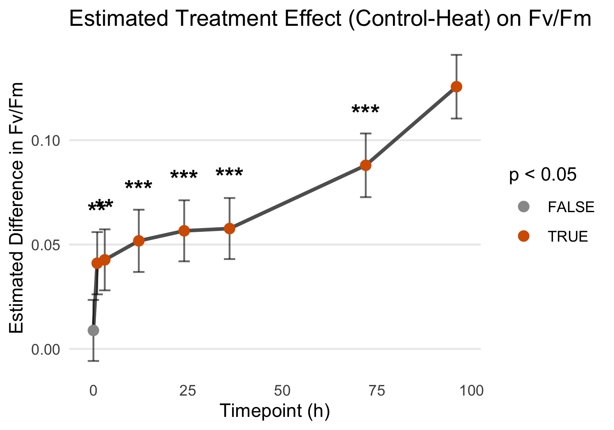

``` r
ggsave("../output/FvFm_line_treatment_tank_modelestimates.png", plot = last_plot(), width = 8, height = 4, bg = "white")
ggsave("../output/pdf_figs/FvFm_line_treatment_tank_modelestimates.pdf", plot = last_plot(), width = 8, height = 4)
```

``` r
PAM_means_treatment <- PAM_exp %>%
  group_by(date, timepoint, treatment) %>%
  summarise(
    FvFm_mean = mean(fv_fm_y_1000, na.rm = TRUE),
    FvFm_SE = sd(fv_fm_y_1000, na.rm = TRUE) / sqrt(n()),
    .groups = 'drop'
  )

ggplot(PAM_means_treatment, aes(x = timepoint, y = FvFm_mean, color = treatment,group = treatment)) +
  geom_point(size = 2.5) +
  geom_errorbar(aes(ymin = FvFm_mean - FvFm_SE, ymax = FvFm_mean + FvFm_SE),
                width = 0.2) +
  geom_line(stat = "summary", fun = mean, size = 1.2, aes(group = treatment)) +
  labs(x = "Timepoint",y = "Mean Fv/Fm") +
  theme_minimal() +scale_color_manual(values = custom_colors)
```

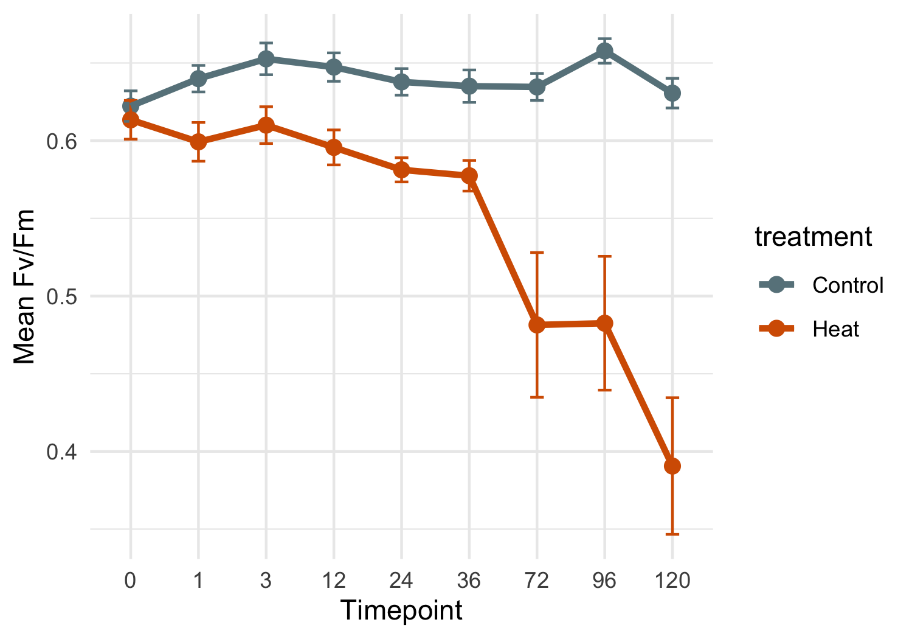

``` r
PAM_means <- PAM_exp %>%
  group_by(date, timepoint, treatment, tank_id) %>%
  summarise(
    FvFm_mean = mean(fv_fm_y_1000, na.rm = TRUE),
    FvFm_SE = sd(fv_fm_y_1000, na.rm = TRUE) / sqrt(n()),
    .groups = 'drop'
  )

ggplot(PAM_means, aes(x = timepoint, y = FvFm_mean, color = treatment, shape = tank_id)) +
  geom_point(stat = "summary", fun = mean, aes(group = treatment), size=2.5) +
  geom_point(position = position_dodge(width = 0.5), size = 2.5, alpha=0.5) +
  geom_errorbar(aes(ymin = FvFm_mean - FvFm_SE, ymax = FvFm_mean + FvFm_SE),
                width = 0.2, position = position_dodge(width = 0.5), alpha=0.5) +
  geom_line(stat = "summary", fun = mean, size = 1.2, aes(group = treatment)) +
  labs(x = "Timepoint",y = "Mean Fv/Fm") +
  theme_minimal() +scale_color_manual(values = custom_colors) +
  stat_compare_means(aes(group = treatment),method = "anova",label = "p.format",size = 2.5)
```

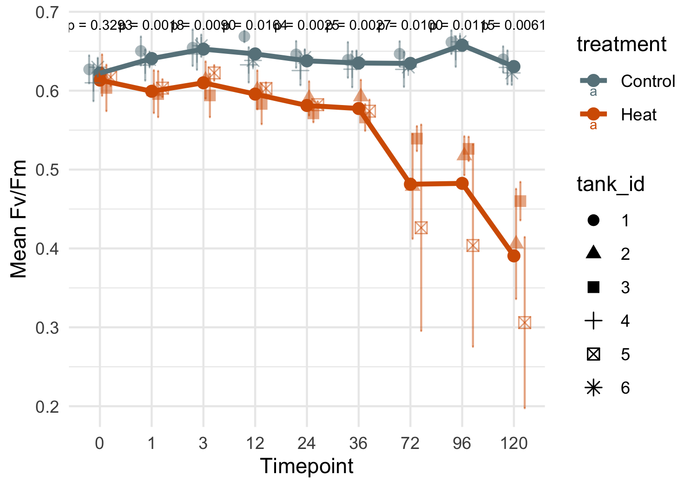

``` r
ggsave("../output/FvFm_line_treatment_tank_means.png", plot = last_plot(), width = 8, height = 4, bg = "white")
ggsave("../output/pdf_figs/FvFm_line_treatment_tank_means.pdf", plot = last_plot(), width = 8, height = 4)

ggplot(PAM_exp, aes(x = timepoint, y = fv_fm_y_1000, color = treatment, shape = tank_id)) +
  geom_point(stat = "summary", fun = mean, aes(group = treatment), size=2.5) +
  geom_point(position = position_dodge(width = 0.5), size = 2.5, alpha=0.5) +
  geom_line(stat = "summary", fun = mean, size = 1.2, aes(group = treatment)) +
  labs(x = "Timepoint",y = "Mean Fv/Fm") +
  theme_minimal() +scale_color_manual(values = custom_colors) +
  stat_compare_means(aes(group = treatment),method = "anova",label = "p.format",size = 3)
```

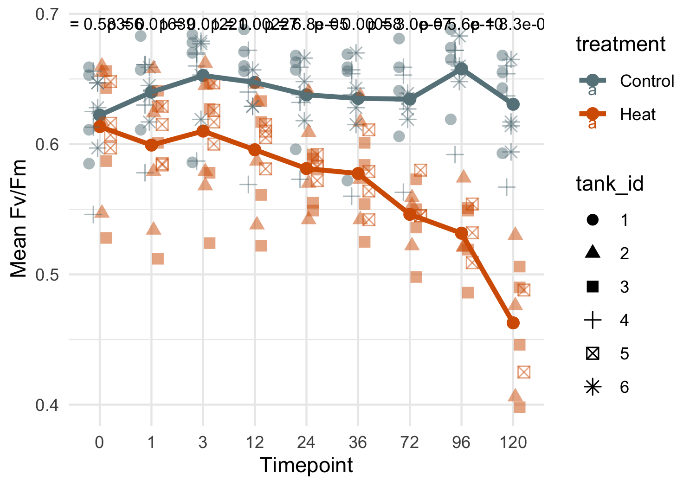

``` r
ggsave("../output/FvFm_line_treatment_all_points.png", plot = last_plot(), width = 8, height = 4, bg = "white")
ggsave("../output/pdf_figs/FvFm_line_treatment_all_points.pdf", plot = last_plot(), width = 8, height = 4)

ggplot(PAM_means, aes(x = timepoint, y = FvFm_mean, color = tank_id, group = tank_id)) +
  geom_line(size = 0.8, alpha = 0.7) +
  labs(x = "Timepoint",y = "Mean Fv/Fm") +
  theme_minimal() + facet_wrap(~treatment)
```


``` r
PAM_exp %>% filter(dark_adapt_mins != "overnight") %>% ggplot(aes(x = dark_adapt_mins, y = fv_fm_y_1000)) + 
    geom_point(aes(color=treatment)) +
  geom_smooth(aes(group = treatment, color = treatment), method = "lm", se = FALSE) +  # or method = "loess"
  theme_minimal() + scale_color_manual(values = custom_colors)
```


## 0.2 Outliers

``` r
ggplot(PAM_exp, aes(x = timepoint, y = fv_fm_y_1000, color = treatment)) +
  geom_boxplot(outlier.colour = "red", outlier.shape = 8) 
```

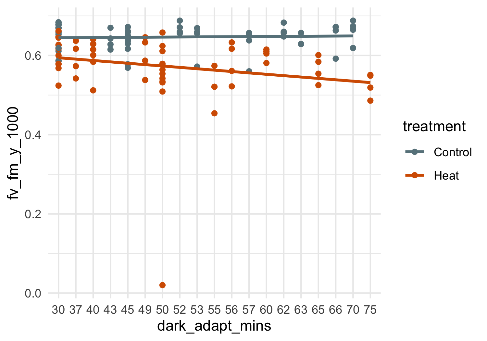

``` r
ggplot(PAM_exp, aes(x = treatment, y = fv_fm_y_1000)) +
  geom_boxplot(outlier.colour = "red", outlier.shape = 8) 
```

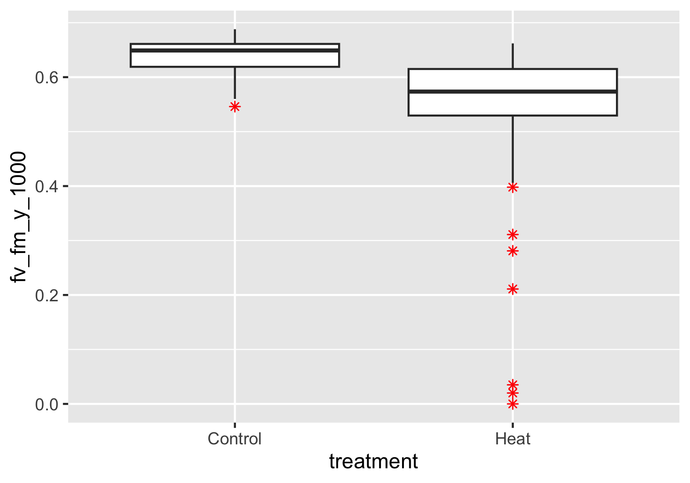

### 0.2.1 Remove outliers via IQR

``` r
# IQR method 
Q1 <- quantile(PAM_exp$fv_fm_y_1000, 0.25)
Q3 <- quantile(PAM_exp$fv_fm_y_1000, 0.75)
IQR_val <- Q3 - Q1

lower_bound <- Q1 - 1.5 * IQR_val
upper_bound <- Q3 + 1.5 * IQR_val
outliers <- PAM_exp[PAM_exp$fv_fm_y_1000 < lower_bound | PAM_exp$fv_fm_y_1000 > upper_bound, ]
print(outliers)
```

    ##         date treatment timepoint tank_id  time initials dark_adapt_mins plug
    ## 158 20250705      Heat        72       2 08:36       ZD       overnight 1494
    ## 162 20250705      Heat        72       5 08:42       ZD       overnight 1441
    ## 168 20250706      Heat        96       5 10:37       ZD              50 1441
    ## 196 20250707      Heat       120       2 07:50       ZD       overnight 1494
    ## 197 20250707      Heat       120       2 07:50       ZD       overnight 1211
    ## 206 20250707      Heat       120       3 07:50       ZD       overnight 1339
    ## 207 20250707      Heat       120       5 07:50       ZD       overnight 1549
    ## 208 20250707      Heat       120       5 07:50       ZD       overnight 1560
    ## 209 20250707      Heat       120       5 07:50       ZD       overnight 1441
    ##      mem fluorescence_yield_f max_fluorescence_yield_m_fm yield_y fv_fm_y_1000
    ## 158 3242                  619                         861     281        0.281
    ## 162 3245                  189                         196      35        0.035
    ## 168 3273                  537                         548      20        0.020
    ## 196 3319                  258                         327     211        0.211
    ## 197 3320                  241                         406     406        0.406
    ## 206 3330                  251                         417     398        0.398
    ## 207 3331                  304                         529     425        0.425
    ## 208 3336                  425                         617     311        0.311
    ## 209 3333                  510                         505       0        0.000
    ##                                                                                                                                                                                                                       notes
    ## 158                                                                                                                                                                               tissue sloughing off; looks dead or dying
    ## 162                                                                                                                                                                                                         looks very dead
    ## 168                                                                                                                                                                                                                        
    ## 196                                                                                                                                                                                                                        
    ## 197                                                                                                                                                                                                                        
    ## 206                                                                                                                                                                                                                        
    ## 207                                                                                                                                                                                                                        
    ## 208 When originally measured, had super high Fo values, possibly due to reading over a skeleton area where tissue was gone and high concentration of endoliths (very green skeleton). This reading was on the tissue itself
    ## 209

``` r
# Filter dataset to remove outliers
PAM_exp_filtered_IQR <- PAM_exp[PAM_exp$fv_fm_y_1000 >= lower_bound & PAM_exp$fv_fm_y_1000 <= upper_bound, ]

# Check dimensions before and after
dim(PAM_exp)
```

    ## [1] 214  14

``` r
dim(PAM_exp_filtered_IQR)
```

    ## [1] 205  14

``` r
table(PAM_exp_filtered_IQR$plug)
```

    ## 
    ## 1041 1056 1086 1108 1113 1211 1248 1250 1252 1339 1441 1458 1461 1472 1494 1549 
    ##    9    9    9    8    9    8    9    9    9    8    6    9    9    8    7    8 
    ## 1560 1563 1597 1631 1739 2084 2360 2852 
    ##    8    9    9    9    9    9    9    9

``` r
ggplot(PAM_exp_filtered_IQR,aes(x = timepoint, y = fv_fm_y_1000)) + 
    geom_boxplot(aes(fill = treatment)) +theme_minimal() +scale_fill_manual(values = custom_colors) 
```

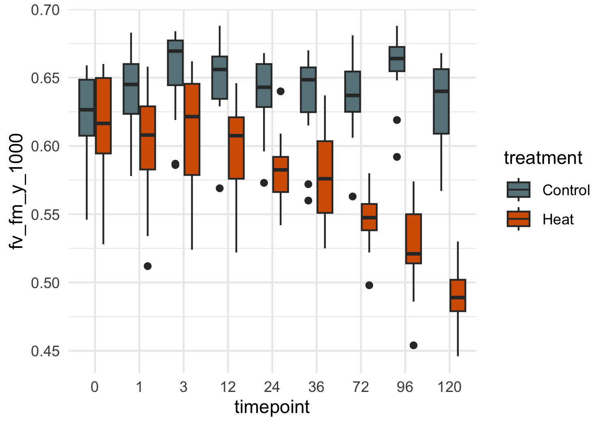

``` r
ggplot(PAM_exp_filtered_IQR,aes(x = timepoint, y = fv_fm_y_1000, group = plug)) + 
    geom_path(aes(color=plug)) + theme_minimal() #+facet_wrap(tank_id~treatment)
```

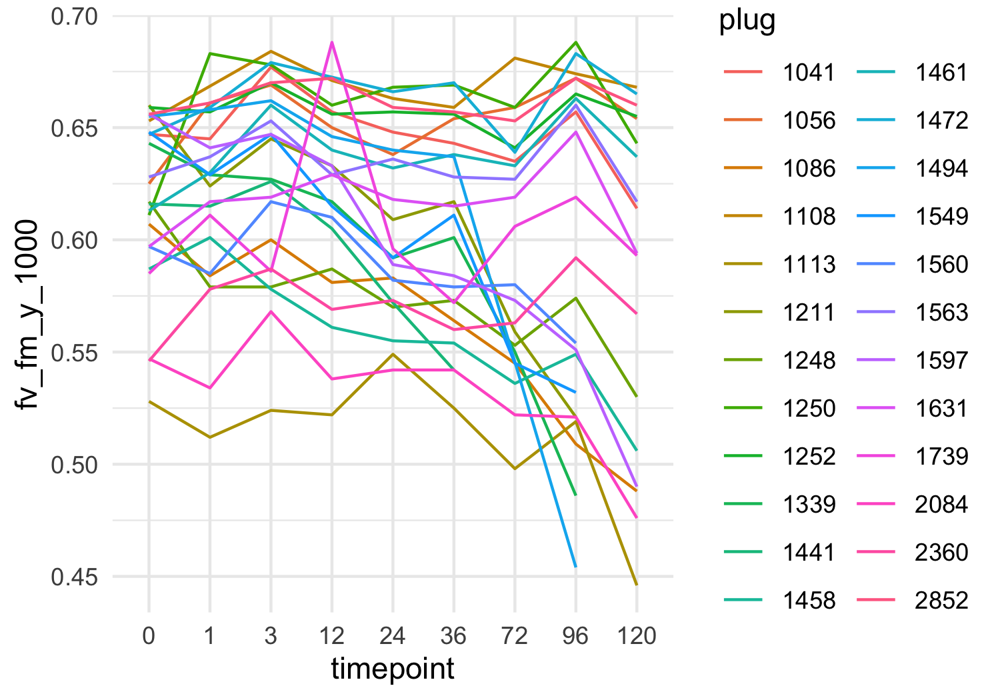

``` r
ggplot(PAM_exp_filtered_IQR,aes(x = timepoint, y = fv_fm_y_1000, group = plug)) + 
    geom_path(aes(color=tank_id)) + theme_minimal() #+facet_wrap(tank_id~treatment)
```

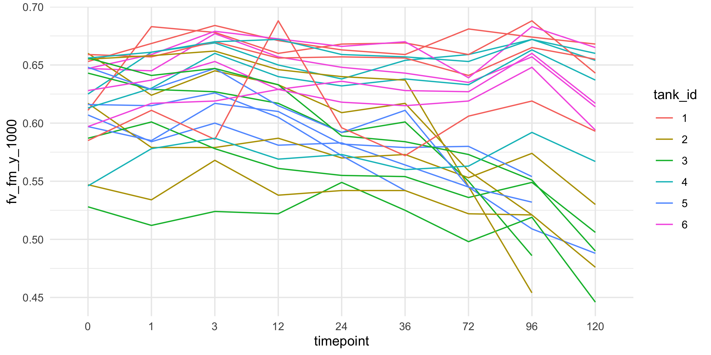

``` r
# mixed model
model <- lm(fv_fm_y_1000 ~ timepoint, data = PAM_exp_filtered_IQR)
summary(model)
```

    ## 
    ## Call:
    ## lm(formula = fv_fm_y_1000 ~ timepoint, data = PAM_exp_filtered_IQR)
    ## 
    ## Residuals:
    ##       Min        1Q    Median        3Q       Max 
    ## -0.140043 -0.037542  0.008609  0.038667  0.093957 
    ## 
    ## Coefficients:
    ##                Estimate Std. Error t value Pr(>|t|)    
    ## (Intercept)   0.6178333  0.0104819  58.943   <2e-16 ***
    ## timepoint1    0.0008623  0.0149839   0.058   0.9542    
    ## timepoint3    0.0135000  0.0148236   0.911   0.3636    
    ## timepoint12   0.0025580  0.0149839   0.171   0.8646    
    ## timepoint24  -0.0082917  0.0148236  -0.559   0.5766    
    ## timepoint36  -0.0115833  0.0148236  -0.781   0.4355    
    ## timepoint72  -0.0234697  0.0151568  -1.548   0.1231    
    ## timepoint96  -0.0237899  0.0149839  -1.588   0.1140    
    ## timepoint120 -0.0343333  0.0160113  -2.144   0.0332 *  
    ## ---
    ## Signif. codes:  0 '***' 0.001 '**' 0.01 '*' 0.05 '.' 0.1 ' ' 1
    ## 
    ## Residual standard error: 0.05135 on 196 degrees of freedom
    ## Multiple R-squared:  0.07304,    Adjusted R-squared:  0.03521 
    ## F-statistic: 1.931 on 8 and 196 DF,  p-value: 0.05739

``` r
# Estimated marginal means (adjusted for random effects and model structure)
emm <- emmeans(model, ~ timepoint)
pairs(emm)
```

    ##  contrast                    estimate     SE  df t.ratio p.value
    ##  timepoint0 - timepoint1    -0.000862 0.0150 196  -0.058  1.0000
    ##  timepoint0 - timepoint3    -0.013500 0.0148 196  -0.911  0.9922
    ##  timepoint0 - timepoint12   -0.002558 0.0150 196  -0.171  1.0000
    ##  timepoint0 - timepoint24    0.008292 0.0148 196   0.559  0.9998
    ##  timepoint0 - timepoint36    0.011583 0.0148 196   0.781  0.9973
    ##  timepoint0 - timepoint72    0.023470 0.0152 196   1.548  0.8309
    ##  timepoint0 - timepoint96    0.023790 0.0150 196   1.588  0.8105
    ##  timepoint0 - timepoint120   0.034333 0.0160 196   2.144  0.4465
    ##  timepoint1 - timepoint3    -0.012638 0.0150 196  -0.843  0.9953
    ##  timepoint1 - timepoint12   -0.001696 0.0151 196  -0.112  1.0000
    ##  timepoint1 - timepoint24    0.009154 0.0150 196   0.611  0.9995
    ##  timepoint1 - timepoint36    0.012446 0.0150 196   0.831  0.9958
    ##  timepoint1 - timepoint72    0.024332 0.0153 196   1.589  0.8099
    ##  timepoint1 - timepoint96    0.024652 0.0151 196   1.628  0.7883
    ##  timepoint1 - timepoint120   0.035196 0.0162 196   2.178  0.4242
    ##  timepoint3 - timepoint12    0.010942 0.0150 196   0.730  0.9983
    ##  timepoint3 - timepoint24    0.021792 0.0148 196   1.470  0.8680
    ##  timepoint3 - timepoint36    0.025083 0.0148 196   1.692  0.7507
    ##  timepoint3 - timepoint72    0.036970 0.0152 196   2.439  0.2690
    ##  timepoint3 - timepoint96    0.037290 0.0150 196   2.489  0.2440
    ##  timepoint3 - timepoint120   0.047833 0.0160 196   2.987  0.0756
    ##  timepoint12 - timepoint24   0.010850 0.0150 196   0.724  0.9984
    ##  timepoint12 - timepoint36   0.014141 0.0150 196   0.944  0.9901
    ##  timepoint12 - timepoint72   0.026028 0.0153 196   1.700  0.7461
    ##  timepoint12 - timepoint96   0.026348 0.0151 196   1.740  0.7210
    ##  timepoint12 - timepoint120  0.036891 0.0162 196   2.283  0.3576
    ##  timepoint24 - timepoint36   0.003292 0.0148 196   0.222  1.0000
    ##  timepoint24 - timepoint72   0.015178 0.0152 196   1.001  0.9854
    ##  timepoint24 - timepoint96   0.015498 0.0150 196   1.034  0.9821
    ##  timepoint24 - timepoint120  0.026042 0.0160 196   1.626  0.7892
    ##  timepoint36 - timepoint72   0.011886 0.0152 196   0.784  0.9972
    ##  timepoint36 - timepoint96   0.012207 0.0150 196   0.815  0.9963
    ##  timepoint36 - timepoint120  0.022750 0.0160 196   1.421  0.8886
    ##  timepoint72 - timepoint96   0.000320 0.0153 196   0.021  1.0000
    ##  timepoint72 - timepoint120  0.010864 0.0163 196   0.666  0.9991
    ##  timepoint96 - timepoint120  0.010543 0.0162 196   0.652  0.9992
    ## 
    ## P value adjustment: tukey method for comparing a family of 9 estimates

## 0.3 Statistical Mixed Model by treatment, timepoint, and tank_id

``` r
# mixed model
model <- lmer(fv_fm_y_1000 ~ treatment * timepoint + (1 | treatment:tank_id), data = PAM_exp_filtered_IQR)
summary(model)
```

    ## Linear mixed model fit by REML. t-tests use Satterthwaite's method [
    ## lmerModLmerTest]
    ## Formula: fv_fm_y_1000 ~ treatment * timepoint + (1 | treatment:tank_id)
    ##    Data: PAM_exp_filtered_IQR
    ## 
    ## REML criterion at convergence: -690.8
    ## 
    ## Scaled residuals: 
    ##     Min      1Q  Median      3Q     Max 
    ## -2.4567 -0.5347  0.1475  0.7461  1.7035 
    ## 
    ## Random effects:
    ##  Groups            Name        Variance  Std.Dev.
    ##  treatment:tank_id (Intercept) 3.349e-05 0.005787
    ##  Residual                      1.136e-03 0.033710
    ## Number of obs: 205, groups:  treatment:tank_id, 6
    ## 
    ## Fixed effects:
    ##                              Estimate Std. Error         df t value Pr(>|t|)
    ## (Intercept)                  0.622250   0.010289  69.770599  60.477  < 2e-16
    ## treatmentHeat               -0.008833   0.014551  69.770599  -0.607 0.545778
    ## timepoint1                   0.018042   0.014075 183.234733   1.282 0.201499
    ## timepoint3                   0.030417   0.013762 183.074652   2.210 0.028334
    ## timepoint12                  0.025134   0.014075 183.234733   1.786 0.075790
    ## timepoint24                  0.015583   0.013762 183.074652   1.132 0.258978
    ## timepoint36                  0.012833   0.013762 183.074652   0.933 0.352304
    ## timepoint72                  0.012333   0.013762 183.074652   0.896 0.371337
    ## timepoint96                  0.035500   0.013762 183.074652   2.580 0.010678
    ## timepoint120                 0.008333   0.013762 183.074652   0.606 0.545582
    ## treatmentHeat:timepoint1    -0.032209   0.019685 183.156880  -1.636 0.103510
    ## treatmentHeat:timepoint3    -0.033833   0.019463 183.074652  -1.738 0.083828
    ## treatmentHeat:timepoint12   -0.042884   0.019685 183.156880  -2.179 0.030644
    ## treatmentHeat:timepoint24   -0.047750   0.019463 183.074652  -2.453 0.015087
    ## treatmentHeat:timepoint36   -0.048833   0.019463 183.074652  -2.509 0.012973
    ## treatmentHeat:timepoint72   -0.079207   0.019946 183.175598  -3.971 0.000103
    ## treatmentHeat:timepoint96   -0.124164   0.019685 183.165627  -6.308 2.07e-09
    ## treatmentHeat:timepoint120  -0.131299   0.021782 183.775999  -6.028 8.90e-09
    ##                               
    ## (Intercept)                ***
    ## treatmentHeat                 
    ## timepoint1                    
    ## timepoint3                 *  
    ## timepoint12                .  
    ## timepoint24                   
    ## timepoint36                   
    ## timepoint72                   
    ## timepoint96                *  
    ## timepoint120                  
    ## treatmentHeat:timepoint1      
    ## treatmentHeat:timepoint3   .  
    ## treatmentHeat:timepoint12  *  
    ## treatmentHeat:timepoint24  *  
    ## treatmentHeat:timepoint36  *  
    ## treatmentHeat:timepoint72  ***
    ## treatmentHeat:timepoint96  ***
    ## treatmentHeat:timepoint120 ***
    ## ---
    ## Signif. codes:  0 '***' 0.001 '**' 0.01 '*' 0.05 '.' 0.1 ' ' 1

``` r
# Estimated marginal means (adjusted for random effects and model structure)
emm <- emmeans(model, ~ treatment | timepoint)
pairs(emm)
```

    ## timepoint = 0:
    ##  contrast       estimate     SE    df t.ratio p.value
    ##  Control - Heat  0.00883 0.0146  69.0   0.607  0.5458
    ## 
    ## timepoint = 1:
    ##  contrast       estimate     SE    df t.ratio p.value
    ##  Control - Heat  0.04104 0.0148  72.7   2.764  0.0072
    ## 
    ## timepoint = 3:
    ##  contrast       estimate     SE    df t.ratio p.value
    ##  Control - Heat  0.04267 0.0146  69.0   2.932  0.0046
    ## 
    ## timepoint = 12:
    ##  contrast       estimate     SE    df t.ratio p.value
    ##  Control - Heat  0.05172 0.0148  72.7   3.483  0.0008
    ## 
    ## timepoint = 24:
    ##  contrast       estimate     SE    df t.ratio p.value
    ##  Control - Heat  0.05658 0.0146  69.0   3.889  0.0002
    ## 
    ## timepoint = 36:
    ##  contrast       estimate     SE    df t.ratio p.value
    ##  Control - Heat  0.05767 0.0146  69.0   3.963  0.0002
    ## 
    ## timepoint = 72:
    ##  contrast       estimate     SE    df t.ratio p.value
    ##  Control - Heat  0.08804 0.0152  77.3   5.794  <.0001
    ## 
    ## timepoint = 96:
    ##  contrast       estimate     SE    df t.ratio p.value
    ##  Control - Heat  0.13300 0.0149  72.7   8.956  <.0001
    ## 
    ## timepoint = 120:
    ##  contrast       estimate     SE    df t.ratio p.value
    ##  Control - Heat  0.14013 0.0176 105.7   7.980  <.0001
    ## 
    ## Degrees-of-freedom method: kenward-roger

``` r
summary_table <- as.data.frame(pairs(emm)) %>%
  transmute(
    Timepoint = as.numeric(as.character(timepoint)),
    `Estimate (Control-Heat)` = round(estimate, 4),
    `SE` = round(SE, 4),
    `t-ratio` = round(t.ratio, 2),
    `p-value` = signif(p.value, 3),
    `Significant?` = case_when(
      p.value < 0.001 ~ "***",
      p.value < 0.01 ~ "**",
      p.value < 0.05 ~ "*",
      p.value < 0.1 ~ ".",
      TRUE ~ ""
    )
  )

print(summary_table)
```

    ##   Timepoint Estimate (Control-Heat)     SE t-ratio  p-value Significant?
    ## 1         0                  0.0088 0.0146    0.61 5.46e-01             
    ## 2         1                  0.0410 0.0148    2.76 7.23e-03           **
    ## 3         3                  0.0427 0.0146    2.93 4.56e-03           **
    ## 4        12                  0.0517 0.0148    3.48 8.44e-04          ***
    ## 5        24                  0.0566 0.0146    3.89 2.29e-04          ***
    ## 6        36                  0.0577 0.0146    3.96 1.78e-04          ***
    ## 7        72                  0.0880 0.0152    5.79 1.41e-07          ***
    ## 8        96                  0.1330 0.0149    8.96 2.33e-13          ***
    ## 9       120                  0.1401 0.0176    7.98 1.87e-12          ***

``` r
write.csv(summary_table, "../output/FvFm_treatment_effect_summary.csv", row.names = FALSE)
```

``` r
contrast_table <- as.data.frame(pairs(emm)) %>%
  mutate(
    timepoint = as.numeric(as.character(timepoint)),
    signif = case_when(
      p.value < 0.001 ~ "***",
      p.value < 0.01 ~ "**",
      p.value < 0.05 ~ "*",
      p.value < 0.1 ~ ".",
      TRUE ~ ""
    )
  )

ggplot(contrast_table, aes(x = timepoint, y = estimate)) +
  geom_errorbar(aes(ymin = estimate - SE, ymax = estimate + SE),width = 3, alpha = 0.6) +
  geom_line(size = 1, aes(group = 1), color = "black", alpha = 0.7) +
  geom_point(size = 2.5, aes(color = p.value < 0.05)) +
  geom_text(aes(label = signif), vjust = -2.5, size = 5, fontface = "bold", color = "black") +
  scale_color_manual(values = c("TRUE" = "#D55E00", "FALSE" = "grey60"), name = "p < 0.05") +
  labs(
    title = "Estimated Treatment Effect (Control-Heat) on Fv/Fm",
    x = "Timepoint (h)",
    y = "Estimated Difference in Fv/Fm") +
  theme_minimal() +
  theme(panel.grid.minor = element_blank(),panel.grid.major.x = element_blank())
```

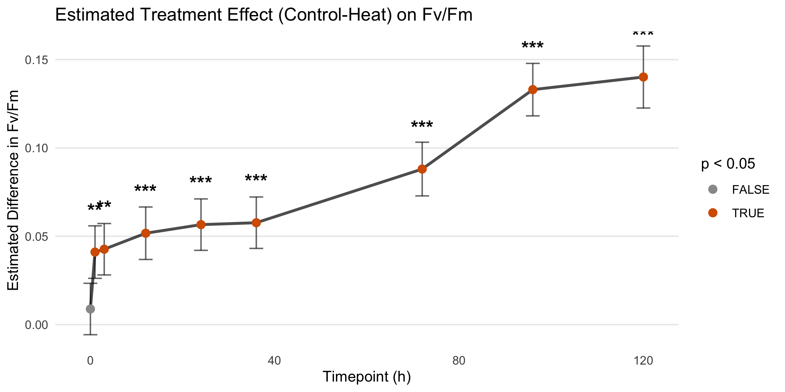

``` r
ggsave("../output/FvFm_line_treatment_tank_modelestimates.png", plot = last_plot(), width = 8, height = 4, bg = "white")
ggsave("../output/pdf_figs/FvFm_line_treatment_tank_modelestimates.pdf", plot = last_plot(), width = 8, height = 4)
```

``` r
PAM_means_treatment <- PAM_exp_filtered_IQR %>%
  group_by(date, timepoint, treatment) %>%
  summarise(
    FvFm_mean = mean(fv_fm_y_1000, na.rm = TRUE),
    FvFm_SE = sd(fv_fm_y_1000, na.rm = TRUE) / sqrt(n()),
    .groups = 'drop'
  )

ggplot(PAM_means_treatment, aes(x = timepoint, y = FvFm_mean, color = treatment,group = treatment)) +
  geom_point(size = 2.5) +
  geom_errorbar(aes(ymin = FvFm_mean - FvFm_SE, ymax = FvFm_mean + FvFm_SE),
                width = 0.2) +
  geom_line(stat = "summary", fun = mean, size = 1.2, aes(group = treatment)) +
  labs(x = "Timepoint",y = "Mean Fv/Fm") +
  theme_minimal() +scale_color_manual(values = custom_colors)
```

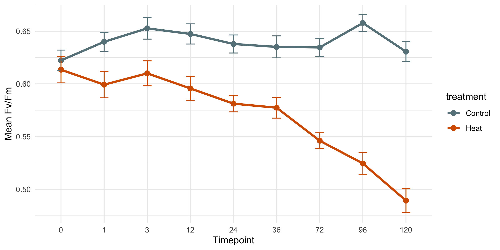

``` r
PAM_means <- PAM_exp_filtered_IQR %>%
  group_by(date, timepoint, treatment, tank_id) %>%
  summarise(
    FvFm_mean = mean(fv_fm_y_1000, na.rm = TRUE),
    FvFm_SE = sd(fv_fm_y_1000, na.rm = TRUE) / sqrt(n()),
    .groups = 'drop'
  )

ggplot(PAM_means, aes(x = timepoint, y = FvFm_mean, color = treatment, shape = tank_id)) +
  geom_point(stat = "summary", fun = mean, aes(group = treatment), size=2.5) +
  geom_point(position = position_dodge(width = 0.5), size = 2.5, alpha=0.5) +
  geom_errorbar(aes(ymin = FvFm_mean - FvFm_SE, ymax = FvFm_mean + FvFm_SE),
                width = 0.2, position = position_dodge(width = 0.5), alpha=0.5) +
  geom_line(stat = "summary", fun = mean, size = 1.2, aes(group = treatment)) +
  labs(x = "Timepoint",y = "Mean Fv/Fm") +
  theme_minimal() +scale_color_manual(values = custom_colors) +
  stat_compare_means(aes(group = treatment),method = "anova",label = "p.format",size = 2.5)
```

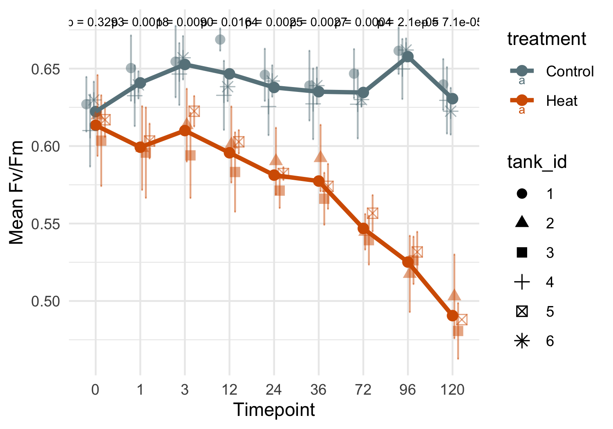

``` r
ggsave("../output/FvFm_line_treatment_tank_means.png", plot = last_plot(), width = 8, height = 4, bg = "white")
ggsave("../output/pdf_figs/FvFm_line_treatment_tank_means.pdf", plot = last_plot(), width = 8, height = 4)

ggplot(PAM_exp_filtered_IQR, aes(x = timepoint, y = fv_fm_y_1000, color = treatment, shape = tank_id)) +
  geom_point(stat = "summary", fun = mean, aes(group = treatment), size=2.5) +
  geom_point(position = position_dodge(width = 0.5), size = 2.5, alpha=0.5) +
  geom_line(stat = "summary", fun = mean, size = 1.2, aes(group = treatment)) +
  labs(x = "Timepoint",y = "Mean Fv/Fm") +
  theme_minimal() +scale_color_manual(values = custom_colors) +
  stat_compare_means(aes(group = treatment),method = "anova",label = "p.format",size = 3)
```

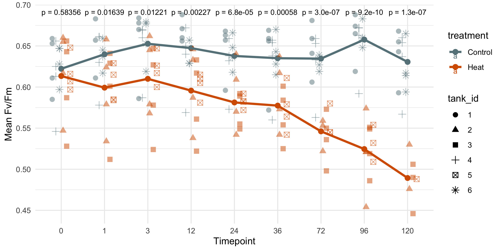

``` r
ggsave("../output/FvFm_line_treatment_all_points.png", plot = last_plot(), width = 8, height = 4, bg = "white")
ggsave("../output/pdf_figs/FvFm_line_treatment_all_points.pdf", plot = last_plot(), width = 8, height = 4)

ggplot(PAM_means, aes(x = timepoint, y = FvFm_mean, color = tank_id, group = tank_id)) +
  geom_line(size = 0.8, alpha = 0.7) +
  labs(x = "Timepoint",y = "Mean Fv/Fm") +
  theme_minimal() + facet_wrap(~treatment)
```

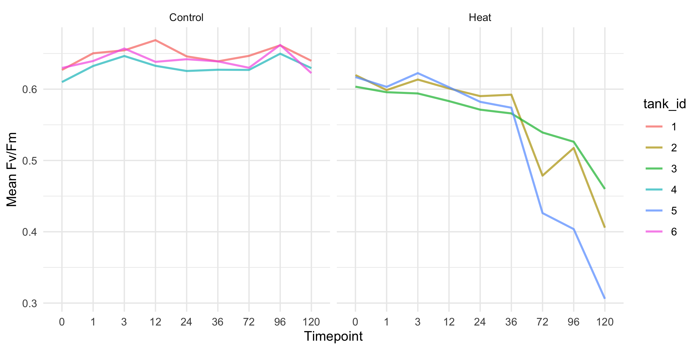

``` r
ggplot(PAM_exp_filtered_IQR, aes(x = timepoint, y = fv_fm_y_1000, color = treatment, shape = tank_id)) +
  geom_point(stat = "summary", fun = mean, aes(group = treatment), size=2.5) +
  geom_line(position = position_dodge(width = 0.25), size = 0.5, alpha=0.25, aes(group = plug)) +
  geom_line(stat = "summary", fun = mean, size = 1.2, aes(group = treatment)) +
  labs(x = "Timepoint",y = "Mean Fv/Fm") +
  theme_minimal() +scale_color_manual(values = custom_colors) +
  stat_compare_means(aes(group = treatment),method = "anova",label = "p.format",size = 3)
```

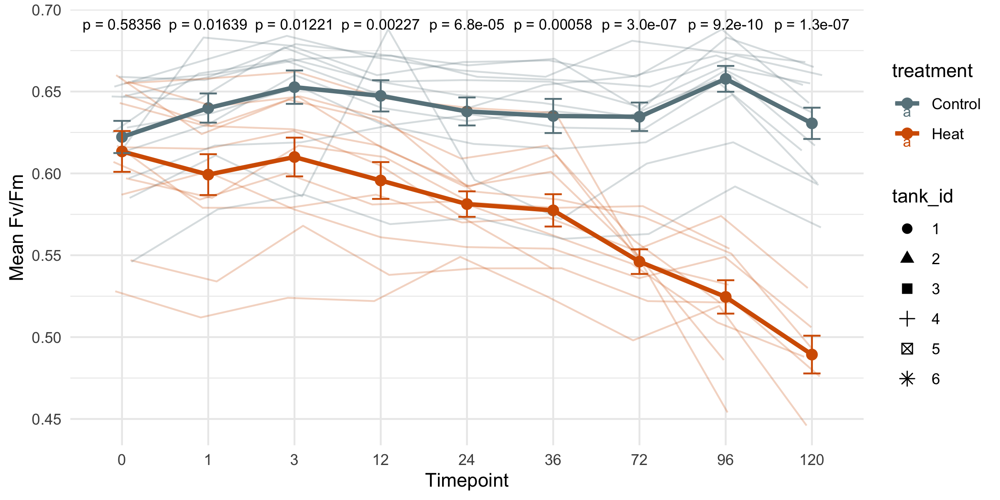

``` r
ggsave("../output/FvFm_line_treatment_all_trajectories.png", plot = last_plot(), width = 8, height = 4, bg = "white")
ggsave("../output/pdf_figs/FvFm_line_treatment_all_trajectories.pdf", plot = last_plot(), width = 8, height = 4)
```
