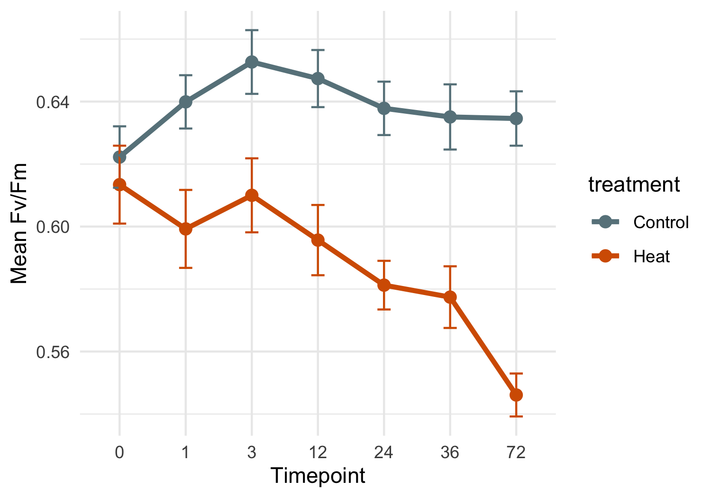
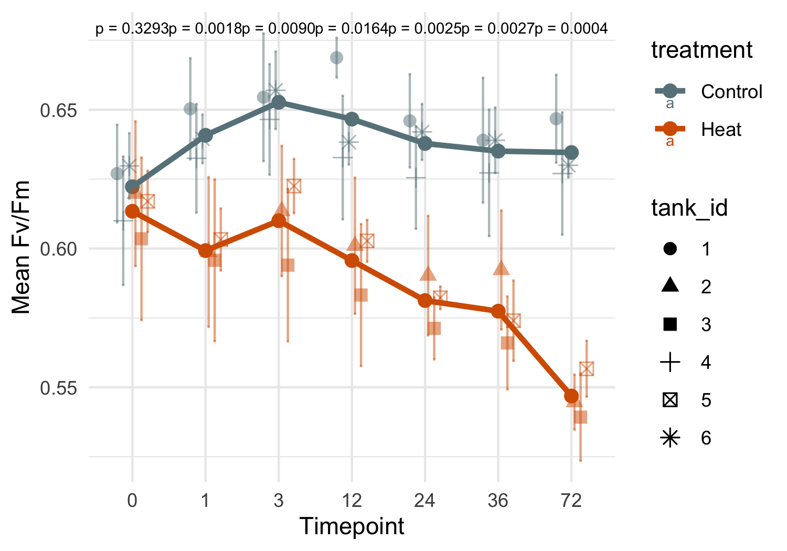
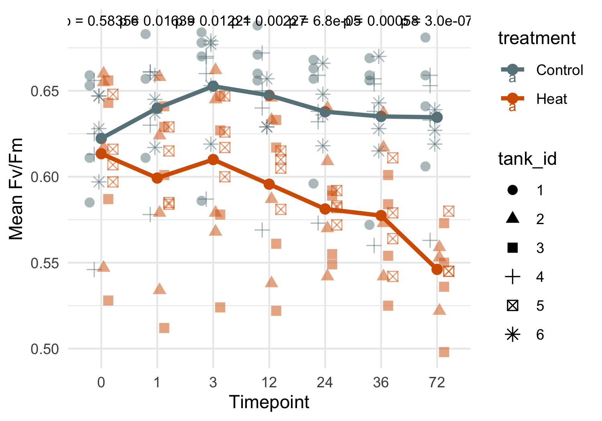
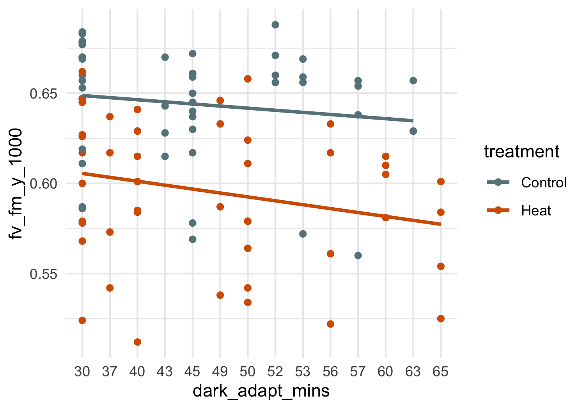

PAM Mcap
================
Zoe Dellaert
2025-06-24

- [0.1 Statistical Mixed Model by treatment, timepoint, and
  tank_id](#01-statistical-mixed-model-by-treatment-timepoint-and-tank_id)

``` r
library(tidyverse)
library(janitor)
library(ggpubr)
library(lme4)
library(lmerTest)
library(emmeans)


custom_colors <- c("Control" = "lightblue4", "Heat" = "#D55E00")

PAM <- read.csv("../data/PAM.csv") %>% clean_names()
PAM <- PAM %>% mutate(date = as.factor(date)) %>% 
                mutate(timepoint = factor(timepoint)) %>%#,levels = c("0","1","3","6","12",
                                                    #           "24","36","48","72","120","170"), ordered = TRUE)) %>% 
                mutate(plug = as.factor(plug)) %>%
                mutate(treatment = factor(treatment,levels = c("Acclimation","Recovery","Control","Heat", ordered=TRUE)))

ggplot(PAM,aes(x = date, y = fv_fm_y_1000)) + 
    geom_boxplot(aes(fill = tank_id)) + labs(x = "Date", y = "Fv/Fm", title = "Fv/Fm by Date and Tank") +
  theme_minimal()
```


``` r
outlier_dates <- c("20250620")
  
PAM <- PAM %>% filter(!(date %in% outlier_dates))

ggplot(PAM,aes(x = date, y = fv_fm_y_1000)) + 
    geom_boxplot(aes(fill = treatment)) + labs(x = "Date", y = "Fv/Fm", title = "Fv/Fm by Date and Tank") +
  theme_minimal()
```


``` r
ggsave("../output/FvFm_recovery_acclimation.png", plot = last_plot(), width = 8, height = 4, bg = "white")
```

``` r
PAM_exp <- PAM %>% filter(treatment!="Acclimation" & treatment!="Recovery")
table(PAM_exp$plug)
```

    ## 
    ## 1041 1056 1086 1108 1113 1145 1211 1248 1250 1252 1339 1441 1458 1461 1472 1494 
    ##    7    7    7    6    7    0    7    7    7    7    7    7    7    7    6    7 
    ## 1538 1548 1549 1560 1563 1597 1631 1739 2084 2360 2852 
    ##    0    0    7    7    7    7    7    7    7    7    7

``` r
ggplot(PAM_exp,aes(x = timepoint, y = fv_fm_y_1000)) + 
    geom_boxplot(aes(fill = treatment)) +theme_minimal() +scale_fill_manual(values = custom_colors) 
```


``` r
ggplot(PAM_exp,aes(x = timepoint, y = fv_fm_y_1000, group = plug)) + 
    geom_path(aes(color=plug)) + theme_minimal() #+facet_wrap(tank_id~treatment)
```


``` r
ggplot(PAM_exp,aes(x = timepoint, y = fv_fm_y_1000, group = plug)) + 
    geom_path(aes(color=tank_id)) + theme_minimal() #+facet_wrap(tank_id~treatment)
```


``` r
# mixed model
model <- lm(fv_fm_y_1000 ~ timepoint, data = PAM_exp)
summary(model)
```

    ## 
    ## Call:
    ## lm(formula = fv_fm_y_1000 ~ timepoint, data = PAM_exp)
    ## 
    ## Residuals:
    ##       Min        1Q    Median        3Q       Max 
    ## -0.107333 -0.033467  0.008534  0.037292  0.086636 
    ## 
    ## Coefficients:
    ##               Estimate Std. Error t value Pr(>|t|)    
    ## (Intercept)  0.6178333  0.0089155  69.299   <2e-16 ***
    ## timepoint1   0.0008623  0.0127447   0.068   0.9461    
    ## timepoint3   0.0135000  0.0126084   1.071   0.2859    
    ## timepoint12  0.0025580  0.0127447   0.201   0.8412    
    ## timepoint24 -0.0082917  0.0126084  -0.658   0.5117    
    ## timepoint36 -0.0115833  0.0126084  -0.919   0.3597    
    ## timepoint72 -0.0234697  0.0128918  -1.821   0.0706 .  
    ## ---
    ## Signif. codes:  0 '***' 0.001 '**' 0.01 '*' 0.05 '.' 0.1 ' ' 1
    ## 
    ## Residual standard error: 0.04368 on 157 degrees of freedom
    ##   (4 observations deleted due to missingness)
    ## Multiple R-squared:  0.06084,    Adjusted R-squared:  0.02495 
    ## F-statistic: 1.695 on 6 and 157 DF,  p-value: 0.1255

``` r
# Estimated marginal means (adjusted for random effects and model structure)
emm <- emmeans(model, ~ timepoint)
pairs(emm)
```

    ##  contrast                   estimate     SE  df t.ratio p.value
    ##  timepoint0 - timepoint1   -0.000862 0.0127 157  -0.068  1.0000
    ##  timepoint0 - timepoint3   -0.013500 0.0126 157  -1.071  0.9357
    ##  timepoint0 - timepoint12  -0.002558 0.0127 157  -0.201  1.0000
    ##  timepoint0 - timepoint24   0.008292 0.0126 157   0.658  0.9946
    ##  timepoint0 - timepoint36   0.011583 0.0126 157   0.919  0.9691
    ##  timepoint0 - timepoint72   0.023470 0.0129 157   1.821  0.5363
    ##  timepoint1 - timepoint3   -0.012638 0.0127 157  -0.992  0.9552
    ##  timepoint1 - timepoint12  -0.001696 0.0129 157  -0.132  1.0000
    ##  timepoint1 - timepoint24   0.009154 0.0127 157   0.718  0.9913
    ##  timepoint1 - timepoint36   0.012446 0.0127 157   0.977  0.9584
    ##  timepoint1 - timepoint72   0.024332 0.0130 157   1.868  0.5045
    ##  timepoint3 - timepoint12   0.010942 0.0127 157   0.859  0.9780
    ##  timepoint3 - timepoint24   0.021792 0.0126 157   1.728  0.5982
    ##  timepoint3 - timepoint36   0.025083 0.0126 157   1.989  0.4255
    ##  timepoint3 - timepoint72   0.036970 0.0129 157   2.868  0.0689
    ##  timepoint12 - timepoint24  0.010850 0.0127 157   0.851  0.9789
    ##  timepoint12 - timepoint36  0.014141 0.0127 157   1.110  0.9244
    ##  timepoint12 - timepoint72  0.026028 0.0130 157   1.998  0.4199
    ##  timepoint24 - timepoint36  0.003292 0.0126 157   0.261  1.0000
    ##  timepoint24 - timepoint72  0.015178 0.0129 157   1.177  0.9017
    ##  timepoint36 - timepoint72  0.011886 0.0129 157   0.922  0.9685
    ## 
    ## P value adjustment: tukey method for comparing a family of 7 estimates

## 0.1 Statistical Mixed Model by treatment, timepoint, and tank_id

``` r
# mixed model
model <- lmer(fv_fm_y_1000 ~ treatment * timepoint + (1 | treatment:tank_id), data = PAM_exp)
summary(model)
```

    ## Linear mixed model fit by REML. t-tests use Satterthwaite's method [
    ## lmerModLmerTest]
    ## Formula: fv_fm_y_1000 ~ treatment * timepoint + (1 | treatment:tank_id)
    ##    Data: PAM_exp
    ## 
    ## REML criterion at convergence: -548.6
    ## 
    ## Scaled residuals: 
    ##     Min      1Q  Median      3Q     Max 
    ## -2.3964 -0.5466  0.1729  0.7423  1.6579 
    ## 
    ## Random effects:
    ##  Groups            Name        Variance  Std.Dev.
    ##  treatment:tank_id (Intercept) 4.033e-05 0.00635 
    ##  Residual                      1.180e-03 0.03435 
    ## Number of obs: 164, groups:  treatment:tank_id, 6
    ## 
    ## Fixed effects:
    ##                             Estimate Std. Error         df t value Pr(>|t|)    
    ## (Intercept)                 0.622250   0.010572  51.924859  58.857  < 2e-16 ***
    ## treatmentHeat              -0.008833   0.014951  51.924859  -0.591 0.557216    
    ## timepoint1                  0.018045   0.014343 146.212944   1.258 0.210355    
    ## timepoint3                  0.030417   0.014024 146.040197   2.169 0.031704 *  
    ## timepoint12                 0.025164   0.014343 146.212944   1.754 0.081450 .  
    ## timepoint24                 0.015583   0.014024 146.040197   1.111 0.268300    
    ## timepoint36                 0.012833   0.014024 146.040197   0.915 0.361636    
    ## timepoint72                 0.012333   0.014024 146.040197   0.879 0.380592    
    ## treatmentHeat:timepoint1   -0.032212   0.020059 146.128957  -1.606 0.110474    
    ## treatmentHeat:timepoint3   -0.033833   0.019832 146.040197  -1.706 0.090141 .  
    ## treatmentHeat:timepoint12  -0.042914   0.020059 146.128957  -2.139 0.034070 *  
    ## treatmentHeat:timepoint24  -0.047750   0.019832 146.040197  -2.408 0.017302 *  
    ## treatmentHeat:timepoint36  -0.048833   0.019832 146.040197  -2.462 0.014968 *  
    ## treatmentHeat:timepoint72  -0.079157   0.020326 146.142843  -3.894 0.000149 ***
    ## ---
    ## Signif. codes:  0 '***' 0.001 '**' 0.01 '*' 0.05 '.' 0.1 ' ' 1

``` r
# Estimated marginal means (adjusted for random effects and model structure)
emm <- emmeans(model, ~ treatment | timepoint)
pairs(emm)
```

    ## timepoint = 0:
    ##  contrast       estimate     SE   df t.ratio p.value
    ##  Control - Heat  0.00883 0.0150 51.6   0.591  0.5572
    ## 
    ## timepoint = 1:
    ##  contrast       estimate     SE   df t.ratio p.value
    ##  Control - Heat  0.04104 0.0153 54.5   2.691  0.0095
    ## 
    ## timepoint = 3:
    ##  contrast       estimate     SE   df t.ratio p.value
    ##  Control - Heat  0.04267 0.0150 51.6   2.854  0.0062
    ## 
    ## timepoint = 12:
    ##  contrast       estimate     SE   df t.ratio p.value
    ##  Control - Heat  0.05175 0.0153 54.5   3.392  0.0013
    ## 
    ## timepoint = 24:
    ##  contrast       estimate     SE   df t.ratio p.value
    ##  Control - Heat  0.05658 0.0150 51.6   3.784  0.0004
    ## 
    ## timepoint = 36:
    ##  contrast       estimate     SE   df t.ratio p.value
    ##  Control - Heat  0.05767 0.0150 51.6   3.857  0.0003
    ## 
    ## timepoint = 72:
    ##  contrast       estimate     SE   df t.ratio p.value
    ##  Control - Heat  0.08799 0.0156 58.0   5.639  <.0001
    ## 
    ## Degrees-of-freedom method: kenward-roger

``` r
summary_table <- as.data.frame(pairs(emm)) %>%
  transmute(
    Timepoint = as.numeric(as.character(timepoint)),
    `Estimate (Control-Heat)` = round(estimate, 4),
    `SE` = round(SE, 4),
    `t-ratio` = round(t.ratio, 2),
    `p-value` = signif(p.value, 3),
    `Significant?` = case_when(
      p.value < 0.001 ~ "***",
      p.value < 0.01 ~ "**",
      p.value < 0.05 ~ "*",
      p.value < 0.1 ~ ".",
      TRUE ~ ""
    )
  )

print(summary_table)
```

    ##   Timepoint Estimate (Control-Heat)     SE t-ratio  p-value Significant?
    ## 1         0                  0.0088 0.0150    0.59 5.57e-01             
    ## 2         1                  0.0410 0.0153    2.69 9.45e-03           **
    ## 3         3                  0.0427 0.0150    2.85 6.21e-03           **
    ## 4        12                  0.0517 0.0153    3.39 1.30e-03           **
    ## 5        24                  0.0566 0.0150    3.78 4.03e-04          ***
    ## 6        36                  0.0577 0.0150    3.86 3.20e-04          ***
    ## 7        72                  0.0880 0.0156    5.64 5.33e-07          ***

``` r
write.csv(summary_table, "../output/FvFm_treatment_effect_summary.csv", row.names = FALSE)
```

``` r
contrast_table <- as.data.frame(pairs(emm)) %>%
  mutate(
    timepoint = as.numeric(as.character(timepoint)),
    signif = case_when(
      p.value < 0.001 ~ "***",
      p.value < 0.01 ~ "**",
      p.value < 0.05 ~ "*",
      p.value < 0.1 ~ ".",
      TRUE ~ ""
    )
  )

ggplot(contrast_table, aes(x = timepoint, y = estimate)) +
  geom_errorbar(aes(ymin = estimate - SE, ymax = estimate + SE),width = 3, alpha = 0.6) +
  geom_line(size = 1, aes(group = 1), color = "black", alpha = 0.7) +
  geom_point(size = 2.5, aes(color = p.value < 0.05)) +
  geom_text(aes(label = signif), vjust = -2.5, size = 5, fontface = "bold", color = "black") +
  scale_color_manual(values = c("TRUE" = "#D55E00", "FALSE" = "grey60"), name = "p < 0.05") +
  labs(
    title = "Estimated Treatment Effect (Control-Heat) on Fv/Fm",
    x = "Timepoint (h)",
    y = "Estimated Difference in Fv/Fm") +
  theme_minimal() +
  theme(panel.grid.minor = element_blank(),panel.grid.major.x = element_blank())
```


``` r
ggsave("../output/FvFm_line_treatment_tank_modelestimates.png", plot = last_plot(), width = 8, height = 4, bg = "white")
ggsave("../output/pdf_figs/FvFm_line_treatment_tank_modelestimates.pdf", plot = last_plot(), width = 8, height = 4)
```

``` r
PAM_means_treatment <- PAM_exp %>%
  group_by(date, timepoint, treatment) %>%
  summarise(
    FvFm_mean = mean(fv_fm_y_1000, na.rm = TRUE),
    FvFm_SE = sd(fv_fm_y_1000, na.rm = TRUE) / sqrt(n()),
    .groups = 'drop'
  )

ggplot(PAM_means_treatment, aes(x = timepoint, y = FvFm_mean, color = treatment,group = treatment)) +
  geom_point(size = 2.5) +
  geom_errorbar(aes(ymin = FvFm_mean - FvFm_SE, ymax = FvFm_mean + FvFm_SE),
                width = 0.2) +
  geom_line(stat = "summary", fun = mean, size = 1.2, aes(group = treatment)) +
  labs(x = "Timepoint",y = "Mean Fv/Fm") +
  theme_minimal() +scale_color_manual(values = custom_colors)
```



``` r
PAM_means <- PAM_exp %>%
  group_by(date, timepoint, treatment, tank_id) %>%
  summarise(
    FvFm_mean = mean(fv_fm_y_1000, na.rm = TRUE),
    FvFm_SE = sd(fv_fm_y_1000, na.rm = TRUE) / sqrt(n()),
    .groups = 'drop'
  )

ggplot(PAM_means, aes(x = timepoint, y = FvFm_mean, color = treatment, shape = tank_id)) +
  geom_point(stat = "summary", fun = mean, aes(group = treatment), size=2.5) +
  geom_point(position = position_dodge(width = 0.5), size = 2.5, alpha=0.5) +
  geom_errorbar(aes(ymin = FvFm_mean - FvFm_SE, ymax = FvFm_mean + FvFm_SE),
                width = 0.2, position = position_dodge(width = 0.5), alpha=0.5) +
  geom_line(stat = "summary", fun = mean, size = 1.2, aes(group = treatment)) +
  labs(x = "Timepoint",y = "Mean Fv/Fm") +
  theme_minimal() +scale_color_manual(values = custom_colors) +
  stat_compare_means(aes(group = treatment),method = "anova",label = "p.format",size = 2.5)
```



``` r
ggsave("../output/FvFm_line_treatment_tank_means.png", plot = last_plot(), width = 8, height = 4, bg = "white")
ggsave("../output/pdf_figs/FvFm_line_treatment_tank_means.pdf", plot = last_plot(), width = 8, height = 4)

ggplot(PAM_exp, aes(x = timepoint, y = fv_fm_y_1000, color = treatment, shape = tank_id)) +
  geom_point(stat = "summary", fun = mean, aes(group = treatment), size=2.5) +
  geom_point(position = position_dodge(width = 0.5), size = 2.5, alpha=0.5) +
  geom_line(stat = "summary", fun = mean, size = 1.2, aes(group = treatment)) +
  labs(x = "Timepoint",y = "Mean Fv/Fm") +
  theme_minimal() +scale_color_manual(values = custom_colors) +
  stat_compare_means(aes(group = treatment),method = "anova",label = "p.format",size = 3)
```



``` r
ggsave("../output/FvFm_line_treatment_all_points.png", plot = last_plot(), width = 8, height = 4, bg = "white")
ggsave("../output/pdf_figs/FvFm_line_treatment_all_points.pdf", plot = last_plot(), width = 8, height = 4)

ggplot(PAM_means, aes(x = timepoint, y = FvFm_mean, color = tank_id, group = tank_id)) +
  geom_line(size = 0.8, alpha = 0.7) +
  labs(x = "Timepoint",y = "Mean Fv/Fm") +
  theme_minimal() + facet_wrap(~treatment)
```


``` r
ggplot(PAM_exp, aes(x = timepoint, y = fv_fm_y_1000, color = treatment)) +
  geom_boxplot(outlier.colour = "red", outlier.shape = 8) 
```


``` r
PAM_exp %>% filter(dark_adapt_mins != "overnight") %>% ggplot(aes(x = dark_adapt_mins, y = fv_fm_y_1000)) + 
    geom_point(aes(color=treatment)) +
  geom_smooth(aes(group = treatment, color = treatment), method = "lm", se = FALSE) +  # or method = "loess"
  theme_minimal() + scale_color_manual(values = custom_colors)
```


