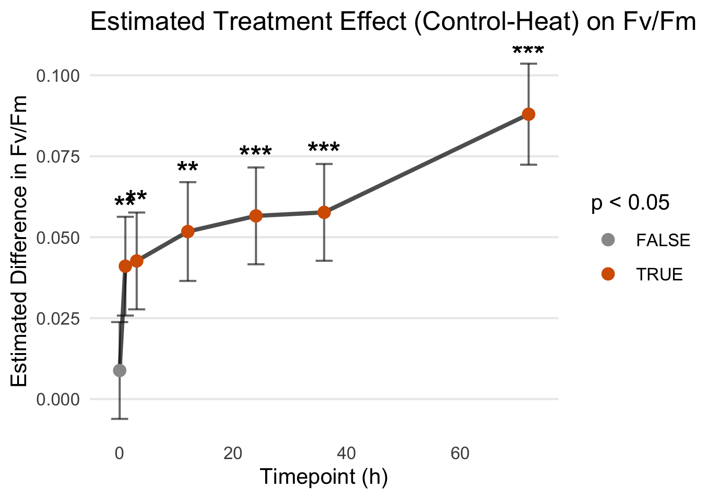
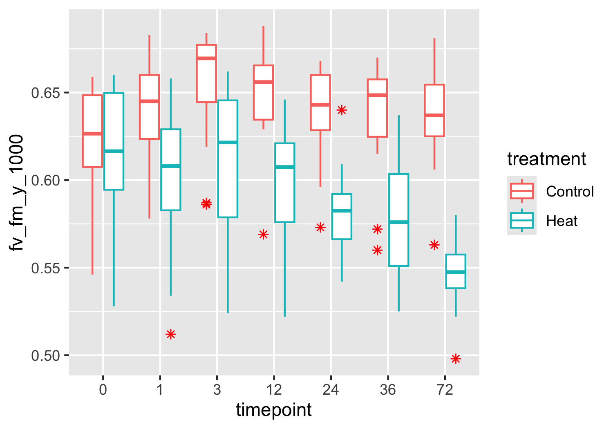

PAM Mcap
================
Zoe Dellaert
2025-06-24

- [0.1 Statistical Mixed Model by treatment, timepoint, and
  tank_id](#01-statistical-mixed-model-by-treatment-timepoint-and-tank_id)

``` r
library(tidyverse)
library(janitor)
library(ggpubr)
library(lme4)
library(lmerTest)
library(emmeans)


custom_colors <- c("Control" = "lightblue4", "Heat" = "#D55E00")

PAM <- read.csv("../data/PAM.csv") %>% clean_names()
PAM <- PAM %>% mutate(date = as.factor(date)) %>% 
                mutate(timepoint = factor(timepoint)) %>%#,levels = c("0","1","3","6","12",
                                                    #           "24","36","48","72","120","170"), ordered = TRUE)) %>% 
                mutate(plug = as.factor(plug)) %>%
                mutate(treatment = factor(treatment,levels = c("Acclimation","Recovery","Control","Heat", ordered=TRUE)))

ggplot(PAM,aes(x = date, y = fv_fm_y_1000)) + 
    geom_boxplot(aes(fill = tank_id)) + labs(x = "Date", y = "Fv/Fm", title = "Fv/Fm by Date and Tank") +
  theme_minimal()
```


``` r
outlier_dates <- c("20250620")
  
PAM <- PAM %>% filter(!(date %in% outlier_dates))

ggplot(PAM,aes(x = date, y = fv_fm_y_1000)) + 
    geom_boxplot(aes(fill = treatment)) + labs(x = "Date", y = "Fv/Fm", title = "Fv/Fm by Date and Tank") +
  theme_minimal()
```


``` r
ggsave("../output/FvFm_recovery_acclimation.png", plot = last_plot(), width = 8, height = 4, bg = "white")
```

``` r
PAM_exp <- PAM %>% filter(treatment!="Acclimation" & treatment!="Recovery")
table(PAM_exp$plug)
```

    ## 
    ## 1041 1056 1086 1108 1113 1145 1211 1248 1250 1252 1339 1441 1458 1461 1472 1494 
    ##    7    7    7    6    7    0    7    7    7    7    7    7    7    7    6    7 
    ## 1538 1548 1549 1560 1563 1597 1631 1739 2084 2360 2852 
    ##    0    0    7    7    7    7    7    7    7    7    7

``` r
ggplot(PAM_exp,aes(x = timepoint, y = fv_fm_y_1000)) + 
    geom_boxplot(aes(fill = treatment)) +theme_minimal() +scale_fill_manual(values = custom_colors) 
```


``` r
ggplot(PAM_exp,aes(x = timepoint, y = fv_fm_y_1000, group = plug)) + 
    geom_path(aes(color=plug)) + theme_minimal() #+facet_wrap(tank_id~treatment)
```


``` r
ggplot(PAM_exp,aes(x = timepoint, y = fv_fm_y_1000, group = plug)) + 
    geom_path(aes(color=tank_id)) + theme_minimal() #+facet_wrap(tank_id~treatment)
```


``` r
# mixed model
model <- lm(fv_fm_y_1000 ~ timepoint, data = PAM_exp)
summary(model)
```

    ## 
    ## Call:
    ## lm(formula = fv_fm_y_1000 ~ timepoint, data = PAM_exp)
    ## 
    ## Residuals:
    ##      Min       1Q   Median       3Q      Max 
    ## -0.52300 -0.03001  0.00861  0.03817  0.12300 
    ## 
    ## Coefficients:
    ##               Estimate Std. Error t value Pr(>|t|)    
    ## (Intercept)  0.6178333  0.0133378  46.322  < 2e-16 ***
    ## timepoint1   0.0008623  0.0190664   0.045  0.96398    
    ## timepoint3   0.0135000  0.0188625   0.716  0.47522    
    ## timepoint12  0.0025580  0.0190664   0.134  0.89344    
    ## timepoint24 -0.0082917  0.0188625  -0.440  0.66083    
    ## timepoint36 -0.0115833  0.0188625  -0.614  0.54003    
    ## timepoint72 -0.0598333  0.0188625  -3.172  0.00182 ** 
    ## ---
    ## Signif. codes:  0 '***' 0.001 '**' 0.01 '*' 0.05 '.' 0.1 ' ' 1
    ## 
    ## Residual standard error: 0.06534 on 159 degrees of freedom
    ##   (2 observations deleted due to missingness)
    ## Multiple R-squared:  0.1073, Adjusted R-squared:  0.07361 
    ## F-statistic: 3.185 on 6 and 159 DF,  p-value: 0.005592

``` r
# Estimated marginal means (adjusted for random effects and model structure)
emm <- emmeans(model, ~ timepoint)
pairs(emm)
```

    ##  contrast                   estimate     SE  df t.ratio p.value
    ##  timepoint0 - timepoint1   -0.000862 0.0191 159  -0.045  1.0000
    ##  timepoint0 - timepoint3   -0.013500 0.0189 159  -0.716  0.9915
    ##  timepoint0 - timepoint12  -0.002558 0.0191 159  -0.134  1.0000
    ##  timepoint0 - timepoint24   0.008292 0.0189 159   0.440  0.9994
    ##  timepoint0 - timepoint36   0.011583 0.0189 159   0.614  0.9963
    ##  timepoint0 - timepoint72   0.059833 0.0189 159   3.172  0.0294
    ##  timepoint1 - timepoint3   -0.012638 0.0191 159  -0.663  0.9944
    ##  timepoint1 - timepoint12  -0.001696 0.0193 159  -0.088  1.0000
    ##  timepoint1 - timepoint24   0.009154 0.0191 159   0.480  0.9991
    ##  timepoint1 - timepoint36   0.012446 0.0191 159   0.653  0.9948
    ##  timepoint1 - timepoint72   0.060696 0.0191 159   3.183  0.0285
    ##  timepoint3 - timepoint12   0.010942 0.0191 159   0.574  0.9975
    ##  timepoint3 - timepoint24   0.021792 0.0189 159   1.155  0.9095
    ##  timepoint3 - timepoint36   0.025083 0.0189 159   1.330  0.8370
    ##  timepoint3 - timepoint72   0.073333 0.0189 159   3.888  0.0028
    ##  timepoint12 - timepoint24  0.010850 0.0191 159   0.569  0.9976
    ##  timepoint12 - timepoint36  0.014141 0.0191 159   0.742  0.9897
    ##  timepoint12 - timepoint72  0.062391 0.0191 159   3.272  0.0218
    ##  timepoint24 - timepoint36  0.003292 0.0189 159   0.175  1.0000
    ##  timepoint24 - timepoint72  0.051542 0.0189 159   2.733  0.0970
    ##  timepoint36 - timepoint72  0.048250 0.0189 159   2.558  0.1463
    ## 
    ## P value adjustment: tukey method for comparing a family of 7 estimates

## 0.1 Statistical Mixed Model by treatment, timepoint, and tank_id

``` r
# mixed model
model <- lmer(fv_fm_y_1000 ~ treatment * timepoint + (1 | treatment:tank_id), data = PAM_exp)
summary(model)
```

    ## Linear mixed model fit by REML. t-tests use Satterthwaite's method [
    ## lmerModLmerTest]
    ## Formula: fv_fm_y_1000 ~ treatment * timepoint + (1 | treatment:tank_id)
    ##    Data: PAM_exp
    ## 
    ## REML criterion at convergence: -414.8
    ## 
    ## Scaled residuals: 
    ##     Min      1Q  Median      3Q     Max 
    ## -8.0911 -0.3240  0.1367  0.4727  1.7868 
    ## 
    ## Random effects:
    ##  Groups            Name        Variance Std.Dev.
    ##  treatment:tank_id (Intercept) 0.000000 0.00000 
    ##  Residual                      0.003044 0.05517 
    ## Number of obs: 166, groups:  treatment:tank_id, 6
    ## 
    ## Fixed effects:
    ##                             Estimate Std. Error         df t value Pr(>|t|)    
    ## (Intercept)                 0.622250   0.015927 152.000000  39.068  < 2e-16 ***
    ## treatmentHeat              -0.008833   0.022525 152.000000  -0.392    0.695    
    ## timepoint1                  0.017659   0.023031 152.000000   0.767    0.444    
    ## timepoint3                  0.030417   0.022525 152.000000   1.350    0.179    
    ## timepoint12                 0.025114   0.023031 152.000000   1.090    0.277    
    ## timepoint24                 0.015583   0.022525 152.000000   0.692    0.490    
    ## timepoint36                 0.012833   0.022525 152.000000   0.570    0.570    
    ## timepoint72                 0.012333   0.022525 152.000000   0.548    0.585    
    ## treatmentHeat:timepoint1   -0.031826   0.032215 152.000000  -0.988    0.325    
    ## treatmentHeat:timepoint3   -0.033833   0.031855 152.000000  -1.062    0.290    
    ## treatmentHeat:timepoint12  -0.042864   0.032215 152.000000  -1.331    0.185    
    ## treatmentHeat:timepoint24  -0.047750   0.031855 152.000000  -1.499    0.136    
    ## treatmentHeat:timepoint36  -0.048833   0.031855 152.000000  -1.533    0.127    
    ## treatmentHeat:timepoint72  -0.144333   0.031855 152.000000  -4.531 1.18e-05 ***
    ## ---
    ## Signif. codes:  0 '***' 0.001 '**' 0.01 '*' 0.05 '.' 0.1 ' ' 1

    ## optimizer (nloptwrap) convergence code: 0 (OK)
    ## boundary (singular) fit: see help('isSingular')

``` r
# Estimated marginal means (adjusted for random effects and model structure)
emm <- emmeans(model, ~ treatment | timepoint)
pairs(emm)
```

    ## timepoint = 0:
    ##  contrast       estimate     SE    df t.ratio p.value
    ##  Control - Heat  0.00883 0.0225  98.2   0.392  0.6958
    ## 
    ## timepoint = 1:
    ##  contrast       estimate     SE    df t.ratio p.value
    ##  Control - Heat  0.04066 0.0230 101.3   1.764  0.0807
    ## 
    ## timepoint = 3:
    ##  contrast       estimate     SE    df t.ratio p.value
    ##  Control - Heat  0.04267 0.0225  98.2   1.894  0.0611
    ## 
    ## timepoint = 12:
    ##  contrast       estimate     SE    df t.ratio p.value
    ##  Control - Heat  0.05170 0.0230 101.3   2.243  0.0270
    ## 
    ## timepoint = 24:
    ##  contrast       estimate     SE    df t.ratio p.value
    ##  Control - Heat  0.05658 0.0225  98.2   2.512  0.0136
    ## 
    ## timepoint = 36:
    ##  contrast       estimate     SE    df t.ratio p.value
    ##  Control - Heat  0.05767 0.0225  98.2   2.560  0.0120
    ## 
    ## timepoint = 72:
    ##  contrast       estimate     SE    df t.ratio p.value
    ##  Control - Heat  0.15317 0.0225  98.2   6.800  <.0001
    ## 
    ## Degrees-of-freedom method: kenward-roger

``` r
summary_table <- as.data.frame(pairs(emm)) %>%
  transmute(
    Timepoint = as.numeric(as.character(timepoint)),
    `Estimate (Control-Heat)` = round(estimate, 4),
    `SE` = round(SE, 4),
    `t-ratio` = round(t.ratio, 2),
    `p-value` = signif(p.value, 3),
    `Significant?` = case_when(
      p.value < 0.001 ~ "***",
      p.value < 0.01 ~ "**",
      p.value < 0.05 ~ "*",
      p.value < 0.1 ~ ".",
      TRUE ~ ""
    )
  )

print(summary_table)
```

    ##   Timepoint Estimate (Control-Heat)     SE t-ratio  p-value Significant?
    ## 1         0                  0.0088 0.0225    0.39 6.96e-01             
    ## 2         1                  0.0407 0.0230    1.76 8.07e-02            .
    ## 3         3                  0.0427 0.0225    1.89 6.11e-02            .
    ## 4        12                  0.0517 0.0230    2.24 2.70e-02            *
    ## 5        24                  0.0566 0.0225    2.51 1.36e-02            *
    ## 6        36                  0.0577 0.0225    2.56 1.20e-02            *
    ## 7        72                  0.1532 0.0225    6.80 8.22e-10          ***

``` r
write.csv(summary_table, "../output/FvFm_treatment_effect_summary.csv", row.names = FALSE)
```

``` r
contrast_table <- as.data.frame(pairs(emm)) %>%
  mutate(
    timepoint = as.numeric(as.character(timepoint)),
    signif = case_when(
      p.value < 0.001 ~ "***",
      p.value < 0.01 ~ "**",
      p.value < 0.05 ~ "*",
      p.value < 0.1 ~ ".",
      TRUE ~ ""
    )
  )

ggplot(contrast_table, aes(x = timepoint, y = estimate)) +
  geom_errorbar(aes(ymin = estimate - SE, ymax = estimate + SE),width = 3, alpha = 0.6) +
  geom_line(size = 1, aes(group = 1), color = "black", alpha = 0.7) +
  geom_point(size = 2.5, aes(color = p.value < 0.05)) +
  geom_text(aes(label = signif), vjust = -2.5, size = 5, fontface = "bold", color = "black") +
  scale_color_manual(values = c("TRUE" = "#D55E00", "FALSE" = "grey60"), name = "p < 0.05") +
  labs(
    title = "Estimated Treatment Effect (Control-Heat) on Fv/Fm",
    x = "Timepoint (h)",
    y = "Estimated Difference in Fv/Fm") +
  theme_minimal() +
  theme(panel.grid.minor = element_blank(),panel.grid.major.x = element_blank())
```



``` r
ggsave("../output/FvFm_line_treatment_tank_modelestimates.png", plot = last_plot(), width = 8, height = 4, bg = "white")
ggsave("../output/pdf_figs/FvFm_line_treatment_tank_modelestimates.pdf", plot = last_plot(), width = 8, height = 4)
```

``` r
PAM_means_treatment <- PAM_exp %>%
  group_by(date, timepoint, treatment) %>%
  summarise(
    FvFm_mean = mean(fv_fm_y_1000, na.rm = TRUE),
    FvFm_SE = sd(fv_fm_y_1000, na.rm = TRUE) / sqrt(n()),
    .groups = 'drop'
  )

ggplot(PAM_means_treatment, aes(x = timepoint, y = FvFm_mean, color = treatment,group = treatment)) +
  geom_point(size = 2.5) +
  geom_errorbar(aes(ymin = FvFm_mean - FvFm_SE, ymax = FvFm_mean + FvFm_SE),
                width = 0.2) +
  geom_line(stat = "summary", fun = mean, size = 1.2, aes(group = treatment)) +
  labs(x = "Timepoint",y = "Mean Fv/Fm") +
  theme_minimal() +scale_color_manual(values = custom_colors)
```


``` r
PAM_means <- PAM_exp %>%
  group_by(date, timepoint, treatment, tank_id) %>%
  summarise(
    FvFm_mean = mean(fv_fm_y_1000, na.rm = TRUE),
    FvFm_SE = sd(fv_fm_y_1000, na.rm = TRUE) / sqrt(n()),
    .groups = 'drop'
  )

ggplot(PAM_means, aes(x = timepoint, y = FvFm_mean, color = treatment, shape = tank_id)) +
  geom_point(stat = "summary", fun = mean, aes(group = treatment), size=2.5) +
  geom_point(position = position_dodge(width = 0.5), size = 2.5, alpha=0.5) +
  geom_errorbar(aes(ymin = FvFm_mean - FvFm_SE, ymax = FvFm_mean + FvFm_SE),
                width = 0.2, position = position_dodge(width = 0.5), alpha=0.5) +
  geom_line(stat = "summary", fun = mean, size = 1.2, aes(group = treatment)) +
  labs(x = "Timepoint",y = "Mean Fv/Fm") +
  theme_minimal() +scale_color_manual(values = custom_colors) +
  stat_compare_means(aes(group = treatment),method = "anova",label = "p.format",size = 2.5)
```


``` r
ggsave("../output/FvFm_line_treatment_tank_means.png", plot = last_plot(), width = 8, height = 4, bg = "white")
ggsave("../output/pdf_figs/FvFm_line_treatment_tank_means.pdf", plot = last_plot(), width = 8, height = 4)

ggplot(PAM_exp, aes(x = timepoint, y = fv_fm_y_1000, color = treatment, shape = tank_id)) +
  geom_point(stat = "summary", fun = mean, aes(group = treatment), size=2.5) +
  geom_point(position = position_dodge(width = 0.5), size = 2.5, alpha=0.5) +
  geom_line(stat = "summary", fun = mean, size = 1.2, aes(group = treatment)) +
  labs(x = "Timepoint",y = "Mean Fv/Fm") +
  theme_minimal() +scale_color_manual(values = custom_colors) +
  stat_compare_means(aes(group = treatment),method = "anova",label = "p.format",size = 3)
```


``` r
ggsave("../output/FvFm_line_treatment_all_points.png", plot = last_plot(), width = 8, height = 4, bg = "white")
ggsave("../output/pdf_figs/FvFm_line_treatment_all_points.pdf", plot = last_plot(), width = 8, height = 4)

ggplot(PAM_means, aes(x = timepoint, y = FvFm_mean, color = tank_id, group = tank_id)) +
  geom_line(size = 0.8, alpha = 0.7) +
  labs(x = "Timepoint",y = "Mean Fv/Fm") +
  theme_minimal() + facet_wrap(~treatment)
```


``` r
ggplot(PAM_exp, aes(x = timepoint, y = fv_fm_y_1000, color = treatment)) +
  geom_boxplot(outlier.colour = "red", outlier.shape = 8) 
```



``` r
PAM_exp %>% filter(dark_adapt_mins != "overnight") %>% ggplot(aes(x = dark_adapt_mins, y = fv_fm_y_1000)) + 
    geom_point(aes(color=treatment)) +
  geom_smooth(aes(group = treatment, color = treatment), method = "lm", se = FALSE) +  # or method = "loess"
  theme_minimal() + scale_color_manual(values = custom_colors)
```


