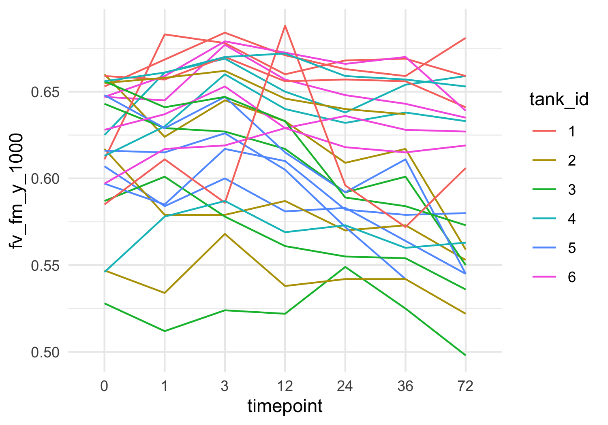

PAM Mcap
================
Zoe Dellaert
2025-06-24

- [0.1 Statistical Mixed Model by treatment, timepoint, and
  tank_id](#01-statistical-mixed-model-by-treatment-timepoint-and-tank_id)

``` r
library(tidyverse)
library(janitor)
library(ggpubr)
library(lme4)
library(lmerTest)
library(emmeans)


custom_colors <- c("Control" = "lightblue4", "Heat" = "#D55E00")

PAM <- read.csv("../data/PAM.csv") %>% clean_names()
PAM <- PAM %>% mutate(date = as.factor(date)) %>% 
                mutate(timepoint = factor(timepoint)) %>%#,levels = c("0","1","3","6","12",
                                                    #           "24","36","48","72","120","170"), ordered = TRUE)) %>% 
                mutate(plug = as.factor(plug)) %>%
                mutate(treatment = factor(treatment,levels = c("Acclimation","Recovery","Control","Heat", ordered=TRUE)))

ggplot(PAM,aes(x = date, y = fv_fm_y_1000)) + 
    geom_boxplot(aes(fill = tank_id)) + labs(x = "Date", y = "Fv/Fm", title = "Fv/Fm by Date and Tank") +
  theme_minimal()
```


``` r
outlier_dates <- c("20250620")
  
PAM <- PAM %>% filter(!(date %in% outlier_dates))

ggplot(PAM,aes(x = date, y = fv_fm_y_1000)) + 
    geom_boxplot(aes(fill = treatment)) + labs(x = "Date", y = "Fv/Fm", title = "Fv/Fm by Date and Tank") +
  theme_minimal()
```


``` r
ggsave("../output/FvFm_recovery_acclimation.png", plot = last_plot(), width = 8, height = 4, bg = "white")
```

``` r
PAM_exp <- PAM %>% filter(treatment!="Acclimation" & treatment!="Recovery")
table(PAM_exp$plug)
```

    ## 
    ## 1041 1056 1086 1108 1113 1145 1211 1248 1250 1252 1339 1441 1458 1461 1472 1494 
    ##    6    6    6    5    6    0    6    6    6    6    6    6    6    6    5    6 
    ## 1538 1548 1549 1560 1563 1597 1631 1739 2084 2360 2852 
    ##    0    0    6    6    6    6    6    6    6    6    6

``` r
ggplot(PAM_exp,aes(x = timepoint, y = fv_fm_y_1000)) + 
    geom_boxplot(aes(fill = treatment)) +theme_minimal() +scale_fill_manual(values = custom_colors) 
```


``` r
ggplot(PAM_exp,aes(x = timepoint, y = fv_fm_y_1000, group = plug)) + 
    geom_path(aes(color=plug)) + theme_minimal() #+facet_wrap(tank_id~treatment)
```


``` r
ggplot(PAM_exp,aes(x = timepoint, y = fv_fm_y_1000, group = plug)) + 
    geom_path(aes(color=tank_id)) + theme_minimal() #+facet_wrap(tank_id~treatment)
```



``` r
# mixed model
model <- lm(fv_fm_y_1000 ~ timepoint, data = PAM_exp)
summary(model)
```

    ## 
    ## Call:
    ## lm(formula = fv_fm_y_1000 ~ timepoint, data = PAM_exp)
    ## 
    ## Residuals:
    ##       Min        1Q    Median        3Q       Max 
    ## -0.107333 -0.032458  0.008534  0.036359  0.067609 
    ## 
    ## Coefficients:
    ##               Estimate Std. Error t value Pr(>|t|)    
    ## (Intercept)  0.6178333  0.0086053  71.796   <2e-16 ***
    ## timepoint1   0.0008623  0.0123014   0.070    0.944    
    ## timepoint3   0.0135000  0.0121698   1.109    0.269    
    ## timepoint12  0.0025580  0.0123014   0.208    0.836    
    ## timepoint24 -0.0082917  0.0121698  -0.681    0.497    
    ## timepoint36 -0.0115833  0.0121698  -0.952    0.343    
    ## ---
    ## Signif. codes:  0 '***' 0.001 '**' 0.01 '*' 0.05 '.' 0.1 ' ' 1
    ## 
    ## Residual standard error: 0.04216 on 136 degrees of freedom
    ##   (2 observations deleted due to missingness)
    ## Multiple R-squared:  0.03733,    Adjusted R-squared:  0.001938 
    ## F-statistic: 1.055 on 5 and 136 DF,  p-value: 0.3884

``` r
# Estimated marginal means (adjusted for random effects and model structure)
emm <- emmeans(model, ~ timepoint)
pairs(emm)
```

    ##  contrast                   estimate     SE  df t.ratio p.value
    ##  timepoint0 - timepoint1   -0.000862 0.0123 136  -0.070  1.0000
    ##  timepoint0 - timepoint3   -0.013500 0.0122 136  -1.109  0.8768
    ##  timepoint0 - timepoint12  -0.002558 0.0123 136  -0.208  0.9999
    ##  timepoint0 - timepoint24   0.008292 0.0122 136   0.681  0.9837
    ##  timepoint0 - timepoint36   0.011583 0.0122 136   0.952  0.9320
    ##  timepoint1 - timepoint3   -0.012638 0.0123 136  -1.027  0.9080
    ##  timepoint1 - timepoint12  -0.001696 0.0124 136  -0.136  1.0000
    ##  timepoint1 - timepoint24   0.009154 0.0123 136   0.744  0.9760
    ##  timepoint1 - timepoint36   0.012446 0.0123 136   1.012  0.9133
    ##  timepoint3 - timepoint12   0.010942 0.0123 136   0.889  0.9485
    ##  timepoint3 - timepoint24   0.021792 0.0122 136   1.791  0.4752
    ##  timepoint3 - timepoint36   0.025083 0.0122 136   2.061  0.3140
    ##  timepoint12 - timepoint24  0.010850 0.0123 136   0.882  0.9502
    ##  timepoint12 - timepoint36  0.014141 0.0123 136   1.150  0.8595
    ##  timepoint24 - timepoint36  0.003292 0.0122 136   0.270  0.9998
    ## 
    ## P value adjustment: tukey method for comparing a family of 6 estimates

## 0.1 Statistical Mixed Model by treatment, timepoint, and tank_id

``` r
# mixed model
model <- lmer(fv_fm_y_1000 ~ treatment * timepoint + (1 | treatment:tank_id), data = PAM_exp)
summary(model)
```

    ## Linear mixed model fit by REML. t-tests use Satterthwaite's method [
    ## lmerModLmerTest]
    ## Formula: fv_fm_y_1000 ~ treatment * timepoint + (1 | treatment:tank_id)
    ##    Data: PAM_exp
    ## 
    ## REML criterion at convergence: -468
    ## 
    ## Scaled residuals: 
    ##     Min      1Q  Median      3Q     Max 
    ## -2.3459 -0.5439  0.1931  0.7117  1.6107 
    ## 
    ## Random effects:
    ##  Groups            Name        Variance  Std.Dev.
    ##  treatment:tank_id (Intercept) 3.402e-05 0.005833
    ##  Residual                      1.255e-03 0.035421
    ## Number of obs: 142, groups:  treatment:tank_id, 6
    ## 
    ## Fixed effects:
    ##                             Estimate Std. Error         df t value Pr(>|t|)    
    ## (Intercept)                 0.622250   0.010765  49.853811  57.801   <2e-16 ***
    ## treatmentHeat              -0.008833   0.015225  49.853811  -0.580   0.5644    
    ## timepoint1                  0.017948   0.014789 126.234142   1.214   0.2272    
    ## timepoint3                  0.030417   0.014460 126.028957   2.103   0.0374 *  
    ## timepoint12                 0.025189   0.014789 126.234142   1.703   0.0910 .  
    ## timepoint24                 0.015583   0.014460 126.028957   1.078   0.2832    
    ## timepoint36                 0.012833   0.014460 126.028957   0.887   0.3765    
    ## treatmentHeat:timepoint1   -0.032115   0.020684 126.134474  -1.553   0.1230    
    ## treatmentHeat:timepoint3   -0.033833   0.020450 126.028957  -1.654   0.1005    
    ## treatmentHeat:timepoint12  -0.042939   0.020684 126.134474  -2.076   0.0399 *  
    ## treatmentHeat:timepoint24  -0.047750   0.020450 126.028957  -2.335   0.0211 *  
    ## treatmentHeat:timepoint36  -0.048833   0.020450 126.028957  -2.388   0.0184 *  
    ## ---
    ## Signif. codes:  0 '***' 0.001 '**' 0.01 '*' 0.05 '.' 0.1 ' ' 1
    ## 
    ## Correlation of Fixed Effects:
    ##             (Intr) trtmnH tmpnt1 tmpnt3 tmpn12 tmpn24 tmpn36 trtH:1 trtH:3
    ## treatmentHt -0.707                                                        
    ## timepoint1  -0.657  0.464                                                 
    ## timepoint3  -0.672  0.475  0.489                                          
    ## timepoint12 -0.657  0.464  0.478  0.489                                   
    ## timepoint24 -0.672  0.475  0.489  0.500  0.489                            
    ## timepoint36 -0.672  0.475  0.489  0.500  0.489  0.500                     
    ## trtmntHt:t1  0.470 -0.664 -0.715 -0.350 -0.342 -0.350 -0.350              
    ## trtmntHt:t3  0.475 -0.672 -0.346 -0.707 -0.346 -0.354 -0.354  0.494       
    ## trtmntHt:12  0.470 -0.664 -0.342 -0.350 -0.715 -0.350 -0.350  0.489  0.494
    ## trtmntHt:24  0.475 -0.672 -0.346 -0.354 -0.346 -0.707 -0.354  0.494  0.500
    ## trtmntHt:36  0.475 -0.672 -0.346 -0.354 -0.346 -0.354 -0.707  0.494  0.500
    ##             trH:12 trH:24
    ## treatmentHt              
    ## timepoint1               
    ## timepoint3               
    ## timepoint12              
    ## timepoint24              
    ## timepoint36              
    ## trtmntHt:t1              
    ## trtmntHt:t3              
    ## trtmntHt:12              
    ## trtmntHt:24  0.494       
    ## trtmntHt:36  0.494  0.500

``` r
# Estimated marginal means (adjusted for random effects and model structure)
emm <- emmeans(model, ~ treatment | timepoint)
pairs(emm)
```

    ## timepoint = 0:
    ##  contrast       estimate     SE   df t.ratio p.value
    ##  Control - Heat  0.00883 0.0152 49.6   0.580  0.5644
    ## 
    ## timepoint = 1:
    ##  contrast       estimate     SE   df t.ratio p.value
    ##  Control - Heat  0.04095 0.0155 52.3   2.634  0.0111
    ## 
    ## timepoint = 3:
    ##  contrast       estimate     SE   df t.ratio p.value
    ##  Control - Heat  0.04267 0.0152 49.6   2.802  0.0072
    ## 
    ## timepoint = 12:
    ##  contrast       estimate     SE   df t.ratio p.value
    ##  Control - Heat  0.05177 0.0155 52.3   3.331  0.0016
    ## 
    ## timepoint = 24:
    ##  contrast       estimate     SE   df t.ratio p.value
    ##  Control - Heat  0.05658 0.0152 49.6   3.717  0.0005
    ## 
    ## timepoint = 36:
    ##  contrast       estimate     SE   df t.ratio p.value
    ##  Control - Heat  0.05767 0.0152 49.6   3.788  0.0004
    ## 
    ## Degrees-of-freedom method: kenward-roger

``` r
summary_table <- as.data.frame(pairs(emm)) %>%
  transmute(
    Timepoint = as.numeric(as.character(timepoint)),
    `Estimate (Control-Heat)` = round(estimate, 4),
    `SE` = round(SE, 4),
    `t-ratio` = round(t.ratio, 2),
    `p-value` = signif(p.value, 3),
    `Significant?` = case_when(
      p.value < 0.001 ~ "***",
      p.value < 0.01 ~ "**",
      p.value < 0.05 ~ "*",
      p.value < 0.1 ~ ".",
      TRUE ~ ""
    )
  )

print(summary_table)
```

    ##   Timepoint Estimate (Control-Heat)     SE t-ratio  p-value Significant?
    ## 1         0                  0.0088 0.0152    0.58 0.564000             
    ## 2         1                  0.0409 0.0155    2.63 0.011100            *
    ## 3         3                  0.0427 0.0152    2.80 0.007210           **
    ## 4        12                  0.0518 0.0155    3.33 0.001590           **
    ## 5        24                  0.0566 0.0152    3.72 0.000513          ***
    ## 6        36                  0.0577 0.0152    3.79 0.000412          ***

``` r
write.csv(summary_table, "../output/FvFm_treatment_effect_summary.csv", row.names = FALSE)
```

``` r
contrast_table <- as.data.frame(pairs(emm)) %>%
  mutate(
    timepoint = as.numeric(as.character(timepoint)),
    signif = case_when(
      p.value < 0.001 ~ "***",
      p.value < 0.01 ~ "**",
      p.value < 0.05 ~ "*",
      p.value < 0.1 ~ ".",
      TRUE ~ ""
    )
  )

ggplot(contrast_table, aes(x = timepoint, y = estimate)) +
  geom_errorbar(aes(ymin = estimate - SE, ymax = estimate + SE),width = 3, alpha = 0.6) +
  geom_line(size = 1, aes(group = 1), color = "black", alpha = 0.7) +
  geom_point(size = 2.5, aes(color = p.value < 0.05)) +
  geom_text(aes(label = signif), vjust = -2.5, size = 5, fontface = "bold", color = "black") +
  scale_color_manual(values = c("TRUE" = "#D55E00", "FALSE" = "grey60"), name = "p < 0.05") +
  labs(
    title = "Estimated Treatment Effect (Control-Heat) on Fv/Fm",
    x = "Timepoint (h)",
    y = "Estimated Difference in Fv/Fm") +
  theme_minimal() +
  theme(panel.grid.minor = element_blank(),panel.grid.major.x = element_blank())
```


``` r
ggsave("../output/FvFm_line_treatment_tank_modelestimates.png", plot = last_plot(), width = 8, height = 4, bg = "white")
ggsave("../output/pdf_figs/FvFm_line_treatment_tank_modelestimates.pdf", plot = last_plot(), width = 8, height = 4)
```

``` r
PAM_means_treatment <- PAM_exp %>%
  group_by(date, timepoint, treatment) %>%
  summarise(
    FvFm_mean = mean(fv_fm_y_1000, na.rm = TRUE),
    FvFm_SE = sd(fv_fm_y_1000, na.rm = TRUE) / sqrt(n()),
    .groups = 'drop'
  )

ggplot(PAM_means_treatment, aes(x = timepoint, y = FvFm_mean, color = treatment,group = treatment)) +
  geom_point(size = 2.5) +
  geom_errorbar(aes(ymin = FvFm_mean - FvFm_SE, ymax = FvFm_mean + FvFm_SE),
                width = 0.2) +
  geom_line(stat = "summary", fun = mean, size = 1.2, aes(group = treatment)) +
  labs(x = "Timepoint",y = "Mean Fv/Fm") +
  theme_minimal() +scale_color_manual(values = custom_colors)
```


``` r
PAM_means <- PAM_exp %>%
  group_by(date, timepoint, treatment, tank_id) %>%
  summarise(
    FvFm_mean = mean(fv_fm_y_1000, na.rm = TRUE),
    FvFm_SE = sd(fv_fm_y_1000, na.rm = TRUE) / sqrt(n()),
    .groups = 'drop'
  )

ggplot(PAM_means, aes(x = timepoint, y = FvFm_mean, color = treatment, shape = tank_id)) +
  geom_point(stat = "summary", fun = mean, aes(group = treatment), size=2.5) +
  geom_point(position = position_dodge(width = 0.5), size = 2.5, alpha=0.5) +
  geom_errorbar(aes(ymin = FvFm_mean - FvFm_SE, ymax = FvFm_mean + FvFm_SE),
                width = 0.2, position = position_dodge(width = 0.5), alpha=0.5) +
  geom_line(stat = "summary", fun = mean, size = 1.2, aes(group = treatment)) +
  labs(x = "Timepoint",y = "Mean Fv/Fm") +
  theme_minimal() +scale_color_manual(values = custom_colors) +
  stat_compare_means(aes(group = treatment),method = "anova",label = "p.format",size = 2.5)
```


``` r
ggsave("../output/FvFm_line_treatment_tank_means.png", plot = last_plot(), width = 8, height = 4, bg = "white")
ggsave("../output/pdf_figs/FvFm_line_treatment_tank_means.pdf", plot = last_plot(), width = 8, height = 4)

ggplot(PAM_exp, aes(x = timepoint, y = fv_fm_y_1000, color = treatment, shape = tank_id)) +
  geom_point(stat = "summary", fun = mean, aes(group = treatment), size=2.5) +
  geom_point(position = position_dodge(width = 0.5), size = 2.5, alpha=0.5) +
  geom_line(stat = "summary", fun = mean, size = 1.2, aes(group = treatment)) +
  labs(x = "Timepoint",y = "Mean Fv/Fm") +
  theme_minimal() +scale_color_manual(values = custom_colors) +
  stat_compare_means(aes(group = treatment),method = "anova",label = "p.format",size = 3)
```


``` r
ggsave("../output/FvFm_line_treatment_all_points.png", plot = last_plot(), width = 8, height = 4, bg = "white")
ggsave("../output/pdf_figs/FvFm_line_treatment_all_points.pdf", plot = last_plot(), width = 8, height = 4)

ggplot(PAM_means, aes(x = timepoint, y = FvFm_mean, color = tank_id, group = tank_id)) +
  geom_line(size = 0.8, alpha = 0.7) +
  labs(x = "Timepoint",y = "Mean Fv/Fm") +
  theme_minimal() + facet_wrap(~treatment)
```


``` r
ggplot(PAM_exp, aes(x = timepoint, y = fv_fm_y_1000, color = treatment)) +
  geom_boxplot(outlier.colour = "red", outlier.shape = 8) 
```


``` r
PAM_exp %>% filter(dark_adapt_mins != "overnight") %>% ggplot(aes(x = dark_adapt_mins, y = fv_fm_y_1000)) + 
    geom_point(aes(color=treatment)) +
  geom_smooth(aes(group = treatment, color = treatment), method = "lm", se = FALSE) +  # or method = "loess"
  theme_minimal() + scale_color_manual(values = custom_colors)
```


