PAM Pacuta
================
Zoe Dellaert
2025-07-05

- [0.1 Statistical Mixed Model by treatment, timepoint, and
  tank_id](#01-statistical-mixed-model-by-treatment-timepoint-and-tank_id)
- [0.2 Outliers](#02-outliers)
  - [0.2.1 Remove outliers via IQR](#021-remove-outliers-via-iqr)
- [0.3 Statistical Mixed Model by treatment, timepoint, and
  tank_id](#03-statistical-mixed-model-by-treatment-timepoint-and-tank_id)

``` r
library(tidyverse)
library(janitor)
library(ggpubr)
library(lme4)
library(lmerTest)
library(emmeans)


custom_colors <- c("Control" = "lightblue4", "Heat" = "#D55E00")

PAM <- read.csv("../data/PAM.csv") %>% clean_names()
PAM <- PAM %>% mutate(date = as.factor(date)) %>% 
                mutate(timepoint = factor(timepoint)) %>%#,levels = c("0","1","3","6","12",
                                                    #           "24","36","48","72","120","170"), ordered = TRUE)) %>% 
                mutate(plug = as.factor(plug)) %>%
                mutate(treatment = factor(treatment,levels = c("Parent","Recovery","Acclimation","Control","Heat", ordered=TRUE)))

ggplot(PAM,aes(x = date, y = fv_fm_y_1000)) + 
    geom_boxplot(aes(fill = treatment)) + labs(x = "Date", y = "Fv/Fm", title = "Fv/Fm by Date and Tank") +
  theme_minimal()
```

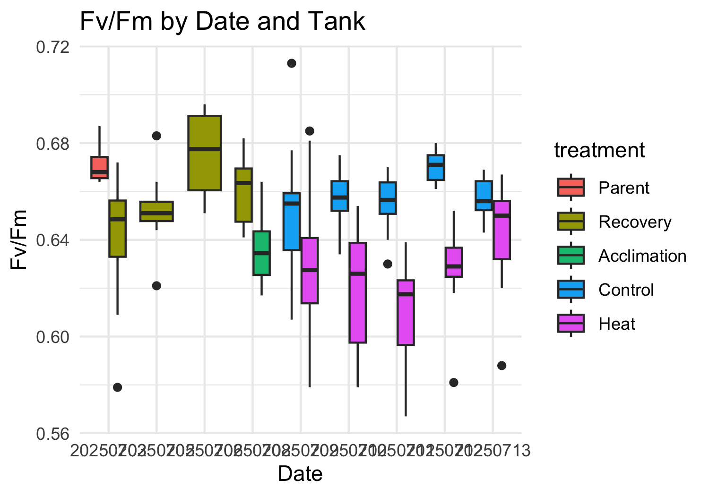

``` r
ggsave("../output/FvFm_recovery_acclimation.png", plot = last_plot(), width = 9, height = 4, bg = "white")
```

``` r
PAM_exp <- PAM %>% filter(treatment!="Acclimation" & treatment!="Recovery" & treatment!="Parent") %>% mutate(plug = fct_drop(plug))
table(PAM_exp$plug)
```

    ## 
    ## 1038 1043 1059 1100 1122 1159 1175 1223 1281 1450 1471 1473 1474 1614 1626 1691 
    ##   10   10   10   10   10   10   10   10   10   10   10   10   10   10   10   10 
    ## 1753 1761 2195 2370 2565 2666 2730 2986 
    ##   10   10   10   10   10   10   10   10

``` r
ggplot(PAM_exp,aes(x = timepoint, y = fv_fm_y_1000)) + 
    geom_boxplot(aes(fill = treatment)) +theme_minimal() +scale_fill_manual(values = custom_colors) 
```

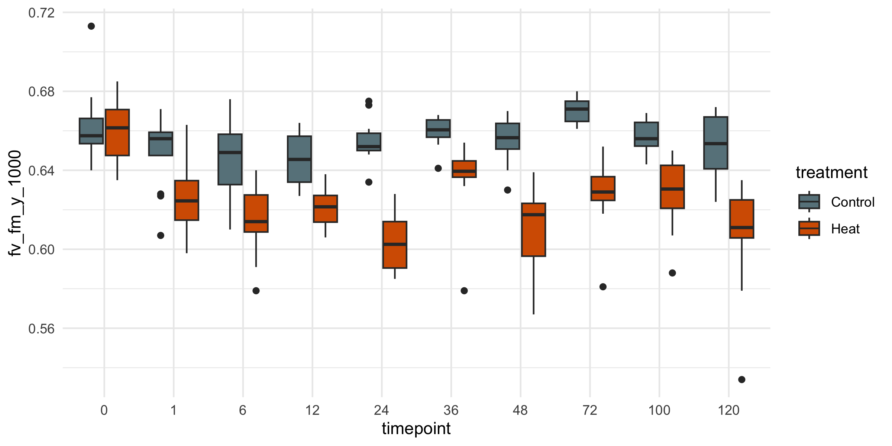

``` r
ggplot(PAM_exp,aes(x = timepoint, y = fv_fm_y_1000, group = plug)) + 
    geom_path(aes(color=plug)) + theme_minimal() #+facet_wrap(tank_id~treatment)
```

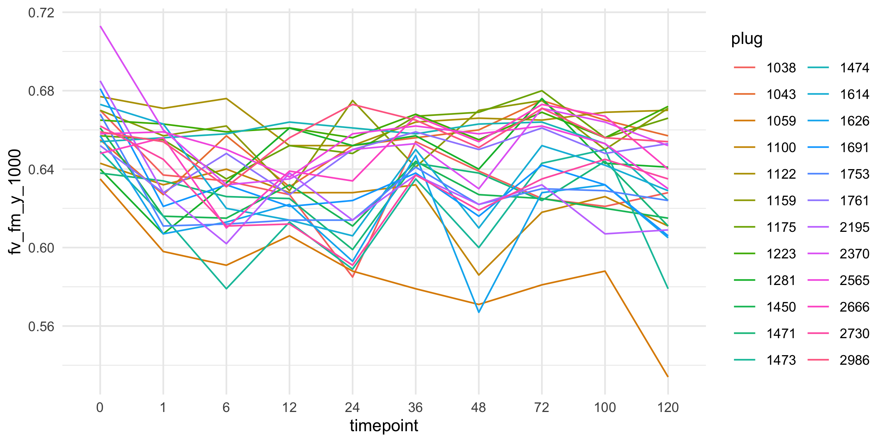

``` r
ggplot(PAM_exp,aes(x = timepoint, y = fv_fm_y_1000, group = plug)) + 
    geom_path(aes(color=tank_id)) + theme_minimal() #+facet_wrap(tank_id~treatment)
```

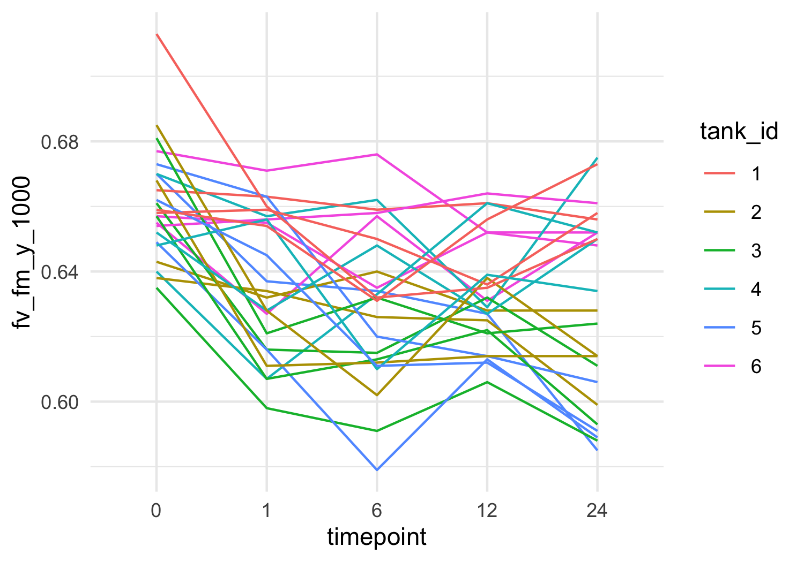

``` r
# mixed model
model <- lm(fv_fm_y_1000 ~ timepoint, data = PAM_exp)
summary(model)
```

    ## 
    ## Call:
    ## lm(formula = fv_fm_y_1000 ~ timepoint, data = PAM_exp)
    ## 
    ## Residuals:
    ##      Min       1Q   Median       3Q      Max 
    ## -0.09583 -0.01529  0.00075  0.01888  0.05175 
    ## 
    ## Coefficients:
    ##               Estimate Std. Error t value Pr(>|t|)    
    ## (Intercept)   0.661250   0.004894 135.117  < 2e-16 ***
    ## timepoint1   -0.023708   0.006921  -3.426 0.000727 ***
    ## timepoint6   -0.031000   0.006921  -4.479 1.18e-05 ***
    ## timepoint12  -0.028125   0.006921  -4.064 6.63e-05 ***
    ## timepoint24  -0.031958   0.006921  -4.618 6.46e-06 ***
    ## timepoint36  -0.013167   0.006921  -1.902 0.058366 .  
    ## timepoint48  -0.028625   0.006921  -4.136 4.96e-05 ***
    ## timepoint72  -0.012208   0.006921  -1.764 0.079068 .  
    ## timepoint100 -0.018917   0.006921  -2.733 0.006759 ** 
    ## timepoint120 -0.031417   0.006921  -4.539 9.10e-06 ***
    ## ---
    ## Signif. codes:  0 '***' 0.001 '**' 0.01 '*' 0.05 '.' 0.1 ' ' 1
    ## 
    ## Residual standard error: 0.02398 on 230 degrees of freedom
    ## Multiple R-squared:  0.1563, Adjusted R-squared:  0.1233 
    ## F-statistic: 4.734 on 9 and 230 DF,  p-value: 8.701e-06

``` r
# Estimated marginal means (adjusted for random effects and model structure)
emm <- emmeans(model, ~ timepoint)
pairs(emm)
```

    ##  contrast                     estimate      SE  df t.ratio p.value
    ##  timepoint0 - timepoint1      0.023708 0.00692 230   3.426  0.0248
    ##  timepoint0 - timepoint6      0.031000 0.00692 230   4.479  0.0005
    ##  timepoint0 - timepoint12     0.028125 0.00692 230   4.064  0.0026
    ##  timepoint0 - timepoint24     0.031958 0.00692 230   4.618  0.0003
    ##  timepoint0 - timepoint36     0.013167 0.00692 230   1.902  0.6675
    ##  timepoint0 - timepoint48     0.028625 0.00692 230   4.136  0.0020
    ##  timepoint0 - timepoint72     0.012208 0.00692 230   1.764  0.7570
    ##  timepoint0 - timepoint100    0.018917 0.00692 230   2.733  0.1668
    ##  timepoint0 - timepoint120    0.031417 0.00692 230   4.539  0.0004
    ##  timepoint1 - timepoint6      0.007292 0.00692 230   1.054  0.9884
    ##  timepoint1 - timepoint12     0.004417 0.00692 230   0.638  0.9998
    ##  timepoint1 - timepoint24     0.008250 0.00692 230   1.192  0.9730
    ##  timepoint1 - timepoint36    -0.010542 0.00692 230  -1.523  0.8817
    ##  timepoint1 - timepoint48     0.004917 0.00692 230   0.710  0.9994
    ##  timepoint1 - timepoint72    -0.011500 0.00692 230  -1.662  0.8156
    ##  timepoint1 - timepoint100   -0.004792 0.00692 230  -0.692  0.9995
    ##  timepoint1 - timepoint120    0.007708 0.00692 230   1.114  0.9829
    ##  timepoint6 - timepoint12    -0.002875 0.00692 230  -0.415  1.0000
    ##  timepoint6 - timepoint24     0.000958 0.00692 230   0.138  1.0000
    ##  timepoint6 - timepoint36    -0.017833 0.00692 230  -2.577  0.2348
    ##  timepoint6 - timepoint48    -0.002375 0.00692 230  -0.343  1.0000
    ##  timepoint6 - timepoint72    -0.018792 0.00692 230  -2.715  0.1738
    ##  timepoint6 - timepoint100   -0.012083 0.00692 230  -1.746  0.7679
    ##  timepoint6 - timepoint120    0.000417 0.00692 230   0.060  1.0000
    ##  timepoint12 - timepoint24    0.003833 0.00692 230   0.554  0.9999
    ##  timepoint12 - timepoint36   -0.014958 0.00692 230  -2.161  0.4865
    ##  timepoint12 - timepoint48    0.000500 0.00692 230   0.072  1.0000
    ##  timepoint12 - timepoint72   -0.015917 0.00692 230  -2.300  0.3932
    ##  timepoint12 - timepoint100  -0.009208 0.00692 230  -1.330  0.9456
    ##  timepoint12 - timepoint120   0.003292 0.00692 230   0.476  1.0000
    ##  timepoint24 - timepoint36   -0.018792 0.00692 230  -2.715  0.1738
    ##  timepoint24 - timepoint48   -0.003333 0.00692 230  -0.482  1.0000
    ##  timepoint24 - timepoint72   -0.019750 0.00692 230  -2.854  0.1252
    ##  timepoint24 - timepoint100  -0.013042 0.00692 230  -1.884  0.6796
    ##  timepoint24 - timepoint120  -0.000542 0.00692 230  -0.078  1.0000
    ##  timepoint36 - timepoint48    0.015458 0.00692 230   2.234  0.4370
    ##  timepoint36 - timepoint72   -0.000958 0.00692 230  -0.138  1.0000
    ##  timepoint36 - timepoint100   0.005750 0.00692 230   0.831  0.9980
    ##  timepoint36 - timepoint120   0.018250 0.00692 230   2.637  0.2068
    ##  timepoint48 - timepoint72   -0.016417 0.00692 230  -2.372  0.3477
    ##  timepoint48 - timepoint100  -0.009708 0.00692 230  -1.403  0.9254
    ##  timepoint48 - timepoint120   0.002792 0.00692 230   0.403  1.0000
    ##  timepoint72 - timepoint100   0.006708 0.00692 230   0.969  0.9937
    ##  timepoint72 - timepoint120   0.019208 0.00692 230   2.775  0.1512
    ##  timepoint100 - timepoint120  0.012500 0.00692 230   1.806  0.7308
    ## 
    ## P value adjustment: tukey method for comparing a family of 10 estimates

## 0.1 Statistical Mixed Model by treatment, timepoint, and tank_id

``` r
# mixed model
model <- lmer(fv_fm_y_1000 ~ treatment * timepoint + (1 | treatment:tank_id), data = PAM_exp)
summary(model)
```

    ## Linear mixed model fit by REML. t-tests use Satterthwaite's method [
    ## lmerModLmerTest]
    ## Formula: fv_fm_y_1000 ~ treatment * timepoint + (1 | treatment:tank_id)
    ##    Data: PAM_exp
    ## 
    ## REML criterion at convergence: -1142.6
    ## 
    ## Scaled residuals: 
    ##     Min      1Q  Median      3Q     Max 
    ## -4.2103 -0.5202  0.0944  0.6087  3.1054 
    ## 
    ## Random effects:
    ##  Groups            Name        Variance  Std.Dev.
    ##  treatment:tank_id (Intercept) 2.662e-05 0.00516 
    ##  Residual                      2.516e-04 0.01586 
    ## Number of obs: 240, groups:  treatment:tank_id, 6
    ## 
    ## Fixed effects:
    ##                              Estimate Std. Error         df t value Pr(>|t|)
    ## (Intercept)                  0.662333   0.005463  28.054916 121.245  < 2e-16
    ## treatmentHeat               -0.002167   0.007725  28.054916  -0.280  0.78118
    ## timepoint1                  -0.012917   0.006476 216.000001  -1.995  0.04734
    ## timepoint6                  -0.016417   0.006476 216.000001  -2.535  0.01195
    ## timepoint12                 -0.017083   0.006476 216.000001  -2.638  0.00894
    ## timepoint24                 -0.007250   0.006476 216.000001  -1.120  0.26413
    ## timepoint36                 -0.002583   0.006476 216.000001  -0.399  0.69034
    ## timepoint48                 -0.006833   0.006476 216.000001  -1.055  0.29249
    ## timepoint72                  0.007833   0.006476 216.000001   1.210  0.22773
    ## timepoint100                -0.005667   0.006476 216.000001  -0.875  0.38250
    ## timepoint120                -0.009833   0.006476 216.000001  -1.519  0.13035
    ## treatmentHeat:timepoint1    -0.021583   0.009158 216.000001  -2.357  0.01933
    ## treatmentHeat:timepoint6    -0.029167   0.009158 216.000001  -3.185  0.00166
    ## treatmentHeat:timepoint12   -0.022083   0.009158 216.000001  -2.411  0.01673
    ## treatmentHeat:timepoint24   -0.049417   0.009158 216.000001  -5.396 1.79e-07
    ## treatmentHeat:timepoint36   -0.021167   0.009158 216.000001  -2.311  0.02176
    ## treatmentHeat:timepoint48   -0.043583   0.009158 216.000001  -4.759 3.56e-06
    ## treatmentHeat:timepoint72   -0.040083   0.009158 216.000001  -4.377 1.87e-05
    ## treatmentHeat:timepoint100  -0.026500   0.009158 216.000001  -2.894  0.00420
    ## treatmentHeat:timepoint120  -0.043167   0.009158 216.000001  -4.714 4.36e-06
    ##                               
    ## (Intercept)                ***
    ## treatmentHeat                 
    ## timepoint1                 *  
    ## timepoint6                 *  
    ## timepoint12                ** 
    ## timepoint24                   
    ## timepoint36                   
    ## timepoint48                   
    ## timepoint72                   
    ## timepoint100                  
    ## timepoint120                  
    ## treatmentHeat:timepoint1   *  
    ## treatmentHeat:timepoint6   ** 
    ## treatmentHeat:timepoint12  *  
    ## treatmentHeat:timepoint24  ***
    ## treatmentHeat:timepoint36  *  
    ## treatmentHeat:timepoint48  ***
    ## treatmentHeat:timepoint72  ***
    ## treatmentHeat:timepoint100 ** 
    ## treatmentHeat:timepoint120 ***
    ## ---
    ## Signif. codes:  0 '***' 0.001 '**' 0.01 '*' 0.05 '.' 0.1 ' ' 1

``` r
# Estimated marginal means (adjusted for random effects and model structure)
emm <- emmeans(model, ~ treatment | timepoint)
pairs(emm)
```

    ## timepoint = 0:
    ##  contrast       estimate      SE df t.ratio p.value
    ##  Control - Heat  0.00217 0.00773 28   0.280  0.7812
    ## 
    ## timepoint = 1:
    ##  contrast       estimate      SE df t.ratio p.value
    ##  Control - Heat  0.02375 0.00773 28   3.074  0.0047
    ## 
    ## timepoint = 6:
    ##  contrast       estimate      SE df t.ratio p.value
    ##  Control - Heat  0.03133 0.00773 28   4.056  0.0004
    ## 
    ## timepoint = 12:
    ##  contrast       estimate      SE df t.ratio p.value
    ##  Control - Heat  0.02425 0.00773 28   3.139  0.0040
    ## 
    ## timepoint = 24:
    ##  contrast       estimate      SE df t.ratio p.value
    ##  Control - Heat  0.05158 0.00773 28   6.677  <.0001
    ## 
    ## timepoint = 36:
    ##  contrast       estimate      SE df t.ratio p.value
    ##  Control - Heat  0.02333 0.00773 28   3.020  0.0053
    ## 
    ## timepoint = 48:
    ##  contrast       estimate      SE df t.ratio p.value
    ##  Control - Heat  0.04575 0.00773 28   5.922  <.0001
    ## 
    ## timepoint = 72:
    ##  contrast       estimate      SE df t.ratio p.value
    ##  Control - Heat  0.04225 0.00773 28   5.469  <.0001
    ## 
    ## timepoint = 100:
    ##  contrast       estimate      SE df t.ratio p.value
    ##  Control - Heat  0.02867 0.00773 28   3.711  0.0009
    ## 
    ## timepoint = 120:
    ##  contrast       estimate      SE df t.ratio p.value
    ##  Control - Heat  0.04533 0.00773 28   5.868  <.0001
    ## 
    ## Degrees-of-freedom method: kenward-roger

``` r
summary_table <- as.data.frame(pairs(emm)) %>%
  transmute(
    Timepoint = as.numeric(as.character(timepoint)),
    `Estimate (Control-Heat)` = round(estimate, 4),
    `SE` = round(SE, 4),
    `t-ratio` = round(t.ratio, 2),
    `p-value` = signif(p.value, 3),
    `Significant?` = case_when(
      p.value < 0.001 ~ "***",
      p.value < 0.01 ~ "**",
      p.value < 0.05 ~ "*",
      p.value < 0.1 ~ ".",
      TRUE ~ ""
    )
  )

print(summary_table)
```

    ##    Timepoint Estimate (Control-Heat)     SE t-ratio  p-value Significant?
    ## 1          0                  0.0022 0.0077    0.28 7.81e-01             
    ## 2          1                  0.0237 0.0077    3.07 4.67e-03           **
    ## 3          6                  0.0313 0.0077    4.06 3.61e-04          ***
    ## 4         12                  0.0242 0.0077    3.14 3.97e-03           **
    ## 5         24                  0.0516 0.0077    6.68 2.99e-07          ***
    ## 6         36                  0.0233 0.0077    3.02 5.34e-03           **
    ## 7         48                  0.0457 0.0077    5.92 2.24e-06          ***
    ## 8         72                  0.0422 0.0077    5.47 7.66e-06          ***
    ## 9        100                  0.0287 0.0077    3.71 9.06e-04          ***
    ## 10       120                  0.0453 0.0077    5.87 2.59e-06          ***

``` r
write.csv(summary_table, "../output/FvFm_treatment_effect_summary.csv", row.names = FALSE)
```

``` r
contrast_table <- as.data.frame(pairs(emm)) %>%
  mutate(
    timepoint = as.numeric(as.character(timepoint)),
    signif = case_when(
      p.value < 0.001 ~ "***",
      p.value < 0.01 ~ "**",
      p.value < 0.05 ~ "*",
      p.value < 0.1 ~ ".",
      TRUE ~ ""
    )
  )

ggplot(contrast_table, aes(x = timepoint, y = estimate)) +
  geom_errorbar(aes(ymin = estimate - SE, ymax = estimate + SE),width = 3, alpha = 0.6) +
  geom_line(size = 1, aes(group = 1), color = "black", alpha = 0.7) +
  geom_point(size = 2.5, aes(color = p.value < 0.05)) +
  geom_text(aes(label = signif), vjust = -2.5, size = 5, fontface = "bold", color = "black") +
  scale_color_manual(values = c("TRUE" = "#D55E00", "FALSE" = "grey60"), name = "p < 0.05") +
  labs(
    title = "Estimated Treatment Effect (Control-Heat) on Fv/Fm",
    x = "Timepoint (h)",
    y = "Estimated Difference in Fv/Fm") +
  theme_minimal() +
  theme(panel.grid.minor = element_blank(),panel.grid.major.x = element_blank())
```

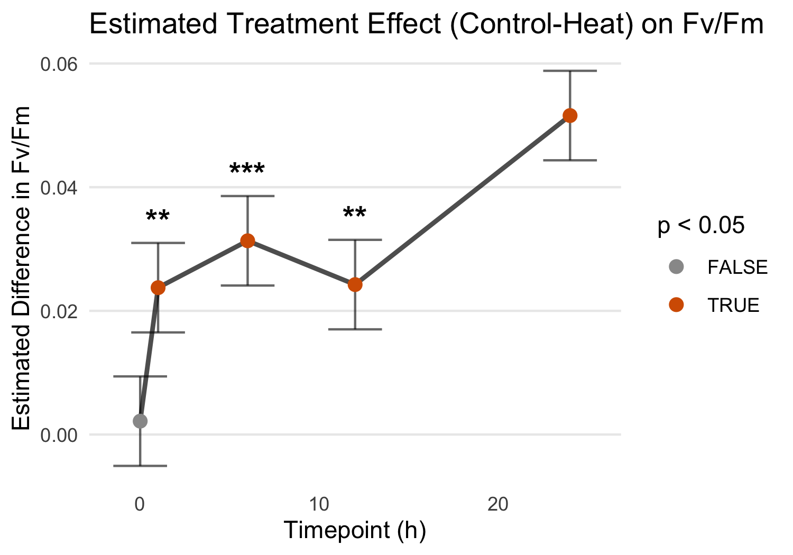

``` r
PAM_means_treatment <- PAM_exp %>%
  group_by(date, timepoint, treatment) %>%
  summarise(
    FvFm_mean = mean(fv_fm_y_1000, na.rm = TRUE),
    FvFm_SE = sd(fv_fm_y_1000, na.rm = TRUE) / sqrt(n()),
    .groups = 'drop'
  )

ggplot(PAM_means_treatment, aes(x = timepoint, y = FvFm_mean, color = treatment,group = treatment)) +
  geom_point(size = 2.5) +
  geom_errorbar(aes(ymin = FvFm_mean - FvFm_SE, ymax = FvFm_mean + FvFm_SE),
                width = 0.2) +
  geom_line(stat = "summary", fun = mean, size = 1.2, aes(group = treatment)) +
  labs(x = "Timepoint",y = "Mean Fv/Fm") +
  theme_minimal() +scale_color_manual(values = custom_colors)
```

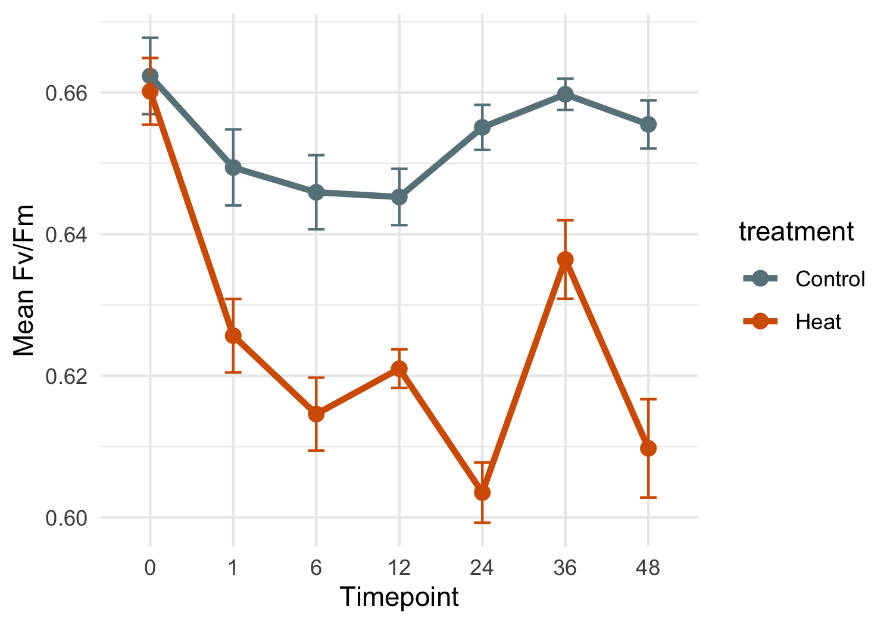

``` r
PAM_means <- PAM_exp %>%
  group_by(date, timepoint, treatment, tank_id) %>%
  summarise(
    FvFm_mean = mean(fv_fm_y_1000, na.rm = TRUE),
    FvFm_SE = sd(fv_fm_y_1000, na.rm = TRUE) / sqrt(n()),
    .groups = 'drop'
  )

ggplot(PAM_means, aes(x = timepoint, y = FvFm_mean, color = treatment, shape = tank_id)) +
  geom_point(stat = "summary", fun = mean, aes(group = treatment), size=2.5) +
  geom_point(position = position_dodge(width = 0.5), size = 2.5, alpha=0.5) +
  geom_errorbar(aes(ymin = FvFm_mean - FvFm_SE, ymax = FvFm_mean + FvFm_SE),
                width = 0.2, position = position_dodge(width = 0.5), alpha=0.5) +
  geom_line(stat = "summary", fun = mean, size = 1.2, aes(group = treatment)) +
  labs(x = "Timepoint",y = "Mean Fv/Fm") +
  theme_minimal() +scale_color_manual(values = custom_colors) +
  stat_compare_means(aes(group = treatment),method = "anova",label = "p.format",size = 2.5)
```

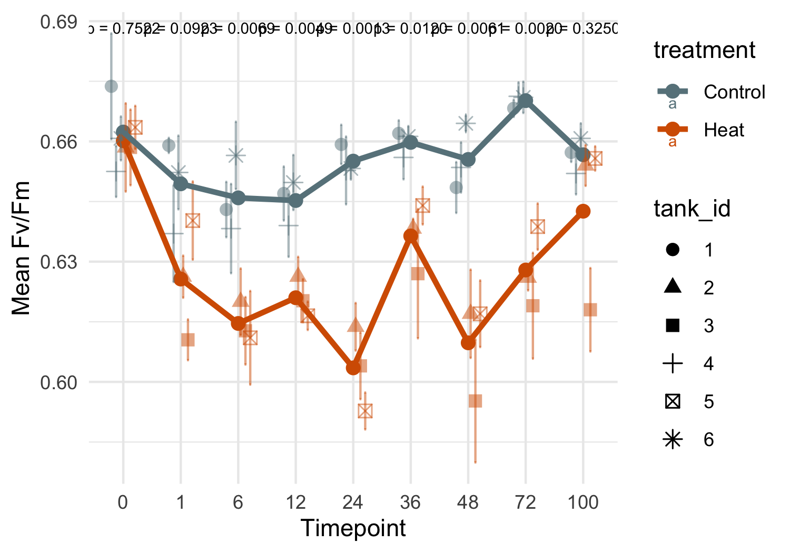

``` r
ggplot(PAM_exp, aes(x = timepoint, y = fv_fm_y_1000, color = treatment, shape = tank_id)) +
  geom_point(stat = "summary", fun = mean, aes(group = treatment), size=2.5) +
  geom_point(position = position_dodge(width = 0.5), size = 2.5, alpha=0.5) +
  geom_line(stat = "summary", fun = mean, size = 1.2, aes(group = treatment)) +
  labs(x = "Timepoint",y = "Mean Fv/Fm") +
  theme_minimal() +scale_color_manual(values = custom_colors) +
  stat_compare_means(aes(group = treatment),method = "anova",label = "p.format",size = 3)
```

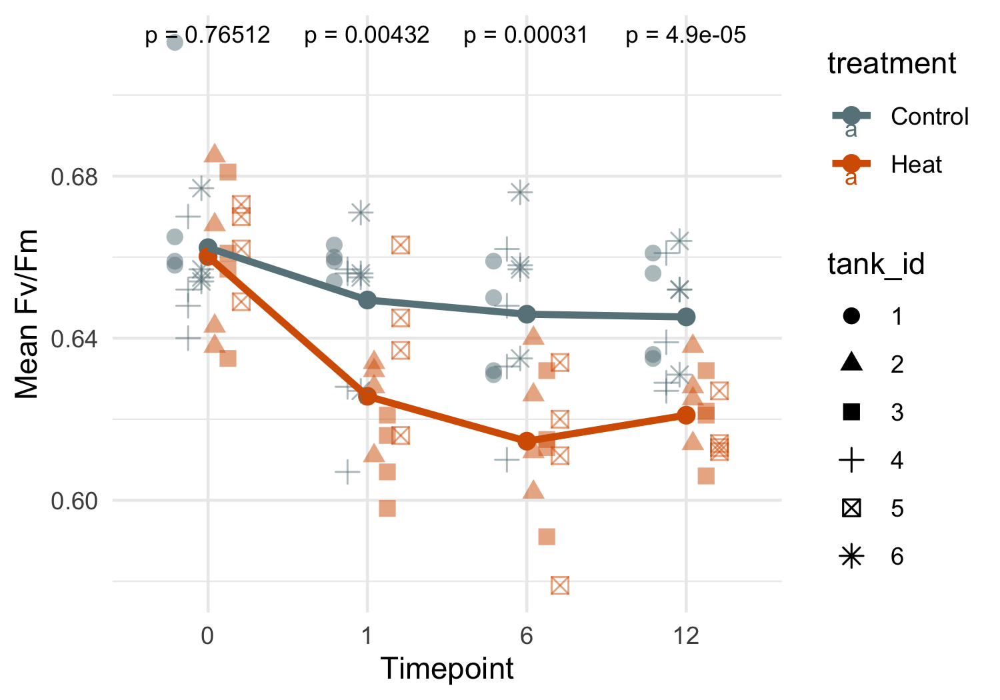

``` r
ggplot(PAM_means, aes(x = timepoint, y = FvFm_mean, color = tank_id, group = tank_id)) +
  geom_line(size = 0.8, alpha = 0.7) +
  labs(x = "Timepoint",y = "Mean Fv/Fm") +
  theme_minimal() + facet_wrap(~treatment)
```

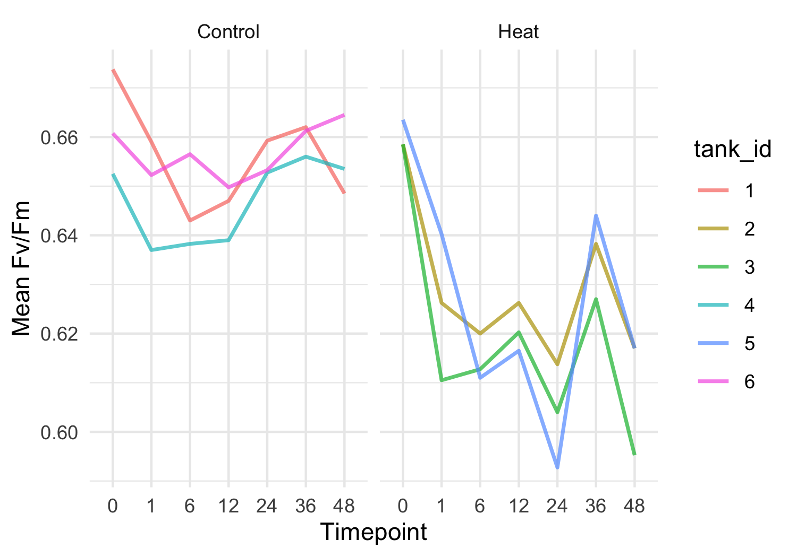

``` r
PAM_exp %>% filter(dark_adapt_mins != "overnight") %>% ggplot(aes(x = dark_adapt_mins, y = fv_fm_y_1000)) + 
    geom_point(aes(color=treatment)) +
  geom_smooth(aes(group = treatment, color = treatment), method = "lm", se = FALSE) +  # or method = "loess"
  theme_minimal() + scale_color_manual(values = custom_colors)
```

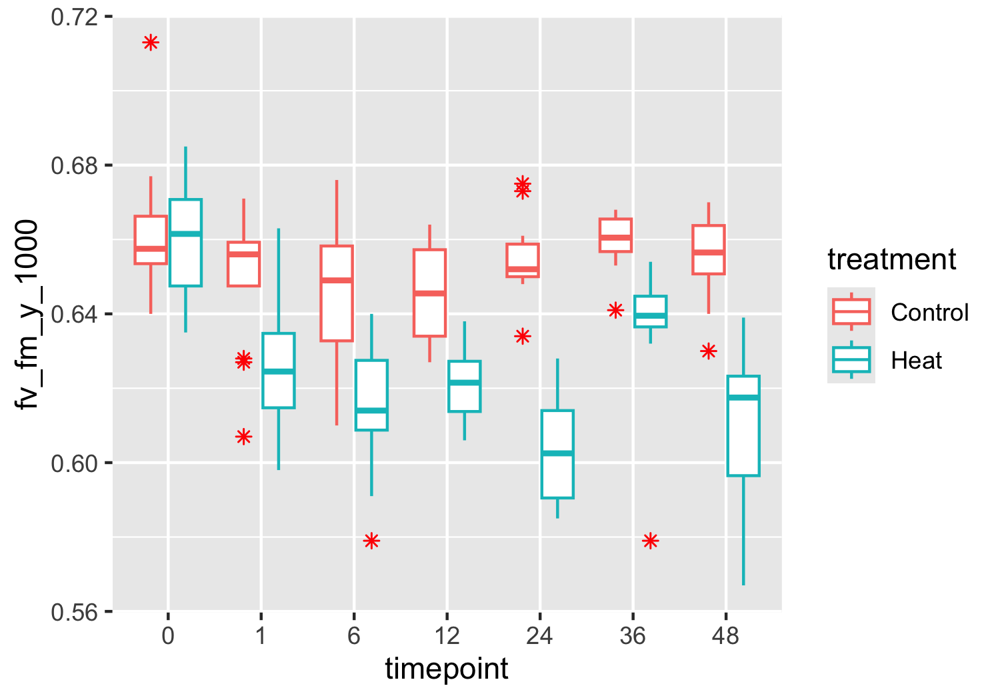

## 0.2 Outliers

``` r
ggplot(PAM_exp, aes(x = timepoint, y = fv_fm_y_1000, color = treatment)) +
  geom_boxplot(outlier.colour = "red", outlier.shape = 8) 
```

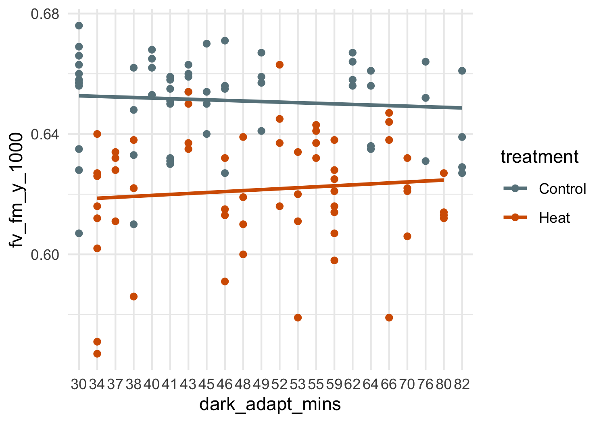

``` r
ggplot(PAM_exp, aes(x = treatment, y = fv_fm_y_1000)) +
  geom_boxplot(outlier.colour = "red", outlier.shape = 8) 
```

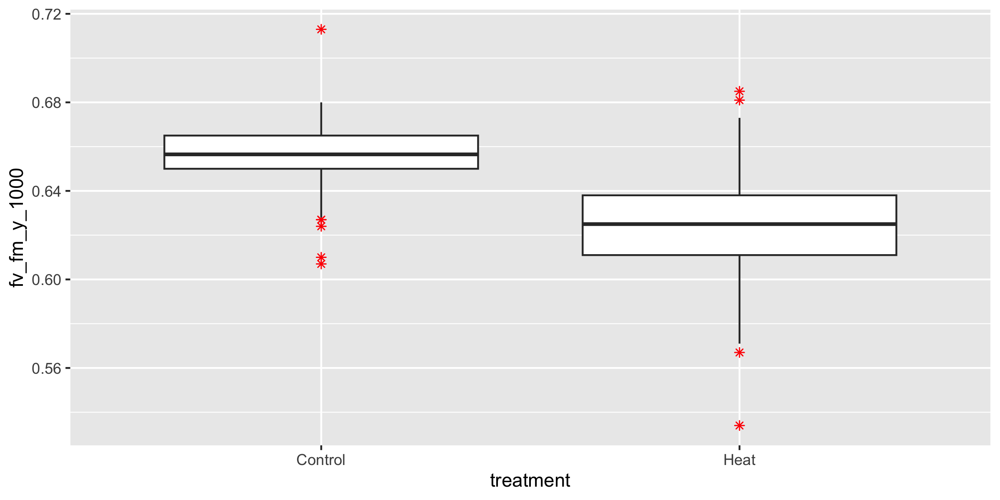

### 0.2.1 Remove outliers via IQR

``` r
# IQR method 
Q1 <- quantile(PAM_exp$fv_fm_y_1000, 0.25)
Q3 <- quantile(PAM_exp$fv_fm_y_1000, 0.75)
IQR_val <- Q3 - Q1

lower_bound <- Q1 - 1.5 * IQR_val
upper_bound <- Q3 + 1.5 * IQR_val
outliers <- PAM_exp[PAM_exp$fv_fm_y_1000 < lower_bound | PAM_exp$fv_fm_y_1000 > upper_bound, ]
print(outliers)
```

    ##         date treatment timepoint tank_id  time initials dark_adapt_mins plug
    ## 4   20250709   Control         0       1 08:10    JA;ZD       overnight 2370
    ## 149 20250711      Heat        48       3 08:40   ZD;TJW              34 1626
    ## 151 20250711      Heat        48       3 08:40   ZD;TJW              34 1059
    ## 236 20250714      Heat       120       3 08:15       ZD       overnight 1059
    ##      mem fluorescence_yield_f max_fluorescence_yield_m_fm yield_y fv_fm_y_1000
    ## 4   3368                  501                        1748     713        0.713
    ## 149 3562                  429                         991     567        0.567
    ## 151 3564                  250                         583     571        0.571
    ## 236 3668                  206                         443     534        0.534
    ##     notes
    ## 4        
    ## 149      
    ## 151      
    ## 236

``` r
# Filter dataset to remove outliers
PAM_exp_filtered_IQR <- PAM_exp[PAM_exp$fv_fm_y_1000 >= lower_bound & PAM_exp$fv_fm_y_1000 <= upper_bound, ]

# Check dimensions before and after
dim(PAM_exp)
```

    ## [1] 240  14

``` r
dim(PAM_exp_filtered_IQR)
```

    ## [1] 236  14

``` r
table(PAM_exp_filtered_IQR$plug)
```

    ## 
    ## 1038 1043 1059 1100 1122 1159 1175 1223 1281 1450 1471 1473 1474 1614 1626 1691 
    ##   10   10    8   10   10   10   10   10   10   10   10   10   10   10    9   10 
    ## 1753 1761 2195 2370 2565 2666 2730 2986 
    ##   10   10   10    9   10   10   10   10

``` r
ggplot(PAM_exp_filtered_IQR,aes(x = timepoint, y = fv_fm_y_1000)) + 
    geom_boxplot(aes(fill = treatment)) +theme_minimal() +scale_fill_manual(values = custom_colors) 
```

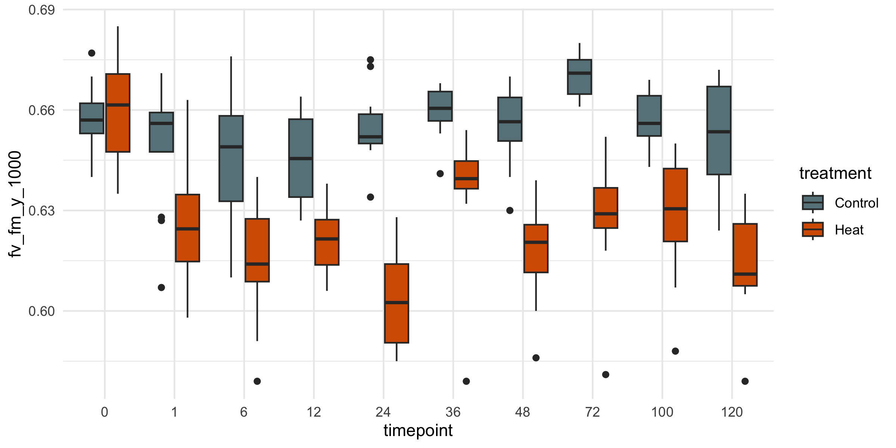

``` r
ggplot(PAM_exp_filtered_IQR,aes(x = timepoint, y = fv_fm_y_1000, group = plug)) + 
    geom_path(aes(color=plug)) + theme_minimal() #+facet_wrap(tank_id~treatment)
```

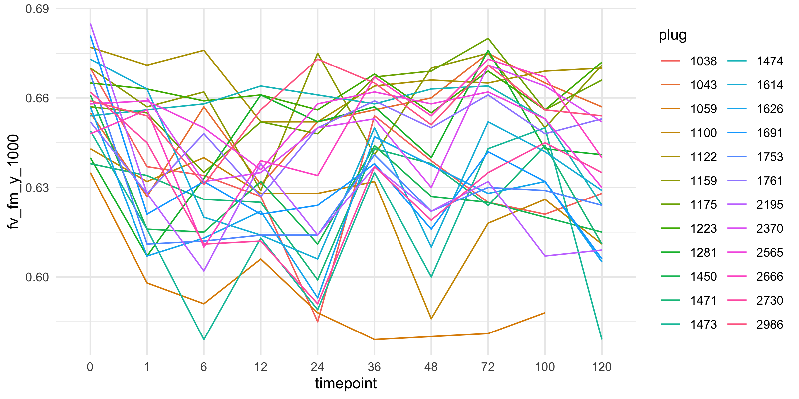

``` r
ggplot(PAM_exp_filtered_IQR,aes(x = timepoint, y = fv_fm_y_1000, group = plug)) + 
    geom_path(aes(color=tank_id)) + theme_minimal() #+facet_wrap(tank_id~treatment)
```

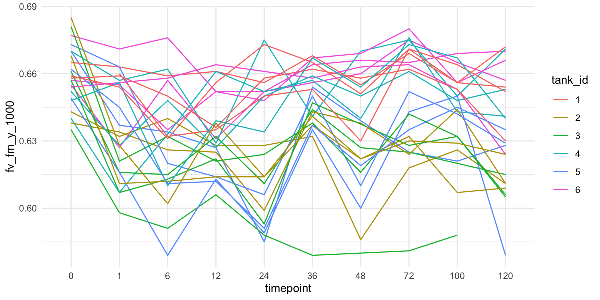

``` r
# mixed model
model <- lm(fv_fm_y_1000 ~ timepoint, data = PAM_exp_filtered_IQR)
summary(model)
```

    ## 
    ## Call:
    ## lm(formula = fv_fm_y_1000 ~ timepoint, data = PAM_exp_filtered_IQR)
    ## 
    ## Residuals:
    ##       Min        1Q    Median        3Q       Max 
    ## -0.069083 -0.016021  0.000875  0.018521  0.045750 
    ## 
    ## Coefficients:
    ##               Estimate Std. Error t value Pr(>|t|)    
    ## (Intercept)   0.659000   0.004621 142.615  < 2e-16 ***
    ## timepoint1   -0.021458   0.006466  -3.318 0.001055 ** 
    ## timepoint6   -0.028750   0.006466  -4.446 1.37e-05 ***
    ## timepoint12  -0.025875   0.006466  -4.001 8.54e-05 ***
    ## timepoint24  -0.029708   0.006466  -4.594 7.22e-06 ***
    ## timepoint36  -0.010917   0.006466  -1.688 0.092749 .  
    ## timepoint48  -0.020591   0.006609  -3.116 0.002072 ** 
    ## timepoint72  -0.009958   0.006466  -1.540 0.124956    
    ## timepoint100 -0.016667   0.006466  -2.577 0.010589 *  
    ## timepoint120 -0.025000   0.006535  -3.826 0.000169 ***
    ## ---
    ## Signif. codes:  0 '***' 0.001 '**' 0.01 '*' 0.05 '.' 0.1 ' ' 1
    ## 
    ## Residual standard error: 0.02216 on 226 degrees of freedom
    ## Multiple R-squared:  0.1472, Adjusted R-squared:  0.1133 
    ## F-statistic: 4.335 on 9 and 226 DF,  p-value: 3.182e-05

``` r
# Estimated marginal means (adjusted for random effects and model structure)
emm <- emmeans(model, ~ timepoint)
pairs(emm)
```

    ##  contrast                     estimate      SE  df t.ratio p.value
    ##  timepoint0 - timepoint1      0.021458 0.00647 226   3.318  0.0347
    ##  timepoint0 - timepoint6      0.028750 0.00647 226   4.446  0.0006
    ##  timepoint0 - timepoint12     0.025875 0.00647 226   4.001  0.0033
    ##  timepoint0 - timepoint24     0.029708 0.00647 226   4.594  0.0003
    ##  timepoint0 - timepoint36     0.010917 0.00647 226   1.688  0.8011
    ##  timepoint0 - timepoint48     0.020591 0.00661 226   3.116  0.0628
    ##  timepoint0 - timepoint72     0.009958 0.00647 226   1.540  0.8745
    ##  timepoint0 - timepoint100    0.016667 0.00647 226   2.577  0.2346
    ##  timepoint0 - timepoint120    0.025000 0.00653 226   3.826  0.0064
    ##  timepoint1 - timepoint6      0.007292 0.00640 226   1.140  0.9800
    ##  timepoint1 - timepoint12     0.004417 0.00640 226   0.690  0.9995
    ##  timepoint1 - timepoint24     0.008250 0.00640 226   1.290  0.9551
    ##  timepoint1 - timepoint36    -0.010542 0.00640 226  -1.648  0.8229
    ##  timepoint1 - timepoint48    -0.000867 0.00654 226  -0.133  1.0000
    ##  timepoint1 - timepoint72    -0.011500 0.00640 226  -1.798  0.7361
    ##  timepoint1 - timepoint100   -0.004792 0.00640 226  -0.749  0.9991
    ##  timepoint1 - timepoint120    0.003542 0.00647 226   0.548  0.9999
    ##  timepoint6 - timepoint12    -0.002875 0.00640 226  -0.449  1.0000
    ##  timepoint6 - timepoint24     0.000958 0.00640 226   0.150  1.0000
    ##  timepoint6 - timepoint36    -0.017833 0.00640 226  -2.788  0.1470
    ##  timepoint6 - timepoint48    -0.008159 0.00654 226  -1.247  0.9637
    ##  timepoint6 - timepoint72    -0.018792 0.00640 226  -2.937  0.1015
    ##  timepoint6 - timepoint100   -0.012083 0.00640 226  -1.889  0.6766
    ##  timepoint6 - timepoint120   -0.003750 0.00647 226  -0.580  0.9999
    ##  timepoint12 - timepoint24    0.003833 0.00640 226   0.599  0.9999
    ##  timepoint12 - timepoint36   -0.014958 0.00640 226  -2.338  0.3687
    ##  timepoint12 - timepoint48   -0.005284 0.00654 226  -0.808  0.9984
    ##  timepoint12 - timepoint72   -0.015917 0.00640 226  -2.488  0.2806
    ##  timepoint12 - timepoint100  -0.009208 0.00640 226  -1.439  0.9134
    ##  timepoint12 - timepoint120  -0.000875 0.00647 226  -0.135  1.0000
    ##  timepoint24 - timepoint36   -0.018792 0.00640 226  -2.937  0.1015
    ##  timepoint24 - timepoint48   -0.009117 0.00654 226  -1.394  0.9281
    ##  timepoint24 - timepoint72   -0.019750 0.00640 226  -3.087  0.0680
    ##  timepoint24 - timepoint100  -0.013042 0.00640 226  -2.039  0.5727
    ##  timepoint24 - timepoint120  -0.004708 0.00647 226  -0.728  0.9993
    ##  timepoint36 - timepoint48    0.009674 0.00654 226   1.479  0.8992
    ##  timepoint36 - timepoint72   -0.000958 0.00640 226  -0.150  1.0000
    ##  timepoint36 - timepoint100   0.005750 0.00640 226   0.899  0.9964
    ##  timepoint36 - timepoint120   0.014083 0.00647 226   2.178  0.4750
    ##  timepoint48 - timepoint72   -0.010633 0.00654 226  -1.626  0.8344
    ##  timepoint48 - timepoint100  -0.003924 0.00654 226  -0.600  0.9999
    ##  timepoint48 - timepoint120   0.004409 0.00661 226   0.667  0.9997
    ##  timepoint72 - timepoint100   0.006708 0.00640 226   1.049  0.9888
    ##  timepoint72 - timepoint120   0.015042 0.00647 226   2.326  0.3764
    ##  timepoint100 - timepoint120  0.008333 0.00647 226   1.289  0.9553
    ## 
    ## P value adjustment: tukey method for comparing a family of 10 estimates

## 0.3 Statistical Mixed Model by treatment, timepoint, and tank_id

``` r
# mixed model
model <- lmer(fv_fm_y_1000 ~ treatment * timepoint + (1 | treatment:tank_id), data = PAM_exp_filtered_IQR)
summary(model)
```

    ## Linear mixed model fit by REML. t-tests use Satterthwaite's method [
    ## lmerModLmerTest]
    ## Formula: fv_fm_y_1000 ~ treatment * timepoint + (1 | treatment:tank_id)
    ##    Data: PAM_exp_filtered_IQR
    ## 
    ## REML criterion at convergence: -1164.1
    ## 
    ## Scaled residuals: 
    ##     Min      1Q  Median      3Q     Max 
    ## -3.7254 -0.4592  0.0916  0.6364  2.4241 
    ## 
    ## Random effects:
    ##  Groups            Name        Variance  Std.Dev.
    ##  treatment:tank_id (Intercept) 1.353e-05 0.003678
    ##  Residual                      2.078e-04 0.014414
    ## Number of obs: 236, groups:  treatment:tank_id, 6
    ## 
    ## Fixed effects:
    ##                              Estimate Std. Error         df t value Pr(>|t|)
    ## (Intercept)                  0.657782   0.004839  48.443236 135.931  < 2e-16
    ## treatmentHeat                0.002385   0.006726  45.757564   0.355 0.724547
    ## timepoint1                  -0.008365   0.006018 212.066938  -1.390 0.165999
    ## timepoint6                  -0.011865   0.006018 212.066938  -1.972 0.049965
    ## timepoint12                 -0.012532   0.006018 212.066938  -2.082 0.038516
    ## timepoint24                 -0.002699   0.006018 212.066938  -0.448 0.654330
    ## timepoint36                  0.001968   0.006018 212.066938   0.327 0.743975
    ## timepoint48                 -0.002282   0.006018 212.066938  -0.379 0.704951
    ## timepoint72                  0.012385   0.006018 212.066938   2.058 0.040828
    ## timepoint100                -0.001115   0.006018 212.066938  -0.185 0.853168
    ## timepoint120                -0.005282   0.006018 212.066938  -0.878 0.381135
    ## treatmentHeat:timepoint1    -0.026135   0.008417 212.020112  -3.105 0.002163
    ## treatmentHeat:timepoint6    -0.033718   0.008417 212.020112  -4.006 8.55e-05
    ## treatmentHeat:timepoint12   -0.026635   0.008417 212.020112  -3.164 0.001782
    ## treatmentHeat:timepoint24   -0.053968   0.008417 212.020112  -6.412 9.19e-10
    ## treatmentHeat:timepoint36   -0.025718   0.008417 212.020112  -3.056 0.002535
    ## treatmentHeat:timepoint48   -0.040729   0.008626 212.254599  -4.721 4.25e-06
    ## treatmentHeat:timepoint72   -0.044635   0.008417 212.020112  -5.303 2.86e-07
    ## treatmentHeat:timepoint100  -0.031051   0.008417 212.020112  -3.689 0.000286
    ## treatmentHeat:timepoint120  -0.041405   0.008511 212.069862  -4.865 2.23e-06
    ##                               
    ## (Intercept)                ***
    ## treatmentHeat                 
    ## timepoint1                    
    ## timepoint6                 *  
    ## timepoint12                *  
    ## timepoint24                   
    ## timepoint36                   
    ## timepoint48                   
    ## timepoint72                *  
    ## timepoint100                  
    ## timepoint120                  
    ## treatmentHeat:timepoint1   ** 
    ## treatmentHeat:timepoint6   ***
    ## treatmentHeat:timepoint12  ** 
    ## treatmentHeat:timepoint24  ***
    ## treatmentHeat:timepoint36  ** 
    ## treatmentHeat:timepoint48  ***
    ## treatmentHeat:timepoint72  ***
    ## treatmentHeat:timepoint100 ***
    ## treatmentHeat:timepoint120 ***
    ## ---
    ## Signif. codes:  0 '***' 0.001 '**' 0.01 '*' 0.05 '.' 0.1 ' ' 1

``` r
# Estimated marginal means (adjusted for random effects and model structure)
emm <- emmeans(model, ~ treatment | timepoint)
pairs(emm)
```

    ## timepoint = 0:
    ##  contrast       estimate      SE   df t.ratio p.value
    ##  Control - Heat -0.00238 0.00673 46.0  -0.355  0.7246
    ## 
    ## timepoint = 1:
    ##  contrast       estimate      SE   df t.ratio p.value
    ##  Control - Heat  0.02375 0.00661 43.4   3.595  0.0008
    ## 
    ## timepoint = 6:
    ##  contrast       estimate      SE   df t.ratio p.value
    ##  Control - Heat  0.03133 0.00661 43.4   4.743  <.0001
    ## 
    ## timepoint = 12:
    ##  contrast       estimate      SE   df t.ratio p.value
    ##  Control - Heat  0.02425 0.00661 43.4   3.671  0.0007
    ## 
    ## timepoint = 24:
    ##  contrast       estimate      SE   df t.ratio p.value
    ##  Control - Heat  0.05158 0.00661 43.4   7.808  <.0001
    ## 
    ## timepoint = 36:
    ##  contrast       estimate      SE   df t.ratio p.value
    ##  Control - Heat  0.02333 0.00661 43.4   3.532  0.0010
    ## 
    ## timepoint = 48:
    ##  contrast       estimate      SE   df t.ratio p.value
    ##  Control - Heat  0.03834 0.00687 49.2   5.578  <.0001
    ## 
    ## timepoint = 72:
    ##  contrast       estimate      SE   df t.ratio p.value
    ##  Control - Heat  0.04225 0.00661 43.4   6.395  <.0001
    ## 
    ## timepoint = 100:
    ##  contrast       estimate      SE   df t.ratio p.value
    ##  Control - Heat  0.02867 0.00661 43.4   4.339  0.0001
    ## 
    ## timepoint = 120:
    ##  contrast       estimate      SE   df t.ratio p.value
    ##  Control - Heat  0.03902 0.00673 46.0   5.801  <.0001
    ## 
    ## Degrees-of-freedom method: kenward-roger

``` r
summary_table <- as.data.frame(pairs(emm)) %>%
  transmute(
    Timepoint = as.numeric(as.character(timepoint)),
    `Estimate (Control-Heat)` = round(estimate, 4),
    `SE` = round(SE, 4),
    `t-ratio` = round(t.ratio, 2),
    `p-value` = signif(p.value, 3),
    `Significant?` = case_when(
      p.value < 0.001 ~ "***",
      p.value < 0.01 ~ "**",
      p.value < 0.05 ~ "*",
      p.value < 0.1 ~ ".",
      TRUE ~ ""
    )
  )

print(summary_table)
```

    ##    Timepoint Estimate (Control-Heat)     SE t-ratio  p-value Significant?
    ## 1          0                 -0.0024 0.0067   -0.35 7.25e-01             
    ## 2          1                  0.0237 0.0066    3.60 8.25e-04          ***
    ## 3          6                  0.0313 0.0066    4.74 2.30e-05          ***
    ## 4         12                  0.0242 0.0066    3.67 6.59e-04          ***
    ## 5         24                  0.0516 0.0066    7.81 8.41e-10          ***
    ## 6         36                  0.0233 0.0066    3.53 9.93e-04          ***
    ## 7         48                  0.0383 0.0069    5.58 1.03e-06          ***
    ## 8         72                  0.0422 0.0066    6.40 9.40e-08          ***
    ## 9        100                  0.0287 0.0066    4.34 8.41e-05          ***
    ## 10       120                  0.0390 0.0067    5.80 5.74e-07          ***

``` r
write.csv(summary_table, "../output/FvFm_treatment_effect_summary.csv", row.names = FALSE)
```

``` r
contrast_table <- as.data.frame(pairs(emm)) %>%
  mutate(
    timepoint = as.numeric(as.character(timepoint)),
    signif = case_when(
      p.value < 0.001 ~ "***",
      p.value < 0.01 ~ "**",
      p.value < 0.05 ~ "*",
      p.value < 0.1 ~ ".",
      TRUE ~ ""
    )
  )

ggplot(contrast_table, aes(x = timepoint, y = estimate)) +
  geom_errorbar(aes(ymin = estimate - SE, ymax = estimate + SE),width = 3, alpha = 0.6) +
  geom_line(size = 1, aes(group = 1), color = "black", alpha = 0.7) +
  geom_point(size = 2.5, aes(color = p.value < 0.05)) +
  geom_text(aes(label = signif), vjust = -2.5, size = 5, fontface = "bold", color = "black") +
  scale_color_manual(values = c("TRUE" = "#D55E00", "FALSE" = "grey60"), name = "p < 0.05") +
  labs(
    title = "Estimated Treatment Effect (Control-Heat) on Fv/Fm",
    x = "Timepoint (h)",
    y = "Estimated Difference in Fv/Fm") +
  theme_minimal() +
  theme(panel.grid.minor = element_blank(),panel.grid.major.x = element_blank())
```

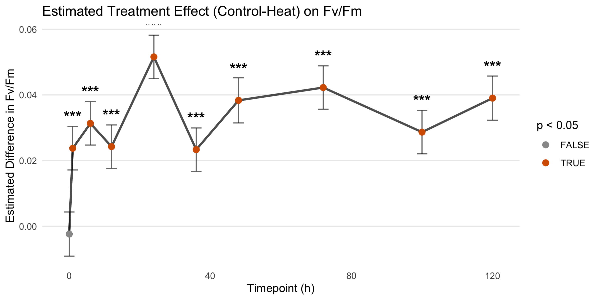

``` r
ggsave("../output/FvFm_line_treatment_tank_modelestimates.png", plot = last_plot(), width = 9, height = 4, bg = "white")
ggsave("../output/pdf_figs/FvFm_line_treatment_tank_modelestimates.pdf", plot = last_plot(), width = 9, height = 4)
```

``` r
ggplot(PAM_exp_filtered_IQR, aes(x = timepoint, y = fv_fm_y_1000, color = treatment, group = treatment)) +
  stat_summary(fun = mean, geom = "point", size = 2.5) +
  stat_summary(fun.data = mean_se, geom = "errorbar", width = 0.2) +
  stat_summary(fun = mean, geom = "line", size = 1.2) +
  labs(x = "Timepoint", y = "Mean Fv/Fm") +
  theme_minimal() +
  scale_color_manual(values = custom_colors)
```

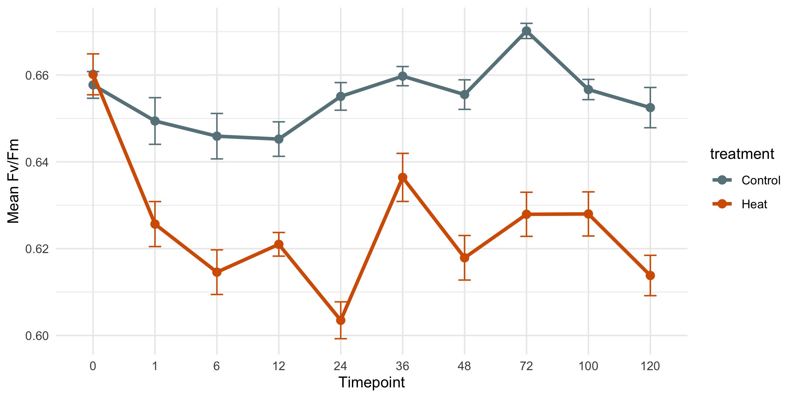

``` r
ggplot(PAM_exp_filtered_IQR, aes(x = timepoint, y = fv_fm_y_1000, color = treatment, shape = tank_id)) +
  stat_summary(fun = mean, geom = "point", aes(group = treatment), size = 2.5) +
  stat_summary(fun.data = mean_se, geom = "point", position = position_dodge(width = 0.5), alpha = 0.5,size=2.5) +
  stat_summary(fun.data = mean_se, geom = "errorbar", position = position_dodge(width = 0.5), width = 0.2, alpha = 0.5) +
  stat_summary(fun = mean, geom = "line", aes(group = treatment), size = 1.2) +
  labs(x = "Timepoint", y = "Mean Fv/Fm") +
  theme_minimal() +
  scale_color_manual(values = custom_colors) +
  stat_compare_means(aes(group = treatment), method = "anova", label = "p.format", size = 2.5)
```

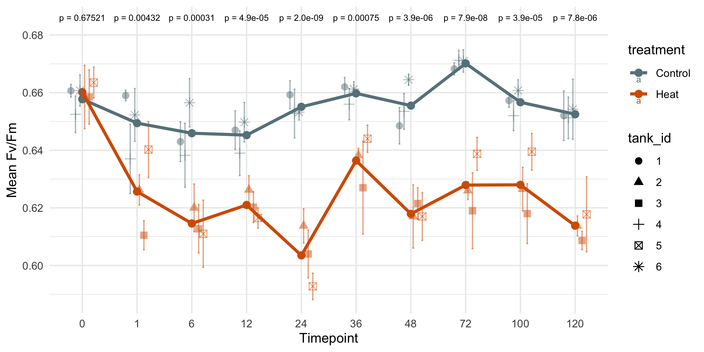

``` r
ggsave("../output/FvFm_line_treatment_tank_means.png", plot = last_plot(), width = 9, height = 4, bg = "white")
ggsave("../output/pdf_figs/FvFm_line_treatment_tank_means.pdf", plot = last_plot(), width = 9, height = 4)

ggplot(PAM_exp_filtered_IQR, aes(x = timepoint, y = fv_fm_y_1000, color = treatment, shape = tank_id)) +
  geom_point(stat = "summary", fun = mean, aes(group = treatment), size=2.5) +
  geom_point(position = position_dodge(width = 0.5), size = 2.5, alpha=0.5) +
  geom_line(stat = "summary", fun = mean, size = 1.2, aes(group = treatment)) +
  labs(x = "Timepoint",y = "Mean Fv/Fm") +
  theme_minimal() +scale_color_manual(values = custom_colors) +
  stat_compare_means(aes(group = treatment),method = "anova",label = "p.format",size = 3)
```

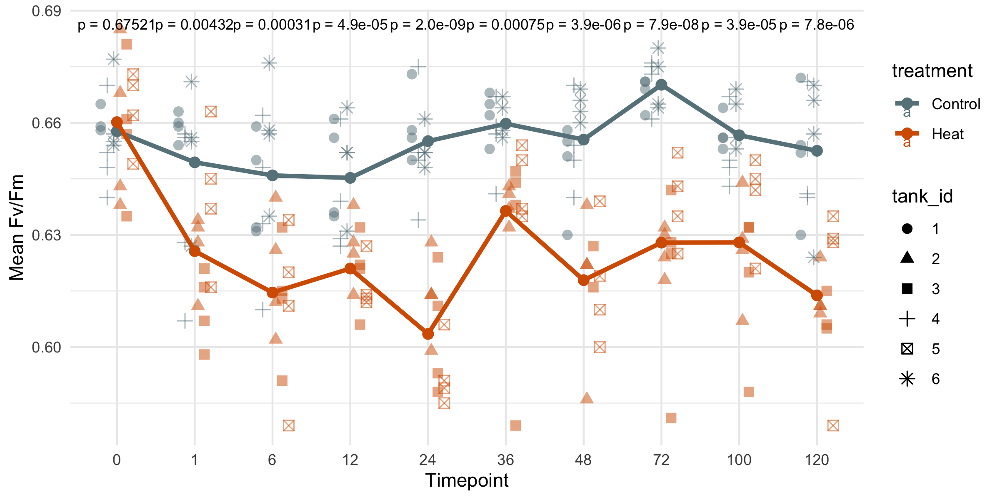

``` r
ggsave("../output/FvFm_line_treatment_all_points.png", plot = last_plot(), width = 9, height = 4, bg = "white")
ggsave("../output/pdf_figs/FvFm_line_treatment_all_points.pdf", plot = last_plot(), width = 9, height = 4)

ggplot(PAM_means, aes(x = timepoint, y = FvFm_mean, color = tank_id, group = tank_id)) +
  geom_line(size = 0.8, alpha = 0.7) +
  labs(x = "Timepoint",y = "Mean Fv/Fm") +
  theme_minimal() + facet_wrap(~treatment)
```

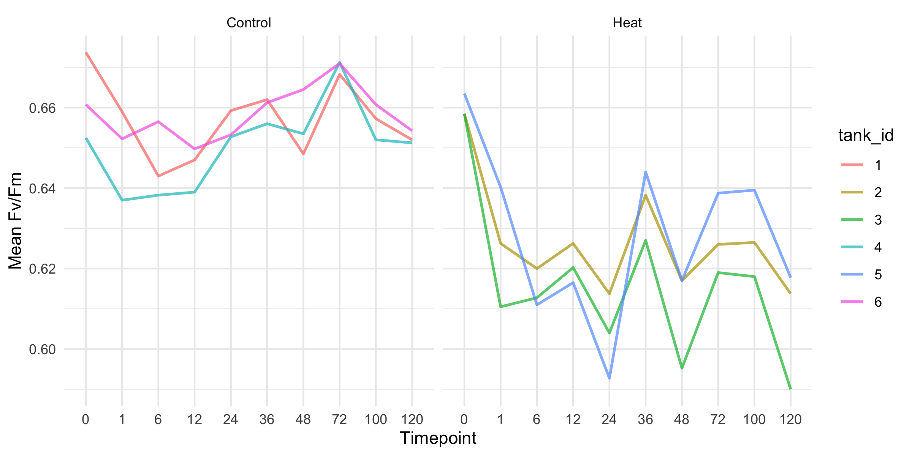

``` r
ggplot(PAM_exp_filtered_IQR, aes(x = timepoint, y = fv_fm_y_1000, color = treatment, shape = tank_id)) +
  geom_point(stat = "summary", fun = mean, aes(group = treatment), size=2.5) +
  geom_line(position = position_dodge(width = 0.25), size = 0.5, alpha=0.25, aes(group = plug)) +
  geom_line(stat = "summary", fun = mean, size = 1.2, aes(group = treatment)) +
  stat_summary(fun.data = mean_se, geom = "errorbar", width = 0.2, aes(group = treatment)) +
  labs(x = "Timepoint",y = "Mean Fv/Fm") +
  theme_minimal() +scale_color_manual(values = custom_colors) +
  stat_compare_means(aes(group = treatment),method = "anova",label = "p.format",size = 3)
```

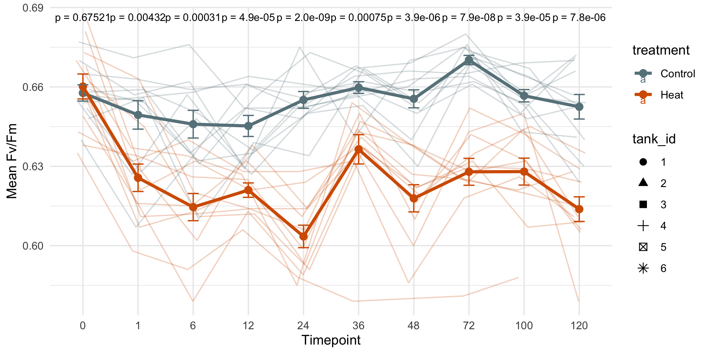

``` r
ggsave("../output/FvFm_line_treatment_all_trajectories.png", plot = last_plot(), width = 9, height = 4, bg = "white")
ggsave("../output/pdf_figs/FvFm_line_treatment_all_trajectories.pdf", plot = last_plot(), width = 9, height = 4)
```
