ColorScore
================
Zoe Dellaert
2026-02-18

## NOTES:

- POC Outlier Images:
  - IMG_4656 –\> IMG_4657
  - IMG_4573 –\> reanalyze
  - IMG_4598 –\> reanalyze
  - IMG_4755 –\> check with Pooja what area she selected – in picture
    much of the tissue has sloughed off
    - POC_PAM_1059 was identified as a PAM outlier at 120hrs, which is
      also when it was photographed for color score
  - IMG_4749 –\> reanalyze

## Color Score Analysis of Time Series Image Data

Basing this on [Emma Strand’s
script](https://github.com/emmastrand/EmmaStrand_Notebook/blob/master/Dani_colorscore/Colorscore.md)

Look at the Hackerott et al repo
[here](https://github.com/eelabfiu/CoralColorScore) for further analysis
ideas

### Load libraries

``` r
library(plyr)
library(dplyr)
library(tidyverse)
library(ggplot2)
library(vegan)
library(Rmisc)
library(ggpubr)
library(factoextra)
library(MASS)
```

``` r
save_ggplot <- function(plot, filename, width = 10, height = 7, units = "in", dpi = 300,bg=NULL) {
  png_path <- file.path(outdir, paste0(filename, ".png"))
  pdf_dir <- file.path(outdir, "pdf_figs")
  pdf_path <- file.path(pdf_dir, paste0(filename, ".pdf"))
  
  # Ensure the pdf_figs directory exists
  if (!dir.exists(pdf_dir)) dir.create(pdf_dir, recursive = TRUE)
  
  # Save plots
  ggsave(filename = png_path, plot = plot, width = width, height = height, units = units, dpi = dpi,bg = bg)
  ggsave(filename = pdf_path, plot = plot, width = width, height = height, units = units, dpi = dpi,bg = bg)
}

treat_colors <- c("Control" = "lightblue4", "Heat" = "#D55E00")
time_colors <- colorRampPalette(c("#ffffcc","#0c2c84"))(7)
names(time_colors) <- c("0", "1", "3", "12", "24", "72", "120")
outdir <- "../output/ColorScore"
```

## *Pocillopora acuta*

### Read in data

``` r
raw <- read.csv("../../3-Pacu/data/Images/ColorScore.csv",
                colClasses=c("Date"="character",
                             "Timepoint"="character",
                             "Plug"="character",
                             "Date"="character"))  %>%
  dplyr::rename(Sample=FileName)

raw <- raw %>% mutate(Treatment=str_replace(Treatment,"heat","Heat"),
                      Treatment=str_replace(Treatment,"control","Control"))
```

### Check raw values

Identify any outliers in the standard values – any red flags in the
pictures/analysis?

These don’t get removed here, we remove outliers after they have been
normalized to their picture standard values. But outliers here might
mean taking a second look at the picture.

``` r
for (column in c("Red.Standard", "Green.Standard","Blue.Standard")){
  # IQR method 
  Q1 <- quantile(raw[[column]], 0.25)
  Q3 <- quantile(raw[[column]], 0.75)
  IQR_val <- Q3 - Q1
  
  lower_bound <- Q1 - 1.5 * IQR_val
  upper_bound <- Q3 + 1.5 * IQR_val
  outliers <- raw[raw[[column]] < lower_bound | raw[[column]] > upper_bound, ]
  print(paste0(column,": IQR = ", Q1,"-",Q3,"; ",nrow(outliers)," outliers"))
  print(outliers)
}
```

    ## [1] "Red.Standard: IQR = 201.2075-219.115; 1 outliers"
    ##    FileName_Orig     Sample     Date Timepoint Treatment Tank_ID Plug
    ## 72      IMG_4656 POC_S12_H3 20250709        12      Heat  Tank_5 1180
    ##    Red.Standard Green.Standard Blue.Standard Red.Coral Green.Coral Blue.Coral
    ## 72       168.17         133.15        158.49     77.34       54.76      17.49
    ##    Notes
    ## 72      
    ## [1] "Green.Standard: IQR = 146.8425-183.2275; 0 outliers"
    ##  [1] FileName_Orig  Sample         Date           Timepoint      Treatment     
    ##  [6] Tank_ID        Plug           Red.Standard   Green.Standard Blue.Standard 
    ## [11] Red.Coral      Green.Coral    Blue.Coral     Notes         
    ## <0 rows> (or 0-length row.names)
    ## [1] "Blue.Standard: IQR = 186.68-209.25; 2 outliers"
    ##    FileName_Orig    Sample     Date Timepoint Treatment Tank_ID Plug
    ## 4       IMG_4573 POC_P0_H1 20250709         0      Heat  Tank_2 1621
    ## 28      IMG_4598 POC_P1_C1 20250709         1   Control  Tank_1 1749
    ##    Red.Standard Green.Standard Blue.Standard Red.Coral Green.Coral Blue.Coral
    ## 4        175.87         115.05        149.16     80.22       56.53      16.28
    ## 28       216.65         171.50        131.34    100.44       68.41      20.19
    ##    Notes
    ## 4       
    ## 28

### Normalize data

``` r
proc <- raw %>% mutate(
    Red.Norm.Coral = Red.Coral/Red.Standard,
    Green.Norm.Coral = Green.Coral/Green.Standard,
    Blue.Norm.Coral = Blue.Coral/Blue.Standard
)

rownames(proc) <- proc$Sample
```

#### Identify outliers via IQR

Identify outliers within treatment. Because we do not expect the
distributions of the heat and control colors to be the same, we look for
outliers separately in these treatments.

``` r
norm_outliers <- c()

for (column in c("Red.Norm.Coral","Green.Norm.Coral", "Blue.Norm.Coral")){
    stats_temp <- proc %>%
        group_by(across(all_of(c("Treatment")))) %>%
        mutate(Q1 = quantile(get(column), 0.25),
               Q3 = quantile(get(column), 0.75),
               IQR_val = Q3 - Q1,
               lower_bound = Q1 - 1.5 * IQR_val,
               upper_bound = Q3 + 1.5 * IQR_val,
               is_outlier = get(column) < lower_bound | get(column) > upper_bound) %>%
        ungroup()
    
    outliers_heat <- stats_temp %>% filter(Treatment =="Heat" & is_outlier==TRUE)
    outliers_control <- stats_temp %>% filter(Treatment =="Control" & is_outlier==TRUE)
    
    print(paste0(column,", Heat Samples: IQR = ", round(outliers_heat$Q1,2),"-",round(outliers_heat$Q3,2),"; ",nrow(outliers_heat)," outlier(s)"))
    print(outliers_heat %>% dplyr::select(c(FileName_Orig,Sample,Timepoint,Treatment,Notes,column,lower_bound,upper_bound)))
    
    print(paste0(column,", Control Samples: IQR = ", round(outliers_control$Q1,2),"-",round(outliers_control$Q3,2),"; ",nrow(outliers_control)," outlier(s)"))
    print(outliers_control %>% dplyr::select(c(FileName_Orig,Sample,Timepoint,Treatment,Notes,column,lower_bound,upper_bound)))

    norm_outliers <- c(norm_outliers,outliers_heat$Sample,outliers_control$Sample)
}
```

    ## [1] "Red.Norm.Coral, Heat Samples: IQR = 0.46-0.58; 1 outlier(s)"

    ## # A tibble: 1 × 8
    ##   FileName_Orig Sample      Timepoint Treatment Notes Red.Norm.Coral lower_bound
    ##   <chr>         <chr>       <chr>     <chr>     <chr>          <dbl>       <dbl>
    ## 1 IMG_4755      POC_PAM_10… 120       Heat      ""             0.823       0.273
    ## # ℹ 1 more variable: upper_bound <dbl>
    ## [1] "Red.Norm.Coral, Control Samples: IQR = -; 0 outlier(s)"
    ## # A tibble: 0 × 8
    ## # ℹ 8 variables: FileName_Orig <chr>, Sample <chr>, Timepoint <chr>,
    ## #   Treatment <chr>, Notes <chr>, Red.Norm.Coral <dbl>, lower_bound <dbl>,
    ## #   upper_bound <dbl>
    ## [1] "Green.Norm.Coral, Heat Samples: IQR = 0.4-0.49; 1 outlier(s)"
    ## # A tibble: 1 × 8
    ##   FileName_Orig Sample    Timepoint Treatment Notes Green.Norm.Coral lower_bound
    ##   <chr>         <chr>     <chr>     <chr>     <chr>            <dbl>       <dbl>
    ## 1 IMG_4755      POC_PAM_… 120       Heat      ""               0.799       0.267
    ## # ℹ 1 more variable: upper_bound <dbl>
    ## [1] "Green.Norm.Coral, Control Samples: IQR = -; 0 outlier(s)"
    ## # A tibble: 0 × 8
    ## # ℹ 8 variables: FileName_Orig <chr>, Sample <chr>, Timepoint <chr>,
    ## #   Treatment <chr>, Notes <chr>, Green.Norm.Coral <dbl>, lower_bound <dbl>,
    ## #   upper_bound <dbl>
    ## [1] "Blue.Norm.Coral, Heat Samples: IQR = 0.1-0.14; 1 outlier(s)"
    ## # A tibble: 1 × 8
    ##   FileName_Orig Sample     Timepoint Treatment Notes Blue.Norm.Coral lower_bound
    ##   <chr>         <chr>      <chr>     <chr>     <chr>           <dbl>       <dbl>
    ## 1 IMG_4755      POC_PAM_1… 120       Heat      ""              0.541      0.0312
    ## # ℹ 1 more variable: upper_bound <dbl>
    ## [1] "Blue.Norm.Coral, Control Samples: IQR = 0.09-0.14; 1 outlier(s)"
    ## # A tibble: 1 × 8
    ##   FileName_Orig Sample     Timepoint Treatment Notes Blue.Norm.Coral lower_bound
    ##   <chr>         <chr>      <chr>     <chr>     <chr>           <dbl>       <dbl>
    ## 1 IMG_4749      POC_PAM_2… 120       Control   ""              0.230      0.0181
    ## # ℹ 1 more variable: upper_bound <dbl>

``` r
unique(norm_outliers)
```

    ## [1] "POC_PAM_1059" "POC_PAM_2565"

#### Remove outliers

Go back and assess the images. Why are these flagging as outliers?

``` r
proc_out_rm <- proc %>% filter(!(Sample %in% unique(norm_outliers)))
proc <- proc_out_rm
```

### Calculate color Score

``` r
#create matrix with rownames as the samples
proc_matrix <- as.matrix(cbind(proc$Red.Norm.Coral,
                                   proc$Green.Norm.Coral,
                                   proc$Blue.Norm.Coral))

rownames(proc_matrix) <- proc$Sample

#calculate distance
dist <- vegdist(proc_matrix, method="euclidean") 

#calculate PCA
PCA <- princomp(dist)
```

``` r
#extract PC1 as color score
colorscore <- as.data.frame(-PCA$scores[,1]) #extract PC1
colorscore$Sample <- rownames(proc_matrix)

colorscore <- colorscore %>% dplyr::rename(., ColorScore = `-PCA$scores[, 1]`)

final <- left_join(proc, colorscore, by = "Sample") 

# make time and treatment factors
final$Timepoint <- factor(final$Timepoint, levels = as.character(sort(unique(as.numeric(final$Timepoint)))))
final$Treatment <- factor(final$Treatment)

range(final$ColorScore)
```

    ## [1] -1.215388  1.185464

#### Identify outliers via IQR

At this point, there should not be outliers in the color score values if
the normalized values had ouliers removed. But check if there are and
examine the data.

``` r
final <- final %>%
    group_by(across(all_of(c("Treatment")))) %>%
    mutate(Q1 = quantile(ColorScore, 0.25),
           Q3 = quantile(ColorScore, 0.75),
           IQR_val = Q3 - Q1,
           lower_bound = Q1 - 1.5 * IQR_val,
           upper_bound = Q3 + 1.5 * IQR_val,
           is_outlier = ColorScore < lower_bound | ColorScore > upper_bound) %>%
    ungroup()

outliers_heat <- final %>% filter(Treatment =="Heat" & is_outlier==TRUE)
outliers_control <- final %>% filter(Treatment =="Control" & is_outlier==TRUE)

print(paste0("ColorScore, Heat Samples: IQR = ", round(outliers_heat$Q1,2),"-",round(outliers_heat$Q3,2),"; ",nrow(outliers_heat)," outlier(s)"))
```

    ## [1] "ColorScore, Heat Samples: IQR = -; 0 outlier(s)"

``` r
print(outliers_heat %>% dplyr::select(c(FileName_Orig,Sample,Timepoint,Treatment,Notes,ColorScore,lower_bound,upper_bound)))
```

    ## # A tibble: 0 × 8
    ## # ℹ 8 variables: FileName_Orig <chr>, Sample <chr>, Timepoint <fct>,
    ## #   Treatment <fct>, Notes <chr>, ColorScore <dbl>, lower_bound <dbl>,
    ## #   upper_bound <dbl>

``` r
print(paste0("ColorScore, Control Samples: IQR = ", round(outliers_control$Q1,2),"-",round(outliers_control$Q3,2),"; ",nrow(outliers_control)," outlier(s)"))
```

    ## [1] "ColorScore, Control Samples: IQR = -; 0 outlier(s)"

``` r
print(outliers_control %>% dplyr::select(c(FileName_Orig,Sample,Timepoint,Treatment,Notes,ColorScore,lower_bound,upper_bound)))
```

    ## # A tibble: 0 × 8
    ## # ℹ 8 variables: FileName_Orig <chr>, Sample <chr>, Timepoint <fct>,
    ## #   Treatment <fct>, Notes <chr>, ColorScore <dbl>, lower_bound <dbl>,
    ## #   upper_bound <dbl>

``` r
color_outliers <- c(outliers_heat$Sample,outliers_control$Sample)
```

#### Remove outliers

See note above. Ideally there are no outliers at this stage.

``` r
final_filtered_IQR <- final %>% filter(!(Sample %in% unique(color_outliers)))
final <- final_filtered_IQR
```

### Plot

``` r
final %>%
  ggplot(., aes(x=Timepoint, y=ColorScore, color=Treatment)) +
  geom_jitter(alpha=0.25, size=1.5, width = 0.22) + 
  theme_minimal() + labs(x = "Timepoint",y = "Color Score") +
  scale_color_manual(values = treat_colors) +
  geom_point(stat = "summary", fun = mean, aes(group = Treatment), size=3) +
  stat_summary(fun.data = mean_se, geom = "errorbar", width = 0.2, aes(group = Treatment)) +
  geom_line(stat = "summary", fun = mean, size = 1.2, aes(group = Treatment)) +
  stat_compare_means(aes(group = Treatment),method = "anova",label = "p.format",size = 3)
```

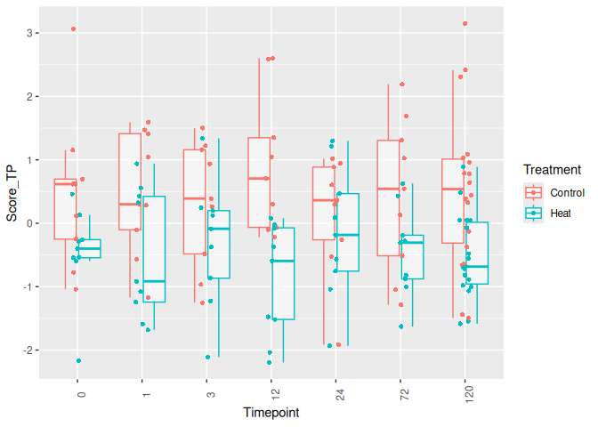<!-- -->

``` r
save_ggplot(last_plot(), "Pacu")

final %>%
  ggplot(., aes(x=Timepoint, y=ColorScore, color=Treatment, shape=Tank_ID)) +
  geom_jitter(alpha=0.25, size=1.5, width = 0.22) + 
  theme_minimal() + labs(x = "Timepoint",y = "Color Score") +
  scale_color_manual(values = treat_colors) +
  geom_point(stat = "summary", fun = mean, aes(group = Tank_ID), size=3) +
  stat_summary(fun.data = mean_se, geom = "errorbar", width = 0.1, size = 0.4, aes(group = Tank_ID)) +
  geom_line(stat = "summary", fun = mean, size = 0.4, aes(group = Tank_ID)) +
  stat_compare_means(aes(group = Treatment),method = "anova",label = "p.format",size = 3)
```

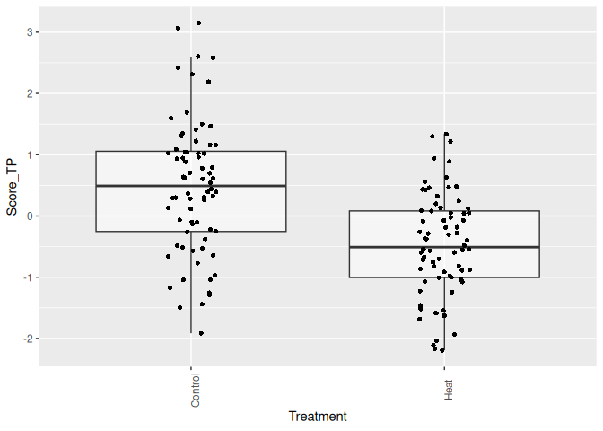<!-- -->

``` r
save_ggplot(last_plot(), "Pacu_by_tank")

final %>%
  ggplot(., aes(x=Timepoint, y=ColorScore, color=Treatment, shape=Tank_ID)) +
  theme_minimal() + labs(x = "Timepoint",y = "Color Score") +
  scale_color_manual(values = treat_colors) +
  stat_summary(fun.data = mean_se, geom = "errorbar", position = position_dodge(width = 0.5), width = 0.2, alpha = 0.5) +
  stat_summary(fun.data = mean_se, geom = "point", position = position_dodge(width = 0.5), alpha = 0.5,size=2.5) +
  stat_summary(fun = mean, geom = "point", aes(group = Treatment), size = 2.5) +
  stat_summary(fun = mean, geom = "line", aes(group = Treatment), size = 1.2) +
  stat_compare_means(aes(group = Treatment),method = "anova",label = "p.format",size = 3)
```

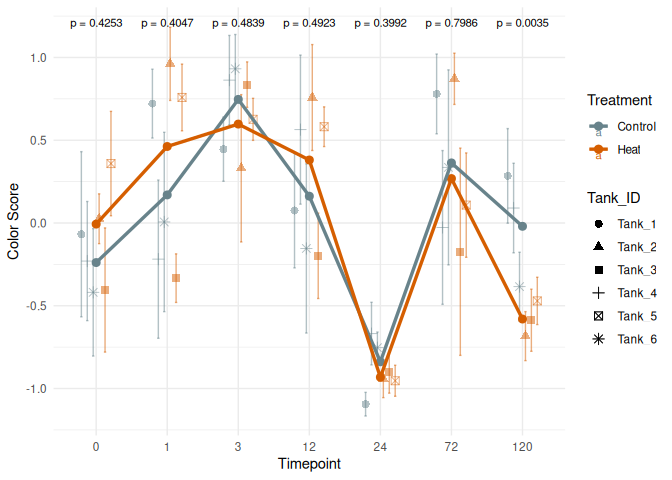<!-- -->

``` r
save_ggplot(last_plot(), "Pacu_tank_means")
```

### Color Score Hackerott

#### Run PCA

``` r
Color.PCA<-prcomp(proc[,c("Red.Norm.Coral","Green.Norm.Coral","Blue.Norm.Coral")], scale.=TRUE) 

#Initial plot
fviz_pca_ind(Color.PCA)
```

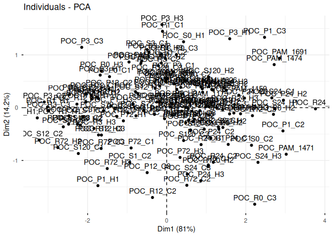<!-- -->

``` r
#Check Variance Explained by Components
summary(Color.PCA)
```

    ## Importance of components:
    ##                           PC1    PC2     PC3
    ## Standard deviation     1.5587 0.6521 0.38098
    ## Proportion of Variance 0.8099 0.1417 0.04838
    ## Cumulative Proportion  0.8099 0.9516 1.00000

``` r
#Visualize the importance of each principal component
fviz_eig(Color.PCA, addlabels = TRUE) 
```

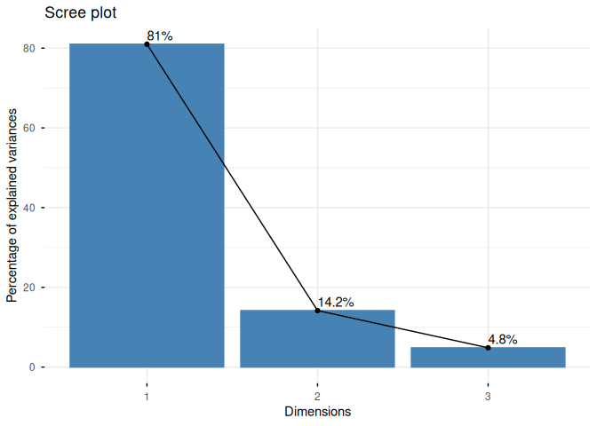<!-- -->

PC1 Explains 81% of the variance in the color data.

``` r
##Extract % Variance PC 1
PCA.PC1<-sprintf("%1.2f",get_eigenvalue(Color.PCA)$variance.percent[1])
PCA.PC1
```

    ## [1] "80.99"

``` r
##Extract % Variance PC 2
PCA.PC2<-sprintf("%1.2f",get_eigenvalue(Color.PCA)$variance.percent[2])
PCA.PC2
```

    ## [1] "14.17"

``` r
##Extract Individual Sample Scores
Color.PCA.scores <- as.data.frame(Color.PCA$x)
Color.PCA.scores$Sample<-rownames(Color.PCA.scores)

#Prepare for Plotting
Color.PCA.scores<-left_join(proc, Color.PCA.scores, by = "Sample") 

Color.PCA.scores$Timepoint <- factor(Color.PCA.scores$Timepoint, levels = as.character(sort(unique(as.numeric(Color.PCA.scores$Timepoint)))))
```

#### Plot PCA

``` r
#Plot PCA
ggplot(data = Color.PCA.scores, aes(x = PC1, y = PC2)) + 
  geom_point(aes(colour = Treatment),  alpha = 0.8) + 
  scale_colour_manual(values =treat_colors)+
  theme_classic()+
  scale_x_continuous(limits = c(-3, 5.5))+
  scale_y_continuous(limits = c(-4.25, 4.25))+
  labs(x=paste0('PC 1 (',PCA.PC1,"%)"), y=paste0('PC 2 (',PCA.PC2,"%)"))+
  ggtitle("Color Score PCA")
```

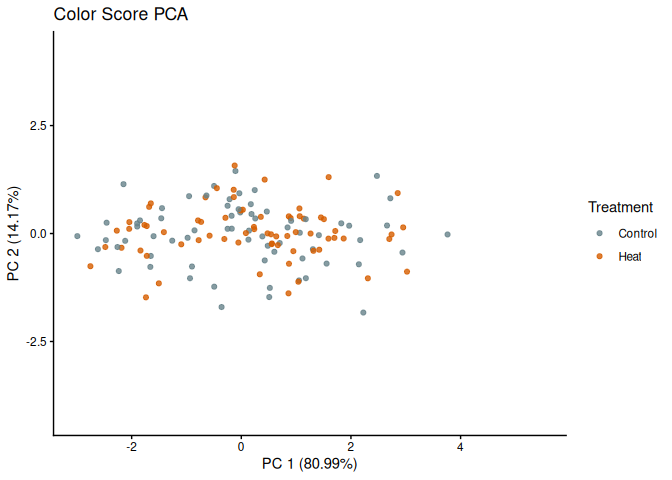<!-- -->

``` r
#Plot PCA
ggplot(data = Color.PCA.scores, aes(x = PC1, y = PC2)) + 
  geom_point(aes(colour = Timepoint),  alpha = 0.8) + 
  scale_colour_manual(values =time_colors)+
  theme_classic()+
  scale_x_continuous(limits = c(-3, 5.5))+
  scale_y_continuous(limits = c(-4.25, 4.25))+
  labs(x=paste0('PC 1 (',PCA.PC1,"%)"), y=paste0('PC 2 (',PCA.PC2,"%)"))+
  ggtitle("Color Score PCA")
```

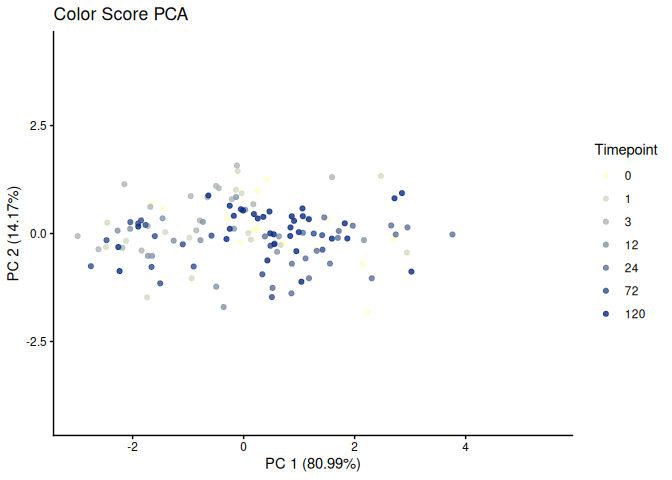<!-- -->

#### LDA on PCA Scores

``` r
##LDA on PCA Scores
Color.LDA_PCA<-lda(Treatment~PC1+PC2+PC3, data=Color.PCA.scores)

##Predict
Color.pLDA_PCA<-predict(object=Color.LDA_PCA, newdata=Color.PCA.scores)

##Save LD1 Scores
Color.LDA_PCA.scores<-data.frame(Sample=Color.PCA.scores$Sample, LD1=Color.pLDA_PCA$x)

#Prepare for Plotting
ColorData<-left_join(proc, Color.LDA_PCA.scores, by = "Sample") 

# make time and treatment factors
ColorData$Timepoint <- factor(ColorData$Timepoint, levels = as.character(sort(unique(as.numeric(ColorData$Timepoint)))))
ColorData$Treatment <- factor(ColorData$Treatment)
```

#### LD1 Density Plot

``` r
ggplot(data = ColorData, aes(x = LD1)) + 
  geom_density(aes(fill = Treatment), alpha = 0.6) + 
  scale_fill_manual(values =treat_colors)+
  theme_classic()+
  scale_x_continuous(limits = c(-3, 5.5))+
  labs(x="LD1", y= "Density")+
  ggtitle("Full Dataset")
```

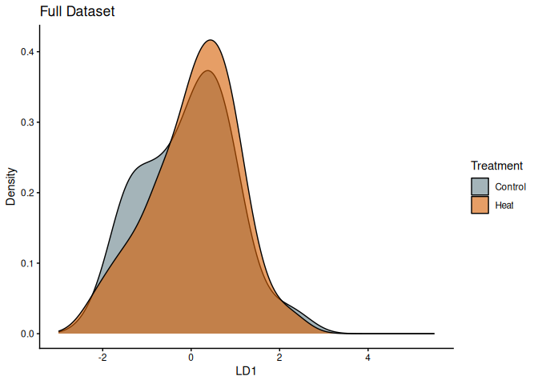<!-- -->

``` r
ggplot(data = ColorData, aes(x = LD1)) + 
  geom_density(aes(fill = Timepoint), alpha = 0.6) + 
  scale_fill_manual(values =time_colors)+
  theme_classic()+
  scale_x_continuous(limits = c(-3, 5.5))+
  labs(x="LD1", y= "Density")+
  ggtitle("Full Dataset")
```

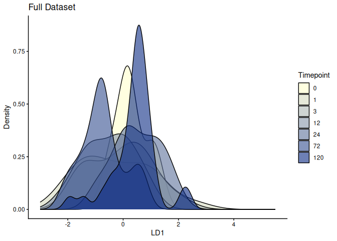<!-- -->

#### Extract Color Score

``` r
##Invert signs for Control > Heated
ColorData$LD1<-ColorData$LD1*(-1)

#Adding 10 to make all score values positive 
#ColorData$LD1<- ColorData$LD1 +10

ColorData %>%
  ggplot(., aes(x=Timepoint, y=LD1, color=Treatment)) +
  geom_jitter(alpha=0.25, size=1.5, width = 0.22) + 
  theme_minimal() + labs(x = "Timepoint",y = "Color Score") +
  scale_color_manual(values = treat_colors) +
  geom_point(stat = "summary", fun = mean, aes(group = Treatment), size=3) +
  stat_summary(fun.data = mean_se, geom = "errorbar", width = 0.2, aes(group = Treatment)) +
  geom_line(stat = "summary", fun = mean, size = 1.2, aes(group = Treatment)) +
  stat_compare_means(aes(group = Treatment),method = "anova",label = "p.format",size = 3)
```

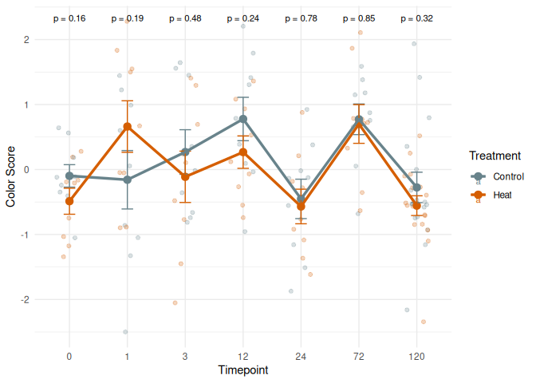<!-- -->

``` r
save_ggplot(last_plot(), "Pacu_Hackerott")

ColorData_Full <- ColorData
```

#### by timepoint

``` r
for (timepoint in unique(raw$Timepoint)){
  proc_timepoint <- proc %>% filter(Timepoint == timepoint)
  
  proc_tp <- proc_timepoint #%>% filter(Sample!="POC_PAM_1059")
  Color.PCA<-prcomp(proc_tp[,c("Red.Norm.Coral","Green.Norm.Coral","Blue.Norm.Coral")], scale.=TRUE) 

  ##Extract % Variance PC 1 & 2
  PCA.PC1<-sprintf("%1.2f",get_eigenvalue(Color.PCA)$variance.percent[1])
  PCA.PC2<-sprintf("%1.2f",get_eigenvalue(Color.PCA)$variance.percent[2])

  ##Extract Individual Sample Scores
  Color.PCA.scores <- as.data.frame(Color.PCA$x)
  Color.PCA.scores$Sample<-rownames(Color.PCA.scores)
  
  #Prepare for Plotting
  Color.PCA.scores<-left_join(proc_tp, Color.PCA.scores, by = "Sample") 
  
  timepoint_pca <- ggplot(data = Color.PCA.scores, aes(x = PC1, y = PC2)) + 
    geom_point(aes(colour = Treatment),  alpha = 0.8) + 
    scale_colour_manual(values =treat_colors)+
    theme_classic()+
    scale_x_continuous(limits = c(-3, 5.5))+
    scale_y_continuous(limits = c(-4.25, 4.25))+
    labs(x=paste0('PC 1 (',PCA.PC1,"%)"), y=paste0('PC 2 (',PCA.PC2,"%)"))+
    ggtitle(paste0("Color Score PCA: ",timepoint,"hrs"))
  
  print(timepoint_pca)
  
  ##LDA on PCA Scores
  Color.LDA_PCA<-lda(Treatment~PC1+PC2+PC3, data=Color.PCA.scores)
  
  ##Predict
  Color.pLDA_PCA<-predict(object=Color.LDA_PCA, newdata=Color.PCA.scores)
  
  ##Save LD1 Scores
  Color.LDA_PCA.scores<-data.frame(Sample=Color.PCA.scores$Sample, LD1=Color.pLDA_PCA$x)
  
  #Prepare for Plotting
  ColorData<-left_join(proc_tp, Color.LDA_PCA.scores, by = "Sample") 
  
  # make time and treatment factors
  ColorData$Timepoint <- factor(ColorData$Timepoint, levels = as.character(sort(unique(as.numeric(ColorData$Timepoint)))))
  ColorData$Treatment <- factor(ColorData$Treatment)
  
  timepoint_density <- ggplot(data = ColorData, aes(x = LD1)) + 
  geom_density(aes(fill = Treatment), alpha = 0.6) + 
  scale_fill_manual(values =treat_colors)+
  theme_classic()+
  scale_x_continuous(limits = c(-3, 5.5))+
  labs(x="LD1", y= "Density") +
    ggtitle(paste0("Density plot: ",timepoint,"hrs"))
  
  print(timepoint_density)

  ##Invert signs for Control > Heated
  ColorData$LD1<-ColorData$LD1*(-1)
  
  #Adding 10 to make all score values positive 
  #ColorData$LD1<- ColorData$LD1 +10

  plot <- ColorData %>%
    ggplot(., aes(x=Timepoint, y=LD1, color=Treatment)) +
    geom_jitter(alpha=0.25, size=1.5, width = 0.22) + 
    theme_minimal() + labs(x = "Timepoint",y = "Color Score") +
    scale_color_manual(values = treat_colors) +
    geom_point(stat = "summary", fun = mean, aes(group = Treatment), size=3) +
    stat_summary(fun.data = mean_se, geom = "errorbar", width = 0.2, aes(group = Treatment)) +
    geom_line(stat = "summary", fun = mean, size = 1.2, aes(group = Treatment)) +
    stat_compare_means(aes(group = Treatment),method = "anova",label = "p.format",size = 3)
  
  print(plot)
  
  assign(paste0("ColorData_TP_",timepoint),ColorData)
}
```

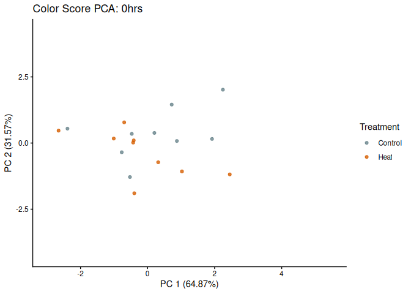<!-- -->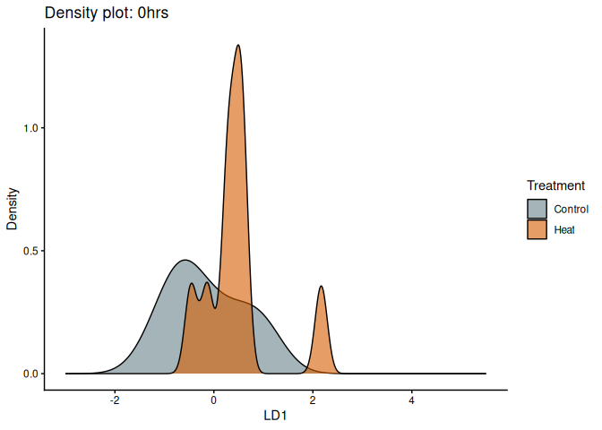<!-- -->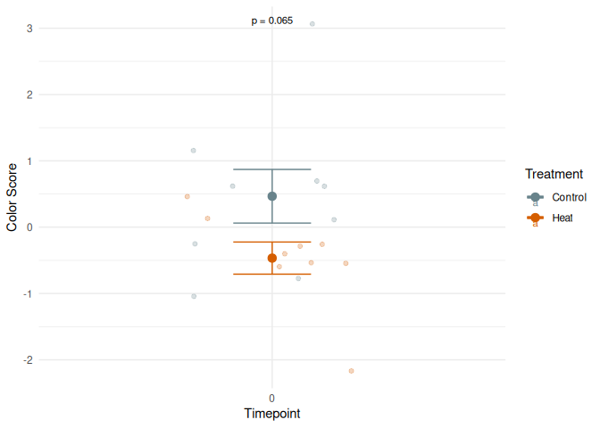<!-- -->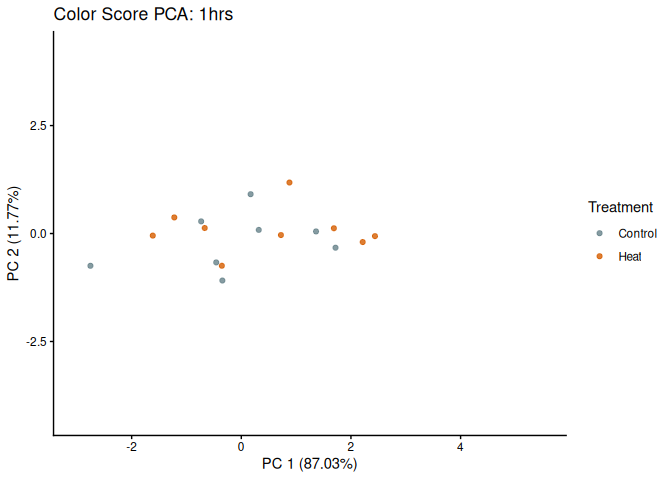<!-- -->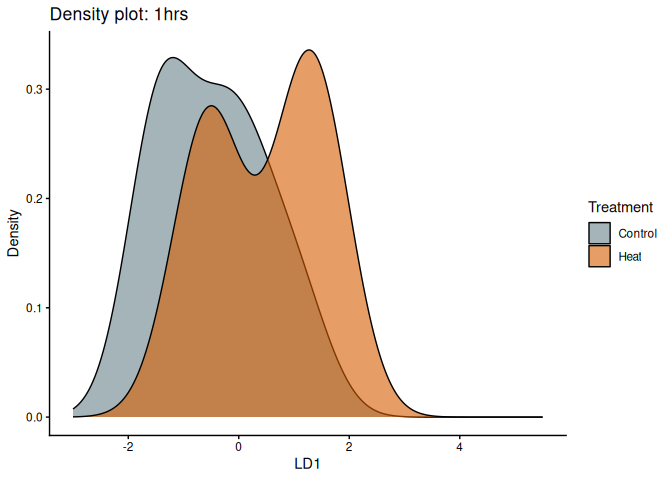<!-- -->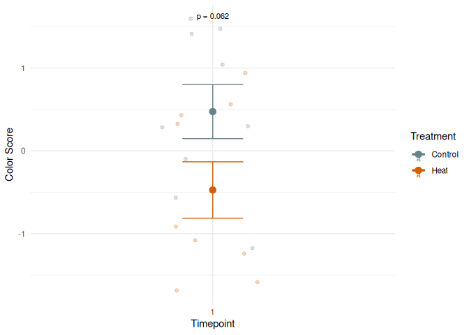<!-- -->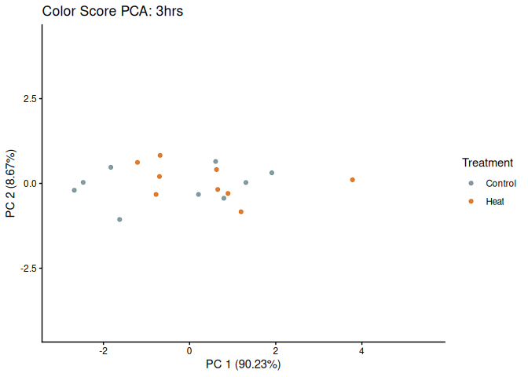<!-- -->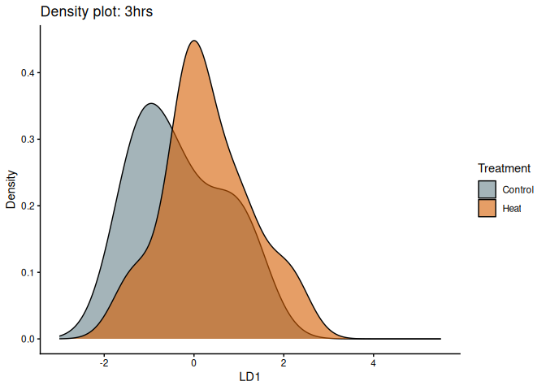<!-- -->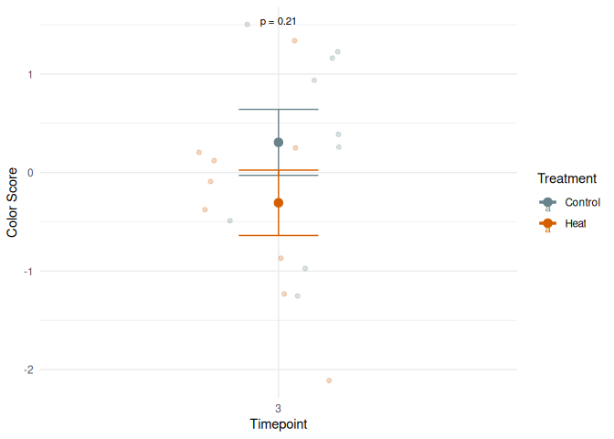<!-- -->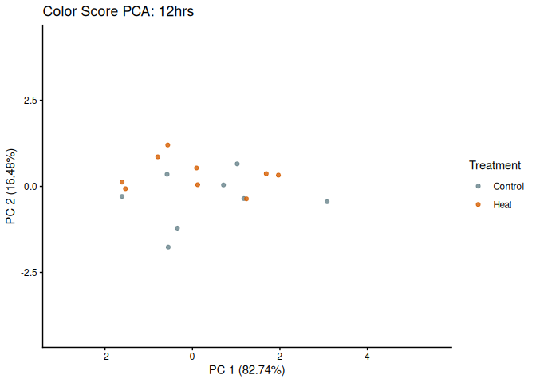<!-- -->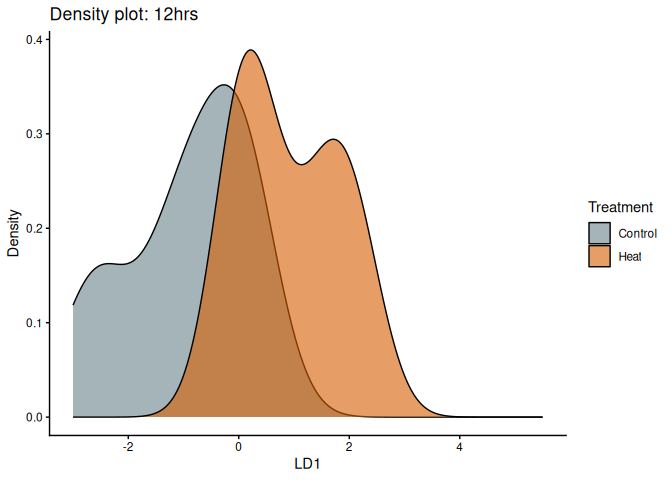<!-- -->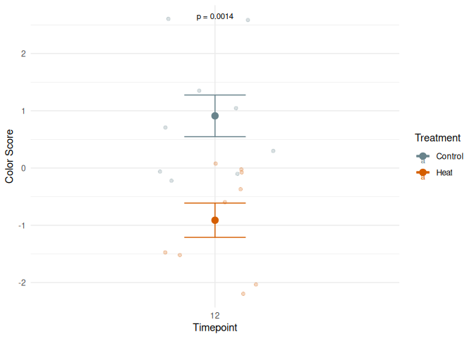<!-- -->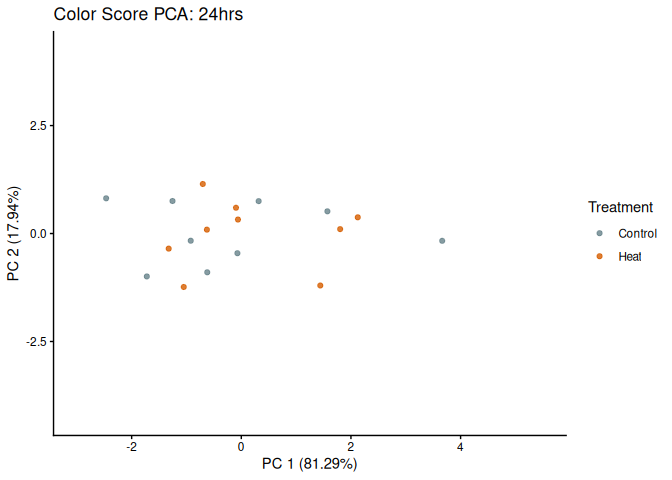<!-- -->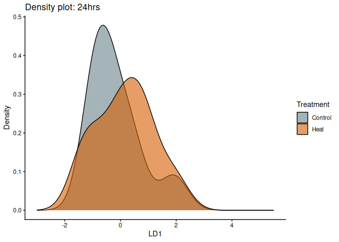<!-- -->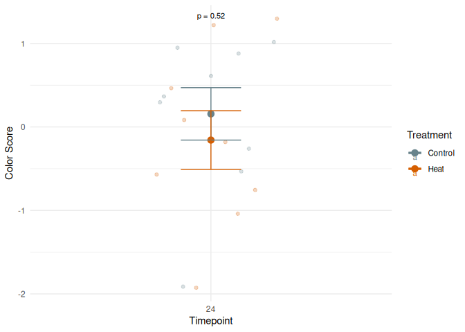<!-- -->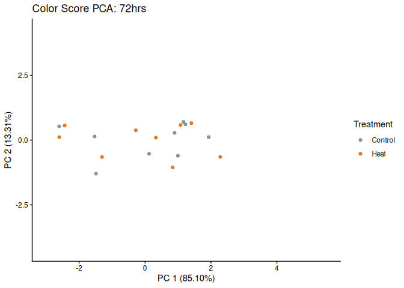<!-- -->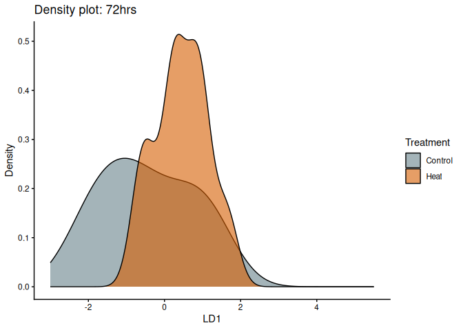<!-- -->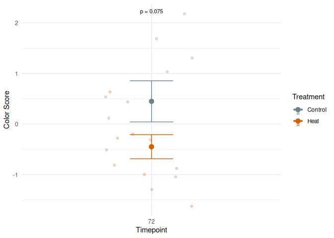<!-- -->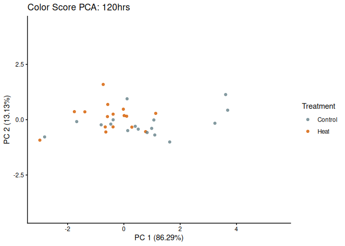<!-- -->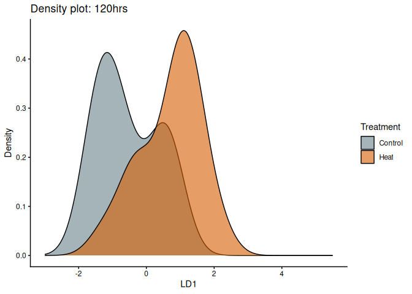<!-- -->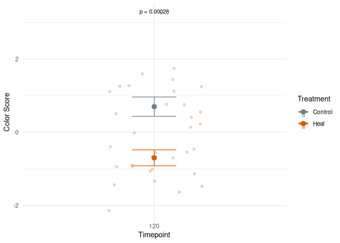<!-- -->
\#### combine full and by timepoint data

``` r
paste0("ColorData_TP_",unique(raw$Timepoint))
```

    ## [1] "ColorData_TP_0"   "ColorData_TP_1"   "ColorData_TP_3"   "ColorData_TP_12" 
    ## [5] "ColorData_TP_24"  "ColorData_TP_72"  "ColorData_TP_120"

``` r
##Combine results from individual timepoints
ColorData.TP<-dplyr::bind_rows(mget(paste0("ColorData_TP_", unique(raw$Timepoint))))

##Retain PC1 as Color Score
ColorData.TP$Score_TP<-ColorData.TP$LD1

##Initial Visual Check
ggplot(ColorData.TP, aes(x=Timepoint, y=Score_TP, color=Treatment)) + 
  geom_boxplot(alpha=0.5, shape=2, outlier.shape = NA)+
  geom_jitter(shape=16, position=position_jitter(0.1))+
  theme(axis.text.x = element_text(angle = 90))
```

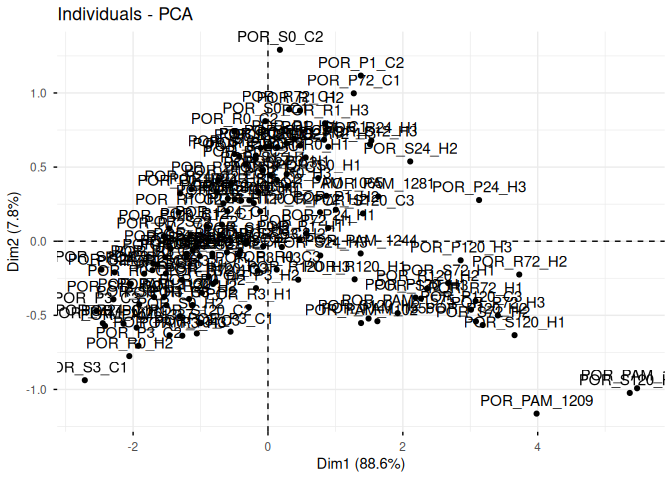<!-- -->

``` r
##Plot by Treatment
ggplot(ColorData.TP, aes(x=Treatment, y=Score_TP)) + 
  geom_boxplot(alpha=0.5, shape=2, outlier.shape = NA)+
  geom_jitter(shape=16, position=position_jitter(0.1))+
  theme(axis.text.x = element_text(angle = 90))
```

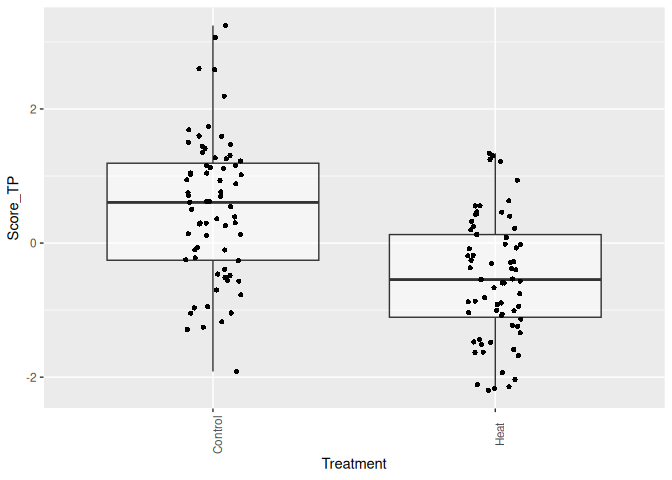<!-- -->

``` r
##Merge with Color Data
names(ColorData.TP)
```

    ##  [1] "FileName_Orig"    "Sample"           "Date"             "Timepoint"       
    ##  [5] "Treatment"        "Tank_ID"          "Plug"             "Red.Standard"    
    ##  [9] "Green.Standard"   "Blue.Standard"    "Red.Coral"        "Green.Coral"     
    ## [13] "Blue.Coral"       "Notes"            "Red.Norm.Coral"   "Green.Norm.Coral"
    ## [17] "Blue.Norm.Coral"  "LD1"              "Score_TP"

``` r
ColorData<-merge(ColorData_Full, ColorData.TP[,c("Sample", "Score_TP")])
ColorData <- ColorData %>% dplyr::rename(Score_Full=LD1)
```

#### Correlation

``` r
cor.test(ColorData$Score_Full, ColorData$Score_TP, method="spearman")
```

    ## 
    ##  Spearman's rank correlation rho
    ## 
    ## data:  ColorData$Score_Full and ColorData$Score_TP
    ## S = 404048, p-value = 0.06863
    ## alternative hypothesis: true rho is not equal to 0
    ## sample estimates:
    ##       rho 
    ## 0.1532782

``` r
plot(ColorData$Score_Full, ColorData$Score_TP)
```

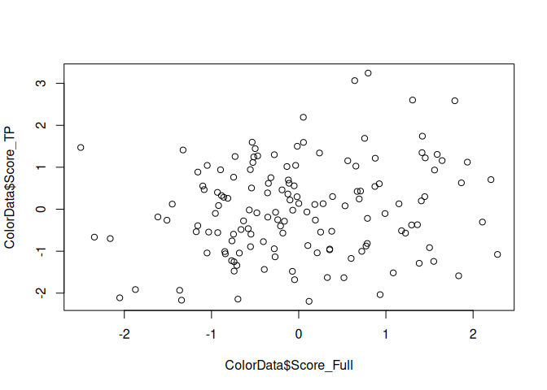<!-- -->

## *Porites compressa*

### Read in datafiles

``` r
raw <- read.csv("../../1-Pcom/data/Images/ColorScore.csv", colClasses=c("Date"="character", 
                                                                               "Timepoint"="character",
                                                                               "Plug"="character",
                                                                               "Date"="character"))  %>%
  dplyr::rename(Sample=FileName)
```

### Check raw values

Identify any outliers in the standard values – any red flags in the
pictures/analysis?

These don’t get removed here, we remove outliers after they have been
normalized to their picture standard values. But outliers here might
mean taking a second look at the picture.

``` r
for (column in c("Red.Standard", "Green.Standard","Blue.Standard")){
  # IQR method 
  Q1 <- quantile(raw[[column]], 0.25)
  Q3 <- quantile(raw[[column]], 0.75)
  IQR_val <- Q3 - Q1
  
  lower_bound <- Q1 - 1.5 * IQR_val
  upper_bound <- Q3 + 1.5 * IQR_val
  outliers <- raw[raw[[column]] < lower_bound | raw[[column]] > upper_bound, ]
  print(paste0(column,": IQR = ", Q1,"-",Q3,"; ",nrow(outliers)," outliers"))
  print(outliers)
}
```

    ## [1] "Red.Standard: IQR = 241.9375-247.215; 5 outliers"
    ##     FileName_Orig      Sample     Date Timepoint Treatment Tank_ID Plug
    ## 92       IMG_4320  POR_R72_C1 20250628        72   Control  Tank_1 1439
    ## 93       IMG_4321  POR_S72_C1 20250628        72   Control  Tank_1 2737
    ## 94       IMG_4322  POR_P72_C2 20250628        72   Control  Tank_4 1274
    ## 96       IMG_4324  POR_S72_C2 20250628        72   Control  Tank_4 1174
    ## 121      IMG_4354 POR_P120_H2 20250630       120      Heat  Tank_3 1761
    ##     Red.Standard Green.Standard Blue.Standard Red.Coral Green.Coral Blue.Coral
    ## 92        230.61         194.92        211.17    137.39      100.76      28.34
    ## 93        231.20         193.65        203.56    100.11       74.81      25.61
    ## 94        227.25         177.26        196.55    109.46       79.85      32.78
    ## 96        230.96         186.55        204.55    102.15       74.23      24.16
    ## 121       233.56         194.80        204.23    163.32      128.64      81.86
    ##                                                                 Notes
    ## 92                                                                   
    ## 93                                                                   
    ## 94  photo is not sharpened on the coral instead focused on the finger
    ## 96  photo is not sharpened on the coral instead focused on the finger
    ## 121                                                                  
    ## [1] "Green.Standard: IQR = 202.405-219.8475; 3 outliers"
    ##     FileName_Orig      Sample     Date Timepoint Treatment Tank_ID Plug
    ## 35       IMG_4256   POR_R1_H3 20250625         1      Heat  Tank_5 1159
    ## 69       IMG_4292  POR_S12_H2 20250625        12      Heat  Tank_3 1613
    ## 115      IMG_4348 POR_P120_C3 20250630       120   Control  Tank_6 1133
    ##     Red.Standard Green.Standard Blue.Standard Red.Coral Green.Coral Blue.Coral
    ## 35        245.33         116.28        214.97    122.20       84.94      29.41
    ## 69        248.34         149.00        222.43    119.97       85.95      25.08
    ## 115       240.47          92.78         62.62    122.29       85.87      21.26
    ##     Notes
    ## 35       
    ## 69       
    ## 115      
    ## [1] "Blue.Standard: IQR = 210.835-221.9925; 2 outliers"
    ##     FileName_Orig      Sample     Date Timepoint Treatment Tank_ID Plug
    ## 29       IMG_4250   POR_R1_H1 20250625         1      Heat  Tank_2 1175
    ## 115      IMG_4348 POR_P120_C3 20250630       120   Control  Tank_6 1133
    ##     Red.Standard Green.Standard Blue.Standard Red.Coral Green.Coral Blue.Coral
    ## 29        248.48         219.75        169.79    143.56      102.79      37.04
    ## 115       240.47          92.78         62.62    122.29       85.87      21.26
    ##     Notes
    ## 29       
    ## 115

### Normalize data

``` r
proc <- raw %>% mutate(
    Red.Norm.Coral = Red.Coral/Red.Standard,
    Green.Norm.Coral = Green.Coral/Green.Standard,
    Blue.Norm.Coral = Blue.Coral/Blue.Standard
)

rownames(proc) <- proc$Sample
```

#### Identify outliers via IQR

Identify outliers within treatment. Because we do not expect the
distributions of the heat and control colors to be the same, we look for
outliers separately in these treatments.

``` r
norm_outliers <- c()

for (column in c("Red.Norm.Coral","Green.Norm.Coral", "Blue.Norm.Coral")){
    stats_temp <- proc %>%
        group_by(across(all_of(c("Treatment")))) %>%
        mutate(Q1 = quantile(get(column), 0.25),
               Q3 = quantile(get(column), 0.75),
               IQR_val = Q3 - Q1,
               lower_bound = Q1 - 1.5 * IQR_val,
               upper_bound = Q3 + 1.5 * IQR_val,
               is_outlier = get(column) < lower_bound | get(column) > upper_bound) %>%
        ungroup()
    
    outliers_heat <- stats_temp %>% filter(Treatment =="Heat" & is_outlier==TRUE)
    outliers_control <- stats_temp %>% filter(Treatment =="Control" & is_outlier==TRUE)
    
    print(paste0(column,", Heat Samples: IQR = ", round(outliers_heat$Q1,2),"-",round(outliers_heat$Q3,2),"; ",nrow(outliers_heat)," outlier(s)"))
    print(outliers_heat %>% dplyr::select(c(FileName_Orig,Sample,Timepoint,Treatment,Notes,column,lower_bound,upper_bound)))
    
    print(paste0(column,", Control Samples: IQR = ", round(outliers_control$Q1,2),"-",round(outliers_control$Q3,2),"; ",nrow(outliers_control)," outlier(s)"))
    print(outliers_control %>% dplyr::select(c(FileName_Orig,Sample,Timepoint,Treatment,Notes,column,lower_bound,upper_bound)))

    norm_outliers <- c(norm_outliers,outliers_heat$Sample,outliers_control$Sample)
}
```

    ## [1] "Red.Norm.Coral, Heat Samples: IQR = -; 0 outlier(s)"
    ## # A tibble: 0 × 8
    ## # ℹ 8 variables: FileName_Orig <chr>, Sample <chr>, Timepoint <chr>,
    ## #   Treatment <chr>, Notes <chr>, Red.Norm.Coral <dbl>, lower_bound <dbl>,
    ## #   upper_bound <dbl>
    ## [1] "Red.Norm.Coral, Control Samples: IQR = -; 0 outlier(s)"
    ## # A tibble: 0 × 8
    ## # ℹ 8 variables: FileName_Orig <chr>, Sample <chr>, Timepoint <chr>,
    ## #   Treatment <chr>, Notes <chr>, Red.Norm.Coral <dbl>, lower_bound <dbl>,
    ## #   upper_bound <dbl>
    ## [1] "Green.Norm.Coral, Heat Samples: IQR = -; 0 outlier(s)"
    ## # A tibble: 0 × 8
    ## # ℹ 8 variables: FileName_Orig <chr>, Sample <chr>, Timepoint <chr>,
    ## #   Treatment <chr>, Notes <chr>, Green.Norm.Coral <dbl>, lower_bound <dbl>,
    ## #   upper_bound <dbl>
    ## [1] "Green.Norm.Coral, Control Samples: IQR = 0.34-0.46; 1 outlier(s)"
    ## # A tibble: 1 × 8
    ##   FileName_Orig Sample    Timepoint Treatment Notes Green.Norm.Coral lower_bound
    ##   <chr>         <chr>     <chr>     <chr>     <chr>            <dbl>       <dbl>
    ## 1 IMG_4348      POR_P120… 120       Control   ""               0.926       0.176
    ## # ℹ 1 more variable: upper_bound <dbl>
    ## [1] "Blue.Norm.Coral, Heat Samples: IQR = 0.15-0.31; 2 outlier(s)"
    ## [2] "Blue.Norm.Coral, Heat Samples: IQR = 0.15-0.31; 2 outlier(s)"
    ## # A tibble: 2 × 8
    ##   FileName_Orig Sample     Timepoint Treatment Notes Blue.Norm.Coral lower_bound
    ##   <chr>         <chr>      <chr>     <chr>     <chr>           <dbl>       <dbl>
    ## 1 IMG_4359      POR_S120_… 120       Heat      ""              0.562     -0.0777
    ## 2 IMG_4366      POR_PAM_1… 120       Heat      ""              0.566     -0.0777
    ## # ℹ 1 more variable: upper_bound <dbl>
    ## [1] "Blue.Norm.Coral, Control Samples: IQR = 0.11-0.17; 4 outlier(s)"
    ## [2] "Blue.Norm.Coral, Control Samples: IQR = 0.11-0.17; 4 outlier(s)"
    ## [3] "Blue.Norm.Coral, Control Samples: IQR = 0.11-0.17; 4 outlier(s)"
    ## [4] "Blue.Norm.Coral, Control Samples: IQR = 0.11-0.17; 4 outlier(s)"
    ## # A tibble: 4 × 8
    ##   FileName_Orig Sample     Timepoint Treatment Notes Blue.Norm.Coral lower_bound
    ##   <chr>         <chr>      <chr>     <chr>     <chr>           <dbl>       <dbl>
    ## 1 IMG_4348      POR_P120_… 120       Control   ""              0.340      0.0311
    ## 2 IMG_4350      POR_S120_… 120       Control   ""              0.249      0.0311
    ## 3 IMG_4360      POR_PAM_1… 120       Control   ""              0.253      0.0311
    ## 4 IMG_4362      POR_PAM_1… 120       Control   ""              0.305      0.0311
    ## # ℹ 1 more variable: upper_bound <dbl>

``` r
unique(norm_outliers)
```

    ## [1] "POR_P120_C3"  "POR_S120_H3"  "POR_PAM_1122" "POR_S120_C3"  "POR_PAM_1281"
    ## [6] "POR_PAM_1102"

#### Remove outliers

Go back and assess the images. Why are these flagging as outliers?

``` r
proc_out_rm <- proc %>% filter(!(Sample %in% unique(norm_outliers)))
proc <- proc_out_rm
```

### Calculate color Score

``` r
#create matrix with rownames as the samples
proc_matrix <- as.matrix(cbind(proc$Red.Norm.Coral,
                                   proc$Green.Norm.Coral,
                                   proc$Blue.Norm.Coral))

rownames(proc_matrix) <- proc$Sample

#calculate distance
dist <- vegdist(proc_matrix, method="euclidean") 

#calculate PCA
PCA <- princomp(dist)
```

``` r
#extract PC1 as color score
colorscore <- as.data.frame(-PCA$scores[,1]) #extract PC1
colorscore$Sample <- rownames(proc_matrix)

colorscore <- colorscore %>% dplyr::rename(., ColorScore = `-PCA$scores[, 1]`)

final <- left_join(proc, colorscore, by = "Sample") 

# make time and treatment factors
final$Timepoint <- factor(final$Timepoint, levels = as.character(sort(unique(as.numeric(final$Timepoint)))))
final$Treatment <- factor(final$Treatment)

range(final$ColorScore)
```

    ## [1] -3.362320  1.103137

#### Identify outliers via IQR

At this point, there should not be outliers in the color score values if
the normalized values had ouliers removed. But check if there are and
examine the data.

``` r
final <- final %>%
    group_by(across(all_of(c("Treatment")))) %>%
    mutate(Q1 = quantile(ColorScore, 0.25),
           Q3 = quantile(ColorScore, 0.75),
           IQR_val = Q3 - Q1,
           lower_bound = Q1 - 1.5 * IQR_val,
           upper_bound = Q3 + 1.5 * IQR_val,
           is_outlier = ColorScore < lower_bound | ColorScore > upper_bound) %>%
    ungroup()

outliers_heat <- final %>% filter(Treatment =="Heat" & is_outlier==TRUE)
outliers_control <- final %>% filter(Treatment =="Control" & is_outlier==TRUE)

print(paste0("ColorScore, Heat Samples: IQR = ", round(outliers_heat$Q1,2),"-",round(outliers_heat$Q3,2),"; ",nrow(outliers_heat)," outlier(s)"))
```

    ## [1] "ColorScore, Heat Samples: IQR = -; 0 outlier(s)"

``` r
print(outliers_heat %>% dplyr::select(c(FileName_Orig,Sample,Timepoint,Treatment,Notes,ColorScore,lower_bound,upper_bound)))
```

    ## # A tibble: 0 × 8
    ## # ℹ 8 variables: FileName_Orig <chr>, Sample <chr>, Timepoint <fct>,
    ## #   Treatment <fct>, Notes <chr>, ColorScore <dbl>, lower_bound <dbl>,
    ## #   upper_bound <dbl>

``` r
print(paste0("ColorScore, Control Samples: IQR = ", round(outliers_control$Q1,2),"-",round(outliers_control$Q3,2),"; ",nrow(outliers_control)," outlier(s)"))
```

    ## [1] "ColorScore, Control Samples: IQR = 0.29-0.98; 3 outlier(s)"
    ## [2] "ColorScore, Control Samples: IQR = 0.29-0.98; 3 outlier(s)"
    ## [3] "ColorScore, Control Samples: IQR = 0.29-0.98; 3 outlier(s)"

``` r
print(outliers_control %>% dplyr::select(c(FileName_Orig,Sample,Timepoint,Treatment,Notes,ColorScore,lower_bound,upper_bound)))
```

    ## # A tibble: 3 × 8
    ##   FileName_Orig Sample     Timepoint Treatment Notes ColorScore lower_bound
    ##   <chr>         <chr>      <fct>     <fct>     <chr>      <dbl>       <dbl>
    ## 1 IMG_4242      POR_S1_C1  1         Control   ""        -0.822      -0.750
    ## 2 IMG_4243      POR_P1_C2  1         Control   ""        -1.47       -0.750
    ## 3 IMG_4318      POR_P72_C1 72        Control   ""        -1.36       -0.750
    ## # ℹ 1 more variable: upper_bound <dbl>

``` r
color_outliers <- c(outliers_heat$Sample,outliers_control$Sample)
```

#### Remove outliers

See note above. Ideally there are no outliers at this stage.

``` r
final_filtered_IQR <- final %>% filter(!(Sample %in% unique(color_outliers)))
final <- final_filtered_IQR
```

### Plot

``` r
final %>%
  ggplot(., aes(x=Timepoint, y=ColorScore, color=Treatment)) +
  geom_jitter(alpha=0.25, size=1.5, width = 0.22) + 
  theme_minimal() + labs(x = "Timepoint",y = "Color Score") +
  scale_color_manual(values = treat_colors) +
  geom_point(stat = "summary", fun = mean, aes(group = Treatment), size=3) +
  stat_summary(fun.data = mean_se, geom = "errorbar", width = 0.2, aes(group = Treatment)) +
  geom_line(stat = "summary", fun = mean, size = 1.2, aes(group = Treatment)) +
  stat_compare_means(aes(group = Treatment),method = "anova",label = "p.format",size = 3)
```

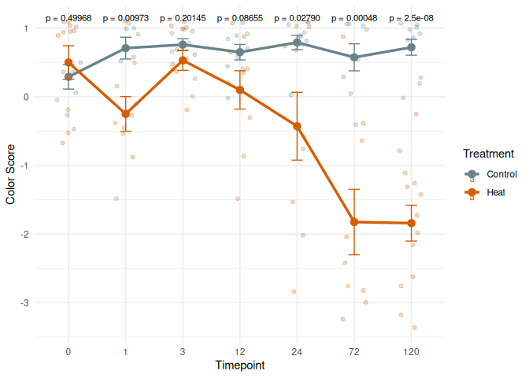<!-- -->

``` r
save_ggplot(last_plot(), "Pcom")

final %>%
  ggplot(., aes(x=Timepoint, y=ColorScore, color=Treatment, shape=Tank_ID)) +
  geom_jitter(alpha=0.25, size=1.5, width = 0.22) + 
  theme_minimal() + labs(x = "Timepoint",y = "Color Score") +
  scale_color_manual(values = treat_colors) +
  geom_point(stat = "summary", fun = mean, aes(group = Tank_ID), size=3) +
  stat_summary(fun.data = mean_se, geom = "errorbar", width = 0.1, size = 0.4, aes(group = Tank_ID)) +
  geom_line(stat = "summary", fun = mean, size = 0.4, aes(group = Tank_ID)) +
  stat_compare_means(aes(group = Treatment),method = "anova",label = "p.format",size = 3)
```

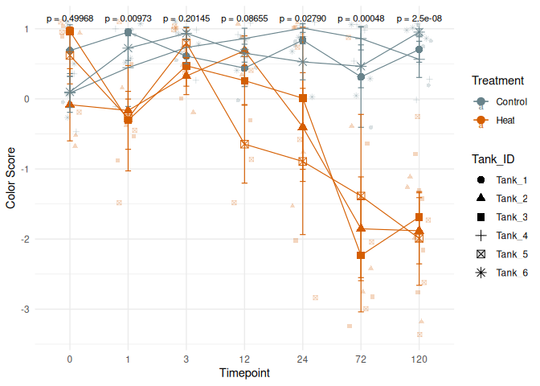<!-- -->

``` r
save_ggplot(last_plot(), "Pcom_by_tank")

final %>%
  ggplot(., aes(x=Timepoint, y=ColorScore, color=Treatment, shape=Tank_ID)) +
  theme_minimal() + labs(x = "Timepoint",y = "Color Score") +
  scale_color_manual(values = treat_colors) +
  stat_summary(fun.data = mean_se, geom = "errorbar", position = position_dodge(width = 0.5), width = 0.2, alpha = 0.5) +
  stat_summary(fun.data = mean_se, geom = "point", position = position_dodge(width = 0.5), alpha = 0.5,size=2.5) +
  stat_summary(fun = mean, geom = "point", aes(group = Treatment), size = 2.5) +
  stat_summary(fun = mean, geom = "line", aes(group = Treatment), size = 1.2) +
  stat_compare_means(aes(group = Treatment),method = "anova",label = "p.format",size = 3)
```

<!-- -->

``` r
save_ggplot(last_plot(), "Pcom_tank_means")
```

## *Montipora capitata*

### Read in datafiles

``` r
raw <- read.csv("../../2-Mcap/data/Images/ColorScore.csv", colClasses=c("Date"="character", 
                                                                               "Timepoint"="character",
                                                                               "Plug"="character",
                                                                               "Date"="character"))  %>%
  dplyr::rename(Sample=FileName)

raw <- raw %>% mutate(Treatment=str_replace(Treatment,"heat","Heat"),
                      Treatment=str_replace(Treatment,"control","Control"))
```

### Check raw values

Identify any outliers in the standard values – any red flags in the
pictures/analysis?

These don’t get removed here, we remove outliers after they have been
normalized to their picture standard values. But outliers here might
mean taking a second look at the picture.

``` r
for (column in c("Red.Standard", "Green.Standard","Blue.Standard")){
  # IQR method 
  Q1 <- quantile(raw[[column]], 0.25)
  Q3 <- quantile(raw[[column]], 0.75)
  IQR_val <- Q3 - Q1
  
  lower_bound <- Q1 - 1.5 * IQR_val
  upper_bound <- Q3 + 1.5 * IQR_val
  outliers <- raw[raw[[column]] < lower_bound | raw[[column]] > upper_bound, ]
  print(paste0(column,": IQR = ", Q1,"-",Q3,"; ",nrow(outliers)," outliers"))
  print(outliers)
}
```

    ## [1] "Red.Standard: IQR = 239.71-245.765; 3 outliers"
    ##    FileName_Orig     Sample     Date Timepoint Treatment Tank_ID Plug
    ## 1       IMG_4372  MON_P0_H2 20250702         0      Heat  Tank_3 2728
    ## 62      IMG_4437 MON_R12_H1 20250702        12      Heat  Tank_2 1105
    ## 64      IMG_4439 MON_P12_C2 20250702        12   Control  Tank_4 1573
    ##    Red.Standard Green.Standard Blue.Standard Red.Coral Green.Coral Blue.Coral
    ## 1        226.90         159.81        176.79    145.20      103.84      27.43
    ## 62       222.73         179.79        192.96    156.06      118.13      50.47
    ## 64        48.65         219.45        224.89    174.22      126.66      50.03
    ##                                    Notes  X X.1 X.2 X.3 X.4
    ## 1                                        NA  NA  NA  NA    
    ## 62                                       NA  NA  NA  NA    
    ## 64 coral frag blur. Flash intensity high NA  NA  NA  NA    
    ## [1] "Green.Standard: IQR = 193.6425-211.88; 1 outliers"
    ##   FileName_Orig    Sample     Date Timepoint Treatment Tank_ID Plug
    ## 1      IMG_4372 MON_P0_H2 20250702         0      Heat  Tank_3 2728
    ##   Red.Standard Green.Standard Blue.Standard Red.Coral Green.Coral Blue.Coral
    ## 1        226.9         159.81        176.79     145.2      103.84      27.43
    ##   Notes  X X.1 X.2 X.3 X.4
    ## 1       NA  NA  NA  NA    
    ## [1] "Blue.Standard: IQR = 209.7025-221.82; 1 outliers"
    ##   FileName_Orig    Sample     Date Timepoint Treatment Tank_ID Plug
    ## 1      IMG_4372 MON_P0_H2 20250702         0      Heat  Tank_3 2728
    ##   Red.Standard Green.Standard Blue.Standard Red.Coral Green.Coral Blue.Coral
    ## 1        226.9         159.81        176.79     145.2      103.84      27.43
    ##   Notes  X X.1 X.2 X.3 X.4
    ## 1       NA  NA  NA  NA

### Normalize data

``` r
proc <- raw %>% mutate(
    Red.Norm.Coral = Red.Coral/Red.Standard,
    Green.Norm.Coral = Green.Coral/Green.Standard,
    Blue.Norm.Coral = Blue.Coral/Blue.Standard
)

rownames(proc) <- proc$Sample
```

#### Identify outliers via IQR

Identify outliers within treatment. Because we do not expect the
distributions of the heat and control colors to be the same, we look for
outliers separately in these treatments.

``` r
norm_outliers <- c()

for (column in c("Red.Norm.Coral","Green.Norm.Coral", "Blue.Norm.Coral")){
    stats_temp <- proc %>%
        group_by(across(all_of(c("Treatment")))) %>%
        mutate(Q1 = quantile(get(column), 0.25),
               Q3 = quantile(get(column), 0.75),
               IQR_val = Q3 - Q1,
               lower_bound = Q1 - 1.5 * IQR_val,
               upper_bound = Q3 + 1.5 * IQR_val,
               is_outlier = get(column) < lower_bound | get(column) > upper_bound) %>%
        ungroup()
    
    outliers_heat <- stats_temp %>% filter(Treatment =="Heat" & is_outlier==TRUE)
    outliers_control <- stats_temp %>% filter(Treatment =="Control" & is_outlier==TRUE)
    
    print(paste0(column,", Heat Samples: IQR = ", round(outliers_heat$Q1,2),"-",round(outliers_heat$Q3,2),"; ",nrow(outliers_heat)," outlier(s)"))
    print(outliers_heat %>% dplyr::select(c(FileName_Orig,Sample,Timepoint,Treatment,Notes,column,lower_bound,upper_bound)))
    
    print(paste0(column,", Control Samples: IQR = ", round(outliers_control$Q1,2),"-",round(outliers_control$Q3,2),"; ",nrow(outliers_control)," outlier(s)"))
    print(outliers_control %>% dplyr::select(c(FileName_Orig,Sample,Timepoint,Treatment,Notes,column,lower_bound,upper_bound)))

    norm_outliers <- c(norm_outliers,outliers_heat$Sample,outliers_control$Sample)
}
```

    ## [1] "Red.Norm.Coral, Heat Samples: IQR = 0.7-0.82; 1 outlier(s)"
    ## # A tibble: 1 × 8
    ##   FileName_Orig Sample    Timepoint Treatment Notes Red.Norm.Coral lower_bound
    ##   <chr>         <chr>     <chr>     <chr>     <chr>          <dbl>       <dbl>
    ## 1 IMG_4380      MON_R0_H1 0         Heat      ""             0.472       0.515
    ## # ℹ 1 more variable: upper_bound <dbl>
    ## [1] "Red.Norm.Coral, Control Samples: IQR = 0.62-0.75; 1 outlier(s)"
    ## # A tibble: 1 × 8
    ##   FileName_Orig Sample     Timepoint Treatment Notes  Red.Norm.Coral lower_bound
    ##   <chr>         <chr>      <chr>     <chr>     <chr>           <dbl>       <dbl>
    ## 1 IMG_4439      MON_P12_C2 12        Control   coral…           3.58       0.407
    ## # ℹ 1 more variable: upper_bound <dbl>
    ## [1] "Green.Norm.Coral, Heat Samples: IQR = 0.63-0.77; 1 outlier(s)"
    ## # A tibble: 1 × 8
    ##   FileName_Orig Sample    Timepoint Treatment Notes Green.Norm.Coral lower_bound
    ##   <chr>         <chr>     <chr>     <chr>     <chr>            <dbl>       <dbl>
    ## 1 IMG_4380      MON_R0_H1 0         Heat      ""               0.403       0.422
    ## # ℹ 1 more variable: upper_bound <dbl>
    ## [1] "Green.Norm.Coral, Control Samples: IQR = -; 0 outlier(s)"
    ## # A tibble: 0 × 8
    ## # ℹ 8 variables: FileName_Orig <chr>, Sample <chr>, Timepoint <chr>,
    ## #   Treatment <chr>, Notes <chr>, Green.Norm.Coral <dbl>, lower_bound <dbl>,
    ## #   upper_bound <dbl>
    ## [1] "Blue.Norm.Coral, Heat Samples: IQR = -; 0 outlier(s)"
    ## # A tibble: 0 × 8
    ## # ℹ 8 variables: FileName_Orig <chr>, Sample <chr>, Timepoint <chr>,
    ## #   Treatment <chr>, Notes <chr>, Blue.Norm.Coral <dbl>, lower_bound <dbl>,
    ## #   upper_bound <dbl>
    ## [1] "Blue.Norm.Coral, Control Samples: IQR = 0.14-0.25; 1 outlier(s)"
    ## # A tibble: 1 × 8
    ##   FileName_Orig Sample    Timepoint Treatment Notes Blue.Norm.Coral lower_bound
    ##   <chr>         <chr>     <chr>     <chr>     <chr>           <dbl>       <dbl>
    ## 1 IMG_4414      MON_P3_C2 3         Control   ""              0.449     -0.0213
    ## # ℹ 1 more variable: upper_bound <dbl>

``` r
unique(norm_outliers)
```

    ## [1] "MON_R0_H1"  "MON_P12_C2" "MON_P3_C2"

#### Remove outliers

Go back and assess the images. Why are these flagging as outliers?

``` r
proc_out_rm <- proc %>% filter(!(Sample %in% unique(norm_outliers)))
proc <- proc_out_rm
```

### Calculate color Score

``` r
#create matrix with rownames as the samples
proc_matrix <- as.matrix(cbind(proc$Red.Norm.Coral,
                                   proc$Green.Norm.Coral,
                                   proc$Blue.Norm.Coral))

rownames(proc_matrix) <- proc$Sample

#calculate distance
dist <- vegdist(proc_matrix, method="euclidean") 

#calculate PCA
PCA <- princomp(dist)
```

``` r
#extract PC1 as color score
colorscore <- as.data.frame(-PCA$scores[,1]) #extract PC1
colorscore$Sample <- rownames(proc_matrix)

colorscore <- colorscore %>% dplyr::rename(., ColorScore = `-PCA$scores[, 1]`)

final <- left_join(proc, colorscore, by = "Sample") 

# make time and treatment factors
final$Timepoint <- factor(final$Timepoint, levels = as.character(sort(unique(as.numeric(final$Timepoint)))))
final$Treatment <- factor(final$Treatment)

range(final$ColorScore)
```

    ## [1] -3.587968  1.555992

#### Identify outliers via IQR

At this point, there should not be outliers in the color score values if
the normalized values had ouliers removed. But check if there are and
examine the data.

``` r
final <- final %>%
    group_by(across(all_of(c("Treatment")))) %>%
    mutate(Q1 = quantile(ColorScore, 0.25),
           Q3 = quantile(ColorScore, 0.75),
           IQR_val = Q3 - Q1,
           lower_bound = Q1 - 1.5 * IQR_val,
           upper_bound = Q3 + 1.5 * IQR_val,
           is_outlier = ColorScore < lower_bound | ColorScore > upper_bound) %>%
    ungroup()

outliers_heat <- final %>% filter(Treatment =="Heat" & is_outlier==TRUE)
outliers_control <- final %>% filter(Treatment =="Control" & is_outlier==TRUE)

print(paste0("ColorScore, Heat Samples: IQR = ", round(outliers_heat$Q1,2),"-",round(outliers_heat$Q3,2),"; ",nrow(outliers_heat)," outlier(s)"))
```

    ## [1] "ColorScore, Heat Samples: IQR = -; 0 outlier(s)"

``` r
print(outliers_heat %>% dplyr::select(c(FileName_Orig,Sample,Timepoint,Treatment,Notes,ColorScore,lower_bound,upper_bound)))
```

    ## # A tibble: 0 × 8
    ## # ℹ 8 variables: FileName_Orig <chr>, Sample <chr>, Timepoint <fct>,
    ## #   Treatment <fct>, Notes <chr>, ColorScore <dbl>, lower_bound <dbl>,
    ## #   upper_bound <dbl>

``` r
print(paste0("ColorScore, Control Samples: IQR = ", round(outliers_control$Q1,2),"-",round(outliers_control$Q3,2),"; ",nrow(outliers_control)," outlier(s)"))
```

    ## [1] "ColorScore, Control Samples: IQR = 0.41-1.43; 2 outlier(s)"
    ## [2] "ColorScore, Control Samples: IQR = 0.41-1.43; 2 outlier(s)"

``` r
print(outliers_control %>% dplyr::select(c(FileName_Orig,Sample,Timepoint,Treatment,Notes,ColorScore,lower_bound,upper_bound)))
```

    ## # A tibble: 2 × 8
    ##   FileName_Orig Sample    Timepoint Treatment Notes ColorScore lower_bound
    ##   <chr>         <chr>     <fct>     <fct>     <chr>      <dbl>       <dbl>
    ## 1 IMG_4393      MON_R1_C3 1         Control   ""         -1.39       -1.12
    ## 2 IMG_4398      MON_P1_C1 1         Control   ""         -1.76       -1.12
    ## # ℹ 1 more variable: upper_bound <dbl>

``` r
color_outliers <- c(outliers_heat$Sample,outliers_control$Sample)
```

#### Remove outliers

See note above. Ideally there are no outliers at this stage.

``` r
final_filtered_IQR <- final %>% filter(!(Sample %in% unique(color_outliers)))
final <- final_filtered_IQR
```

### Plot

``` r
final %>%
  ggplot(., aes(x=Timepoint, y=ColorScore, color=Treatment)) +
  geom_jitter(alpha=0.25, size=1.5, width = 0.22) + 
  theme_minimal() + labs(x = "Timepoint",y = "Color Score") +
  scale_color_manual(values = treat_colors) +
  geom_point(stat = "summary", fun = mean, aes(group = Treatment), size=3) +
  stat_summary(fun.data = mean_se, geom = "errorbar", width = 0.2, aes(group = Treatment)) +
  geom_line(stat = "summary", fun = mean, size = 1.2, aes(group = Treatment)) +
  stat_compare_means(aes(group = Treatment),method = "anova",label = "p.format",size = 3)
```

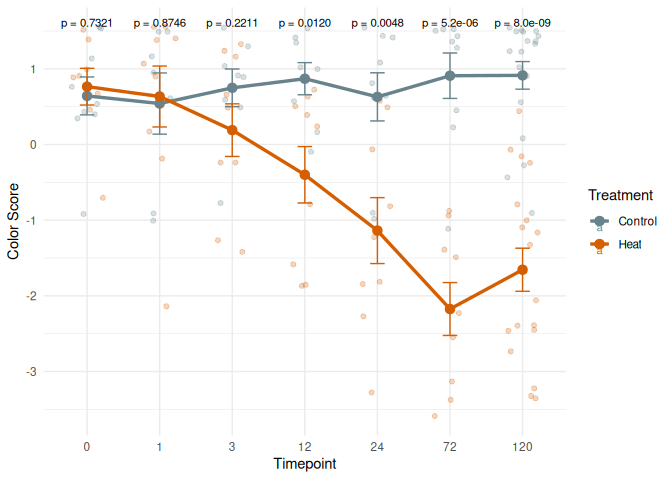<!-- -->

``` r
save_ggplot(last_plot(), "Mcap")

final %>%
  ggplot(., aes(x=Timepoint, y=ColorScore, color=Treatment, shape=Tank_ID)) +
  geom_jitter(alpha=0.25, size=1.5, width = 0.22) + 
  theme_minimal() + labs(x = "Timepoint",y = "Color Score") +
  scale_color_manual(values = treat_colors) +
  geom_point(stat = "summary", fun = mean, aes(group = Tank_ID), size=3) +
  stat_summary(fun.data = mean_se, geom = "errorbar", width = 0.1, size = 0.4, aes(group = Tank_ID)) +
  geom_line(stat = "summary", fun = mean, size = 0.4, aes(group = Tank_ID)) +
  stat_compare_means(aes(group = Treatment),method = "anova",label = "p.format",size = 3)
```

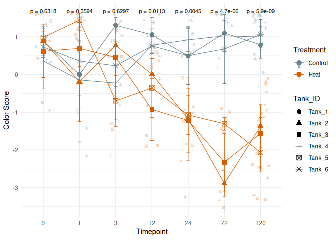<!-- -->

``` r
save_ggplot(last_plot(), "Mcap_by_tank")

final %>%
  ggplot(., aes(x=Timepoint, y=ColorScore, color=Treatment, shape=Tank_ID)) +
  theme_minimal() + labs(x = "Timepoint",y = "Color Score") +
  scale_color_manual(values = treat_colors) +
  stat_summary(fun.data = mean_se, geom = "errorbar", position = position_dodge(width = 0.5), width = 0.2, alpha = 0.5) +
  stat_summary(fun.data = mean_se, geom = "point", position = position_dodge(width = 0.5), alpha = 0.5,size=2.5) +
  stat_summary(fun = mean, geom = "point", aes(group = Treatment), size = 2.5) +
  stat_summary(fun = mean, geom = "line", aes(group = Treatment), size = 1.2) +
  stat_compare_means(aes(group = Treatment),method = "anova",label = "p.format",size = 3)
```

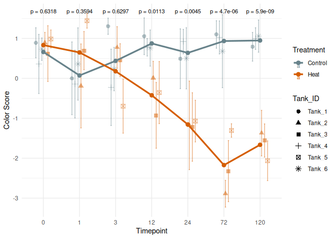<!-- -->

``` r
save_ggplot(last_plot(), "Mcap_tank_means")
```
