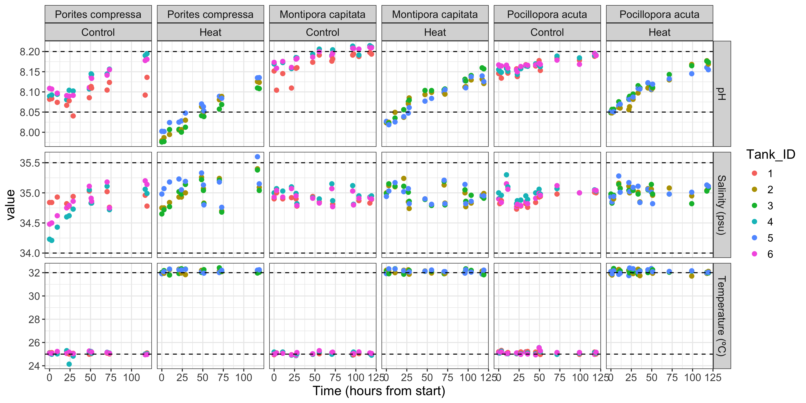
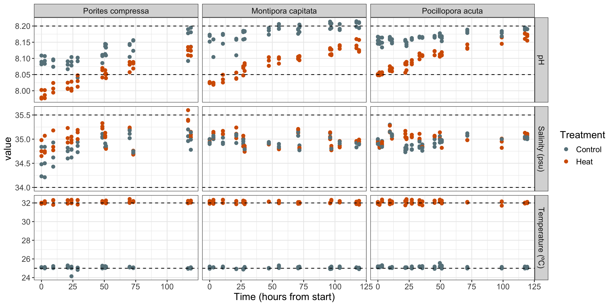
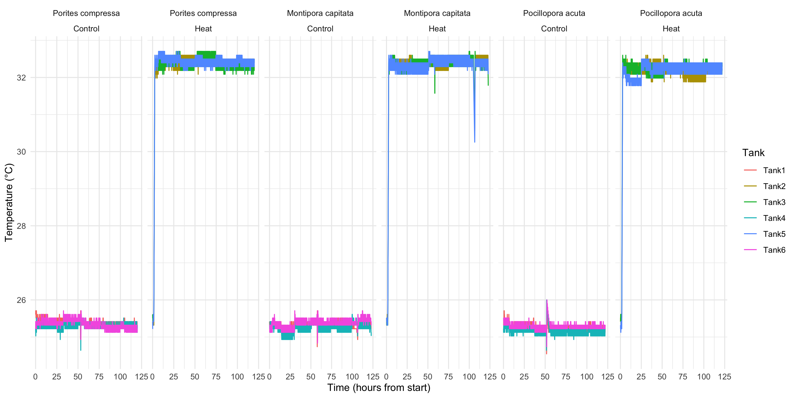
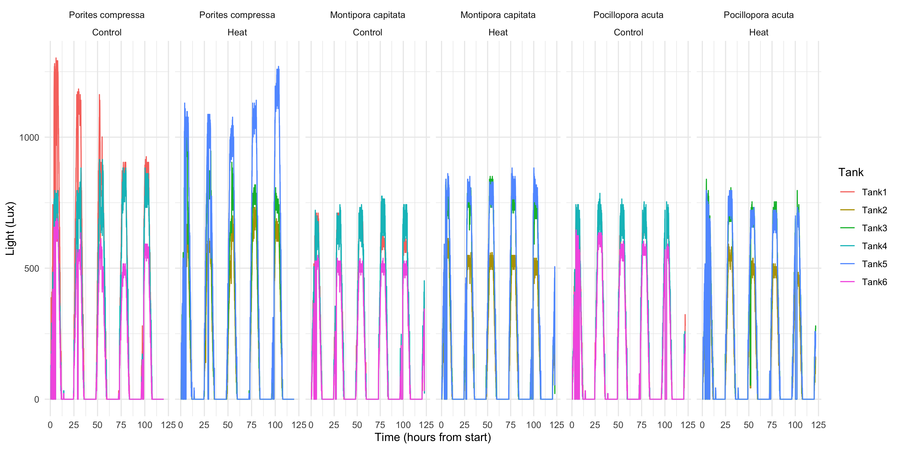
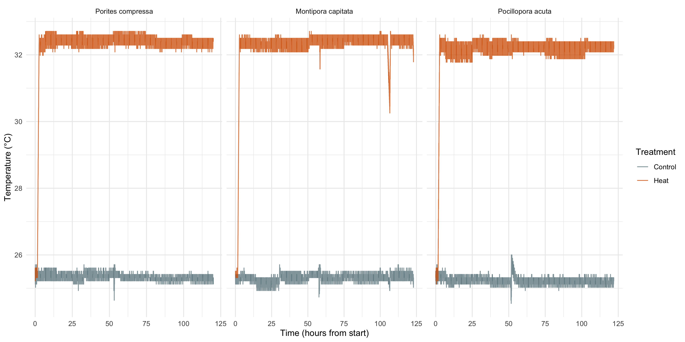
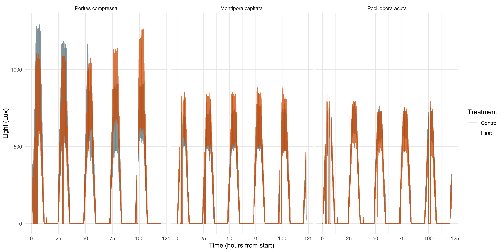

Experimental Conditions During All 4 Experiments
================
Zoe Dellaert
7/9/2025

- [0.1 Load data](#01-load-data)
- [0.2 Convert datetime to hours from
  start](#02-convert-datetime-to-hours-from-start)
- [0.3 Plot](#03-plot)
- [0.4 HOBO Temps, based on Jill’s
  Script](#04-hobo-temps-based-on-jills-script)
- [0.5 Plot temp and light by
  treatment](#05-plot-temp-and-light-by-treatment)

This script plots daily measurements from the experiment, and is based
on the Putnam Lab script available here:
<https://github.com/Putnam-Lab/CBLS_Wetlab/tree/main>

``` r
library(tidyverse)
library(lubridate) # used for converting 8 digit date into datetime format for R
library(RColorBrewer)
library(rmarkdown)
library(tinytex)

custom_colors <- c("Control" = "lightblue4", "Heat" = "#D55E00")
species_order <- c("Porites compressa","Montipora capitata","Pocillopora acuta")
```

## 0.1 Load data

``` r
Pcomp <- read.csv("../../1-Pcom/output/DMs_Processed.csv")
Mcap <- read.csv("../../2-Mcap/output/DMs_Processed.csv")
Pacu <- read.csv("../../3-Pacu/output/DMs_Processed.csv")

Pcomp$species <- "Porites compressa"
Mcap$species <- "Montipora capitata"
Pacu$species <- "Pocillopora acuta"

#combine dataframes
pHSlope <- rbind(Pcomp,Mcap,Pacu)
pHSlope$Tank_ID <- as.character(pHSlope$Tank_ID)
pHSlope$species <- factor(pHSlope$species,levels = species_order)

## Change data format to long format 

pHSlope.long <-pHSlope %>% pivot_longer(cols=Temperature_C:pH.total,
  names_to = "metric",
  values_to = "value")
```

## 0.2 Convert datetime to hours from start

``` r
pHSlope.long <- pHSlope.long %>%
  group_by(species) %>%
  mutate(TimeHours = as.numeric(difftime(DateTime, min(DateTime), units = "hours")))
```

## 0.3 Plot

Make a list of dataframes, each containing a horizontal line that will
correspond to the upper and lower threshold of each parameter
(temperature, salinity, pH total)

``` r
hlines_data <- list(
  data.frame(yintercept = 25.0, metric = "Temperature_C"), # lower threshold for temperature in C°
  data.frame(yintercept = 32, metric = "Temperature_C"), # upper threshold for temperature in C°
  data.frame(yintercept = 34, metric = "Salinity_psu"), # lower threshold for salinity in psu
  data.frame(yintercept = 35.5, metric = "Salinity_psu"), # upper threshold for salinity in psu
  data.frame(yintercept = 8.05, metric = "pH.total"), # lower threshold for total pH
  data.frame(yintercept = 8.2, metric = "pH.total") # upper threshold for total pH
    )
```

``` r
facet_labels <- c(unique(pHSlope.long$metric), unique(pHSlope.long$Treatment),unique(as.character(pHSlope.long$species)))
names(facet_labels) = facet_labels
facet_labels <- replace(facet_labels, which(facet_labels == "pH.total"), "pH")
facet_labels <- replace(facet_labels, which(facet_labels == "Salinity_psu"), "Salinity (psu)")
facet_labels <- replace(facet_labels, which(facet_labels == "Temperature_C"), "Temperature (ºC)")
```

``` r
daily_tank<-pHSlope.long %>% 
  ggplot(aes(x=TimeHours, y=value, colour=Tank_ID))+
  geom_point(size=2)+
  xlab("Time (hours from start)")+
  facet_grid(factor(metric,c("pH.total","Salinity_psu","Conductivity_mScm","Temperature_C")) ~ species + Treatment, scales = "free", labeller = as_labeller(facet_labels))+
  geom_hline(data = hlines_data[[1]], aes(yintercept = yintercept), linetype = "dashed") +    
  geom_hline(data = hlines_data[[2]], aes(yintercept = yintercept), linetype = "dashed") +
  geom_hline(data = hlines_data[[3]], aes(yintercept = yintercept), linetype = "dashed") +
  geom_hline(data = hlines_data[[4]], aes(yintercept = yintercept), linetype = "dashed") +
  geom_hline(data = hlines_data[[5]], aes(yintercept = yintercept), linetype = "dashed") +
  geom_hline(data = hlines_data[[6]], aes(yintercept = yintercept), linetype = "dashed") +
  theme_bw() +
  theme(text = element_text(size = 14)); daily_tank
```



``` r
# Save plot 
ggsave("../output/pdf_figs/Daily_Measurements_Exp.pdf", daily_tank, width = 10, height = 10, units = c("in"))
ggsave("../output/Daily_Measurements_Exp.png", daily_tank, width = 10, height = 10, units = c("in"), bg = "white")
```

``` r
daily_tank<-pHSlope.long %>% 
  ggplot(aes(x=TimeHours, y=value, colour=Treatment))+
  geom_point(size=2)+
  xlab("Time (hours from start)")+
  facet_grid(factor(metric,c("pH.total","Salinity_psu","Conductivity_mScm","Temperature_C")) ~ species, scales = "free", labeller = as_labeller(facet_labels))+
  geom_hline(data = hlines_data[[1]], aes(yintercept = yintercept), linetype = "dashed") +    
  geom_hline(data = hlines_data[[2]], aes(yintercept = yintercept), linetype = "dashed") +
  geom_hline(data = hlines_data[[3]], aes(yintercept = yintercept), linetype = "dashed") +
  geom_hline(data = hlines_data[[4]], aes(yintercept = yintercept), linetype = "dashed") +
  geom_hline(data = hlines_data[[5]], aes(yintercept = yintercept), linetype = "dashed") +
  geom_hline(data = hlines_data[[6]], aes(yintercept = yintercept), linetype = "dashed") +
  theme_bw() + scale_color_manual(values = custom_colors) +
  theme(text = element_text(size = 14)); daily_tank
```



``` r
# Save plot 
ggsave("../output/pdf_figs/Daily_Measurements_Exp_byTreatment.pdf", daily_tank, width = 10, height = 10, units = c("in"))
ggsave("../output/Daily_Measurements_Exp_byTreatment.png", daily_tank, width = 10, height = 10, units = c("in"), bg = "white")
```

## 0.4 HOBO Temps, based on [Jill’s Script](https://github.com/JillAshey/Astrangia_repo/blob/0041652d5b2a01145c1c049f10dbc53a8513cb86/scripts/Hobo_Temps.Rmd#L27)

``` r
Pcomp <- read.csv("../../1-Pcom/output/Experimental_Tank_HoboTempLight_data.csv")
Mcap <- read.csv("../../2-Mcap/output/Experimental_Tank_HoboTempLight_data.csv")
Pacu <- read.csv("../../3-Pacu/output/Experimental_Tank_HoboTempLight_data.csv")

Pcomp$species <- "Porites compressa"
Mcap$species <- "Montipora capitata"
Pacu$species <- "Pocillopora acuta"


#combine dataframes
tank_df_Exp <- rbind(Pcomp,Mcap,Pacu)
tank_df_Exp$species <- factor(tank_df_Exp$species,levels = species_order)

tank_df_Exp$DateTimeEST <- parse_date_time(tank_df_Exp$DateTimeEST,"ymd HMS")

tank_df_Exp <- tank_df_Exp %>%
  group_by(species) %>%
  mutate(TimeHours = as.numeric(difftime(DateTimeEST, min(DateTimeEST), units = "hours")))

Temps <- tank_df_Exp %>% ggplot(aes(x=TimeHours, y=TempC)) +
  geom_line(aes(color = Tank), size = 0.5) +
  facet_grid(~species+Treatment, scales = "free_x")+
  xlab("Time (hours from start)") +ylab("Temperature (°C)") +theme_minimal()
Temps
```



``` r
ggsave("../output/pdf_figs/Experimental_Tank_HoboTemp.pdf", plot = last_plot(), width = 8, height = 4)
ggsave("../output/Experimental_Tank_HoboTemp.png", plot = last_plot(), width = 8, height = 4, bg = "white")

Light <- tank_df_Exp %>% ggplot(aes(x=TimeHours, y=IntensityLux)) +
  geom_line(aes(color = Tank), size = 0.5) +
  facet_grid(~species+Treatment, scales = "free_x")+
  xlab("Time (hours from start)") +ylab("Light (Lux)") +theme_minimal()

Light
```



``` r
ggsave("../output/pdf_figs/Experimental_Tank_HoboLight.pdf", plot = last_plot(), width = 8, height = 4)
ggsave("../output/Experimental_Tank_HoboLight.png", plot = last_plot(), width = 8, height = 4, bg = "white")
```

## 0.5 Plot temp and light by treatment

``` r
Temps <- tank_df_Exp %>% ggplot(aes(x=TimeHours, y=TempC)) +
  geom_line(aes(color = Treatment), size = 0.5,alpha=0.75) +
  facet_grid(~species, scales = "free_x")+
  xlab("Time (hours from start)") +ylab("Temperature (°C)") + scale_color_manual(values = custom_colors) +theme_minimal()
Temps
```



``` r
ggsave("../output/pdf_figs/Experimental_Tank_HoboTemp_byTreatment.pdf", plot = last_plot(), width = 8, height = 4)
ggsave("../output/Experimental_Tank_HoboTemp_byTreatment.png", plot = last_plot(), width = 8, height = 4, bg = "white")

Light <- tank_df_Exp %>% ggplot(aes(x=TimeHours, y=IntensityLux)) +
  geom_line(aes(color = Treatment), size = 0.5,alpha=0.75) +
  facet_grid(~species, scales = "free_x")+
  xlab("Time (hours from start)") +ylab("Light (Lux)") + scale_color_manual(values = custom_colors) +theme_minimal()
Light
```



``` r
ggsave("../output/pdf_figs/Experimental_Tank_HoboLight_byTreatment.pdf", plot = last_plot(), width = 8, height = 4)
ggsave("../output/Experimental_Tank_HoboLight_byTreatment.png", plot = last_plot(), width = 8, height = 4, bg = "white")
```
