DE
================
Zoe Dellaert
2025-11-20

## Differential expression analysis of Time Series Bulk RNA Data

## Thoughts and Notes

- [This paper](https://academic.oup.com/bib/article/20/1/288/4364840)

Daniel Spies, Peter F Renz, Tobias A Beyer, Constance Ciaudo,
Comparative analysis of differential gene expression tools for RNA
sequencing time course data, Briefings in Bioinformatics, Volume 20,
Issue 1, January 2019, Pages 288–298,
<https://doi.org/10.1093/bib/bbx115>

## Load packages

``` r
library("genefilter")
library("DESeq2")
library("apeglm")
library("ggplot2")
library("pheatmap")
library("ggnewscale")
library("RColorBrewer")
library("tidyverse")

sessionInfo() #provides list of loaded packages and version of R.
```

    ## R version 4.5.1 (2025-06-13)
    ## Platform: x86_64-pc-linux-gnu
    ## Running under: Ubuntu 24.04.1 LTS
    ## 
    ## Matrix products: default
    ## BLAS:   /usr/lib/x86_64-linux-gnu/openblas-pthread/libblas.so.3 
    ## LAPACK: /usr/lib/x86_64-linux-gnu/openblas-pthread/libopenblasp-r0.3.26.so;  LAPACK version 3.12.0
    ## 
    ## locale:
    ##  [1] LC_CTYPE=en_US.UTF-8       LC_NUMERIC=C              
    ##  [3] LC_TIME=en_US.UTF-8        LC_COLLATE=en_US.UTF-8    
    ##  [5] LC_MONETARY=en_US.UTF-8    LC_MESSAGES=en_US.UTF-8   
    ##  [7] LC_PAPER=en_US.UTF-8       LC_NAME=C                 
    ##  [9] LC_ADDRESS=C               LC_TELEPHONE=C            
    ## [11] LC_MEASUREMENT=en_US.UTF-8 LC_IDENTIFICATION=C       
    ## 
    ## time zone: Etc/UTC
    ## tzcode source: system (glibc)
    ## 
    ## attached base packages:
    ## [1] stats4    stats     graphics  grDevices utils     datasets  methods  
    ## [8] base     
    ## 
    ## other attached packages:
    ##  [1] lubridate_1.9.4             forcats_1.0.0              
    ##  [3] stringr_1.6.0               dplyr_1.1.4                
    ##  [5] purrr_1.2.0                 readr_2.1.5                
    ##  [7] tidyr_1.3.1                 tibble_3.3.0               
    ##  [9] tidyverse_2.0.0             RColorBrewer_1.1-3         
    ## [11] ggnewscale_0.5.2            pheatmap_1.0.13            
    ## [13] ggplot2_4.0.1               apeglm_1.30.0              
    ## [15] DESeq2_1.50.2               SummarizedExperiment_1.40.0
    ## [17] Biobase_2.70.0              MatrixGenerics_1.22.0      
    ## [19] matrixStats_1.5.0           GenomicRanges_1.62.0       
    ## [21] Seqinfo_1.0.0               IRanges_2.44.0             
    ## [23] S4Vectors_0.48.0            BiocGenerics_0.56.0        
    ## [25] generics_0.1.4              genefilter_1.90.0          
    ## 
    ## loaded via a namespace (and not attached):
    ##  [1] tidyselect_1.2.1        farver_2.1.2            blob_1.2.4             
    ##  [4] Biostrings_2.76.0       S7_0.2.1                fastmap_1.2.0          
    ##  [7] XML_3.99-0.18           digest_0.6.39           timechange_0.3.0       
    ## [10] lifecycle_1.0.4         survival_3.8-3          KEGGREST_1.48.1        
    ## [13] RSQLite_2.4.1           magrittr_2.0.4          compiler_4.5.1         
    ## [16] rlang_1.1.6             tools_4.5.1             yaml_2.3.10            
    ## [19] knitr_1.50              S4Arrays_1.10.0         bit_4.6.0              
    ## [22] DelayedArray_0.36.0     plyr_1.8.9              abind_1.4-8            
    ## [25] BiocParallel_1.44.0     withr_3.0.2             numDeriv_2016.8-1.1    
    ## [28] grid_4.5.1              xtable_1.8-4            scales_1.4.0           
    ## [31] MASS_7.3-65             dichromat_2.0-0.1       bbmle_1.0.25.1         
    ## [34] cli_3.6.5               mvtnorm_1.3-3           rmarkdown_2.29         
    ## [37] crayon_1.5.3            rstudioapi_0.17.1       tzdb_0.5.0             
    ## [40] httr_1.4.7              bdsmatrix_1.3-7         DBI_1.2.3              
    ## [43] cachem_1.1.0            splines_4.5.1           parallel_4.5.1         
    ## [46] AnnotationDbi_1.70.0    XVector_0.50.0          vctrs_0.6.5            
    ## [49] Matrix_1.7-3            jsonlite_2.0.0          hms_1.1.3              
    ## [52] bit64_4.6.0-1           locfit_1.5-9.12         annotate_1.86.1        
    ## [55] glue_1.8.0              emdbook_1.3.14          codetools_0.2-20       
    ## [58] stringi_1.8.7           gtable_0.3.6            GenomeInfoDb_1.44.3    
    ## [61] UCSC.utils_1.4.0        pillar_1.11.1           htmltools_0.5.8.1      
    ## [64] GenomeInfoDbData_1.2.14 R6_2.6.1                evaluate_1.0.5         
    ## [67] lattice_0.22-7          png_0.1-8               memoise_2.0.1          
    ## [70] Rcpp_1.1.0              coda_0.19-4.1           SparseArray_1.10.2     
    ## [73] xfun_0.54               pkgconfig_2.0.3

``` r
#set standard output directory for figures
outdir <- "../output_RNA/differential_expression"

save_ggplot <- function(plot, filename, width = 10, height = 7, units = "in", dpi = 300,bg=NULL) {
  print(plot)

  png_path <- file.path(outdir, paste0(filename, ".png"))
  pdf_dir <- file.path(outdir, "pdf_figs")
  pdf_path <- file.path(pdf_dir, paste0(filename, ".pdf"))
  
  # Ensure the pdf_figs directory exists
  if (!dir.exists(pdf_dir)) dir.create(pdf_dir, recursive = TRUE)
  
  # Save plots
  ggsave(filename = png_path, plot = plot, width = width, height = height, units = units, dpi = dpi,bg = bg)
  ggsave(filename = pdf_path, plot = plot, width = width, height = height, units = units, dpi = dpi,bg = bg)
}

treat_colors <- c("C" = "lightblue4", "H" = "#D55E00")
```

## POC: pre-processing and visualization

Read in raw count data

``` r
#set standard output directory for figures
outdir <- "../output_RNA/differential_expression/POC_PacutaV2"

counts_raw <- read.csv("../output_RNA/count_matrices/POC_PacutaV2_gene_count_matrix.csv", row.names = 1) #load in data

samples <- colnames(counts_raw)
```

Read in metadata

``` r
meta <- data.frame(
  sample = samples, 
  species = str_split(samples, "_", simplify = TRUE)[,1], #extract first part of sample name to get species
  time = str_replace(str_split(samples, "_", simplify = TRUE)[,2],"R", ""), #extract "R##" part to get timepoint then remove R
  replicate = str_split(samples, "_", simplify = TRUE)[,3], #extract "R##" part to get timepoint then remove R
  treatment = str_replace(str_split(samples, "_", simplify = TRUE)[,3],"\\d", "")
)

rownames(meta) <- meta$sample

meta$time <- factor(meta$time, levels = as.character(sort(unique(as.numeric(meta$time)))))
meta$treatment <- factor(meta$treatment)

meta <- meta %>% arrange(time, treatment)
write.csv(meta, paste0(outdir,"/RNA_seq_metadata.csv"))
```

Reorder sample columns based on factor order

``` r
counts_raw <- counts_raw[, meta$sample]
```

Data sanity checks!

``` r
stopifnot(all(meta$sample %in% colnames(counts_raw))) #are all of the sample names in the metadata column names in the gene count matrix?
stopifnot(all(meta$sample == colnames(counts_raw))) #are they the same in the same order?
```

pOverA filtering to reduce dataset

``` r
ffun<-filterfun(pOverA(0.07,10))  # Keep genes expressed at 10+ counts in at least 7% of samples - expressed in all 3 samples at one timepoint from one treatment
counts_filt_poa <- genefilter((counts_raw), ffun) #apply filter

filtered_counts <- counts_raw[counts_filt_poa,] #keep only rows that passed filter

paste0("Number of genes after filtering: ", sum(counts_filt_poa))
```

    ## [1] "Number of genes after filtering: 24788"

``` r
write.csv(filtered_counts, file = file.path(outdir, "filtered_counts.csv"))
```

### [DESeq2](https://www.bioconductor.org/packages/release/bioc/vignettes/DESeq2/inst/doc/DESeq2.html)

Create DESeq object and run DESeq2

``` r
dds <- DESeqDataSetFromMatrix(countData = filtered_counts,
                              colData = meta,
                              design= ~ treatment + time + treatment:time)

dds <- DESeq(dds)
```

Check size factors.

``` r
SF.dds <- estimateSizeFactors(dds) #estimate size factors to determine if we can use vst  to transform our data. Size factors should be less than 4 for us to use vst
print(sizeFactors(SF.dds)) #View size factors
```

    ##   POC_R0_C1   POC_R0_C2   POC_R0_C3   POC_R0_H1   POC_R0_H2   POC_R0_H3 
    ##   1.1400513   1.0054138   1.0730462   1.0656934   1.0344791   1.2362674 
    ##   POC_R1_C1   POC_R1_C2   POC_R1_C3   POC_R1_H1   POC_R1_H2   POC_R1_H3 
    ##   1.1375714   1.4320163   1.1739872   0.7374017   1.2005566   1.0448926 
    ##   POC_R3_C1   POC_R3_C2   POC_R3_C3   POC_R3_H1   POC_R3_H2   POC_R3_H3 
    ##   1.0620672   1.0220145   1.2373402   0.6891664   0.4336651   0.7143330 
    ##  POC_R12_C1  POC_R12_C2  POC_R12_C3  POC_R12_H1  POC_R12_H2  POC_R12_H3 
    ##   0.9365758   1.2352574   0.7657006   0.9766124   1.0704378   0.8340966 
    ##  POC_R24_C1  POC_R24_C2  POC_R24_C3  POC_R24_H1  POC_R24_H2  POC_R24_H3 
    ##   1.2237477   0.9300323   1.3443019   1.0667102   0.9626905   1.0305861 
    ##  POC_R72_C1  POC_R72_C2  POC_R72_C3  POC_R72_H1  POC_R72_H2  POC_R72_H3 
    ##   1.0343116   1.4124681   1.0367336   1.3044786   0.9473403   0.8361998 
    ## POC_R120_C1 POC_R120_C2 POC_R120_C3 POC_R120_H1 POC_R120_H2 POC_R120_H3 
    ##   0.7399601   0.9449157   1.0560854   0.9492946   1.3124819   0.9963775

``` r
all(sizeFactors(SF.dds)) < 4
```

    ## [1] TRUE

Transforming count data for visualization

``` r
vsd <- vst(dds, blind=FALSE)

#save the vsd transformation
vsd_mat <- assay(vsd)
write.csv(vsd_mat, file = file.path(outdir, "vsd_expression_matrix.csv"))
```

### Heatmap of the sample-to-sample distances

``` r
sampleDists <- dist(t(assay(vsd)))

sampleDistMatrix <- as.matrix(sampleDists)
colnames(sampleDistMatrix) <- NULL

pheatmap(sampleDistMatrix,
         col=colorRampPalette( rev(brewer.pal(9, "Blues")) )(255))
```

<!-- -->

### Principal component plot of the samples

``` r
pcaData <- plotPCA(vsd, intgroup=c("time", "treatment"), returnData=TRUE)

percentVar <- round(100 * attr(pcaData, "percentVar"))
PCA <- ggplot() +
  geom_point(data = subset(pcaData, treatment == "C"),
             aes(x=PC1, y=PC2, color=time),
                 size=2) +
             scale_color_manual(values=brewer.pal(7, "Blues"), name = "Time (hrs) - Control") +
  
  #start new scale
  ggnewscale::new_scale_color() +
  geom_point(data = subset(pcaData, treatment == "H"),
             aes(x=PC1, y=PC2, color=time),
                 size=2) +
             scale_color_manual(values=brewer.pal(7, "Oranges"), name = "Time (hrs) - Heat") +

  xlab(paste0("PC1: ",percentVar[1],"% variance")) +
  ylab(paste0("PC2: ",percentVar[2],"% variance")) + 
  coord_fixed() + theme_bw()
PCA
```

<!-- -->

``` r
save_ggplot(PCA, "PCA_POC")
```

<!-- -->

### Heatmap of count matrix

``` r
topVarGenes <- head(order(rowVars(assay(vsd)), decreasing=TRUE), 500)

time_colors <- colorRampPalette(c("#ffffcc","#0c2c84"))(7)
names(time_colors) <- levels(meta$time)

#view top 500 most vairable genes
pheatmap(assay(vsd)[topVarGenes, ], cluster_rows=TRUE, show_rownames=FALSE,
         cluster_cols=FALSE, cutree_cols = 2,
         annotation_col= meta[,c("treatment","time")],
         annotation_colors = list("treatment" = treat_colors,
                                  "time" = time_colors))
```

<!-- -->

``` r
pheatmap(assay(vsd)[topVarGenes, ], cluster_rows=TRUE, show_rownames=FALSE,
         cluster_cols=TRUE, cutree_cols = 2,
         annotation_col= meta[,c("treatment","time")],
         annotation_colors = list("treatment" = treat_colors,
                                  "time" = time_colors))
```

<!-- -->

### Heat stress genes

``` r
HeatStressGenes_Pacuta <- read_csv("/project/pi_hputnam_uri_edu/zdellaert/snRNA_analysis/multi-sp-snRNA/reference_genes/genes_of_interest/HeatStressGenes_Pacuta.csv") %>% dplyr::select(-1) %>% dplyr::rename(query = Pacuta_gene) %>% dplyr::select(query,everything()) #%>% filter(ref_first_author =="Majerova")

HeatStressGenes_Pacuta_unique <- HeatStressGenes_Pacuta %>% group_by(query) %>%
  summarize(gene_id = paste(unique(gene_id), collapse = ","),
            response_type = paste(unique(response_type), collapse = ","),
            category = paste(unique(category), collapse = ",")
            ) 

HeatStressGenes_Pacuta_unique <- HeatStressGenes_Pacuta_unique %>% filter(query %in% rownames(vsd_mat))
 
stress_genes_ids <- unique(HeatStressGenes_Pacuta_unique$query) 
stress_genes_vsd <- vsd_mat[stress_genes_ids, ]

plot_df <- as.data.frame(t(stress_genes_vsd)) %>%
  rownames_to_column(var="sample") %>%
  left_join(meta, by=c("sample"="sample")) %>%
  pivot_longer(cols = all_of(stress_genes_ids), names_to="query", values_to="expression") %>%
  left_join(HeatStressGenes_Pacuta_unique)

plot_df %>% ggplot(aes(x=time, y=expression, color=gene_id, group=gene_id)) +
  stat_summary(fun="mean", geom="line") +
  stat_summary(fun.data=mean_se, geom="errorbar", width=0.2) +
  facet_wrap(treatment~response_type) +
  theme_bw() +
  labs(y="VST expression", x="Timepoint")
```

<!-- -->

``` r
plot_df %>% ggplot(aes(x=time, y=expression, color=treatment, group=treatment)) +
  stat_summary(fun="mean", geom="line") +
  stat_summary(fun.data=mean_se, geom="errorbar", width=0.2) +
  scale_color_manual(values = treat_colors) +
  facet_wrap(gene_id~response_type) +
  theme_bw() +
  labs(y="VST expression", x="Timepoint")
```

<!-- -->

``` r
plot_df %>% filter(grepl("HSP70",gene_id)|grepl("Nrf2",gene_id)|grepl("HSF1",gene_id)) %>% ggplot(aes(x=time, y=expression, color=treatment, group=treatment)) +
  stat_summary(fun="mean", geom="line") +
  scale_color_manual(values = treat_colors) +
  stat_summary(fun.data=mean_se, geom="errorbar", width=0.2) +
  facet_wrap(~gene_id) +
  theme_bw() +
  labs(y="VST expression", x="Timepoint")
```

<!-- -->

### DESeq LRT Test

``` r
dds <- DESeqDataSetFromMatrix(countData = filtered_counts,
                              colData = meta,
                              design= ~ treatment + time + treatment:time)

dds <- DESeq(dds, test = "LRT", reduced = ~ treatment + time)

res <- results(dds)
sig_genes <- subset(res, padj < 0.05)
lrt_res <- as.data.frame(res)

DE_05 <- lrt_res[rownames(lrt_res %>% filter(padj<0.05)),]

time_colors <- colorRampPalette(c("#ffffcc","#0c2c84"))(7)
names(time_colors) <- levels(meta$time)

top_500_DE_genes <- DE_05 %>% arrange(padj) %>% head(500) %>% rownames()

#view top 500 most vairable genes
pheatmap(assay(vsd)[top_500_DE_genes, ], cluster_rows=TRUE, show_rownames=FALSE,
         cluster_cols=FALSE, cutree_cols = 2,
         annotation_col= meta[,c("treatment","time")],
         annotation_colors = list("treatment" = treat_colors,
                                  "time" = time_colors))
```

<!-- -->

``` r
pheatmap(assay(vsd)[top_500_DE_genes, ], cluster_rows=TRUE, show_rownames=FALSE,
         cluster_cols=TRUE, cutree_cols = 2,
         annotation_col= meta[,c("treatment","time")],
         annotation_colors = list("treatment" = treat_colors,
                                  "time" = time_colors))
```

<!-- -->

``` r
top_500_DE_genes <- DE_05 %>% arrange(log2FoldChange) %>% head(500) %>% rownames()

#view top 500 most vairable genes
pheatmap(assay(vsd)[top_500_DE_genes, ], cluster_rows=TRUE, show_rownames=FALSE,
         cluster_cols=FALSE, cutree_cols = 2,
         annotation_col= meta[,c("treatment","time")],
         annotation_colors = list("treatment" = treat_colors,
                                  "time" = time_colors))
```

<!-- -->

``` r
pheatmap(assay(vsd)[top_500_DE_genes, ], cluster_rows=TRUE, show_rownames=FALSE,
         cluster_cols=TRUE, cutree_cols = 2,
         annotation_col= meta[,c("treatment","time")],
         annotation_colors = list("treatment" = treat_colors,
                                  "time" = time_colors))
```

<!-- -->

``` r
top_500_DE_genes <- DE_05 %>% arrange(desc(log2FoldChange)) %>% head(500) %>% rownames()

#view top 500 most vairable genes
pheatmap(assay(vsd)[top_500_DE_genes, ], cluster_rows=TRUE, show_rownames=FALSE,
         cluster_cols=FALSE, cutree_cols = 2,
         annotation_col= meta[,c("treatment","time")],
         annotation_colors = list("treatment" = treat_colors,
                                  "time" = time_colors))
```

<!-- -->

``` r
pheatmap(assay(vsd)[top_500_DE_genes, ], cluster_rows=TRUE, show_rownames=FALSE,
         cluster_cols=TRUE, cutree_cols = 2,
         annotation_col= meta[,c("treatment","time")],
         annotation_colors = list("treatment" = treat_colors,
                                  "time" = time_colors))
```

<!-- -->

### DE Heat stress genes

``` r
plot_df <- as.data.frame(t(stress_genes_vsd)) %>%
  rownames_to_column(var="sample") %>%
  left_join(meta, by=c("sample"="sample")) %>%
  pivot_longer(cols = all_of(stress_genes_ids), names_to="query", values_to="expression") %>%
  left_join(HeatStressGenes_Pacuta_unique) %>% left_join(DE_05 %>% rownames_to_column(var="query")) %>%
  filter(!is.na(padj))

plot_df %>% ggplot(aes(x=time, y=expression, color=gene_id, group=gene_id)) +
  stat_summary(fun="mean", geom="line") +
  stat_summary(fun.data=mean_se, geom="errorbar", width=0.2) +
  facet_wrap(treatment~response_type) +
  theme_bw() +
  labs(y="VST expression", x="Timepoint")
```

<!-- -->

``` r
plot_df %>% ggplot(aes(x=time, y=expression, color=treatment, group=treatment)) +
  stat_summary(fun="mean", geom="line") +
  stat_summary(fun.data=mean_se, geom="errorbar", width=0.2) +
  scale_color_manual(values = treat_colors) +
  facet_wrap(gene_id~response_type) +
  theme_bw() +
  labs(y="VST expression", x="Timepoint")
```

<!-- -->

``` r
plot_df %>% filter(grepl("HSP70",gene_id)|grepl("Nrf2",gene_id)|grepl("HSF1",gene_id)) %>% ggplot(aes(x=time, y=expression, color=treatment, group=treatment)) +
  stat_summary(fun="mean", geom="line") +
  scale_color_manual(values = treat_colors) +
  stat_summary(fun.data=mean_se, geom="errorbar", width=0.2) +
  facet_wrap(~gene_id) +
  theme_bw() +
  labs(y="VST expression", x="Timepoint")
```

<!-- -->

### ImpulseDE2

Based on [this
paper](https://academic.oup.com/bib/article/20/1/288/4364840#130283262),
this is the best package to use other than comparing each time point
against each other individually. I am also planning to ID gene modules
via WGCNA.

Repo here: <https://github.com/YosefLab/ImpulseDE2>

Tutorial here:
<http://bioconductor.statistik.tu-dortmund.de/packages/3.11/bioc/vignettes/ImpulseDE2/inst/doc/ImpulseDE2_Tutorial.html>
, I followed closely with the section “Case-control differential
expression analysis”

Read the ImpulseDE2 paper
[here](https://academic.oup.com/nar/article/46/20/e119/5068248)

David S Fischer, Fabian J Theis, Nir Yosef, Impulse model-based
differential expression analysis of time course sequencing data, Nucleic
Acids Research, Volume 46, Issue 20, 16 November 2018, Page e119,
<https://doi.org/10.1093/nar/gky675>

``` r
#library(devtools)
#install_github("YosefLab/ImpulseDE2")

library(ImpulseDE2)
```

First, reformat our metadata table to match the column names used in the
ImpulseDE2 vignette.

``` r
meta_impulse <- meta %>%
  dplyr::rename(Sample = sample, Time = time, Batch = replicate) %>% 
  mutate(Time = as.numeric(as.character(Time)),
         #Time = as.numeric(Time),
         Condition = str_replace(treatment, "C", "control"),
         Condition = str_replace(Condition, "H", "case")
         ) %>%
  select(-c(species,treatment))
```

Then, generate the ImpulseDE2 object

``` r
#test with just 500 genes that I determined to be DE by treatment/timepoint with DESeq2 
objectImpulseDE2 <- runImpulseDE2(
  matCountData    = as.matrix(filtered_counts)[top_500_DE_genes,], #or use filtered_counts 
  dfAnnotation    = meta_impulse,
  boolCaseCtrl    = TRUE,
  vecConfounders  = c("Batch"), #only use if you want to try to control for batch effects
  boolIdentifyTransients = TRUE, #use if you want to ID transiently- vs permanently-regulated genes
  scaNProc        = 8 )

#run with all genes
objectImpulseDE2 <- runImpulseDE2(
  matCountData    = as.matrix(counts_raw), #or use filtered_counts 
  dfAnnotation    = meta_impulse,
  boolCaseCtrl    = TRUE,
  vecConfounders  = c("Batch"), #only use if you want to try to control for batch effects
  boolIdentifyTransients = TRUE, #use if you want to ID transiently- vs permanently-regulated genes
  scaNProc        = 18 )

saveRDS(objectImpulseDE2, file = paste0(outdir, "/objectImpulseDE2.rds"))
```

``` r
objectImpulseDE2 <- readRDS(paste0(outdir, "/objectImpulseDE2.rds"))

impulse_results <- objectImpulseDE2$dfImpulseDE2Results
head(impulse_results)
```

    ##                                                                                Gene
    ## Pocillopora_acuta_HIv2___TS.g10153.t1         Pocillopora_acuta_HIv2___TS.g10153.t1
    ## Pocillopora_acuta_HIv2___RNAseq.g10143.t1 Pocillopora_acuta_HIv2___RNAseq.g10143.t1
    ## Pocillopora_acuta_HIv2___TS.g28292.t1a       Pocillopora_acuta_HIv2___TS.g28292.t1a
    ## Pocillopora_acuta_HIv2___TS.g28295.t1         Pocillopora_acuta_HIv2___TS.g28295.t1
    ## Pocillopora_acuta_HIv2___RNAseq.g10151.t1 Pocillopora_acuta_HIv2___RNAseq.g10151.t1
    ## Pocillopora_acuta_HIv2___TS.g28301.t1         Pocillopora_acuta_HIv2___TS.g28301.t1
    ##                                                     p      padj loglik_full
    ## Pocillopora_acuta_HIv2___TS.g10153.t1     0.181848254 0.3577586  -100.81545
    ## Pocillopora_acuta_HIv2___RNAseq.g10143.t1 0.911135064 1.0000000   -67.12591
    ## Pocillopora_acuta_HIv2___TS.g28292.t1a    0.993195851 1.0000000  -100.26089
    ## Pocillopora_acuta_HIv2___TS.g28295.t1     0.008191505 0.0286617  -173.49218
    ## Pocillopora_acuta_HIv2___RNAseq.g10151.t1 0.942922928 1.0000000   -51.77351
    ## Pocillopora_acuta_HIv2___TS.g28301.t1     0.866991801 1.0000000  -121.24020
    ##                                           loglik_red df_full df_red       mean
    ## Pocillopora_acuta_HIv2___TS.g10153.t1     -104.59832      17     12  4.7312493
    ## Pocillopora_acuta_HIv2___RNAseq.g10143.t1  -67.88426      17     12  2.5843006
    ## Pocillopora_acuta_HIv2___TS.g28292.t1a    -100.49566      17     12  6.1538390
    ## Pocillopora_acuta_HIv2___TS.g28295.t1     -181.27626      17     12 33.2341837
    ## Pocillopora_acuta_HIv2___RNAseq.g10151.t1  -52.38362      17     12  0.9539915
    ## Pocillopora_acuta_HIv2___TS.g28301.t1     -122.17457      17     12 12.3143525
    ##                                           converge_combined converge_case
    ## Pocillopora_acuta_HIv2___TS.g10153.t1                     0             0
    ## Pocillopora_acuta_HIv2___RNAseq.g10143.t1                 0             0
    ## Pocillopora_acuta_HIv2___TS.g28292.t1a                    0             0
    ## Pocillopora_acuta_HIv2___TS.g28295.t1                     0             0
    ## Pocillopora_acuta_HIv2___RNAseq.g10151.t1                 0             0
    ## Pocillopora_acuta_HIv2___TS.g28301.t1                     0             0
    ##                                           converge_control converge_sigmoid
    ## Pocillopora_acuta_HIv2___TS.g10153.t1                    0                0
    ## Pocillopora_acuta_HIv2___RNAseq.g10143.t1                0                0
    ## Pocillopora_acuta_HIv2___TS.g28292.t1a                   0                0
    ## Pocillopora_acuta_HIv2___TS.g28295.t1                    0                0
    ## Pocillopora_acuta_HIv2___RNAseq.g10151.t1                0                0
    ## Pocillopora_acuta_HIv2___TS.g28301.t1                    0                0
    ##                                           impulseTOsigmoid_p
    ## Pocillopora_acuta_HIv2___TS.g10153.t1           0.0421856152
    ## Pocillopora_acuta_HIv2___RNAseq.g10143.t1       0.6191222014
    ## Pocillopora_acuta_HIv2___TS.g28292.t1a          0.2382400539
    ## Pocillopora_acuta_HIv2___TS.g28295.t1           0.0001873305
    ## Pocillopora_acuta_HIv2___RNAseq.g10151.t1       0.7813662192
    ## Pocillopora_acuta_HIv2___TS.g28301.t1           0.3030858223
    ##                                           impulseTOsigmoid_padj
    ## Pocillopora_acuta_HIv2___TS.g10153.t1              0.0967719488
    ## Pocillopora_acuta_HIv2___RNAseq.g10143.t1          0.7842735697
    ## Pocillopora_acuta_HIv2___TS.g28292.t1a             0.3869906170
    ## Pocillopora_acuta_HIv2___TS.g28295.t1              0.0008652968
    ## Pocillopora_acuta_HIv2___RNAseq.g10151.t1          0.9152938611
    ## Pocillopora_acuta_HIv2___TS.g28301.t1              0.4644507448
    ##                                           sigmoidTOconst_p sigmoidTOconst_padj
    ## Pocillopora_acuta_HIv2___TS.g10153.t1           0.42019989          0.71549990
    ## Pocillopora_acuta_HIv2___RNAseq.g10143.t1       0.03015214          0.08355761
    ## Pocillopora_acuta_HIv2___TS.g28292.t1a          0.92701704          1.00000000
    ## Pocillopora_acuta_HIv2___TS.g28295.t1           0.42642052          0.72330955
    ## Pocillopora_acuta_HIv2___RNAseq.g10151.t1       0.90357010          1.00000000
    ## Pocillopora_acuta_HIv2___TS.g28301.t1           0.76151980          1.00000000
    ##                                           isTransient isMonotonous allZero
    ## Pocillopora_acuta_HIv2___TS.g10153.t1           FALSE        FALSE   FALSE
    ## Pocillopora_acuta_HIv2___RNAseq.g10143.t1       FALSE        FALSE   FALSE
    ## Pocillopora_acuta_HIv2___TS.g28292.t1a          FALSE        FALSE   FALSE
    ## Pocillopora_acuta_HIv2___TS.g28295.t1            TRUE        FALSE   FALSE
    ## Pocillopora_acuta_HIv2___RNAseq.g10151.t1       FALSE        FALSE   FALSE
    ## Pocillopora_acuta_HIv2___TS.g28301.t1           FALSE        FALSE   FALSE

``` r
write.table(impulse_results,file.path(outdir, "ImpulseDE2_Results.txt"),row.names=F,quote=F,sep="\t")

# Genes with significant treatment effect on temporal trajectory
sig_genes <- impulse_results[impulse_results$padj < 0.05 & 
                               impulse_results$loglik_full > impulse_results$loglik_red, ]

nrow(sig_genes)
```

    ## [1] 13256

``` r
head(sig_genes[order(sig_genes$padj), ])
```

    ##                                                                                Gene
    ## Pocillopora_acuta_HIv2___TS.g798.t2             Pocillopora_acuta_HIv2___TS.g798.t2
    ## Pocillopora_acuta_HIv2___RNAseq.g26418.t1 Pocillopora_acuta_HIv2___RNAseq.g26418.t1
    ## Pocillopora_acuta_HIv2___RNAseq.g18469.t1 Pocillopora_acuta_HIv2___RNAseq.g18469.t1
    ## Pocillopora_acuta_HIv2___TS.g28751.t1         Pocillopora_acuta_HIv2___TS.g28751.t1
    ## Pocillopora_acuta_HIv2___RNAseq.g26847.t1 Pocillopora_acuta_HIv2___RNAseq.g26847.t1
    ## Pocillopora_acuta_HIv2___RNAseq.g22728.t1 Pocillopora_acuta_HIv2___RNAseq.g22728.t1
    ##                                                      p         padj loglik_full
    ## Pocillopora_acuta_HIv2___TS.g798.t2       2.620672e-96 7.887698e-92   -326.5592
    ## Pocillopora_acuta_HIv2___RNAseq.g26418.t1 9.105863e-90 1.370341e-85   -370.2883
    ## Pocillopora_acuta_HIv2___RNAseq.g18469.t1 2.195131e-83 2.202302e-79   -311.6048
    ## Pocillopora_acuta_HIv2___TS.g28751.t1     3.888001e-82 2.925526e-78   -339.8588
    ## Pocillopora_acuta_HIv2___RNAseq.g26847.t1 6.212947e-82 3.739946e-78   -308.4492
    ## Pocillopora_acuta_HIv2___RNAseq.g22728.t1 1.259589e-79 6.318519e-76   -293.2678
    ##                                           loglik_red df_full df_red      mean
    ## Pocillopora_acuta_HIv2___TS.g798.t2        -554.5095      17     12 1073.8541
    ## Pocillopora_acuta_HIv2___RNAseq.g26418.t1  -583.0748      17     12 3789.4822
    ## Pocillopora_acuta_HIv2___RNAseq.g18469.t1  -509.5883      17     12 6194.2984
    ## Pocillopora_acuta_HIv2___TS.g28751.t1      -534.9461      17     12 1878.5545
    ## Pocillopora_acuta_HIv2___RNAseq.g26847.t1  -503.0641      17     12  820.8331
    ## Pocillopora_acuta_HIv2___RNAseq.g22728.t1  -482.5291      17     12  543.6548
    ##                                           converge_combined converge_case
    ## Pocillopora_acuta_HIv2___TS.g798.t2                       0             0
    ## Pocillopora_acuta_HIv2___RNAseq.g26418.t1                 0             0
    ## Pocillopora_acuta_HIv2___RNAseq.g18469.t1                 0             0
    ## Pocillopora_acuta_HIv2___TS.g28751.t1                     0             0
    ## Pocillopora_acuta_HIv2___RNAseq.g26847.t1                 0             0
    ## Pocillopora_acuta_HIv2___RNAseq.g22728.t1                 0             0
    ##                                           converge_control converge_sigmoid
    ## Pocillopora_acuta_HIv2___TS.g798.t2                      0                0
    ## Pocillopora_acuta_HIv2___RNAseq.g26418.t1                0                0
    ## Pocillopora_acuta_HIv2___RNAseq.g18469.t1                0                0
    ## Pocillopora_acuta_HIv2___TS.g28751.t1                    0                0
    ## Pocillopora_acuta_HIv2___RNAseq.g26847.t1                0                0
    ## Pocillopora_acuta_HIv2___RNAseq.g22728.t1                0                0
    ##                                           impulseTOsigmoid_p
    ## Pocillopora_acuta_HIv2___TS.g798.t2             1.967931e-01
    ## Pocillopora_acuta_HIv2___RNAseq.g26418.t1      8.490893e-158
    ## Pocillopora_acuta_HIv2___RNAseq.g18469.t1       3.186167e-80
    ## Pocillopora_acuta_HIv2___TS.g28751.t1          1.439746e-200
    ## Pocillopora_acuta_HIv2___RNAseq.g26847.t1       6.082036e-01
    ## Pocillopora_acuta_HIv2___RNAseq.g22728.t1       1.440793e-16
    ##                                           impulseTOsigmoid_padj
    ## Pocillopora_acuta_HIv2___TS.g798.t2                3.339392e-01
    ## Pocillopora_acuta_HIv2___RNAseq.g26418.t1         5.111178e-154
    ## Pocillopora_acuta_HIv2___RNAseq.g18469.t1          2.739922e-77
    ## Pocillopora_acuta_HIv2___TS.g28751.t1             1.444449e-196
    ## Pocillopora_acuta_HIv2___RNAseq.g26847.t1          7.746538e-01
    ## Pocillopora_acuta_HIv2___RNAseq.g22728.t1          4.007855e-15
    ##                                           sigmoidTOconst_p sigmoidTOconst_padj
    ## Pocillopora_acuta_HIv2___TS.g798.t2          2.829212e-131       2.838454e-127
    ## Pocillopora_acuta_HIv2___RNAseq.g26418.t1    2.727102e-105       9.120036e-102
    ## Pocillopora_acuta_HIv2___RNAseq.g18469.t1     8.192855e-38        1.086293e-35
    ## Pocillopora_acuta_HIv2___TS.g28751.t1         2.432609e-30        2.005936e-28
    ## Pocillopora_acuta_HIv2___RNAseq.g26847.t1    1.147646e-133       1.727092e-129
    ## Pocillopora_acuta_HIv2___RNAseq.g22728.t1    1.776530e-116       6.683750e-113
    ##                                           isTransient isMonotonous allZero
    ## Pocillopora_acuta_HIv2___TS.g798.t2             FALSE         TRUE   FALSE
    ## Pocillopora_acuta_HIv2___RNAseq.g26418.t1        TRUE        FALSE   FALSE
    ## Pocillopora_acuta_HIv2___RNAseq.g18469.t1        TRUE        FALSE   FALSE
    ## Pocillopora_acuta_HIv2___TS.g28751.t1            TRUE        FALSE   FALSE
    ## Pocillopora_acuta_HIv2___RNAseq.g26847.t1       FALSE         TRUE   FALSE
    ## Pocillopora_acuta_HIv2___RNAseq.g22728.t1        TRUE        FALSE   FALSE

``` r
library(ComplexHeatmap)

lsHeatmaps <- plotHeatmap(
  objectImpulseDE2       = objectImpulseDE2,
  strCondition           = "case",
  boolIdentifyTransients = TRUE, #set to true if true above
  scaQThres              = 0.01)
draw(lsHeatmaps$complexHeatmapRaw) 
```

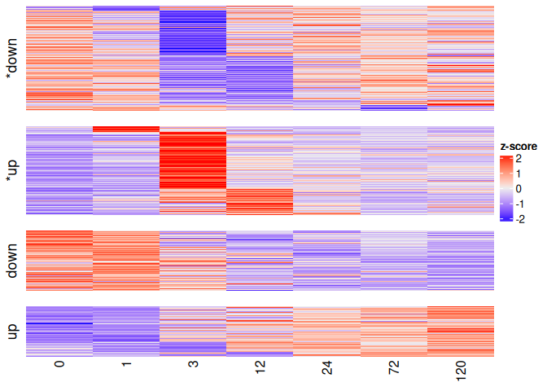<!-- -->

``` r
majerova_genes <- HeatStressGenes_Pacuta %>% filter(ref_first_author =="Majerova")
stress_genes_ids <- unique(majerova_genes$query)
plot_stress_genes <- stress_genes_ids[stress_genes_ids %in% rownames(objectImpulseDE2@matCountDataProc)] 

impulse_results %>% filter(Gene %in% stress_genes_ids) %>% arrange(padj) %>% left_join(HeatStressGenes_Pacuta_unique, by = join_by(Gene==query))
```

    ##                                         Gene            p         padj
    ## 1  Pocillopora_acuta_HIv2___RNAseq.g23086.t1 9.531360e-22 1.000816e-19
    ## 2   Pocillopora_acuta_HIv2___RNAseq.g8390.t1 4.195724e-12 1.232028e-10
    ## 3  Pocillopora_acuta_HIv2___RNAseq.g11741.t1 6.223221e-08 8.627660e-07
    ## 4   Pocillopora_acuta_HIv2___RNAseq.g7990.t1 1.006531e-07 1.329876e-06
    ## 5   Pocillopora_acuta_HIv2___RNAseq.g7011.t1 2.169449e-05 1.661854e-04
    ## 6  Pocillopora_acuta_HIv2___RNAseq.g28750.t1 2.489336e-04 1.419823e-03
    ## 7   Pocillopora_acuta_HIv2___RNAseq.g1543.t1 4.292494e-04 2.285837e-03
    ## 8  Pocillopora_acuta_HIv2___RNAseq.g15654.t1 4.924850e-03 1.867286e-02
    ## 9  Pocillopora_acuta_HIv2___RNAseq.g28257.t1 1.840394e-02 5.613314e-02
    ## 10 Pocillopora_acuta_HIv2___RNAseq.g19827.t1 4.248327e-02 1.118102e-01
    ## 11     Pocillopora_acuta_HIv2___TS.g1420.t1c 2.658636e-01 4.785576e-01
    ## 12     Pocillopora_acuta_HIv2___TS.g11056.t1 7.031684e-01 9.558681e-01
    ## 13     Pocillopora_acuta_HIv2___TS.g22794.t1 9.869052e-01 1.000000e+00
    ##    loglik_full loglik_red df_full df_red        mean converge_combined
    ## 1    -228.6372  -282.7695      17     12    15.53524                 0
    ## 2    -309.3454  -340.4621      17     12  1435.74518                 0
    ## 3    -336.8019  -357.7429      17     12  6358.58800                 0
    ## 4    -357.9047  -378.3292      17     12  2265.91671                 0
    ## 5    -333.9890  -348.5627      17     12  3283.85436                 0
    ## 6    -395.7910  -407.6363      17     12 15600.94668                 0
    ## 7    -314.6311  -325.8577      17     12  1801.22432                 0
    ## 8    -379.7205  -388.1133      17     12 13672.24376                 0
    ## 9    -341.4634  -348.2604      17     12  4014.93615                 0
    ## 10   -268.4807  -274.2258      17     12  1040.97860                 0
    ## 11   -266.9347  -270.1539      17     12   963.26076                 0
    ## 12   -225.7617  -227.2514      17     12   511.20373                 0
    ## 13   -306.6056  -306.9173      17     12  2362.04636                 0
    ##    converge_case converge_control converge_sigmoid impulseTOsigmoid_p
    ## 1              0                0                0       5.219971e-21
    ## 2              0                0                0       3.644976e-32
    ## 3              0                0                0       7.231044e-02
    ## 4              0                0                0       5.838978e-14
    ## 5              0                0                0       2.986487e-16
    ## 6              0                0                0       1.574349e-10
    ## 7              0                0                0       1.148572e-16
    ## 8              0                0                0       8.276784e-15
    ## 9              0                0                0       2.574850e-14
    ## 10             0                0                0       4.541043e-05
    ## 11             0                0                0       1.887574e-04
    ## 12             0                0                0       1.820024e-01
    ## 13             0                0                0       4.227763e-01
    ##    impulseTOsigmoid_padj sigmoidTOconst_p sigmoidTOconst_padj isTransient
    ## 1           2.250870e-19     8.943872e-46        1.909168e-43        TRUE
    ## 2           3.460772e-30     5.915155e-07        4.676499e-06        TRUE
    ## 3           1.504701e-01     2.100597e-21        8.854871e-20       FALSE
    ## 4           1.205360e-12     1.878181e-13        3.635337e-12        TRUE
    ## 5           8.025650e-15     5.868654e-01        9.085670e-01        TRUE
    ## 6           2.072824e-09     2.636104e-14        5.579568e-13        TRUE
    ## 7           3.227797e-15     4.193565e-01        7.144679e-01        TRUE
    ## 8           1.903091e-13     9.981691e-01        1.000000e+00        TRUE
    ## 9           5.515861e-13     5.631308e-04        2.502452e-03        TRUE
    ## 10          2.415630e-04     1.077605e-05        6.810952e-05        TRUE
    ## 11          8.702851e-04     7.704779e-01        1.000000e+00        TRUE
    ## 12          3.148042e-01     5.687765e-03        1.967253e-02       FALSE
    ## 13          5.956988e-01     2.791210e-01        5.250616e-01       FALSE
    ##    isMonotonous allZero     gene_id response_type     category
    ## 1         FALSE   FALSE HSP70,Hsc71         Type1          UPR
    ## 2         FALSE   FALSE       Bcl-2         Type1    Apoptosis
    ## 3          TRUE   FALSE       Foxo3         Type1 ROS response
    ## 4         FALSE   FALSE        HSF1         Type1          UPR
    ## 5         FALSE   FALSE       Bcl-2         Type1    Apoptosis
    ## 6         FALSE   FALSE   Nrf2,Nrf1         Type1 ROS response
    ## 7         FALSE   FALSE         BAX         Type1    Apoptosis
    ## 8         FALSE   FALSE        BI-1         Type1    Apoptosis
    ## 9         FALSE   FALSE       Bcl-2         Type1    Apoptosis
    ## 10        FALSE   FALSE        AMPK         Type1 ROS response
    ## 11        FALSE   FALSE        HO-1         Type1 ROS response
    ## 12        FALSE   FALSE         BAK         Type1    Apoptosis
    ## 13        FALSE   FALSE          GR         Type1 ROS response

``` r
heatgenes <- plotGenes(
  vecGeneIDs       = plot_stress_genes,
  objectImpulseDE2 = objectImpulseDE2,
  boolCaseCtrl     = TRUE,
  dirOut           = "../output_RNA/differential_expression/POC_PacutaV2/ImpulseDE/",
  strFileName = "stress_genes_Majerova.pdf",
  boolMultiplePlotsPerPage = FALSE,
  strNameRefMethod = NULL)
```

    ## [1] "Creating ../output_RNA/differential_expression/POC_PacutaV2/ImpulseDE/stress_genes_Majerova.pdf"

``` r
heatgenes
```

    ## [[1]]

    ## 
    ## [[2]]

    ## 
    ## [[3]]

    ## 
    ## [[4]]

    ## 
    ## [[5]]

    ## 
    ## [[6]]

    ## 
    ## [[7]]

    ## 
    ## [[8]]

    ## 
    ## [[9]]

    ## 
    ## [[10]]

    ## 
    ## [[11]]

    ## 
    ## [[12]]

    ## 
    ## [[13]]

``` r
HSP70 <- plotGenes(
  vecGeneIDs       = "Pocillopora_acuta_HIv2___RNAseq.g23086.t1",
  objectImpulseDE2 = objectImpulseDE2,
  boolCaseCtrl     = TRUE,
  dirOut           = "../output_RNA/differential_expression/POC_PacutaV2/ImpulseDE/",
  strFileName = "HSP70.pdf",
  boolMultiplePlotsPerPage = FALSE,
  strNameRefMethod = NULL)
```

    ## [1] "Creating ../output_RNA/differential_expression/POC_PacutaV2/ImpulseDE/HSP70.pdf"

``` r
HSP70
```

    ## [[1]]

``` r
lsgplotsGenes <- plotGenes(
  vecGeneIDs       = NULL,
  scaNTopIDs       = 10,
  objectImpulseDE2 = objectImpulseDE2,
  boolCaseCtrl     = TRUE,
  dirOut           = "../output_RNA/differential_expression/POC_PacutaV2/ImpulseDE/",
  boolMultiplePlotsPerPage = FALSE,
  strNameRefMethod = NULL)
```

    ## [1] "Creating ../output_RNA/differential_expression/POC_PacutaV2/ImpulseDE/ImpulseDE2_Trajectories.pdf"

``` r
lsgplotsGenes
```

    ## [[1]]

    ## 
    ## [[2]]

    ## 
    ## [[3]]

    ## 
    ## [[4]]

    ## 
    ## [[5]]

    ## 
    ## [[6]]

    ## 
    ## [[7]]

    ## 
    ## [[8]]

    ## 
    ## [[9]]

    ## 
    ## [[10]]

This is so freaking cool!!!! TNFRs and HSP are going crazy :)

``` r
top_500_DE_genes <- impulse_results %>% arrange(padj) %>% head(500) %>% rownames()

#view top 500 most vairable genes
pheatmap(assay(vsd)[top_500_DE_genes, ], cluster_rows=TRUE, show_rownames=FALSE,
         cluster_cols=FALSE, #cutree_cols = 2,
         annotation_col= meta[,c("treatment","time")],
         annotation_colors = list("treatment" = treat_colors,
                                  "time" = time_colors))
```

<!-- -->

``` r
pheatmap(assay(vsd)[top_500_DE_genes, ], cluster_rows=TRUE, show_rownames=FALSE,
         cluster_cols=TRUE, cutree_cols = 2,
         annotation_col= meta[,c("treatment","time")],
         annotation_colors = list("treatment" = treat_colors,
                                  "time" = time_colors))
```

<!-- -->

## MON: pre-processing and visualization

Read in raw count data

``` r
#set standard output directory for figures
outdir <- "../output_RNA/differential_expression/MON_MCapV3"

counts_raw <- read.csv("../output_RNA/count_matrices/MON_MCapV3_gene_count_matrix.csv", row.names = 1) #load in data

samples <- colnames(counts_raw)
```

Read in metadata

``` r
meta <- data.frame(
  sample = samples, 
  species = str_split(samples, "_", simplify = TRUE)[,1], #extract first part of sample name to get species
  time = str_replace(str_split(samples, "_", simplify = TRUE)[,2],"R", ""), #extract "R##" part to get timepoint then remove R
  replicate = str_split(samples, "_", simplify = TRUE)[,3], #extract "R##" part to get timepoint then remove R
  treatment = str_replace(str_split(samples, "_", simplify = TRUE)[,3],"\\d", "")
)

rownames(meta) <- meta$sample

meta$time <- factor(meta$time, levels = as.character(sort(unique(as.numeric(meta$time)))))
meta$treatment <- factor(meta$treatment)

meta <- meta %>% arrange(time, treatment)
write.csv(meta, paste0(outdir,"/RNA_seq_metadata.csv"))
```

Reorder sample columns based on factor order

``` r
counts_raw <- counts_raw[, meta$sample]
```

Remove outliers:

``` r
counts_raw <- counts_raw[, !(colnames(counts_raw) %in% c("MON_R72_H1","MON_R72_H2"))]
meta <- meta[!(rownames(meta) %in% c("MON_R72_H1","MON_R72_H2")),]
```

Data sanity checks!

``` r
stopifnot(all(meta$sample %in% colnames(counts_raw))) #are all of the sample names in the metadata column names in the gene count matrix?
stopifnot(all(meta$sample == colnames(counts_raw))) #are they the same in the same order?
```

pOverA filtering to reduce dataset

``` r
ffun<-filterfun(pOverA(0.07,10))  # Keep genes expressed at 10+ counts in at least 7% of samples - expressed in all 3 samples at one timepoint from one treatment
counts_filt_poa <- genefilter((counts_raw), ffun) #apply filter

filtered_counts <- counts_raw[counts_filt_poa,] #keep only rows that passed filter

paste0("Number of genes after filtering: ", sum(counts_filt_poa))
```

    ## [1] "Number of genes after filtering: 29843"

``` r
write.csv(filtered_counts, file = file.path(outdir, "filtered_counts.csv"))
```

### [DESeq2](https://www.bioconductor.org/packages/release/bioc/vignettes/DESeq2/inst/doc/DESeq2.html)

Create DESeq object and run DESeq2

``` r
dds <- DESeqDataSetFromMatrix(countData = filtered_counts,
                              colData = meta,
                              design= ~ treatment + time + treatment:time)

dds <- DESeq(dds)
```

Check size factors.

``` r
SF.dds <- estimateSizeFactors(dds) #estimate size factors to determine if we can use vst  to transform our data. Size factors should be less than 4 for us to use vst
print(sizeFactors(SF.dds)) #View size factors
```

    ##   MON_R0_C1   MON_R0_C2   MON_R0_C3   MON_R0_H1   MON_R0_H2   MON_R0_H3 
    ##   2.2444761   1.0059560   1.1353697   1.4001510   0.8713788   1.1562386 
    ##   MON_R1_C1   MON_R1_C2   MON_R1_C3   MON_R1_H1   MON_R1_H2   MON_R1_H3 
    ##   1.1018520   1.1522112   1.2956672   0.8004175   0.9581830   0.9722348 
    ##   MON_R3_C1   MON_R3_C2   MON_R3_C3   MON_R3_H1   MON_R3_H2   MON_R3_H3 
    ##   1.1267602   0.9503468   1.0665713   0.7424362   0.5301173   0.7547313 
    ##  MON_R12_C1  MON_R12_C2  MON_R12_C3  MON_R12_H1  MON_R12_H2  MON_R12_H3 
    ##   1.0049563   1.0177941   1.1765023   0.6747464   0.9681069   0.8610991 
    ##  MON_R24_C1  MON_R24_C2  MON_R24_C3  MON_R24_H1  MON_R24_H2  MON_R24_H3 
    ##   1.0541723   1.0758358   1.1971885   1.1701290   0.9429320   0.7418793 
    ##  MON_R72_C1  MON_R72_C2  MON_R72_C3  MON_R72_H3 MON_R120_C1 MON_R120_C2 
    ##   1.0176838   1.0275066   1.4198992   0.9646864   1.2352749   1.0816837 
    ## MON_R120_C3 MON_R120_H1 MON_R120_H2 MON_R120_H3 
    ##   0.4853055   1.0089948   1.5702473   1.0278783

``` r
all(sizeFactors(SF.dds)) < 4
```

    ## [1] TRUE

Transforming count data for visualization

``` r
vsd <- vst(dds, blind=FALSE)

#save the vsd transformation
vsd_mat <- assay(vsd)
write.csv(vsd_mat, file = file.path(outdir, "vsd_expression_matrix.csv"))
```

### Heatmap of the sample-to-sample distances

``` r
sampleDists <- dist(t(assay(vsd)))

sampleDistMatrix <- as.matrix(sampleDists)
colnames(sampleDistMatrix) <- NULL

pheatmap(sampleDistMatrix,
         col=colorRampPalette( rev(brewer.pal(9, "Blues")) )(255))
```

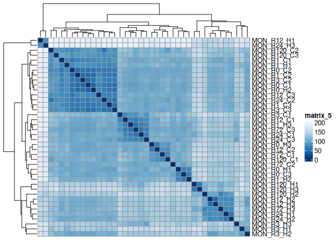<!-- -->

### Principal component plot of the samples

``` r
pcaData <- plotPCA(vsd, intgroup=c("time", "treatment"), returnData=TRUE)

percentVar <- round(100 * attr(pcaData, "percentVar"))
PCA <- ggplot() +
  geom_point(data = subset(pcaData, treatment == "C"),
             aes(x=PC1, y=PC2, color=time),
                 size=2) +
             scale_color_manual(values=brewer.pal(7, "Blues"), name = "Time (hrs) - Control") +
  
  #start new scale
  ggnewscale::new_scale_color() +
  geom_point(data = subset(pcaData, treatment == "H"),
             aes(x=PC1, y=PC2, color=time),
                 size=2) +
             scale_color_manual(values=brewer.pal(7, "Oranges"), name = "Time (hrs) - Heat") +

  xlab(paste0("PC1: ",percentVar[1],"% variance")) +
  ylab(paste0("PC2: ",percentVar[2],"% variance")) + 
  coord_fixed() + theme_bw()
PCA
```

<!-- -->

``` r
save_ggplot(PCA, "PCA_MON")
```

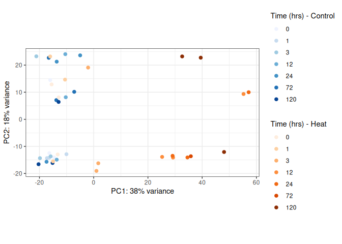<!-- -->

### Heatmap of count matrix

``` r
topVarGenes <- head(order(rowVars(assay(vsd)), decreasing=TRUE), 500)

time_colors <- colorRampPalette(c("#ffffcc","#0c2c84"))(7)
names(time_colors) <- levels(meta$time)

#view top 500 most vairable genes
pheatmap(assay(vsd)[topVarGenes, ], cluster_rows=TRUE, show_rownames=FALSE,
         cluster_cols=FALSE, 
         annotation_col= meta[,c("treatment","time")],
         annotation_colors = list("treatment" = treat_colors,
                                  "time" = time_colors))
```

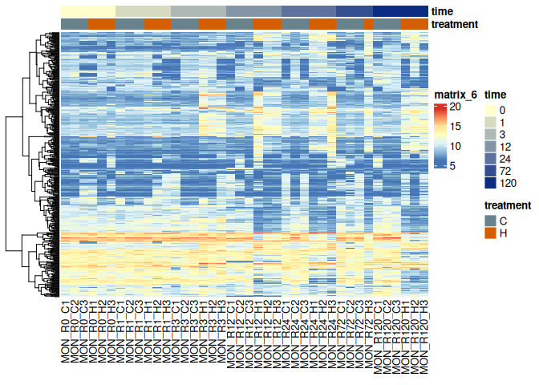<!-- -->

``` r
pheatmap(assay(vsd)[topVarGenes, ], cluster_rows=TRUE, show_rownames=FALSE,
         cluster_cols=TRUE, cutree_cols = 2,
         annotation_col= meta[,c("treatment","time")],
         annotation_colors = list("treatment" = treat_colors,
                                  "time" = time_colors))
```

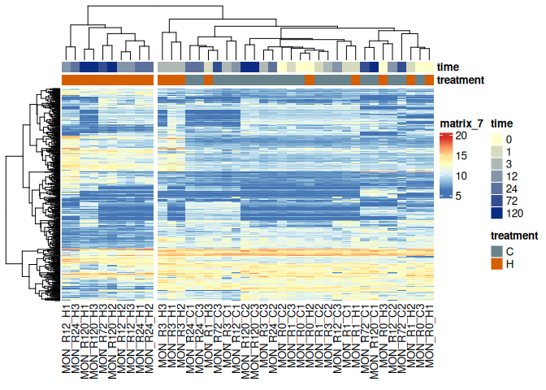<!-- -->

### Heat stress genes

``` r
HeatStressGenes_Mcap <- read_csv("/project/pi_hputnam_uri_edu/zdellaert/snRNA_analysis/multi-sp-snRNA/reference_genes/genes_of_interest/HeatStressGenes_Mcap.csv") %>% dplyr::select(-1) %>% dplyr::rename(query = Mcap_gene) %>% dplyr::select(query,everything()) #%>% filter(ref_first_author =="Majerova")

HeatStressGenes_Mcap_unique <- HeatStressGenes_Mcap %>% group_by(query) %>%
  summarize(gene_id = paste(unique(gene_id), collapse = ","),
            response_type = paste(unique(response_type), collapse = ","),
            category = paste(unique(category), collapse = ",")
            ) 

HeatStressGenes_Mcap_unique <- HeatStressGenes_Mcap_unique %>% filter(query %in% rownames(vsd_mat))
 
stress_genes_ids <- unique(HeatStressGenes_Mcap_unique$query) 
stress_genes_vsd <- vsd_mat[stress_genes_ids, ]

plot_df <- as.data.frame(t(stress_genes_vsd)) %>%
  rownames_to_column(var="sample") %>%
  left_join(meta, by=c("sample"="sample")) %>%
  pivot_longer(cols = all_of(stress_genes_ids), names_to="query", values_to="expression") %>%
  left_join(HeatStressGenes_Mcap_unique)

plot_df %>% ggplot(aes(x=time, y=expression, color=gene_id, group=gene_id)) +
  stat_summary(fun="mean", geom="line") +
  stat_summary(fun.data=mean_se, geom="errorbar", width=0.2) +
  facet_wrap(treatment~response_type) +
  theme_bw() +
  labs(y="VST expression", x="Timepoint")
```

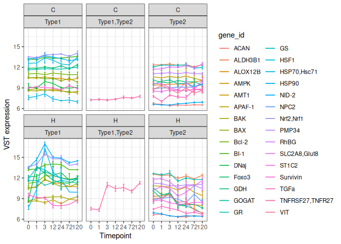<!-- -->

``` r
plot_df %>% ggplot(aes(x=time, y=expression, color=treatment, group=treatment)) +
  stat_summary(fun="mean", geom="line") +
  stat_summary(fun.data=mean_se, geom="errorbar", width=0.2) +
  scale_color_manual(values = treat_colors) +
  facet_wrap(gene_id~response_type) +
  theme_bw() +
  labs(y="VST expression", x="Timepoint")
```

<!-- -->

``` r
plot_df %>% filter(grepl("HSP70",gene_id)|grepl("Nrf2",gene_id)|grepl("HSF1",gene_id)) %>% ggplot(aes(x=time, y=expression, color=treatment, group=treatment)) +
  stat_summary(fun="mean", geom="line") +
  scale_color_manual(values = treat_colors) +
  stat_summary(fun.data=mean_se, geom="errorbar", width=0.2) +
  facet_wrap(~gene_id) +
  theme_bw() +
  labs(y="VST expression", x="Timepoint")
```

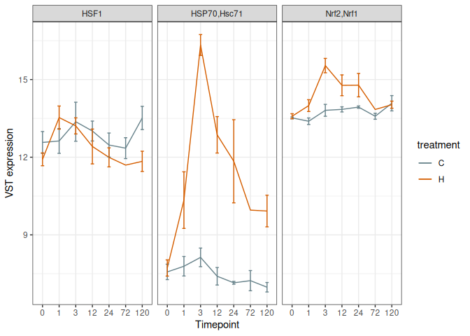<!-- -->

### DESeq LRT Test

``` r
dds <- DESeqDataSetFromMatrix(countData = filtered_counts,
                              colData = meta,
                              design= ~ treatment + time + treatment:time)

dds <- DESeq(dds, test = "LRT", reduced = ~ treatment + time)

res <- results(dds)
sig_genes <- subset(res, padj < 0.05)
lrt_res <- as.data.frame(res)

DE_05 <- lrt_res[rownames(lrt_res %>% filter(padj<0.05)),]

time_colors <- colorRampPalette(c("#ffffcc","#0c2c84"))(7)
names(time_colors) <- levels(meta$time)

top_500_DE_genes <- DE_05 %>% arrange(padj) %>% head(500) %>% rownames()

#view top 500 most vairable genes
pheatmap(assay(vsd)[top_500_DE_genes, ], cluster_rows=TRUE, show_rownames=FALSE,
         cluster_cols=FALSE, 
         annotation_col= meta[,c("treatment","time")],
         annotation_colors = list("treatment" = treat_colors,
                                  "time" = time_colors))
```

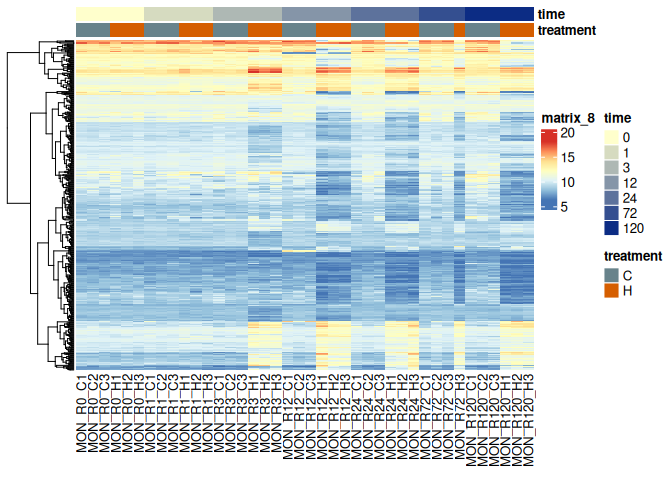<!-- -->

``` r
pheatmap(assay(vsd)[top_500_DE_genes, ], cluster_rows=TRUE, show_rownames=FALSE,
         cluster_cols=TRUE, cutree_cols = 2,
         annotation_col= meta[,c("treatment","time")],
         annotation_colors = list("treatment" = treat_colors,
                                  "time" = time_colors))
```

<!-- -->

``` r
top_500_DE_genes <- DE_05 %>% arrange(log2FoldChange) %>% head(500) %>% rownames()

#view top 500 most vairable genes
pheatmap(assay(vsd)[top_500_DE_genes, ], cluster_rows=TRUE, show_rownames=FALSE,
         cluster_cols=FALSE,
         annotation_col= meta[,c("treatment","time")],
         annotation_colors = list("treatment" = treat_colors,
                                  "time" = time_colors))
```

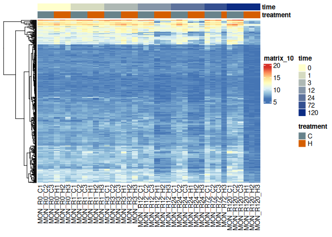<!-- -->

``` r
pheatmap(assay(vsd)[top_500_DE_genes, ], cluster_rows=TRUE, show_rownames=FALSE,
         cluster_cols=TRUE, cutree_cols = 2,
         annotation_col= meta[,c("treatment","time")],
         annotation_colors = list("treatment" = treat_colors,
                                  "time" = time_colors))
```

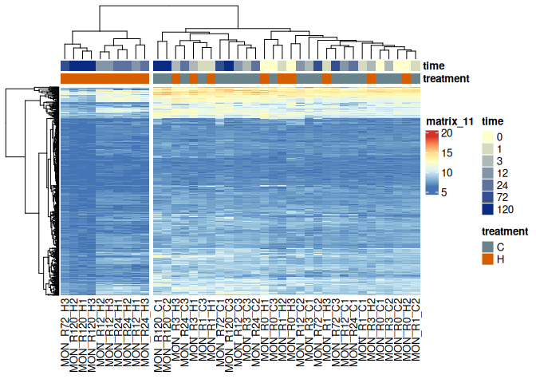<!-- -->

``` r
top_500_DE_genes <- DE_05 %>% arrange(desc(log2FoldChange)) %>% head(500) %>% rownames()

#view top 500 most vairable genes
pheatmap(assay(vsd)[top_500_DE_genes, ], cluster_rows=TRUE, show_rownames=FALSE,
         cluster_cols=FALSE, 
         annotation_col= meta[,c("treatment","time")],
         annotation_colors = list("treatment" = treat_colors,
                                  "time" = time_colors))
```

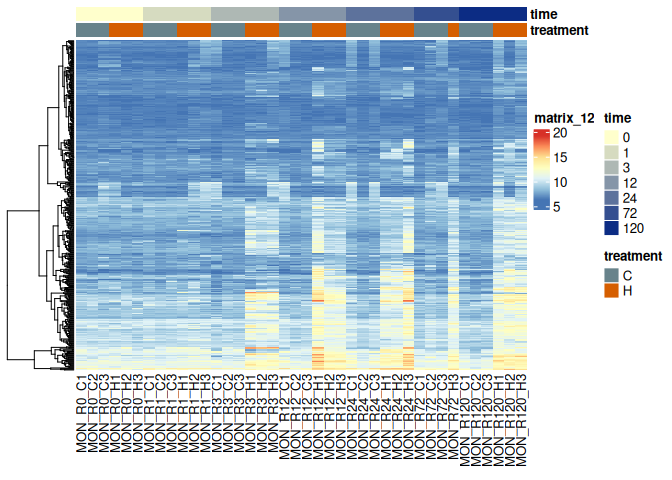<!-- -->

``` r
pheatmap(assay(vsd)[top_500_DE_genes, ], cluster_rows=TRUE, show_rownames=FALSE,
         cluster_cols=TRUE, cutree_cols = 2,
         annotation_col= meta[,c("treatment","time")],
         annotation_colors = list("treatment" = treat_colors,
                                  "time" = time_colors))
```

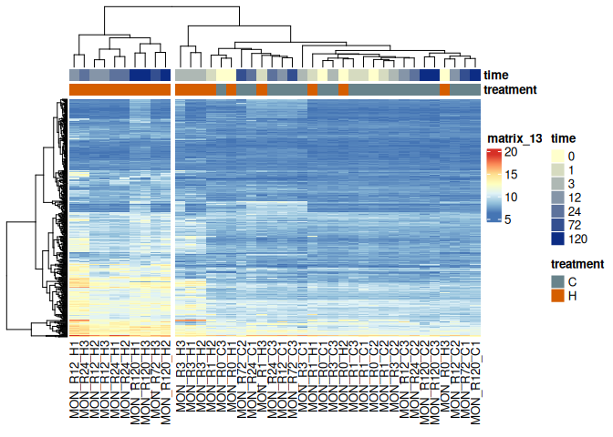<!-- -->

### DE Heat stress genes

``` r
plot_df <- as.data.frame(t(stress_genes_vsd)) %>%
  rownames_to_column(var="sample") %>%
  left_join(meta, by=c("sample"="sample")) %>%
  pivot_longer(cols = all_of(stress_genes_ids), names_to="query", values_to="expression") %>%
  left_join(HeatStressGenes_Mcap_unique) %>% left_join(DE_05 %>% rownames_to_column(var="query")) %>%
  filter(!is.na(padj))

plot_df %>% ggplot(aes(x=time, y=expression, color=gene_id, group=gene_id)) +
  stat_summary(fun="mean", geom="line") +
  stat_summary(fun.data=mean_se, geom="errorbar", width=0.2) +
  facet_wrap(treatment~response_type) +
  theme_bw() +
  labs(y="VST expression", x="Timepoint")
```

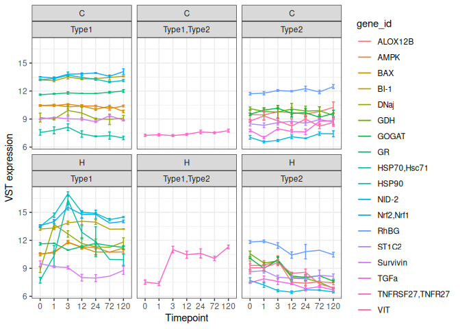<!-- -->

``` r
plot_df %>% ggplot(aes(x=time, y=expression, color=treatment, group=treatment)) +
  stat_summary(fun="mean", geom="line") +
  stat_summary(fun.data=mean_se, geom="errorbar", width=0.2) +
  scale_color_manual(values = treat_colors) +
  facet_wrap(gene_id~response_type) +
  theme_bw() +
  labs(y="VST expression", x="Timepoint")
```

<!-- -->

``` r
plot_df %>% filter(grepl("HSP70",gene_id)|grepl("Nrf2",gene_id)|grepl("HSF1",gene_id)) %>% ggplot(aes(x=time, y=expression, color=treatment, group=treatment)) +
  stat_summary(fun="mean", geom="line") +
  scale_color_manual(values = treat_colors) +
  stat_summary(fun.data=mean_se, geom="errorbar", width=0.2) +
  facet_wrap(~gene_id) +
  theme_bw() +
  labs(y="VST expression", x="Timepoint")
```

<!-- -->

### ImpulseDE2

Based on [this
paper](https://academic.oup.com/bib/article/20/1/288/4364840#130283262),
this is the best package to use other than comparing each time point
against each other individually. I am also planning to ID gene modules
via WGCNA.

Repo here: <https://github.com/YosefLab/ImpulseDE2>

Tutorial here:
<http://bioconductor.statistik.tu-dortmund.de/packages/3.11/bioc/vignettes/ImpulseDE2/inst/doc/ImpulseDE2_Tutorial.html>
, I followed closely with the section “Case-control differential
expression analysis”

Read the ImpulseDE2 paper
[here](https://academic.oup.com/nar/article/46/20/e119/5068248)

David S Fischer, Fabian J Theis, Nir Yosef, Impulse model-based
differential expression analysis of time course sequencing data, Nucleic
Acids Research, Volume 46, Issue 20, 16 November 2018, Page e119,
<https://doi.org/10.1093/nar/gky675>

``` r
#library(devtools)
#install_github("YosefLab/ImpulseDE2")

library(ImpulseDE2)
```

First, reformat our metadata table to match the column names used in the
ImpulseDE2 vignette.

``` r
meta_impulse <- meta %>%
  dplyr::rename(Sample = sample, Time = time, Batch = replicate) %>% 
  mutate(Time = as.numeric(as.character(Time)),
         #Time = as.numeric(Time),
         Condition = str_replace(treatment, "C", "control"),
         Condition = str_replace(Condition, "H", "case")
         ) %>%
  select(-c(species,treatment))
```

Then, generate the ImpulseDE2 object

``` r
#test with just 500 genes that I determined to be DE by treatment/timepoint with DESeq2 
objectImpulseDE2 <- runImpulseDE2(
  matCountData    = as.matrix(filtered_counts)[top_500_DE_genes,], #or use filtered_counts 
  dfAnnotation    = meta_impulse,
  boolCaseCtrl    = TRUE,
  vecConfounders  = c("Batch"), #only use if you want to try to control for batch effects
  boolIdentifyTransients = TRUE, #use if you want to ID transiently- vs permanently-regulated genes
  scaNProc        = 8 )

#run with all genes
objectImpulseDE2 <- runImpulseDE2(
  matCountData    = as.matrix(counts_raw), #or use filtered_counts 
  dfAnnotation    = meta_impulse,
  boolCaseCtrl    = TRUE,
  vecConfounders  = c("Batch"), #only use if you want to try to control for batch effects
  boolIdentifyTransients = TRUE, #use if you want to ID transiently- vs permanently-regulated genes
  scaNProc        = 18 )

saveRDS(objectImpulseDE2, file = paste0(outdir, "/objectImpulseDE2.rds"))
```

``` r
objectImpulseDE2 <- readRDS(paste0(outdir, "/objectImpulseDE2.rds"))

impulse_results <- objectImpulseDE2$dfImpulseDE2Results
head(impulse_results)
```

    ##                                                                                Gene
    ## Montipora_capitata_HIv3___RNAseq.g4581.t1 Montipora_capitata_HIv3___RNAseq.g4581.t1
    ## Montipora_capitata_HIv3___RNAseq.g4750.t1 Montipora_capitata_HIv3___RNAseq.g4750.t1
    ## Montipora_capitata_HIv3___RNAseq.g4751.t1 Montipora_capitata_HIv3___RNAseq.g4751.t1
    ## Montipora_capitata_HIv3___RNAseq.g4752.t1 Montipora_capitata_HIv3___RNAseq.g4752.t1
    ## Montipora_capitata_HIv3___RNAseq.g4753.t1 Montipora_capitata_HIv3___RNAseq.g4753.t1
    ## Montipora_capitata_HIv3___RNAseq.g4763.t1                                      <NA>
    ##                                                      p        padj loglik_full
    ## Montipora_capitata_HIv3___RNAseq.g4581.t1 0.2257152482 0.682410072  -222.50399
    ## Montipora_capitata_HIv3___RNAseq.g4750.t1 0.5083786054 1.000000000   -70.18258
    ## Montipora_capitata_HIv3___RNAseq.g4751.t1 0.1989148505 0.629285767  -208.41331
    ## Montipora_capitata_HIv3___RNAseq.g4752.t1 0.0041882368 0.037202928  -212.75809
    ## Montipora_capitata_HIv3___RNAseq.g4753.t1 0.0001015878 0.001841498  -276.08620
    ## Montipora_capitata_HIv3___RNAseq.g4763.t1           NA          NA          NA
    ##                                           loglik_red df_full df_red        mean
    ## Montipora_capitata_HIv3___RNAseq.g4581.t1 -225.97020      17     12  446.886622
    ## Montipora_capitata_HIv3___RNAseq.g4750.t1  -72.32789      17     12    4.211895
    ## Montipora_capitata_HIv3___RNAseq.g4751.t1 -212.06590      17     12  201.376414
    ## Montipora_capitata_HIv3___RNAseq.g4752.t1 -221.34314      17     12  194.037947
    ## Montipora_capitata_HIv3___RNAseq.g4753.t1 -288.94095      17     12 2243.017572
    ## Montipora_capitata_HIv3___RNAseq.g4763.t1         NA      NA     NA          NA
    ##                                           converge_combined converge_case
    ## Montipora_capitata_HIv3___RNAseq.g4581.t1                 0             0
    ## Montipora_capitata_HIv3___RNAseq.g4750.t1                 0             0
    ## Montipora_capitata_HIv3___RNAseq.g4751.t1                 0             0
    ## Montipora_capitata_HIv3___RNAseq.g4752.t1                 0             0
    ## Montipora_capitata_HIv3___RNAseq.g4753.t1                 0             0
    ## Montipora_capitata_HIv3___RNAseq.g4763.t1                NA            NA
    ##                                           converge_control converge_sigmoid
    ## Montipora_capitata_HIv3___RNAseq.g4581.t1                0                0
    ## Montipora_capitata_HIv3___RNAseq.g4750.t1                0                0
    ## Montipora_capitata_HIv3___RNAseq.g4751.t1                0                0
    ## Montipora_capitata_HIv3___RNAseq.g4752.t1                0                0
    ## Montipora_capitata_HIv3___RNAseq.g4753.t1                0                0
    ## Montipora_capitata_HIv3___RNAseq.g4763.t1               NA               NA
    ##                                           impulseTOsigmoid_p
    ## Montipora_capitata_HIv3___RNAseq.g4581.t1       1.082908e-03
    ## Montipora_capitata_HIv3___RNAseq.g4750.t1       2.919618e-01
    ## Montipora_capitata_HIv3___RNAseq.g4751.t1       2.081050e-01
    ## Montipora_capitata_HIv3___RNAseq.g4752.t1       5.661366e-07
    ## Montipora_capitata_HIv3___RNAseq.g4753.t1       3.976130e-09
    ## Montipora_capitata_HIv3___RNAseq.g4763.t1                 NA
    ##                                           impulseTOsigmoid_padj
    ## Montipora_capitata_HIv3___RNAseq.g4581.t1          1.206826e-02
    ## Montipora_capitata_HIv3___RNAseq.g4750.t1          6.814848e-01
    ## Montipora_capitata_HIv3___RNAseq.g4751.t1          5.582285e-01
    ## Montipora_capitata_HIv3___RNAseq.g4752.t1          2.326930e-05
    ## Montipora_capitata_HIv3___RNAseq.g4753.t1          3.179893e-07
    ## Montipora_capitata_HIv3___RNAseq.g4763.t1                    NA
    ##                                           sigmoidTOconst_p sigmoidTOconst_padj
    ## Montipora_capitata_HIv3___RNAseq.g4581.t1      0.008282858          0.06414355
    ## Montipora_capitata_HIv3___RNAseq.g4750.t1      0.919696108          1.00000000
    ## Montipora_capitata_HIv3___RNAseq.g4751.t1      0.011525881          0.08472483
    ## Montipora_capitata_HIv3___RNAseq.g4752.t1      0.028906859          0.17906920
    ## Montipora_capitata_HIv3___RNAseq.g4753.t1      0.002396725          0.02246338
    ## Montipora_capitata_HIv3___RNAseq.g4763.t1               NA                  NA
    ##                                           isTransient isMonotonous allZero
    ## Montipora_capitata_HIv3___RNAseq.g4581.t1       FALSE        FALSE   FALSE
    ## Montipora_capitata_HIv3___RNAseq.g4750.t1       FALSE        FALSE   FALSE
    ## Montipora_capitata_HIv3___RNAseq.g4751.t1       FALSE        FALSE   FALSE
    ## Montipora_capitata_HIv3___RNAseq.g4752.t1        TRUE        FALSE   FALSE
    ## Montipora_capitata_HIv3___RNAseq.g4753.t1        TRUE        FALSE   FALSE
    ## Montipora_capitata_HIv3___RNAseq.g4763.t1          NA           NA    TRUE

``` r
write.table(impulse_results,file.path(outdir, "ImpulseDE2_Results.txt"),row.names=F,quote=F,sep="\t")

# Genes with significant treatment effect on temporal trajectory
sig_genes <- impulse_results[impulse_results$padj < 0.05 & 
                               impulse_results$loglik_full > impulse_results$loglik_red, ]

nrow(sig_genes)
```

    ## [1] 12972

``` r
head(sig_genes[order(sig_genes$padj), ])
```

    ##                                                                                  Gene
    ## Montipora_capitata_HIv3___RNAseq.g49833.t1 Montipora_capitata_HIv3___RNAseq.g49833.t1
    ## Montipora_capitata_HIv3___RNAseq.g49832.t1 Montipora_capitata_HIv3___RNAseq.g49832.t1
    ## Montipora_capitata_HIv3___RNAseq.g7282.t1   Montipora_capitata_HIv3___RNAseq.g7282.t1
    ## Montipora_capitata_HIv3___RNAseq.g40931.t1 Montipora_capitata_HIv3___RNAseq.g40931.t1
    ## Montipora_capitata_HIv3___TS.g637.t1             Montipora_capitata_HIv3___TS.g637.t1
    ## Montipora_capitata_HIv3___RNAseq.g984.t1     Montipora_capitata_HIv3___RNAseq.g984.t1
    ##                                                        p          padj
    ## Montipora_capitata_HIv3___RNAseq.g49833.t1 2.101772e-169 9.917210e-165
    ## Montipora_capitata_HIv3___RNAseq.g49832.t1  5.582186e-76  1.316977e-71
    ## Montipora_capitata_HIv3___RNAseq.g7282.t1   1.307219e-41  2.056038e-37
    ## Montipora_capitata_HIv3___RNAseq.g40931.t1  2.016644e-39  2.378883e-35
    ## Montipora_capitata_HIv3___TS.g637.t1        8.498198e-38  8.019749e-34
    ## Montipora_capitata_HIv3___RNAseq.g984.t1    1.206638e-36  9.489199e-33
    ##                                            loglik_full loglik_red df_full
    ## Montipora_capitata_HIv3___RNAseq.g49833.t1   -317.6468  -714.7362      17
    ## Montipora_capitata_HIv3___RNAseq.g49832.t1   -348.5602  -529.3567      17
    ## Montipora_capitata_HIv3___RNAseq.g7282.t1    -301.9292  -402.7170      17
    ## Montipora_capitata_HIv3___RNAseq.g40931.t1   -228.3290  -324.0007      17
    ## Montipora_capitata_HIv3___TS.g637.t1         -302.0436  -393.9141      17
    ## Montipora_capitata_HIv3___RNAseq.g984.t1     -255.9804  -345.1536      17
    ##                                            df_red      mean converge_combined
    ## Montipora_capitata_HIv3___RNAseq.g49833.t1     12 5747.1890                 0
    ## Montipora_capitata_HIv3___RNAseq.g49832.t1     12 8957.2926                 0
    ## Montipora_capitata_HIv3___RNAseq.g7282.t1      12 4881.9575                 0
    ## Montipora_capitata_HIv3___RNAseq.g40931.t1     12  784.3567                 0
    ## Montipora_capitata_HIv3___TS.g637.t1           12 2190.6237                 0
    ## Montipora_capitata_HIv3___RNAseq.g984.t1       12 1041.4904                 0
    ##                                            converge_case converge_control
    ## Montipora_capitata_HIv3___RNAseq.g49833.t1             0                0
    ## Montipora_capitata_HIv3___RNAseq.g49832.t1             0                0
    ## Montipora_capitata_HIv3___RNAseq.g7282.t1              0                0
    ## Montipora_capitata_HIv3___RNAseq.g40931.t1             0                0
    ## Montipora_capitata_HIv3___TS.g637.t1                   0                0
    ## Montipora_capitata_HIv3___RNAseq.g984.t1               0                0
    ##                                            converge_sigmoid impulseTOsigmoid_p
    ## Montipora_capitata_HIv3___RNAseq.g49833.t1                0      6.809465e-107
    ## Montipora_capitata_HIv3___RNAseq.g49832.t1                0       1.258637e-55
    ## Montipora_capitata_HIv3___RNAseq.g7282.t1                 0       7.174913e-36
    ## Montipora_capitata_HIv3___RNAseq.g40931.t1                0       6.165902e-01
    ## Montipora_capitata_HIv3___TS.g637.t1                      0       8.958718e-06
    ## Montipora_capitata_HIv3___RNAseq.g984.t1                  0       2.921581e-02
    ##                                            impulseTOsigmoid_padj
    ## Montipora_capitata_HIv3___RNAseq.g49833.t1         3.213046e-102
    ## Montipora_capitata_HIv3___RNAseq.g49832.t1          2.969440e-51
    ## Montipora_capitata_HIv3___RNAseq.g7282.t1           2.821236e-32
    ## Montipora_capitata_HIv3___RNAseq.g40931.t1          9.956842e-01
    ## Montipora_capitata_HIv3___TS.g637.t1                2.371817e-04
    ## Montipora_capitata_HIv3___RNAseq.g984.t1            1.503816e-01
    ##                                            sigmoidTOconst_p sigmoidTOconst_padj
    ## Montipora_capitata_HIv3___RNAseq.g49833.t1    3.067710e-148       1.447499e-143
    ## Montipora_capitata_HIv3___RNAseq.g49832.t1     3.638694e-77        8.584588e-73
    ## Montipora_capitata_HIv3___RNAseq.g7282.t1      6.036153e-46        2.589235e-42
    ## Montipora_capitata_HIv3___RNAseq.g40931.t1     9.060929e-69        1.425133e-64
    ## Montipora_capitata_HIv3___TS.g637.t1           2.623811e-60        2.476090e-56
    ## Montipora_capitata_HIv3___RNAseq.g984.t1       2.921379e-61        3.446131e-57
    ##                                            isTransient isMonotonous allZero
    ## Montipora_capitata_HIv3___RNAseq.g49833.t1        TRUE        FALSE   FALSE
    ## Montipora_capitata_HIv3___RNAseq.g49832.t1        TRUE        FALSE   FALSE
    ## Montipora_capitata_HIv3___RNAseq.g7282.t1         TRUE        FALSE   FALSE
    ## Montipora_capitata_HIv3___RNAseq.g40931.t1       FALSE         TRUE   FALSE
    ## Montipora_capitata_HIv3___TS.g637.t1              TRUE        FALSE   FALSE
    ## Montipora_capitata_HIv3___RNAseq.g984.t1         FALSE         TRUE   FALSE

``` r
library(ComplexHeatmap)

lsHeatmaps <- plotHeatmap(
  objectImpulseDE2       = objectImpulseDE2,
  strCondition           = "case",
  boolIdentifyTransients = TRUE, #set to true if true above
  scaQThres              = 0.01)
draw(lsHeatmaps$complexHeatmapRaw) 
```

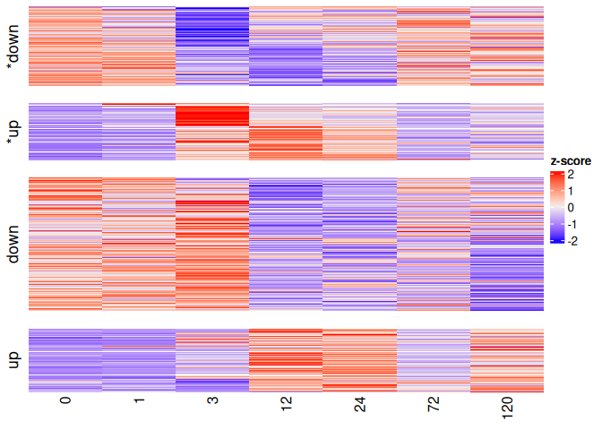<!-- -->

``` r
majerova_genes <- HeatStressGenes_Mcap %>% filter(ref_first_author =="Majerova")
stress_genes_ids <- unique(majerova_genes$query)
plot_stress_genes <- stress_genes_ids[stress_genes_ids %in% rownames(objectImpulseDE2@matCountDataProc)]

impulse_results %>% filter(Gene %in% stress_genes_ids) %>% arrange(padj) %>% left_join(HeatStressGenes_Mcap_unique, by = join_by(Gene==query))
```

    ##                                          Gene            p         padj
    ## 1      Montipora_capitata_HIv3___TS.g35289.t2 2.087429e-05 0.0004999762
    ## 2  Montipora_capitata_HIv3___RNAseq.g37104.t1 1.361281e-04 0.0023545475
    ## 3  Montipora_capitata_HIv3___RNAseq.g27769.t1 3.650833e-04 0.0052858104
    ## 4      Montipora_capitata_HIv3___TS.g26835.t1 1.008155e-03 0.0120438862
    ## 5  Montipora_capitata_HIv3___RNAseq.g45609.t1 1.049596e-02 0.0756804290
    ## 6    Montipora_capitata_HIv3___RNAseq.10384_t 1.464971e-02 0.0983840591
    ## 7  Montipora_capitata_HIv3___RNAseq.g20389.t1 3.042748e-02 0.1707564984
    ## 8      Montipora_capitata_HIv3___TS.g50400.t1 4.784406e-02 0.2381101310
    ## 9  Montipora_capitata_HIv3___RNAseq.g20408.t1 5.154284e-02 0.2510139837
    ## 10 Montipora_capitata_HIv3___RNAseq.g43322.t1 1.838455e-01 0.5974755743
    ## 11 Montipora_capitata_HIv3___RNAseq.g34531.t1 2.303774e-01 0.6915867028
    ## 12 Montipora_capitata_HIv3___RNAseq.g47592.t2 3.369727e-01 0.8748923381
    ##    loglik_full loglik_red df_full df_red        mean converge_combined
    ## 1    -282.3475  -296.9638      17     12    57.53749                 0
    ## 2    -291.5624  -304.0886      17     12  3430.54072                 0
    ## 3    -275.5180  -286.9290      17     12  1187.65669                 0
    ## 4    -282.8865  -293.1347      17     12  1133.49455                 0
    ## 5    -359.1013  -366.5857      17     12 11175.65580                 0
    ## 6    -393.2145  -400.2924      17     12 14048.65941                 0
    ## 7    -323.3563  -329.5257      17     12  1764.37002                 0
    ## 8    -350.9887  -356.5809      17     12  4805.12020                 0
    ## 9    -220.3106  -225.8065      17     12   244.87537                 0
    ## 10   -275.0532  -278.8203      17     12   779.13566                 0
    ## 11   -346.0900  -349.5258      17     12  3957.46149                 0
    ## 12   -378.1751  -381.0229      17     12  7612.15876                 0
    ##    converge_case converge_control converge_sigmoid impulseTOsigmoid_p
    ## 1              0                0                0       4.554020e-11
    ## 2              0                0                0       1.175161e-06
    ## 3              0                0                0       1.926888e-12
    ## 4              0                0                0       2.592305e-08
    ## 5              0                0                0       2.776352e-06
    ## 6              0                0                0       6.864059e-09
    ## 7              0                0                0       3.393920e-04
    ## 8              0                0                0       1.371734e-05
    ## 9              0                0                0       8.631802e-01
    ## 10             0                0                0       5.136780e-03
    ## 11             0                0                0       1.859302e-02
    ## 12             0                0                0       8.750091e-02
    ##    impulseTOsigmoid_padj sigmoidTOconst_p sigmoidTOconst_padj isTransient
    ## 1           6.246553e-09     3.905412e-05        0.0005959796        TRUE
    ## 2           4.352430e-05     9.318929e-01        1.0000000000        TRUE
    ## 3           3.496931e-10     5.824029e-01        1.0000000000        TRUE
    ## 4           1.637455e-06     5.926565e-01        1.0000000000        TRUE
    ## 5           8.875487e-05     2.655569e-01        0.9587639458        TRUE
    ## 6           5.132815e-07     1.091418e-01        0.5075751286        TRUE
    ## 7           4.819204e-03     1.285383e-01        0.5734216398       FALSE
    ## 8           3.400843e-04     8.959022e-01        1.0000000000        TRUE
    ## 9           1.000000e+00     5.494296e-03        0.0454981281       FALSE
    ## 10          4.091475e-02     2.475184e-02        0.1574434365       FALSE
    ## 11          1.081099e-01     3.797293e-01        1.0000000000       FALSE
    ## 12          3.211474e-01     8.389922e-02        0.4147597907       FALSE
    ##    isMonotonous allZero     gene_id response_type     category
    ## 1         FALSE   FALSE HSP70,Hsc71         Type1          UPR
    ## 2         FALSE   FALSE          GR         Type1 ROS response
    ## 3         FALSE   FALSE        AMPK         Type1 ROS response
    ## 4         FALSE   FALSE         BAX         Type1    Apoptosis
    ## 5         FALSE   FALSE        BI-1         Type1    Apoptosis
    ## 6         FALSE   FALSE   Nrf2,Nrf1         Type1 ROS response
    ## 7         FALSE   FALSE       Bcl-2         Type1    Apoptosis
    ## 8         FALSE   FALSE       Bcl-2         Type1    Apoptosis
    ## 9         FALSE   FALSE         BAK         Type1    Apoptosis
    ## 10        FALSE   FALSE       Bcl-2         Type1    Apoptosis
    ## 11        FALSE   FALSE       Foxo3         Type1 ROS response
    ## 12        FALSE   FALSE        HSF1         Type1          UPR

``` r
heatgenes <- plotGenes(
  vecGeneIDs       = plot_stress_genes,
  objectImpulseDE2 = objectImpulseDE2,
  boolCaseCtrl     = TRUE,
  dirOut           = "../output_RNA/differential_expression/MON_MCapV3/ImpulseDE/",
  strFileName = "stress_genes_Majerova.pdf",
  boolMultiplePlotsPerPage = FALSE,
  strNameRefMethod = NULL)
```

    ## [1] "Creating ../output_RNA/differential_expression/MON_MCapV3/ImpulseDE/stress_genes_Majerova.pdf"

``` r
heatgenes
```

    ## [[1]]

    ## 
    ## [[2]]

    ## 
    ## [[3]]

    ## 
    ## [[4]]

    ## 
    ## [[5]]

    ## 
    ## [[6]]

    ## 
    ## [[7]]

    ## 
    ## [[8]]

    ## 
    ## [[9]]

    ## 
    ## [[10]]

    ## 
    ## [[11]]

    ## 
    ## [[12]]

``` r
HSP70 <- plotGenes(
  vecGeneIDs       = "Montipora_capitata_HIv3___TS.g35289.t2",
  objectImpulseDE2 = objectImpulseDE2,
  boolCaseCtrl     = TRUE,
  dirOut           = "../output_RNA/differential_expression/MON_MCapV3/ImpulseDE/",
  strFileName = "HSP70.pdf",
  boolMultiplePlotsPerPage = FALSE,
  strNameRefMethod = NULL)
```

    ## [1] "Creating ../output_RNA/differential_expression/MON_MCapV3/ImpulseDE/HSP70.pdf"

``` r
HSP70
```

    ## [[1]]

``` r
lsgplotsGenes <- plotGenes(
  vecGeneIDs       = NULL,
  scaNTopIDs       = 10,
  objectImpulseDE2 = objectImpulseDE2,
  boolCaseCtrl     = TRUE,
  dirOut           = "../output_RNA/differential_expression/MON_MCapV3/ImpulseDE/",
  boolMultiplePlotsPerPage = FALSE,
  strNameRefMethod = NULL)
```

    ## [1] "Creating ../output_RNA/differential_expression/MON_MCapV3/ImpulseDE/ImpulseDE2_Trajectories.pdf"

``` r
lsgplotsGenes
```

    ## [[1]]

    ## 
    ## [[2]]

    ## 
    ## [[3]]

    ## 
    ## [[4]]

    ## 
    ## [[5]]

    ## 
    ## [[6]]

    ## 
    ## [[7]]

    ## 
    ## [[8]]

    ## 
    ## [[9]]

    ## 
    ## [[10]]

``` r
top_500_DE_genes <- impulse_results %>% arrange(padj) %>% head(500) %>% rownames()

#view top 500 most vairable genes
pheatmap(vsd_mat[top_500_DE_genes, ], cluster_rows=TRUE, show_rownames=FALSE,
         cluster_cols=FALSE, #cutree_cols = 2,
         annotation_col= meta[,c("treatment","time")],
         annotation_colors = list("treatment" = treat_colors,
                                  "time" = time_colors))
```

<!-- -->

``` r
pheatmap(vsd_mat[top_500_DE_genes, ], cluster_rows=TRUE, show_rownames=FALSE,
         cluster_cols=TRUE, cutree_cols = 2,
         annotation_col= meta[,c("treatment","time")],
         annotation_colors = list("treatment" = treat_colors,
                                  "time" = time_colors))
```

<!-- -->

## POR: pre-processing and visualization

Read in raw count data

``` r
#set standard output directory for figures
outdir <- "../output_RNA/differential_expression/POR_Pcomp"

counts_raw <- read.csv("../output_RNA/count_matrices/POR_Pcomp_gene_count_matrix.csv", row.names = 1) #load in data

samples <- colnames(counts_raw)
```

Read in metadata

``` r
meta <- data.frame(
  sample = samples, 
  species = str_split(samples, "_", simplify = TRUE)[,1], #extract first part of sample name to get species
  time = str_replace(str_split(samples, "_", simplify = TRUE)[,2],"R", ""), #extract "R##" part to get timepoint then remove R
  replicate = str_split(samples, "_", simplify = TRUE)[,3], #extract "R##" part to get timepoint then remove R
  treatment = str_replace(str_split(samples, "_", simplify = TRUE)[,3],"\\d", "")
)

rownames(meta) <- meta$sample

meta$time <- factor(meta$time, levels = as.character(sort(unique(as.numeric(meta$time)))))
meta$treatment <- factor(meta$treatment)

meta <- meta %>% arrange(time, treatment)
```

Reorder sample columns based on factor order

``` r
counts_raw <- counts_raw[, meta$sample]
```

Data sanity checks!

``` r
stopifnot(all(meta$sample %in% colnames(counts_raw))) #are all of the sample names in the metadata column names in the gene count matrix?
stopifnot(all(meta$sample == colnames(counts_raw))) #are they the same in the same order?
```

pOverA filtering to reduce dataset

``` r
ffun<-filterfun(pOverA(0.07,10))  # Keep genes expressed at 10+ counts in at least 7% of samples - expressed in all 3 samples at one timepoint from one treatment
counts_filt_poa <- genefilter((counts_raw), ffun) #apply filter

filtered_counts <- counts_raw[counts_filt_poa,] #keep only rows that passed filter

paste0("Number of genes after filtering: ", sum(counts_filt_poa))
```

    ## [1] "Number of genes after filtering: 27116"

``` r
write.csv(filtered_counts, file = file.path(outdir, "filtered_counts.csv"))
```

### [DESeq2](https://www.bioconductor.org/packages/release/bioc/vignettes/DESeq2/inst/doc/DESeq2.html)

Create DESeq object and run DESeq2

``` r
dds <- DESeqDataSetFromMatrix(countData = filtered_counts,
                              colData = meta,
                              design= ~ treatment + time + treatment:time)

dds <- DESeq(dds)
```

Check size factors.

``` r
SF.dds <- estimateSizeFactors(dds) #estimate size factors to determine if we can use vst  to transform our data. Size factors should be less than 4 for us to use vst
print(sizeFactors(SF.dds)) #View size factors
```

    ##   POR_R0_C1   POR_R0_C2   POR_R0_C3   POR_R0_H1   POR_R0_H2   POR_R0_H3 
    ##   1.2252631   0.9659378   1.7729540   0.7498610   0.9167721   1.2671513 
    ##   POR_R1_C1   POR_R1_C2   POR_R1_C3   POR_R1_H1   POR_R1_H2   POR_R1_H3 
    ##   0.4592916   1.2997922   1.0930788   0.5123211   0.4449590   1.3915887 
    ##   POR_R3_C1   POR_R3_C2   POR_R3_C3   POR_R3_H1   POR_R3_H2   POR_R3_H3 
    ##   1.6538415   0.5495657   0.7348005   1.2777840   2.2847763   1.1982420 
    ##  POR_R12_C1  POR_R12_C2  POR_R12_C3  POR_R12_H1  POR_R12_H2  POR_R12_H3 
    ##   0.4413986   2.1794103   0.6348244   2.5677433   2.9661446   1.9199485 
    ##  POR_R24_C1  POR_R24_C2  POR_R24_C3  POR_R24_H1  POR_R24_H2  POR_R24_H3 
    ##   2.3367591   0.8640240   0.3345967   0.3077996   2.0780240   2.5999454 
    ##  POR_R72_C1  POR_R72_C2  POR_R72_C3  POR_R72_H1  POR_R72_H2  POR_R72_H3 
    ##   0.8608913   1.5542805   0.8215578   0.2113815   0.2992481   2.0753389 
    ## POR_R120_C1 POR_R120_C2 POR_R120_C3 POR_R120_H1 POR_R120_H2 POR_R120_H3 
    ##   0.3579785   2.0125909   0.4016439   1.7376927   3.7500382   0.8065197

``` r
all(sizeFactors(SF.dds)) < 4
```

    ## [1] TRUE

Transforming count data for visualization

``` r
vsd <- vst(dds, blind=FALSE)

#save the vsd transformation
vsd_mat <- assay(vsd)
write.csv(vsd_mat, file = file.path(outdir, "vsd_expression_matrix.csv"))
```

### Heatmap of the sample-to-sample distances

``` r
sampleDists <- dist(t(assay(vsd)))

sampleDistMatrix <- as.matrix(sampleDists)
colnames(sampleDistMatrix) <- NULL

pheatmap(sampleDistMatrix,
         col=colorRampPalette( rev(brewer.pal(9, "Blues")) )(255))
```

<!-- -->

### Principal component plot of the samples

``` r
pcaData <- plotPCA(vsd, intgroup=c("time", "treatment"), returnData=TRUE)

percentVar <- round(100 * attr(pcaData, "percentVar"))
PCA <- ggplot() +
  geom_point(data = subset(pcaData, treatment == "C"),
             aes(x=PC1, y=PC2, color=time),
                 size=2) +
             scale_color_manual(values=brewer.pal(7, "Blues"), name = "Time (hrs) - Control") +
  
  #start new scale
  ggnewscale::new_scale_color() +
  geom_point(data = subset(pcaData, treatment == "H"),
             aes(x=PC1, y=PC2, color=time),
                 size=2) +
             scale_color_manual(values=brewer.pal(7, "Oranges"), name = "Time (hrs) - Heat") +

  xlab(paste0("PC1: ",percentVar[1],"% variance")) +
  ylab(paste0("PC2: ",percentVar[2],"% variance")) + 
  coord_fixed() + theme_bw()
PCA
```

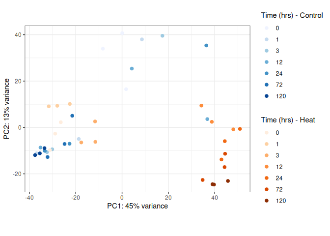<!-- -->

``` r
save_ggplot(PCA, "PCA_POR")
```

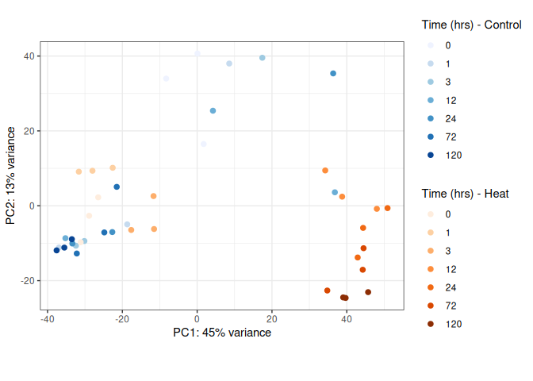<!-- -->

### Heatmap of count matrix

``` r
topVarGenes <- head(order(rowVars(assay(vsd)), decreasing=TRUE), 500)

time_colors <- colorRampPalette(c("#ffffcc","#0c2c84"))(7)
names(time_colors) <- levels(meta$time)

#view top 500 most vairable genes
pheatmap(assay(vsd)[topVarGenes, ], cluster_rows=TRUE, show_rownames=FALSE,
         cluster_cols=FALSE, #cutree_cols = 2,
         annotation_col= meta[,c("treatment","time")],
         annotation_colors = list("treatment" = treat_colors,
                                  "time" = time_colors))
```

<!-- -->

``` r
pheatmap(assay(vsd)[topVarGenes, ], cluster_rows=TRUE, show_rownames=FALSE,
         cluster_cols=TRUE, cutree_cols = 2,
         annotation_col= meta[,c("treatment","time")],
         annotation_colors = list("treatment" = treat_colors,
                                  "time" = time_colors))
```

<!-- -->
