DE
================
Zoe Dellaert
2025-11-20

## Differential expression analysis of Time Series Bulk RNA Data

## Thoughts and Notes

- [This paper](https://academic.oup.com/bib/article/20/1/288/4364840)
  led me to the package ImpulseDE2, which outperforms pairwise
  timepoint-treatment comparisons typical of DESeq2 workflows.
  - Daniel Spies, Peter F Renz, Tobias A Beyer, Constance Ciaudo,
    Comparative analysis of differential gene expression tools for RNA
    sequencing time course data, Briefings in Bioinformatics, Volume 20,
    Issue 1, January 2019, Pages 288–298,
    <https://doi.org/10.1093/bib/bbx115>

## Load packages

``` r
library("genefilter")
library("DESeq2")
library("ggplot2")
library("pheatmap")
library("ggnewscale")
library("RColorBrewer")
library("tidyverse")

sessionInfo() #provides list of loaded packages and version of R.
```

    ## R version 4.5.1 (2025-06-13)
    ## Platform: x86_64-pc-linux-gnu
    ## Running under: Ubuntu 24.04.1 LTS
    ## 
    ## Matrix products: default
    ## BLAS:   /usr/lib/x86_64-linux-gnu/openblas-pthread/libblas.so.3 
    ## LAPACK: /usr/lib/x86_64-linux-gnu/openblas-pthread/libopenblasp-r0.3.26.so;  LAPACK version 3.12.0
    ## 
    ## locale:
    ##  [1] LC_CTYPE=en_US.UTF-8       LC_NUMERIC=C              
    ##  [3] LC_TIME=en_US.UTF-8        LC_COLLATE=en_US.UTF-8    
    ##  [5] LC_MONETARY=en_US.UTF-8    LC_MESSAGES=en_US.UTF-8   
    ##  [7] LC_PAPER=en_US.UTF-8       LC_NAME=C                 
    ##  [9] LC_ADDRESS=C               LC_TELEPHONE=C            
    ## [11] LC_MEASUREMENT=en_US.UTF-8 LC_IDENTIFICATION=C       
    ## 
    ## time zone: Etc/UTC
    ## tzcode source: system (glibc)
    ## 
    ## attached base packages:
    ## [1] stats4    stats     graphics  grDevices utils     datasets  methods  
    ## [8] base     
    ## 
    ## other attached packages:
    ##  [1] lubridate_1.9.4             forcats_1.0.0              
    ##  [3] stringr_1.6.0               dplyr_1.1.4                
    ##  [5] purrr_1.2.0                 readr_2.1.6                
    ##  [7] tidyr_1.3.1                 tibble_3.3.0               
    ##  [9] tidyverse_2.0.0             RColorBrewer_1.1-3         
    ## [11] ggnewscale_0.5.2            pheatmap_1.0.13            
    ## [13] ggplot2_4.0.1               DESeq2_1.50.2              
    ## [15] SummarizedExperiment_1.40.0 Biobase_2.70.0             
    ## [17] MatrixGenerics_1.22.0       matrixStats_1.5.0          
    ## [19] GenomicRanges_1.62.0        Seqinfo_1.0.0              
    ## [21] IRanges_2.44.0              S4Vectors_0.48.0           
    ## [23] BiocGenerics_0.56.0         generics_0.1.4             
    ## [25] genefilter_1.90.0          
    ## 
    ## loaded via a namespace (and not attached):
    ##  [1] tidyselect_1.2.1        farver_2.1.2            blob_1.2.4             
    ##  [4] Biostrings_2.78.0       S7_0.2.1                fastmap_1.2.0          
    ##  [7] XML_3.99-0.18           digest_0.6.39           timechange_0.3.0       
    ## [10] lifecycle_1.0.4         survival_3.8-3          KEGGREST_1.50.0        
    ## [13] RSQLite_2.4.5           magrittr_2.0.4          compiler_4.5.1         
    ## [16] rlang_1.1.6             tools_4.5.1             yaml_2.3.11            
    ## [19] knitr_1.50              S4Arrays_1.10.0         bit_4.6.0              
    ## [22] DelayedArray_0.36.0     abind_1.4-8             BiocParallel_1.44.0    
    ## [25] withr_3.0.2             grid_4.5.1              xtable_1.8-4           
    ## [28] scales_1.4.0            dichromat_2.0-0.1       cli_3.6.5              
    ## [31] rmarkdown_2.30          crayon_1.5.3            rstudioapi_0.17.1      
    ## [34] httr_1.4.7              tzdb_0.5.0              DBI_1.2.3              
    ## [37] cachem_1.1.0            splines_4.5.1           parallel_4.5.1         
    ## [40] AnnotationDbi_1.72.0    XVector_0.50.0          vctrs_0.6.5            
    ## [43] Matrix_1.7-3            jsonlite_2.0.0          hms_1.1.4              
    ## [46] bit64_4.6.0-1           locfit_1.5-9.12         annotate_1.86.1        
    ## [49] glue_1.8.0              codetools_0.2-20        stringi_1.8.7          
    ## [52] gtable_0.3.6            GenomeInfoDb_1.44.3     UCSC.utils_1.4.0       
    ## [55] pillar_1.11.1           htmltools_0.5.9         GenomeInfoDbData_1.2.14
    ## [58] R6_2.6.1                evaluate_1.0.5          lattice_0.22-7         
    ## [61] png_0.1-8               memoise_2.0.1           Rcpp_1.1.0             
    ## [64] SparseArray_1.10.2      xfun_0.54               pkgconfig_2.0.3

``` r
save_ggplot <- function(plot, filename, width = 10, height = 7, units = "in", dpi = 300,bg=NULL) {
  png_path <- file.path(outdir, paste0(filename, ".png"))
  pdf_dir <- file.path(outdir, "pdf_figs")
  pdf_path <- file.path(pdf_dir, paste0(filename, ".pdf"))
  
  # Ensure the pdf_figs directory exists
  if (!dir.exists(pdf_dir)) dir.create(pdf_dir, recursive = TRUE)
  
  # Save plots
  ggsave(filename = png_path, plot = plot, width = width, height = height, units = units, dpi = dpi,bg = bg)
  ggsave(filename = pdf_path, plot = plot, width = width, height = height, units = units, dpi = dpi,bg = bg)
}

treat_colors <- c("C" = "lightblue4", "H" = "#D55E00")

time_colors <- colorRampPalette(c("#ffffcc","#0c2c84"))(7)
names(time_colors) <- c("0", "1", "3", "12", "24", "72", "120")
```

## *Pocillopora acuta*

### Preproccessing

#### 1. Read in raw count data

``` r
# set standard output directory for figures
outdir <- "../output_RNA/differential_expression/POC_PacutaV2"
species <- "Pacuta"

# load in data
counts_raw <- read.csv("../output_RNA/count_matrices/POC_PacutaV2_gene_count_matrix.csv", row.names = 1)

# make list of samples 
samples <- colnames(counts_raw)
```

#### 2. Extract metadata from sample names

``` r
# create metadata dataframe from sample names
meta <- data.frame(
  sample = samples, 
  species = str_split(samples, "_", simplify = TRUE)[,1], #extract first part of sample name to get species
  time = str_replace(str_split(samples, "_", simplify = TRUE)[,2],"R", ""), #extract "R##" part to get timepoint then remove R
  replicate = str_split(samples, "_", simplify = TRUE)[,3], #extract "R##" part to get timepoint then remove R
  treatment = str_replace(str_split(samples, "_", simplify = TRUE)[,3],"\\d", "")
)

# add rownames
rownames(meta) <- meta$sample

# make time and treatment factors
meta$time <- factor(meta$time, levels = as.character(sort(unique(as.numeric(meta$time)))))
meta$treatment <- factor(meta$treatment)

# save metadata
meta <- meta %>% arrange(time, treatment)
write.csv(meta, paste0(outdir,"/RNA_seq_metadata.csv"))
```

#### 3. Confirm that sample names in metadata and count matrix match and are in the same order

``` r
counts_raw <- counts_raw[, meta$sample]

stopifnot(all(meta$sample %in% colnames(counts_raw))) #are all of the sample names in the metadata column names in the gene count matrix?
stopifnot(all(meta$sample == colnames(counts_raw))) #are they the same in the same order?
```

#### 4. pOverA filtering to reduce dataset

##### Note to self: maybe replace this with treatment-specific filtering. To get genes expressed only at one timepoint in one treatment

``` r
ffun<-filterfun(pOverA(0.07,10))  # Keep genes expressed at 10+ counts in at least 7% of samples - expressed in all 3 samples at one timepoint from one treatment
counts_filt_poa <- genefilter((counts_raw), ffun) #apply filter

filtered_counts <- counts_raw[counts_filt_poa,] #keep only rows that passed filter

paste0("Number of genes after filtering: ", sum(counts_filt_poa))
```

    ## [1] "Number of genes after filtering: 24941"

``` r
write.csv(filtered_counts, file = file.path(outdir, "filtered_counts.csv"))
```

### Visualization of overall patterns, outlier detection

We will use
[DESeq2](https://www.bioconductor.org/packages/release/bioc/vignettes/DESeq2/inst/doc/DESeq2.html)
to normalize and visualize data

#### 1. Create DESeq object and run DESeq2

``` r
dds <- DESeqDataSetFromMatrix(countData = filtered_counts,
                              colData = meta,
                              design= ~ treatment + time + treatment:time)

dds <- DESeq(dds)
```

#### 2. Check size factors

``` r
SF.dds <- estimateSizeFactors(dds) #estimate size factors to determine if we can use vst  to transform our data. Size factors should be less than 4 for us to use vst
print(sizeFactors(SF.dds)) #View size factors
```

    ##   POC_R0_C1   POC_R0_C2   POC_R0_C3   POC_R0_H1   POC_R0_H2   POC_R0_H3 
    ##   1.0660151   0.9397061   1.0037728   0.9967210   0.9679379   1.1556707 
    ##   POC_R1_C1   POC_R1_C2   POC_R1_C3   POC_R1_H1   POC_R1_H2   POC_R1_H3 
    ##   1.0634877   1.3406688   1.0982417   1.1864185   1.1232481   0.9768898 
    ##   POC_R3_C1   POC_R3_C2   POC_R3_C3   POC_R3_H1   POC_R3_H2   POC_R3_H3 
    ##   0.9923358   0.9561270   1.1572729   0.6441244   1.0328153   0.6671524 
    ##  POC_R12_C1  POC_R12_C2  POC_R12_C3  POC_R12_H1  POC_R12_H2  POC_R12_H3 
    ##   0.8762806   1.1544485   1.4840731   0.9102299   0.9996347   0.7792660 
    ##  POC_R24_C1  POC_R24_C2  POC_R24_C3  POC_R24_H1  POC_R24_H2  POC_R24_H3 
    ##   1.1446236   0.8702174   1.2568407   0.9971496   0.8999134   0.9638295 
    ##  POC_R72_C1  POC_R72_C2  POC_R72_C3  POC_R72_H1  POC_R72_H2  POC_R72_H3 
    ##   0.9669207   1.3217117   0.9700146   1.2201376   0.8865256   0.7824193 
    ## POC_R120_C1 POC_R120_C2 POC_R120_C3 POC_R120_H1 POC_R120_H2 POC_R120_H3 
    ##   1.2534718   0.8836445   0.9880893   0.8877139   1.2278940   0.9313091

``` r
all(sizeFactors(SF.dds)) < 4
```

    ## [1] TRUE

#### 3. VST-Transforming count data for visualization

``` r
vsd <- vst(dds, blind=FALSE)

#save the vsd transformation
vsd_mat <- assay(vsd)
write.csv(vsd_mat, file = file.path(outdir, "vsd_expression_matrix.csv"))
```

#### 4. Heatmap of the sample-to-sample distances

``` r
sampleDists <- dist(t(vsd_mat))

sampleDistMatrix <- as.matrix(sampleDists)
colnames(sampleDistMatrix) <- NULL

pheatmap(sampleDistMatrix,
         col=colorRampPalette( rev(brewer.pal(9, "Blues")) )(255))
```

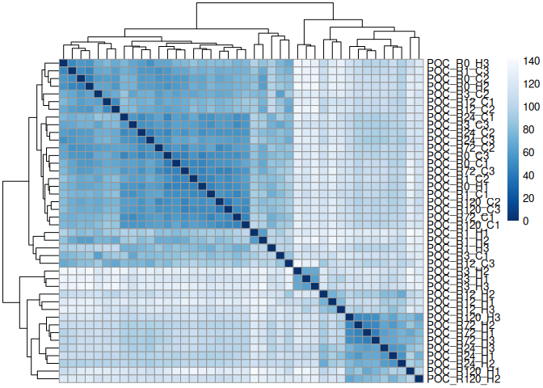<!-- -->

#### 5. PCA

``` r
pcaData <- plotPCA(vsd, intgroup=c("time", "treatment"), returnData=TRUE)

percentVar <- round(100 * attr(pcaData, "percentVar"))
PCA <- ggplot() +
  geom_point(data = subset(pcaData, treatment == "C"),
             aes(x=PC1, y=PC2, color=time),
                 size=2) +
             scale_color_manual(values=brewer.pal(7, "Blues"), name = "Time (hrs) - Control") +
  
  #start new scale
  ggnewscale::new_scale_color() +
  geom_point(data = subset(pcaData, treatment == "H"),
             aes(x=PC1, y=PC2, color=time),
                 size=2) +
             scale_color_manual(values=brewer.pal(7, "Oranges"), name = "Time (hrs) - Heat") +

  xlab(paste0("PC1: ",percentVar[1],"% variance")) +
  ylab(paste0("PC2: ",percentVar[2],"% variance")) + 
  coord_fixed() + theme_bw()

save_ggplot(PCA, "PCA_POC")
```

#### 6. Heatmap of variable genes

``` r
topVarGenes <- head(order(rowVars(assay(vsd)), decreasing=TRUE), 500)

pheatmap(assay(vsd)[topVarGenes, ], cluster_rows=TRUE, show_rownames=FALSE,
         cluster_cols=FALSE, 
         annotation_col= meta[,c("treatment","time")],
         annotation_colors = list("treatment" = treat_colors,
                                  "time" = time_colors))
```

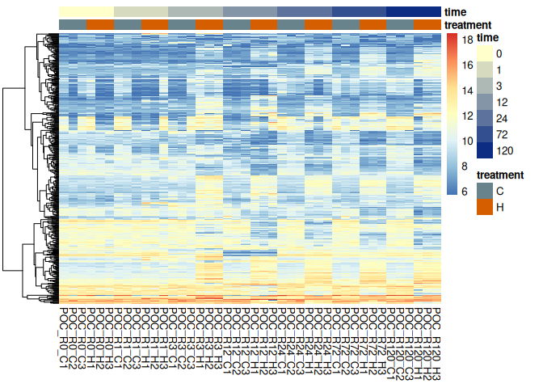<!-- -->

``` r
pheatmap(assay(vsd)[topVarGenes, ], cluster_rows=TRUE, show_rownames=FALSE,
         cluster_cols=TRUE, cutree_cols = 2,
         annotation_col= meta[,c("treatment","time")],
         annotation_colors = list("treatment" = treat_colors,
                                  "time" = time_colors))
```

<!-- -->

### Heat stress genes

``` r
HeatStressGenes <- read_csv(paste0("/project/pi_hputnam_uri_edu/zdellaert/snRNA_analysis/multi-sp-snRNA/reference_genes/genes_of_interest/HeatStressGenes_", species ,".csv")) %>% dplyr::select(-1) %>% dplyr::rename(query = paste0(species,"_gene")) %>% dplyr::select(query,everything()) #%>% filter(ref_first_author =="Majerova")

HeatStressGenes_unique <- HeatStressGenes %>% group_by(query) %>%
  summarize(gene_id = paste(unique(gene_id), collapse = ","),
            response_type = paste(unique(response_type), collapse = ","),
            category = paste(unique(category), collapse = ",")
            ) 

HeatStressGenes_unique <- HeatStressGenes_unique %>% filter(query %in% rownames(vsd_mat))
 
stress_genes_ids <- unique(HeatStressGenes_unique$query) 
stress_genes_vsd <- vsd_mat[stress_genes_ids, ]

plot_df <- as.data.frame(t(stress_genes_vsd)) %>%
  rownames_to_column(var="sample") %>%
  left_join(meta, by=c("sample"="sample")) %>%
  pivot_longer(cols = all_of(stress_genes_ids), names_to="query", values_to="expression") %>%
  left_join(HeatStressGenes_unique)

plot_df %>% ggplot(aes(x=time, y=expression, color=gene_id, group=gene_id)) +
  stat_summary(fun="mean", geom="line") +
  stat_summary(fun.data=mean_se, geom="errorbar", width=0.2) +
  facet_wrap(treatment~response_type) +
  theme_bw() +
  labs(y="VST expression", x="Timepoint")
```

<!-- -->

``` r
plot_df %>% filter(grepl("Type1", response_type)) %>%
  ggplot(aes(x=time, y=expression, color=treatment, group=interaction(treatment,query))) +
  stat_summary(fun="mean", geom="line", alpha=0.6) +
  stat_summary(fun.data=mean_se, geom="errorbar", width=0.2,linewidth=0.5, alpha=0.6) +
  scale_color_manual(values = treat_colors) +
  facet_wrap(~gene_id, ncol= 3,scales="free_y") +
  theme_bw() +
  theme(
    strip.text = element_text(face="bold", size=8),panel.spacing = unit(0.4, "lines")
  ) +
  labs(y="VST expression", x="Timepoint", title = "Type 1 Expressed Response genes")
```

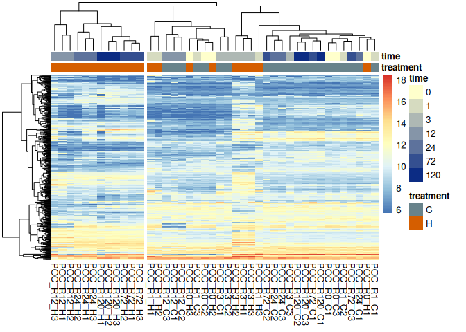<!-- -->

``` r
save_ggplot(last_plot(), "All_Type1")

plot_df %>% filter(grepl("Type2", response_type)) %>%
  ggplot(aes(x=time, y=expression, color=treatment, group=interaction(treatment,query))) +
  stat_summary(fun="mean", geom="line", alpha=0.6) +
  stat_summary(fun.data=mean_se, geom="errorbar", width=0.2,linewidth=0.5, alpha=0.6) +
  scale_color_manual(values = treat_colors) +
  facet_wrap(~gene_id, ncol= 3,scales="free_y") +
  theme_bw() +
  theme(
    strip.text = element_text(face="bold", size=8),panel.spacing = unit(0.4, "lines")
  ) +
  labs(y="VST expression", x="Timepoint", title = "Type 2 Expressed Response genes")
```

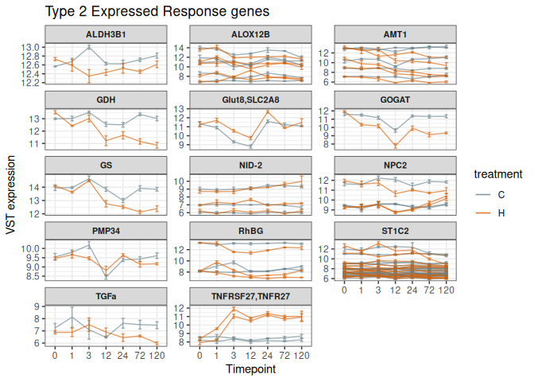<!-- -->

``` r
save_ggplot(last_plot(), "All_Type2")

plot_df %>% filter(grepl("HSP",gene_id)|grepl("Nrf2",gene_id)|grepl("HSF1",gene_id)) %>% ggplot(aes(x=time, y=expression, color=treatment, group=treatment)) +
  stat_summary(fun="mean", geom="line") +
  scale_color_manual(values = treat_colors) +
  stat_summary(fun.data=mean_se, geom="errorbar", width=0.2) +
  facet_wrap(~paste0(str_replace(query,"Pocillopora_acuta_HIv2___",""), ": ", gene_id)) +
  theme_bw() +
  labs(y="VST expression", x="Timepoint")
```

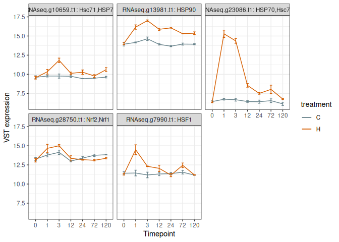<!-- -->

#### DESeq LRT Test

``` r
dds <- DESeqDataSetFromMatrix(countData = filtered_counts,
                              colData = meta,
                              design= ~ treatment + time + treatment:time)

dds <- DESeq(dds, test = "LRT", reduced = ~ treatment + time)

res <- results(dds)
sig_genes <- subset(res, padj < 0.05)
lrt_res <- as.data.frame(res)

DE_05 <- lrt_res[rownames(lrt_res %>% filter(padj<0.05)),]

time_colors <- colorRampPalette(c("#ffffcc","#0c2c84"))(7)
names(time_colors) <- levels(meta$time)

top_500_DE_genes <- DE_05 %>% arrange(padj) %>% head(500) %>% rownames()

#view top 500 most vairable genes
pheatmap(assay(vsd)[top_500_DE_genes, ], cluster_rows=TRUE, show_rownames=FALSE,
         cluster_cols=FALSE, 
         annotation_col= meta[,c("treatment","time")],
         annotation_colors = list("treatment" = treat_colors,
                                  "time" = time_colors))
```

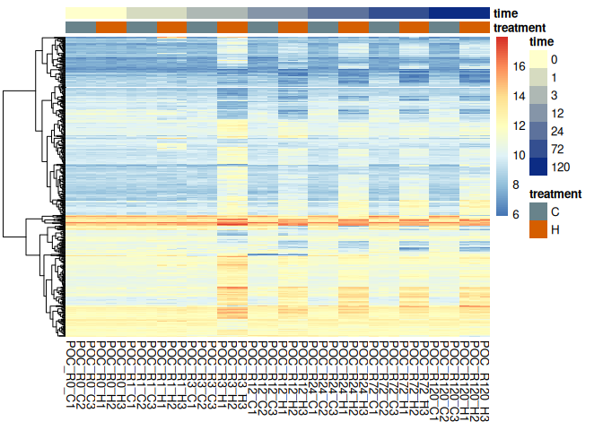<!-- -->

``` r
pheatmap(assay(vsd)[top_500_DE_genes, ], cluster_rows=TRUE, show_rownames=FALSE,
         cluster_cols=TRUE, cutree_cols = 2,
         annotation_col= meta[,c("treatment","time")],
         annotation_colors = list("treatment" = treat_colors,
                                  "time" = time_colors))
```

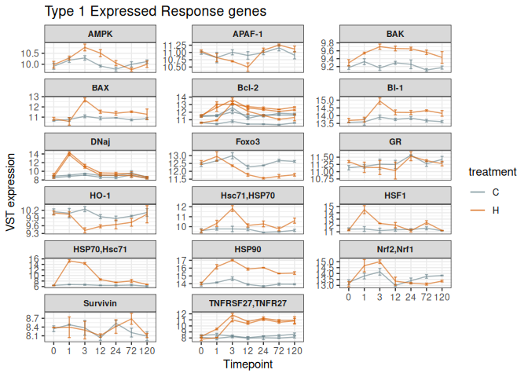<!-- -->

``` r
top_500_DE_genes <- DE_05 %>% arrange(log2FoldChange) %>% head(500) %>% rownames()

#view top 500 most vairable genes
pheatmap(assay(vsd)[top_500_DE_genes, ], cluster_rows=TRUE, show_rownames=FALSE,
         cluster_cols=FALSE, 
         annotation_col= meta[,c("treatment","time")],
         annotation_colors = list("treatment" = treat_colors,
                                  "time" = time_colors))
```

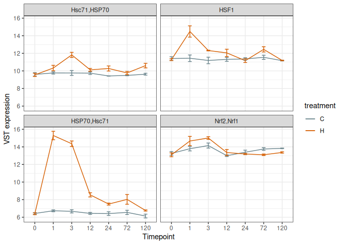<!-- -->

``` r
pheatmap(assay(vsd)[top_500_DE_genes, ], cluster_rows=TRUE, show_rownames=FALSE,
         cluster_cols=TRUE, cutree_cols = 2,
         annotation_col= meta[,c("treatment","time")],
         annotation_colors = list("treatment" = treat_colors,
                                  "time" = time_colors))
```

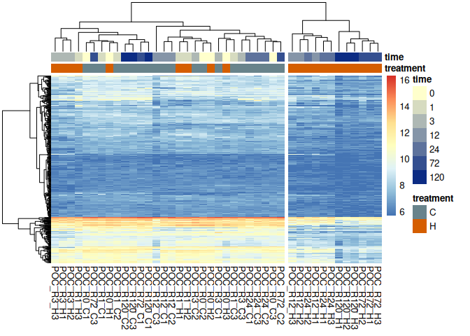<!-- -->

``` r
top_500_DE_genes <- DE_05 %>% arrange(desc(log2FoldChange)) %>% head(500) %>% rownames()

#view top 500 most vairable genes
pheatmap(assay(vsd)[top_500_DE_genes, ], cluster_rows=TRUE, show_rownames=FALSE,
         cluster_cols=FALSE, 
         annotation_col= meta[,c("treatment","time")],
         annotation_colors = list("treatment" = treat_colors,
                                  "time" = time_colors))
```

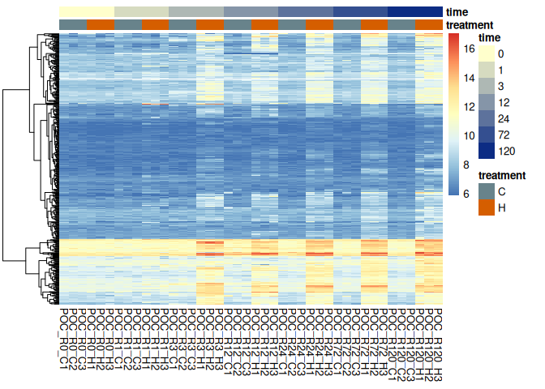<!-- -->

``` r
pheatmap(assay(vsd)[top_500_DE_genes, ], cluster_rows=TRUE, show_rownames=FALSE,
         cluster_cols=TRUE, cutree_cols = 2,
         annotation_col= meta[,c("treatment","time")],
         annotation_colors = list("treatment" = treat_colors,
                                  "time" = time_colors))
```

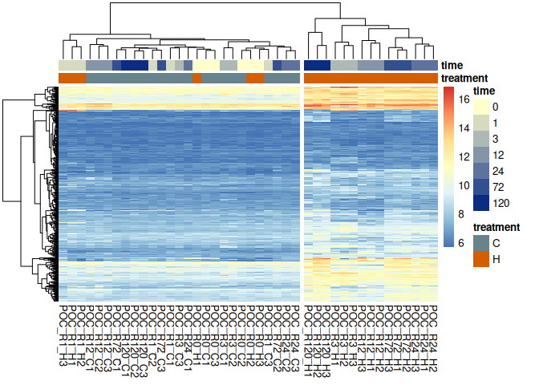<!-- -->

#### DE Heat stress genes

``` r
plot_df <- as.data.frame(t(stress_genes_vsd)) %>%
  rownames_to_column(var="sample") %>%
  left_join(meta, by=c("sample"="sample")) %>%
  pivot_longer(cols = all_of(stress_genes_ids), names_to="query", values_to="expression") %>%
  left_join(HeatStressGenes_unique) %>% left_join(DE_05 %>% rownames_to_column(var="query")) %>%
  filter(!is.na(padj))

plot_df %>% ggplot(aes(x=time, y=expression, color=gene_id, group=gene_id)) +
  stat_summary(fun="mean", geom="line") +
  stat_summary(fun.data=mean_se, geom="errorbar", width=0.2) +
  facet_wrap(treatment~response_type) +
  theme_bw() +
  labs(y="VST expression", x="Timepoint")
```

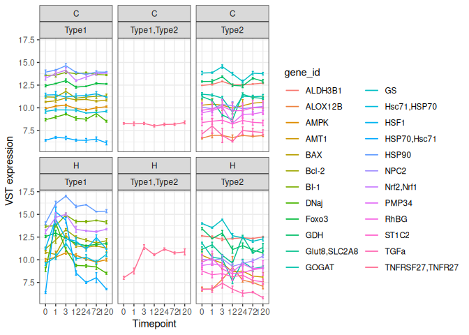<!-- -->

``` r
plot_df %>% filter(grepl("Type1", response_type)) %>%
  ggplot(aes(x=time, y=expression, color=treatment, group=interaction(treatment,query))) +
  stat_summary(fun="mean", geom="line", alpha=0.6) +
  stat_summary(fun.data=mean_se, geom="errorbar", width=0.2,linewidth=0.5, alpha=0.6) +
  scale_color_manual(values = treat_colors) +
  facet_wrap(~gene_id, ncol= 3,scales="free_y") +
  theme_bw() +
  theme(
    strip.text = element_text(face="bold", size=8),panel.spacing = unit(0.4, "lines")
  ) +
  labs(y="VST expression", x="Timepoint", title = "Type 1 DE (LRT) Response genes")
```

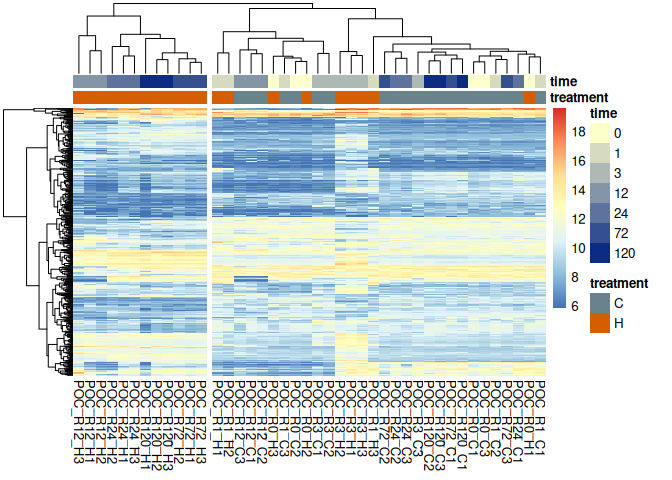<!-- -->

``` r
save_ggplot(last_plot(), "DE_Type1")

plot_df %>% filter(grepl("Type2", response_type)) %>%
  ggplot(aes(x=time, y=expression, color=treatment, group=interaction(treatment,query))) +
  stat_summary(fun="mean", geom="line", alpha=0.6) +
  stat_summary(fun.data=mean_se, geom="errorbar", width=0.2,linewidth=0.5, alpha=0.6) +
  scale_color_manual(values = treat_colors) +
  facet_wrap(~gene_id, ncol= 3,scales="free_y") +
  theme_bw() +
  theme(
    strip.text = element_text(face="bold", size=8),panel.spacing = unit(0.4, "lines")
  ) +
  labs(y="VST expression", x="Timepoint", title = "Type 2 DE (LRT) Response genes")
```

<!-- -->

``` r
save_ggplot(last_plot(), "DE_Type2")

plot_df %>% filter(grepl("HSP",gene_id)|grepl("Nrf2",gene_id)|grepl("HSF1",gene_id)) %>% ggplot(aes(x=time, y=expression, color=treatment, group=treatment)) +
  stat_summary(fun="mean", geom="line") +
  scale_color_manual(values = treat_colors) +
  stat_summary(fun.data=mean_se, geom="errorbar", width=0.2) +
  facet_wrap(~paste0(gene_id, ": ",str_replace(query,"Pocillopora_acuta_HIv2___","")),scales="free_y") +
  theme_bw() +
  labs(y="VST expression", x="Timepoint", title = "Selected Type 1 DE (LRT) Response genes")
```

<!-- -->

``` r
save_ggplot(last_plot(), "highlighted_DE_Type1")

plot_df_norm <- plot_df %>%
  group_by(query, time) %>%
  mutate(delta = expression - mean(expression[treatment == "C"]))

plot_df_norm %>% filter(grepl("HSP",gene_id)|grepl("Nrf2",gene_id)|grepl("HSF1",gene_id)) %>% ggplot(aes(x=time, y=delta, color=treatment, group=treatment)) +
  stat_summary(fun="mean", geom="line") +
  scale_color_manual(values = treat_colors) +
  stat_summary(fun.data=mean_se, geom="errorbar", width=0.2) +
  facet_wrap(~paste0(gene_id, ": ",str_replace(query,"Pocillopora_acuta_HIv2___","")),scales="free_y") +
  theme_bw() +
  labs(y="VST expression", x="Timepoint", title = "Norm to control -- Selected Type 1 DE (LRT) Response genes")
```

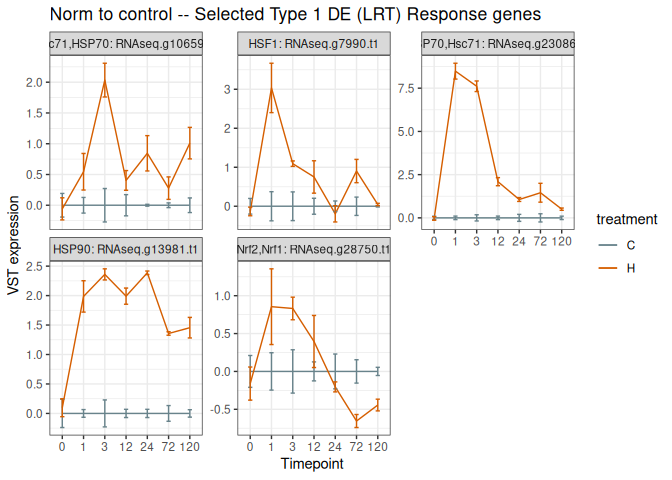<!-- -->

``` r
save_ggplot(last_plot(), "highlighted_DE_Type1_norm_control")

plot_df_norm <- plot_df %>%
  group_by(query, treatment) %>%
  mutate(baseline = mean(expression[time == "0"])) %>%
  mutate(delta = expression - baseline) %>%
  ungroup()

plot_df_norm %>% filter(grepl("HSP",gene_id)|grepl("Nrf2",gene_id)|grepl("HSF1",gene_id)) %>%
  ggplot(aes(x=time, y=delta, color=treatment, group=treatment)) +
  stat_summary(fun="mean", geom="line") +
  scale_color_manual(values = treat_colors) +
  stat_summary(fun.data=mean_se, geom="errorbar", width=0.2) +
  facet_wrap(~paste0(gene_id, ": ",str_replace(query,"Pocillopora_acuta_HIv2___","")),scales="free_y") +
  theme_bw() +
  labs(y="VST expression", x="Timepoint", title = "Norm to T0 -- Selected Type 1 DE (LRT) Response genes")
```

<!-- -->

``` r
save_ggplot(last_plot(), "highlighted_DE_Type1_norm_T0")

plot_df %>% filter(grepl("GDH",gene_id)|grepl("GS",gene_id)|grepl("AMT1",gene_id)) %>% ggplot(aes(x=time, y=expression, color=treatment, group=treatment)) +
  stat_summary(fun="mean", geom="line") +
  scale_color_manual(values = treat_colors) +
  stat_summary(fun.data=mean_se, geom="errorbar", width=0.2) +
  facet_wrap(~paste0(gene_id, ": ",str_replace(query,"Pocillopora_acuta_HIv2___","")),scales="free_y") +
  theme_bw() +
  labs(y="VST expression", x="Timepoint", title = "Selected Type 2 DE (LRT) Response genes")
```

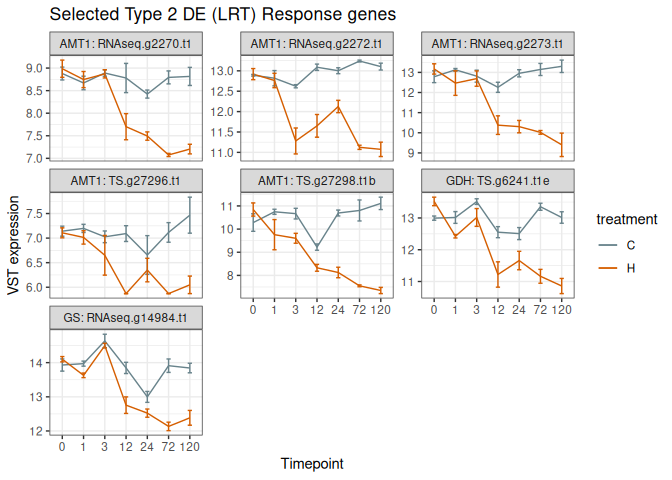<!-- -->

``` r
save_ggplot(last_plot(), "highlighted_DE_Type2")

plot_df %>% filter(grepl("DNaj",gene_id)|grepl("ALOX",gene_id)|grepl("AMT1",gene_id)|grepl("ST1C2",gene_id)|grepl("GDH",gene_id)) %>% ggplot(aes(x=time, y=expression, color=treatment, group=treatment)) +
  stat_summary(fun="mean", geom="line") +
  scale_color_manual(values = treat_colors) +
  stat_summary(fun.data=mean_se, geom="errorbar", width=0.2) +
  facet_wrap(~paste0(gene_id, ": ",str_replace(query,"Pocillopora_acuta_HIv2___","")),scales="free_y") +
  theme_bw() +
  labs(y="VST expression", x="Timepoint", title = "Type 1 & 2 DE (LRT) Response genes also DE in Oral Epidermis by LCM")
```

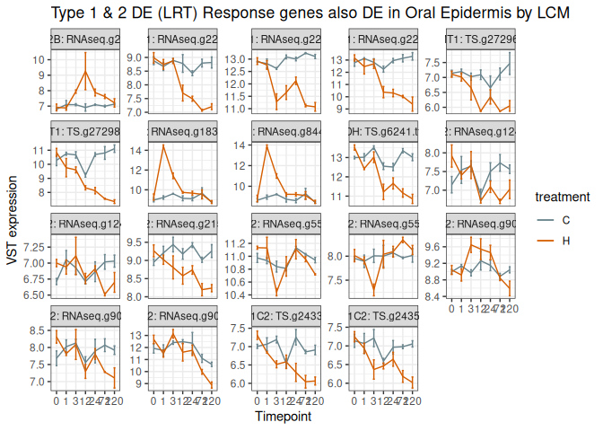<!-- -->

``` r
save_ggplot(last_plot(), "highlighted_tissue_DE")
```

#### Heat stress genes not ID’d above (working on fixing/completing ever-growing list)

NEED_TO_FIND_GENE_ID response_type category gene_id gene_name species
species_gene_ID 1 Type1 Innate immunity NF-KB NF-KB Ahya <NA> 2 Type1
Innate immunity AP-1 Transcription factor AP-1 Ahya <NA> 3 Type1 Stress
transcription factors Elk-3 ETS domain-containing protein Elk-3 Ahya
<NA> 4 Type1 Stress transcription factors FosB FosB Ahya <NA> 5 Type1
UPR HSP70 HSP70 Ahya <NA> 6 Type1 Apoptosis Casp Caspase Spis <NA> 7
Type1 ROS response CAT Catalase <NA> <NA> 8 Type1 ROS response SOD
Superoxide dismutase <NA> <NA> key_timepoint_upregulation
key_timepoint_downregulation timepoint_notes ref_first_author reference
1 2.5hr <NA> <NA> Traylor Knowles 10.1086/692717 2 3hr <NA> <NA> Traylor
Knowles 10.1086/692717 3 4hr <NA> <NA> Traylor Knowles 10.1086/692717 4
4hr <NA> <NA> Traylor Knowles 10.1086/692717 5 1hr <NA> <NA> Traylor
Knowles 10.1086/692717 6 6hr <NA> 1st timepoint after T0 Kvitt
10.1038/srep30359 7 <NA> <NA> <NA> <NA> <NA> 8 <NA> <NA> <NA> <NA> <NA>

``` r
plot_df <- as.data.frame(t(vsd_mat)) %>%
  rownames_to_column(var="sample") %>%
  left_join(meta, by=c("sample"="sample")) %>% 
  pivot_longer(cols = all_of(rownames(vsd_mat)), names_to="query", values_to="expression") %>%
  mutate(is_DE = query %in% rownames(DE_05))

list <- list(NFKB = c("Pocillopora_acuta_HIv2___RNAseq.g25363.t1b", "Pocillopora_acuta_HIv2___RNAseq.g25813.t1"),
             AP1 = c("Pocillopora_acuta_HIv2___TS.g21530.t1", "Pocillopora_acuta_HIv2___TS.g13419.t1"),
             caspases = c("Pocillopora_acuta_HIv2___RNAseq.g26337.t1","Pocillopora_acuta_HIv2___TS.g22465.t1","Pocillopora_acuta_HIv2___RNAseq.g26338.t1","Pocillopora_acuta_HIv2___RNAseq.g6753.t1","Pocillopora_acuta_HIv2___RNAseq.g19199.t1","Pocillopora_acuta_HIv2___RNAseq.20932_t","Pocillopora_acuta_HIv2___RNAseq.g1378.t1","Pocillopora_acuta_HIv2___RNAseq.g6752.t2","Pocillopora_acuta_HIv2___TS.g18537.t1","Pocillopora_acuta_HIv2___RNAseq.g26123.t1","Pocillopora_acuta_HIv2___RNAseq.g1342.t1"),
             catalase = c("Pocillopora_acuta_HIv2___RNAseq.g11210.t1","Pocillopora_acuta_HIv2___TS.g29361.t1"),
             superoxide_dismutase = c("Pocillopora_acuta_HIv2___TS.g398.t1", "Pocillopora_acuta_HIv2___RNAseq.g10688.t2",
          "Pocillopora_acuta_HIv2___TS.g26014.t1a", "Pocillopora_acuta_HIv2___RNAseq.g208.t1","Pocillopora_acuta_HIv2___TS.g29776.t1",
          "Pocillopora_acuta_HIv2___TS.g29777.t1","Pocillopora_acuta_HIv2___RNAseq.g4525.t1"),
          ELK3 = c("Pocillopora_acuta_HIv2___RNAseq.g6733.t1","Pocillopora_acuta_HIv2___TS.g23786.t1","Pocillopora_acuta_HIv2___RNAseq.24170_t","Pocillopora_acuta_HIv2___RNAseq.g21406.t1","Pocillopora_acuta_HIv2___RNAseq.g6737.t1","Pocillopora_acuta_HIv2___TS.g23792.t4","Pocillopora_acuta_HIv2___RNAseq.g6730.t1","Pocillopora_acuta_HIv2___RNAseq.g6734.t1"),
          FOSB = c("Pocillopora_acuta_HIv2___RNAseq.g25126.t1"),
          TRPA = c("Pocillopora_acuta_HIv2___RNAseq.g9466.t1","Pocillopora_acuta_HIv2___RNAseq.g11852.t1","Pocillopora_acuta_HIv2___RNAseq.10010_t","Pocillopora_acuta_HIv2___RNAseq.g28464.t1","Pocillopora_acuta_HIv2___RNAseq.g7752.t1b","Pocillopora_acuta_HIv2___RNAseq.g11857.t1","Pocillopora_acuta_HIv2___RNAseq.g10676.t1","Pocillopora_acuta_HIv2___RNAseq.g15121.t1")
             )

for (genelist in names(list)){
  genes <- list[[genelist]]
  
  plot <- plot_df %>% filter(query %in% genes) %>% ggplot(aes(x=time, y=expression, color=treatment, group=treatment)) +
  stat_summary(fun="mean", geom="line") +
  scale_color_manual(values = treat_colors) +
  stat_summary(fun.data=mean_se, geom="errorbar", width=0.2) +
  facet_wrap(paste0(str_replace(query,"Pocillopora_acuta_HIv2___",""), ": ", genelist)~ ~paste0("DE by LRT: ",is_DE),scales="free_y") +
  theme_bw() +
  labs(y="VST expression", x="Timepoint")
  print(plot)
}
```

<!-- --><!-- --><!-- --><!-- -->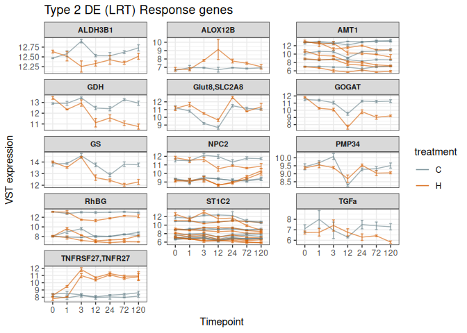<!-- -->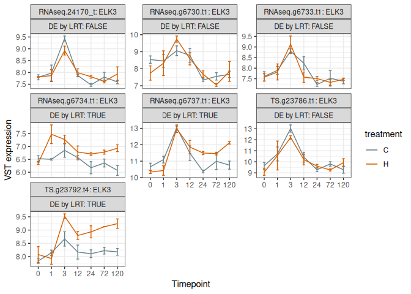<!-- --><!-- -->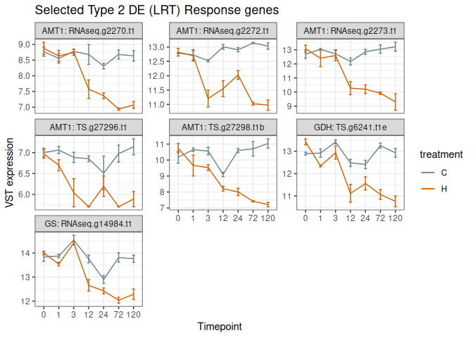<!-- -->

#### Mechanosensing and other channels

``` r
DESeq_SwissProt_annotation <- read_csv("../output_RNA/differential_expression/POC_PacutaV2/DESeq_SwissProt_annotation.csv")

plot_df <- as.data.frame(t(vsd_mat)) %>%
  rownames_to_column(var="sample") %>%
  left_join(meta, by=c("sample"="sample")) %>% 
  pivot_longer(cols = all_of(rownames(vsd_mat)), names_to="query", values_to="expression") %>%
  mutate(is_DE = query %in% rownames(DE_05))

## note this list is not complete I need to redo the annotations for all 3 species in the same way - -this is just a jumping off point from LCM paper

list <- list(aquaporin = DESeq_SwissProt_annotation %>% filter(grepl("Aquaporin", ProteinNames, ignore.case = TRUE)) %>% pull(query),
             TRP = DESeq_SwissProt_annotation %>% filter(grepl("transient receptor potential", ProteinNames, ignore.case = TRUE)) %>% pull(query),
             Mechanosensory = DESeq_SwissProt_annotation %>% filter(grepl("Mechanosens", ProteinNames, ignore.case = TRUE)) %>% pull(query),
             calcium_transport_1 = DESeq_SwissProt_annotation %>% filter(grepl("calcium ion transport", BiologicalProcess, ignore.case = TRUE)) %>% head(34) %>% pull(query),
             calcium_transport_2 = DESeq_SwissProt_annotation %>% filter(grepl("calcium ion transport", BiologicalProcess, ignore.case = TRUE)) %>% tail(34) %>% pull(query),
             SLCs_1 = DESeq_SwissProt_annotation %>% filter(grepl("Solute carrier", ProteinNames, ignore.case = TRUE)) %>% slice(1:30) %>% pull(query),
             SLCs_2 = DESeq_SwissProt_annotation %>% filter(grepl("Solute carrier", ProteinNames, ignore.case = TRUE)) %>% slice(31:60) %>% pull(query),
             SLCs_3 = DESeq_SwissProt_annotation %>% filter(grepl("Solute carrier", ProteinNames, ignore.case = TRUE)) %>% slice(61:90) %>% pull(query),
             SLCs_4 = DESeq_SwissProt_annotation %>% filter(grepl("Solute carrier", ProteinNames, ignore.case = TRUE)) %>% slice(91:120) %>% pull(query),
             SLCs_5 = DESeq_SwissProt_annotation %>% filter(grepl("Solute carrier", ProteinNames, ignore.case = TRUE)) %>% slice(121:150) %>% pull(query),
             SLCs_6 = DESeq_SwissProt_annotation %>% filter(grepl("Solute carrier", ProteinNames, ignore.case = TRUE)) %>% slice(151:180) %>% pull(query),
             SLCs_7 = DESeq_SwissProt_annotation %>% filter(grepl("Solute carrier", ProteinNames, ignore.case = TRUE)) %>% slice(181:211) %>% pull(query)
             )

for (genelist in names(list)){
  genes <- list[[genelist]]
  
  plot <- plot_df %>% filter(query %in% genes) %>% filter(is_DE == TRUE) %>% ggplot(aes(x=time, y=expression, color=treatment, group=treatment)) +
  stat_summary(fun="mean", geom="line") +
  scale_color_manual(values = treat_colors) +
  stat_summary(fun.data=mean_se, geom="errorbar", width=0.2) +
  facet_wrap(paste0(str_replace(query,"Pocillopora_acuta_HIv2___",""), ": ", genelist)~ ~paste0("DE by LRT: ",is_DE),scales="free_y") +
  theme_bw() +
  labs(y="VST expression", x="Timepoint")
  print(plot)
}
```

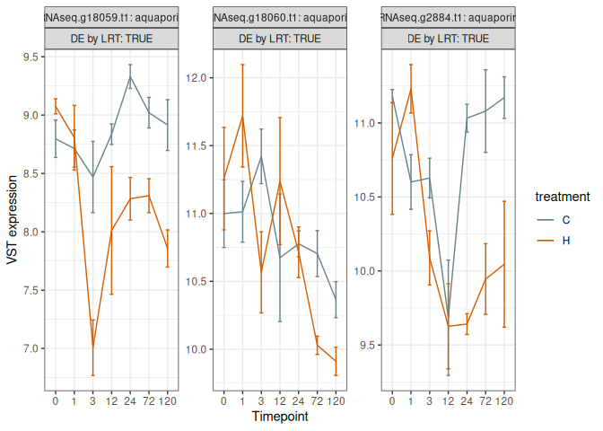<!-- -->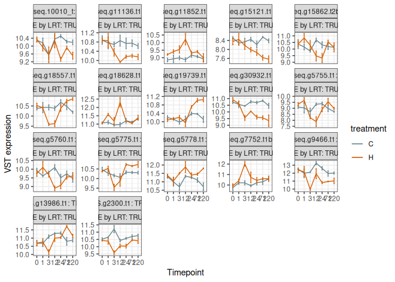<!-- -->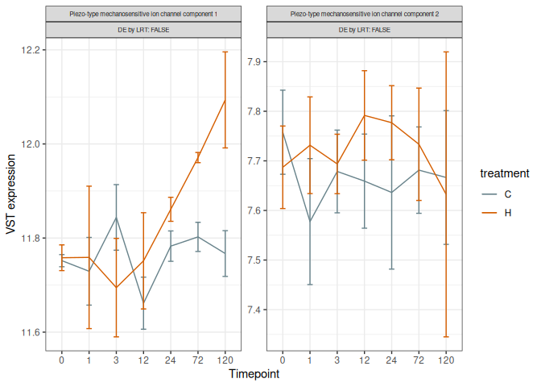<!-- -->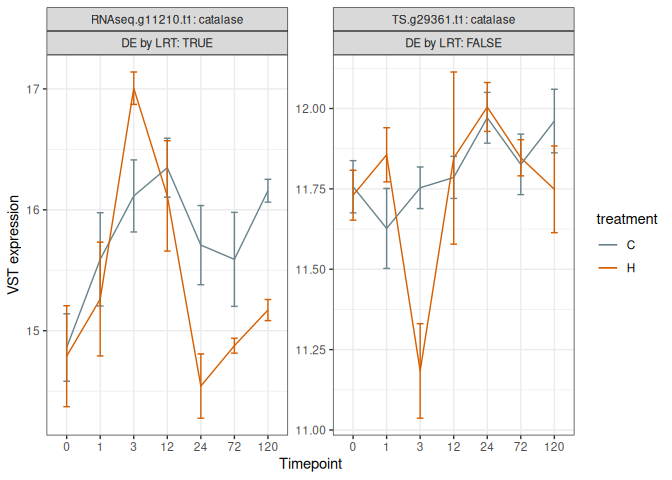<!-- -->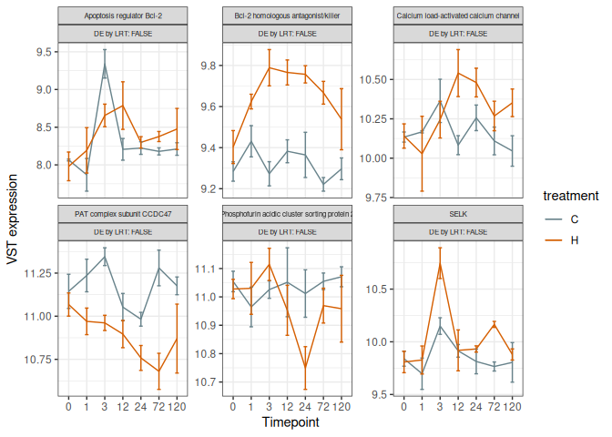<!-- -->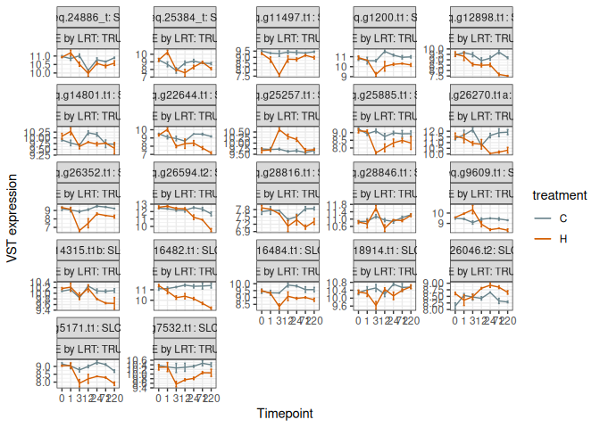<!-- -->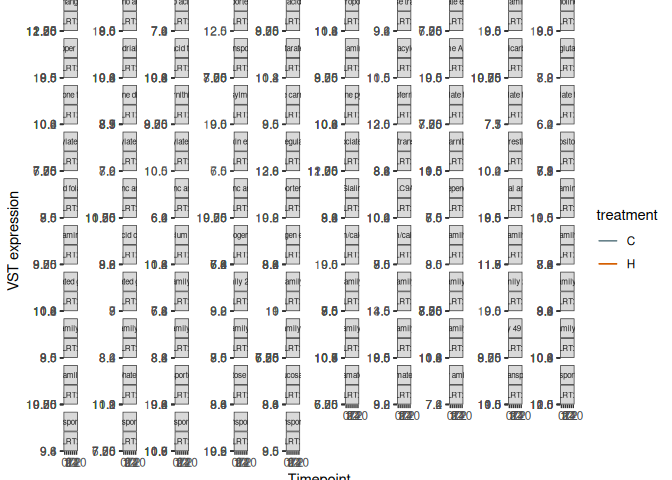<!-- -->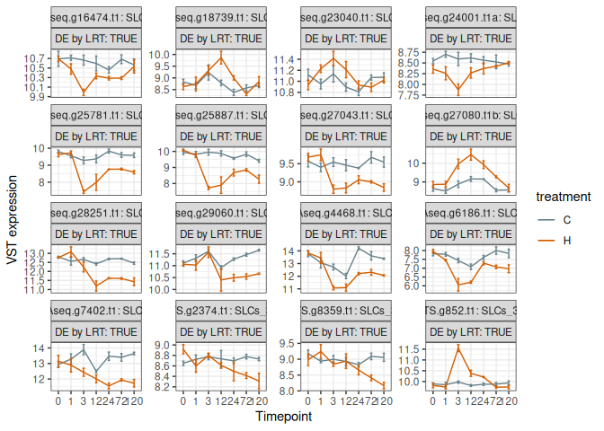<!-- -->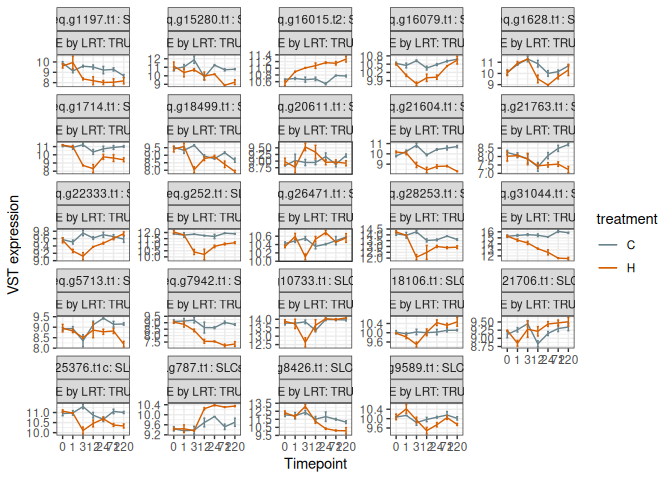<!-- -->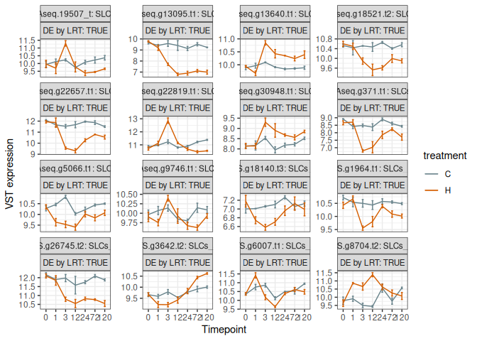<!-- -->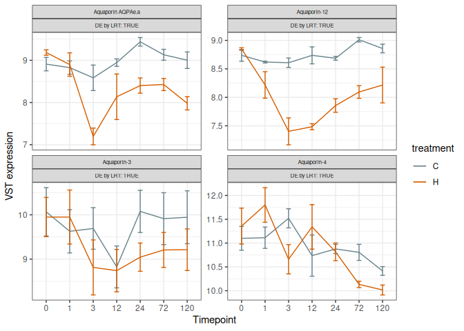<!-- -->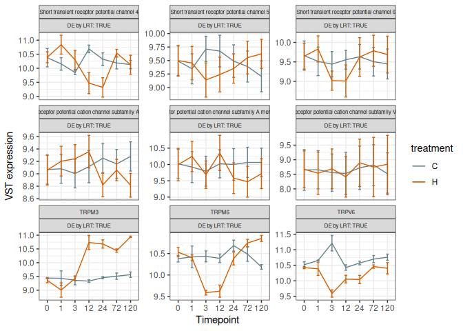<!-- -->

### ImpulseDE2

#### Background info

Based on [this
paper](https://academic.oup.com/bib/article/20/1/288/4364840#130283262),
this is the best package to use other than comparing each time point
against each other individually.

Repo here: <https://github.com/YosefLab/ImpulseDE2>

Tutorial here:
<http://bioconductor.statistik.tu-dortmund.de/packages/3.11/bioc/vignettes/ImpulseDE2/inst/doc/ImpulseDE2_Tutorial.html>
, I followed closely with the section “Case-control differential
expression analysis”

Read the ImpulseDE2 paper
[here](https://academic.oup.com/nar/article/46/20/e119/5068248)

David S Fischer, Fabian J Theis, Nir Yosef, Impulse model-based
differential expression analysis of time course sequencing data, Nucleic
Acids Research, Volume 46, Issue 20, 16 November 2018, Page e119,
<https://doi.org/10.1093/nar/gky675>

#### 1. Install and load

``` r
#library(devtools)
#install_github("YosefLab/ImpulseDE2")

library(ImpulseDE2)
library(ComplexHeatmap)
```

#### 2. Metadata formatting

First, reformat our metadata table to match the column names used in the
ImpulseDE2 vignette.

``` r
meta_impulse <- meta %>%
  dplyr::rename(Sample = sample, Time = time, Batch = replicate) %>% 
  mutate(Time = as.numeric(as.character(Time)),
         Condition = str_replace(treatment, "C", "control"),
         Condition = str_replace(Condition, "H", "case")
         ) %>%
  select(-c(species,treatment))
```

#### 3. Then, run ImpulseDE2 object

This takes a ton of time and memory, so I run it once then save as an
RDS.

``` r
objectImpulseDE2 <- runImpulseDE2(
  matCountData    = as.matrix(counts_raw), #or use filtered_counts 
  dfAnnotation    = meta_impulse,
  boolCaseCtrl    = TRUE,
  vecConfounders  = c("Batch"), #only use if you want to try to control for batch effects
  boolIdentifyTransients = TRUE, #use if you want to ID transiently- vs permanently-regulated genes
  scaNProc        = 18 )

saveRDS(objectImpulseDE2, file = paste0(outdir, "/objectImpulseDE2.rds"))
```

#### 4. View and save results

``` r
objectImpulseDE2 <- readRDS(paste0(outdir, "/objectImpulseDE2.rds"))

impulse_results <- objectImpulseDE2$dfImpulseDE2Results

write.table(impulse_results,file.path(outdir, "ImpulseDE2_Results.txt"),row.names=F,quote=F,sep="\t")

# Genes with significant treatment effect on temporal trajectory
impulse_sig_genes <- impulse_results %>% filter(padj < 0.05) 

#preview top DE genes 
impulse_sig_genes %>% arrange(padj) %>% head(5) %>% dplyr::select(!contains("converge"))
```

    ##                                                                                Gene
    ## Pocillopora_acuta_HIv2___TS.g798.t2             Pocillopora_acuta_HIv2___TS.g798.t2
    ## Pocillopora_acuta_HIv2___RNAseq.g26418.t1 Pocillopora_acuta_HIv2___RNAseq.g26418.t1
    ## Pocillopora_acuta_HIv2___RNAseq.g5165.t1   Pocillopora_acuta_HIv2___RNAseq.g5165.t1
    ## Pocillopora_acuta_HIv2___RNAseq.g22728.t1 Pocillopora_acuta_HIv2___RNAseq.g22728.t1
    ## Pocillopora_acuta_HIv2___RNAseq.g26847.t1 Pocillopora_acuta_HIv2___RNAseq.g26847.t1
    ##                                                      p         padj loglik_full
    ## Pocillopora_acuta_HIv2___TS.g798.t2       1.785547e-91 5.388779e-87   -328.8425
    ## Pocillopora_acuta_HIv2___RNAseq.g26418.t1 8.064791e-88 1.216977e-83   -372.3030
    ## Pocillopora_acuta_HIv2___RNAseq.g5165.t1  4.697900e-82 4.726087e-78   -235.3446
    ## Pocillopora_acuta_HIv2___RNAseq.g22728.t1 1.539658e-81 1.161672e-77   -292.0287
    ## Pocillopora_acuta_HIv2___RNAseq.g26847.t1 3.637731e-81 2.195734e-77   -312.5755
    ##                                           loglik_red df_full df_red      mean
    ## Pocillopora_acuta_HIv2___TS.g798.t2        -545.5883      17     12 1155.4787
    ## Pocillopora_acuta_HIv2___RNAseq.g26418.t1  -580.5737      17     12 4069.0998
    ## Pocillopora_acuta_HIv2___RNAseq.g5165.t1   -430.2411      17     12  431.8172
    ## Pocillopora_acuta_HIv2___RNAseq.g22728.t1  -485.7291      17     12  572.6731
    ## Pocillopora_acuta_HIv2___RNAseq.g26847.t1  -505.4094      17     12  870.6789
    ##                                           impulseTOsigmoid_p
    ## Pocillopora_acuta_HIv2___TS.g798.t2             2.116394e-01
    ## Pocillopora_acuta_HIv2___RNAseq.g26418.t1      1.337443e-154
    ## Pocillopora_acuta_HIv2___RNAseq.g5165.t1       3.174080e-194
    ## Pocillopora_acuta_HIv2___RNAseq.g22728.t1       4.710900e-15
    ## Pocillopora_acuta_HIv2___RNAseq.g26847.t1       5.377848e-01
    ##                                           impulseTOsigmoid_padj
    ## Pocillopora_acuta_HIv2___TS.g798.t2                3.520907e-01
    ## Pocillopora_acuta_HIv2___RNAseq.g26418.t1         6.727339e-151
    ## Pocillopora_acuta_HIv2___RNAseq.g5165.t1          3.193124e-190
    ## Pocillopora_acuta_HIv2___RNAseq.g22728.t1          1.087796e-13
    ## Pocillopora_acuta_HIv2___RNAseq.g26847.t1          7.090273e-01
    ##                                           sigmoidTOconst_p sigmoidTOconst_padj
    ## Pocillopora_acuta_HIv2___TS.g798.t2          1.515162e-125       1.143189e-121
    ## Pocillopora_acuta_HIv2___RNAseq.g26418.t1    1.084480e-102        3.272959e-99
    ## Pocillopora_acuta_HIv2___RNAseq.g5165.t1      5.093000e-19        1.738764e-17
    ## Pocillopora_acuta_HIv2___RNAseq.g22728.t1    9.892457e-117       4.975906e-113
    ## Pocillopora_acuta_HIv2___RNAseq.g26847.t1    2.697721e-132       2.713907e-128
    ##                                           isTransient isMonotonous allZero
    ## Pocillopora_acuta_HIv2___TS.g798.t2             FALSE         TRUE   FALSE
    ## Pocillopora_acuta_HIv2___RNAseq.g26418.t1        TRUE        FALSE   FALSE
    ## Pocillopora_acuta_HIv2___RNAseq.g5165.t1         TRUE        FALSE   FALSE
    ## Pocillopora_acuta_HIv2___RNAseq.g22728.t1        TRUE        FALSE   FALSE
    ## Pocillopora_acuta_HIv2___RNAseq.g26847.t1       FALSE         TRUE   FALSE

``` r
cat("\nTotal significant genes:", nrow(impulse_sig_genes), "\n")
```

    ## 
    ## Total significant genes: 9718

``` r
cat("\nResponse patterns:\n")
```

    ## 
    ## Response patterns:

``` r
cat("Transient:", sum(impulse_sig_genes$isTransient), "\n")
```

    ## Transient: 5095

``` r
cat("Monotonous:", sum(impulse_sig_genes$isMonotonous), "\n")
```

    ## Monotonous: 3062

``` r
cat("Complex:", sum(!impulse_sig_genes$isTransient & !impulse_sig_genes$isMonotonous), "\n")
```

    ## Complex: 1561

#### 5. Heatmap of transient and non-transiently heat-affected genes

``` r
lsHeatmaps <- plotHeatmap(
  objectImpulseDE2       = objectImpulseDE2,
  strCondition           = "control",
  boolIdentifyTransients = TRUE, #set to true if true above
  scaQThres              = 0.05)
draw(lsHeatmaps$complexHeatmapRaw) 
```

<!-- -->

``` r
draw(lsHeatmaps$complexHeatmapFit) 
```

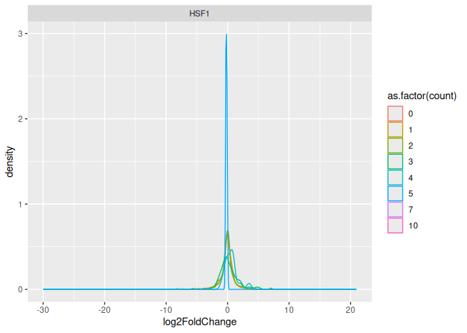<!-- -->

``` r
lsHeatmaps <- plotHeatmap(
  objectImpulseDE2       = objectImpulseDE2,
  strCondition           = "combined",
  boolIdentifyTransients = TRUE, #set to true if true above
  scaQThres              = 0.05)
draw(lsHeatmaps$complexHeatmapRaw) 
```

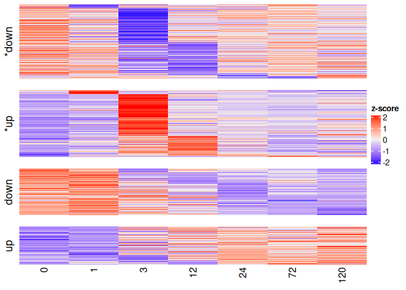<!-- -->

``` r
draw(lsHeatmaps$complexHeatmapFit) 
```

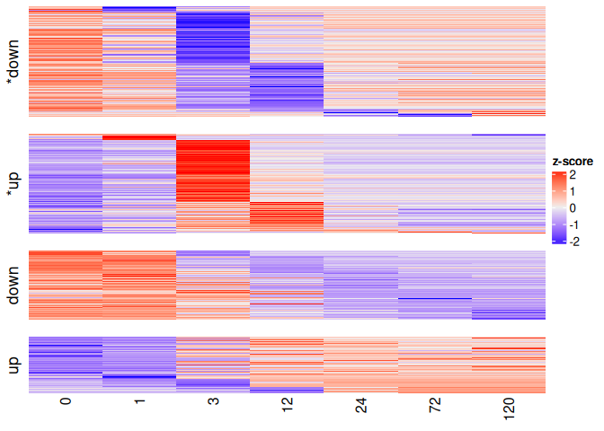<!-- -->

``` r
lsHeatmaps <- plotHeatmap(
  objectImpulseDE2       = objectImpulseDE2,
  strCondition           = "case",
  boolIdentifyTransients = TRUE, #set to true if true above
  scaQThres              = 0.05)
draw(lsHeatmaps$complexHeatmapRaw) 
```

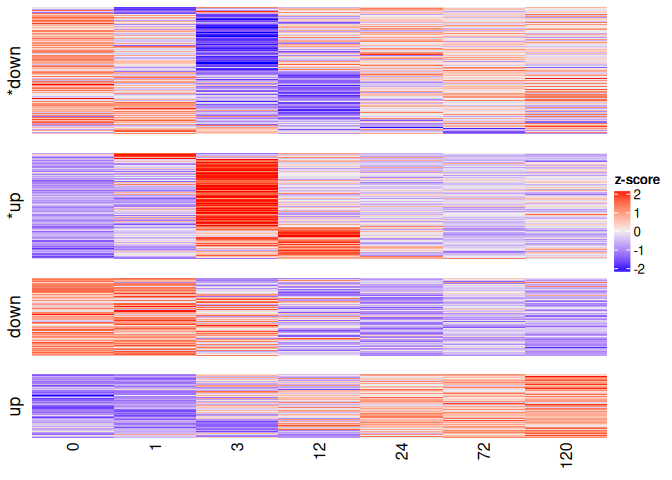<!-- -->

``` r
draw(lsHeatmaps$complexHeatmapFit) 
```

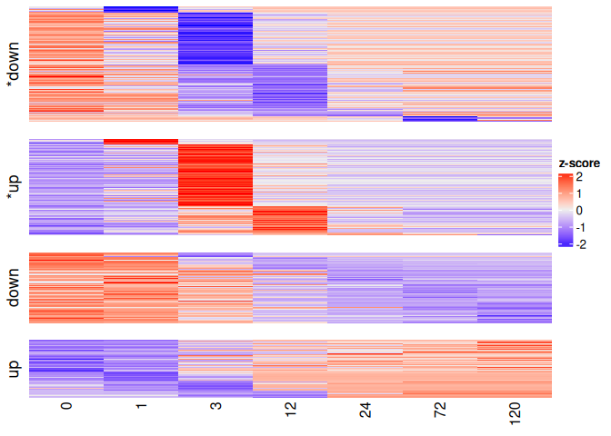<!-- -->

``` r
png(paste0(outdir,"/ImpulseDE/ImpulseDE2_heatmap.png"), width = 2000, height = 2400, res = 300)
draw(lsHeatmaps$complexHeatmapRaw)
dev.off()
```

    ## png 
    ##   2

``` r
png(paste0(outdir,"/ImpulseDE/ImpulseDE2_heatmap_fit.png"), width = 2000, height = 2400, res = 300)
draw(lsHeatmaps$complexHeatmapFit)
dev.off()
```

    ## png 
    ##   2

``` r
str(lsHeatmaps$lsvecGeneGroups)
```

    ## List of 4
    ##  $ transition_up  : chr [1:1360] "Pocillopora_acuta_HIv2___RNAseq.g27486.t1" "Pocillopora_acuta_HIv2___RNAseq.g27541.t1" "Pocillopora_acuta_HIv2___RNAseq.g27591.t1" "Pocillopora_acuta_HIv2___RNAseq.g27616.t1" ...
    ##  $ transition_down: chr [1:1702] "Pocillopora_acuta_HIv2___RNAseq.g27572.t1" "Pocillopora_acuta_HIv2___RNAseq.g27678.t1" "Pocillopora_acuta_HIv2___TS.g10629.t3" "Pocillopora_acuta_HIv2___RNAseq.g27943.t1" ...
    ##  $ transient_up   : chr [1:2283] "Pocillopora_acuta_HIv2___RNAseq.g27789.t1" "Pocillopora_acuta_HIv2___TS.g11181.t1" "Pocillopora_acuta_HIv2___RNAseq.1568_t" "Pocillopora_acuta_HIv2___RNAseq.g10404.t1" ...
    ##  $ transient_down : chr [1:2812] "Pocillopora_acuta_HIv2___RNAseq.g27542.t1" "Pocillopora_acuta_HIv2___TS.g10620.t1" "Pocillopora_acuta_HIv2___RNAseq.g28264.t1" "Pocillopora_acuta_HIv2___RNAseq.g28295.t1" ...

#### 6. Plot trajectories of top impulseDE genes and specific genes of interest

``` r
# Plot top 10 differentially expressed (by q-value) genes
lsgplotsGenes <- plotGenes(
  vecGeneIDs       = NULL,
  scaNTopIDs       = 10,
  objectImpulseDE2 = objectImpulseDE2,
  boolSimplePlot = TRUE,   boolCaseCtrl     = TRUE,
  dirOut           = paste0(outdir,"/ImpulseDE/"),
  boolMultiplePlotsPerPage = FALSE,
  strNameRefMethod = NULL)
```

    ## [1] "Creating ../output_RNA/differential_expression/POC_PacutaV2/ImpulseDE/ImpulseDE2_Trajectories.pdf"

``` r
lsgplotsGenes
```

    ## [[1]]

    ## 
    ## [[2]]

    ## 
    ## [[3]]

    ## 
    ## [[4]]

    ## 
    ## [[5]]

    ## 
    ## [[6]]

    ## 
    ## [[7]]

    ## 
    ## [[8]]

    ## 
    ## [[9]]

    ## 
    ## [[10]]

``` r
# Majerova 2021 key qPCR genes
majerova_genes <- HeatStressGenes %>% filter(ref_first_author =="Majerova")
stress_genes_ids <- unique(majerova_genes$query)
plot_stress_genes <- stress_genes_ids[stress_genes_ids %in% rownames(objectImpulseDE2@matCountDataProc)] 

impulse_results %>% filter(Gene %in% stress_genes_ids) %>% arrange(padj) %>% left_join(HeatStressGenes_unique, by = join_by(Gene==query))
```

    ##                                         Gene            p         padj
    ## 1  Pocillopora_acuta_HIv2___RNAseq.g23086.t1 1.205649e-25 1.966836e-23
    ## 2   Pocillopora_acuta_HIv2___RNAseq.g8390.t1 5.864485e-12 1.696933e-10
    ## 3   Pocillopora_acuta_HIv2___RNAseq.g7990.t1 8.705708e-08 1.170848e-06
    ## 4  Pocillopora_acuta_HIv2___RNAseq.g11741.t1 1.033821e-07 1.368452e-06
    ## 5   Pocillopora_acuta_HIv2___RNAseq.g7011.t1 1.943587e-05 1.513350e-04
    ## 6  Pocillopora_acuta_HIv2___RNAseq.g28750.t1 3.812607e-04 2.063197e-03
    ## 7   Pocillopora_acuta_HIv2___RNAseq.g1543.t1 4.439332e-04 2.351334e-03
    ## 8  Pocillopora_acuta_HIv2___RNAseq.g15654.t1 5.884784e-03 2.173575e-02
    ## 9  Pocillopora_acuta_HIv2___RNAseq.g19827.t1 1.071314e-02 3.576183e-02
    ## 10 Pocillopora_acuta_HIv2___RNAseq.g28257.t1 1.862649e-02 5.650858e-02
    ## 11     Pocillopora_acuta_HIv2___TS.g1420.t1c 2.089094e-01 3.966835e-01
    ## 12     Pocillopora_acuta_HIv2___TS.g11056.t1 3.148303e-01 5.433653e-01
    ## 13     Pocillopora_acuta_HIv2___TS.g22794.t1 9.824282e-01 1.000000e+00
    ##    loglik_full loglik_red df_full df_red        mean converge_combined
    ## 1    -226.7029  -290.0421      17     12    16.88214                 0
    ## 2    -311.9988  -342.7642      17     12  1516.79604                 0
    ## 3    -360.2671  -380.8476      17     12  2406.05959                 0
    ## 4    -338.8354  -359.2311      17     12  6737.69717                 0
    ## 5    -336.0962  -350.7914      17     12  3495.73645                 0
    ## 6    -398.1313  -409.4929      17     12 16580.59460                 0
    ## 7    -317.6602  -328.8485      17     12  1927.73258                 0
    ## 8    -382.6847  -390.8654      17     12 14536.36147                 0
    ## 9    -270.7317  -278.1913      17     12  1117.97938                 0
    ## 10   -343.8170  -350.5992      17     12  4267.53272                 0
    ## 11   -270.0951  -273.6758      17     12  1020.64181                 0
    ## 12   -228.0786  -231.0348      17     12   549.66866                 0
    ## 13   -310.1762  -310.5311      17     12  2539.03987                 0
    ##    converge_case converge_control converge_sigmoid impulseTOsigmoid_p
    ## 1              0                0                0       9.036014e-25
    ## 2              0                0                0       9.621245e-32
    ## 3              0                0                0       2.056098e-17
    ## 4              0                0                0       1.030922e-01
    ## 5              0                0                0       2.372638e-16
    ## 6              0                0                0       1.647502e-10
    ## 7              0                0                0       1.331483e-16
    ## 8              0                0                0       1.964108e-14
    ## 9              0                0                0       9.212830e-06
    ## 10             0                0                0       1.813011e-14
    ## 11             0                0                0       1.271732e-02
    ## 12             0                0                0       5.266291e-04
    ## 13             0                0                0       3.934446e-01
    ##    impulseTOsigmoid_padj sigmoidTOconst_p sigmoidTOconst_padj isTransient
    ## 1           5.234297e-23     1.273167e-50        3.525153e-48        TRUE
    ## 2           9.017676e-30     8.147251e-07        6.325805e-06        TRUE
    ## 3           6.125672e-16     2.328604e-10        3.079635e-09        TRUE
    ## 4           1.997638e-01     4.018418e-21        1.663592e-19       FALSE
    ## 5           6.342447e-15     6.502038e-01        9.643774e-01        TRUE
    ## 6           2.133975e-09     4.210250e-14        8.901608e-13        TRUE
    ## 7           3.656429e-15     4.110883e-01        7.020113e-01        TRUE
    ## 8           4.225002e-13     9.998479e-01        1.000000e+00        TRUE
    ## 9           5.623852e-05     8.444456e-06        5.435139e-05        TRUE
    ## 10          3.919532e-13     7.133615e-04        3.085304e-03        TRUE
    ## 11          3.517630e-02     2.643449e-02        7.456706e-02       FALSE
    ## 12          2.191323e-03     6.652087e-01        9.781719e-01       FALSE
    ## 13          5.639056e-01     2.546886e-01        4.865337e-01       FALSE
    ##    isMonotonous allZero     gene_id response_type     category
    ## 1         FALSE   FALSE HSP70,Hsc71         Type1          UPR
    ## 2         FALSE   FALSE       Bcl-2         Type1    Apoptosis
    ## 3         FALSE   FALSE        HSF1         Type1          UPR
    ## 4          TRUE   FALSE       Foxo3         Type1 ROS response
    ## 5         FALSE   FALSE       Bcl-2         Type1    Apoptosis
    ## 6         FALSE   FALSE   Nrf2,Nrf1         Type1 ROS response
    ## 7         FALSE   FALSE         BAX         Type1    Apoptosis
    ## 8         FALSE   FALSE        BI-1         Type1    Apoptosis
    ## 9         FALSE   FALSE        AMPK         Type1 ROS response
    ## 10        FALSE   FALSE       Bcl-2         Type1    Apoptosis
    ## 11        FALSE   FALSE        HO-1         Type1 ROS response
    ## 12        FALSE   FALSE         BAK         Type1    Apoptosis
    ## 13        FALSE   FALSE          GR         Type1 ROS response

``` r
heatgenes <- plotGenes(
  vecGeneIDs       = plot_stress_genes,
  objectImpulseDE2 = objectImpulseDE2,
  boolSimplePlot = TRUE,   boolCaseCtrl     = TRUE,
  dirOut           = paste0(outdir,"/ImpulseDE/"),
  strFileName = "stress_genes_Majerova.pdf",
  boolMultiplePlotsPerPage = FALSE,
  strNameRefMethod = NULL)
```

    ## [1] "Creating ../output_RNA/differential_expression/POC_PacutaV2/ImpulseDE/stress_genes_Majerova.pdf"

``` r
heatgenes
```

    ## [[1]]

    ## 
    ## [[2]]

    ## 
    ## [[3]]

    ## 
    ## [[4]]

    ## 
    ## [[5]]

    ## 
    ## [[6]]

    ## 
    ## [[7]]

    ## 
    ## [[8]]

    ## 
    ## [[9]]

    ## 
    ## [[10]]

    ## 
    ## [[11]]

    ## 
    ## [[12]]

    ## 
    ## [[13]]

``` r
# HSP genes
HSPS <- impulse_results %>% filter(Gene %in% stress_genes_ids) %>% arrange(padj) %>% left_join(HeatStressGenes_unique, by = join_by(Gene==query)) %>% filter(grepl("HSP",gene_id)) %>% pull(Gene)

HSPs <- plotGenes(
  vecGeneIDs       = HSPS,
  objectImpulseDE2 = objectImpulseDE2,
  boolSimplePlot = TRUE,
  boolCaseCtrl     = TRUE,
  dirOut           = paste0(outdir,"/ImpulseDE/"),
  strFileName = "HSPs.pdf",
  boolMultiplePlotsPerPage = FALSE,
  strNameRefMethod = NULL)
```

    ## [1] "Creating ../output_RNA/differential_expression/POC_PacutaV2/ImpulseDE/HSPs.pdf"

``` r
HSPs
```

    ## [[1]]

#### 7. Heatmap of top 500 impulseDE genes

``` r
top_500_DE_genes <- impulse_results %>% arrange(padj) %>% head(500) %>% rownames()

pheatmap(assay(vsd)[top_500_DE_genes, ], cluster_rows=TRUE, show_rownames=FALSE,
         cluster_cols=FALSE,
         annotation_col= meta[,c("treatment","time")],
         annotation_colors = list("treatment" = treat_colors,
                                  "time" = time_colors))
```

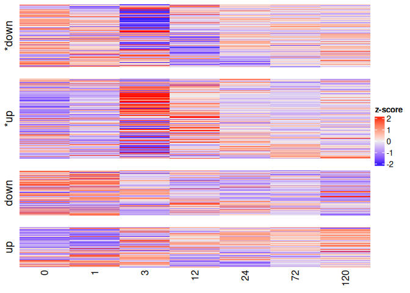<!-- -->

``` r
pheatmap(assay(vsd)[top_500_DE_genes, ], cluster_rows=TRUE, show_rownames=FALSE,
         cluster_cols=TRUE, cutree_cols = 2,
         annotation_col= meta[,c("treatment","time")],
         annotation_colors = list("treatment" = treat_colors,
                                  "time" = time_colors))
```

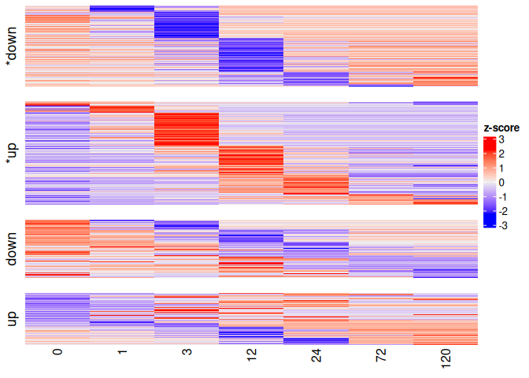<!-- -->

#### 8. Cluster ImpulseDE2-significant genes by trajectory

For this we will use the package
[Mfuzz](https://bioconductor.org/packages/release/bioc/html/Mfuzz.html),
[vignette
here](https://bioconductor.org/packages/release/bioc/vignettes/Mfuzz/inst/doc/Mfuzz.pdf).

``` r
#BiocManager::install("Mfuzz")
library(Mfuzz)
```

``` r
# analyze which of our ImpulseDE2 significant genes are in our vsd matrix
sum(impulse_sig_genes$Gene %in% rownames(vsd_mat))
```

    ## [1] 9710

``` r
length(impulse_sig_genes$Gene)
```

    ## [1] 9718

``` r
# which ones are missing? 
missing_genes <- impulse_sig_genes$Gene[!(impulse_sig_genes$Gene %in% rownames(vsd_mat))]

# 8 are missing and it is because they were filtered out during pOverA filtering -- as seen with rowSums below, each has fewer than 3 samples with a count >10

counts_raw[missing_genes,]
```

    ##                                           POC_R0_C1 POC_R0_C2 POC_R0_C3
    ## Pocillopora_acuta_HIv2___RNAseq.g24988.t1         0         0         0
    ## Pocillopora_acuta_HIv2___RNAseq.g25114.t1         2         2         3
    ## Pocillopora_acuta_HIv2___TS.g6083.t2              1         1         0
    ## Pocillopora_acuta_HIv2___TS.g6525.t1              1         0         0
    ## Pocillopora_acuta_HIv2___RNAseq.g8082.t1          2         2         5
    ## Pocillopora_acuta_HIv2___RNAseq.g517.t1           5         5         6
    ## Pocillopora_acuta_HIv2___TS.g18862.t1             0         0         0
    ## Pocillopora_acuta_HIv2___RNAseq.g8619.t1          9         6         5
    ##                                           POC_R0_H1 POC_R0_H2 POC_R0_H3
    ## Pocillopora_acuta_HIv2___RNAseq.g24988.t1         7         7         4
    ## Pocillopora_acuta_HIv2___RNAseq.g25114.t1         0         3         0
    ## Pocillopora_acuta_HIv2___TS.g6083.t2              0         1         1
    ## Pocillopora_acuta_HIv2___TS.g6525.t1              4         0         3
    ## Pocillopora_acuta_HIv2___RNAseq.g8082.t1          4         7         9
    ## Pocillopora_acuta_HIv2___RNAseq.g517.t1           6         6         5
    ## Pocillopora_acuta_HIv2___TS.g18862.t1            11         5         4
    ## Pocillopora_acuta_HIv2___RNAseq.g8619.t1          6         8         3
    ##                                           POC_R1_C1 POC_R1_C2 POC_R1_C3
    ## Pocillopora_acuta_HIv2___RNAseq.g24988.t1         0         6         4
    ## Pocillopora_acuta_HIv2___RNAseq.g25114.t1         2         2         2
    ## Pocillopora_acuta_HIv2___TS.g6083.t2              1         1         0
    ## Pocillopora_acuta_HIv2___TS.g6525.t1              4         1         2
    ## Pocillopora_acuta_HIv2___RNAseq.g8082.t1         12         5         6
    ## Pocillopora_acuta_HIv2___RNAseq.g517.t1           5         2         7
    ## Pocillopora_acuta_HIv2___TS.g18862.t1             4         3         1
    ## Pocillopora_acuta_HIv2___RNAseq.g8619.t1          4        11         0
    ##                                           POC_R1_H1 POC_R1_H2 POC_R1_H3
    ## Pocillopora_acuta_HIv2___RNAseq.g24988.t1         8         5         0
    ## Pocillopora_acuta_HIv2___RNAseq.g25114.t1         8         2         3
    ## Pocillopora_acuta_HIv2___TS.g6083.t2              1         1         1
    ## Pocillopora_acuta_HIv2___TS.g6525.t1              3         2         3
    ## Pocillopora_acuta_HIv2___RNAseq.g8082.t1          0         2        11
    ## Pocillopora_acuta_HIv2___RNAseq.g517.t1           6         5         6
    ## Pocillopora_acuta_HIv2___TS.g18862.t1             8         8         2
    ## Pocillopora_acuta_HIv2___RNAseq.g8619.t1          9         7         0
    ##                                           POC_R3_C1 POC_R3_C2 POC_R3_C3
    ## Pocillopora_acuta_HIv2___RNAseq.g24988.t1         0        10         0
    ## Pocillopora_acuta_HIv2___RNAseq.g25114.t1         1         2         3
    ## Pocillopora_acuta_HIv2___TS.g6083.t2              0         1         1
    ## Pocillopora_acuta_HIv2___TS.g6525.t1              5         2         1
    ## Pocillopora_acuta_HIv2___RNAseq.g8082.t1          6         4         9
    ## Pocillopora_acuta_HIv2___RNAseq.g517.t1          11         7         7
    ## Pocillopora_acuta_HIv2___TS.g18862.t1             3         1        10
    ## Pocillopora_acuta_HIv2___RNAseq.g8619.t1          0         4         6
    ##                                           POC_R3_H1 POC_R3_H2 POC_R3_H3
    ## Pocillopora_acuta_HIv2___RNAseq.g24988.t1        10        15         0
    ## Pocillopora_acuta_HIv2___RNAseq.g25114.t1         6         6         5
    ## Pocillopora_acuta_HIv2___TS.g6083.t2             10        59        35
    ## Pocillopora_acuta_HIv2___TS.g6525.t1              2         1         4
    ## Pocillopora_acuta_HIv2___RNAseq.g8082.t1          0         0         0
    ## Pocillopora_acuta_HIv2___RNAseq.g517.t1           0         0         0
    ## Pocillopora_acuta_HIv2___TS.g18862.t1             3         9         1
    ## Pocillopora_acuta_HIv2___RNAseq.g8619.t1          6         6         0
    ##                                           POC_R12_C1 POC_R12_C2 POC_R12_C3
    ## Pocillopora_acuta_HIv2___RNAseq.g24988.t1          0          0          0
    ## Pocillopora_acuta_HIv2___RNAseq.g25114.t1          0          0          0
    ## Pocillopora_acuta_HIv2___TS.g6083.t2               0          1          2
    ## Pocillopora_acuta_HIv2___TS.g6525.t1               4          0          8
    ## Pocillopora_acuta_HIv2___RNAseq.g8082.t1           9          6         10
    ## Pocillopora_acuta_HIv2___RNAseq.g517.t1            5          7         10
    ## Pocillopora_acuta_HIv2___TS.g18862.t1              5          5         12
    ## Pocillopora_acuta_HIv2___RNAseq.g8619.t1           3          5          1
    ##                                           POC_R12_H1 POC_R12_H2 POC_R12_H3
    ## Pocillopora_acuta_HIv2___RNAseq.g24988.t1          6          6          4
    ## Pocillopora_acuta_HIv2___RNAseq.g25114.t1          5          1          3
    ## Pocillopora_acuta_HIv2___TS.g6083.t2               1          0          2
    ## Pocillopora_acuta_HIv2___TS.g6525.t1               1          0          0
    ## Pocillopora_acuta_HIv2___RNAseq.g8082.t1           8          6          4
    ## Pocillopora_acuta_HIv2___RNAseq.g517.t1            3          7          3
    ## Pocillopora_acuta_HIv2___TS.g18862.t1              5          3          0
    ## Pocillopora_acuta_HIv2___RNAseq.g8619.t1           3          3          5
    ##                                           POC_R24_C1 POC_R24_C2 POC_R24_C3
    ## Pocillopora_acuta_HIv2___RNAseq.g24988.t1          4          7          3
    ## Pocillopora_acuta_HIv2___RNAseq.g25114.t1          0          0          0
    ## Pocillopora_acuta_HIv2___TS.g6083.t2               0          1          1
    ## Pocillopora_acuta_HIv2___TS.g6525.t1               2          1          0
    ## Pocillopora_acuta_HIv2___RNAseq.g8082.t1           3          5          7
    ## Pocillopora_acuta_HIv2___RNAseq.g517.t1            7          4         10
    ## Pocillopora_acuta_HIv2___TS.g18862.t1              2          3          2
    ## Pocillopora_acuta_HIv2___RNAseq.g8619.t1           0          0          0
    ##                                           POC_R24_H1 POC_R24_H2 POC_R24_H3
    ## Pocillopora_acuta_HIv2___RNAseq.g24988.t1          8          0          8
    ## Pocillopora_acuta_HIv2___RNAseq.g25114.t1          7          4          1
    ## Pocillopora_acuta_HIv2___TS.g6083.t2               1          1          1
    ## Pocillopora_acuta_HIv2___TS.g6525.t1               0          0          1
    ## Pocillopora_acuta_HIv2___RNAseq.g8082.t1           5          7          8
    ## Pocillopora_acuta_HIv2___RNAseq.g517.t1            7          6          9
    ## Pocillopora_acuta_HIv2___TS.g18862.t1              0          1          2
    ## Pocillopora_acuta_HIv2___RNAseq.g8619.t1           2          4          1
    ##                                           POC_R72_C1 POC_R72_C2 POC_R72_C3
    ## Pocillopora_acuta_HIv2___RNAseq.g24988.t1          4         12         10
    ## Pocillopora_acuta_HIv2___RNAseq.g25114.t1          0          4          3
    ## Pocillopora_acuta_HIv2___TS.g6083.t2               0          0          0
    ## Pocillopora_acuta_HIv2___TS.g6525.t1               3          7          2
    ## Pocillopora_acuta_HIv2___RNAseq.g8082.t1           3          9          9
    ## Pocillopora_acuta_HIv2___RNAseq.g517.t1            5          6          2
    ## Pocillopora_acuta_HIv2___TS.g18862.t1              3          9          2
    ## Pocillopora_acuta_HIv2___RNAseq.g8619.t1           4          3          3
    ##                                           POC_R72_H1 POC_R72_H2 POC_R72_H3
    ## Pocillopora_acuta_HIv2___RNAseq.g24988.t1          0          0          0
    ## Pocillopora_acuta_HIv2___RNAseq.g25114.t1          4          1          3
    ## Pocillopora_acuta_HIv2___TS.g6083.t2               1          1          0
    ## Pocillopora_acuta_HIv2___TS.g6525.t1               0          0          0
    ## Pocillopora_acuta_HIv2___RNAseq.g8082.t1           7          3          3
    ## Pocillopora_acuta_HIv2___RNAseq.g517.t1            0          2          7
    ## Pocillopora_acuta_HIv2___TS.g18862.t1              4          2          0
    ## Pocillopora_acuta_HIv2___RNAseq.g8619.t1           0          0          0
    ##                                           POC_R120_C1 POC_R120_C2 POC_R120_C3
    ## Pocillopora_acuta_HIv2___RNAseq.g24988.t1           0           3           3
    ## Pocillopora_acuta_HIv2___RNAseq.g25114.t1           5           2           1
    ## Pocillopora_acuta_HIv2___TS.g6083.t2                1           1           1
    ## Pocillopora_acuta_HIv2___TS.g6525.t1                1           0           0
    ## Pocillopora_acuta_HIv2___RNAseq.g8082.t1            5           4           9
    ## Pocillopora_acuta_HIv2___RNAseq.g517.t1             8           9           0
    ## Pocillopora_acuta_HIv2___TS.g18862.t1               3           8           2
    ## Pocillopora_acuta_HIv2___RNAseq.g8619.t1            5           0           6
    ##                                           POC_R120_H1 POC_R120_H2 POC_R120_H3
    ## Pocillopora_acuta_HIv2___RNAseq.g24988.t1           0           3           6
    ## Pocillopora_acuta_HIv2___RNAseq.g25114.t1           3           4           6
    ## Pocillopora_acuta_HIv2___TS.g6083.t2                1           1           1
    ## Pocillopora_acuta_HIv2___TS.g6525.t1                0           0           0
    ## Pocillopora_acuta_HIv2___RNAseq.g8082.t1            5           6           2
    ## Pocillopora_acuta_HIv2___RNAseq.g517.t1             4           4          10
    ## Pocillopora_acuta_HIv2___TS.g18862.t1               1           0           0
    ## Pocillopora_acuta_HIv2___RNAseq.g8619.t1            2           4           0

``` r
impulse_sig_genes[missing_genes,]
```

    ##                                                                                Gene
    ## Pocillopora_acuta_HIv2___RNAseq.g24988.t1 Pocillopora_acuta_HIv2___RNAseq.g24988.t1
    ## Pocillopora_acuta_HIv2___RNAseq.g25114.t1 Pocillopora_acuta_HIv2___RNAseq.g25114.t1
    ## Pocillopora_acuta_HIv2___TS.g6083.t2           Pocillopora_acuta_HIv2___TS.g6083.t2
    ## Pocillopora_acuta_HIv2___TS.g6525.t1           Pocillopora_acuta_HIv2___TS.g6525.t1
    ## Pocillopora_acuta_HIv2___RNAseq.g8082.t1   Pocillopora_acuta_HIv2___RNAseq.g8082.t1
    ## Pocillopora_acuta_HIv2___RNAseq.g517.t1     Pocillopora_acuta_HIv2___RNAseq.g517.t1
    ## Pocillopora_acuta_HIv2___TS.g18862.t1         Pocillopora_acuta_HIv2___TS.g18862.t1
    ## Pocillopora_acuta_HIv2___RNAseq.g8619.t1   Pocillopora_acuta_HIv2___RNAseq.g8619.t1
    ##                                                      p        padj loglik_full
    ## Pocillopora_acuta_HIv2___RNAseq.g24988.t1 0.0039094717 0.015341029   -90.22438
    ## Pocillopora_acuta_HIv2___RNAseq.g25114.t1 0.0021180548 0.009103232   -72.12994
    ## Pocillopora_acuta_HIv2___TS.g6083.t2      0.0018758413 0.008181053   -52.90157
    ## Pocillopora_acuta_HIv2___TS.g6525.t1      0.0134332306 0.043097151   -59.68394
    ## Pocillopora_acuta_HIv2___RNAseq.g8082.t1  0.0076825983 0.027036009   -95.48470
    ## Pocillopora_acuta_HIv2___RNAseq.g517.t1   0.0118539770 0.038852414   -96.98523
    ## Pocillopora_acuta_HIv2___TS.g18862.t1     0.0002083791 0.001215948   -79.99205
    ## Pocillopora_acuta_HIv2___RNAseq.g8619.t1  0.0114374278 0.037770169   -85.62440
    ##                                           loglik_red df_full df_red      mean
    ## Pocillopora_acuta_HIv2___RNAseq.g24988.t1  -98.89095      17     12 1.0899684
    ## Pocillopora_acuta_HIv2___RNAseq.g25114.t1  -81.51668      17     12 1.3128410
    ## Pocillopora_acuta_HIv2___TS.g6083.t2       -62.42999      17     12 0.4031693
    ## Pocillopora_acuta_HIv2___TS.g6525.t1       -66.86795      17     12 2.8211754
    ## Pocillopora_acuta_HIv2___RNAseq.g8082.t1  -103.34596      17     12 5.5355091
    ## Pocillopora_acuta_HIv2___RNAseq.g517.t1   -104.32183      17     12 6.2594712
    ## Pocillopora_acuta_HIv2___TS.g18862.t1      -92.03844      17     12 2.7739904
    ## Pocillopora_acuta_HIv2___RNAseq.g8619.t1   -93.00453      17     12 3.3941360
    ##                                           converge_combined converge_case
    ## Pocillopora_acuta_HIv2___RNAseq.g24988.t1                 0             0
    ## Pocillopora_acuta_HIv2___RNAseq.g25114.t1                 0             0
    ## Pocillopora_acuta_HIv2___TS.g6083.t2                      0             0
    ## Pocillopora_acuta_HIv2___TS.g6525.t1                      0             0
    ## Pocillopora_acuta_HIv2___RNAseq.g8082.t1                  0             0
    ## Pocillopora_acuta_HIv2___RNAseq.g517.t1                   0             0
    ## Pocillopora_acuta_HIv2___TS.g18862.t1                     0             0
    ## Pocillopora_acuta_HIv2___RNAseq.g8619.t1                  0             0
    ##                                           converge_control converge_sigmoid
    ## Pocillopora_acuta_HIv2___RNAseq.g24988.t1                0                0
    ## Pocillopora_acuta_HIv2___RNAseq.g25114.t1                0                0
    ## Pocillopora_acuta_HIv2___TS.g6083.t2                     0                0
    ## Pocillopora_acuta_HIv2___TS.g6525.t1                     0                0
    ## Pocillopora_acuta_HIv2___RNAseq.g8082.t1                 0                0
    ## Pocillopora_acuta_HIv2___RNAseq.g517.t1                  0                0
    ## Pocillopora_acuta_HIv2___TS.g18862.t1                    0                0
    ## Pocillopora_acuta_HIv2___RNAseq.g8619.t1                 0                0
    ##                                           impulseTOsigmoid_p
    ## Pocillopora_acuta_HIv2___RNAseq.g24988.t1       2.602942e-02
    ## Pocillopora_acuta_HIv2___RNAseq.g25114.t1       5.948662e-02
    ## Pocillopora_acuta_HIv2___TS.g6083.t2            2.183896e-09
    ## Pocillopora_acuta_HIv2___TS.g6525.t1            7.035202e-01
    ## Pocillopora_acuta_HIv2___RNAseq.g8082.t1        7.744185e-04
    ## Pocillopora_acuta_HIv2___RNAseq.g517.t1         8.429851e-04
    ## Pocillopora_acuta_HIv2___TS.g18862.t1           3.177501e-01
    ## Pocillopora_acuta_HIv2___RNAseq.g8619.t1        5.042968e-02
    ##                                           impulseTOsigmoid_padj
    ## Pocillopora_acuta_HIv2___RNAseq.g24988.t1          6.468206e-02
    ## Pocillopora_acuta_HIv2___RNAseq.g25114.t1          1.281659e-01
    ## Pocillopora_acuta_HIv2___TS.g6083.t2               2.412518e-08
    ## Pocillopora_acuta_HIv2___TS.g6525.t1               8.525634e-01
    ## Pocillopora_acuta_HIv2___RNAseq.g8082.t1           3.076066e-03
    ## Pocillopora_acuta_HIv2___RNAseq.g517.t1            3.311374e-03
    ## Pocillopora_acuta_HIv2___TS.g18862.t1              4.817008e-01
    ## Pocillopora_acuta_HIv2___RNAseq.g8619.t1           1.119506e-01
    ##                                           sigmoidTOconst_p sigmoidTOconst_padj
    ## Pocillopora_acuta_HIv2___RNAseq.g24988.t1     7.164121e-01        1.000000e+00
    ## Pocillopora_acuta_HIv2___RNAseq.g25114.t1     9.958419e-01        1.000000e+00
    ## Pocillopora_acuta_HIv2___TS.g6083.t2          6.845509e-08        6.317966e-07
    ## Pocillopora_acuta_HIv2___TS.g6525.t1          5.917554e-03        2.031761e-02
    ## Pocillopora_acuta_HIv2___RNAseq.g8082.t1      5.452880e-01        8.605759e-01
    ## Pocillopora_acuta_HIv2___RNAseq.g517.t1       7.551148e-01        1.000000e+00
    ## Pocillopora_acuta_HIv2___TS.g18862.t1         8.532836e-03        2.801882e-02
    ## Pocillopora_acuta_HIv2___RNAseq.g8619.t1      1.337476e-01        2.913811e-01
    ##                                           isTransient isMonotonous allZero
    ## Pocillopora_acuta_HIv2___RNAseq.g24988.t1       FALSE        FALSE   FALSE
    ## Pocillopora_acuta_HIv2___RNAseq.g25114.t1       FALSE        FALSE   FALSE
    ## Pocillopora_acuta_HIv2___TS.g6083.t2             TRUE        FALSE   FALSE
    ## Pocillopora_acuta_HIv2___TS.g6525.t1            FALSE        FALSE   FALSE
    ## Pocillopora_acuta_HIv2___RNAseq.g8082.t1        FALSE        FALSE   FALSE
    ## Pocillopora_acuta_HIv2___RNAseq.g517.t1         FALSE        FALSE   FALSE
    ## Pocillopora_acuta_HIv2___TS.g18862.t1           FALSE        FALSE   FALSE
    ## Pocillopora_acuta_HIv2___RNAseq.g8619.t1        FALSE        FALSE   FALSE

``` r
rowSums(counts_raw[missing_genes,] > 10)
```

    ## Pocillopora_acuta_HIv2___RNAseq.g24988.t1 
    ##                                         2 
    ## Pocillopora_acuta_HIv2___RNAseq.g25114.t1 
    ##                                         0 
    ##      Pocillopora_acuta_HIv2___TS.g6083.t2 
    ##                                         2 
    ##      Pocillopora_acuta_HIv2___TS.g6525.t1 
    ##                                         0 
    ##  Pocillopora_acuta_HIv2___RNAseq.g8082.t1 
    ##                                         2 
    ##   Pocillopora_acuta_HIv2___RNAseq.g517.t1 
    ##                                         1 
    ##     Pocillopora_acuta_HIv2___TS.g18862.t1 
    ##                                         2 
    ##  Pocillopora_acuta_HIv2___RNAseq.g8619.t1 
    ##                                         1

``` r
impulse_sig_genes_transient <- impulse_sig_genes %>% filter(isTransient==TRUE)
impulse_sig_genes_mat <- vsd_mat[rownames(vsd_mat) %in% impulse_sig_genes_transient$Gene,]

heat <- impulse_sig_genes_mat %>% as.data.frame %>% select(contains("_H"))

# average values together across replicates
heat_avg <- heat %>%
  rowwise() %>%
  mutate(
    R0 = mean(c_across(starts_with("POC_R0"))),
    R1 = mean(c_across(starts_with("POC_R1"))),
    R3 = mean(c_across(starts_with("POC_R3"))),
    R12 = mean(c_across(starts_with("POC_R12"))),
    R24 = mean(c_across(starts_with("POC_R24"))),
    R72 = mean(c_across(starts_with("POC_R72"))),
    R120 = mean(c_across(starts_with("POC_R120")))
  ) %>%
  select(R0, R1, R3, R12, R24, R72, R120)

rownames(heat_avg) <- rownames(heat)

heat_eset <- ExpressionSet(assayData = as.matrix(heat_avg))
heat_eset <- standardise(heat_eset) 
```

For fuzzy c-means clustering, the fuzzifier m and the number of clusters
c has to be chosen in advance

``` r
# Determine fuzzifier
m <- mestimate(heat_eset)

# Choose optimal cluster number
#Dmin(heat_eset, m = m, repeats = 3)
optimal_c <- 6

# Run Mfuzz clustering
mfuzz_clusters <- mfuzz(heat_eset, c = optimal_c, m = m)

mfuzz.plot(heat_eset, cl = mfuzz_clusters, new.window =FALSE, mfrow = c(3,3), time.labels =  c(0,1,3,12,24,72,120))

# Visualize clusters
pdf(paste0(outdir,"/temporal_clusters.pdf"), width = 12, height = 10)
mfuzz.plot2(heat_eset, cl = mfuzz_clusters, mfrow = c(3, 4), 
            time.labels = c("0", "1", "3", "12", "24", "72", "120"),
            xlab = "Time (hours)",x11=FALSE)
dev.off()
```

    ## png 
    ##   2

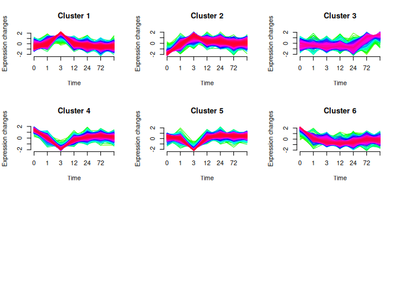<!-- -->

``` r
cluster2 <- plotGenes(
  vecGeneIDs       = head(names(mfuzz_clusters$cluster)[mfuzz_clusters$cluster==2],5),
  objectImpulseDE2 = objectImpulseDE2,
  boolSimplePlot = TRUE,
  boolCaseCtrl     = TRUE,
  dirOut           = paste0(outdir,"/ImpulseDE/"),
  strFileName = "cluster2.pdf",
  boolMultiplePlotsPerPage = FALSE,
  strNameRefMethod = NULL)
```

    ## [1] "Creating ../output_RNA/differential_expression/POC_PacutaV2/ImpulseDE/cluster2.pdf"

``` r
cluster2
```

    ## [[1]]

    ## 
    ## [[2]]

    ## 
    ## [[3]]

    ## 
    ## [[4]]

    ## 
    ## [[5]]

``` r
cluster3 <- plotGenes(
  vecGeneIDs       = head(names(mfuzz_clusters$cluster)[mfuzz_clusters$cluster==3],5),
  objectImpulseDE2 = objectImpulseDE2,
  boolSimplePlot = TRUE,
  boolCaseCtrl     = TRUE,
  dirOut           = paste0(outdir,"/ImpulseDE/"),
  strFileName = "cluster3.pdf",
  boolMultiplePlotsPerPage = FALSE,
  strNameRefMethod = NULL)
```

    ## [1] "Creating ../output_RNA/differential_expression/POC_PacutaV2/ImpulseDE/cluster3.pdf"

``` r
cluster3
```

    ## [[1]]

    ## 
    ## [[2]]

    ## 
    ## [[3]]

    ## 
    ## [[4]]

    ## 
    ## [[5]]

``` r
# Extract cluster assignments
cluster_assignments <- data.frame(
  gene = names(mfuzz_clusters$cluster),
  cluster = mfuzz_clusters$cluster,
  membership = apply(mfuzz_clusters$membership, 1, max)
)

# Get cluster centers (average trajectory)
cluster_centers <- mfuzz_clusters$centers

# Identify peak timepoint for each cluster
peak_times <- apply(cluster_centers, 1, which.max)
timepoints <- c(0, 1, 3, 12, 24, 72, 120)
cluster_peaks <- data.frame(
  cluster = 1:optimal_c,
  peak_time = timepoints[peak_times])

print(cluster_peaks)
```

    ##   cluster peak_time
    ## 1       1         3
    ## 2       2         3
    ## 3       3       120
    ## 4       4         0
    ## 5       5        24
    ## 6       6         0

``` r
HSPS <- impulse_results %>% filter(Gene %in% stress_genes_ids) %>% arrange(padj) %>% left_join(HeatStressGenes_unique, by = join_by(Gene==query)) %>% filter(grepl("HSP",gene_id)) %>% pull(Gene)

cluster_assignments %>% filter(gene %in% HSPS)
```

    ##                                                                                gene
    ## Pocillopora_acuta_HIv2___RNAseq.g23086.t1 Pocillopora_acuta_HIv2___RNAseq.g23086.t1
    ##                                           cluster membership
    ## Pocillopora_acuta_HIv2___RNAseq.g23086.t1       1  0.9177708

``` r
heat_clustered <- HeatStressGenes_unique %>% left_join(cluster_assignments, by = join_by(query==gene)) %>%
  arrange(cluster, desc(cluster))

# plot this to show which genes are in which cluster
heat_clustered %>% filter(!is.na(cluster)) %>% ggplot(aes(y=reorder(gene_id, cluster), x=factor(cluster), fill=cluster)) +
  geom_tile() +
  theme_bw() +
  labs(x="Gene ID", y="Mfuzz Cluster", title="Heat stress genes clustered by temporal expression pattern")
```

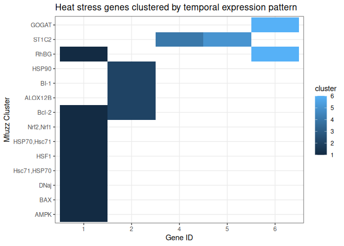<!-- -->

## MON: pre-processing and visualization

Read in raw count data

``` r
#set standard output directory for figures
outdir <- "../output_RNA/differential_expression/MON_MCapV3"

counts_raw <- read.csv("../output_RNA/count_matrices/MON_MCapV3_gene_count_matrix.csv", row.names = 1) #load in data

samples <- colnames(counts_raw)
```

Read in metadata

``` r
meta <- data.frame(
  sample = samples, 
  species = str_split(samples, "_", simplify = TRUE)[,1], #extract first part of sample name to get species
  time = str_replace(str_split(samples, "_", simplify = TRUE)[,2],"R", ""), #extract "R##" part to get timepoint then remove R
  replicate = str_split(samples, "_", simplify = TRUE)[,3], #extract "R##" part to get timepoint then remove R
  treatment = str_replace(str_split(samples, "_", simplify = TRUE)[,3],"\\d", "")
)

rownames(meta) <- meta$sample

meta$time <- factor(meta$time, levels = as.character(sort(unique(as.numeric(meta$time)))))
meta$treatment <- factor(meta$treatment)

meta <- meta %>% arrange(time, treatment)
write.csv(meta, paste0(outdir,"/RNA_seq_metadata.csv"))
```

Reorder sample columns based on factor order

``` r
counts_raw <- counts_raw[, meta$sample]
```

Remove outliers:

``` r
counts_raw <- counts_raw[, !(colnames(counts_raw) %in% c("MON_R72_H1","MON_R72_H2"))]
meta <- meta[!(rownames(meta) %in% c("MON_R72_H1","MON_R72_H2")),]
```

Data sanity checks!

``` r
stopifnot(all(meta$sample %in% colnames(counts_raw))) #are all of the sample names in the metadata column names in the gene count matrix?
stopifnot(all(meta$sample == colnames(counts_raw))) #are they the same in the same order?
```

pOverA filtering to reduce dataset

``` r
ffun<-filterfun(pOverA(0.07,10))  # Keep genes expressed at 10+ counts in at least 7% of samples - expressed in all 3 samples at one timepoint from one treatment
counts_filt_poa <- genefilter((counts_raw), ffun) #apply filter

filtered_counts <- counts_raw[counts_filt_poa,] #keep only rows that passed filter

paste0("Number of genes after filtering: ", sum(counts_filt_poa))
```

    ## [1] "Number of genes after filtering: 30089"

``` r
write.csv(filtered_counts, file = file.path(outdir, "filtered_counts.csv"))
```

### [DESeq2](https://www.bioconductor.org/packages/release/bioc/vignettes/DESeq2/inst/doc/DESeq2.html)

Create DESeq object and run DESeq2

``` r
dds <- DESeqDataSetFromMatrix(countData = filtered_counts,
                              colData = meta,
                              design= ~ treatment + time + treatment:time)

dds <- DESeq(dds)
```

Check size factors.

``` r
SF.dds <- estimateSizeFactors(dds) #estimate size factors to determine if we can use vst  to transform our data. Size factors should be less than 4 for us to use vst
print(sizeFactors(SF.dds)) #View size factors
```

    ##   MON_R0_C1   MON_R0_C2   MON_R0_C3   MON_R0_H1   MON_R0_H2   MON_R0_H3 
    ##   2.1094335   0.9463374   1.0690971   1.3170480   1.5587529   1.0888544 
    ##   MON_R1_C1   MON_R1_C2   MON_R1_C3   MON_R1_H1   MON_R1_H2   MON_R1_H3 
    ##   1.0357805   1.0829338   1.2185597   0.7527752   0.9017303   0.9159839 
    ##   MON_R3_C1   MON_R3_C2   MON_R3_C3   MON_R3_H1   MON_R3_H2   MON_R3_H3 
    ##   1.0601390   0.8939502   1.0031709   0.6966089   1.1896652   0.7107221 
    ##  MON_R12_C1  MON_R12_C2  MON_R12_C3  MON_R12_H1  MON_R12_H2  MON_R12_H3 
    ##   0.9459142   0.9588396   1.1063628   0.6356368   0.9103193   0.8089286 
    ##  MON_R24_C1  MON_R24_C2  MON_R24_C3  MON_R24_H1  MON_R24_H2  MON_R24_H3 
    ##   0.9927572   1.0112260   1.1280895   1.0996072   0.8861458   0.6973926 
    ##  MON_R72_C1  MON_R72_C2  MON_R72_C3  MON_R72_H3 MON_R120_C1 MON_R120_C2 
    ##   0.9598847   0.9675785   1.3366416   0.9064791   1.1648070   1.0167688 
    ## MON_R120_C3 MON_R120_H1 MON_R120_H2 MON_R120_H3 
    ##   1.1313671   0.9501645   1.4756437   0.9679888

``` r
all(sizeFactors(SF.dds)) < 4
```

    ## [1] TRUE

Transforming count data for visualization

``` r
vsd <- vst(dds, blind=FALSE)

#save the vsd transformation
vsd_mat <- assay(vsd)
write.csv(vsd_mat, file = file.path(outdir, "vsd_expression_matrix.csv"))
```

### Heatmap of the sample-to-sample distances

``` r
sampleDists <- dist(t(assay(vsd)))

sampleDistMatrix <- as.matrix(sampleDists)
colnames(sampleDistMatrix) <- NULL

pheatmap(sampleDistMatrix,
         col=colorRampPalette( rev(brewer.pal(9, "Blues")) )(255))
```

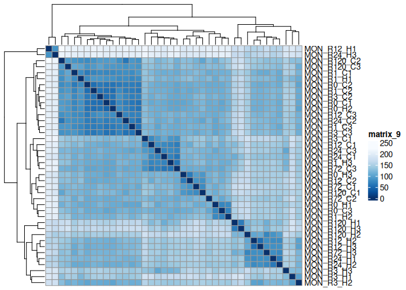<!-- -->

### Principal component plot of the samples

``` r
pcaData <- plotPCA(vsd, intgroup=c("time", "treatment"), returnData=TRUE)

percentVar <- round(100 * attr(pcaData, "percentVar"))
PCA <- ggplot() +
  geom_point(data = subset(pcaData, treatment == "C"),
             aes(x=PC1, y=PC2, color=time),
                 size=2) +
             scale_color_manual(values=brewer.pal(7, "Blues"), name = "Time (hrs) - Control") +
  
  #start new scale
  ggnewscale::new_scale_color() +
  geom_point(data = subset(pcaData, treatment == "H"),
             aes(x=PC1, y=PC2, color=time),
                 size=2) +
             scale_color_manual(values=brewer.pal(7, "Oranges"), name = "Time (hrs) - Heat") +

  xlab(paste0("PC1: ",percentVar[1],"% variance")) +
  ylab(paste0("PC2: ",percentVar[2],"% variance")) + 
  coord_fixed() + theme_bw()
PCA
```

<!-- -->

``` r
save_ggplot(PCA, "PCA_MON")
```

### Heatmap of count matrix

``` r
topVarGenes <- head(order(rowVars(assay(vsd)), decreasing=TRUE), 500)

time_colors <- colorRampPalette(c("#ffffcc","#0c2c84"))(7)
names(time_colors) <- levels(meta$time)

#view top 500 most vairable genes
pheatmap(assay(vsd)[topVarGenes, ], cluster_rows=TRUE, show_rownames=FALSE,
         cluster_cols=FALSE, 
         annotation_col= meta[,c("treatment","time")],
         annotation_colors = list("treatment" = treat_colors,
                                  "time" = time_colors))
```

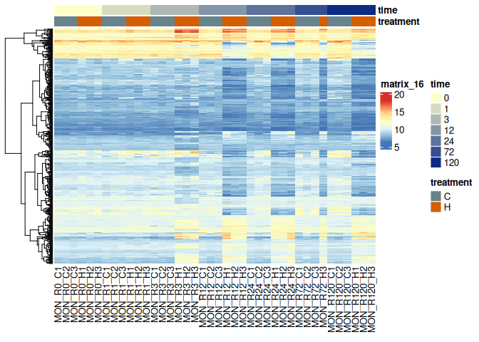<!-- -->

``` r
pheatmap(assay(vsd)[topVarGenes, ], cluster_rows=TRUE, show_rownames=FALSE,
         cluster_cols=TRUE, cutree_cols = 2,
         annotation_col= meta[,c("treatment","time")],
         annotation_colors = list("treatment" = treat_colors,
                                  "time" = time_colors))
```

<!-- -->

### Heat stress genes

``` r
HeatStressGenes_Mcap <- read_csv("/project/pi_hputnam_uri_edu/zdellaert/snRNA_analysis/multi-sp-snRNA/reference_genes/genes_of_interest/HeatStressGenes_Mcap.csv") %>% dplyr::select(-1) %>% dplyr::rename(query = Mcap_gene) %>% dplyr::select(query,everything()) #%>% filter(ref_first_author =="Majerova")

HeatStressGenes_Mcap_unique <- HeatStressGenes_Mcap %>% group_by(query) %>%
  summarize(gene_id = paste(unique(gene_id), collapse = ","),
            response_type = paste(unique(response_type), collapse = ","),
            category = paste(unique(category), collapse = ",")
            ) 

HeatStressGenes_Mcap_unique <- HeatStressGenes_Mcap_unique %>% filter(query %in% rownames(vsd_mat))
 
stress_genes_ids <- unique(HeatStressGenes_Mcap_unique$query) 
stress_genes_vsd <- vsd_mat[stress_genes_ids, ]

plot_df <- as.data.frame(t(stress_genes_vsd)) %>%
  rownames_to_column(var="sample") %>%
  left_join(meta, by=c("sample"="sample")) %>%
  pivot_longer(cols = all_of(stress_genes_ids), names_to="query", values_to="expression") %>%
  left_join(HeatStressGenes_Mcap_unique)

plot_df %>% ggplot(aes(x=time, y=expression, color=gene_id, group=gene_id)) +
  stat_summary(fun="mean", geom="line") +
  stat_summary(fun.data=mean_se, geom="errorbar", width=0.2) +
  facet_wrap(treatment~response_type) +
  theme_bw() +
  labs(y="VST expression", x="Timepoint")
```

<!-- -->

``` r
plot_df %>% filter(grepl("Type1", response_type)) %>%
  ggplot(aes(x=time, y=expression, color=treatment, group=interaction(treatment,query))) +
  stat_summary(fun="mean", geom="line", alpha=0.6) +
  stat_summary(fun.data=mean_se, geom="errorbar", width=0.2,linewidth=0.5, alpha=0.6) +
  scale_color_manual(values = treat_colors) +
  facet_wrap(~gene_id, ncol= 3,scales="free_y") +
  theme_bw() +
  theme(
    strip.text = element_text(face="bold", size=8),panel.spacing = unit(0.4, "lines")
  ) +
  labs(y="VST expression", x="Timepoint", title = "Type 1 Expressed Response genes")
```

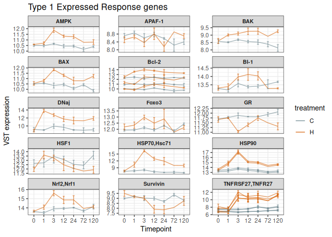<!-- -->

``` r
save_ggplot(last_plot(), "All_Type1")

plot_df %>% filter(grepl("Type2", response_type)) %>%
  ggplot(aes(x=time, y=expression, color=treatment, group=interaction(treatment,query))) +
  stat_summary(fun="mean", geom="line", alpha=0.6) +
  stat_summary(fun.data=mean_se, geom="errorbar", width=0.2,linewidth=0.5, alpha=0.6) +
  scale_color_manual(values = treat_colors) +
  facet_wrap(~gene_id, ncol= 3,scales="free_y") +
  theme_bw() +
  theme(
    strip.text = element_text(face="bold", size=8),panel.spacing = unit(0.4, "lines")
  ) +
  labs(y="VST expression", x="Timepoint", title = "Type 2 Expressed Response genes")
```

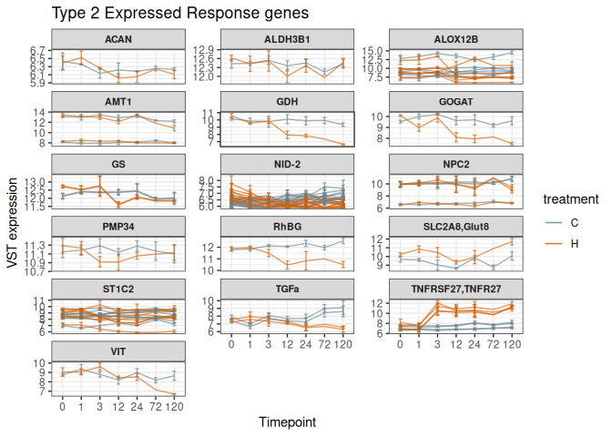<!-- -->

``` r
save_ggplot(last_plot(), "All_Type2")

plot_df %>% filter(grepl("HSP",gene_id)|grepl("Nrf2",gene_id)|grepl("HSF1",gene_id)) %>% ggplot(aes(x=time, y=expression, color=treatment, group=treatment)) +
  stat_summary(fun="mean", geom="line") +
  scale_color_manual(values = treat_colors) +
  stat_summary(fun.data=mean_se, geom="errorbar", width=0.2) +
  facet_wrap(~paste0(str_replace(query,"Montipora_capitata_HIv3___",""), ": ", gene_id)) +
  theme_bw() +
  labs(y="VST expression", x="Timepoint")
```

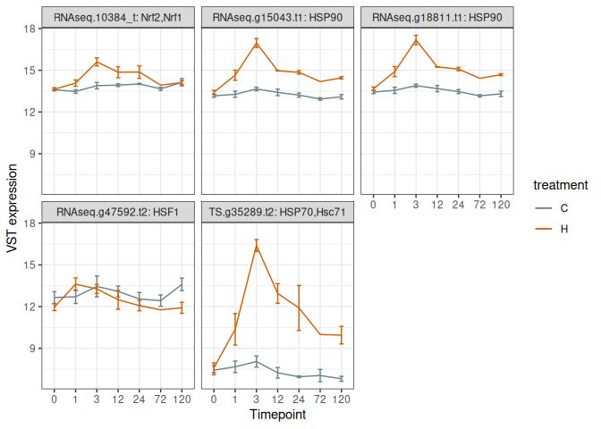<!-- -->

### DESeq LRT Test

``` r
dds <- DESeqDataSetFromMatrix(countData = filtered_counts,
                              colData = meta,
                              design= ~ treatment + time + treatment:time)

dds <- DESeq(dds, test = "LRT", reduced = ~ treatment + time)

res <- results(dds)
sig_genes <- subset(res, padj < 0.05)
lrt_res <- as.data.frame(res)

DE_05 <- lrt_res[rownames(lrt_res %>% filter(padj<0.05)),]

time_colors <- colorRampPalette(c("#ffffcc","#0c2c84"))(7)
names(time_colors) <- levels(meta$time)

top_500_DE_genes <- DE_05 %>% arrange(padj) %>% head(500) %>% rownames()

#view top 500 most vairable genes
pheatmap(assay(vsd)[top_500_DE_genes, ], cluster_rows=TRUE, show_rownames=FALSE,
         cluster_cols=FALSE, 
         annotation_col= meta[,c("treatment","time")],
         annotation_colors = list("treatment" = treat_colors,
                                  "time" = time_colors))
```

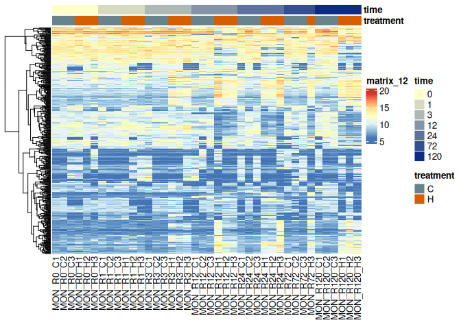<!-- -->

``` r
pheatmap(assay(vsd)[top_500_DE_genes, ], cluster_rows=TRUE, show_rownames=FALSE,
         cluster_cols=TRUE, cutree_cols = 2,
         annotation_col= meta[,c("treatment","time")],
         annotation_colors = list("treatment" = treat_colors,
                                  "time" = time_colors))
```

<!-- -->

``` r
top_500_DE_genes <- DE_05 %>% arrange(log2FoldChange) %>% head(500) %>% rownames()

#view top 500 most vairable genes
pheatmap(assay(vsd)[top_500_DE_genes, ], cluster_rows=TRUE, show_rownames=FALSE,
         cluster_cols=FALSE,
         annotation_col= meta[,c("treatment","time")],
         annotation_colors = list("treatment" = treat_colors,
                                  "time" = time_colors))
```

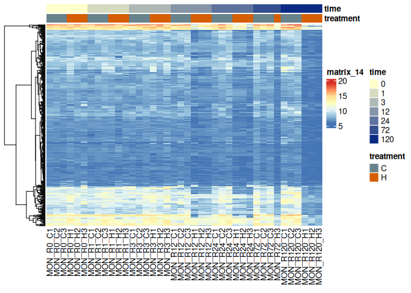<!-- -->

``` r
pheatmap(assay(vsd)[top_500_DE_genes, ], cluster_rows=TRUE, show_rownames=FALSE,
         cluster_cols=TRUE, cutree_cols = 2,
         annotation_col= meta[,c("treatment","time")],
         annotation_colors = list("treatment" = treat_colors,
                                  "time" = time_colors))
```

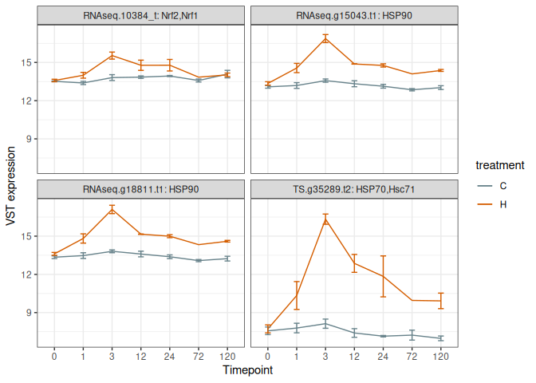<!-- -->

``` r
top_500_DE_genes <- DE_05 %>% arrange(desc(log2FoldChange)) %>% head(500) %>% rownames()

#view top 500 most vairable genes
pheatmap(assay(vsd)[top_500_DE_genes, ], cluster_rows=TRUE, show_rownames=FALSE,
         cluster_cols=FALSE, 
         annotation_col= meta[,c("treatment","time")],
         annotation_colors = list("treatment" = treat_colors,
                                  "time" = time_colors))
```

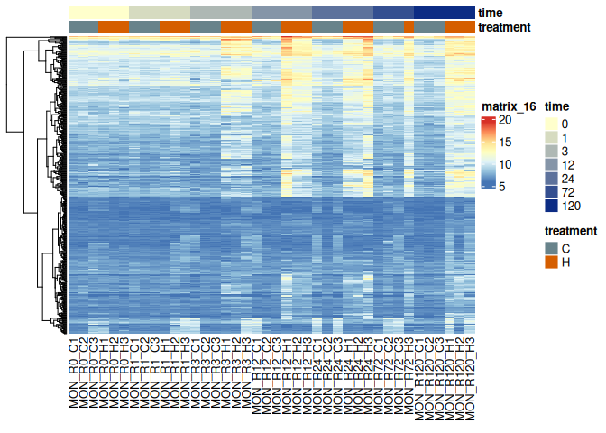<!-- -->

``` r
pheatmap(assay(vsd)[top_500_DE_genes, ], cluster_rows=TRUE, show_rownames=FALSE,
         cluster_cols=TRUE, cutree_cols = 2,
         annotation_col= meta[,c("treatment","time")],
         annotation_colors = list("treatment" = treat_colors,
                                  "time" = time_colors))
```

<!-- -->

### DE Heat stress genes

``` r
plot_df <- as.data.frame(t(stress_genes_vsd)) %>%
  rownames_to_column(var="sample") %>%
  left_join(meta, by=c("sample"="sample")) %>%
  pivot_longer(cols = all_of(stress_genes_ids), names_to="query", values_to="expression") %>%
  left_join(HeatStressGenes_Mcap_unique) %>% left_join(DE_05 %>% rownames_to_column(var="query")) %>%
  filter(!is.na(padj))

plot_df %>% ggplot(aes(x=time, y=expression, color=gene_id, group=gene_id)) +
  stat_summary(fun="mean", geom="line") +
  stat_summary(fun.data=mean_se, geom="errorbar", width=0.2) +
  facet_wrap(treatment~response_type) +
  theme_bw() +
  labs(y="VST expression", x="Timepoint")
```

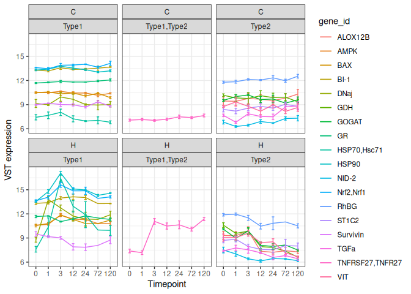<!-- -->

``` r
plot_df %>% filter(grepl("Type1", response_type)) %>%
  ggplot(aes(x=time, y=expression, color=treatment, group=interaction(treatment,query))) +
  stat_summary(fun="mean", geom="line", alpha=0.6) +
  stat_summary(fun.data=mean_se, geom="errorbar", width=0.2,linewidth=0.5, alpha=0.6) +
  scale_color_manual(values = treat_colors) +
  facet_wrap(~gene_id, ncol= 3,scales="free_y") +
  theme_bw() +
  theme(
    strip.text = element_text(face="bold", size=8),panel.spacing = unit(0.4, "lines")
  ) +
  labs(y="VST expression", x="Timepoint", title = "Type 1 DE (LRT) Response genes")
```

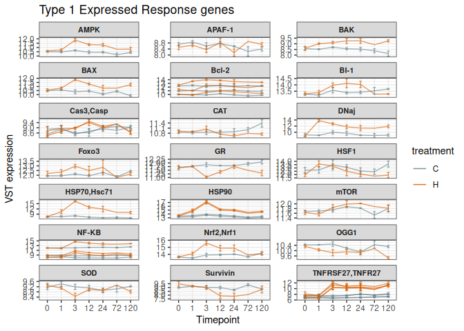<!-- -->

``` r
save_ggplot(last_plot(), "DE_Type1")

plot_df %>% filter(grepl("Type2", response_type)) %>%
  ggplot(aes(x=time, y=expression, color=treatment, group=interaction(treatment,query))) +
  stat_summary(fun="mean", geom="line", alpha=0.6) +
  stat_summary(fun.data=mean_se, geom="errorbar", width=0.2,linewidth=0.5, alpha=0.6) +
  scale_color_manual(values = treat_colors) +
  facet_wrap(~gene_id, ncol= 3,scales="free_y") +
  theme_bw() +
  theme(
    strip.text = element_text(face="bold", size=8),panel.spacing = unit(0.4, "lines")
  ) +
  labs(y="VST expression", x="Timepoint", title = "Type 2 DE (LRT) Response genes")
```

<!-- -->

``` r
save_ggplot(last_plot(), "DE_Type2")

plot_df %>% filter(grepl("HSP",gene_id)|grepl("Nrf2",gene_id)|grepl("HSF1",gene_id)) %>% ggplot(aes(x=time, y=expression, color=treatment, group=treatment)) +
  stat_summary(fun="mean", geom="line") +
  scale_color_manual(values = treat_colors) +
  stat_summary(fun.data=mean_se, geom="errorbar", width=0.2) +
  facet_wrap(~paste0(str_replace(query,"Montipora_capitata_HIv3___",""), ": ", gene_id)) +
  theme_bw() +
  labs(y="VST expression", x="Timepoint")
```

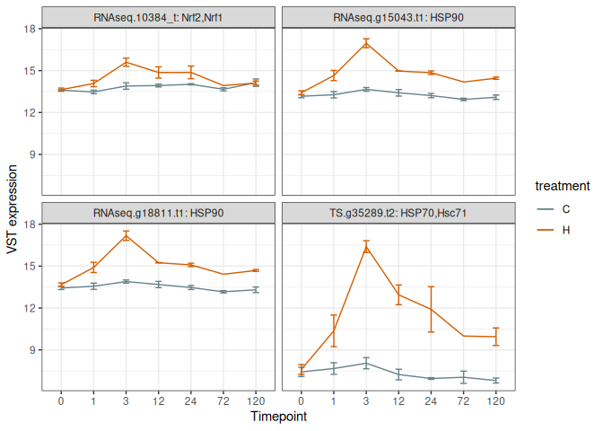<!-- -->

``` r
plot_df %>% filter(grepl("HSP",gene_id)|grepl("Nrf2",gene_id)|grepl("HSF1",gene_id)) %>% ggplot(aes(x=time, y=expression, color=treatment, group=treatment)) +
  stat_summary(fun="mean", geom="line") +
  scale_color_manual(values = treat_colors) +
  stat_summary(fun.data=mean_se, geom="errorbar", width=0.2) +
  facet_wrap(~paste0(gene_id, ": ",str_replace(query,"Montipora_capitata_HIv3___","")),scales="free_y") +
  theme_bw() +
  labs(y="VST expression", x="Timepoint", title = "Selected Type 1 DE (LRT) Response genes")
```

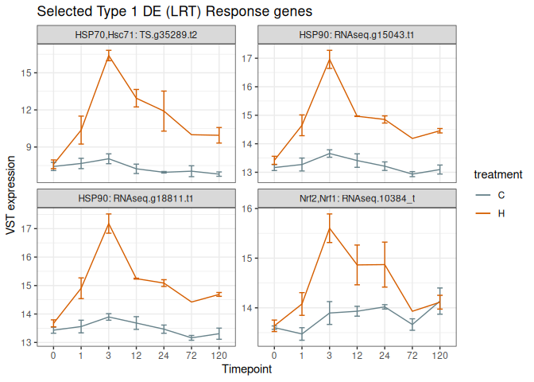<!-- -->

``` r
save_ggplot(last_plot(), "highlighted_DE_Type1")

plot_df %>% filter(grepl("GDH",gene_id)|grepl("GS",gene_id)|grepl("AMT1",gene_id)) %>% ggplot(aes(x=time, y=expression, color=treatment, group=treatment)) +
  stat_summary(fun="mean", geom="line") +
  scale_color_manual(values = treat_colors) +
  stat_summary(fun.data=mean_se, geom="errorbar", width=0.2) +
  facet_wrap(~paste0(gene_id, ": ",str_replace(query,"Montipora_capitata_HIv3___","")),scales="free_y") +
  theme_bw() +
  labs(y="VST expression", x="Timepoint", title = "Selected Type 2 DE (LRT) Response genes")
```

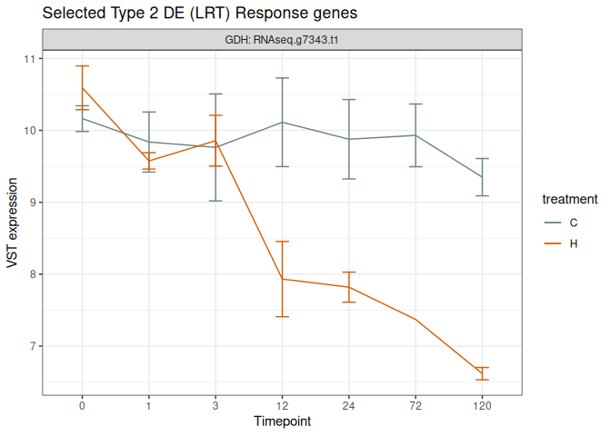<!-- -->

``` r
save_ggplot(last_plot(), "highlighted_DE_Type2")
```

### ImpulseDE2

Based on [this
paper](https://academic.oup.com/bib/article/20/1/288/4364840#130283262),
this is the best package to use other than comparing each time point
against each other individually. I am also planning to ID gene modules
via WGCNA.

Repo here: <https://github.com/YosefLab/ImpulseDE2>

Tutorial here:
<http://bioconductor.statistik.tu-dortmund.de/packages/3.11/bioc/vignettes/ImpulseDE2/inst/doc/ImpulseDE2_Tutorial.html>
, I followed closely with the section “Case-control differential
expression analysis”

Read the ImpulseDE2 paper
[here](https://academic.oup.com/nar/article/46/20/e119/5068248)

David S Fischer, Fabian J Theis, Nir Yosef, Impulse model-based
differential expression analysis of time course sequencing data, Nucleic
Acids Research, Volume 46, Issue 20, 16 November 2018, Page e119,
<https://doi.org/10.1093/nar/gky675>

``` r
#library(devtools)
#install_github("YosefLab/ImpulseDE2")

library(ImpulseDE2)
```

First, reformat our metadata table to match the column names used in the
ImpulseDE2 vignette.

``` r
meta_impulse <- meta %>%
  dplyr::rename(Sample = sample, Time = time, Batch = replicate) %>% 
  mutate(Time = as.numeric(as.character(Time)),
         #Time = as.numeric(Time),
         Condition = str_replace(treatment, "C", "control"),
         Condition = str_replace(Condition, "H", "case")
         ) %>%
  select(-c(species,treatment))
```

Then, generate the ImpulseDE2 object

``` r
#test with just 500 genes that I determined to be DE by treatment/timepoint with DESeq2 
objectImpulseDE2 <- runImpulseDE2(
  matCountData    = as.matrix(filtered_counts)[top_500_DE_genes,], #or use filtered_counts 
  dfAnnotation    = meta_impulse,
  boolCaseCtrl    = TRUE,
  vecConfounders  = c("Batch"), #only use if you want to try to control for batch effects
  boolIdentifyTransients = TRUE, #use if you want to ID transiently- vs permanently-regulated genes
  scaNProc        = 8 )

#run with all genes
objectImpulseDE2 <- runImpulseDE2(
  matCountData    = as.matrix(counts_raw), #or use filtered_counts 
  dfAnnotation    = meta_impulse,
  boolCaseCtrl    = TRUE,
  vecConfounders  = c("Batch"), #only use if you want to try to control for batch effects
  boolIdentifyTransients = TRUE, #use if you want to ID transiently- vs permanently-regulated genes
  scaNProc        = 18 )

saveRDS(objectImpulseDE2, file = paste0(outdir, "/objectImpulseDE2.rds"))
```

``` r
objectImpulseDE2 <- readRDS(paste0(outdir, "/objectImpulseDE2.rds"))

impulse_results <- objectImpulseDE2$dfImpulseDE2Results
head(impulse_results)
```

    ##                                                                                Gene
    ## Montipora_capitata_HIv3___RNAseq.g4581.t1 Montipora_capitata_HIv3___RNAseq.g4581.t1
    ## Montipora_capitata_HIv3___RNAseq.g4750.t1 Montipora_capitata_HIv3___RNAseq.g4750.t1
    ## Montipora_capitata_HIv3___RNAseq.g4751.t1 Montipora_capitata_HIv3___RNAseq.g4751.t1
    ## Montipora_capitata_HIv3___RNAseq.g4752.t1 Montipora_capitata_HIv3___RNAseq.g4752.t1
    ## Montipora_capitata_HIv3___RNAseq.g4753.t1 Montipora_capitata_HIv3___RNAseq.g4753.t1
    ## Montipora_capitata_HIv3___RNAseq.g4763.t1                                      <NA>
    ##                                                      p        padj loglik_full
    ## Montipora_capitata_HIv3___RNAseq.g4581.t1 0.2659787573 0.753200054  -225.00426
    ## Montipora_capitata_HIv3___RNAseq.g4750.t1 0.8332509794 1.000000000   -75.39967
    ## Montipora_capitata_HIv3___RNAseq.g4751.t1 0.1100827237 0.423666339  -210.17009
    ## Montipora_capitata_HIv3___RNAseq.g4752.t1 0.0036448166 0.033193214  -215.41533
    ## Montipora_capitata_HIv3___RNAseq.g4753.t1 0.0001124423 0.001992063  -278.99327
    ## Montipora_capitata_HIv3___RNAseq.g4763.t1           NA          NA          NA
    ##                                           loglik_red df_full df_red        mean
    ## Montipora_capitata_HIv3___RNAseq.g4581.t1 -228.22281      17     12  474.573139
    ## Montipora_capitata_HIv3___RNAseq.g4750.t1  -76.45634      17     12    4.476436
    ## Montipora_capitata_HIv3___RNAseq.g4751.t1 -214.65738      17     12  213.864038
    ## Montipora_capitata_HIv3___RNAseq.g4752.t1 -224.16473      17     12  206.042970
    ## Montipora_capitata_HIv3___RNAseq.g4753.t1 -291.73417      17     12 2382.308192
    ## Montipora_capitata_HIv3___RNAseq.g4763.t1         NA      NA     NA          NA
    ##                                           converge_combined converge_case
    ## Montipora_capitata_HIv3___RNAseq.g4581.t1                 0             0
    ## Montipora_capitata_HIv3___RNAseq.g4750.t1                 0             0
    ## Montipora_capitata_HIv3___RNAseq.g4751.t1                 0             0
    ## Montipora_capitata_HIv3___RNAseq.g4752.t1                 0             0
    ## Montipora_capitata_HIv3___RNAseq.g4753.t1                 0             0
    ## Montipora_capitata_HIv3___RNAseq.g4763.t1                NA            NA
    ##                                           converge_control converge_sigmoid
    ## Montipora_capitata_HIv3___RNAseq.g4581.t1                0                0
    ## Montipora_capitata_HIv3___RNAseq.g4750.t1                0                0
    ## Montipora_capitata_HIv3___RNAseq.g4751.t1                0                0
    ## Montipora_capitata_HIv3___RNAseq.g4752.t1                0                0
    ## Montipora_capitata_HIv3___RNAseq.g4753.t1                0                0
    ## Montipora_capitata_HIv3___RNAseq.g4763.t1               NA               NA
    ##                                           impulseTOsigmoid_p
    ## Montipora_capitata_HIv3___RNAseq.g4581.t1       1.472912e-03
    ## Montipora_capitata_HIv3___RNAseq.g4750.t1       2.832922e-01
    ## Montipora_capitata_HIv3___RNAseq.g4751.t1       2.242969e-01
    ## Montipora_capitata_HIv3___RNAseq.g4752.t1       4.218156e-07
    ## Montipora_capitata_HIv3___RNAseq.g4753.t1       4.332476e-09
    ## Montipora_capitata_HIv3___RNAseq.g4763.t1                 NA
    ##                                           impulseTOsigmoid_padj
    ## Montipora_capitata_HIv3___RNAseq.g4581.t1          1.527376e-02
    ## Montipora_capitata_HIv3___RNAseq.g4750.t1          6.677200e-01
    ## Montipora_capitata_HIv3___RNAseq.g4751.t1          5.843571e-01
    ## Montipora_capitata_HIv3___RNAseq.g4752.t1          1.840360e-05
    ## Montipora_capitata_HIv3___RNAseq.g4753.t1          3.499842e-07
    ## Montipora_capitata_HIv3___RNAseq.g4763.t1                    NA
    ##                                           sigmoidTOconst_p sigmoidTOconst_padj
    ## Montipora_capitata_HIv3___RNAseq.g4581.t1      0.012080884          0.08773932
    ## Montipora_capitata_HIv3___RNAseq.g4750.t1      0.941110041          1.00000000
    ## Montipora_capitata_HIv3___RNAseq.g4751.t1      0.006020669          0.04892814
    ## Montipora_capitata_HIv3___RNAseq.g4752.t1      0.025241110          0.16017914
    ## Montipora_capitata_HIv3___RNAseq.g4753.t1      0.002283761          0.02143738
    ## Montipora_capitata_HIv3___RNAseq.g4763.t1               NA                  NA
    ##                                           isTransient isMonotonous allZero
    ## Montipora_capitata_HIv3___RNAseq.g4581.t1       FALSE        FALSE   FALSE
    ## Montipora_capitata_HIv3___RNAseq.g4750.t1       FALSE        FALSE   FALSE
    ## Montipora_capitata_HIv3___RNAseq.g4751.t1       FALSE        FALSE   FALSE
    ## Montipora_capitata_HIv3___RNAseq.g4752.t1        TRUE        FALSE   FALSE
    ## Montipora_capitata_HIv3___RNAseq.g4753.t1        TRUE        FALSE   FALSE
    ## Montipora_capitata_HIv3___RNAseq.g4763.t1          NA           NA    TRUE

``` r
write.table(impulse_results,file.path(outdir, "ImpulseDE2_Results.txt"),row.names=F,quote=F,sep="\t")

# Genes with significant treatment effect on temporal trajectory
sig_genes <- impulse_results[impulse_results$padj < 0.05 & 
                               impulse_results$loglik_full > impulse_results$loglik_red, ]

nrow(sig_genes)
```

    ## [1] 12918

``` r
head(sig_genes[order(sig_genes$padj), ])
```

    ##                                                                                  Gene
    ## Montipora_capitata_HIv3___RNAseq.g49833.t1 Montipora_capitata_HIv3___RNAseq.g49833.t1
    ## Montipora_capitata_HIv3___RNAseq.g49832.t1 Montipora_capitata_HIv3___RNAseq.g49832.t1
    ## Montipora_capitata_HIv3___RNAseq.g7282.t1   Montipora_capitata_HIv3___RNAseq.g7282.t1
    ## Montipora_capitata_HIv3___TS.g637.t1             Montipora_capitata_HIv3___TS.g637.t1
    ## Montipora_capitata_HIv3___RNAseq.g40931.t1 Montipora_capitata_HIv3___RNAseq.g40931.t1
    ## Montipora_capitata_HIv3___RNAseq.g984.t1     Montipora_capitata_HIv3___RNAseq.g984.t1
    ##                                                        p          padj
    ## Montipora_capitata_HIv3___RNAseq.g49833.t1 1.039742e-133 4.921930e-129
    ## Montipora_capitata_HIv3___RNAseq.g49832.t1  9.937684e-61  2.352150e-56
    ## Montipora_capitata_HIv3___RNAseq.g7282.t1   4.581857e-43  7.229865e-39
    ## Montipora_capitata_HIv3___TS.g637.t1        1.770894e-42  2.095765e-38
    ## Montipora_capitata_HIv3___RNAseq.g40931.t1  1.716716e-37  1.625318e-33
    ## Montipora_capitata_HIv3___RNAseq.g984.t1    2.668861e-36  2.105642e-32
    ##                                            loglik_full loglik_red df_full
    ## Montipora_capitata_HIv3___RNAseq.g49833.t1   -321.9301  -636.4818      17
    ## Montipora_capitata_HIv3___RNAseq.g49832.t1   -351.5874  -496.9431      17
    ## Montipora_capitata_HIv3___RNAseq.g7282.t1    -303.9529  -408.1409      17
    ## Montipora_capitata_HIv3___TS.g637.t1         -303.6075  -406.4238      17
    ## Montipora_capitata_HIv3___RNAseq.g40931.t1   -231.1116  -322.2674      17
    ## Montipora_capitata_HIv3___RNAseq.g984.t1     -258.1393  -346.5052      17
    ##                                            df_red      mean converge_combined
    ## Montipora_capitata_HIv3___RNAseq.g49833.t1     12 6104.4116                 0
    ## Montipora_capitata_HIv3___RNAseq.g49832.t1     12 9512.9893                 0
    ## Montipora_capitata_HIv3___RNAseq.g7282.t1      12 5185.0437                 0
    ## Montipora_capitata_HIv3___TS.g637.t1           12 2326.8821                 0
    ## Montipora_capitata_HIv3___RNAseq.g40931.t1     12  832.9663                 0
    ## Montipora_capitata_HIv3___RNAseq.g984.t1       12 1106.3270                 0
    ##                                            converge_case converge_control
    ## Montipora_capitata_HIv3___RNAseq.g49833.t1             0                0
    ## Montipora_capitata_HIv3___RNAseq.g49832.t1             0                0
    ## Montipora_capitata_HIv3___RNAseq.g7282.t1              0                0
    ## Montipora_capitata_HIv3___TS.g637.t1                   0                0
    ## Montipora_capitata_HIv3___RNAseq.g40931.t1             0                0
    ## Montipora_capitata_HIv3___RNAseq.g984.t1               0                0
    ##                                            converge_sigmoid impulseTOsigmoid_p
    ## Montipora_capitata_HIv3___RNAseq.g49833.t1                0       1.621986e-84
    ## Montipora_capitata_HIv3___RNAseq.g49832.t1                0       5.447334e-46
    ## Montipora_capitata_HIv3___RNAseq.g7282.t1                 0       9.010205e-63
    ## Montipora_capitata_HIv3___TS.g637.t1                      0       3.345414e-06
    ## Montipora_capitata_HIv3___RNAseq.g40931.t1                0       6.233101e-01
    ## Montipora_capitata_HIv3___RNAseq.g984.t1                  0       2.864061e-02
    ##                                            impulseTOsigmoid_padj
    ## Montipora_capitata_HIv3___RNAseq.g49833.t1          7.678158e-80
    ## Montipora_capitata_HIv3___RNAseq.g49832.t1          6.446647e-42
    ## Montipora_capitata_HIv3___RNAseq.g7282.t1           2.132625e-58
    ## Montipora_capitata_HIv3___TS.g637.t1                1.046134e-04
    ## Montipora_capitata_HIv3___RNAseq.g40931.t1          9.948876e-01
    ## Montipora_capitata_HIv3___RNAseq.g984.t1            1.474483e-01
    ##                                            sigmoidTOconst_p sigmoidTOconst_padj
    ## Montipora_capitata_HIv3___RNAseq.g49833.t1    6.956522e-118       3.293078e-113
    ## Montipora_capitata_HIv3___RNAseq.g49832.t1     1.064145e-61        1.259362e-57
    ## Montipora_capitata_HIv3___RNAseq.g7282.t1      1.407595e-22        4.412764e-20
    ## Montipora_capitata_HIv3___TS.g637.t1           3.039450e-67        7.194075e-63
    ## Montipora_capitata_HIv3___RNAseq.g40931.t1     2.228143e-66        3.515861e-62
    ## Montipora_capitata_HIv3___RNAseq.g984.t1       8.894864e-61        8.421302e-57
    ##                                            isTransient isMonotonous allZero
    ## Montipora_capitata_HIv3___RNAseq.g49833.t1        TRUE        FALSE   FALSE
    ## Montipora_capitata_HIv3___RNAseq.g49832.t1        TRUE        FALSE   FALSE
    ## Montipora_capitata_HIv3___RNAseq.g7282.t1         TRUE        FALSE   FALSE
    ## Montipora_capitata_HIv3___TS.g637.t1              TRUE        FALSE   FALSE
    ## Montipora_capitata_HIv3___RNAseq.g40931.t1       FALSE         TRUE   FALSE
    ## Montipora_capitata_HIv3___RNAseq.g984.t1         FALSE         TRUE   FALSE

``` r
library(ComplexHeatmap)

lsHeatmaps <- plotHeatmap(
  objectImpulseDE2       = objectImpulseDE2,
  strCondition           = "case",
  boolIdentifyTransients = TRUE, #set to true if true above
  scaQThres              = 0.01)
draw(lsHeatmaps$complexHeatmapRaw) 
```

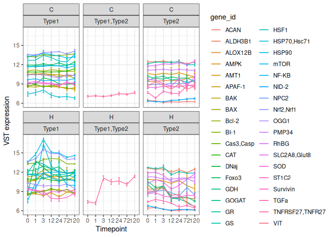<!-- -->

``` r
png(paste0(outdir,"/ImpulseDE/ImpulseDE2_heatmap.png"), width = 2000, height = 2400, res = 300)
draw(lsHeatmaps$complexHeatmapRaw)
dev.off()
```

    ## png 
    ##   2

``` r
majerova_genes <- HeatStressGenes_Mcap %>% filter(ref_first_author =="Majerova")
stress_genes_ids <- unique(majerova_genes$query)
plot_stress_genes <- stress_genes_ids[stress_genes_ids %in% rownames(objectImpulseDE2@matCountDataProc)]

impulse_results %>% filter(Gene %in% stress_genes_ids) %>% arrange(padj) %>% left_join(HeatStressGenes_Mcap_unique, by = join_by(Gene==query))
```

    ##                                          Gene            p        padj
    ## 1  Montipora_capitata_HIv3___RNAseq.g37104.t1 0.0003748174 0.005331462
    ## 2  Montipora_capitata_HIv3___RNAseq.g27769.t1 0.0004129965 0.005768790
    ## 3      Montipora_capitata_HIv3___TS.g26835.t1 0.0008895054 0.010818963
    ## 4  Montipora_capitata_HIv3___RNAseq.g45609.t1 0.0105686218 0.075493801
    ## 5    Montipora_capitata_HIv3___RNAseq.10384_t 0.0142234098 0.095261428
    ## 6  Montipora_capitata_HIv3___RNAseq.g20389.t1 0.0334375549 0.182148098
    ## 7      Montipora_capitata_HIv3___TS.g50400.t1 0.0452905693 0.227187132
    ## 8  Montipora_capitata_HIv3___RNAseq.g20408.t1 0.0565690134 0.264951416
    ## 9  Montipora_capitata_HIv3___RNAseq.g43322.t1 0.2048581139 0.638528673
    ## 10 Montipora_capitata_HIv3___RNAseq.g34531.t1 0.2539042905 0.731179744
    ## 11 Montipora_capitata_HIv3___RNAseq.g47592.t2 0.3546798825 0.894408496
    ## 12     Montipora_capitata_HIv3___TS.g35289.t2 1.0000000000 1.000000000
    ##    loglik_full loglik_red df_full df_red        mean converge_combined
    ## 1    -294.2213  -305.6024      17     12  3642.90271                 0
    ## 2    -277.9355  -289.2061      17     12  1261.60026                 0
    ## 3    -284.7643  -295.1567      17     12  1204.05096                 0
    ## 4    -361.6464  -369.1225      17     12 11865.94009                 0
    ## 5    -394.9973  -402.1114      17     12 14918.53821                 0
    ## 6    -326.0298  -332.0800      17     12  1873.61645                 0
    ## 7    -353.2302  -358.8931      17     12  5103.36659                 0
    ## 8    -224.8884  -230.2634      17     12   260.06067                 0
    ## 9    -277.3306  -280.9400      17     12   827.64542                 0
    ## 10   -348.3636  -351.6529      17     12  4202.57892                 0
    ## 11   -380.6378  -383.4027      17     12  8084.21453                 0
    ## 12   -307.2346  -299.4049      17     12    61.13291                 0
    ##    converge_case converge_control converge_sigmoid impulseTOsigmoid_p
    ## 1              0                0                0       3.894180e-06
    ## 2              0                0                0       3.784452e-12
    ## 3              0                0                0       2.184191e-08
    ## 4              0                0                0       1.940554e-04
    ## 5              0                0                0       4.445599e-09
    ## 6              0                0                0       5.359714e-04
    ## 7              0                0                0       1.216749e-05
    ## 8              0                0                0       8.938109e-01
    ## 9              0                0                0       6.450836e-03
    ## 10             0                0                0       2.092133e-02
    ## 11             0                0                0       8.126363e-02
    ## 12             0                0                0       5.932445e-02
    ##    impulseTOsigmoid_padj sigmoidTOconst_p sigmoidTOconst_padj isTransient
    ## 1           1.184722e-04     0.9253247955         1.000000000        TRUE
    ## 2           6.635125e-10     0.6171138042         1.000000000        TRUE
    ## 3           1.419412e-06     0.6023577161         1.000000000        TRUE
    ## 4           3.056140e-03     0.0066678039         0.053254682       FALSE
    ## 5           3.579010e-07     0.1182046062         0.534315202        TRUE
    ## 6           6.937006e-03     0.1208567140         0.543315777       FALSE
    ## 7           3.058867e-04     0.9002040366         1.000000000        TRUE
    ## 8           1.000000e+00     0.0160013353         0.110412032       FALSE
    ## 9           4.859480e-02     0.0237589668         0.152709025       FALSE
    ## 10          1.176496e-01     0.3589209753         1.000000000       FALSE
    ## 11          3.063874e-01     0.0928900469         0.447464032       FALSE
    ## 12          2.479517e-01     0.0001465574         0.001937915       FALSE
    ##    isMonotonous allZero     gene_id response_type     category
    ## 1         FALSE   FALSE          GR         Type1 ROS response
    ## 2         FALSE   FALSE        AMPK         Type1 ROS response
    ## 3         FALSE   FALSE         BAX         Type1    Apoptosis
    ## 4         FALSE   FALSE        BI-1         Type1    Apoptosis
    ## 5         FALSE   FALSE   Nrf2,Nrf1         Type1 ROS response
    ## 6         FALSE   FALSE       Bcl-2         Type1    Apoptosis
    ## 7         FALSE   FALSE       Bcl-2         Type1    Apoptosis
    ## 8         FALSE   FALSE         BAK         Type1    Apoptosis
    ## 9         FALSE   FALSE       Bcl-2         Type1    Apoptosis
    ## 10        FALSE   FALSE       Foxo3         Type1 ROS response
    ## 11        FALSE   FALSE        HSF1         Type1          UPR
    ## 12        FALSE   FALSE HSP70,Hsc71         Type1          UPR

``` r
heatgenes <- plotGenes(
  vecGeneIDs       = plot_stress_genes,
  objectImpulseDE2 = objectImpulseDE2,
  boolSimplePlot = TRUE,   boolCaseCtrl     = TRUE,
  dirOut           = "../output_RNA/differential_expression/MON_MCapV3/ImpulseDE/",
  strFileName = "stress_genes_Majerova.pdf",
  boolMultiplePlotsPerPage = FALSE,
  strNameRefMethod = NULL)
```

    ## [1] "Creating ../output_RNA/differential_expression/MON_MCapV3/ImpulseDE/stress_genes_Majerova.pdf"

``` r
heatgenes
```

    ## [[1]]

    ## 
    ## [[2]]

    ## 
    ## [[3]]

    ## 
    ## [[4]]

    ## 
    ## [[5]]

    ## 
    ## [[6]]

    ## 
    ## [[7]]

    ## 
    ## [[8]]

    ## 
    ## [[9]]

    ## 
    ## [[10]]

    ## 
    ## [[11]]

    ## 
    ## [[12]]

``` r
HSPS <- impulse_results %>% filter(Gene %in% stress_genes_ids) %>% arrange(padj) %>% left_join(HeatStressGenes_Mcap_unique, by = join_by(Gene==query)) %>% filter(grepl("HSP",gene_id)) %>% pull(Gene)

HSPs <- plotGenes(
  vecGeneIDs       = HSPS,
  objectImpulseDE2 = objectImpulseDE2,
  boolSimplePlot = TRUE,
  boolCaseCtrl     = TRUE,
  dirOut           = "../output_RNA/differential_expression/MON_MCapV3/ImpulseDE/",
  strFileName = "HSPs.pdf",
  boolMultiplePlotsPerPage = FALSE,
  strNameRefMethod = NULL)
```

    ## [1] "Creating ../output_RNA/differential_expression/MON_MCapV3/ImpulseDE/HSPs.pdf"

``` r
HSPs
```

    ## [[1]]

``` r
lsgplotsGenes <- plotGenes(
  vecGeneIDs       = NULL,
  scaNTopIDs       = 10,
  objectImpulseDE2 = objectImpulseDE2,
  boolSimplePlot = TRUE,   boolCaseCtrl     = TRUE,
  dirOut           = "../output_RNA/differential_expression/MON_MCapV3/ImpulseDE/",
  boolMultiplePlotsPerPage = FALSE,
  strNameRefMethod = NULL)
```

    ## [1] "Creating ../output_RNA/differential_expression/MON_MCapV3/ImpulseDE/ImpulseDE2_Trajectories.pdf"

``` r
lsgplotsGenes
```

    ## [[1]]

    ## 
    ## [[2]]

    ## 
    ## [[3]]

    ## 
    ## [[4]]

    ## 
    ## [[5]]

    ## 
    ## [[6]]

    ## 
    ## [[7]]

    ## 
    ## [[8]]

    ## 
    ## [[9]]

    ## 
    ## [[10]]

``` r
top_500_DE_genes <- impulse_results %>% arrange(padj) %>% head(500) %>% rownames()

#view top 500 most vairable genes
pheatmap(vsd_mat[top_500_DE_genes, ], cluster_rows=TRUE, show_rownames=FALSE,
         cluster_cols=FALSE, #cutree_cols = 2,
         annotation_col= meta[,c("treatment","time")],
         annotation_colors = list("treatment" = treat_colors,
                                  "time" = time_colors))
```

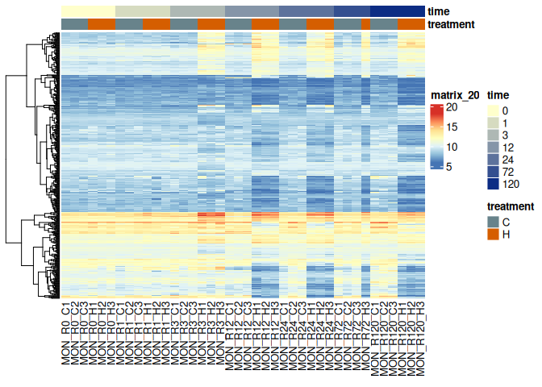<!-- -->

``` r
pheatmap(vsd_mat[top_500_DE_genes, ], cluster_rows=TRUE, show_rownames=FALSE,
         cluster_cols=TRUE, cutree_cols = 2,
         annotation_col= meta[,c("treatment","time")],
         annotation_colors = list("treatment" = treat_colors,
                                  "time" = time_colors))
```

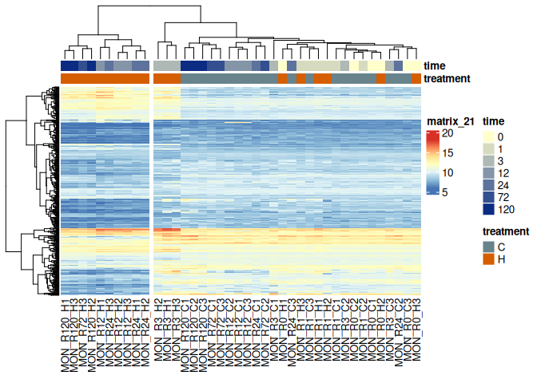<!-- -->

## POR: pre-processing and visualization

Read in raw count data

``` r
#set standard output directory for figures
outdir <- "../output_RNA/differential_expression/POR_Pcomp"

counts_raw <- read.csv("../output_RNA/count_matrices/POR_Pcomp_gene_count_matrix.csv", row.names = 1) #load in data

samples <- colnames(counts_raw)
```

### Read in metadata

``` r
meta <- data.frame(
  sample = samples, 
  species = str_split(samples, "_", simplify = TRUE)[,1], #extract first part of sample name to get species
  time = str_replace(str_split(samples, "_", simplify = TRUE)[,2],"R", ""), #extract "R##" part to get timepoint then remove R
  replicate = str_split(samples, "_", simplify = TRUE)[,3], #extract "R##" part to get timepoint then remove R
  treatment = str_replace(str_split(samples, "_", simplify = TRUE)[,3],"\\d", "")
)

rownames(meta) <- meta$sample

meta$time <- factor(meta$time, levels = as.character(sort(unique(as.numeric(meta$time)))))
meta$treatment <- factor(meta$treatment)

meta <- meta %>% arrange(time, treatment)
write.csv(meta, paste0(outdir,"/RNA_seq_metadata.csv"))
```

Reorder sample columns based on factor order

``` r
counts_raw <- counts_raw[, meta$sample]
```

Remove outliers:

``` r
#counts_raw <- counts_raw[, !(colnames(counts_raw) %in% c("MON_R72_H1","MON_R72_H2"))]
#meta <- meta[!(rownames(meta) %in% c("MON_R72_H1","MON_R72_H2")),]
```

Data sanity checks!

``` r
stopifnot(all(meta$sample %in% colnames(counts_raw))) #are all of the sample names in the metadata column names in the gene count matrix?
stopifnot(all(meta$sample == colnames(counts_raw))) #are they the same in the same order?
```

### pOverA filtering to reduce dataset

``` r
ffun<-filterfun(pOverA(0.07,10))  # Keep genes expressed at 10+ counts in at least 7% of samples - expressed in all 3 samples at one timepoint from one treatment
counts_filt_poa <- genefilter((counts_raw), ffun) #apply filter

filtered_counts <- counts_raw[counts_filt_poa,] #keep only rows that passed filter

paste0("Number of genes after filtering: ", sum(counts_filt_poa))
```

    ## [1] "Number of genes after filtering: 27533"

``` r
write.csv(filtered_counts, file = file.path(outdir, "filtered_counts.csv"))
```

### [DESeq2](https://www.bioconductor.org/packages/release/bioc/vignettes/DESeq2/inst/doc/DESeq2.html)

Create DESeq object and run DESeq2

``` r
dds <- DESeqDataSetFromMatrix(countData = filtered_counts,
                              colData = meta,
                              design= ~ treatment + time + treatment:time)

dds <- DESeq(dds)
```

Check size factors.

``` r
SF.dds <- estimateSizeFactors(dds) #estimate size factors to determine if we can use vst  to transform our data. Size factors should be less than 4 for us to use vst
print(sizeFactors(SF.dds)) #View size factors
```

    ##   POR_R0_C1   POR_R0_C2   POR_R0_C3   POR_R0_H1   POR_R0_H2   POR_R0_H3 
    ##   1.1064526   0.8719468   1.6057443   0.6777339   0.8281278   1.1440124 
    ##   POR_R1_C1   POR_R1_C2   POR_R1_C3   POR_R1_H1   POR_R1_H2   POR_R1_H3 
    ##   0.4150671   1.1759630   0.9875187   0.4640600   0.4029134   1.2567150 
    ##   POR_R3_C1   POR_R3_C2   POR_R3_C3   POR_R3_H1   POR_R3_H2   POR_R3_H3 
    ##   1.4963637   1.2841829   0.6649097   2.0347063   2.0586128   1.0852146 
    ##  POR_R12_C1  POR_R12_C2  POR_R12_C3  POR_R12_H1  POR_R12_H2  POR_R12_H3 
    ##   0.3981970   1.9697598   0.5738960   2.3125857   2.6778535   1.7302729 
    ##  POR_R24_C1  POR_R24_C2  POR_R24_C3  POR_R24_H1  POR_R24_H2  POR_R24_H3 
    ##   2.1137645   0.7805666   0.7411381   0.2788869   1.8799754   2.3502852 
    ##  POR_R72_C1  POR_R72_C2  POR_R72_C3  POR_R72_H1  POR_R72_H2  POR_R72_H3 
    ##   0.7770175   1.4041362   0.7425228   0.1915412   0.2704780   1.8744531 
    ## POR_R120_C1 POR_R120_C2 POR_R120_C3 POR_R120_H1 POR_R120_H2 POR_R120_H3 
    ##   0.8354057   1.8182241   0.3622529   3.8086275   3.3817337   0.7298652

``` r
all(sizeFactors(SF.dds)) < 4
```

    ## [1] TRUE

Transforming count data for visualization

``` r
vsd <- vst(dds, blind=FALSE)

#save the vsd transformation
vsd_mat <- assay(vsd)
write.csv(vsd_mat, file = file.path(outdir, "vsd_expression_matrix.csv"))
```

### Heatmap of the sample-to-sample distances

``` r
sampleDists <- dist(t(assay(vsd)))

sampleDistMatrix <- as.matrix(sampleDists)
colnames(sampleDistMatrix) <- NULL

pheatmap(sampleDistMatrix,
         col=colorRampPalette( rev(brewer.pal(9, "Blues")) )(255))
```

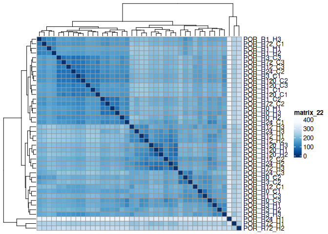<!-- -->

### Principal component plot of the samples

``` r
pcaData <- plotPCA(vsd, intgroup=c("time", "treatment"), returnData=TRUE)

percentVar <- round(100 * attr(pcaData, "percentVar"))
PCA <- ggplot() +
  geom_point(data = subset(pcaData, treatment == "C"),
             aes(x=PC1, y=PC2, color=time),
                 size=2) +
             scale_color_manual(values=brewer.pal(7, "Blues"), name = "Time (hrs) - Control") +
  
  #start new scale
  ggnewscale::new_scale_color() +
  geom_point(data = subset(pcaData, treatment == "H"),
             aes(x=PC1, y=PC2, color=time),
                 size=2) +
             scale_color_manual(values=brewer.pal(7, "Oranges"), name = "Time (hrs) - Heat") +

  xlab(paste0("PC1: ",percentVar[1],"% variance")) +
  ylab(paste0("PC2: ",percentVar[2],"% variance")) + 
  coord_fixed() + theme_bw()
PCA
```

<!-- -->

``` r
save_ggplot(PCA, "PCA_POR")
```

The following samples had mapping rates \< 20%:

| sample | uniquely_mapped_percent | rRNA_matched_reads_Million | total_reads_Million |
|----|----|----|----|
| POR_R72_H1 | 6.4 | 12.92 | 15.47 |
| POR_R24_H1 | 7.67 | 14.23 | 17.26 |
| POR_R120_C3 | 7.77 | 18.64 | 21.02 |
| POR_R72_H2 | 8.77 | 12.24 | 15.16 |
| POR_R1_H2 | 10.37 | 14.78 | 17.47 |
| POR_R120_C1 | 10.78 | 11.68 | 13.99 |
| POR_R1_H1 | 11.72 | 15.47 | 18.69 |
| POR_R1_C1 | 12.04 | 13.14 | 15.99 |
| POR_R12_C1 | 12.2 | 12.17 | 14.88 |
| POR_R12_C3 | 15.78 | 11.7 | 15.09 |
| POR_R0_H1 | 16.57 | 12.57 | 16.46 |
| POR_R120_H3 | 18.23 | 12.18 | 17.16 |
| POR_R3_C3 | 18.27 | 11 | 14.95 |
| POR_R0_H2 | 18.35 | 14.14 | 19.31 |
| POR_R24_C2 | 19.72 | 11.55 | 16 |

### Heatmap of count matrix

``` r
topVarGenes <- head(order(rowVars(assay(vsd)), decreasing=TRUE), 500)

time_colors <- colorRampPalette(c("#ffffcc","#0c2c84"))(7)
names(time_colors) <- levels(meta$time)

#view top 500 most vairable genes
pheatmap(assay(vsd)[topVarGenes, ], cluster_rows=TRUE, show_rownames=FALSE,
         cluster_cols=FALSE, 
         annotation_col= meta[,c("treatment","time")],
         annotation_colors = list("treatment" = treat_colors,
                                  "time" = time_colors))
```

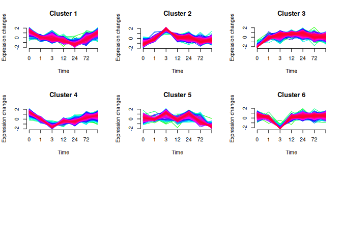<!-- -->

``` r
pheatmap(assay(vsd)[topVarGenes, ], cluster_rows=TRUE, show_rownames=FALSE,
         cluster_cols=TRUE, cutree_cols = 2,
         annotation_col= meta[,c("treatment","time")],
         annotation_colors = list("treatment" = treat_colors,
                                  "time" = time_colors))
```

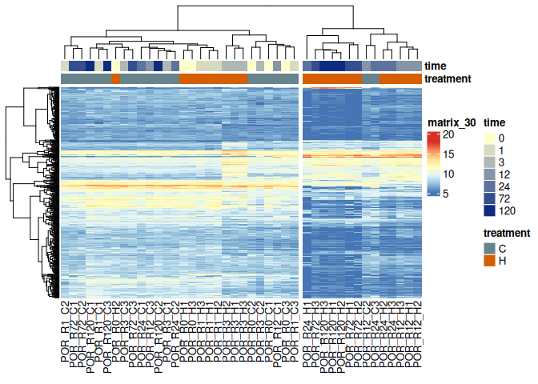<!-- -->

### Heat stress genes

``` r
HeatStressGenes_Pcomp <- read_csv("/project/pi_hputnam_uri_edu/zdellaert/snRNA_analysis/multi-sp-snRNA/reference_genes/genes_of_interest/HeatStressGenes_Pcomp.csv") %>% dplyr::select(-1) %>% dplyr::rename(query = Pcomp_gene) %>% dplyr::select(query,everything()) #%>% filter(ref_first_author =="Majerova")

HeatStressGenes_Pcomp_unique <- HeatStressGenes_Pcomp %>% group_by(query) %>%
  summarize(gene_id = paste(unique(gene_id), collapse = ","),
            response_type = paste(unique(response_type), collapse = ","),
            category = paste(unique(category), collapse = ",")
            ) 

HeatStressGenes_Pcomp_unique <- HeatStressGenes_Pcomp_unique %>% filter(query %in% rownames(vsd_mat))
 
stress_genes_ids <- unique(HeatStressGenes_Pcomp_unique$query) 
stress_genes_vsd <- vsd_mat[stress_genes_ids, ]

plot_df <- as.data.frame(t(stress_genes_vsd)) %>%
  rownames_to_column(var="sample") %>%
  left_join(meta, by=c("sample"="sample")) %>%
  pivot_longer(cols = all_of(stress_genes_ids), names_to="query", values_to="expression") %>%
  left_join(HeatStressGenes_Pcomp_unique)

plot_df %>% ggplot(aes(x=time, y=expression, color=gene_id, group=gene_id)) +
  stat_summary(fun="mean", geom="line") +
  stat_summary(fun.data=mean_se, geom="errorbar", width=0.2) +
  facet_wrap(treatment~response_type) +
  theme_bw() +
  labs(y="VST expression", x="Timepoint")
```

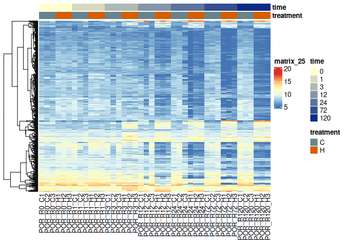<!-- -->

``` r
plot_df %>% filter(grepl("Type1", response_type)) %>%
  ggplot(aes(x=time, y=expression, color=treatment, group=interaction(treatment,query))) +
  stat_summary(fun="mean", geom="line", alpha=0.6) +
  stat_summary(fun.data=mean_se, geom="errorbar", width=0.2,linewidth=0.5, alpha=0.6) +
  scale_color_manual(values = treat_colors) +
  facet_wrap(~gene_id, ncol= 3,scales="free_y") +
  theme_bw() +
  theme(
    strip.text = element_text(face="bold", size=8),panel.spacing = unit(0.4, "lines")
  ) +
  labs(y="VST expression", x="Timepoint", title = "Type 1 Expressed Response genes")
```

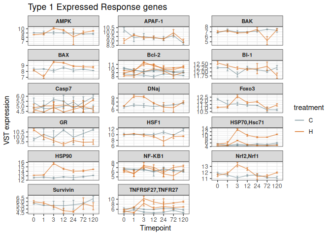<!-- -->

``` r
save_ggplot(last_plot(), "All_Type1")

plot_df %>% filter(grepl("Type2", response_type)) %>%
  ggplot(aes(x=time, y=expression, color=treatment, group=interaction(treatment,query))) +
  stat_summary(fun="mean", geom="line", alpha=0.6) +
  stat_summary(fun.data=mean_se, geom="errorbar", width=0.2,linewidth=0.5, alpha=0.6) +
  scale_color_manual(values = treat_colors) +
  facet_wrap(~gene_id, ncol= 3,scales="free_y") +
  theme_bw() +
  theme(
    strip.text = element_text(face="bold", size=8),panel.spacing = unit(0.4, "lines")
  ) +
  labs(y="VST expression", x="Timepoint", title = "Type 2 Expressed Response genes")
```

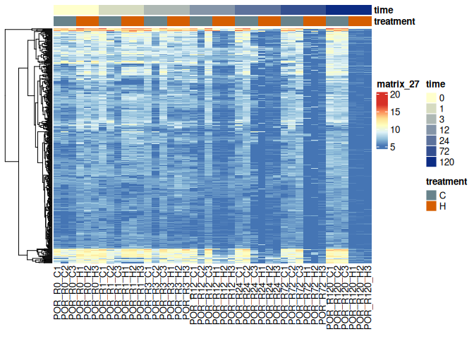<!-- -->

``` r
save_ggplot(last_plot(), "All_Type2")

plot_df %>% filter(grepl("HSP",gene_id)|grepl("Nrf2",gene_id)|grepl("HSF1",gene_id)) %>% ggplot(aes(x=time, y=expression, color=treatment, group=treatment)) +
  stat_summary(fun="mean", geom="line") +
  scale_color_manual(values = treat_colors) +
  stat_summary(fun.data=mean_se, geom="errorbar", width=0.2) +
  facet_wrap(~paste0(str_replace(query,"Porites_compressa_HIv1___",""), ": ", gene_id)) +
  theme_bw() +
  labs(y="VST expression", x="Timepoint")
```

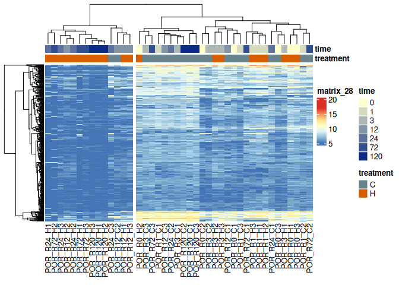<!-- -->

### DESeq LRT Test

``` r
dds <- DESeqDataSetFromMatrix(countData = filtered_counts,
                              colData = meta,
                              design= ~ treatment + time + treatment:time)

dds <- DESeq(dds, test = "LRT", reduced = ~ treatment + time)

res <- results(dds)
sig_genes <- subset(res, padj < 0.05)
lrt_res <- as.data.frame(res)

DE_05 <- lrt_res[rownames(lrt_res %>% filter(padj<0.05)),]

time_colors <- colorRampPalette(c("#ffffcc","#0c2c84"))(7)
names(time_colors) <- levels(meta$time)

top_500_DE_genes <- DE_05 %>% arrange(padj) %>% head(500) %>% rownames()

#view top 500 most vairable genes
pheatmap(assay(vsd)[top_500_DE_genes, ], cluster_rows=TRUE, show_rownames=FALSE,
         cluster_cols=FALSE, 
         annotation_col= meta[,c("treatment","time")],
         annotation_colors = list("treatment" = treat_colors,
                                  "time" = time_colors))
```

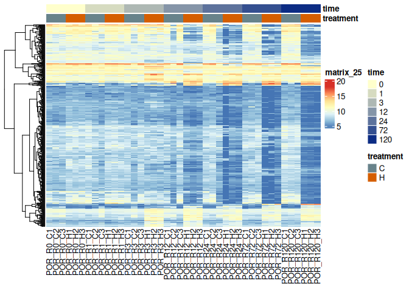<!-- -->

``` r
pheatmap(assay(vsd)[top_500_DE_genes, ], cluster_rows=TRUE, show_rownames=FALSE,
         cluster_cols=TRUE, cutree_cols = 2,
         annotation_col= meta[,c("treatment","time")],
         annotation_colors = list("treatment" = treat_colors,
                                  "time" = time_colors))
```

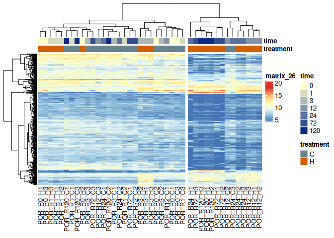<!-- -->

``` r
top_500_DE_genes <- DE_05 %>% arrange(log2FoldChange) %>% head(500) %>% rownames()

#view top 500 most vairable genes
pheatmap(assay(vsd)[top_500_DE_genes, ], cluster_rows=TRUE, show_rownames=FALSE,
         cluster_cols=FALSE,
         annotation_col= meta[,c("treatment","time")],
         annotation_colors = list("treatment" = treat_colors,
                                  "time" = time_colors))
```

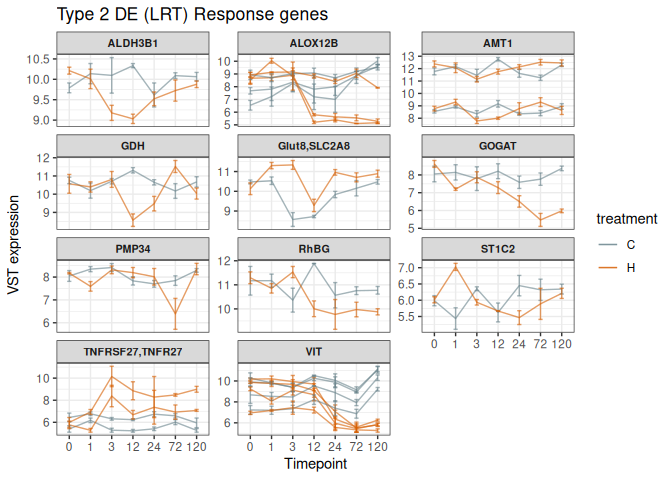<!-- -->

``` r
pheatmap(assay(vsd)[top_500_DE_genes, ], cluster_rows=TRUE, show_rownames=FALSE,
         cluster_cols=TRUE, cutree_cols = 2,
         annotation_col= meta[,c("treatment","time")],
         annotation_colors = list("treatment" = treat_colors,
                                  "time" = time_colors))
```

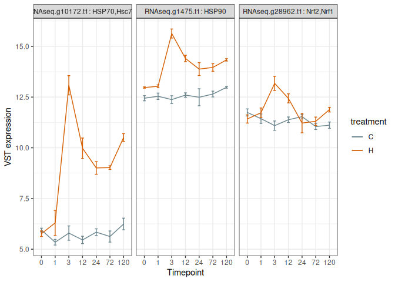<!-- -->

``` r
top_500_DE_genes <- DE_05 %>% arrange(desc(log2FoldChange)) %>% head(500) %>% rownames()

#view top 500 most vairable genes
pheatmap(assay(vsd)[top_500_DE_genes, ], cluster_rows=TRUE, show_rownames=FALSE,
         cluster_cols=FALSE, 
         annotation_col= meta[,c("treatment","time")],
         annotation_colors = list("treatment" = treat_colors,
                                  "time" = time_colors))
```

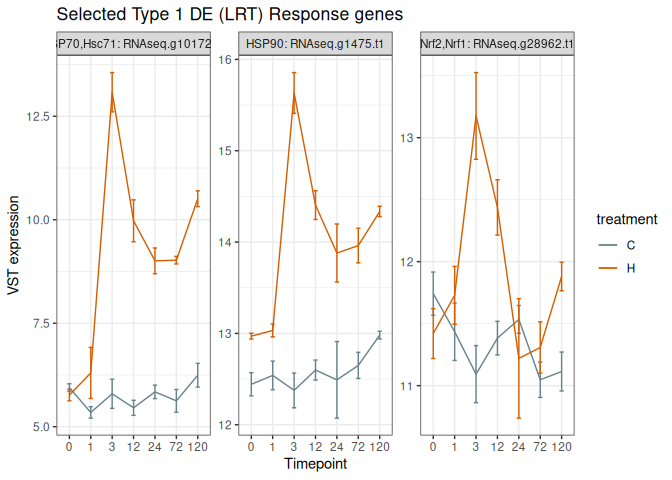<!-- -->

``` r
pheatmap(assay(vsd)[top_500_DE_genes, ], cluster_rows=TRUE, show_rownames=FALSE,
         cluster_cols=TRUE, cutree_cols = 2,
         annotation_col= meta[,c("treatment","time")],
         annotation_colors = list("treatment" = treat_colors,
                                  "time" = time_colors))
```

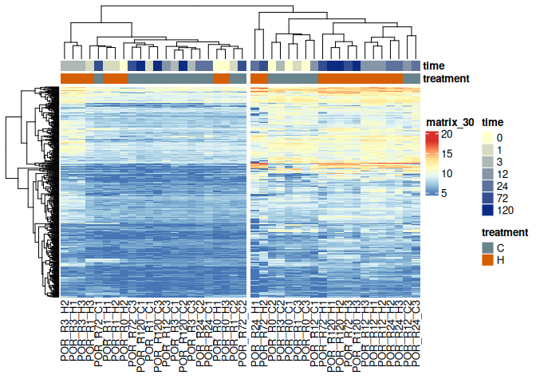<!-- -->

### DE Heat stress genes

``` r
plot_df <- as.data.frame(t(stress_genes_vsd)) %>%
  rownames_to_column(var="sample") %>%
  left_join(meta, by=c("sample"="sample")) %>%
  pivot_longer(cols = all_of(stress_genes_ids), names_to="query", values_to="expression") %>%
  left_join(HeatStressGenes_Pcomp_unique) %>% left_join(DE_05 %>% rownames_to_column(var="query")) %>%
  filter(!is.na(padj))

plot_df %>% ggplot(aes(x=time, y=expression, color=gene_id, group=gene_id)) +
  stat_summary(fun="mean", geom="line") +
  stat_summary(fun.data=mean_se, geom="errorbar", width=0.2) +
  facet_wrap(treatment~response_type) +
  theme_bw() +
  labs(y="VST expression", x="Timepoint")
```

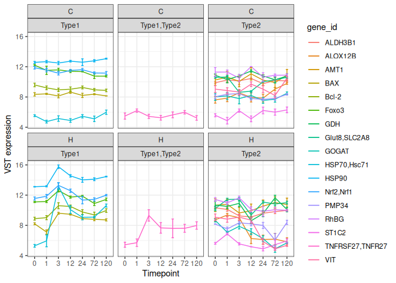<!-- -->

``` r
plot_df %>% filter(grepl("Type1", response_type)) %>%
  ggplot(aes(x=time, y=expression, color=treatment, group=interaction(treatment,query))) +
  stat_summary(fun="mean", geom="line", alpha=0.6) +
  stat_summary(fun.data=mean_se, geom="errorbar", width=0.2,linewidth=0.5, alpha=0.6) +
  scale_color_manual(values = treat_colors) +
  facet_wrap(~gene_id, ncol= 3,scales="free_y") +
  theme_bw() +
  theme(
    strip.text = element_text(face="bold", size=8),panel.spacing = unit(0.4, "lines")
  ) +
  labs(y="VST expression", x="Timepoint", title = "Type 1 DE (LRT) Response genes")
```

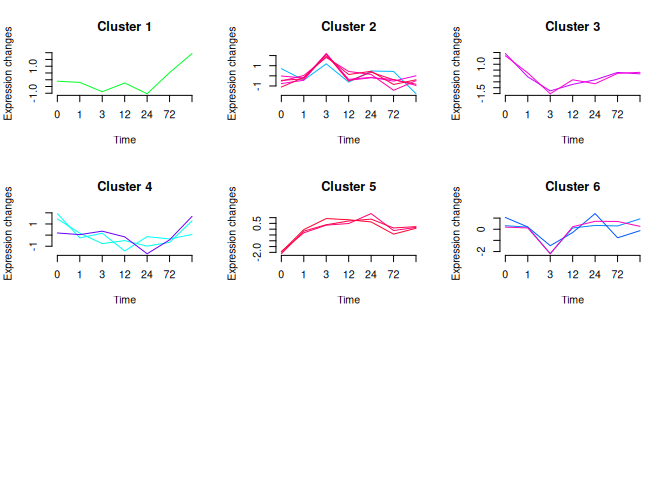<!-- -->

``` r
save_ggplot(last_plot(), "DE_Type1")

plot_df %>% filter(grepl("Type2", response_type)) %>%
  ggplot(aes(x=time, y=expression, color=treatment, group=interaction(treatment,query))) +
  stat_summary(fun="mean", geom="line", alpha=0.6) +
  stat_summary(fun.data=mean_se, geom="errorbar", width=0.2,linewidth=0.5, alpha=0.6) +
  scale_color_manual(values = treat_colors) +
  facet_wrap(~gene_id, ncol= 3,scales="free_y") +
  theme_bw() +
  theme(
    strip.text = element_text(face="bold", size=8),panel.spacing = unit(0.4, "lines")
  ) +
  labs(y="VST expression", x="Timepoint", title = "Type 2 DE (LRT) Response genes")
```

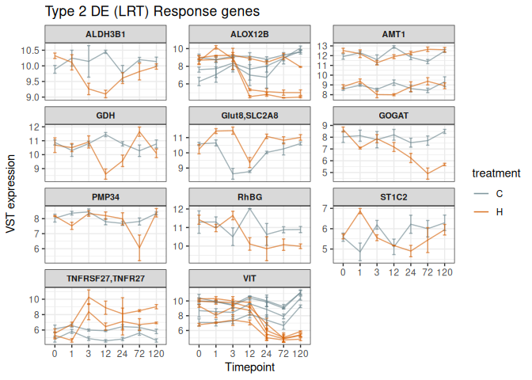<!-- -->

``` r
save_ggplot(last_plot(), "DE_Type2")

plot_df %>% filter(grepl("HSP",gene_id)|grepl("Nrf2",gene_id)|grepl("HSF1",gene_id)) %>% ggplot(aes(x=time, y=expression, color=treatment, group=treatment)) +
  stat_summary(fun="mean", geom="line") +
  scale_color_manual(values = treat_colors) +
  stat_summary(fun.data=mean_se, geom="errorbar", width=0.2) +
  facet_wrap(~paste0(str_replace(query,"Porites_compressa_HIv1___",""), ": ", gene_id)) +
  theme_bw() +
  labs(y="VST expression", x="Timepoint")
```

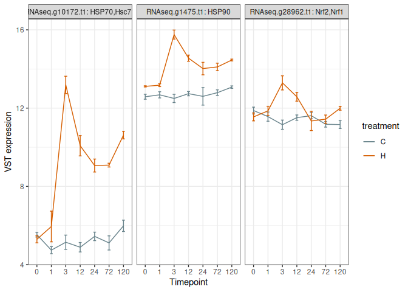<!-- -->

``` r
plot_df %>% filter(grepl("HSP",gene_id)|grepl("Nrf2",gene_id)|grepl("HSF1",gene_id)) %>% ggplot(aes(x=time, y=expression, color=treatment, group=treatment)) +
  stat_summary(fun="mean", geom="line") +
  scale_color_manual(values = treat_colors) +
  stat_summary(fun.data=mean_se, geom="errorbar", width=0.2) +
  facet_wrap(~paste0(gene_id, ": ",str_replace(query,"Porites_compressa_HIv1___","")),scales="free_y") +
  theme_bw() +
  labs(y="VST expression", x="Timepoint", title = "Selected Type 1 DE (LRT) Response genes")
```

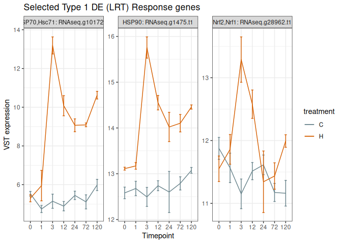<!-- -->

``` r
save_ggplot(last_plot(), "highlighted_DE_Type1")

plot_df %>% filter(grepl("GDH",gene_id)|grepl("GS",gene_id)|grepl("AMT1",gene_id)) %>% ggplot(aes(x=time, y=expression, color=treatment, group=treatment)) +
  stat_summary(fun="mean", geom="line") +
  scale_color_manual(values = treat_colors) +
  stat_summary(fun.data=mean_se, geom="errorbar", width=0.2) +
  facet_wrap(~paste0(gene_id, ": ",str_replace(query,"Porites_compressa_HIv1___","")),scales="free_y") +
  theme_bw() +
  labs(y="VST expression", x="Timepoint", title = "Selected Type 2 DE (LRT) Response genes")
```

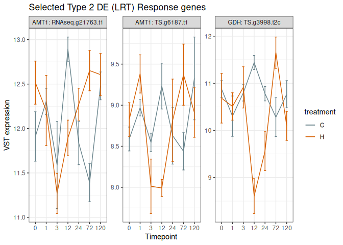<!-- -->

``` r
save_ggplot(last_plot(), "highlighted_DE_Type2")
```

### ImpulseDE2

Based on [this
paper](https://academic.oup.com/bib/article/20/1/288/4364840#130283262),
this is the best package to use other than comparing each time point
against each other individually. I am also planning to ID gene modules
via WGCNA.

Repo here: <https://github.com/YosefLab/ImpulseDE2>

Tutorial here:
<http://bioconductor.statistik.tu-dortmund.de/packages/3.11/bioc/vignettes/ImpulseDE2/inst/doc/ImpulseDE2_Tutorial.html>
, I followed closely with the section “Case-control differential
expression analysis”

Read the ImpulseDE2 paper
[here](https://academic.oup.com/nar/article/46/20/e119/5068248)

David S Fischer, Fabian J Theis, Nir Yosef, Impulse model-based
differential expression analysis of time course sequencing data, Nucleic
Acids Research, Volume 46, Issue 20, 16 November 2018, Page e119,
<https://doi.org/10.1093/nar/gky675>

``` r
#library(devtools)
#install_github("YosefLab/ImpulseDE2")

library(ImpulseDE2)
```

First, reformat our metadata table to match the column names used in the
ImpulseDE2 vignette.

``` r
meta_impulse <- meta %>%
  dplyr::rename(Sample = sample, Time = time, Batch = replicate) %>% 
  mutate(Time = as.numeric(as.character(Time)),
         #Time = as.numeric(Time),
         Condition = str_replace(treatment, "C", "control"),
         Condition = str_replace(Condition, "H", "case")
         ) %>%
  select(-c(species,treatment))
```

Then, generate the ImpulseDE2 object

``` r
#test with just 500 genes that I determined to be DE by treatment/timepoint with DESeq2 
objectImpulseDE2 <- runImpulseDE2(
  matCountData    = as.matrix(filtered_counts)[top_500_DE_genes,], #or use filtered_counts 
  dfAnnotation    = meta_impulse,
  boolCaseCtrl    = TRUE,
  vecConfounders  = c("Batch"), #only use if you want to try to control for batch effects
  boolIdentifyTransients = TRUE, #use if you want to ID transiently- vs permanently-regulated genes
  scaNProc        = 8 )

#run with all genes
objectImpulseDE2 <- runImpulseDE2(
  matCountData    = as.matrix(counts_raw), #or use filtered_counts 
  dfAnnotation    = meta_impulse,
  boolCaseCtrl    = TRUE,
  vecConfounders  = c("Batch"), #only use if you want to try to control for batch effects
  boolIdentifyTransients = TRUE, #use if you want to ID transiently- vs permanently-regulated genes
  scaNProc        = 18 )

saveRDS(objectImpulseDE2, file = paste0(outdir, "/objectImpulseDE2.rds"))
```

``` r
objectImpulseDE2 <- readRDS(paste0(outdir, "/objectImpulseDE2.rds"))

impulse_results <- objectImpulseDE2$dfImpulseDE2Results
head(impulse_results)
```

    ##                                                                              Gene
    ## Porites_compressa_HIv1___RNAseq.g9868.t1 Porites_compressa_HIv1___RNAseq.g9868.t1
    ## Porites_compressa_HIv1___TS.g4306.t1         Porites_compressa_HIv1___TS.g4306.t1
    ## Porites_compressa_HIv1___TS.g4309.t1                                         <NA>
    ## Porites_compressa_HIv1___TS.g4310.t1                                         <NA>
    ## Porites_compressa_HIv1___RNAseq.g9679.t1                                     <NA>
    ## Porites_compressa_HIv1___RNAseq.g9682.t1 Porites_compressa_HIv1___RNAseq.g9682.t1
    ##                                                  p padj loglik_full loglik_red
    ## Porites_compressa_HIv1___RNAseq.g9868.t1 0.9917506    1  -25.137228 -25.392255
    ## Porites_compressa_HIv1___TS.g4306.t1     1.0000000    1   -3.850928  -3.850814
    ## Porites_compressa_HIv1___TS.g4309.t1            NA   NA          NA         NA
    ## Porites_compressa_HIv1___TS.g4310.t1            NA   NA          NA         NA
    ## Porites_compressa_HIv1___RNAseq.g9679.t1        NA   NA          NA         NA
    ## Porites_compressa_HIv1___RNAseq.g9682.t1 0.9659703    1  -31.844187 -32.322613
    ##                                          df_full df_red         mean
    ## Porites_compressa_HIv1___RNAseq.g9868.t1      17     12 7.522115e-01
    ## Porites_compressa_HIv1___TS.g4306.t1          17     12 1.860825e-06
    ## Porites_compressa_HIv1___TS.g4309.t1          NA     NA           NA
    ## Porites_compressa_HIv1___TS.g4310.t1          NA     NA           NA
    ## Porites_compressa_HIv1___RNAseq.g9679.t1      NA     NA           NA
    ## Porites_compressa_HIv1___RNAseq.g9682.t1      17     12 2.033463e-01
    ##                                          converge_combined converge_case
    ## Porites_compressa_HIv1___RNAseq.g9868.t1                 0             0
    ## Porites_compressa_HIv1___TS.g4306.t1                     0             0
    ## Porites_compressa_HIv1___TS.g4309.t1                    NA            NA
    ## Porites_compressa_HIv1___TS.g4310.t1                    NA            NA
    ## Porites_compressa_HIv1___RNAseq.g9679.t1                NA            NA
    ## Porites_compressa_HIv1___RNAseq.g9682.t1                 0             0
    ##                                          converge_control converge_sigmoid
    ## Porites_compressa_HIv1___RNAseq.g9868.t1                0                0
    ## Porites_compressa_HIv1___TS.g4306.t1                    0                0
    ## Porites_compressa_HIv1___TS.g4309.t1                   NA               NA
    ## Porites_compressa_HIv1___TS.g4310.t1                   NA               NA
    ## Porites_compressa_HIv1___RNAseq.g9679.t1               NA               NA
    ## Porites_compressa_HIv1___RNAseq.g9682.t1                0                0
    ##                                          impulseTOsigmoid_p
    ## Porites_compressa_HIv1___RNAseq.g9868.t1          0.8085221
    ## Porites_compressa_HIv1___TS.g4306.t1              1.0000000
    ## Porites_compressa_HIv1___TS.g4309.t1                     NA
    ## Porites_compressa_HIv1___TS.g4310.t1                     NA
    ## Porites_compressa_HIv1___RNAseq.g9679.t1                 NA
    ## Porites_compressa_HIv1___RNAseq.g9682.t1          0.4845805
    ##                                          impulseTOsigmoid_padj sigmoidTOconst_p
    ## Porites_compressa_HIv1___RNAseq.g9868.t1             1.0000000        0.8244647
    ## Porites_compressa_HIv1___TS.g4306.t1                 1.0000000        1.0000000
    ## Porites_compressa_HIv1___TS.g4309.t1                        NA               NA
    ## Porites_compressa_HIv1___TS.g4310.t1                        NA               NA
    ## Porites_compressa_HIv1___RNAseq.g9679.t1                    NA               NA
    ## Porites_compressa_HIv1___RNAseq.g9682.t1             0.8832432        0.9959793
    ##                                          sigmoidTOconst_padj isTransient
    ## Porites_compressa_HIv1___RNAseq.g9868.t1                   1       FALSE
    ## Porites_compressa_HIv1___TS.g4306.t1                       1       FALSE
    ## Porites_compressa_HIv1___TS.g4309.t1                      NA          NA
    ## Porites_compressa_HIv1___TS.g4310.t1                      NA          NA
    ## Porites_compressa_HIv1___RNAseq.g9679.t1                  NA          NA
    ## Porites_compressa_HIv1___RNAseq.g9682.t1                   1       FALSE
    ##                                          isMonotonous allZero
    ## Porites_compressa_HIv1___RNAseq.g9868.t1        FALSE   FALSE
    ## Porites_compressa_HIv1___TS.g4306.t1            FALSE   FALSE
    ## Porites_compressa_HIv1___TS.g4309.t1               NA    TRUE
    ## Porites_compressa_HIv1___TS.g4310.t1               NA    TRUE
    ## Porites_compressa_HIv1___RNAseq.g9679.t1           NA    TRUE
    ## Porites_compressa_HIv1___RNAseq.g9682.t1        FALSE   FALSE

``` r
write.table(impulse_results,file.path(outdir, "ImpulseDE2_Results.txt"),row.names=F,quote=F,sep="\t")

# Genes with significant treatment effect on temporal trajectory
sig_genes <- impulse_results[impulse_results$padj < 0.05 & 
                               impulse_results$loglik_full > impulse_results$loglik_red, ]

nrow(sig_genes)
```

    ## [1] 9118

``` r
head(sig_genes[order(sig_genes$padj), ])
```

    ##                                                                                Gene
    ## Porites_compressa_HIv1___RNAseq.g40862.t1 Porites_compressa_HIv1___RNAseq.g40862.t1
    ## Porites_compressa_HIv1___RNAseq.12682_t     Porites_compressa_HIv1___RNAseq.12682_t
    ## Porites_compressa_HIv1___RNAseq.g19794.t1 Porites_compressa_HIv1___RNAseq.g19794.t1
    ## Porites_compressa_HIv1___RNAseq.g24271.t1 Porites_compressa_HIv1___RNAseq.g24271.t1
    ## Porites_compressa_HIv1___RNAseq.g40324.t1 Porites_compressa_HIv1___RNAseq.g40324.t1
    ## Porites_compressa_HIv1___RNAseq.g41296.t1 Porites_compressa_HIv1___RNAseq.g41296.t1
    ##                                                      p         padj loglik_full
    ## Porites_compressa_HIv1___RNAseq.g40862.t1 1.444275e-46 5.560314e-42   -345.3443
    ## Porites_compressa_HIv1___RNAseq.12682_t   1.785042e-32 3.436116e-28   -209.9890
    ## Porites_compressa_HIv1___RNAseq.g19794.t1 1.149079e-28 1.474613e-24   -192.9607
    ## Porites_compressa_HIv1___RNAseq.g24271.t1 7.430912e-27 7.152067e-23   -240.6193
    ## Porites_compressa_HIv1___RNAseq.g40324.t1 1.539538e-26 1.185414e-22   -309.1734
    ## Porites_compressa_HIv1___RNAseq.g41296.t1 3.540472e-26 2.271744e-22   -198.1882
    ##                                           loglik_red df_full df_red       mean
    ## Porites_compressa_HIv1___RNAseq.g40862.t1  -457.7068      17     12 9609.45623
    ## Porites_compressa_HIv1___RNAseq.12682_t    -289.3881      17     12  299.57639
    ## Porites_compressa_HIv1___RNAseq.g19794.t1  -263.4130      17     12   93.93792
    ## Porites_compressa_HIv1___RNAseq.g24271.t1  -306.8102      17     12  490.66126
    ## Porites_compressa_HIv1___RNAseq.g40324.t1  -374.6191      17     12 2700.51478
    ## Porites_compressa_HIv1___RNAseq.g41296.t1  -262.7818      17     12  151.12608
    ##                                           converge_combined converge_case
    ## Porites_compressa_HIv1___RNAseq.g40862.t1                 0             0
    ## Porites_compressa_HIv1___RNAseq.12682_t                   0             0
    ## Porites_compressa_HIv1___RNAseq.g19794.t1                 0             0
    ## Porites_compressa_HIv1___RNAseq.g24271.t1                 0             0
    ## Porites_compressa_HIv1___RNAseq.g40324.t1                 0             0
    ## Porites_compressa_HIv1___RNAseq.g41296.t1                 0             0
    ##                                           converge_control converge_sigmoid
    ## Porites_compressa_HIv1___RNAseq.g40862.t1                0                0
    ## Porites_compressa_HIv1___RNAseq.12682_t                  0                0
    ## Porites_compressa_HIv1___RNAseq.g19794.t1                0                0
    ## Porites_compressa_HIv1___RNAseq.g24271.t1                0                0
    ## Porites_compressa_HIv1___RNAseq.g40324.t1                0                0
    ## Porites_compressa_HIv1___RNAseq.g41296.t1                0                0
    ##                                           impulseTOsigmoid_p
    ## Porites_compressa_HIv1___RNAseq.g40862.t1       5.983611e-15
    ## Porites_compressa_HIv1___RNAseq.12682_t         2.704661e-06
    ## Porites_compressa_HIv1___RNAseq.g19794.t1       1.000000e+00
    ## Porites_compressa_HIv1___RNAseq.g24271.t1       1.348840e-03
    ## Porites_compressa_HIv1___RNAseq.g40324.t1       1.208993e-20
    ## Porites_compressa_HIv1___RNAseq.g41296.t1       3.602406e-02
    ##                                           impulseTOsigmoid_padj
    ## Porites_compressa_HIv1___RNAseq.g40862.t1          4.701287e-12
    ## Porites_compressa_HIv1___RNAseq.12682_t            1.718263e-04
    ## Porites_compressa_HIv1___RNAseq.g19794.t1          1.000000e+00
    ## Porites_compressa_HIv1___RNAseq.g24271.t1          1.929729e-02
    ## Porites_compressa_HIv1___RNAseq.g40324.t1          2.585835e-17
    ## Porites_compressa_HIv1___RNAseq.g41296.t1          1.860358e-01
    ##                                           sigmoidTOconst_p sigmoidTOconst_padj
    ## Porites_compressa_HIv1___RNAseq.g40862.t1     3.697629e-52        7.117752e-48
    ## Porites_compressa_HIv1___RNAseq.12682_t       1.058081e-48        1.357835e-44
    ## Porites_compressa_HIv1___RNAseq.g19794.t1     7.940164e-54        3.056884e-49
    ## Porites_compressa_HIv1___RNAseq.g24271.t1     2.378702e-36        1.144721e-32
    ## Porites_compressa_HIv1___RNAseq.g40324.t1     8.338210e-31        1.783404e-27
    ## Porites_compressa_HIv1___RNAseq.g41296.t1     8.434002e-35        3.247006e-31
    ##                                           isTransient isMonotonous allZero
    ## Porites_compressa_HIv1___RNAseq.g40862.t1       FALSE         TRUE   FALSE
    ## Porites_compressa_HIv1___RNAseq.12682_t         FALSE         TRUE   FALSE
    ## Porites_compressa_HIv1___RNAseq.g19794.t1       FALSE         TRUE   FALSE
    ## Porites_compressa_HIv1___RNAseq.g24271.t1       FALSE         TRUE   FALSE
    ## Porites_compressa_HIv1___RNAseq.g40324.t1        TRUE        FALSE   FALSE
    ## Porites_compressa_HIv1___RNAseq.g41296.t1       FALSE         TRUE   FALSE

``` r
library(ComplexHeatmap)

lsHeatmaps <- plotHeatmap(
  objectImpulseDE2       = objectImpulseDE2,
  strCondition           = "case",
  boolIdentifyTransients = TRUE, #set to true if true above
  scaQThres              = 0.01)
draw(lsHeatmaps$complexHeatmapRaw) 
```

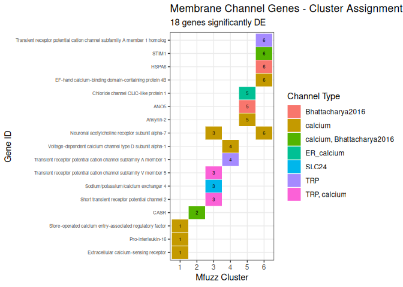<!-- -->

``` r
png(paste0(outdir,"/ImpulseDE/ImpulseDE2_heatmap.png"), width = 2000, height = 2400, res = 300)
draw(lsHeatmaps$complexHeatmapRaw)
dev.off()
```

    ## png 
    ##   2

``` r
majerova_genes <- HeatStressGenes_Pcomp %>% filter(ref_first_author =="Majerova")
stress_genes_ids <- unique(majerova_genes$query)
plot_stress_genes <- stress_genes_ids[stress_genes_ids %in% rownames(objectImpulseDE2@matCountDataProc)]

impulse_results %>% filter(Gene %in% stress_genes_ids) %>% arrange(padj) %>% left_join(HeatStressGenes_Pcomp_unique, by = join_by(Gene==query))
```

    ##                                         Gene            p         padj
    ## 1      Porites_compressa_HIv1___TS.g16287.t1 1.261458e-13 5.518734e-11
    ## 2  Porites_compressa_HIv1___RNAseq.g10172.t1 3.846990e-11 8.511797e-09
    ## 3  Porites_compressa_HIv1___RNAseq.g12818.t1 1.304024e-07 1.052487e-05
    ## 4  Porites_compressa_HIv1___RNAseq.g28962.t1 6.462794e-06 2.761500e-04
    ## 5  Porites_compressa_HIv1___RNAseq.g40602.t1 8.078547e-05 2.158334e-03
    ## 6        Porites_compressa_HIv1___TS.g982.t1 1.589032e-03 2.218134e-02
    ## 7  Porites_compressa_HIv1___RNAseq.g29198.t1 2.438273e-02 1.705506e-01
    ## 8   Porites_compressa_HIv1___RNAseq.g8182.t1 3.467725e-02 2.205583e-01
    ## 9  Porites_compressa_HIv1___RNAseq.g25821.t1 1.245956e-01 5.224143e-01
    ## 10  Porites_compressa_HIv1___RNAseq.g4837.t1 8.129055e-01 1.000000e+00
    ## 11 Porites_compressa_HIv1___RNAseq.g39940.t1 4.314555e-01 1.000000e+00
    ## 12 Porites_compressa_HIv1___RNAseq.g16374.t1 5.174867e-01 1.000000e+00
    ## 13 Porites_compressa_HIv1___RNAseq.g27468.t1 5.878061e-01 1.000000e+00
    ##    loglik_full loglik_red df_full df_red         mean converge_combined
    ## 1   -276.01269 -310.79585      17     12  684.6283272                 0
    ## 2   -217.36204 -246.15008      17     12   11.7711762                 0
    ## 3   -244.87368 -265.01964      17     12  306.5868096                 0
    ## 4   -343.79470 -359.70241      17     12 2849.3022295                 0
    ## 5   -336.92645 -350.03779      17     12 2457.1732425                 0
    ## 6   -306.50506 -316.22655      17     12  601.7781322                 0
    ## 7   -265.41825 -271.86576      17     12  248.5890079                 0
    ## 8   -308.10943 -314.11347      17     12 1462.3644030                 0
    ## 9   -324.36793 -328.68480      17     12 1116.2528933                 0
    ## 10  -220.65522 -221.78254      17     12  110.2963144                 0
    ## 11   -80.35187  -82.78885      17     12    0.2755157                 0
    ## 12  -289.78216 -291.89470      17     12  439.5541347                 0
    ## 13  -337.86862 -339.73733      17     12 4780.4888836                 0
    ##    converge_case converge_control converge_sigmoid impulseTOsigmoid_p
    ## 1              0                0                0       4.834378e-20
    ## 2              0                0                0       1.183871e-20
    ## 3              0                0                0       1.346497e-15
    ## 4              0                0                0       9.925605e-08
    ## 5              0                0                0       9.695619e-07
    ## 6              0                0                0       5.407888e-05
    ## 7              0                0                0       9.267664e-04
    ## 8              0                0                0       8.525076e-02
    ## 9              0                0                0       4.326380e-01
    ## 10             0                0                0       3.133143e-01
    ## 11             0                0                0       1.543946e-02
    ## 12             0                0                0       1.905614e-02
    ## 13             0                0                0       3.265727e-01
    ##    impulseTOsigmoid_padj sigmoidTOconst_p sigmoidTOconst_padj isTransient
    ## 1           9.305936e-17     0.1859511562         0.749720411        TRUE
    ## 2           2.585835e-17     0.0055795584         0.052213763        TRUE
    ## 3           1.205553e-12     0.2288512999         0.859146386        TRUE
    ## 4           1.154459e-05     0.0001791694         0.002876498        TRUE
    ## 5           7.975890e-05     0.3546528940         1.000000000        TRUE
    ## 6           1.712379e-03     0.8743862575         1.000000000       FALSE
    ## 7           1.462278e-02     0.1467437755         0.642863975       FALSE
    ## 8           3.208279e-01     0.0720794875         0.389413608       FALSE
    ## 9           8.326549e-01     0.3269466311         1.000000000       FALSE
    ## 10          6.973003e-01     0.8947829027         1.000000000       FALSE
    ## 11          1.064250e-01     0.0491092300         0.291138935       FALSE
    ## 12          1.227032e-01     0.9778073239         1.000000000       FALSE
    ## 13          7.134929e-01     0.2445297946         0.893924075       FALSE
    ##    isMonotonous allZero     gene_id response_type     category
    ## 1         FALSE   FALSE       Bcl-2         Type1    Apoptosis
    ## 2         FALSE   FALSE HSP70,Hsc71         Type1          UPR
    ## 3         FALSE   FALSE         BAX         Type1    Apoptosis
    ## 4         FALSE   FALSE   Nrf2,Nrf1         Type1 ROS response
    ## 5         FALSE   FALSE       Foxo3         Type1 ROS response
    ## 6         FALSE   FALSE       Bcl-2         Type1    Apoptosis
    ## 7         FALSE   FALSE       Bcl-2         Type1    Apoptosis
    ## 8         FALSE   FALSE          GR         Type1 ROS response
    ## 9         FALSE   FALSE        HSF1         Type1          UPR
    ## 10        FALSE   FALSE         BAK         Type1    Apoptosis
    ## 11        FALSE   FALSE HSP70,Hsc71         Type1          UPR
    ## 12        FALSE   FALSE        AMPK         Type1 ROS response
    ## 13        FALSE   FALSE        BI-1         Type1    Apoptosis

``` r
heatgenes <- plotGenes(
  vecGeneIDs       = plot_stress_genes,
  objectImpulseDE2 = objectImpulseDE2,
  boolSimplePlot = TRUE,   boolCaseCtrl     = TRUE,
  dirOut           = "../output_RNA/differential_expression/POR_Pcomp/ImpulseDE/",
  strFileName = "stress_genes_Majerova.pdf",
  boolMultiplePlotsPerPage = FALSE,
  strNameRefMethod = NULL)
```

    ## [1] "Creating ../output_RNA/differential_expression/POR_Pcomp/ImpulseDE/stress_genes_Majerova.pdf"

``` r
heatgenes
```

    ## [[1]]

    ## 
    ## [[2]]

    ## 
    ## [[3]]

    ## 
    ## [[4]]

    ## 
    ## [[5]]

    ## 
    ## [[6]]

    ## 
    ## [[7]]

    ## 
    ## [[8]]

    ## 
    ## [[9]]

    ## 
    ## [[10]]

    ## 
    ## [[11]]

    ## 
    ## [[12]]

    ## 
    ## [[13]]

``` r
HSPS <- impulse_results %>% filter(Gene %in% stress_genes_ids) %>% arrange(padj) %>% left_join(HeatStressGenes_Pcomp_unique, by = join_by(Gene==query)) %>% filter(grepl("HSP",gene_id)) %>% pull(Gene)

HSPs <- plotGenes(
  vecGeneIDs       = HSPS,
  objectImpulseDE2 = objectImpulseDE2,
  boolSimplePlot = TRUE,
  boolCaseCtrl     = TRUE,
  dirOut           = "../output_RNA/differential_expression/POR_Pcomp/ImpulseDE/",
  strFileName = "HSPs.pdf",
  boolMultiplePlotsPerPage = FALSE,
  strNameRefMethod = NULL)
```

    ## [1] "Creating ../output_RNA/differential_expression/POR_Pcomp/ImpulseDE/HSPs.pdf"

``` r
HSPs
```

    ## [[1]]

    ## 
    ## [[2]]

``` r
lsgplotsGenes <- plotGenes(
  vecGeneIDs       = NULL,
  scaNTopIDs       = 10,
  objectImpulseDE2 = objectImpulseDE2,
  boolSimplePlot = TRUE,
  boolCaseCtrl     = TRUE,
  dirOut           = "../output_RNA/differential_expression/POR_Pcomp/ImpulseDE/",
  boolMultiplePlotsPerPage = FALSE,
  strNameRefMethod = NULL)
```

    ## [1] "Creating ../output_RNA/differential_expression/POR_Pcomp/ImpulseDE/ImpulseDE2_Trajectories.pdf"

``` r
lsgplotsGenes
```

    ## [[1]]

    ## 
    ## [[2]]

    ## 
    ## [[3]]

    ## 
    ## [[4]]

    ## 
    ## [[5]]

    ## 
    ## [[6]]

    ## 
    ## [[7]]

    ## 
    ## [[8]]

    ## 
    ## [[9]]

    ## 
    ## [[10]]

``` r
top_500_DE_genes <- impulse_results %>% arrange(padj) %>% head(500) %>% rownames()

#view top 500 most vairable genes
pheatmap(vsd_mat[top_500_DE_genes, ], cluster_rows=TRUE, show_rownames=FALSE,
         cluster_cols=FALSE, #cutree_cols = 2,
         annotation_col= meta[,c("treatment","time")],
         annotation_colors = list("treatment" = treat_colors,
                                  "time" = time_colors))
```

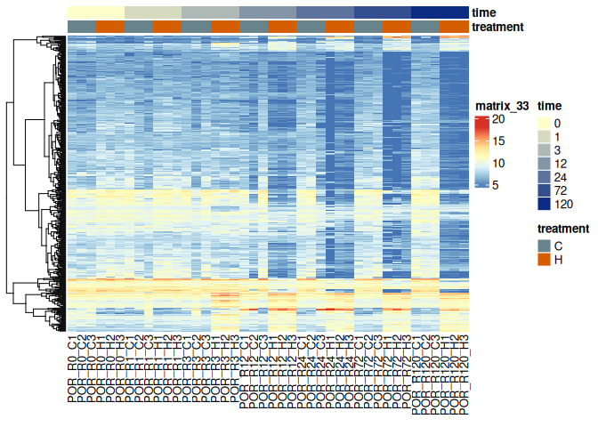<!-- -->

``` r
pheatmap(vsd_mat[top_500_DE_genes, ], cluster_rows=TRUE, show_rownames=FALSE,
         cluster_cols=TRUE, cutree_cols = 2,
         annotation_col= meta[,c("treatment","time")],
         annotation_colors = list("treatment" = treat_colors,
                                  "time" = time_colors))
```

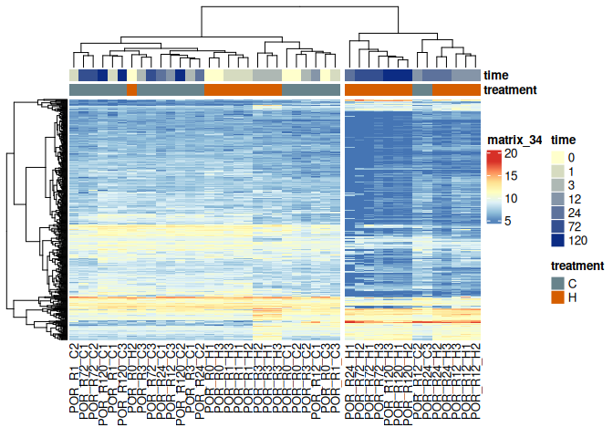<!-- -->
