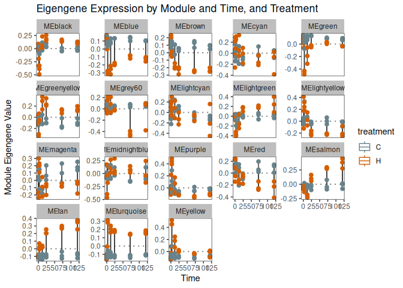
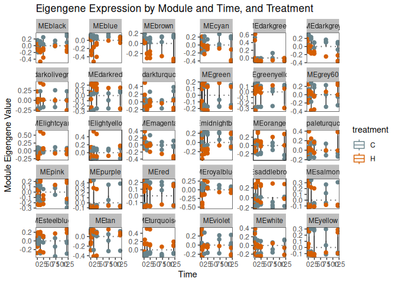

WGCNA
================
Zoe Dellaert
2025-11-28

### Network analysis of Time Series Bulk RNA Data – WGCNA

First, download the necessary packages.

``` r
install.packages("BiocManager")
library("BiocManager")
BiocManager::install("impute", type = "source")
BiocManager::install("WGCNA",force = TRUE)
BiocManager::install("vsn")
install.packages("dendextend")
install.packages("car")
```

Next, load the packages

``` r
library(tidyverse)
library(WGCNA)
sessionInfo()
```

    ## R version 4.5.1 (2025-06-13)
    ## Platform: x86_64-pc-linux-gnu
    ## Running under: Ubuntu 24.04.1 LTS
    ## 
    ## Matrix products: default
    ## BLAS:   /usr/lib/x86_64-linux-gnu/openblas-pthread/libblas.so.3 
    ## LAPACK: /usr/lib/x86_64-linux-gnu/openblas-pthread/libopenblasp-r0.3.26.so;  LAPACK version 3.12.0
    ## 
    ## locale:
    ##  [1] LC_CTYPE=en_US.UTF-8       LC_NUMERIC=C              
    ##  [3] LC_TIME=en_US.UTF-8        LC_COLLATE=en_US.UTF-8    
    ##  [5] LC_MONETARY=en_US.UTF-8    LC_MESSAGES=en_US.UTF-8   
    ##  [7] LC_PAPER=en_US.UTF-8       LC_NAME=C                 
    ##  [9] LC_ADDRESS=C               LC_TELEPHONE=C            
    ## [11] LC_MEASUREMENT=en_US.UTF-8 LC_IDENTIFICATION=C       
    ## 
    ## time zone: Etc/UTC
    ## tzcode source: system (glibc)
    ## 
    ## attached base packages:
    ## [1] stats     graphics  grDevices utils     datasets  methods   base     
    ## 
    ## other attached packages:
    ##  [1] WGCNA_1.73            fastcluster_1.3.0     dynamicTreeCut_1.63-1
    ##  [4] lubridate_1.9.4       forcats_1.0.0         stringr_1.6.0        
    ##  [7] dplyr_1.1.4           purrr_1.2.0           readr_2.1.5          
    ## [10] tidyr_1.3.1           tibble_3.3.0          ggplot2_4.0.1        
    ## [13] tidyverse_2.0.0      
    ## 
    ## loaded via a namespace (and not attached):
    ##  [1] tidyselect_1.2.1        farver_2.1.2            blob_1.2.4             
    ##  [4] Biostrings_2.76.0       S7_0.2.1                fastmap_1.2.0          
    ##  [7] rpart_4.1.24            digest_0.6.39           timechange_0.3.0       
    ## [10] lifecycle_1.0.4         cluster_2.1.8.1         survival_3.8-3         
    ## [13] KEGGREST_1.48.1         RSQLite_2.4.1           magrittr_2.0.4         
    ## [16] compiler_4.5.1          rlang_1.1.6             Hmisc_5.2-3            
    ## [19] tools_4.5.1             yaml_2.3.10             data.table_1.17.8      
    ## [22] knitr_1.50              htmlwidgets_1.6.4       bit_4.6.0              
    ## [25] RColorBrewer_1.1-3      withr_3.0.2             foreign_0.8-90         
    ## [28] BiocGenerics_0.56.0     nnet_7.3-20             grid_4.5.1             
    ## [31] stats4_4.5.1            preprocessCore_1.70.0   colorspace_2.1-2       
    ## [34] GO.db_3.21.0            scales_1.4.0            iterators_1.0.14       
    ## [37] dichromat_2.0-0.1       cli_3.6.5               rmarkdown_2.29         
    ## [40] crayon_1.5.3            generics_0.1.4          rstudioapi_0.17.1      
    ## [43] httr_1.4.7              tzdb_0.5.0              DBI_1.2.3              
    ## [46] cachem_1.1.0            splines_4.5.1           parallel_4.5.1         
    ## [49] impute_1.82.0           AnnotationDbi_1.70.0    XVector_0.50.0         
    ## [52] matrixStats_1.5.0       base64enc_0.1-3         vctrs_0.6.5            
    ## [55] Matrix_1.7-3            jsonlite_2.0.0          IRanges_2.44.0         
    ## [58] hms_1.1.3               S4Vectors_0.48.0        bit64_4.6.0-1          
    ## [61] htmlTable_2.4.3         Formula_1.2-5           foreach_1.5.2          
    ## [64] glue_1.8.0              codetools_0.2-20        stringi_1.8.7          
    ## [67] gtable_0.3.6            GenomeInfoDb_1.44.3     UCSC.utils_1.4.0       
    ## [70] pillar_1.11.1           htmltools_0.5.8.1       GenomeInfoDbData_1.2.14
    ## [73] R6_2.6.1                doParallel_1.0.17       evaluate_1.0.5         
    ## [76] Biobase_2.70.0          lattice_0.22-7          backports_1.5.0        
    ## [79] png_0.1-8               memoise_2.0.1           Rcpp_1.1.0             
    ## [82] checkmate_2.3.2         gridExtra_2.3           xfun_0.54              
    ## [85] pkgconfig_2.0.3

``` r
#set standard output directory for figures
save_ggplot <- function(plot, filename, width = 10, height = 7, units = "in", dpi = 300,bg=NULL) {
  print(plot)

  png_path <- file.path(outdir, paste0(filename, ".png"))
  pdf_dir <- file.path(outdir, "pdf_figs")
  pdf_path <- file.path(pdf_dir, paste0(filename, ".pdf"))
  
  # Ensure the pdf_figs directory exists
  if (!dir.exists(pdf_dir)) dir.create(pdf_dir, recursive = TRUE)
  
  # Save plots
  ggsave(filename = png_path, plot = plot, width = width, height = height, units = units, dpi = dpi,bg = bg)
  ggsave(filename = pdf_path, plot = plot, width = width, height = height, units = units, dpi = dpi,bg = bg)
}

treat_colors <- c("C" = "lightblue4", "H" = "#D55E00")

# The following setting is important, do not omit.
options(stringsAsFactors = FALSE)
```

## POC: pre-processing and visualization

Read in variance-stabilized count info and metadata

``` r
outdir <- "../output_RNA/WGCNA/POC_PacutaV2/"
vst <- read.csv("../output_RNA/differential_expression/POC_PacutaV2/vsd_expression_matrix.csv")

vst <- vst %>% column_to_rownames(var = "X")
vst2 <- t(vst)

meta <- read.csv("../output_RNA/differential_expression/POC_PacutaV2/RNA_seq_metadata.csv")
meta <- meta %>% column_to_rownames(var = "X")
```

### Check for genes and samples with too many missing values with goodSamplesGenes. There shouldn’t be any because we performed pre-filtering

``` r
dim(vst) #  24788 genes; 42  samples
```

    ## [1] 24788    42

``` r
gsg <- goodSamplesGenes(vst, verbose = 3);  # We first check for genes and samples with too many missing values
```

    ##  Flagging genes and samples with too many missing values...
    ##   ..step 1

``` r
gsg$allOK # If the statement returns TRUE, all genes have passed the cuts. 
```

    ## [1] TRUE

``` r
###Soft threshold
dim(vst2) #  24788    42
```

    ## [1]    42 24788

``` r
# Choose a set of soft-thresholding powers
powers = c(c(1:10), seq(from = 12, to=40, by=2))
#powers <- c(seq(from = 1, to=19, by=2), c(21:30))

# Call the network topology analysis function

#the below takes a long time to run, so is commented out and the pre-run results are loaded in below
#sft = pickSoftThreshold(vst2, powerVector = powers, verbose = 5)
#save(sft, file = paste0(outdir, "sft.RData"))
load(paste0(outdir, "sft.RData"))

# pickSoftThreshold 
#  performs the analysis of network topology and aids the
# user in choosing a proper soft-thresholding power.
# The user chooses a set of candidate powers (the function provides suitable default values)
# function returns a set of network indices that should be inspected

sizeGrWindow(9, 5) # set window size 
par(mfrow = c(1,2));
cex1 = 0.9;
# Scale-free topology fit index as a function of the soft-thresholding power

pdf(paste0(outdir,'network','.pdf'))
plot(sft$fitIndices[,1], -sign(sft$fitIndices[,3])*sft$fitIndices[,2],
     xlab="Soft Threshold (power)",ylab="Scale Free Topology Model Fit,signed R^2",type="n",
     main = paste("Scale independence"));
text(sft$fitIndices[,1], -sign(sft$fitIndices[,3])*sft$fitIndices[,2],
     labels=powers,cex=cex1,col="red");
# this line corresponds to using an R^2 cut-off of h
abline(h=0.90,col="red");
abline(h=0.80,col="red")

# Mean connectivity as a function of the soft-thresholding power
plot(sft$fitIndices[,1], sft$fitIndices[,5],
     xlab="Soft Threshold (power)",ylab="Mean Connectivity", type="n",
     main = paste("Mean connectivity"))
text(sft$fitIndices[,1], sft$fitIndices[,5], labels=powers, cex=cex1,col="red")
dev.off() # output 
```

    ## pdf 
    ##   2

``` r
#I used a scale-free topology fit index **R^2 of 0.8**. This lowest recommended R^2 by Langfelder and Horvath is 0.8. It appears that our **soft thresholding power is 5** because it is the lowest power above the R^2=0.8 threshold that maximizes with model fit.  
```

### Look for outliers by examining tree of samples

``` r
sampleTree = hclust(dist(vst2), method = "average") # Next we cluster the samples (in contrast to clustering genes that will come later)  to see if there are any obvious outliers.There don't look to be any outliers, so we will move on with business as usual.  
sizeGrWindow(12,9) 
par(cex = 0.6);
par(mar = c(0,4,2,0))
plot(sampleTree)
```

### Network construction and module detection:

#### Start the step-wise module construction:

###### Step 1: Create adjacency matrix

``` r
options(stringsAsFactors = FALSE)
enableWGCNAThreads() #Allow multi-threading within WGCNA
```

    ## Allowing parallel execution with up to 127 working processes.

``` r
softPower = 5 # set the soft threshold based on the plots above 
#adjacency = adjacency(vst2, power = softPower, type="signed")  #Calculate adjacency
```

#### Step 2: Turn adjacency into topological overlap: Calculation of the topological overlap matrix, (TOM) and the corresponding dissimilarity, from a given adjacency matrix.

``` r
#the below takes a long time to run, so is commented out and the pre-run results are loaded in below
#TOM = TOMsimilarity(adjacency, TOMType="signed") #Translate adjacency into topological overlap matrix
#dissTOM   = 1-TOM #Calculate dissimilarity in TOM
#save(TOM, file = paste0(outdir, "TOM.Rdata"))
#save(dissTOM, file = paste0(outdir, "dissTOM.Rdata"))
load(paste0(outdir, "TOM.Rdata"))
load(paste0(outdir, "dissTOM.Rdata"))
```

#### Step 3: Call the hierarchical clustering function - plot the tree

``` r
# Call the hierarchical clustering function
geneTree   = hclust(as.dist(dissTOM), method = "average");

# Plot the resulting clustering tree (dendrogram) Each leaf corresponds to a gene, branches grouping together densely are interconnected, highly co-expressed genes.  
pdf(file=paste0(outdir, "dissTOMClustering.pdf"), width=20, height=20)
plot(geneTree, xlab="", sub="", main= "Gene Clustering on TOM-based dissimilarity", labels= FALSE,hang=0.04)
dev.off()
```

    ## png 
    ##   2

#### Step 4: Set module size and ‘cutreeDynamic’ to create modules

Module identification is essentially cutting the branches off the tree
in the dendrogram above. We like large modules, so we set the **minimum
module size** relatively high, so we will set the minimum size at 30.

Tested all 5 values of deepSplit from 0-4. 0 gave 14 clusters, 1 gave
19, 2 gave 40, 3 gave 90, 4 gave 94. 1 or 2 seems most appropriate.

``` r
minModuleSize = 30

dynamicMods = cutreeDynamic(dendro = geneTree, distM = dissTOM,
                            deepSplit = 1, pamRespectsDendro = FALSE,
                            minClusterSize = minModuleSize);
```

    ##  ..cutHeight not given, setting it to 0.952  ===>  99% of the (truncated) height range in dendro.
    ##  ..done.

``` r
table(dynamicMods) # number of genes per module. Module 0 is reserved for unassigned genes. The are other modules will be listed largest to smallest. 
```

    ## dynamicMods
    ##    1    2    3    4    5    6    7    8    9   10   11   12   13   14   15   16 
    ## 4873 4208 3894 2240 2163 1021  967  814  624  603  600  574  498  491  316  288 
    ##   17   18   19 
    ##  225  201  188

``` r
save(dynamicMods, geneTree, file = paste0(outdir,"dyMod_geneTree.RData"))
```

#### Step 5: convert numeric network to colors and plot the dendrogram

``` r
dynamicColors = labels2colors(dynamicMods) # Convert numeric labels into colors
table(dynamicColors) 
```

    ## dynamicColors
    ##        black         blue        brown         cyan        green  greenyellow 
    ##          967         4208         3894          491         2163          600 
    ##       grey60    lightcyan   lightgreen  lightyellow      magenta midnightblue 
    ##          225          288          201          188          624          316 
    ##         pink       purple          red       salmon          tan    turquoise 
    ##          814          603         1021          498          574         4873 
    ##       yellow 
    ##         2240

``` r
# Plot the dendrogram and colors underneath
pdf(file=paste0(outdir, "dissTOMClustering_modules.pdf"))
plotDendroAndColors(geneTree, dynamicColors, "Dynamic Tree Cut",
                    dendroLabels = FALSE, hang = 0.03,
                    addGuide = TRUE, guideHang = 0.05,
                    main = "Gene dendrogram and module colors")
dev.off()
```

    ## png 
    ##   2

#### Step 6: Calculate Eigengenes - view thier connectivity based on ‘MEDiss = 1-cor(MEs)’

``` r
# Calculate eigengenes
MEList = moduleEigengenes(vst2, colors = dynamicColors, softPower = 5)

MEs = MEList$eigengenes

# Calculate dissimilarity of module eigengenes
MEDiss = 1-cor(MEs)

# Cluster module eigengenes
METree = hclust(as.dist(MEDiss), method = "average")

# Merge modules with >85% eigengene similarity (most studies use 80-90% similarity)
pdf(file=paste0(outdir, "eigengeneClustering_80sim.pdf"))
plot(METree, main = "Clustering of module eigengenes (dissimilarity calc = MEDiss = 1-cor(MEs))",
     xlab = "", sub = "")
MEDissThres = 0.2 
abline(h=MEDissThres, col = "red")
dev.off()
```

    ## png 
    ##   2

``` r
# Merge modules with >85% eigengene similarity (most studies use 80-90% similarity)
pdf(file=paste0(outdir, "eigengeneClustering_85sim.pdf"))
plot(METree, main = "Clustering of module eigengenes (dissimilarity calc = MEDiss = 1-cor(MEs))",
     xlab = "", sub = "")
MEDissThres = 0.15 
abline(h=MEDissThres, col = "red")
dev.off()
```

    ## png 
    ##   2

``` r
# Merge modules with >85% eigengene similarity (most studies use 80-90% similarity)
pdf(file=paste0(outdir, "eigengeneClustering_90sim.pdf"))
plot(METree, main = "Clustering of module eigengenes (dissimilarity calc = MEDiss = 1-cor(MEs))",
     xlab = "", sub = "")
MEDissThres = 0.1 
abline(h=MEDissThres, col = "red")
dev.off()
```

    ## png 
    ##   2

#### Step 7: Specify the cut line for the dendrogram (module) - Calc MODULE EIGENGENES (mergeMEs)

###### We had 17 modules before merging, and 15 modules after merging

``` r
MEDissThres = 0.15 # **Merge modules with >85% eigengene similarity.** Most studies use somewhere between 80-90% similarity. I will use 85% similarity as my merging threshold.

merge= mergeCloseModules(vst2, dynamicColors, cutHeight= MEDissThres, verbose =3)
```

    ##  mergeCloseModules: Merging modules whose distance is less than 0.15
    ##    multiSetMEs: Calculating module MEs.
    ##      Working on set 1 ...
    ##      moduleEigengenes: Calculating 19 module eigengenes in given set.
    ##    multiSetMEs: Calculating module MEs.
    ##      Working on set 1 ...
    ##      moduleEigengenes: Calculating 18 module eigengenes in given set.
    ##    Calculating new MEs...
    ##    multiSetMEs: Calculating module MEs.
    ##      Working on set 1 ...
    ##      moduleEigengenes: Calculating 18 module eigengenes in given set.

``` r
mergedColors= merge$colors
mergedMEs= merge$newMEs

pdf(file=paste0(outdir,"mergedClusters.pdf"), width=20, height=20)
plotDendroAndColors(geneTree, cbind(dynamicColors, mergedColors), c("Dynamic Tree Cut", "Merged dynamic"), dendroLabels= FALSE, hang=0.03, addGuide= TRUE, guideHang=0.05)
dev.off()
```

    ## png 
    ##   2

``` r
#Save new colors

moduleColors = mergedColors # Rename to moduleColors
colorOrder = c("grey", standardColors(50)) # Construct numerical labels corresponding to the colors
moduleLabels = match(moduleColors, colorOrder)-1
MEs = mergedMEs
ncol(MEs) 
```

    ## [1] 18

``` r
# Plot new tree
#Calculate dissimilarity of module eigengenes
MEDiss = 1-cor(MEs)
#Cluster again and plot the results
pdf(file=paste0(outdir,"eigengeneClustering_85sim_merged.pdf"))
METree = hclust(as.dist(MEDiss), method = "average")
MEtreePlot = plot(METree, main = "Clustering of module eigengenes", xlab = "", sub = "")
dev.off()
```

    ## png 
    ##   2

``` r
# Save module colors and labels for use in subsequent parts
save(MEs, moduleLabels, moduleColors, geneTree, file = paste0(outdir, "networkConstruction-stepByStep.RData"))

# write csv - save the module eigengenes
write.csv(MEs, paste0(outdir, "WGCNA_ModuleEigengenes.csv"))
table(mergedColors)
```

    ## mergedColors
    ##        black         blue        brown         cyan        green  greenyellow 
    ##         1781         4208         3894          491         2163          600 
    ##       grey60    lightcyan   lightgreen  lightyellow      magenta midnightblue 
    ##          225          288          201          188          624          316 
    ##       purple          red       salmon          tan    turquoise       yellow 
    ##          603         1021          498          574         4873         2240

Now there are 18 modules.

### Prepare for module trait associations - Eigengene calc - trait data as factors

``` r
# Define numbers of genes and samples
nGenes = ncol(vst2)
nSamples = nrow(vst2)

#Recalculate MEs with color labels
MEs0 = moduleEigengenes(vst2, moduleColors,softPower=5)$eigengenes
MEs = orderMEs(MEs0)
names(MEs)
```

    ##  [1] "MEmagenta"      "MElightcyan"    "MElightyellow"  "MEpurple"      
    ##  [5] "MEyellow"       "MEgrey60"       "MEcyan"         "MEbrown"       
    ##  [9] "MEred"          "MEblue"         "MEgreen"        "MEblack"       
    ## [13] "MElightgreen"   "MEgreenyellow"  "MEmidnightblue" "MEturquoise"   
    ## [17] "MEsalmon"       "MEtan"

``` r
Colors=sub("ME","",names(MEs))
```

``` r
meta2 = meta[match(rownames(vst2), meta$sample), colnames(meta) != "sample"] #make metadata df in exact order as the vst matrix
all(rownames(meta2) == rownames(vst2))  # should be TRUE
```

    ## [1] TRUE

``` r
meta2 <- meta2 %>%
  mutate(treatment = ifelse(treatment == "H", 1, 0)) %>%
  mutate(time = as.numeric(time)) %>% select(-c(species,replicate)) 

treatment <- meta2 %>%
  mutate(control = as.factor(as.numeric(treatment == "C"))) %>% 
  mutate(heat = as.factor(as.numeric(treatment == "H"))) %>%
  select(c(control, heat))

time <- meta2 %>%
  mutate(`0hr` = as.factor(as.numeric(time == "0"))) %>% 
  mutate(`1hr` = as.factor(as.numeric(time == "1"))) %>% 
  mutate(`3hr` = as.factor(as.numeric(time == "3"))) %>% 
  mutate(`12hr` = as.factor(as.numeric(time == "12"))) %>% 
  mutate(`24hr` = as.factor(as.numeric(time == "24"))) %>% 
  mutate(`72hr` = as.factor(as.numeric(time == "72"))) %>% 
  mutate(`120hr` = as.factor(as.numeric(time == "120"))) %>% 
  select(contains("hr"))

time_treat <- bind_cols(time,treatment)
```

#### identify modules that are significantly associated with the measured clinical traits.

Since we already have a summary profile (eigengene) for each module, we
simply correlate eigengenes with external traits and look for the most
significant associations:

###### Treatment

``` r
moduleTraitCor = cor(MEs, treatment, use = "p");
moduleTraitPvalue = corPvalueStudent(moduleTraitCor, nSamples);

pdf(paste0(outdir,"/treatments_heatmap.pdf"))
# Will display correlations and their p-values
d0.PRIMARYTreatments.matrix <-  paste(signif(moduleTraitCor, 3), "\n(",
                                       signif(moduleTraitPvalue, 3), ")", sep = "")
par(mar = c(5, 8, 4, 2))
labeledHeatmap(Matrix = moduleTraitCor,
               xLabels = names(treatment),
               yLabels = names(MEs),
               ySymbols = names(MEs),
               colorLabels = TRUE,
               colors = blueWhiteRed(50),
               textMatrix = d0.PRIMARYTreatments.matrix,
               setStdMargins = FALSE,
               cex.text = 0.5,
               zlim = c(-1,1),
               main = paste("Module-trait relationships - treatment"))

dev.off()
```

    ## png 
    ##   2

###### Time

``` r
moduleTraitCor = cor(MEs, time, use = "p");
moduleTraitPvalue = corPvalueStudent(moduleTraitCor, nSamples);

pdf(paste0(outdir,"/times_heatmap.pdf"))
# Will display correlations and their p-values
d0.PRIMARYtimes.matrix <-  paste(signif(moduleTraitCor, 3), "\n(",
                                       signif(moduleTraitPvalue, 3), ")", sep = "")
par(mar = c(5, 8, 4, 2))
labeledHeatmap(Matrix = moduleTraitCor,
               xLabels = names(time),
               yLabels = names(MEs),
               ySymbols = names(MEs),
               colorLabels = TRUE,
               colors = blueWhiteRed(50),
               textMatrix = d0.PRIMARYtimes.matrix,
               setStdMargins = FALSE,
               cex.text = 0.5,
               zlim = c(-1,1),
               main = paste("Module-trait relationships - time"))

dev.off()
```

    ## png 
    ##   2

###### Time + Treatment

``` r
moduleTraitCor = cor(MEs, time_treat, use = "p");
moduleTraitPvalue = corPvalueStudent(moduleTraitCor, nSamples);

pdf(paste0(outdir,"/time_treat_heatmap.pdf"))
# Will display correlations and their p-values
d0.PRIMARYtimes.matrix <-  paste(signif(moduleTraitCor, 3), "\n(",
                                       signif(moduleTraitPvalue, 3), ")", sep = "")
par(mar = c(5, 8, 4, 2))
labeledHeatmap(Matrix = moduleTraitCor,
               xLabels = names(time_treat),
               yLabels = names(MEs),
               ySymbols = names(MEs),
               colorLabels = TRUE,
               colors = blueWhiteRed(50),
               textMatrix = d0.PRIMARYtimes.matrix,
               setStdMargins = FALSE,
               cex.text = 0.5,
               zlim = c(-1,1),
               main = paste("Module-trait relationships - time + treament"))

dev.off()
```

    ## png 
    ##   2

###### Treatment

``` r
moduleTraitCor = cor(MEs, meta2, use = "p");
moduleTraitPvalue = corPvalueStudent(moduleTraitCor, nSamples);

pdf(paste0(outdir,"/all_heatmap.pdf"))
# Will display correlations and their p-values
d0.PRIMARYTreatments.matrix <-  paste(signif(moduleTraitCor, 3), "\n(",
                                       signif(moduleTraitPvalue, 3), ")", sep = "")
par(mar = c(5, 8, 4, 2))
labeledHeatmap(Matrix = moduleTraitCor,
               xLabels = names(meta2),
               yLabels = names(MEs),
               ySymbols = names(MEs),
               colorLabels = TRUE,
               colors = blueWhiteRed(50),
               textMatrix = d0.PRIMARYTreatments.matrix,
               setStdMargins = FALSE,
               cex.text = 0.5,
               zlim = c(-1,1),
               main = paste("Module-trait relationships - all"))

dev.off()
```

    ## png 
    ##   2

``` r
### Make dataframe for box plots
head(MEs)
```

    ##              MEmagenta MElightcyan MElightyellow    MEpurple    MEyellow
    ## POC_R0_C1  0.008930551 -0.06859459   0.032043543 -0.02520411 -0.09991911
    ## POC_R0_C2 -0.170710993  0.10591919   0.045702172 -0.09692828 -0.11858030
    ## POC_R0_C3  0.049350568  0.02949264   0.002633652 -0.06664031 -0.10496069
    ## POC_R0_H1  0.184981352 -0.11378903  -0.053158215 -0.03688908 -0.10499568
    ## POC_R0_H2 -0.181939406  0.10408136   0.006864760 -0.11324744 -0.12893147
    ## POC_R0_H3 -0.134763805  0.21081884  -0.036378870 -0.07285471 -0.08839606
    ##               MEgrey60       MEcyan    MEbrown       MEred     MEblue
    ## POC_R0_C1  0.015346154  0.160163488 0.14886914  0.22274126 0.10548659
    ## POC_R0_C2  0.082849701  0.015857609 0.16946346  0.13254746 0.15983601
    ## POC_R0_C3  0.007911719  0.009482761 0.12704544  0.07631728 0.14727465
    ## POC_R0_H1  0.034068116  0.072810015 0.11711504  0.14654255 0.09921107
    ## POC_R0_H2 -0.037611895 -0.032884587 0.14880334  0.10234857 0.17401673
    ## POC_R0_H3 -0.009174463 -0.259299822 0.06085617 -0.14296245 0.14139508
    ##              MEgreen      MEblack MElightgreen MEgreenyellow MEmidnightblue
    ## POC_R0_C1 0.08034151 -0.024124222   0.02502072   -0.06514986    -0.08734643
    ## POC_R0_C2 0.10131755 -0.018531800   0.03521149   -0.14242353    -0.09096355
    ## POC_R0_C3 0.11530501 -0.011474742   0.01139720   -0.12086652    -0.07512941
    ## POC_R0_H1 0.07938465 -0.004437132   0.02822930   -0.07634355    -0.05416431
    ## POC_R0_H2 0.14280245  0.025228892   0.02378218   -0.11367178    -0.05471567
    ## POC_R0_H3 0.12025913  0.091166056  -0.02286768    0.03349257     0.17495820
    ##           MEturquoise    MEsalmon       MEtan
    ## POC_R0_C1  -0.1205442 -0.06688390 -0.09785766
    ## POC_R0_C2  -0.1493140 -0.05454341 -0.09787580
    ## POC_R0_C3  -0.1423518 -0.08159796 -0.11572245
    ## POC_R0_H1  -0.1187150 -0.02411762 -0.09908943
    ## POC_R0_H2  -0.1599692 -0.08358454 -0.11008905
    ## POC_R0_H3  -0.1231655 -0.08464989 -0.11751827

``` r
names(MEs)
```

    ##  [1] "MEmagenta"      "MElightcyan"    "MElightyellow"  "MEpurple"      
    ##  [5] "MEyellow"       "MEgrey60"       "MEcyan"         "MEbrown"       
    ##  [9] "MEred"          "MEblue"         "MEgreen"        "MEblack"       
    ## [13] "MElightgreen"   "MEgreenyellow"  "MEmidnightblue" "MEturquoise"   
    ## [17] "MEsalmon"       "MEtan"

``` r
meta_MEs <- MEs
meta_MEs$time <- meta$time
meta_MEs$treatment <- meta$treatment
meta_MEs$sample_id <- rownames(meta_MEs)
head(meta_MEs)
```

    ##              MEmagenta MElightcyan MElightyellow    MEpurple    MEyellow
    ## POC_R0_C1  0.008930551 -0.06859459   0.032043543 -0.02520411 -0.09991911
    ## POC_R0_C2 -0.170710993  0.10591919   0.045702172 -0.09692828 -0.11858030
    ## POC_R0_C3  0.049350568  0.02949264   0.002633652 -0.06664031 -0.10496069
    ## POC_R0_H1  0.184981352 -0.11378903  -0.053158215 -0.03688908 -0.10499568
    ## POC_R0_H2 -0.181939406  0.10408136   0.006864760 -0.11324744 -0.12893147
    ## POC_R0_H3 -0.134763805  0.21081884  -0.036378870 -0.07285471 -0.08839606
    ##               MEgrey60       MEcyan    MEbrown       MEred     MEblue
    ## POC_R0_C1  0.015346154  0.160163488 0.14886914  0.22274126 0.10548659
    ## POC_R0_C2  0.082849701  0.015857609 0.16946346  0.13254746 0.15983601
    ## POC_R0_C3  0.007911719  0.009482761 0.12704544  0.07631728 0.14727465
    ## POC_R0_H1  0.034068116  0.072810015 0.11711504  0.14654255 0.09921107
    ## POC_R0_H2 -0.037611895 -0.032884587 0.14880334  0.10234857 0.17401673
    ## POC_R0_H3 -0.009174463 -0.259299822 0.06085617 -0.14296245 0.14139508
    ##              MEgreen      MEblack MElightgreen MEgreenyellow MEmidnightblue
    ## POC_R0_C1 0.08034151 -0.024124222   0.02502072   -0.06514986    -0.08734643
    ## POC_R0_C2 0.10131755 -0.018531800   0.03521149   -0.14242353    -0.09096355
    ## POC_R0_C3 0.11530501 -0.011474742   0.01139720   -0.12086652    -0.07512941
    ## POC_R0_H1 0.07938465 -0.004437132   0.02822930   -0.07634355    -0.05416431
    ## POC_R0_H2 0.14280245  0.025228892   0.02378218   -0.11367178    -0.05471567
    ## POC_R0_H3 0.12025913  0.091166056  -0.02286768    0.03349257     0.17495820
    ##           MEturquoise    MEsalmon       MEtan time treatment sample_id
    ## POC_R0_C1  -0.1205442 -0.06688390 -0.09785766    0         C POC_R0_C1
    ## POC_R0_C2  -0.1493140 -0.05454341 -0.09787580    0         C POC_R0_C2
    ## POC_R0_C3  -0.1423518 -0.08159796 -0.11572245    0         C POC_R0_C3
    ## POC_R0_H1  -0.1187150 -0.02411762 -0.09908943    0         H POC_R0_H1
    ## POC_R0_H2  -0.1599692 -0.08358454 -0.11008905    0         H POC_R0_H2
    ## POC_R0_H3  -0.1231655 -0.08464989 -0.11751827    0         H POC_R0_H3

``` r
library(tidyr)
library(ggplot2)

# Convert to long format for ggplot
meta_MEs_long <- meta_MEs %>%
  pivot_longer(
    cols = starts_with("ME"),
    names_to = "Module",
    values_to = "Eigengene"
  )

# Boxplot with dots, faceted by Module
ggplot(meta_MEs_long, aes(x = time, y = Eigengene, group=time)) +
  geom_hline(yintercept = 0, linetype = "dotted", color = "grey50", size = 0.7) +
  geom_boxplot(aes(color = treatment),outlier.shape = NA, fill = NA, size = 0.5) +
  geom_jitter(aes(color = treatment), width = 0.2, size = 2, show.legend = FALSE) +
  facet_wrap(~ Module, scales = "free_y") +
  scale_color_manual(values = treat_colors) +
  theme_bw() +
  labs(title = "Eigengene Expression by Module and Time, and Treatment",
       x = "Time",
       y = "Module Eigengene Value")+
theme(
    strip.background = element_rect(fill = "gray", color = NA),
    panel.grid = element_blank()
  )
```

<!-- -->

## MON: pre-processing and visualization

Read in variance-stabilized count info and metadata

``` r
outdir <- "../output_RNA/WGCNA/MON_MCapV3/"
vst <- read.csv("../output_RNA/differential_expression/MON_MCapV3/vsd_expression_matrix.csv")

vst <- vst %>% column_to_rownames(var = "X")
vst2 <- t(vst)

meta <- read.csv("../output_RNA/differential_expression/MON_MCapV3/RNA_seq_metadata.csv")
meta <- meta %>% column_to_rownames(var = "X")
```

### Check for genes and samples with too many missing values with goodSamplesGenes. There shouldn’t be any because we performed pre-filtering

``` r
dim(vst) #  29843 genes; 40  samples
```

    ## [1] 29843    40

``` r
gsg <- goodSamplesGenes(vst, verbose = 3);  # We first check for genes and samples with too many missing values
```

    ##  Flagging genes and samples with too many missing values...
    ##   ..step 1

``` r
gsg$allOK # If the statement returns TRUE, all genes have passed the cuts. 
```

    ## [1] TRUE

``` r
###Soft threshold
dim(vst2) #  29843    40
```

    ## [1]    40 29843

``` r
# Choose a set of soft-thresholding powers
powers = c(c(1:10), seq(from = 12, to=40, by=2))
#powers <- c(seq(from = 1, to=19, by=2), c(21:30))

# Call the network topology analysis function

#the below takes a long time to run, so is commented out and the pre-run results are loaded in below
#sft = pickSoftThreshold(vst2, powerVector = powers, verbose = 5)
#save(sft, file = paste0(outdir, "sft.RData"))
load(paste0(outdir, "sft.RData"))

# pickSoftThreshold 
#  performs the analysis of network topology and aids the
# user in choosing a proper soft-thresholding power.
# The user chooses a set of candidate powers (the function provides suitable default values)
# function returns a set of network indices that should be inspected

sizeGrWindow(9, 5) # set window size 
par(mfrow = c(1,2));
cex1 = 0.9;
# Scale-free topology fit index as a function of the soft-thresholding power

pdf(paste0(outdir,'network','.pdf'))
plot(sft$fitIndices[,1], -sign(sft$fitIndices[,3])*sft$fitIndices[,2],
     xlab="Soft Threshold (power)",ylab="Scale Free Topology Model Fit,signed R^2",type="n",
     main = paste("Scale independence"));
text(sft$fitIndices[,1], -sign(sft$fitIndices[,3])*sft$fitIndices[,2],
     labels=powers,cex=cex1,col="red");
# this line corresponds to using an R^2 cut-off of h
abline(h=0.90,col="red");
abline(h=0.80,col="red")

# Mean connectivity as a function of the soft-thresholding power
plot(sft$fitIndices[,1], sft$fitIndices[,5],
     xlab="Soft Threshold (power)",ylab="Mean Connectivity", type="n",
     main = paste("Mean connectivity"))
text(sft$fitIndices[,1], sft$fitIndices[,5], labels=powers, cex=cex1,col="red")
dev.off() # output 
```

    ## pdf 
    ##   2

``` r
#I used a scale-free topology fit index **R^2 of 0.8**. This lowest recommended R^2 by Langfelder and Horvath is 0.8. It appears that our **soft thresholding power is 6** because it is the lowest power above the R^2=0.8 threshold that maximizes with model fit.  
```

### Look for outliers by examining tree of samples

``` r
sampleTree = hclust(dist(vst2), method = "average") # Next we cluster the samples (in contrast to clustering genes that will come later)  to see if there are any obvious outliers.There don't look to be any outliers, so we will move on with business as usual.  
sizeGrWindow(12,9) 
par(cex = 0.6);
par(mar = c(0,4,2,0))
plot(sampleTree)
```

### Network construction and module detection:

#### Start the step-wise module construction:

###### Step 1: Create adjacency matrix

``` r
options(stringsAsFactors = FALSE)
enableWGCNAThreads() #Allow multi-threading within WGCNA
```

    ## Allowing parallel execution with up to 127 working processes.

``` r
softPower = 6 # set the soft threshold based on the plots above 
#adjacency = adjacency(vst2, power = softPower, type="signed")  #Calculate adjacency
```

#### Step 2: Turn adjacency into topological overlap: Calculation of the topological overlap matrix, (TOM) and the corresponding dissimilarity, from a given adjacency matrix.

``` r
#the below takes a long time to run, so is commented out and the pre-run results are loaded in below
#TOM = TOMsimilarity(adjacency, TOMType="signed") #Translate adjacency into topological overlap matrix
#dissTOM   = 1-TOM #Calculate dissimilarity in TOM
#save(TOM, file = paste0(outdir, "TOM.Rdata"))
#save(dissTOM, file = paste0(outdir, "dissTOM.Rdata"))
load(paste0(outdir, "TOM.Rdata"))
load(paste0(outdir, "dissTOM.Rdata"))
```

#### Step 3: Call the hierarchical clustering function - plot the tree

``` r
# Call the hierarchical clustering function
geneTree   = hclust(as.dist(dissTOM), method = "average");

# Plot the resulting clustering tree (dendrogram) Each leaf corresponds to a gene, branches grouping together densely are interconnected, highly co-expressed genes.  
pdf(file=paste0(outdir, "dissTOMClustering.pdf"), width=20, height=20)
plot(geneTree, xlab="", sub="", main= "Gene Clustering on TOM-based dissimilarity", labels= FALSE,hang=0.04)
dev.off()
```

    ## png 
    ##   2

#### Step 4: Set module size and ‘cutreeDynamic’ to create modules

Module identification is essentially cutting the branches off the tree
in the dendrogram above. We like large modules, so we set the **minimum
module size** relatively high, so we will set the minimum size at 30.

Tested all 5 values of deepSplit from 0-4. 0 gave 14 clusters, 1 gave
19, 2 gave 40, 3 gave 90, 4 gave 94. 1 or 2 seems most appropriate.

``` r
minModuleSize = 30

dynamicMods = cutreeDynamic(dendro = geneTree, distM = dissTOM,
                            deepSplit = 1, pamRespectsDendro = FALSE,
                            minClusterSize = minModuleSize);
```

    ##  ..cutHeight not given, setting it to 0.967  ===>  99% of the (truncated) height range in dendro.
    ##  ..done.

``` r
table(dynamicMods) # number of genes per module. Module 0 is reserved for unassigned genes. The are other modules will be listed largest to smallest. 
```

    ## dynamicMods
    ##    1    2    3    4    5    6    7    8    9   10   11   12   13   14   15   16 
    ## 7237 3594 3250 1872 1795 1782  862  800  799  792  722  717  561  559  517  415 
    ##   17   18   19   20   21   22   23   24   25   26   27   28   29   30   31   32 
    ##  387  305  282  248  244  232  220  217  215  212  183  180  153  152  136  123 
    ##   33 
    ##   80

``` r
save(dynamicMods, geneTree, file = paste0(outdir,"dyMod_geneTree.RData"))
```

#### Step 5: convert numeric network to colors and plot the dendrogram

``` r
dynamicColors = labels2colors(dynamicMods) # Convert numeric labels into colors
table(dynamicColors) 
```

    ## dynamicColors
    ##          black           blue          brown           cyan      darkgreen 
    ##            862           3594           3250            559            232 
    ##       darkgrey darkolivegreen     darkorange        darkred  darkturquoise 
    ##            217             80            212            244            220 
    ##          green    greenyellow         grey60      lightcyan     lightgreen 
    ##           1795            722            387            415            305 
    ##    lightyellow        magenta   midnightblue         orange  paleturquoise 
    ##            282            799            517            215            136 
    ##           pink         purple            red      royalblue    saddlebrown 
    ##            800            792           1782            248            153 
    ##         salmon        skyblue      steelblue            tan      turquoise 
    ##            561            180            152            717           7237 
    ##         violet          white         yellow 
    ##            123            183           1872

``` r
# Plot the dendrogram and colors underneath
pdf(file=paste0(outdir, "dissTOMClustering_modules.pdf"))
plotDendroAndColors(geneTree, dynamicColors, "Dynamic Tree Cut",
                    dendroLabels = FALSE, hang = 0.03,
                    addGuide = TRUE, guideHang = 0.05,
                    main = "Gene dendrogram and module colors")
dev.off()
```

    ## png 
    ##   2

#### Step 6: Calculate Eigengenes - view thier connectivity based on ‘MEDiss = 1-cor(MEs)’

``` r
# Calculate eigengenes
MEList = moduleEigengenes(vst2, colors = dynamicColors, softPower = 6)

MEs = MEList$eigengenes

# Calculate dissimilarity of module eigengenes
MEDiss = 1-cor(MEs)

# Cluster module eigengenes
METree = hclust(as.dist(MEDiss), method = "average")

# Merge modules with >85% eigengene similarity (most studies use 80-90% similarity)
pdf(file=paste0(outdir, "eigengeneClustering_80sim.pdf"))
plot(METree, main = "Clustering of module eigengenes (dissimilarity calc = MEDiss = 1-cor(MEs))",
     xlab = "", sub = "")
MEDissThres = 0.2 
abline(h=MEDissThres, col = "red")
dev.off()
```

    ## png 
    ##   2

``` r
# Merge modules with >85% eigengene similarity (most studies use 80-90% similarity)
pdf(file=paste0(outdir, "eigengeneClustering_85sim.pdf"))
plot(METree, main = "Clustering of module eigengenes (dissimilarity calc = MEDiss = 1-cor(MEs))",
     xlab = "", sub = "")
MEDissThres = 0.15 
abline(h=MEDissThres, col = "red")
dev.off()
```

    ## png 
    ##   2

``` r
# Merge modules with >85% eigengene similarity (most studies use 80-90% similarity)
pdf(file=paste0(outdir, "eigengeneClustering_90sim.pdf"))
plot(METree, main = "Clustering of module eigengenes (dissimilarity calc = MEDiss = 1-cor(MEs))",
     xlab = "", sub = "")
MEDissThres = 0.1 
abline(h=MEDissThres, col = "red")
dev.off()
```

    ## png 
    ##   2

#### Step 7: Specify the cut line for the dendrogram (module) - Calc MODULE EIGENGENES (mergeMEs)

###### We had 17 modules before merging, and 15 modules after merging

``` r
MEDissThres = 0.15 # **Merge modules with >85% eigengene similarity.** Most studies use somewhere between 80-90% similarity. I will use 85% similarity as my merging threshold.

merge= mergeCloseModules(vst2, dynamicColors, cutHeight= MEDissThres, verbose =3)
```

    ##  mergeCloseModules: Merging modules whose distance is less than 0.15
    ##    multiSetMEs: Calculating module MEs.
    ##      Working on set 1 ...
    ##      moduleEigengenes: Calculating 33 module eigengenes in given set.
    ##    multiSetMEs: Calculating module MEs.
    ##      Working on set 1 ...
    ##      moduleEigengenes: Calculating 30 module eigengenes in given set.
    ##    Calculating new MEs...
    ##    multiSetMEs: Calculating module MEs.
    ##      Working on set 1 ...
    ##      moduleEigengenes: Calculating 30 module eigengenes in given set.

``` r
mergedColors= merge$colors
mergedMEs= merge$newMEs

pdf(file=paste0(outdir,"mergedClusters.pdf"), width=20, height=20)
plotDendroAndColors(geneTree, cbind(dynamicColors, mergedColors), c("Dynamic Tree Cut", "Merged dynamic"), dendroLabels= FALSE, hang=0.03, addGuide= TRUE, guideHang=0.05)
dev.off()
```

    ## png 
    ##   2

``` r
#Save new colors

moduleColors = mergedColors # Rename to moduleColors
colorOrder = c("grey", standardColors(50)) # Construct numerical labels corresponding to the colors
moduleLabels = match(moduleColors, colorOrder)-1
MEs = mergedMEs
ncol(MEs) 
```

    ## [1] 30

``` r
# Plot new tree
#Calculate dissimilarity of module eigengenes
MEDiss = 1-cor(MEs)
#Cluster again and plot the results
pdf(file=paste0(outdir,"eigengeneClustering_85sim_merged.pdf"))
METree = hclust(as.dist(MEDiss), method = "average")
MEtreePlot = plot(METree, main = "Clustering of module eigengenes", xlab = "", sub = "")
dev.off()
```

    ## png 
    ##   2

``` r
# Save module colors and labels for use in subsequent parts
save(MEs, moduleLabels, moduleColors, geneTree, file = paste0(outdir, "networkConstruction-stepByStep.RData"))

# write csv - save the module eigengenes
write.csv(MEs, paste0(outdir, "WGCNA_ModuleEigengenes.csv"))
table(mergedColors)
```

    ## mergedColors
    ##          black           blue          brown           cyan      darkgreen 
    ##            862           3594           3250            771            537 
    ##       darkgrey darkolivegreen        darkred  darkturquoise          green 
    ##            217             80            244            220           1795 
    ##    greenyellow         grey60      lightcyan    lightyellow        magenta 
    ##            902            387            415            282            799 
    ##   midnightblue         orange  paleturquoise           pink         purple 
    ##            517            215            136            800            792 
    ##            red      royalblue    saddlebrown         salmon      steelblue 
    ##           1782            248            153            561            152 
    ##            tan      turquoise         violet          white         yellow 
    ##            717           7237            123            183           1872

Now there are 30 modules.

### Prepare for module trait associations - Eigengene calc - trait data as factors

``` r
# Define numbers of genes and samples
nGenes = ncol(vst2)
nSamples = nrow(vst2)

#Recalculate MEs with color labels
MEs0 = moduleEigengenes(vst2, moduleColors,softPower=6)$eigengenes
MEs = orderMEs(MEs0)
names(MEs)
```

    ##  [1] "MElightcyan"      "MEroyalblue"      "MEsalmon"         "MEviolet"        
    ##  [5] "MEdarkolivegreen" "MEpurple"         "MEturquoise"      "MElightyellow"   
    ##  [9] "MEred"            "MEpaleturquoise"  "MEyellow"         "MEblue"          
    ## [13] "MEmidnightblue"   "MEorange"         "MEpink"           "MEtan"           
    ## [17] "MEgrey60"         "MEsteelblue"      "MEdarkred"        "MEgreenyellow"   
    ## [21] "MEgreen"          "MEsaddlebrown"    "MEdarkgreen"      "MEwhite"         
    ## [25] "MEdarkturquoise"  "MEblack"          "MEcyan"           "MEmagenta"       
    ## [29] "MEbrown"          "MEdarkgrey"

``` r
Colors=sub("ME","",names(MEs))
```

``` r
meta2 = meta[match(rownames(vst2), meta$sample), colnames(meta) != "sample"] #make metadata df in exact order as the vst matrix
all(rownames(meta2) == rownames(vst2))  # should be TRUE
```

    ## [1] TRUE

``` r
meta3 <- meta2 %>%
  mutate(treatment = ifelse(treatment == "H", 1, 0)) %>%
  mutate(time = as.numeric(time)) %>% select(-c(species,replicate)) 

treatment <- meta2 %>%
  mutate(control = as.factor(as.numeric(treatment == "C"))) %>% 
  mutate(heat = as.factor(as.numeric(treatment == "H"))) %>%
  select(c(control, heat))

time <- meta2 %>%
  mutate(`0hr` = as.factor(as.numeric(time == "0"))) %>% 
  mutate(`1hr` = as.factor(as.numeric(time == "1"))) %>% 
  mutate(`3hr` = as.factor(as.numeric(time == "3"))) %>% 
  mutate(`12hr` = as.factor(as.numeric(time == "12"))) %>% 
  mutate(`24hr` = as.factor(as.numeric(time == "24"))) %>% 
  mutate(`72hr` = as.factor(as.numeric(time == "72"))) %>% 
  mutate(`120hr` = as.factor(as.numeric(time == "120"))) %>% 
  select(contains("hr"))

time_treat <- bind_cols(time,treatment)
```

#### identify modules that are significantly associated with the measured clinical traits.

Since we already have a summary profile (eigengene) for each module, we
simply correlate eigengenes with external traits and look for the most
significant associations:

###### Treatment

``` r
moduleTraitCor = cor(MEs, treatment, use = "p");
moduleTraitPvalue = corPvalueStudent(moduleTraitCor, nSamples);

pdf(paste0(outdir,"/treatments_heatmap.pdf"))
# Will display correlations and their p-values
d0.PRIMARYTreatments.matrix <-  paste(signif(moduleTraitCor, 3), "\n(",
                                       signif(moduleTraitPvalue, 3), ")", sep = "")
par(mar = c(5, 8, 4, 2))
labeledHeatmap(Matrix = moduleTraitCor,
               xLabels = names(treatment),
               yLabels = names(MEs),
               ySymbols = names(MEs),
               colorLabels = TRUE,
               colors = blueWhiteRed(50),
               textMatrix = d0.PRIMARYTreatments.matrix,
               setStdMargins = FALSE,
               cex.text = 0.5,
               zlim = c(-1,1),
               main = paste("Module-trait relationships - treatment"))

dev.off()
```

    ## png 
    ##   2

###### Time

``` r
moduleTraitCor = cor(MEs, time, use = "p");
moduleTraitPvalue = corPvalueStudent(moduleTraitCor, nSamples);

pdf(paste0(outdir,"/times_heatmap.pdf"))
# Will display correlations and their p-values
d0.PRIMARYtimes.matrix <-  paste(signif(moduleTraitCor, 3), "\n(",
                                       signif(moduleTraitPvalue, 3), ")", sep = "")
par(mar = c(5, 8, 4, 2))
labeledHeatmap(Matrix = moduleTraitCor,
               xLabels = names(time),
               yLabels = names(MEs),
               ySymbols = names(MEs),
               colorLabels = TRUE,
               colors = blueWhiteRed(50),
               textMatrix = d0.PRIMARYtimes.matrix,
               setStdMargins = FALSE,
               cex.text = 0.5,
               zlim = c(-1,1),
               main = paste("Module-trait relationships - time"))

dev.off()
```

    ## png 
    ##   2

###### Time + Treatment

``` r
moduleTraitCor = cor(MEs, time_treat, use = "p");
moduleTraitPvalue = corPvalueStudent(moduleTraitCor, nSamples);

pdf(paste0(outdir,"/time_treat_heatmap.pdf"))
# Will display correlations and their p-values
d0.PRIMARYtimes.matrix <-  paste(signif(moduleTraitCor, 3), "\n(",
                                       signif(moduleTraitPvalue, 3), ")", sep = "")
par(mar = c(5, 8, 4, 2))
labeledHeatmap(Matrix = moduleTraitCor,
               xLabels = names(time_treat),
               yLabels = names(MEs),
               ySymbols = names(MEs),
               colorLabels = TRUE,
               colors = blueWhiteRed(50),
               textMatrix = d0.PRIMARYtimes.matrix,
               setStdMargins = FALSE,
               cex.text = 0.5,
               zlim = c(-1,1),
               main = paste("Module-trait relationships - time + treament"))

dev.off()
```

    ## png 
    ##   2

###### Treatment

``` r
moduleTraitCor = cor(MEs, meta3, use = "p");
moduleTraitPvalue = corPvalueStudent(moduleTraitCor, nSamples);

pdf(paste0(outdir,"/all_heatmap.pdf"))
# Will display correlations and their p-values
d0.PRIMARYTreatments.matrix <-  paste(signif(moduleTraitCor, 3), "\n(",
                                       signif(moduleTraitPvalue, 3), ")", sep = "")
par(mar = c(5, 8, 4, 2))
labeledHeatmap(Matrix = moduleTraitCor,
               xLabels = names(meta3),
               yLabels = names(MEs),
               ySymbols = names(MEs),
               colorLabels = TRUE,
               colors = blueWhiteRed(50),
               textMatrix = d0.PRIMARYTreatments.matrix,
               setStdMargins = FALSE,
               cex.text = 0.5,
               zlim = c(-1,1),
               main = paste("Module-trait relationships - all"))

dev.off()
```

    ## png 
    ##   2

``` r
### Make dataframe for box plots
head(MEs)
```

    ##             MElightcyan  MEroyalblue    MEsalmon    MEviolet MEdarkolivegreen
    ## MON_R0_C1 -0.0139601420  0.044719575 -0.08388520 0.005885438      0.017758275
    ## MON_R0_C2 -0.0542790217  0.019197980 -0.08243145 0.020338639      0.011867506
    ## MON_R0_C3  0.0128971151  0.101983498  0.30163345 0.347770812      0.027350281
    ## MON_R0_H1  0.0001417493  0.029444905  0.24888019 0.308245877      0.009479688
    ## MON_R0_H2 -0.0559004457 -0.009540587 -0.09565474 0.015530218      0.007087417
    ## MON_R0_H3  0.1053265000  0.150826346  0.33565323 0.235791250      0.224977609
    ##              MEpurple MEturquoise MElightyellow       MEred MEpaleturquoise
    ## MON_R0_C1 -0.05880693 -0.09246006   -0.12894941 -0.12839394     -0.16297379
    ## MON_R0_C2 -0.05505456 -0.09302901   -0.13434431 -0.13593680     -0.14228735
    ## MON_R0_C3 -0.06693862 -0.12320081    0.04061301  0.10491199     -0.04211517
    ## MON_R0_H1 -0.07425174 -0.09402597    0.01335183  0.06169094     -0.08142808
    ## MON_R0_H2 -0.07215634 -0.10832053   -0.14639824 -0.15141961     -0.15935238
    ## MON_R0_H3  0.43340847 -0.08988640    0.13704186  0.22180545     -0.06201385
    ##               MEyellow     MEblue MEmidnightblue     MEorange      MEpink
    ## MON_R0_C1 -0.086490654 0.10024611     0.00799617  0.027367608  0.10504407
    ## MON_R0_C2 -0.092711866 0.07540073    -0.02100260 -0.012256223  0.07193414
    ## MON_R0_C3  0.054098796 0.08291595     0.14081038 -0.023389243  0.05706212
    ## MON_R0_H1  0.006094793 0.06930843     0.02818074 -0.140881668 -0.08348094
    ## MON_R0_H2 -0.106397110 0.11189087    -0.01288854  0.106295140  0.17705880
    ## MON_R0_H3 -0.064071053 0.11529457     0.19007778 -0.001893812  0.04509095
    ##                MEtan    MEgrey60  MEsteelblue   MEdarkred MEgreenyellow
    ## MON_R0_C1  0.1192773  0.04372594 -0.028624600  0.02782532    0.13162672
    ## MON_R0_C2  0.1368260  0.03409424 -0.001793204  0.06889634    0.13453298
    ## MON_R0_C3 -0.1239704 -0.02150523 -0.099003257 -0.06905721    0.03727907
    ## MON_R0_H1 -0.1573510 -0.13523219 -0.133251252 -0.06895338   -0.03208575
    ## MON_R0_H2  0.1193156  0.03097096 -0.025467252  0.03581522    0.11316062
    ## MON_R0_H3 -0.2861459 -0.19200061 -0.280426179  0.02161969    0.13306077
    ##               MEgreen MEsaddlebrown  MEdarkgreen     MEwhite MEdarkturquoise
    ## MON_R0_C1  0.15726259  0.0095007137 -0.057519936  0.09182366    -0.062617376
    ## MON_R0_C2  0.16727923  0.0246647416 -0.055573931  0.14310891     0.008093742
    ## MON_R0_C3 -0.09502463 -0.1972636148  0.531232513  0.31433786    -0.182170498
    ## MON_R0_H1 -0.11239288 -0.1910552821  0.457208196  0.27070177     0.103311749
    ## MON_R0_H2  0.14706613  0.0002709988 -0.075862875  0.09874352    -0.058338426
    ## MON_R0_H3 -0.15597098 -0.1840409784 -0.006935498 -0.05768443    -0.099454364
    ##                MEblack      MEcyan   MEmagenta    MEbrown   MEdarkgrey
    ## MON_R0_C1  0.035147407 -0.03029716 -0.02809828 0.10259891  0.057492656
    ## MON_R0_C2  0.119341081  0.14753154  0.01120350 0.05758001 -0.026756129
    ## MON_R0_C3 -0.038364593 -0.02081806  0.01036032 0.09571171  0.306784313
    ## MON_R0_H1  0.148200798  0.18431586  0.20974188 0.06106692  0.057907328
    ## MON_R0_H2  0.021209031  0.05878194  0.06491922 0.06972492  0.006839481
    ## MON_R0_H3 -0.004668334 -0.13592571 -0.09781708 0.10852603  0.196499981

``` r
names(MEs)
```

    ##  [1] "MElightcyan"      "MEroyalblue"      "MEsalmon"         "MEviolet"        
    ##  [5] "MEdarkolivegreen" "MEpurple"         "MEturquoise"      "MElightyellow"   
    ##  [9] "MEred"            "MEpaleturquoise"  "MEyellow"         "MEblue"          
    ## [13] "MEmidnightblue"   "MEorange"         "MEpink"           "MEtan"           
    ## [17] "MEgrey60"         "MEsteelblue"      "MEdarkred"        "MEgreenyellow"   
    ## [21] "MEgreen"          "MEsaddlebrown"    "MEdarkgreen"      "MEwhite"         
    ## [25] "MEdarkturquoise"  "MEblack"          "MEcyan"           "MEmagenta"       
    ## [29] "MEbrown"          "MEdarkgrey"

``` r
meta_MEs <- MEs
meta_MEs$time <- meta2$time
meta_MEs$treatment <- meta2$treatment
meta_MEs$sample_id <- rownames(meta_MEs)
head(meta_MEs)
```

    ##             MElightcyan  MEroyalblue    MEsalmon    MEviolet MEdarkolivegreen
    ## MON_R0_C1 -0.0139601420  0.044719575 -0.08388520 0.005885438      0.017758275
    ## MON_R0_C2 -0.0542790217  0.019197980 -0.08243145 0.020338639      0.011867506
    ## MON_R0_C3  0.0128971151  0.101983498  0.30163345 0.347770812      0.027350281
    ## MON_R0_H1  0.0001417493  0.029444905  0.24888019 0.308245877      0.009479688
    ## MON_R0_H2 -0.0559004457 -0.009540587 -0.09565474 0.015530218      0.007087417
    ## MON_R0_H3  0.1053265000  0.150826346  0.33565323 0.235791250      0.224977609
    ##              MEpurple MEturquoise MElightyellow       MEred MEpaleturquoise
    ## MON_R0_C1 -0.05880693 -0.09246006   -0.12894941 -0.12839394     -0.16297379
    ## MON_R0_C2 -0.05505456 -0.09302901   -0.13434431 -0.13593680     -0.14228735
    ## MON_R0_C3 -0.06693862 -0.12320081    0.04061301  0.10491199     -0.04211517
    ## MON_R0_H1 -0.07425174 -0.09402597    0.01335183  0.06169094     -0.08142808
    ## MON_R0_H2 -0.07215634 -0.10832053   -0.14639824 -0.15141961     -0.15935238
    ## MON_R0_H3  0.43340847 -0.08988640    0.13704186  0.22180545     -0.06201385
    ##               MEyellow     MEblue MEmidnightblue     MEorange      MEpink
    ## MON_R0_C1 -0.086490654 0.10024611     0.00799617  0.027367608  0.10504407
    ## MON_R0_C2 -0.092711866 0.07540073    -0.02100260 -0.012256223  0.07193414
    ## MON_R0_C3  0.054098796 0.08291595     0.14081038 -0.023389243  0.05706212
    ## MON_R0_H1  0.006094793 0.06930843     0.02818074 -0.140881668 -0.08348094
    ## MON_R0_H2 -0.106397110 0.11189087    -0.01288854  0.106295140  0.17705880
    ## MON_R0_H3 -0.064071053 0.11529457     0.19007778 -0.001893812  0.04509095
    ##                MEtan    MEgrey60  MEsteelblue   MEdarkred MEgreenyellow
    ## MON_R0_C1  0.1192773  0.04372594 -0.028624600  0.02782532    0.13162672
    ## MON_R0_C2  0.1368260  0.03409424 -0.001793204  0.06889634    0.13453298
    ## MON_R0_C3 -0.1239704 -0.02150523 -0.099003257 -0.06905721    0.03727907
    ## MON_R0_H1 -0.1573510 -0.13523219 -0.133251252 -0.06895338   -0.03208575
    ## MON_R0_H2  0.1193156  0.03097096 -0.025467252  0.03581522    0.11316062
    ## MON_R0_H3 -0.2861459 -0.19200061 -0.280426179  0.02161969    0.13306077
    ##               MEgreen MEsaddlebrown  MEdarkgreen     MEwhite MEdarkturquoise
    ## MON_R0_C1  0.15726259  0.0095007137 -0.057519936  0.09182366    -0.062617376
    ## MON_R0_C2  0.16727923  0.0246647416 -0.055573931  0.14310891     0.008093742
    ## MON_R0_C3 -0.09502463 -0.1972636148  0.531232513  0.31433786    -0.182170498
    ## MON_R0_H1 -0.11239288 -0.1910552821  0.457208196  0.27070177     0.103311749
    ## MON_R0_H2  0.14706613  0.0002709988 -0.075862875  0.09874352    -0.058338426
    ## MON_R0_H3 -0.15597098 -0.1840409784 -0.006935498 -0.05768443    -0.099454364
    ##                MEblack      MEcyan   MEmagenta    MEbrown   MEdarkgrey time
    ## MON_R0_C1  0.035147407 -0.03029716 -0.02809828 0.10259891  0.057492656    0
    ## MON_R0_C2  0.119341081  0.14753154  0.01120350 0.05758001 -0.026756129    0
    ## MON_R0_C3 -0.038364593 -0.02081806  0.01036032 0.09571171  0.306784313    0
    ## MON_R0_H1  0.148200798  0.18431586  0.20974188 0.06106692  0.057907328    0
    ## MON_R0_H2  0.021209031  0.05878194  0.06491922 0.06972492  0.006839481    0
    ## MON_R0_H3 -0.004668334 -0.13592571 -0.09781708 0.10852603  0.196499981    0
    ##           treatment sample_id
    ## MON_R0_C1         C MON_R0_C1
    ## MON_R0_C2         C MON_R0_C2
    ## MON_R0_C3         C MON_R0_C3
    ## MON_R0_H1         H MON_R0_H1
    ## MON_R0_H2         H MON_R0_H2
    ## MON_R0_H3         H MON_R0_H3

``` r
library(tidyr)
library(ggplot2)

# Convert to long format for ggplot
meta_MEs_long <- meta_MEs %>%
  pivot_longer(
    cols = starts_with("ME"),
    names_to = "Module",
    values_to = "Eigengene"
  )

# Boxplot with dots, faceted by Module
ggplot(meta_MEs_long, aes(x = time, y = Eigengene, group=time)) +
  geom_hline(yintercept = 0, linetype = "dotted", color = "grey50", size = 0.7) +
  geom_boxplot(aes(color = treatment),outlier.shape = NA, fill = NA, size = 0.5) +
  geom_jitter(aes(color = treatment), width = 0.2, size = 2, show.legend = FALSE) +
  facet_wrap(~ Module, scales = "free_y") +
  scale_color_manual(values = treat_colors) +
  theme_bw() +
  labs(title = "Eigengene Expression by Module and Time, and Treatment",
       x = "Time",
       y = "Module Eigengene Value")+
theme(
    strip.background = element_rect(fill = "gray", color = NA),
    panel.grid = element_blank()
  )
```

<!-- -->
