multiWGCNA
================
Zoe Dellaert
2025-12-03

### Network analysis of Time Series Bulk RNA Data – multiWGCNA

## Introduction

The goal of this script is to identify co-expressed gene modules from
our time-course RNA-seq data. I hope to identify genes which respond to
the heat stress similarly over time.

### Normal WGCNA:

- helpful links:
  <https://alexslemonade.github.io/refinebio-examples/04-advanced-topics/network-analysis_rnaseq_01_wgcna.html>
- <https://github.com/fscucchia/HI_PhotoPhysio_TPC_geneExpr/blob/983b837e2dbd9bad2dfeda764dcc0b9da254073a/Gene_expression/scripts/WGCNA_Network_Analysis/WGCNA_Pacu.r>

### multiWGCNA package:

I will be following [this
vignette](https://bioc.r-universe.dev/articles/multiWGCNA/autism_full_workflow.html)
for the package [multiWGCNA](https://github.com/fogellab/multiWGCNA),
which is described in this
[paper](https://link.springer.com/article/10.1186/s12859-023-05233-z#Abs1).
An example paper with a use of this package I really like is [here,
figure 4](https://www.pnas.org/doi/epub/10.1073/pnas.2420811122).
Helpful *general* WGCNA tutorial to help with parameter decisions can be
found
[here](https://alexslemonade.github.io/refinebio-examples/04-advanced-topics/network-analysis_rnaseq_01_wgcna.html#46_Determine_parameters_for_WGCNA).

## Install necessary packages

First, download the necessary packages.

``` r
if (!require("BiocManager", quietly = TRUE))
    install.packages("BiocManager")

if (!require("devtools", quietly = TRUE))
    install.packages("devtools")

BiocManager::install("impute", type = "source")
BiocManager::install("WGCNA",force = TRUE)
devtools::install_github("fogellab/multiWGCNA")
```

### Load packages + general set-up

``` r
library(tidyverse)
library(WGCNA)
library(multiWGCNA)

#set standard output directory for figures
save_ggplot <- function(plot, filename, width = 10, height = 7, units = "in", dpi = 300,bg=NULL) {
  png_path <- file.path(outdir, paste0(filename, ".png"))
  pdf_dir <- file.path(outdir, "pdf_figs")
  pdf_path <- file.path(pdf_dir, paste0(filename, ".pdf"))
  
  # Ensure the pdf_figs directory exists
  if (!dir.exists(pdf_dir)) dir.create(pdf_dir, recursive = TRUE)
  
  # Save plots
  ggsave(filename = png_path, plot = plot, width = width, height = height, units = units, dpi = dpi,bg = bg)
  ggsave(filename = pdf_path, plot = plot, width = width, height = height, units = units, dpi = dpi,bg = bg)
}

treat_colors <- c("C" = "lightblue4", "H" = "#D55E00")
time_colors <- colorRampPalette(c("#ffffcc","#0c2c84"))(7)
names(time_colors) <- c("0", "1", "3", "12", "24", "72", "120")
sessionInfo()
```

    ## R version 4.5.1 (2025-06-13)
    ## Platform: x86_64-pc-linux-gnu
    ## Running under: Ubuntu 24.04.1 LTS
    ## 
    ## Matrix products: default
    ## BLAS:   /usr/lib/x86_64-linux-gnu/openblas-pthread/libblas.so.3 
    ## LAPACK: /usr/lib/x86_64-linux-gnu/openblas-pthread/libopenblasp-r0.3.26.so;  LAPACK version 3.12.0
    ## 
    ## locale:
    ##  [1] LC_CTYPE=en_US.UTF-8       LC_NUMERIC=C              
    ##  [3] LC_TIME=en_US.UTF-8        LC_COLLATE=en_US.UTF-8    
    ##  [5] LC_MONETARY=en_US.UTF-8    LC_MESSAGES=en_US.UTF-8   
    ##  [7] LC_PAPER=en_US.UTF-8       LC_NAME=C                 
    ##  [9] LC_ADDRESS=C               LC_TELEPHONE=C            
    ## [11] LC_MEASUREMENT=en_US.UTF-8 LC_IDENTIFICATION=C       
    ## 
    ## time zone: Etc/UTC
    ## tzcode source: system (glibc)
    ## 
    ## attached base packages:
    ## [1] stats     graphics  grDevices utils     datasets  methods   base     
    ## 
    ## other attached packages:
    ##  [1] multiWGCNA_1.9.1      ggalluvial_0.12.5     WGCNA_1.73           
    ##  [4] fastcluster_1.3.0     dynamicTreeCut_1.63-1 lubridate_1.9.4      
    ##  [7] forcats_1.0.0         stringr_1.6.0         dplyr_1.1.4          
    ## [10] purrr_1.2.0           readr_2.1.6           tidyr_1.3.1          
    ## [13] tibble_3.3.0          ggplot2_4.0.1         tidyverse_2.0.0      
    ## 
    ## loaded via a namespace (and not attached):
    ##   [1] DBI_1.2.3                   gridExtra_2.3              
    ##   [3] rlang_1.1.6                 magrittr_2.0.4             
    ##   [5] matrixStats_1.5.0           compiler_4.5.1             
    ##   [7] RSQLite_2.4.5               png_0.1-8                  
    ##   [9] vctrs_0.6.5                 pkgconfig_2.0.3            
    ##  [11] crayon_1.5.3                fastmap_1.2.0              
    ##  [13] backports_1.5.0             XVector_0.50.0             
    ##  [15] ggraph_2.2.2                rmarkdown_2.30             
    ##  [17] tzdb_0.5.0                  preprocessCore_1.72.0      
    ##  [19] bit_4.6.0                   xfun_0.54                  
    ##  [21] cachem_1.1.0                dcanr_1.26.0               
    ##  [23] flashClust_1.01-2           blob_1.2.4                 
    ##  [25] DelayedArray_0.36.0         tweenr_2.0.3               
    ##  [27] parallel_4.5.1              cluster_2.1.8.1            
    ##  [29] R6_2.6.1                    stringi_1.8.7              
    ##  [31] RColorBrewer_1.1-3          rpart_4.1.24               
    ##  [33] GenomicRanges_1.62.0        Rcpp_1.1.0                 
    ##  [35] Seqinfo_1.0.0               SummarizedExperiment_1.40.0
    ##  [37] iterators_1.0.14            knitr_1.50                 
    ##  [39] base64enc_0.1-3             IRanges_2.44.0             
    ##  [41] igraph_2.2.1                Matrix_1.7-3               
    ##  [43] splines_4.5.1               nnet_7.3-20                
    ##  [45] timechange_0.3.0            tidyselect_1.2.1           
    ##  [47] viridis_0.6.5               rstudioapi_0.17.1          
    ##  [49] dichromat_2.0-0.1           abind_1.4-8                
    ##  [51] yaml_2.3.11                 doParallel_1.0.17          
    ##  [53] codetools_0.2-20            doRNG_1.8.6.2              
    ##  [55] lattice_0.22-7              Biobase_2.70.0             
    ##  [57] withr_3.0.2                 KEGGREST_1.50.0            
    ##  [59] S7_0.2.1                    evaluate_1.0.5             
    ##  [61] foreign_0.8-90              survival_3.8-3             
    ##  [63] polyclip_1.10-7             Biostrings_2.78.0          
    ##  [65] pillar_1.11.1               MatrixGenerics_1.22.0      
    ##  [67] rngtools_1.5.2              checkmate_2.3.3            
    ##  [69] foreach_1.5.2               stats4_4.5.1               
    ##  [71] generics_0.1.4              S4Vectors_0.48.0           
    ##  [73] hms_1.1.4                   scales_1.4.0               
    ##  [75] glue_1.8.0                  Hmisc_5.2-4                
    ##  [77] tools_4.5.1                 data.table_1.17.8          
    ##  [79] graphlayouts_1.2.2          cowplot_1.2.0              
    ##  [81] tidygraph_1.3.1             grid_4.5.1                 
    ##  [83] impute_1.84.0               AnnotationDbi_1.72.0       
    ##  [85] colorspace_2.1-2            patchwork_1.3.2            
    ##  [87] ggforce_0.5.0               htmlTable_2.4.3            
    ##  [89] Formula_1.2-5               cli_3.6.5                  
    ##  [91] viridisLite_0.4.2           S4Arrays_1.10.0            
    ##  [93] gtable_0.3.6                digest_0.6.39              
    ##  [95] BiocGenerics_0.56.0         ggrepel_0.9.6              
    ##  [97] SparseArray_1.10.2          htmlwidgets_1.6.4          
    ##  [99] farver_2.1.2                memoise_2.0.1              
    ## [101] htmltools_0.5.9             lifecycle_1.0.4            
    ## [103] httr_1.4.7                  GO.db_3.22.0               
    ## [105] MASS_7.3-65                 bit64_4.6.0-1

- Create Heatmap function based heavily off of the following tutorial:

<https://alexslemonade.github.io/refinebio-examples/04-advanced-topics/network-analysis_rnaseq_01_wgcna.html#46_Determine_parameters_for_WGCNA>

``` r
make_module_heatmap <- function(module_name,
                                expression_mat = normalized_counts,
                                metadata_df = meta,
                                gene_module_key_df = module_df,
                                module_eigengenes_df = module_eigengenes) {
  # Create a summary heatmap of a given module.
  # based on https://alexslemonade.github.io/refinebio-examples/04-advanced-topics/network-analysis_rnaseq_01_wgcna.html#46_Determine_parameters_for_WGCNA

  # Set up the module eigengene with its sample
  module_eigengene <- module_eigengenes_df %>%
    dplyr::select(all_of(module_name)) %>%
    tibble::rownames_to_column("sample")

  # Set up column annotation from metadata
  col_annot_df <- metadata_df %>%
    # Only select the treatment, time, and sample ID columns
    dplyr::select(sample, treatment, time) %>%
    # Add on the eigengene expression by joining with sample IDs
    dplyr::inner_join(module_eigengene, by = "sample") %>%
    # Arrange by treatment and time point
    dplyr::arrange(treatment, time, sample) %>%
    # Store sample
    tibble::column_to_rownames("sample")

  # Create the ComplexHeatmap column annotation object
  col_annot <- ComplexHeatmap::HeatmapAnnotation(
    # Supply treatment and time labels
    treatment = col_annot_df$treatment,
    time = col_annot_df$time,
    # Add annotation barplot
    module_eigengene = ComplexHeatmap::anno_barplot(dplyr::select(col_annot_df, module_name)),
    # Pick colors for each experimental group in treatment
    col = list(treatment = c("C" = "lightblue4", "H" = "#D55E00"),
               time = time_colors)
  )

  # Get a vector of the gene IDs that correspond to this module
  module_genes <- gene_module_key_df %>%
    dplyr::filter(module == module_name) %>%
    dplyr::pull(gene_id)

  # Set up the gene expression data frame
  mod_mat <- expression_mat %>%
    t() %>%
    as.data.frame() %>%
    # Only keep genes from this module
    dplyr::filter(rownames(.) %in% module_genes) %>%
    # Order the samples to match col_annot_df
    dplyr::select(rownames(col_annot_df)) %>%
    # Data needs to be a matrix
    as.matrix()

  # Normalize the gene expression values
  mod_mat <- mod_mat %>%
    # Scale can work on matrices, but it does it by column so we will need to
    # transpose first
    t() %>%
    scale() %>%
    # And now we need to transpose back
    t()

  # Create a color function based on standardized scale
  color_func <- circlize::colorRamp2(
    c(-1.5, 0, 1.5),
    c("#67a9cf", "#f7f7f7", "#ef8a62")
  )

  # Plot on a heatmap
  heatmap <- ComplexHeatmap::Heatmap(mod_mat,
    name = module_name,
    # Supply color function
    col = color_func,
    # Supply column annotation
    bottom_annotation = col_annot,
    # We don't want to cluster samples
    cluster_columns = FALSE,
    # We don't need to show sample or gene labels
    show_row_names = FALSE,
    show_column_names = FALSE
  )

  # Return heatmap
  return(heatmap)
}
```

## POC

### Pre-processing

Read in variance-stabilized count info and metadata

``` r
outdir <- "../output_RNA/multiWGCNA/POC_PacutaV2/"
getwd()
```

    ## [1] "/project/pi_hputnam_uri_edu/zdellaert/TimeSeries/4-multi-species/code"

``` r
vst <- read.csv("../output_RNA/differential_expression/POC_PacutaV2/vsd_expression_matrix.csv")

vst <- vst %>% column_to_rownames(var = "X")
normalized_counts <- t(vst)

meta <- read.csv("../output_RNA/differential_expression/POC_PacutaV2/RNA_seq_metadata.csv")
meta <- meta %>% column_to_rownames(var = "X") %>% select(-c(species, replicate))
```

### First, identify and remove any outliers

Cluster the samples and view as a tree.

``` r
sampleTree = hclust(dist(normalized_counts), method = "average")
sizeGrWindow(12,9) 
par(cex = 0.6);
par(mar = c(0,4,2,0))
plot(sampleTree)
```

I did not identify outliers based on this plot.

### Determine parameters for WGCNA

<https://alexslemonade.github.io/refinebio-examples/04-advanced-topics/network-analysis_rnaseq_01_wgcna.html#46_Determine_parameters_for_WGCNA>

<https://bioinformaticsworkbook.org/tutorials/wgcna.html#gsc.tab=0>

``` r
options(stringsAsFactors = FALSE)
enableWGCNAThreads()
```

    ## Allowing parallel execution with up to 63 working processes.

``` r
#set powers to test
powers = c(c(1:10), seq(from = 12, to=40, by=2))

#the below takes a long time to run, so is commented out and the pre-run results are loaded in below
#sft <- pickSoftThreshold(normalized_counts, power=powers, networkType = "signed")
#save(sft, file = paste0(outdir, "sft.RData"))
load(paste0(outdir, "sft.RData"))

sft_df <- data.frame(sft$fitIndices) %>% dplyr::mutate(model_fit = -sign(slope) * SFT.R.sq)

ggplot(sft_df, aes(x = Power, y = model_fit, label = Power)) +
  geom_point() +
  geom_text(nudge_y = 0.1) +
  # We will plot what WGCNA recommends as an R^2 cutoff
  geom_hline(yintercept = 0.80, col = "red") +
  ylim(c(min(sft_df$model_fit), 1.05)) +
  xlab("Soft Threshold (power)") +
  ylab("Scale Free Topology Model Fit, signed R^2") +
  ggtitle("Scale independence") +
  theme_classic()
```

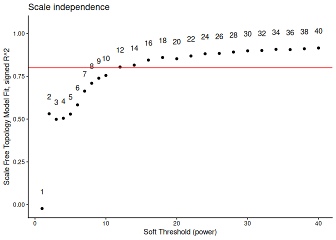<!-- -->

``` r
ggplot(sft_df, aes(x = Power, y = mean.k., label = Power)) +
  geom_point() +
  geom_text(nudge_y = 500) +
  xlab("Soft Threshold (power)") +
  ylab("Mean Connectivity") +
  ggtitle("Mean Connectivity") +
  theme_classic()
```

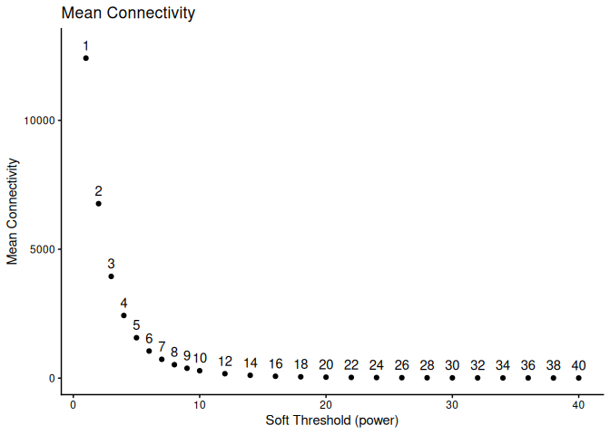<!-- -->

We will move forward with Power = 12.

``` r
picked_power = 12
```

### One-step module detection

``` r
temp_cor <- cor
cor <- WGCNA::cor # Force it to use WGCNA cor function (fix a namespace conflict issue)
netwk <- blockwiseModules(normalized_counts,
                          nThreads = 16,

                          # Adjacency Function
                          power = picked_power,
                          corType = "bicor",
                          networkType = "signed",
                          TOMType = "signed",

                          # Tree and Block Options
                          deepSplit = 1,
                          pamRespectsDendro = F,
                          minModuleSize = 30,
                          maxBlockSize = 50000,

                          # topological overlap matrix, (TOM)
                          saveTOMs = TRUE,
                          saveTOMFileBase = paste0(outdir, "blockwiseTOM"),
                          #loadTOM = FALSE, #uncomment this if you are re-running with a previously saved TOM

                          # Output Options
                          mergeCutHeight = 0.25,
                          numericLabels = TRUE,
                          verbose = 3)

cor <- temp_cor     # Return cor function to original namespace
readr::write_rds(netwk, file = file.path(outdir, "wgcna_results.RDS"))
```

``` r
# load WGCNAresults
netwk <- readr::read_rds(file = file.path(outdir, "wgcna_results.RDS"))

# what is stored in this object?
names(netwk)
```

    ##  [1] "colors"         "unmergedColors" "MEs"            "goodSamples"   
    ##  [5] "goodGenes"      "dendrograms"    "TOMFiles"       "blockGenes"    
    ##  [9] "blocks"         "MEsOK"

``` r
# save the module labels
moduleLabels = netwk$colors

# how many modules are there?
paste("There are", length(unique(moduleLabels)), "modules in our current analysis.")
```

    ## [1] "There are 25 modules in our current analysis."

``` r
# see the distribution of genes across these labelled modules
table(netwk$colors)
```

    ## 
    ##    0    1    2    3    4    5    6    7    8    9   10   11   12   13   14   15 
    ## 3339 3467 3389 2309 1753 1647 1546 1321  885  748  713  674  572  540  346  244 
    ##   16   17   18   19   20   21   22   23   24 
    ##  212  199  190  178  171  140  131  123  104

``` r
# Convert labels to colors for plotting
moduleColors = labels2colors(moduleLabels)

# Plot the dendrogram and the module colors underneath
plotDendroAndColors(
  netwk$dendrograms[[1]],
  moduleColors,
  "Module colors",
  dendroLabels = FALSE,
  hang = 0.03,
  addGuide = TRUE,
  guideHang = 0.05, main = "Consensus gene dendrogram and module colors")
```

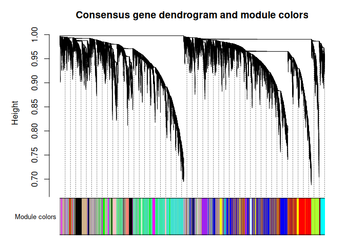<!-- -->

### Treatment and Time Module Correlation

``` r
# save the module info as a dataframe and txt file
module_df <- data.frame(
  gene_id = names(netwk$colors),
  module = paste0("ME", netwk$colors),
  color = labels2colors(netwk$colors)
)

head(module_df)
```

    ##                                     gene_id module     color
    ## 1     Pocillopora_acuta_HIv2___TS.g10153.t1    ME2      blue
    ## 2    Pocillopora_acuta_HIv2___TS.g28292.t1a    ME2      blue
    ## 3     Pocillopora_acuta_HIv2___TS.g28295.t1    ME1 turquoise
    ## 4 Pocillopora_acuta_HIv2___RNAseq.g10157.t1    ME1 turquoise
    ## 5     Pocillopora_acuta_HIv2___TS.g28301.t1    ME9   magenta
    ## 6     Pocillopora_acuta_HIv2___TS.g10172.t1   ME17    grey60

``` r
write_delim(module_df, file = paste0(outdir,"gene_modules.txt"), delim = "\t")

# get the module eigengenes
module_eigengenes <- netwk$MEs
head(module_eigengenes)
```

    ##                    ME20       ME16       ME23        ME2          ME4
    ## POC_R0_C1 -0.0355924844 0.15446789 0.06370361 0.07062881 0.1929328427
    ## POC_R0_C2  0.0187766321 0.02496681 0.04004044 0.13700785 0.1663372205
    ## POC_R0_C3 -0.0143597517 0.14391337 0.06703269 0.14157922 0.1266826836
    ## POC_R0_H1 -0.0641041858 0.13360237 0.07631381 0.07420742 0.1651247811
    ## POC_R0_H2  0.0009861915 0.15069314 0.07977070 0.17707017 0.1359429379
    ## POC_R0_H3  0.1082464578 0.08487638 0.07695716 0.17103699 0.0007036492
    ##                  ME18         ME7        ME13        ME12        ME17
    ## POC_R0_C1 -0.08512992 -0.04460129  0.01540110 -0.02842741 -0.14613354
    ## POC_R0_C2 -0.06489520 -0.01209666 -0.12804407  0.01011873 -0.12075383
    ## POC_R0_C3 -0.05352582 -0.01919946 -0.07665723 -0.02336309 -0.12242487
    ## POC_R0_H1 -0.05247321 -0.01388379 -0.02863901 -0.01748599  0.06684863
    ## POC_R0_H2 -0.01821305  0.02786820 -0.07556386 -0.00661714 -0.14018731
    ## POC_R0_H3  0.18479771  0.08536517  0.09389187 -0.04216429 -0.06936534
    ##                  ME19         ME8        ME22         ME9        ME24
    ## POC_R0_C1 -0.11133437 -0.12087212 -0.12649801 -0.12818739 -0.07041740
    ## POC_R0_C2 -0.05644830 -0.13978357  0.09161800 -0.07716326 -0.24962933
    ## POC_R0_C3 -0.11909826 -0.12088605 -0.05525337 -0.04317865 -0.03717758
    ## POC_R0_H1 -0.11448052 -0.08566827 -0.08905268 -0.14958317  0.08158644
    ## POC_R0_H2 -0.10791539 -0.11309167 -0.02954898 -0.02847013 -0.26317445
    ## POC_R0_H3 -0.03392014  0.08819786  0.14253969 -0.08147621 -0.23608665
    ##                  ME1         ME5         ME15        ME11        ME14
    ## POC_R0_C1 -0.1251369 -0.05142627 -0.012448947  0.01881999  0.02370384
    ## POC_R0_C2 -0.1356068 -0.17007111  0.095152736 -0.14074595 -0.11070188
    ## POC_R0_C3 -0.1433606 -0.13169934 -0.026363300  0.06590721 -0.03060526
    ## POC_R0_H1 -0.1288333 -0.06103870 -0.009687804  0.19284749  0.02393880
    ## POC_R0_H2 -0.1516712 -0.18601142 -0.072518007 -0.15032592 -0.13369618
    ## POC_R0_H3 -0.1346444 -0.11707766 -0.035910344 -0.13871893 -0.08791687
    ##                   ME21        ME10        ME3         ME6         ME0
    ## POC_R0_C1  0.009269679  0.01320868 0.12474163  0.22436074 -0.07789896
    ## POC_R0_C2  0.028128472  0.14188719 0.16763240  0.12483060 -0.04733486
    ## POC_R0_C3  0.046367680  0.05712410 0.11288133  0.06679397 -0.06509873
    ## POC_R0_H1  0.091197560 -0.05783407 0.09651553  0.14019259 -0.10012406
    ## POC_R0_H2 -0.006137177  0.14496713 0.14290660  0.08767877 -0.05892395
    ## POC_R0_H3  0.159841062  0.16134330 0.07071877 -0.16714506 -0.07252223

``` r
# get a list of all the genes in a module
gene_module_key <- tibble::enframe(netwk$colors, name = "gene", value = "module") %>%
  # Let's add the `ME` part so its more clear what these numbers are and it matches elsewhere
  dplyr::mutate(module = paste0("ME", module))

# confirm that the sample metadata and sample labels for the module eigengenes are matching
all.equal(meta$sample, rownames(module_eigengenes))
```

    ## [1] TRUE

#### Time+Treatment-Module Correlation Heatmaps

``` r
nSamples = nrow(normalized_counts)

time_treat_factorial <- meta %>%
  mutate(group = paste0(time, "hr-", ifelse(treatment == "C", "Control", "Heat"))) %>%
  select(sample, group) %>% 
  mutate(value = 1) %>% 
  tidyr::pivot_wider(names_from = group, values_from = value, values_fill = 0) %>%
  column_to_rownames(var = "sample") %>%
  relocate(contains("Control"), contains("Heat")) %>%
   mutate(across(everything(), as.factor))

# Reorder modules so similar modules are next to each other
module_eigengenes_ordered <- orderMEs(module_eigengenes)
module_order = names(module_eigengenes_ordered) 

moduleTraitCor =  WGCNA::cor(module_eigengenes_ordered, time_treat_factorial, use = "p");
moduleTraitPvalue = corPvalueStudent(moduleTraitCor, nSamples);

textMatrix <- ifelse(moduleTraitPvalue < 0.05,
                     paste0(signif(moduleTraitCor, 2), "\n(",
                            signif(moduleTraitPvalue, 2), ")"),"")

pdf(paste0(outdir,"/all_heatmap.pdf"),width=8, height=8)
# Will display correlations and their p-values

par(mar = c(4, 3, 2, 2))
labeledHeatmap(Matrix = moduleTraitCor,
               textMatrix = textMatrix,
               xLabels = names(time_treat_factorial),
               yLabels = names(module_eigengenes_ordered),
               ySymbols = names(module_eigengenes_ordered),
               colorLabels = TRUE,
               colors = blueWhiteRed(100),
               setStdMargins = FALSE,
               cex.text = 0.5,
               cex.lab = 0.7,
               cex.colorLabels = 0.7,
               zlim = c(-1,1),
               main = paste("Module-trait relationships - all"))

dev.off()
```

    ## png 
    ##   2

##### ggplot version

``` r
# Add treatment names
module_eigengenes_ordered$treatment_time = paste0(meta$time,"hr","-",ifelse(meta$treatment == "C", "Control", "Heat"))
module_eigengenes_ordered$treatment = meta$treatment
module_eigengenes_ordered <- module_eigengenes_ordered %>% arrange(treatment)

mmPval = moduleTraitPvalue %>% as.data.frame() %>% rownames_to_column("module") %>%
  pivot_longer(-module, names_to = "treatment_time", values_to = "pvalue")

mmCor = moduleTraitCor %>% as.data.frame() %>% rownames_to_column("module") %>%
  pivot_longer(-module, names_to = "treatment_time", values_to = "correlation") %>%
  left_join(mmPval, by = c("module", "treatment_time")) %>%
  mutate(
    label = ifelse(pvalue < 0.05,
                   paste0(signif(correlation, 2)), ""),
    # use this if you want the p-value also plotted
    #label = ifelse(pvalue < 0.05,
    #               paste0(signif(correlation, 2), "\n(", signif(pvalue, 2), ")"), ""),
    module = factor(module, levels = rev(module_order)),
    treatment_time = factor(treatment_time, levels = unique(module_eigengenes_ordered$treatment_time)))

ggplot(mmCor, aes(x=treatment_time, y=module, fill=correlation)) +
  geom_tile(color = "white", linewidth = 0.3) +
  geom_text(aes(label = label), size = 3, color = "black") +
  theme_minimal(base_size = 12) +
  scale_fill_gradient2(
    low = "#4575B4",
    high = "#D73027",
    mid = "white",
    midpoint = 0,
    limits = c(-1, 1)) +
  labs(title = "Module-trait Relationships", y = "Modules", fill="Correlation")+ 
  theme(
    axis.text.x = element_text(angle = 45, hjust = 1),
    panel.grid = element_blank(),
    axis.ticks = element_blank()
  ) +coord_fixed(ratio = 0.7) 
```

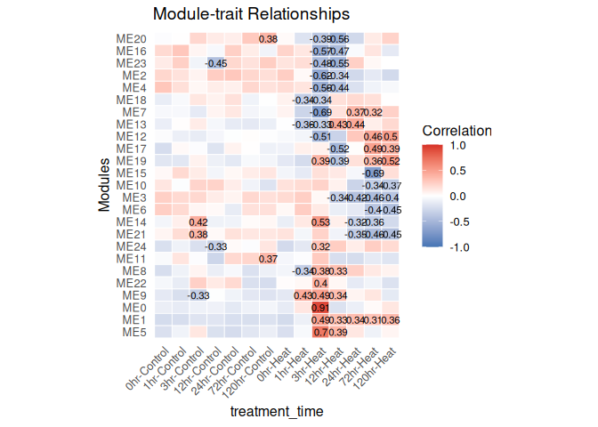<!-- -->

``` r
save_ggplot(plot = last_plot(), filename = "all_heatmap_ggplot", width = 8, height = 8)
```

##### ID peak times based on correlation

``` r
module_peak_times <- mmCor %>%
  filter(pvalue < 0.05, grepl("Heat",treatment_time)) %>%
  group_by(treatment_time) %>%
  summarize(
    n_modules = n(),
    mean_abs_cor = mean(abs(correlation))
  ) %>%
  extract(treatment_time, "time", "([0-9]+)hr", convert = TRUE)
```

#### Run linear model on each module vs. treatment

``` r
# Create the design matrix for full (with interaction) models, use factor for time since non-evenly spaced intervals

meta$time_factor <- factor(meta$time)
des_mat_full <- model.matrix(~ treatment*time_factor, data = meta)
head(des_mat_full)
```

    ##           (Intercept) treatmentH time_factor1 time_factor3 time_factor12
    ## POC_R0_C1           1          0            0            0             0
    ## POC_R0_C2           1          0            0            0             0
    ## POC_R0_C3           1          0            0            0             0
    ## POC_R0_H1           1          1            0            0             0
    ## POC_R0_H2           1          1            0            0             0
    ## POC_R0_H3           1          1            0            0             0
    ##           time_factor24 time_factor72 time_factor120 treatmentH:time_factor1
    ## POC_R0_C1             0             0              0                       0
    ## POC_R0_C2             0             0              0                       0
    ## POC_R0_C3             0             0              0                       0
    ## POC_R0_H1             0             0              0                       0
    ## POC_R0_H2             0             0              0                       0
    ## POC_R0_H3             0             0              0                       0
    ##           treatmentH:time_factor3 treatmentH:time_factor12
    ## POC_R0_C1                       0                        0
    ## POC_R0_C2                       0                        0
    ## POC_R0_C3                       0                        0
    ## POC_R0_H1                       0                        0
    ## POC_R0_H2                       0                        0
    ## POC_R0_H3                       0                        0
    ##           treatmentH:time_factor24 treatmentH:time_factor72
    ## POC_R0_C1                        0                        0
    ## POC_R0_C2                        0                        0
    ## POC_R0_C3                        0                        0
    ## POC_R0_H1                        0                        0
    ## POC_R0_H2                        0                        0
    ## POC_R0_H3                        0                        0
    ##           treatmentH:time_factor120
    ## POC_R0_C1                         0
    ## POC_R0_C2                         0
    ## POC_R0_C3                         0
    ## POC_R0_H1                         0
    ## POC_R0_H2                         0
    ## POC_R0_H3                         0

``` r
# lmFit() needs a transposed version of the matrix
fit_full <- limma::lmFit(t(module_eigengenes), design = des_mat_full)

# Apply empirical Bayes to smooth standard errors
fit_full <- limma::eBayes(fit_full)

# Apply multiple testing correction and obtain stats

## interaction <- treatment effect differs by time
interaction_coefs <- grep("treatment.*:time", colnames(des_mat_full), value = TRUE)

stats_interaction <- limma::topTable(fit_full, coef = interaction_coefs, number = ncol(module_eigengenes)) %>%
  tibble::rownames_to_column("module")

stats_df_full <- limma::topTable(fit_full, number = ncol(module_eigengenes)) %>%
  tibble::rownames_to_column("module")

# we care most about the interaction, the full model will pull out modules that vary in both treatments by time also (like a circadian rhythm 0hr vs 12hr difference)

# almost all of our modules significant by this model:
stats_interaction %>% filter(adj.P.Val < 0.05)  %>% nrow()
```

    ## [1] 16

``` r
#save these as a vector
top_mod_sig_interaction <- stats_interaction %>% filter(adj.P.Val < 0.05)  %>% pull(module)

# print the top 5:
stats_interaction %>% filter(adj.P.Val < 0.05)  %>% head(5)
```

    ##   module treatmentH.time_factor1 treatmentH.time_factor3
    ## 1    ME1              0.07269231              0.37538443
    ## 2    ME0              0.16067372              0.57390814
    ## 3    ME2             -0.09185814             -0.40110826
    ## 4   ME12              0.03058606             -0.20355111
    ## 5    ME3              0.06225036             -0.05952123
    ##   treatmentH.time_factor12 treatmentH.time_factor24 treatmentH.time_factor72
    ## 1                0.2850663                0.3155443               0.30023398
    ## 2               -0.0444463                0.0385872               0.08101818
    ## 3               -0.3576537               -0.3292909              -0.22348985
    ## 4               -0.1264530                0.1706717               0.25799010
    ## 5               -0.2094435               -0.2351268              -0.33857146
    ##   treatmentH.time_factor120       AveExpr        F      P.Value    adj.P.Val
    ## 1                 0.3116656  5.286776e-18 42.53341 1.292508e-13 3.231270e-12
    ## 2                 0.1213818 -2.577303e-17 29.67940 1.536099e-11 1.920124e-10
    ## 3                -0.2586073  5.328079e-18 12.55247 3.875040e-07 3.229200e-06
    ## 4                 0.2954378  2.189056e-18 11.21728 1.225381e-06 7.658628e-06
    ## 5                -0.2819658  5.390034e-18 10.61331 2.122715e-06 1.045163e-05

Module 1 is the most differentially expressed across treatments + in the
full model.

#### Plot example module over time

``` r
eigengenes_treatment_df <- module_eigengenes %>%
  tibble::rownames_to_column("sample") %>%
  dplyr::inner_join(meta %>%
    dplyr::select(sample, treatment,time),
  by = c("sample" = "sample"))

ggplot(eigengenes_treatment_df, aes(x = factor(time), y = ME1,color = treatment)) +
  geom_boxplot(outlier.shape = NA) +
  ggforce::geom_sina(size=1, alpha = 0.5) +
  scale_color_manual(values = treat_colors) +
  theme_classic()
```

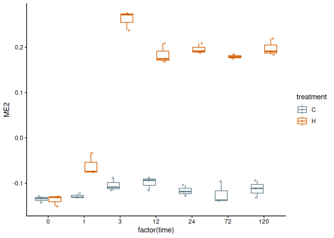<!-- -->

#### Trajectory plots for all modules

``` r
eigengenes_treatment_df_long <- eigengenes_treatment_df %>%
  pivot_longer(cols = starts_with("ME"),
               names_to = "module",
               values_to = "eigengene_value") %>%
  mutate(module = factor(module, levels = module_order)) %>%
  mutate(module_label = ifelse(module %in% top_mod_sig_interaction, 
                                paste0("*",module), 
                                as.character(module)))

ggplot(eigengenes_treatment_df_long, aes(x = factor(time), y = eigengene_value,color = treatment)) +
  geom_boxplot(outlier.shape = NA) +
  ggforce::geom_sina(size=1, alpha = 0.5) +
  scale_color_manual(values = treat_colors) +
  facet_wrap(~module_label, ncol = 5) +
  theme_classic() + theme(
    strip.text = element_text(size = 8, face = "bold"),
    axis.text = element_text(size = 7),
    legend.position = "bottom") +
  labs(x = "Time (hours)", y = "Module Eigengene")
```

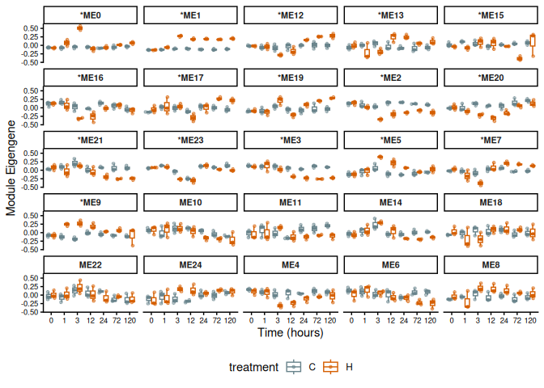<!-- -->

``` r
save_ggplot(plot = last_plot(), filename = "all_modules", width = 14, height = 12)

eigengenes_summary <- eigengenes_treatment_df_long %>%
  group_by(module, module_label, time, treatment) %>%
  summarize(mean_value = mean(eigengene_value),
            se = sd(eigengene_value) / sqrt(n()),
            .groups = "drop")

ggplot(eigengenes_summary, aes(x = factor(time), y = mean_value, color = treatment, group = treatment)) +
  geom_line(linewidth = 0.5) +
  geom_errorbar(aes(ymin = mean_value - se, ymax = mean_value + se), width = 0.2) +
  scale_color_manual(values = treat_colors) +
  facet_wrap(~module_label, ncol = 5, scales = "free_y") +
  theme_classic() +
  theme(
    strip.text = element_text(size = 8, face = "bold"),
    axis.text = element_text(size = 7),
    legend.position = "bottom") +
  labs(x = "Time (hours)", y = "Module Eigengene")
```

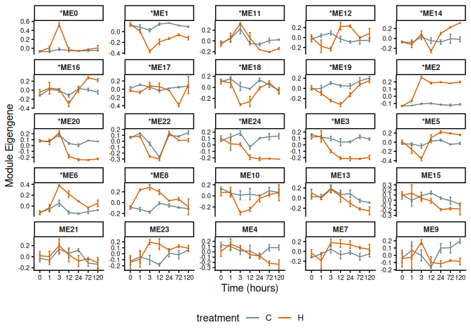<!-- -->

``` r
save_ggplot(plot = last_plot(), filename = "all_modules_lines", width = 14, height = 12)
```

#### Individual module heatmaps

``` r
make_module_heatmap(module_name = "ME1")
```

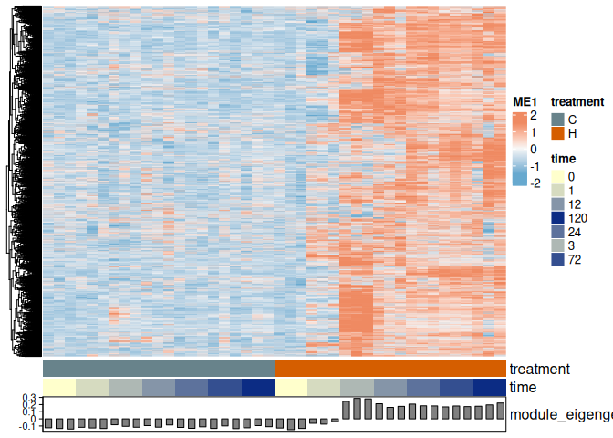<!-- -->

``` r
make_module_heatmap(module_name = "ME0")
```

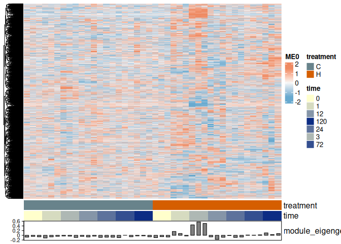<!-- -->

``` r
make_module_heatmap(module_name = "ME3")
```

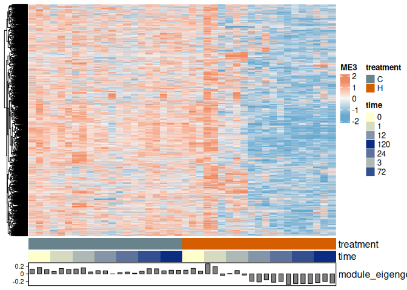<!-- -->

### multiWGCNA

#### Run multiWGCNA to create networks for each time and treatment

<https://bioc.r-universe.dev/articles/multiWGCNA/astrocyte_map_v2.html>

``` r
# the order of the columns and rows matter: the "test" variable, in our case heat vs. control, should be the second column and the "reference" variable, which is for us time, should be the third column. It also appears that the heat rows should come first, as this is the non-control of the "test" variable, but this could turn out to not make a difference.

sampleTable <- meta %>% select(sample,treatment,time) %>% dplyr::rename(Sample=sample) %>% mutate(time=as.character(time)) %>% arrange(desc(treatment))
 
conditions1 = unique(sampleTable[,2])
conditions2 = unique(sampleTable[,3])
```

``` r
# Construct the combined networks
multi_netwk = constructNetworks(vst, sampleTable, conditions1, conditions2,
                                  power = picked_power,
                                  corType = "bicor",
                                  networkType = "signed",
                                  TOMType = "signed",
                                  minModuleSize = 30, maxBlockSize = 50000,
                                  reassignThreshold = 0, minKMEtoStay = 0.7,
                                  mergeCutHeight = 0.25, numericLabels = TRUE,
                                  pamRespectsDendro = FALSE, verbose=3,
                                  deepSplit = 1,
                                  saveTOMs = TRUE)#,
                                  #saveTOMFileBase = paste0(outdir, "multi_blockwiseTOM"))

readr::write_rds(multi_netwk, file = file.path(outdir, "multiwgcna_results.RDS"))
```

#### Parse results

``` r
# load WGCNAresults
multi_netwk <- readr::read_rds(file = file.path(outdir, "multiwgcna_results.RDS"))

# Save results to a list
multi_netwk_results=list()
multi_netwk_results$overlaps = iterate(multi_netwk, overlapComparisons, plot=FALSE)

# see the modules in the control vs. heated networks 
head(multi_netwk_results$overlaps$H_vs_C$overlap)
```

    ##    mod1  mod2 mod1.size mod2.size overlap       p.value         p.adj
    ## 1 H_000 C_000     12357     16944    9691 1.029527e-276 6.125686e-274
    ## 2 H_000 C_001     12357      1226     266  1.000000e+00  1.000000e+00
    ## 3 H_000 C_002     12357       786     291  1.000000e+00  1.000000e+00
    ## 4 H_000 C_003     12357       546     210  9.999999e-01  1.000000e+00
    ## 5 H_000 C_004     12357       544     109  1.000000e+00  1.000000e+00
    ## 6 H_000 C_005     12357       483     110  1.000000e+00  1.000000e+00

``` r
head(multi_netwk_results$overlaps$H_vs_C$bestMatches)
```

    ##     H   C         p.adj
    ## 1 002 001 2.647838e-305
    ## 2 000 000 6.125686e-274
    ## 3 016 003 1.349040e-219
    ## 4 013 004 1.365027e-134
    ## 5 022 024  4.579788e-76
    ## 6 006 005  7.874136e-62

#### Compare multiWGCNA-generated network to WGCNA-generated network above

``` r
multi_combined <- multi_netwk$combined@datExpr
sampleTable_sub <- sampleTable %>% filter(Sample %in% multi_netwk$combined@conditions$Sample)

nSamples = nrow(multi_netwk$combined@conditions)

time_treat_factorial <- sampleTable_sub %>%
  mutate(group = paste0(time, "hr-", ifelse(treatment == "C", "Control", "Heat"))) %>%
  select(Sample, group) %>% 
  mutate(value = 1) %>% 
  tidyr::pivot_wider(names_from = group, values_from = value, values_fill = 0) %>%
  column_to_rownames(var = "Sample") %>%
  relocate(contains("Control"), contains("Heat")) %>%
   mutate(across(everything(), as.factor))

module_eigengenes <- t(multi_netwk$combined@moduleEigengenes)
module_eigengenes <- as.data.frame(module_eigengenes)

# Reorder modules so similar modules are next to each other
module_eigengenes_ordered <- orderMEs(module_eigengenes)
module_order = names(module_eigengenes_ordered) 
module_eigengenes_ordered <- module_eigengenes_ordered[rownames(time_treat_factorial),]

moduleTraitCor =  WGCNA::cor(module_eigengenes_ordered, time_treat_factorial, use = "p");
moduleTraitPvalue = corPvalueStudent(moduleTraitCor, nSamples);

textMatrix <- ifelse(moduleTraitPvalue < 0.05,
                     paste0(signif(moduleTraitCor, 2), "\n(",
                            signif(moduleTraitPvalue, 2), ")"),"")


# Add treatment names
module_eigengenes_ordered$treatment_time = paste0(sampleTable_sub$time,"hr","-",ifelse(sampleTable_sub$treatment == "C", "Control", "Heat"))
module_eigengenes_ordered$treatment = sampleTable_sub$treatment
module_eigengenes_ordered <- module_eigengenes_ordered %>% arrange(treatment)

mmPval = moduleTraitPvalue %>% as.data.frame() %>% rownames_to_column("module") %>%
  pivot_longer(-module, names_to = "treatment_time", values_to = "pvalue")

mmCor = moduleTraitCor %>% as.data.frame() %>% rownames_to_column("module") %>%
  pivot_longer(-module, names_to = "treatment_time", values_to = "correlation") %>%
  left_join(mmPval, by = c("module", "treatment_time")) %>%
  mutate(
    label = ifelse(pvalue < 0.05,
                   paste0(signif(correlation, 2)), ""),
    # use this if you want the p-value also plotted
    #label = ifelse(pvalue < 0.05,
    #               paste0(signif(correlation, 2), "\n(", signif(pvalue, 2), ")"), ""),
    module = factor(module, levels = rev(module_order)),
    treatment_time = factor(treatment_time, levels = unique(module_eigengenes_ordered$treatment_time)))

ggplot(mmCor, aes(x=treatment_time, y=module, fill=correlation)) +
  geom_tile(color = "white", linewidth = 0.3) +
  geom_text(aes(label = label), size = 3, color = "black") +
  theme_minimal(base_size = 12) +
  scale_fill_gradient2(
    low = "#4575B4",
    high = "#D73027",
    mid = "white",
    midpoint = 0,
    limits = c(-1, 1)) +
  labs(title = "Module-trait Relationships", y = "Modules", fill="Correlation")+ 
  theme(
    axis.text.x = element_text(angle = 45, hjust = 1),
    panel.grid = element_blank(),
    axis.ticks = element_blank()
  ) +coord_fixed(ratio = 0.7) 
```

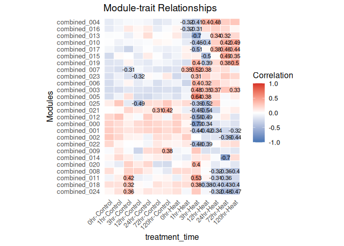<!-- -->

``` r
save_ggplot(plot = last_plot(), filename = "all_heatmap_ggplot_multiWGCNA", width = 8, height = 8)
```

``` r
module_peak_times <- mmCor %>%
  filter(pvalue < 0.05, grepl("Heat",treatment_time)) %>%
  group_by(treatment_time) %>%
  summarize(
    n_modules = n(),
    mean_abs_cor = mean(abs(correlation))
  ) %>%
  extract(treatment_time, "time", "([0-9]+)hr", convert = TRUE)

module_peak_times
```

    ## # A tibble: 6 × 3
    ##    time n_modules mean_abs_cor
    ##   <int>     <int>        <dbl>
    ## 1     1         3        0.327
    ## 2     3        20        0.473
    ## 3    12        15        0.414
    ## 4    24         9        0.361
    ## 5    72        11        0.436
    ## 6   120        10        0.413

##### Plot example module over time

``` r
eigengenes_treatment_df <- module_eigengenes %>% 
  tibble::rownames_to_column("Sample") %>%
  dplyr::inner_join(sampleTable %>%
    dplyr::select(Sample, treatment,time),
  by = c("Sample" = "Sample")) %>%
  mutate(time= factor(time, levels=c("0","1","3","12","24","72","120")))

ggplot(eigengenes_treatment_df, aes(x = time, y = combined_000,color = treatment)) +
  geom_boxplot(outlier.shape = NA) +
  ggforce::geom_sina(size=1, alpha = 0.5) +
  scale_color_manual(values = treat_colors) +
  theme_classic()
```

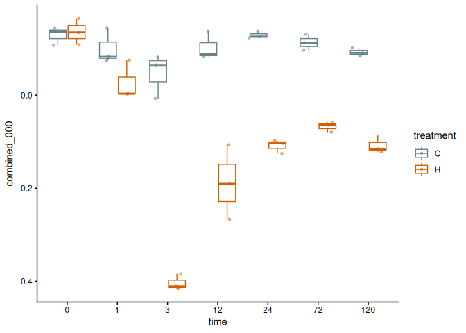<!-- -->

##### Trajectory plots for all modules

``` r
eigengenes_treatment_df_long <- eigengenes_treatment_df %>%
  pivot_longer(cols = starts_with("combined_"),
               names_to = "module",
               values_to = "eigengene_value") %>%
  mutate(module = factor(module, levels = module_order))

ggplot(eigengenes_treatment_df_long, aes(x = factor(time), y = eigengene_value,color = treatment)) +
  geom_boxplot(outlier.shape = NA) +
  ggforce::geom_sina(size=1, alpha = 0.5) +
  scale_color_manual(values = treat_colors) +
  facet_wrap(~module, ncol = 5) +
  theme_classic() + theme(
    strip.text = element_text(size = 8, face = "bold"),
    axis.text = element_text(size = 7),
    legend.position = "bottom") +
  labs(x = "Time (hours)", y = "Module Eigengene")
```

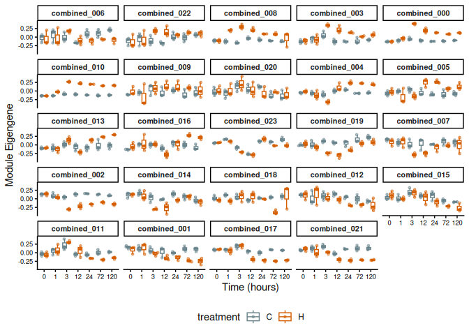<!-- -->

``` r
eigengenes_summary <- eigengenes_treatment_df_long %>%
  group_by(module, time, treatment) %>%
  summarize(mean_value = mean(eigengene_value),
            se = sd(eigengene_value) / sqrt(n()),
            .groups = "drop")

ggplot(eigengenes_summary, aes(x = factor(time), y = mean_value, color = treatment, group = treatment)) +
  geom_line(linewidth = 0.5) +
  geom_errorbar(aes(ymin = mean_value - se, ymax = mean_value + se), width = 0.2) +
  scale_color_manual(values = treat_colors) +
  facet_wrap(~module, ncol = 5, scales = "free_y") +
  theme_classic() +
  theme(
    strip.text = element_text(size = 8, face = "bold"),
    axis.text = element_text(size = 7),
    legend.position = "bottom") +
  labs(x = "Time (hours)", y = "Module Eigengene")
```

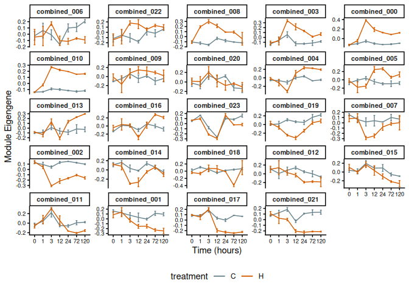<!-- -->

#### multiWGCNA plots and analyses

``` r
ModuleFlowPlot(multi_netwk, 
               comparisonList = multi_netwk_results$overlaps, 
               networks = c("0","1","3","12","24","72","120"),
               use.padj = TRUE,
               color.low = "darkblue",
               color.by="trait",
               col = c(C = 'lightblue4',  H = "#D55E00",None = 'gray'), 
               label.y = 0) 
```

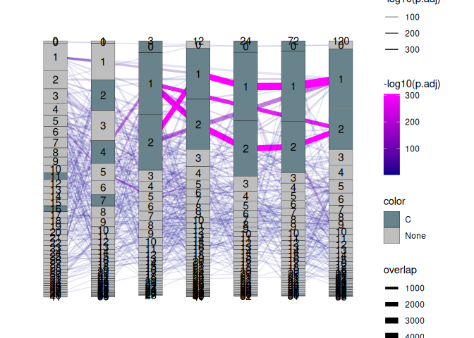<!-- -->

``` r
ModuleFlowPlot(WGCNAlist = multi_netwk, 
              comparisonList = multi_netwk_results$overlaps, 
              networks = c('H', 'C'), 
              spacer = 100, # size of spacer
              label.y = 500, # vertical adjustment for the network labels
              x.scale = 10, # how much to spread out the nodes along x-axis
              color.by = 'trait', # color nodes by their best trait correlation
              col = c("0" = "#FFFFCC" ,
                      "1" ="#D6DBC0",
                      "3" = "#AEB8B4",
                      "12" = "#8595A8",
                      "24" = "#5D729C",
                      "72" = "#344F90",
                      "120" = "#0C2C84" ,
                      C = 'lightblue4', None = 'gray'), 
              p.adj.threshold = 1e-50, 
              label.size = 4)
```

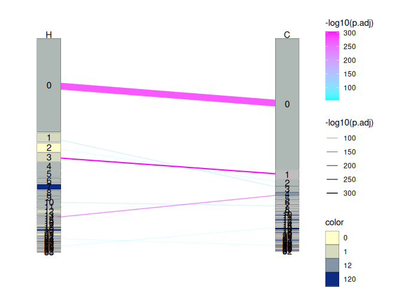<!-- -->

``` r
#treat_colors <- c("C" = "lightblue4", "H" = "#D55E00")
#time_colors
```

#### Perform differential module expression analysis

``` r
# Run differential module expression analysis (DME) on combined networks
multi_netwk_results$diffModExp = runDME(multi_netwk[["combined"]], 
                            sampleTable %>% mutate(time=as.factor(as.numeric(time))), 
                            p.adjust="fdr", 
                            refCondition="time", 
                            testCondition="treatment",
                            plot=TRUE, 
                            out=paste0(outdir, "combined_DME.pdf"))

# Check adjusted p-values for the two sample traits
multi_netwk_results$diffModExp
```

    ##                      time    treatment treatment*time
    ## combined_000 8.738580e-05 1.782794e-08   7.526417e-10
    ## combined_001 2.756225e-04 2.142752e-09   3.774498e-09
    ## combined_002 3.809506e-02 2.715087e-03   1.008165e-01
    ## combined_003 1.466211e-04 9.825931e-11   2.376294e-16
    ## combined_004 1.240677e-02 1.725694e-02   2.848366e-05
    ## combined_005 1.466211e-04 6.371104e-05   5.327082e-03
    ## combined_006 5.936049e-02 5.026661e-03   2.857552e-01
    ## combined_007 3.747577e-02 1.324902e-06   5.412509e-04
    ## combined_008 2.572000e-03 4.422677e-02   2.596866e-01
    ## combined_009 2.789245e-01 9.927771e-02   9.049430e-02
    ## combined_010 9.825168e-04 6.381803e-01   6.616324e-05
    ## combined_011 5.783072e-05 1.274737e-01   7.037607e-02
    ## combined_012 1.193870e-04 6.234258e-04   1.209007e-02
    ## combined_013 4.833640e-04 8.028465e-01   6.581608e-04
    ## combined_014 1.078387e-01 9.927771e-02   1.209007e-02
    ## combined_015 6.469041e-03 1.030161e-01   7.812421e-03
    ## combined_016 3.501186e-01 8.009274e-01   2.596866e-01
    ## combined_017 1.045496e-04 8.653257e-04   2.848366e-05
    ## combined_018 3.479632e-06 3.265753e-05   9.131853e-09
    ## combined_019 2.756225e-04 4.668469e-03   7.766531e-05
    ## combined_020 3.809506e-02 7.554880e-01   5.676872e-01
    ## combined_021 9.484533e-04 1.324902e-06   5.186614e-04
    ## combined_022 7.040513e-02 2.180787e-01   2.596866e-01
    ## combined_023 1.078387e-01 1.591031e-02   1.363228e-01
    ## combined_024 1.710394e-03 2.632206e-04   4.397336e-03
    ## combined_025 7.189027e-15 1.756500e-03   4.905652e-06

``` r
# Check results sorted by treatment*time association FDR
multi_netwk_results$diffModExp[order(multi_netwk_results$diffModExp$`treatment*time`),]
```

    ##                      time    treatment treatment*time
    ## combined_003 1.466211e-04 9.825931e-11   2.376294e-16
    ## combined_000 8.738580e-05 1.782794e-08   7.526417e-10
    ## combined_001 2.756225e-04 2.142752e-09   3.774498e-09
    ## combined_018 3.479632e-06 3.265753e-05   9.131853e-09
    ## combined_025 7.189027e-15 1.756500e-03   4.905652e-06
    ## combined_004 1.240677e-02 1.725694e-02   2.848366e-05
    ## combined_017 1.045496e-04 8.653257e-04   2.848366e-05
    ## combined_010 9.825168e-04 6.381803e-01   6.616324e-05
    ## combined_019 2.756225e-04 4.668469e-03   7.766531e-05
    ## combined_021 9.484533e-04 1.324902e-06   5.186614e-04
    ## combined_007 3.747577e-02 1.324902e-06   5.412509e-04
    ## combined_013 4.833640e-04 8.028465e-01   6.581608e-04
    ## combined_024 1.710394e-03 2.632206e-04   4.397336e-03
    ## combined_005 1.466211e-04 6.371104e-05   5.327082e-03
    ## combined_015 6.469041e-03 1.030161e-01   7.812421e-03
    ## combined_012 1.193870e-04 6.234258e-04   1.209007e-02
    ## combined_014 1.078387e-01 9.927771e-02   1.209007e-02
    ## combined_011 5.783072e-05 1.274737e-01   7.037607e-02
    ## combined_009 2.789245e-01 9.927771e-02   9.049430e-02
    ## combined_002 3.809506e-02 2.715087e-03   1.008165e-01
    ## combined_023 1.078387e-01 1.591031e-02   1.363228e-01
    ## combined_008 2.572000e-03 4.422677e-02   2.596866e-01
    ## combined_016 3.501186e-01 8.009274e-01   2.596866e-01
    ## combined_022 7.040513e-02 2.180787e-01   2.596866e-01
    ## combined_006 5.936049e-02 5.026661e-03   2.857552e-01
    ## combined_020 3.809506e-02 7.554880e-01   5.676872e-01

``` r
sig_combined_mods <- multi_netwk_results$diffModExp %>%
  arrange(`treatment*time`) %>%
  filter(`treatment*time` < 0.05) %>%
  rownames()
```

``` r
diffModuleExpression(multi_netwk[["combined"]], 
                     geneList = topNGenes(multi_netwk[["combined"]], "combined_000"), 
                     design = sampleTable %>% mutate(time=as.factor(as.numeric(time))),
                     test = "ANOVA",
                     plotTitle = "combined_000",
                     plot = TRUE)
```

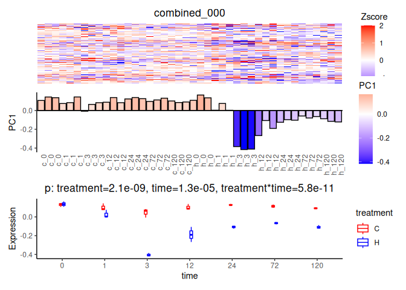<!-- -->

    ##          Factors      p.value
    ## 1      treatment 2.057070e-09
    ## 2           time 1.344397e-05
    ## 3 treatment*time 5.789551e-11

``` r
source("../code/custom_functions/generalFunctions.R")
source("../code/custom_functions/drawMultiWGCNAnetwork.R")
#drawMultiWGCNAnetwork

library(igraph)
library(scales)
pdf(paste0(outdir, "multiWGCNA_network_combined_010_p05.pdf"), width = 6, height = 6)
drawMultiWGCNAnetwork_custom(WGCNAlist = multi_netwk, 
                      comparisonList = multi_netwk_results$overlaps, 
                      moduleOfInterest = "combined_010", 
                      design = sampleTable, 
                      overlapCutoff = 0, 
                      padjCutoff = 0.05, 
                      removeOutliers = TRUE, 
                      alpha = 1e-50,
                      layout = NULL, 
                      hjust = 0.4, 
                      vjust = 0.3, 
                      width = 0.5,
                      colors= c("combined" = "gray",
                                "H" = "#D55E00",
                                "C" = 'lightblue4',
                               "0" = "#FFFFCC" ,
                               "1" ="#D6DBC0",
                               "3" = "#AEB8B4",
                               "12" = "#8595A8",
                               "24" = "#5D729C",
                               "72" = "#344F90",
                               "120" = "#0C2C84"))
dev.off()

pdf(paste0(outdir, "multiWGCNA_network_combined_002_p05.pdf"), width = 6, height = 6)
drawMultiWGCNAnetwork_custom(WGCNAlist = multi_netwk, 
                      comparisonList = multi_netwk_results$overlaps, 
                      moduleOfInterest = "combined_002", 
                      design = sampleTable, 
                      overlapCutoff = 0, 
                      padjCutoff = 0.05, 
                      removeOutliers = TRUE, 
                      alpha = 1e-50,
                      layout = NULL, 
                      hjust = 0.4, 
                      vjust = 0.3, 
                      width = 0.5,
                      colors= c("combined" = "gray",
                                "H" = "#D55E00",
                                "C" = 'lightblue4',
                               "0" = "#FFFFCC" ,
                               "1" ="#D6DBC0",
                               "3" = "#AEB8B4",
                               "12" = "#8595A8",
                               "24" = "#5D729C",
                               "72" = "#344F90",
                               "120" = "#0C2C84"))
dev.off()
```

``` r
library(viridisLite)
for(module in sig_combined_mods){
  #Choose top 10% of genes for each module
  all_genes <- topNGenes(multi_netwk$combined, module, nGenes = NULL)
  top_genes <- head(all_genes, n = ceiling(0.1 * length(all_genes)))
  
  datExpr = GetDatExpr(multi_netwk[[1]], 
                       genes = top_genes)

  datExpr = datExpr[ , rownames(sampleTable)]

  datExpr = t(datExpr)
  nGenes = ncol(datExpr)
  scaled = scale(datExpr)
  splitBy = 0
  
  if (splitBy > 0) {
    for (column in 1:ncol(scaled)) {
      scaled[, column] = scaled[, column] + splitBy * 
        column
    }
  }
  plot = ggplot(reshape2::melt(as.matrix(scaled)), aes(x = Var1, 
    y = value, group = Var2, color = Var2, label = Var2)) + 
    geom_line(alpha=0.2) + 
    scale_colour_manual(values = rev(viridis(nGenes))) +
    labs(y = paste0(module,": Scaled expression"), x = "Samples") +
    theme_classic() + 
    coord_cartesian(clip = "off") +
    annotate("text", x = nrow(datExpr) + 0.5, y = -0.5, hjust = 0, vjust = 0,
             label = paste0(rev(colnames(datExpr)), 
    collapse = "", sep = "\n"), size = 3) +
    
    theme(legend.position = "none", 
          axis.text.x = element_text(angle = 90, vjust = 0.25, hjust = 1),
          axis.text.y = element_blank(), axis.ticks = element_blank(),
          legend.key.width = unit(0.001, "mm"), plot.margin = unit(c(1, 1, 1, 1), "cm")) + 
    geom_vline(xintercept = 21.5, linetype='dashed')
  print(plot)
}
```

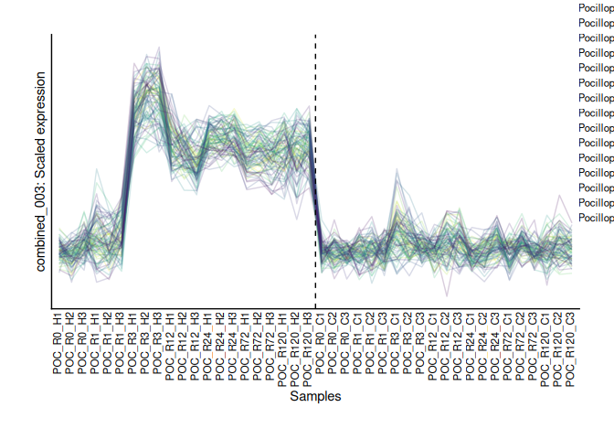<!-- -->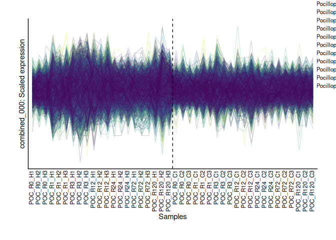<!-- -->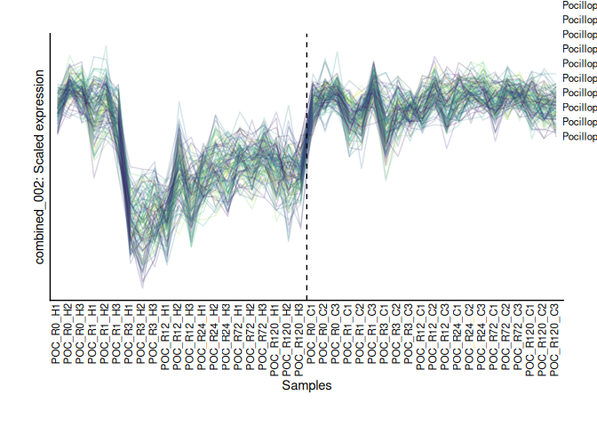<!-- -->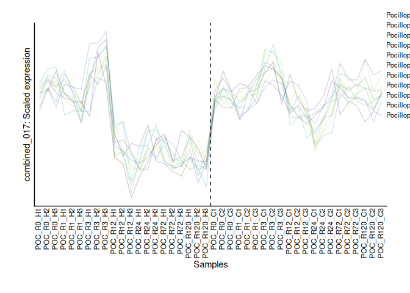<!-- -->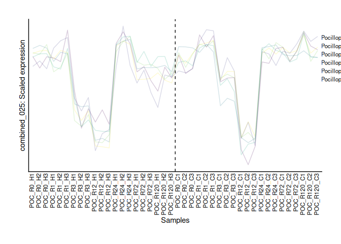<!-- -->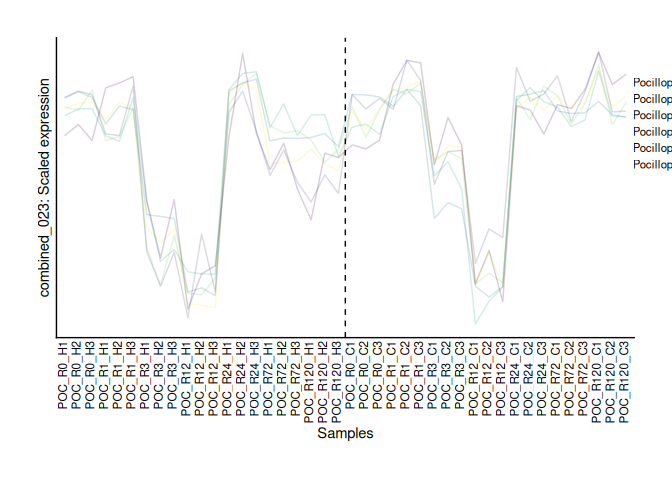<!-- -->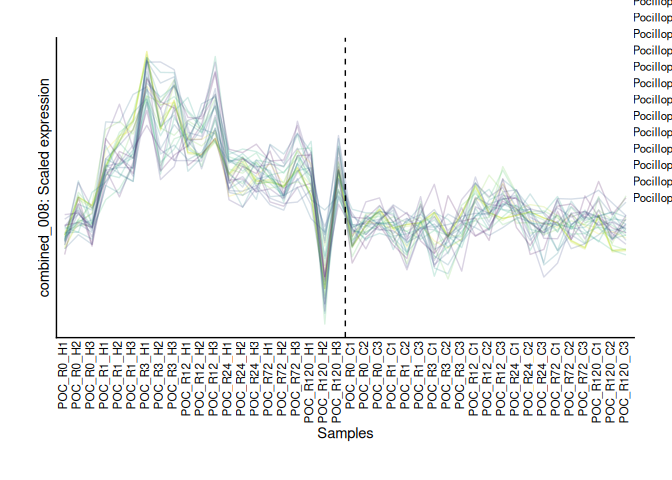<!-- -->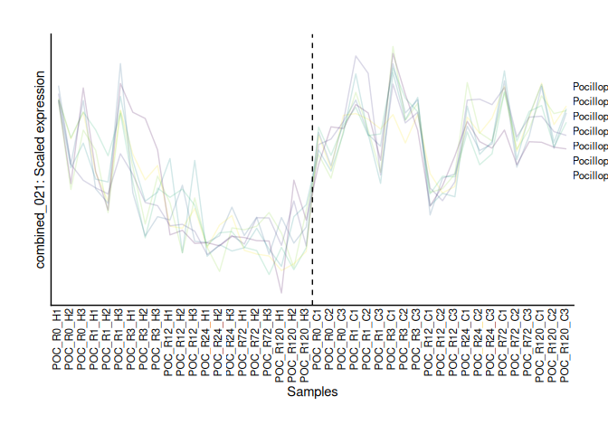<!-- -->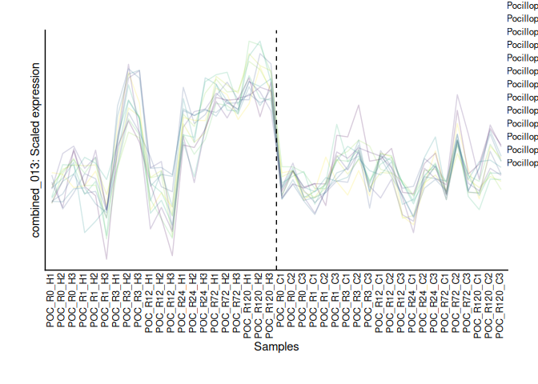<!-- -->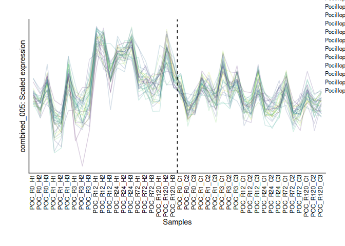<!-- -->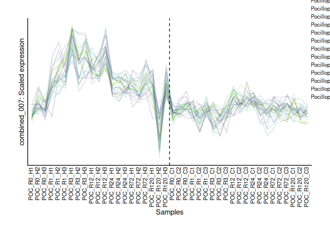<!-- -->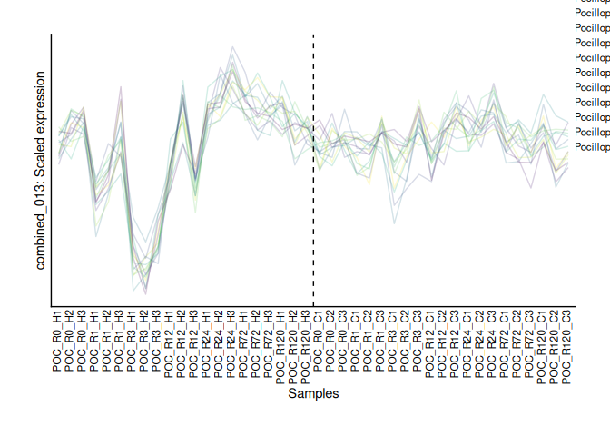<!-- -->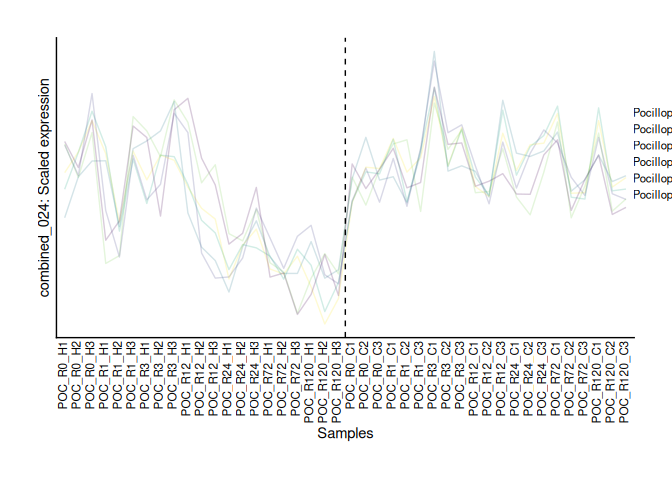<!-- -->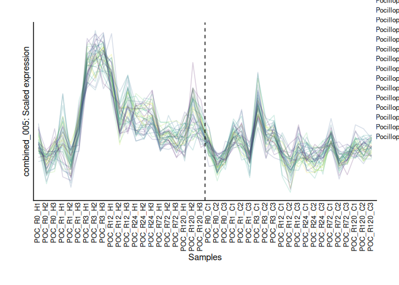<!-- -->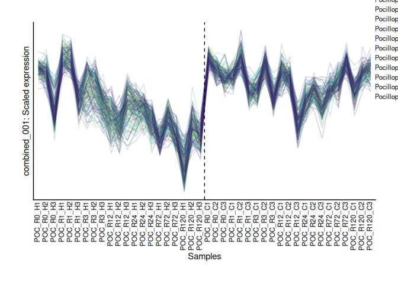<!-- -->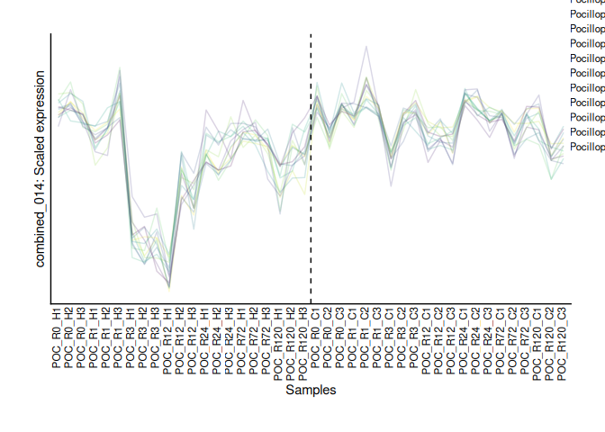<!-- -->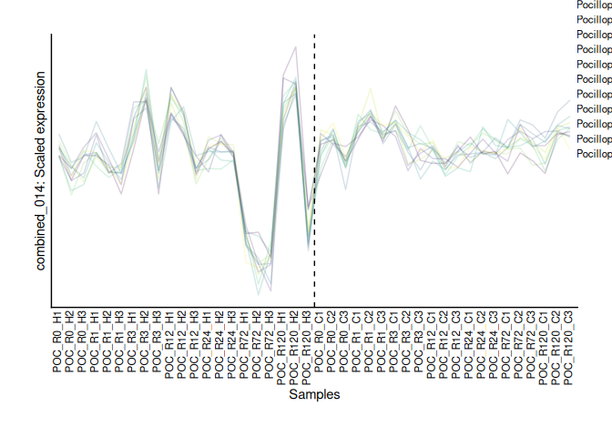<!-- -->

``` r
#turn off parallelization
registerDoSEQ()
disableWGCNAThreads()
# Calculate preservation statistics
multi_netwk_results$preservation=iterate(multi_netwk[c("H", "C")], 
                             preservationComparisons, 
                             write=FALSE, 
                             plot=TRUE, 
                             nPermutations=2)
```

``` r
options(paged.print = FALSE)

multi_netwk_results$permutation.test = PreservationPermutationTest(multi_netwk$combined@datExpr[sample(24788,3000),], 
                                                       sampleTable, 
                                                       constructNetworksIn = "H", # Construct networks using H samples
                                                       testPreservationIn = "C", # Test preservation of disease samples in C samples
                                                       nPermutations = 10, # Number of permutations for permutation test
                                                       nPresPermutations = 10, # Number of permutations for modulePreservation function
                                                       
                                                       # WGCNA parameters for re-sampled networks (should be the same as used for network construction)
                                                       corType = "bicor",networkType = "signed", TOMType = "signed", 
                                                       power = 12, minModuleSize = 30, maxBlockSize = 50000,
                                                       reassignThreshold = 0, minKMEtoStay = 0.7, mergeCutHeight = 0.25,
                                                       numericLabels = TRUE, pamRespectsDendro = FALSE, 
                                                       deepSplit = 1, verbose = 3
                                                       )

readr::write_rds(multi_netwk_results, file = file.path(outdir, "multiwgcna_results_stats.RDS"))
```

``` r
multi_netwk_results <- readr::read_rds(file = file.path(outdir, "multiwgcna_results_stats.RDS"))

# Print a summary of the results
summarizeResults(multi_netwk, multi_netwk_results)
```

``` r
permutationTestResults <- multi_netwk_results$permutation.test

# Remove outlier modules
permutationTestResultsFiltered = lapply(permutationTestResults, function(x) x[!x$is.outlier.module,])

# Extract the preservation score distribution
multi_netwk_results$scores.summary = PreservationScoreDistribution(permutationTestResultsFiltered, 
                                                       moduleOfInterestSize = 235 # The size of the module of interest (combined_010)
                                                       )

ggplot(multi_netwk_results$scores.summary, aes(x=z.summary)) + 
      geom_histogram(color="black", fill="white", bins = 15)+
      xlab("Preservation score")+
      ylab("Frequency")+
     # geom_vline(xintercept=10, color="red3", linetype="solid")+
      scale_y_continuous(expand = c(0,0))+
      theme_classic()+
      theme(plot.title = element_text(hjust = 0.5))
```

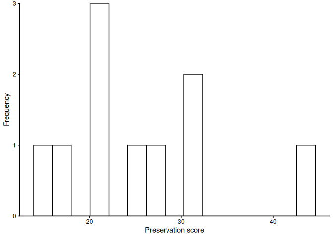<!-- -->

Reset packages

``` r
detach("package:scales", unload = TRUE, character.only = TRUE)
detach("package:viridisLite", unload = TRUE, character.only = TRUE)
detach("package:igraph", unload = TRUE, character.only = TRUE)

library(tidyverse)
library(WGCNA)
library(multiWGCNA)
```

## MON

### Pre-processing

Read in variance-stabilized count info and metadata

``` r
outdir <- "../output_RNA/multiWGCNA/MON_MCapV3/"
getwd()
```

    ## [1] "/project/pi_hputnam_uri_edu/zdellaert/TimeSeries/4-multi-species/code"

``` r
vst <- read.csv("../output_RNA/differential_expression/MON_MCapV3/vsd_expression_matrix.csv")

vst <- vst %>% column_to_rownames(var = "X")
normalized_counts <- t(vst)

# NOTE! Removed 2 outliers prior to vst transformation but they are still in the metadata.

meta <- read.csv("../output_RNA/differential_expression/MON_MCapV3/RNA_seq_metadata.csv")
meta <- meta %>% column_to_rownames(var = "X") %>% select(-c(species, replicate))

all(rownames(meta) %in% colnames(vst))
```

    ## [1] FALSE

``` r
rownames(meta)[!(rownames(meta) %in% colnames(vst))]
```

    ## [1] "MON_R72_H1" "MON_R72_H2"

``` r
meta <- meta %>% filter(!(sample %in% c("MON_R72_H1","MON_R72_H2")))
all(rownames(meta) %in% colnames(vst))
```

    ## [1] TRUE

``` r
all(rownames(meta) == colnames(vst))
```

    ## [1] TRUE

### First, identify and remove any outliers

Cluster the samples and view as a tree.

``` r
sampleTree = hclust(dist(normalized_counts), method = "average")
sizeGrWindow(12,9) 
par(cex = 0.6);
par(mar = c(0,4,2,0))
plot(sampleTree)
```

I did not identify outliers based on this plot.

### Determine parameters for WGCNA

<https://alexslemonade.github.io/refinebio-examples/04-advanced-topics/network-analysis_rnaseq_01_wgcna.html#46_Determine_parameters_for_WGCNA>

<https://bioinformaticsworkbook.org/tutorials/wgcna.html#gsc.tab=0>

``` r
options(stringsAsFactors = FALSE)
enableWGCNAThreads()
```

    ## Allowing parallel execution with up to 63 working processes.

``` r
#set powers to test
powers = c(c(1:10), seq(from = 12, to=40, by=2))

#the below takes a long time to run, so is commented out and the pre-run results are loaded in below
#sft <- pickSoftThreshold(normalized_counts, power=powers, networkType = "signed")
#save(sft, file = paste0(outdir, "sft.RData"))
load(paste0(outdir, "sft.RData"))

sft_df <- data.frame(sft$fitIndices) %>% dplyr::mutate(model_fit = -sign(slope) * SFT.R.sq)

ggplot(sft_df, aes(x = Power, y = model_fit, label = Power)) +
  geom_point() +
  geom_text(nudge_y = 0.1) +
  # We will plot what WGCNA recommends as an R^2 cutoff
  geom_hline(yintercept = 0.80, col = "red") +
  ylim(c(min(sft_df$model_fit), 1.05)) +
  xlab("Soft Threshold (power)") +
  ylab("Scale Free Topology Model Fit, signed R^2") +
  ggtitle("Scale independence") +
  theme_classic()
```

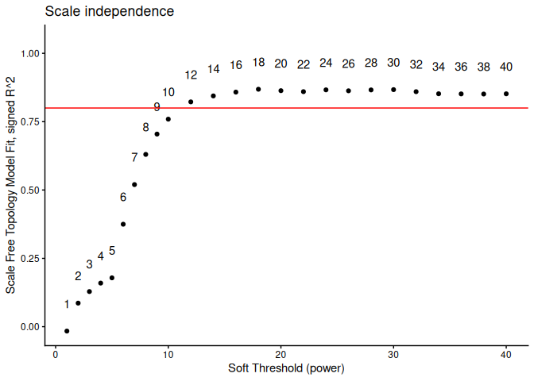<!-- -->

``` r
ggplot(sft_df, aes(x = Power, y = mean.k., label = Power)) +
  geom_point() +
  geom_text(nudge_y = 500) +
  xlab("Soft Threshold (power)") +
  ylab("Mean Connectivity") +
  ggtitle("Mean Connectivity") +
  theme_classic()
```

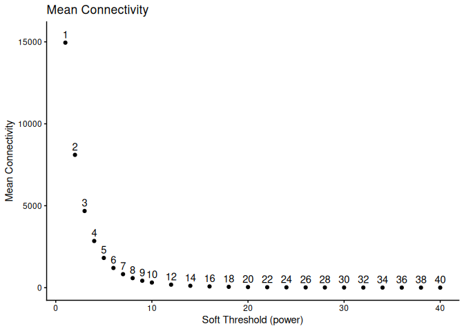<!-- -->

We will move forward with Power = 10.

``` r
picked_power = 10
```

### One-step module detection

``` r
temp_cor <- cor
cor <- WGCNA::cor # Force it to use WGCNA cor function (fix a namespace conflict issue)
netwk <- blockwiseModules(normalized_counts,
                          nThreads = 16,

                          # Adjacency Function
                          power = picked_power,
                          corType = "bicor",
                          networkType = "signed",
                          TOMType = "signed",

                          # Tree and Block Options
                          deepSplit = 1,
                          pamRespectsDendro = F,
                          minModuleSize = 30,
                          maxBlockSize = 50000,

                          # topological overlap matrix, (TOM)
                          saveTOMs = TRUE,
                          saveTOMFileBase = paste0(outdir, "blockwiseTOM"),
                          #loadTOM = FALSE, #uncomment this if you are re-running with a previously saved TOM

                          # Output Options
                          mergeCutHeight = 0.25,
                          numericLabels = TRUE,
                          verbose = 3)

cor <- temp_cor     # Return cor function to original namespace
readr::write_rds(netwk, file = file.path(outdir, "wgcna_results.RDS"))
```

``` r
# load WGCNAresults
netwk <- readr::read_rds(file = file.path(outdir, "wgcna_results.RDS"))

# what is stored in this object?
names(netwk)
```

    ##  [1] "colors"         "unmergedColors" "MEs"            "goodSamples"   
    ##  [5] "goodGenes"      "dendrograms"    "TOMFiles"       "blockGenes"    
    ##  [9] "blocks"         "MEsOK"

``` r
# save the module labels
moduleLabels = netwk$colors

# how many modules are there?
paste("There are", length(unique(moduleLabels)), "modules in our current analysis.")
```

    ## [1] "There are 32 modules in our current analysis."

``` r
# see the distribution of genes across these labelled modules
table(netwk$colors)
```

    ## 
    ##    0    1    2    3    4    5    6    7    8    9   10   11   12   13   14   15 
    ## 5561 3352 2455 2286 2088 1347 1034  947  884  809  793  774  726  725  668  635 
    ##   16   17   18   19   20   21   22   23   24   25   26   27   28   29   30   31 
    ##  510  504  446  412  402  394  389  378  374  351  210  155  132  130  121   97

``` r
# Convert labels to colors for plotting
moduleColors = labels2colors(moduleLabels)

# Plot the dendrogram and the module colors underneath
plotDendroAndColors(
  netwk$dendrograms[[1]],
  moduleColors,
  "Module colors",
  dendroLabels = FALSE,
  hang = 0.03,
  addGuide = TRUE,
  guideHang = 0.05, main = "Consensus gene dendrogram and module colors")
```

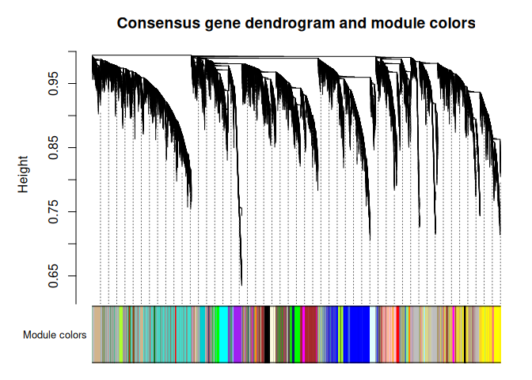<!-- -->

### Treatment and Time Module Correlation

``` r
# save the module info as a dataframe and txt file
module_df <- data.frame(
  gene_id = names(netwk$colors),
  module = paste0("ME", netwk$colors),
  color = labels2colors(netwk$colors)
)

head(module_df)
```

    ##                                     gene_id module       color
    ## 1 Montipora_capitata_HIv3___RNAseq.g4581.t1    ME0        grey
    ## 2 Montipora_capitata_HIv3___RNAseq.g4750.t1    ME0        grey
    ## 3 Montipora_capitata_HIv3___RNAseq.g4751.t1    ME0        grey
    ## 4 Montipora_capitata_HIv3___RNAseq.g4752.t1   ME19 lightyellow
    ## 5 Montipora_capitata_HIv3___RNAseq.g4753.t1    ME6         red
    ## 6 Montipora_capitata_HIv3___RNAseq.g4754.t1   ME10      purple

``` r
write_delim(module_df, file = paste0(outdir,"gene_modules.txt"), delim = "\t")

# get the module eigengenes
module_eigengenes <- netwk$MEs
head(module_eigengenes)
```

    ##                  ME12        ME17         ME22        ME1          ME6
    ## MON_R0_C1 -0.04532924 -0.12886513 -0.025384125 -0.1088580 -0.002456646
    ## MON_R0_C2 -0.09763485 -0.05345873 -0.088610182 -0.1023890 -0.042604356
    ## MON_R0_C3 -0.09619015 -0.17544969  0.004488598 -0.1304209 -0.090322927
    ## MON_R0_H1 -0.00720379  0.03989764 -0.008530732 -0.1108040 -0.141105751
    ## MON_R0_H2 -0.13004929 -0.13712240 -0.063722831 -0.1244104  0.057670879
    ## MON_R0_H3 -0.06285629 -0.09850222 -0.068357901 -0.1071490 -0.031326251
    ##                   ME27        ME4       ME13         ME2        ME29       ME20
    ## MON_R0_C1 -0.003350424 -0.1366728 -0.1130813  0.15622984  0.03122725  0.1001815
    ## MON_R0_C2 -0.005201407 -0.1450415 -0.1231822  0.16863718  0.03236132  0.1401595
    ## MON_R0_C3  0.058843104  0.1875090 -0.1751903 -0.09454769 -0.21218917  0.2868342
    ## MON_R0_H1 -0.014759749  0.1296207 -0.1911107 -0.11038170 -0.20300177  0.2524692
    ## MON_R0_H2 -0.031909109 -0.1377050 -0.1240287  0.16451648  0.01217335  0.1202436
    ## MON_R0_H3  0.243897873  0.1824079  0.2356276 -0.16853819 -0.21829660 -0.1028344
    ##                  ME11       ME16        ME31         ME9         ME5
    ## MON_R0_C1  0.04342040 0.14498398 0.004600852  0.06805502  0.04270934
    ## MON_R0_C2  0.07053558 0.13599251 0.008929873 -0.02294632  0.06196644
    ## MON_R0_C3 -0.12433569 0.13044263 0.264039373  0.23996886 -0.02411764
    ## MON_R0_H1 -0.12924857 0.04078654 0.220394210  0.04358391  0.14559498
    ## MON_R0_H2  0.05537785 0.14301518 0.013298574  0.03430630  0.04068410
    ## MON_R0_H3  0.08769008 0.20524029 0.280842633  0.17126501  0.03226015
    ##                  ME15        ME10        ME14        ME28       ME26
    ## MON_R0_C1  0.08001518 -0.02445128 -0.04392474 -0.04013655  0.1181121
    ## MON_R0_C2  0.05299116  0.01439845  0.14893177  0.03743827  0.1208564
    ## MON_R0_C3  0.02431451  0.02309173 -0.01927190 -0.14812266 -0.2221215
    ## MON_R0_H1 -0.06990416  0.22312208  0.19698355  0.03309143 -0.2734249
    ## MON_R0_H2  0.04769466  0.08313323  0.07420336 -0.09102076  0.1213875
    ## MON_R0_H3  0.06469405 -0.10390117 -0.16868001 -0.13419825 -0.2553723
    ##                   ME30        ME18        ME21        ME23         ME7
    ## MON_R0_C1 -0.014359383  0.02591415 -0.04761600 -0.14133479 0.088846693
    ## MON_R0_C2  0.009670246  0.03186945 -0.05814173  0.05409414 0.060494915
    ## MON_R0_C3 -0.084011077 -0.10173097  0.25806145  0.07059446 0.119199318
    ## MON_R0_H1 -0.122043747 -0.19802595  0.16621279  0.25393055 0.001529682
    ## MON_R0_H2 -0.027684929  0.02497135 -0.03576531 -0.15466927 0.104057230
    ## MON_R0_H3 -0.310574280 -0.13330930 -0.17668351 -0.15434661 0.147121014
    ##                  ME19        ME3         ME24         ME8        ME25
    ## MON_R0_C1  0.05920610 0.12917601  0.026328302  0.10448500  0.14971900
    ## MON_R0_C2 -0.01049635 0.08935220  0.124493289  0.06235185  0.12672851
    ## MON_R0_C3  0.07572113 0.11988188 -0.014703097  0.06389997  0.02379718
    ## MON_R0_H1  0.11908720 0.07266372  0.160850492 -0.06663877 -0.10643184
    ## MON_R0_H2  0.08174284 0.10749202  0.032113034  0.18052515  0.20911608
    ## MON_R0_H3  0.12493481 0.15818122  0.007989227  0.05494903  0.05943821
    ##                   ME0
    ## MON_R0_C1 -0.02621728
    ## MON_R0_C2 -0.01428371
    ## MON_R0_C3  0.02693327
    ## MON_R0_H1  0.02000025
    ## MON_R0_H2 -0.02722214
    ## MON_R0_H3  0.20233363

``` r
# get a list of all the genes in a module
gene_module_key <- tibble::enframe(netwk$colors, name = "gene", value = "module") %>%
  # Let's add the `ME` part so its more clear what these numbers are and it matches elsewhere
  dplyr::mutate(module = paste0("ME", module))

# confirm that the sample metadata and sample labels for the module eigengenes are matching
all.equal(meta$sample, rownames(module_eigengenes))
```

    ## [1] TRUE

#### Time+Treatment-Module Correlation Heatmaps

``` r
nSamples = nrow(normalized_counts)

time_treat_factorial <- meta %>%
  mutate(group = paste0(time, "hr-", ifelse(treatment == "C", "Control", "Heat"))) %>%
  select(sample, group) %>% 
  mutate(value = 1) %>% 
  tidyr::pivot_wider(names_from = group, values_from = value, values_fill = 0) %>%
  column_to_rownames(var = "sample") %>%
  relocate(contains("Control"), contains("Heat")) %>%
   mutate(across(everything(), as.factor))

# Reorder modules so similar modules are next to each other
module_eigengenes_ordered <- orderMEs(module_eigengenes)
module_order = names(module_eigengenes_ordered) 

moduleTraitCor =  WGCNA::cor(module_eigengenes_ordered, time_treat_factorial, use = "p");
moduleTraitPvalue = corPvalueStudent(moduleTraitCor, nSamples);

textMatrix <- ifelse(moduleTraitPvalue < 0.05,
                     paste0(signif(moduleTraitCor, 2), "\n(",
                            signif(moduleTraitPvalue, 2), ")"),"")

pdf(paste0(outdir,"/all_heatmap.pdf"),width=8, height=8)
# Will display correlations and their p-values

par(mar = c(4, 3, 2, 2))
labeledHeatmap(Matrix = moduleTraitCor,
               textMatrix = textMatrix,
               xLabels = names(time_treat_factorial),
               yLabels = names(module_eigengenes_ordered),
               ySymbols = names(module_eigengenes_ordered),
               colorLabels = TRUE,
               colors = WGCNA::blueWhiteRed(100),
               setStdMargins = FALSE,
               cex.text = 0.5,
               cex.lab = 0.7,
               cex.colorLabels = 0.7,
               zlim = c(-1,1),
               main = paste("Module-trait relationships - all"))

dev.off()
```

    ## png 
    ##   2

##### ggplot version

``` r
# Add treatment names
module_eigengenes_ordered$treatment_time = paste0(meta$time,"hr","-",ifelse(meta$treatment == "C", "Control", "Heat"))
module_eigengenes_ordered$treatment = meta$treatment
module_eigengenes_ordered <- module_eigengenes_ordered %>% arrange(treatment)

mmPval = moduleTraitPvalue %>% as.data.frame() %>% rownames_to_column("module") %>%
  pivot_longer(-module, names_to = "treatment_time", values_to = "pvalue")

mmCor = moduleTraitCor %>% as.data.frame() %>% rownames_to_column("module") %>%
  pivot_longer(-module, names_to = "treatment_time", values_to = "correlation") %>%
  left_join(mmPval, by = c("module", "treatment_time")) %>%
  mutate(
    label = ifelse(pvalue < 0.05,
                   paste0(signif(correlation, 2)), ""),
    # use this if you want the p-value also plotted
    #label = ifelse(pvalue < 0.05,
    #               paste0(signif(correlation, 2), "\n(", signif(pvalue, 2), ")"), ""),
    module = factor(module, levels = rev(module_order)),
    treatment_time = factor(treatment_time, levels = unique(module_eigengenes_ordered$treatment_time)))

ggplot(mmCor, aes(x=treatment_time, y=module, fill=correlation)) +
  geom_tile(color = "white", linewidth = 0.3) +
  geom_text(aes(label = label), size = 3, color = "black") +
  theme_minimal(base_size = 12) +
  scale_fill_gradient2(
    low = "#4575B4",
    high = "#D73027",
    mid = "white",
    midpoint = 0,
    limits = c(-1, 1)) +
  labs(title = "Module-trait Relationships", y = "Modules", fill="Correlation")+ 
  theme(
    axis.text.x = element_text(angle = 45, hjust = 1),
    panel.grid = element_blank(),
    axis.ticks = element_blank()
  ) +coord_fixed(ratio = 0.7) 
```

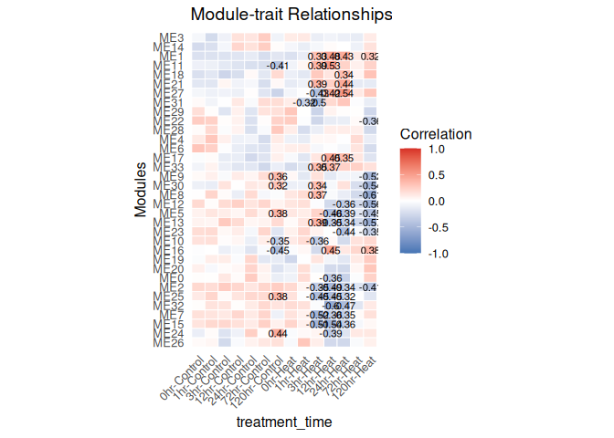<!-- -->

``` r
save_ggplot(plot = last_plot(), filename = "all_heatmap_ggplot", width = 8, height = 10)
```

##### ID peak times based on correlation

``` r
module_peak_times <- mmCor %>%
  filter(pvalue < 0.05, grepl("Heat",treatment_time)) %>%
  group_by(treatment_time) %>%
  summarize(
    n_modules = n(),
    mean_abs_cor = mean(abs(correlation))
  ) %>%
  extract(treatment_time, "time", "([0-9]+)hr", convert = TRUE)

module_peak_times
```

    ## # A tibble: 4 × 3
    ##    time n_modules mean_abs_cor
    ##   <int>     <int>        <dbl>
    ## 1     3        13        0.399
    ## 2    12        12        0.437
    ## 3    24        11        0.387
    ## 4   120        12        0.449

#### Run linear model on each module vs. treatment

``` r
# Create the design matrix for full (with interaction) models, use factor for time since non-evenly spaced intervals

meta$time_factor <- factor(meta$time)
des_mat_full <- model.matrix(~ treatment*time_factor, data = meta)
head(des_mat_full)
```

    ##           (Intercept) treatmentH time_factor1 time_factor3 time_factor12
    ## MON_R0_C1           1          0            0            0             0
    ## MON_R0_C2           1          0            0            0             0
    ## MON_R0_C3           1          0            0            0             0
    ## MON_R0_H1           1          1            0            0             0
    ## MON_R0_H2           1          1            0            0             0
    ## MON_R0_H3           1          1            0            0             0
    ##           time_factor24 time_factor72 time_factor120 treatmentH:time_factor1
    ## MON_R0_C1             0             0              0                       0
    ## MON_R0_C2             0             0              0                       0
    ## MON_R0_C3             0             0              0                       0
    ## MON_R0_H1             0             0              0                       0
    ## MON_R0_H2             0             0              0                       0
    ## MON_R0_H3             0             0              0                       0
    ##           treatmentH:time_factor3 treatmentH:time_factor12
    ## MON_R0_C1                       0                        0
    ## MON_R0_C2                       0                        0
    ## MON_R0_C3                       0                        0
    ## MON_R0_H1                       0                        0
    ## MON_R0_H2                       0                        0
    ## MON_R0_H3                       0                        0
    ##           treatmentH:time_factor24 treatmentH:time_factor72
    ## MON_R0_C1                        0                        0
    ## MON_R0_C2                        0                        0
    ## MON_R0_C3                        0                        0
    ## MON_R0_H1                        0                        0
    ## MON_R0_H2                        0                        0
    ## MON_R0_H3                        0                        0
    ##           treatmentH:time_factor120
    ## MON_R0_C1                         0
    ## MON_R0_C2                         0
    ## MON_R0_C3                         0
    ## MON_R0_H1                         0
    ## MON_R0_H2                         0
    ## MON_R0_H3                         0

``` r
# lmFit() needs a transposed version of the matrix
fit_full <- limma::lmFit(t(module_eigengenes), design = des_mat_full)

# Apply empirical Bayes to smooth standard errors
fit_full <- limma::eBayes(fit_full)

# Apply multiple testing correction and obtain stats

## interaction <- treatment effect differs by time
interaction_coefs <- grep("treatment.*:time", colnames(des_mat_full), value = TRUE)

stats_interaction <- limma::topTable(fit_full, coef = interaction_coefs, number = ncol(module_eigengenes)) %>%
  tibble::rownames_to_column("module")

stats_df_full <- limma::topTable(fit_full, number = ncol(module_eigengenes)) %>%
  tibble::rownames_to_column("module")

# we care most about the interaction, the full model will pull out modules that vary in both treatments by time also (like a circadian rhythm 0hr vs 12hr difference)

# almost all of our modules significant by this model:
stats_interaction %>% filter(adj.P.Val < 0.05)  %>% nrow()
```

    ## [1] 11

``` r
#save these as a vector
top_mod_sig_interaction <- stats_interaction %>% filter(adj.P.Val < 0.05)  %>% pull(module)

# print the top 5:
stats_interaction %>% filter(adj.P.Val < 0.05)  %>% head(5)
```

    ##   module treatmentH.time_factor1 treatmentH.time_factor3
    ## 1    ME5             -0.05247718              0.03878474
    ## 2   ME22              0.04371979             -0.21012386
    ## 3    ME3             -0.09393697             -0.36774683
    ## 4   ME15              0.06945916              0.05286138
    ## 5   ME19             -0.07992432             -0.37542192
    ##   treatmentH.time_factor12 treatmentH.time_factor24 treatmentH.time_factor72
    ## 1               -0.3289081               -0.3770420               -0.2649472
    ## 2                0.2704085                0.2816191                0.2190196
    ## 3               -0.3889454               -0.2576489               -0.2685380
    ## 4               -0.2623774               -0.1558985               -0.2455153
    ## 5               -0.4628566               -0.3388860               -0.2798530
    ##   treatmentH.time_factor120       AveExpr        F      P.Value    adj.P.Val
    ## 1               -0.49922457  1.675092e-17 8.393632 1.496009e-05 0.0003374007
    ## 2                0.35356318 -2.849283e-17 8.084054 2.108754e-05 0.0003374007
    ## 3               -0.32214416 -8.359199e-18 6.894560 8.427377e-05 0.0008989202
    ## 4               -0.39118771  6.114900e-18 6.463820 1.431132e-04 0.0011449056
    ## 5               -0.03404655 -4.857226e-18 6.107779 2.243878e-04 0.0014360820

Module 5 is the most differentially expressed across treatments + in the
full model.

#### Plot example module over time

``` r
eigengenes_treatment_df <- module_eigengenes %>%
  tibble::rownames_to_column("sample") %>%
  dplyr::inner_join(meta %>%
    dplyr::select(sample, treatment,time),
  by = c("sample" = "sample"))

ggplot(eigengenes_treatment_df, aes(x = factor(time), y = ME5,color = treatment)) +
  geom_boxplot(outlier.shape = NA) +
  ggforce::geom_sina(size=1, alpha = 0.5) +
  scale_color_manual(values = treat_colors) +
  theme_classic()
```

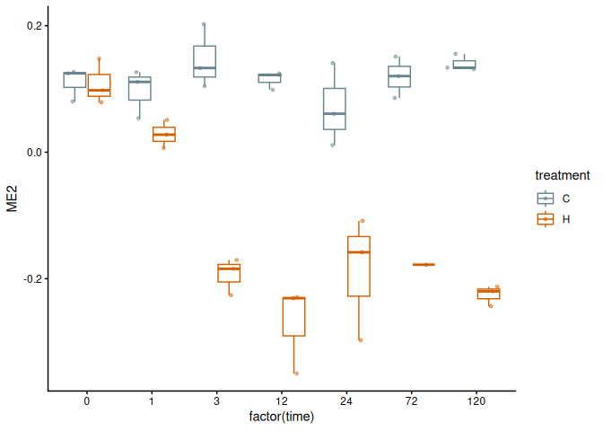<!-- -->

#### Trajectory plots for all modules

``` r
eigengenes_treatment_df_long <- eigengenes_treatment_df %>%
  pivot_longer(cols = starts_with("ME"),
               names_to = "module",
               values_to = "eigengene_value") %>%
  mutate(module = factor(module, levels = module_order)) %>%
  mutate(module_label = ifelse(module %in% top_mod_sig_interaction, 
                                paste0("*",module), 
                                as.character(module)))

ggplot(eigengenes_treatment_df_long, aes(x = factor(time), y = eigengene_value,color = treatment)) +
  geom_boxplot(outlier.shape = NA) +
  ggforce::geom_sina(size=1, alpha = 0.5) +
  scale_color_manual(values = treat_colors) +
  facet_wrap(~module_label, ncol = 5) +
  theme_classic() + theme(
    strip.text = element_text(size = 8, face = "bold"),
    axis.text = element_text(size = 7),
    legend.position = "bottom") +
  labs(x = "Time (hours)", y = "Module Eigengene")
```

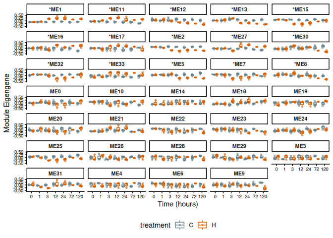<!-- -->

``` r
save_ggplot(plot = last_plot(), filename = "all_modules", width = 14, height = 12)

eigengenes_summary <- eigengenes_treatment_df_long %>%
  group_by(module, module_label, time, treatment) %>%
  summarize(mean_value = mean(eigengene_value),
            se = sd(eigengene_value) / sqrt(n()),
            .groups = "drop")

ggplot(eigengenes_summary, aes(x = factor(time), y = mean_value, color = treatment, group = treatment)) +
  geom_line(linewidth = 0.5) +
  geom_errorbar(aes(ymin = mean_value - se, ymax = mean_value + se), width = 0.2) +
  scale_color_manual(values = treat_colors) +
  facet_wrap(~module_label, ncol = 5, scales = "free_y") +
  theme_classic() +
  theme(
    strip.text = element_text(size = 8, face = "bold"),
    axis.text = element_text(size = 7),
    legend.position = "bottom") +
  labs(x = "Time (hours)", y = "Module Eigengene")
```

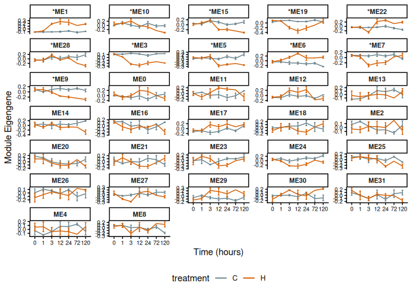<!-- -->

``` r
save_ggplot(plot = last_plot(), filename = "all_modules_lines", width = 14, height = 12)
```

#### Individual module heatmaps

``` r
make_module_heatmap(module_name = "ME5")
```

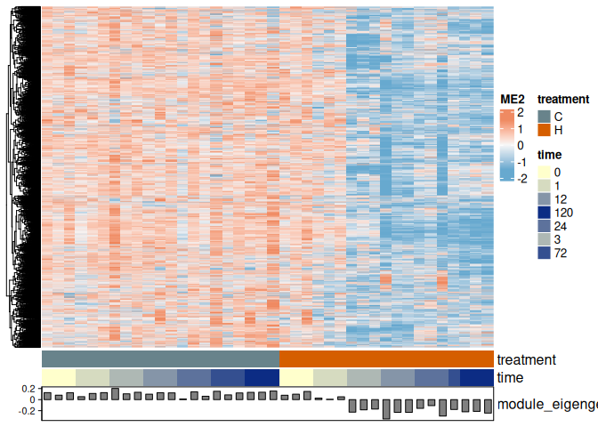<!-- -->

``` r
make_module_heatmap(module_name = "ME22")
```

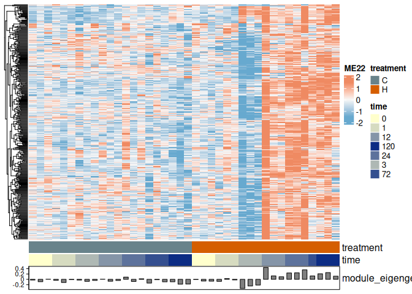<!-- -->

``` r
make_module_heatmap(module_name = "ME3")
```

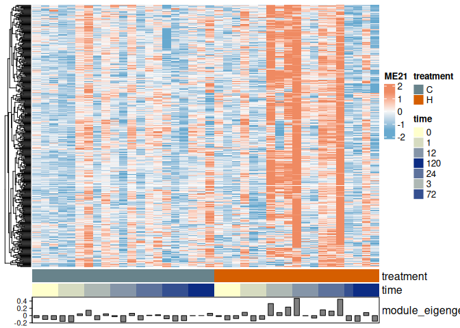<!-- -->

## POR

### Pre-processing

Read in variance-stabilized count info and metadata

``` r
outdir <- "../output_RNA/multiWGCNA/POR_Pcomp/"
getwd()
```

    ## [1] "/project/pi_hputnam_uri_edu/zdellaert/TimeSeries/4-multi-species/code"

``` r
vst <- read.csv("../output_RNA/differential_expression/POR_Pcomp/vsd_expression_matrix.csv")

vst <- vst %>% column_to_rownames(var = "X")
normalized_counts <- t(vst)

# NOTE! Removing 2 outliers prior to vst transformation but they are still in the metadata.

meta <- read.csv("../output_RNA/differential_expression/POR_Pcomp/RNA_seq_metadata.csv")
meta <- meta %>% column_to_rownames(var = "X") %>% select(-c(species, replicate))

all(rownames(meta) %in% colnames(vst))
```

    ## [1] TRUE

``` r
rownames(meta)[!(rownames(meta) %in% colnames(vst))]
```

    ## character(0)

``` r
meta <- meta %>% filter(!(sample %in% c("POR_R24_H1","POR_R72_H1","POR_R72_H2")))
vst <- vst %>% select(!(c("POR_R24_H1","POR_R72_H1","POR_R72_H2")))
normalized_counts <- t(vst)

all(rownames(meta) %in% colnames(vst))
```

    ## [1] TRUE

``` r
all(rownames(meta) == colnames(vst))
```

    ## [1] TRUE

### First, identify and remove any outliers

Cluster the samples and view as a tree.

``` r
sampleTree = hclust(dist(normalized_counts), method = "average")
sizeGrWindow(12,9) 
par(cex = 0.6);
par(mar = c(0,4,2,0))
plot(sampleTree)
```

I did not identify outliers based on this plot.

### Determine parameters for WGCNA

<https://alexslemonade.github.io/refinebio-examples/04-advanced-topics/network-analysis_rnaseq_01_wgcna.html#46_Determine_parameters_for_WGCNA>

<https://bioinformaticsworkbook.org/tutorials/wgcna.html#gsc.tab=0>

``` r
options(stringsAsFactors = FALSE)
enableWGCNAThreads()
```

    ## Allowing parallel execution with up to 63 working processes.

``` r
#set powers to test
powers = c(c(1:10), seq(from = 12, to=40, by=2))

#the below takes a long time to run, so is commented out and the pre-run results are loaded in below
#sft <- pickSoftThreshold(normalized_counts, power=powers, networkType = "signed")
#save(sft, file = paste0(outdir, "sft.RData"))
load(paste0(outdir, "sft.RData"))

sft_df <- data.frame(sft$fitIndices) %>% dplyr::mutate(model_fit = -sign(slope) * SFT.R.sq)

ggplot(sft_df, aes(x = Power, y = model_fit, label = Power)) +
  geom_point() +
  geom_text(nudge_y = 0.1) +
  # We will plot what WGCNA recommends as an R^2 cutoff
  geom_hline(yintercept = 0.80, col = "red") +
  ylim(c(min(sft_df$model_fit), 1.05)) +
  xlab("Soft Threshold (power)") +
  ylab("Scale Free Topology Model Fit, signed R^2") +
  ggtitle("Scale independence") +
  theme_classic()
```

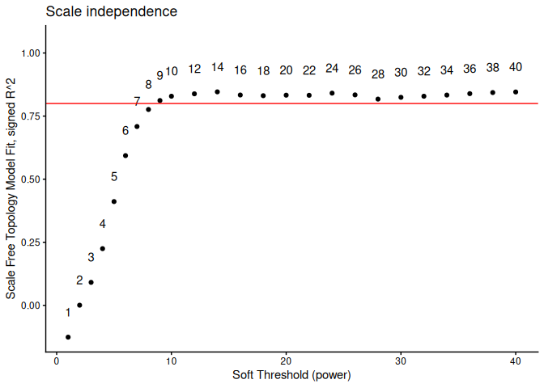<!-- -->

``` r
ggplot(sft_df, aes(x = Power, y = mean.k., label = Power)) +
  geom_point() +
  geom_text(nudge_y = 500) +
  xlab("Soft Threshold (power)") +
  ylab("Mean Connectivity") +
  ggtitle("Mean Connectivity") +
  theme_classic()
```

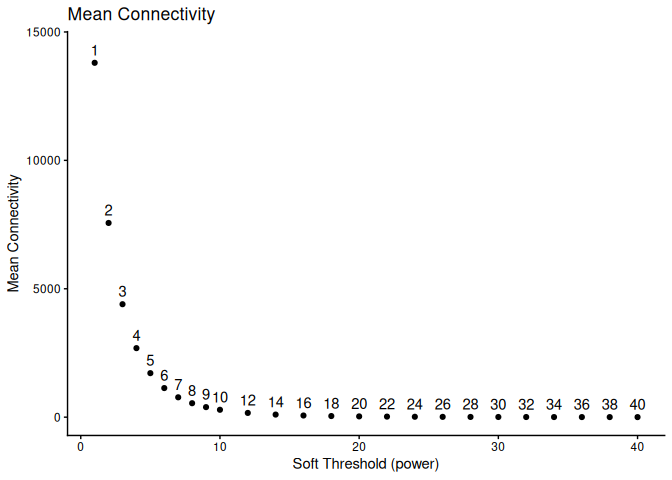<!-- -->

We will move forward with Power = 8

``` r
picked_power = 8
```

### One-step module detection

``` r
temp_cor <- cor
cor <- WGCNA::cor # Force it to use WGCNA cor function (fix a namespace conflict issue)
netwk <- blockwiseModules(normalized_counts,
                          nThreads = 12,

                          # Adjacency Function
                          power = picked_power,
                          corType = "bicor",
                          networkType = "signed",
                          TOMType = "signed",

                          # Tree and Block Options
                          deepSplit = 1,
                          pamRespectsDendro = F,
                          minModuleSize = 30,
                          maxBlockSize = 50000,

                          # topological overlap matrix, (TOM)
                          saveTOMs = TRUE,
                          saveTOMFileBase = paste0(outdir, "blockwiseTOM"),
                          #loadTOM = FALSE, #uncomment this if you are re-running with a previously saved TOM

                          # Output Options
                          mergeCutHeight = 0.25,
                          numericLabels = TRUE,
                          verbose = 3)

cor <- temp_cor     # Return cor function to original namespace
readr::write_rds(netwk, file = file.path(outdir, "wgcna_results.RDS"))
```

``` r
# load WGCNAresults
netwk <- readr::read_rds(file = file.path(outdir, "wgcna_results.RDS"))

# what is stored in this object?
names(netwk)
```

    ##  [1] "colors"         "unmergedColors" "MEs"            "goodSamples"   
    ##  [5] "goodGenes"      "dendrograms"    "TOMFiles"       "blockGenes"    
    ##  [9] "blocks"         "MEsOK"

``` r
# save the module labels
moduleLabels = netwk$colors

# how many modules are there?
paste("There are", length(unique(moduleLabels)), "modules in our current analysis.")
```

    ## [1] "There are 21 modules in our current analysis."

``` r
# see the distribution of genes across these labelled modules
table(netwk$colors)
```

    ## 
    ##    0    1    2    3    4    5    6    7    8    9   10   11   12   13   14   15 
    ## 4903 5343 4844 2942 1353 1279 1205  721  646  629  604  508  435  428  359  330 
    ##   16   17   18   19   20 
    ##  270  235  209  160  130

``` r
# Convert labels to colors for plotting
moduleColors = labels2colors(moduleLabels)

# Plot the dendrogram and the module colors underneath
plotDendroAndColors(
  netwk$dendrograms[[1]],
  moduleColors,
  "Module colors",
  dendroLabels = FALSE,
  hang = 0.03,
  addGuide = TRUE,
  guideHang = 0.05, main = "Consensus gene dendrogram and module colors")
```

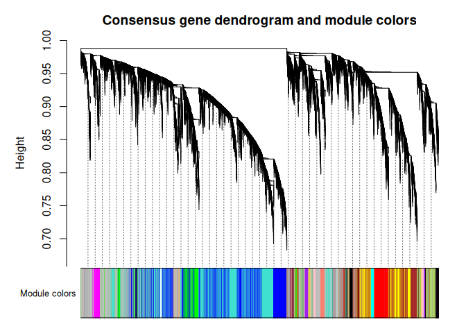<!-- -->

### Treatment and Time Module Correlation

``` r
# save the module info as a dataframe and txt file
module_df <- data.frame(
  gene_id = names(netwk$colors),
  module = paste0("ME", netwk$colors),
  color = labels2colors(netwk$colors)
)

head(module_df)
```

    ##                                    gene_id module     color
    ## 1 Porites_compressa_HIv1___RNAseq.g9685.t1    ME3     brown
    ## 2 Porites_compressa_HIv1___RNAseq.g9709.t1    ME0      grey
    ## 3 Porites_compressa_HIv1___RNAseq.g9710.t1   ME14      cyan
    ## 4     Porites_compressa_HIv1___TS.g4355.t2   ME14      cyan
    ## 5 Porites_compressa_HIv1___RNAseq.g9732.t1    ME0      grey
    ## 6 Porites_compressa_HIv1___RNAseq.g9733.t1    ME1 turquoise

``` r
write_delim(module_df, file = paste0(outdir,"gene_modules.txt"), delim = "\t")

# get the module eigengenes
module_eigengenes <- netwk$MEs
head(module_eigengenes)
```

    ##                   ME1         ME2        ME16        ME14        ME20
    ## POR_R0_C1 -0.09175899  0.02220663 -0.03068575 -0.01384197 -0.12215749
    ## POR_R0_C2 -0.17588331 -0.08119582 -0.19274431 -0.15577387  0.06069376
    ## POR_R0_C3 -0.10011106 -0.04790480 -0.14435881 -0.08624020 -0.14449437
    ## POR_R0_H1  0.08317899  0.12503544  0.14976882 -0.13393914 -0.19939212
    ## POR_R0_H2  0.15694593  0.15567781 -0.12108155 -0.08177265 -0.16324338
    ## POR_R0_H3  0.09300312  0.11913630  0.13887671 -0.12834815 -0.18397330
    ##                  ME15          ME4       ME19        ME12         ME3
    ## POR_R0_C1  0.21316772  0.083003656  0.3030693 -0.09472727 -0.09946113
    ## POR_R0_C2  0.03400059  0.180108812  0.1270834 -0.25513873 -0.05025824
    ## POR_R0_C3  0.09681476 -0.127765480 -0.1120691  0.06804844  0.03689575
    ## POR_R0_H1 -0.01284704 -0.005004623 -0.2006941 -0.22859834 -0.13449181
    ## POR_R0_H2  0.17246286 -0.060097314  0.1040697  0.12045042 -0.17948678
    ## POR_R0_H3  0.03154752 -0.034537892 -0.0968468 -0.22799389 -0.13324276
    ##                   ME17        ME11        ME10        ME18        ME6
    ## POR_R0_C1 -0.178241876 -0.03677015 -0.09266991  0.03721449  0.1569716
    ## POR_R0_C2 -0.310951369 -0.13657844 -0.20362732 -0.19413381  0.1986116
    ## POR_R0_C3 -0.031284180  0.22969465  0.13898839  0.15129828  0.2168592
    ## POR_R0_H1 -0.061229284 -0.15867530  0.08306908  0.24095257 -0.1082219
    ## POR_R0_H2 -0.005453493  0.23509450  0.09934517  0.12575527 -0.1409248
    ## POR_R0_H3 -0.044371727 -0.14490469  0.07730632  0.25253350 -0.0565541
    ##                   ME8        ME13         ME5         ME7         ME9
    ## POR_R0_C1  0.28444953  0.10165476  0.05314294 -0.10655565 -0.07757700
    ## POR_R0_C2  0.26535282  0.13372899  0.12671208  0.09343067  0.11434239
    ## POR_R0_C3  0.22146346 -0.06157389  0.14156544  0.09905366  0.06452141
    ## POR_R0_H1 -0.02932904  0.24211731 -0.16884240 -0.15934518  0.09722579
    ## POR_R0_H2 -0.03562038 -0.07786703 -0.14651813  0.06371884 -0.02623720
    ## POR_R0_H3  0.05765158  0.23112304 -0.15083756 -0.15997039  0.06263442
    ##                   ME0
    ## POR_R0_C1 -0.03145296
    ## POR_R0_C2  0.25688650
    ## POR_R0_C3 -0.08181816
    ## POR_R0_H1 -0.09506865
    ## POR_R0_H2 -0.07625936
    ## POR_R0_H3 -0.09910876

``` r
# get a list of all the genes in a module
gene_module_key <- tibble::enframe(netwk$colors, name = "gene", value = "module") %>%
  # Let's add the `ME` part so its more clear what these numbers are and it matches elsewhere
  dplyr::mutate(module = paste0("ME", module))

# confirm that the sample metadata and sample labels for the module eigengenes are matching
all.equal(meta$sample, rownames(module_eigengenes))
```

    ## [1] TRUE

#### Time+Treatment-Module Correlation Heatmaps

``` r
nSamples = nrow(normalized_counts)

time_treat_factorial <- meta %>%
  mutate(group = paste0(time, "hr-", ifelse(treatment == "C", "Control", "Heat"))) %>%
  select(sample, group) %>% 
  mutate(value = 1) %>% 
  tidyr::pivot_wider(names_from = group, values_from = value, values_fill = 0) %>%
  column_to_rownames(var = "sample") %>%
  relocate(contains("Control"), contains("Heat")) %>%
   mutate(across(everything(), as.factor))

# Reorder modules so similar modules are next to each other
module_eigengenes_ordered <- orderMEs(module_eigengenes)
module_order = names(module_eigengenes_ordered) 

moduleTraitCor =  WGCNA::cor(module_eigengenes_ordered, time_treat_factorial, use = "p");
moduleTraitPvalue = corPvalueStudent(moduleTraitCor, nSamples);

textMatrix <- ifelse(moduleTraitPvalue < 0.05,
                     paste0(signif(moduleTraitCor, 2), "\n(",
                            signif(moduleTraitPvalue, 2), ")"),"")

pdf(paste0(outdir,"/all_heatmap.pdf"),width=8, height=8)
# Will display correlations and their p-values

par(mar = c(4, 3, 2, 2))
labeledHeatmap(Matrix = moduleTraitCor,
               textMatrix = textMatrix,
               xLabels = names(time_treat_factorial),
               yLabels = names(module_eigengenes_ordered),
               ySymbols = names(module_eigengenes_ordered),
               colorLabels = TRUE,
               colors = blueWhiteRed(100),
               setStdMargins = FALSE,
               cex.text = 0.5,
               cex.lab = 0.7,
               cex.colorLabels = 0.7,
               zlim = c(-1,1),
               main = paste("Module-trait relationships - all"))

dev.off()
```

    ## png 
    ##   2

##### ggplot version

``` r
# Add treatment names
module_eigengenes_ordered$treatment_time = paste0(meta$time,"hr","-",ifelse(meta$treatment == "C", "Control", "Heat"))
module_eigengenes_ordered$treatment = meta$treatment
module_eigengenes_ordered <- module_eigengenes_ordered %>% arrange(treatment)

mmPval = moduleTraitPvalue %>% as.data.frame() %>% rownames_to_column("module") %>%
  pivot_longer(-module, names_to = "treatment_time", values_to = "pvalue")

mmCor = moduleTraitCor %>% as.data.frame() %>% rownames_to_column("module") %>%
  pivot_longer(-module, names_to = "treatment_time", values_to = "correlation") %>%
  left_join(mmPval, by = c("module", "treatment_time")) %>%
  mutate(
    label = ifelse(pvalue < 0.05,
                   paste0(signif(correlation, 2)), ""),
    # use this if you want the p-value also plotted
    #label = ifelse(pvalue < 0.05,
    #               paste0(signif(correlation, 2), "\n(", signif(pvalue, 2), ")"), ""),
    module = factor(module, levels = rev(module_order)),
    treatment_time = factor(treatment_time, levels = unique(module_eigengenes_ordered$treatment_time)))

ggplot(mmCor, aes(x=treatment_time, y=module, fill=correlation)) +
  geom_tile(color = "white", linewidth = 0.3) +
  geom_text(aes(label = label), size = 3, color = "black") +
  theme_minimal(base_size = 12) +
  scale_fill_gradient2(
    low = "#4575B4",
    high = "#D73027",
    mid = "white",
    midpoint = 0,
    limits = c(-1, 1)) +
  labs(title = "Module-trait Relationships", y = "Modules", fill="Correlation")+ 
  theme(
    axis.text.x = element_text(angle = 45, hjust = 1),
    panel.grid = element_blank(),
    axis.ticks = element_blank()
  ) +coord_fixed(ratio = 0.7) 
```

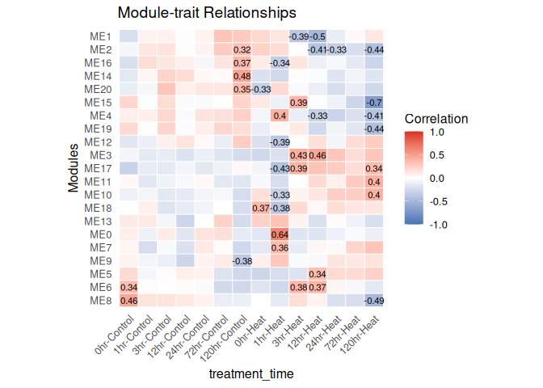<!-- -->

``` r
save_ggplot(plot = last_plot(), filename = "all_heatmap_ggplot", width = 8, height = 8)
```

##### ID peak times based on correlation

``` r
module_peak_times <- mmCor %>%
  filter(pvalue < 0.05, grepl("Heat",treatment_time)) %>%
  group_by(treatment_time) %>%
  summarize(
    n_modules = n(),
    mean_abs_cor = mean(abs(correlation))
  ) %>%
  extract(treatment_time, "time", "([0-9]+)hr", convert = TRUE)

module_peak_times
```

    ## # A tibble: 6 × 3
    ##    time n_modules mean_abs_cor
    ##   <int>     <int>        <dbl>
    ## 1     0         2        0.350
    ## 2     1         8        0.407
    ## 3     3         5        0.395
    ## 4    12         6        0.403
    ## 5    24         1        0.334
    ## 6   120         8        0.455

#### Run linear model on each module vs. treatment

``` r
# Create the design matrix for full (with interaction) models, use factor for time since non-evenly spaced intervals

meta$time_factor <- factor(meta$time)
des_mat_full <- model.matrix(~ treatment*time_factor, data = meta)
head(des_mat_full)
```

    ##           (Intercept) treatmentH time_factor1 time_factor3 time_factor12
    ## POR_R0_C1           1          0            0            0             0
    ## POR_R0_C2           1          0            0            0             0
    ## POR_R0_C3           1          0            0            0             0
    ## POR_R0_H1           1          1            0            0             0
    ## POR_R0_H2           1          1            0            0             0
    ## POR_R0_H3           1          1            0            0             0
    ##           time_factor24 time_factor72 time_factor120 treatmentH:time_factor1
    ## POR_R0_C1             0             0              0                       0
    ## POR_R0_C2             0             0              0                       0
    ## POR_R0_C3             0             0              0                       0
    ## POR_R0_H1             0             0              0                       0
    ## POR_R0_H2             0             0              0                       0
    ## POR_R0_H3             0             0              0                       0
    ##           treatmentH:time_factor3 treatmentH:time_factor12
    ## POR_R0_C1                       0                        0
    ## POR_R0_C2                       0                        0
    ## POR_R0_C3                       0                        0
    ## POR_R0_H1                       0                        0
    ## POR_R0_H2                       0                        0
    ## POR_R0_H3                       0                        0
    ##           treatmentH:time_factor24 treatmentH:time_factor72
    ## POR_R0_C1                        0                        0
    ## POR_R0_C2                        0                        0
    ## POR_R0_C3                        0                        0
    ## POR_R0_H1                        0                        0
    ## POR_R0_H2                        0                        0
    ## POR_R0_H3                        0                        0
    ##           treatmentH:time_factor120
    ## POR_R0_C1                         0
    ## POR_R0_C2                         0
    ## POR_R0_C3                         0
    ## POR_R0_H1                         0
    ## POR_R0_H2                         0
    ## POR_R0_H3                         0

``` r
# lmFit() needs a transposed version of the matrix
fit_full <- limma::lmFit(t(module_eigengenes), design = des_mat_full)

# Apply empirical Bayes to smooth standard errors
fit_full <- limma::eBayes(fit_full)

# Apply multiple testing correction and obtain stats

## interaction <- treatment effect differs by time
interaction_coefs <- grep("treatment.*:time", colnames(des_mat_full), value = TRUE)

stats_interaction <- limma::topTable(fit_full, coef = interaction_coefs, number = ncol(module_eigengenes)) %>%
  tibble::rownames_to_column("module")

stats_df_full <- limma::topTable(fit_full, number = ncol(module_eigengenes)) %>%
  tibble::rownames_to_column("module")

# we care most about the interaction, the full model will pull out modules that vary in both treatments by time also (like a circadian rhythm 0hr vs 12hr difference)

# almost all of our modules significant by this model:
stats_interaction %>% filter(adj.P.Val < 0.05)  %>% nrow()
```

    ## [1] 10

``` r
#save these as a vector
top_mod_sig_interaction <- stats_interaction %>% filter(adj.P.Val < 0.05)  %>% pull(module)

# print the top 5:
stats_interaction %>% filter(adj.P.Val < 0.05)  %>% head(5)
```

    ##   module treatmentH.time_factor1 treatmentH.time_factor3
    ## 1   ME15              0.00830546              0.16567309
    ## 2    ME2             -0.14250298             -0.25353090
    ## 3    ME3              0.07555192              0.41966261
    ## 4    ME0              0.54474829             -0.01308681
    ## 5    ME5              0.16689976              0.14726002
    ##   treatmentH.time_factor12 treatmentH.time_factor24 treatmentH.time_factor72
    ## 1               0.05642367              0.002878354               -0.2261004
    ## 2              -0.39017729             -0.433242273               -0.5415376
    ## 3               0.47419328              0.367576115                0.3868988
    ## 4               0.13186767             -0.006484784                0.0139714
    ## 5               0.40650834              0.351510074                0.5524123
    ##   treatmentH.time_factor120       AveExpr        F      P.Value   adj.P.Val
    ## 1                -0.4597048  3.558407e-19 5.137865 0.0003178375 0.004003624
    ## 2                -0.5958562 -1.492307e-17 5.029431 0.0003812975 0.004003624
    ## 3                 0.4099688 -4.803850e-18 4.315182 0.0012940827 0.009058579
    ## 4                 0.1522199  8.762578e-18 3.549785 0.0049928742 0.026212590
    ## 5                 0.5435133 -4.981770e-18 3.367977 0.0069167699 0.029050434

Module 15 is the most differentially expressed across treatments + in
the full model.

#### Plot example module over time

``` r
eigengenes_treatment_df <- module_eigengenes %>%
  tibble::rownames_to_column("sample") %>%
  dplyr::inner_join(meta %>%
    dplyr::select(sample, treatment,time),
  by = c("sample" = "sample"))

ggplot(eigengenes_treatment_df, aes(x = factor(time), y = ME15,color = treatment)) +
  geom_boxplot(outlier.shape = NA) +
  ggforce::geom_sina(size=1, alpha = 0.5) +
  scale_color_manual(values = treat_colors) +
  theme_classic()
```

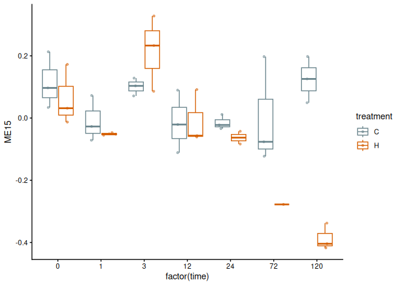<!-- -->

#### Trajectory plots for all modules

``` r
eigengenes_treatment_df_long <- eigengenes_treatment_df %>%
  pivot_longer(cols = starts_with("ME"),
               names_to = "module",
               values_to = "eigengene_value") %>%
  mutate(module = factor(module, levels = module_order)) %>%
  mutate(module_label = ifelse(module %in% top_mod_sig_interaction, 
                                paste0("*",module), 
                                as.character(module)))

ggplot(eigengenes_treatment_df_long, aes(x = factor(time), y = eigengene_value,color = treatment)) +
  geom_boxplot(outlier.shape = NA) +
  ggforce::geom_sina(size=1, alpha = 0.5) +
  scale_color_manual(values = treat_colors) +
  facet_wrap(~module_label, ncol = 5) +
  theme_classic() + theme(
    strip.text = element_text(size = 8, face = "bold"),
    axis.text = element_text(size = 7),
    legend.position = "bottom") +
  labs(x = "Time (hours)", y = "Module Eigengene")
```

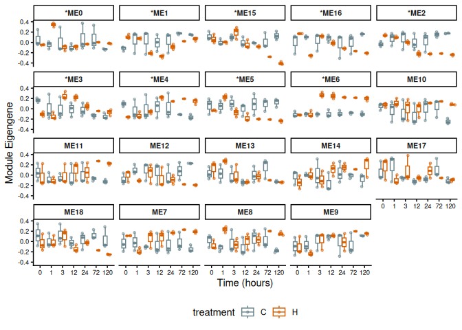<!-- -->

``` r
save_ggplot(plot = last_plot(), filename = "all_modules", width = 14, height = 12)

eigengenes_summary <- eigengenes_treatment_df_long %>%
  group_by(module, module_label, time, treatment) %>%
  summarize(mean_value = mean(eigengene_value),
            se = sd(eigengene_value) / sqrt(n()),
            .groups = "drop")

ggplot(eigengenes_summary, aes(x = factor(time), y = mean_value, color = treatment, group = treatment)) +
  geom_line(linewidth = 0.5) +
  geom_errorbar(aes(ymin = mean_value - se, ymax = mean_value + se), width = 0.2) +
  scale_color_manual(values = treat_colors) +
  facet_wrap(~module_label, ncol = 5, scales = "free_y") +
  theme_classic() +
  theme(
    strip.text = element_text(size = 8, face = "bold"),
    axis.text = element_text(size = 7),
    legend.position = "bottom") +
  labs(x = "Time (hours)", y = "Module Eigengene")
```

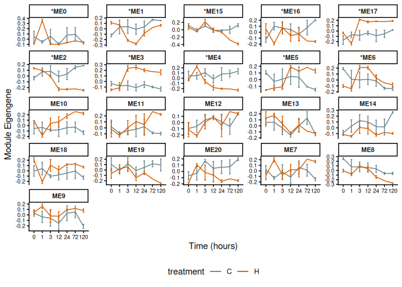<!-- -->

``` r
save_ggplot(plot = last_plot(), filename = "all_modules_lines", width = 14, height = 12)
```

#### Individual module heatmaps

``` r
make_module_heatmap(module_name = "ME15")
```

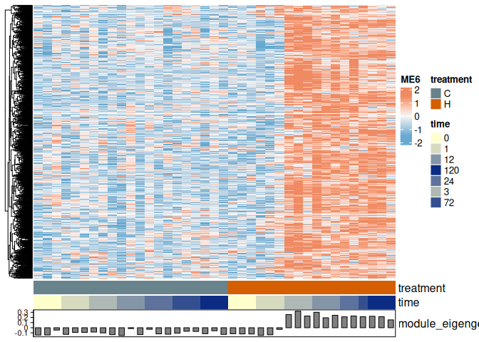<!-- -->

``` r
make_module_heatmap(module_name = "ME2")
```

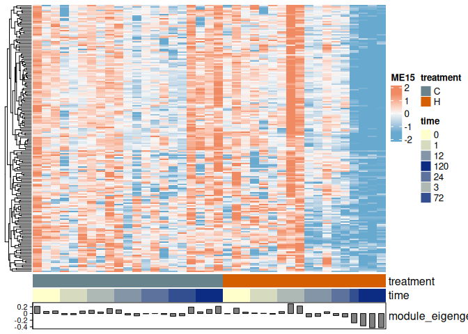<!-- -->

``` r
make_module_heatmap(module_name = "ME3")
```

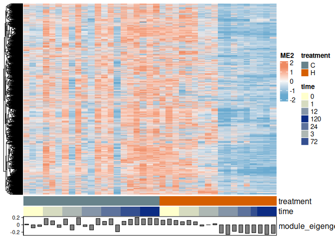<!-- -->
