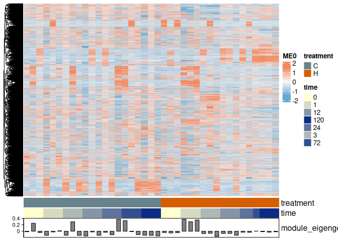

multiWGCNA
================
Zoe Dellaert
2025-12-03

### Network analysis of Time Series Bulk RNA Data – multiWGCNA

## Introduction

The goal of this script is to identify co-expressed gene modules from
our time-course RNA-seq data. I hope to identify genes which respond to
the heat stress similarly over time.

I will be following [this
vignette](https://bioc.r-universe.dev/articles/multiWGCNA/autism_full_workflow.html)
for the package [multiWGCNA](https://github.com/fogellab/multiWGCNA),
which is described in this
[paper](https://link.springer.com/article/10.1186/s12859-023-05233-z#Abs1).
An example paper with a use of this package I really like is [here,
figure 4](https://www.pnas.org/doi/epub/10.1073/pnas.2420811122).
Helpful *general* WGCNA tutorial to help with parameter decisions can be
found
[here](https://alexslemonade.github.io/refinebio-examples/04-advanced-topics/network-analysis_rnaseq_01_wgcna.html#46_Determine_parameters_for_WGCNA).

## Install necessary packages

First, download the necessary packages.

``` r
if (!require("BiocManager", quietly = TRUE))
    install.packages("BiocManager")

if (!require("devtools", quietly = TRUE))
    install.packages("devtools")

BiocManager::install("impute", type = "source")
BiocManager::install("WGCNA",force = TRUE)
devtools::install_github("fogellab/multiWGCNA")
```

### Load packages + general set-up

``` r
library(tidyverse)
library(WGCNA)
library(multiWGCNA)

#set standard output directory for figures
save_ggplot <- function(plot, filename, width = 10, height = 7, units = "in", dpi = 300,bg=NULL) {
  png_path <- file.path(outdir, paste0(filename, ".png"))
  pdf_dir <- file.path(outdir, "pdf_figs")
  pdf_path <- file.path(pdf_dir, paste0(filename, ".pdf"))
  
  # Ensure the pdf_figs directory exists
  if (!dir.exists(pdf_dir)) dir.create(pdf_dir, recursive = TRUE)
  
  # Save plots
  ggsave(filename = png_path, plot = plot, width = width, height = height, units = units, dpi = dpi,bg = bg)
  ggsave(filename = pdf_path, plot = plot, width = width, height = height, units = units, dpi = dpi,bg = bg)
}

treat_colors <- c("C" = "lightblue4", "H" = "#D55E00")
time_colors <- colorRampPalette(c("#ffffcc","#0c2c84"))(7)
names(time_colors) <- c("0", "1", "3", "12", "24", "72", "120")
sessionInfo()
```

    ## R version 4.5.1 (2025-06-13)
    ## Platform: x86_64-pc-linux-gnu
    ## Running under: Ubuntu 24.04.1 LTS
    ## 
    ## Matrix products: default
    ## BLAS:   /usr/lib/x86_64-linux-gnu/openblas-pthread/libblas.so.3 
    ## LAPACK: /usr/lib/x86_64-linux-gnu/openblas-pthread/libopenblasp-r0.3.26.so;  LAPACK version 3.12.0
    ## 
    ## locale:
    ##  [1] LC_CTYPE=en_US.UTF-8       LC_NUMERIC=C              
    ##  [3] LC_TIME=en_US.UTF-8        LC_COLLATE=en_US.UTF-8    
    ##  [5] LC_MONETARY=en_US.UTF-8    LC_MESSAGES=en_US.UTF-8   
    ##  [7] LC_PAPER=en_US.UTF-8       LC_NAME=C                 
    ##  [9] LC_ADDRESS=C               LC_TELEPHONE=C            
    ## [11] LC_MEASUREMENT=en_US.UTF-8 LC_IDENTIFICATION=C       
    ## 
    ## time zone: Etc/UTC
    ## tzcode source: system (glibc)
    ## 
    ## attached base packages:
    ## [1] stats     graphics  grDevices utils     datasets  methods   base     
    ## 
    ## other attached packages:
    ##  [1] multiWGCNA_1.9.1      ggalluvial_0.12.5     WGCNA_1.73           
    ##  [4] fastcluster_1.3.0     dynamicTreeCut_1.63-1 lubridate_1.9.4      
    ##  [7] forcats_1.0.0         stringr_1.6.0         dplyr_1.1.4          
    ## [10] purrr_1.2.0           readr_2.1.6           tidyr_1.3.1          
    ## [13] tibble_3.3.0          ggplot2_4.0.1         tidyverse_2.0.0      
    ## 
    ## loaded via a namespace (and not attached):
    ##   [1] DBI_1.2.3                   gridExtra_2.3              
    ##   [3] rlang_1.1.6                 magrittr_2.0.4             
    ##   [5] matrixStats_1.5.0           compiler_4.5.1             
    ##   [7] RSQLite_2.4.5               png_0.1-8                  
    ##   [9] vctrs_0.6.5                 pkgconfig_2.0.3            
    ##  [11] crayon_1.5.3                fastmap_1.2.0              
    ##  [13] backports_1.5.0             XVector_0.50.0             
    ##  [15] ggraph_2.2.2                rmarkdown_2.30             
    ##  [17] tzdb_0.5.0                  preprocessCore_1.72.0      
    ##  [19] bit_4.6.0                   xfun_0.54                  
    ##  [21] cachem_1.1.0                dcanr_1.26.0               
    ##  [23] flashClust_1.01-2           blob_1.2.4                 
    ##  [25] DelayedArray_0.36.0         tweenr_2.0.3               
    ##  [27] parallel_4.5.1              cluster_2.1.8.1            
    ##  [29] R6_2.6.1                    stringi_1.8.7              
    ##  [31] RColorBrewer_1.1-3          rpart_4.1.24               
    ##  [33] GenomicRanges_1.62.0        Rcpp_1.1.0                 
    ##  [35] Seqinfo_1.0.0               SummarizedExperiment_1.40.0
    ##  [37] iterators_1.0.14            knitr_1.50                 
    ##  [39] base64enc_0.1-3             IRanges_2.44.0             
    ##  [41] igraph_2.2.1                Matrix_1.7-3               
    ##  [43] splines_4.5.1               nnet_7.3-20                
    ##  [45] timechange_0.3.0            tidyselect_1.2.1           
    ##  [47] viridis_0.6.5               rstudioapi_0.17.1          
    ##  [49] dichromat_2.0-0.1           abind_1.4-8                
    ##  [51] yaml_2.3.11                 doParallel_1.0.17          
    ##  [53] codetools_0.2-20            doRNG_1.8.6.2              
    ##  [55] lattice_0.22-7              Biobase_2.70.0             
    ##  [57] withr_3.0.2                 KEGGREST_1.50.0            
    ##  [59] S7_0.2.1                    evaluate_1.0.5             
    ##  [61] foreign_0.8-90              survival_3.8-3             
    ##  [63] polyclip_1.10-7             Biostrings_2.78.0          
    ##  [65] pillar_1.11.1               MatrixGenerics_1.22.0      
    ##  [67] rngtools_1.5.2              checkmate_2.3.3            
    ##  [69] foreach_1.5.2               stats4_4.5.1               
    ##  [71] generics_0.1.4              S4Vectors_0.48.0           
    ##  [73] hms_1.1.4                   scales_1.4.0               
    ##  [75] glue_1.8.0                  Hmisc_5.2-4                
    ##  [77] tools_4.5.1                 data.table_1.17.8          
    ##  [79] graphlayouts_1.2.2          cowplot_1.2.0              
    ##  [81] tidygraph_1.3.1             grid_4.5.1                 
    ##  [83] impute_1.84.0               AnnotationDbi_1.72.0       
    ##  [85] colorspace_2.1-2            patchwork_1.3.2            
    ##  [87] ggforce_0.5.0               htmlTable_2.4.3            
    ##  [89] Formula_1.2-5               cli_3.6.5                  
    ##  [91] viridisLite_0.4.2           S4Arrays_1.10.0            
    ##  [93] gtable_0.3.6                digest_0.6.39              
    ##  [95] BiocGenerics_0.56.0         ggrepel_0.9.6              
    ##  [97] SparseArray_1.10.2          htmlwidgets_1.6.4          
    ##  [99] farver_2.1.2                memoise_2.0.1              
    ## [101] htmltools_0.5.9             lifecycle_1.0.4            
    ## [103] httr_1.4.7                  GO.db_3.22.0               
    ## [105] MASS_7.3-65                 bit64_4.6.0-1

- Create Heatmap function based heavily off of the following tutorial:

<https://alexslemonade.github.io/refinebio-examples/04-advanced-topics/network-analysis_rnaseq_01_wgcna.html#46_Determine_parameters_for_WGCNA>

``` r
make_module_heatmap <- function(module_name,
                                expression_mat = normalized_counts,
                                metadata_df = meta,
                                gene_module_key_df = module_df,
                                module_eigengenes_df = module_eigengenes) {
  # Create a summary heatmap of a given module.
  # based on https://alexslemonade.github.io/refinebio-examples/04-advanced-topics/network-analysis_rnaseq_01_wgcna.html#46_Determine_parameters_for_WGCNA

  # Set up the module eigengene with its sample
  module_eigengene <- module_eigengenes_df %>%
    dplyr::select(all_of(module_name)) %>%
    tibble::rownames_to_column("sample")

  # Set up column annotation from metadata
  col_annot_df <- metadata_df %>%
    # Only select the treatment, time, and sample ID columns
    dplyr::select(sample, treatment, time) %>%
    # Add on the eigengene expression by joining with sample IDs
    dplyr::inner_join(module_eigengene, by = "sample") %>%
    # Arrange by treatment and time point
    dplyr::arrange(treatment, time, sample) %>%
    # Store sample
    tibble::column_to_rownames("sample")

  # Create the ComplexHeatmap column annotation object
  col_annot <- ComplexHeatmap::HeatmapAnnotation(
    # Supply treatment and time labels
    treatment = col_annot_df$treatment,
    time = col_annot_df$time,
    # Add annotation barplot
    module_eigengene = ComplexHeatmap::anno_barplot(dplyr::select(col_annot_df, module_name)),
    # Pick colors for each experimental group in treatment
    col = list(treatment = c("C" = "lightblue4", "H" = "#D55E00"),
               time = time_colors)
  )

  # Get a vector of the gene IDs that correspond to this module
  module_genes <- gene_module_key_df %>%
    dplyr::filter(module == module_name) %>%
    dplyr::pull(gene_id)

  # Set up the gene expression data frame
  mod_mat <- expression_mat %>%
    t() %>%
    as.data.frame() %>%
    # Only keep genes from this module
    dplyr::filter(rownames(.) %in% module_genes) %>%
    # Order the samples to match col_annot_df
    dplyr::select(rownames(col_annot_df)) %>%
    # Data needs to be a matrix
    as.matrix()

  # Normalize the gene expression values
  mod_mat <- mod_mat %>%
    # Scale can work on matrices, but it does it by column so we will need to
    # transpose first
    t() %>%
    scale() %>%
    # And now we need to transpose back
    t()

  # Create a color function based on standardized scale
  color_func <- circlize::colorRamp2(
    c(-1.5, 0, 1.5),
    c("#67a9cf", "#f7f7f7", "#ef8a62")
  )

  # Plot on a heatmap
  heatmap <- ComplexHeatmap::Heatmap(mod_mat,
    name = module_name,
    # Supply color function
    col = color_func,
    # Supply column annotation
    bottom_annotation = col_annot,
    # We don't want to cluster samples
    cluster_columns = FALSE,
    # We don't need to show sample or gene labels
    show_row_names = FALSE,
    show_column_names = FALSE
  )

  # Return heatmap
  return(heatmap)
}
```

## POC

### Pre-processing

Read in variance-stabilized count info and metadata

``` r
outdir <- "../output_RNA/multiWGCNA/POC_PacutaV2/"
getwd()
```

    ## [1] "/project/pi_hputnam_uri_edu/zdellaert/TimeSeries/4-multi-species/code"

``` r
vst <- read.csv("../output_RNA/differential_expression/POC_PacutaV2/vsd_expression_matrix.csv")

vst <- vst %>% column_to_rownames(var = "X")
normalized_counts <- t(vst)

meta <- read.csv("../output_RNA/differential_expression/POC_PacutaV2/RNA_seq_metadata.csv")
meta <- meta %>% column_to_rownames(var = "X") %>% select(-c(species, replicate))
```

### First, identify and remove any outliers

Cluster the samples and view as a tree.

``` r
sampleTree = hclust(dist(normalized_counts), method = "average")
sizeGrWindow(12,9) 
par(cex = 0.6);
par(mar = c(0,4,2,0))
plot(sampleTree)
```

I did not identify outliers based on this plot.

### Determine parameters for WGCNA

<https://alexslemonade.github.io/refinebio-examples/04-advanced-topics/network-analysis_rnaseq_01_wgcna.html#46_Determine_parameters_for_WGCNA>

<https://bioinformaticsworkbook.org/tutorials/wgcna.html#gsc.tab=0>

``` r
options(stringsAsFactors = FALSE)
enableWGCNAThreads()
```

    ## Allowing parallel execution with up to 63 working processes.

``` r
#set powers to test
powers = c(c(1:10), seq(from = 12, to=40, by=2))

#the below takes a long time to run, so is commented out and the pre-run results are loaded in below
#sft <- pickSoftThreshold(normalized_counts, power=powers, networkType = "signed")
#save(sft, file = paste0(outdir, "sft.RData"))
load(paste0(outdir, "sft.RData"))

sft_df <- data.frame(sft$fitIndices) %>% dplyr::mutate(model_fit = -sign(slope) * SFT.R.sq)

ggplot(sft_df, aes(x = Power, y = model_fit, label = Power)) +
  geom_point() +
  geom_text(nudge_y = 0.1) +
  # We will plot what WGCNA recommends as an R^2 cutoff
  geom_hline(yintercept = 0.80, col = "red") +
  ylim(c(min(sft_df$model_fit), 1.05)) +
  xlab("Soft Threshold (power)") +
  ylab("Scale Free Topology Model Fit, signed R^2") +
  ggtitle("Scale independence") +
  theme_classic()
```

<!-- -->

``` r
ggplot(sft_df, aes(x = Power, y = mean.k., label = Power)) +
  geom_point() +
  geom_text(nudge_y = 500) +
  xlab("Soft Threshold (power)") +
  ylab("Mean Connectivity") +
  ggtitle("Mean Connectivity") +
  theme_classic()
```

<!-- -->

We will move forward with Power = 12.

``` r
picked_power = 12
```

### One-step module detection

``` r
temp_cor <- cor
cor <- WGCNA::cor # Force it to use WGCNA cor function (fix a namespace conflict issue)
netwk <- blockwiseModules(normalized_counts,
                          nThreads = 16,

                          # Adjacency Function
                          power = picked_power,
                          corType = "bicor",
                          networkType = "signed",
                          TOMType = "signed",

                          # Tree and Block Options
                          deepSplit = 1,
                          pamRespectsDendro = F,
                          minModuleSize = 30,
                          maxBlockSize = 50000,

                          # topological overlap matrix, (TOM)
                          saveTOMs = TRUE,
                          saveTOMFileBase = paste0(outdir, "blockwiseTOM"),
                          #loadTOM = FALSE, #uncomment this if you are re-running with a previously saved TOM

                          # Output Options
                          mergeCutHeight = 0.25,
                          numericLabels = TRUE,
                          verbose = 3)

cor <- temp_cor     # Return cor function to original namespace
readr::write_rds(netwk, file = file.path(outdir, "wgcna_results.RDS"))
```

``` r
# load WGCNAresults
netwk <- readr::read_rds(file = file.path(outdir, "wgcna_results.RDS"))

# what is stored in this object?
names(netwk)
```

    ##  [1] "colors"         "unmergedColors" "MEs"            "goodSamples"   
    ##  [5] "goodGenes"      "dendrograms"    "TOMFiles"       "blockGenes"    
    ##  [9] "blocks"         "MEsOK"

``` r
# save the module labels
moduleLabels = netwk$colors

# how many modules are there?
paste("There are", length(unique(moduleLabels)), "modules in our current analysis.")
```

    ## [1] "There are 25 modules in our current analysis."

``` r
# see the distribution of genes across these labelled modules
table(netwk$colors)
```

    ## 
    ##    0    1    2    3    4    5    6    7    8    9   10   11   12   13   14   15 
    ## 3800 3787 3256 2796 1772 1624 1586  860  768  694  548  523  390  386  308  272 
    ##   16   17   18   19   20   21   22   23   24 
    ##  227  202  188  173  151  145  130  104   98

``` r
# Convert labels to colors for plotting
moduleColors = labels2colors(moduleLabels)

# Plot the dendrogram and the module colors underneath
plotDendroAndColors(
  netwk$dendrograms[[1]],
  moduleColors,
  "Module colors",
  dendroLabels = FALSE,
  hang = 0.03,
  addGuide = TRUE,
  guideHang = 0.05, main = "Consensus gene dendrogram and module colors")
```

<!-- -->

### Treatment and Time Module Correlation

``` r
# save the module info as a dataframe and txt file
module_df <- data.frame(
  gene_id = names(netwk$colors),
  module = paste0("ME", netwk$colors),
  color = labels2colors(netwk$colors)
)

head(module_df)
```

    ##                                     gene_id module     color
    ## 1     Pocillopora_acuta_HIv2___TS.g10153.t1    ME1 turquoise
    ## 2    Pocillopora_acuta_HIv2___TS.g28292.t1a    ME1 turquoise
    ## 3     Pocillopora_acuta_HIv2___TS.g28295.t1    ME2      blue
    ## 4     Pocillopora_acuta_HIv2___TS.g28301.t1    ME8      pink
    ## 5 Pocillopora_acuta_HIv2___RNAseq.g10157.t1    ME2      blue
    ## 6     Pocillopora_acuta_HIv2___TS.g10172.t1   ME16 lightcyan

``` r
write_delim(module_df, file = paste0(outdir,"gene_modules.txt"), delim = "\t")

# get the module eigengenes
module_eigengenes <- netwk$MEs
head(module_eigengenes)
```

    ##                    ME5         ME12         ME8         ME7        ME23
    ## POC_R0_C1 -0.055427058  0.071865825 -0.13012560 -0.11397561 -0.07076291
    ## POC_R0_C2 -0.030216898 -0.122451461 -0.07813953 -0.14020447 -0.24960645
    ## POC_R0_C3 -0.033165655 -0.047864436 -0.04958979 -0.11817335 -0.04200445
    ## POC_R0_H1 -0.028049139 -0.004143458 -0.14838840 -0.08653988  0.07730481
    ## POC_R0_H2  0.008369229 -0.076107560 -0.03473621 -0.10799470 -0.26820251
    ## POC_R0_H3  0.066125427  0.095891696 -0.08526258  0.10116217 -0.23300316
    ##                  ME2         ME6        ME15         ME13        ME21
    ## POC_R0_C1 -0.1285302 -0.05477251  0.06230250 -0.038733684 -0.13026062
    ## POC_R0_C2 -0.1336087 -0.16424113  0.14456414  0.121388722  0.09540330
    ## POC_R0_C3 -0.1427822 -0.13710310  0.10775194  0.002475003 -0.04976814
    ## POC_R0_H1 -0.1309182 -0.06975706 -0.05013472 -0.015507185 -0.08885978
    ## POC_R0_H2 -0.1508540 -0.18549632  0.19263682  0.086180101 -0.02044825
    ## POC_R0_H3 -0.1289640 -0.12755846  0.13675463  0.233571593  0.16103308
    ##                   ME17          ME9        ME11       ME20       ME24
    ## POC_R0_C1 -0.016981077  0.004737978  0.02528915 0.06570487 0.05117312
    ## POC_R0_C2  0.104838744 -0.163978576 -0.11085756 0.09898933 0.04872028
    ## POC_R0_C3 -0.022265787  0.053708750 -0.03907366 0.05361465 0.08905346
    ## POC_R0_H1 -0.009398839  0.184461816  0.01122931 0.06245619 0.14479023
    ## POC_R0_H2 -0.076118169 -0.172102618 -0.11923361 0.09355343 0.03281290
    ## POC_R0_H3 -0.031396391 -0.147953059 -0.07350157 0.10444632 0.13840435
    ##                  ME3         ME4        ME14        ME16        ME19
    ## POC_R0_C1 0.16368724  0.22646363 -0.08752314 -0.14084844 -0.04236932
    ## POC_R0_C2 0.18245300  0.11927213 -0.03540100 -0.11231991  0.02838421
    ## POC_R0_C3 0.13512723  0.06662749 -0.09462258 -0.11058993 -0.02151330
    ## POC_R0_H1 0.13749257  0.13672163 -0.09472251  0.06717273 -0.05118971
    ## POC_R0_H2 0.16273171  0.07679049 -0.08116125 -0.13386479 -0.00252362
    ## POC_R0_H3 0.06296345 -0.18051058 -0.04437940 -0.06482205  0.09348777
    ##                  ME10       ME22        ME1        ME18         ME0
    ## POC_R0_C1  0.16954322 0.07304600 0.07338757 0.159631125 -0.09548937
    ## POC_R0_C2  0.14862143 0.03748504 0.13526552 0.009937077 -0.04777610
    ## POC_R0_C3  0.08903449 0.06407156 0.13932645 0.142677641 -0.07075658
    ## POC_R0_H1  0.15086889 0.08196196 0.07560302 0.127519923 -0.10269888
    ## POC_R0_H2  0.09266639 0.07988181 0.17423785 0.137387282 -0.06167330
    ## POC_R0_H3 -0.05492273 0.06617152 0.16219846 0.079728927 -0.03998675

``` r
# get a list of all the genes in a module
gene_module_key <- tibble::enframe(netwk$colors, name = "gene", value = "module") %>%
  # Let's add the `ME` part so its more clear what these numbers are and it matches elsewhere
  dplyr::mutate(module = paste0("ME", module))

# confirm that the sample metadata and sample labels for the module eigengenes are matching
all.equal(meta$sample, rownames(module_eigengenes))
```

    ## [1] TRUE

#### Time+Treatment-Module Correlation Heatmaps

``` r
nSamples = nrow(normalized_counts)

time_treat_factorial <- meta %>%
  mutate(group = paste0(time, "hr-", ifelse(treatment == "C", "Control", "Heat"))) %>%
  select(sample, group) %>% 
  mutate(value = 1) %>% 
  tidyr::pivot_wider(names_from = group, values_from = value, values_fill = 0) %>%
  column_to_rownames(var = "sample") %>%
  relocate(contains("Control"), contains("Heat")) %>%
   mutate(across(everything(), as.factor))

# Reorder modules so similar modules are next to each other
module_eigengenes_ordered <- orderMEs(module_eigengenes)
module_order = names(module_eigengenes_ordered) 

moduleTraitCor =  WGCNA::cor(module_eigengenes_ordered, time_treat_factorial, use = "p");
moduleTraitPvalue = corPvalueStudent(moduleTraitCor, nSamples);

textMatrix <- ifelse(moduleTraitPvalue < 0.05,
                     paste0(signif(moduleTraitCor, 2), "\n(",
                            signif(moduleTraitPvalue, 2), ")"),"")

pdf(paste0(outdir,"/all_heatmap.pdf"),width=8, height=8)
# Will display correlations and their p-values

par(mar = c(4, 3, 2, 2))
labeledHeatmap(Matrix = moduleTraitCor,
               textMatrix = textMatrix,
               xLabels = names(time_treat_factorial),
               yLabels = names(module_eigengenes_ordered),
               ySymbols = names(module_eigengenes_ordered),
               colorLabels = TRUE,
               colors = blueWhiteRed(100),
               setStdMargins = FALSE,
               cex.text = 0.5,
               cex.lab = 0.7,
               cex.colorLabels = 0.7,
               zlim = c(-1,1),
               main = paste("Module-trait relationships - all"))

dev.off()
```

    ## png 
    ##   2

##### ggplot version

``` r
# Add treatment names
module_eigengenes_ordered$treatment_time = paste0(meta$time,"hr","-",ifelse(meta$treatment == "C", "Control", "Heat"))
module_eigengenes_ordered$treatment = meta$treatment
module_eigengenes_ordered <- module_eigengenes_ordered %>% arrange(treatment)

mmPval = moduleTraitPvalue %>% as.data.frame() %>% rownames_to_column("module") %>%
  pivot_longer(-module, names_to = "treatment_time", values_to = "pvalue")

mmCor = moduleTraitCor %>% as.data.frame() %>% rownames_to_column("module") %>%
  pivot_longer(-module, names_to = "treatment_time", values_to = "correlation") %>%
  left_join(mmPval, by = c("module", "treatment_time")) %>%
  mutate(
    label = ifelse(pvalue < 0.05,
                   paste0(signif(correlation, 2)), ""),
    # use this if you want the p-value also plotted
    #label = ifelse(pvalue < 0.05,
    #               paste0(signif(correlation, 2), "\n(", signif(pvalue, 2), ")"), ""),
    module = factor(module, levels = rev(module_order)),
    treatment_time = factor(treatment_time, levels = unique(module_eigengenes_ordered$treatment_time)))

ggplot(mmCor, aes(x=treatment_time, y=module, fill=correlation)) +
  geom_tile(color = "white", linewidth = 0.3) +
  geom_text(aes(label = label), size = 3, color = "black") +
  theme_minimal(base_size = 12) +
  scale_fill_gradient2(
    low = "#4575B4",
    high = "#D73027",
    mid = "white",
    midpoint = 0,
    limits = c(-1, 1)) +
  labs(title = "Module-trait Relationships", y = "Modules", fill="Correlation")+ 
  theme(
    axis.text.x = element_text(angle = 45, hjust = 1),
    panel.grid = element_blank(),
    axis.ticks = element_blank()
  ) +coord_fixed(ratio = 0.7) 
```

<!-- -->

``` r
save_ggplot(plot = last_plot(), filename = "all_heatmap_ggplot", width = 8, height = 8)
```

##### ID peak times based on correlation

``` r
module_peak_times <- mmCor %>%
  filter(pvalue < 0.05, grepl("Heat",treatment_time)) %>%
  group_by(treatment_time) %>%
  summarize(
    n_modules = n(),
    mean_abs_cor = mean(abs(correlation))
  ) %>%
  extract(treatment_time, "time", "([0-9]+)hr", convert = TRUE)
```

#### Run linear model on each module vs. treatment

``` r
# Create the design matrix for full (with interaction) models, use factor for time since non-evenly spaced intervals

meta$time_factor <- factor(meta$time)
des_mat_full <- model.matrix(~ treatment*time_factor, data = meta)
head(des_mat_full)
```

    ##           (Intercept) treatmentH time_factor1 time_factor3 time_factor12
    ## POC_R0_C1           1          0            0            0             0
    ## POC_R0_C2           1          0            0            0             0
    ## POC_R0_C3           1          0            0            0             0
    ## POC_R0_H1           1          1            0            0             0
    ## POC_R0_H2           1          1            0            0             0
    ## POC_R0_H3           1          1            0            0             0
    ##           time_factor24 time_factor72 time_factor120 treatmentH:time_factor1
    ## POC_R0_C1             0             0              0                       0
    ## POC_R0_C2             0             0              0                       0
    ## POC_R0_C3             0             0              0                       0
    ## POC_R0_H1             0             0              0                       0
    ## POC_R0_H2             0             0              0                       0
    ## POC_R0_H3             0             0              0                       0
    ##           treatmentH:time_factor3 treatmentH:time_factor12
    ## POC_R0_C1                       0                        0
    ## POC_R0_C2                       0                        0
    ## POC_R0_C3                       0                        0
    ## POC_R0_H1                       0                        0
    ## POC_R0_H2                       0                        0
    ## POC_R0_H3                       0                        0
    ##           treatmentH:time_factor24 treatmentH:time_factor72
    ## POC_R0_C1                        0                        0
    ## POC_R0_C2                        0                        0
    ## POC_R0_C3                        0                        0
    ## POC_R0_H1                        0                        0
    ## POC_R0_H2                        0                        0
    ## POC_R0_H3                        0                        0
    ##           treatmentH:time_factor120
    ## POC_R0_C1                         0
    ## POC_R0_C2                         0
    ## POC_R0_C3                         0
    ## POC_R0_H1                         0
    ## POC_R0_H2                         0
    ## POC_R0_H3                         0

``` r
# lmFit() needs a transposed version of the matrix
fit_full <- limma::lmFit(t(module_eigengenes), design = des_mat_full)

# Apply empirical Bayes to smooth standard errors
fit_full <- limma::eBayes(fit_full)

# Apply multiple testing correction and obtain stats

## interaction <- treatment effect differs by time
interaction_coefs <- grep("treatment.*:time", colnames(des_mat_full), value = TRUE)

stats_interaction <- limma::topTable(fit_full, coef = interaction_coefs, number = ncol(module_eigengenes)) %>%
  tibble::rownames_to_column("module")

stats_df_full <- limma::topTable(fit_full, number = ncol(module_eigengenes)) %>%
  tibble::rownames_to_column("module")

# we care most about the interaction, the full model will pull out modules that vary in both treatments by time also (like a circadian rhythm 0hr vs 12hr difference)

# almost all of our modules significant by this model:
stats_interaction %>% filter(adj.P.Val < 0.05)  %>% nrow()
```

    ## [1] 17

``` r
#save these as a vector
top_mod_sig_interaction <- stats_interaction %>% filter(adj.P.Val < 0.05)  %>% pull(module)

# print the top 5:
stats_interaction %>% filter(adj.P.Val < 0.05)  %>% head(5)
```

    ##   module treatmentH.time_factor1 treatmentH.time_factor3
    ## 1    ME2              0.06897635              0.36735227
    ## 2    ME0              0.07933062              0.54731190
    ## 3   ME20             -0.02843876              0.02564334
    ## 4    ME1             -0.09660943             -0.41331973
    ## 5    ME5             -0.17238093             -0.33087139
    ##   treatmentH.time_factor12 treatmentH.time_factor24 treatmentH.time_factor72
    ## 1               0.28447991              0.314179266                0.3052496
    ## 2               0.01324718             -0.002409258                0.0221069
    ## 3              -0.23242705             -0.260384023               -0.3449217
    ## 4              -0.35215507             -0.310156332               -0.1950631
    ## 5               0.01926794              0.119967118                0.1860590
    ##   treatmentH.time_factor120       AveExpr        F      P.Value    adj.P.Val
    ## 1                0.31225201 -1.486906e-18 46.25216 4.514939e-14 1.128735e-12
    ## 2                0.05195676 -1.928847e-17 22.72287 4.713186e-10 5.891482e-09
    ## 3               -0.30852149  1.218437e-18 20.92963 1.276613e-09 1.063845e-08
    ## 4               -0.23183818  1.078007e-17 12.72497 3.471887e-07 2.169930e-06
    ## 5                0.13050790  2.911857e-18 11.38533 1.086417e-06 5.432084e-06

Module 2 is the most differentially expressed across treatments + in the
full model.

#### Plot example module over time

``` r
eigengenes_treatment_df <- module_eigengenes %>%
  tibble::rownames_to_column("sample") %>%
  dplyr::inner_join(meta %>%
    dplyr::select(sample, treatment,time),
  by = c("sample" = "sample"))

ggplot(eigengenes_treatment_df, aes(x = factor(time), y = ME2,color = treatment)) +
  geom_boxplot(outlier.shape = NA) +
  ggforce::geom_sina(size=1, alpha = 0.5) +
  scale_color_manual(values = treat_colors) +
  theme_classic()
```

<!-- -->

#### Trajectory plots for all modules

``` r
eigengenes_treatment_df_long <- eigengenes_treatment_df %>%
  pivot_longer(cols = starts_with("ME"),
               names_to = "module",
               values_to = "eigengene_value") %>%
  mutate(module = factor(module, levels = module_order)) %>%
  mutate(module_label = ifelse(module %in% top_mod_sig_interaction, 
                                paste0("*",module), 
                                as.character(module)))

ggplot(eigengenes_treatment_df_long, aes(x = factor(time), y = eigengene_value,color = treatment)) +
  geom_boxplot(outlier.shape = NA) +
  ggforce::geom_sina(size=1, alpha = 0.5) +
  scale_color_manual(values = treat_colors) +
  facet_wrap(~module_label, ncol = 5) +
  theme_classic() + theme(
    strip.text = element_text(size = 8, face = "bold"),
    axis.text = element_text(size = 7),
    legend.position = "bottom") +
  labs(x = "Time (hours)", y = "Module Eigengene")
```

<!-- -->

``` r
save_ggplot(plot = last_plot(), filename = "all_modules", width = 14, height = 12)

eigengenes_summary <- eigengenes_treatment_df_long %>%
  group_by(module, module_label, time, treatment) %>%
  summarize(mean_value = mean(eigengene_value),
            se = sd(eigengene_value) / sqrt(n()),
            .groups = "drop")

ggplot(eigengenes_summary, aes(x = factor(time), y = mean_value, color = treatment, group = treatment)) +
  geom_line(linewidth = 0.5) +
  geom_errorbar(aes(ymin = mean_value - se, ymax = mean_value + se), width = 0.2) +
  scale_color_manual(values = treat_colors) +
  facet_wrap(~module_label, ncol = 5, scales = "free_y") +
  theme_classic() +
  theme(
    strip.text = element_text(size = 8, face = "bold"),
    axis.text = element_text(size = 7),
    legend.position = "bottom") +
  labs(x = "Time (hours)", y = "Module Eigengene")
```

<!-- -->

``` r
save_ggplot(plot = last_plot(), filename = "all_modules_lines", width = 14, height = 12)
```

#### Individual module heatmaps

``` r
make_module_heatmap(module_name = "ME2")
```

<!-- -->

``` r
make_module_heatmap(module_name = "ME0")
```

<!-- -->

``` r
make_module_heatmap(module_name = "ME21")
```

<!-- -->

### multiWGCNA

#### Run multiWGCNA to create networks for each time and treatment

<https://bioc.r-universe.dev/articles/multiWGCNA/astrocyte_map_v2.html>

``` r
# the order of the columns and rows matter: the "test" variable, in our case heat vs. control, should be the second column and the "reference" variable, which is for us time, should be the third column. It also appears that the heat rows should come first, as this is the non-control of the "test" variable, but this could turn out to not make a difference.

sampleTable <- meta %>% select(sample,treatment,time) %>% dplyr::rename(Sample=sample) %>% mutate(time=as.character(time)) %>% arrange(desc(treatment))
 
conditions1 = unique(sampleTable[,2])
conditions2 = unique(sampleTable[,3])
```

``` r
# Construct the combined networks
multi_netwk = constructNetworks(vst, sampleTable, conditions1, conditions2,
                                  power = picked_power,
                                  corType = "bicor",
                                  networkType = "signed",
                                  TOMType = "signed",
                                  minModuleSize = 30, maxBlockSize = 50000,
                                  reassignThreshold = 0, minKMEtoStay = 0.7,
                                  mergeCutHeight = 0.25, numericLabels = TRUE,
                                  pamRespectsDendro = FALSE, verbose=3,
                                  deepSplit = 1,
                                  saveTOMs = TRUE)#,
                                  #saveTOMFileBase = paste0(outdir, "multi_blockwiseTOM"))

readr::write_rds(multi_netwk, file = file.path(outdir, "multiwgcna_results.RDS"))
```

#### Parse results

``` r
# load WGCNAresults
multi_netwk <- readr::read_rds(file = file.path(outdir, "multiwgcna_results.RDS"))

# Save results to a list
multi_netwk_results=list()
multi_netwk_results$overlaps = iterate(multi_netwk, overlapComparisons, plot=FALSE)

# see the modules in the control vs. heated networks 
head(multi_netwk_results$overlaps$H_vs_C$overlap)
```

    ##    mod1  mod2 mod1.size mod2.size overlap      p.value        p.adj
    ## 1 H_000 C_000     12279     17204    9816 6.78697e-285 3.80749e-282
    ## 2 H_000 C_001     12279      1143     231  1.00000e+00  1.00000e+00
    ## 3 H_000 C_002     12279       870     335  1.00000e+00  1.00000e+00
    ## 4 H_000 C_003     12279       576     109  1.00000e+00  1.00000e+00
    ## 5 H_000 C_004     12279       533     184  1.00000e+00  1.00000e+00
    ## 6 H_000 C_005     12279       409     128  1.00000e+00  1.00000e+00

``` r
head(multi_netwk_results$overlaps$H_vs_C$bestMatches)
```

    ##     H   C         p.adj
    ## 1 003 001 2.496533e-305
    ## 2 000 000 3.807490e-282
    ## 3 014 004 2.290624e-245
    ## 4 001 003 3.366197e-116
    ## 5 010 007 1.129163e-108
    ## 6 029 015  7.715515e-60

#### Compare multiWGCNA-generated network to WGCNA-generated network above

``` r
multi_combined <- multi_netwk$combined@datExpr
sampleTable_sub <- sampleTable %>% filter(Sample %in% multi_netwk$combined@conditions$Sample)

nSamples = nrow(multi_netwk$combined@conditions)

time_treat_factorial <- sampleTable_sub %>%
  mutate(group = paste0(time, "hr-", ifelse(treatment == "C", "Control", "Heat"))) %>%
  select(Sample, group) %>% 
  mutate(value = 1) %>% 
  tidyr::pivot_wider(names_from = group, values_from = value, values_fill = 0) %>%
  column_to_rownames(var = "Sample") %>%
  relocate(contains("Control"), contains("Heat")) %>%
   mutate(across(everything(), as.factor))

module_eigengenes <- t(multi_netwk$combined@moduleEigengenes)
module_eigengenes <- as.data.frame(module_eigengenes)

# Reorder modules so similar modules are next to each other
module_eigengenes_ordered <- orderMEs(module_eigengenes)
module_order = names(module_eigengenes_ordered) 
module_eigengenes_ordered <- module_eigengenes_ordered[rownames(time_treat_factorial),]

moduleTraitCor =  WGCNA::cor(module_eigengenes_ordered, time_treat_factorial, use = "p");
moduleTraitPvalue = corPvalueStudent(moduleTraitCor, nSamples);

textMatrix <- ifelse(moduleTraitPvalue < 0.05,
                     paste0(signif(moduleTraitCor, 2), "\n(",
                            signif(moduleTraitPvalue, 2), ")"),"")


# Add treatment names
module_eigengenes_ordered$treatment_time = paste0(sampleTable_sub$time,"hr","-",ifelse(sampleTable_sub$treatment == "C", "Control", "Heat"))
module_eigengenes_ordered$treatment = sampleTable_sub$treatment
module_eigengenes_ordered <- module_eigengenes_ordered %>% arrange(treatment)

mmPval = moduleTraitPvalue %>% as.data.frame() %>% rownames_to_column("module") %>%
  pivot_longer(-module, names_to = "treatment_time", values_to = "pvalue")

mmCor = moduleTraitCor %>% as.data.frame() %>% rownames_to_column("module") %>%
  pivot_longer(-module, names_to = "treatment_time", values_to = "correlation") %>%
  left_join(mmPval, by = c("module", "treatment_time")) %>%
  mutate(
    label = ifelse(pvalue < 0.05,
                   paste0(signif(correlation, 2)), ""),
    # use this if you want the p-value also plotted
    #label = ifelse(pvalue < 0.05,
    #               paste0(signif(correlation, 2), "\n(", signif(pvalue, 2), ")"), ""),
    module = factor(module, levels = rev(module_order)),
    treatment_time = factor(treatment_time, levels = unique(module_eigengenes_ordered$treatment_time)))

ggplot(mmCor, aes(x=treatment_time, y=module, fill=correlation)) +
  geom_tile(color = "white", linewidth = 0.3) +
  geom_text(aes(label = label), size = 3, color = "black") +
  theme_minimal(base_size = 12) +
  scale_fill_gradient2(
    low = "#4575B4",
    high = "#D73027",
    mid = "white",
    midpoint = 0,
    limits = c(-1, 1)) +
  labs(title = "Module-trait Relationships", y = "Modules", fill="Correlation")+ 
  theme(
    axis.text.x = element_text(angle = 45, hjust = 1),
    panel.grid = element_blank(),
    axis.ticks = element_blank()
  ) +coord_fixed(ratio = 0.7) 
```

<!-- -->

``` r
save_ggplot(plot = last_plot(), filename = "all_heatmap_ggplot_multiWGCNA", width = 8, height = 8)
```

``` r
module_peak_times <- mmCor %>%
  filter(pvalue < 0.05, grepl("Heat",treatment_time)) %>%
  group_by(treatment_time) %>%
  summarize(
    n_modules = n(),
    mean_abs_cor = mean(abs(correlation))
  ) %>%
  extract(treatment_time, "time", "([0-9]+)hr", convert = TRUE)

module_peak_times
```

    ## # A tibble: 6 × 3
    ##    time n_modules mean_abs_cor
    ##   <int>     <int>        <dbl>
    ## 1     1         2        0.335
    ## 2     3        15        0.483
    ## 3    12        14        0.426
    ## 4    24         6        0.403
    ## 5    72        10        0.435
    ## 6   120         8        0.412

##### Plot example module over time

``` r
eigengenes_treatment_df <- module_eigengenes %>% 
  tibble::rownames_to_column("Sample") %>%
  dplyr::inner_join(sampleTable %>%
    dplyr::select(Sample, treatment,time),
  by = c("Sample" = "Sample")) %>%
  mutate(time= factor(time, levels=c("0","1","3","12","24","72","120")))

ggplot(eigengenes_treatment_df, aes(x = time, y = combined_000,color = treatment)) +
  geom_boxplot(outlier.shape = NA) +
  ggforce::geom_sina(size=1, alpha = 0.5) +
  scale_color_manual(values = treat_colors) +
  theme_classic()
```

<!-- -->

##### Trajectory plots for all modules

``` r
eigengenes_treatment_df_long <- eigengenes_treatment_df %>%
  pivot_longer(cols = starts_with("combined_"),
               names_to = "module",
               values_to = "eigengene_value") %>%
  mutate(module = factor(module, levels = module_order))

ggplot(eigengenes_treatment_df_long, aes(x = factor(time), y = eigengene_value,color = treatment)) +
  geom_boxplot(outlier.shape = NA) +
  ggforce::geom_sina(size=1, alpha = 0.5) +
  scale_color_manual(values = treat_colors) +
  facet_wrap(~module, ncol = 5) +
  theme_classic() + theme(
    strip.text = element_text(size = 8, face = "bold"),
    axis.text = element_text(size = 7),
    legend.position = "bottom") +
  labs(x = "Time (hours)", y = "Module Eigengene")
```

<!-- -->

``` r
eigengenes_summary <- eigengenes_treatment_df_long %>%
  group_by(module, time, treatment) %>%
  summarize(mean_value = mean(eigengene_value),
            se = sd(eigengene_value) / sqrt(n()),
            .groups = "drop")

ggplot(eigengenes_summary, aes(x = factor(time), y = mean_value, color = treatment, group = treatment)) +
  geom_line(linewidth = 0.5) +
  geom_errorbar(aes(ymin = mean_value - se, ymax = mean_value + se), width = 0.2) +
  scale_color_manual(values = treat_colors) +
  facet_wrap(~module, ncol = 5, scales = "free_y") +
  theme_classic() +
  theme(
    strip.text = element_text(size = 8, face = "bold"),
    axis.text = element_text(size = 7),
    legend.position = "bottom") +
  labs(x = "Time (hours)", y = "Module Eigengene")
```

<!-- -->

#### multiWGCNA plots and analyses

``` r
ModuleFlowPlot(multi_netwk, 
               comparisonList = multi_netwk_results$overlaps, 
               networks = c("0","1","3","12","24","72","120"),
               use.padj = TRUE,
               color.low = "darkblue",
               color.by="trait",
               col = c(C = 'lightblue4',  H = "#D55E00",None = 'gray'), 
               label.y = 0) 
```

<!-- -->

``` r
ModuleFlowPlot(WGCNAlist = multi_netwk, 
              comparisonList = multi_netwk_results$overlaps, 
              networks = c('H', 'C'), 
              spacer = 100, # size of spacer
              label.y = 500, # vertical adjustment for the network labels
              x.scale = 10, # how much to spread out the nodes along x-axis
              color.by = 'trait', # color nodes by their best trait correlation
              col = c("0" = "#FFFFCC" ,
                      "1" ="#D6DBC0",
                      "3" = "#AEB8B4",
                      "12" = "#8595A8",
                      "24" = "#5D729C",
                      "72" = "#344F90",
                      "120" = "#0C2C84" ,
                      C = 'lightblue4', None = 'gray'), 
              p.adj.threshold = 1e-50, 
              label.size = 4)
```

<!-- -->

``` r
#treat_colors <- c("C" = "lightblue4", "H" = "#D55E00")
#time_colors
```

#### Perform differential module expression analysis

``` r
# Run differential module expression analysis (DME) on combined networks
multi_netwk_results$diffModExp = runDME(multi_netwk[["combined"]], 
                            sampleTable %>% mutate(time=as.factor(as.numeric(time))), 
                            p.adjust="fdr", 
                            refCondition="time", 
                            testCondition="treatment",
                            plot=TRUE, 
                            out=paste0(outdir, "combined_DME.pdf"))

# Check adjusted p-values for the two sample traits
multi_netwk_results$diffModExp
```

    ##                      time    treatment treatment*time
    ## combined_000 6.136583e-05 5.049165e-09   1.745054e-10
    ## combined_001 3.112205e-03 3.392396e-05   2.008645e-02
    ## combined_002 5.199897e-04 5.049165e-09   4.522469e-08
    ## combined_003 2.327774e-04 7.302426e-06   2.185175e-03
    ## combined_004 1.055444e-04 1.995085e-02   1.723390e-06
    ## combined_005 1.968404e-01 3.812407e-02   2.860324e-04
    ## combined_006 2.801689e-01 1.054991e-01   8.626807e-02
    ## combined_007 1.188593e-02 2.661847e-03   2.005718e-01
    ## combined_008 2.210129e-02 4.673260e-07   2.551459e-04
    ## combined_009 3.231646e-01 1.054991e-01   6.267651e-01
    ## combined_010 6.052766e-05 1.995753e-11   7.392602e-15
    ## combined_011 2.909280e-05 1.940732e-01   2.993372e-02
    ## combined_012 2.429175e-02 4.775059e-02   2.730796e-01
    ## combined_013 6.664594e-04 9.965343e-03   2.622769e-04
    ## combined_014 1.761146e-04 9.512789e-04   2.008645e-02
    ## combined_015 6.052766e-05 2.899753e-02   2.828353e-01
    ## combined_016 2.712946e-03 9.548563e-02   4.714289e-03
    ## combined_017 9.575859e-06 5.260805e-06   4.522469e-08
    ## combined_018 9.530759e-02 1.054991e-01   1.501094e-02
    ## combined_019 5.382264e-04 5.260805e-06   4.394080e-04
    ## combined_020 3.885565e-02 7.795817e-01   6.267651e-01
    ## combined_021 2.506589e-03 2.725007e-07   2.551459e-04
    ## combined_022 1.546576e-01 1.995085e-02   1.364571e-01
    ## combined_023 2.855299e-14 1.407709e-03   1.495205e-05

``` r
# Check results sorted by treatment*time association FDR
multi_netwk_results$diffModExp[order(multi_netwk_results$diffModExp$`treatment*time`),]
```

    ##                      time    treatment treatment*time
    ## combined_010 6.052766e-05 1.995753e-11   7.392602e-15
    ## combined_000 6.136583e-05 5.049165e-09   1.745054e-10
    ## combined_002 5.199897e-04 5.049165e-09   4.522469e-08
    ## combined_017 9.575859e-06 5.260805e-06   4.522469e-08
    ## combined_004 1.055444e-04 1.995085e-02   1.723390e-06
    ## combined_023 2.855299e-14 1.407709e-03   1.495205e-05
    ## combined_008 2.210129e-02 4.673260e-07   2.551459e-04
    ## combined_021 2.506589e-03 2.725007e-07   2.551459e-04
    ## combined_013 6.664594e-04 9.965343e-03   2.622769e-04
    ## combined_005 1.968404e-01 3.812407e-02   2.860324e-04
    ## combined_019 5.382264e-04 5.260805e-06   4.394080e-04
    ## combined_003 2.327774e-04 7.302426e-06   2.185175e-03
    ## combined_016 2.712946e-03 9.548563e-02   4.714289e-03
    ## combined_018 9.530759e-02 1.054991e-01   1.501094e-02
    ## combined_001 3.112205e-03 3.392396e-05   2.008645e-02
    ## combined_014 1.761146e-04 9.512789e-04   2.008645e-02
    ## combined_011 2.909280e-05 1.940732e-01   2.993372e-02
    ## combined_006 2.801689e-01 1.054991e-01   8.626807e-02
    ## combined_022 1.546576e-01 1.995085e-02   1.364571e-01
    ## combined_007 1.188593e-02 2.661847e-03   2.005718e-01
    ## combined_012 2.429175e-02 4.775059e-02   2.730796e-01
    ## combined_015 6.052766e-05 2.899753e-02   2.828353e-01
    ## combined_009 3.231646e-01 1.054991e-01   6.267651e-01
    ## combined_020 3.885565e-02 7.795817e-01   6.267651e-01

``` r
sig_combined_mods <- multi_netwk_results$diffModExp %>%
  arrange(`treatment*time`) %>%
  filter(`treatment*time` < 0.05) %>%
  rownames()
```

``` r
diffModuleExpression(multi_netwk[["combined"]], 
                     geneList = topNGenes(multi_netwk[["combined"]], "combined_000"), 
                     design = sampleTable %>% mutate(time=as.factor(as.numeric(time))),
                     test = "ANOVA",
                     plotTitle = "combined_000",
                     plot = TRUE)
```

<!-- -->

    ##          Factors      p.value
    ## 1      treatment 6.311456e-10
    ## 2           time 1.534146e-05
    ## 3 treatment*time 1.454212e-11

``` r
source("../code/custom_functions/generalFunctions.R")
source("../code/custom_functions/drawMultiWGCNAnetwork.R")
#drawMultiWGCNAnetwork

library(igraph)
library(scales)
pdf(paste0(outdir, "multiWGCNA_network_combined_010_p05.pdf"), width = 6, height = 6)
drawMultiWGCNAnetwork_custom(WGCNAlist = multi_netwk, 
                      comparisonList = multi_netwk_results$overlaps, 
                      moduleOfInterest = "combined_010", 
                      design = sampleTable, 
                      overlapCutoff = 0, 
                      padjCutoff = 0.05, 
                      removeOutliers = TRUE, 
                      alpha = 1e-50,
                      layout = NULL, 
                      hjust = 0.4, 
                      vjust = 0.3, 
                      width = 0.5,
                      colors= c("combined" = "gray",
                                "H" = "#D55E00",
                                "C" = 'lightblue4',
                               "0" = "#FFFFCC" ,
                               "1" ="#D6DBC0",
                               "3" = "#AEB8B4",
                               "12" = "#8595A8",
                               "24" = "#5D729C",
                               "72" = "#344F90",
                               "120" = "#0C2C84"))
dev.off()

pdf(paste0(outdir, "multiWGCNA_network_combined_002_p05.pdf"), width = 6, height = 6)
drawMultiWGCNAnetwork_custom(WGCNAlist = multi_netwk, 
                      comparisonList = multi_netwk_results$overlaps, 
                      moduleOfInterest = "combined_002", 
                      design = sampleTable, 
                      overlapCutoff = 0, 
                      padjCutoff = 0.05, 
                      removeOutliers = TRUE, 
                      alpha = 1e-50,
                      layout = NULL, 
                      hjust = 0.4, 
                      vjust = 0.3, 
                      width = 0.5,
                      colors= c("combined" = "gray",
                                "H" = "#D55E00",
                                "C" = 'lightblue4',
                               "0" = "#FFFFCC" ,
                               "1" ="#D6DBC0",
                               "3" = "#AEB8B4",
                               "12" = "#8595A8",
                               "24" = "#5D729C",
                               "72" = "#344F90",
                               "120" = "#0C2C84"))
dev.off()
```

``` r
library(viridisLite)
for(module in sig_combined_mods){
  #Choose top 10% of genes for each module
  all_genes <- topNGenes(multi_netwk$combined, module, nGenes = NULL)
  top_genes <- head(all_genes, n = ceiling(0.1 * length(all_genes)))
  
  datExpr = GetDatExpr(multi_netwk[[1]], 
                       genes = top_genes)

  datExpr = datExpr[ , rownames(sampleTable)]

  datExpr = t(datExpr)
  nGenes = ncol(datExpr)
  scaled = scale(datExpr)
  splitBy = 0
  
  if (splitBy > 0) {
    for (column in 1:ncol(scaled)) {
      scaled[, column] = scaled[, column] + splitBy * 
        column
    }
  }
  plot = ggplot(reshape2::melt(as.matrix(scaled)), aes(x = Var1, 
    y = value, group = Var2, color = Var2, label = Var2)) + 
    geom_line(alpha=0.2) + 
    scale_colour_manual(values = rev(viridis(nGenes))) +
    labs(y = paste0(module,": Scaled expression"), x = "Samples") +
    theme_classic() + 
    coord_cartesian(clip = "off") +
    annotate("text", x = nrow(datExpr) + 0.5, y = -0.5, hjust = 0, vjust = 0,
             label = paste0(rev(colnames(datExpr)), 
    collapse = "", sep = "\n"), size = 3) +
    
    theme(legend.position = "none", 
          axis.text.x = element_text(angle = 90, vjust = 0.25, hjust = 1),
          axis.text.y = element_blank(), axis.ticks = element_blank(),
          legend.key.width = unit(0.001, "mm"), plot.margin = unit(c(1, 1, 1, 1), "cm")) + 
    geom_vline(xintercept = 21.5, linetype='dashed')
  print(plot)
}
```

<!-- --><!-- --><!-- --><!-- --><!-- --><!-- --><!-- --><!-- --><!-- --><!-- --><!-- --><!-- --><!-- --><!-- --><!-- --><!-- --><!-- -->

``` r
#turn off parallelization
registerDoSEQ()
disableWGCNAThreads()
# Calculate preservation statistics
multi_netwk_results$preservation=iterate(multi_netwk[c("H", "C")], 
                             preservationComparisons, 
                             write=FALSE, 
                             plot=TRUE, 
                             nPermutations=2)
```

``` r
options(paged.print = FALSE)

multi_netwk_results$permutation.test = PreservationPermutationTest(multi_netwk$combined@datExpr[sample(24788,3000),], 
                                                       sampleTable, 
                                                       constructNetworksIn = "H", # Construct networks using H samples
                                                       testPreservationIn = "C", # Test preservation of disease samples in C samples
                                                       nPermutations = 10, # Number of permutations for permutation test
                                                       nPresPermutations = 10, # Number of permutations for modulePreservation function
                                                       
                                                       # WGCNA parameters for re-sampled networks (should be the same as used for network construction)
                                                       corType = "bicor",networkType = "signed", TOMType = "signed", 
                                                       power = 12, minModuleSize = 30, maxBlockSize = 50000,
                                                       reassignThreshold = 0, minKMEtoStay = 0.7, mergeCutHeight = 0.25,
                                                       numericLabels = TRUE, pamRespectsDendro = FALSE, 
                                                       deepSplit = 1, verbose = 3
                                                       )

readr::write_rds(multi_netwk_results, file = file.path(outdir, "multiwgcna_results_stats.RDS"))
```

``` r
multi_netwk_results <- readr::read_rds(file = file.path(outdir, "multiwgcna_results_stats.RDS"))

# Print a summary of the results
summarizeResults(multi_netwk, multi_netwk_results)
```

``` r
permutationTestResults <- multi_netwk_results$permutation.test

# Remove outlier modules
permutationTestResultsFiltered = lapply(permutationTestResults, function(x) x[!x$is.outlier.module,])

# Extract the preservation score distribution
multi_netwk_results$scores.summary = PreservationScoreDistribution(permutationTestResultsFiltered, 
                                                       moduleOfInterestSize = 235 # The size of the module of interest (combined_010)
                                                       )

ggplot(multi_netwk_results$scores.summary, aes(x=z.summary)) + 
      geom_histogram(color="black", fill="white", bins = 15)+
      xlab("Preservation score")+
      ylab("Frequency")+
     # geom_vline(xintercept=10, color="red3", linetype="solid")+
      scale_y_continuous(expand = c(0,0))+
      theme_classic()+
      theme(plot.title = element_text(hjust = 0.5))
```

<!-- -->

Reset packages

``` r
detach("package:scales", unload = TRUE, character.only = TRUE)
detach("package:viridisLite", unload = TRUE, character.only = TRUE)
detach("package:igraph", unload = TRUE, character.only = TRUE)

library(tidyverse)
library(WGCNA)
library(multiWGCNA)
```

## MON

### Pre-processing

Read in variance-stabilized count info and metadata

``` r
outdir <- "../output_RNA/multiWGCNA/MON_MCapV3/"
getwd()
```

    ## [1] "/project/pi_hputnam_uri_edu/zdellaert/TimeSeries/4-multi-species/code"

``` r
vst <- read.csv("../output_RNA/differential_expression/MON_MCapV3/vsd_expression_matrix.csv")

vst <- vst %>% column_to_rownames(var = "X")
normalized_counts <- t(vst)

# NOTE! Removed 2 outliers prior to vst transformation but they are still in the metadata.

meta <- read.csv("../output_RNA/differential_expression/MON_MCapV3/RNA_seq_metadata.csv")
meta <- meta %>% column_to_rownames(var = "X") %>% select(-c(species, replicate))

all(rownames(meta) %in% colnames(vst))
```

    ## [1] FALSE

``` r
rownames(meta)[!(rownames(meta) %in% colnames(vst))]
```

    ## [1] "MON_R72_H1" "MON_R72_H2"

``` r
meta <- meta %>% filter(!(sample %in% c("MON_R72_H1","MON_R72_H2")))
all(rownames(meta) %in% colnames(vst))
```

    ## [1] TRUE

``` r
all(rownames(meta) == colnames(vst))
```

    ## [1] TRUE

### First, identify and remove any outliers

Cluster the samples and view as a tree.

``` r
sampleTree = hclust(dist(normalized_counts), method = "average")
sizeGrWindow(12,9) 
par(cex = 0.6);
par(mar = c(0,4,2,0))
plot(sampleTree)
```

I did not identify outliers based on this plot.

### Determine parameters for WGCNA

<https://alexslemonade.github.io/refinebio-examples/04-advanced-topics/network-analysis_rnaseq_01_wgcna.html#46_Determine_parameters_for_WGCNA>

<https://bioinformaticsworkbook.org/tutorials/wgcna.html#gsc.tab=0>

``` r
options(stringsAsFactors = FALSE)
enableWGCNAThreads()
```

    ## Allowing parallel execution with up to 63 working processes.

``` r
#set powers to test
powers = c(c(1:10), seq(from = 12, to=40, by=2))

#the below takes a long time to run, so is commented out and the pre-run results are loaded in below
#sft <- pickSoftThreshold(normalized_counts, power=powers, networkType = "signed")
#save(sft, file = paste0(outdir, "sft.RData"))
load(paste0(outdir, "sft.RData"))

sft_df <- data.frame(sft$fitIndices) %>% dplyr::mutate(model_fit = -sign(slope) * SFT.R.sq)

ggplot(sft_df, aes(x = Power, y = model_fit, label = Power)) +
  geom_point() +
  geom_text(nudge_y = 0.1) +
  # We will plot what WGCNA recommends as an R^2 cutoff
  geom_hline(yintercept = 0.80, col = "red") +
  ylim(c(min(sft_df$model_fit), 1.05)) +
  xlab("Soft Threshold (power)") +
  ylab("Scale Free Topology Model Fit, signed R^2") +
  ggtitle("Scale independence") +
  theme_classic()
```

<!-- -->

``` r
ggplot(sft_df, aes(x = Power, y = mean.k., label = Power)) +
  geom_point() +
  geom_text(nudge_y = 500) +
  xlab("Soft Threshold (power)") +
  ylab("Mean Connectivity") +
  ggtitle("Mean Connectivity") +
  theme_classic()
```

<!-- -->

We will move forward with Power = 10.

``` r
picked_power = 10
```

### One-step module detection

``` r
temp_cor <- cor
cor <- WGCNA::cor # Force it to use WGCNA cor function (fix a namespace conflict issue)
netwk <- blockwiseModules(normalized_counts,
                          nThreads = 16,

                          # Adjacency Function
                          power = picked_power,
                          corType = "bicor",
                          networkType = "signed",
                          TOMType = "signed",

                          # Tree and Block Options
                          deepSplit = 1,
                          pamRespectsDendro = F,
                          minModuleSize = 30,
                          maxBlockSize = 50000,

                          # topological overlap matrix, (TOM)
                          saveTOMs = TRUE,
                          saveTOMFileBase = paste0(outdir, "blockwiseTOM"),
                          #loadTOM = FALSE, #uncomment this if you are re-running with a previously saved TOM

                          # Output Options
                          mergeCutHeight = 0.25,
                          numericLabels = TRUE,
                          verbose = 3)

cor <- temp_cor     # Return cor function to original namespace
readr::write_rds(netwk, file = file.path(outdir, "wgcna_results.RDS"))
```

``` r
# load WGCNAresults
netwk <- readr::read_rds(file = file.path(outdir, "wgcna_results.RDS"))

# what is stored in this object?
names(netwk)
```

    ##  [1] "colors"         "unmergedColors" "MEs"            "goodSamples"   
    ##  [5] "goodGenes"      "dendrograms"    "TOMFiles"       "blockGenes"    
    ##  [9] "blocks"         "MEsOK"

``` r
# save the module labels
moduleLabels = netwk$colors

# how many modules are there?
paste("There are", length(unique(moduleLabels)), "modules in our current analysis.")
```

    ## [1] "There are 34 modules in our current analysis."

``` r
# see the distribution of genes across these labelled modules
table(netwk$colors)
```

    ## 
    ##    0    1    2    3    4    5    6    7    8    9   10   11   12   13   14   15 
    ## 5638 3369 2327 2316 2286  941  925  911  819  762  710  652  646  642  626  586 
    ##   16   17   18   19   20   21   22   23   24   25   26   27   28   29   30   31 
    ##  527  512  505  504  461  415  372  312  302  270  261  261  224  217  172  163 
    ##   32   33 
    ##  128   81

``` r
# Convert labels to colors for plotting
moduleColors = labels2colors(moduleLabels)

# Plot the dendrogram and the module colors underneath
plotDendroAndColors(
  netwk$dendrograms[[1]],
  moduleColors,
  "Module colors",
  dendroLabels = FALSE,
  hang = 0.03,
  addGuide = TRUE,
  guideHang = 0.05, main = "Consensus gene dendrogram and module colors")
```

<!-- -->

### Treatment and Time Module Correlation

``` r
# save the module info as a dataframe and txt file
module_df <- data.frame(
  gene_id = names(netwk$colors),
  module = paste0("ME", netwk$colors),
  color = labels2colors(netwk$colors)
)

head(module_df)
```

    ##                                     gene_id module        color
    ## 1 Montipora_capitata_HIv3___RNAseq.g4581.t1    ME0         grey
    ## 2 Montipora_capitata_HIv3___RNAseq.g4751.t1    ME0         grey
    ## 3 Montipora_capitata_HIv3___RNAseq.g4752.t1   ME15 midnightblue
    ## 4 Montipora_capitata_HIv3___RNAseq.g4753.t1   ME11  greenyellow
    ## 5 Montipora_capitata_HIv3___RNAseq.g4754.t1    ME8         pink
    ## 6 Montipora_capitata_HIv3___RNAseq.g4755.t1    ME8         pink

``` r
write_delim(module_df, file = paste0(outdir,"gene_modules.txt"), delim = "\t")

# get the module eigengenes
module_eigengenes <- netwk$MEs
head(module_eigengenes)
```

    ##                  ME3       ME14        ME1        ME11        ME18        ME21
    ## MON_R0_C1 -0.1313155 -0.1071591 -0.1081241 -0.01155126 -0.12649261 -0.05699798
    ## MON_R0_C2 -0.1414028 -0.1192512 -0.1027556 -0.05194334 -0.05927744 -0.10509639
    ## MON_R0_C3  0.1781014 -0.1836656 -0.1293593 -0.10070086 -0.16385574 -0.10926385
    ## MON_R0_H1  0.1246809 -0.1950616 -0.1084207 -0.12726785  0.04101327 -0.02743881
    ## MON_R0_H2 -0.1536464 -0.1386712 -0.1240036  0.02898085 -0.13574568 -0.11772555
    ## MON_R0_H3  0.1951524  0.2371104 -0.1056275 -0.03769644 -0.08647363 -0.08174252
    ##                    ME27         ME31        ME19        ME20        ME23
    ## MON_R0_C1 -0.0103357960 -0.002587408  0.05418852 -0.01793313  0.14012297
    ## MON_R0_C2 -0.0910770387 -0.007304079  0.07316051 -0.01954905  0.13002791
    ## MON_R0_C3  0.0006310926  0.055032166 -0.16281325  0.16552213  0.02704002
    ## MON_R0_H1  0.0060816444 -0.020390690 -0.21216984  0.02940287 -0.10858809
    ## MON_R0_H2 -0.0351303733 -0.056022952  0.03802440 -0.05270127  0.17194954
    ## MON_R0_H3 -0.0854131167  0.234612150 -0.28126944 -0.14574673  0.06100099
    ##                  ME10        ME16         ME29       ME22        ME28
    ## MON_R0_C1  0.11089638  0.02342120 -0.004300590 0.14315979  0.09884312
    ## MON_R0_C2  0.07061983 -0.01816456  0.009048267 0.12134767  0.12256191
    ## MON_R0_C3  0.06556359 -0.02231761  0.270138497 0.16855323 -0.18597201
    ## MON_R0_H1 -0.06766764 -0.14148563  0.234103594 0.08706859 -0.17262228
    ## MON_R0_H2  0.17857005  0.08974083 -0.013912250 0.13193380  0.10950128
    ## MON_R0_H3  0.06610515  0.01199595  0.266683599 0.21493292  0.21694507
    ##                  ME4        ME6        ME17         ME33         ME9
    ## MON_R0_C1  0.1624525  0.1210150  0.01423682  0.028906214 -0.05768620
    ## MON_R0_C2  0.1736666  0.1465722  0.03896786  0.032231105  0.13854817
    ## MON_R0_C3 -0.1507017  0.2302151 -0.08760859 -0.184904844 -0.03481164
    ## MON_R0_H1 -0.1582966  0.1565088 -0.09700203 -0.191089226  0.19298638
    ## MON_R0_H2  0.1530745  0.1122863  0.01231016  0.005509947  0.04636138
    ## MON_R0_H3 -0.1563868 -0.1201541  0.01786770 -0.212724123 -0.17448215
    ##                  ME30         ME8        ME12         ME5         ME13
    ## MON_R0_C1 -0.05602033 -0.02644014  0.08181896  0.05073734  0.065887899
    ## MON_R0_C2  0.00855813  0.01363279 -0.01248385  0.08144700  0.030664774
    ## MON_R0_C3 -0.12159415  0.02219986  0.25082058 -0.02080802  0.006181295
    ## MON_R0_H1  0.04262961  0.22907591  0.02533945  0.13861776 -0.051262271
    ## MON_R0_H2 -0.09376110  0.08181267  0.02648201  0.03746858  0.026690604
    ## MON_R0_H3 -0.13192929 -0.10267006  0.16767915  0.02794549  0.066051923
    ##                  ME2         ME25        ME32         ME7       ME15
    ## MON_R0_C1 0.12670193  0.055775378  0.04389362  0.08750764 0.08929256
    ## MON_R0_C2 0.08013415  0.133248256 -0.06394045  0.05997314 0.05151869
    ## MON_R0_C3 0.12467992 -0.008971886  0.03931304  0.11329684 0.09617223
    ## MON_R0_H1 0.07896955  0.131302429  0.09476146 -0.01190985 0.09085193
    ## MON_R0_H2 0.09787057  0.073859159  0.08109986  0.10505996 0.11479598
    ## MON_R0_H3 0.14787562  0.045215699  0.12308125  0.14452649 0.15565408
    ##                  ME24        ME26          ME0
    ## MON_R0_C1 -0.07718283 -0.14189873 -0.003740364
    ## MON_R0_C2  0.05945814  0.04119876 -0.013322678
    ## MON_R0_C3 -0.17113440  0.14373019  0.035017194
    ## MON_R0_H1  0.11407619  0.27647385  0.034812186
    ## MON_R0_H2 -0.07256749 -0.18980231 -0.004347774
    ## MON_R0_H3 -0.09157768 -0.15310192 -0.182703163

``` r
# get a list of all the genes in a module
gene_module_key <- tibble::enframe(netwk$colors, name = "gene", value = "module") %>%
  # Let's add the `ME` part so its more clear what these numbers are and it matches elsewhere
  dplyr::mutate(module = paste0("ME", module))

# confirm that the sample metadata and sample labels for the module eigengenes are matching
all.equal(meta$sample, rownames(module_eigengenes))
```

    ## [1] TRUE

#### Time+Treatment-Module Correlation Heatmaps

``` r
nSamples = nrow(normalized_counts)

time_treat_factorial <- meta %>%
  mutate(group = paste0(time, "hr-", ifelse(treatment == "C", "Control", "Heat"))) %>%
  select(sample, group) %>% 
  mutate(value = 1) %>% 
  tidyr::pivot_wider(names_from = group, values_from = value, values_fill = 0) %>%
  column_to_rownames(var = "sample") %>%
  relocate(contains("Control"), contains("Heat")) %>%
   mutate(across(everything(), as.factor))

# Reorder modules so similar modules are next to each other
module_eigengenes_ordered <- orderMEs(module_eigengenes)
module_order = names(module_eigengenes_ordered) 

moduleTraitCor =  WGCNA::cor(module_eigengenes_ordered, time_treat_factorial, use = "p");
moduleTraitPvalue = corPvalueStudent(moduleTraitCor, nSamples);

textMatrix <- ifelse(moduleTraitPvalue < 0.05,
                     paste0(signif(moduleTraitCor, 2), "\n(",
                            signif(moduleTraitPvalue, 2), ")"),"")

pdf(paste0(outdir,"/all_heatmap.pdf"),width=8, height=8)
# Will display correlations and their p-values

par(mar = c(4, 3, 2, 2))
labeledHeatmap(Matrix = moduleTraitCor,
               textMatrix = textMatrix,
               xLabels = names(time_treat_factorial),
               yLabels = names(module_eigengenes_ordered),
               ySymbols = names(module_eigengenes_ordered),
               colorLabels = TRUE,
               colors = WGCNA::blueWhiteRed(100),
               setStdMargins = FALSE,
               cex.text = 0.5,
               cex.lab = 0.7,
               cex.colorLabels = 0.7,
               zlim = c(-1,1),
               main = paste("Module-trait relationships - all"))

dev.off()
```

    ## png 
    ##   2

##### ggplot version

``` r
# Add treatment names
module_eigengenes_ordered$treatment_time = paste0(meta$time,"hr","-",ifelse(meta$treatment == "C", "Control", "Heat"))
module_eigengenes_ordered$treatment = meta$treatment
module_eigengenes_ordered <- module_eigengenes_ordered %>% arrange(treatment)

mmPval = moduleTraitPvalue %>% as.data.frame() %>% rownames_to_column("module") %>%
  pivot_longer(-module, names_to = "treatment_time", values_to = "pvalue")

mmCor = moduleTraitCor %>% as.data.frame() %>% rownames_to_column("module") %>%
  pivot_longer(-module, names_to = "treatment_time", values_to = "correlation") %>%
  left_join(mmPval, by = c("module", "treatment_time")) %>%
  mutate(
    label = ifelse(pvalue < 0.05,
                   paste0(signif(correlation, 2)), ""),
    # use this if you want the p-value also plotted
    #label = ifelse(pvalue < 0.05,
    #               paste0(signif(correlation, 2), "\n(", signif(pvalue, 2), ")"), ""),
    module = factor(module, levels = rev(module_order)),
    treatment_time = factor(treatment_time, levels = unique(module_eigengenes_ordered$treatment_time)))

ggplot(mmCor, aes(x=treatment_time, y=module, fill=correlation)) +
  geom_tile(color = "white", linewidth = 0.3) +
  geom_text(aes(label = label), size = 3, color = "black") +
  theme_minimal(base_size = 12) +
  scale_fill_gradient2(
    low = "#4575B4",
    high = "#D73027",
    mid = "white",
    midpoint = 0,
    limits = c(-1, 1)) +
  labs(title = "Module-trait Relationships", y = "Modules", fill="Correlation")+ 
  theme(
    axis.text.x = element_text(angle = 45, hjust = 1),
    panel.grid = element_blank(),
    axis.ticks = element_blank()
  ) +coord_fixed(ratio = 0.7) 
```

<!-- -->

``` r
save_ggplot(plot = last_plot(), filename = "all_heatmap_ggplot", width = 8, height = 8)
```

##### ID peak times based on correlation

``` r
module_peak_times <- mmCor %>%
  filter(pvalue < 0.05, grepl("Heat",treatment_time)) %>%
  group_by(treatment_time) %>%
  summarize(
    n_modules = n(),
    mean_abs_cor = mean(abs(correlation))
  ) %>%
  extract(treatment_time, "time", "([0-9]+)hr", convert = TRUE)

module_peak_times
```

    ## # A tibble: 5 × 3
    ##    time n_modules mean_abs_cor
    ##   <int>     <int>        <dbl>
    ## 1     1         1        0.319
    ## 2     3        14        0.405
    ## 3    12        15        0.446
    ## 4    24        14        0.390
    ## 5   120        11        0.460

#### Run linear model on each module vs. treatment

``` r
# Create the design matrix for full (with interaction) models, use factor for time since non-evenly spaced intervals

meta$time_factor <- factor(meta$time)
des_mat_full <- model.matrix(~ treatment*time_factor, data = meta)
head(des_mat_full)
```

    ##           (Intercept) treatmentH time_factor1 time_factor3 time_factor12
    ## MON_R0_C1           1          0            0            0             0
    ## MON_R0_C2           1          0            0            0             0
    ## MON_R0_C3           1          0            0            0             0
    ## MON_R0_H1           1          1            0            0             0
    ## MON_R0_H2           1          1            0            0             0
    ## MON_R0_H3           1          1            0            0             0
    ##           time_factor24 time_factor72 time_factor120 treatmentH:time_factor1
    ## MON_R0_C1             0             0              0                       0
    ## MON_R0_C2             0             0              0                       0
    ## MON_R0_C3             0             0              0                       0
    ## MON_R0_H1             0             0              0                       0
    ## MON_R0_H2             0             0              0                       0
    ## MON_R0_H3             0             0              0                       0
    ##           treatmentH:time_factor3 treatmentH:time_factor12
    ## MON_R0_C1                       0                        0
    ## MON_R0_C2                       0                        0
    ## MON_R0_C3                       0                        0
    ## MON_R0_H1                       0                        0
    ## MON_R0_H2                       0                        0
    ## MON_R0_H3                       0                        0
    ##           treatmentH:time_factor24 treatmentH:time_factor72
    ## MON_R0_C1                        0                        0
    ## MON_R0_C2                        0                        0
    ## MON_R0_C3                        0                        0
    ## MON_R0_H1                        0                        0
    ## MON_R0_H2                        0                        0
    ## MON_R0_H3                        0                        0
    ##           treatmentH:time_factor120
    ## MON_R0_C1                         0
    ## MON_R0_C2                         0
    ## MON_R0_C3                         0
    ## MON_R0_H1                         0
    ## MON_R0_H2                         0
    ## MON_R0_H3                         0

``` r
# lmFit() needs a transposed version of the matrix
fit_full <- limma::lmFit(t(module_eigengenes), design = des_mat_full)

# Apply empirical Bayes to smooth standard errors
fit_full <- limma::eBayes(fit_full)

# Apply multiple testing correction and obtain stats

## interaction <- treatment effect differs by time
interaction_coefs <- grep("treatment.*:time", colnames(des_mat_full), value = TRUE)

stats_interaction <- limma::topTable(fit_full, coef = interaction_coefs, number = ncol(module_eigengenes)) %>%
  tibble::rownames_to_column("module")

stats_df_full <- limma::topTable(fit_full, number = ncol(module_eigengenes)) %>%
  tibble::rownames_to_column("module")

# we care most about the interaction, the full model will pull out modules that vary in both treatments by time also (like a circadian rhythm 0hr vs 12hr difference)

# almost all of our modules significant by this model:
stats_interaction %>% filter(adj.P.Val < 0.05)  %>% nrow()
```

    ## [1] 15

``` r
#save these as a vector
top_mod_sig_interaction <- stats_interaction %>% filter(adj.P.Val < 0.05)  %>% pull(module)

# print the top 5:
stats_interaction %>% filter(adj.P.Val < 0.05)  %>% head(5)
```

    ##   module treatmentH.time_factor1 treatmentH.time_factor3
    ## 1   ME13              0.06487434              0.08383716
    ## 2    ME2             -0.06633531             -0.33809907
    ## 3    ME5             -0.04987942              0.04200433
    ## 4   ME27              0.05233507             -0.18580459
    ## 5   ME15             -0.10956681             -0.44078256
    ##   treatmentH.time_factor12 treatmentH.time_factor24 treatmentH.time_factor72
    ## 1               -0.2746721               -0.1914439               -0.2730248
    ## 2               -0.3829029               -0.2566931               -0.2947187
    ## 3               -0.3136283               -0.3495434               -0.2397457
    ## 4                0.2933211                0.3007319                0.2180262
    ## 5               -0.4308985               -0.2972178               -0.2289053
    ##   treatmentH.time_factor120       AveExpr        F      P.Value    adj.P.Val
    ## 1               -0.39751564 -4.770490e-18 8.417490 1.494212e-05 0.0003300695
    ## 2               -0.36324213 -1.331400e-17 7.977028 2.434284e-05 0.0003300695
    ## 3               -0.49406974  3.529078e-18 7.818287 2.912378e-05 0.0003300695
    ## 4                0.33095716 -8.196568e-18 7.431677 4.542935e-05 0.0003819413
    ## 5               -0.06184987 -5.854692e-18 7.250600 5.616784e-05 0.0003819413

Module 2 is the most differentially expressed across treatments + in the
full model.

#### Plot example module over time

``` r
eigengenes_treatment_df <- module_eigengenes %>%
  tibble::rownames_to_column("sample") %>%
  dplyr::inner_join(meta %>%
    dplyr::select(sample, treatment,time),
  by = c("sample" = "sample"))

ggplot(eigengenes_treatment_df, aes(x = factor(time), y = ME2,color = treatment)) +
  geom_boxplot(outlier.shape = NA) +
  ggforce::geom_sina(size=1, alpha = 0.5) +
  scale_color_manual(values = treat_colors) +
  theme_classic()
```

<!-- -->

#### Trajectory plots for all modules

``` r
eigengenes_treatment_df_long <- eigengenes_treatment_df %>%
  pivot_longer(cols = starts_with("ME"),
               names_to = "module",
               values_to = "eigengene_value") %>%
  mutate(module = factor(module, levels = module_order)) %>%
  mutate(module_label = ifelse(module %in% top_mod_sig_interaction, 
                                paste0("*",module), 
                                as.character(module)))

ggplot(eigengenes_treatment_df_long, aes(x = factor(time), y = eigengene_value,color = treatment)) +
  geom_boxplot(outlier.shape = NA) +
  ggforce::geom_sina(size=1, alpha = 0.5) +
  scale_color_manual(values = treat_colors) +
  facet_wrap(~module_label, ncol = 5) +
  theme_classic() + theme(
    strip.text = element_text(size = 8, face = "bold"),
    axis.text = element_text(size = 7),
    legend.position = "bottom") +
  labs(x = "Time (hours)", y = "Module Eigengene")
```

<!-- -->

``` r
save_ggplot(plot = last_plot(), filename = "all_modules", width = 14, height = 12)

eigengenes_summary <- eigengenes_treatment_df_long %>%
  group_by(module, module_label, time, treatment) %>%
  summarize(mean_value = mean(eigengene_value),
            se = sd(eigengene_value) / sqrt(n()),
            .groups = "drop")

ggplot(eigengenes_summary, aes(x = factor(time), y = mean_value, color = treatment, group = treatment)) +
  geom_line(linewidth = 0.5) +
  geom_errorbar(aes(ymin = mean_value - se, ymax = mean_value + se), width = 0.2) +
  scale_color_manual(values = treat_colors) +
  facet_wrap(~module_label, ncol = 5, scales = "free_y") +
  theme_classic() +
  theme(
    strip.text = element_text(size = 8, face = "bold"),
    axis.text = element_text(size = 7),
    legend.position = "bottom") +
  labs(x = "Time (hours)", y = "Module Eigengene")
```

<!-- -->

``` r
save_ggplot(plot = last_plot(), filename = "all_modules_lines", width = 14, height = 12)
```

#### Individual module heatmaps

``` r
make_module_heatmap(module_name = "ME2")
```

<!-- -->

``` r
make_module_heatmap(module_name = "ME0")
```

<!-- -->

``` r
make_module_heatmap(module_name = "ME21")
```

<!-- -->

## POR

### Pre-processing

Read in variance-stabilized count info and metadata

``` r
outdir <- "../output_RNA/multiWGCNA/POR_Pcomp/"
getwd()
```

    ## [1] "/project/pi_hputnam_uri_edu/zdellaert/TimeSeries/4-multi-species/code"

``` r
vst <- read.csv("../output_RNA/differential_expression/POR_Pcomp/vsd_expression_matrix.csv")

vst <- vst %>% column_to_rownames(var = "X")
normalized_counts <- t(vst)

# NOTE! Removing 2 outliers prior to vst transformation but they are still in the metadata.

meta <- read.csv("../output_RNA/differential_expression/POR_Pcomp/RNA_seq_metadata.csv")
meta <- meta %>% column_to_rownames(var = "X") %>% select(-c(species, replicate))

all(rownames(meta) %in% colnames(vst))
```

    ## [1] TRUE

``` r
rownames(meta)[!(rownames(meta) %in% colnames(vst))]
```

    ## character(0)

``` r
meta <- meta %>% filter(!(sample %in% c("POR_R24_H1","POR_R72_H1","POR_R72_H2")))
vst <- vst %>% select(!(c("POR_R24_H1","POR_R72_H1","POR_R72_H2")))
normalized_counts <- t(vst)

all(rownames(meta) %in% colnames(vst))
```

    ## [1] TRUE

``` r
all(rownames(meta) == colnames(vst))
```

    ## [1] TRUE

### First, identify and remove any outliers

Cluster the samples and view as a tree.

``` r
sampleTree = hclust(dist(normalized_counts), method = "average")
sizeGrWindow(12,9) 
par(cex = 0.6);
par(mar = c(0,4,2,0))
plot(sampleTree)
```

I did not identify outliers based on this plot.

### Determine parameters for WGCNA

<https://alexslemonade.github.io/refinebio-examples/04-advanced-topics/network-analysis_rnaseq_01_wgcna.html#46_Determine_parameters_for_WGCNA>

<https://bioinformaticsworkbook.org/tutorials/wgcna.html#gsc.tab=0>

``` r
options(stringsAsFactors = FALSE)
enableWGCNAThreads()
```

    ## Allowing parallel execution with up to 63 working processes.

``` r
#set powers to test
powers = c(c(1:10), seq(from = 12, to=40, by=2))

#the below takes a long time to run, so is commented out and the pre-run results are loaded in below
#sft <- pickSoftThreshold(normalized_counts, power=powers, networkType = "signed")
#save(sft, file = paste0(outdir, "sft.RData"))
load(paste0(outdir, "sft.RData"))

sft_df <- data.frame(sft$fitIndices) %>% dplyr::mutate(model_fit = -sign(slope) * SFT.R.sq)

ggplot(sft_df, aes(x = Power, y = model_fit, label = Power)) +
  geom_point() +
  geom_text(nudge_y = 0.1) +
  # We will plot what WGCNA recommends as an R^2 cutoff
  geom_hline(yintercept = 0.80, col = "red") +
  ylim(c(min(sft_df$model_fit), 1.05)) +
  xlab("Soft Threshold (power)") +
  ylab("Scale Free Topology Model Fit, signed R^2") +
  ggtitle("Scale independence") +
  theme_classic()
```

<!-- -->

``` r
ggplot(sft_df, aes(x = Power, y = mean.k., label = Power)) +
  geom_point() +
  geom_text(nudge_y = 500) +
  xlab("Soft Threshold (power)") +
  ylab("Mean Connectivity") +
  ggtitle("Mean Connectivity") +
  theme_classic()
```

<!-- -->

We will move forward with Power = 8

``` r
picked_power = 8
```

### One-step module detection

``` r
temp_cor <- cor
cor <- WGCNA::cor # Force it to use WGCNA cor function (fix a namespace conflict issue)
netwk <- blockwiseModules(normalized_counts,
                          nThreads = 12,

                          # Adjacency Function
                          power = picked_power,
                          corType = "bicor",
                          networkType = "signed",
                          TOMType = "signed",

                          # Tree and Block Options
                          deepSplit = 1,
                          pamRespectsDendro = F,
                          minModuleSize = 30,
                          maxBlockSize = 50000,

                          # topological overlap matrix, (TOM)
                          saveTOMs = TRUE,
                          saveTOMFileBase = paste0(outdir, "blockwiseTOM"),
                          #loadTOM = FALSE, #uncomment this if you are re-running with a previously saved TOM

                          # Output Options
                          mergeCutHeight = 0.25,
                          numericLabels = TRUE,
                          verbose = 3)

cor <- temp_cor     # Return cor function to original namespace
readr::write_rds(netwk, file = file.path(outdir, "wgcna_results.RDS"))
```

``` r
# load WGCNAresults
netwk <- readr::read_rds(file = file.path(outdir, "wgcna_results.RDS"))

# what is stored in this object?
names(netwk)
```

    ##  [1] "colors"         "unmergedColors" "MEs"            "goodSamples"   
    ##  [5] "goodGenes"      "dendrograms"    "TOMFiles"       "blockGenes"    
    ##  [9] "blocks"         "MEsOK"

``` r
# save the module labels
moduleLabels = netwk$colors

# how many modules are there?
paste("There are", length(unique(moduleLabels)), "modules in our current analysis.")
```

    ## [1] "There are 19 modules in our current analysis."

``` r
# see the distribution of genes across these labelled modules
table(netwk$colors)
```

    ## 
    ##    0    1    2    3    4    5    6    7    8    9   10   11   12   13   14   15 
    ## 5479 5466 4514 2380 1757 1585 1267  963  709  478  471  389  376  362  361  184 
    ##   16   17   18 
    ##  167  131   77

``` r
# Convert labels to colors for plotting
moduleColors = labels2colors(moduleLabels)

# Plot the dendrogram and the module colors underneath
plotDendroAndColors(
  netwk$dendrograms[[1]],
  moduleColors,
  "Module colors",
  dendroLabels = FALSE,
  hang = 0.03,
  addGuide = TRUE,
  guideHang = 0.05, main = "Consensus gene dendrogram and module colors")
```

<!-- -->

### Treatment and Time Module Correlation

``` r
# save the module info as a dataframe and txt file
module_df <- data.frame(
  gene_id = names(netwk$colors),
  module = paste0("ME", netwk$colors),
  color = labels2colors(netwk$colors)
)

head(module_df)
```

    ##                                    gene_id module     color
    ## 1 Porites_compressa_HIv1___RNAseq.g9685.t1    ME3     brown
    ## 2 Porites_compressa_HIv1___RNAseq.g9709.t1    ME0      grey
    ## 3 Porites_compressa_HIv1___RNAseq.g9710.t1    ME0      grey
    ## 4     Porites_compressa_HIv1___TS.g4355.t2    ME0      grey
    ## 5 Porites_compressa_HIv1___RNAseq.g9732.t1    ME0      grey
    ## 6 Porites_compressa_HIv1___RNAseq.g9733.t1    ME1 turquoise

``` r
write_delim(module_df, file = paste0(outdir,"gene_modules.txt"), delim = "\t")

# get the module eigengenes
module_eigengenes <- netwk$MEs
head(module_eigengenes)
```

    ##                   ME13        ME17         ME5        ME15        ME18
    ## POR_R0_C1  0.008480615  0.27364813  0.09773173  0.21464545  0.34592784
    ## POR_R0_C2  0.166054820 -0.04027298  0.19263567  0.06249155  0.10801586
    ## POR_R0_C3 -0.074121391 -0.05829610 -0.11262663  0.07698245 -0.08165429
    ## POR_R0_H1  0.244359830  0.29168811 -0.01755684 -0.01048027 -0.16568115
    ## POR_R0_H2 -0.064751610 -0.09692340 -0.03756125  0.15937581  0.14735350
    ## POR_R0_H3  0.200458914  0.26214336 -0.04486398  0.04090867 -0.07486852
    ##                   ME1         ME2        ME12       ME16         ME9
    ## POR_R0_C1 -0.09274302  0.01971223  0.04214265  0.1200078 -0.09060190
    ## POR_R0_C2 -0.17141559 -0.08321349 -0.11667583 -0.2261357 -0.26795631
    ## POR_R0_C3 -0.09872931 -0.04426228 -0.16568156  0.1008399  0.08161537
    ## POR_R0_H1  0.07925905  0.12838988  0.05866680  0.1684935 -0.20739015
    ## POR_R0_H2  0.15801876  0.15947379 -0.13651084  0.1692930  0.10137015
    ## POR_R0_H3  0.08705059  0.12228474  0.05797182  0.1693811 -0.19377511
    ##                   ME14         ME8        ME10         ME3         ME4
    ## POR_R0_C1 -0.191351054 -0.11564742 -0.03136107  0.12570905  0.04302267
    ## POR_R0_C2  0.049975302  0.11636954  0.08865384  0.16519912  0.10281966
    ## POR_R0_C3  0.049570539  0.07657089  0.08522077  0.20858861  0.13701174
    ## POR_R0_H1 -0.007997154 -0.12326201  0.10578299 -0.11088762 -0.17827802
    ## POR_R0_H2 -0.263786713  0.03226057  0.02326317 -0.14836338 -0.15755466
    ## POR_R0_H3 -0.145010632 -0.12612821  0.09640355 -0.05725604 -0.15794886
    ##                   ME6         ME7        ME11         ME0
    ## POR_R0_C1 -0.14426970 -0.05829006  0.03581378 -0.01736280
    ## POR_R0_C2 -0.14165611 -0.19255341 -0.11396927  0.24882690
    ## POR_R0_C3 -0.04707669  0.14915867  0.23080240 -0.04376946
    ## POR_R0_H1 -0.11834958  0.11421836 -0.16757125 -0.04256251
    ## POR_R0_H2 -0.12176484  0.10804326  0.22304445 -0.05530366
    ## POR_R0_H3 -0.12212678  0.11120678 -0.14516785 -0.04693396

``` r
# get a list of all the genes in a module
gene_module_key <- tibble::enframe(netwk$colors, name = "gene", value = "module") %>%
  # Let's add the `ME` part so its more clear what these numbers are and it matches elsewhere
  dplyr::mutate(module = paste0("ME", module))

# confirm that the sample metadata and sample labels for the module eigengenes are matching
all.equal(meta$sample, rownames(module_eigengenes))
```

    ## [1] TRUE

#### Time+Treatment-Module Correlation Heatmaps

``` r
nSamples = nrow(normalized_counts)

time_treat_factorial <- meta %>%
  mutate(group = paste0(time, "hr-", ifelse(treatment == "C", "Control", "Heat"))) %>%
  select(sample, group) %>% 
  mutate(value = 1) %>% 
  tidyr::pivot_wider(names_from = group, values_from = value, values_fill = 0) %>%
  column_to_rownames(var = "sample") %>%
  relocate(contains("Control"), contains("Heat")) %>%
   mutate(across(everything(), as.factor))

# Reorder modules so similar modules are next to each other
module_eigengenes_ordered <- orderMEs(module_eigengenes)
module_order = names(module_eigengenes_ordered) 

moduleTraitCor =  WGCNA::cor(module_eigengenes_ordered, time_treat_factorial, use = "p");
moduleTraitPvalue = corPvalueStudent(moduleTraitCor, nSamples);

textMatrix <- ifelse(moduleTraitPvalue < 0.05,
                     paste0(signif(moduleTraitCor, 2), "\n(",
                            signif(moduleTraitPvalue, 2), ")"),"")

pdf(paste0(outdir,"/all_heatmap.pdf"),width=8, height=8)
# Will display correlations and their p-values

par(mar = c(4, 3, 2, 2))
labeledHeatmap(Matrix = moduleTraitCor,
               textMatrix = textMatrix,
               xLabels = names(time_treat_factorial),
               yLabels = names(module_eigengenes_ordered),
               ySymbols = names(module_eigengenes_ordered),
               colorLabels = TRUE,
               colors = blueWhiteRed(100),
               setStdMargins = FALSE,
               cex.text = 0.5,
               cex.lab = 0.7,
               cex.colorLabels = 0.7,
               zlim = c(-1,1),
               main = paste("Module-trait relationships - all"))

dev.off()
```

    ## png 
    ##   2

##### ggplot version

``` r
# Add treatment names
module_eigengenes_ordered$treatment_time = paste0(meta$time,"hr","-",ifelse(meta$treatment == "C", "Control", "Heat"))
module_eigengenes_ordered$treatment = meta$treatment
module_eigengenes_ordered <- module_eigengenes_ordered %>% arrange(treatment)

mmPval = moduleTraitPvalue %>% as.data.frame() %>% rownames_to_column("module") %>%
  pivot_longer(-module, names_to = "treatment_time", values_to = "pvalue")

mmCor = moduleTraitCor %>% as.data.frame() %>% rownames_to_column("module") %>%
  pivot_longer(-module, names_to = "treatment_time", values_to = "correlation") %>%
  left_join(mmPval, by = c("module", "treatment_time")) %>%
  mutate(
    label = ifelse(pvalue < 0.05,
                   paste0(signif(correlation, 2)), ""),
    # use this if you want the p-value also plotted
    #label = ifelse(pvalue < 0.05,
    #               paste0(signif(correlation, 2), "\n(", signif(pvalue, 2), ")"), ""),
    module = factor(module, levels = rev(module_order)),
    treatment_time = factor(treatment_time, levels = unique(module_eigengenes_ordered$treatment_time)))

ggplot(mmCor, aes(x=treatment_time, y=module, fill=correlation)) +
  geom_tile(color = "white", linewidth = 0.3) +
  geom_text(aes(label = label), size = 3, color = "black") +
  theme_minimal(base_size = 12) +
  scale_fill_gradient2(
    low = "#4575B4",
    high = "#D73027",
    mid = "white",
    midpoint = 0,
    limits = c(-1, 1)) +
  labs(title = "Module-trait Relationships", y = "Modules", fill="Correlation")+ 
  theme(
    axis.text.x = element_text(angle = 45, hjust = 1),
    panel.grid = element_blank(),
    axis.ticks = element_blank()
  ) +coord_fixed(ratio = 0.7) 
```

<!-- -->

``` r
save_ggplot(plot = last_plot(), filename = "all_heatmap_ggplot", width = 8, height = 8)
```

##### ID peak times based on correlation

``` r
module_peak_times <- mmCor %>%
  filter(pvalue < 0.05, grepl("Heat",treatment_time)) %>%
  group_by(treatment_time) %>%
  summarize(
    n_modules = n(),
    mean_abs_cor = mean(abs(correlation))
  ) %>%
  extract(treatment_time, "time", "([0-9]+)hr", convert = TRUE)

module_peak_times
```

    ## # A tibble: 5 × 3
    ##    time n_modules mean_abs_cor
    ##   <int>     <int>        <dbl>
    ## 1     1         7        0.453
    ## 2     3         4        0.414
    ## 3    12         6        0.407
    ## 4    24         2        0.323
    ## 5   120        10        0.421

#### Run linear model on each module vs. treatment

``` r
# Create the design matrix for full (with interaction) models, use factor for time since non-evenly spaced intervals

meta$time_factor <- factor(meta$time)
des_mat_full <- model.matrix(~ treatment*time_factor, data = meta)
head(des_mat_full)
```

    ##           (Intercept) treatmentH time_factor1 time_factor3 time_factor12
    ## POR_R0_C1           1          0            0            0             0
    ## POR_R0_C2           1          0            0            0             0
    ## POR_R0_C3           1          0            0            0             0
    ## POR_R0_H1           1          1            0            0             0
    ## POR_R0_H2           1          1            0            0             0
    ## POR_R0_H3           1          1            0            0             0
    ##           time_factor24 time_factor72 time_factor120 treatmentH:time_factor1
    ## POR_R0_C1             0             0              0                       0
    ## POR_R0_C2             0             0              0                       0
    ## POR_R0_C3             0             0              0                       0
    ## POR_R0_H1             0             0              0                       0
    ## POR_R0_H2             0             0              0                       0
    ## POR_R0_H3             0             0              0                       0
    ##           treatmentH:time_factor3 treatmentH:time_factor12
    ## POR_R0_C1                       0                        0
    ## POR_R0_C2                       0                        0
    ## POR_R0_C3                       0                        0
    ## POR_R0_H1                       0                        0
    ## POR_R0_H2                       0                        0
    ## POR_R0_H3                       0                        0
    ##           treatmentH:time_factor24 treatmentH:time_factor72
    ## POR_R0_C1                        0                        0
    ## POR_R0_C2                        0                        0
    ## POR_R0_C3                        0                        0
    ## POR_R0_H1                        0                        0
    ## POR_R0_H2                        0                        0
    ## POR_R0_H3                        0                        0
    ##           treatmentH:time_factor120
    ## POR_R0_C1                         0
    ## POR_R0_C2                         0
    ## POR_R0_C3                         0
    ## POR_R0_H1                         0
    ## POR_R0_H2                         0
    ## POR_R0_H3                         0

``` r
# lmFit() needs a transposed version of the matrix
fit_full <- limma::lmFit(t(module_eigengenes), design = des_mat_full)

# Apply empirical Bayes to smooth standard errors
fit_full <- limma::eBayes(fit_full)

# Apply multiple testing correction and obtain stats

## interaction <- treatment effect differs by time
interaction_coefs <- grep("treatment.*:time", colnames(des_mat_full), value = TRUE)

stats_interaction <- limma::topTable(fit_full, coef = interaction_coefs, number = ncol(module_eigengenes)) %>%
  tibble::rownames_to_column("module")

stats_df_full <- limma::topTable(fit_full, number = ncol(module_eigengenes)) %>%
  tibble::rownames_to_column("module")

# we care most about the interaction, the full model will pull out modules that vary in both treatments by time also (like a circadian rhythm 0hr vs 12hr difference)

# almost all of our modules significant by this model:
stats_interaction %>% filter(adj.P.Val < 0.05)  %>% nrow()
```

    ## [1] 9

``` r
#save these as a vector
top_mod_sig_interaction <- stats_interaction %>% filter(adj.P.Val < 0.05)  %>% pull(module)

# print the top 5:
stats_interaction %>% filter(adj.P.Val < 0.05)  %>% head(5)
```

    ##   module treatmentH.time_factor1 treatmentH.time_factor3
    ## 1    ME6             0.007132094              0.38648665
    ## 2   ME15             0.054464953              0.14956701
    ## 3    ME2            -0.146076565             -0.24578054
    ## 4   ME16            -0.533331277             -0.08405977
    ## 5    ME3             0.121072086              0.53011313
    ##   treatmentH.time_factor12 treatmentH.time_factor24 treatmentH.time_factor72
    ## 1                0.3566506               0.32270996                0.3067680
    ## 2                0.0106713              -0.01511357               -0.2387575
    ## 3               -0.3916746              -0.42180708               -0.5406069
    ## 4               -0.2623798              -0.25552632               -0.3361074
    ## 5                0.5036100               0.34934387                0.3649507
    ##   treatmentH.time_factor120       AveExpr        F      P.Value    adj.P.Val
    ## 1                 0.3090505  1.912644e-17 7.893334 2.428156e-05 0.0003478672
    ## 2                -0.4790387 -2.057204e-18 7.539031 3.661760e-05 0.0003478672
    ## 3                -0.5896771 -9.168458e-18 5.735620 3.467871e-04 0.0021963180
    ## 4                -0.5410505 -1.791714e-17 4.548697 1.787188e-03 0.0084891444
    ## 5                 0.3518539  8.940498e-18 4.021842 3.867843e-03 0.0146978044

Module 6 is the most differentially expressed across treatments + in the
full model.

#### Plot example module over time

``` r
eigengenes_treatment_df <- module_eigengenes %>%
  tibble::rownames_to_column("sample") %>%
  dplyr::inner_join(meta %>%
    dplyr::select(sample, treatment,time),
  by = c("sample" = "sample"))

ggplot(eigengenes_treatment_df, aes(x = factor(time), y = ME6,color = treatment)) +
  geom_boxplot(outlier.shape = NA) +
  ggforce::geom_sina(size=1, alpha = 0.5) +
  scale_color_manual(values = treat_colors) +
  theme_classic()
```

<!-- -->

#### Trajectory plots for all modules

``` r
eigengenes_treatment_df_long <- eigengenes_treatment_df %>%
  pivot_longer(cols = starts_with("ME"),
               names_to = "module",
               values_to = "eigengene_value") %>%
  mutate(module = factor(module, levels = module_order)) %>%
  mutate(module_label = ifelse(module %in% top_mod_sig_interaction, 
                                paste0("*",module), 
                                as.character(module)))

ggplot(eigengenes_treatment_df_long, aes(x = factor(time), y = eigengene_value,color = treatment)) +
  geom_boxplot(outlier.shape = NA) +
  ggforce::geom_sina(size=1, alpha = 0.5) +
  scale_color_manual(values = treat_colors) +
  facet_wrap(~module_label, ncol = 5) +
  theme_classic() + theme(
    strip.text = element_text(size = 8, face = "bold"),
    axis.text = element_text(size = 7),
    legend.position = "bottom") +
  labs(x = "Time (hours)", y = "Module Eigengene")
```

<!-- -->

``` r
save_ggplot(plot = last_plot(), filename = "all_modules", width = 14, height = 12)

eigengenes_summary <- eigengenes_treatment_df_long %>%
  group_by(module, module_label, time, treatment) %>%
  summarize(mean_value = mean(eigengene_value),
            se = sd(eigengene_value) / sqrt(n()),
            .groups = "drop")

ggplot(eigengenes_summary, aes(x = factor(time), y = mean_value, color = treatment, group = treatment)) +
  geom_line(linewidth = 0.5) +
  geom_errorbar(aes(ymin = mean_value - se, ymax = mean_value + se), width = 0.2) +
  scale_color_manual(values = treat_colors) +
  facet_wrap(~module_label, ncol = 5, scales = "free_y") +
  theme_classic() +
  theme(
    strip.text = element_text(size = 8, face = "bold"),
    axis.text = element_text(size = 7),
    legend.position = "bottom") +
  labs(x = "Time (hours)", y = "Module Eigengene")
```

<!-- -->

``` r
save_ggplot(plot = last_plot(), filename = "all_modules_lines", width = 14, height = 12)
```

#### Individual module heatmaps

``` r
make_module_heatmap(module_name = "ME6")
```

<!-- -->

``` r
make_module_heatmap(module_name = "ME15")
```

<!-- -->

``` r
make_module_heatmap(module_name = "ME2")
```

<!-- -->

``` r
make_module_heatmap(module_name = "ME0")
```

<!-- -->
