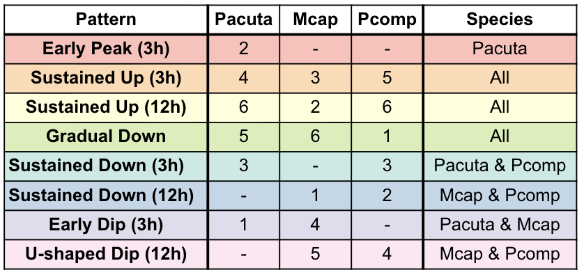
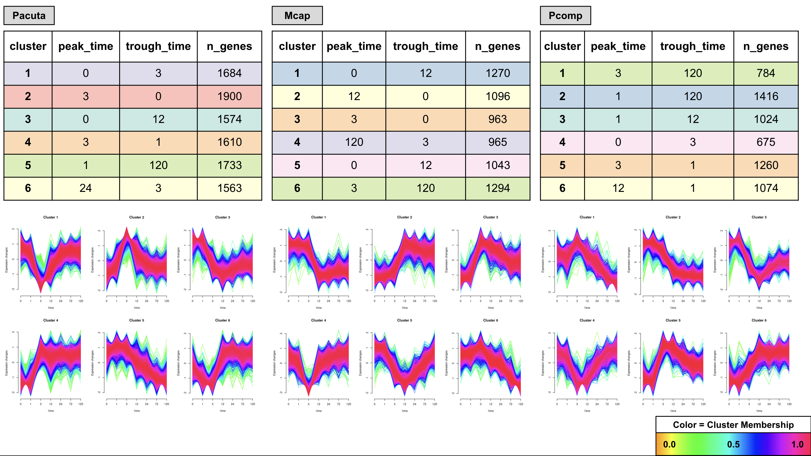

# Species summaries of Impulse DE Clusters (Mfuzz)

## Cluster number choice 

All 3 species had good clustering definition with 6 clusters based on elbow plots. This was set for each species in species_parameters.R

**See detailed version with images [here](https://github.com/zdellaert/TimeSeries/blob/main/4-multi-species/output_RNA/ImpulseDE2/cluster_summaries_images.pdf)**

---

## Cross-species cluster comparison

| Pattern              | Pacuta | Mcap | Pcomp | Species        |
|----------------------|--------|------|-------|----------------|
| Early Peak (3h)      | 2      | -    | -     | Pacuta         |
| Sustained Up (3h)    | 4      | 3    | 5     | All            |
| Sustained Up (12h)   | 6      | 2    | 6     | All            |
| Gradual Down         | 5      | 6    | 1     | All            |
| Sustained Down (3h)  | 3      | -    | 3     | Pacuta & Pcomp |
| Sustained Down (12h) | -      | 1    | 2     | Mcap & Pcomp   |
| Early Dip (3h)       | 1      | 4    | -     | Pacuta & Mcap  |
| U-shaped Dip (12h)   | -      | 5    | 4     | Mcap & Pcomp   |

**3 patterns present in all species.**

## Pattern Descriptions

| Pattern                  | Description                                                                                               |
|--------------------------|-----------------------------------------------------------------------------------------------------------|
| **Early Peak (3h)**      | Sharp increase at 3h, returns toward baseline                                                             |
| **Sustained Up (3h)**    | Sharp increase from 1h to 3h, remains elevated through 120h                                               |
| **Sustained Up (12)**    | Sharp increase from 3h to 12h, remains elevated through 120h                                              |
| **Gradual Down**         | Continuous decline from 3h to 120h                                                                        |
| **Sustained Down (3h)**  | Gradual or sharp decrease from 1h to 3h, increases gradually towards 120h but remains lower than baseline |
| **Sustained Down (12h)** | Gradual or sharp decrease from 1h/3h to 12h, remains low through 120h                                     |
| **Early Dip (3h)**       | Sharp decrease at 3h, returns to baseline                                                                 |
| **U-shaped Dip (12h)**   | Gradual decrease from 1h to 12h, returns toward baseline                                                  |

## Pacuta

| Cluster | Pattern             | Peak | Trough | n_genes | Dominant ImpulseDE Response Type |
|---------|---------------------|------|--------|---------|----------------------------------|
| 1       | Early Dip (3h)      | 0h   | 3h     | 1900    | Transient (1624)                 |
| 2       | Early Peak (3h)     | 3h   | 0h     | 1684    | Transient (1405)                 |
| 3       | Sustained Down (3h) | 0h   | 12h    | 1574    | Transient (670)                  |
| 4       | Sustained Up (3h)   | 3h   | 1h     | 1610    | Transient (760)                  |
| 5       | Gradual Down        | 1h   | 120h   | 1733    | Monotonous (1051)                |
| 6       | Sustained Up (12h)  | 24h  | 3h     | 1563    | Monotonous (746)                 |

## Mcap

| Cluster | Pattern              | Peak | Trough | n_genes | Dominant ImpulseDE Response Type    |
|---------|----------------------|------|--------|---------|------------------|
| 1       | Sustained Down (12h) | 0h   | 12h    | 1270    | Monotonous (847) |
| 2       | Sustained Up (12h)   | 12h  | 0h     | 1096    | Monotonous (635) |
| 3       | Sustained Up (3h)    | 3h   | 0h     | 963     | Transient (600)  |
| 4       | Early Dip (3h)       | 120h | 3h     | 965     | Transient (491)  |
| 5       | U-shaped Dip (12h)   | 0h   | 12h    | 1043    | Transient (592)  |
| 6       | Gradual Down         | 3h   | 120h   | 1294    | Monotonous (697) |

## Pcomp

| Cluster | Pattern              | Peak | Trough | n_genes | Dominant ImpulseDE Response Type     |
|---------|----------------------|------|--------|---------|-------------------|
| 1       | Gradual Down         | 3h   | 120h   | 784     | Monotonous (385)  |
| 2       | Sustained Down (12h) | 1h   | 120h   | 1416    | Monotonous (1071) |
| 3       | Sustained Down (3h)  | 1h   | 12h    | 1024    | Other (495)       |
| 4       | U-shaped Dip (12h)   | 0h   | 3h     | 675     | Transient (351)   |
| 5       | Sustained Up (3h)    | 3h   | 1h     | 1260    | Transient (710)   |
| 6       | Sustained Up (12h)   | 12h  | 1h     | 1074    | Other (602)       |