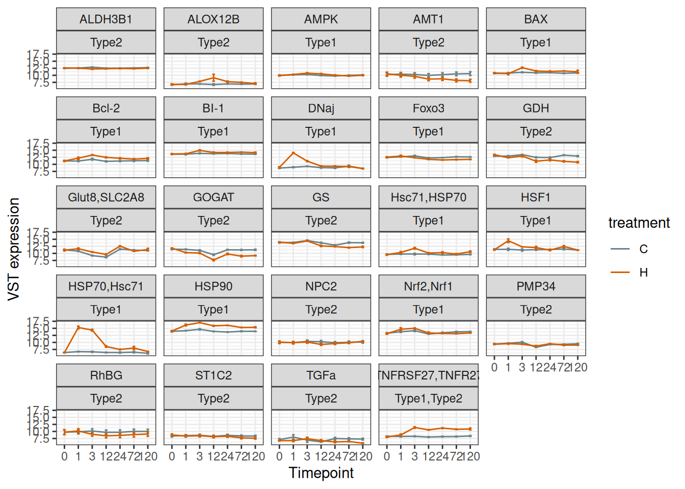
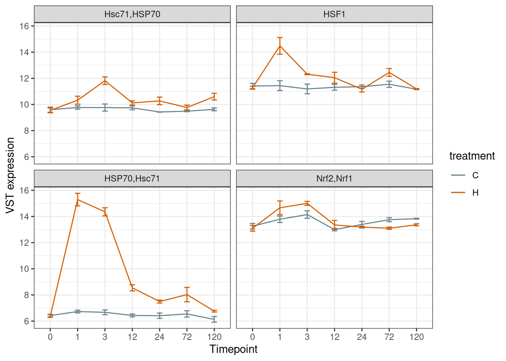
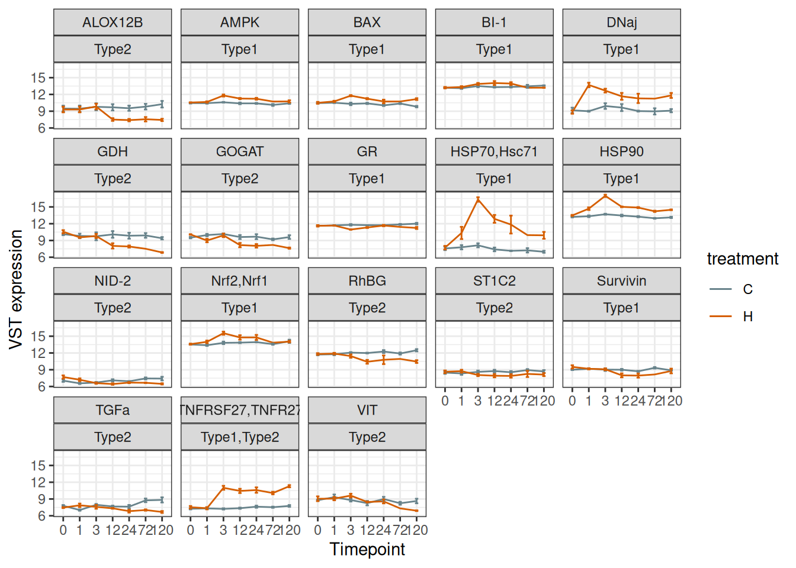
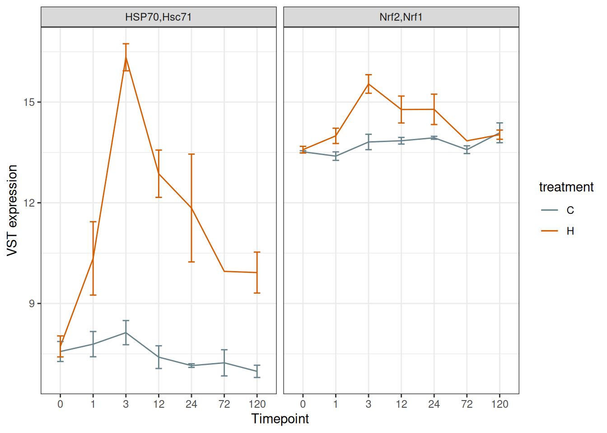
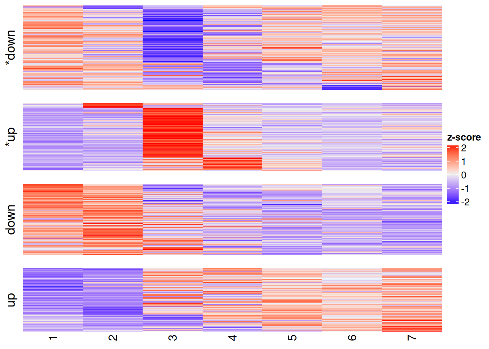
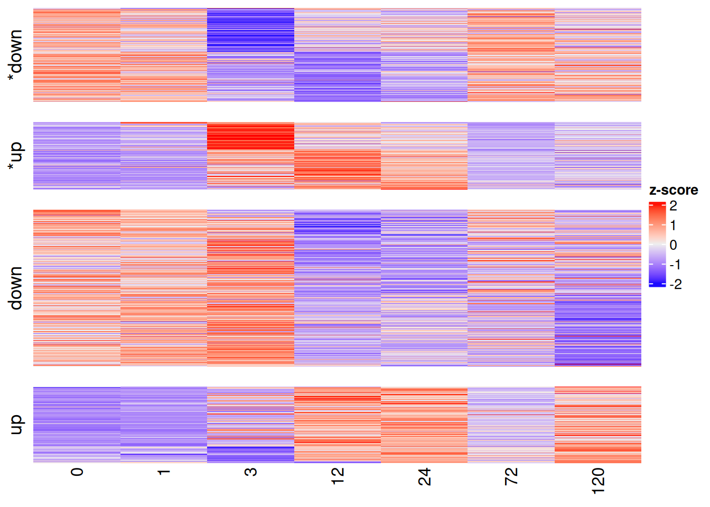
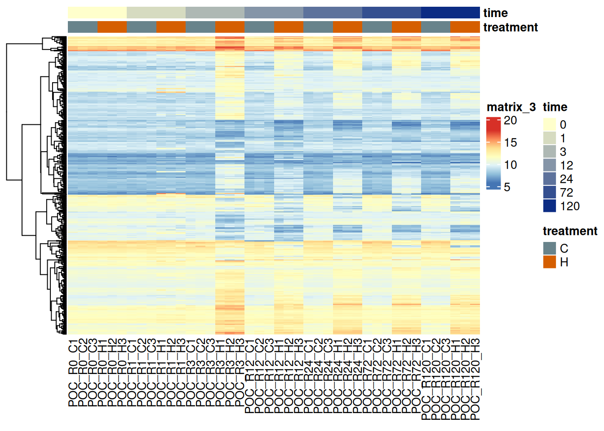
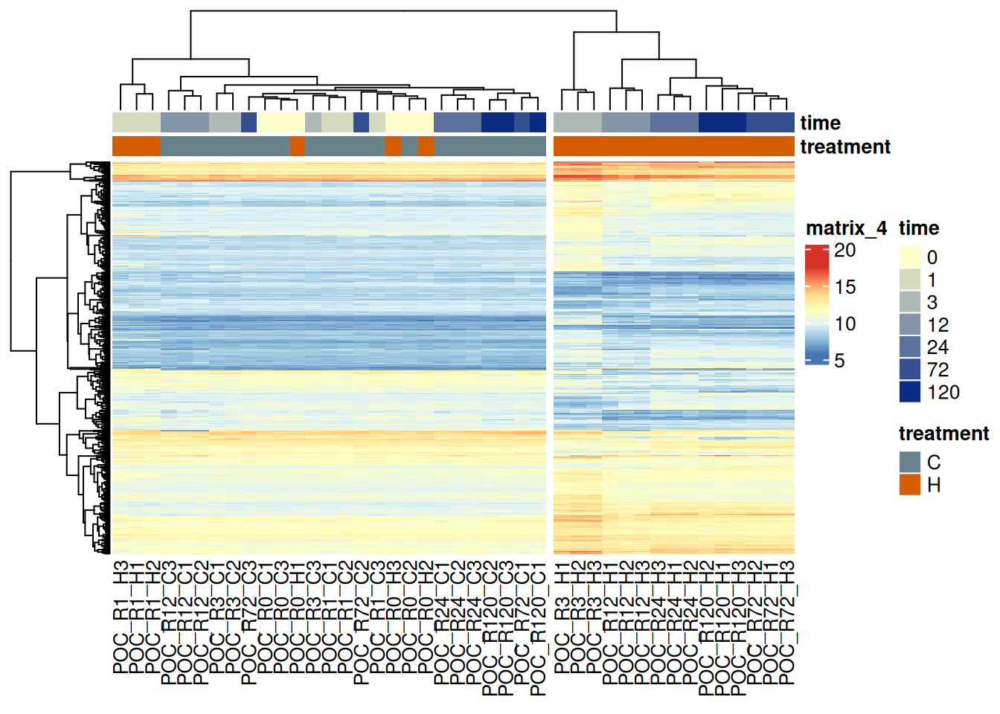
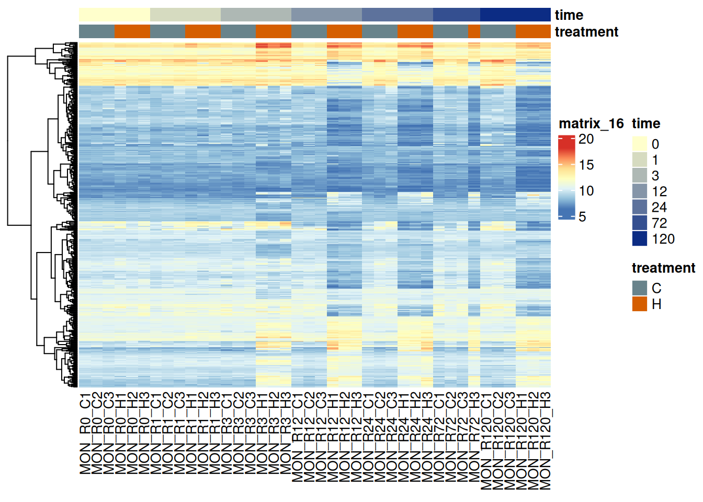
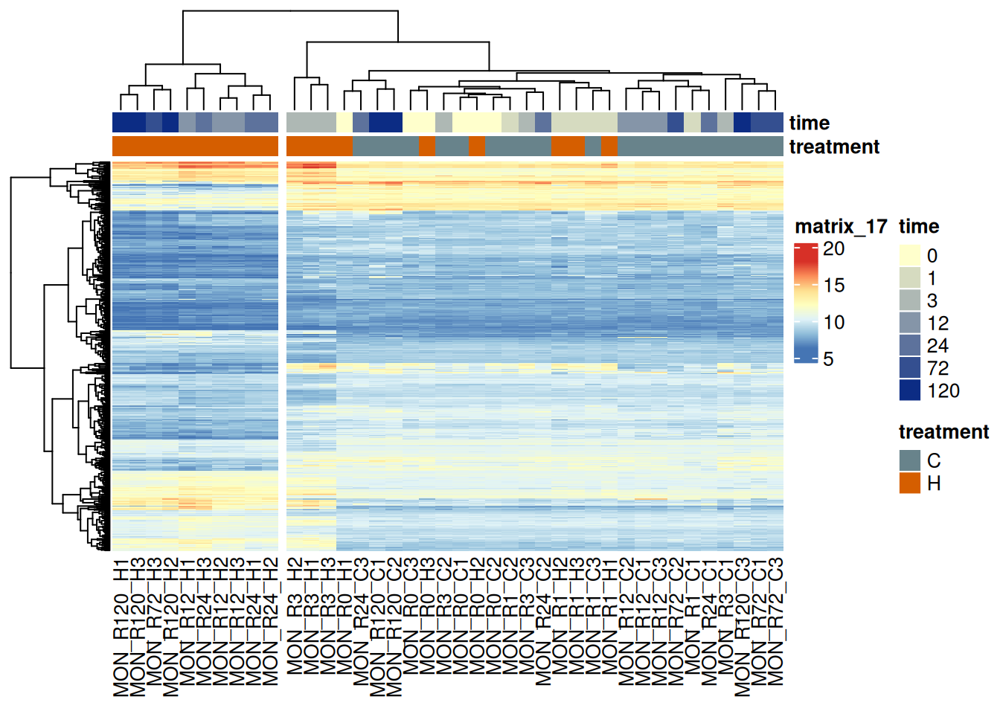

# Interpretation or preliminary RNA-seq results

## locations of important files:
1. Code:
   1. differential expression: [DESeq LRT + ImpulseDE2 time course modeling](../code/RNA-seq-Analysis.RMD)
   2. [WGCNA](../code/WGCNA.Rmd)
2. Output files:
   1. differential expression:
      1. output_RNA/differential_expression/POC_PacutaV2
      2. output_RNA/differential_expression/MON_MCapV3
   2. WGCNA
      1. output_RNA/WGCNA/POC_PacutaV2
      2. output_RNA/WGCNA/MON_MCapV3

3. PCA separation by treatment and timepoint
   1. POC: 
   2. MON: 
      1. **Important caveat 2 outliers in heat treatment at 72 hours are removed**

4. Expression trajectories of heat stress genes:
   1. POC:
      1. DE Heat stress genes by DESeq LRT
         1. 
         2. Subset of quick important ones of note:
            1. 
   2. MON:
         1. DE Heat stress genes by DESeq LRT
            1. 
            2. Subset of quick important ones of note:
               1. 
                  1. **HSF1 not DE**

5. ImpuseDE2 Results
   1. Overall patterns of DE genes either transiently or non-transiently affected by time*treatment
      1. POC: 
      2. MON: 
   2. Treatment-and timepoint annotated heatmap of *500 most significant* DE genes by ImpulseDE2 model
      1. POC:
         1. 
         2. 
      2. MON:
         1. 
         2. 
   3. Example gene: HSP70
      1. POC: [HSP70.pdf](differential_expression/POC_PacutaV2/ImpulseDE/HSP70.pdf)
      2. MON: [HSP70.pdf](differential_expression/MON_MCapV3/ImpulseDE/HSP70.pdf)
   4. Results text files (p-values and log likelihood)
      1. POC: [ImpulseDE2_Results.txt](differential_expression/POC_PacutaV2/ImpulseDE2_Results.txt)
      2. POC: [ImpulseDE2_Results.txt](differential_expression/MON_MCapV3/ImpulseDE2_Results.txt)

6. WGCNA:
   1. POC:
      1. [Time-module heatmap](WGCNA/POC_PacutaV2/times_heatmap.pdf)
      2. [Treatment-module heatmap](WGCNA/POC_PacutaV2/treatments_heatmap.pdf)
   2. MON:
      1. [Time-module heatmap](WGCNA/MON_MCapV3/times_heatmap.pdf)
      2. [Treatment-module heatmap](WGCNA/MON_MCapV3/treatments_heatmap.pdf)