# Interpretation or preliminary RNA-seq results

## locations of important files:
1. Code:
   1. differential expression: [DESeq LRT + ImpulseDE2 time course modeling](../code/RNA-seq-Analysis.md)
      1. **See this knit Rmd for more detailed information**
   2. [WGCNA](../code/WGCNA.md)
2. Output files:
   1. differential expression:
      1. [POC files](output_RNA/differential_expression/POC_PacutaV2)
      2. [MON files](output_RNA/differential_expression/MON_MCapV3)
      3. [POR files](output_RNA/differential_expression/POR_Pcomp)
   2. WGCNA
      1. [POC files](output_RNA/WGCNA/POC_PacutaV2)
      2. [MON files](output_RNA/WGCNA/MON_MCapV3)

## PCA separation by treatment and timepoint
   1. POC: 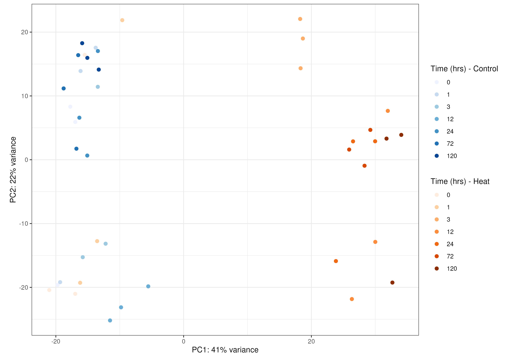
   2. MON: **Important caveat 2 outliers in heat treatment at 72 hours are removed**
      1. 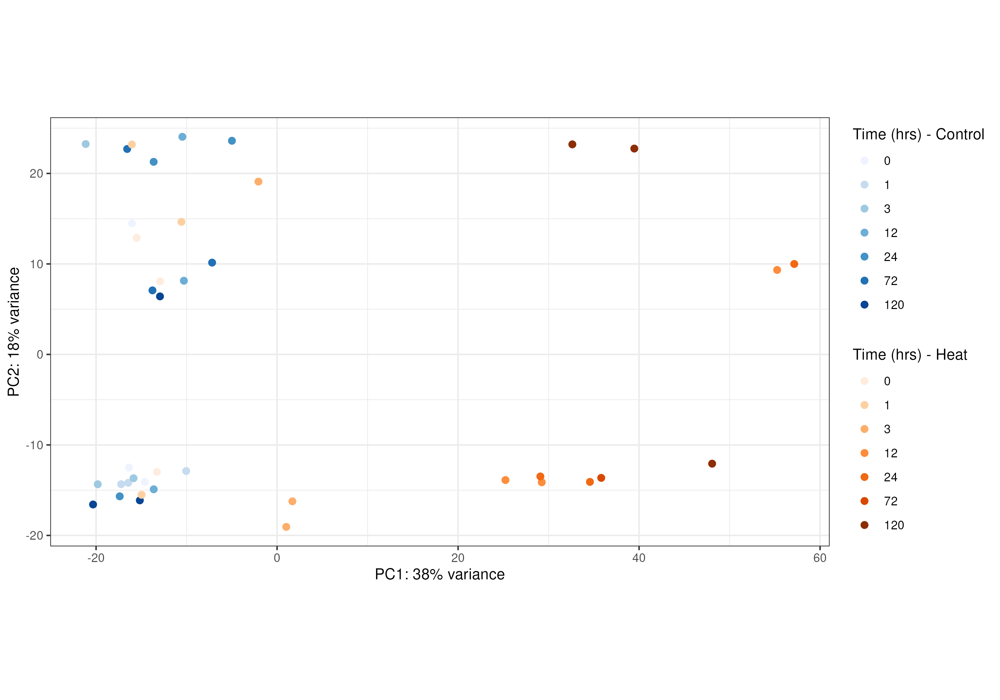
   3. POR: **Important caveat no outliers removed yet, many have very low mapping and high rRNA**
      1. 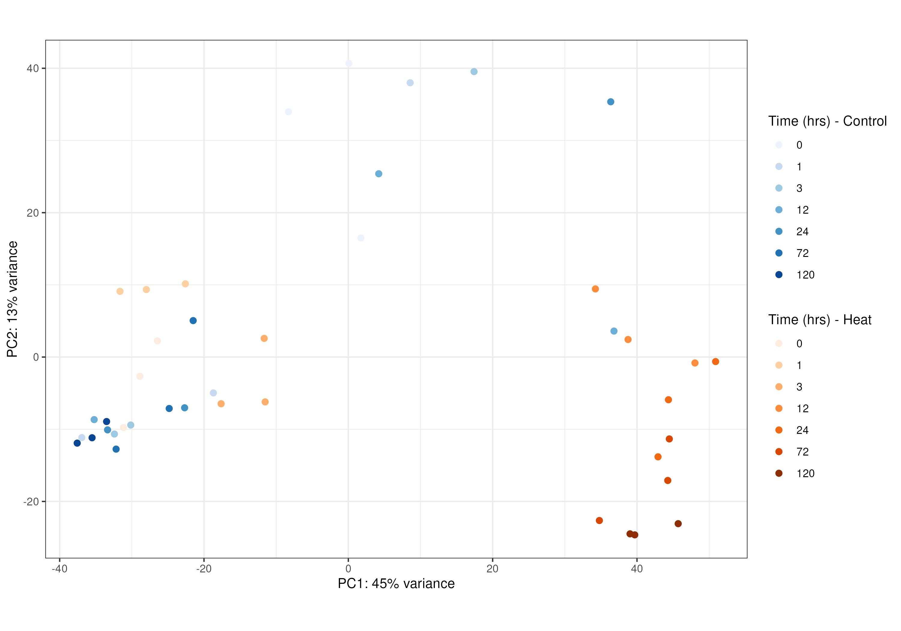

## Expression trajectories of heat stress genes:
   1. POC:
      1. DE Heat stress genes by DESeq LRT
         1. 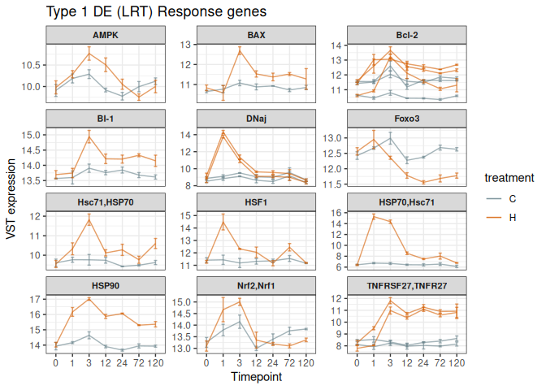
         2. Subset of quick important ones of note:
            1. 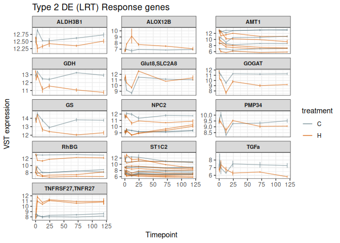
   2. MON:
         1. DE Heat stress genes by DESeq LRT
            1. 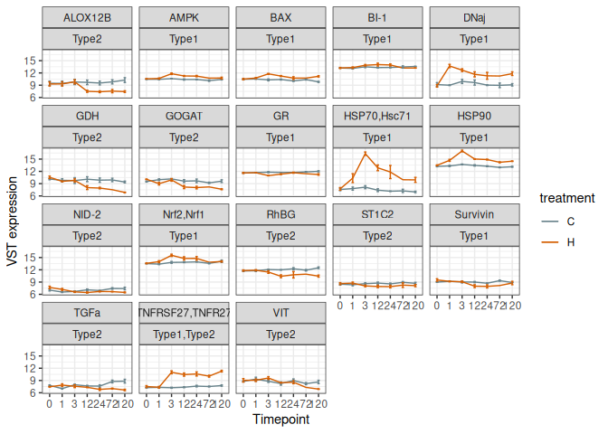
            2. Subset of quick important ones of note:
               1. 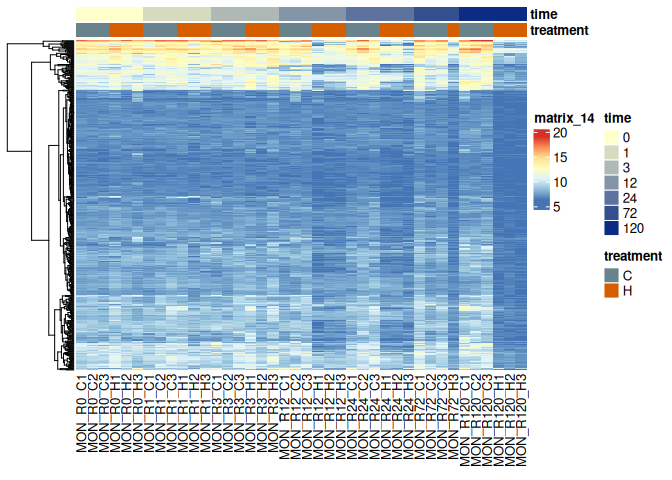
                  1. **HSF1 not DE**
   3. POR:
         1. DE Heat stress genes by DESeq LRT
            1. 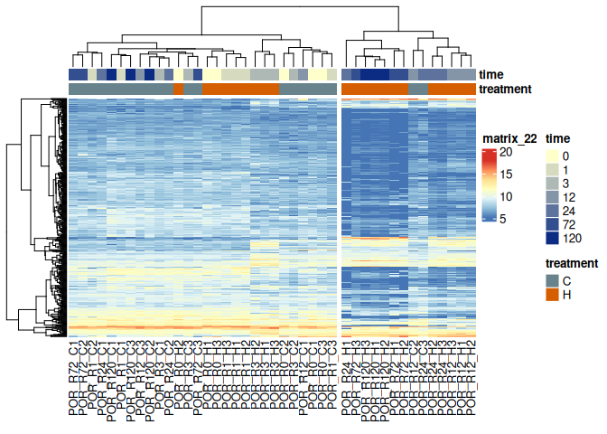
            2. Subset of quick important ones of note:
               1. 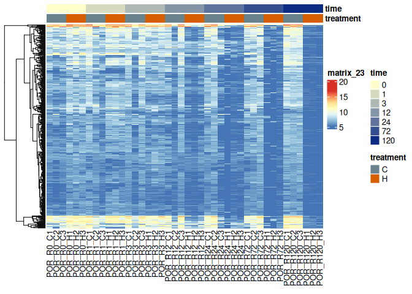
                  1. **HSF1 not DE**

## ImpuseDE2 Results
   1. Overall patterns of DE genes either transiently or non-transiently affected by time*treatment
      1. POC: 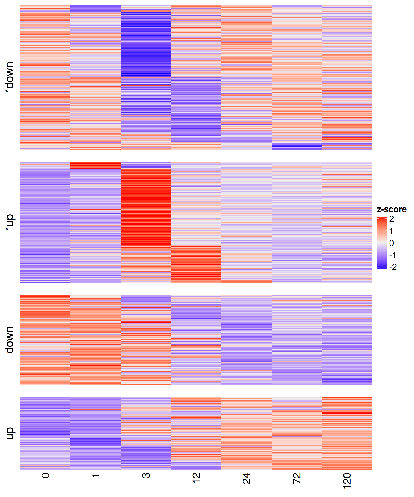
      2. MON: 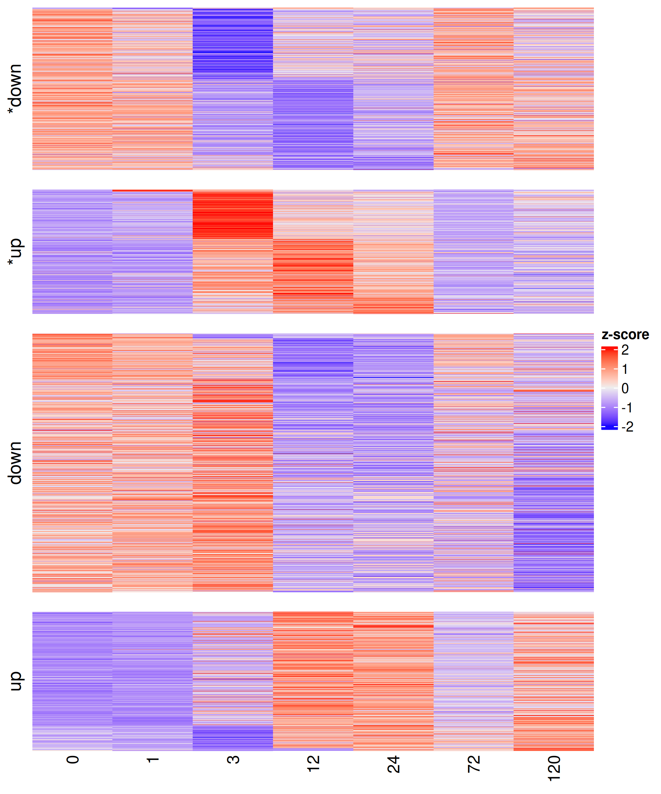
      3. POR: 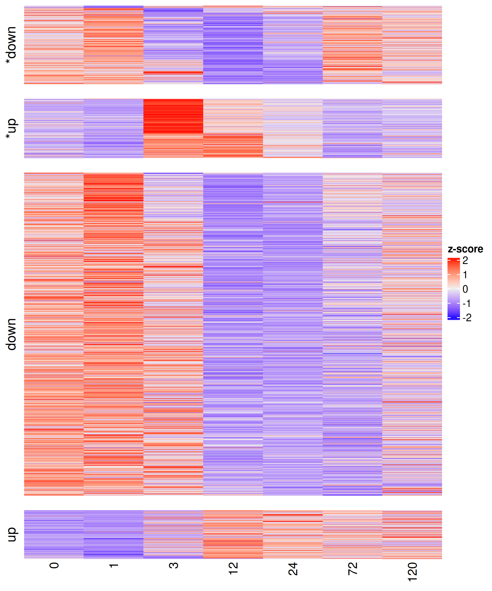
   2. Treatment-and timepoint annotated heatmap of *500 most significant* DE genes by ImpulseDE2 model
      1. POC:
         1. 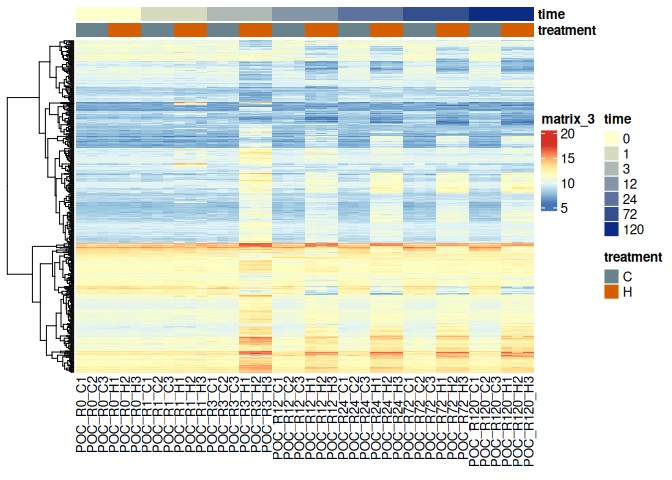
         2. 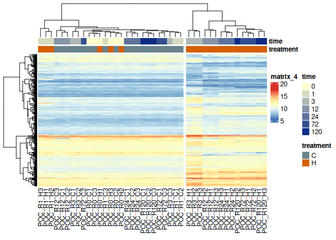
      2. MON:
         1. 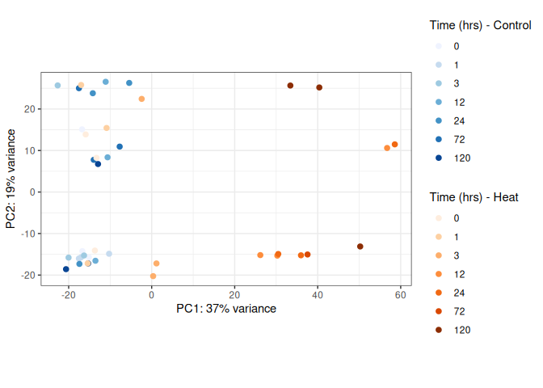
         2. 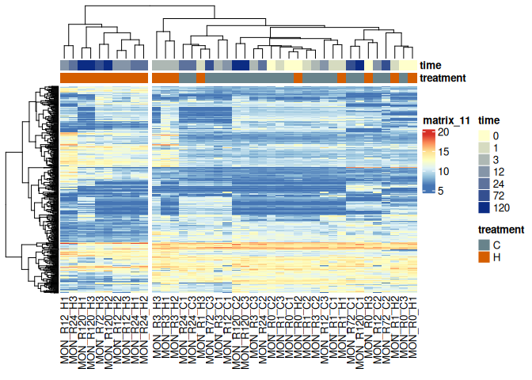
      3. POR:
         1. 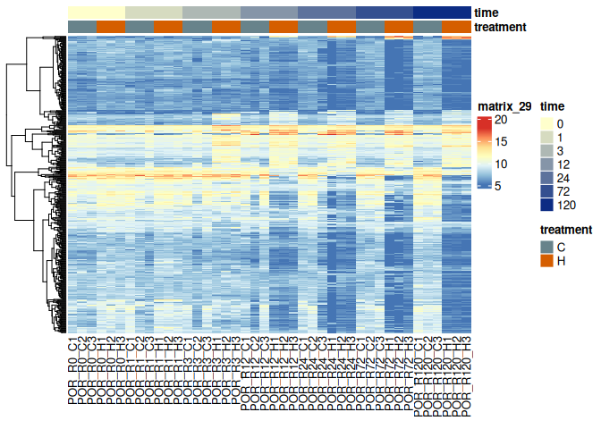
         2. 
   3. Example gene: HSP70
      1. POC: [HSPs.pdf](differential_expression/POC_PacutaV2/ImpulseDE/HSPs.pdf)
      2. MON: [HSPs.pdf](differential_expression/MON_MCapV3/ImpulseDE/HSPs.pdf)
      3. POR: [HSPs.pdf](differential_expression/POR_Pcomp/ImpulseDE/HSPs.pdf)
   4. Results text files (p-values and log likelihood)
      1. POC: [ImpulseDE2_Results.txt](differential_expression/POC_PacutaV2/ImpulseDE2_Results.txt)
      2. MON: [ImpulseDE2_Results.txt](differential_expression/MON_MCapV3/ImpulseDE2_Results.txt)
      3. POR: [ImpulseDE2_Results.txt](differential_expression/POR_Pcomp/ImpulseDE2_Results.txt)

## WGCNA:
   1. POC:
      1. [Time-module heatmap](WGCNA/POC_PacutaV2/times_heatmap.pdf)
      2. [Treatment-module heatmap](WGCNA/POC_PacutaV2/treatments_heatmap.pdf)
   2. MON:
      1. [Time-module heatmap](WGCNA/MON_MCapV3/times_heatmap.pdf)
      2. [Treatment-module heatmap](WGCNA/MON_MCapV3/treatments_heatmap.pdf)
