RNA-seq QC Report: Time Series Bulk RNA-seq
================
Zoe Dellaert
2026-05-26

- [0. Read in all data](#0-read-in-all-data)
- [1. Assess total number of reads per sample and whether we received
  the data we paid for (30M
  reads/sample)](#1-assess-total-number-of-reads-per-sample-and-whether-we-received-the-data-we-paid-for-30m-readssample)
  - [Raw sequences](#raw-sequences)
  - [After trimming and low-quality
    filtering](#after-trimming-and-low-quality-filtering)
- [2. Host: Assess mapping rates of each species to its respective host
  genome and screen for outliers/low
  mapping](#2-host-assess-mapping-rates-of-each-species-to-its-respective-host-genome-and-screen-for-outlierslow-mapping)
- [3. Alt. Hosts: Assess mapping rates of each species to non-host
  genomes](#3-alt-hosts-assess-mapping-rates-of-each-species-to-non-host-genomes)
- [4. Symbionts: Assess mapping rates of each species to symbiont
  genomes](#4-symbionts-assess-mapping-rates-of-each-species-to-symbiont-genomes)
- [4. Kraken contamination and mapping
  comparison](#4-kraken-contamination-and-mapping-comparison)
- [6. rRNA contamination and mapping
  comparison](#6-rrna-contamination-and-mapping-comparison)
- [7. Compare to RNA Extraction QC
  metrics](#7-compare-to-rna-extraction-qc-metrics)
- [8. POR-only rRNA contamination and mapping
  comparison](#8-por-only-rrna-contamination-and-mapping-comparison)
- [9. POR mRNA-decontaminated rarefaction
  analysis](#9-por-mrna-decontaminated-rarefaction-analysis)

## 0. Read in all data

``` r
# set up necessary output directories if they don't exist
reportdir <- "../../output_RNA/reports/00_library_QC_files/figure-gfm/"
if (!dir.exists(reportdir)) dir.create(reportdir, recursive = TRUE)

# load in multiqc data of raw reads
QC_raw <- read.delim("../../output_RNA/raw_qc/multiqc_data_1/multiqc_fastqc.txt") %>%
  # remove run-2- and run-3_ (yes the underscore and dash were different in the original files) from the sample names to group by sample
  mutate(Sample=str_replace(Sample, "run-[23][-_]", "") %>% str_remove("_S.*"))  %>%
  # for each sample, get the total # of reads for both directions from all runs together
  group_by(Sample) %>%
  summarise(total_reads_raw = sum(Total.Sequences),n_fastqs = n(),.groups = "drop")

# load in multiqc data of trimmed reads
QC_trim <- read.delim("../../output_RNA/trimmed_qc/multiqc_data_1/multiqc_fastqc.txt") %>%
  #remove weird column name prefixes from fastqc
  rename_with(~str_remove(., "FastQC_mqc.generalstats.fastqc."), starts_with("FastQC_mqc.generalstats.fastqc.")) %>%
  # remove run-2- and run-3_ (yes the underscore and dash were different in the original files) from the sample names to group by sample
  mutate(Sample=str_replace(Sample, "run-[23][-_]", "") %>% str_remove("_S.*"))  %>%
  # for each sample, get the total # of reads for both directions from all runs together
  group_by(Sample) %>%
  summarise(total_reads_trim = sum(Total.Sequences),.groups = "drop")

# host mapping rates
host_map <- bind_rows(
  read.delim("../../output_RNA/alignment_qc/POR_Pcomp/multiqc_data/multiqc_star.txt") %>% mutate(species="POR",genome="Pcomp"),
  read.delim("../../output_RNA/alignment_qc/MON_MCapV3/multiqc_data/multiqc_star.txt") %>% mutate(species="MON",genome="MCapV3"),
  read.delim("../../output_RNA/alignment_qc/POC_PacutaV2/multiqc_data/multiqc_star.txt") %>% mutate(species="POC",genome="PacutaV2")) %>%
  rename(total_read_pairs_mapped=total_reads) %>% mutate(total_reads_Million = total_read_pairs_mapped/1000000) %>%
  mutate(uniquely_mapped_Million = uniquely_mapped/1000000)

# cross-host mapping rates (to confirm samples were not misassigned to species)
cross_map <- bind_rows(
  #read.delim("../../output_RNA/alignment_qc/POR_MCapV3/multiqc_data/multiqc_star.txt") %>% mutate(species="POR",genome="MCapV3"),
  #read.delim("../../output_RNA/alignment_qc/POR_PacutaV2/multiqc_data/multiqc_star.txt") %>% mutate(species="POR",genome="PacutaV2"),
  read.delim("../../output_RNA/alignment_qc/MON_Pcomp/multiqc_data/multiqc_star.txt") %>% mutate(species="MON",genome="Pcomp"),
  read.delim("../../output_RNA/alignment_qc/MON_PacutaV2/multiqc_data/multiqc_star.txt") %>% mutate(species="MON",genome="PacutaV2"),
  #read.delim("../../output_RNA/alignment_qc/POC_Pcomp/multiqc_data/multiqc_star.txt") %>% mutate(species="POC",genome="Pcomp"),
  #read.delim("../../output_RNA/alignment_qc/POC_MCapV3/multiqc_data/multiqc_star.txt") %>% mutate(species="POC",genome="MCapV3")
  ) %>%
  rename(total_read_pairs_mapped=total_reads) %>% mutate(total_reads_Million = total_read_pairs_mapped/1000000) %>%
  mutate(uniquely_mapped_Million = uniquely_mapped/1000000)

# symbiont mapping rates
sym_map <- bind_rows(
  read.delim("../../output_RNA/alignment_qc/POR_Cgoreaui_V2/multiqc_data/multiqc_star.txt") %>% mutate(species="POR",genome="Cgoreaui"),
  read.delim("../../output_RNA/alignment_qc/POR_Dtrenchii/multiqc_data/multiqc_star.txt") %>% mutate(species="POR",genome="Dtrenchii"),
  read.delim("../../output_RNA/alignment_qc/MON_Cgoreaui_V2/multiqc_data/multiqc_star.txt") %>% mutate(species="MON",genome="Cgoreaui"),
  read.delim("../../output_RNA/alignment_qc/MON_Dtrenchii/multiqc_data/multiqc_star.txt") %>% mutate(species="MON",genome="Dtrenchii"),
  read.delim("../../output_RNA/alignment_qc/POC_Cgoreaui_V2/multiqc_data/multiqc_star.txt") %>% mutate(species="POC",genome="Cgoreaui"),
  read.delim("../../output_RNA/alignment_qc/POC_Dtrenchii/multiqc_data/multiqc_star.txt") %>% mutate(species="POC",genome="Dtrenchii")
  ) %>%
  rename(total_read_pairs_mapped=total_reads) %>% mutate(total_reads_Million = total_read_pairs_mapped/1000000) %>%
  mutate(uniquely_mapped_Million = uniquely_mapped/1000000)

# kraken contamination screen
kraken <- read.csv("../../output_RNA/contam_screen/contamination_kraken.csv") %>% mutate(species = substr(sample,1,3))

# bbduk rRNA contamination screen from SILVA databases
rRNA <- read.csv("../../output_RNA/rRNA_screen/rRNA_contamination_bbduk_SILVA.csv")  %>%
            mutate(matched_reads_total = matched_reads_LSU + matched_reads_SSU,
                   percent_rRNA = (matched_reads_total/in_reads_LSU) * 100)

# combine all into one giant dataframe
qc_all <- host_map %>% select(Sample,species,genome, total_read_pairs_mapped, uniquely_mapped, uniquely_mapped_percent) %>%
  left_join(QC_raw, by = join_by(Sample)) %>%
  left_join(QC_trim, by = join_by(Sample)) %>%
  left_join(kraken %>% filter(classification=="Bacteria") %>% select(sample,percent_reads) %>% rename(Sample=sample, bacteria_percent=percent_reads), by = join_by(Sample)) %>%
    replace_na(list(bacteria_percent=0)) %>%
  left_join(rRNA %>% select(sample,percent_rRNA) %>% rename(Sample=sample), by = join_by(Sample))
```

## 1. Assess total number of reads per sample and whether we received the data we paid for (30M reads/sample)

### Raw sequences

``` r
cutoff_M <- 30

qc_all %>%
  group_by(species) %>%
  summarise(
    n_samples = n(),
    min_reads_million = min(total_reads_raw/1000000),
    max_reads_million = max(total_reads_raw/1000000),
    .groups = "drop"
  ) %>%
  knitr::kable(format = "markdown", digits = 1)
```

| species | n_samples | min_reads_million | max_reads_million |
|:--------|----------:|------------------:|------------------:|
| MON     |        42 |              30.4 |              69.1 |
| POC     |        42 |              30.8 |              68.8 |
| POR     |        42 |              30.0 |              98.2 |

``` r
low_samples <- qc_all %>% filter(total_reads_raw < cutoff_M*1e6) %>% select(Sample,species,total_reads_raw) %>% mutate(total_reads_million=total_reads_raw/1000000)

paste0(nrow(low_samples), " samples have fewer than ", cutoff_M/2, "M reads in each direction")
```

    ## [1] "0 samples have fewer than 15M reads in each direction"

``` r
if(nrow(low_samples > 0)){print(low_samples)}
write.csv(QC_raw %>% mutate(total_reads_million=total_reads_raw/1000000) %>% arrange(total_reads_million), "../../output_RNA/raw_qc/multiqc_data_1/concatenated_runs_nreads.csv")
```

### After trimming and low-quality filtering

``` r
cutoff_M <- 30

qc_all %>%
  group_by(species) %>%
  summarise(
    n_samples = n(),
    min_reads_million = min(total_reads_trim/1000000),
    max_reads_million = max(total_reads_trim/1000000),
    .groups = "drop"
  ) %>%
  knitr::kable(format = "markdown", digits = 1)
```

| species | n_samples | min_reads_million | max_reads_million |
|:--------|----------:|------------------:|------------------:|
| MON     |        42 |              30.2 |              68.8 |
| POC     |        42 |              30.6 |              68.4 |
| POR     |        42 |              29.8 |              96.7 |

``` r
low_samples <- qc_all %>% filter(total_reads_trim < cutoff_M*1e6) %>% select(Sample,species,total_reads_trim) %>% mutate(total_reads_million=total_reads_trim/1000000)

paste0(nrow(low_samples), " samples have fewer than ", cutoff_M/2, "M reads in each direction")
```

    ## [1] "2 samples have fewer than 15M reads in each direction"

``` r
if(nrow(low_samples > 0)){knitr::kable(low_samples,format = "markdown", digits = 1)}
```

| Sample     | species | total_reads_trim | total_reads_million |
|:-----------|:--------|-----------------:|--------------------:|
| POR_R12_C1 | POR     |         29764350 |                29.8 |
| POR_R3_C3  | POR     |         29899132 |                29.9 |

``` r
write.csv(QC_trim %>% mutate(total_reads_million=total_reads_trim/1000000) %>% arrange(total_reads_million), "../../output_RNA/trimmed_qc/multiqc_data_1/concatenated_runs_nreads.csv")
```

## 2. Host: Assess mapping rates of each species to its respective host genome and screen for outliers/low mapping

``` r
ggplot(qc_all, aes(x = reorder(Sample, uniquely_mapped_percent), 
                       y = uniquely_mapped_percent, fill = species)) + 
  geom_col(color="white") +
  facet_grid(~species, scales = "free_x") +
  labs(title = "Mapping Rate to Host Genome",
       y = "Unique Mapping %", x = NULL) +
  theme_classic() +
  theme(axis.text.x = element_text(angle = 90, size = 6)) +
  guides(fill = "none")
```

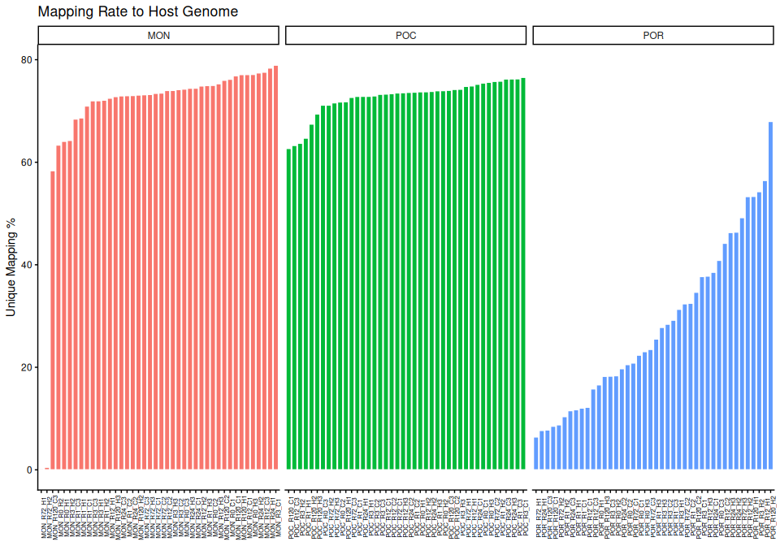<!-- -->

``` r
host_mapping_outliers <- data.frame("Sample"=c(), "species"=c(), "genome"=c(), "uniquely_mapped_percent"=c(),"total_reads_Million"=c(),"uniquely_mapped_Million"=c())

for (sp in c("POC","MON","POR")){
  df <- host_map %>% filter(species ==sp)
  
  # IQR method 
  Q1 <- quantile(df$uniquely_mapped_percent, 0.25)
  Q3 <- quantile(df$uniquely_mapped_percent, 0.75)
  IQR_val <- Q3 - Q1
  
  lower_bound <- Q1 - 1.5 * IQR_val
  upper_bound <- Q3 + 1.5 * IQR_val
  outliers <- df[df$uniquely_mapped_percent < lower_bound | df$uniquely_mapped_percent > upper_bound, ] %>% select(Sample, species,genome, uniquely_mapped_percent,total_reads_Million,uniquely_mapped_Million)
  print(paste0(sp,": IQR = ", Q1,"-",Q3,"; 1.5 x IQR = ",lower_bound,"-",upper_bound,"; ",nrow(outliers)," outliers"))
  
  host_mapping_outliers <- bind_rows(host_mapping_outliers,outliers)
}
```

    ## [1] "POC: IQR = 72.0125-74.66; 1.5 x IQR = 68.04125-78.63125; 5 outliers"
    ## [1] "MON: IQR = 72.0275-75.23; 1.5 x IQR = 67.22375-80.03375; 6 outliers"
    ## [1] "POR: IQR = 15.9775-38.345; 1.5 x IQR = -17.57375-71.89625; 0 outliers"

``` r
if(nrow(host_mapping_outliers) > 0){knitr::kable(host_mapping_outliers,format = "markdown", digits = 1)}
```

| Sample | species | genome | uniquely_mapped_percent | total_reads_Million | uniquely_mapped_Million |
|:---|:---|:---|---:|---:|---:|
| POC_R120_C1 | POC | PacutaV2 | 62.7 | 29.7 | 18.6 |
| POC_R120_H2 | POC | PacutaV2 | 67.4 | 30.2 | 20.3 |
| POC_R12_C3 | POC | PacutaV2 | 63.3 | 34.2 | 21.6 |
| POC_R1_H1 | POC | PacutaV2 | 64.7 | 29.4 | 19.0 |
| POC_R3_H2 | POC | PacutaV2 | 63.7 | 31.0 | 19.8 |
| MON_R0_H1 | MON | MCapV3 | 64.1 | 25.9 | 16.6 |
| MON_R0_H2 | MON | MCapV3 | 63.4 | 32.9 | 20.8 |
| MON_R120_C3 | MON | MCapV3 | 58.4 | 28.4 | 16.6 |
| MON_R3_H2 | MON | MCapV3 | 64.3 | 32.4 | 20.8 |
| MON_R72_H1 | MON | MCapV3 | 0.2 | 15.3 | 0.0 |
| MON_R72_H2 | MON | MCapV3 | 0.5 | 20.9 | 0.1 |

## 3. Alt. Hosts: Assess mapping rates of each species to non-host genomes

If any of these samples show a higher mapping rate below than to their
assigned genome above, there is an issue that could be due to sample
mis-ID.

``` r
cross_map %>% filter(Sample %in% host_mapping_outliers$Sample) %>% select(Sample, genome, uniquely_mapped_percent) %>%
  pivot_wider(names_from = genome,values_from = uniquely_mapped_percent) %>% knitr::kable(format = "markdown", digits = 1)
```

| Sample      | Pcomp | PacutaV2 |
|:------------|------:|---------:|
| MON_R0_H1   |   0.3 |      0.2 |
| MON_R0_H2   |   0.4 |      0.2 |
| MON_R120_C3 |   0.5 |      0.1 |
| MON_R3_H2   |   0.4 |      0.1 |
| MON_R72_H1  |   0.0 |      0.2 |
| MON_R72_H2  |   0.0 |      0.3 |

## 4. Symbionts: Assess mapping rates of each species to symbiont genomes

``` r
sym_map %>% group_by(species, genome) %>%
  summarize(range_percent=paste0(min(uniquely_mapped_percent),"-",max(uniquely_mapped_percent)),
            mean_percent=mean(uniquely_mapped_percent)) %>% knitr::kable(format = "markdown", digits = 1)
```

| species | genome    | range_percent | mean_percent |
|:--------|:----------|:--------------|-------------:|
| MON     | Cgoreaui  | 0.01-9.61     |          0.3 |
| MON     | Dtrenchii | 0.03-1.02     |          0.4 |
| POC     | Cgoreaui  | 0.01-0.12     |          0.0 |
| POC     | Dtrenchii | 0.18-1.4      |          0.6 |
| POR     | Cgoreaui  | 0.48-2.83     |          0.9 |
| POR     | Dtrenchii | 0.08-3.01     |          1.0 |

``` r
ggplot(sym_map, aes(x = reorder(Sample, desc(uniquely_mapped_percent)), y = uniquely_mapped_percent, fill = genome)) + 
  geom_col(color="white") +
  facet_grid(~species, scales = "free_x") +
  labs(title = "Mapping Rate to Cladocopium & Durusdinium Genomes (Could be overlapping reads)",
       y = "Unique Mapping %", x = NULL) +
  theme_classic() +
  theme(axis.text.x = element_text(angle = 90, size = 6))  + scale_fill_brewer(palette = "Set1")
```

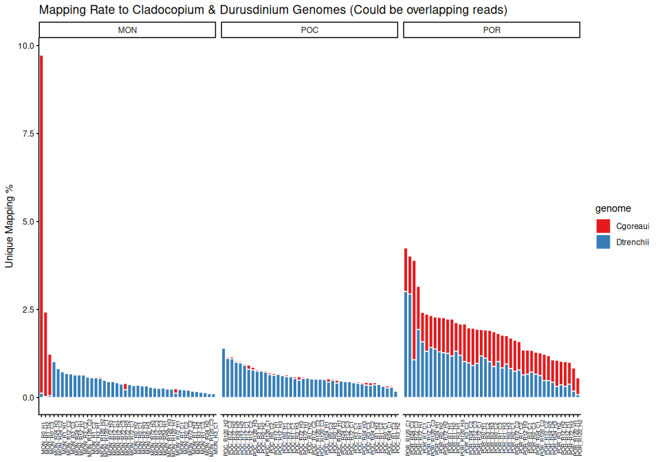<!-- -->

``` r
host_sym_compare <- host_map %>% select(Sample, species,uniquely_mapped_percent) %>% rename(host_mapping_rate=uniquely_mapped_percent) %>% left_join(sym_map %>% select(Sample, genome, uniquely_mapped_percent) %>% rename(sym_mapping_rate=uniquely_mapped_percent)) 

ggplot(host_sym_compare, aes(x=host_mapping_rate, y=sym_mapping_rate, color=genome)) + geom_point() +
  facet_grid(~species) +
  labs(title = "Mapping Rate to Cladocopium & Durusdinium Genomes vs. Host Genomes (Could be overlapping reads)",
       y = "Symbiont Mapping %", x = "Host Mapping %") +
  theme_bw() + scale_color_brewer(palette = "Set1")
```

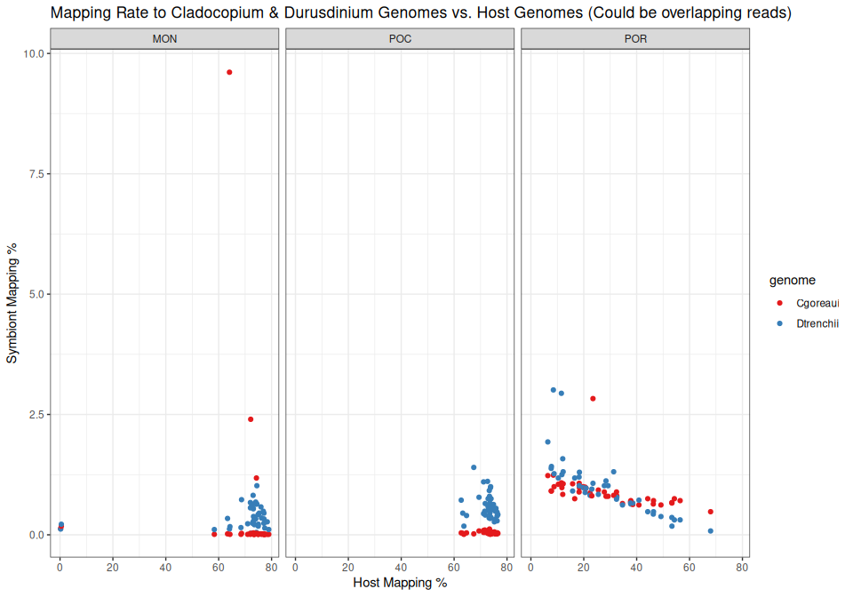<!-- -->

``` r
sym_mapping_outliers <- data.frame("Sample"=c(), "species"=c(), "genome"=c(), "uniquely_mapped_percent"=c(),"total_reads_Million"=c(),"uniquely_mapped_Million"=c())

for (sp in c("POC","MON","POR")){
  df_sp <- sym_map %>% filter(species ==sp)
  
  for (sym in c("Cgoreaui","Dtrenchii")){
  df <- df_sp %>% filter(genome ==sym)
  
  # IQR method 
  Q1 <- quantile(df$uniquely_mapped_percent, 0.25)
  Q3 <- quantile(df$uniquely_mapped_percent, 0.75)
  IQR_val <- Q3 - Q1
  
  lower_bound <- Q1 - 1.5 * IQR_val
  upper_bound <- Q3 + 1.5 * IQR_val
  outliers <- df[df$uniquely_mapped_percent < lower_bound | df$uniquely_mapped_percent > upper_bound, ] %>% select(Sample, species,genome, uniquely_mapped_percent,total_reads_Million,uniquely_mapped_Million)
  print(paste0(sp,"-",sym,": IQR = ", Q1,"-",Q3,"; 1.5 x IQR = ",lower_bound,"-",upper_bound,"; ",nrow(outliers)," outliers"))
  
  sym_mapping_outliers <- bind_rows(sym_mapping_outliers,outliers)}
}
```

    ## [1] "POC-Cgoreaui: IQR = 0.03-0.05; 1.5 x IQR = -6.93889390390723e-18-0.08; 3 outliers"
    ## [1] "POC-Dtrenchii: IQR = 0.4125-0.705; 1.5 x IQR = -0.0262500000000002-1.14375; 1 outliers"
    ## [1] "MON-Cgoreaui: IQR = 0.01-0.03; 1.5 x IQR = -0.02-0.06; 5 outliers"
    ## [1] "MON-Dtrenchii: IQR = 0.2125-0.555; 1.5 x IQR = -0.30125-1.06875; 0 outliers"
    ## [1] "POR-Cgoreaui: IQR = 0.71-0.9875; 1.5 x IQR = 0.29375-1.40375; 1 outliers"
    ## [1] "POR-Dtrenchii: IQR = 0.645-1.2375; 1.5 x IQR = -0.24375-2.12625; 2 outliers"

``` r
if(nrow(sym_mapping_outliers) > 0){knitr::kable(sym_mapping_outliers,format = "markdown", digits = 1)}
```

| Sample | species | genome | uniquely_mapped_percent | total_reads_Million | uniquely_mapped_Million |
|:---|:---|:---|---:|---:|---:|
| POC_R0_C3 | POC | Cgoreaui | 0.1 | 19.4 | 0.0 |
| POC_R12_C2 | POC | Cgoreaui | 0.1 | 20.8 | 0.0 |
| POC_R72_H3 | POC | Cgoreaui | 0.1 | 15.4 | 0.0 |
| POC_R120_H2 | POC | Dtrenchii | 1.4 | 30.2 | 0.4 |
| MON_R0_C3 | MON | Cgoreaui | 1.2 | 17.4 | 0.2 |
| MON_R0_H1 | MON | Cgoreaui | 9.6 | 25.9 | 2.5 |
| MON_R1_H2 | MON | Cgoreaui | 2.4 | 16.7 | 0.4 |
| MON_R72_H1 | MON | Cgoreaui | 0.1 | 15.3 | 0.0 |
| MON_R72_H2 | MON | Cgoreaui | 0.2 | 20.9 | 0.0 |
| POR_R72_C3 | POR | Cgoreaui | 2.8 | 15.3 | 0.4 |
| POR_R120_C1 | POR | Dtrenchii | 3.0 | 48.3 | 1.5 |
| POR_R24_C3 | POR | Dtrenchii | 2.9 | 37.6 | 1.1 |

## 4. Kraken contamination and mapping comparison

``` r
kraken %>% ggplot(aes(x=sample,y = percent_reads,fill=classification)) +geom_col() +
  facet_grid(~species,scales="free_x")  + theme_classic() + theme(axis.text.x = element_text(angle=90,size=6)) + scale_fill_brewer(palette = "Set2")
```

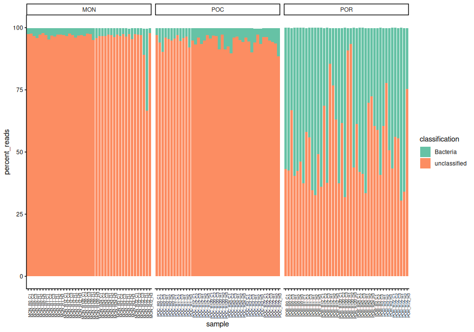<!-- -->

``` r
ggplot(qc_all, aes(x = uniquely_mapped_percent, y = bacteria_percent)) +
  geom_point(size = 2) +
  geom_smooth(method = "lm", se = FALSE, alpha = 0.3) +
  labs(title = "Host Mapping Rate vs. Bacterial Contamination",
       x = "Host Mapping %", y = "Bacterial Reads %") +
  theme_bw() +
  facet_grid(~species,scales="free_x")
```

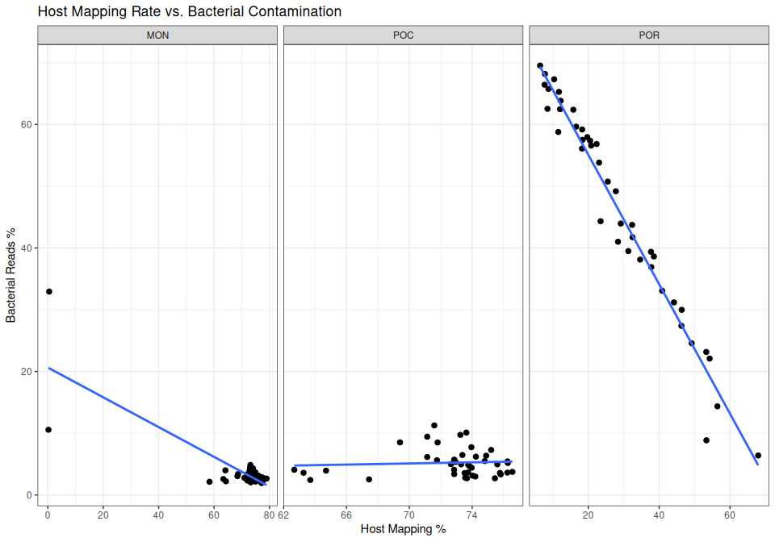<!-- -->

``` r
contam_outliers <- data.frame("sample"=c(), "species"=c(),"classification"=c(),"percent_reads"=c())

for (sp in c("POC","MON","POR")){
   df <- kraken %>% filter(species ==sp & classification=="Bacteria")
  
  # IQR method 
  Q1 <- quantile(df$percent_reads, 0.25)
  Q3 <- quantile(df$percent_reads, 0.75)
  IQR_val <- Q3 - Q1
  
  lower_bound <- Q1 - 1.5 * IQR_val
  upper_bound <- Q3 + 1.5 * IQR_val
  outliers <- df[df$percent_reads < lower_bound | df$percent_reads > upper_bound, ] %>% select(sample, species, classification, percent_reads)
  print(paste0(sp,": IQR = ", Q1,"-",Q3,"; 1.5 x IQR = ",lower_bound,"-",upper_bound,"; ",nrow(outliers)," outliers"))
  
  contam_outliers <- bind_rows(contam_outliers,outliers)
}
```

    ## [1] "POC: IQR = 3.585-6.195; 1.5 x IQR = -0.330000000000001-10.11; 1 outliers"
    ## [1] "MON: IQR = 2.5225-3.325; 1.5 x IQR = 1.31875-4.52875; 3 outliers"
    ## [1] "POR: IQR = 37.205-59.525; 1.5 x IQR = 3.72499999999999-93.005; 0 outliers"

``` r
if(nrow(contam_outliers) > 0){knitr::kable(contam_outliers,format = "markdown", digits = 1)}
```

| sample      | species | classification | percent_reads |
|:------------|:--------|:---------------|--------------:|
| POC_R72_H3  | POC     | Bacteria       |          11.3 |
| MON_R120_H2 | MON     | Bacteria       |           4.9 |
| MON_R72_H1  | MON     | Bacteria       |          10.6 |
| MON_R72_H2  | MON     | Bacteria       |          32.9 |

## 6. rRNA contamination and mapping comparison

``` r
rRNA <- rRNA  %>%  left_join(host_map %>% select(Sample,total_read_pairs_mapped, uniquely_mapped, uniquely_mapped_percent,species), by = join_by(sample==Sample))

rRNA <- rRNA  %>% mutate(total_reads_Million = total_read_pairs_mapped/1000000) %>%
  mutate(matched_reads_pairs = matched_reads_total/2) %>%
  mutate(matched_reads_pairs_Million = matched_reads_pairs/1000000) %>%
  mutate(reads_non_rRNA_Million = total_reads_Million-matched_reads_pairs_Million) %>%
  mutate(uniquely_mapped_Million = uniquely_mapped/1000000)

plot <- qc_all %>% mutate(Raw_Reads_Million=total_reads_raw/1000000) %>%
  ggplot(aes(x = uniquely_mapped_percent, y = percent_rRNA)) +
  geom_smooth(method = "lm", se = FALSE, alpha = 0.3) +
  geom_point(size = 2,shape=21,aes(fill=Raw_Reads_Million)) +
  scale_fill_distiller(palette = "Spectral") +
  labs(title = "Host Mapping Rate vs. rRNA Contamination",
       x = "Host Mapping %", y = "rRNA Reads %") +
  theme_bw() +
  facet_grid(~species,scales="free_x")
plot
```

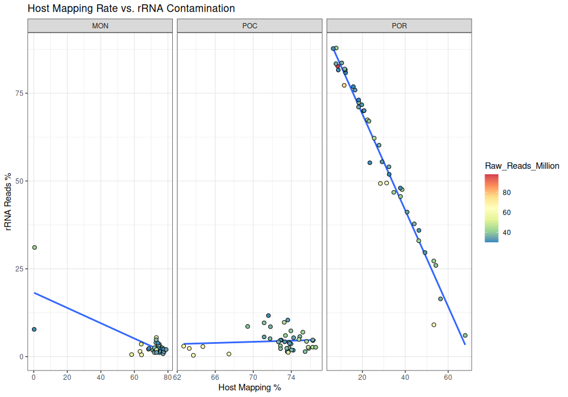<!-- -->

``` r
ggsave(paste0(reportdir,"rRNA_v_mapping.png"))

qc_all %>% mutate(Raw_Reads_Million=total_reads_raw/1000000) %>%
  ggplot(aes(x = Raw_Reads_Million, y = percent_rRNA)) +
  geom_smooth(method = "lm", se = FALSE, alpha = 0.3) +
  geom_point(size = 2,shape=21,aes(fill=Raw_Reads_Million)) +
  scale_fill_distiller(palette = "Spectral") +
  labs(title = "Host Mapping Rate vs. rRNA Contamination",
       x = "# of Raw Reads (Million)", y = "rRNA Reads %") +
  theme_bw() +
  facet_grid(~species,scales="free_x")
```

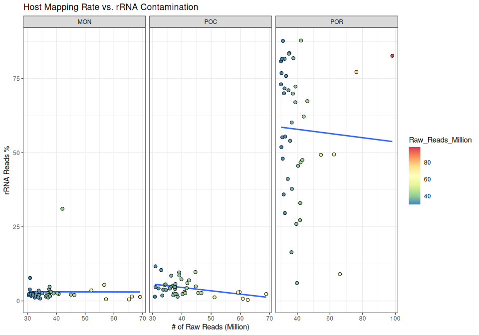<!-- -->

``` r
rRNA_summary <- rRNA %>% select(sample,species,uniquely_mapped_percent,matched_reads_pairs_Million,total_reads_Million,percent_rRNA) %>% 
  dplyr::rename(rRNA_matched_reads_pairs_Million=matched_reads_pairs_Million,
                total_reads_pairs_Million = total_reads_Million
                ) %>% arrange(uniquely_mapped_percent) %>%
  mutate(across(contains("_"), ~ round(as.numeric(.x), 2)))

qc_all %>% pivot_longer(cols = contains("_"),
               names_to = "metric",
               values_to = "value") %>%
  ggplot(aes(x = value,color=species)) +
  geom_density() +
  facet_wrap(~ metric, scales = "free") +
  theme_bw() 
```

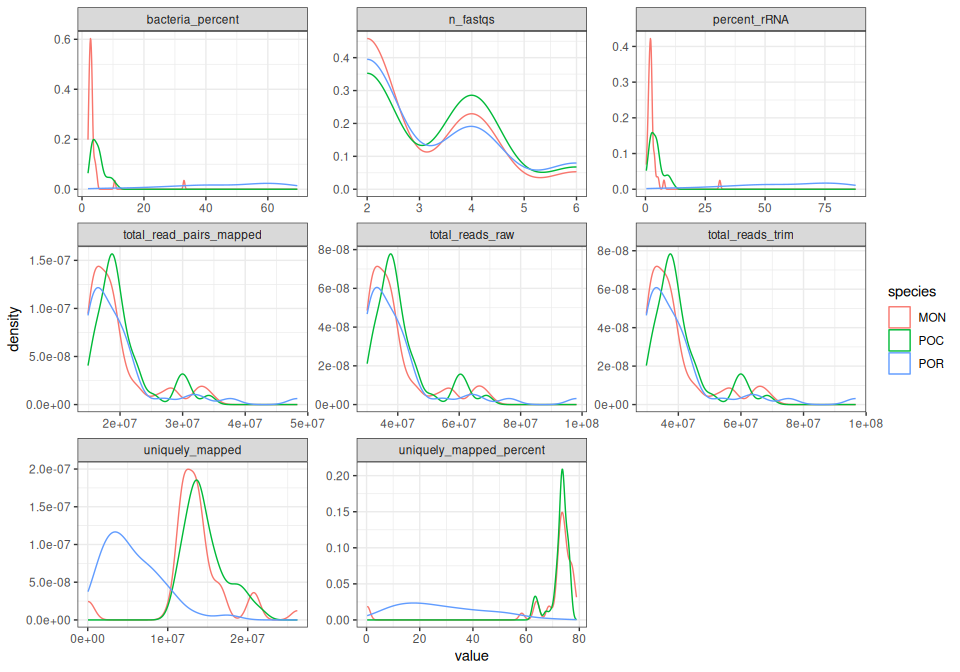<!-- -->

## 7. Compare to RNA Extraction QC metrics

``` r
# Load and prepare extraction QC metadata
metadata <- read.csv("../../data_RNA/completed_bulk_RNA_extractions_3species.csv") %>%
  select(fragment_name, t_hours, treatment, Tank, Extraction_Date, 
         RNA_QBIT_AVG, RNA_Gel_quality_score, ng_RNA_total) %>%
  mutate(across(c(t_hours, treatment, Tank, Extraction_Date), factor),
         across(c(RNA_QBIT_AVG, RNA_Gel_quality_score, ng_RNA_total), as.numeric))
```

    ## Warning: There were 2 warnings in `mutate()`.
    ## The first warning was:
    ## ℹ In argument: `across(...)`.
    ## Caused by warning:
    ## ! NAs introduced by coercion
    ## ℹ Run `dplyr::last_dplyr_warnings()` to see the 1 remaining warning.

``` r
# Join read and extraction QC data
summary_meta <- qc_all %>% 
  left_join(metadata, by = join_by("Sample" == "fragment_name"))

# Visualize potential batch effects
library(patchwork)

for(sp in unique(qc_all$species)){
  df <- summary_meta %>% filter(species==sp)
  
# Continuous variables
cont_plots <- c("RNA_QBIT_AVG", "RNA_Gel_quality_score", "ng_RNA_total") %>%
  map(~ ggplot(df, aes(x = .data[[.x]], y = percent_rRNA)) +
        geom_point(alpha = 0.6) +
        geom_smooth(method = "lm", se = TRUE) +
        theme_bw() +
        labs(title = .x))

# Categorical variables (biological + batch)
cat_plots <- c("treatment", "t_hours", "Tank", "Extraction_Date") %>%
  map(~ ggplot(df, aes(x = .data[[.x]], y = percent_rRNA, color=treatment)) +
        geom_boxplot(outlier.shape = NA) +
        geom_jitter(alpha = 0.5, width = 0.15) +
        theme_bw() +
        labs(title = .x))

print(wrap_plots(c(cont_plots, cat_plots))+plot_annotation(title = paste0(sp," QC Metrics")))

# Model with treatment×time interaction
model <- lm(percent_rRNA ~ RNA_QBIT_AVG + RNA_Gel_quality_score + ng_RNA_total + 
              treatment * t_hours + Tank + Extraction_Date,
            data = df)
print(paste0("=======",sp," QC Metrics======="))
print(summary(model))
print(anova(model))

# Diagnostic plots
par(mfrow = c(2, 2))
plot(model)
}
```

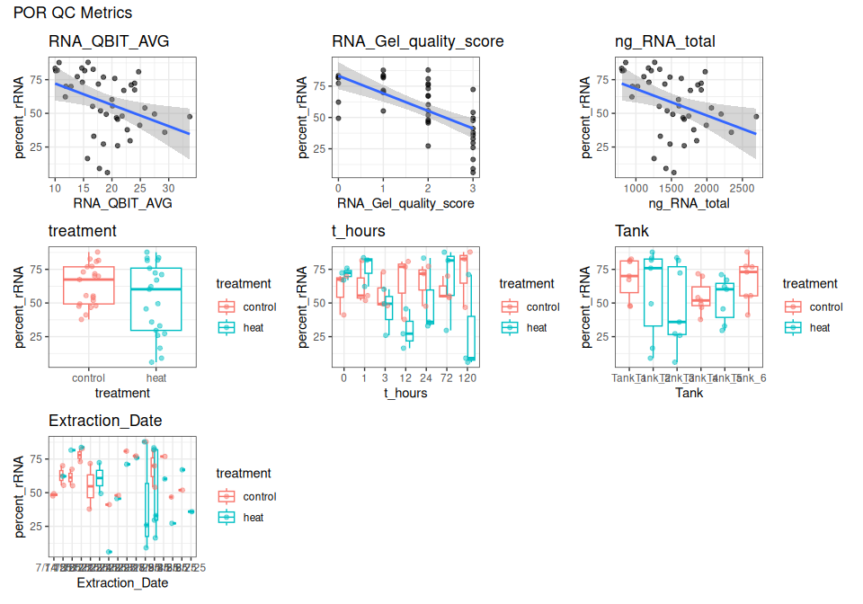<!-- -->

    ## [1] "=======POR QC Metrics======="
    ## 
    ## Call:
    ## lm(formula = percent_rRNA ~ RNA_QBIT_AVG + RNA_Gel_quality_score + 
    ##     ng_RNA_total + treatment * t_hours + Tank + Extraction_Date, 
    ##     data = df)
    ## 
    ## Residuals:
    ##     Min      1Q  Median      3Q     Max 
    ## -12.733  -3.350   0.024   4.038  13.104 
    ## 
    ## Coefficients: (2 not defined because of singularities)
    ##                          Estimate Std. Error t value Pr(>|t|)
    ## (Intercept)               75.0963    55.4148   1.355    0.217
    ## RNA_QBIT_AVG               0.5631     1.8178   0.310    0.766
    ## RNA_Gel_quality_score    -14.2094     7.6040  -1.869    0.104
    ## ng_RNA_total                   NA         NA      NA       NA
    ## treatmentheat             -3.4268    30.6549  -0.112    0.914
    ## t_hours1                  -2.3197    19.7190  -0.118    0.910
    ## t_hours3                 -21.9987    24.5267  -0.897    0.400
    ## t_hours12                -24.9981    27.1261  -0.922    0.387
    ## t_hours24                -10.4094    28.1938  -0.369    0.723
    ## t_hours72                 -3.2102    14.7780  -0.217    0.834
    ## t_hours120                -2.0295    17.4899  -0.116    0.911
    ## TankTank_2                 9.7462    12.7930   0.762    0.471
    ## TankTank_3                 8.5854    16.6495   0.516    0.622
    ## TankTank_4                -7.9706    14.7271  -0.541    0.605
    ## TankTank_5                     NA         NA      NA       NA
    ## TankTank_6                 0.1889    12.1096   0.016    0.988
    ## Extraction_Date7/15/25     1.9591    35.6330   0.055    0.958
    ## Extraction_Date7/16/25     0.7150    36.4153   0.020    0.985
    ## Extraction_Date7/17/25    26.7726    32.8733   0.814    0.442
    ## Extraction_Date7/21/25    22.4083    27.0130   0.830    0.434
    ## Extraction_Date7/23/25    27.5783    32.2272   0.856    0.420
    ## Extraction_Date7/24/25     1.5975    41.9127   0.038    0.971
    ## Extraction_Date7/28/25    17.6183    22.5397   0.782    0.460
    ## Extraction_Date7/29/25    48.4092    26.0418   1.859    0.105
    ## Extraction_Date7/31/25     7.9452    30.7409   0.258    0.803
    ## Extraction_Date7/8/25     21.6503    40.1642   0.539    0.607
    ## Extraction_Date7/9/25      9.2073    30.8978   0.298    0.774
    ## Extraction_Date8/4/25     44.5327    35.7581   1.245    0.253
    ## Extraction_Date8/5/25     -1.4856    27.3849  -0.054    0.958
    ## Extraction_Date8/6/25      8.3535    30.4462   0.274    0.792
    ## Extraction_Date8/7/25     -4.4072    34.3021  -0.128    0.901
    ## treatmentheat:t_hours1   -14.3923    34.9849  -0.411    0.693
    ## treatmentheat:t_hours3   -16.8037    34.4111  -0.488    0.640
    ## treatmentheat:t_hours12   -8.6850    39.6291  -0.219    0.833
    ## treatmentheat:t_hours24   -3.3783    44.5017  -0.076    0.942
    ## treatmentheat:t_hours72   -8.0929    29.0598  -0.278    0.789
    ## treatmentheat:t_hours120 -49.1000    30.1690  -1.628    0.148
    ## 
    ## Residual standard error: 15.18 on 7 degrees of freedom
    ## Multiple R-squared:  0.9207, Adjusted R-squared:  0.5355 
    ## F-statistic:  2.39 on 34 and 7 DF,  p-value: 0.1159
    ## 
    ## Analysis of Variance Table
    ## 
    ## Response: percent_rRNA
    ##                       Df Sum Sq Mean Sq F value   Pr(>F)   
    ## RNA_QBIT_AVG           1 3013.3  3013.3 13.0850 0.008541 **
    ## RNA_Gel_quality_score  1 5970.2  5970.2 25.9254 0.001412 **
    ## treatment              1  511.6   511.6  2.2216 0.179708   
    ## t_hours                6 1247.5   207.9  0.9029 0.541501   
    ## Tank                   4  897.8   224.5  0.9747 0.478192   
    ## Extraction_Date       15 5854.5   390.3  1.6949 0.245613   
    ## treatment:t_hours      6 1219.3   203.2  0.8825 0.552531   
    ## Residuals              7 1612.0   230.3                    
    ## ---
    ## Signif. codes:  0 '***' 0.001 '**' 0.01 '*' 0.05 '.' 0.1 ' ' 1

    ## Warning: not plotting observations with leverage one:
    ##   29

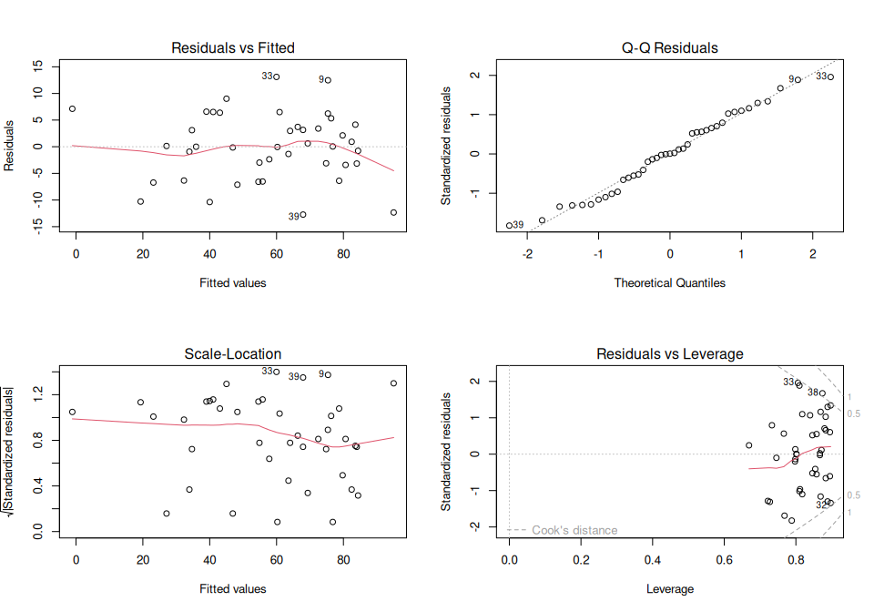<!-- -->

    ## Warning: Removed 5 rows containing non-finite outside the scale range
    ## (`stat_smooth()`).

    ## Warning: Removed 5 rows containing missing values or values outside the scale range
    ## (`geom_point()`).

    ## Warning: Removed 5 rows containing non-finite outside the scale range
    ## (`stat_smooth()`).

    ## Warning: Removed 5 rows containing missing values or values outside the scale range
    ## (`geom_point()`).

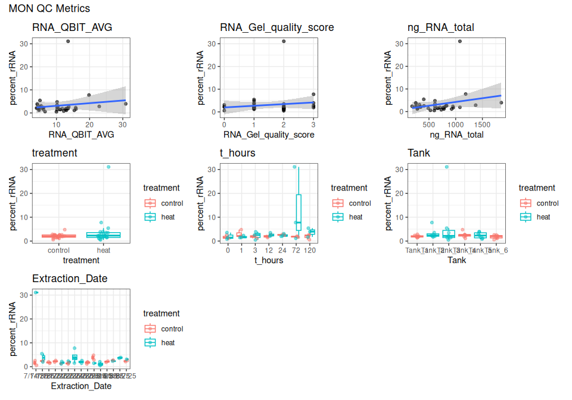<!-- -->

    ## [1] "=======MON QC Metrics======="
    ## 
    ## Call:
    ## lm(formula = percent_rRNA ~ RNA_QBIT_AVG + RNA_Gel_quality_score + 
    ##     ng_RNA_total + treatment * t_hours + Tank + Extraction_Date, 
    ##     data = df)
    ## 
    ## Residuals:
    ##          1          2          3          4          5          6          7 
    ##  5.422e-01 -6.345e-01  9.231e-02 -3.677e-01 -8.563e-01  1.224e+00  2.408e-01 
    ##          9         10         11         12         13         14         15 
    ## -2.408e-01  1.323e+00 -2.408e-01 -1.082e+00 -9.231e-02 -2.512e-16  9.231e-02 
    ##         16         17         18         19         20         21         23 
    ## -8.563e-01  1.180e+00 -3.242e-01 -4.563e-01  6.345e-01 -1.783e-01 -5.149e-16 
    ##         24         25         27         29         30         31         32 
    ##  3.733e-16  2.218e-01 -2.218e-01 -1.783e-01  1.783e-01 -9.231e-02  1.073e+00 
    ##         33         35         36         37         38         39         40 
    ## -9.810e-01 -3.677e-01  3.677e-01 -3.640e-01 -1.073e+00  1.437e+00 -9.866e-02 
    ##         41         42 
    ##  4.626e-01 -3.640e-01 
    ## 
    ## Coefficients: (1 not defined because of singularities)
    ##                           Estimate Std. Error t value Pr(>|t|)  
    ## (Intercept)               29.76264    8.52249   3.492   0.0731 .
    ## RNA_QBIT_AVG               3.75993    1.77171   2.122   0.1678  
    ## RNA_Gel_quality_score      7.70757    4.49800   1.714   0.2287  
    ## ng_RNA_total              -0.07054    0.03086  -2.286   0.1496  
    ## treatmentheat            -25.70044    6.87689  -3.737   0.0647 .
    ## t_hours1                  -4.87915    4.02015  -1.214   0.3487  
    ## t_hours3                  -2.48915    4.61363  -0.540   0.6436  
    ## t_hours12                 -1.02772    3.60368  -0.285   0.8023  
    ## t_hours24                -26.49624    6.52106  -4.063   0.0556 .
    ## t_hours72                 -7.74993    4.70077  -1.649   0.2410  
    ## t_hours120               -17.90731    7.32166  -2.446   0.1343  
    ## TankTank_2                -8.11054    4.48076  -1.810   0.2120  
    ## TankTank_3                 8.82954    3.18086   2.776   0.1090  
    ## TankTank_4               -10.65814    4.31066  -2.473   0.1320  
    ## TankTank_5                      NA         NA      NA       NA  
    ## TankTank_6                 1.34984    2.53195   0.533   0.6473  
    ## Extraction_Date7/15/25   -27.48825   10.18145  -2.700   0.1142  
    ## Extraction_Date7/16/25   -24.95801    6.82632  -3.656   0.0673 .
    ## Extraction_Date7/17/25   -24.44364    6.43198  -3.800   0.0628 .
    ## Extraction_Date7/21/25   -39.54828    8.63209  -4.582   0.0445 *
    ## Extraction_Date7/22/25   -25.48812    7.63197  -3.340   0.0792 .
    ## Extraction_Date7/23/25   -29.59775    8.18353  -3.617   0.0687 .
    ## Extraction_Date7/24/25   -29.92995   11.42500  -2.620   0.1200  
    ## Extraction_Date7/28/25   -31.98685    8.41102  -3.803   0.0627 .
    ## Extraction_Date7/29/25   -12.97927    6.83699  -1.898   0.1981  
    ## Extraction_Date7/31/25   -14.12391    7.65972  -1.844   0.2065  
    ## Extraction_Date8/4/25    -18.26066    8.44672  -2.162   0.1632  
    ## Extraction_Date8/5/25    -24.38032    9.49789  -2.567   0.1241  
    ## Extraction_Date8/6/25      2.29191    8.64773   0.265   0.8158  
    ## Extraction_Date8/7/25    -22.05321    7.93925  -2.778   0.1088  
    ## treatmentheat:t_hours1    21.71947    8.10450   2.680   0.1156  
    ## treatmentheat:t_hours3    -6.10781    5.45245  -1.120   0.3791  
    ## treatmentheat:t_hours12    9.43823    5.08514   1.856   0.2046  
    ## treatmentheat:t_hours24   49.92527   11.40246   4.378   0.0484 *
    ## treatmentheat:t_hours72   35.47827   11.04142   3.213   0.0847 .
    ## treatmentheat:t_hours120  39.93802   10.70365   3.731   0.0649 .
    ## ---
    ## Signif. codes:  0 '***' 0.001 '**' 0.01 '*' 0.05 '.' 0.1 ' ' 1
    ## 
    ## Residual standard error: 2.767 on 2 degrees of freedom
    ##   (5 observations deleted due to missingness)
    ## Multiple R-squared:  0.9825, Adjusted R-squared:  0.6846 
    ## F-statistic: 3.299 on 34 and 2 DF,  p-value: 0.2595
    ## 
    ## Analysis of Variance Table
    ## 
    ## Response: percent_rRNA
    ##                       Df  Sum Sq Mean Sq F value Pr(>F)  
    ## RNA_QBIT_AVG           1  16.250  16.250  2.1217 0.2825  
    ## RNA_Gel_quality_score  1   0.645   0.645  0.0843 0.7989  
    ## ng_RNA_total           1 187.523 187.523 24.4842 0.0385 *
    ## treatment              1  63.982  63.982  8.3538 0.1018  
    ## t_hours                6 121.966  20.328  2.6541 0.2988  
    ## Tank                   4  53.044  13.261  1.7314 0.3979  
    ## Extraction_Date       14 247.527  17.681  2.3085 0.3432  
    ## treatment:t_hours      6 168.054  28.009  3.6570 0.2303  
    ## Residuals              2  15.318   7.659                 
    ## ---
    ## Signif. codes:  0 '***' 0.001 '**' 0.01 '*' 0.05 '.' 0.1 ' ' 1

    ## Warning: not plotting observations with leverage one:
    ##   13, 21, 22

    ## Warning in sqrt(crit * p * (1 - hh)/hh): NaNs produced
    ## Warning in sqrt(crit * p * (1 - hh)/hh): NaNs produced

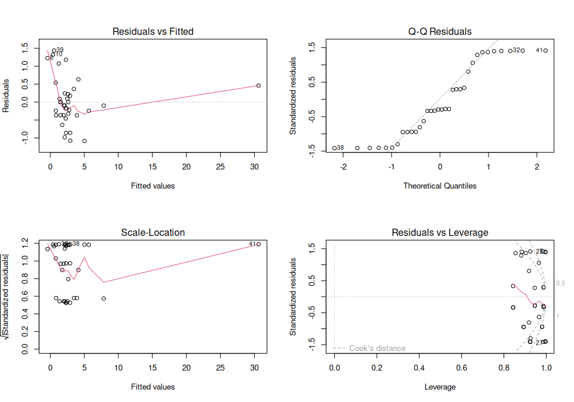<!-- -->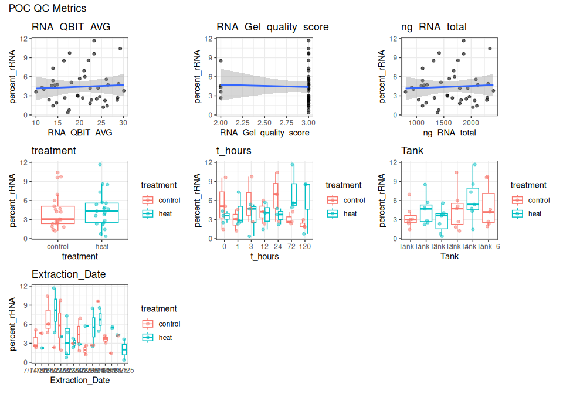<!-- -->

    ## [1] "=======POC QC Metrics======="
    ## 
    ## Call:
    ## lm(formula = percent_rRNA ~ RNA_QBIT_AVG + RNA_Gel_quality_score + 
    ##     ng_RNA_total + treatment * t_hours + Tank + Extraction_Date, 
    ##     data = df)
    ## 
    ## Residuals:
    ##     Min      1Q  Median      3Q     Max 
    ## -2.5662 -1.0972  0.0918  1.1180  3.2948 
    ## 
    ## Coefficients: (2 not defined because of singularities)
    ##                          Estimate Std. Error t value Pr(>|t|)  
    ## (Intercept)               7.61043    8.72008   0.873   0.4082  
    ## RNA_QBIT_AVG             -0.27254    0.26961  -1.011   0.3417  
    ## RNA_Gel_quality_score     0.88683    3.43142   0.258   0.8026  
    ## ng_RNA_total                   NA         NA      NA       NA  
    ## treatmentheat             0.44412    4.82674   0.092   0.9290  
    ## t_hours1                 -5.84745    4.35196  -1.344   0.2159  
    ## t_hours3                 -2.82993    4.56938  -0.619   0.5529  
    ## t_hours12                -4.29331    4.56512  -0.940   0.3745  
    ## t_hours24                -0.64435    5.28875  -0.122   0.9060  
    ## t_hours72                -4.24427    3.79186  -1.119   0.2955  
    ## t_hours120               -8.20138    4.38873  -1.869   0.0986 .
    ## TankTank_2               -1.29248    3.67520  -0.352   0.7342  
    ## TankTank_3               -5.03069    3.28128  -1.533   0.1638  
    ## TankTank_4                0.73046    4.64965   0.157   0.8791  
    ## TankTank_5                     NA         NA      NA       NA  
    ## TankTank_6                4.02631    3.21790   1.251   0.2462  
    ## Extraction_Date7/15/25    0.64932    4.66261   0.139   0.8927  
    ## Extraction_Date7/16/25    5.63392    4.95113   1.138   0.2881  
    ## Extraction_Date7/17/25   -0.08517    5.42736  -0.016   0.9879  
    ## Extraction_Date7/21/25    2.09221    4.08538   0.512   0.6224  
    ## Extraction_Date7/22/25   -1.49862    3.70650  -0.404   0.6966  
    ## Extraction_Date7/23/25    5.83644    5.00508   1.166   0.2772  
    ## Extraction_Date7/24/25    3.23681    3.88798   0.833   0.4293  
    ## Extraction_Date7/28/25    2.60852    4.28254   0.609   0.5594  
    ## Extraction_Date7/29/25   -0.91162    4.26130  -0.214   0.8360  
    ## Extraction_Date7/31/25   -0.33789    4.37456  -0.077   0.9403  
    ## Extraction_Date8/4/25     4.39905    4.26626   1.031   0.3326  
    ## Extraction_Date8/5/25    -0.64229    5.05716  -0.127   0.9021  
    ## Extraction_Date8/6/25    -1.08298    5.21838  -0.208   0.8408  
    ## Extraction_Date8/7/25     0.74228    5.61430   0.132   0.8981  
    ## treatmentheat:t_hours1    4.44066    5.61447   0.791   0.4518  
    ## treatmentheat:t_hours3    2.29875    6.64876   0.346   0.7385  
    ## treatmentheat:t_hours12   2.49786    5.20298   0.480   0.6440  
    ## treatmentheat:t_hours24  -0.07087    7.13842  -0.010   0.9923  
    ## treatmentheat:t_hours72  10.49263    6.68494   1.570   0.1551  
    ## treatmentheat:t_hours120 11.84074    5.88134   2.013   0.0789 .
    ## ---
    ## Signif. codes:  0 '***' 0.001 '**' 0.01 '*' 0.05 '.' 0.1 ' ' 1
    ## 
    ## Residual standard error: 3.257 on 8 degrees of freedom
    ## Multiple R-squared:  0.7263, Adjusted R-squared:  -0.4028 
    ## F-statistic: 0.6432 on 33 and 8 DF,  p-value: 0.8233
    ## 
    ## Analysis of Variance Table
    ## 
    ## Response: percent_rRNA
    ##                       Df Sum Sq Mean Sq F value Pr(>F)
    ## RNA_QBIT_AVG           1  0.924  0.9238  0.0871 0.7754
    ## RNA_Gel_quality_score  1  1.756  1.7563  0.1656 0.6947
    ## treatment              1  0.993  0.9926  0.0936 0.7675
    ## t_hours                6 12.074  2.0124  0.1897 0.9711
    ## Tank                   4 49.726 12.4315  1.1720 0.3916
    ## Extraction_Date       14 91.916  6.5655  0.6190 0.7934
    ## treatment:t_hours      6 67.764 11.2939  1.0647 0.4537
    ## Residuals              8 84.858 10.6073

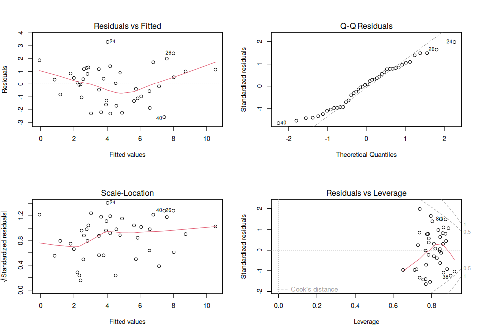<!-- -->

``` r
# Examine batch effect (Extraction_Date)
summary_meta %>%
  group_by(Extraction_Date,species) %>%
  summarise(n = n(), 
            mean_rRNA = mean(percent_rRNA, na.rm = TRUE),
            sd_rRNA = sd(percent_rRNA, na.rm = TRUE)) %>%
  arrange(desc(mean_rRNA))
```

    ## # A tibble: 46 × 5
    ## # Groups:   Extraction_Date [17]
    ##    Extraction_Date species     n mean_rRNA sd_rRNA
    ##    <fct>           <chr>   <int>     <dbl>   <dbl>
    ##  1 7/17/25         POR         3      79.8   5.84 
    ##  2 7/31/25         POR         2      76.6   0.944
    ##  3 7/29/25         POR         2      76.0   6.90 
    ##  4 8/4/25          POR         2      68.5  11.8  
    ##  5 7/16/25         POR         3      68.1  13.2  
    ##  6 7/15/25         POR         3      62.6   7.30 
    ##  7 7/23/25         POR         2      60.9  16.2  
    ##  8 8/6/25          POR         2      59.5  10.7  
    ##  9 7/9/25          POR         8      56.3  26.9  
    ## 10 7/21/25         POR         2      54.8  24.0  
    ## # ℹ 36 more rows

## 8. POR-only rRNA contamination and mapping comparison

Note: the bbduk reads are unpaired, so the bbduk total reads is 2x total
reads in the mapping QC analysis

``` r
# load in multiqc data of mapping data
POR_map <- host_map %>% filter(species == "POR")
POR_rRNA <- read.csv("../../output_RNA/rRNA_screen/rRNA_contamination_bbduk_POR.csv") %>% rename(bbduk_total_reads=total_reads)
POR_rRNA_Fede <- read.csv("../../output_RNA/rRNA_screen/rRNA_contamination_bbduk_POR_Federica.csv") %>% select(-total_reads)
```

``` r
POR_rRNA <- POR_rRNA %>% left_join(POR_map %>% select(Sample,total_read_pairs_mapped, uniquely_mapped, uniquely_mapped_percent), by = join_by(sample==Sample))

POR_rRNA <- POR_rRNA %>% mutate(total_reads_Million = total_read_pairs_mapped/1000000) %>%
  mutate(matched_reads_pairs = matched_reads/2) %>%
  mutate(matched_reads_pairs_Million = matched_reads_pairs/1000000) %>%
  mutate(reads_non_rRNA_Million = total_reads_Million-matched_reads_pairs_Million) %>%
  mutate(uniquely_mapped_Million = uniquely_mapped/1000000)


plot <- ggplot(POR_rRNA) + 
  geom_point(aes(x = percent_rrna, y =uniquely_mapped_percent, color=total_reads_Million)) + theme_bw() + 
  labs(title = "Percent rRNA reads vs. Unique Mapping Rates:\nPOR Samples")
plot
```

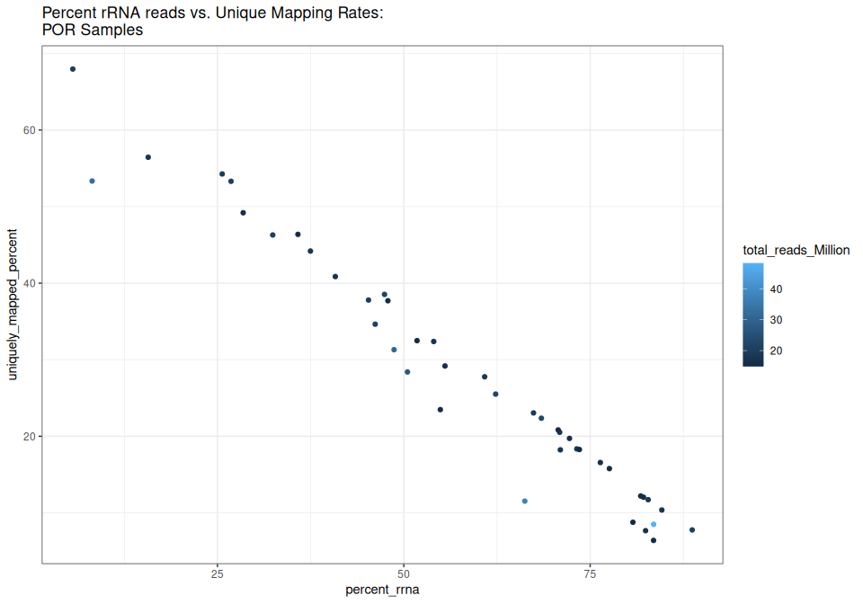<!-- -->

``` r
ggsave(paste0(reportdir,"POR_rRNA_v_mapping.png"))

ggplot(POR_rRNA) + 
  geom_point(aes(x = percent_rrna, y =uniquely_mapped_percent, color=total_reads_Million)) + theme_bw() + 
  labs(title = "Percent rRNA reads vs. Unique Mapping Rates:\nPOR Samples")
```

<!-- -->

``` r
ggplot(POR_rRNA) + 
  geom_point(aes(x = percent_rrna, y =total_reads_Million, color=total_reads_Million)) + theme_bw() + 
  labs(title = "Percent rRNA reads vs. Unique Mapping Rates:\nPOR Samples")
```

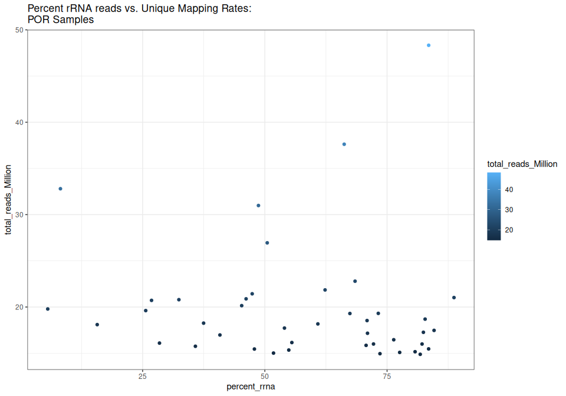<!-- -->

``` r
POR_rRNA_summary <- POR_rRNA %>% select(sample,uniquely_mapped_percent,matched_reads_pairs_Million,total_reads_Million,percent_rrna) %>% 
  dplyr::rename(rRNA_matched_reads_pairs_Million=matched_reads_pairs_Million,
                total_reads_pairs_Million = total_reads_Million
                ) %>% arrange(uniquely_mapped_percent) %>%
  mutate(across(contains("_"), ~ round(as.numeric(.x), 2)))


POR_rRNA_summary %>% pivot_longer(cols = contains("_"),
               names_to = "metric",
               values_to = "value") %>%
  ggplot(aes(x = value)) +
  geom_density(fill="lightgray") +
  facet_wrap(~ metric, scales = "free") +
  theme_bw() 
```

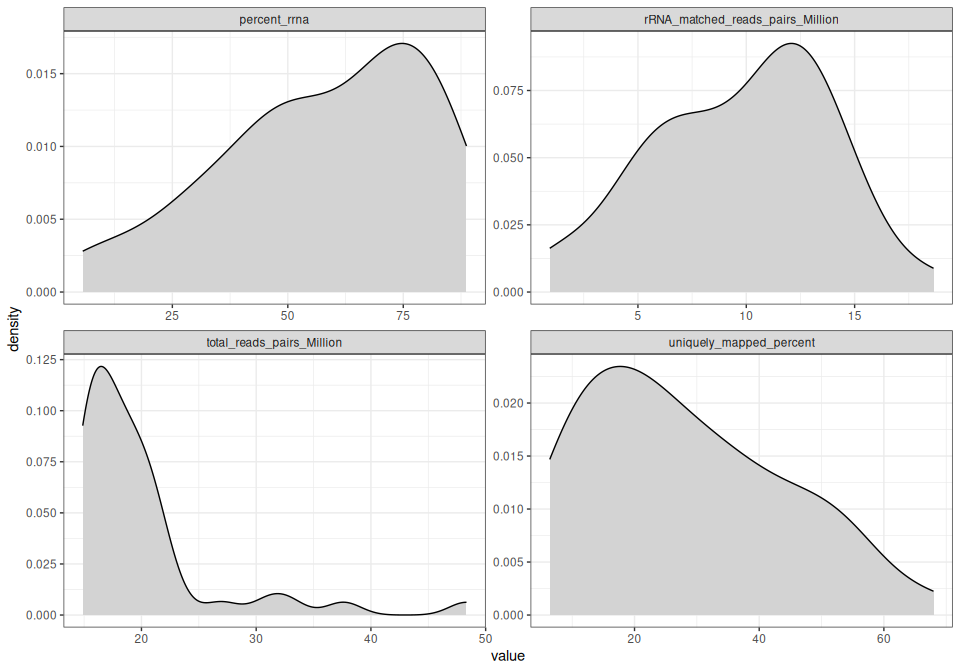<!-- -->

``` r
write_csv(POR_rRNA_summary, "../../output_RNA/rRNA_screen/POR_Pcomp_rRNA_and_mapping_metadata.csv")
```

## 9. POR mRNA-decontaminated rarefaction analysis

``` r
# Directory containing all rarefaction CSV outputs
resdir <- "/scratch4/workspace/zdellaert_uri_edu-shared_TimeSeries/TimeSeries/rRNA_rarefaction/"

# Load all CSVs
csv_files <- list.files(resdir, pattern = "_rarefaction.csv$", recursive = TRUE, full.names = TRUE)

all_results <- map_df(csv_files, function(f) {
  # Extract sample name from parent directory
  sample_name <- basename(dirname(f))
  
  read_csv(f) %>%
    mutate(sample = sample_name)
})

head(all_results)
```

    ## # A tibble: 6 × 7
    ##   sample    depth pairs_processed pairs_mapped percent_mapped percent_unique
    ##   <chr>     <dbl>           <dbl>        <dbl>          <dbl>          <dbl>
    ## 1 POR_R0_C1  0.01           71706        46130           64.3           63.4
    ## 2 POR_R0_C1  0.02          143373        92028           64.2           63.2
    ## 3 POR_R0_C1  0.05          358953       230880           64.3           63.4
    ## 4 POR_R0_C1  0.1           717468       462114           64.4           63.5
    ## 5 POR_R0_C1  0.2          1434200       923551           64.4           63.5
    ## 6 POR_R0_C1  0.5          3588349      2310439           64.4           63.4
    ## # ℹ 1 more variable: genes_detected <dbl>

``` r
all_results <- all_results %>%
  mutate(
    depth = as.numeric(depth),
    pairs_processed = as.numeric(pairs_processed),
    pairs_mapped = as.numeric(pairs_mapped),
    percent_mapped = as.numeric(percent_mapped),
    percent_unique = as.numeric(percent_unique),
    genes_detected = as.numeric(genes_detected),
  )
```

``` r
# Genes detected
ggplot(all_results, aes(x = depth, y = pairs_processed, color = sample)) +
  geom_line(size = 1) +
  geom_point(size = 2) +
  scale_x_continuous(labels = scales::percent_format(accuracy = 1)) +
  labs(
    title = "Reads processed at each subsampling depth",
    x = "Fraction of original reads used",
    y = "Reads processed"
  ) +
  theme_bw()
```

    ## Warning: Using `size` aesthetic for lines was deprecated in ggplot2 3.4.0.
    ## ℹ Please use `linewidth` instead.
    ## This warning is displayed once per session.
    ## Call `lifecycle::last_lifecycle_warnings()` to see where this warning was
    ## generated.

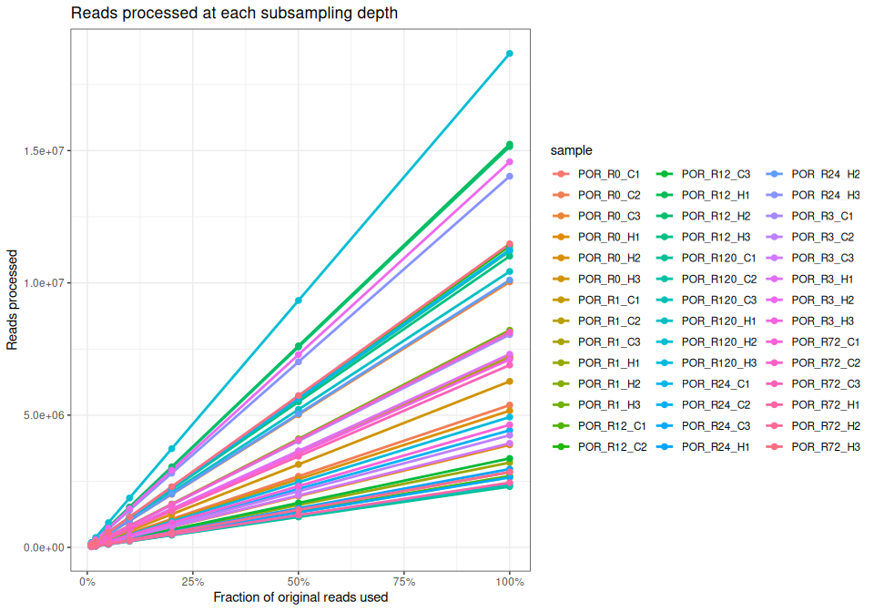<!-- -->

``` r
# Genes detected
ggplot(all_results, aes(x = depth, y = pairs_mapped, color = sample)) +
  geom_line(size = 1) +
  geom_point(size = 2) +
  scale_x_continuous(labels = scales::percent_format(accuracy = 1)) +
  labs(
    title = "Reads pseudoaligned by subsampling depth",
    x = "Fraction of original reads used",
    y = "Reads pseudoaligned"
  ) +
  theme_bw()
```

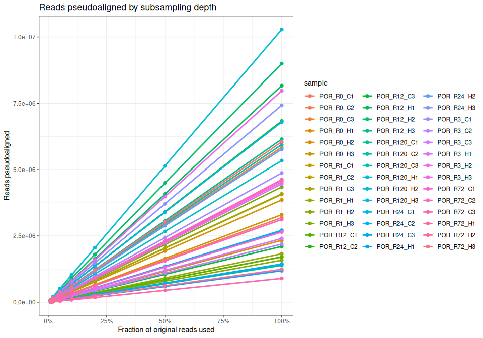<!-- -->

``` r
# Genes detected
ggplot(all_results, aes(x = depth, y = genes_detected, color = sample)) +
  geom_line(size = 1) +
  geom_point(size = 2) +
  scale_x_continuous(labels = scales::percent_format(accuracy = 1)) +
  labs(
    title = "Rarefaction of detected genes by subsampling depth",
    x = "Fraction of original reads used",
    y = "Number of genes detected (TPM > 0.5)"
  ) +
  theme_bw()
```

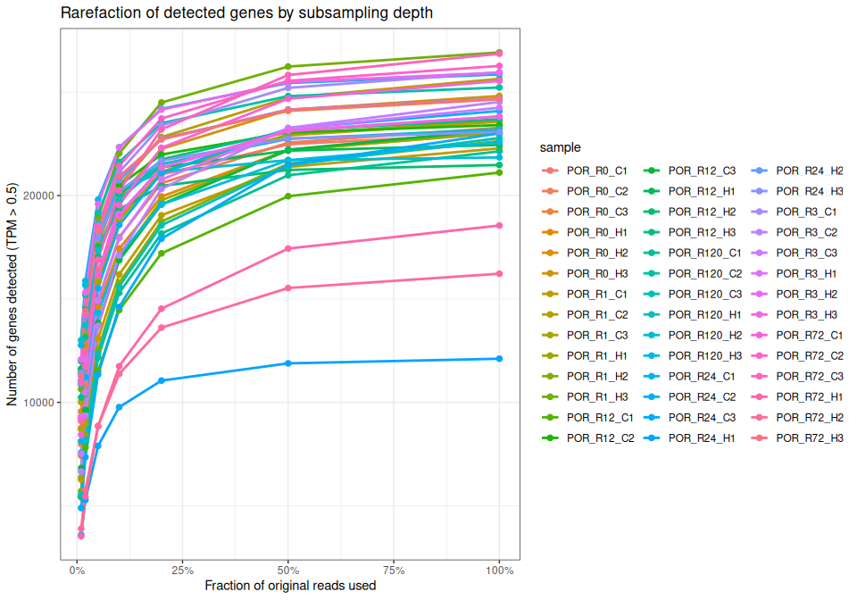<!-- -->

``` r
# Mapping rate
ggplot(all_results, aes(x = depth, y = percent_mapped, color = sample)) +
  geom_line(size = 1) +
  geom_point(size = 2) +
  scale_x_continuous(labels = scales::percent_format()) +
  labs(
    title = "Rarefaction of pseudoalignment (mapping) rate by subsampling depth",
    x = "Fraction of original reads used",
    y = "Pseudoalignment (mapping) rate"
  ) +
  theme_bw()
```

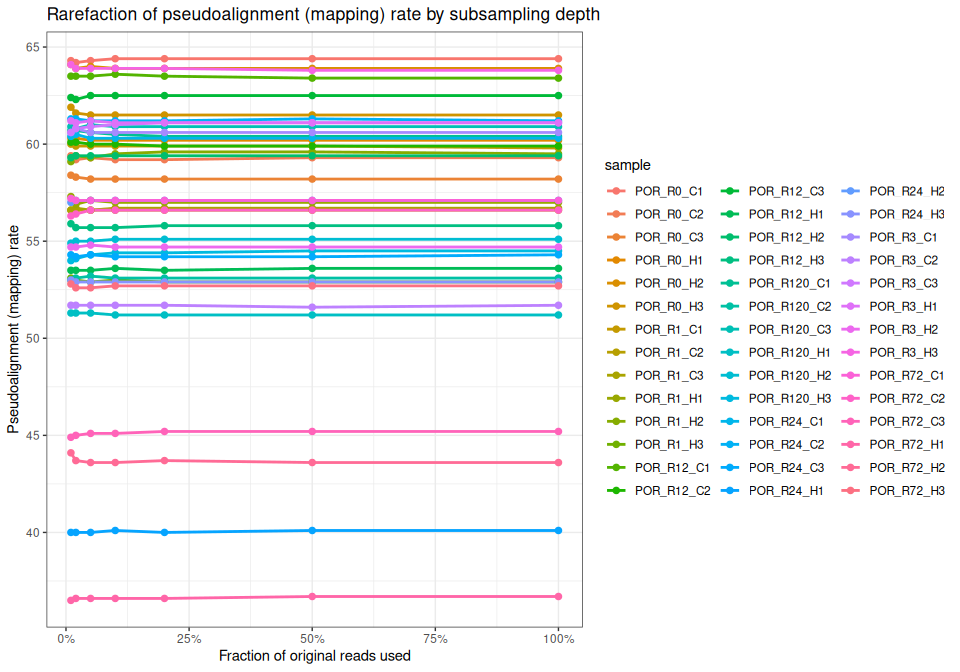<!-- -->

``` r
# Mapping rate
ggplot(all_results, aes(x = depth, y = percent_unique, color = sample)) +
  geom_line(size = 1) +
  geom_point(size = 2) +
  scale_x_continuous(labels = scales::percent_format()) +
  labs(
    title = "Rarefaction of unique pseudoalignment (mapping) rate by subsampling depth",
    x = "Fraction of original reads used",
    y = "Unique Pseudoalignment (mapping) rate"
  ) +
  theme_bw()
```

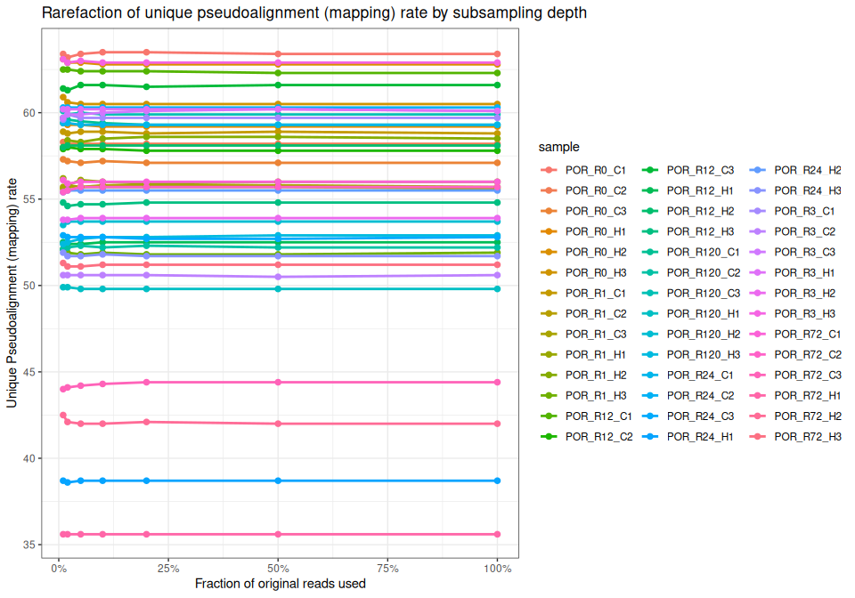<!-- -->

``` r
plateau <- all_results %>%
  group_by(sample) %>%
  arrange(depth) %>%
  mutate(delta = genes_detected - lag(genes_detected))# %>%
  #filter(!is.na(delta) & delta < 50)  # threshold for minimal new genes

head(plateau)
```

    ## # A tibble: 6 × 8
    ## # Groups:   sample [6]
    ##   sample    depth pairs_processed pairs_mapped percent_mapped percent_unique
    ##   <chr>     <dbl>           <dbl>        <dbl>          <dbl>          <dbl>
    ## 1 POR_R0_C1  0.01           71706        46130           64.3           63.4
    ## 2 POR_R0_C2  0.01           53673        31873           59.4           58.3
    ## 3 POR_R0_C3  0.01          100381        58605           58.4           57.3
    ## 4 POR_R0_H1  0.01           38565        23254           60.3           59.4
    ## 5 POR_R0_H2  0.01           51577        33062           64.1           63.1
    ## 6 POR_R0_H3  0.01           62631        38745           61.9           60.9
    ## # ℹ 2 more variables: genes_detected <dbl>, delta <dbl>

``` r
POR_combined <- all_results %>% left_join(POR_rRNA_summary)

# Genes detected
ggplot(POR_combined, aes(x = depth, y = genes_detected, group=sample, color = uniquely_mapped_percent)) +
  geom_line(size = 1) +
  geom_point(size = 2) +
  scale_x_continuous(labels = scales::percent_format(accuracy = 1)) +
  scale_color_distiller(palette = "Spectral") +
  labs(
    title = "Rarefaction of detected genes by subsampling depth",
    x = "Fraction of original reads used",
    y = "Number of genes detected (TPM > 0.5)"
  ) +
  theme_bw()
```

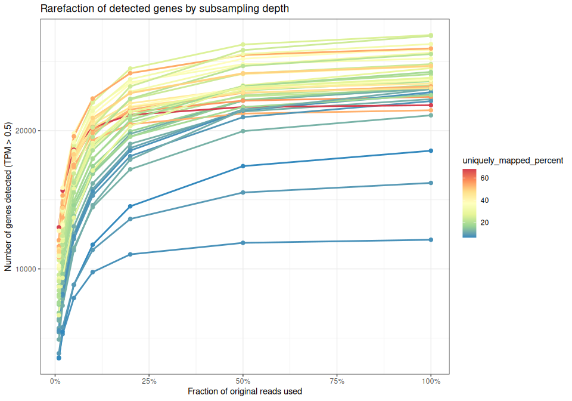<!-- -->

``` r
POR_rRNA <- read.csv("../../output_RNA/rRNA_screen/rRNA_contamination_bbduk_POR.csv")  %>% 
  mutate(total_reads_M_correct = total_reads/1000000)
POR_rRNA_Fede <- read.csv("../../output_RNA/rRNA_screen/rRNA_contamination_bbduk_POR_Federica.csv")  %>% 
  mutate(total_reads_M_correct = total_reads/1000000)

POR_rRNA$dataset <- "TimeSeries"
POR_rRNA_Fede$dataset <- "TPC"
combined <- rbind(POR_rRNA,POR_rRNA_Fede)

ggplot(combined, aes(x=percent_rrna, fill = dataset)) +
         geom_histogram(alpha=0.5, binwidth=1) + 
        coord_cartesian(xlim = c(0, 100)) + theme_bw()
```

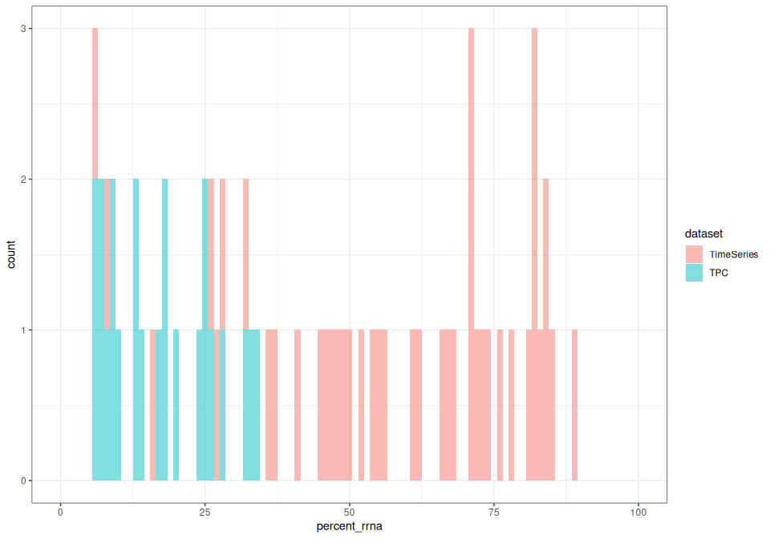<!-- -->

``` r
library(cowplot) 
pmain <- ggplot(combined, aes(x=percent_rrna,y=total_reads_M_correct, color = dataset))+
  geom_point()

xdens <- axis_canvas(pmain, axis = "x")+
  geom_density(data = combined, aes(x = percent_rrna, fill = dataset), alpha = 0.7, size=0.2)

ydens <- axis_canvas(pmain, axis = "y", coord_flip = TRUE)+
  geom_density(data = combined, aes(x = total_reads_M_correct, fill = dataset), alpha = 0.7, size=0.2)+
  coord_flip()
p1 <- insert_xaxis_grob(pmain, xdens, grid::unit(.2, "null"), position = "top")
p2 <- insert_yaxis_grob(p1, ydens, grid::unit(.2, "null"), position = "right")
ggdraw(p2)
```

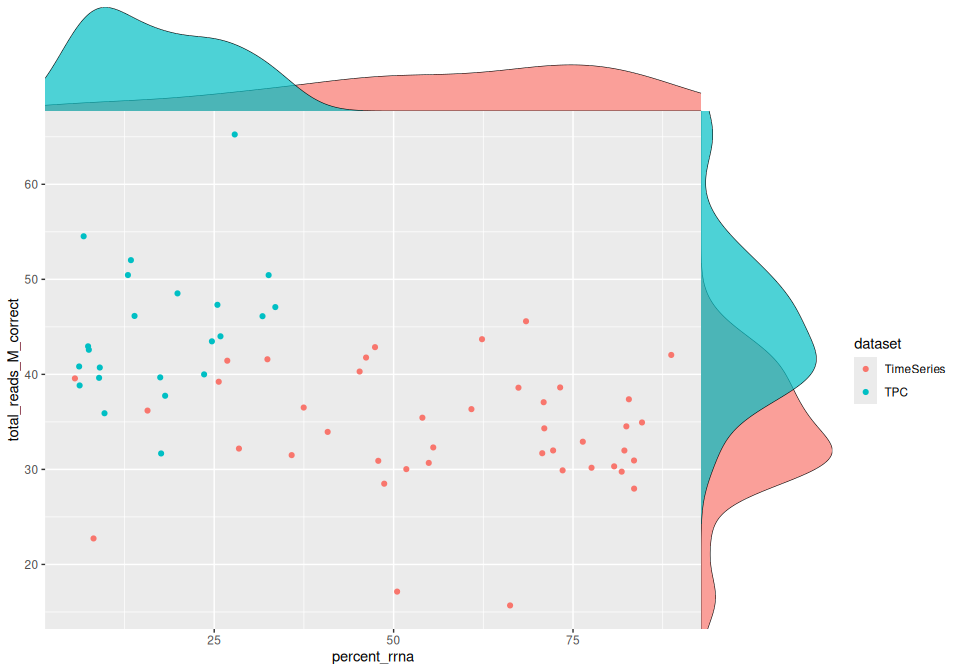<!-- -->
