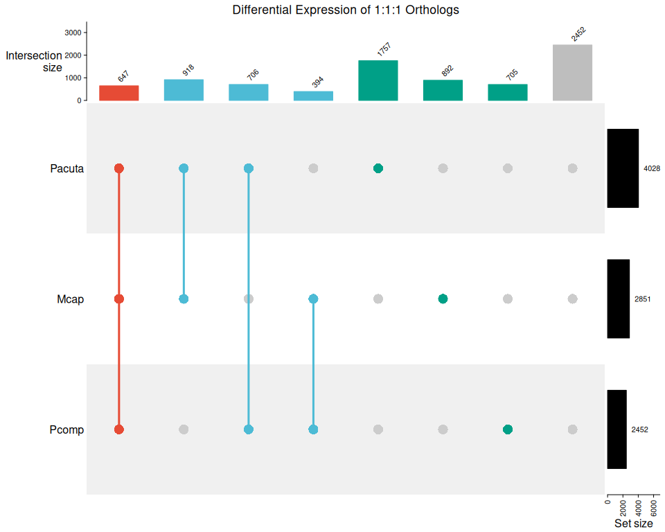
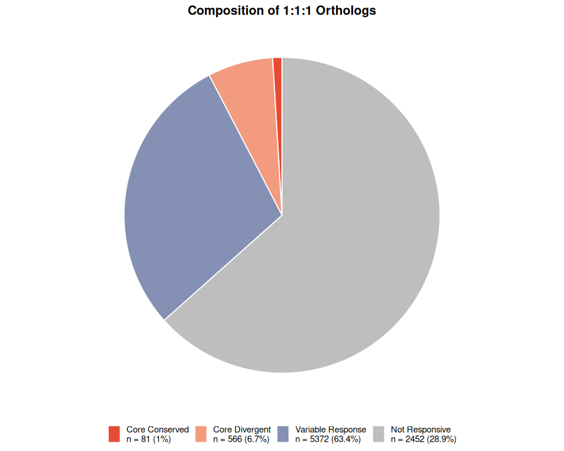
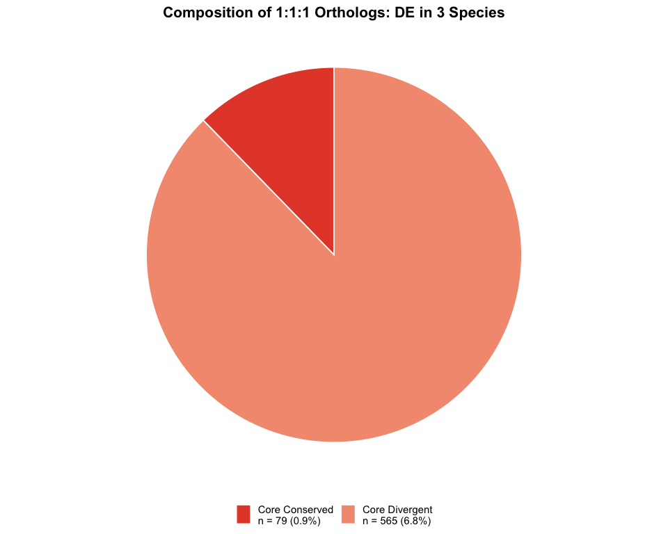
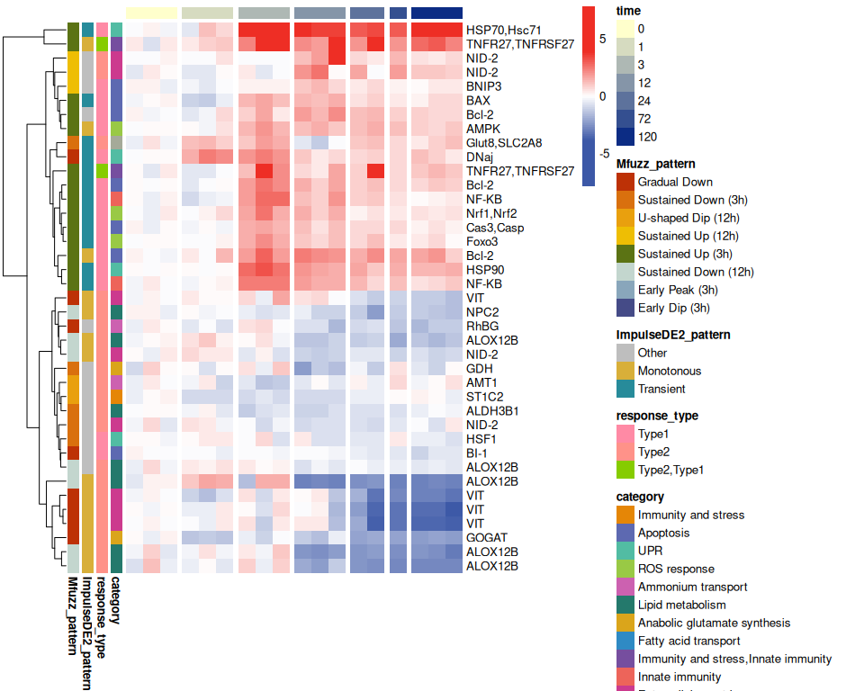
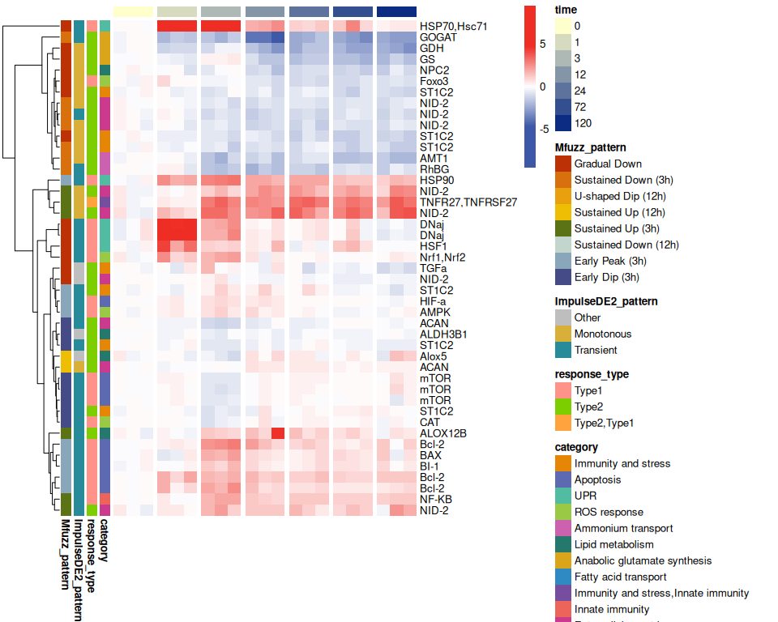
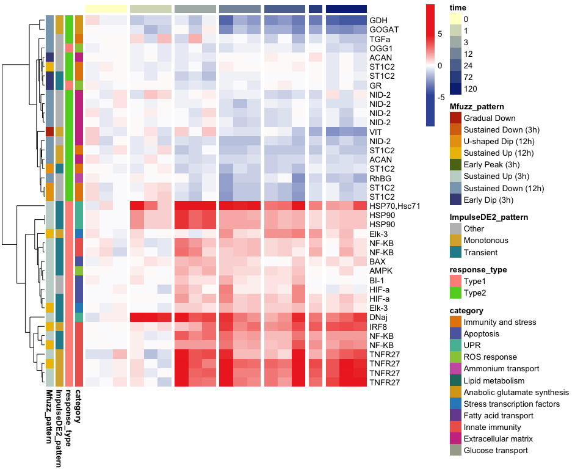
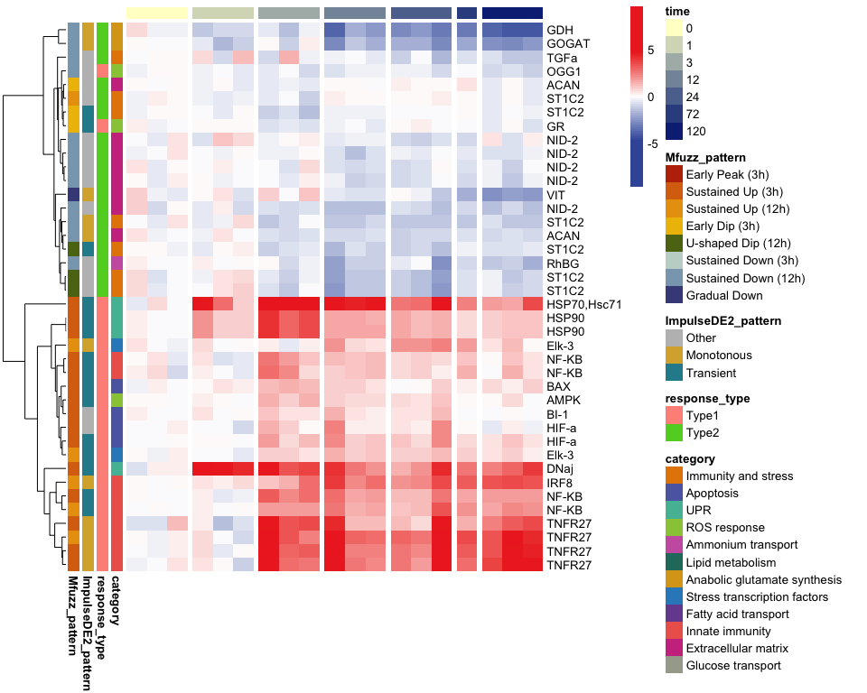
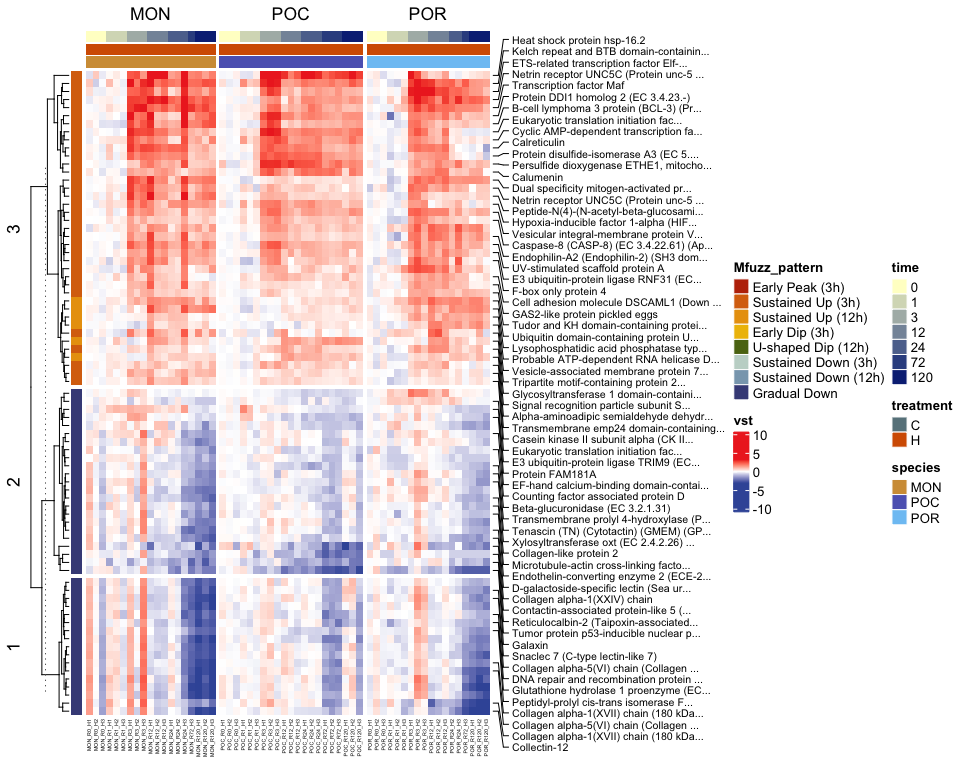
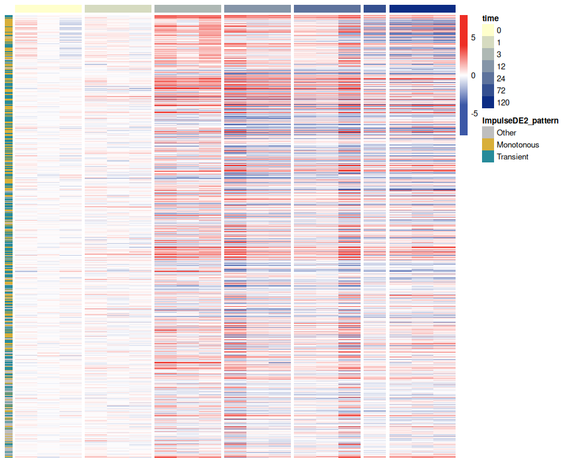
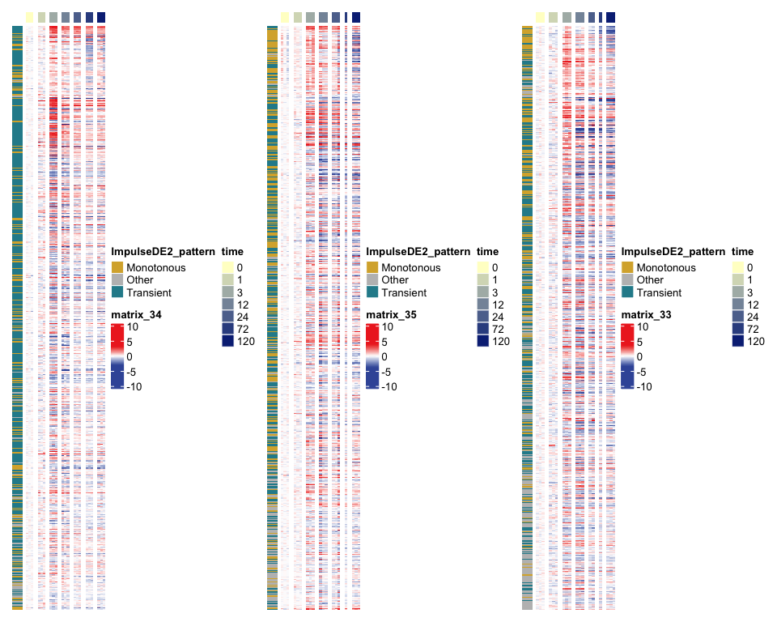

Cross Species Analysis
================
Zoe Dellaert
2026-06-15

- [Analysis of Time Series bulk RNA-seq data: Cross-Species
  Analysis](#analysis-of-time-series-bulk-rna-seq-data-cross-species-analysis)
  - [Introduction](#introduction)
  - [Inputs](#inputs)
  - [1. Load packages and functions](#1-load-packages-and-functions)
  - [2. Define directories](#2-define-directories)
  - [3. Load in ortholog data](#3-load-in-ortholog-data)
  - [4. Load in integrated expression results for all three
    species](#4-load-in-integrated-expression-results-for-all-three-species)
  - [5. Join orthologs with expression
    data](#5-join-orthologs-with-expression-data)
    - [Species-level summaries of
      orthogroups:](#species-level-summaries-of-orthogroups)
  - [6. Filter to complete 1:1:1 ortholog
    groups](#6-filter-to-complete-111-ortholog-groups)
    - [Species-level summaries of 1:1:1
      orthogroups:](#species-level-summaries-of-111-orthogroups)
  - [7. Core response in 1:1:1
    orthologs](#7-core-response-in-111-orthologs)
    - [Define response categories for 1:1:1
      orthologs](#define-response-categories-for-111-orthologs)
    - [Are TFBS conserved across DE 1:1:1
      orthologs?](#are-tfbs-conserved-across-de-111-orthologs)
    - [Visualizations](#visualizations)
  - [8. Mfuzz-pattern conserved responses (not exclusively
    1:1:1)](#8-mfuzz-pattern-conserved-responses-not-exclusively-111)
    - [Sustained Up (3h) genes](#sustained-up-3h-genes)
    - [Sustained Up (12h) genes](#sustained-up-12h-genes)
    - [Gradual Down genes](#gradual-down-genes)
  - [9. Manually-curated heat stress gene
    families](#9-manually-curated-heat-stress-gene-families)
    - [heat + ortholog heatmaps](#heat--ortholog-heatmaps)
    - [heat genes heatmaps](#heat-genes-heatmaps)
    - [1:1 ortholog heatmaps](#11-ortholog-heatmaps)

# Analysis of Time Series bulk RNA-seq data: Cross-Species Analysis

## Introduction

This analysis integrates expression data across three coral species
(*Pocillopora acuta*, *Montipora capitata*, and *Porites compressa*)
using orthologous relationships identified using the program
[Broccoli](https://github.com/rderelle/Broccoli.git). In my annotation
[repository](https://github.com/zdellaert/HI_genome_annotations.git)
(read about this is my
[README.md](https://github.com/zdellaert/TimeSeries/blob/main/4-multi-species/code/RNA/README.md)),
I identified orthologous genes between these genomes, which I will use
to compare expression patterns across species.

## Inputs

| Source | File |
|----|----|
| Cross-Species Orthologs | `HI_genome_annotations/annotation/orthologs_3sp.csv` |
| Per-species | `output_RNA/analysis_integration/{species}/master_gene_table.csv` |

------------------------------------------------------------------------

## 1. Load packages and functions

``` r
# set up file paths so that Rmd outputs can be viewed using github markdown
knitr::opts_knit$set(base.dir = normalizePath("../../output_RNA/reports/"), base.url = "./")

knitr::opts_chunk$set(echo = TRUE, message = FALSE, fig.width = 10, fig.height = 8,
                      fig.path = "06_CrossSpecies_files/figure-gfm/")

#load packages
library(tidyverse)
library(knitr)
library(ComplexHeatmap)
library(pheatmap)
```

    ## 
    ## Attaching package: 'pheatmap'

    ## The following object is masked from 'package:ComplexHeatmap':
    ## 
    ##     pheatmap

``` r
#load in parameters and functions
source("species_parameters.R")
source("utils.R")

sessionInfo() #provides list of loaded packages and version of R
```

    ## R version 4.5.1 (2025-06-13)
    ## Platform: x86_64-pc-linux-gnu
    ## Running under: Ubuntu 24.04.1 LTS
    ## 
    ## Matrix products: default
    ## BLAS:   /usr/lib/x86_64-linux-gnu/openblas-pthread/libblas.so.3 
    ## LAPACK: /usr/lib/x86_64-linux-gnu/openblas-pthread/libopenblasp-r0.3.26.so;  LAPACK version 3.12.0
    ## 
    ## locale:
    ##  [1] LC_CTYPE=en_US.UTF-8       LC_NUMERIC=C              
    ##  [3] LC_TIME=en_US.UTF-8        LC_COLLATE=en_US.UTF-8    
    ##  [5] LC_MONETARY=en_US.UTF-8    LC_MESSAGES=en_US.UTF-8   
    ##  [7] LC_PAPER=en_US.UTF-8       LC_NAME=C                 
    ##  [9] LC_ADDRESS=C               LC_TELEPHONE=C            
    ## [11] LC_MEASUREMENT=en_US.UTF-8 LC_IDENTIFICATION=C       
    ## 
    ## time zone: Etc/UTC
    ## tzcode source: system (glibc)
    ## 
    ## attached base packages:
    ## [1] grid      stats     graphics  grDevices utils     datasets  methods  
    ## [8] base     
    ## 
    ## other attached packages:
    ##  [1] pheatmap_1.0.13       ComplexHeatmap_2.26.0 knitr_1.51           
    ##  [4] lubridate_1.9.4       forcats_1.0.1         stringr_1.6.0        
    ##  [7] dplyr_1.2.1           purrr_1.2.1           readr_2.2.0          
    ## [10] tidyr_1.3.2           tibble_3.3.1          ggplot2_4.0.3        
    ## [13] tidyverse_2.0.0       rmarkdown_2.31       
    ## 
    ## loaded via a namespace (and not attached):
    ##  [1] gtable_0.3.6        circlize_0.4.18     shape_1.4.6.1      
    ##  [4] rjson_0.2.23        xfun_0.56           GlobalOptions_0.1.4
    ##  [7] tzdb_0.5.0          Cairo_1.7-0         vctrs_0.7.3        
    ## [10] tools_4.5.1         generics_0.1.4      stats4_4.5.1       
    ## [13] parallel_4.5.1      cluster_2.1.8.2     pkgconfig_2.0.3    
    ## [16] RColorBrewer_1.1-3  S7_0.2.2            S4Vectors_0.48.0   
    ## [19] lifecycle_1.0.5     compiler_4.5.1      farver_2.1.2       
    ## [22] textshaping_1.0.5   codetools_0.2-20    clue_0.3-68        
    ## [25] htmltools_0.5.9     yaml_2.3.12         pillar_1.11.1      
    ## [28] crayon_1.5.3        magick_2.9.1        iterators_1.0.14   
    ## [31] foreach_1.5.2       tidyselect_1.2.1    digest_0.6.39      
    ## [34] stringi_1.8.7       labeling_0.4.3      fastmap_1.2.0      
    ## [37] colorspace_2.1-2    cli_3.6.6           magrittr_2.0.5     
    ## [40] dichromat_2.0-0.1   withr_3.0.2         scales_1.4.0       
    ## [43] bit64_4.6.0-1       timechange_0.3.0    matrixStats_1.5.0  
    ## [46] bit_4.6.0           otel_0.2.0          ragg_1.5.2         
    ## [49] png_0.1-9           GetoptLong_1.1.1    hms_1.1.4          
    ## [52] evaluate_1.0.5      IRanges_2.44.0      doParallel_1.0.17  
    ## [55] rlang_1.2.0         Rcpp_1.1.1-1.1      glue_1.8.1         
    ## [58] BiocGenerics_0.56.0 rstudioapi_0.17.1   vroom_1.7.1        
    ## [61] R6_2.6.1            systemfonts_1.3.2

## 2. Define directories

``` r
# set up necessary output directories if they don't exist
outdir <- file.path("../../output_RNA/cross_species")
outdir_plots <- file.path(outdir,"plots")
if (!dir.exists(outdir)) dir.create(outdir, recursive = TRUE)
if (!dir.exists(outdir_plots)) dir.create(outdir_plots, recursive = TRUE)

reportdir <- "../../output_RNA/reports/06_CrossSpecies_files/figure-gfm/"
if (!dir.exists(reportdir)) dir.create(reportdir, recursive = TRUE)
```

## 3. Load in ortholog data

``` r
orthologs <- read_csv(file.path(annot_dir,"orthologs_3sp.csv"))

orthologs %>%
  group_by(species) %>%
  summarise(
    n_genes = n(),
    n_in_all_3 = sum(OG_in_all_3),
    pct_in_all_3 = 100*mean(OG_in_all_3),
    n_1to1to1 = sum(OG_1to1to1),
    pct_1to1to1 = 100*mean(OG_1to1to1),
    .groups = 'drop'
  ) %>% kable(format = "markdown")
```

| species | n_genes | n_in_all_3 | pct_in_all_3 | n_1to1to1 | pct_1to1to1 |
|:--------|--------:|-----------:|-------------:|----------:|------------:|
| Mcap    |   42992 |      32767 |     76.21651 |      8889 |    20.67594 |
| Pacuta  |   27568 |      23038 |     83.56790 |      8889 |    32.24391 |
| Pcomp   |   35140 |      26674 |     75.90780 |      8889 |    25.29596 |

## 4. Load in integrated expression results for all three species

``` r
for (species in species_list){
  integration_dir <- file.path("../../output_RNA/analysis_integration", species)
  master_table <- read.csv(file.path(integration_dir, "master_gene_table.csv")) %>% mutate(species=species)
  
  assign(paste0(species,"_master"),master_table)
  rm(master_table)
}

tables <- paste0(species_list,"_master")

# Combine
all_master <- bind_rows(Pacuta_master,Mcap_master,Pcomp_master)

cat("Genes per species:\n")
```

    ## Genes per species:

``` r
print(all_master %>% dplyr::count(species))
```

    ##   species     n
    ## 1    Mcap 30089
    ## 2  Pacuta 24941
    ## 3   Pcomp 27492

## 5. Join orthologs with expression data

``` r
cross_species <- all_master %>%
  left_join(orthologs, by = c("gene_id", "species"))

write_csv(cross_species, file.path(outdir, "cross_species_integrated_results.csv"))
```

### Species-level summaries of orthogroups:

- n_genes = how many genes for this species are represented in the
  cross_species dataset (should be the same number as in
  master_gene_table.csv for each species since we are only adding
  orthogroup data for genes we have expression data for)
- n_in_OG = of these genes, how many are in an orthogroup
- n_in_all_3 = of these genes, how many are in an orthogroup that has
  genes from all three species in it
- n_1to1to1 = of these genes, how many are in an orthogroup that has
  exactly one gene from all three species in it (though, all of these
  might not be in this table if one of the species had this gene
  filtered out during expression filtering)

``` r
# quick summary
cross_species %>%
  group_by(species) %>%
  summarise(
    n_genes = n(),
    n_in_OG = sum(!is.na(OG)),
    pct_in_OG = 100*mean(!is.na(OG)),
    n_in_all_3 = sum(OG_in_all_3, na.rm = TRUE),
    pct_in_all_3 = 100*mean(OG_in_all_3, na.rm = TRUE),
    n_1to1to1 = sum(OG_1to1to1, na.rm = TRUE),
    pct_1to1to1 = 100*mean(OG_1to1to1, na.rm = TRUE)
  ) %>% kable(format = "markdown")
```

| species | n_genes | n_in_OG | pct_in_OG | n_in_all_3 | pct_in_all_3 | n_1to1to1 | pct_1to1to1 |
|:--------|--------:|--------:|----------:|-----------:|-------------:|----------:|------------:|
| Mcap    |   30089 |   26066 |  86.62967 |      21813 |     83.68373 |      8703 |    33.38832 |
| Pacuta  |   24941 |   21380 |  85.72230 |      18235 |     85.28999 |      8693 |    40.65949 |
| Pcomp   |   27492 |   23885 |  86.87982 |      19387 |     81.16810 |      8562 |    35.84677 |

## 6. Filter to complete 1:1:1 ortholog groups

Get list of one-to-one-to-one orthogroups for which all three species
are represented in the *filtered* data

``` r
complete_1to1_ogs <- cross_species %>%
  filter(OG_1to1to1) %>%
  group_by(OG) %>%
  filter(n_distinct(species) == 3) %>%
  ungroup()

write_csv(complete_1to1_ogs, file.path(outdir, "filtered_orthogroups_1to1to1.csv"))
```

### Species-level summaries of 1:1:1 orthogroups:

- n_genes = how many genes for this species are represented in the 1:1:1
  ortholog dataset (post-expression filtering)
- n_DE = of these genes, how many are DE by ImpulseDE2
- n_in_clusters = of these genes, how many showed membership \> 0.5 in
  their assigned Mfuzz cluster
- n_hubs = of these genes, how many are WGCNA hub genes

``` r
# quick summary
sp_summary_1to1_ogs <- complete_1to1_ogs %>%
  group_by(species) %>%
  summarise(
    n_genes = n(),
    n_DE = sum(is_DE, na.rm = TRUE),
    pct_DE = 100*mean(is_DE, na.rm = TRUE),
    n_in_clusters = sum(Mfuzz_highconf, na.rm = TRUE),
    n_hubs = sum(is_hub, na.rm = TRUE),
    .groups = 'drop'
  )

kable(sp_summary_1to1_ogs,format = "markdown")
```

| species | n_genes | n_DE |   pct_DE | n_in_clusters | n_hubs |
|:--------|--------:|-----:|---------:|--------------:|-------:|
| Mcap    |    8471 | 2851 | 33.65600 |          2498 |    904 |
| Pacuta  |    8471 | 4028 | 47.55047 |          3304 |    954 |
| Pcomp   |    8471 | 2452 | 28.94582 |          2129 |    782 |

#### Upset plot: 1:1:1 orthologs DE across species

Upset plot from ComplexHeatmap package, documentation
[here](https://github.com/jokergoo/ComplexHeatmap-reference/blob/master/book/08-upset.md)

``` r
de_matrix <- complete_1to1_ogs %>%
  select(OG, species, is_DE) %>%
  mutate(is_DE = replace_na(is_DE, FALSE)) %>%
  pivot_wider(names_from = species, values_from = is_DE, values_fill = FALSE) %>%
  column_to_rownames("OG") %>%
  as.matrix()

m <- make_comb_mat(de_matrix)
plot <- UpSet(m, pt_size = unit(5, "mm"), lwd = 3,
      top_annotation = upset_top_annotation(m, add_numbers = TRUE),
      right_annotation = upset_right_annotation(m, add_numbers = TRUE),
      comb_col = c("gray","#00A087","#4DBBD5","#E64B35")[comb_degree(m)+1],
      column_title = "Differential Expression of 1:1:1 Orthologs")

print(plot)
```

<!-- -->

``` r
pdf(file.path(outdir_plots, "pdf_figs/DE_overlap_upset.pdf"), width=10, height=6)
  print(plot)
dev.off()
```

    ## png 
    ##   2

``` r
png(file.path(outdir_plots, "DE_overlap_upset.png"), width=10, height=6, units="in", res=300)
  print(plot)
dev.off()
```

    ## png 
    ##   2

## 7. Core response in 1:1:1 orthologs

This does not include any genes that have more than one paralog in a
species.

``` r
complete_1to1_ogs_summary <- complete_1to1_ogs %>%
  group_by(OG) %>%
  arrange(SwissProt_BlastEval, .by_group = TRUE) %>% 
  summarise(
    # how many of the which 1:1:1 orthologs are differentially expressed in all three species
    n_DE_species = sum(is_DE, na.rm = TRUE),
    all_species_DE = n_DE_species == 3,
    
    # what mfuzz patterns are represented
    Mfuzz_patterns = paste(sort(unique(na.omit(Mfuzz_pattern))), collapse = " | "),
    Mfuzz_patterns_unique = length(unique(na.omit(Mfuzz_pattern))),
    
    # get annotation info (we pre-sorted by evalue above, so the best annotation will be chosen)
    annotation = first(na.omit(SwissProt_ProteinName)),
    annotation_evalue = first(na.omit(SwissProt_BlastEval)),
    has_annotation = !all(is.na(SwissProt_ProteinName)),
    
    # list the gene for each species (again, these are only OGs where there is exactly one gene per species)
    gene_Pacuta = gene_id[species == "Pacuta"],
    gene_Mcap = gene_id[species == "Mcap"],
    gene_Pcomp = gene_id[species == "Pcomp"],
    
    # and also gather details for each species to go along with the summary info above
    # actual impulseDE2 p-values
    padj_Pacuta = ImpulseDE2_padj[species == "Pacuta"],
    padj_Mcap = ImpulseDE2_padj[species == "Mcap"],
    padj_Pcomp = ImpulseDE2_padj[species == "Pcomp"],
    
    # Mfuzz membership
    MfuzzM_Pacuta = Mfuzz_membership[species == "Pacuta"],
    MfuzzM_Mcap = Mfuzz_membership[species == "Mcap"],
    MfuzzM_Pcomp = Mfuzz_membership[species == "Pcomp"],
    
    # are any members of the 1:1:1 OG hub genes of their WGCNA module
    n_species_hub = sum(is_hub, na.rm = TRUE),
    hub_in_any = n_species_hub > 0,
    hub_in_all = n_species_hub == 3,
    
    # do any of the 1:1:1 OG genes have TF binding sites and are they conserved across species?
    n_species_HSF1 = sum(has_HSF1, na.rm = TRUE),
    n_species_FOXO3 = sum(has_FOXO3, na.rm = TRUE),
    n_species_NFE2L2 = sum(has_NFE2L2, na.rm = TRUE),
    HSF1_conserved = n_species_HSF1 == 3,
    FOXO3_conserved = n_species_FOXO3 == 3,
    NFE2L2_conserved = n_species_NFE2L2 == 3,
    any_TF_conserved = HSF1_conserved | FOXO3_conserved | NFE2L2_conserved,
    
    .groups = 'drop'
  ) %>%
  #finally, sort by some columns of interest so that the top rows will show 1:1:1 orthologs which are all DE, share an Mfuzz pattern, and show potential transcription factor binding site conservation
  arrange(desc(all_species_DE), Mfuzz_patterns_unique, desc(any_TF_conserved))

kable(head(complete_1to1_ogs_summary),format = "markdown")
```

| OG | n_DE_species | all_species_DE | Mfuzz_patterns | Mfuzz_patterns_unique | annotation | annotation_evalue | has_annotation | gene_Pacuta | gene_Mcap | gene_Pcomp | padj_Pacuta | padj_Mcap | padj_Pcomp | MfuzzM_Pacuta | MfuzzM_Mcap | MfuzzM_Pcomp | n_species_hub | hub_in_any | hub_in_all | n_species_HSF1 | n_species_FOXO3 | n_species_NFE2L2 | HSF1_conserved | FOXO3_conserved | NFE2L2_conserved | any_TF_conserved |
|:---|---:|:---|:---|---:|:---|---:|:---|:---|:---|:---|---:|---:|---:|---:|---:|---:|---:|:---|:---|---:|---:|---:|:---|:---|:---|:---|
| OG_12811 | 3 | TRUE | Gradual Down | 1 | NA | NA | FALSE | Pocillopora_acuta_HIv2\_\_\_RNAseq.g11037.t1 | Montipora_capitata_HIv3\_\_\_RNAseq.g20746.t1 | Porites_compressa_HIv1\_\_\_RNAseq.g3627.t1 | 0.0000001 | 0.0000206 | 0.0000000 | 0.4061767 | 0.9833159 | 0.9527887 | 2 | TRUE | FALSE | 0 | 3 | 0 | FALSE | TRUE | FALSE | TRUE |
| OG_3443 | 3 | TRUE | Sustained Up (3h) | 1 | Protein DDI1 homolog 2 (EC 3.4.23.-) | 0 | TRUE | Pocillopora_acuta_HIv2\_\_\_RNAseq.g30800.t1 | Montipora_capitata_HIv3\_\_\_RNAseq.g30166.t1 | Porites_compressa_HIv1\_\_\_RNAseq.g624.t1 | 0.0000000 | 0.0060282 | 0.0033115 | 0.6787366 | 0.8643735 | 0.9568157 | 3 | TRUE | TRUE | 1 | 0 | 3 | FALSE | FALSE | TRUE | TRUE |
| OG_7584 | 3 | TRUE | Sustained Up (3h) | 1 | Eukaryotic translation initiation factor 2-alpha kinase 3 (EC 2.7.11.1) (PRKR-like endoplasmic reticulum kinase) (Pancreatic eIF2-alpha kinase) (HsPEK) (Protein tyrosine kinase EIF2AK3) (EC 2.7.10.2) | 0 | TRUE | Pocillopora_acuta_HIv2\_\_\_RNAseq.g24155.t1 | Montipora_capitata_HIv3\_\_\_RNAseq.g23342.t1 | Porites_compressa_HIv1\_\_\_RNAseq.g14248.t1 | 0.0000000 | 0.0000000 | 0.0005182 | 0.7288276 | 0.9882804 | 0.5299947 | 2 | TRUE | FALSE | 3 | 0 | 0 | TRUE | FALSE | FALSE | TRUE |
| OG_1019 | 3 | TRUE | Gradual Down | 1 | Beta-glucuronidase (EC 3.2.1.31) | 0 | TRUE | Pocillopora_acuta_HIv2\_\_\_RNAseq.g17111.t1 | Montipora_capitata_HIv3\_\_\_TS.g42393.t1 | Porites_compressa_HIv1\_\_\_RNAseq.g10924.t1 | 0.0013432 | 0.0004659 | 0.0261287 | 0.5301712 | 0.9190285 | 0.5863140 | 0 | FALSE | FALSE | 1 | 0 | 1 | FALSE | FALSE | FALSE | FALSE |
| OG_11009 | 3 | TRUE | Sustained Up (3h) | 1 | Netrin receptor UNC5C (Protein unc-5 homolog 3) (cUNC-5H3) (Protein unc-5 homolog C) | 0 | TRUE | Pocillopora_acuta_HIv2\_\_\_RNAseq.7998_t | Montipora_capitata_HIv3\_\_\_RNAseq.g50148.t1 | Porites_compressa_HIv1\_\_\_RNAseq.g11603.t1 | 0.0093969 | 0.0000017 | 0.0098370 | 0.4859274 | 0.9673555 | 0.9721135 | 2 | TRUE | FALSE | 1 | 1 | 0 | FALSE | FALSE | FALSE | FALSE |
| OG_11214 | 3 | TRUE | Gradual Down | 1 | NA | NA | FALSE | Pocillopora_acuta_HIv2\_\_\_TS.g15881.t1 | Montipora_capitata_HIv3\_\_\_RNAseq.g41945.t1c | Porites_compressa_HIv1\_\_\_RNAseq.g37129.t1 | 0.0003044 | 0.0010584 | 0.0248931 | 0.8406773 | 0.9883217 | 0.7523045 | 0 | FALSE | FALSE | 0 | 0 | 0 | FALSE | FALSE | FALSE | FALSE |

### Define response categories for 1:1:1 orthologs

``` r
# Core conserved: DE in all 3, same Mfuzz pattern
core_conserved_response <- complete_1to1_ogs_summary %>%
  filter(all_species_DE, Mfuzz_patterns_unique == 1) 

# Core divergent: DE in all 3, different Mfuzz patterns  
core_divergent_response <- complete_1to1_ogs_summary %>%
  filter(all_species_DE, Mfuzz_patterns_unique > 1)

# Variable response: DE in 1-2 species only
variable_response <- complete_1to1_ogs_summary %>%
  filter(!all_species_DE, n_DE_species >= 1)

# Not responsive
not_responsive <- complete_1to1_ogs_summary %>%
  filter(n_DE_species == 0)
```

#### Summarize the response categories:

``` r
responses_1to1_ogs_summary <- data.frame(
  Category = c("Core Conserved", 
               "Core Divergent", 
               "Variable Response", 
               "Not Responsive"),
  Count = c(nrow(core_conserved_response), nrow(core_divergent_response), 
            nrow(variable_response), nrow(not_responsive))
) %>%
  mutate(
    Percentage = 100 * Count / sum(Count)
  )
```

1:1:1 Ortholog Response Categories:

- Core conserved: DE in all 3, same Mfuzz pattern
- Core divergent: DE in all 3, different Mfuzz patterns  
- Variable response: DE in 1-2 species only
- Not responsive: DE in 0 species

``` r
kable(responses_1to1_ogs_summary,format = "markdown")
```

| Category          | Count | Percentage |
|:------------------|------:|-----------:|
| Core Conserved    |    81 |  0.9562035 |
| Core Divergent    |   566 |  6.6816196 |
| Variable Response |  5372 | 63.4163617 |
| Not Responsive    |  2452 | 28.9458151 |

### Are TFBS conserved across DE 1:1:1 orthologs?

``` r
core_conserved_response %>% filter(HSF1_conserved == TRUE) %>% kable(format = "markdown")
```

| OG | n_DE_species | all_species_DE | Mfuzz_patterns | Mfuzz_patterns_unique | annotation | annotation_evalue | has_annotation | gene_Pacuta | gene_Mcap | gene_Pcomp | padj_Pacuta | padj_Mcap | padj_Pcomp | MfuzzM_Pacuta | MfuzzM_Mcap | MfuzzM_Pcomp | n_species_hub | hub_in_any | hub_in_all | n_species_HSF1 | n_species_FOXO3 | n_species_NFE2L2 | HSF1_conserved | FOXO3_conserved | NFE2L2_conserved | any_TF_conserved |
|:---|---:|:---|:---|---:|:---|---:|:---|:---|:---|:---|---:|---:|---:|---:|---:|---:|---:|:---|:---|---:|---:|---:|:---|:---|:---|:---|
| OG_7584 | 3 | TRUE | Sustained Up (3h) | 1 | Eukaryotic translation initiation factor 2-alpha kinase 3 (EC 2.7.11.1) (PRKR-like endoplasmic reticulum kinase) (Pancreatic eIF2-alpha kinase) (HsPEK) (Protein tyrosine kinase EIF2AK3) (EC 2.7.10.2) | 0 | TRUE | Pocillopora_acuta_HIv2\_\_\_RNAseq.g24155.t1 | Montipora_capitata_HIv3\_\_\_RNAseq.g23342.t1 | Porites_compressa_HIv1\_\_\_RNAseq.g14248.t1 | 0 | 0 | 0.0005182 | 0.7288276 | 0.9882804 | 0.5299947 | 2 | TRUE | FALSE | 3 | 0 | 0 | TRUE | FALSE | FALSE | TRUE |

``` r
core_conserved_response %>% filter(FOXO3_conserved == TRUE) %>% kable(format = "markdown")
```

| OG | n_DE_species | all_species_DE | Mfuzz_patterns | Mfuzz_patterns_unique | annotation | annotation_evalue | has_annotation | gene_Pacuta | gene_Mcap | gene_Pcomp | padj_Pacuta | padj_Mcap | padj_Pcomp | MfuzzM_Pacuta | MfuzzM_Mcap | MfuzzM_Pcomp | n_species_hub | hub_in_any | hub_in_all | n_species_HSF1 | n_species_FOXO3 | n_species_NFE2L2 | HSF1_conserved | FOXO3_conserved | NFE2L2_conserved | any_TF_conserved |
|:---|---:|:---|:---|---:|:---|---:|:---|:---|:---|:---|---:|---:|---:|---:|---:|---:|---:|:---|:---|---:|---:|---:|:---|:---|:---|:---|
| OG_12811 | 3 | TRUE | Gradual Down | 1 | NA | NA | FALSE | Pocillopora_acuta_HIv2\_\_\_RNAseq.g11037.t1 | Montipora_capitata_HIv3\_\_\_RNAseq.g20746.t1 | Porites_compressa_HIv1\_\_\_RNAseq.g3627.t1 | 1e-07 | 2.06e-05 | 0 | 0.4061767 | 0.9833159 | 0.9527887 | 2 | TRUE | FALSE | 0 | 3 | 0 | FALSE | TRUE | FALSE | TRUE |

``` r
core_conserved_response %>% filter(NFE2L2_conserved == TRUE) %>% kable(format = "markdown")
```

| OG | n_DE_species | all_species_DE | Mfuzz_patterns | Mfuzz_patterns_unique | annotation | annotation_evalue | has_annotation | gene_Pacuta | gene_Mcap | gene_Pcomp | padj_Pacuta | padj_Mcap | padj_Pcomp | MfuzzM_Pacuta | MfuzzM_Mcap | MfuzzM_Pcomp | n_species_hub | hub_in_any | hub_in_all | n_species_HSF1 | n_species_FOXO3 | n_species_NFE2L2 | HSF1_conserved | FOXO3_conserved | NFE2L2_conserved | any_TF_conserved |
|:---|---:|:---|:---|---:|:---|---:|:---|:---|:---|:---|---:|---:|---:|---:|---:|---:|---:|:---|:---|---:|---:|---:|:---|:---|:---|:---|
| OG_3443 | 3 | TRUE | Sustained Up (3h) | 1 | Protein DDI1 homolog 2 (EC 3.4.23.-) | 0 | TRUE | Pocillopora_acuta_HIv2\_\_\_RNAseq.g30800.t1 | Montipora_capitata_HIv3\_\_\_RNAseq.g30166.t1 | Porites_compressa_HIv1\_\_\_RNAseq.g624.t1 | 0 | 0.0060282 | 0.0033115 | 0.6787366 | 0.8643735 | 0.9568157 | 3 | TRUE | TRUE | 1 | 0 | 3 | FALSE | FALSE | TRUE | TRUE |

### Visualizations

``` r
pie_data <- responses_1to1_ogs_summary %>%
  mutate(Label = paste0(Category, "\nn = ", Count, " (", round(Percentage, 1), "%)"))

p_pie <- ggplot(pie_data, aes(x = "", y = Count, fill = Category)) +
  geom_bar(stat = "identity", width = 1, color = "white") +
  coord_polar("y", start = 0) +
  scale_fill_manual(values = c("#E64B35", "#F39B7F","#8491B4","gray"),
                    labels = pie_data$Label) +
  labs(title = "Composition of 1:1:1 Orthologs") +
  theme_void(base_size = 14) +
  theme(
    plot.title = element_text(face = "bold", hjust = 0.5, size = 16),
    legend.position = "bottom",
    legend.title = element_blank(),legend.box.margin = margin_auto(10)
  )
save_ggplot(p_pie,"all_response_pie", width=8, height=8)

p_pie
```

<!-- -->

``` r
pie_data_allDE <- responses_1to1_ogs_summary %>% filter(grepl("Core",Category)) %>%
  mutate(Percentage = 100 * Count / sum(Count),
         Label = paste0(Category, "\nn=", Count, " (", round(Percentage, 1), "%)"))

p_pie_allDE <- ggplot(pie_data_allDE, aes(x = "", y = Count, fill = Category)) +
  geom_bar(stat = "identity", width = 1, color = "white") +
  coord_polar("y", start = 0) +
  scale_fill_manual(values = c("#E64B35", "#F39B7F"),
                    labels = pie_data$Label) +
  labs(title = "Composition of 1:1:1 Orthologs: DE in 3 Species") +
  theme_void(base_size = 14) +
  theme(
    plot.title = element_text(face = "bold", hjust = 0.5, size = 16),
    legend.position = "bottom",
    legend.title = element_blank(),legend.box.margin = margin_auto(10)
  )

save_ggplot(p_pie_allDE,"core_response_pie", width=8, height=8)

p_pie_allDE
```

<!-- -->

## 8. Mfuzz-pattern conserved responses (not exclusively 1:1:1)

### Sustained Up (3h) genes

``` r
sus_up_3hr <- cross_species %>% filter(Mfuzz_pattern == "Sustained Up (3h)")

# ortholog summary
sus_up_3hr %>% group_by(species) %>%
    summarise(
    n_genes = n(),
    n_in_OG = sum(!is.na(OG)),
    pct_in_OG = 100*mean(!is.na(OG)),
    n_in_all_3 = sum(OG_in_all_3, na.rm = TRUE),
    pct_in_all_3 = 100*mean(OG_in_all_3, na.rm = TRUE),
    n_1to1to1 = sum(OG_1to1to1, na.rm = TRUE),
    pct_1to1to1 = 100*mean(OG_1to1to1, na.rm = TRUE)
  ) %>% kable(format = "markdown")
```

| species | n_genes | n_in_OG | pct_in_OG | n_in_all_3 | pct_in_all_3 | n_1to1to1 | pct_1to1to1 |
|:--------|--------:|--------:|----------:|-----------:|-------------:|----------:|------------:|
| Mcap    |     963 |     889 |  92.31568 |        810 |     91.11361 |       464 |    52.19348 |
| Pacuta  |    1610 |    1442 |  89.56522 |       1279 |     88.69626 |       636 |    44.10541 |
| Pcomp   |    1260 |    1181 |  93.73016 |       1051 |     88.99238 |       638 |    54.02202 |

``` r
sus_up_3hr %>% group_by(species) %>%
    summarise(
    n_genes = n(),
    n_DE = sum(is_DE, na.rm = TRUE),
    pct_DE = 100*mean(is_DE, na.rm = TRUE),
    Mfuzz_cluster = paste0(unique(Mfuzz_cluster, na.rm = TRUE)),
    n_high_conf = sum(Mfuzz_highconf, na.rm = TRUE),
    pct_high_conf = 100*mean(Mfuzz_highconf, na.rm = TRUE),
    n_Modules = length(unique(na.omit(WGCNA_module))),
    largest_module = names(table(WGCNA_module))[which.max(table(WGCNA_module))],
    n_hubs = sum(is_hub, na.rm = TRUE),
    has_HSF1 = sum(has_HSF1, na.rm = TRUE),
    has_FOXO3 = sum(has_FOXO3, na.rm = TRUE),
    has_NFE2L2 = sum(has_NFE2L2, na.rm = TRUE),
    .groups = 'drop'
  ) %>% kable(format = "markdown")
```

| species | n_genes | n_DE | pct_DE | Mfuzz_cluster | n_high_conf | pct_high_conf | n_Modules | largest_module | n_hubs | has_HSF1 | has_FOXO3 | has_NFE2L2 |
|:---|---:|---:|---:|:---|---:|---:|---:|:---|---:|---:|---:|---:|
| Mcap | 963 | 963 | 100 | 3 | 838 | 87.01973 | 18 | ME1 | 253 | 140 | 168 | 109 |
| Pacuta | 1610 | 1610 | 100 | 4 | 1255 | 77.95031 | 19 | ME1 | 378 | 180 | 244 | 156 |
| Pcomp | 1260 | 1260 | 100 | 5 | 1140 | 90.47619 | 13 | ME1 | 336 | 171 | 208 | 136 |

### Sustained Up (12h) genes

``` r
sus_up_12hr <- cross_species %>% filter(Mfuzz_pattern == "Sustained Up (12h)")

# ortholog summary
sus_up_12hr %>% group_by(species) %>%
    summarise(
    n_genes = n(),
    n_in_OG = sum(!is.na(OG)),
    pct_in_OG = 100*mean(!is.na(OG)),
    n_in_all_3 = sum(OG_in_all_3, na.rm = TRUE),
    pct_in_all_3 = 100*mean(OG_in_all_3, na.rm = TRUE),
    n_1to1to1 = sum(OG_1to1to1, na.rm = TRUE),
    pct_1to1to1 = 100*mean(OG_1to1to1, na.rm = TRUE)
  ) %>% kable(format = "markdown")
```

| species | n_genes | n_in_OG | pct_in_OG | n_in_all_3 | pct_in_all_3 | n_1to1to1 | pct_1to1to1 |
|:--------|--------:|--------:|----------:|-----------:|-------------:|----------:|------------:|
| Mcap    |    1096 |    1011 |  92.24453 |        916 |     90.60336 |       510 |    50.44510 |
| Pacuta  |    1563 |    1443 |  92.32246 |       1319 |     91.40679 |       845 |    58.55856 |
| Pcomp   |    1074 |     958 |  89.19926 |        801 |     83.61169 |       400 |    41.75365 |

``` r
sus_up_12hr %>% group_by(species) %>%
    summarise(
    n_genes = n(),
    n_DE = sum(is_DE, na.rm = TRUE),
    pct_DE = 100*mean(is_DE, na.rm = TRUE),
    Mfuzz_cluster = paste0(unique(Mfuzz_cluster, na.rm = TRUE)),
    n_high_conf = sum(Mfuzz_highconf, na.rm = TRUE),
    pct_high_conf = 100*mean(Mfuzz_highconf, na.rm = TRUE),
    n_Modules = length(unique(na.omit(WGCNA_module))),
    largest_module = names(table(WGCNA_module))[which.max(table(WGCNA_module))],
    n_hubs = sum(is_hub, na.rm = TRUE),
    has_HSF1 = sum(has_HSF1, na.rm = TRUE),
    has_FOXO3 = sum(has_FOXO3, na.rm = TRUE),
    has_NFE2L2 = sum(has_NFE2L2, na.rm = TRUE),
    .groups = 'drop'
  ) %>% kable(format = "markdown")
```

| species | n_genes | n_DE | pct_DE | Mfuzz_cluster | n_high_conf | pct_high_conf | n_Modules | largest_module | n_hubs | has_HSF1 | has_FOXO3 | has_NFE2L2 |
|:---|---:|---:|---:|:---|---:|---:|---:|:---|---:|---:|---:|---:|
| Mcap | 1096 | 1096 | 100 | 2 | 946 | 86.31387 | 23 | ME1 | 171 | 110 | 163 | 99 |
| Pacuta | 1563 | 1563 | 100 | 6 | 1208 | 77.28727 | 18 | ME7 | 169 | 152 | 250 | 128 |
| Pcomp | 1074 | 1074 | 100 | 6 | 953 | 88.73371 | 17 | ME1 | 120 | 125 | 163 | 98 |

### Gradual Down genes

``` r
grad_down <- cross_species %>% filter(Mfuzz_pattern == "Gradual Down")

# ortholog summary
grad_down %>% group_by(species) %>%
    summarise(
    n_genes = n(),
    n_in_OG = sum(!is.na(OG)),
    pct_in_OG = 100*mean(!is.na(OG)),
    n_in_all_3 = sum(OG_in_all_3, na.rm = TRUE),
    pct_in_all_3 = 100*mean(OG_in_all_3, na.rm = TRUE),
    n_1to1to1 = sum(OG_1to1to1, na.rm = TRUE),
    pct_1to1to1 = 100*mean(OG_1to1to1, na.rm = TRUE)
  ) %>% kable(format = "markdown")
```

| species | n_genes | n_in_OG | pct_in_OG | n_in_all_3 | pct_in_all_3 | n_1to1to1 | pct_1to1to1 |
|:--------|--------:|--------:|----------:|-----------:|-------------:|----------:|------------:|
| Mcap    |    1294 |    1127 |  87.09428 |        949 |     84.20586 |       542 |    48.09228 |
| Pacuta  |    1733 |    1422 |  82.05424 |       1152 |     81.01266 |       561 |    39.45148 |
| Pcomp   |     784 |     656 |  83.67347 |        521 |     79.42073 |       270 |    41.15854 |

``` r
grad_down %>% group_by(species) %>%
    summarise(
    n_genes = n(),
    n_DE = sum(is_DE, na.rm = TRUE),
    pct_DE = 100*mean(is_DE, na.rm = TRUE),
    Mfuzz_cluster = paste0(unique(Mfuzz_cluster, na.rm = TRUE)),
    n_high_conf = sum(Mfuzz_highconf, na.rm = TRUE),
    pct_high_conf = 100*mean(Mfuzz_highconf, na.rm = TRUE),
    n_Modules = length(unique(na.omit(WGCNA_module))),
    largest_module = names(table(WGCNA_module))[which.max(table(WGCNA_module))],
    n_hubs = sum(is_hub, na.rm = TRUE),
    has_HSF1 = sum(has_HSF1, na.rm = TRUE),
    has_FOXO3 = sum(has_FOXO3, na.rm = TRUE),
    has_NFE2L2 = sum(has_NFE2L2, na.rm = TRUE),
    .groups = 'drop'
  ) %>% kable(format = "markdown")
```

| species | n_genes | n_DE | pct_DE | Mfuzz_cluster | n_high_conf | pct_high_conf | n_Modules | largest_module | n_hubs | has_HSF1 | has_FOXO3 | has_NFE2L2 |
|:---|---:|---:|---:|:---|---:|---:|---:|:---|---:|---:|---:|---:|
| Mcap | 1294 | 1294 | 100 | 6 | 1130 | 87.32612 | 24 | ME9 | 179 | 134 | 224 | 118 |
| Pacuta | 1733 | 1733 | 100 | 5 | 1392 | 80.32314 | 15 | ME3 | 274 | 200 | 334 | 144 |
| Pcomp | 784 | 784 | 100 | 1 | 641 | 81.76020 | 19 | ME0 | 53 | 90 | 152 | 63 |

## 9. Manually-curated heat stress gene families

``` r
for (species in species_list){
  HeatStressGenes <- read_csv(paste0(annot_dir,"/heatstress/HeatStressGenes_", species ,".csv")) %>%
    dplyr::select(-1) %>%
    dplyr::rename(query = paste0(species,"_gene")) %>%
    dplyr::select(query,everything())
  
  # rename columns
  HeatStressGenes <- HeatStressGenes %>%
    dplyr::rename(ref_species=species) %>% 
    dplyr::rename(gene_sym=gene_id) %>% 
    dplyr::rename(gene_id=query)
  
  # keep only expressed genes
  HeatStressGenes <- HeatStressGenes %>% filter(gene_id %in% all_master$gene_id) %>% arrange(gene_sym)

  assign(paste0("heatstress_",species),HeatStressGenes)
  
  HeatStressGenes_unique <- HeatStressGenes %>% group_by(gene_id) %>%
  summarize(gene_sym = paste(unique(gene_sym), collapse = ","),
            response_type = paste(unique(response_type), collapse = ","),
            category = paste(unique(category), collapse = ",")
            ) 
  
  assign(paste0("heatstress_unique_",species),HeatStressGenes_unique)
  rm(HeatStressGenes)
  rm(HeatStressGenes_unique)
}

Pacuta_expanded_sp <- heatstress_unique_Pacuta %>% select(gene_id, gene_sym) %>%
  left_join(orthologs %>% select(gene_id,OG), by="gene_id") %>% 
  filter(!is.na(OG))  %>%  select(-gene_id) %>% left_join(cross_species, by="OG")  %>% distinct()
```

    ## Warning in left_join(., cross_species, by = "OG"): Detected an unexpected many-to-many relationship between `x` and `y`.
    ## ℹ Row 1 of `x` matches multiple rows in `y`.
    ## ℹ Row 1817 of `y` matches multiple rows in `x`.
    ## ℹ If a many-to-many relationship is expected, set `relationship =
    ##   "many-to-many"` to silence this warning.

``` r
Mcap_expanded_sp <- heatstress_unique_Mcap %>% select(gene_id, gene_sym) %>%
  left_join(orthologs %>% select(gene_id,OG), by="gene_id") %>% 
  filter(!is.na(OG))  %>%  select(-gene_id) %>% left_join(cross_species, by="OG")  %>% distinct()
```

    ## Warning in left_join(., cross_species, by = "OG"): Detected an unexpected many-to-many relationship between `x` and `y`.
    ## ℹ Row 1 of `x` matches multiple rows in `y`.
    ## ℹ Row 4449 of `y` matches multiple rows in `x`.
    ## ℹ If a many-to-many relationship is expected, set `relationship =
    ##   "many-to-many"` to silence this warning.

``` r
Pcomp_expanded_sp <- heatstress_unique_Pcomp %>% select(gene_id, gene_sym) %>%
  left_join(orthologs %>% select(gene_id,OG), by="gene_id") %>% 
  filter(!is.na(OG))  %>%  select(-gene_id) %>% left_join(cross_species, by="OG")  %>% distinct()
```

    ## Warning in left_join(., cross_species, by = "OG"): Detected an unexpected many-to-many relationship between `x` and `y`.
    ## ℹ Row 1 of `x` matches multiple rows in `y`.
    ## ℹ Row 79352 of `y` matches multiple rows in `x`.
    ## ℹ If a many-to-many relationship is expected, set `relationship =
    ##   "many-to-many"` to silence this warning.

``` r
HeatGenes_Info <- bind_rows(heatstress_unique_Pacuta %>% select(-gene_id),
                            heatstress_unique_Mcap  %>% select(-gene_id),
                            heatstress_unique_Pcomp %>% select(-gene_id)) %>% distinct()

all_heat <- bind_rows(Pacuta_expanded_sp,Mcap_expanded_sp,Pcomp_expanded_sp) %>% distinct()
all_heat <- all_heat %>% left_join(HeatGenes_Info, by="gene_sym")
  
all_heat %>% group_by(species,gene_sym) %>%
  summarize(n=n())  %>% pivot_wider(names_from = species, values_from = n) %>% kable(format = "markdown")
```

| gene_sym     | Mcap | Pacuta | Pcomp |
|:-------------|-----:|-------:|------:|
| ACAN         |   70 |     26 |    11 |
| ALDH3B1      |    1 |      1 |     1 |
| ALOX12B      |    6 |      5 |    12 |
| AMPK         |    1 |      1 |     1 |
| AMT1         |    2 |      1 |     2 |
| APAF-1       |    1 |      1 |     1 |
| Alox5        |    1 |      1 |     1 |
| BAK          |    1 |      1 |     1 |
| BAX          |    1 |      1 |     1 |
| BI-1         |    1 |      1 |     1 |
| BNIP3        |    1 |      1 |     1 |
| Bcl-2        |    3 |      3 |     3 |
| CAT          |    1 |      1 |     1 |
| Cas3,Casp    |    2 |      2 |     1 |
| DNaj         |    1 |      2 |     1 |
| Foxo3        |    1 |      1 |     1 |
| GDH          |    1 |      1 |     1 |
| GOGAT        |    1 |      1 |     1 |
| GR           |    1 |      1 |     1 |
| GS           |    2 |      1 |     1 |
| Glut8,SLC2A8 |    1 |      1 |     1 |
| HIF-a        |    3 |      1 |     1 |
| HSF1         |    1 |      1 |     1 |
| HSP70,Hsc71  |    1 |      1 |     2 |
| HSP90        |    2 |      1 |     1 |
| NF-KB        |    3 |      1 |     4 |
| NID-2        |   45 |     27 |    23 |
| NPC2         |    3 |      3 |     3 |
| Nrf1,Nrf2    |    1 |      1 |     1 |
| OGG1         |    1 |      1 |     1 |
| PMP34        |    1 |      1 |     1 |
| RhBG         |    1 |      1 |     1 |
| ST1C2        |    9 |     18 |    21 |
| Survivin     |    1 |      1 |     1 |
| TGFa         |    2 |      1 |    NA |
| TNFR27       |    4 |      1 |     2 |
| VIT          |    1 |      1 |     6 |
| mTOR         |    1 |      3 |     1 |
| Casp7        |   NA |     NA |     2 |

``` r
summary <- all_heat %>% group_by(species,gene_sym) %>%
  summarize(n=n(),
            n_DE = sum(is_DE, na.rm = TRUE),
            pct_DE = 100*mean(is_DE, na.rm = TRUE),
    n_in_clusters = sum(Mfuzz_highconf, na.rm = TRUE),
    n_hubs = sum(is_hub, na.rm = TRUE)) 

summary %>% head() %>% kable(format = "markdown")
```

| species | gene_sym |   n | n_DE |     pct_DE | n_in_clusters | n_hubs |
|:--------|:---------|----:|-----:|-----------:|--------------:|-------:|
| Mcap    | ACAN     |  70 |    4 |   5.714286 |             1 |      1 |
| Mcap    | ALDH3B1  |   1 |    0 |   0.000000 |             0 |      0 |
| Mcap    | ALOX12B  |   6 |    6 | 100.000000 |             6 |      2 |
| Mcap    | AMPK     |   1 |    1 | 100.000000 |             1 |      0 |
| Mcap    | AMT1     |   2 |    0 |   0.000000 |             0 |      0 |
| Mcap    | APAF-1   |   1 |    0 |   0.000000 |             0 |      0 |

``` r
core_conserved_response %>%
  filter(gene_Pacuta %in% all_heat$gene_id |
         gene_Mcap %in% all_heat$gene_id |
         gene_Pcomp %in% all_heat$gene_id) %>% kable(format = "markdown")
```

| OG | n_DE_species | all_species_DE | Mfuzz_patterns | Mfuzz_patterns_unique | annotation | annotation_evalue | has_annotation | gene_Pacuta | gene_Mcap | gene_Pcomp | padj_Pacuta | padj_Mcap | padj_Pcomp | MfuzzM_Pacuta | MfuzzM_Mcap | MfuzzM_Pcomp | n_species_hub | hub_in_any | hub_in_all | n_species_HSF1 | n_species_FOXO3 | n_species_NFE2L2 | HSF1_conserved | FOXO3_conserved | NFE2L2_conserved | any_TF_conserved |
|:---|---:|:---|:---|---:|:---|---:|:---|:---|:---|:---|---:|---:|---:|---:|---:|---:|---:|:---|:---|---:|---:|---:|:---|:---|:---|:---|

``` r
core_divergent_response %>%
  filter(gene_Pacuta %in% all_heat$gene_id |
         gene_Mcap %in% all_heat$gene_id |
         gene_Pcomp %in% all_heat$gene_id) %>% kable(format = "markdown")
```

| OG | n_DE_species | all_species_DE | Mfuzz_patterns | Mfuzz_patterns_unique | annotation | annotation_evalue | has_annotation | gene_Pacuta | gene_Mcap | gene_Pcomp | padj_Pacuta | padj_Mcap | padj_Pcomp | MfuzzM_Pacuta | MfuzzM_Mcap | MfuzzM_Pcomp | n_species_hub | hub_in_any | hub_in_all | n_species_HSF1 | n_species_FOXO3 | n_species_NFE2L2 | HSF1_conserved | FOXO3_conserved | NFE2L2_conserved | any_TF_conserved |
|:---|---:|:---|:---|---:|:---|---:|:---|:---|:---|:---|---:|---:|---:|---:|---:|---:|---:|:---|:---|---:|---:|---:|:---|:---|:---|:---|
| OG_16781 | 3 | TRUE | Early Peak (3h) \| Sustained Up (3h) | 2 | Apoptosis regulator BAX (Bcl-2-like protein 4) (Bcl2-L-4) | 0 | TRUE | Pocillopora_acuta_HIv2\_\_\_RNAseq.g1543.t1 | Montipora_capitata_HIv3\_\_\_TS.g26835.t1 | Porites_compressa_HIv1\_\_\_RNAseq.g12818.t1 | 0.0019279 | 0.0065098 | 0.0000000 | 0.6781986 | 0.7758511 | 0.9636549 | 0 | FALSE | FALSE | 0 | 1 | 1 | FALSE | FALSE | FALSE | FALSE |
| OG_7773 | 3 | TRUE | Early Peak (3h) \| Sustained Up (3h) | 2 | 5’-AMP-activated protein kinase catalytic subunit alpha-2 (AMPK subunit alpha-2) (EC 2.7.11.1) (Acetyl-CoA carboxylase kinase) (ACACA kinase) (Hydroxymethylglutaryl-CoA reductase kinase) (HMGCR kinase) (EC 2.7.11.31) | 0 | TRUE | Pocillopora_acuta_HIv2\_\_\_RNAseq.g19827.t1 | Montipora_capitata_HIv3\_\_\_RNAseq.g27769.t1 | Porites_compressa_HIv1\_\_\_RNAseq.g16374.t1 | 0.0308929 | 0.0034566 | 0.0030088 | 0.7965976 | 0.9187788 | 0.8419368 | 1 | TRUE | FALSE | 1 | 2 | 0 | FALSE | FALSE | FALSE | FALSE |
| OG_13704 | 3 | TRUE | Early Peak (3h) \| Gradual Down \| Sustained Up (3h) | 3 | Probable Bax inhibitor 1 (BI-1) (Testis-enhanced gene transcript protein homolog) (Transmembrane BAX inhibitor motif-containing protein 6) | 0 | TRUE | Pocillopora_acuta_HIv2\_\_\_RNAseq.g15654.t1 | Montipora_capitata_HIv3\_\_\_RNAseq.g45609.t1 | Porites_compressa_HIv1\_\_\_RNAseq.g27468.t1 | 0.0190035 | 0.0459489 | 0.0330665 | 0.5119779 | 0.7575617 | 0.7790794 | 1 | TRUE | FALSE | 0 | 1 | 0 | FALSE | FALSE | FALSE | FALSE |
| OG_17448 | 3 | TRUE | Gradual Down \| Sustained Down (12h) \| Sustained Down (3h) | 3 | NA | NA | FALSE | Pocillopora_acuta_HIv2\_\_\_RNAseq.g3264.t1 | Montipora_capitata_HIv3\_\_\_RNAseq.g456.t1 | Porites_compressa_HIv1\_\_\_RNAseq.g1296.t1 | 0.0000000 | 0.0020705 | 0.0000006 | 0.6839056 | 0.7009234 | 0.6229924 | 0 | FALSE | FALSE | 0 | 0 | 0 | FALSE | FALSE | FALSE | FALSE |
| OG_9398 | 3 | TRUE | Gradual Down \| Sustained Down (12h) \| Sustained Down (3h) | 3 | Ammonium transporter Rh type B-B (Rhesus blood group family type B glycoprotein B) (Rh family type B glycoprotein B) (Rh type B glycoprotein B) | 0 | TRUE | Pocillopora_acuta_HIv2\_\_\_RNAseq.g12323.t1 | Montipora_capitata_HIv3\_\_\_TS.g24480.t2 | Porites_compressa_HIv1\_\_\_RNAseq.g39741.t2 | 0.0000000 | 0.0207435 | 0.0266750 | 0.8708145 | 0.9242317 | 0.7177218 | 2 | TRUE | FALSE | 0 | 1 | 0 | FALSE | FALSE | FALSE | FALSE |

``` r
core_divergent_heat <- core_divergent_response %>%
  filter(gene_Pacuta %in% all_heat$gene_id |
         gene_Mcap %in% all_heat$gene_id |
         gene_Pcomp %in% all_heat$gene_id) %>% pull(OG) 

all_heat %>% filter(OG %in% core_divergent_heat) %>% kable(format = "markdown")
```

| gene_sym | OG | gene_id | ImpulseDE2_padj | ImpulseDE2_response_type | ImpulseDE2_response_class | is_DE | Mfuzz_cluster | Mfuzz_membership | Mfuzz_highconf | Mfuzz_pattern | WGCNA_module | kME_own | is_hub | count_FOXO3 | count_HSF1 | count_NFE2L2 | has_HSF1 | has_FOXO3 | has_NFE2L2 | SwissProt_BlastHit | SwissProt_BlastEval | SwissProt_ProteinName | BiologicalProcess | GeneOntologyIDs | CellularComponent | MolecularFunction | species | n_total_genes | n_species | n_Pacuta | n_Mcap | n_Pcomp | OG_in_all_3 | OG_1to1to1 | response_type | category |
|:---|:---|:---|---:|:---|:---|:---|---:|---:|:---|:---|:---|---:|:---|---:|---:|---:|:---|:---|:---|:---|---:|:---|:---|:---|:---|:---|:---|---:|---:|---:|---:|---:|:---|:---|:---|:---|
| RhBG | OG_9398 | Pocillopora_acuta_HIv2\_\_\_RNAseq.g12323.t1 | 0.0000000 | Transient | transient_down | TRUE | 3 | 0.8708145 | TRUE | Sustained Down (3h) | ME2 | 0.8471927 | TRUE | 0 | 0 | 0 | FALSE | FALSE | FALSE | Q7T070 | 0 | Ammonium transporter Rh type B (Rhesus blood group family type B glycoprotein) (Rh family type B glycoprotein) (Rh type B glycoprotein) | ammonium homeostasis \[<GO:0097272>\]; ammonium transmembrane transport \[<GO:0072488>\] | <GO:0005886>; <GO:0008519>; <GO:0016323>; <GO:0030659>; <GO:0072488>; <GO:0097272> | basolateral plasma membrane \[<GO:0016323>\]; cytoplasmic vesicle membrane \[<GO:0030659>\]; plasma membrane \[<GO:0005886>\] | ammonium channel activity \[<GO:0008519>\] | Pacuta | 3 | 3 | 1 | 1 | 1 | TRUE | TRUE | Type2 | Ammonium transport |
| RhBG | OG_9398 | Montipora_capitata_HIv3\_\_\_TS.g24480.t2 | 0.0207435 | Other | unclassified | TRUE | 1 | 0.9242317 | TRUE | Sustained Down (12h) | ME3 | 0.8317881 | TRUE | 1 | 0 | 0 | FALSE | TRUE | FALSE | Q6DCG4 | 0 | Ammonium transporter Rh type B-B (Rhesus blood group family type B glycoprotein B) (Rh family type B glycoprotein B) (Rh type B glycoprotein B) | ammonium homeostasis \[<GO:0097272>\]; ammonium transmembrane transport \[<GO:0072488>\] | <GO:0005886>; <GO:0008519>; <GO:0016323>; <GO:0030659>; <GO:0072488>; <GO:0097272> | basolateral plasma membrane \[<GO:0016323>\]; cytoplasmic vesicle membrane \[<GO:0030659>\]; plasma membrane \[<GO:0005886>\] | ammonium channel activity \[<GO:0008519>\] | Mcap | 3 | 3 | 1 | 1 | 1 | TRUE | TRUE | Type2 | Ammonium transport |
| RhBG | OG_9398 | Porites_compressa_HIv1\_\_\_RNAseq.g39741.t2 | 0.0266750 | Other | unclassified | TRUE | 1 | 0.7177218 | TRUE | Gradual Down | ME2 | 0.4661373 | FALSE | 0 | 0 | 0 | FALSE | FALSE | FALSE | Q6DCG4 | 0 | Ammonium transporter Rh type B-B (Rhesus blood group family type B glycoprotein B) (Rh family type B glycoprotein B) (Rh type B glycoprotein B) | ammonium homeostasis \[<GO:0097272>\]; ammonium transmembrane transport \[<GO:0072488>\] | <GO:0005886>; <GO:0008519>; <GO:0016323>; <GO:0030659>; <GO:0072488>; <GO:0097272> | basolateral plasma membrane \[<GO:0016323>\]; cytoplasmic vesicle membrane \[<GO:0030659>\]; plasma membrane \[<GO:0005886>\] | ammonium channel activity \[<GO:0008519>\] | Pcomp | 3 | 3 | 1 | 1 | 1 | TRUE | TRUE | Type2 | Ammonium transport |
| BAX | OG_16781 | Pocillopora_acuta_HIv2\_\_\_RNAseq.g1543.t1 | 0.0019279 | Transient | transient_up | TRUE | 2 | 0.6781986 | TRUE | Early Peak (3h) | ME8 | 0.8442124 | FALSE | 0 | 0 | 1 | FALSE | FALSE | TRUE | Q07812 | 0 | Apoptosis regulator BAX (Bcl-2-like protein 4) (Bcl2-L-4) | apoptotic mitochondrial changes \[<GO:0008637>\]; apoptotic process \[<GO:0006915>\]; apoptotic process involved in blood vessel morphogenesis \[<GO:1902262>\]; apoptotic process involved in embryonic digit morphogenesis \[<GO:1902263>\]; apoptotic process involved in mammary gland involution \[<GO:0060057>\]; apoptotic signaling pathway \[<GO:0097190>\]; B cell apoptotic process \[<GO:0001783>\]; B cell homeostasis \[<GO:0001782>\]; B cell homeostatic proliferation \[<GO:0002358>\]; B cell negative selection \[<GO:0002352>\]; B cell receptor apoptotic signaling pathway \[<GO:1990117>\]; blood vessel remodeling \[<GO:0001974>\]; calcium ion transport into cytosol \[<GO:0060402>\]; cellular response to unfolded protein \[<GO:0034620>\]; cellular response to UV \[<GO:0034644>\]; cellular response to virus \[<GO:0098586>\]; cerebral cortex development \[<GO:0021987>\]; development of secondary sexual characteristics \[<GO:0045136>\]; ectopic germ cell programmed cell death \[<GO:0035234>\]; endoplasmic reticulum calcium ion homeostasis \[<GO:0032469>\]; epithelial cell apoptotic process \[<GO:1904019>\]; establishment or maintenance of transmembrane electrochemical gradient \[<GO:0010248>\]; execution phase of apoptosis \[<GO:0097194>\]; extrinsic apoptotic signaling pathway \[<GO:0097191>\]; extrinsic apoptotic signaling pathway in absence of ligand \[<GO:0097192>\]; extrinsic apoptotic signaling pathway via death domain receptors \[<GO:0008625>\]; fertilization \[<GO:0009566>\]; germ cell development \[<GO:0007281>\]; glycosphingolipid metabolic process \[<GO:0006687>\]; homeostasis of number of cells within a tissue \[<GO:0048873>\]; hypothalamus development \[<GO:0021854>\]; intrinsic apoptotic signaling pathway \[<GO:0097193>\]; intrinsic apoptotic signaling pathway by p53 class mediator \[<GO:0072332>\]; intrinsic apoptotic signaling pathway in response to DNA damage \[<GO:0008630>\]; intrinsic apoptotic signaling pathway in response to endoplasmic reticulum stress \[<GO:0070059>\]; kidney development \[<GO:0001822>\]; mitochondrial fragmentation involved in apoptotic process \[<GO:0043653>\]; mitochondrial fusion \[<GO:0008053>\]; motor neuron apoptotic process \[<GO:0097049>\]; myeloid cell homeostasis \[<GO:0002262>\]; negative regulation of apoptotic signaling pathway \[<GO:2001234>\]; negative regulation of endoplasmic reticulum calcium ion concentration \[<GO:0032471>\]; negative regulation of fibroblast proliferation \[<GO:0048147>\]; negative regulation of mitochondrial membrane potential \[<GO:0010917>\]; negative regulation of neuron apoptotic process \[<GO:0043524>\]; negative regulation of protein binding \[<GO:0032091>\]; neuron migration \[<GO:0001764>\]; odontogenesis of dentin-containing tooth \[<GO:0042475>\]; ovarian follicle development \[<GO:0001541>\]; positive regulation of apoptotic DNA fragmentation \[<GO:1902512>\]; positive regulation of apoptotic process \[<GO:0043065>\]; positive regulation of apoptotic process involved in mammary gland involution \[<GO:0060058>\]; positive regulation of B cell apoptotic process \[<GO:0002904>\]; positive regulation of calcium ion transport into cytosol \[<GO:0010524>\]; positive regulation of developmental pigmentation \[<GO:0048087>\]; positive regulation of epithelial cell apoptotic process \[<GO:1904037>\]; positive regulation of intrinsic apoptotic signaling pathway \[<GO:2001244>\]; positive regulation of IRE1-mediated unfolded protein response \[<GO:1903896>\]; positive regulation of mitochondrial membrane permeability involved in apoptotic process \[<GO:1902110>\]; positive regulation of motor neuron apoptotic process \[<GO:2000673>\]; positive regulation of neuron apoptotic process \[<GO:0043525>\]; positive regulation of protein-containing complex assembly \[<GO:0031334>\]; positive regulation of release of cytochrome c from mitochondria \[<GO:0090200>\]; positive regulation of release of sequestered calcium ion into cytosol \[<GO:0051281>\]; positive regulation of reproductive process \[<GO:2000243>\]; post-embryonic camera-type eye morphogenesis \[<GO:0048597>\]; protein insertion into mitochondrial membrane \[<GO:0051204>\]; regulation of apoptotic process \[<GO:0042981>\]; regulation of cell cycle \[<GO:0051726>\]; regulation of mammary gland epithelial cell proliferation \[<GO:0033599>\]; regulation of mitochondrial membrane permeability involved in programmed necrotic cell death \[<GO:1902445>\]; regulation of mitochondrial membrane potential \[<GO:0051881>\]; regulation of nitrogen utilization \[<GO:0006808>\]; release of cytochrome c from mitochondria \[<GO:0001836>\]; release of matrix enzymes from mitochondria \[<GO:0032976>\]; release of sequestered calcium ion into cytosol \[<GO:0051209>\]; response to axon injury \[<GO:0048678>\]; response to gamma radiation \[<GO:0010332>\]; response to salt stress \[<GO:0009651>\]; response to toxic substance \[<GO:0009636>\]; retina development in camera-type eye \[<GO:0060041>\]; retinal cell programmed cell death \[<GO:0046666>\]; Sertoli cell proliferation \[<GO:0060011>\]; spermatid differentiation \[<GO:0048515>\]; supramolecular fiber organization \[<GO:0097435>\]; T cell homeostatic proliferation \[<GO:0001777>\]; thymocyte apoptotic process \[<GO:0070242>\]; vagina development \[<GO:0060068>\] | <GO:0001541>; <GO:0001764>; <GO:0001777>; <GO:0001782>; <GO:0001783>; <GO:0001822>; <GO:0001836>; <GO:0001974>; <GO:0002262>; <GO:0002352>; <GO:0002358>; <GO:0002904>; <GO:0005634>; <GO:0005635>; <GO:0005737>; <GO:0005739>; <GO:0005741>; <GO:0005757>; <GO:0005783>; <GO:0005789>; <GO:0005829>; <GO:0006687>; <GO:0006808>; <GO:0006915>; <GO:0007281>; <GO:0008053>; <GO:0008289>; <GO:0008625>; <GO:0008630>; <GO:0008637>; <GO:0009566>; <GO:0009636>; <GO:0009651>; <GO:0010248>; <GO:0010332>; <GO:0010524>; <GO:0010917>; <GO:0015267>; <GO:0016020>; <GO:0021854>; <GO:0021987>; <GO:0030544>; <GO:0031334>; <GO:0032091>; <GO:0032469>; <GO:0032471>; <GO:0032976>; <GO:0033599>; <GO:0034620>; <GO:0034644>; <GO:0035234>; <GO:0042475>; <GO:0042802>; <GO:0042803>; <GO:0042981>; <GO:0043065>; <GO:0043524>; <GO:0043525>; <GO:0043653>; <GO:0045136>; <GO:0046666>; <GO:0046930>; <GO:0046982>; <GO:0048087>; <GO:0048147>; <GO:0048515>; <GO:0048597>; <GO:0048678>; <GO:0048873>; <GO:0051204>; <GO:0051209>; <GO:0051281>; <GO:0051434>; <GO:0051726>; <GO:0051881>; <GO:0060011>; <GO:0060041>; <GO:0060057>; <GO:0060058>; <GO:0060068>; <GO:0060402>; <GO:0070059>; <GO:0070062>; <GO:0070242>; <GO:0072332>; <GO:0090200>; <GO:0097049>; <GO:0097136>; <GO:0097144>; <GO:0097145>; <GO:0097190>; <GO:0097191>; <GO:0097192>; <GO:0097193>; <GO:0097194>; <GO:0097435>; <GO:0098586>; <GO:1902110>; <GO:1902262>; <GO:1902263>; <GO:1902445>; <GO:1902512>; <GO:1903896>; <GO:1904019>; <GO:1904037>; <GO:1990117>; <GO:2000243>; <GO:2000673>; <GO:2001234>; <GO:2001244> | BAK complex \[<GO:0097145>\]; BAX complex \[<GO:0097144>\]; Bcl-2 family protein complex \[<GO:0097136>\]; cytoplasm \[<GO:0005737>\]; cytosol \[<GO:0005829>\]; endoplasmic reticulum \[<GO:0005783>\]; endoplasmic reticulum membrane \[<GO:0005789>\]; extracellular exosome \[<GO:0070062>\]; membrane \[<GO:0016020>\]; mitochondrial outer membrane \[<GO:0005741>\]; mitochondrial permeability transition pore complex \[<GO:0005757>\]; mitochondrion \[<GO:0005739>\]; nuclear envelope \[<GO:0005635>\]; nucleus \[<GO:0005634>\]; pore complex \[<GO:0046930>\] | BH3 domain binding \[<GO:0051434>\]; channel activity \[<GO:0015267>\]; Hsp70 protein binding \[<GO:0030544>\]; identical protein binding \[<GO:0042802>\]; lipid binding \[<GO:0008289>\]; protein heterodimerization activity \[<GO:0046982>\]; protein homodimerization activity \[<GO:0042803>\] | Pacuta | 3 | 3 | 1 | 1 | 1 | TRUE | TRUE | Type1 | Apoptosis |
| BAX | OG_16781 | Montipora_capitata_HIv3\_\_\_TS.g26835.t1 | 0.0065098 | Transient | transient_up | TRUE | 3 | 0.7758511 | TRUE | Sustained Up (3h) | ME19 | 0.8221738 | FALSE | 0 | 0 | 0 | FALSE | FALSE | FALSE | O02703 | 0 | Apoptosis regulator BAX | apoptotic mitochondrial changes \[<GO:0008637>\]; apoptotic signaling pathway \[<GO:0097190>\]; B cell apoptotic process \[<GO:0001783>\]; establishment or maintenance of transmembrane electrochemical gradient \[<GO:0010248>\]; extrinsic apoptotic signaling pathway in absence of ligand \[<GO:0097192>\]; intrinsic apoptotic signaling pathway \[<GO:0097193>\]; intrinsic apoptotic signaling pathway in response to DNA damage \[<GO:0008630>\]; mitochondrial fragmentation involved in apoptotic process \[<GO:0043653>\]; mitochondrial fusion \[<GO:0008053>\]; negative regulation of mitochondrial membrane potential \[<GO:0010917>\]; negative regulation of protein binding \[<GO:0032091>\]; positive regulation of apoptotic process \[<GO:0043065>\]; positive regulation of intrinsic apoptotic signaling pathway \[<GO:2001244>\]; positive regulation of neuron apoptotic process \[<GO:0043525>\]; positive regulation of protein-containing complex assembly \[<GO:0031334>\]; positive regulation of release of cytochrome c from mitochondria \[<GO:0090200>\]; regulation of apoptotic process \[<GO:0042981>\]; regulation of mitochondrial membrane potential \[<GO:0051881>\]; release of cytochrome c from mitochondria \[<GO:0001836>\]; release of matrix enzymes from mitochondria \[<GO:0032976>\]; response to toxic substance \[<GO:0009636>\] | <GO:0001783>; <GO:0001836>; <GO:0005634>; <GO:0005737>; <GO:0005739>; <GO:0005741>; <GO:0005757>; <GO:0005783>; <GO:0005789>; <GO:0005829>; <GO:0008053>; <GO:0008289>; <GO:0008630>; <GO:0008637>; <GO:0009636>; <GO:0010248>; <GO:0010917>; <GO:0015267>; <GO:0031334>; <GO:0032091>; <GO:0032976>; <GO:0042803>; <GO:0042981>; <GO:0043065>; <GO:0043525>; <GO:0043653>; <GO:0046930>; <GO:0051434>; <GO:0051881>; <GO:0090200>; <GO:0097136>; <GO:0097144>; <GO:0097190>; <GO:0097192>; <GO:0097193>; <GO:2001244> | BAX complex \[<GO:0097144>\]; Bcl-2 family protein complex \[<GO:0097136>\]; cytoplasm \[<GO:0005737>\]; cytosol \[<GO:0005829>\]; endoplasmic reticulum \[<GO:0005783>\]; endoplasmic reticulum membrane \[<GO:0005789>\]; mitochondrial outer membrane \[<GO:0005741>\]; mitochondrial permeability transition pore complex \[<GO:0005757>\]; mitochondrion \[<GO:0005739>\]; nucleus \[<GO:0005634>\]; pore complex \[<GO:0046930>\] | BH3 domain binding \[<GO:0051434>\]; channel activity \[<GO:0015267>\]; lipid binding \[<GO:0008289>\]; protein homodimerization activity \[<GO:0042803>\] | Mcap | 3 | 3 | 1 | 1 | 1 | TRUE | TRUE | Type1 | Apoptosis |
| BAX | OG_16781 | Porites_compressa_HIv1\_\_\_RNAseq.g12818.t1 | 0.0000000 | Transient | transient_up | TRUE | 5 | 0.9636549 | TRUE | Sustained Up (3h) | ME18 | 0.8333326 | FALSE | 1 | 0 | 0 | FALSE | TRUE | FALSE | Q07812 | 0 | Apoptosis regulator BAX (Bcl-2-like protein 4) (Bcl2-L-4) | apoptotic mitochondrial changes \[<GO:0008637>\]; apoptotic process \[<GO:0006915>\]; apoptotic process involved in blood vessel morphogenesis \[<GO:1902262>\]; apoptotic process involved in embryonic digit morphogenesis \[<GO:1902263>\]; apoptotic process involved in mammary gland involution \[<GO:0060057>\]; apoptotic signaling pathway \[<GO:0097190>\]; B cell apoptotic process \[<GO:0001783>\]; B cell homeostasis \[<GO:0001782>\]; B cell homeostatic proliferation \[<GO:0002358>\]; B cell negative selection \[<GO:0002352>\]; B cell receptor apoptotic signaling pathway \[<GO:1990117>\]; blood vessel remodeling \[<GO:0001974>\]; calcium ion transport into cytosol \[<GO:0060402>\]; cellular response to unfolded protein \[<GO:0034620>\]; cellular response to UV \[<GO:0034644>\]; cellular response to virus \[<GO:0098586>\]; cerebral cortex development \[<GO:0021987>\]; development of secondary sexual characteristics \[<GO:0045136>\]; ectopic germ cell programmed cell death \[<GO:0035234>\]; endoplasmic reticulum calcium ion homeostasis \[<GO:0032469>\]; epithelial cell apoptotic process \[<GO:1904019>\]; establishment or maintenance of transmembrane electrochemical gradient \[<GO:0010248>\]; execution phase of apoptosis \[<GO:0097194>\]; extrinsic apoptotic signaling pathway \[<GO:0097191>\]; extrinsic apoptotic signaling pathway in absence of ligand \[<GO:0097192>\]; extrinsic apoptotic signaling pathway via death domain receptors \[<GO:0008625>\]; fertilization \[<GO:0009566>\]; germ cell development \[<GO:0007281>\]; glycosphingolipid metabolic process \[<GO:0006687>\]; homeostasis of number of cells within a tissue \[<GO:0048873>\]; hypothalamus development \[<GO:0021854>\]; intrinsic apoptotic signaling pathway \[<GO:0097193>\]; intrinsic apoptotic signaling pathway by p53 class mediator \[<GO:0072332>\]; intrinsic apoptotic signaling pathway in response to DNA damage \[<GO:0008630>\]; intrinsic apoptotic signaling pathway in response to endoplasmic reticulum stress \[<GO:0070059>\]; kidney development \[<GO:0001822>\]; mitochondrial fragmentation involved in apoptotic process \[<GO:0043653>\]; mitochondrial fusion \[<GO:0008053>\]; motor neuron apoptotic process \[<GO:0097049>\]; myeloid cell homeostasis \[<GO:0002262>\]; negative regulation of apoptotic signaling pathway \[<GO:2001234>\]; negative regulation of endoplasmic reticulum calcium ion concentration \[<GO:0032471>\]; negative regulation of fibroblast proliferation \[<GO:0048147>\]; negative regulation of mitochondrial membrane potential \[<GO:0010917>\]; negative regulation of neuron apoptotic process \[<GO:0043524>\]; negative regulation of protein binding \[<GO:0032091>\]; neuron migration \[<GO:0001764>\]; odontogenesis of dentin-containing tooth \[<GO:0042475>\]; ovarian follicle development \[<GO:0001541>\]; positive regulation of apoptotic DNA fragmentation \[<GO:1902512>\]; positive regulation of apoptotic process \[<GO:0043065>\]; positive regulation of apoptotic process involved in mammary gland involution \[<GO:0060058>\]; positive regulation of B cell apoptotic process \[<GO:0002904>\]; positive regulation of calcium ion transport into cytosol \[<GO:0010524>\]; positive regulation of developmental pigmentation \[<GO:0048087>\]; positive regulation of epithelial cell apoptotic process \[<GO:1904037>\]; positive regulation of intrinsic apoptotic signaling pathway \[<GO:2001244>\]; positive regulation of IRE1-mediated unfolded protein response \[<GO:1903896>\]; positive regulation of mitochondrial membrane permeability involved in apoptotic process \[<GO:1902110>\]; positive regulation of motor neuron apoptotic process \[<GO:2000673>\]; positive regulation of neuron apoptotic process \[<GO:0043525>\]; positive regulation of protein-containing complex assembly \[<GO:0031334>\]; positive regulation of release of cytochrome c from mitochondria \[<GO:0090200>\]; positive regulation of release of sequestered calcium ion into cytosol \[<GO:0051281>\]; positive regulation of reproductive process \[<GO:2000243>\]; post-embryonic camera-type eye morphogenesis \[<GO:0048597>\]; protein insertion into mitochondrial membrane \[<GO:0051204>\]; regulation of apoptotic process \[<GO:0042981>\]; regulation of cell cycle \[<GO:0051726>\]; regulation of mammary gland epithelial cell proliferation \[<GO:0033599>\]; regulation of mitochondrial membrane permeability involved in programmed necrotic cell death \[<GO:1902445>\]; regulation of mitochondrial membrane potential \[<GO:0051881>\]; regulation of nitrogen utilization \[<GO:0006808>\]; release of cytochrome c from mitochondria \[<GO:0001836>\]; release of matrix enzymes from mitochondria \[<GO:0032976>\]; release of sequestered calcium ion into cytosol \[<GO:0051209>\]; response to axon injury \[<GO:0048678>\]; response to gamma radiation \[<GO:0010332>\]; response to salt stress \[<GO:0009651>\]; response to toxic substance \[<GO:0009636>\]; retina development in camera-type eye \[<GO:0060041>\]; retinal cell programmed cell death \[<GO:0046666>\]; Sertoli cell proliferation \[<GO:0060011>\]; spermatid differentiation \[<GO:0048515>\]; supramolecular fiber organization \[<GO:0097435>\]; T cell homeostatic proliferation \[<GO:0001777>\]; thymocyte apoptotic process \[<GO:0070242>\]; vagina development \[<GO:0060068>\] | <GO:0001541>; <GO:0001764>; <GO:0001777>; <GO:0001782>; <GO:0001783>; <GO:0001822>; <GO:0001836>; <GO:0001974>; <GO:0002262>; <GO:0002352>; <GO:0002358>; <GO:0002904>; <GO:0005634>; <GO:0005635>; <GO:0005737>; <GO:0005739>; <GO:0005741>; <GO:0005757>; <GO:0005783>; <GO:0005789>; <GO:0005829>; <GO:0006687>; <GO:0006808>; <GO:0006915>; <GO:0007281>; <GO:0008053>; <GO:0008289>; <GO:0008625>; <GO:0008630>; <GO:0008637>; <GO:0009566>; <GO:0009636>; <GO:0009651>; <GO:0010248>; <GO:0010332>; <GO:0010524>; <GO:0010917>; <GO:0015267>; <GO:0016020>; <GO:0021854>; <GO:0021987>; <GO:0030544>; <GO:0031334>; <GO:0032091>; <GO:0032469>; <GO:0032471>; <GO:0032976>; <GO:0033599>; <GO:0034620>; <GO:0034644>; <GO:0035234>; <GO:0042475>; <GO:0042802>; <GO:0042803>; <GO:0042981>; <GO:0043065>; <GO:0043524>; <GO:0043525>; <GO:0043653>; <GO:0045136>; <GO:0046666>; <GO:0046930>; <GO:0046982>; <GO:0048087>; <GO:0048147>; <GO:0048515>; <GO:0048597>; <GO:0048678>; <GO:0048873>; <GO:0051204>; <GO:0051209>; <GO:0051281>; <GO:0051434>; <GO:0051726>; <GO:0051881>; <GO:0060011>; <GO:0060041>; <GO:0060057>; <GO:0060058>; <GO:0060068>; <GO:0060402>; <GO:0070059>; <GO:0070062>; <GO:0070242>; <GO:0072332>; <GO:0090200>; <GO:0097049>; <GO:0097136>; <GO:0097144>; <GO:0097145>; <GO:0097190>; <GO:0097191>; <GO:0097192>; <GO:0097193>; <GO:0097194>; <GO:0097435>; <GO:0098586>; <GO:1902110>; <GO:1902262>; <GO:1902263>; <GO:1902445>; <GO:1902512>; <GO:1903896>; <GO:1904019>; <GO:1904037>; <GO:1990117>; <GO:2000243>; <GO:2000673>; <GO:2001234>; <GO:2001244> | BAK complex \[<GO:0097145>\]; BAX complex \[<GO:0097144>\]; Bcl-2 family protein complex \[<GO:0097136>\]; cytoplasm \[<GO:0005737>\]; cytosol \[<GO:0005829>\]; endoplasmic reticulum \[<GO:0005783>\]; endoplasmic reticulum membrane \[<GO:0005789>\]; extracellular exosome \[<GO:0070062>\]; membrane \[<GO:0016020>\]; mitochondrial outer membrane \[<GO:0005741>\]; mitochondrial permeability transition pore complex \[<GO:0005757>\]; mitochondrion \[<GO:0005739>\]; nuclear envelope \[<GO:0005635>\]; nucleus \[<GO:0005634>\]; pore complex \[<GO:0046930>\] | BH3 domain binding \[<GO:0051434>\]; channel activity \[<GO:0015267>\]; Hsp70 protein binding \[<GO:0030544>\]; identical protein binding \[<GO:0042802>\]; lipid binding \[<GO:0008289>\]; protein heterodimerization activity \[<GO:0046982>\]; protein homodimerization activity \[<GO:0042803>\] | Pcomp | 3 | 3 | 1 | 1 | 1 | TRUE | TRUE | Type1 | Apoptosis |
| BI-1 | OG_13704 | Pocillopora_acuta_HIv2\_\_\_RNAseq.g15654.t1 | 0.0190035 | Transient | transient_up | TRUE | 2 | 0.5119779 | TRUE | Early Peak (3h) | ME8 | 0.8060700 | FALSE | 0 | 0 | 0 | FALSE | FALSE | FALSE | Q9IA79 | 0 | Probable Bax inhibitor 1 (BI-1) (Testis-enhanced gene transcript protein homolog) (Transmembrane BAX inhibitor motif-containing protein 6) | apoptotic process \[<GO:0006915>\]; cellular response to unfolded protein \[<GO:0034620>\]; negative regulation of apoptotic signaling pathway \[<GO:2001234>\]; negative regulation of RNA splicing \[<GO:0033119>\] | <GO:0005789>; <GO:0006915>; <GO:0019899>; <GO:0031966>; <GO:0033119>; <GO:0034620>; <GO:2001234> | endoplasmic reticulum membrane \[<GO:0005789>\]; mitochondrial membrane \[<GO:0031966>\] | enzyme binding \[<GO:0019899>\] | Pacuta | 3 | 3 | 1 | 1 | 1 | TRUE | TRUE | Type1 | Apoptosis |
| BI-1 | OG_13704 | Montipora_capitata_HIv3\_\_\_RNAseq.g45609.t1 | 0.0459489 | Other | unclassified | TRUE | 3 | 0.7575617 | TRUE | Sustained Up (3h) | ME16 | 0.8800624 | TRUE | 1 | 0 | 0 | FALSE | TRUE | FALSE | Q9IA79 | 0 | Probable Bax inhibitor 1 (BI-1) (Testis-enhanced gene transcript protein homolog) (Transmembrane BAX inhibitor motif-containing protein 6) | apoptotic process \[<GO:0006915>\]; cellular response to unfolded protein \[<GO:0034620>\]; negative regulation of apoptotic signaling pathway \[<GO:2001234>\]; negative regulation of RNA splicing \[<GO:0033119>\] | <GO:0005789>; <GO:0006915>; <GO:0019899>; <GO:0031966>; <GO:0033119>; <GO:0034620>; <GO:2001234> | endoplasmic reticulum membrane \[<GO:0005789>\]; mitochondrial membrane \[<GO:0031966>\] | enzyme binding \[<GO:0019899>\] | Mcap | 3 | 3 | 1 | 1 | 1 | TRUE | TRUE | Type1 | Apoptosis |
| BI-1 | OG_13704 | Porites_compressa_HIv1\_\_\_RNAseq.g27468.t1 | 0.0330665 | Other | unclassified | TRUE | 1 | 0.7790794 | TRUE | Gradual Down | ME0 | 0.0643369 | FALSE | 0 | 0 | 0 | FALSE | FALSE | FALSE | Q9IA79 | 0 | Probable Bax inhibitor 1 (BI-1) (Testis-enhanced gene transcript protein homolog) (Transmembrane BAX inhibitor motif-containing protein 6) | apoptotic process \[<GO:0006915>\]; cellular response to unfolded protein \[<GO:0034620>\]; negative regulation of apoptotic signaling pathway \[<GO:2001234>\]; negative regulation of RNA splicing \[<GO:0033119>\] | <GO:0005789>; <GO:0006915>; <GO:0019899>; <GO:0031966>; <GO:0033119>; <GO:0034620>; <GO:2001234> | endoplasmic reticulum membrane \[<GO:0005789>\]; mitochondrial membrane \[<GO:0031966>\] | enzyme binding \[<GO:0019899>\] | Pcomp | 3 | 3 | 1 | 1 | 1 | TRUE | TRUE | Type1 | Apoptosis |
| AMPK | OG_7773 | Pocillopora_acuta_HIv2\_\_\_RNAseq.g19827.t1 | 0.0308929 | Transient | transient_up | TRUE | 2 | 0.7965976 | TRUE | Early Peak (3h) | ME5 | 0.7908382 | FALSE | 1 | 0 | 0 | FALSE | TRUE | FALSE | Q8BRK8 | 0 | 5’-AMP-activated protein kinase catalytic subunit alpha-2 (AMPK subunit alpha-2) (EC 2.7.11.1) (Acetyl-CoA carboxylase kinase) (ACACA kinase) (Hydroxymethylglutaryl-CoA reductase kinase) (HMGCR kinase) (EC 2.7.11.31) | autophagy \[<GO:0006914>\]; cellular response to calcium ion \[<GO:0071277>\]; cellular response to glucose starvation \[<GO:0042149>\]; cellular response to glucose stimulus \[<GO:0071333>\]; cellular response to nutrient levels \[<GO:0031669>\]; cellular response to oxidative stress \[<GO:0034599>\]; cellular response to prostaglandin E stimulus \[<GO:0071380>\]; cellular response to xenobiotic stimulus \[<GO:0071466>\]; cholesterol biosynthetic process \[<GO:0006695>\]; energy homeostasis \[<GO:0097009>\]; fatty acid biosynthetic process \[<GO:0006633>\]; fatty acid homeostasis \[<GO:0055089>\]; glucose homeostasis \[<GO:0042593>\]; lipid biosynthetic process \[<GO:0008610>\]; lipid droplet disassembly \[<GO:1905691>\]; negative regulation of apoptotic process \[<GO:0043066>\]; negative regulation of gene expression \[<GO:0010629>\]; negative regulation of hepatocyte apoptotic process \[<GO:1903944>\]; negative regulation of TOR signaling \[<GO:0032007>\]; negative regulation of TORC1 signaling \[<GO:1904262>\]; negative regulation of tubulin deacetylation \[<GO:1904428>\]; positive regulation of autophagy \[<GO:0010508>\]; positive regulation of glycolytic process \[<GO:0045821>\]; positive regulation of protein localization \[<GO:1903829>\]; protein localization to lipid droplet \[<GO:1990044>\]; protein phosphorylation \[<GO:0006468>\]; regulation of circadian rhythm \[<GO:0042752>\]; regulation of gene expression \[<GO:0010468>\]; regulation of macroautophagy \[<GO:0016241>\]; regulation of microtubule cytoskeleton organization \[<GO:0070507>\]; regulation of stress granule assembly \[<GO:0062028>\]; response to muscle activity \[<GO:0014850>\]; rhythmic process \[<GO:0048511>\]; Wnt signaling pathway \[<GO:0016055>\] | <GO:0003682>; <GO:0004674>; <GO:0004679>; <GO:0004712>; <GO:0005524>; <GO:0005634>; <GO:0005654>; <GO:0005737>; <GO:0005794>; <GO:0005829>; <GO:0006468>; <GO:0006633>; <GO:0006695>; <GO:0006914>; <GO:0008610>; <GO:0010468>; <GO:0010494>; <GO:0010508>; <GO:0010629>; <GO:0014850>; <GO:0016055>; <GO:0016241>; <GO:0016607>; <GO:0030424>; <GO:0030425>; <GO:0031588>; <GO:0031669>; <GO:0032007>; <GO:0034599>; <GO:0036064>; <GO:0042149>; <GO:0042593>; <GO:0042752>; <GO:0043025>; <GO:0043066>; <GO:0045821>; <GO:0046872>; <GO:0047322>; <GO:0048511>; <GO:0055089>; <GO:0062028>; <GO:0070507>; <GO:0071277>; <GO:0071333>; <GO:0071380>; <GO:0071466>; <GO:0097009>; <GO:0106310>; <GO:0140823>; <GO:1903829>; <GO:1903944>; <GO:1904262>; <GO:1904428>; <GO:1905691>; <GO:1990044> | axon \[<GO:0030424>\]; ciliary basal body \[<GO:0036064>\]; cytoplasm \[<GO:0005737>\]; cytoplasmic stress granule \[<GO:0010494>\]; cytosol \[<GO:0005829>\]; dendrite \[<GO:0030425>\]; Golgi apparatus \[<GO:0005794>\]; neuronal cell body \[<GO:0043025>\]; nuclear speck \[<GO:0016607>\]; nucleoplasm \[<GO:0005654>\]; nucleotide-activated protein kinase complex \[<GO:0031588>\]; nucleus \[<GO:0005634>\] | \[hydroxymethylglutaryl-CoA reductase (NADPH)\] kinase activity \[<GO:0047322>\]; AMP-activated protein kinase activity \[<GO:0004679>\]; ATP binding \[<GO:0005524>\]; chromatin binding \[<GO:0003682>\]; histone H2BS36 kinase activity \[<GO:0140823>\]; metal ion binding \[<GO:0046872>\]; protein serine kinase activity \[<GO:0106310>\]; protein serine/threonine kinase activity \[<GO:0004674>\]; protein serine/threonine/tyrosine kinase activity \[<GO:0004712>\] | Pacuta | 3 | 3 | 1 | 1 | 1 | TRUE | TRUE | Type1 | ROS response |
| AMPK | OG_7773 | Montipora_capitata_HIv3\_\_\_RNAseq.g27769.t1 | 0.0034566 | Transient | transient_up | TRUE | 3 | 0.9187788 | TRUE | Sustained Up (3h) | ME18 | 0.8000042 | FALSE | 0 | 0 | 0 | FALSE | FALSE | FALSE | Q09137 | 0 | 5’-AMP-activated protein kinase catalytic subunit alpha-2 (AMPK subunit alpha-2) (EC 2.7.11.1) (Acetyl-CoA carboxylase kinase) (ACACA kinase) (Hydroxymethylglutaryl-CoA reductase kinase) (HMGCR kinase) (EC 2.7.11.31) | autophagy \[<GO:0006914>\]; cellular response to calcium ion \[<GO:0071277>\]; cellular response to glucose starvation \[<GO:0042149>\]; cellular response to glucose stimulus \[<GO:0071333>\]; cellular response to nutrient levels \[<GO:0031669>\]; cellular response to oxidative stress \[<GO:0034599>\]; cellular response to prostaglandin E stimulus \[<GO:0071380>\]; cellular response to xenobiotic stimulus \[<GO:0071466>\]; cholesterol biosynthetic process \[<GO:0006695>\]; energy homeostasis \[<GO:0097009>\]; fatty acid biosynthetic process \[<GO:0006633>\]; fatty acid homeostasis \[<GO:0055089>\]; glucose homeostasis \[<GO:0042593>\]; lipid biosynthetic process \[<GO:0008610>\]; lipid droplet disassembly \[<GO:1905691>\]; negative regulation of apoptotic process \[<GO:0043066>\]; negative regulation of gene expression \[<GO:0010629>\]; negative regulation of hepatocyte apoptotic process \[<GO:1903944>\]; negative regulation of TOR signaling \[<GO:0032007>\]; negative regulation of TORC1 signaling \[<GO:1904262>\]; negative regulation of tubulin deacetylation \[<GO:1904428>\]; positive regulation of autophagy \[<GO:0010508>\]; positive regulation of glycolytic process \[<GO:0045821>\]; positive regulation of protein localization \[<GO:1903829>\]; protein localization to lipid droplet \[<GO:1990044>\]; regulation of circadian rhythm \[<GO:0042752>\]; regulation of gene expression \[<GO:0010468>\]; regulation of lipid metabolic process \[<GO:0019216>\]; regulation of macroautophagy \[<GO:0016241>\]; regulation of microtubule cytoskeleton organization \[<GO:0070507>\]; regulation of stress granule assembly \[<GO:0062028>\]; response to activity \[<GO:0014823>\]; response to caffeine \[<GO:0031000>\]; response to muscle activity \[<GO:0014850>\]; rhythmic process \[<GO:0048511>\]; Wnt signaling pathway \[<GO:0016055>\] | <GO:0003682>; <GO:0004672>; <GO:0004674>; <GO:0004679>; <GO:0004712>; <GO:0005524>; <GO:0005634>; <GO:0005654>; <GO:0005737>; <GO:0006633>; <GO:0006695>; <GO:0006914>; <GO:0008610>; <GO:0010468>; <GO:0010494>; <GO:0010508>; <GO:0010629>; <GO:0014823>; <GO:0014850>; <GO:0016055>; <GO:0016241>; <GO:0016324>; <GO:0019216>; <GO:0030424>; <GO:0030425>; <GO:0030674>; <GO:0031000>; <GO:0031588>; <GO:0031669>; <GO:0032007>; <GO:0032991>; <GO:0034599>; <GO:0042149>; <GO:0042593>; <GO:0042752>; <GO:0043025>; <GO:0043066>; <GO:0044877>; <GO:0045821>; <GO:0046872>; <GO:0047322>; <GO:0048511>; <GO:0055089>; <GO:0062028>; <GO:0070507>; <GO:0071277>; <GO:0071333>; <GO:0071380>; <GO:0071466>; <GO:0097009>; <GO:0106310>; <GO:0140823>; <GO:1903829>; <GO:1903944>; <GO:1904262>; <GO:1904428>; <GO:1905691>; <GO:1990044> | apical plasma membrane \[<GO:0016324>\]; axon \[<GO:0030424>\]; cytoplasm \[<GO:0005737>\]; cytoplasmic stress granule \[<GO:0010494>\]; dendrite \[<GO:0030425>\]; neuronal cell body \[<GO:0043025>\]; nucleoplasm \[<GO:0005654>\]; nucleotide-activated protein kinase complex \[<GO:0031588>\]; nucleus \[<GO:0005634>\]; protein-containing complex \[<GO:0032991>\] | \[hydroxymethylglutaryl-CoA reductase (NADPH)\] kinase activity \[<GO:0047322>\]; AMP-activated protein kinase activity \[<GO:0004679>\]; ATP binding \[<GO:0005524>\]; chromatin binding \[<GO:0003682>\]; histone H2BS36 kinase activity \[<GO:0140823>\]; metal ion binding \[<GO:0046872>\]; protein kinase activity \[<GO:0004672>\]; protein serine kinase activity \[<GO:0106310>\]; protein serine/threonine kinase activity \[<GO:0004674>\]; protein serine/threonine/tyrosine kinase activity \[<GO:0004712>\]; protein-containing complex binding \[<GO:0044877>\]; protein-macromolecule adaptor activity \[<GO:0030674>\] | Mcap | 3 | 3 | 1 | 1 | 1 | TRUE | TRUE | Type1 | ROS response |
| AMPK | OG_7773 | Porites_compressa_HIv1\_\_\_RNAseq.g16374.t1 | 0.0030088 | Monotonous | transition_up | TRUE | 5 | 0.8419368 | TRUE | Sustained Up (3h) | ME1 | 0.9070010 | TRUE | 1 | 1 | 0 | TRUE | TRUE | FALSE | Q8BRK8 | 0 | 5’-AMP-activated protein kinase catalytic subunit alpha-2 (AMPK subunit alpha-2) (EC 2.7.11.1) (Acetyl-CoA carboxylase kinase) (ACACA kinase) (Hydroxymethylglutaryl-CoA reductase kinase) (HMGCR kinase) (EC 2.7.11.31) | autophagy \[<GO:0006914>\]; cellular response to calcium ion \[<GO:0071277>\]; cellular response to glucose starvation \[<GO:0042149>\]; cellular response to glucose stimulus \[<GO:0071333>\]; cellular response to nutrient levels \[<GO:0031669>\]; cellular response to oxidative stress \[<GO:0034599>\]; cellular response to prostaglandin E stimulus \[<GO:0071380>\]; cellular response to xenobiotic stimulus \[<GO:0071466>\]; cholesterol biosynthetic process \[<GO:0006695>\]; energy homeostasis \[<GO:0097009>\]; fatty acid biosynthetic process \[<GO:0006633>\]; fatty acid homeostasis \[<GO:0055089>\]; glucose homeostasis \[<GO:0042593>\]; lipid biosynthetic process \[<GO:0008610>\]; lipid droplet disassembly \[<GO:1905691>\]; negative regulation of apoptotic process \[<GO:0043066>\]; negative regulation of gene expression \[<GO:0010629>\]; negative regulation of hepatocyte apoptotic process \[<GO:1903944>\]; negative regulation of TOR signaling \[<GO:0032007>\]; negative regulation of TORC1 signaling \[<GO:1904262>\]; negative regulation of tubulin deacetylation \[<GO:1904428>\]; positive regulation of autophagy \[<GO:0010508>\]; positive regulation of glycolytic process \[<GO:0045821>\]; positive regulation of protein localization \[<GO:1903829>\]; protein localization to lipid droplet \[<GO:1990044>\]; protein phosphorylation \[<GO:0006468>\]; regulation of circadian rhythm \[<GO:0042752>\]; regulation of gene expression \[<GO:0010468>\]; regulation of macroautophagy \[<GO:0016241>\]; regulation of microtubule cytoskeleton organization \[<GO:0070507>\]; regulation of stress granule assembly \[<GO:0062028>\]; response to muscle activity \[<GO:0014850>\]; rhythmic process \[<GO:0048511>\]; Wnt signaling pathway \[<GO:0016055>\] | <GO:0003682>; <GO:0004674>; <GO:0004679>; <GO:0004712>; <GO:0005524>; <GO:0005634>; <GO:0005654>; <GO:0005737>; <GO:0005794>; <GO:0005829>; <GO:0006468>; <GO:0006633>; <GO:0006695>; <GO:0006914>; <GO:0008610>; <GO:0010468>; <GO:0010494>; <GO:0010508>; <GO:0010629>; <GO:0014850>; <GO:0016055>; <GO:0016241>; <GO:0016607>; <GO:0030424>; <GO:0030425>; <GO:0031588>; <GO:0031669>; <GO:0032007>; <GO:0034599>; <GO:0036064>; <GO:0042149>; <GO:0042593>; <GO:0042752>; <GO:0043025>; <GO:0043066>; <GO:0045821>; <GO:0046872>; <GO:0047322>; <GO:0048511>; <GO:0055089>; <GO:0062028>; <GO:0070507>; <GO:0071277>; <GO:0071333>; <GO:0071380>; <GO:0071466>; <GO:0097009>; <GO:0106310>; <GO:0140823>; <GO:1903829>; <GO:1903944>; <GO:1904262>; <GO:1904428>; <GO:1905691>; <GO:1990044> | axon \[<GO:0030424>\]; ciliary basal body \[<GO:0036064>\]; cytoplasm \[<GO:0005737>\]; cytoplasmic stress granule \[<GO:0010494>\]; cytosol \[<GO:0005829>\]; dendrite \[<GO:0030425>\]; Golgi apparatus \[<GO:0005794>\]; neuronal cell body \[<GO:0043025>\]; nuclear speck \[<GO:0016607>\]; nucleoplasm \[<GO:0005654>\]; nucleotide-activated protein kinase complex \[<GO:0031588>\]; nucleus \[<GO:0005634>\] | \[hydroxymethylglutaryl-CoA reductase (NADPH)\] kinase activity \[<GO:0047322>\]; AMP-activated protein kinase activity \[<GO:0004679>\]; ATP binding \[<GO:0005524>\]; chromatin binding \[<GO:0003682>\]; histone H2BS36 kinase activity \[<GO:0140823>\]; metal ion binding \[<GO:0046872>\]; protein serine kinase activity \[<GO:0106310>\]; protein serine/threonine kinase activity \[<GO:0004674>\]; protein serine/threonine/tyrosine kinase activity \[<GO:0004712>\] | Pcomp | 3 | 3 | 1 | 1 | 1 | TRUE | TRUE | Type1 | ROS response |
| GOGAT | OG_17448 | Pocillopora_acuta_HIv2\_\_\_RNAseq.g3264.t1 | 0.0000000 | Transient | transient_down | TRUE | 3 | 0.6839056 | TRUE | Sustained Down (3h) | ME3 | 0.7059177 | FALSE | 0 | 0 | 0 | FALSE | FALSE | FALSE | NA | NA | NA | NA | NA | NA | NA | Pacuta | 3 | 3 | 1 | 1 | 1 | TRUE | TRUE | Type2 | Anabolic glutamate synthesis |
| GOGAT | OG_17448 | Montipora_capitata_HIv3\_\_\_RNAseq.g456.t1 | 0.0020705 | Monotonous | transition_down | TRUE | 1 | 0.7009234 | TRUE | Sustained Down (12h) | ME3 | 0.7158633 | FALSE | 0 | 0 | 0 | FALSE | FALSE | FALSE | NA | NA | NA | NA | NA | NA | NA | Mcap | 3 | 3 | 1 | 1 | 1 | TRUE | TRUE | Type2 | Anabolic glutamate synthesis |
| GOGAT | OG_17448 | Porites_compressa_HIv1\_\_\_RNAseq.g1296.t1 | 0.0000006 | Monotonous | transition_down | TRUE | 1 | 0.6229924 | TRUE | Gradual Down | ME2 | 0.7303659 | FALSE | 0 | 0 | 0 | FALSE | FALSE | FALSE | NA | NA | NA | NA | NA | NA | NA | Pcomp | 3 | 3 | 1 | 1 | 1 | TRUE | TRUE | Type2 | Anabolic glutamate synthesis |

None of these genes are in the 81 1:1:1 orthogroups that are DE in all
three species and share an Mfuzz pattern. However, five of them are
1:1:1 orthogroups DE in all three species and show different patterns!
Cool!!

### heat + ortholog heatmaps

``` r
for (species in species_list){
  input_dir <- file.path("../../output_RNA/counts_filt_norm", species)
  vst_counts <- read.csv(file.path(input_dir, "vst_expression_matrix.csv"), row.names = 1) 
  assign(paste0(species,"_vst"),vst_counts)
  
  samples <- colnames(vst_counts)
  
  meta <- data.frame(
  sample = samples, 
  species = str_split(samples, "_", simplify = TRUE)[,1], #extract first part of sample name to get species
  time = str_replace(str_split(samples, "_", simplify = TRUE)[,2],"R", ""), #extract "R##" part to get timepoint then remove R
  replicate = str_split(samples, "_", simplify = TRUE)[,3], #extract "R##" part to get timepoint then remove R
  treatment = str_replace(str_split(samples, "_", simplify = TRUE)[,3],"\\d", "")
)
  rownames(meta) <- meta$sample
  # make time and treatment factors
  meta$time <- factor(meta$time, levels = as.character(sort(unique(as.numeric(meta$time)))))
  meta$treatment <- factor(meta$treatment)
  
  assign(paste0(species,"_meta"),meta)
  rm(vst_counts)
  rm(samples)
  rm(meta)
}
```

### heat genes heatmaps

``` r
category_cols <- c(paletteer::paletteer_d("rcartocolor::Vivid"))
names(category_cols) <- unique(HeatGenes_Info$category)

mfuzz_cols <- c(paletteer::paletteer_d("MetBrewer::VanGogh2"))
names(mfuzz_cols) <- unique(all_heat$Mfuzz_pattern)[!(is.na(unique(all_heat$Mfuzz_pattern)))]
```

``` r
heat_genes_Pcomp <- all_heat %>% filter(species =="Pcomp") %>% arrange(ImpulseDE2_padj) %>% filter(gene_id %in% rownames(Pcomp_vst)) %>% filter(ImpulseDE2_padj < 0.05)
heat_samples <- Pcomp_vst %>% select(contains("_H")) %>% colnames()
T0_samples <- Pcomp_vst %>% select(contains("_H")) %>% select(contains("_R0_"))  %>% colnames()
row_annot <- heat_genes_Pcomp %>% column_to_rownames(var="gene_id") %>% select(category,response_type,ImpulseDE2_response_type,Mfuzz_pattern) %>% dplyr::rename(ImpulseDE2_pattern = ImpulseDE2_response_type)
row_gene_labels <- heat_genes_Pcomp$gene_sym
names(row_gene_labels) <- heat_genes_Pcomp$gene_id
col_annot <- Pcomp_meta[heat_samples,] %>% select(time)

vst_heat_selected <- Pcomp_vst[heat_genes_Pcomp$gene_id,heat_samples]
vst_heat_selected$T0mean <- rowMeans(vst_heat_selected[,T0_samples])
vst_heat_norm <- vst_heat_selected - vst_heat_selected$T0mean
vst_heat_norm <- vst_heat_norm %>% select(-T0mean)

vst_max <- max(abs(vst_heat_norm), na.rm = TRUE)
scale_colors <- colorRampPalette(c("#3c58a7","#3c58a7", "white", "#ee2e25","#ee2e25"))(100)
legend_breaks <- seq(-vst_max, vst_max, length.out = 101)

Pcomp_heat_genes <- pheatmap::pheatmap(vst_heat_norm, 
         cluster_rows = TRUE, 
         show_rownames = TRUE,
         show_colnames = FALSE,
         cluster_cols = FALSE, 
         annotation_names_row = TRUE,
         annotation_names_col = FALSE,
         breaks = legend_breaks,
         col = scale_colors,
         border_color = NA,
         gaps_col = cumsum(table(col_annot$time))[-length(table(col_annot$time))],
         annotation_row = row_annot,
         labels_row = row_gene_labels,
         #fontsize_row = 5,
         annotation_col = col_annot,
         annotation_colors = list("treatment" = treat_colors,
                                  "time" = time_colors,
                                  "category" = category_cols,
                                  "Mfuzz_pattern" = mfuzz_cols,
                                  "ImpulseDE2_pattern" = c("Other" = "gray","Monotonous" = "#D8AF39FF", "Transient" = "#278B9AFF")))
```

<!-- -->

``` r
png(file.path(outdir_plots,"Pcomp_sig_heat_stress_genes.png"),  width = 10, height = 10, units = "in", res = 300)
Pcomp_heat_genes
dev.off()
```

    ## png 
    ##   2

``` r
pdf(file.path(outdir_plots,"/pdf_figs/Pcomp_sig_heat_stress_genes.pdf"),  width = 10, height = 10)
Pcomp_heat_genes
dev.off()
```

    ## png 
    ##   2

``` r
heat_genes_Pacuta <- all_heat %>% filter(species =="Pacuta") %>% arrange(ImpulseDE2_padj) %>% filter(gene_id %in% rownames(Pacuta_vst)) %>% filter(ImpulseDE2_padj < 0.05)
heat_samples <- Pacuta_vst %>% select(contains("_H")) %>% colnames()
T0_samples <- Pacuta_vst %>% select(contains("_H")) %>% select(contains("_R0_"))  %>% colnames()
row_annot <- heat_genes_Pacuta %>% column_to_rownames(var="gene_id") %>% select(category,response_type,ImpulseDE2_response_type,Mfuzz_pattern) %>% dplyr::rename(ImpulseDE2_pattern = ImpulseDE2_response_type)
row_gene_labels <- heat_genes_Pacuta$gene_sym
names(row_gene_labels) <- heat_genes_Pacuta$gene_id
col_annot <- Pacuta_meta[heat_samples,] %>% select(time)

vst_heat_selected <- Pacuta_vst[heat_genes_Pacuta$gene_id,heat_samples]
vst_heat_selected$T0mean <- rowMeans(vst_heat_selected[,T0_samples])
vst_heat_norm <- vst_heat_selected - vst_heat_selected$T0mean
vst_heat_norm <- vst_heat_norm %>% select(-T0mean)

vst_max <- max(abs(vst_heat_norm), na.rm = TRUE)
scale_colors <- colorRampPalette(c("#3c58a7","#3c58a7", "white", "#ee2e25","#ee2e25"))(100)
legend_breaks <- seq(-vst_max, vst_max, length.out = 101)

Pacuta_heat_genes <- pheatmap::pheatmap(vst_heat_norm, 
         cluster_rows = TRUE, 
         show_rownames = TRUE,
         show_colnames = FALSE,
         cluster_cols = FALSE, 
         annotation_names_row = TRUE,
         annotation_names_col = FALSE,
         breaks = legend_breaks,
         col = scale_colors,
         border_color = NA,
         gaps_col = cumsum(table(col_annot$time))[-length(table(col_annot$time))],
         annotation_row = row_annot,
         labels_row = row_gene_labels,
         #fontsize_row = 5,
         annotation_col = col_annot,
         annotation_colors = list("treatment" = treat_colors,
                                  "time" = time_colors,
                                  "category" = category_cols,
                                  "Mfuzz_pattern" = mfuzz_cols,
                                  "ImpulseDE2_pattern" = c("Other" = "gray","Monotonous" = "#D8AF39FF", "Transient" = "#278B9AFF")))
```

<!-- -->

``` r
png(file.path(outdir_plots,"Pacuta_sig_heat_stress_genes.png"),  width = 10, height = 10, units = "in", res = 300)
Pacuta_heat_genes
dev.off()
```

    ## png 
    ##   2

``` r
pdf(file.path(outdir_plots,"/pdf_figs/Pacuta_sig_heat_stress_genes.pdf"),  width = 10, height = 10)
Pacuta_heat_genes
dev.off()
```

    ## png 
    ##   2

``` r
heat_genes_Mcap <- all_heat %>% filter(species =="Mcap") %>% arrange(ImpulseDE2_padj) %>% filter(gene_id %in% rownames(Mcap_vst)) %>% filter(ImpulseDE2_padj < 0.05)
heat_samples <- Mcap_vst %>% select(contains("_H")) %>% colnames()
T0_samples <- Mcap_vst %>% select(contains("_H")) %>% select(contains("_R0_"))  %>% colnames()
row_annot <- heat_genes_Mcap %>% column_to_rownames(var="gene_id") %>% select(category,response_type,ImpulseDE2_response_type,Mfuzz_pattern) %>% dplyr::rename(ImpulseDE2_pattern = ImpulseDE2_response_type)
row_gene_labels <- heat_genes_Mcap$gene_sym
names(row_gene_labels) <- heat_genes_Mcap$gene_id
col_annot <- Mcap_meta[heat_samples,] %>% select(time)

vst_heat_selected <- Mcap_vst[heat_genes_Mcap$gene_id,heat_samples]
vst_heat_selected$T0mean <- rowMeans(vst_heat_selected[,T0_samples])
vst_heat_norm <- vst_heat_selected - vst_heat_selected$T0mean
vst_heat_norm <- vst_heat_norm %>% select(-T0mean)

vst_max <- max(abs(vst_heat_norm), na.rm = TRUE)
scale_colors <- colorRampPalette(c("#3c58a7","#3c58a7", "white", "#ee2e25","#ee2e25"))(100)
legend_breaks <- seq(-vst_max, vst_max, length.out = 101)

Mcap_heat_genes <- pheatmap::pheatmap(vst_heat_norm, 
         cluster_rows = TRUE, 
         show_rownames = TRUE,
         show_colnames = FALSE,
         cluster_cols = FALSE, 
         annotation_names_row = TRUE,
         annotation_names_col = FALSE,
         breaks = legend_breaks,
         col = scale_colors,
         border_color = NA,
         gaps_col = cumsum(table(col_annot$time))[-length(table(col_annot$time))],
         annotation_row = row_annot,
         labels_row = row_gene_labels,
         #fontsize_row = 5,
         annotation_col = col_annot,
         annotation_colors = list("treatment" = treat_colors,
                                  "time" = time_colors,
                                  "category" = category_cols,
                                  "Mfuzz_pattern" = mfuzz_cols,
                                  "ImpulseDE2_pattern" = c("Other" = "gray","Monotonous" = "#D8AF39FF", "Transient" = "#278B9AFF")))
```

<!-- -->

``` r
png(file.path(outdir_plots,"Mcap_sig_heat_stress_genes.png"),  width = 10, height = 10, units = "in", res = 300)
Mcap_heat_genes
dev.off()
```

    ## png 
    ##   2

``` r
pdf(file.path(outdir_plots,"/pdf_figs/Mcap_sig_heat_stress_genes.pdf"),  width = 10, height = 10)
Mcap_heat_genes
dev.off()
```

    ## png 
    ##   2

### 1:1 ortholog heatmaps

``` r
Pcomp_1to1 <- complete_1to1_ogs %>% filter(species =="Pcomp") %>% arrange(OG) %>% filter(gene_id %in% rownames(Pcomp_vst))# %>% head(100) 

Pcomp_1to1_conserved <- complete_1to1_ogs %>% arrange(ImpulseDE2_padj) %>% filter(species =="Pcomp") %>% filter(gene_id %in% core_conserved_response$gene_Pcomp) %>% filter(gene_id %in% rownames(Pcomp_vst))# %>% head(100) 

Pcomp_1to1_divergent <- complete_1to1_ogs %>% arrange(ImpulseDE2_padj) %>% filter(species =="Pcomp") %>% filter(gene_id %in% core_divergent_response$gene_Pcomp) %>% filter(gene_id %in% rownames(Pcomp_vst))# %>% head(100) 

Pcomp_1to1 <- bind_rows(Pcomp_1to1_conserved,Pcomp_1to1_divergent)

heat_samples <- Pcomp_vst %>% select(contains("_H")) %>% colnames()
T0_samples <- Pcomp_vst %>% select(contains("_H")) %>% select(contains("_R0_"))  %>% colnames()
row_annot <- Pcomp_1to1 %>% column_to_rownames(var="gene_id") %>% select(ImpulseDE2_response_type) %>% dplyr::rename(ImpulseDE2_pattern = ImpulseDE2_response_type)
col_annot <- Pcomp_meta[heat_samples,] %>% select(time)

vst_heat_selected <- Pcomp_vst[Pcomp_1to1$gene_id,heat_samples]
vst_heat_selected$T0mean <- rowMeans(vst_heat_selected[,T0_samples])
vst_heat_norm <- vst_heat_selected - vst_heat_selected$T0mean
vst_heat_norm <- vst_heat_norm %>% select(-T0mean)

vst_max <- max(abs(vst_heat_norm), na.rm = TRUE)
scale_colors <- colorRampPalette(c("#3c58a7","#3c58a7", "white", "#ee2e25","#ee2e25"))(100)
legend_breaks <- seq(-vst_max, vst_max, length.out = 101)

Pcomp_coreOG1to1 <- pheatmap(vst_heat_norm, 
         cluster_rows = FALSE, 
         show_rownames = FALSE,
         show_colnames = FALSE,
         cluster_cols = FALSE, 
         annotation_names_row = FALSE,
         annotation_names_col = FALSE,
         breaks = legend_breaks,
         col = scale_colors,
         border_color = NA,
         gaps_col = cumsum(table(col_annot$time))[-length(table(col_annot$time))],
         annotation_row = row_annot,
         annotation_col = col_annot,
         annotation_colors = list("treatment" = treat_colors,
                                  "time" = time_colors,
                                  "ImpulseDE2_pattern" = c("Other" = "gray","Monotonous" = "#D8AF39FF", "Transient" = "#278B9AFF")))
```

<!-- -->

``` r
png(file.path(outdir_plots,"Pcomp_1to1to1_coreDE_orthologs.png"),  width = 7, height = 10, units = "in", res = 300)
Pcomp_coreOG1to1
dev.off()
```

    ## png 
    ##   2

``` r
pdf(file.path(outdir_plots,"/pdf_figs/Pcomp_1to1to1_coreDE_orthologs.pdf"),  width = 7, height = 10)
Pcomp_coreOG1to1
dev.off()
```

    ## png 
    ##   2

``` r
Pacuta_1to1 <- complete_1to1_ogs %>% filter(species =="Pacuta") %>% arrange(OG) %>% filter(gene_id %in% rownames(Pacuta_vst))# %>% head(100) 

Pacuta_1to1_conserved <- complete_1to1_ogs %>% arrange(ImpulseDE2_padj) %>% filter(species =="Pacuta") %>% filter(gene_id %in% core_conserved_response$gene_Pacuta) %>% filter(gene_id %in% rownames(Pacuta_vst))# %>% head(100) 

Pacuta_1to1_divergent <- complete_1to1_ogs %>% arrange(ImpulseDE2_padj) %>% filter(species =="Pacuta") %>% filter(gene_id %in% core_divergent_response$gene_Pacuta) %>% filter(gene_id %in% rownames(Pacuta_vst))# %>% head(100) 

Pacuta_1to1 <- bind_rows(Pacuta_1to1_conserved,Pacuta_1to1_divergent)

heat_samples <- Pacuta_vst %>% select(contains("_H")) %>% colnames()
T0_samples <- Pacuta_vst %>% select(contains("_H")) %>% select(contains("_R0_"))  %>% colnames()
row_annot <- Pacuta_1to1 %>% column_to_rownames(var="gene_id") %>% select(ImpulseDE2_response_type) %>% dplyr::rename(ImpulseDE2_pattern = ImpulseDE2_response_type)
col_annot <- Pacuta_meta[heat_samples,] %>% select(time)

vst_heat_selected <- Pacuta_vst[Pacuta_1to1$gene_id,heat_samples]
vst_heat_selected$T0mean <- rowMeans(vst_heat_selected[,T0_samples])
vst_heat_norm <- vst_heat_selected - vst_heat_selected$T0mean
vst_heat_norm <- vst_heat_norm %>% select(-T0mean)

vst_max <- max(abs(vst_heat_norm), na.rm = TRUE)
scale_colors <- colorRampPalette(c("#3c58a7","#3c58a7", "white", "#ee2e25","#ee2e25"))(100)
legend_breaks <- seq(-vst_max, vst_max, length.out = 101)

Pacuta_coreOG1to1 <- pheatmap(vst_heat_norm, 
         cluster_rows = FALSE, 
         show_rownames = FALSE,
         show_colnames = FALSE,
         cluster_cols = FALSE, 
         annotation_names_row = FALSE,
         annotation_names_col = FALSE,
         breaks = legend_breaks,
         col = scale_colors,
         border_color = NA,
         gaps_col = cumsum(table(col_annot$time))[-length(table(col_annot$time))],
         annotation_row = row_annot,
         annotation_col = col_annot,
         annotation_colors = list("treatment" = treat_colors,
                                  "time" = time_colors,
                                  "ImpulseDE2_pattern" = c("Other" = "gray","Monotonous" = "#D8AF39FF", "Transient" = "#278B9AFF")))
```

<!-- -->

``` r
png(file.path(outdir_plots,"Pacuta_1to1to1_coreDE_orthologs.png"),  width = 7, height = 10, units = "in", res = 300)
Pacuta_coreOG1to1
dev.off()
```

    ## png 
    ##   2

``` r
pdf(file.path(outdir_plots,"/pdf_figs/Pacuta_1to1to1_coreDE_orthologs.pdf"),  width = 7, height = 10)
Pacuta_coreOG1to1
dev.off()
```

    ## png 
    ##   2

``` r
Mcap_1to1 <- complete_1to1_ogs %>% filter(species =="Mcap") %>% arrange(OG) %>% filter(gene_id %in% rownames(Mcap_vst))# %>% head(100) 

Mcap_1to1_conserved <- complete_1to1_ogs %>% arrange(ImpulseDE2_padj) %>% filter(species =="Mcap") %>% filter(gene_id %in% core_conserved_response$gene_Mcap) %>% filter(gene_id %in% rownames(Mcap_vst))# %>% head(100) 

Mcap_1to1_divergent <- complete_1to1_ogs %>% arrange(ImpulseDE2_padj) %>% filter(species =="Mcap") %>% filter(gene_id %in% core_divergent_response$gene_Mcap) %>% filter(gene_id %in% rownames(Mcap_vst))# %>% head(100) 

Mcap_1to1 <- bind_rows(Mcap_1to1_conserved,Mcap_1to1_divergent)

heat_samples <- Mcap_vst %>% select(contains("_H")) %>% colnames()
T0_samples <- Mcap_vst %>% select(contains("_H")) %>% select(contains("_R0_"))  %>% colnames()
row_annot <- Mcap_1to1 %>% column_to_rownames(var="gene_id") %>% select(ImpulseDE2_response_type) %>% dplyr::rename(ImpulseDE2_pattern = ImpulseDE2_response_type)
col_annot <- Mcap_meta[heat_samples,] %>% select(time)

vst_heat_selected <- Mcap_vst[Mcap_1to1$gene_id,heat_samples]
vst_heat_selected$T0mean <- rowMeans(vst_heat_selected[,T0_samples])
vst_heat_norm <- vst_heat_selected - vst_heat_selected$T0mean
vst_heat_norm <- vst_heat_norm %>% select(-T0mean)

vst_max <- max(abs(vst_heat_norm), na.rm = TRUE)
scale_colors <- colorRampPalette(c("#3c58a7","#3c58a7", "white", "#ee2e25","#ee2e25"))(100)
legend_breaks <- seq(-vst_max, vst_max, length.out = 101)

Mcap_coreOG1to1 <- pheatmap(vst_heat_norm, 
         cluster_rows = FALSE, 
         show_rownames = FALSE,
         show_colnames = FALSE,
         cluster_cols = FALSE, 
         annotation_names_row = FALSE,
         annotation_names_col = FALSE,
         breaks = legend_breaks,
         col = scale_colors,
         border_color = NA,
         gaps_col = cumsum(table(col_annot$time))[-length(table(col_annot$time))],
         annotation_row = row_annot,
         annotation_col = col_annot,
         annotation_colors = list("treatment" = treat_colors,
                                  "time" = time_colors,
                                  "ImpulseDE2_pattern" = c("Other" = "gray","Monotonous" = "#D8AF39FF", "Transient" = "#278B9AFF")))
```

<!-- -->

``` r
png(file.path(outdir_plots,"Mcap_1to1to1_coreDE_orthologs.png"),  width = 7, height = 10, units = "in", res = 300)
Mcap_coreOG1to1
dev.off()
```

    ## png 
    ##   2

``` r
pdf(file.path(outdir_plots,"/pdf_figs/Mcap_1to1to1_coreDE_orthologs.pdf"),  width = 7, height = 10)
Mcap_coreOG1to1
dev.off()
```

    ## png 
    ##   2

#### patchwork

``` r
library(patchwork)
library(ggplotify)

patch_heatmaps <- as.ggplot(Pacuta_coreOG1to1) | as.ggplot(Mcap_coreOG1to1) | as.ggplot(Pcomp_coreOG1to1)

patch_heatmaps +  plot_layout(guides = 'collect')
```

<!-- -->
