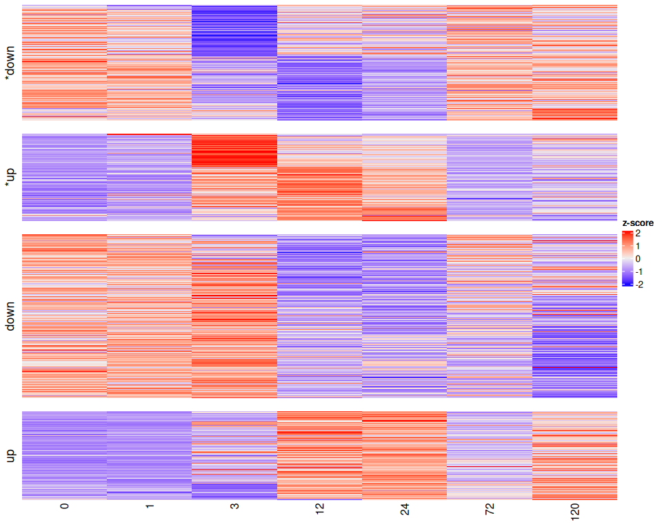
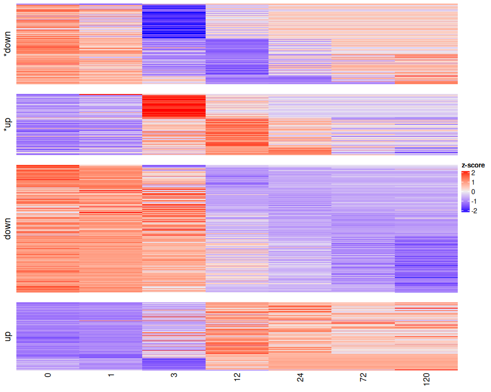
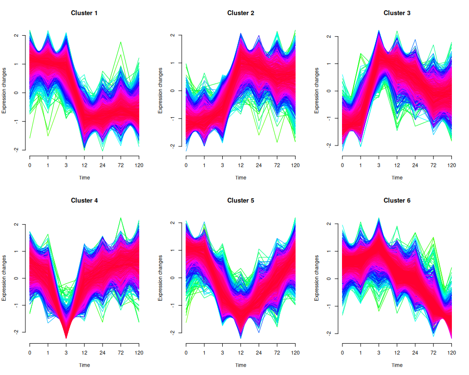

ImpulseDE2 Temporal Analysis
================
Zoe Dellaert
2026-05-10

- [Bulk RNA-seq Time Course Trajectory Analysis and
  Clustering](#bulk-rna-seq-time-course-trajectory-analysis-and-clustering)
  - [Introduction to packages](#introduction-to-packages)
    - [ImpulseDE2](#impulsede2)
    - [Mfuzz: clustering of temporal
      trajectories](#mfuzz-clustering-of-temporal-trajectories)
- [Setup](#setup)
  - [1. Load packages and functions](#1-load-packages-and-functions)
  - [2. Setup species-specific
    parameters](#2-setup-species-specific-parameters)
  - [3. Load in raw counts, transformed counts, metadata, and
    annotations](#3-load-in-raw-counts-transformed-counts-metadata-and-annotations)
- [ImpulseDE2 Analysis](#impulsede2-analysis)
  - [1. Metadata formatting](#1-metadata-formatting)
  - [1. Run ImpulseDE2](#1-run-impulsede2)
  - [3. Extract ImpulseDE2 results](#3-extract-impulsede2-results)
    - [All genes](#all-genes)
    - [Significant genes](#significant-genes)
    - [Quick summary](#quick-summary)
  - [4. Visualize ImpulseDE2 Results](#4-visualize-impulsede2-results)
    - [Heatmap of significant genes](#heatmap-of-significant-genes)
    - [Top gene trajectories](#top-gene-trajectories)
- [Mfuzz: Cluster ImpulseDE2-significant genes by
  trajectory](#mfuzz-cluster-impulsede2-significant-genes-by-trajectory)
  - [1. Preparing expression data](#1-preparing-expression-data)
  - [2. Determine Mfuzz parameters](#2-determine-mfuzz-parameters)
  - [3. Run MFuzz](#3-run-mfuzz)
  - [4. Characterize Clusters](#4-characterize-clusters)
    - [Visualize all significant genes in their
      clusters](#visualize-all-significant-genes-in-their-clusters)
- [Exploring genes of interest](#exploring-genes-of-interest)
  - [Manually-curated heat stress genes by
    cluster](#manually-curated-heat-stress-genes-by-cluster)

# Bulk RNA-seq Time Course Trajectory Analysis and Clustering

## Introduction to packages

### ImpulseDE2

- Based on [this
  paper](https://academic.oup.com/bib/article/20/1/288/4364840#130283262),
  this is the best package to use other than comparing each time point
  against each other individually.
- Repo here: <https://github.com/YosefLab/ImpulseDE2>
- Tutorial here:
  <http://bioconductor.statistik.tu-dortmund.de/packages/3.11/bioc/vignettes/ImpulseDE2/inst/doc/ImpulseDE2_Tutorial.html>
  , I followed closely with the section “Case-control differential
  expression analysis”
- Read the ImpulseDE2 paper
  [here](https://academic.oup.com/nar/article/46/20/e119/5068248)

*David S Fischer, Fabian J Theis, Nir Yosef, Impulse model-based
differential expression analysis of time course sequencing data, Nucleic
Acids Research, Volume 46, Issue 20, 16 November 2018, Page e119,
<https://doi.org/10.1093/nar/gky675>*

To install the package

``` r
library(devtools)
install_github("YosefLab/ImpulseDE2")
```

### Mfuzz: clustering of temporal trajectories

For this we will use the package
[Mfuzz](https://bioconductor.org/packages/release/bioc/html/Mfuzz.html),
[vignette
here](https://bioconductor.org/packages/release/bioc/vignettes/Mfuzz/inst/doc/Mfuzz.pdf).

To install the package

``` r
BiocManager::install("Mfuzz")
```

------------------------------------------------------------------------

# Setup

## 1. Load packages and functions

``` r
# set up file paths so that Rmd outputs can be viewed using github markdown
knitr::opts_knit$set(base.dir = normalizePath(paste0("../../output_RNA/reports/", params$species, "/")), base.url = "./")

knitr::opts_chunk$set(echo = TRUE, message = FALSE, warning = FALSE,fig.width = 10, fig.height = 8,
                      fig.path = "02_ImpulseDE_files/figure-gfm/")

#load packages
library(ImpulseDE2)
library(tidyverse)
library(ComplexHeatmap)
library(Mfuzz)

#load in parameters and functions
source("species_parameters.R")
source("utils.R")

sessionInfo() #provides list of loaded packages and version of R
```

    ## R version 4.5.1 (2025-06-13)
    ## Platform: x86_64-pc-linux-gnu
    ## Running under: Ubuntu 24.04.1 LTS
    ## 
    ## Matrix products: default
    ## BLAS:   /usr/lib/x86_64-linux-gnu/openblas-pthread/libblas.so.3 
    ## LAPACK: /usr/lib/x86_64-linux-gnu/openblas-pthread/libopenblasp-r0.3.26.so;  LAPACK version 3.12.0
    ## 
    ## locale:
    ##  [1] LC_CTYPE=en_US.UTF-8       LC_NUMERIC=C              
    ##  [3] LC_TIME=en_US.UTF-8        LC_COLLATE=en_US.UTF-8    
    ##  [5] LC_MONETARY=en_US.UTF-8    LC_MESSAGES=en_US.UTF-8   
    ##  [7] LC_PAPER=en_US.UTF-8       LC_NAME=C                 
    ##  [9] LC_ADDRESS=C               LC_TELEPHONE=C            
    ## [11] LC_MEASUREMENT=en_US.UTF-8 LC_IDENTIFICATION=C       
    ## 
    ## time zone: Etc/UTC
    ## tzcode source: system (glibc)
    ## 
    ## attached base packages:
    ##  [1] tcltk     grid      stats4    stats     graphics  grDevices utils    
    ##  [8] datasets  methods   base     
    ## 
    ## other attached packages:
    ##  [1] WGCNA_1.73                  fastcluster_1.3.0          
    ##  [3] dynamicTreeCut_1.63-1       Mfuzz_2.68.0               
    ##  [5] DynDoc_1.86.0               widgetTools_1.86.0         
    ##  [7] e1071_1.7-16                ComplexHeatmap_2.26.0      
    ##  [9] ImpulseDE2_0.99.10          BiocParallel_1.44.0        
    ## [11] ggnewscale_0.5.2            genefilter_1.90.0          
    ## [13] RColorBrewer_1.1-3          pheatmap_1.0.13            
    ## [15] DESeq2_1.50.2               SummarizedExperiment_1.40.0
    ## [17] Biobase_2.70.0              MatrixGenerics_1.22.0      
    ## [19] matrixStats_1.5.0           GenomicRanges_1.62.0       
    ## [21] Seqinfo_1.0.0               IRanges_2.44.0             
    ## [23] S4Vectors_0.48.0            BiocGenerics_0.56.0        
    ## [25] generics_0.1.4              lubridate_1.9.4            
    ## [27] forcats_1.0.0               stringr_1.6.0              
    ## [29] dplyr_1.1.4                 purrr_1.2.1                
    ## [31] readr_2.1.6                 tidyr_1.3.1                
    ## [33] tibble_3.3.0                ggplot2_4.0.1              
    ## [35] tidyverse_2.0.0             rmarkdown_2.30             
    ## 
    ## loaded via a namespace (and not attached):
    ##   [1] rstudioapi_0.17.1       jsonlite_2.0.0          shape_1.4.6.1          
    ##   [4] magrittr_2.0.4          magick_2.9.0            farver_2.1.2           
    ##   [7] GlobalOptions_0.1.3     ragg_1.5.0              vctrs_0.7.0            
    ##  [10] memoise_2.0.1           Cairo_1.7-0             base64enc_0.1-3        
    ##  [13] htmltools_0.5.9         S4Arrays_1.10.0         SparseArray_1.10.2     
    ##  [16] Formula_1.2-5           htmlwidgets_1.6.4       impute_1.84.0          
    ##  [19] cachem_1.1.0            lifecycle_1.0.5         iterators_1.0.14       
    ##  [22] pkgconfig_2.0.3         Matrix_1.6-4            R6_2.6.1               
    ##  [25] fastmap_1.2.0           GenomeInfoDbData_1.2.14 clue_0.3-66            
    ##  [28] digest_0.6.39           colorspace_2.1-2        AnnotationDbi_1.72.0   
    ##  [31] textshaping_1.0.4       Hmisc_5.2-5             RSQLite_2.4.5          
    ##  [34] labeling_0.4.3          timechange_0.3.0        httr_1.4.7             
    ##  [37] abind_1.4-8             compiler_4.5.1          proxy_0.4-27           
    ##  [40] bit64_4.6.0-1           withr_3.0.2             doParallel_1.0.17      
    ##  [43] backports_1.5.0         htmlTable_2.4.3         S7_0.2.1               
    ##  [46] DBI_1.2.3               tkWidgets_1.86.0        DelayedArray_0.36.0    
    ##  [49] rjson_0.2.23            tools_4.5.1             foreign_0.8-90         
    ##  [52] nnet_7.3-20             glue_1.8.0              checkmate_2.3.3        
    ##  [55] cluster_2.1.8.1         gtable_0.3.6            tzdb_0.5.0             
    ##  [58] preprocessCore_1.72.0   class_7.3-23            data.table_1.18.0      
    ##  [61] hms_1.1.4               XVector_0.50.0          foreach_1.5.2          
    ##  [64] pillar_1.11.1           vroom_1.6.7             circlize_0.4.17        
    ##  [67] splines_4.5.1           lattice_0.22-7          survival_3.8-3         
    ##  [70] bit_4.6.0               annotate_1.86.1         tidyselect_1.2.1       
    ##  [73] GO.db_3.22.0            locfit_1.5-9.12         Biostrings_2.78.0      
    ##  [76] knitr_1.50              gridExtra_2.3           xfun_0.56              
    ##  [79] stringi_1.8.7           UCSC.utils_1.4.0        yaml_2.3.12            
    ##  [82] evaluate_1.0.5          codetools_0.2-20        cli_3.6.5              
    ##  [85] rpart_4.1.24            xtable_1.8-4            systemfonts_1.3.1      
    ##  [88] dichromat_2.0-0.1       Rcpp_1.1.1              GenomeInfoDb_1.44.3    
    ##  [91] png_0.1-8               XML_3.99-0.18           parallel_4.5.1         
    ##  [94] blob_1.2.4              scales_1.4.0            crayon_1.5.3           
    ##  [97] GetoptLong_1.1.0        rlang_1.1.7             cowplot_1.2.0          
    ## [100] KEGGREST_1.50.0

## 2. Setup species-specific parameters

``` r
# get species
species <- params$species

# get parameters for this species
config <- get_params(species)
print_config(species)
```

    ## Species: Mcap
    ## Count matrix: MON_MCapV3_gene_count_matrix.csv
    ## Outliers: MON_R72_H1, MON_R72_H2
    ## WGCNA power: 12
    ## Mfuzz clusters: 6

``` r
# define preprocessing output directory (from 01_preprocessing.Rmd)
input_dir <- file.path("../../output_RNA/counts_filt_norm", species)

# set up necessary output directories if they don't exist
outdir <- file.path("../../output_RNA/ImpulseDE2", species)
outdir_mfuzz <- file.path(outdir,"Mfuzz")
outdir_plots <- file.path(outdir,"plots")
if (!dir.exists(outdir)) dir.create(outdir, recursive = TRUE)
if (!dir.exists(outdir_mfuzz)) dir.create(outdir_mfuzz, recursive = TRUE)
if (!dir.exists(outdir_plots)) dir.create(outdir_plots, recursive = TRUE)

reportdir <- file.path("../../output_RNA/reports", params$species, "02_ImpulseDE_files/figure-gfm/")
if (!dir.exists(reportdir)) dir.create(reportdir, recursive = TRUE)
```

## 3. Load in raw counts, transformed counts, metadata, and annotations

``` r
# load in raw counts data
counts_raw <- read.csv(file.path("../../output_RNA/count_matrices", config$count_matrix), row.names = 1)

# load in vst-transformed counts
vst <- read.csv(file.path(input_dir, "vsd_expression_matrix.csv"))
vst <- vst %>% column_to_rownames(var = "X")

# load in metadata
meta <- read.csv(paste0("../../output_RNA/",species,"_RNA_seq_metadata.csv"))
meta <- meta %>% column_to_rownames(var = "X") #%>% select(-c(species, replicate))

# remove outliers that are still in metadata and raw_counts files but were removed prior to the vst transformation
outlier_samples <- config$outlier_samples

if(length(outlier_samples) > 0) {
    counts_raw <- counts_raw[, !colnames(counts_raw) %in% outlier_samples]
    meta <- meta[!rownames(meta) %in% outlier_samples, ]
}

all(rownames(meta) %in% colnames(vst))
```

    ## [1] TRUE

``` r
all(rownames(meta) == colnames(vst))
```

    ## [1] TRUE

``` r
# read in SwissProt annotation
SwissProt <- read.delim(file.path(annot_dir,config$SwissProt))
cat("Annotations:", nrow(SwissProt), "Swissprot-annotated genes")
```

    ## Annotations: 22471 Swissprot-annotated genes

------------------------------------------------------------------------

# ImpulseDE2 Analysis

## 1. Metadata formatting

First, reformat our metadata table to match the column names used in the
ImpulseDE2 vignette.

``` r
meta_impulse <- meta %>%
  dplyr::rename(Sample = sample, Time = time, Batch = replicate) %>% 
  mutate(Time = as.numeric(as.character(Time)),
         Condition = str_replace(treatment, "C", "control"),
         Condition = str_replace(Condition, "H", "case")
         ) %>%
  select(-c(species,treatment))
```

## 1. Run ImpulseDE2

This takes a ton of time and memory, so I run it once then save as an
RDS.

``` r
if(params$run_ImpulseDE2 == TRUE) {
  objectImpulseDE2 <- runImpulseDE2(
    matCountData    = as.matrix(counts_raw), #or use filtered_counts 
    dfAnnotation    = meta_impulse,
    boolCaseCtrl    = TRUE,
    vecConfounders  = c("Batch"), #only use if you want to try to control for batch effects
    boolIdentifyTransients = TRUE, #use if you want to ID transiently- vs permanently-regulated genes
    scaNProc        = 18 )
  
  saveRDS(objectImpulseDE2, file.path(outdir, "objectImpulseDE2.rds"))
} else {
  objectImpulseDE2 <- readRDS(file.path(outdir, "objectImpulseDE2.rds"))
}
```

``` r
# Print processing report
cat(objectImpulseDE2@strReport)
```

    ## ImpulseDE2 for count data, v0.99.10
    ## # Process inputProcessing Details:
    ## ImpulseDE2 runs in case-ctrl mode.
    ## Found time points: 0,1,3,12,24,72,120
    ## Case: Found the samples at time point 0: MON_R0_H1,MON_R0_H2,MON_R0_H3
    ## Case: Found the samples at time point 1: MON_R1_H1,MON_R1_H2,MON_R1_H3
    ## Case: Found the samples at time point 3: MON_R3_H1,MON_R3_H2,MON_R3_H3
    ## Case: Found the samples at time point 12: MON_R12_H1,MON_R12_H2,MON_R12_H3
    ## Case: Found the samples at time point 24: MON_R24_H1,MON_R24_H2,MON_R24_H3
    ## Case: Found the samples at time point 72: MON_R72_H3
    ## Case: Found the samples at time point 120: MON_R120_H1,MON_R120_H2,MON_R120_H3
    ## Control: Found the following samples at time point 0:MON_R0_C1,MON_R0_C2,MON_R0_C3
    ## Control: Found the following samples at time point 1:MON_R1_C1,MON_R1_C2,MON_R1_C3
    ## Control: Found the following samples at time point 3:MON_R3_C1,MON_R3_C2,MON_R3_C3
    ## Control: Found the following samples at time point 12:MON_R12_C1,MON_R12_C2,MON_R12_C3
    ## Control: Found the following samples at time point 24:MON_R24_C1,MON_R24_C2,MON_R24_C3
    ## Control: Found the following samples at time point 72:MON_R72_C1,MON_R72_C2,MON_R72_C3
    ## Control: Found the following samples at time point 120:MON_R120_C1,MON_R120_C2,MON_R120_C3
    ## Found the following samples for confounder Batch and batch C1: MON_R0_C1,MON_R1_C1,MON_R3_C1,MON_R12_C1,MON_R24_C1,MON_R72_C1,MON_R120_C1
    ## Found the following samples for confounder Batch and batch C2: MON_R0_C2,MON_R1_C2,MON_R3_C2,MON_R12_C2,MON_R24_C2,MON_R72_C2,MON_R120_C2
    ## Found the following samples for confounder Batch and batch C3: MON_R0_C3,MON_R1_C3,MON_R3_C3,MON_R12_C3,MON_R24_C3,MON_R72_C3,MON_R120_C3
    ## Found the following samples for confounder Batch and batch H1: MON_R0_H1,MON_R1_H1,MON_R3_H1,MON_R12_H1,MON_R24_H1,MON_R120_H1
    ## Found the following samples for confounder Batch and batch H2: MON_R0_H2,MON_R1_H2,MON_R3_H2,MON_R12_H2,MON_R24_H2,MON_R120_H2
    ## Found the following samples for confounder Batch and batch H3: MON_R0_H3,MON_R1_H3,MON_R3_H3,MON_R12_H3,MON_R24_H3,MON_R72_H3,MON_R120_H3
    ## Input contained 54384 genes/regions.
    ## WARNING: 7046 out of 54384 genes do not have obserserved non-zero counts and are excluded.
    ## Selected 47338 genes/regions for analysis.
    ## # Run DESeq2: Using dispersion factorscomputed by DESeq2.
    ## Consumed time: 1.48 min.
    ## # Compute size factors
    ## # Fitting null and alternative model to the genes
    ## Consumed time: 33.44 min.
    ## # Fitting sigmoid model to case condition
    ## Consumed time: 2.64 min.
    ## # Differentially expression analysis based on model fits
    ## Finished running ImpulseDE2.
    ## TOTAL consumed time: 37.76 min.

## 3. Extract ImpulseDE2 results

### All genes

Extract and save results for all non-zero genes

``` r
impulse_results <- objectImpulseDE2$dfImpulseDE2Results
impulse_results <- impulse_results %>% filter(allZero==FALSE) #remove genes with zero counts

impulse_results_annot <- impulse_results %>%
  left_join(SwissProt %>% select(query,ProteinNames,BiologicalProcess), by = join_by("Gene"=="query"))

write.csv(impulse_results, file.path(outdir, "ImpulseDE2_results.csv"), row.names = FALSE)
```

### Significant genes

Extract genes with significant treatment effect on temporal trajectory,
classify them as transiently or monotonously regulated, and save results

``` r
impulse_sig <- impulse_results %>%
  filter(padj < global_params$padj_threshold) %>%
  mutate(response_type = case_when(
    isTransient & !is.na(isTransient) ~ "Transient",
    isMonotonous & !is.na(isMonotonous) ~ "Monotonous",
    .default = "Other"
  ))

write.csv(impulse_sig, file.path(outdir, "ImpulseDE2_significant.csv"), row.names = FALSE)

#preview top DE genes and annotations
impulse_sig %>% arrange(padj) %>% head(20) %>% dplyr::select(Gene,padj,loglik_red,response_type) %>%
  left_join(SwissProt %>% select(query,ProteinNames,BiologicalProcess), by = join_by("Gene"=="query"))
```

    ##                                          Gene          padj loglik_red
    ## 1  Montipora_capitata_HIv3___RNAseq.g49833.t1 4.946119e-129  -636.4767
    ## 2  Montipora_capitata_HIv3___RNAseq.g49832.t1  2.358715e-56  -496.9401
    ## 3   Montipora_capitata_HIv3___RNAseq.g7282.t1  7.252313e-39  -408.1378
    ## 4        Montipora_capitata_HIv3___TS.g637.t1  2.106458e-38  -406.4213
    ## 5  Montipora_capitata_HIv3___RNAseq.g40931.t1  1.630232e-33  -322.2649
    ## 6    Montipora_capitata_HIv3___RNAseq.g984.t1  2.103994e-32  -346.5058
    ## 7  Montipora_capitata_HIv3___RNAseq.g26806.t1  3.935841e-29  -406.0243
    ## 8      Montipora_capitata_HIv3___TS.g49643.t1  2.631676e-27  -257.0443
    ## 9  Montipora_capitata_HIv3___RNAseq.g37139.t1  4.068099e-26  -308.8533
    ## 10 Montipora_capitata_HIv3___RNAseq.g26807.t1  1.782517e-25  -368.9546
    ## 11 Montipora_capitata_HIv3___RNAseq.g41225.t1  3.135229e-25  -385.5945
    ## 12  Montipora_capitata_HIv3___RNAseq.g6371.t1  1.627923e-24  -212.8498
    ## 13  Montipora_capitata_HIv3___RNAseq.g7502.t1  5.175321e-24  -325.3604
    ## 14 Montipora_capitata_HIv3___RNAseq.g20397.t1  8.426103e-24  -340.4130
    ## 15      Montipora_capitata_HIv3___TS.g6919.t1  9.107913e-24  -336.1755
    ## 16 Montipora_capitata_HIv3___RNAseq.g22408.t1  1.088974e-23  -334.7124
    ## 17 Montipora_capitata_HIv3___RNAseq.g15259.t1  1.407835e-23  -329.0971
    ## 18 Montipora_capitata_HIv3___RNAseq.g11828.t1  1.626968e-23  -319.9689
    ## 19 Montipora_capitata_HIv3___RNAseq.g18448.t1  7.184670e-23  -330.7640
    ## 20  Montipora_capitata_HIv3___RNAseq.g9317.t1  2.208527e-22  -266.1987
    ##    response_type
    ## 1      Transient
    ## 2      Transient
    ## 3      Transient
    ## 4      Transient
    ## 5     Monotonous
    ## 6     Monotonous
    ## 7      Transient
    ## 8      Transient
    ## 9      Transient
    ## 10     Transient
    ## 11     Transient
    ## 12    Monotonous
    ## 13    Monotonous
    ## 14     Transient
    ## 15    Monotonous
    ## 16     Transient
    ## 17    Monotonous
    ## 18    Monotonous
    ## 19    Monotonous
    ## 20    Monotonous
    ##                                                                                                                                                                                                                                                     ProteinNames
    ## 1                                                                                                                                                                                                                             Glycine-rich RNA-binding protein 1
    ## 2                                                            Glycine-rich RNA-binding protein 4, mitochondrial (AtGR-RBP4) (AtRBG4) (Glycine-rich protein 4) (AtGRP4) (Mitochondrial RNA-binding protein 1b) (At-mRBP1b) (Small RNA binding protein 4) (AtSRBP4)
    ## 3                                                                                                                                                                               Serine/arginine-rich splicing factor 4 (Splicing factor, arginine/serine-rich 4)
    ## 4                                                                                                                                                                                                                        Cytochrome P450 10 (EC 1.14.-.-) (CYPX)
    ## 5                                                                                                                                                                                Prominin-1 (Antigen AC133 homolog) (Prominin-like protein 1) (CD antigen CD133)
    ## 6                                                                                                                                                                                                                                                      Galaxin-2
    ## 7                                                                                                                                                                                                                  DNA-binding protein MNB1B (HMG1-like protein)
    ## 8                                                                                                                                                                                                                                                           <NA>
    ## 9  Methylcrotonoyl-CoA carboxylase subunit alpha, mitochondrial (MCCase subunit alpha) (EC 6.4.1.4) (3-methylcrotonyl-CoA carboxylase 1) (3-methylcrotonyl-CoA carboxylase biotin-containing subunit) (3-methylcrotonyl-CoA:carbon dioxide ligase subunit alpha)
    ## 10                                                                                                                                                                                                                 Zinc finger MYND domain-containing protein 10
    ## 11                                                                                                          Heterogeneous nuclear ribonucleoproteins A1 homolog (hnRNP A1) (Helix-destabilizing protein) (Single-strand-binding protein) (hnRNP core protein A1)
    ## 12                                                                                                                                  ATP-binding cassette subfamily C member 4 (EC 7.6.2.-) (EC 7.6.2.2) (EC 7.6.2.3) (Multidrug resistance-associated protein 4)
    ## 13                                                                                                                                                                                                                                         Meteorin-like protein
    ## 14                                                                                                                      Cleavage stimulation factor subunit 3 (CF-1 77 kDa subunit) (Cleavage stimulation factor 77 kDa subunit) (CSTF 77 kDa subunit) (CstF-77)
    ## 15                                                                                                                                                                                                                                  ZP domain-containing protein
    ## 16                                                                                                                                  Endoplasmic reticulum-Golgi intermediate compartment protein 1 (ER-Golgi intermediate compartment 32 kDa protein) (ERGIC-32)
    ## 17                                                                                                                                                            Protein-glucosylgalactosylhydroxylysine glucosidase (EC 3.2.1.107) (Acid trehalase-like protein 1)
    ## 18                                                                                                                                                                                                                                    Transcription factor SOX-4
    ## 19                                                                                                                                                                                                                                                          <NA>
    ## 20                                                                                                                                                                                                                                                          <NA>
    ##                                                                                                                                                                                                                                                                                                                                                                                                                                                                                                                                                                                                                                                                                                                                                                                                                                                                                                                                                                                                                                                                                                                                                                                                                                                                                                                                                                                                                                                                                                                                                                                                                                                                                                                                                                                                                                                                                  BiologicalProcess
    ## 1                                                                                                                                                                                                                                                                                                                                                                                                                                                                                                                                                                                                                                                                                                                                                                                                                                                                                                                                                                                                                                                                                                                                                                                                                                                                                                                                                                                                                                                                                                                                                                                                                                                                                                                                                                                                                                                                      mRNA transport [GO:0051028]
    ## 2                                                                                                                                                                                                                                                                                                                                                                                                                                                                                                                                                                                                                                                                                                                                                                                                                                                                                                                                                                                                                                                                                                                                                                                                                                                                                                                                                                                                                                                                                                                                      extracellular transport [GO:0006858]; miRNA transport [GO:1990428]; mitochondrial RNA modification [GO:1900864]; regulation of defense response to virus [GO:0050688]; response to cold [GO:0009409]; response to osmotic stress [GO:0006970]; response to salt stress [GO:0009651]; response to water deprivation [GO:0009414]; RNA transport [GO:0050658]
    ## 3                                                                                                                                                                                                                                                                                                                                                                                                                                                                                                                                                                                                                                                                                                                                                                                                                                                                                                                                                                                                                                                                                                                                                                                                                                                                                                                                                                                                                                                                                                                                                                                                                                                                                                          hematopoietic progenitor cell differentiation [GO:0002244]; mRNA processing [GO:0006397]; negative regulation of mRNA splicing, via spliceosome [GO:0048025]; RNA splicing [GO:0008380]
    ## 4                                                                                                                                                                                                                                                                                                                                                                                                                                                                                                                                                                                                                                                                                                                                                                                                                                                                                                                                                                                                                                                                                                                                                                                                                                                                                                                                                                                                                                                                                                                                                                                                                                                                                                                                                                                                                                                                                                 
    ## 5                                                                                                                                                                                                                                                                                                                                                                                                                                                                                                                                                                                                                                                                                                                                                                                                                                                                                                                                                                                                                                                                                                                                                                                                                                                                                                                                                                                                                                                                                                                                                                                                                                                                                                                                                                                             camera-type eye photoreceptor cell differentiation [GO:0060219]; retina layer formation [GO:0010842]
    ## 6                                                                                                                                                                                                                                                                                                                                                                                                                                                                                                                                                                                                                                                                                                                                                                                                                                                                                                                                                                                                                                                                                                                                                                                                                                                                                                                                                                                                                                                                                                                                                                                                                                                                                                                                                                                                                                                                                                 
    ## 7                                                                                                                                                                                                                                                                                                                                                                                                                                                                                                                                                                                                                                                                                                                                                                                                                                                                                                                                                                                                                                                                                                                                                                                                                                                                                                                                                                                                                                                                                                                                                                                                                                                                                                                                                                                                                                           regulation of DNA-templated transcription [GO:0006355]
    ## 8                                                                                                                                                                                                                                                                                                                                                                                                                                                                                                                                                                                                                                                                                                                                                                                                                                                                                                                                                                                                                                                                                                                                                                                                                                                                                                                                                                                                                                                                                                                                                                                                                                                                                                                                                                                                                                                                                             <NA>
    ## 9                                                                                                                                                                                                                                                                                                                                                                                                                                                                                                                                                                                                                                                                                                                                                                                                                                                                                                                                                                                                                                                                                                                                                                                                                                                                                                                                                                                                                                                                                                                                                                                                                                                                                                                                                                                                                                                         L-leucine catabolic process [GO:0006552]
    ## 10                                                                                                                                                                                                                                                                                                                                                                                                                                                                                                                                                                                                                                                                                                                                                                                                                                                                                                                                                                                                                                                                                                                                                                                                                                                                                                                                                                                                                                                                                                                                                                                                                                                                                                                 inner dynein arm assembly [GO:0036159]; motile cilium assembly [GO:0044458]; outer dynein arm assembly [GO:0036158]; positive regulation of motile cilium assembly [GO:1905505]
    ## 11                                                                                                                                                                                                                                                                                                                                                                                                                                                                                                                                                                                                                                                                                                                                                                                                                                                                                                                                                                                                                                                                                                                                                                                                                                                                                                                                                                                                                                                                                                                                                                                                                                                                                                                                                                                                                                                     mRNA splicing, via spliceosome [GO:0000398]
    ## 12                                                                                                                                                                                                                                                                                                                                                                                                                                                                                                                                                                                                                                                                                                                                                                                                                                                                                                                                                                                                                                                                                                                                                                                                                                                                                                                                                                                                                                    bile acid and bile salt transport [GO:0015721]; cAMP transport [GO:0070730]; cilium assembly [GO:0060271]; export across plasma membrane [GO:0140115]; leukotriene transport [GO:0071716]; positive regulation of smooth muscle cell proliferation [GO:0048661]; prostaglandin secretion [GO:0032310]; prostaglandin transport [GO:0015732]; response to tetrachloromethane [GO:1904772]; transmembrane transport [GO:0055085]; urate transport [GO:0015747]
    ## 13                                                                                                                                                                                                                                                                                                                                                                                                                                                                                                                                                                                                                                                                                                                                                                                                                                                                                                                                                                                                                                                                                                                                                                                                                                                                                                                                                                                                                                                                                                                                                                                                            brown fat cell differentiation [GO:0050873]; energy homeostasis [GO:0097009]; negative regulation of inflammatory response [GO:0050728]; positive regulation of brown fat cell differentiation [GO:0090336]; response to cold [GO:0009409]; response to muscle activity [GO:0014850]
    ## 14                                                                                                                                                                                                                                                                                                                                                                                                                                                                                                                                                                                                                                                                                                                                                                                                                                                                                                                                                                                                                                                                                                                                                                                                                                                                                                                                                                                                                                                                                                                                                                                                                                                                                                                                                                                                    co-transcriptional mRNA 3'-end processing, cleavage and polyadenylation pathway [GO:0180010]
    ## 15                                                                                                                                                                                                                                                                                                                                                                                                                                                                                                                                                                                                                                                                                                                                                                                                                                                                                                                                                                                                                                                                                                                                                                                                                                                                                                                                                                                                                                                                                                                                                                                                                                                                                                                                                                                                                                                                                                
    ## 16                                                                                                                                                                                                                                                                                                                                                                                                                                                                                                                                                                                                                                                                                                                                                                                                                                                                                                                                                                                                                                                                                                                                                                                                                                                                                                                                                                                                                                                                                                                                                                                                                                                                                                                                      endoplasmic reticulum to Golgi vesicle-mediated transport [GO:0006888]; retrograde vesicle-mediated transport, Golgi to endoplasmic reticulum [GO:0006890]
    ## 17                                                                                                                                                                                                                                                                                                                                                                                                                                                                                                                                                                                                                                                                                                                                                                                                                                                                                                                                                                                                                                                                                                                                                                                                                                                                                                                                                                                                                                                                                                                                                                                                                                                                                                                                                                                                                                                     carbohydrate metabolic process [GO:0005975]
    ## 18 ascending aorta morphogenesis [GO:0035910]; atrial septum primum morphogenesis [GO:0003289]; cardiac right ventricle morphogenesis [GO:0003215]; cellular response to glucose stimulus [GO:0071333]; endocrine pancreas development [GO:0031018]; gene expression [GO:0010467]; glial cell development [GO:0021782]; glial cell proliferation [GO:0014009]; glucose homeostasis [GO:0042593]; heart development [GO:0007507]; hematopoietic stem cell homeostasis [GO:0061484]; kidney morphogenesis [GO:0060993]; mesenchyme development [GO:0060485]; mitral valve morphogenesis [GO:0003183]; negative regulation of myoblast differentiation [GO:0045662]; negative regulation of transcription by RNA polymerase II [GO:0000122]; nervous system development [GO:0007399]; neuroepithelial cell differentiation [GO:0060563]; noradrenergic neuron differentiation [GO:0003357]; positive regulation of apoptotic process [GO:0043065]; positive regulation of canonical Wnt signaling pathway [GO:0090263]; positive regulation of cell population proliferation [GO:0008284]; positive regulation of DNA-templated transcription [GO:0045893]; positive regulation of gamma-delta T cell differentiation [GO:0045588]; positive regulation of insulin secretion [GO:0032024]; positive regulation of myoblast differentiation [GO:0045663]; positive regulation of transcription by RNA polymerase II [GO:0045944]; pro-B cell differentiation [GO:0002328]; protein stabilization [GO:0050821]; regulation of DNA damage response, signal transduction by p53 class mediator [GO:0043516]; regulation of DNA-templated transcription [GO:0006355]; somatic stem cell population maintenance [GO:0035019]; spinal cord development [GO:0021510]; sympathetic nervous system development [GO:0048485]; T cell differentiation [GO:0030217]; ventricular septum morphogenesis [GO:0060412]
    ## 19                                                                                                                                                                                                                                                                                                                                                                                                                                                                                                                                                                                                                                                                                                                                                                                                                                                                                                                                                                                                                                                                                                                                                                                                                                                                                                                                                                                                                                                                                                                                                                                                                                                                                                                                                                                                                                                                                            <NA>
    ## 20                                                                                                                                                                                                                                                                                                                                                                                                                                                                                                                                                                                                                                                                                                                                                                                                                                                                                                                                                                                                                                                                                                                                                                                                                                                                                                                                                                                                                                                                                                                                                                                                                                                                                                                                                                                                                                                                                            <NA>

### Quick summary

    ## Total significant genes: 5885

    ## Response patterns:

    ## Transient: 1704

    ## Monotonous: 2355

    ## Other: 1826

## 4. Visualize ImpulseDE2 Results

### Heatmap of significant genes

``` r
lsHeatmaps <- plotHeatmap(
  objectImpulseDE2       = objectImpulseDE2,
  strCondition           = "case",
  boolIdentifyTransients = TRUE, #set to true if true above
  scaQThres              = global_params$padj_threshold)

# complexHeatmapRaw = Heatmap of raw data by time point: Average of the size factor (and batch factor) normalised counts per time point and gene.
draw(lsHeatmaps$complexHeatmapRaw)
```

<!-- -->

``` r
# complexHeatmapFit = Heatmap of impulse-fitted data by time point.
draw(lsHeatmaps$complexHeatmapFit)
```

<!-- -->

``` r
png(file.path(outdir_plots,"ImpulseDE2_heatmap_case_fit.png"), width = 2000, height = 2400, res = 300)
draw(lsHeatmaps$complexHeatmapFit)
dev.off()
```

    ## png 
    ##   2

``` r
pdf(file.path(outdir_plots,"ImpulseDE2_heatmap_case_fit.pdf"), width = 10, height = 12)
draw(lsHeatmaps$complexHeatmapFit)
dev.off()
```

    ## png 
    ##   2

``` r
png(file.path(outdir_plots,"ImpulseDE2_heatmap_case.png"), width = 2000, height = 2400, res = 300)
draw(lsHeatmaps$complexHeatmapRaw)
dev.off()
```

    ## png 
    ##   2

``` r
pdf(file.path(outdir_plots, "ImpulseDE2_heatmap_case.pdf"), width = 10, height = 12)
draw(lsHeatmaps$complexHeatmapRaw)
dev.off()
```

    ## png 
    ##   2

### Top gene trajectories

``` r
# Plot top 10 differentially expressed (by q-value) genes
top_genes <- impulse_sig %>% arrange(padj) %>% head(10) %>% pull(Gene)

plotGenes(
  vecGeneIDs = top_genes,
  objectImpulseDE2 = objectImpulseDE2,
  boolSimplePlot = TRUE,
  boolCaseCtrl     = TRUE,
  dirOut = outdir_plots,
  strFileName = "/top10_DE_genes.pdf",
  boolMultiplePlotsPerPage = FALSE)
```

    ## [1] "Creating ../../output_RNA/ImpulseDE2/Mcap/plots/top10_DE_genes.pdf"

    ## [[1]]

    ## 
    ## [[2]]

    ## 
    ## [[3]]

    ## 
    ## [[4]]

    ## 
    ## [[5]]

    ## 
    ## [[6]]

    ## 
    ## [[7]]

    ## 
    ## [[8]]

    ## 
    ## [[9]]

    ## 
    ## [[10]]

------------------------------------------------------------------------

# Mfuzz: Cluster ImpulseDE2-significant genes by trajectory

## 1. Preparing expression data

Filter vst transformed counts to keep significant genes and only
heat-samples

``` r
sig_genes <- impulse_sig %>% filter(Gene %in% rownames(vst)) %>% pull(Gene)

# Get VST expression for case (heat) samples only for sig genes
heat_samples <- meta %>% filter(treatment == "H") %>% pull(sample)
heat_vsd <- vst[sig_genes, heat_samples]
```

Average across replicates per timepoint, heat samples only

``` r
heat_avg <- vst[sig_genes, heat_samples] %>%
  as.data.frame() %>%
  rownames_to_column("Gene") %>%
  pivot_longer(-Gene, names_to = "sample", values_to = "expr") %>%
  left_join(meta %>% select(sample, time), by = "sample") %>%
  group_by(Gene, time) %>%
  summarize(mean_expr = mean(expr), .groups = "drop") %>%
  pivot_wider(names_from = time, values_from = mean_expr) %>%
  column_to_rownames("Gene")

# Reorder columns by time
heat_avg <- heat_avg[, order(as.numeric(colnames(heat_avg)))]
colnames(heat_avg) <- paste0("R", colnames(heat_avg))
```

Prepare data in eset format

``` r
# Create ExpressionSet
heat_eset <- ExpressionSet(assayData = as.matrix(heat_avg))
heat_eset <- standardise(heat_eset)
```

## 2. Determine Mfuzz parameters

For fuzzy c-means clustering, the fuzzifier m and the number of clusters
c has to be chosen in advance

``` r
# Estimate fuzzifier
m <- mestimate(heat_eset)
cat("Estimated fuzzifier m:", round(m, 2), "\n")
```

    ## Estimated fuzzifier m: 1.55

``` r
# Choose optimal cluster number based on elbow plot (do this once and add to species_parameters.R script)
Dmin(heat_eset, m = m, crange = seq(2, 12, 1), repeats = 3)

# adjust below to test what different numbers of clusters reveal in the data -- don't over-cluster
for (k in c(4,6,8)) {
  set.seed(global_params$seed)
  result <- mfuzz(heat_eset, c = k, m = m)
  mfuzz.plot(heat_eset, cl = result, mfrow = c(2, ceiling(k/2)), 
             new.window =FALSE,, time.labels =  c(0,1,3,12,24,72,120))
}
```

## 3. Run MFuzz

Run clustering with species-specific cluster number

``` r
k <-  config$n_clusters
set.seed(global_params$seed)
mfuzz_clusters <- mfuzz(heat_eset, c = k, m = m)
```

Extract cluster assignments and save results

``` r
cluster_assignments <- data.frame(
  Gene = names(mfuzz_clusters$cluster),
  cluster = mfuzz_clusters$cluster,
  membership = apply(mfuzz_clusters$membership, 1, max)) %>%
  left_join(impulse_sig %>% select(Gene, response_type), by = "Gene") # join to impulseDE results

table(cluster_assignments$cluster, cluster_assignments$response_type)
```

    ##    
    ##     Monotonous Other Transient
    ##   1        656   411       105
    ##   2         86   321       436
    ##   3        151   186       526
    ##   4         70   344       494
    ##   5        597   250       102
    ##   6        795   310        41

``` r
# Save mfuzz objects and cluster assignments
saveRDS(mfuzz_clusters, file.path(outdir_mfuzz, "mfuzz_result.rds"))
saveRDS(heat_eset, file.path(outdir_mfuzz, "mfuzz_input_eset.rds"))
write.csv(cluster_assignments, file.path(outdir_mfuzz, "cluster_assignments.csv"), row.names = FALSE)
write.csv(as.data.frame(mfuzz_clusters$centers), file.path(outdir_mfuzz, "cluster_centers.csv"))
```

## 4. Characterize Clusters

``` r
# Get cluster centers (average trajectory)
cluster_centers <- mfuzz_clusters$centers

# Identify peak and trough timepoint for each cluster
timepoints <- c(0, 1, 3, 12, 24, 72, 120)
peak_times <- timepoints[apply(cluster_centers, 1, which.max)]
trough_times <- timepoints[apply(cluster_centers, 1, which.min)]

cluster_info <- data.frame(
  cluster = 1:k,
  peak_time = peak_times,
  trough_time = trough_times,
  n_genes = as.numeric(table(mfuzz_clusters$cluster)))

print(cluster_info)
```

    ##   cluster peak_time trough_time n_genes
    ## 1       1         3         120    1172
    ## 2       2       120           3     843
    ## 3       3         3           0     863
    ## 4       4         0          12     908
    ## 5       5        12           0     949
    ## 6       6         0          12    1146

``` r
write.csv(cluster_info, file.path(outdir_mfuzz, "cluster_info.csv"), row.names = FALSE)
```

### Visualize all significant genes in their clusters

``` r
mfuzz.plot(heat_eset, cl = mfuzz_clusters, new.window =FALSE, mfrow = c(2,k/2), time.labels =  c(0,1,3,12,24,72,120))
```

<!-- -->

``` r
# Visualize clusters
pdf(paste0(outdir_plots,"/temporal_clusters.pdf"), width = 12, height = 10)
mfuzz.plot2(heat_eset, cl = mfuzz_clusters, mfrow = c(2,k/2),
            time.labels = c("0", "1", "3", "12", "24", "72", "120"),
            xlab = "Time (hours)",x11=FALSE)
dev.off()
```

    ## png 
    ##   2

------------------------------------------------------------------------

# Exploring genes of interest

## Manually-curated heat stress genes by cluster

``` r
# read in Manual heat stress genes annotation
HeatStressGenes <- read_csv(paste0(annot_dir,"/heatstress/HeatStressGenes_", species ,".csv")) %>%
  dplyr::select(-1) %>% dplyr::rename(query = paste0(species,"_gene")) %>% dplyr::select(query,everything())

HeatStressGenes_unique <- HeatStressGenes %>% group_by(query) %>%
  summarize(gene_id = paste(unique(gene_id), collapse = ","),
            response_type = paste(unique(response_type), collapse = ","),
            category = paste(unique(category), collapse = ",")) 

HeatStressGenes_unique <- HeatStressGenes_unique %>% filter(query %in% rownames(vst))
 
stress_genes_ids <- unique(HeatStressGenes_unique$query) 
```

``` r
HSPS <- impulse_results %>% filter(Gene %in% stress_genes_ids) %>% arrange(padj) %>% left_join(HeatStressGenes_unique, by = join_by(Gene==query)) %>% filter(grepl("HSP",gene_id)) %>% pull(Gene)

cluster_assignments %>% filter(Gene %in% HSPS)
```

    ##                                         Gene cluster membership response_type
    ## 1 Montipora_capitata_HIv3___RNAseq.g15043.t1       3  0.7063881     Transient
    ## 2 Montipora_capitata_HIv3___RNAseq.g18811.t1       3  0.7067597     Transient
    ## 3     Montipora_capitata_HIv3___TS.g35289.t2       3  0.8656548     Transient

``` r
heat_clustered <- HeatStressGenes_unique %>% left_join(cluster_assignments, by = join_by(query==Gene)) %>%
  arrange(cluster, desc(cluster))

# plot this to show which genes are in which cluster
heat_clustered %>% filter(!is.na(cluster)) %>% ggplot(aes(y=reorder(gene_id, cluster), x=factor(cluster), fill=cluster)) +
  geom_tile() +
  theme_bw() +
  labs(x="Mfuzz Cluster", y="Gene ID", title="Heat stress genes clustered by temporal expression pattern")
```

<!-- -->

``` r
sessionInfo()
```

    ## R version 4.5.1 (2025-06-13)
    ## Platform: x86_64-pc-linux-gnu
    ## Running under: Ubuntu 24.04.1 LTS
    ## 
    ## Matrix products: default
    ## BLAS:   /usr/lib/x86_64-linux-gnu/openblas-pthread/libblas.so.3 
    ## LAPACK: /usr/lib/x86_64-linux-gnu/openblas-pthread/libopenblasp-r0.3.26.so;  LAPACK version 3.12.0
    ## 
    ## locale:
    ##  [1] LC_CTYPE=en_US.UTF-8       LC_NUMERIC=C              
    ##  [3] LC_TIME=en_US.UTF-8        LC_COLLATE=en_US.UTF-8    
    ##  [5] LC_MONETARY=en_US.UTF-8    LC_MESSAGES=en_US.UTF-8   
    ##  [7] LC_PAPER=en_US.UTF-8       LC_NAME=C                 
    ##  [9] LC_ADDRESS=C               LC_TELEPHONE=C            
    ## [11] LC_MEASUREMENT=en_US.UTF-8 LC_IDENTIFICATION=C       
    ## 
    ## time zone: Etc/UTC
    ## tzcode source: system (glibc)
    ## 
    ## attached base packages:
    ##  [1] tcltk     grid      stats4    stats     graphics  grDevices utils    
    ##  [8] datasets  methods   base     
    ## 
    ## other attached packages:
    ##  [1] WGCNA_1.73                  fastcluster_1.3.0          
    ##  [3] dynamicTreeCut_1.63-1       Mfuzz_2.68.0               
    ##  [5] DynDoc_1.86.0               widgetTools_1.86.0         
    ##  [7] e1071_1.7-16                ComplexHeatmap_2.26.0      
    ##  [9] ImpulseDE2_0.99.10          BiocParallel_1.44.0        
    ## [11] ggnewscale_0.5.2            genefilter_1.90.0          
    ## [13] RColorBrewer_1.1-3          pheatmap_1.0.13            
    ## [15] DESeq2_1.50.2               SummarizedExperiment_1.40.0
    ## [17] Biobase_2.70.0              MatrixGenerics_1.22.0      
    ## [19] matrixStats_1.5.0           GenomicRanges_1.62.0       
    ## [21] Seqinfo_1.0.0               IRanges_2.44.0             
    ## [23] S4Vectors_0.48.0            BiocGenerics_0.56.0        
    ## [25] generics_0.1.4              lubridate_1.9.4            
    ## [27] forcats_1.0.0               stringr_1.6.0              
    ## [29] dplyr_1.1.4                 purrr_1.2.1                
    ## [31] readr_2.1.6                 tidyr_1.3.1                
    ## [33] tibble_3.3.0                ggplot2_4.0.1              
    ## [35] tidyverse_2.0.0             rmarkdown_2.30             
    ## 
    ## loaded via a namespace (and not attached):
    ##   [1] rstudioapi_0.17.1       jsonlite_2.0.0          shape_1.4.6.1          
    ##   [4] magrittr_2.0.4          magick_2.9.0            farver_2.1.2           
    ##   [7] GlobalOptions_0.1.3     ragg_1.5.0              vctrs_0.7.0            
    ##  [10] memoise_2.0.1           Cairo_1.7-0             base64enc_0.1-3        
    ##  [13] htmltools_0.5.9         S4Arrays_1.10.0         SparseArray_1.10.2     
    ##  [16] Formula_1.2-5           htmlwidgets_1.6.4       impute_1.84.0          
    ##  [19] cachem_1.1.0            lifecycle_1.0.5         iterators_1.0.14       
    ##  [22] pkgconfig_2.0.3         Matrix_1.6-4            R6_2.6.1               
    ##  [25] fastmap_1.2.0           GenomeInfoDbData_1.2.14 clue_0.3-66            
    ##  [28] digest_0.6.39           colorspace_2.1-2        AnnotationDbi_1.72.0   
    ##  [31] textshaping_1.0.4       Hmisc_5.2-5             RSQLite_2.4.5          
    ##  [34] labeling_0.4.3          timechange_0.3.0        httr_1.4.7             
    ##  [37] abind_1.4-8             compiler_4.5.1          proxy_0.4-27           
    ##  [40] bit64_4.6.0-1           withr_3.0.2             doParallel_1.0.17      
    ##  [43] backports_1.5.0         htmlTable_2.4.3         S7_0.2.1               
    ##  [46] DBI_1.2.3               tkWidgets_1.86.0        DelayedArray_0.36.0    
    ##  [49] rjson_0.2.23            tools_4.5.1             foreign_0.8-90         
    ##  [52] nnet_7.3-20             glue_1.8.0              checkmate_2.3.3        
    ##  [55] cluster_2.1.8.1         gtable_0.3.6            tzdb_0.5.0             
    ##  [58] preprocessCore_1.72.0   class_7.3-23            data.table_1.18.0      
    ##  [61] hms_1.1.4               XVector_0.50.0          foreach_1.5.2          
    ##  [64] pillar_1.11.1           vroom_1.6.7             circlize_0.4.17        
    ##  [67] splines_4.5.1           lattice_0.22-7          survival_3.8-3         
    ##  [70] bit_4.6.0               annotate_1.86.1         tidyselect_1.2.1       
    ##  [73] GO.db_3.22.0            locfit_1.5-9.12         Biostrings_2.78.0      
    ##  [76] knitr_1.50              gridExtra_2.3           xfun_0.56              
    ##  [79] stringi_1.8.7           UCSC.utils_1.4.0        yaml_2.3.12            
    ##  [82] evaluate_1.0.5          codetools_0.2-20        cli_3.6.5              
    ##  [85] rpart_4.1.24            xtable_1.8-4            systemfonts_1.3.1      
    ##  [88] dichromat_2.0-0.1       Rcpp_1.1.1              GenomeInfoDb_1.44.3    
    ##  [91] png_0.1-8               XML_3.99-0.18           parallel_4.5.1         
    ##  [94] blob_1.2.4              scales_1.4.0            crayon_1.5.3           
    ##  [97] GetoptLong_1.1.0        rlang_1.1.7             cowplot_1.2.0          
    ## [100] KEGGREST_1.50.0
