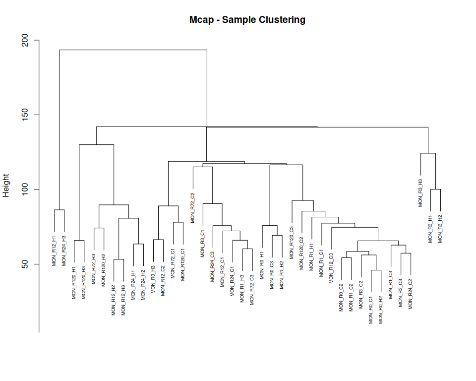
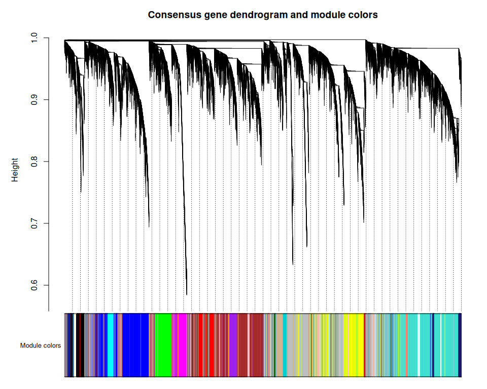

WGCNA Analysis
================
Zoe Dellaert
2026-05-10

- [Network analysis of Time Series bulk RNA-seq
  data](#network-analysis-of-time-series-bulk-rna-seq-data)
  - [Introduction](#introduction)
  - [1. Load packages and functions](#1-load-packages-and-functions)
  - [2. Setup species-specific
    parameters](#2-setup-species-specific-parameters)
  - [3. Setup WGCNA Parameters and plotting
    function](#3-setup-wgcna-parameters-and-plotting-function)
  - [4. Load in transformed counts and
    metadata](#4-load-in-transformed-counts-and-metadata)
  - [5. Check for outliers](#5-check-for-outliers)
  - [6. Determine parameters for
    WGCNA](#6-determine-parameters-for-wgcna)
  - [7. WGCNA: One-step module
    detection](#7-wgcna-one-step-module-detection)
    - [Load saved WGCNA results](#load-saved-wgcna-results)
    - [Visualize the network](#visualize-the-network)

# Network analysis of Time Series bulk RNA-seq data

## Introduction

The goal of this script is to identify co-expressed gene modules from
our time-course RNA-seq data. I hope to identify genes which respond to
the heat stress similarly over time.

Helpful *general* WGCNA tutorial to help with parameter decisions can be
found
[here](https://alexslemonade.github.io/refinebio-examples/04-advanced-topics/network-analysis_rnaseq_01_wgcna.html#46_Determine_parameters_for_WGCNA)
and another
[here](https://bioinformaticsworkbook.org/tutorials/wgcna.html#gsc.tab=0).

And other example code here: -
<https://github.com/fscucchia/HI_PhotoPhysio_TPC_geneExpr/blob/983b837e2dbd9bad2dfeda764dcc0b9da254073a/Gene_expression/scripts/WGCNA_Network_Analysis/WGCNA_Pacu.r>

How to install packages:

``` r
if (!require("BiocManager", quietly = TRUE))
    install.packages("BiocManager")

BiocManager::install("impute", type = "source")
BiocManager::install("WGCNA",force = TRUE)
```

------------------------------------------------------------------------

## 1. Load packages and functions

``` r
# set up file paths so that Rmd outputs can be viewed using github markdown
knitr::opts_knit$set(base.dir = normalizePath(paste0("../../output_RNA/reports/", params$species, "/")), base.url = "./")

knitr::opts_chunk$set(echo = TRUE, message = FALSE, fig.width = 10, fig.height = 8,
                      fig.path = "03_WGCNA_files/figure-gfm/")

#load packages
library(tidyverse)
library(WGCNA)

#load in parameters and functions
source("species_parameters.R")
source("utils.R")

sessionInfo() #provides list of loaded packages and version of R
```

    ## R version 4.5.1 (2025-06-13)
    ## Platform: x86_64-pc-linux-gnu
    ## Running under: Ubuntu 24.04.1 LTS
    ## 
    ## Matrix products: default
    ## BLAS:   /usr/lib/x86_64-linux-gnu/openblas-pthread/libblas.so.3 
    ## LAPACK: /usr/lib/x86_64-linux-gnu/openblas-pthread/libopenblasp-r0.3.26.so;  LAPACK version 3.12.0
    ## 
    ## locale:
    ##  [1] LC_CTYPE=en_US.UTF-8       LC_NUMERIC=C              
    ##  [3] LC_TIME=en_US.UTF-8        LC_COLLATE=en_US.UTF-8    
    ##  [5] LC_MONETARY=en_US.UTF-8    LC_MESSAGES=en_US.UTF-8   
    ##  [7] LC_PAPER=en_US.UTF-8       LC_NAME=C                 
    ##  [9] LC_ADDRESS=C               LC_TELEPHONE=C            
    ## [11] LC_MEASUREMENT=en_US.UTF-8 LC_IDENTIFICATION=C       
    ## 
    ## time zone: Etc/UTC
    ## tzcode source: system (glibc)
    ## 
    ## attached base packages:
    ##  [1] tcltk     grid      stats4    stats     graphics  grDevices utils    
    ##  [8] datasets  methods   base     
    ## 
    ## other attached packages:
    ##  [1] WGCNA_1.73                  fastcluster_1.3.0          
    ##  [3] dynamicTreeCut_1.63-1       Mfuzz_2.68.0               
    ##  [5] DynDoc_1.86.0               widgetTools_1.86.0         
    ##  [7] e1071_1.7-16                ComplexHeatmap_2.26.0      
    ##  [9] ImpulseDE2_0.99.10          BiocParallel_1.44.0        
    ## [11] ggnewscale_0.5.2            genefilter_1.90.0          
    ## [13] RColorBrewer_1.1-3          pheatmap_1.0.13            
    ## [15] DESeq2_1.50.2               SummarizedExperiment_1.40.0
    ## [17] Biobase_2.70.0              MatrixGenerics_1.22.0      
    ## [19] matrixStats_1.5.0           GenomicRanges_1.62.0       
    ## [21] Seqinfo_1.0.0               IRanges_2.44.0             
    ## [23] S4Vectors_0.48.0            BiocGenerics_0.56.0        
    ## [25] generics_0.1.4              lubridate_1.9.4            
    ## [27] forcats_1.0.0               stringr_1.6.0              
    ## [29] dplyr_1.1.4                 purrr_1.2.1                
    ## [31] readr_2.1.6                 tidyr_1.3.1                
    ## [33] tibble_3.3.0                ggplot2_4.0.1              
    ## [35] tidyverse_2.0.0             rmarkdown_2.30             
    ## 
    ## loaded via a namespace (and not attached):
    ##   [1] rstudioapi_0.17.1       jsonlite_2.0.0          shape_1.4.6.1          
    ##   [4] magrittr_2.0.4          magick_2.9.0            farver_2.1.2           
    ##   [7] GlobalOptions_0.1.3     ragg_1.5.0              vctrs_0.7.0            
    ##  [10] memoise_2.0.1           Cairo_1.7-0             base64enc_0.1-3        
    ##  [13] htmltools_0.5.9         S4Arrays_1.10.0         SparseArray_1.10.2     
    ##  [16] Formula_1.2-5           htmlwidgets_1.6.4       impute_1.84.0          
    ##  [19] cachem_1.1.0            lifecycle_1.0.5         iterators_1.0.14       
    ##  [22] pkgconfig_2.0.3         Matrix_1.6-4            R6_2.6.1               
    ##  [25] fastmap_1.2.0           GenomeInfoDbData_1.2.14 clue_0.3-66            
    ##  [28] digest_0.6.39           colorspace_2.1-2        AnnotationDbi_1.72.0   
    ##  [31] textshaping_1.0.4       Hmisc_5.2-5             RSQLite_2.4.5          
    ##  [34] labeling_0.4.3          timechange_0.3.0        httr_1.4.7             
    ##  [37] abind_1.4-8             compiler_4.5.1          proxy_0.4-27           
    ##  [40] bit64_4.6.0-1           withr_3.0.2             doParallel_1.0.17      
    ##  [43] backports_1.5.0         htmlTable_2.4.3         S7_0.2.1               
    ##  [46] DBI_1.2.3               tkWidgets_1.86.0        DelayedArray_0.36.0    
    ##  [49] rjson_0.2.23            tools_4.5.1             foreign_0.8-90         
    ##  [52] nnet_7.3-20             glue_1.8.0              checkmate_2.3.3        
    ##  [55] cluster_2.1.8.1         gtable_0.3.6            tzdb_0.5.0             
    ##  [58] preprocessCore_1.72.0   class_7.3-23            data.table_1.18.0      
    ##  [61] hms_1.1.4               XVector_0.50.0          foreach_1.5.2          
    ##  [64] pillar_1.11.1           vroom_1.6.7             circlize_0.4.17        
    ##  [67] splines_4.5.1           lattice_0.22-7          survival_3.8-3         
    ##  [70] bit_4.6.0               annotate_1.86.1         tidyselect_1.2.1       
    ##  [73] GO.db_3.22.0            locfit_1.5-9.12         Biostrings_2.78.0      
    ##  [76] knitr_1.50              gridExtra_2.3           xfun_0.56              
    ##  [79] stringi_1.8.7           UCSC.utils_1.4.0        yaml_2.3.12            
    ##  [82] evaluate_1.0.5          codetools_0.2-20        cli_3.6.5              
    ##  [85] rpart_4.1.24            xtable_1.8-4            systemfonts_1.3.1      
    ##  [88] dichromat_2.0-0.1       Rcpp_1.1.1              GenomeInfoDb_1.44.3    
    ##  [91] png_0.1-8               XML_3.99-0.18           parallel_4.5.1         
    ##  [94] blob_1.2.4              scales_1.4.0            crayon_1.5.3           
    ##  [97] GetoptLong_1.1.0        rlang_1.1.7             cowplot_1.2.0          
    ## [100] KEGGREST_1.50.0

## 2. Setup species-specific parameters

``` r
# get species
species <- params$species

# get parameters for this species
config <- get_params(species)
print_config(species)
```

    ## Species: Mcap
    ## Count matrix: MON_MCapV3_gene_count_matrix.csv
    ## Outliers: MON_R72_H1, MON_R72_H2
    ## WGCNA power: 12
    ## Mfuzz clusters: 6

``` r
# define preprocessing output directory (from 01_preprocessing.Rmd)
input_dir <- file.path("../../output_RNA/counts_filt_norm", species)

# set up necessary output directories if they don't exist
outdir <- file.path("../../output_RNA/WGCNA", species)
outdir_plots <- file.path(outdir,"plots")
if (!dir.exists(outdir)) dir.create(outdir, recursive = TRUE)
if (!dir.exists(outdir_plots)) dir.create(outdir_plots, recursive = TRUE)

reportdir <- file.path("../../output_RNA/reports", params$species, "03_WGCNA_files/figure-gfm/")
if (!dir.exists(reportdir)) dir.create(reportdir, recursive = TRUE)
```

## 3. Setup WGCNA Parameters and plotting function

``` r
options(stringsAsFactors = FALSE)
enableWGCNAThreads(global_params$n_cores)
```

    ## Allowing parallel execution with up to 18 working processes.

Create Heatmap function based heavily off of the following tutorial:

<https://alexslemonade.github.io/refinebio-examples/04-advanced-topics/network-analysis_rnaseq_01_wgcna.html#46_Determine_parameters_for_WGCNA>

``` r
make_module_heatmap <- function(module_name,
                                expression_mat = normalized_counts,
                                metadata_df = meta,
                                gene_module_key_df = module_df,
                                module_eigengenes_df = module_eigengenes) {
  # Create a summary heatmap of a given module.
  # based on https://alexslemonade.github.io/refinebio-examples/04-advanced-topics/network-analysis_rnaseq_01_wgcna.html#46_Determine_parameters_for_WGCNA

  # Set up the module eigengene with its sample
  module_eigengene <- module_eigengenes_df %>%
    dplyr::select(all_of(module_name)) %>%
    tibble::rownames_to_column("sample")

  # Set up column annotation from metadata
  col_annot_df <- metadata_df %>%
    # Only select the treatment, time, and sample ID columns
    dplyr::select(sample, treatment, time) %>%
    # Add on the eigengene expression by joining with sample IDs
    dplyr::inner_join(module_eigengene, by = "sample") %>%
    # Arrange by treatment and time point
    dplyr::arrange(treatment, time, sample) %>%
    # Store sample
    tibble::column_to_rownames("sample")

  # Create the ComplexHeatmap column annotation object
  col_annot <- ComplexHeatmap::HeatmapAnnotation(
    # Supply treatment and time labels
    treatment = col_annot_df$treatment,
    time = col_annot_df$time,
    # Add annotation barplot
    module_eigengene = ComplexHeatmap::anno_barplot(dplyr::select(col_annot_df, module_name)),
    # Pick colors for each experimental group in treatment
    col = list(treatment = c("C" = "lightblue4", "H" = "#D55E00"),
               time = time_colors)
  )

  # Get a vector of the gene IDs that correspond to this module
  module_genes <- gene_module_key_df %>%
    dplyr::filter(module == module_name) %>%
    dplyr::pull(gene_id)

  # Set up the gene expression data frame
  mod_mat <- expression_mat %>%
    t() %>%
    as.data.frame() %>%
    # Only keep genes from this module
    dplyr::filter(rownames(.) %in% module_genes) %>%
    # Order the samples to match col_annot_df
    dplyr::select(rownames(col_annot_df)) %>%
    # Data needs to be a matrix
    as.matrix()

  # Normalize the gene expression values
  mod_mat <- mod_mat %>%
    # Scale can work on matrices, but it does it by column so we will need to
    # transpose first
    t() %>%
    scale() %>%
    # And now we need to transpose back
    t()

  # Create a color function based on standardized scale
  color_func <- circlize::colorRamp2(
    c(-1.5, 0, 1.5),
    c("#67a9cf", "#f7f7f7", "#ef8a62")
  )

  # Plot on a heatmap
  heatmap <- ComplexHeatmap::Heatmap(mod_mat,
    name = module_name,
    # Supply color function
    col = color_func,
    # Supply column annotation
    bottom_annotation = col_annot,
    # We don't want to cluster samples
    cluster_columns = FALSE,
    # We don't need to show sample or gene labels
    show_row_names = FALSE,
    show_column_names = FALSE
  )

  # Return heatmap
  return(heatmap)
}
```

## 4. Load in transformed counts and metadata

``` r
# load in vst-transformed counts
vst <- read.csv(file.path(input_dir, "vsd_expression_matrix.csv"))
vst <- vst %>% column_to_rownames(var = "X")

# transpose counts to format needed for WGCNA
normalized_counts <- t(vst)

# load in metadata
meta <- read.csv(paste0("../../output_RNA/",species,"_RNA_seq_metadata.csv"))
meta <- meta %>% column_to_rownames(var = "X") %>% select(-c(species, replicate))

cat("Input data:", nrow(vst), "genes x", ncol(vst), "samples")
```

    ## Input data: 30089 genes x 40 samples

## 5. Check for outliers

Ideally these were removed during 01_preprocessing.Rmd. See line above
to confirm the number of samples matches what you expect after outlier
removal. But confirm by clustering the samples and view as a tree.

``` r
sampleTree = hclust(dist(normalized_counts), method = "average")
plot(sampleTree, main = paste(species, "- Sample Clustering"), 
     xlab = "", sub = "", cex = 0.6)
```

<!-- -->

## 6. Determine parameters for WGCNA

The below takes a long time to run, so it is only run if TestParams is
set to TRUE. Otherwise, the pre-determined parameters for this species
dataset are loaded in from the species_parameters.R script. This should
be redone for any changes in data filtering and outlier removal.

``` r
if(params$TestParams == TRUE) {
  sft <- pickSoftThreshold(normalized_counts,
                           networkType = "signed",
                           RsquaredCut = 0.8,
                           powerVector = c(seq(1, 12, by = 1), seq(14, 30, by = 2)),
                           verbose=3)
  sft_df <- data.frame(sft$fitIndices) %>% dplyr::mutate(model_fit = -sign(slope) * SFT.R.sq)
  
  fit_plot <- ggplot(sft_df, aes(x = Power, y = model_fit, label = Power)) +
    geom_point() +
    geom_text(nudge_y = 0.1) +
    # We will plot what WGCNA recommends as an R^2 cutoff
    geom_hline(yintercept = 0.80, col = "red") +
    ylim(c(min(sft_df$model_fit), 1.05)) +
    xlab("Soft Threshold (power)") +
    ylab("Scale Free Topology Model Fit, signed R^2") +
    ggtitle("Scale independence") +
    theme_classic()
  
  print(fit_plot)
  
  mean_plot <- ggplot(sft_df, aes(x = Power, y = mean.k., label = Power)) +
    geom_point() +
    geom_text(nudge_y = 500) +
    xlab("Soft Threshold (power)") +
    ylab("Mean Connectivity") +
    ggtitle("Mean Connectivity") +
    theme_classic()
  
  print(mean_plot)
  
  soft_power = sft$powerEstimate
  
  if (is.na(sft$powerEstimate)) {
    stop("Soft power could not be automatically determined. Potenitally test a greater range of powers.")
}
  
  if (soft_power != config$soft_power) {
    warning(paste0(" Calculated power (" , sft$powerEstimate, 
                  ") differs from config value (", config$soft_power,"). Consider updating species_parameters.R with new value. Examine graph and confirm if the calculated power matches visual examination of the data."))
  }
  
} else {
  soft_power = config$soft_power
}
```

    ## pickSoftThreshold: will use block size 1486.
    ##  pickSoftThreshold: calculating connectivity for given powers...
    ##    ..working on genes 1 through 1486 of 30089
    ##    ..working on genes 1487 through 2972 of 30089
    ##    ..working on genes 2973 through 4458 of 30089
    ##    ..working on genes 4459 through 5944 of 30089
    ##    ..working on genes 5945 through 7430 of 30089
    ##    ..working on genes 7431 through 8916 of 30089
    ##    ..working on genes 8917 through 10402 of 30089
    ##    ..working on genes 10403 through 11888 of 30089
    ##    ..working on genes 11889 through 13374 of 30089
    ##    ..working on genes 13375 through 14860 of 30089
    ##    ..working on genes 14861 through 16346 of 30089
    ##    ..working on genes 16347 through 17832 of 30089
    ##    ..working on genes 17833 through 19318 of 30089
    ##    ..working on genes 19319 through 20804 of 30089
    ##    ..working on genes 20805 through 22290 of 30089
    ##    ..working on genes 22291 through 23776 of 30089
    ##    ..working on genes 23777 through 25262 of 30089
    ##    ..working on genes 25263 through 26748 of 30089
    ##    ..working on genes 26749 through 28234 of 30089
    ##    ..working on genes 28235 through 29720 of 30089
    ##    ..working on genes 29721 through 30089 of 30089
    ##    Power SFT.R.sq slope truncated.R.sq mean.k. median.k. max.k.
    ## 1      1   0.0590 15.50          0.906 15100.0  15100.00  15600
    ## 2      2   0.0507 -5.23          0.897  8170.0   8150.00   9290
    ## 3      3   0.1130 -3.67          0.929  4720.0   4680.00   6070
    ## 4      4   0.1570 -2.52          0.930  2870.0   2820.00   4210
    ## 5      5   0.1910 -1.69          0.930  1830.0   1780.00   3050
    ## 6      6   0.3610 -1.95          0.952  1210.0   1160.00   2390
    ## 7      7   0.5110 -2.06          0.972   830.0    776.00   1950
    ## 8      8   0.6190 -2.11          0.982   587.0    534.00   1630
    ## 9      9   0.6940 -2.14          0.986   426.0    376.00   1390
    ## 10    10   0.7480 -2.16          0.986   317.0    270.00   1200
    ## 11    11   0.7880 -2.18          0.988   240.0    197.00   1050
    ## 12    12   0.8170 -2.18          0.989   186.0    146.00    925
    ## 13    14   0.8370 -2.22          0.981   117.0     83.40    736
    ## 14    16   0.8490 -2.22          0.979    77.5     49.60    599
    ## 15    18   0.8530 -2.20          0.977    53.6     30.50    496
    ## 16    20   0.8490 -2.19          0.974    38.5     19.40    417
    ## 17    22   0.8590 -2.15          0.981    28.4     12.60    354
    ## 18    24   0.8580 -2.14          0.982    21.5      8.37    304
    ## 19    26   0.8610 -2.11          0.985    16.7      5.71    263
    ## 20    28   0.8570 -2.10          0.985    13.1      3.96    228
    ## 21    30   0.8580 -2.07          0.986    10.5      2.79    200

<!-- --><!-- -->

``` r
cat("Soft Power for WGCNA:", soft_power)
```

    ## Soft Power for WGCNA: 12

## 7. WGCNA: One-step module detection

``` r
if(params$run_WGCNA == TRUE) {
  temp_cor <- cor
  cor <- WGCNA::cor # Force it to use WGCNA cor function (fix a namespace conflict issue)
  netwk <- blockwiseModules(normalized_counts,
                            nThreads = global_params$n_cores,
  
                            # Adjacency Function
                            power = soft_power,
                            corType = "bicor",
                            networkType = "signed",
                            TOMType = "signed",
  
                            # Tree and Block Options
                            deepSplit = global_params$wgcna_default$deep_split,
                            pamRespectsDendro = F,
                            minModuleSize = global_params$wgcna_default$min_module_size,
                            maxBlockSize = 50000,
  
                            # topological overlap matrix, (TOM)
                            saveTOMs = TRUE,
                            saveTOMFileBase = file.path(outdir, "blockwiseTOM"),
                            #loadTOM = FALSE, #uncomment this if you are re-running with a previously saved TOM
  
                            # Output Options
                            mergeCutHeight = global_params$wgcna_default$merge_cut_height,
                            numericLabels = TRUE,
                            verbose = 3)
  
  cor <- temp_cor     # Return cor function to original namespace
  saveRDS(netwk, file.path(outdir, "wgcna_network.rds"))
}
```

    ##  Calculating module eigengenes block-wise from all genes
    ##    Flagging genes and samples with too many missing values...
    ##     ..step 1
    ##  ..Working on block 1 .
    ##     TOM calculation: adjacency..
    ##     ..will use 18 parallel threads.
    ##      Fraction of slow calculations: 0.000000
    ##     ..connectivity..
    ##     ..matrix multiplication (system BLAS)..
    ##     ..normalization..
    ##     ..done.
    ##    ..saving TOM for block 1 into file ../../output_RNA/WGCNA/Mcap/blockwiseTOM-block.1.RData
    ##  ....clustering..
    ##  ....detecting modules..
    ##  ....calculating module eigengenes..
    ##  ....checking kME in modules..

    ## Warning in bicor(structure(c(9.0531191274072, 8.89746590091673,
    ## 9.22942056564533, : bicor: zero MAD in variable 'x'. Pearson correlation was
    ## used for individual columns with zero (or missing) MAD.

    ##      ..removing 557 genes from module 1 because their KME is too low.

    ## Warning in bicor(structure(c(6.12701089513297, 5.90496769146896,
    ## 5.90496769146896, : bicor: zero MAD in variable 'x'. Pearson correlation was
    ## used for individual columns with zero (or missing) MAD.

    ##      ..removing 383 genes from module 2 because their KME is too low.

    ## Warning in bicor(structure(c(8.24936260967612, 8.3938514146887,
    ## 8.18401684720398, : bicor: zero MAD in variable 'x'. Pearson correlation was
    ## used for individual columns with zero (or missing) MAD.

    ##      ..removing 180 genes from module 3 because their KME is too low.

    ## Warning in bicor(structure(c(8.19446907597619, 8.3891623599347,
    ## 8.16939921757664, : bicor: zero MAD in variable 'x'. Pearson correlation was
    ## used for individual columns with zero (or missing) MAD.

    ##      ..removing 407 genes from module 4 because their KME is too low.

    ## Warning in bicor(structure(c(8.64575627250057, 8.5733875032157,
    ## 9.15721286011817, : bicor: zero MAD in variable 'x'. Pearson correlation was
    ## used for individual columns with zero (or missing) MAD.

    ##      ..removing 295 genes from module 5 because their KME is too low.

    ## Warning in bicor(structure(c(9.24656656831556, 9.88015583780468,
    ## 9.72471803424119, : bicor: zero MAD in variable 'x'. Pearson correlation was
    ## used for individual columns with zero (or missing) MAD.

    ##      ..removing 38 genes from module 6 because their KME is too low.

    ## Warning in bicor(structure(c(9.06351339957659, 9.14949640678298,
    ## 8.94896747291449, : bicor: zero MAD in variable 'x'. Pearson correlation was
    ## used for individual columns with zero (or missing) MAD.

    ##      ..removing 849 genes from module 7 because their KME is too low.

    ## Warning in bicor(structure(c(9.46040546086171, 9.89630729538516,
    ## 9.71506804854999, : bicor: zero MAD in variable 'x'. Pearson correlation was
    ## used for individual columns with zero (or missing) MAD.

    ##      ..removing 25 genes from module 8 because their KME is too low.

    ## Warning in bicor(structure(c(5.90496769146896, 5.90496769146896,
    ## 5.90496769146896, : bicor: zero MAD in variable 'x'. Pearson correlation was
    ## used for individual columns with zero (or missing) MAD.

    ##      ..removing 174 genes from module 9 because their KME is too low.

    ## Warning in bicor(structure(c(11.3948150567001, 12.1200843979072,
    ## 11.0181758073826, : bicor: zero MAD in variable 'x'. Pearson correlation was
    ## used for individual columns with zero (or missing) MAD.

    ##      ..removing 12 genes from module 10 because their KME is too low.

    ## Warning in bicor(structure(c(7.50890669209849, 7.22648192248436,
    ## 7.60704143029751, : bicor: zero MAD in variable 'x'. Pearson correlation was
    ## used for individual columns with zero (or missing) MAD.

    ##      ..removing 78 genes from module 11 because their KME is too low.

    ## Warning in bicor(structure(c(6.26697028780423, 6.28702369160254,
    ## 6.26454001688764, : bicor: zero MAD in variable 'x'. Pearson correlation was
    ## used for individual columns with zero (or missing) MAD.

    ##      ..removing 584 genes from module 12 because their KME is too low.

    ## Warning in bicor(structure(c(10.775077972594, 10.6946136078047,
    ## 10.9583413493317, : bicor: zero MAD in variable 'x'. Pearson correlation was
    ## used for individual columns with zero (or missing) MAD.

    ##      ..removing 430 genes from module 13 because their KME is too low.

    ## Warning in bicor(structure(c(8.53106798683582, 8.71000641655096,
    ## 9.02449266723429, : bicor: zero MAD in variable 'x'. Pearson correlation was
    ## used for individual columns with zero (or missing) MAD.

    ##      ..removing 28 genes from module 14 because their KME is too low.

    ## Warning in bicor(structure(c(8.32658948217675, 8.54435751901228,
    ## 8.3088163611469, : bicor: zero MAD in variable 'x'. Pearson correlation was
    ## used for individual columns with zero (or missing) MAD.

    ##      ..removing 9 genes from module 15 because their KME is too low.

    ## Warning in bicor(structure(c(9.44862191938304, 9.43159225225788,
    ## 9.45367381364004, : bicor: zero MAD in variable 'x'. Pearson correlation was
    ## used for individual columns with zero (or missing) MAD.

    ##      ..removing 19 genes from module 16 because their KME is too low.

    ## Warning in bicor(structure(c(6.80663243068169, 5.90496769146896,
    ## 6.91940759337699, : bicor: zero MAD in variable 'x'. Pearson correlation was
    ## used for individual columns with zero (or missing) MAD.

    ## Warning in bicor(structure(c(9.64022425643969, 9.41818259998363,
    ## 9.60088323398442, : bicor: zero MAD in variable 'x'. Pearson correlation was
    ## used for individual columns with zero (or missing) MAD.

    ##      ..removing 12 genes from module 18 because their KME is too low.
    ##      ..removing 1 genes from module 19 because their KME is too low.

    ## Warning in bicor(structure(c(9.30558038846011, 9.38639218280216,
    ## 9.19726681616688, : bicor: zero MAD in variable 'x'. Pearson correlation was
    ## used for individual columns with zero (or missing) MAD.

    ##      ..removing 3 genes from module 20 because their KME is too low.

    ## Warning in bicor(structure(c(6.3290394668051, 6.44372075732232,
    ## 6.54950148614504, : bicor: zero MAD in variable 'x'. Pearson correlation was
    ## used for individual columns with zero (or missing) MAD.

    ## Warning in bicor(structure(c(11.0271421073308, 11.3615718128169,
    ## 11.3806980807827, : bicor: zero MAD in variable 'x'. Pearson correlation was
    ## used for individual columns with zero (or missing) MAD.

    ##      ..removing 8 genes from module 22 because their KME is too low.

    ## Warning in bicor(structure(c(5.90496769146896, 5.90496769146896,
    ## 7.87374337244676, : bicor: zero MAD in variable 'x'. Pearson correlation was
    ## used for individual columns with zero (or missing) MAD.

    ## Warning in bicor(structure(c(9.97998208661925, 9.82045273958545,
    ## 10.1957536744873, : bicor: zero MAD in variable 'x'. Pearson correlation was
    ## used for individual columns with zero (or missing) MAD.

    ##      ..removing 10 genes from module 24 because their KME is too low.

    ## Warning in bicor(structure(c(10.86262343155, 10.723790349406, 10.8658262725865,
    ## : bicor: zero MAD in variable 'x'. Pearson correlation was used for individual
    ## columns with zero (or missing) MAD.

    ##      ..removing 6 genes from module 25 because their KME is too low.

    ## Warning in bicor(structure(c(8.50422502953337, 8.67233277320595,
    ## 8.76562835133261, : bicor: zero MAD in variable 'x'. Pearson correlation was
    ## used for individual columns with zero (or missing) MAD.

    ##      ..removing 4 genes from module 26 because their KME is too low.
    ##      ..removing 4 genes from module 27 because their KME is too low.

    ## Warning in bicor(structure(c(8.75001656776037, 8.75749846472932,
    ## 8.74653488107404, : bicor: zero MAD in variable 'x'. Pearson correlation was
    ## used for individual columns with zero (or missing) MAD.

    ##      ..removing 2 genes from module 28 because their KME is too low.

    ## Warning in bicor(structure(c(9.78594883016906, 9.54485487797686,
    ## 9.75171085422629, : bicor: zero MAD in variable 'x'. Pearson correlation was
    ## used for individual columns with zero (or missing) MAD.

    ##      ..removing 5 genes from module 29 because their KME is too low.

    ## Warning in bicor(structure(c(11.1366833586935, 11.1576721566846,
    ## 11.0924201695946, : bicor: zero MAD in variable 'x'. Pearson correlation was
    ## used for individual columns with zero (or missing) MAD.

    ##      ..removing 6 genes from module 30 because their KME is too low.

    ## Warning in bicor(structure(c(12.1388465569249, 12.4986967546845,
    ## 12.3822254878985, : bicor: zero MAD in variable 'x'. Pearson correlation was
    ## used for individual columns with zero (or missing) MAD.

    ##      ..removing 1 genes from module 31 because their KME is too low.

    ## Warning in bicor(structure(c(6.9765582429419, 6.94876193751665,
    ## 6.72009978996958, : bicor: zero MAD in variable 'x'. Pearson correlation was
    ## used for individual columns with zero (or missing) MAD.

    ## Warning in bicor(structure(c(8.58505212382017, 8.3315865488831,
    ## 7.99686065769037, : bicor: zero MAD in variable 'x'. Pearson correlation was
    ## used for individual columns with zero (or missing) MAD.

    ## Warning in bicor(structure(c(5.90496769146896, 5.90496769146896,
    ## 6.37972422726607, : bicor: zero MAD in variable 'x'. Pearson correlation was
    ## used for individual columns with zero (or missing) MAD.

    ##      ..removing 3 genes from module 35 because their KME is too low.
    ##      ..removing 3 genes from module 37 because their KME is too low.

    ## Warning in bicor(structure(c(7.35594527552579, 7.20195477457915,
    ## 7.11776155285661, : bicor: zero MAD in variable 'x'. Pearson correlation was
    ## used for individual columns with zero (or missing) MAD.

    ##      ..removing 1 genes from module 39 because their KME is too low.

    ## Warning in bicor(structure(c(6.71591891084191, 6.80892531534689,
    ## 6.61867504230802, : bicor: zero MAD in variable 'x'. Pearson correlation was
    ## used for individual columns with zero (or missing) MAD.

    ##      ..removing 3 genes from module 41 because their KME is too low.

    ## Warning in bicor(structure(c(8.33538971549512, 9.13036453764562,
    ## 6.57341321127676, : bicor: zero MAD in variable 'x'. Pearson correlation was
    ## used for individual columns with zero (or missing) MAD.

    ## Warning in bicor(structure(c(8.81798223168546, 7.63674247222887,
    ## 7.92205333766859, : bicor: zero MAD in variable 'x'. Pearson correlation was
    ## used for individual columns with zero (or missing) MAD.

    ##      ..removing 19 genes from module 44 because their KME is too low.

    ## Warning in bicor(structure(c(7.37978516860328, 7.30809068720828,
    ## 7.92205333766859, : bicor: zero MAD in variable 'x'. Pearson correlation was
    ## used for individual columns with zero (or missing) MAD.

    ##      ..removing 12 genes from module 46 because their KME is too low.

    ## Warning in bicor(structure(c(10.4946816571374, 10.4491476647609,
    ## 10.2254388275149, : bicor: zero MAD in variable 'x'. Pearson correlation was
    ## used for individual columns with zero (or missing) MAD.

    ## Warning in bicor(structure(c(9.15861115165329, 9.02468240289078,
    ## 9.52549853413775, : bicor: zero MAD in variable 'x'. Pearson correlation was
    ## used for individual columns with zero (or missing) MAD.

    ## Warning in (function (x, y = NULL, robustX = TRUE, robustY = TRUE, use =
    ## "all.obs", : bicor: zero MAD in variable 'x'. Pearson correlation was used for
    ## individual columns with zero (or missing) MAD.

    ##   ..reassigning 37 genes from module 1 to modules with higher KME.
    ##   ..reassigning 26 genes from module 2 to modules with higher KME.
    ##   ..reassigning 56 genes from module 3 to modules with higher KME.
    ##   ..reassigning 29 genes from module 4 to modules with higher KME.
    ##   ..reassigning 14 genes from module 5 to modules with higher KME.
    ##   ..reassigning 12 genes from module 6 to modules with higher KME.
    ##   ..reassigning 15 genes from module 7 to modules with higher KME.
    ##   ..reassigning 1 genes from module 8 to modules with higher KME.
    ##   ..reassigning 15 genes from module 9 to modules with higher KME.
    ##   ..reassigning 3 genes from module 10 to modules with higher KME.
    ##   ..reassigning 1 genes from module 11 to modules with higher KME.
    ##   ..reassigning 1 genes from module 12 to modules with higher KME.
    ##   ..reassigning 25 genes from module 13 to modules with higher KME.
    ##   ..reassigning 3 genes from module 15 to modules with higher KME.
    ##   ..reassigning 1 genes from module 17 to modules with higher KME.
    ##   ..reassigning 2 genes from module 18 to modules with higher KME.
    ##   ..reassigning 6 genes from module 19 to modules with higher KME.
    ##   ..reassigning 2 genes from module 20 to modules with higher KME.
    ##   ..reassigning 7 genes from module 21 to modules with higher KME.
    ##   ..reassigning 3 genes from module 23 to modules with higher KME.
    ##   ..reassigning 1 genes from module 24 to modules with higher KME.
    ##   ..reassigning 1 genes from module 25 to modules with higher KME.
    ##   ..reassigning 1 genes from module 27 to modules with higher KME.
    ##   ..reassigning 1 genes from module 30 to modules with higher KME.
    ##   ..reassigning 3 genes from module 42 to modules with higher KME.
    ##  ..merging modules that are too close..
    ##      mergeCloseModules: Merging modules whose distance is less than 0.25
    ##        Calculating new MEs...

### Load saved WGCNA results

``` r
netwk <- readRDS(file.path(outdir, "wgcna_network.rds"))

# what is stored in this object?
names(netwk)
```

    ##  [1] "colors"         "unmergedColors" "MEs"            "goodSamples"   
    ##  [5] "goodGenes"      "dendrograms"    "TOMFiles"       "blockGenes"    
    ##  [9] "blocks"         "MEsOK"

``` r
# save the module labels
moduleLabels <- netwk$colors

# how many modules are there?
paste("There are", length(unique(moduleLabels)), "modules in our current analysis.")
```

    ## [1] "There are 32 modules in our current analysis."

``` r
# see the distribution of genes across these labelled modules
table(moduleLabels)
```

    ## moduleLabels
    ##    0    1    2    3    4    5    6    7    8    9   10   11   12   13   14   15 
    ## 4932 4342 3360 3155 1965 1192 1051  988  902  867  830  676  514  465  459  411 
    ##   16   17   18   19   20   21   22   23   24   25   26   27   28   29   30   31 
    ##  409  383  348  343  337  305  286  273  266  221  184  179  167  122  103   54

``` r
# Convert labels to colors for plotting
moduleColors <- labels2colors(moduleLabels)
```

### Visualize the network

``` r
# Plot the dendrogram and the module colors underneath
plotDendroAndColors(
  netwk$dendrograms[[1]],
  moduleColors,
  "Module colors",
  dendroLabels = FALSE,
  hang = 0.03,
  addGuide = TRUE,
  guideHang = 0.05, main = "Consensus gene dendrogram and module colors")
```

<!-- -->

<!-- ### Treatment and Time Module Correlation -->

<!-- ```{r} -->

<!-- # save the module info as a dataframe and txt file -->

<!-- module_df <- data.frame( -->

<!--   gene_id = names(netwk$colors), -->

<!--   module = paste0("ME", netwk$colors), -->

<!--   color = labels2colors(netwk$colors) -->

<!-- ) -->

<!-- head(module_df) -->

<!-- write_delim(module_df, file = paste0(outdir,"gene_modules.txt"), delim = "\t") -->

<!-- # get the module eigengenes -->

<!-- module_eigengenes <- netwk$MEs -->

<!-- head(module_eigengenes) -->

<!-- # get a list of all the genes in a module -->

<!-- gene_module_key <- tibble::enframe(netwk$colors, name = "gene", value = "module") %>% -->

<!--   # Let's add the `ME` part so its more clear what these numbers are and it matches elsewhere -->

<!--   dplyr::mutate(module = paste0("ME", module)) -->

<!-- # confirm that the sample metadata and sample labels for the module eigengenes are matching -->

<!-- all.equal(meta$sample, rownames(module_eigengenes)) -->

<!-- ``` -->

<!-- #### Time+Treatment-Module Correlation Heatmaps -->

<!-- ```{r} -->

<!-- nSamples = nrow(normalized_counts) -->

<!-- time_treat_factorial <- meta %>% -->

<!--   mutate(group = paste0(time, "hr-", ifelse(treatment == "C", "Control", "Heat"))) %>% -->

<!--   select(sample, group) %>%  -->

<!--   mutate(value = 1) %>%  -->

<!--   tidyr::pivot_wider(names_from = group, values_from = value, values_fill = 0) %>% -->

<!--   column_to_rownames(var = "sample") %>% -->

<!--   relocate(contains("Control"), contains("Heat")) %>% -->

<!--    mutate(across(everything(), as.factor)) -->

<!-- # Reorder modules so similar modules are next to each other -->

<!-- module_eigengenes_ordered <- orderMEs(module_eigengenes) -->

<!-- module_order = names(module_eigengenes_ordered)  -->

<!-- moduleTraitCor =  WGCNA::cor(module_eigengenes_ordered, time_treat_factorial, use = "p"); -->

<!-- moduleTraitPvalue = corPvalueStudent(moduleTraitCor, nSamples); -->

<!-- textMatrix <- ifelse(moduleTraitPvalue < 0.05, -->

<!--                      paste0(signif(moduleTraitCor, 2), "\n(", -->

<!--                             signif(moduleTraitPvalue, 2), ")"),"") -->

<!-- pdf(paste0(outdir,"/all_heatmap.pdf"),width=8, height=8) -->

<!-- # Will display correlations and their p-values -->

<!-- par(mar = c(4, 3, 2, 2)) -->

<!-- labeledHeatmap(Matrix = moduleTraitCor, -->

<!--                textMatrix = textMatrix, -->

<!--                xLabels = names(time_treat_factorial), -->

<!--                yLabels = names(module_eigengenes_ordered), -->

<!--                ySymbols = names(module_eigengenes_ordered), -->

<!--                colorLabels = TRUE, -->

<!--                colors = blueWhiteRed(100), -->

<!--                setStdMargins = FALSE, -->

<!--                cex.text = 0.5, -->

<!--                cex.lab = 0.7, -->

<!--                cex.colorLabels = 0.7, -->

<!--                zlim = c(-1,1), -->

<!--                main = paste("Module-trait relationships - all")) -->

<!-- dev.off() -->

<!-- ``` -->

<!-- ##### ggplot version -->

<!-- ```{r} -->

<!-- # Add treatment names -->

<!-- module_eigengenes_ordered$treatment_time = paste0(meta$time,"hr","-",ifelse(meta$treatment == "C", "Control", "Heat")) -->

<!-- module_eigengenes_ordered$treatment = meta$treatment -->

<!-- module_eigengenes_ordered <- module_eigengenes_ordered %>% arrange(treatment) -->

<!-- mmPval = moduleTraitPvalue %>% as.data.frame() %>% rownames_to_column("module") %>% -->

<!--   pivot_longer(-module, names_to = "treatment_time", values_to = "pvalue") -->

<!-- mmCor = moduleTraitCor %>% as.data.frame() %>% rownames_to_column("module") %>% -->

<!--   pivot_longer(-module, names_to = "treatment_time", values_to = "correlation") %>% -->

<!--   left_join(mmPval, by = c("module", "treatment_time")) %>% -->

<!--   mutate( -->

<!--     label = ifelse(pvalue < 0.05, -->

<!--                    paste0(signif(correlation, 2)), ""), -->

<!--     # use this if you want the p-value also plotted -->

<!--     #label = ifelse(pvalue < 0.05, -->

<!--     #               paste0(signif(correlation, 2), "\n(", signif(pvalue, 2), ")"), ""), -->

<!--     module = factor(module, levels = rev(module_order)), -->

<!--     treatment_time = factor(treatment_time, levels = unique(module_eigengenes_ordered$treatment_time))) -->

<!-- ggplot(mmCor, aes(x=treatment_time, y=module, fill=correlation)) + -->

<!--   geom_tile(color = "white", linewidth = 0.3) + -->

<!--   geom_text(aes(label = label), size = 3, color = "black") + -->

<!--   theme_minimal(base_size = 12) + -->

<!--   scale_fill_gradient2( -->

<!--     low = "#4575B4", -->

<!--     high = "#D73027", -->

<!--     mid = "white", -->

<!--     midpoint = 0, -->

<!--     limits = c(-1, 1)) + -->

<!--   labs(title = "Module-trait Relationships", y = "Modules", fill="Correlation")+  -->

<!--   theme( -->

<!--     axis.text.x = element_text(angle = 45, hjust = 1), -->

<!--     panel.grid = element_blank(), -->

<!--     axis.ticks = element_blank() -->

<!--   ) +coord_fixed(ratio = 0.7)  -->

<!-- save_ggplot(plot = last_plot(), filename = "all_heatmap_ggplot", width = 8, height = 8) -->

<!-- ``` -->

<!-- ##### ID peak times based on correlation -->

<!-- ```{r} -->

<!-- module_peak_times <- mmCor %>% -->

<!--   filter(pvalue < 0.05, grepl("Heat",treatment_time)) %>% -->

<!--   group_by(treatment_time) %>% -->

<!--   summarize( -->

<!--     n_modules = n(), -->

<!--     mean_abs_cor = mean(abs(correlation)) -->

<!--   ) %>% -->

<!--   extract(treatment_time, "time", "([0-9]+)hr", convert = TRUE) -->

<!-- ``` -->

<!-- #### Run linear model on each module vs. treatment -->

<!-- ```{r} -->

<!-- # Create the design matrix for full (with interaction) models, use factor for time since non-evenly spaced intervals -->

<!-- meta$time_factor <- factor(meta$time) -->

<!-- des_mat_full <- model.matrix(~ treatment*time_factor, data = meta) -->

<!-- head(des_mat_full) -->

<!-- ``` -->

<!-- ```{r} -->

<!-- # lmFit() needs a transposed version of the matrix -->

<!-- fit_full <- limma::lmFit(t(module_eigengenes), design = des_mat_full) -->

<!-- # Apply empirical Bayes to smooth standard errors -->

<!-- fit_full <- limma::eBayes(fit_full) -->

<!-- # Apply multiple testing correction and obtain stats -->

<!-- ## interaction <- treatment effect differs by time -->

<!-- interaction_coefs <- grep("treatment.*:time", colnames(des_mat_full), value = TRUE) -->

<!-- stats_interaction <- limma::topTable(fit_full, coef = interaction_coefs, number = ncol(module_eigengenes)) %>% -->

<!--   tibble::rownames_to_column("module") -->

<!-- stats_df_full <- limma::topTable(fit_full, number = ncol(module_eigengenes)) %>% -->

<!--   tibble::rownames_to_column("module") -->

<!-- # we care most about the interaction, the full model will pull out modules that vary in both treatments by time also (like a circadian rhythm 0hr vs 12hr difference) -->

<!-- # almost all of our modules significant by this model: -->

<!-- stats_interaction %>% filter(adj.P.Val < 0.05)  %>% nrow() -->

<!-- #save these as a vector -->

<!-- top_mod_sig_interaction <- stats_interaction %>% filter(adj.P.Val < 0.05)  %>% pull(module) -->

<!-- # print the top 5: -->

<!-- stats_interaction %>% filter(adj.P.Val < 0.05)  %>% head(5) -->

<!-- ``` -->

<!-- Module 1 is the most differentially expressed across treatments + in the full model. -->

<!-- #### Plot example module over time -->

<!-- ```{r} -->

<!-- eigengenes_treatment_df <- module_eigengenes %>% -->

<!--   tibble::rownames_to_column("sample") %>% -->

<!--   dplyr::inner_join(meta %>% -->

<!--     dplyr::select(sample, treatment,time), -->

<!--   by = c("sample" = "sample")) -->

<!-- ggplot(eigengenes_treatment_df, aes(x = factor(time), y = ME1,color = treatment)) + -->

<!--   geom_boxplot(outlier.shape = NA) + -->

<!--   ggforce::geom_sina(size=1, alpha = 0.5) + -->

<!--   scale_color_manual(values = treat_colors) + -->

<!--   theme_classic() -->

<!-- ``` -->

<!-- #### Trajectory plots for all modules -->

<!-- ```{r} -->

<!-- eigengenes_treatment_df_long <- eigengenes_treatment_df %>% -->

<!--   pivot_longer(cols = starts_with("ME"), -->

<!--                names_to = "module", -->

<!--                values_to = "eigengene_value") %>% -->

<!--   mutate(module = factor(module, levels = module_order)) %>% -->

<!--   mutate(module_label = ifelse(module %in% top_mod_sig_interaction,  -->

<!--                                 paste0("*",module),  -->

<!--                                 as.character(module))) -->

<!-- ggplot(eigengenes_treatment_df_long, aes(x = factor(time), y = eigengene_value,color = treatment)) + -->

<!--   geom_boxplot(outlier.shape = NA) + -->

<!--   ggforce::geom_sina(size=1, alpha = 0.5) + -->

<!--   scale_color_manual(values = treat_colors) + -->

<!--   facet_wrap(~module_label, ncol = 5) + -->

<!--   theme_classic() + theme( -->

<!--     strip.text = element_text(size = 8, face = "bold"), -->

<!--     axis.text = element_text(size = 7), -->

<!--     legend.position = "bottom") + -->

<!--   labs(x = "Time (hours)", y = "Module Eigengene") -->

<!-- save_ggplot(plot = last_plot(), filename = "all_modules", width = 14, height = 12) -->

<!-- eigengenes_summary <- eigengenes_treatment_df_long %>% -->

<!--   group_by(module, module_label, time, treatment) %>% -->

<!--   summarize(mean_value = mean(eigengene_value), -->

<!--             se = sd(eigengene_value) / sqrt(n()), -->

<!--             .groups = "drop") -->

<!-- ggplot(eigengenes_summary, aes(x = factor(time), y = mean_value, color = treatment, group = treatment)) + -->

<!--   geom_line(linewidth = 0.5) + -->

<!--   geom_errorbar(aes(ymin = mean_value - se, ymax = mean_value + se), width = 0.2) + -->

<!--   scale_color_manual(values = treat_colors) + -->

<!--   facet_wrap(~module_label, ncol = 5, scales = "free_y") + -->

<!--   theme_classic() + -->

<!--   theme( -->

<!--     strip.text = element_text(size = 8, face = "bold"), -->

<!--     axis.text = element_text(size = 7), -->

<!--     legend.position = "bottom") + -->

<!--   labs(x = "Time (hours)", y = "Module Eigengene") -->

<!-- save_ggplot(plot = last_plot(), filename = "all_modules_lines", width = 14, height = 12) -->

<!-- ``` -->

<!-- #### Individual module heatmaps -->

<!-- ```{r} -->

<!-- make_module_heatmap(module_name = "ME1") -->

<!-- make_module_heatmap(module_name = "ME0") -->

<!-- make_module_heatmap(module_name = "ME3") -->

<!-- ``` -->
