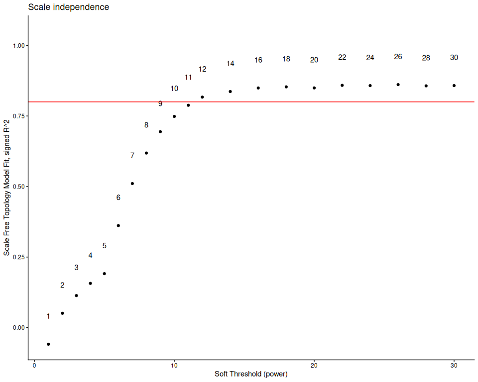
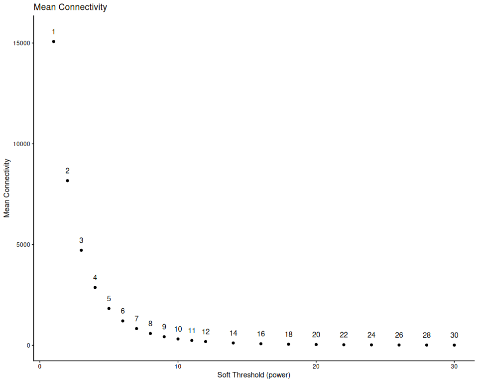

## 6. Determine parameters for WGCNA

The below takes a long time to run, so it is only run if TestParams is
set to TRUE. Otherwise, the pre-determined parameters for this species
dataset are loaded in from the species_parameters.R script. This should
be redone for any changes in data filtering and outlier removal.

``` r
if(params$TestParams == TRUE) {
  sft <- pickSoftThreshold(normalized_counts,
                           networkType = "signed",
                           RsquaredCut = 0.8,
                           powerVector = c(seq(1, 12, by = 1), seq(14, 30, by = 2)),
                           verbose=3)
  sft_df <- data.frame(sft$fitIndices) %>% dplyr::mutate(model_fit = -sign(slope) * SFT.R.sq)
  
  fit_plot <- ggplot(sft_df, aes(x = Power, y = model_fit, label = Power)) +
    geom_point() +
    geom_text(nudge_y = 0.1) +
    # We will plot what WGCNA recommends as an R^2 cutoff
    geom_hline(yintercept = 0.80, col = "red") +
    ylim(c(min(sft_df$model_fit), 1.05)) +
    xlab("Soft Threshold (power)") +
    ylab("Scale Free Topology Model Fit, signed R^2") +
    ggtitle("Scale independence") +
    theme_classic()
  
  print(fit_plot)
  
  mean_plot <- ggplot(sft_df, aes(x = Power, y = mean.k., label = Power)) +
    geom_point() +
    geom_text(nudge_y = 500) +
    xlab("Soft Threshold (power)") +
    ylab("Mean Connectivity") +
    ggtitle("Mean Connectivity") +
    theme_classic()
  
  print(mean_plot)
  
  soft_power = sft$powerEstimate
  
  if (is.na(sft$powerEstimate)) {
    stop("Soft power could not be automatically determined. Potenitally test a greater range of powers.")
}
  
  if (soft_power != config$soft_power) {
    warning(paste0(" Calculated power (" , sft$powerEstimate, 
                  ") differs from config value (", config$soft_power,"). Consider updating species_parameters.R with new value. Examine graph and confirm if the calculated power matches visual examination of the data."))
  }
  
} else {
  soft_power = config$soft_power
}
```

    ## pickSoftThreshold: will use block size 1486.
    ##  pickSoftThreshold: calculating connectivity for given powers...
    ##    ..working on genes 1 through 1486 of 30089
    ##    ..working on genes 1487 through 2972 of 30089
    ##    ..working on genes 2973 through 4458 of 30089
    ##    ..working on genes 4459 through 5944 of 30089
    ##    ..working on genes 5945 through 7430 of 30089
    ##    ..working on genes 7431 through 8916 of 30089
    ##    ..working on genes 8917 through 10402 of 30089
    ##    ..working on genes 10403 through 11888 of 30089
    ##    ..working on genes 11889 through 13374 of 30089
    ##    ..working on genes 13375 through 14860 of 30089
    ##    ..working on genes 14861 through 16346 of 30089
    ##    ..working on genes 16347 through 17832 of 30089
    ##    ..working on genes 17833 through 19318 of 30089
    ##    ..working on genes 19319 through 20804 of 30089
    ##    ..working on genes 20805 through 22290 of 30089
    ##    ..working on genes 22291 through 23776 of 30089
    ##    ..working on genes 23777 through 25262 of 30089
    ##    ..working on genes 25263 through 26748 of 30089
    ##    ..working on genes 26749 through 28234 of 30089
    ##    ..working on genes 28235 through 29720 of 30089
    ##    ..working on genes 29721 through 30089 of 30089
    ##    Power SFT.R.sq slope truncated.R.sq mean.k. median.k. max.k.
    ## 1      1   0.0590 15.50          0.906 15100.0  15100.00  15600
    ## 2      2   0.0507 -5.23          0.897  8170.0   8150.00   9290
    ## 3      3   0.1130 -3.67          0.929  4720.0   4680.00   6070
    ## 4      4   0.1570 -2.52          0.930  2870.0   2820.00   4210
    ## 5      5   0.1910 -1.69          0.930  1830.0   1780.00   3050
    ## 6      6   0.3610 -1.95          0.952  1210.0   1160.00   2390
    ## 7      7   0.5110 -2.06          0.972   830.0    776.00   1950
    ## 8      8   0.6190 -2.11          0.982   587.0    534.00   1630
    ## 9      9   0.6940 -2.14          0.986   426.0    376.00   1390
    ## 10    10   0.7480 -2.16          0.986   317.0    270.00   1200
    ## 11    11   0.7880 -2.18          0.988   240.0    197.00   1050
    ## 12    12   0.8170 -2.18          0.989   186.0    146.00    925
    ## 13    14   0.8370 -2.22          0.981   117.0     83.40    736
    ## 14    16   0.8490 -2.22          0.979    77.5     49.60    599
    ## 15    18   0.8530 -2.20          0.977    53.6     30.50    496
    ## 16    20   0.8490 -2.19          0.974    38.5     19.40    417
    ## 17    22   0.8590 -2.15          0.981    28.4     12.60    354
    ## 18    24   0.8580 -2.14          0.982    21.5      8.37    304
    ## 19    26   0.8610 -2.11          0.985    16.7      5.71    263
    ## 20    28   0.8570 -2.10          0.985    13.1      3.96    228
    ## 21    30   0.8580 -2.07          0.986    10.5      2.79    200

<!-- --><!-- -->

``` r
cat("Soft Power for WGCNA:", soft_power)
```

    ## Soft Power for WGCNA: 12

## 7. WGCNA: One-step module detection

``` r
if(params$run_WGCNA == TRUE) {
  temp_cor <- cor
  cor <- WGCNA::cor # Force it to use WGCNA cor function (fix a namespace conflict issue)
  netwk <- blockwiseModules(normalized_counts,
                            nThreads = global_params$n_cores,
  
                            # Adjacency Function
                            power = soft_power,
                            corType = "bicor",
                            networkType = "signed",
                            TOMType = "signed",
  
                            # Tree and Block Options
                            deepSplit = global_params$wgcna_default$deep_split,
                            pamRespectsDendro = F,
                            minModuleSize = global_params$wgcna_default$min_module_size,
                            maxBlockSize = 50000,
  
                            # topological overlap matrix, (TOM)
                            saveTOMs = TRUE,
                            saveTOMFileBase = file.path(outdir, "blockwiseTOM"),
                            #loadTOM = FALSE, #uncomment this if you are re-running with a previously saved TOM
  
                            # Output Options
                            mergeCutHeight = global_params$wgcna_default$merge_cut_height,
                            numericLabels = TRUE,
                            verbose = 3)
  
  cor <- temp_cor     # Return cor function to original namespace
  saveRDS(netwk, file.path(outdir, "wgcna_network.rds"))
}
```

    ##  Calculating module eigengenes block-wise from all genes
    ##    Flagging genes and samples with too many missing values...
    ##     ..step 1
    ##  ..Working on block 1 .
    ##     TOM calculation: adjacency..
    ##     ..will use 18 parallel threads.
    ##      Fraction of slow calculations: 0.000000
    ##     ..connectivity..
    ##     ..matrix multiplication (system BLAS)..
    ##     ..normalization..
    ##     ..done.
    ##    ..saving TOM for block 1 into file ../../output_RNA/WGCNA/Mcap/blockwiseTOM-block.1.RData
    ##  ....clustering..
    ##  ....detecting modules..
    ##  ....calculating module eigengenes..
    ##  ....checking kME in modules..

    ## Warning in bicor(structure(c(9.0531191274072, 8.89746590091673,
    ## 9.22942056564533, : bicor: zero MAD in variable 'x'. Pearson correlation was
    ## used for individual columns with zero (or missing) MAD.

    ##      ..removing 557 genes from module 1 because their KME is too low.

    ## Warning in bicor(structure(c(6.12701089513297, 5.90496769146896,
    ## 5.90496769146896, : bicor: zero MAD in variable 'x'. Pearson correlation was
    ## used for individual columns with zero (or missing) MAD.

    ##      ..removing 383 genes from module 2 because their KME is too low.

    ## Warning in bicor(structure(c(8.24936260967612, 8.3938514146887,
    ## 8.18401684720398, : bicor: zero MAD in variable 'x'. Pearson correlation was
    ## used for individual columns with zero (or missing) MAD.

    ##      ..removing 180 genes from module 3 because their KME is too low.

    ## Warning in bicor(structure(c(8.19446907597619, 8.3891623599347,
    ## 8.16939921757664, : bicor: zero MAD in variable 'x'. Pearson correlation was
    ## used for individual columns with zero (or missing) MAD.

    ##      ..removing 407 genes from module 4 because their KME is too low.

    ## Warning in bicor(structure(c(8.64575627250057, 8.5733875032157,
    ## 9.15721286011817, : bicor: zero MAD in variable 'x'. Pearson correlation was
    ## used for individual columns with zero (or missing) MAD.

    ##      ..removing 295 genes from module 5 because their KME is too low.

    ## Warning in bicor(structure(c(9.24656656831556, 9.88015583780468,
    ## 9.72471803424119, : bicor: zero MAD in variable 'x'. Pearson correlation was
    ## used for individual columns with zero (or missing) MAD.

    ##      ..removing 38 genes from module 6 because their KME is too low.

    ## Warning in bicor(structure(c(9.06351339957659, 9.14949640678298,
    ## 8.94896747291449, : bicor: zero MAD in variable 'x'. Pearson correlation was
    ## used for individual columns with zero (or missing) MAD.

    ##      ..removing 849 genes from module 7 because their KME is too low.

    ## Warning in bicor(structure(c(9.46040546086171, 9.89630729538516,
    ## 9.71506804854999, : bicor: zero MAD in variable 'x'. Pearson correlation was
    ## used for individual columns with zero (or missing) MAD.

    ##      ..removing 25 genes from module 8 because their KME is too low.

    ## Warning in bicor(structure(c(5.90496769146896, 5.90496769146896,
    ## 5.90496769146896, : bicor: zero MAD in variable 'x'. Pearson correlation was
    ## used for individual columns with zero (or missing) MAD.

    ##      ..removing 174 genes from module 9 because their KME is too low.

    ## Warning in bicor(structure(c(11.3948150567001, 12.1200843979072,
    ## 11.0181758073826, : bicor: zero MAD in variable 'x'. Pearson correlation was
    ## used for individual columns with zero (or missing) MAD.

    ##      ..removing 12 genes from module 10 because their KME is too low.

    ## Warning in bicor(structure(c(7.50890669209849, 7.22648192248436,
    ## 7.60704143029751, : bicor: zero MAD in variable 'x'. Pearson correlation was
    ## used for individual columns with zero (or missing) MAD.

    ##      ..removing 78 genes from module 11 because their KME is too low.

    ## Warning in bicor(structure(c(6.26697028780423, 6.28702369160254,
    ## 6.26454001688764, : bicor: zero MAD in variable 'x'. Pearson correlation was
    ## used for individual columns with zero (or missing) MAD.

    ##      ..removing 584 genes from module 12 because their KME is too low.

    ## Warning in bicor(structure(c(10.775077972594, 10.6946136078047,
    ## 10.9583413493317, : bicor: zero MAD in variable 'x'. Pearson correlation was
    ## used for individual columns with zero (or missing) MAD.

    ##      ..removing 430 genes from module 13 because their KME is too low.

    ## Warning in bicor(structure(c(8.53106798683582, 8.71000641655096,
    ## 9.02449266723429, : bicor: zero MAD in variable 'x'. Pearson correlation was
    ## used for individual columns with zero (or missing) MAD.

    ##      ..removing 28 genes from module 14 because their KME is too low.

    ## Warning in bicor(structure(c(8.32658948217675, 8.54435751901228,
    ## 8.3088163611469, : bicor: zero MAD in variable 'x'. Pearson correlation was
    ## used for individual columns with zero (or missing) MAD.

    ##      ..removing 9 genes from module 15 because their KME is too low.

    ## Warning in bicor(structure(c(9.44862191938304, 9.43159225225788,
    ## 9.45367381364004, : bicor: zero MAD in variable 'x'. Pearson correlation was
    ## used for individual columns with zero (or missing) MAD.

    ##      ..removing 19 genes from module 16 because their KME is too low.

    ## Warning in bicor(structure(c(6.80663243068169, 5.90496769146896,
    ## 6.91940759337699, : bicor: zero MAD in variable 'x'. Pearson correlation was
    ## used for individual columns with zero (or missing) MAD.

    ## Warning in bicor(structure(c(9.64022425643969, 9.41818259998363,
    ## 9.60088323398442, : bicor: zero MAD in variable 'x'. Pearson correlation was
    ## used for individual columns with zero (or missing) MAD.

    ##      ..removing 12 genes from module 18 because their KME is too low.
    ##      ..removing 1 genes from module 19 because their KME is too low.

    ## Warning in bicor(structure(c(9.30558038846011, 9.38639218280216,
    ## 9.19726681616688, : bicor: zero MAD in variable 'x'. Pearson correlation was
    ## used for individual columns with zero (or missing) MAD.

    ##      ..removing 3 genes from module 20 because their KME is too low.

    ## Warning in bicor(structure(c(6.3290394668051, 6.44372075732232,
    ## 6.54950148614504, : bicor: zero MAD in variable 'x'. Pearson correlation was
    ## used for individual columns with zero (or missing) MAD.

    ## Warning in bicor(structure(c(11.0271421073308, 11.3615718128169,
    ## 11.3806980807827, : bicor: zero MAD in variable 'x'. Pearson correlation was
    ## used for individual columns with zero (or missing) MAD.

    ##      ..removing 8 genes from module 22 because their KME is too low.

    ## Warning in bicor(structure(c(5.90496769146896, 5.90496769146896,
    ## 7.87374337244676, : bicor: zero MAD in variable 'x'. Pearson correlation was
    ## used for individual columns with zero (or missing) MAD.

    ## Warning in bicor(structure(c(9.97998208661925, 9.82045273958545,
    ## 10.1957536744873, : bicor: zero MAD in variable 'x'. Pearson correlation was
    ## used for individual columns with zero (or missing) MAD.

    ##      ..removing 10 genes from module 24 because their KME is too low.

    ## Warning in bicor(structure(c(10.86262343155, 10.723790349406, 10.8658262725865,
    ## : bicor: zero MAD in variable 'x'. Pearson correlation was used for individual
    ## columns with zero (or missing) MAD.

    ##      ..removing 6 genes from module 25 because their KME is too low.

    ## Warning in bicor(structure(c(8.50422502953337, 8.67233277320595,
    ## 8.76562835133261, : bicor: zero MAD in variable 'x'. Pearson correlation was
    ## used for individual columns with zero (or missing) MAD.

    ##      ..removing 4 genes from module 26 because their KME is too low.
    ##      ..removing 4 genes from module 27 because their KME is too low.

    ## Warning in bicor(structure(c(8.75001656776037, 8.75749846472932,
    ## 8.74653488107404, : bicor: zero MAD in variable 'x'. Pearson correlation was
    ## used for individual columns with zero (or missing) MAD.

    ##      ..removing 2 genes from module 28 because their KME is too low.

    ## Warning in bicor(structure(c(9.78594883016906, 9.54485487797686,
    ## 9.75171085422629, : bicor: zero MAD in variable 'x'. Pearson correlation was
    ## used for individual columns with zero (or missing) MAD.

    ##      ..removing 5 genes from module 29 because their KME is too low.

    ## Warning in bicor(structure(c(11.1366833586935, 11.1576721566846,
    ## 11.0924201695946, : bicor: zero MAD in variable 'x'. Pearson correlation was
    ## used for individual columns with zero (or missing) MAD.

    ##      ..removing 6 genes from module 30 because their KME is too low.

    ## Warning in bicor(structure(c(12.1388465569249, 12.4986967546845,
    ## 12.3822254878985, : bicor: zero MAD in variable 'x'. Pearson correlation was
    ## used for individual columns with zero (or missing) MAD.

    ##      ..removing 1 genes from module 31 because their KME is too low.

    ## Warning in bicor(structure(c(6.9765582429419, 6.94876193751665,
    ## 6.72009978996958, : bicor: zero MAD in variable 'x'. Pearson correlation was
    ## used for individual columns with zero (or missing) MAD.

    ## Warning in bicor(structure(c(8.58505212382017, 8.3315865488831,
    ## 7.99686065769037, : bicor: zero MAD in variable 'x'. Pearson correlation was
    ## used for individual columns with zero (or missing) MAD.

    ## Warning in bicor(structure(c(5.90496769146896, 5.90496769146896,
    ## 6.37972422726607, : bicor: zero MAD in variable 'x'. Pearson correlation was
    ## used for individual columns with zero (or missing) MAD.

    ##      ..removing 3 genes from module 35 because their KME is too low.
    ##      ..removing 3 genes from module 37 because their KME is too low.

    ## Warning in bicor(structure(c(7.35594527552579, 7.20195477457915,
    ## 7.11776155285661, : bicor: zero MAD in variable 'x'. Pearson correlation was
    ## used for individual columns with zero (or missing) MAD.

    ##      ..removing 1 genes from module 39 because their KME is too low.

    ## Warning in bicor(structure(c(6.71591891084191, 6.80892531534689,
    ## 6.61867504230802, : bicor: zero MAD in variable 'x'. Pearson correlation was
    ## used for individual columns with zero (or missing) MAD.

    ##      ..removing 3 genes from module 41 because their KME is too low.

    ## Warning in bicor(structure(c(8.33538971549512, 9.13036453764562,
    ## 6.57341321127676, : bicor: zero MAD in variable 'x'. Pearson correlation was
    ## used for individual columns with zero (or missing) MAD.

    ## Warning in bicor(structure(c(8.81798223168546, 7.63674247222887,
    ## 7.92205333766859, : bicor: zero MAD in variable 'x'. Pearson correlation was
    ## used for individual columns with zero (or missing) MAD.

    ##      ..removing 19 genes from module 44 because their KME is too low.

    ## Warning in bicor(structure(c(7.37978516860328, 7.30809068720828,
    ## 7.92205333766859, : bicor: zero MAD in variable 'x'. Pearson correlation was
    ## used for individual columns with zero (or missing) MAD.

    ##      ..removing 12 genes from module 46 because their KME is too low.

    ## Warning in bicor(structure(c(10.4946816571374, 10.4491476647609,
    ## 10.2254388275149, : bicor: zero MAD in variable 'x'. Pearson correlation was
    ## used for individual columns with zero (or missing) MAD.

    ## Warning in bicor(structure(c(9.15861115165329, 9.02468240289078,
    ## 9.52549853413775, : bicor: zero MAD in variable 'x'. Pearson correlation was
    ## used for individual columns with zero (or missing) MAD.

    ## Warning in (function (x, y = NULL, robustX = TRUE, robustY = TRUE, use =
    ## "all.obs", : bicor: zero MAD in variable 'x'. Pearson correlation was used for
    ## individual columns with zero (or missing) MAD.

    ##   ..reassigning 37 genes from module 1 to modules with higher KME.
    ##   ..reassigning 26 genes from module 2 to modules with higher KME.
    ##   ..reassigning 56 genes from module 3 to modules with higher KME.
    ##   ..reassigning 29 genes from module 4 to modules with higher KME.
    ##   ..reassigning 14 genes from module 5 to modules with higher KME.
    ##   ..reassigning 12 genes from module 6 to modules with higher KME.
    ##   ..reassigning 15 genes from module 7 to modules with higher KME.
    ##   ..reassigning 1 genes from module 8 to modules with higher KME.
    ##   ..reassigning 15 genes from module 9 to modules with higher KME.
    ##   ..reassigning 3 genes from module 10 to modules with higher KME.
    ##   ..reassigning 1 genes from module 11 to modules with higher KME.
    ##   ..reassigning 1 genes from module 12 to modules with higher KME.
    ##   ..reassigning 25 genes from module 13 to modules with higher KME.
    ##   ..reassigning 3 genes from module 15 to modules with higher KME.
    ##   ..reassigning 1 genes from module 17 to modules with higher KME.
    ##   ..reassigning 2 genes from module 18 to modules with higher KME.
    ##   ..reassigning 6 genes from module 19 to modules with higher KME.
    ##   ..reassigning 2 genes from module 20 to modules with higher KME.
    ##   ..reassigning 7 genes from module 21 to modules with higher KME.
    ##   ..reassigning 3 genes from module 23 to modules with higher KME.
    ##   ..reassigning 1 genes from module 24 to modules with higher KME.
    ##   ..reassigning 1 genes from module 25 to modules with higher KME.
    ##   ..reassigning 1 genes from module 27 to modules with higher KME.
    ##   ..reassigning 1 genes from module 30 to modules with higher KME.
    ##   ..reassigning 3 genes from module 42 to modules with higher KME.
    ##  ..merging modules that are too close..
    ##      mergeCloseModules: Merging modules whose distance is less than 0.25
    ##        Calculating new MEs...
