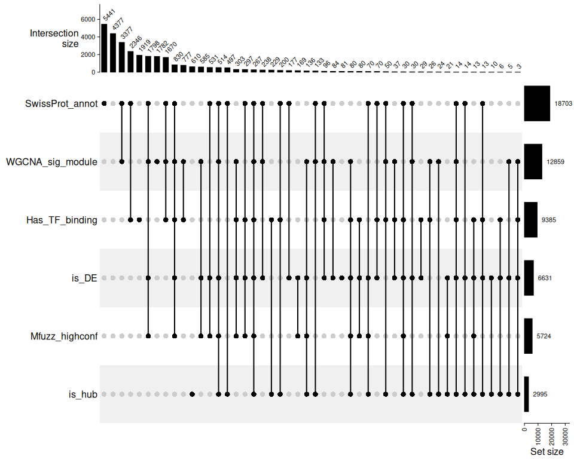
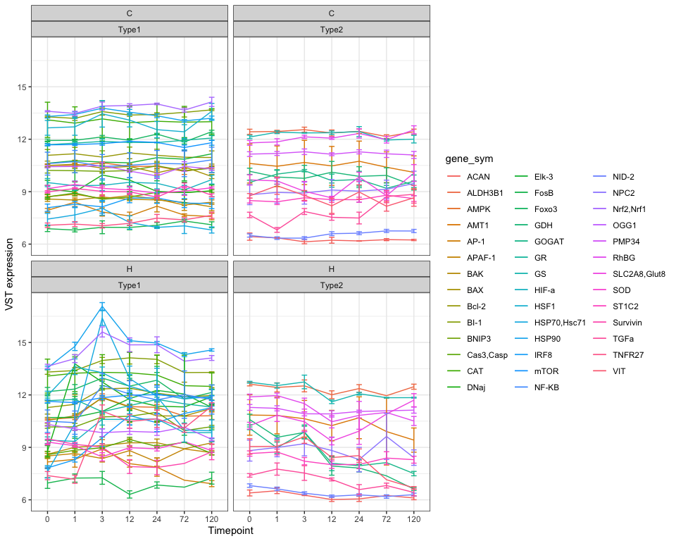
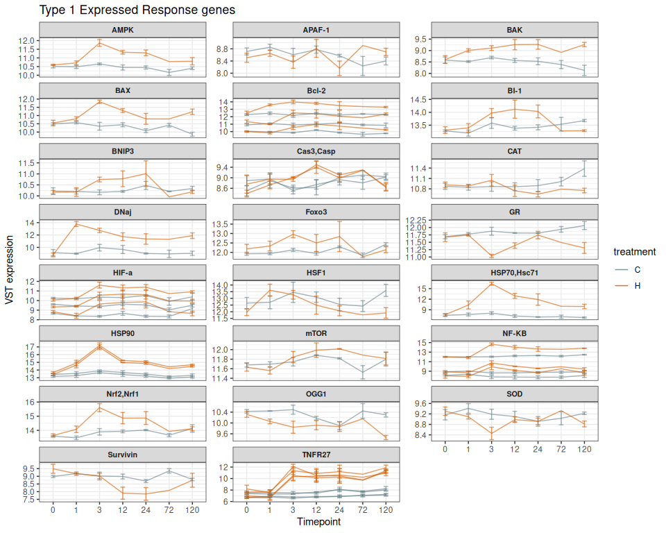
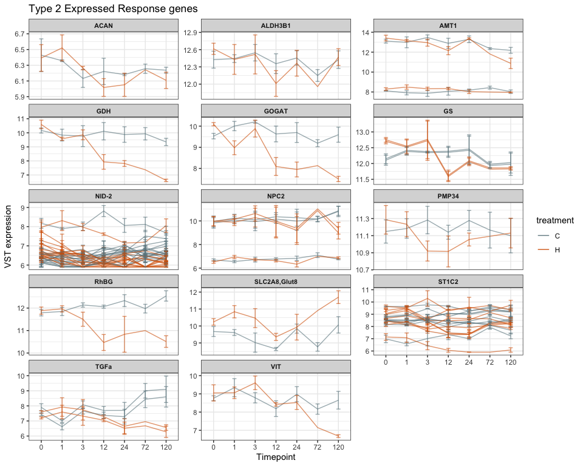
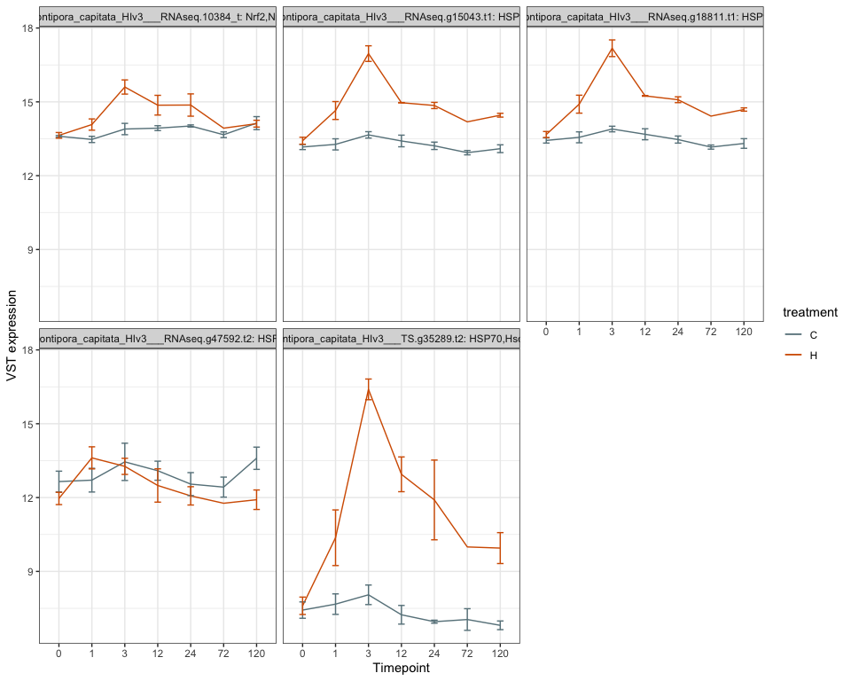
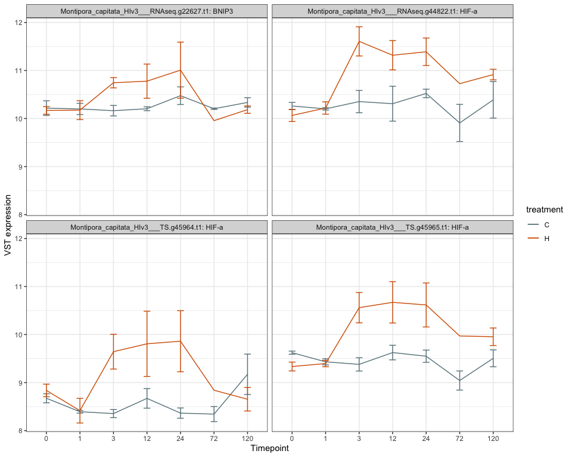
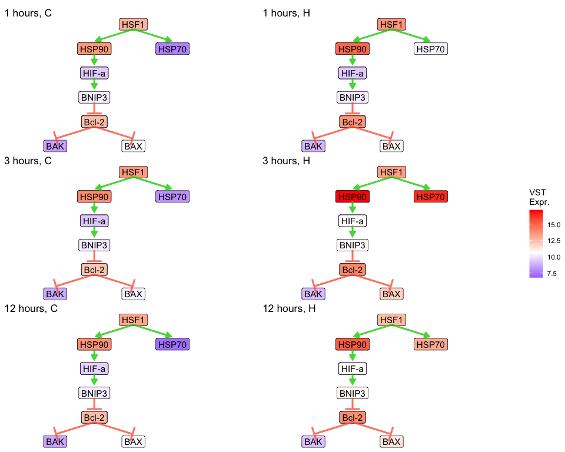
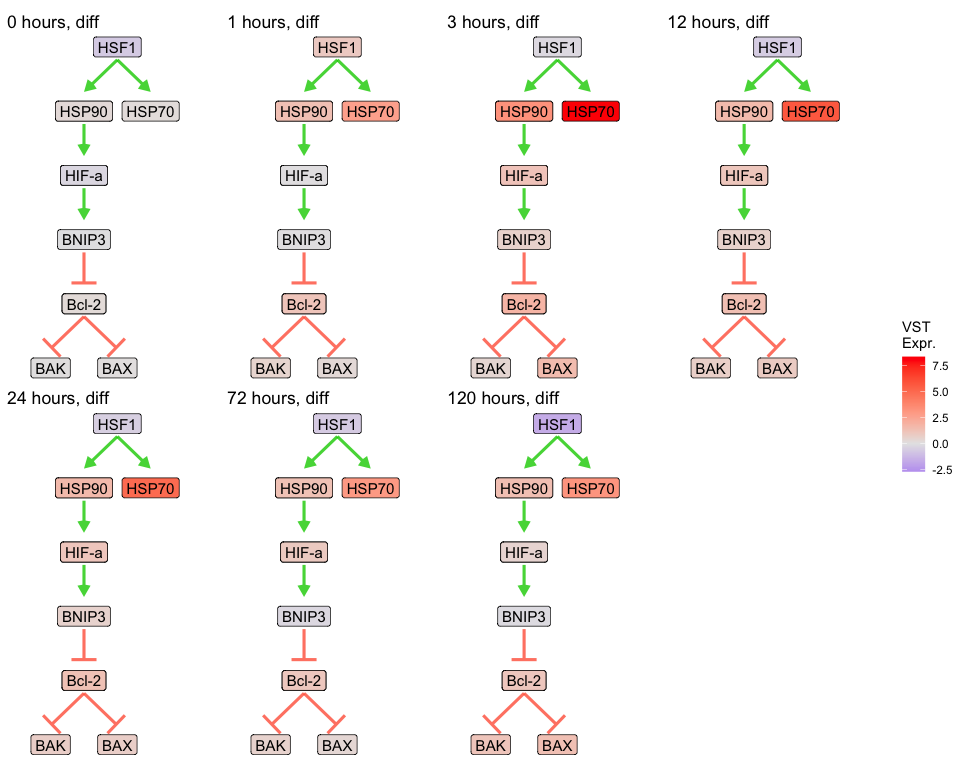

Integrate across analyses
================
Zoe Dellaert
2026-07-01

- [Analysis of Time Series bulk RNA-seq data: Combine results from all
  analyses](#analysis-of-time-series-bulk-rna-seq-data-combine-results-from-all-analyses)
  - [1. Load packages and functions](#1-load-packages-and-functions)
  - [2. Setup species-specific parameters and define
    directories](#2-setup-species-specific-parameters-and-define-directories)
  - [3. Load in metadata, filtered counts, transformed counts, and
    expression results (ImpuseDE, Mfuzz, WGCNA, TFBS) and SwissProt
    annotations](#3-load-in-metadata-filtered-counts-transformed-counts-and-expression-results-impusede-mfuzz-wgcna-tfbs-and-swissprot-annotations)
  - [4. Combine results across
    analyses](#4-combine-results-across-analyses)
  - [5. Visualize comparisons and overlaps across
    analyses](#5-visualize-comparisons-and-overlaps-across-analyses)
    - [Summary table](#summary-table)
    - [Visualize overlaps with upset
      plot](#visualize-overlaps-with-upset-plot)
  - [6. Save results](#6-save-results)
  - [7. Heat stress genes](#7-heat-stress-genes)
    - [heat stress genes stats](#heat-stress-genes-stats)
    - [Summary table](#summary-table-1)
  - [8. Pathway visualization](#8-pathway-visualization)
    - [Set up pathway](#set-up-pathway)

# Analysis of Time Series bulk RNA-seq data: Combine results from all analyses

## 1. Load packages and functions

``` r
# set up file paths so that Rmd outputs can be viewed using github markdown
knitr::opts_knit$set(base.dir = normalizePath(paste0("../../output_RNA/reports/", params$species, "/")), base.url = "./")

knitr::opts_chunk$set(echo = TRUE, message = FALSE, fig.width = 10, fig.height = 8,
                      fig.path = "05_Integration_files/figure-gfm/")

#load packages
library(tidyverse)
library(knitr)
library(ComplexHeatmap)
```

    ## Warning: package 'ComplexHeatmap' was built under R version 4.5.2

    ## ========================================
    ## ComplexHeatmap version 2.26.1
    ## Bioconductor page: http://bioconductor.org/packages/ComplexHeatmap/
    ## Github page: https://github.com/jokergoo/ComplexHeatmap
    ## Documentation: http://jokergoo.github.io/ComplexHeatmap-reference
    ## 
    ## If you use it in published research, please cite either one:
    ## - Gu, Z. Complex Heatmap Visualization. iMeta 2022.
    ## - Gu, Z. Complex heatmaps reveal patterns and correlations in multidimensional 
    ##     genomic data. Bioinformatics 2016.
    ## 
    ## 
    ## The new InteractiveComplexHeatmap package can directly export static 
    ## complex heatmaps into an interactive Shiny app with zero effort. Have a try!
    ## 
    ## This message can be suppressed by:
    ##   suppressPackageStartupMessages(library(ComplexHeatmap))
    ## ========================================

``` r
library(igraph)
```

    ## 
    ## Attaching package: 'igraph'

    ## The following object is masked from 'package:DynDoc':
    ## 
    ##     path

    ## The following object is masked from 'package:GenomicRanges':
    ## 
    ##     union

    ## The following object is masked from 'package:IRanges':
    ## 
    ##     union

    ## The following object is masked from 'package:S4Vectors':
    ## 
    ##     union

    ## The following objects are masked from 'package:BiocGenerics':
    ## 
    ##     normalize, path, union

    ## The following objects are masked from 'package:generics':
    ## 
    ##     components, union

    ## The following objects are masked from 'package:lubridate':
    ## 
    ##     %--%, union

    ## The following objects are masked from 'package:dplyr':
    ## 
    ##     as_data_frame, groups, union

    ## The following objects are masked from 'package:purrr':
    ## 
    ##     compose, simplify

    ## The following object is masked from 'package:tidyr':
    ## 
    ##     crossing

    ## The following object is masked from 'package:tibble':
    ## 
    ##     as_data_frame

    ## The following objects are masked from 'package:stats':
    ## 
    ##     decompose, spectrum

    ## The following object is masked from 'package:base':
    ## 
    ##     union

``` r
library(ggraph)
library(ggarrow)
```

    ## Overwriting method merge_element(<ggarrow::element_arrow>, <ANY>)

``` r
library(patchwork)

#load in parameters and functions
source("species_parameters.R")
source("utils.R")

sessionInfo() #provides list of loaded packages and version of R
```

    ## R version 4.5.1 (2025-06-13)
    ## Platform: x86_64-apple-darwin20
    ## Running under: macOS Tahoe 26.4.1
    ## 
    ## Matrix products: default
    ## BLAS:   /Library/Frameworks/R.framework/Versions/4.5-x86_64/Resources/lib/libRblas.0.dylib 
    ## LAPACK: /Library/Frameworks/R.framework/Versions/4.5-x86_64/Resources/lib/libRlapack.dylib;  LAPACK version 3.12.1
    ## 
    ## locale:
    ## [1] en_US.UTF-8/en_US.UTF-8/en_US.UTF-8/C/en_US.UTF-8/en_US.UTF-8
    ## 
    ## time zone: America/New_York
    ## tzcode source: internal
    ## 
    ## attached base packages:
    ##  [1] tcltk     grid      stats4    stats     graphics  grDevices utils    
    ##  [8] datasets  methods   base     
    ## 
    ## other attached packages:
    ##  [1] patchwork_1.3.2             ggarrow_0.1.1              
    ##  [3] ggraph_2.2.2                igraph_2.3.3               
    ##  [5] ComplexHeatmap_2.26.1       knitr_1.51                 
    ##  [7] fastcluster_1.3.0           dynamicTreeCut_1.63-1      
    ##  [9] DynDoc_1.88.0               widgetTools_1.88.0         
    ## [11] e1071_1.7-17                BiocParallel_1.44.0        
    ## [13] ggnewscale_0.5.2            RColorBrewer_1.1-3         
    ## [15] SummarizedExperiment_1.40.0 Biobase_2.70.0             
    ## [17] MatrixGenerics_1.22.0       matrixStats_1.5.0          
    ## [19] GenomicRanges_1.62.1        Seqinfo_1.0.0              
    ## [21] IRanges_2.44.0              S4Vectors_0.48.1           
    ## [23] BiocGenerics_0.56.0         generics_0.1.4             
    ## [25] lubridate_1.9.5             forcats_1.0.1              
    ## [27] stringr_1.6.0               dplyr_1.2.1                
    ## [29] purrr_1.2.2                 readr_2.2.0                
    ## [31] tidyr_1.3.2                 tibble_3.3.1               
    ## [33] ggplot2_4.0.3               tidyverse_2.0.0            
    ## [35] rmarkdown_2.31             
    ## 
    ## loaded via a namespace (and not attached):
    ##   [1] rstudioapi_0.19.0     shape_1.4.6.1         magrittr_2.0.5       
    ##   [4] farver_2.1.2          GlobalOptions_0.1.4   ragg_1.5.2           
    ##   [7] vctrs_0.7.3           memoise_2.0.1         base64enc_0.1-6      
    ##  [10] htmltools_0.5.9       S4Arrays_1.10.1       SparseArray_1.10.10  
    ##  [13] Formula_1.2-5         htmlwidgets_1.6.4     impute_1.84.0        
    ##  [16] cachem_1.1.0          lifecycle_1.0.5       iterators_1.0.14     
    ##  [19] pkgconfig_2.0.3       Matrix_1.7-5          R6_2.6.1             
    ##  [22] fastmap_1.2.0         clue_0.3-68           digest_0.6.39        
    ##  [25] colorspace_2.1-2      AnnotationDbi_1.72.0  DESeq2_1.50.2        
    ##  [28] textshaping_1.0.5     Hmisc_5.2-6           RSQLite_3.53.2       
    ##  [31] labeling_0.4.3        timechange_0.4.0      mgcv_1.9-4           
    ##  [34] polyclip_1.10-7       httr_1.4.8            abind_1.4-8          
    ##  [37] compiler_4.5.1        proxy_0.4-29          bit64_4.8.2          
    ##  [40] withr_3.0.3           doParallel_1.0.17     htmlTable_2.5.0      
    ##  [43] S7_0.2.2              backports_1.5.1       viridis_0.6.5        
    ##  [46] DBI_1.3.0             ggforce_0.5.0         MASS_7.3-65          
    ##  [49] tkWidgets_1.88.0      DelayedArray_0.36.1   rjson_0.2.23         
    ##  [52] tools_4.5.1           foreign_0.8-91        otel_0.2.0           
    ##  [55] nnet_7.3-20           glue_1.8.1            nlme_3.1-169         
    ##  [58] checkmate_2.3.4       cluster_2.1.8.2       gtable_0.3.6         
    ##  [61] tzdb_0.5.0            preprocessCore_1.72.0 class_7.3-23         
    ##  [64] data.table_1.18.4     hms_1.1.4             tidygraph_1.3.1      
    ##  [67] utf8_1.2.6            XVector_0.50.0        ggrepel_0.9.8        
    ##  [70] foreach_1.5.2         pillar_1.11.1         limma_3.66.0         
    ##  [73] vroom_1.7.1           circlize_0.4.18       splines_4.5.1        
    ##  [76] tweenr_2.0.3          lattice_0.22-9        survival_3.8-6       
    ##  [79] bit_4.6.0             annotate_1.88.0       tidyselect_1.2.1     
    ##  [82] locfit_1.5-9.12       Biostrings_2.78.0     gridExtra_2.3.1      
    ##  [85] xfun_0.59             graphlayouts_1.2.4    statmod_1.5.2        
    ##  [88] stringi_1.8.7         yaml_2.3.12           evaluate_1.0.5       
    ##  [91] codetools_0.2-20      cli_3.6.6             rpart_4.1.27         
    ##  [94] xtable_1.8-8          systemfonts_1.3.2     Rcpp_1.1.1-1.1       
    ##  [97] png_0.1-9             XML_3.99-0.23         parallel_4.5.1       
    ## [100] blob_1.3.0            viridisLite_0.4.3     scales_1.4.0         
    ## [103] crayon_1.5.3          GetoptLong_1.1.1      rlang_1.2.0          
    ## [106] cowplot_1.2.0         KEGGREST_1.50.0

## 2. Setup species-specific parameters and define directories

``` r
# get species
species <- params$species

# get parameters for this species
config <- get_params(species)
print_config(species)
```

    ## Species: Mcap
    ## Count matrix: MON_MCapV3_gene_count_matrix.csv
    ## Outliers: MON_R72_H1, MON_R72_H2
    ## WGCNA power: 12
    ## Mfuzz clusters: 6

``` r
# define preprocessing and analysis output directories (from 01_preprocessing.Rmd, 02_ImpulseDE2.Rmd, 03_WGCNA.Rmd, & 04_TFBS.Rmd)
input_dir <- file.path("../../output_RNA/counts_filt_norm", species)
impulse_dir <- file.path("../../output_RNA/ImpulseDE2", species)
mfuzz_dir <- file.path(impulse_dir, "Mfuzz")
wgcna_dir <- file.path("../../output_RNA/WGCNA", species)
tfbs_dir <- file.path("../../output_RNA/TFBS", species)

# set up necessary output directories if they don't exist
outdir <- file.path("../../output_RNA/analysis_integration", species)
outdir_plots <- file.path(outdir,"plots")
if (!dir.exists(outdir)) dir.create(outdir, recursive = TRUE)
if (!dir.exists(outdir_plots)) dir.create(outdir_plots, recursive = TRUE)

reportdir <- file.path("../../output_RNA/reports", params$species, "05_Integration_files/figure-gfm/")
if (!dir.exists(reportdir)) dir.create(reportdir, recursive = TRUE)
```

## 3. Load in metadata, filtered counts, transformed counts, and expression results (ImpuseDE, Mfuzz, WGCNA, TFBS) and SwissProt annotations

``` r
# load in species metadata
meta <- read.csv(paste0("../../output_RNA/",species,"_RNA_seq_metadata.csv"), row.names = 1)

# load in filtered counts data
filtered_counts <- read.csv(file.path(input_dir, "filtered_counts.csv"), row.names = 1)
all_genes <- rownames(filtered_counts)

# load in transformed counts data
vst_counts <- read.csv(file.path(input_dir, "vst_expression_matrix.csv"), row.names = 1)

# ImpulseDE2 results
impulse_results <- read.csv(file.path(impulse_dir, "ImpulseDE2_results.csv"))
impulse_sig <- impulse_results %>%
  filter(padj < global_params$padj_threshold)

# Mfuzz cluster assignments
mfuzz_clusters <- read.csv(file.path(mfuzz_dir, "cluster_assignments.csv"))
mfuzz_clusters_mem50 <- mfuzz_clusters %>% filter(membership > 0.5)

# WGCNA module assignments
wgcna_modules <- read.csv(file.path(wgcna_dir, "gene_modules.csv"))
hub_genes <- read.csv(file.path(wgcna_dir, "hub_genes.csv"))

# Module interaction stats (to ID significant modules)
module_stats <- read.csv(file.path(wgcna_dir, "module_interaction_stats.csv"))
sig_modules <- module_stats %>% filter(adj.P.Val < 0.05) %>% pull(module)

# TFBS Count data
tfbs <- read.csv(file.path(tfbs_dir, "TFBS_counts.csv"))

cat("Number of genes after filtering: ", nrow(filtered_counts), "\n")
```

    ## Number of genes after filtering:  30089

``` r
cat("ImpulseDE2 significant genes:", nrow(impulse_sig), "\n")
```

    ## ImpulseDE2 significant genes: 6631

``` r
cat("Mfuzz clustered genes:", nrow(mfuzz_clusters), "\n")
```

    ## Mfuzz clustered genes: 6631

``` r
cat("Mfuzz clustered genes with membership > 0.5:", nrow(mfuzz_clusters_mem50), "\n")
```

    ## Mfuzz clustered genes with membership > 0.5: 5724

``` r
cat("WGCNA modules:", n_distinct(wgcna_modules$module), "\n")
```

    ## WGCNA modules: 32

``` r
cat("Significant modules (treatment*time):", length(sig_modules), "\n")
```

    ## Significant modules (treatment*time): 12

``` r
cat("Genes with putative HSF1, FOXO3, or NRF2 transcription factor binding sites:", nrow(tfbs), "\n")
```

    ## Genes with putative HSF1, FOXO3, or NRF2 transcription factor binding sites: 9385

``` r
# SwissProt annotations
SwissProt <- read.delim(file.path(annot_dir,config$SwissProt))
cat("Annotations:", nrow(SwissProt), "Swissprot-annotated genes")
```

    ## Annotations: 22471 Swissprot-annotated genes

``` r
#loads the pattern mapping assessed by me after running ImpulseDE2 and comparing across species (see ../../output_RNA/ImpulseDE2/cluster_patterns.md)

Mfuzz_pattern_mapping <- NULL
source("../../output_RNA/ImpulseDE2/cluster_patterns.R")

Mfuzz_pattern_mapping <- pattern_mapping %>% filter(species ==  params$species) %>% dplyr::select(-species)
```

## 4. Combine results across analyses

``` r
# combine impulseDE results, Mfuzz clusters, WGCNA modules, and TFBS quantification into one master dataframe for downstream analysis and visualization

master_table <- data.frame(gene_id=all_genes) %>%
  left_join(impulse_results %>% select(Gene, padj, response_type,classification), by = join_by(gene_id == Gene)) %>%
  mutate(is_DE = padj < 0.05) %>%
  left_join(mfuzz_clusters %>% select(Gene, cluster, membership), by = join_by(gene_id == Gene)) %>%
  mutate(Mfuzz_highconf = membership > 0.5) %>%
  left_join(Mfuzz_pattern_mapping, by = "cluster") %>%
  left_join(wgcna_modules %>% select(gene_id, module,kME_own), by = "gene_id") %>%
  mutate(is_hub = gene_id %in% hub_genes$gene_id) %>% 
  left_join(tfbs, by = join_by(gene_id == sequence_name)) %>%
  mutate(across(starts_with("count_"), ~ replace_na(.x, 0))) %>%
  mutate(has_HSF1 = count_HSF1 > 0, has_FOXO3 = count_FOXO3 > 0, has_NFE2L2 = count_NFE2L2 > 0) %>% 
  left_join(SwissProt, by = join_by(gene_id == query)) %>%
  dplyr::rename(ImpulseDE2_padj = padj,
         ImpulseDE2_response_type = response_type,
         ImpulseDE2_response_class = classification,
         Mfuzz_cluster = cluster,
         Mfuzz_membership = membership,
         Mfuzz_pattern = pattern,
         WGCNA_module = module,
         SwissProt_BlastHit = blast_hit,
         SwissProt_BlastEval = evalue,
         SwissProt_ProteinName = ProteinNames)
```

## 5. Visualize comparisons and overlaps across analyses

### Summary table

``` r
summary_stats <- tibble(
  metric = c(
    "Total genes (post-filtering)",
    "SwissProt-annotated genes",
    "Differentially expressed (ImpulseDE2, padj < 0.05)",
    "DE genes temporally clustered (Mfuzz, membership > 0.5)",
    "WGCNA assigned",
    "WGCNA modules",
    "WGCNA modules Sig. by Time*Treatment",
    "Hub genes (WGCNA, top 10% kME)",
    "Hub genes also differentially expressed (ImpulseDE2)",
    "Genes with HSF1 binding sites",
    "Genes with FOXO3 binding sites",
    "Genes with NRF2/NFE2L2 binding sites"
  ),
  count = c(
    nrow(master_table),
    sum(!is.na(master_table$SwissProt_ProteinName)),
    sum(master_table$is_DE, na.rm = TRUE),
    sum(master_table$Mfuzz_highconf, na.rm = TRUE),
    sum(!is.na(master_table$WGCNA_module)),
    length(unique(master_table$WGCNA_module)),
    sum(unique(master_table$WGCNA_module) %in% sig_modules),
    sum(master_table$is_hub),
    sum(master_table$is_DE & master_table$is_hub, na.rm = TRUE),
    sum(master_table$has_HSF1),
    sum(master_table$has_FOXO3),
    sum(master_table$has_NFE2L2)
  )
)

summary_stats %>% kable(format = "markdown")
```

| metric                                                   | count |
|:---------------------------------------------------------|------:|
| Total genes (post-filtering)                             | 30089 |
| SwissProt-annotated genes                                | 18703 |
| Differentially expressed (ImpulseDE2, padj \< 0.05)      |  6631 |
| DE genes temporally clustered (Mfuzz, membership \> 0.5) |  5724 |
| WGCNA assigned                                           | 30089 |
| WGCNA modules                                            |    32 |
| WGCNA modules Sig. by Time\*Treatment                    |    12 |
| Hub genes (WGCNA, top 10% kME)                           |  2995 |
| Hub genes also differentially expressed (ImpulseDE2)     |  1226 |
| Genes with HSF1 binding sites                            |  3114 |
| Genes with FOXO3 binding sites                           |  4712 |
| Genes with NRF2/NFE2L2 binding sites                     |  2660 |

### Visualize overlaps with upset plot

First make a true/false matrix for columns of interest

- is_DE = is differentially expressed (padj \< 0.05) by ImpulseDE2
- Mfuzz_highconf = of the DE genes, these had a membership of \> 0.5 in
  their Mfuzz cluster
- WGCNA_sig_module = member of a WGCNA module that was signfiicant for
  the interaction between temperature and timepoint by limma
- is_hub = is a hub gene for its module
- Has_TF_binding = has at least one match for the searched transcription
  factor bindinf motifs (HSF1, FOXO3, or NFE2L2/NRF2)
- SwissProt_annot = has a Swissprot annotation match

``` r
overlap_matrix <- master_table %>%
  mutate(Mfuzz_highconf = replace_na(Mfuzz_highconf, FALSE),
         WGCNA_sig_module = WGCNA_module %in% sig_modules,
         Has_TF_binding = has_HSF1 | has_FOXO3 | has_NFE2L2,
         SwissProt_annot = !is.na(SwissProt_BlastHit)) %>%
  select(gene_id, is_DE, Mfuzz_highconf,
         WGCNA_sig_module, is_hub,
         Has_TF_binding, SwissProt_annot) 
```

Upset plot from ComplexHeatmap package, documentation
[here](https://github.com/jokergoo/ComplexHeatmap-reference/blob/master/book/08-upset.md)

``` r
m <- make_comb_mat(as.matrix(overlap_matrix[,-1]))

pdf(file.path(outdir_plots, "pdf_figs/analysis_overlap_upset.pdf"), width=12, height=6)
UpSet(m, 
      top_annotation = upset_top_annotation(m, add_numbers = TRUE),
      right_annotation = upset_right_annotation(m, add_numbers = TRUE),
      comb_order = order(comb_size(m), decreasing = TRUE))
dev.off()
```

    ## quartz_off_screen 
    ##                 2

``` r
png(file.path(outdir_plots, "analysis_overlap_upset.png"),width = 3000, height = 1500, res = 300)
UpSet(m, 
      top_annotation = upset_top_annotation(m, add_numbers = TRUE),
      right_annotation = upset_right_annotation(m, add_numbers = TRUE),
      comb_order = order(comb_size(m), decreasing = TRUE))
dev.off()
```

    ## quartz_off_screen 
    ##                 2

``` r
UpSet(m, 
      top_annotation = upset_top_annotation(m, add_numbers = TRUE),
      right_annotation = upset_right_annotation(m, add_numbers = TRUE),
      comb_order = order(comb_size(m), decreasing = TRUE))
```

<!-- -->

``` r
# Fisher's exact test: DE vs TF binding
contingency_DE_TF <- table(
  DE = overlap_matrix$is_DE,
  TF = overlap_matrix$Has_TF_binding)

fisher.test(contingency_DE_TF)
```

    ## 
    ##  Fisher's Exact Test for Count Data
    ## 
    ## data:  contingency_DE_TF
    ## p-value = 0.002816
    ## alternative hypothesis: true odds ratio is not equal to 1
    ## 95 percent confidence interval:
    ##  1.030685 1.159242
    ## sample estimates:
    ## odds ratio 
    ##   1.093166

``` r
# DE vs Hub genes  
contingency_DE_Hub <- table(
  DE = overlap_matrix$is_DE,
  Hub = overlap_matrix$is_hub)

fisher.test(contingency_DE_Hub)
```

    ## 
    ##  Fisher's Exact Test for Count Data
    ## 
    ## data:  contingency_DE_Hub
    ## p-value < 2.2e-16
    ## alternative hypothesis: true odds ratio is not equal to 1
    ## 95 percent confidence interval:
    ##  2.568198 3.010778
    ## sample estimates:
    ## odds ratio 
    ##   2.780903

``` r
# DE vs Significant module
contingency_DE_SigMod <- table(
  DE = overlap_matrix$is_DE,
  SigModule = overlap_matrix$WGCNA_sig_module)

fisher.test(contingency_DE_SigMod)
```

    ## 
    ##  Fisher's Exact Test for Count Data
    ## 
    ## data:  contingency_DE_SigMod
    ## p-value < 2.2e-16
    ## alternative hypothesis: true odds ratio is not equal to 1
    ## 95 percent confidence interval:
    ##  5.831523 6.613174
    ## sample estimates:
    ## odds ratio 
    ##   6.208304

``` r
# TF binding vs Hub genes
contingency_TF_Hub <- table(
  TF = overlap_matrix$Has_TF_binding,
  Hub = overlap_matrix$is_hub)

fisher.test(contingency_TF_Hub)
```

    ## 
    ##  Fisher's Exact Test for Count Data
    ## 
    ## data:  contingency_TF_Hub
    ## p-value = 0.9008
    ## alternative hypothesis: true odds ratio is not equal to 1
    ## 95 percent confidence interval:
    ##  0.9156427 1.0796531
    ## sample estimates:
    ## odds ratio 
    ##  0.9945433

## 6. Save results

``` r
# Most important: master gene table, one row per gene with all info
write.csv(master_table, file.path(outdir,"master_gene_table.csv"),row.names = FALSE)

# Also helpful: make lists of gene ids that may be useful downstream

gene_sets <- list(
  all_genes = master_table$gene_id,
  
  # ImpulseDE
  DE_all = master_table %>% filter(is_DE) %>% pull(gene_id),
  DE_transient = master_table %>% filter(is_DE, ImpulseDE2_response_type == "Transient") %>% pull(gene_id),
  
  # Mfuzz patterns (high membership)
  early_response = master_table %>% 
    filter(grepl("early", Mfuzz_pattern,ignore.case = TRUE), Mfuzz_membership > 0.5) %>% 
    pull(gene_id),
  sustained_response = master_table %>% 
    filter(grepl("sustained", Mfuzz_pattern,ignore.case = TRUE), Mfuzz_membership > 0.5) %>% 
    pull(gene_id),
  cluster_1 = master_table %>% 
    filter(Mfuzz_cluster=="1", Mfuzz_membership > 0.5) %>% pull(gene_id),
  cluster_2 = master_table %>% 
    filter(Mfuzz_cluster=="2", Mfuzz_membership > 0.5) %>% pull(gene_id),
  cluster_3 = master_table %>% 
    filter(Mfuzz_cluster=="3", Mfuzz_membership > 0.5) %>% pull(gene_id),
  cluster_4 = master_table %>% 
    filter(Mfuzz_cluster=="4", Mfuzz_membership > 0.5) %>% pull(gene_id),
  cluster_5 = master_table %>% 
    filter(Mfuzz_cluster=="5", Mfuzz_membership > 0.5) %>% pull(gene_id),
  cluster_6 = master_table %>% 
    filter(Mfuzz_cluster=="6", Mfuzz_membership > 0.5) %>% pull(gene_id),
  
  # WGCNA genes
  hub_genes = master_table %>% filter(is_hub) %>% pull(gene_id),
  sig_module_genes = master_table %>% filter(WGCNA_module %in% sig_modules) %>% pull(gene_id),
  
  # TFBS analysis
  HSF1_targets = master_table %>% filter(has_HSF1) %>% pull(gene_id),
  FOXO3_targets = master_table %>% filter(has_FOXO3) %>% pull(gene_id),
  NFE2L2_targets = master_table %>% filter(has_NFE2L2) %>% pull(gene_id),
  
  # Combined interesting sets
  DE_hub = master_table %>% filter(is_DE, is_hub) %>% pull(gene_id),
  DE_with_TF = master_table %>% 
    filter(is_DE, has_HSF1 | has_FOXO3 | has_NFE2L2) %>% 
    pull(gene_id),
  hub_with_TF = master_table %>% 
    filter(is_hub, has_HSF1 | has_FOXO3 | has_NFE2L2) %>% 
    pull(gene_id)
)

# Save gene sets
saveRDS(gene_sets, file.path(outdir, "gene_sets.rds"))
```

## 7. Heat stress genes

``` r
# make time and treatment factors
meta$time <- factor(meta$time, levels = as.character(sort(unique(as.numeric(meta$time)))))
meta$treatment <- factor(meta$treatment)
```

``` r
HeatStressGenes <- read_csv(paste0(annot_dir,"/heatstress/HeatStressGenes_", species ,".csv")) %>%
    dplyr::select(-1) %>%
    dplyr::rename(query = paste0(species,"_gene")) %>%
    dplyr::select(query,everything())
  
  # rename columns
  HeatStressGenes <- HeatStressGenes %>%
    dplyr::rename(ref_species=species) %>% 
    dplyr::rename(gene_sym=gene_id) %>% 
    dplyr::rename(gene_id=query)
  
  # keep only expressed genes
  HeatStressGenes <- HeatStressGenes %>% filter(gene_id %in% all_genes)

  assign(paste0("heatstress_",species),HeatStressGenes)
  
  HeatStressGenes_unique <- HeatStressGenes %>% group_by(gene_id) %>%
  summarize(gene_sym = paste(unique(gene_sym), collapse = ","),
            response_type = paste(unique(response_type), collapse = ","),
            category = paste(unique(category), collapse = ",")
            ) 
  
  HeatStressGenes_unique <- HeatStressGenes_unique %>% mutate(gene_sym=str_replace(str_replace(gene_sym,"Hsc71,HSP70","HSP70"),"HSP70,Hsc71","HSP70"))
```

``` r
stress_genes_ids <- unique(HeatStressGenes_unique$gene_id) 
stress_genes_counts <- vst_counts[stress_genes_ids, ]

plot_df <- as.data.frame(t(stress_genes_counts)) %>%
  rownames_to_column(var="sample") %>%
  left_join(meta, by=c("sample"="sample")) %>%
  pivot_longer(cols = all_of(stress_genes_ids), names_to="gene_id", values_to="expression") %>%
  left_join(HeatStressGenes_unique)

plot_df %>% ggplot(aes(x=time, y=expression, color=gene_sym, group=gene_sym)) +
  stat_summary(fun="mean", geom="line") +
  stat_summary(fun.data=mean_se, geom="errorbar", width=0.2) +
  facet_wrap(treatment~response_type) +
  theme_bw() +
  labs(y="VST expression", x="Timepoint")
```

<!-- -->

``` r
plot_df %>% filter(grepl("Type1", response_type)) %>%
  ggplot(aes(x=time, y=expression, color=treatment, group=interaction(treatment,gene_id))) +
  stat_summary(fun="mean", geom="line", alpha=0.6) +
  stat_summary(fun.data=mean_se, geom="errorbar", width=0.2,linewidth=0.5, alpha=0.6) +
  scale_color_manual(values = treat_colors) +
  facet_wrap(~gene_sym, ncol= 3,scales="free_y") +
  theme_bw() +
  theme(
    strip.text = element_text(face="bold", size=8),panel.spacing = unit(0.4, "lines")
  ) +
  labs(y="VST expression", x="Timepoint", title = "Type 1 Expressed Response genes")
```

<!-- -->

``` r
save_ggplot(last_plot(), "All_Type1")

plot_df %>% filter(grepl("Type2", response_type)) %>%
  ggplot(aes(x=time, y=expression, color=treatment, group=interaction(treatment,gene_id))) +
  stat_summary(fun="mean", geom="line", alpha=0.6) +
  stat_summary(fun.data=mean_se, geom="errorbar", width=0.2,linewidth=0.5, alpha=0.6) +
  scale_color_manual(values = treat_colors) +
  facet_wrap(~gene_sym, ncol= 3,scales="free_y") +
  theme_bw() +
  theme(
    strip.text = element_text(face="bold", size=8),panel.spacing = unit(0.4, "lines")
  ) +
  labs(y="VST expression", x="Timepoint", title = "Type 2 Expressed Response genes")
```

<!-- -->

``` r
save_ggplot(plot = last_plot(), filename = "All_Type2")

plot_df %>% filter(grepl("HSP",gene_sym)|grepl("Nrf2",gene_sym)|grepl("HSF1",gene_sym)) %>% ggplot(aes(x=time, y=expression, color=treatment, group=treatment)) +
  stat_summary(fun="mean", geom="line") +
  scale_color_manual(values = treat_colors) +
  stat_summary(fun.data=mean_se, geom="errorbar", width=0.2) +
  facet_wrap(~paste0(str_replace(gene_id,"Pocillopora_acuta_HIv2___",""), ": ", gene_sym)) +
  theme_bw() +
  labs(y="VST expression", x="Timepoint")
```

<!-- -->

``` r
plot_df %>% filter(grepl("BNIP",gene_sym)|grepl("HIF",gene_sym)) %>% ggplot(aes(x=time, y=expression, color=treatment, group=treatment)) +
  stat_summary(fun="mean", geom="line") +
  scale_color_manual(values = treat_colors) +
  stat_summary(fun.data=mean_se, geom="errorbar", width=0.2) +
  facet_wrap(~paste0(str_replace(gene_id,"Pocillopora_acuta_HIv2___",""), ": ", gene_sym)) +
  theme_bw() +
  labs(y="VST expression", x="Timepoint")
```

<!-- -->

### heat stress genes stats

``` r
heat_res <- HeatStressGenes_unique %>% left_join(master_table, by="gene_id")

heat_res <- heat_res %>% mutate(gene_sym=str_replace(str_replace(gene_sym,"Hsc71,HSP70","HSP70"),"HSP70,Hsc71","HSP70"))
```

### Summary table

``` r
summary_stats <- tibble(
  metric = c(
    "Total genes (post-filtering)",
    "SwissProt-annotated genes",
    "Differentially expressed (ImpulseDE2, padj < 0.05)",
    "DE genes temporally clustered (Mfuzz, membership > 0.5)",
    "WGCNA assigned",
    "WGCNA modules",
    "WGCNA modules Sig. by Time*Treatment",
    "Hub genes (WGCNA, top 10% kME)",
    "Hub genes also differentially expressed (ImpulseDE2)",
    "Genes with HSF1 binding sites",
    "Genes with FOXO3 binding sites",
    "Genes with NRF2/NFE2L2 binding sites"
  ),
  count = c(
    nrow(heat_res),
    sum(!is.na(heat_res$SwissProt_ProteinName)),
    sum(heat_res$is_DE, na.rm = TRUE),
    sum(heat_res$Mfuzz_highconf, na.rm = TRUE),
    sum(!is.na(heat_res$WGCNA_module)),
    length(unique(heat_res$WGCNA_module)),
    sum(unique(heat_res$WGCNA_module) %in% sig_modules),
    sum(heat_res$is_hub),
    sum(heat_res$is_DE & heat_res$is_hub, na.rm = TRUE),
    sum(heat_res$has_HSF1),
    sum(heat_res$has_FOXO3),
    sum(heat_res$has_NFE2L2)
  )
)

summary_stats %>% kable(format = "markdown")
```

| metric                                                   | count |
|:---------------------------------------------------------|------:|
| Total genes (post-filtering)                             |    83 |
| SwissProt-annotated genes                                |    58 |
| Differentially expressed (ImpulseDE2, padj \< 0.05)      |    35 |
| DE genes temporally clustered (Mfuzz, membership \> 0.5) |    30 |
| WGCNA assigned                                           |    83 |
| WGCNA modules                                            |    20 |
| WGCNA modules Sig. by Time\*Treatment                    |     8 |
| Hub genes (WGCNA, top 10% kME)                           |    16 |
| Hub genes also differentially expressed (ImpulseDE2)     |    14 |
| Genes with HSF1 binding sites                            |    13 |
| Genes with FOXO3 binding sites                           |    14 |
| Genes with NRF2/NFE2L2 binding sites                     |    12 |

## 8. Pathway visualization

### Set up pathway

``` r
# define edges - each gene needs to be paired with a target
edges <- data.frame(
  from = c("HSF1",  "HSF1",  "HSP90",    "HIF-a", "BNIP3", "Bcl-2", "Bcl-2"),
  to   = c("HSP90", "HSP70", "HIF-a", "BNIP3",    "Bcl-2",  "BAK",  "BAX"),
  int_type   = c("activate", "activate", "activate", "activate",    "inhibit",  "inhibit",  "inhibit")
)

# Create graph
g <- graph_from_data_frame(edges, directed = TRUE)

# use ggraph to get coordinates for basic tree layout of graph
basic_layout <- ggraph(g, layout = "tree")$data %>% select(x, y, name)

edges_detailed <- edges %>% 
  mutate(edge_id = paste0(from, "-", to)) %>% 
  mutate(from = as.character(from)) %>% 
  mutate(to = as.character(to)) %>% 
  inner_join(basic_layout, by = c("from" = "name")) %>% 
  dplyr::rename(
    temx = x, 
    temy = y,
  ) %>% 
  inner_join(basic_layout, by = c("to" = "name")) %>% 
  dplyr::rename(
    x = temx,
    y = temy,
    xend = x,
    yend = y
  )
```

#### VST H vs. C

``` r
pathway_genes <- HeatStressGenes_unique %>%
  filter(gene_sym %in%
           c("HSF1", "HSP90","HSP70", "HIF-a","BNIP3","Bcl-2", "BAK","BAX"))

pathway_genes_ids <- unique(pathway_genes$gene_id) 
pathway_genes_counts <- vst_counts[pathway_genes_ids, ]

plot_df <- as.data.frame(t(pathway_genes_counts)) %>%
  rownames_to_column(var="sample") %>%
  left_join(meta, by=c("sample"="sample")) %>%
  pivot_longer(cols = all_of(pathway_genes_ids), names_to="gene_id", values_to="expression") %>%
  left_join(HeatStressGenes_unique)
```

``` r
plot_df_means <- plot_df %>% group_by(gene_id, gene_sym, time, treatment) %>%
  summarize(mean_expr = mean(expression), .groups = "drop")
```

``` r
timepoints <- c("1", "3", "12")
treatments <- c("C", "H")

plot_list <- list()

for (plot_time in timepoints) {
  for (plot_treat in treatments) {
    filtered_expr <- plot_df_means %>% filter(time==plot_time & treatment==plot_treat)
    
    nodes <- basic_layout %>% left_join(filtered_expr, by=join_by(name==gene_sym))
    
    edges_plot <- edges_detailed %>%
      mutate(int_type = factor(int_type, levels = c("activate", "inhibit")))
    
    p <- ggplot() +
      geom_label(data = nodes,
                aes(x = x, y = y,label = name,fill=mean_expr),
                size = 4) +
      geom_arrow_segment(data=edges_plot, aes(x = x, y = y-0.2,
                             xend = xend, yend = yend+0.3,
                             arrow_head = int_type, color = int_type),
                 linewidth = 1.1, alpha = 0.8) +
      scale_arrow_head_discrete(values = list(
        arrow_head_wings(offset = 30, inset = 70),
        arrow_head_line(90, lineend = "butt")),guide="none") +
      scale_fill_gradient2(low = "blue", mid = "white", high = "red",
                           midpoint = median(plot_df_means$mean_expr),
                           limits=c(min(plot_df_means$mean_expr),
                                   max(plot_df_means$mean_expr))) +
      scale_color_manual(values = c("green3", "tomato1"),guide="none") +
      labs(arrow_head = "",
           color = "",
           fill= "VST\nExpr.",
           title = paste0(plot_time," hours, ", plot_treat)) +
      theme_void() +
      scale_x_continuous(limits = c(-1.5, 1.5)) +
      theme(legend.position = c(0.75, 0.5))
    
    plot_list[[paste0(plot_time, plot_treat)]] <- p
  }
}

wrap_plots(plot_list, ncol = 2, nrow = 3) +
  plot_layout(guides = 'collect')
```

<!-- -->

#### VST Heat - Control

``` r
plot_df_diff <- plot_df_means %>%
  pivot_wider(names_from = treatment, 
              values_from = mean_expr,
              values_fill = 0) %>%
  mutate(diff = H - C) %>%
  pivot_longer(cols = c(H, C, diff),
               names_to = "treatment",
               values_to = "mean_expr")  %>% filter(treatment=="diff")
```

``` r
timepoints <- unique(meta$time)
treatments <- c("diff")

plot_list <- list()

for (plot_time in timepoints) {
  for (plot_treat in treatments) {
    filtered_expr <- plot_df_diff %>% filter(time==plot_time & treatment==plot_treat)
    
    nodes <- basic_layout %>% left_join(filtered_expr, by=join_by(name==gene_sym))
    
    edges_plot <- edges_detailed %>%
      mutate(int_type = factor(int_type, levels = c("activate", "inhibit")))
    
    p <- ggplot() +
      geom_label(data = nodes,
                aes(x = x, y = y,label = name,fill=mean_expr),
                size = 4) +
      geom_arrow_segment(data=edges_plot, aes(x = x, y = y-0.2,
                             xend = xend, yend = yend+0.3,
                             arrow_head = int_type, color = int_type),
                 linewidth = 1.1, alpha = 0.8) +
      scale_arrow_head_discrete(values = list(
        arrow_head_wings(offset = 30, inset = 70),
        arrow_head_line(90, lineend = "butt")),guide="none") +
      scale_fill_gradient2(low = "blue", mid = "gray90", high = "red",
                           midpoint = 0,
                           limits=c(min(plot_df_diff$mean_expr)-1,max(plot_df_diff$mean_expr))) +
      scale_color_manual(values = c("green3", "tomato1"),guide="none") +
      labs(arrow_head = "",
           color = "",
           fill= "VST\nExpr.",
           title = paste0(plot_time," hours, ", plot_treat)) +
      theme_void() +
      scale_x_continuous(limits = c(-1.5, 1.5)) +
      theme(legend.position = c(0.75, 0.5))
    
    plot_list[[paste0(plot_time, plot_treat)]] <- p
  }
}

final <- wrap_plots(plot_list, ncol = 4, nrow = 2) +
  plot_layout(guides = 'collect')

final
```

<!-- -->

``` r
save_ggplot(final, "HSF1_Pathway_VST_Diff")
```

``` r
sessionInfo()
```

    ## R version 4.5.1 (2025-06-13)
    ## Platform: x86_64-apple-darwin20
    ## Running under: macOS Tahoe 26.4.1
    ## 
    ## Matrix products: default
    ## BLAS:   /Library/Frameworks/R.framework/Versions/4.5-x86_64/Resources/lib/libRblas.0.dylib 
    ## LAPACK: /Library/Frameworks/R.framework/Versions/4.5-x86_64/Resources/lib/libRlapack.dylib;  LAPACK version 3.12.1
    ## 
    ## locale:
    ## [1] en_US.UTF-8/en_US.UTF-8/en_US.UTF-8/C/en_US.UTF-8/en_US.UTF-8
    ## 
    ## time zone: America/New_York
    ## tzcode source: internal
    ## 
    ## attached base packages:
    ##  [1] tcltk     grid      stats4    stats     graphics  grDevices utils    
    ##  [8] datasets  methods   base     
    ## 
    ## other attached packages:
    ##  [1] patchwork_1.3.2             ggarrow_0.1.1              
    ##  [3] ggraph_2.2.2                igraph_2.3.3               
    ##  [5] ComplexHeatmap_2.26.1       knitr_1.51                 
    ##  [7] fastcluster_1.3.0           dynamicTreeCut_1.63-1      
    ##  [9] DynDoc_1.88.0               widgetTools_1.88.0         
    ## [11] e1071_1.7-17                BiocParallel_1.44.0        
    ## [13] ggnewscale_0.5.2            RColorBrewer_1.1-3         
    ## [15] SummarizedExperiment_1.40.0 Biobase_2.70.0             
    ## [17] MatrixGenerics_1.22.0       matrixStats_1.5.0          
    ## [19] GenomicRanges_1.62.1        Seqinfo_1.0.0              
    ## [21] IRanges_2.44.0              S4Vectors_0.48.1           
    ## [23] BiocGenerics_0.56.0         generics_0.1.4             
    ## [25] lubridate_1.9.5             forcats_1.0.1              
    ## [27] stringr_1.6.0               dplyr_1.2.1                
    ## [29] purrr_1.2.2                 readr_2.2.0                
    ## [31] tidyr_1.3.2                 tibble_3.3.1               
    ## [33] ggplot2_4.0.3               tidyverse_2.0.0            
    ## [35] rmarkdown_2.31             
    ## 
    ## loaded via a namespace (and not attached):
    ##   [1] rstudioapi_0.19.0     shape_1.4.6.1         magrittr_2.0.5       
    ##   [4] farver_2.1.2          GlobalOptions_0.1.4   ragg_1.5.2           
    ##   [7] vctrs_0.7.3           memoise_2.0.1         base64enc_0.1-6      
    ##  [10] htmltools_0.5.9       S4Arrays_1.10.1       SparseArray_1.10.10  
    ##  [13] Formula_1.2-5         htmlwidgets_1.6.4     impute_1.84.0        
    ##  [16] cachem_1.1.0          lifecycle_1.0.5       iterators_1.0.14     
    ##  [19] pkgconfig_2.0.3       Matrix_1.7-5          R6_2.6.1             
    ##  [22] fastmap_1.2.0         clue_0.3-68           digest_0.6.39        
    ##  [25] colorspace_2.1-2      AnnotationDbi_1.72.0  DESeq2_1.50.2        
    ##  [28] textshaping_1.0.5     Hmisc_5.2-6           RSQLite_3.53.2       
    ##  [31] labeling_0.4.3        timechange_0.4.0      mgcv_1.9-4           
    ##  [34] polyclip_1.10-7       httr_1.4.8            abind_1.4-8          
    ##  [37] compiler_4.5.1        proxy_0.4-29          bit64_4.8.2          
    ##  [40] withr_3.0.3           doParallel_1.0.17     htmlTable_2.5.0      
    ##  [43] S7_0.2.2              backports_1.5.1       viridis_0.6.5        
    ##  [46] DBI_1.3.0             ggforce_0.5.0         MASS_7.3-65          
    ##  [49] tkWidgets_1.88.0      DelayedArray_0.36.1   rjson_0.2.23         
    ##  [52] tools_4.5.1           foreign_0.8-91        otel_0.2.0           
    ##  [55] nnet_7.3-20           glue_1.8.1            nlme_3.1-169         
    ##  [58] checkmate_2.3.4       cluster_2.1.8.2       gtable_0.3.6         
    ##  [61] tzdb_0.5.0            preprocessCore_1.72.0 class_7.3-23         
    ##  [64] data.table_1.18.4     hms_1.1.4             tidygraph_1.3.1      
    ##  [67] utf8_1.2.6            XVector_0.50.0        ggrepel_0.9.8        
    ##  [70] foreach_1.5.2         pillar_1.11.1         limma_3.66.0         
    ##  [73] vroom_1.7.1           circlize_0.4.18       splines_4.5.1        
    ##  [76] tweenr_2.0.3          lattice_0.22-9        survival_3.8-6       
    ##  [79] bit_4.6.0             annotate_1.88.0       tidyselect_1.2.1     
    ##  [82] locfit_1.5-9.12       Biostrings_2.78.0     gridExtra_2.3.1      
    ##  [85] xfun_0.59             graphlayouts_1.2.4    statmod_1.5.2        
    ##  [88] stringi_1.8.7         yaml_2.3.12           evaluate_1.0.5       
    ##  [91] codetools_0.2-20      cli_3.6.6             rpart_4.1.27         
    ##  [94] xtable_1.8-8          systemfonts_1.3.2     Rcpp_1.1.1-1.1       
    ##  [97] png_0.1-9             XML_3.99-0.23         parallel_4.5.1       
    ## [100] blob_1.3.0            viridisLite_0.4.3     scales_1.4.0         
    ## [103] crayon_1.5.3          GetoptLong_1.1.1      rlang_1.2.0          
    ## [106] cowplot_1.2.0         KEGGREST_1.50.0

``` r
detach(package:igraph, unload=TRUE)
```

    ## Warning: 'igraph' namespace cannot be unloaded:
    ##   namespace 'igraph' is imported by 'ggraph', 'tidygraph' so cannot be unloaded

``` r
detach(package:ggraph, unload=TRUE)
detach(package:ggarrow, unload=TRUE)
detach(package:patchwork, unload=TRUE)
detach(package:ComplexHeatmap, unload=TRUE)
```
