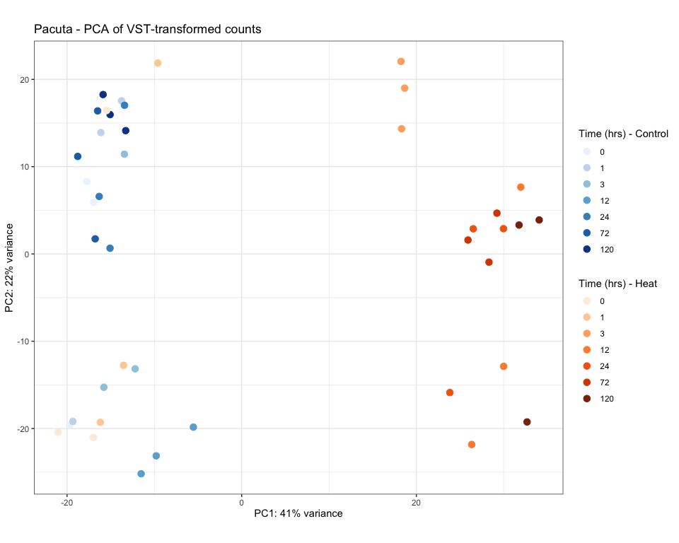
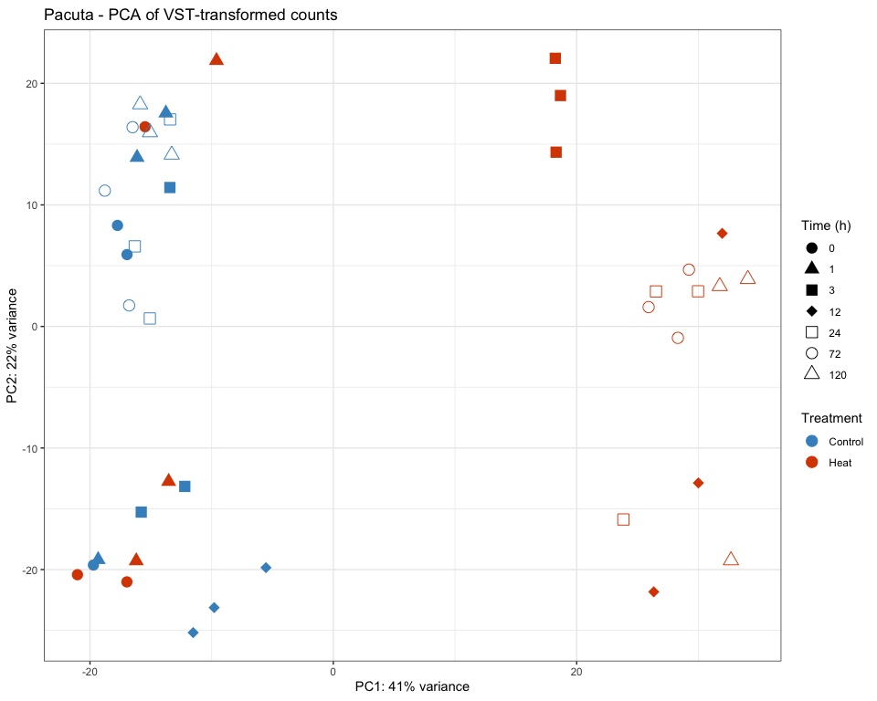
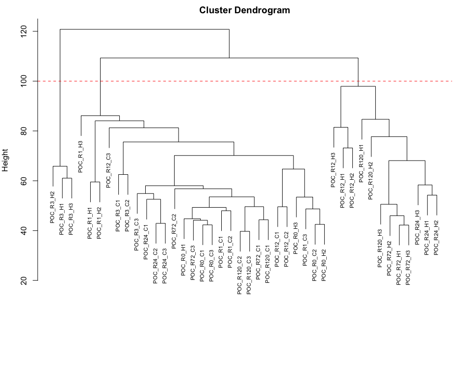
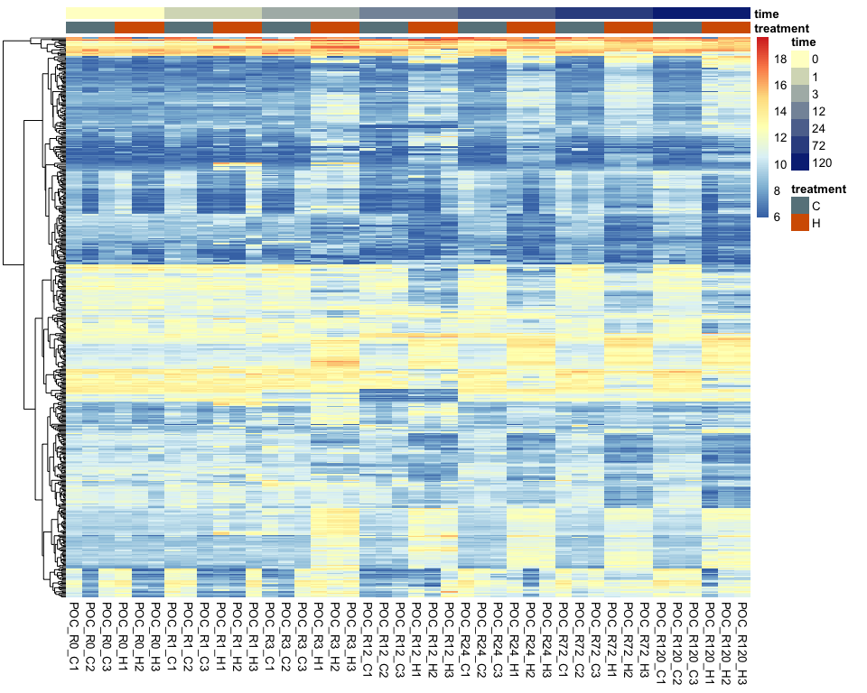
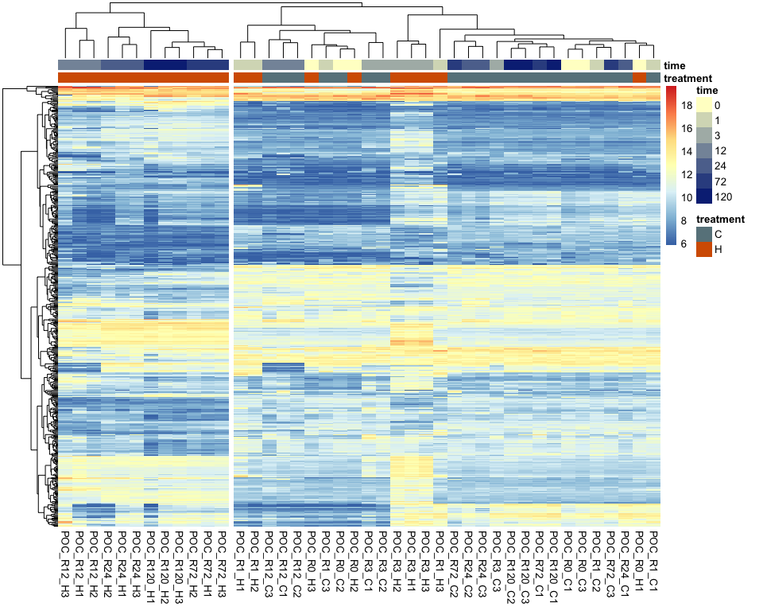

RNA-seq Preprocessing and Normalization
================
Zoe Dellaert
2026-06-29

- [Preproccessing of bulk RNA-seq
  data](#preproccessing-of-bulk-rna-seq-data)
  - [0. Setup species-specific
    parameters](#0-setup-species-specific-parameters)
  - [1. Read in raw count data](#1-read-in-raw-count-data)
  - [2. Extract metadata from sample
    names](#2-extract-metadata-from-sample-names)
  - [3. Remove outliers, if
    identified](#3-remove-outliers-if-identified)
  - [4. pOverA filtering to reduce
    dataset](#4-povera-filtering-to-reduce-dataset)
    - [Note to self: maybe replace this with treatment-specific
      filtering. To get genes expressed only at one timepoint in one
      treatment](#note-to-self-maybe-replace-this-with-treatment-specific-filtering-to-get-genes-expressed-only-at-one-timepoint-in-one-treatment)
  - [5. Create DESeq object and run
    DESeq2](#5-create-deseq-object-and-run-deseq2)
  - [6. VST-Transforming count data for
    visualization](#6-vst-transforming-count-data-for-visualization)
  - [7. Two tools to identiy potential
    outliers:](#7-two-tools-to-identiy-potential-outliers)
    - [PCA](#pca)
    - [Hierarchical Clustering](#hierarchical-clustering)
    - [Note: If outliers are identified, add them to
      species_parameters.R for this
      species.](#note-if-outliers-are-identified-add-them-to-species_parametersr-for-this-species)
  - [Final summary](#final-summary)
    - [Heatmap of variable genes](#heatmap-of-variable-genes)
    - [Text summary](#text-summary)

# Preproccessing of bulk RNA-seq data

``` r
# set up file paths so that Rmd outputs can be viewed using github markdown
knitr::opts_knit$set(base.dir = normalizePath(paste0("../../output_RNA/reports/", params$species, "/")), base.url = "./")

knitr::opts_chunk$set(echo = TRUE, message = FALSE, warning = FALSE,fig.width = 10, fig.height = 8,
                      fig.path = "01_preprocessing_files/figure-gfm/")

#load packages
library(tidyverse)
```

    ## ── Attaching core tidyverse packages ──────────────────────── tidyverse 2.0.0 ──
    ## ✔ dplyr     1.2.1     ✔ readr     2.2.0
    ## ✔ forcats   1.0.1     ✔ stringr   1.6.0
    ## ✔ ggplot2   4.0.3     ✔ tibble    3.3.1
    ## ✔ lubridate 1.9.5     ✔ tidyr     1.3.2
    ## ✔ purrr     1.2.2     
    ## ── Conflicts ────────────────────────────────────────── tidyverse_conflicts() ──
    ## ✖ dplyr::filter() masks stats::filter()
    ## ✖ dplyr::lag()    masks stats::lag()
    ## ℹ Use the conflicted package (<http://conflicted.r-lib.org/>) to force all conflicts to become errors

``` r
library(DESeq2)
```

    ## Warning: package 'DESeq2' was built under R version 4.5.2

    ## Loading required package: S4Vectors

    ## Warning: package 'S4Vectors' was built under R version 4.5.3

    ## Loading required package: stats4
    ## Loading required package: BiocGenerics
    ## Loading required package: generics
    ## 
    ## Attaching package: 'generics'
    ## 
    ## The following object is masked from 'package:lubridate':
    ## 
    ##     as.difftime
    ## 
    ## The following object is masked from 'package:dplyr':
    ## 
    ##     explain
    ## 
    ## The following objects are masked from 'package:base':
    ## 
    ##     as.difftime, as.factor, as.ordered, intersect, is.element, setdiff,
    ##     setequal, union
    ## 
    ## 
    ## Attaching package: 'BiocGenerics'
    ## 
    ## The following object is masked from 'package:dplyr':
    ## 
    ##     combine
    ## 
    ## The following objects are masked from 'package:stats':
    ## 
    ##     IQR, mad, sd, var, xtabs
    ## 
    ## The following objects are masked from 'package:base':
    ## 
    ##     anyDuplicated, aperm, append, as.data.frame, basename, cbind,
    ##     colnames, dirname, do.call, duplicated, eval, evalq, Filter, Find,
    ##     get, grep, grepl, is.unsorted, lapply, Map, mapply, match, mget,
    ##     order, paste, pmax, pmax.int, pmin, pmin.int, Position, rank,
    ##     rbind, Reduce, rownames, sapply, saveRDS, table, tapply, unique,
    ##     unsplit, which.max, which.min
    ## 
    ## 
    ## Attaching package: 'S4Vectors'
    ## 
    ## The following objects are masked from 'package:lubridate':
    ## 
    ##     second, second<-
    ## 
    ## The following objects are masked from 'package:dplyr':
    ## 
    ##     first, rename
    ## 
    ## The following object is masked from 'package:tidyr':
    ## 
    ##     expand
    ## 
    ## The following object is masked from 'package:utils':
    ## 
    ##     findMatches
    ## 
    ## The following objects are masked from 'package:base':
    ## 
    ##     expand.grid, I, unname
    ## 
    ## Loading required package: IRanges

    ## Warning: package 'IRanges' was built under R version 4.5.2

    ## 
    ## Attaching package: 'IRanges'
    ## 
    ## The following object is masked from 'package:lubridate':
    ## 
    ##     %within%
    ## 
    ## The following objects are masked from 'package:dplyr':
    ## 
    ##     collapse, desc, slice
    ## 
    ## The following object is masked from 'package:purrr':
    ## 
    ##     reduce
    ## 
    ## Loading required package: GenomicRanges

    ## Warning: package 'GenomicRanges' was built under R version 4.5.2

    ## Loading required package: Seqinfo
    ## Loading required package: SummarizedExperiment
    ## Loading required package: MatrixGenerics
    ## Loading required package: matrixStats
    ## 
    ## Attaching package: 'matrixStats'
    ## 
    ## The following object is masked from 'package:dplyr':
    ## 
    ##     count
    ## 
    ## 
    ## Attaching package: 'MatrixGenerics'
    ## 
    ## The following objects are masked from 'package:matrixStats':
    ## 
    ##     colAlls, colAnyNAs, colAnys, colAvgsPerRowSet, colCollapse,
    ##     colCounts, colCummaxs, colCummins, colCumprods, colCumsums,
    ##     colDiffs, colIQRDiffs, colIQRs, colLogSumExps, colMadDiffs,
    ##     colMads, colMaxs, colMeans2, colMedians, colMins, colOrderStats,
    ##     colProds, colQuantiles, colRanges, colRanks, colSdDiffs, colSds,
    ##     colSums2, colTabulates, colVarDiffs, colVars, colWeightedMads,
    ##     colWeightedMeans, colWeightedMedians, colWeightedSds,
    ##     colWeightedVars, rowAlls, rowAnyNAs, rowAnys, rowAvgsPerColSet,
    ##     rowCollapse, rowCounts, rowCummaxs, rowCummins, rowCumprods,
    ##     rowCumsums, rowDiffs, rowIQRDiffs, rowIQRs, rowLogSumExps,
    ##     rowMadDiffs, rowMads, rowMaxs, rowMeans2, rowMedians, rowMins,
    ##     rowOrderStats, rowProds, rowQuantiles, rowRanges, rowRanks,
    ##     rowSdDiffs, rowSds, rowSums2, rowTabulates, rowVarDiffs, rowVars,
    ##     rowWeightedMads, rowWeightedMeans, rowWeightedMedians,
    ##     rowWeightedSds, rowWeightedVars
    ## 
    ## Loading required package: Biobase

    ## Warning: package 'Biobase' was built under R version 4.5.3

    ## Welcome to Bioconductor
    ## 
    ##     Vignettes contain introductory material; view with
    ##     'browseVignettes()'. To cite Bioconductor, see
    ##     'citation("Biobase")', and for packages 'citation("pkgname")'.
    ## 
    ## 
    ## Attaching package: 'Biobase'
    ## 
    ## The following object is masked from 'package:MatrixGenerics':
    ## 
    ##     rowMedians
    ## 
    ## The following objects are masked from 'package:matrixStats':
    ## 
    ##     anyMissing, rowMedians

``` r
library(pheatmap)
library(RColorBrewer)
library(genefilter)
```

    ## Warning: package 'genefilter' was built under R version 4.5.2

    ## 
    ## Attaching package: 'genefilter'
    ## 
    ## The following objects are masked from 'package:MatrixGenerics':
    ## 
    ##     rowSds, rowVars
    ## 
    ## The following objects are masked from 'package:matrixStats':
    ## 
    ##     rowSds, rowVars
    ## 
    ## The following object is masked from 'package:readr':
    ## 
    ##     spec

``` r
library(ggnewscale)
library(BiocParallel)

#load in parameters and functions
source("species_parameters.R")
source("utils.R")

# set number of cores to use for parallel DESeq2 processing
register(MulticoreParam(workers = global_params$n_cores))

sessionInfo() #provides list of loaded packages and version of R
```

    ## R version 4.5.1 (2025-06-13)
    ## Platform: x86_64-apple-darwin20
    ## Running under: macOS Tahoe 26.4.1
    ## 
    ## Matrix products: default
    ## BLAS:   /Library/Frameworks/R.framework/Versions/4.5-x86_64/Resources/lib/libRblas.0.dylib 
    ## LAPACK: /Library/Frameworks/R.framework/Versions/4.5-x86_64/Resources/lib/libRlapack.dylib;  LAPACK version 3.12.1
    ## 
    ## locale:
    ## [1] en_US.UTF-8/en_US.UTF-8/en_US.UTF-8/C/en_US.UTF-8/en_US.UTF-8
    ## 
    ## time zone: America/New_York
    ## tzcode source: internal
    ## 
    ## attached base packages:
    ## [1] stats4    stats     graphics  grDevices utils     datasets  methods  
    ## [8] base     
    ## 
    ## other attached packages:
    ##  [1] BiocParallel_1.44.0         ggnewscale_0.5.2           
    ##  [3] genefilter_1.92.0           RColorBrewer_1.1-3         
    ##  [5] pheatmap_1.0.13             DESeq2_1.50.2              
    ##  [7] SummarizedExperiment_1.40.0 Biobase_2.70.0             
    ##  [9] MatrixGenerics_1.22.0       matrixStats_1.5.0          
    ## [11] GenomicRanges_1.62.1        Seqinfo_1.0.0              
    ## [13] IRanges_2.44.0              S4Vectors_0.48.1           
    ## [15] BiocGenerics_0.56.0         generics_0.1.4             
    ## [17] lubridate_1.9.5             forcats_1.0.1              
    ## [19] stringr_1.6.0               dplyr_1.2.1                
    ## [21] purrr_1.2.2                 readr_2.2.0                
    ## [23] tidyr_1.3.2                 tibble_3.3.1               
    ## [25] ggplot2_4.0.3               tidyverse_2.0.0            
    ## [27] rmarkdown_2.31             
    ## 
    ## loaded via a namespace (and not attached):
    ##  [1] tidyselect_1.2.1     farver_2.1.2         blob_1.3.0          
    ##  [4] Biostrings_2.78.0    S7_0.2.2             fastmap_1.2.0       
    ##  [7] XML_3.99-0.23        digest_0.6.39        timechange_0.4.0    
    ## [10] lifecycle_1.0.5      survival_3.8-6       KEGGREST_1.50.0     
    ## [13] RSQLite_3.53.2       magrittr_2.0.5       compiler_4.5.1      
    ## [16] rlang_1.2.0          tools_4.5.1          yaml_2.3.12         
    ## [19] knitr_1.51           S4Arrays_1.10.1      bit_4.6.0           
    ## [22] DelayedArray_0.36.1  abind_1.4-8          withr_3.0.3         
    ## [25] grid_4.5.1           xtable_1.8-8         scales_1.4.0        
    ## [28] cli_3.6.6            crayon_1.5.3         otel_0.2.0          
    ## [31] rstudioapi_0.19.0    httr_1.4.8           tzdb_0.5.0          
    ## [34] DBI_1.3.0            cachem_1.1.0         splines_4.5.1       
    ## [37] parallel_4.5.1       AnnotationDbi_1.72.0 XVector_0.50.0      
    ## [40] vctrs_0.7.3          Matrix_1.7-5         hms_1.1.4           
    ## [43] bit64_4.8.2          locfit_1.5-9.12      annotate_1.88.0     
    ## [46] glue_1.8.1           codetools_0.2-20     stringi_1.8.7       
    ## [49] gtable_0.3.6         pillar_1.11.1        htmltools_0.5.9     
    ## [52] R6_2.6.1             evaluate_1.0.5       lattice_0.22-9      
    ## [55] png_0.1-9            memoise_2.0.1        Rcpp_1.1.1-1.1      
    ## [58] SparseArray_1.10.10  xfun_0.59            pkgconfig_2.0.3

## 0. Setup species-specific parameters

``` r
# get species
species <- params$species

# get parameters for this species
config <- get_params(species)
print_config(species)
```

    ## Species: Pacuta
    ## Count matrix: POC_PacutaV2_gene_count_matrix.csv
    ## Outliers: None
    ## WGCNA power: 12
    ## Mfuzz clusters: 6

``` r
# set up necessary output directories if they don't exist
outdir <- file.path("../../output_RNA/counts_filt_norm", species)
outdir_plots <- file.path(outdir,"plots")
if (!dir.exists(outdir)) dir.create(outdir, recursive = TRUE)
if (!dir.exists(outdir_plots)) dir.create(outdir_plots, recursive = TRUE)

reportdir <- file.path("../../output_RNA/reports", params$species, "01_preprocessing_files/figure-gfm/")
if (!dir.exists(reportdir)) dir.create(reportdir, recursive = TRUE)
```

## 1. Read in raw count data

``` r
# load in data
counts_raw <- read.csv(file.path("../../output_RNA/count_matrices", config$count_matrix), row.names = 1)

# make list of samples 
samples <- colnames(counts_raw)
cat("Raw counts:", nrow(counts_raw), "genes x", ncol(counts_raw), "samples")
```

    ## Raw counts: 33730 genes x 42 samples

``` r
# read in SwissProt annotation
SwissProt <- read.delim(file.path(annot_dir,config$SwissProt))
cat("Annotations:", nrow(SwissProt), "Swissprot-annotated genes")
```

    ## Annotations: 19491 Swissprot-annotated genes

## 2. Extract metadata from sample names

``` r
# create metadata dataframe from sample names
meta <- data.frame(
  sample = samples, 
  species = str_split(samples, "_", simplify = TRUE)[,1], #extract first part of sample name to get species
  time = str_replace(str_split(samples, "_", simplify = TRUE)[,2],"R", ""), #extract "R##" part to get timepoint then remove R
  replicate = str_split(samples, "_", simplify = TRUE)[,3], #extract "R##" part to get timepoint then remove R
  treatment = str_replace(str_split(samples, "_", simplify = TRUE)[,3],"\\d", "")
)

# add rownames
rownames(meta) <- meta$sample

# make time and treatment factors
meta$time <- factor(meta$time, levels = as.character(sort(unique(as.numeric(meta$time)))))
meta$treatment <- factor(meta$treatment)

# save metadata
meta <- meta %>% arrange(time, treatment)
write.csv(meta, paste0("../../output_RNA/",species,"_RNA_seq_metadata.csv"))
cat("Metadata file saved to:", paste0("../../output_RNA/",species,"_RNA_seq_metadata.csv"))
```

    ## Metadata file saved to: ../../output_RNA/Pacuta_RNA_seq_metadata.csv

``` r
# reorder count matrix to be in order of metadata table (should be already but just in case)
counts_raw <- counts_raw[, meta$sample]
```

## 3. Remove outliers, if identified

``` r
outlier_samples <- config$outlier_samples

if(length(outlier_samples) > 0) {
    counts_raw <- counts_raw[, !colnames(counts_raw) %in% outlier_samples]
    meta <- meta[!rownames(meta) %in% outlier_samples, ]
}

#Confirm that sample names in metadata and count matrix match and are in the same order
stopifnot(all(meta$sample %in% colnames(counts_raw))) #are all of the sample names in the metadata column names in the gene count matrix?
stopifnot(all(meta$sample == colnames(counts_raw))) #are they the same in the same order?
```

## 4. pOverA filtering to reduce dataset

### Note to self: maybe replace this with treatment-specific filtering. To get genes expressed only at one timepoint in one treatment

``` r
# Keep genes expressed at 10+ counts in at least 7% of samples - expressed in all 3 samples at one timepoint from one treatment, can change parameters in species_parameters.R script

ffun<-filterfun(pOverA(global_params$pOverA_proportion,global_params$pOverA_counts))
counts_filt_poa <- genefilter((counts_raw), ffun) #apply filter

filtered_counts <- counts_raw[counts_filt_poa,] #keep only rows that passed filter

paste0("Number of genes after filtering: ", sum(counts_filt_poa))
```

    ## [1] "Number of genes after filtering: 24941"

``` r
paste0("% of genes kept: ", round(100*(sum(counts_filt_poa)/nrow(counts_raw)),digits=2),"%")
```

    ## [1] "% of genes kept: 73.94%"

``` r
write.csv(filtered_counts, file = file.path(outdir, "filtered_counts.csv"))
cat("Filtered counts saved to:", file.path(outdir, "filtered_counts.csv"))
```

    ## Filtered counts saved to: ../../output_RNA/counts_filt_norm/Pacuta/filtered_counts.csv

## 5. Create DESeq object and run DESeq2

``` r
dds <- DESeqDataSetFromMatrix(countData = filtered_counts,
                              colData = meta,
                              design= ~ treatment + time + treatment:time)

dds <- DESeq(dds, parallel = TRUE)

# Estimate size factors to determine if we can use VST
SF.dds <- estimateSizeFactors(dds) 
print(sort(sizeFactors(SF.dds))) #View size factors
```

    ##   POC_R3_H1   POC_R3_H3  POC_R12_H3  POC_R72_H3  POC_R24_C2  POC_R12_C1 
    ##   0.6441244   0.6671524   0.7792660   0.7824193   0.8702174   0.8762806 
    ## POC_R120_C2  POC_R72_H2 POC_R120_H1  POC_R24_H2  POC_R12_H1 POC_R120_H3 
    ##   0.8836445   0.8865256   0.8877139   0.8999134   0.9102299   0.9313091 
    ##   POC_R0_C2   POC_R3_C2  POC_R24_H3  POC_R72_C1   POC_R0_H2  POC_R72_C3 
    ##   0.9397061   0.9561270   0.9638295   0.9669207   0.9679379   0.9700146 
    ##   POC_R1_H3 POC_R120_C3   POC_R3_C1   POC_R0_H1  POC_R24_H1  POC_R12_H2 
    ##   0.9768898   0.9880893   0.9923358   0.9967210   0.9971496   0.9996347 
    ##   POC_R0_C3   POC_R3_H2   POC_R1_C1   POC_R0_C1   POC_R1_C3   POC_R1_H2 
    ##   1.0037728   1.0328153   1.0634877   1.0660151   1.0982417   1.1232481 
    ##  POC_R24_C1  POC_R12_C2   POC_R0_H3   POC_R3_C3   POC_R1_H1  POC_R72_H1 
    ##   1.1446236   1.1544485   1.1556707   1.1572729   1.1864185   1.2201376 
    ## POC_R120_H2 POC_R120_C1  POC_R24_C3  POC_R72_C2   POC_R1_C2  POC_R12_C3 
    ##   1.2278940   1.2534718   1.2568407   1.3217117   1.3406688   1.4840731

``` r
# if all are less than 4 we can use the VST transformation
all(sizeFactors(SF.dds)) < 4
```

    ## [1] TRUE

## 6. VST-Transforming count data for visualization

``` r
vst <- vst(dds, blind=FALSE)

#save the vst transformation
vst_mat <- assay(vst)
write.csv(vst_mat, file = file.path(outdir, "vst_expression_matrix.csv"))
cat("VST matrix saved to:", file.path(outdir, "vst_expression_matrix.csv"))
```

    ## VST matrix saved to: ../../output_RNA/counts_filt_norm/Pacuta/vst_expression_matrix.csv

## 7. Two tools to identiy potential outliers:

### PCA

``` r
pcaData <- plotPCA(vst, intgroup=c("time", "treatment"), returnData=TRUE)
percentVar <- round(100 * attr(pcaData, "percentVar"))

PCA <- ggplot() +
  geom_point(data = subset(pcaData, treatment == "C"),
             aes(x=PC1, y=PC2, color=time),
                 size=3) +
             scale_color_manual(values=brewer.pal(7, "Blues"), name = "Time (hrs) - Control") +
  
  #start new scale
  ggnewscale::new_scale_color() +
  geom_point(data = subset(pcaData, treatment == "H"),
             aes(x=PC1, y=PC2, color=time),
                 size=3) +
             scale_color_manual(values=brewer.pal(7, "Oranges"), name = "Time (hrs) - Heat") +

  xlab(paste0("PC1: ",percentVar[1],"% variance")) +
  ylab(paste0("PC2: ",percentVar[2],"% variance")) + 
  coord_fixed() + theme_bw() + ggtitle(paste(species, "- PCA of VST-transformed counts"))

print(PCA)
```

<!-- -->

``` r
save_ggplot(PCA, "PCA")

PCA_simple <- ggplot(data = pcaData, aes(x=PC1, y=PC2, color=treatment, shape=time)) +
  geom_point(size=4) +
  scale_color_manual(values= c("C"= "#4292C6", "H" = "#D94801"), labels = c("Control", "Heat")) +
  scale_shape_manual(values = c(16, 17, 15, 18, 0, 1, 2)) +
  xlab(paste0("PC1: ",percentVar[1],"% variance")) +
  ylab(paste0("PC2: ",percentVar[2],"% variance")) + 
  labs(color = "Treatment", shape = "Time (h)") +
  coord_fixed() + theme_bw() + ggtitle(paste(species, "- PCA of VST-transformed counts"))

print(PCA_simple)
```

<!-- -->

``` r
save_ggplot(PCA_simple, "PCA_simple", width = 8, height = 6)
```

### Hierarchical Clustering

``` r
sampleTree <- hclust(dist(t(vst_mat)), method = "average")

par(mar = c(8, 4, 2, 2))
plot(sampleTree, 
     xlab = "", sub = "", cex = 0.7)
abline(h = 100, col = "red", lty = 2)
```

<!-- -->

### Note: If outliers are identified, add them to species_parameters.R for this species.

## Final summary

### Heatmap of variable genes

``` r
topVarGenes <- head(order(rowVars(vst_mat), decreasing=TRUE), 500)

pheatmap(vst_mat[topVarGenes, ], cluster_rows=TRUE, show_rownames=FALSE,
         cluster_cols=FALSE, 
         annotation_col= meta[,c("treatment","time")],
         annotation_colors = list("treatment" = treat_colors,
                                  "time" = time_colors))
```

<!-- -->

``` r
pheatmap(vst_mat[topVarGenes, ], cluster_rows=TRUE, show_rownames=FALSE,
         cluster_cols=TRUE, cutree_cols = 2,
         annotation_col= meta[,c("treatment","time")],
         annotation_colors = list("treatment" = treat_colors,
                                  "time" = time_colors))
```

<!-- -->

### Text summary

    ## Preprocessing Summary: Pacuta

    ## Input

    ## ----------------------------------------

    ##   Count matrix: POC_PacutaV2_gene_count_matrix.csv

    ##   Initial genes: 33730

    ##   Initial samples: 42

    ## Filtering

    ## ----------------------------------------

    ##   Outliers removed: 0

    ##   Low-expression genes removed: 8789

    ##   pOverA filter: >= 10 counts in >= 7 % of samples

    ## Output

    ## ----------------------------------------

    ##   Final genes: 24941

    ##   Final samples: 42

    ##   Output directory: ../../output_RNA/counts_filt_norm/Pacuta

    ## QC Notes

    ## ----------------------------------------

    ##   Size factors range: 0.64 - 1.48

    ##   VST appropriate: Yes

    ##   PC1 variance: 41 %

    ##   PC2 variance: 22 %

``` r
sessionInfo()
```

    ## R version 4.5.1 (2025-06-13)
    ## Platform: x86_64-apple-darwin20
    ## Running under: macOS Tahoe 26.4.1
    ## 
    ## Matrix products: default
    ## BLAS:   /Library/Frameworks/R.framework/Versions/4.5-x86_64/Resources/lib/libRblas.0.dylib 
    ## LAPACK: /Library/Frameworks/R.framework/Versions/4.5-x86_64/Resources/lib/libRlapack.dylib;  LAPACK version 3.12.1
    ## 
    ## locale:
    ## [1] en_US.UTF-8/en_US.UTF-8/en_US.UTF-8/C/en_US.UTF-8/en_US.UTF-8
    ## 
    ## time zone: America/New_York
    ## tzcode source: internal
    ## 
    ## attached base packages:
    ## [1] stats4    stats     graphics  grDevices utils     datasets  methods  
    ## [8] base     
    ## 
    ## other attached packages:
    ##  [1] BiocParallel_1.44.0         ggnewscale_0.5.2           
    ##  [3] genefilter_1.92.0           RColorBrewer_1.1-3         
    ##  [5] pheatmap_1.0.13             DESeq2_1.50.2              
    ##  [7] SummarizedExperiment_1.40.0 Biobase_2.70.0             
    ##  [9] MatrixGenerics_1.22.0       matrixStats_1.5.0          
    ## [11] GenomicRanges_1.62.1        Seqinfo_1.0.0              
    ## [13] IRanges_2.44.0              S4Vectors_0.48.1           
    ## [15] BiocGenerics_0.56.0         generics_0.1.4             
    ## [17] lubridate_1.9.5             forcats_1.0.1              
    ## [19] stringr_1.6.0               dplyr_1.2.1                
    ## [21] purrr_1.2.2                 readr_2.2.0                
    ## [23] tidyr_1.3.2                 tibble_3.3.1               
    ## [25] ggplot2_4.0.3               tidyverse_2.0.0            
    ## [27] rmarkdown_2.31             
    ## 
    ## loaded via a namespace (and not attached):
    ##  [1] tidyselect_1.2.1     farver_2.1.2         blob_1.3.0          
    ##  [4] Biostrings_2.78.0    S7_0.2.2             fastmap_1.2.0       
    ##  [7] XML_3.99-0.23        digest_0.6.39        timechange_0.4.0    
    ## [10] lifecycle_1.0.5      survival_3.8-6       KEGGREST_1.50.0     
    ## [13] RSQLite_3.53.2       magrittr_2.0.5       compiler_4.5.1      
    ## [16] rlang_1.2.0          tools_4.5.1          yaml_2.3.12         
    ## [19] knitr_1.51           labeling_0.4.3       S4Arrays_1.10.1     
    ## [22] bit_4.6.0            DelayedArray_0.36.1  abind_1.4-8         
    ## [25] withr_3.0.3          grid_4.5.1           xtable_1.8-8        
    ## [28] scales_1.4.0         cli_3.6.6            crayon_1.5.3        
    ## [31] ragg_1.5.2           otel_0.2.0           rstudioapi_0.19.0   
    ## [34] httr_1.4.8           tzdb_0.5.0           DBI_1.3.0           
    ## [37] cachem_1.1.0         splines_4.5.1        parallel_4.5.1      
    ## [40] AnnotationDbi_1.72.0 XVector_0.50.0       vctrs_0.7.3         
    ## [43] Matrix_1.7-5         hms_1.1.4            bit64_4.8.2         
    ## [46] systemfonts_1.3.2    locfit_1.5-9.12      annotate_1.88.0     
    ## [49] glue_1.8.1           codetools_0.2-20     stringi_1.8.7       
    ## [52] gtable_0.3.6         pillar_1.11.1        htmltools_0.5.9     
    ## [55] R6_2.6.1             textshaping_1.0.5    evaluate_1.0.5      
    ## [58] lattice_0.22-9       png_0.1-9            memoise_2.0.1       
    ## [61] Rcpp_1.1.1-1.1       SparseArray_1.10.10  xfun_0.59           
    ## [64] pkgconfig_2.0.3
