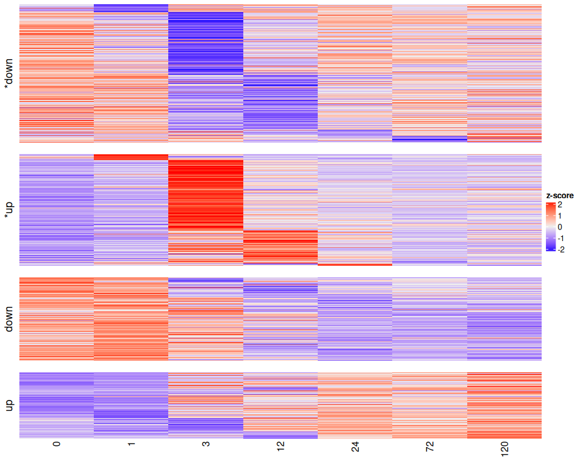
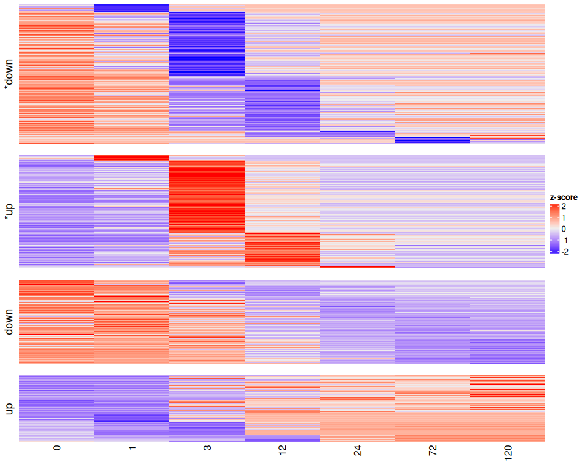
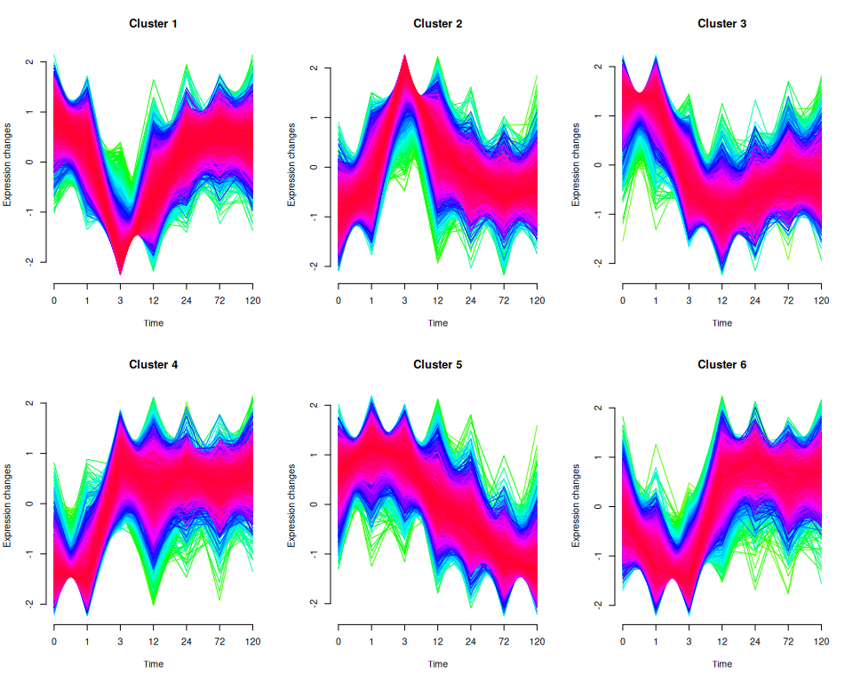
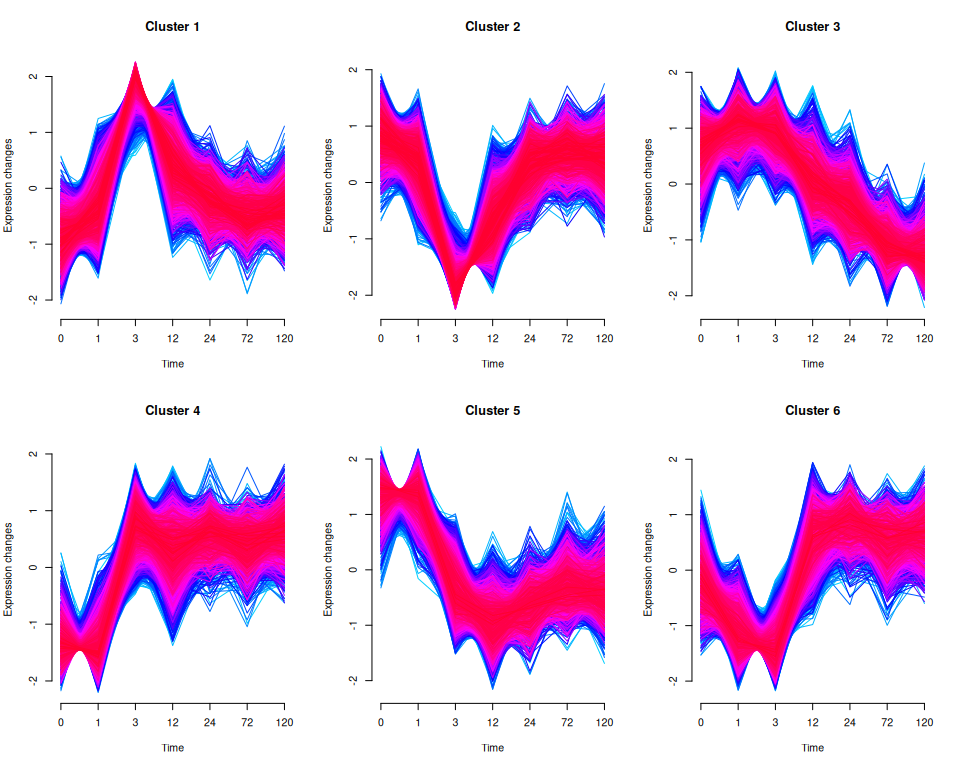
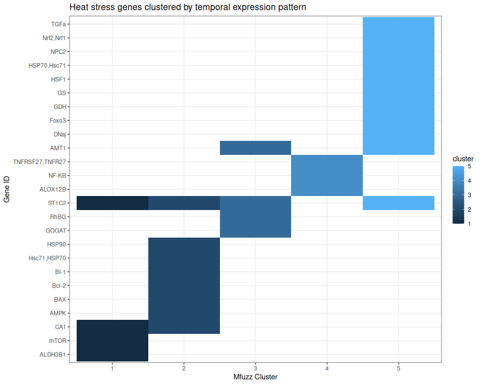

ImpulseDE2 Temporal Analysis
================
Zoe Dellaert
2026-05-10

- [Bulk RNA-seq Time Course Trajectory Analysis and
  Clustering](#bulk-rna-seq-time-course-trajectory-analysis-and-clustering)
  - [Introduction to packages](#introduction-to-packages)
    - [ImpulseDE2](#impulsede2)
    - [Mfuzz: clustering of temporal
      trajectories](#mfuzz-clustering-of-temporal-trajectories)
- [Setup](#setup)
  - [1. Load packages and functions](#1-load-packages-and-functions)
  - [2. Setup species-specific
    parameters](#2-setup-species-specific-parameters)
  - [3. Load in raw counts, transformed counts, metadata, and
    annotations](#3-load-in-raw-counts-transformed-counts-metadata-and-annotations)
- [ImpulseDE2 Analysis](#impulsede2-analysis)
  - [1. Metadata formatting](#1-metadata-formatting)
  - [1. Run ImpulseDE2](#1-run-impulsede2)
  - [3. Extract ImpulseDE2 results](#3-extract-impulsede2-results)
    - [All genes](#all-genes)
    - [Significant genes](#significant-genes)
    - [Quick summary](#quick-summary)
  - [4. Visualize ImpulseDE2 Results](#4-visualize-impulsede2-results)
    - [Heatmap of significant genes](#heatmap-of-significant-genes)
    - [Top gene trajectories](#top-gene-trajectories)
- [Mfuzz: Cluster ImpulseDE2-significant genes by
  trajectory](#mfuzz-cluster-impulsede2-significant-genes-by-trajectory)
  - [1. Preparing expression data](#1-preparing-expression-data)
  - [2. Determine Mfuzz parameters](#2-determine-mfuzz-parameters)
  - [3. Run MFuzz](#3-run-mfuzz)
  - [4. Characterize Clusters](#4-characterize-clusters)
    - [Visualize all significant genes in their
      clusters](#visualize-all-significant-genes-in-their-clusters)
- [Exploring genes of interest](#exploring-genes-of-interest)
  - [Manually-curated heat stress genes by
    cluster](#manually-curated-heat-stress-genes-by-cluster)

# Bulk RNA-seq Time Course Trajectory Analysis and Clustering

## Introduction to packages

### ImpulseDE2

- Based on [this
  paper](https://academic.oup.com/bib/article/20/1/288/4364840#130283262),
  this is the best package to use other than comparing each time point
  against each other individually.
- Repo here: <https://github.com/YosefLab/ImpulseDE2>
- Tutorial here:
  <http://bioconductor.statistik.tu-dortmund.de/packages/3.11/bioc/vignettes/ImpulseDE2/inst/doc/ImpulseDE2_Tutorial.html>
  , I followed closely with the section “Case-control differential
  expression analysis”
- Read the ImpulseDE2 paper
  [here](https://academic.oup.com/nar/article/46/20/e119/5068248)

*David S Fischer, Fabian J Theis, Nir Yosef, Impulse model-based
differential expression analysis of time course sequencing data, Nucleic
Acids Research, Volume 46, Issue 20, 16 November 2018, Page e119,
<https://doi.org/10.1093/nar/gky675>*

To install the package

``` r
library(devtools)
install_github("YosefLab/ImpulseDE2")
```

### Mfuzz: clustering of temporal trajectories

For this we will use the package
[Mfuzz](https://bioconductor.org/packages/release/bioc/html/Mfuzz.html),
[vignette
here](https://bioconductor.org/packages/release/bioc/vignettes/Mfuzz/inst/doc/Mfuzz.pdf)
and more documentation [here](http://mfuzz.sysbiolab.eu/).

To install the package

``` r
BiocManager::install("Mfuzz")
```

------------------------------------------------------------------------

# Setup

## 1. Load packages and functions

``` r
# set up file paths so that Rmd outputs can be viewed using github markdown
knitr::opts_knit$set(base.dir = normalizePath(paste0("../../output_RNA/reports/", params$species, "/")), base.url = "./")

knitr::opts_chunk$set(echo = TRUE, message = FALSE, warning = FALSE,fig.width = 10, fig.height = 8,
                      fig.path = "02_ImpulseDE_files/figure-gfm/")

#load packages
library(ImpulseDE2)
library(tidyverse)
library(ComplexHeatmap)
```

    ## Loading required package: grid

    ## ========================================
    ## ComplexHeatmap version 2.26.0
    ## Bioconductor page: http://bioconductor.org/packages/ComplexHeatmap/
    ## Github page: https://github.com/jokergoo/ComplexHeatmap
    ## Documentation: http://jokergoo.github.io/ComplexHeatmap-reference
    ## 
    ## If you use it in published research, please cite either one:
    ## - Gu, Z. Complex Heatmap Visualization. iMeta 2022.
    ## - Gu, Z. Complex heatmaps reveal patterns and correlations in multidimensional 
    ##     genomic data. Bioinformatics 2016.
    ## 
    ## 
    ## The new InteractiveComplexHeatmap package can directly export static 
    ## complex heatmaps into an interactive Shiny app with zero effort. Have a try!
    ## 
    ## This message can be suppressed by:
    ##   suppressPackageStartupMessages(library(ComplexHeatmap))
    ## ========================================
    ## ! pheatmap() has been masked by ComplexHeatmap::pheatmap(). Most of the arguments
    ##    in the original pheatmap() are identically supported in the new function. You 
    ##    can still use the original function by explicitly calling pheatmap::pheatmap().

    ## 
    ## Attaching package: 'ComplexHeatmap'

    ## The following object is masked from 'package:genefilter':
    ## 
    ##     dist2

    ## The following object is masked from 'package:pheatmap':
    ## 
    ##     pheatmap

``` r
library(Mfuzz)
```

    ## Loading required package: e1071

    ## 
    ## Attaching package: 'e1071'

    ## The following object is masked from 'package:generics':
    ## 
    ##     interpolate

    ## The following object is masked from 'package:ggplot2':
    ## 
    ##     element

    ## Warning in fun(libname, pkgname): couldn't connect to display ":0"

    ## 
    ## Attaching package: 'widgetTools'

    ## The following object is masked from 'package:dplyr':
    ## 
    ##     funs

    ## 
    ## Attaching package: 'DynDoc'

    ## The following object is masked from 'package:BiocGenerics':
    ## 
    ##     path

``` r
#load in parameters and functions
source("species_parameters.R")
source("utils.R")

sessionInfo() #provides list of loaded packages and version of R
```

    ## R version 4.5.1 (2025-06-13)
    ## Platform: x86_64-pc-linux-gnu
    ## Running under: Ubuntu 24.04.1 LTS
    ## 
    ## Matrix products: default
    ## BLAS:   /usr/lib/x86_64-linux-gnu/openblas-pthread/libblas.so.3 
    ## LAPACK: /usr/lib/x86_64-linux-gnu/openblas-pthread/libopenblasp-r0.3.26.so;  LAPACK version 3.12.0
    ## 
    ## locale:
    ##  [1] LC_CTYPE=en_US.UTF-8       LC_NUMERIC=C              
    ##  [3] LC_TIME=en_US.UTF-8        LC_COLLATE=en_US.UTF-8    
    ##  [5] LC_MONETARY=en_US.UTF-8    LC_MESSAGES=en_US.UTF-8   
    ##  [7] LC_PAPER=en_US.UTF-8       LC_NAME=C                 
    ##  [9] LC_ADDRESS=C               LC_TELEPHONE=C            
    ## [11] LC_MEASUREMENT=en_US.UTF-8 LC_IDENTIFICATION=C       
    ## 
    ## time zone: Etc/UTC
    ## tzcode source: system (glibc)
    ## 
    ## attached base packages:
    ##  [1] tcltk     grid      stats4    stats     graphics  grDevices utils    
    ##  [8] datasets  methods   base     
    ## 
    ## other attached packages:
    ##  [1] Mfuzz_2.68.0                DynDoc_1.86.0              
    ##  [3] widgetTools_1.86.0          e1071_1.7-16               
    ##  [5] ComplexHeatmap_2.26.0       ImpulseDE2_0.99.10         
    ##  [7] BiocParallel_1.44.0         ggnewscale_0.5.2           
    ##  [9] genefilter_1.90.0           RColorBrewer_1.1-3         
    ## [11] pheatmap_1.0.13             DESeq2_1.50.2              
    ## [13] SummarizedExperiment_1.40.0 Biobase_2.70.0             
    ## [15] MatrixGenerics_1.22.0       matrixStats_1.5.0          
    ## [17] GenomicRanges_1.62.0        Seqinfo_1.0.0              
    ## [19] IRanges_2.44.0              S4Vectors_0.48.0           
    ## [21] BiocGenerics_0.56.0         generics_0.1.4             
    ## [23] lubridate_1.9.4             forcats_1.0.0              
    ## [25] stringr_1.6.0               dplyr_1.1.4                
    ## [27] purrr_1.2.1                 readr_2.1.6                
    ## [29] tidyr_1.3.1                 tibble_3.3.0               
    ## [31] ggplot2_4.0.1               tidyverse_2.0.0            
    ## [33] rmarkdown_2.30             
    ## 
    ## loaded via a namespace (and not attached):
    ##  [1] DBI_1.2.3               rlang_1.2.0             magrittr_2.0.4         
    ##  [4] clue_0.3-66             GetoptLong_1.1.0        compiler_4.5.1         
    ##  [7] RSQLite_2.4.5           png_0.1-8               systemfonts_1.3.1      
    ## [10] vctrs_0.7.0             shape_1.4.6.1           pkgconfig_2.0.3        
    ## [13] crayon_1.5.3            fastmap_1.2.0           XVector_0.50.0         
    ## [16] labeling_0.4.3          tzdb_0.5.0              UCSC.utils_1.4.0       
    ## [19] ragg_1.5.0              bit_4.6.0               xfun_0.56              
    ## [22] cachem_1.1.0            GenomeInfoDb_1.44.3     jsonlite_2.0.0         
    ## [25] blob_1.2.4              DelayedArray_0.36.0     cluster_2.1.8.1        
    ## [28] parallel_4.5.1          R6_2.6.1                stringi_1.8.7          
    ## [31] Rcpp_1.1.1              iterators_1.0.14        knitr_1.50             
    ## [34] Matrix_1.6-4            splines_4.5.1           timechange_0.3.0       
    ## [37] tidyselect_1.2.1        rstudioapi_0.17.1       dichromat_2.0-0.1      
    ## [40] abind_1.4-8             yaml_2.3.12             doParallel_1.0.17      
    ## [43] codetools_0.2-20        lattice_0.22-7          withr_3.0.2            
    ## [46] KEGGREST_1.50.0         S7_0.2.1                evaluate_1.0.5         
    ## [49] survival_3.8-3          proxy_0.4-27            circlize_0.4.17        
    ## [52] Biostrings_2.78.0       pillar_1.11.1           tkWidgets_1.86.0       
    ## [55] foreach_1.5.2           hms_1.1.4               scales_1.4.0           
    ## [58] xtable_1.8-4            class_7.3-23            glue_1.8.0             
    ## [61] tools_4.5.1             annotate_1.86.1         locfit_1.5-9.12        
    ## [64] XML_3.99-0.18           cowplot_1.2.0           colorspace_2.1-2       
    ## [67] AnnotationDbi_1.72.0    GenomeInfoDbData_1.2.14 cli_3.6.5              
    ## [70] textshaping_1.0.4       S4Arrays_1.10.0         gtable_0.3.6           
    ## [73] digest_0.6.39           SparseArray_1.10.2      rjson_0.2.23           
    ## [76] farver_2.1.2            memoise_2.0.1           htmltools_0.5.9        
    ## [79] lifecycle_1.0.5         httr_1.4.7              GlobalOptions_0.1.3    
    ## [82] bit64_4.6.0-1

## 2. Setup species-specific parameters

``` r
# get species
species <- params$species

# get parameters for this species
config <- get_params(species)
print_config(species)
```

    ## Species: Pacuta
    ## Count matrix: POC_PacutaV2_gene_count_matrix.csv
    ## Outliers: None
    ## WGCNA power: 12
    ## Mfuzz clusters: 6

``` r
# define preprocessing output directory (from 01_preprocessing.Rmd)
input_dir <- file.path("../../output_RNA/counts_filt_norm", species)

# set up necessary output directories if they don't exist
outdir <- file.path("../../output_RNA/ImpulseDE2", species)
outdir_mfuzz <- file.path(outdir,"Mfuzz")
outdir_plots <- file.path(outdir,"plots")
outdir_plots_pdf <- file.path(outdir_plots,"pdf_figs")
if (!dir.exists(outdir)) dir.create(outdir, recursive = TRUE)
if (!dir.exists(outdir_mfuzz)) dir.create(outdir_mfuzz, recursive = TRUE)
if (!dir.exists(outdir_plots)) dir.create(outdir_plots, recursive = TRUE)
if (!dir.exists(outdir_plots_pdf)) dir.create(outdir_plots_pdf, recursive = TRUE)

reportdir <- file.path("../../output_RNA/reports", params$species, "02_ImpulseDE_files/figure-gfm/")
if (!dir.exists(reportdir)) dir.create(reportdir, recursive = TRUE)
```

## 3. Load in raw counts, transformed counts, metadata, and annotations

``` r
# load in raw counts data
counts_raw <- read.csv(file.path("../../output_RNA/count_matrices", config$count_matrix), row.names = 1)

# load in vst-transformed counts
vst <- read.csv(file.path(input_dir, "vsd_expression_matrix.csv"))
vst <- vst %>% column_to_rownames(var = "X")

# load in metadata
meta <- read.csv(paste0("../../output_RNA/",species,"_RNA_seq_metadata.csv"))
meta <- meta %>% column_to_rownames(var = "X") #%>% select(-c(species, replicate))

# remove outliers that are still in metadata and raw_counts files but were removed prior to the vst transformation
outlier_samples <- config$outlier_samples

if(length(outlier_samples) > 0) {
    counts_raw <- counts_raw[, !colnames(counts_raw) %in% outlier_samples]
    meta <- meta[!rownames(meta) %in% outlier_samples, ]
}

all(rownames(meta) %in% colnames(vst))
```

    ## [1] TRUE

``` r
all(rownames(meta) == colnames(vst))
```

    ## [1] TRUE

``` r
# read in SwissProt annotation
SwissProt <- read.delim(file.path(annot_dir,config$SwissProt))
cat("Annotations:", nrow(SwissProt), "Swissprot-annotated genes")
```

    ## Annotations: 19491 Swissprot-annotated genes

------------------------------------------------------------------------

# ImpulseDE2 Analysis

## 1. Metadata formatting

First, reformat our metadata table to match the column names used in the
ImpulseDE2 vignette.

``` r
meta_impulse <- meta %>%
  dplyr::rename(Sample = sample, Time = time, Batch = replicate) %>% 
  mutate(Time = as.numeric(as.character(Time)),
         Condition = str_replace(treatment, "C", "control"),
         Condition = str_replace(Condition, "H", "case")
         ) %>%
  select(-c(species,treatment))
```

## 1. Run ImpulseDE2

This takes a ton of time and memory, so I run it once then save as an
RDS.

``` r
if(params$run_ImpulseDE2 == TRUE) {
  objectImpulseDE2 <- runImpulseDE2(
    matCountData    = as.matrix(counts_raw), #or use filtered_counts  
    dfAnnotation    = meta_impulse,
    boolCaseCtrl    = TRUE,
    vecConfounders  = c("Batch"), #only use if you want to try to control for batch effects
    boolIdentifyTransients = TRUE, #use if you want to ID transiently- vs permanently-regulated genes
    scaNProc        = 18 )
  
  saveRDS(objectImpulseDE2, file.path(outdir, "objectImpulseDE2.rds"))
} else {
  objectImpulseDE2 <- readRDS(file.path(outdir, "objectImpulseDE2.rds"))
}
```

``` r
# Print processing report
cat(objectImpulseDE2@strReport)
```

    ## ImpulseDE2 for count data, v0.99.10
    ## # Process inputProcessing Details:
    ## ImpulseDE2 runs in case-ctrl mode.
    ## Found time points: 0,1,3,12,24,72,120
    ## Case: Found the samples at time point 0: POC_R0_H1,POC_R0_H2,POC_R0_H3
    ## Case: Found the samples at time point 1: POC_R1_H1,POC_R1_H2,POC_R1_H3
    ## Case: Found the samples at time point 3: POC_R3_H1,POC_R3_H2,POC_R3_H3
    ## Case: Found the samples at time point 12: POC_R12_H1,POC_R12_H2,POC_R12_H3
    ## Case: Found the samples at time point 24: POC_R24_H1,POC_R24_H2,POC_R24_H3
    ## Case: Found the samples at time point 72: POC_R72_H1,POC_R72_H2,POC_R72_H3
    ## Case: Found the samples at time point 120: POC_R120_H1,POC_R120_H2,POC_R120_H3
    ## Control: Found the following samples at time point 0:POC_R0_C1,POC_R0_C2,POC_R0_C3
    ## Control: Found the following samples at time point 1:POC_R1_C1,POC_R1_C2,POC_R1_C3
    ## Control: Found the following samples at time point 3:POC_R3_C1,POC_R3_C2,POC_R3_C3
    ## Control: Found the following samples at time point 12:POC_R12_C1,POC_R12_C2,POC_R12_C3
    ## Control: Found the following samples at time point 24:POC_R24_C1,POC_R24_C2,POC_R24_C3
    ## Control: Found the following samples at time point 72:POC_R72_C1,POC_R72_C2,POC_R72_C3
    ## Control: Found the following samples at time point 120:POC_R120_C1,POC_R120_C2,POC_R120_C3
    ## Found the following samples for confounder Batch and batch C1: POC_R0_C1,POC_R1_C1,POC_R3_C1,POC_R12_C1,POC_R24_C1,POC_R72_C1,POC_R120_C1
    ## Found the following samples for confounder Batch and batch C2: POC_R0_C2,POC_R1_C2,POC_R3_C2,POC_R12_C2,POC_R24_C2,POC_R72_C2,POC_R120_C2
    ## Found the following samples for confounder Batch and batch C3: POC_R0_C3,POC_R1_C3,POC_R3_C3,POC_R12_C3,POC_R24_C3,POC_R72_C3,POC_R120_C3
    ## Found the following samples for confounder Batch and batch H1: POC_R0_H1,POC_R1_H1,POC_R3_H1,POC_R12_H1,POC_R24_H1,POC_R72_H1,POC_R120_H1
    ## Found the following samples for confounder Batch and batch H2: POC_R0_H2,POC_R1_H2,POC_R3_H2,POC_R12_H2,POC_R24_H2,POC_R72_H2,POC_R120_H2
    ## Found the following samples for confounder Batch and batch H3: POC_R0_H3,POC_R1_H3,POC_R3_H3,POC_R12_H3,POC_R24_H3,POC_R72_H3,POC_R120_H3
    ## Input contained 33730 genes/regions.
    ## WARNING: 3550 out of 33730 genes do not have obserserved non-zero counts and are excluded.
    ## Selected 30180 genes/regions for analysis.
    ## # Run DESeq2: Using dispersion factorscomputed by DESeq2.
    ## Consumed time: 0.62 min.
    ## # Compute size factors
    ## # Fitting null and alternative model to the genes
    ## Consumed time: 18.08 min.
    ## # Fitting sigmoid model to case condition
    ## Consumed time: 1.52 min.
    ## # Differentially expression analysis based on model fits
    ## Finished running ImpulseDE2.
    ## TOTAL consumed time: 20.38 min.

## 3. Extract ImpulseDE2 results

### All genes

Extract and save results for all non-zero genes

``` r
impulse_results <- objectImpulseDE2$dfImpulseDE2Results
impulse_results <- impulse_results %>% filter(allZero==FALSE) #remove genes with zero counts

impulse_results_annot <- impulse_results %>%
  left_join(SwissProt %>% select(query,ProteinNames,BiologicalProcess), by = join_by("Gene"=="query"))

write.csv(impulse_results, file.path(outdir, "ImpulseDE2_results.csv"), row.names = FALSE)
```

### Significant genes

Extract genes with significant treatment effect on temporal trajectory,
classify them as transiently or monotonously regulated, and save results

``` r
impulse_sig <- impulse_results %>%
  filter(padj < global_params$padj_threshold) %>%
  mutate(response_type = case_when(
    isTransient & !is.na(isTransient) ~ "Transient",
    isMonotonous & !is.na(isMonotonous) ~ "Monotonous",
    .default = "Other"
  ))

write.csv(impulse_sig, file.path(outdir, "ImpulseDE2_significant.csv"), row.names = FALSE)

#preview top DE genes and annotations
impulse_sig %>% arrange(padj) %>% head(20) %>% dplyr::select(Gene,padj,loglik_red,response_type) %>%
  left_join(SwissProt %>% select(query,ProteinNames,BiologicalProcess), by = join_by("Gene"=="query"))
```

    ##                                         Gene         padj loglik_red
    ## 1        Pocillopora_acuta_HIv2___TS.g798.t2 5.388799e-87  -545.5883
    ## 2  Pocillopora_acuta_HIv2___RNAseq.g26418.t1 1.216997e-83  -580.5737
    ## 3   Pocillopora_acuta_HIv2___RNAseq.g5165.t1 4.706705e-78  -430.2411
    ## 4  Pocillopora_acuta_HIv2___RNAseq.g22728.t1 1.161678e-77  -485.7291
    ## 5  Pocillopora_acuta_HIv2___RNAseq.g26847.t1 2.195764e-77  -505.4094
    ## 6      Pocillopora_acuta_HIv2___TS.g28751.t1 1.248234e-75  -531.3431
    ## 7  Pocillopora_acuta_HIv2___RNAseq.g18469.t1 1.248234e-75  -503.2633
    ## 8   Pocillopora_acuta_HIv2___RNAseq.g5323.t1 9.453677e-72  -435.0774
    ## 9      Pocillopora_acuta_HIv2___TS.g10636.t2 1.796412e-67  -536.4996
    ## 10     Pocillopora_acuta_HIv2___TS.g22830.t2 8.272431e-66  -482.8667
    ## 11 Pocillopora_acuta_HIv2___RNAseq.g17840.t1 2.464486e-64  -505.7045
    ## 12  Pocillopora_acuta_HIv2___RNAseq.g4038.t1 5.479979e-63  -663.2676
    ## 13 Pocillopora_acuta_HIv2___RNAseq.g10587.t1 1.501894e-62  -466.3320
    ## 14 Pocillopora_acuta_HIv2___RNAseq.g25282.t1 1.406535e-60  -527.9165
    ## 15   Pocillopora_acuta_HIv2___RNAseq.g329.t1 2.841430e-60  -485.0607
    ## 16 Pocillopora_acuta_HIv2___RNAseq.g29669.t2 4.439158e-59  -410.9084
    ## 17 Pocillopora_acuta_HIv2___RNAseq.g25560.t1 2.294178e-57  -460.7206
    ## 18 Pocillopora_acuta_HIv2___RNAseq.g25279.t1 5.082204e-57  -420.9505
    ## 19  Pocillopora_acuta_HIv2___RNAseq.g7178.t1 1.232054e-52  -371.5217
    ## 20 Pocillopora_acuta_HIv2___RNAseq.g10431.t1 3.245953e-51  -334.3966
    ##    response_type
    ## 1     Monotonous
    ## 2      Transient
    ## 3      Transient
    ## 4      Transient
    ## 5     Monotonous
    ## 6      Transient
    ## 7      Transient
    ## 8     Monotonous
    ## 9      Transient
    ## 10    Monotonous
    ## 11    Monotonous
    ## 12     Transient
    ## 13     Transient
    ## 14     Transient
    ## 15    Monotonous
    ## 16     Transient
    ## 17    Monotonous
    ## 18    Monotonous
    ## 19     Transient
    ## 20    Monotonous
    ##                                                                                                                                                                                                                        ProteinNames
    ## 1                                                                                                                                                                                                                              <NA>
    ## 2                                                                                      Splicing factor, suppressor of white-apricot homolog (Splicing factor, arginine/serine-rich 8) (Suppressor of white apricot protein homolog)
    ## 3                                                                                                                                               BTB/POZ domain-containing protein 8 (AP2-interacting clathrin-endocytosis) (APache)
    ## 4                                                                                                                                                                                                                              <NA>
    ## 5                                                                                                                                                                                            Interferon regulatory factor 2 (IRF-2)
    ## 6                                                                                                                                                                                                                              <NA>
    ## 7                                                                                                                       Serine-arginine protein 55 (SRP55) (52 kDa bracketing protein) (B52 protein) (Protein enhancer of deformed)
    ## 8                                                                                                                        Myosin-2 essential light chain (Myosin II essential light chain) (Non-muscle myosin essential light chain)
    ## 9                    ATP-dependent translocase ABCB1 (ATP-binding cassette sub-family B member 1) (Multidrug resistance protein 1) (EC 7.6.2.2) (P-glycoprotein 1) (Phospholipid transporter ABCB1) (EC 7.6.2.1) (CD antigen CD243)
    ## 10                                                                                                                                                                                                                             <NA>
    ## 11                                                                                                                                                                                                                             <NA>
    ## 12                                                                                                                                                                                                                   Cryptochrome-1
    ## 13                                                                                                                                                                                                                             <NA>
    ## 14                                                                                                                                                                                                                             <NA>
    ## 15                                                                                                                                                                                                                             <NA>
    ## 16                                                                                                                                                 Serine/arginine-rich splicing factor 4 (Splicing factor, arginine/serine-rich 4)
    ## 17                                                                                                                                                                                                                             <NA>
    ## 18                                                                                                                                                                                                                             <NA>
    ## 19 Alcohol dehydrogenase class-3 (EC 1.1.1.1) (Alcohol dehydrogenase class-III) (Glutathione-dependent formaldehyde dehydrogenase) (FALDH) (FDH) (GSH-FDH) (EC 1.1.1.-) (S-(hydroxymethyl)glutathione dehydrogenase) (EC 1.1.1.284)
    ## 20                                                                                                                                                                                                                             <NA>
    ##                                                                                                                                                                                                                                                                                                                                                                                                                                                                                                                                                                                                                                                                                                                                                                                                                                                                                                                                                                                                                                                                                                                                                                                                                                                                                                                                                                                                                                                                                                                                                                                                                                                                                                                                                                                                                                                                                                                                                                                                                                                                                                                                                                                                                                                                                                                                                                                                                                                                                                                                                                               BiologicalProcess
    ## 1                                                                                                                                                                                                                                                                                                                                                                                                                                                                                                                                                                                                                                                                                                                                                                                                                                                                                                                                                                                                                                                                                                                                                                                                                                                                                                                                                                                                                                                                                                                                                                                                                                                                                                                                                                                                                                                                                                                                                                                                                                                                                                                                                                                                                                                                                                                                                                                                                                                                                                                                                                                          <NA>
    ## 2                                                                                                                                                                                                                                                                                                                                                                                                                                                                                                                                                                                                                                                                                                                                                                                                                                                                                                                                                                                                                                                                                                                                                                                                                                                                                                                                                                                                                                                                                                                                                                                                                                                                                                                                                                                                                                                                                                                                                                                                                                                                                                                                                                                                                                                                                                                                                                                                                     alternative mRNA splicing, via spliceosome [GO:0000380]; mRNA 5'-splice site recognition [GO:0000395]; negative regulation of mRNA splicing, via spliceosome [GO:0048025]
    ## 3                                                                                                                                                                                                                                                                                                                                                                                                                                                                                                                                                                                                                                                                                                                                                                                                                                                                                                                                                                                                                                                                                                                                                                                                                                                                                                                                                                                                                                                                                                                                                                                                                                                                                                                                                                                                                                                                                                                                                                                                                                                                                                                                                                                                                                                                                                                                                                                                                                                                                                synaptic vesicle budding from endosome [GO:0016182]; synaptic vesicle endocytosis [GO:0048488]
    ## 4                                                                                                                                                                                                                                                                                                                                                                                                                                                                                                                                                                                                                                                                                                                                                                                                                                                                                                                                                                                                                                                                                                                                                                                                                                                                                                                                                                                                                                                                                                                                                                                                                                                                                                                                                                                                                                                                                                                                                                                                                                                                                                                                                                                                                                                                                                                                                                                                                                                                                                                                                                                          <NA>
    ## 5                                                                                                                                                                                                                                                                                                                                                                                                                                                                                                                                                                                                                                                                                                                                                                                                                                                                                                                                                                                                                                                                                                                                                                                                                                                                                                                                                                                                                                                                                                                                                                                                                                                                                                                                                                                                                                                                                                                                                                                                                                                                                                                                                                                                                                                                                                                                                                                                                                                                                             immune system process [GO:0002376]; regulation of transcription by RNA polymerase II [GO:0006357]
    ## 6                                                                                                                                                                                                                                                                                                                                                                                                                                                                                                                                                                                                                                                                                                                                                                                                                                                                                                                                                                                                                                                                                                                                                                                                                                                                                                                                                                                                                                                                                                                                                                                                                                                                                                                                                                                                                                                                                                                                                                                                                                                                                                                                                                                                                                                                                                                                                                                                                                                                                                                                                                                          <NA>
    ## 7                                                                                                                                                                                                                                                                                                                                                                                                                                                                                                                                                                                                                                                                                                                                                                                                                                                                                                                                                                                                                                                                                                                                                                                                                                                                                                                                                                                                                                                                                                                                                                                                                                                                                                                                                                                                                                                                                                                                                                                                                                                    defense response to virus [GO:0051607]; mitotic cell cycle [GO:0000278]; mitotic G1/S transition checkpoint signaling [GO:0044819]; mRNA splicing, via spliceosome [GO:0000398]; regulation of alternative mRNA splicing, via spliceosome [GO:0000381]; regulation of gene expression [GO:0010468]; regulation of mRNA 3'-end processing [GO:0031440]; regulation of mRNA splicing, via spliceosome [GO:0048024]; regulation of transcriptional start site selection at RNA polymerase II promoter [GO:0001178]; RNA splicing [GO:0008380]
    ## 8                                                                                                                                                                                                                                                                                                                                                                                                                                                                                                                                                                                                                                                                                                                                                                                                                                                                                                                                                                                                                                                                                                                                                                                                                                                                                                                                                                                                                                                                                                                                                                                                                                                                                                                                                                                                                                                                                                                                                                                                                                                                                                                                                                                                                                                                                                                                                                                                                                                                                                                                                    actin filament-based movement [GO:0030048]
    ## 9  carboxylic acid transmembrane transport [GO:1905039]; cellular hyperosmotic salinity response [GO:0071475]; cellular response to alkaloid [GO:0071312]; cellular response to antibiotic [GO:0071236]; cellular response to borneol [GO:1905231]; cellular response to dexamethasone stimulus [GO:0071549]; cellular response to estradiol stimulus [GO:0071392]; cellular response to external biotic stimulus [GO:0071217]; cellular response to L-glutamate [GO:1905232]; cellular response to lipopolysaccharide [GO:0071222]; cellular response to mycotoxin [GO:0036146]; cellular response to nonylphenol [GO:1904148]; cellular response to tumor necrosis factor [GO:0071356]; ceramide translocation [GO:0099040]; circadian rhythm [GO:0007623]; daunorubicin transport [GO:0043215]; establishment of blood-brain barrier [GO:0060856]; establishment of blood-retinal barrier [GO:1990963]; export across plasma membrane [GO:0140115]; female pregnancy [GO:0007565]; G2/M transition of mitotic cell cycle [GO:0000086]; hormone transport [GO:0009914]; intestinal absorption [GO:0050892]; lactation [GO:0007595]; maintenance of blood-brain barrier [GO:0035633]; negative regulation of sensory perception of pain [GO:1904057]; phospholipid translocation [GO:0045332]; placenta development [GO:0001890]; positive regulation of establishment of Sertoli cell barrier [GO:1904446]; positive regulation of response to drug [GO:2001025]; protein localization to bicellular tight junction [GO:1902396]; regulation of chloride transport [GO:2001225]; regulation of intestinal absorption [GO:1904478]; response to alcohol [GO:0097305]; response to antineoplastic agent [GO:0097327]; response to cadmium ion [GO:0046686]; response to codeine [GO:1905233]; response to cyclosporin A [GO:1905237]; response to glucagon [GO:0033762]; response to glycoside [GO:1903416]; response to hypoxia [GO:0001666]; response to progesterone [GO:0032570]; response to quercetin [GO:1905235]; response to thyroxine [GO:0097068]; response to vitamin A [GO:0033189]; response to vitamin D [GO:0033280]; response to xenobiotic stimulus [GO:0009410]; stem cell proliferation [GO:0072089]; terpenoid transport [GO:0046865]; transepithelial transport [GO:0070633]; transmembrane transport [GO:0055085]; transport across blood-brain barrier [GO:0150104]; xenobiotic detoxification by transmembrane export across the plasma membrane [GO:1990961]; xenobiotic metabolic process [GO:0006805]; xenobiotic transport across blood-brain barrier [GO:1990962]
    ## 10                                                                                                                                                                                                                                                                                                                                                                                                                                                                                                                                                                                                                                                                                                                                                                                                                                                                                                                                                                                                                                                                                                                                                                                                                                                                                                                                                                                                                                                                                                                                                                                                                                                                                                                                                                                                                                                                                                                                                                                                                                                                                                                                                                                                                                                                                                                                                                                                                                                                                                                                                                                         <NA>
    ## 11                                                                                                                                                                                                                                                                                                                                                                                                                                                                                                                                                                                                                                                                                                                                                                                                                                                                                                                                                                                                                                                                                                                                                                                                                                                                                                                                                                                                                                                                                                                                                                                                                                                                                                                                                                                                                                                                                                                                                                                                                                                                                                                                                                                                                                                                                                                                                                                                                                                                                                                                                                                         <NA>
    ## 12                                                                                                                                                                                                                                                                                                                                                                                                                                                                                                                                                                                                                                                                                                                                                                                                                                                                                                                                                                                                                                                                                                                                                                                                                                                                                                                                                                                                                                                                                                                                                                                                                                                                                                                                                                                                                                                                                                                                                                                                                                                                                                                                                                                                                                                                               circadian regulation of gene expression [GO:0032922]; circadian rhythm [GO:0007623]; entrainment of circadian clock by photoperiod [GO:0043153]; negative regulation of DNA-templated transcription [GO:0045892]; negative regulation of gluconeogenesis [GO:0045721]; response to light stimulus [GO:0009416]
    ## 13                                                                                                                                                                                                                                                                                                                                                                                                                                                                                                                                                                                                                                                                                                                                                                                                                                                                                                                                                                                                                                                                                                                                                                                                                                                                                                                                                                                                                                                                                                                                                                                                                                                                                                                                                                                                                                                                                                                                                                                                                                                                                                                                                                                                                                                                                                                                                                                                                                                                                                                                                                                         <NA>
    ## 14                                                                                                                                                                                                                                                                                                                                                                                                                                                                                                                                                                                                                                                                                                                                                                                                                                                                                                                                                                                                                                                                                                                                                                                                                                                                                                                                                                                                                                                                                                                                                                                                                                                                                                                                                                                                                                                                                                                                                                                                                                                                                                                                                                                                                                                                                                                                                                                                                                                                                                                                                                                         <NA>
    ## 15                                                                                                                                                                                                                                                                                                                                                                                                                                                                                                                                                                                                                                                                                                                                                                                                                                                                                                                                                                                                                                                                                                                                                                                                                                                                                                                                                                                                                                                                                                                                                                                                                                                                                                                                                                                                                                                                                                                                                                                                                                                                                                                                                                                                                                                                                                                                                                                                                                                                                                                                                                                         <NA>
    ## 16                                                                                                                                                                                                                                                                                                                                                                                                                                                                                                                                                                                                                                                                                                                                                                                                                                                                                                                                                                                                                                                                                                                                                                                                                                                                                                                                                                                                                                                                                                                                                                                                                                                                                                                                                                                                                                                                                                                                                                                                                                                                                                                                                                                                                                                                                                                                                                                                      hematopoietic progenitor cell differentiation [GO:0002244]; mRNA processing [GO:0006397]; negative regulation of mRNA splicing, via spliceosome [GO:0048025]; RNA splicing [GO:0008380]
    ## 17                                                                                                                                                                                                                                                                                                                                                                                                                                                                                                                                                                                                                                                                                                                                                                                                                                                                                                                                                                                                                                                                                                                                                                                                                                                                                                                                                                                                                                                                                                                                                                                                                                                                                                                                                                                                                                                                                                                                                                                                                                                                                                                                                                                                                                                                                                                                                                                                                                                                                                                                                                                         <NA>
    ## 18                                                                                                                                                                                                                                                                                                                                                                                                                                                                                                                                                                                                                                                                                                                                                                                                                                                                                                                                                                                                                                                                                                                                                                                                                                                                                                                                                                                                                                                                                                                                                                                                                                                                                                                                                                                                                                                                                                                                                                                                                                                                                                                                                                                                                                                                                                                                                                                                                                                                                                                                                                                         <NA>
    ## 19                                                                                                                                                                                                                                                                                                                                                                                                                                                                                                                                                                                                                                                                                                                                                                                                                                                                                                                                                                                                                                                                                                                                                                                                                                                                                                                                                                                                                                                                                                                                                                                                                                                                                                                                                                                                                                                                                                                                                                                                                                                                                                                                                                                                                                                                                                                                                                                                                                                                                                                                                  formaldehyde catabolic process [GO:0046294]
    ## 20                                                                                                                                                                                                                                                                                                                                                                                                                                                                                                                                                                                                                                                                                                                                                                                                                                                                                                                                                                                                                                                                                                                                                                                                                                                                                                                                                                                                                                                                                                                                                                                                                                                                                                                                                                                                                                                                                                                                                                                                                                                                                                                                                                                                                                                                                                                                                                                                                                                                                                                                                                                         <NA>

### Quick summary

    ## Total significant genes: 9712

    ## Response patterns:

    ## Transient: 5093

    ## Monotonous: 3060

    ## Other: 1559

## 4. Visualize ImpulseDE2 Results

### Heatmap of significant genes

``` r
lsHeatmaps <- plotHeatmap(
  objectImpulseDE2       = objectImpulseDE2,
  strCondition           = "case",
  boolIdentifyTransients = TRUE, #set to true if true above
  scaQThres              = global_params$padj_threshold)

# complexHeatmapRaw = Heatmap of raw data by time point: Average of the size factor (and batch factor) normalised counts per time point and gene.
draw(lsHeatmaps$complexHeatmapRaw)
```

<!-- -->

``` r
# complexHeatmapFit = Heatmap of impulse-fitted data by time point.
draw(lsHeatmaps$complexHeatmapFit)
```

<!-- -->

``` r
png(file.path(outdir_plots,"ImpulseDE2_heatmap_case_fit.png"), width = 2000, height = 2400, res = 300)
draw(lsHeatmaps$complexHeatmapFit)
dev.off()
```

    ## png 
    ##   2

``` r
pdf(file.path(outdir_plots,"pdf_figs/ImpulseDE2_heatmap_case_fit.pdf"), width = 10, height = 12)
draw(lsHeatmaps$complexHeatmapFit)
dev.off()
```

    ## png 
    ##   2

``` r
png(file.path(outdir_plots,"ImpulseDE2_heatmap_case.png"), width = 2000, height = 2400, res = 300)
draw(lsHeatmaps$complexHeatmapRaw)
dev.off()
```

    ## png 
    ##   2

``` r
pdf(file.path(outdir_plots, "pdf_figs/ImpulseDE2_heatmap_case.pdf"), width = 10, height = 12)
draw(lsHeatmaps$complexHeatmapRaw)
dev.off()
```

    ## png 
    ##   2

### Top gene trajectories

``` r
# Plot top 10 differentially expressed (by q-value) genes
top_genes <- impulse_sig %>% arrange(padj) %>% head(10) %>% pull(Gene)

plotGenes(
  vecGeneIDs = top_genes,
  objectImpulseDE2 = objectImpulseDE2,
  boolSimplePlot = TRUE,
  boolCaseCtrl     = TRUE,
  dirOut = outdir_plots,
  strFileName = "/top10_DE_genes.pdf",
  boolMultiplePlotsPerPage = FALSE)
```

    ## [1] "Creating ../../output_RNA/ImpulseDE2/Pacuta/plots/top10_DE_genes.pdf"

    ## [[1]]

    ## 
    ## [[2]]

    ## 
    ## [[3]]

    ## 
    ## [[4]]

    ## 
    ## [[5]]

    ## 
    ## [[6]]

    ## 
    ## [[7]]

    ## 
    ## [[8]]

    ## 
    ## [[9]]

    ## 
    ## [[10]]

------------------------------------------------------------------------

# Mfuzz: Cluster ImpulseDE2-significant genes by trajectory

## 1. Preparing expression data

Filter vst transformed counts to keep significant genes and only
heat-samples

``` r
sig_genes <- impulse_sig %>% filter(Gene %in% rownames(vst)) %>% pull(Gene)

# Get VST expression for case (heat) samples only for sig genes
heat_samples <- meta %>% filter(treatment == "H") %>% pull(sample)
heat_vsd <- vst[sig_genes, heat_samples]
```

Average across replicates per timepoint, heat samples only

``` r
heat_avg <- vst[sig_genes, heat_samples] %>%
  as.data.frame() %>%
  rownames_to_column("Gene") %>%
  pivot_longer(-Gene, names_to = "sample", values_to = "expr") %>%
  left_join(meta %>% select(sample, time), by = "sample") %>%
  group_by(Gene, time) %>%
  summarize(mean_expr = mean(expr), .groups = "drop") %>%
  pivot_wider(names_from = time, values_from = mean_expr) %>%
  column_to_rownames("Gene")

# Reorder columns by time
heat_avg <- heat_avg[, order(as.numeric(colnames(heat_avg)))]
colnames(heat_avg) <- paste0("R", colnames(heat_avg))
```

Prepare data in eset format

``` r
# Create ExpressionSet
heat_eset <- ExpressionSet(assayData = as.matrix(heat_avg))
heat_eset <- standardise(heat_eset)
```

## 2. Determine Mfuzz parameters

For fuzzy c-means clustering, the fuzzifier m and the number of clusters
c has to be chosen in advance

``` r
# Estimate fuzzifier
m <- mestimate(heat_eset)
cat("Estimated fuzzifier m:", round(m, 2), "\n")
```

    ## Estimated fuzzifier m: 1.55

``` r
# Choose optimal cluster number based on elbow plot (do this once and add to species_parameters.R script)
Dmin(heat_eset, m = m, crange = seq(2, 12, 1), repeats = 3)

# adjust below to test what different numbers of clusters reveal in the data -- don't over-cluster
for (k in c(4,6,8)) {
  set.seed(global_params$seed)
  result <- mfuzz(heat_eset, c = k, m = m)
  mfuzz.plot(heat_eset, cl = result, mfrow = c(2, ceiling(k/2)), 
             new.window =FALSE,, time.labels =  c(0,1,3,12,24,72,120))
}
```

## 3. Run MFuzz

Run clustering with species-specific cluster number

``` r
k <-  config$n_clusters
set.seed(global_params$seed)
mfuzz_clusters <- mfuzz(heat_eset, c = k, m = m)
```

Extract cluster assignments and save results

``` r
cluster_assignments <- data.frame(
  Gene = names(mfuzz_clusters$cluster),
  cluster = mfuzz_clusters$cluster,
  membership = apply(mfuzz_clusters$membership, 1, max)) %>%
  left_join(impulse_sig %>% select(Gene, response_type), by = "Gene") # join to impulseDE results

table(cluster_assignments$cluster, cluster_assignments$response_type)
```

    ##    
    ##     Monotonous Other Transient
    ##   1         37   203      1401
    ##   2         77   182      1572
    ##   3        993   367       296
    ##   4        569   277       700
    ##   5        666   225       631
    ##   6        718   298       492

``` r
# Save mfuzz objects and cluster assignments
saveRDS(mfuzz_clusters, file.path(outdir_mfuzz, "mfuzz_result.rds"))
saveRDS(heat_eset, file.path(outdir_mfuzz, "mfuzz_input_eset.rds"))
write.csv(cluster_assignments, file.path(outdir_mfuzz, "cluster_assignments.csv"), row.names = FALSE)
write.csv(as.data.frame(mfuzz_clusters$centers), file.path(outdir_mfuzz, "cluster_centers.csv"))
```

## 4. Characterize Clusters

``` r
# Get cluster centers (average trajectory)
cluster_centers <- mfuzz_clusters$centers

# Identify peak and trough timepoint for each cluster
timepoints <- c(0, 1, 3, 12, 24, 72, 120)
peak_times <- timepoints[apply(cluster_centers, 1, which.max)]
trough_times <- timepoints[apply(cluster_centers, 1, which.min)]

cluster_info <- data.frame(
  cluster = 1:k,
  peak_time = peak_times,
  trough_time = trough_times,
  n_genes = as.numeric(table(mfuzz_clusters$cluster)))

print(cluster_info)
```

    ##   cluster peak_time trough_time n_genes
    ## 1       1         3           0    1641
    ## 2       2         0           3    1831
    ## 3       3         1         120    1656
    ## 4       4         3           1    1546
    ## 5       5         1          12    1522
    ## 6       6        24           3    1508

``` r
write.csv(cluster_info, file.path(outdir_mfuzz, "cluster_info.csv"), row.names = FALSE)
```

### Visualize all significant genes in their clusters

``` r
mfuzz.plot(heat_eset, cl = mfuzz_clusters, new.window =FALSE, mfrow = c(2,k/2), time.labels =  c(0,1,3,12,24,72,120))
```

<!-- -->

``` r
mfuzz.plot(heat_eset, cl = mfuzz_clusters, new.window =FALSE, mfrow = c(2,k/2), time.labels =  c(0,1,3,12,24,72,120), min.mem = 0.5)
```

<!-- -->

``` r
# Visualize clusters
png(paste0(outdir_mfuzz,"/temporal_clusters.png"), width = 12, height = 10, units = "in", res = 300)
mfuzz.plot2(heat_eset, cl = mfuzz_clusters, mfrow = c(2,k/2),
            time.labels = c("0", "1", "3", "12", "24", "72", "120"),
            xlab = "Time (hours)",x11=FALSE)
dev.off()
```

    ## png 
    ##   2

``` r
pdf(paste0(outdir_plots,"/pdf_figs/temporal_clusters.pdf"), width = 12, height = 10)
mfuzz.plot2(heat_eset, cl = mfuzz_clusters, mfrow = c(2,k/2),
            time.labels = c("0", "1", "3", "12", "24", "72", "120"),
            xlab = "Time (hours)",x11=FALSE)
dev.off()
```

    ## png 
    ##   2

``` r
png(paste0(outdir_plots,"/temporal_clusters_membership50.png"), width = 12, height = 10, units = "in", res = 300)
mfuzz.plot2(heat_eset, cl = mfuzz_clusters, mfrow = c(2,k/2),
            min.mem = 0.5,
            time.labels = c("0", "1", "3", "12", "24", "72", "120"),
            xlab = "Time (hours)",x11=FALSE)
dev.off()
```

    ## png 
    ##   2

``` r
pdf(paste0(outdir_plots,"/pdf_figs/temporal_clusters_membership50.pdf"), width = 12, height = 10)
mfuzz.plot2(heat_eset, cl = mfuzz_clusters, mfrow = c(2,k/2),
            min.mem = 0.5,
            time.labels = c("0", "1", "3", "12", "24", "72", "120"),
            xlab = "Time (hours)",x11=FALSE)
dev.off()
```

    ## png 
    ##   2

------------------------------------------------------------------------

# Exploring genes of interest

## Manually-curated heat stress genes by cluster

``` r
# read in Manual heat stress genes annotation
HeatStressGenes <- read_csv(paste0(annot_dir,"/heatstress/HeatStressGenes_", species ,".csv")) %>%
  dplyr::select(-1) %>% dplyr::rename(query = paste0(species,"_gene")) %>% dplyr::select(query,everything())

HeatStressGenes_unique <- HeatStressGenes %>% group_by(query) %>%
  summarize(gene_id = paste(unique(gene_id), collapse = ","),
            response_type = paste(unique(response_type), collapse = ","),
            category = paste(unique(category), collapse = ",")) 

HeatStressGenes_unique <- HeatStressGenes_unique %>% filter(query %in% rownames(vst))
 
stress_genes_ids <- unique(HeatStressGenes_unique$query) 
```

``` r
HSPS <- impulse_results %>% filter(Gene %in% stress_genes_ids) %>% arrange(padj) %>% left_join(HeatStressGenes_unique, by = join_by(Gene==query)) %>% filter(grepl("HSP",gene_id)) %>% pull(Gene)

cluster_assignments %>% filter(Gene %in% HSPS)
```

    ##                                        Gene cluster membership response_type
    ## 1 Pocillopora_acuta_HIv2___RNAseq.g10659.t1       1  0.8566405     Transient
    ## 2 Pocillopora_acuta_HIv2___RNAseq.g13981.t1       1  0.7252894     Transient
    ## 3 Pocillopora_acuta_HIv2___RNAseq.g23086.t1       3  0.5500434     Transient

``` r
heat_clustered <- HeatStressGenes_unique %>% left_join(cluster_assignments, by = join_by(query==Gene)) %>%
  arrange(cluster, desc(cluster))

# plot this to show which genes are in which cluster
heat_clustered %>% filter(!is.na(cluster)) %>% ggplot(aes(y=reorder(gene_id, cluster), x=factor(cluster), fill=cluster)) +
  geom_tile() +
  theme_bw() +
  labs(x="Mfuzz Cluster", y="Gene ID", title="Heat stress genes clustered by temporal expression pattern")
```

<!-- -->

``` r
sessionInfo()
```

    ## R version 4.5.1 (2025-06-13)
    ## Platform: x86_64-pc-linux-gnu
    ## Running under: Ubuntu 24.04.1 LTS
    ## 
    ## Matrix products: default
    ## BLAS:   /usr/lib/x86_64-linux-gnu/openblas-pthread/libblas.so.3 
    ## LAPACK: /usr/lib/x86_64-linux-gnu/openblas-pthread/libopenblasp-r0.3.26.so;  LAPACK version 3.12.0
    ## 
    ## locale:
    ##  [1] LC_CTYPE=en_US.UTF-8       LC_NUMERIC=C              
    ##  [3] LC_TIME=en_US.UTF-8        LC_COLLATE=en_US.UTF-8    
    ##  [5] LC_MONETARY=en_US.UTF-8    LC_MESSAGES=en_US.UTF-8   
    ##  [7] LC_PAPER=en_US.UTF-8       LC_NAME=C                 
    ##  [9] LC_ADDRESS=C               LC_TELEPHONE=C            
    ## [11] LC_MEASUREMENT=en_US.UTF-8 LC_IDENTIFICATION=C       
    ## 
    ## time zone: Etc/UTC
    ## tzcode source: system (glibc)
    ## 
    ## attached base packages:
    ##  [1] tcltk     grid      stats4    stats     graphics  grDevices utils    
    ##  [8] datasets  methods   base     
    ## 
    ## other attached packages:
    ##  [1] Mfuzz_2.68.0                DynDoc_1.86.0              
    ##  [3] widgetTools_1.86.0          e1071_1.7-16               
    ##  [5] ComplexHeatmap_2.26.0       ImpulseDE2_0.99.10         
    ##  [7] BiocParallel_1.44.0         ggnewscale_0.5.2           
    ##  [9] genefilter_1.90.0           RColorBrewer_1.1-3         
    ## [11] pheatmap_1.0.13             DESeq2_1.50.2              
    ## [13] SummarizedExperiment_1.40.0 Biobase_2.70.0             
    ## [15] MatrixGenerics_1.22.0       matrixStats_1.5.0          
    ## [17] GenomicRanges_1.62.0        Seqinfo_1.0.0              
    ## [19] IRanges_2.44.0              S4Vectors_0.48.0           
    ## [21] BiocGenerics_0.56.0         generics_0.1.4             
    ## [23] lubridate_1.9.4             forcats_1.0.0              
    ## [25] stringr_1.6.0               dplyr_1.1.4                
    ## [27] purrr_1.2.1                 readr_2.1.6                
    ## [29] tidyr_1.3.1                 tibble_3.3.0               
    ## [31] ggplot2_4.0.1               tidyverse_2.0.0            
    ## [33] rmarkdown_2.30             
    ## 
    ## loaded via a namespace (and not attached):
    ##  [1] DBI_1.2.3               rlang_1.2.0             magrittr_2.0.4         
    ##  [4] clue_0.3-66             GetoptLong_1.1.0        compiler_4.5.1         
    ##  [7] RSQLite_2.4.5           png_0.1-8               systemfonts_1.3.1      
    ## [10] vctrs_0.7.0             shape_1.4.6.1           pkgconfig_2.0.3        
    ## [13] crayon_1.5.3            fastmap_1.2.0           magick_2.9.0           
    ## [16] XVector_0.50.0          labeling_0.4.3          tzdb_0.5.0             
    ## [19] UCSC.utils_1.4.0        ragg_1.5.0              bit_4.6.0              
    ## [22] xfun_0.56               cachem_1.1.0            GenomeInfoDb_1.44.3    
    ## [25] jsonlite_2.0.0          blob_1.2.4              DelayedArray_0.36.0    
    ## [28] cluster_2.1.8.1         parallel_4.5.1          R6_2.6.1               
    ## [31] stringi_1.8.7           Rcpp_1.1.1              iterators_1.0.14       
    ## [34] knitr_1.50              Matrix_1.6-4            splines_4.5.1          
    ## [37] timechange_0.3.0        tidyselect_1.2.1        rstudioapi_0.17.1      
    ## [40] dichromat_2.0-0.1       abind_1.4-8             yaml_2.3.12            
    ## [43] doParallel_1.0.17       codetools_0.2-20        lattice_0.22-7         
    ## [46] withr_3.0.2             KEGGREST_1.50.0         S7_0.2.1               
    ## [49] evaluate_1.0.5          survival_3.8-3          proxy_0.4-27           
    ## [52] circlize_0.4.17         Biostrings_2.78.0       pillar_1.11.1          
    ## [55] tkWidgets_1.86.0        foreach_1.5.2           vroom_1.6.7            
    ## [58] hms_1.1.4               scales_1.4.0            xtable_1.8-4           
    ## [61] class_7.3-23            glue_1.8.0              tools_4.5.1            
    ## [64] annotate_1.86.1         locfit_1.5-9.12         XML_3.99-0.18          
    ## [67] Cairo_1.7-0             cowplot_1.2.0           colorspace_2.1-2       
    ## [70] AnnotationDbi_1.72.0    GenomeInfoDbData_1.2.14 cli_3.6.5              
    ## [73] textshaping_1.0.4       S4Arrays_1.10.0         gtable_0.3.6           
    ## [76] digest_0.6.39           SparseArray_1.10.2      rjson_0.2.23           
    ## [79] farver_2.1.2            memoise_2.0.1           htmltools_0.5.9        
    ## [82] lifecycle_1.0.5         httr_1.4.7              GlobalOptions_0.1.3    
    ## [85] bit64_4.6.0-1
