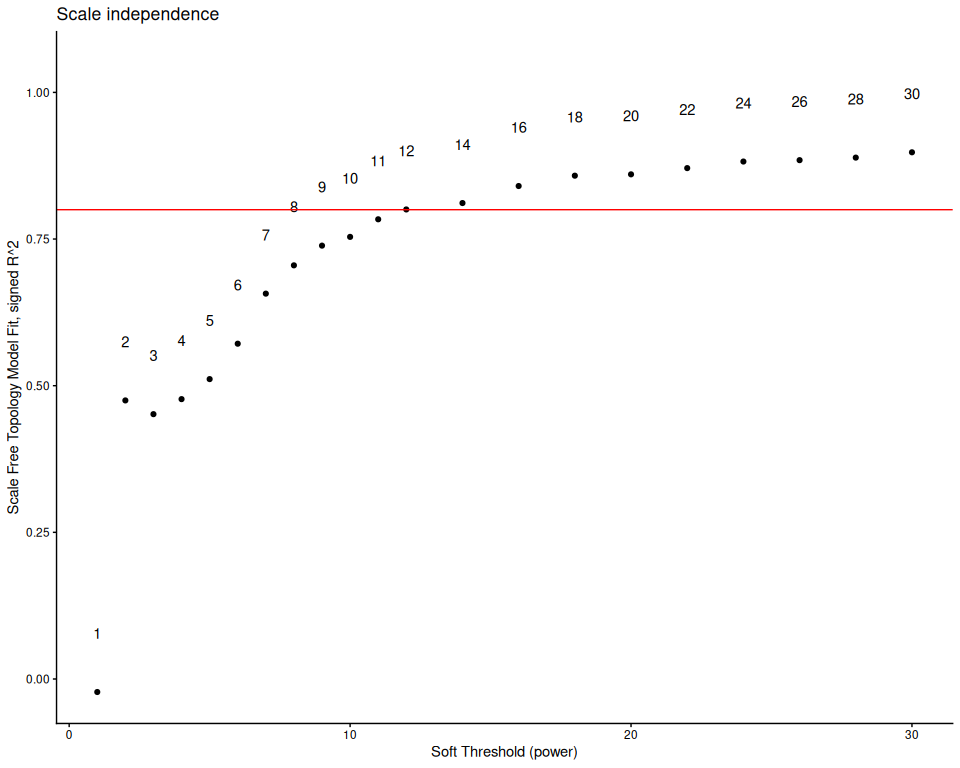
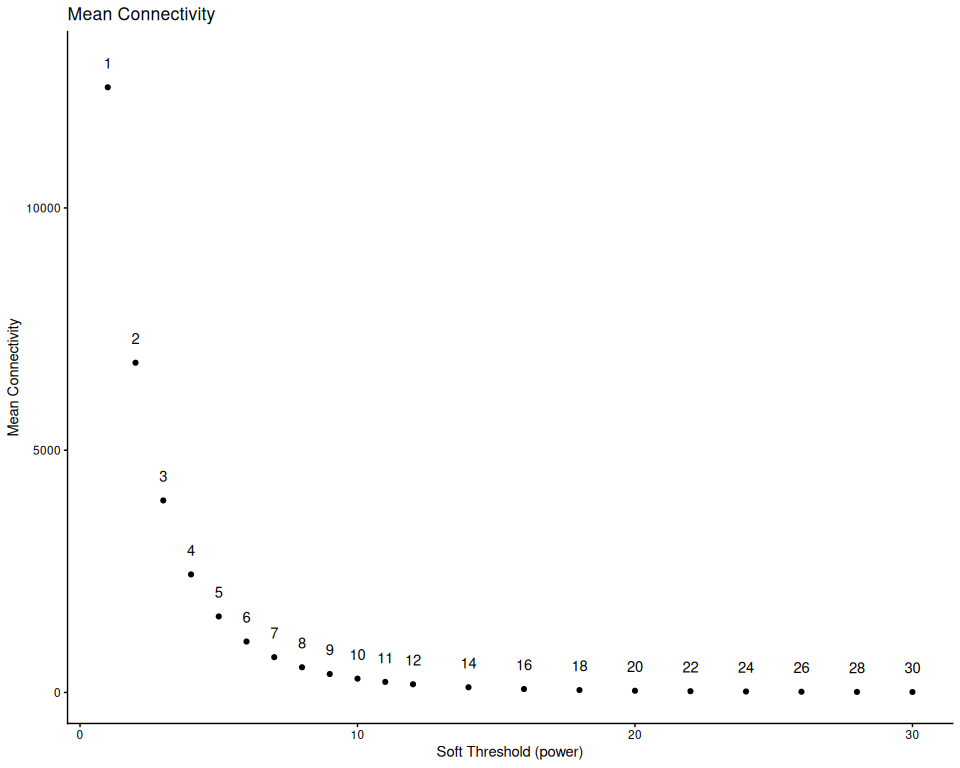

## 6. Determine parameters for WGCNA

The below takes a long time to run, so it is only run if TestParams is
set to TRUE. Otherwise, the pre-determined parameters for this species
dataset are loaded in from the species_parameters.R script. This should
be redone for any changes in data filtering and outlier removal.

``` r
if(params$TestParams == TRUE) {
  sft <- pickSoftThreshold(normalized_counts,
                           networkType = "signed",
                           RsquaredCut = 0.8,
                           powerVector = c(seq(1, 12, by = 1), seq(14, 30, by = 2)),
                           verbose=3)
  sft_df <- data.frame(sft$fitIndices) %>% dplyr::mutate(model_fit = -sign(slope) * SFT.R.sq)
  
  fit_plot <- ggplot(sft_df, aes(x = Power, y = model_fit, label = Power)) +
    geom_point() +
    geom_text(nudge_y = 0.1) +
    # We will plot what WGCNA recommends as an R^2 cutoff
    geom_hline(yintercept = 0.80, col = "red") +
    ylim(c(min(sft_df$model_fit), 1.05)) +
    xlab("Soft Threshold (power)") +
    ylab("Scale Free Topology Model Fit, signed R^2") +
    ggtitle("Scale independence") +
    theme_classic()
  
  print(fit_plot)
  
  mean_plot <- ggplot(sft_df, aes(x = Power, y = mean.k., label = Power)) +
    geom_point() +
    geom_text(nudge_y = 500) +
    xlab("Soft Threshold (power)") +
    ylab("Mean Connectivity") +
    ggtitle("Mean Connectivity") +
    theme_classic()
  
  print(mean_plot)
  
  soft_power = sft$powerEstimate
  
  if (is.na(sft$powerEstimate)) {
    stop("Soft power could not be automatically determined. Potenitally test a greater range of powers.")
}
  
  if (soft_power != config$soft_power) {
    warning(paste0(" Calculated power (" , sft$powerEstimate, 
                  ") differs from config value (", config$soft_power,"). Consider updating species_parameters.R with new value. Examine graph and confirm if the calculated power matches visual examination of the data."))
  }
  
} else {
  soft_power = config$soft_power
}
```

    ## pickSoftThreshold: will use block size 1793.
    ##  pickSoftThreshold: calculating connectivity for given powers...
    ##    ..working on genes 1 through 1793 of 24941
    ##    ..working on genes 1794 through 3586 of 24941
    ##    ..working on genes 3587 through 5379 of 24941
    ##    ..working on genes 5380 through 7172 of 24941
    ##    ..working on genes 7173 through 8965 of 24941
    ##    ..working on genes 8966 through 10758 of 24941
    ##    ..working on genes 10759 through 12551 of 24941
    ##    ..working on genes 12552 through 14344 of 24941
    ##    ..working on genes 14345 through 16137 of 24941
    ##    ..working on genes 16138 through 17930 of 24941
    ##    ..working on genes 17931 through 19723 of 24941
    ##    ..working on genes 19724 through 21516 of 24941
    ##    ..working on genes 21517 through 23309 of 24941
    ##    ..working on genes 23310 through 24941 of 24941
    ##    Power SFT.R.sq  slope truncated.R.sq  mean.k. median.k. max.k.
    ## 1      1   0.0222   4.62          0.866 12500.00  12500.00  12900
    ## 2      2   0.4750 -11.60          0.871  6810.00   6740.00   7920
    ## 3      3   0.4510  -5.29          0.929  3960.00   3880.00   5370
    ## 4      4   0.4770  -3.38          0.935  2440.00   2350.00   3860
    ## 5      5   0.5110  -2.52          0.918  1570.00   1490.00   2900
    ## 6      6   0.5720  -2.04          0.919  1050.00    971.00   2250
    ## 7      7   0.6570  -1.76          0.948   728.00    652.00   1780
    ## 8      8   0.7050  -1.75          0.950   520.00    448.00   1480
    ## 9      9   0.7390  -1.79          0.951   381.00    314.00   1260
    ## 10    10   0.7540  -1.85          0.946   285.00    225.00   1090
    ## 11    11   0.7840  -1.86          0.957   218.00    163.00    951
    ## 12    12   0.8000  -1.88          0.960   170.00    120.00    839
    ## 13    14   0.8110  -1.93          0.959   107.00     67.60    669
    ## 14    16   0.8400  -1.92          0.969    71.40     39.80    546
    ## 15    18   0.8580  -1.91          0.976    49.50     24.20    454
    ## 16    20   0.8600  -1.92          0.974    35.40     15.10    384
    ## 17    22   0.8710  -1.90          0.978    26.10      9.66    329
    ## 18    24   0.8820  -1.87          0.982    19.70      6.34    284
    ## 19    26   0.8840  -1.86          0.981    15.10      4.25    248
    ## 20    28   0.8890  -1.84          0.980    11.90      2.88    218
    ## 21    30   0.8980  -1.81          0.985     9.42      2.00    193

<!-- --><!-- -->

``` r
cat("Soft Power for WGCNA:", soft_power)
```

    ## Soft Power for WGCNA: 12

## 7. WGCNA: One-step module detection

``` r
if(params$run_WGCNA == TRUE) {
  temp_cor <- cor
  cor <- WGCNA::cor # Force it to use WGCNA cor function (fix a namespace conflict issue)
  netwk <- blockwiseModules(normalized_counts,
                            nThreads = global_params$n_cores,
  
                            # Adjacency Function
                            power = soft_power,
                            corType = "bicor",
                            networkType = "signed",
                            TOMType = "signed",
  
                            # Tree and Block Options
                            deepSplit = global_params$wgcna_default$deep_split,
                            pamRespectsDendro = F,
                            minModuleSize = global_params$wgcna_default$min_module_size,
                            maxBlockSize = 50000,
  
                            # topological overlap matrix, (TOM)
                            saveTOMs = TRUE,
                            saveTOMFileBase = file.path(outdir, "blockwiseTOM"),
                            #loadTOM = FALSE, #uncomment this if you are re-running with a previously saved TOM
  
                            # Output Options
                            mergeCutHeight = global_params$wgcna_default$merge_cut_height,
                            numericLabels = TRUE,
                            verbose = 3)
  
  cor <- temp_cor     # Return cor function to original namespace
  saveRDS(netwk, file.path(outdir, "wgcna_network.rds"))
}
```

    ##  Calculating module eigengenes block-wise from all genes
    ##    Flagging genes and samples with too many missing values...
    ##     ..step 1
    ##  ..Working on block 1 .
    ##     TOM calculation: adjacency..
    ##     ..will use 18 parallel threads.
    ##      Fraction of slow calculations: 0.000000
    ##     ..connectivity..
    ##     ..matrix multiplication (system BLAS)..
    ##     ..normalization..
    ##     ..done.
    ##    ..saving TOM for block 1 into file ../../output_RNA/WGCNA/Pacuta/blockwiseTOM-block.1.RData
    ##  ....clustering..
    ##  ....detecting modules..
    ##  ....calculating module eigengenes..
    ##  ....checking kME in modules..

    ## Warning in bicor(structure(c(6.89786248449005, 6.72775437493347,
    ## 7.21706639185292, : bicor: zero MAD in variable 'x'. Pearson correlation was
    ## used for individual columns with zero (or missing) MAD.

    ##      ..removing 1139 genes from module 1 because their KME is too low.

    ## Warning in bicor(structure(c(6.23462234996607, 6.51031737773723,
    ## 5.87018976267548, : bicor: zero MAD in variable 'x'. Pearson correlation was
    ## used for individual columns with zero (or missing) MAD.

    ##      ..removing 681 genes from module 2 because their KME is too low.

    ## Warning in bicor(structure(c(5.87018976267548, 6.72775437493347,
    ## 6.39974934735654, : bicor: zero MAD in variable 'x'. Pearson correlation was
    ## used for individual columns with zero (or missing) MAD.

    ##      ..removing 700 genes from module 3 because their KME is too low.

    ## Warning in bicor(structure(c(5.87018976267548, 5.87018976267548,
    ## 6.32943929195301, : bicor: zero MAD in variable 'x'. Pearson correlation was
    ## used for individual columns with zero (or missing) MAD.

    ##      ..removing 365 genes from module 4 because their KME is too low.

    ## Warning in bicor(structure(c(5.87018976267548, 6.53829324410924,
    ## 5.87018976267548, : bicor: zero MAD in variable 'x'. Pearson correlation was
    ## used for individual columns with zero (or missing) MAD.

    ##      ..removing 37 genes from module 5 because their KME is too low.

    ## Warning in bicor(structure(c(5.87018976267548, 5.87018976267548,
    ## 5.87018976267548, : bicor: zero MAD in variable 'x'. Pearson correlation was
    ## used for individual columns with zero (or missing) MAD.

    ##      ..removing 251 genes from module 6 because their KME is too low.

    ## Warning in bicor(structure(c(6.49811692753967, 6.45005722239549,
    ## 6.51698204427436, : bicor: zero MAD in variable 'x'. Pearson correlation was
    ## used for individual columns with zero (or missing) MAD.

    ##      ..removing 20 genes from module 7 because their KME is too low.

    ## Warning in bicor(structure(c(5.87018976267548, 5.87018976267548,
    ## 6.6150121865324, : bicor: zero MAD in variable 'x'. Pearson correlation was
    ## used for individual columns with zero (or missing) MAD.

    ##      ..removing 3 genes from module 8 because their KME is too low.

    ## Warning in bicor(structure(c(5.87018976267548, 6.20647267759897,
    ## 5.87018976267548, : bicor: zero MAD in variable 'x'. Pearson correlation was
    ## used for individual columns with zero (or missing) MAD.

    ##      ..removing 96 genes from module 9 because their KME is too low.

    ## Warning in bicor(structure(c(9.89913656233978, 9.75899622919795,
    ## 9.72822338316293, : bicor: zero MAD in variable 'x'. Pearson correlation was
    ## used for individual columns with zero (or missing) MAD.

    ##      ..removing 24 genes from module 10 because their KME is too low.
    ##      ..removing 2 genes from module 11 because their KME is too low.

    ## Warning in bicor(structure(c(11.217917644948, 11.5587835491806,
    ## 11.4561514194923, : bicor: zero MAD in variable 'x'. Pearson correlation was
    ## used for individual columns with zero (or missing) MAD.

    ##      ..removing 1 genes from module 12 because their KME is too low.

    ## Warning in bicor(structure(c(11.1056360043832, 10.7937267638293,
    ## 10.9499926949883, : bicor: zero MAD in variable 'x'. Pearson correlation was
    ## used for individual columns with zero (or missing) MAD.

    ## Warning in bicor(structure(c(11.2247237501652, 11.2398483246975,
    ## 11.1849796113271, : bicor: zero MAD in variable 'x'. Pearson correlation was
    ## used for individual columns with zero (or missing) MAD.

    ## Warning in bicor(structure(c(9.79591507866115, 10.0683399331565,
    ## 9.96032236601772, : bicor: zero MAD in variable 'x'. Pearson correlation was
    ## used for individual columns with zero (or missing) MAD.

    ##      ..removing 5 genes from module 16 because their KME is too low.
    ##      ..removing 4 genes from module 17 because their KME is too low.
    ##      ..removing 4 genes from module 18 because their KME is too low.

    ## Warning in bicor(structure(c(7.92869413362598, 7.52868207027952,
    ## 7.90823963455669, : bicor: zero MAD in variable 'x'. Pearson correlation was
    ## used for individual columns with zero (or missing) MAD.

    ## Warning in bicor(structure(c(6.83593305991491, 6.80695308189276,
    ## 6.83068620705663, : bicor: zero MAD in variable 'x'. Pearson correlation was
    ## used for individual columns with zero (or missing) MAD.

    ##      ..removing 5 genes from module 22 because their KME is too low.

    ## Warning in bicor(structure(c(5.87018976267548, 5.87018976267548,
    ## 5.87018976267548, : bicor: zero MAD in variable 'x'. Pearson correlation was
    ## used for individual columns with zero (or missing) MAD.

    ## Warning in bicor(structure(c(6.27736915302863, 6.34470124784093,
    ## 6.32943929195301, : bicor: zero MAD in variable 'x'. Pearson correlation was
    ## used for individual columns with zero (or missing) MAD.

    ## Warning in bicor(structure(c(10.0768598900852, 9.65949185011529,
    ## 9.87686560320412, : bicor: zero MAD in variable 'x'. Pearson correlation was
    ## used for individual columns with zero (or missing) MAD.

    ## Warning in bicor(structure(c(10.1226219509607, 10.0335000029061,
    ## 9.87225443560679, : bicor: zero MAD in variable 'x'. Pearson correlation was
    ## used for individual columns with zero (or missing) MAD.

    ##      ..removing 1 genes from module 31 because their KME is too low.
    ##      ..removing 1 genes from module 34 because their KME is too low.

    ## Warning in (function (x, y = NULL, robustX = TRUE, robustY = TRUE, use =
    ## "all.obs", : bicor: zero MAD in variable 'x'. Pearson correlation was used for
    ## individual columns with zero (or missing) MAD.

    ##   ..reassigning 130 genes from module 1 to modules with higher KME.
    ##   ..reassigning 32 genes from module 2 to modules with higher KME.
    ##   ..reassigning 9 genes from module 3 to modules with higher KME.
    ##   ..reassigning 2 genes from module 4 to modules with higher KME.
    ##   ..reassigning 25 genes from module 5 to modules with higher KME.
    ##   ..reassigning 9 genes from module 6 to modules with higher KME.
    ##   ..reassigning 14 genes from module 8 to modules with higher KME.
    ##   ..reassigning 3 genes from module 9 to modules with higher KME.
    ##   ..reassigning 6 genes from module 10 to modules with higher KME.
    ##   ..reassigning 3 genes from module 11 to modules with higher KME.
    ##   ..reassigning 1 genes from module 12 to modules with higher KME.
    ##   ..reassigning 2 genes from module 13 to modules with higher KME.
    ##   ..reassigning 6 genes from module 14 to modules with higher KME.
    ##   ..reassigning 1 genes from module 19 to modules with higher KME.
    ##   ..reassigning 2 genes from module 21 to modules with higher KME.
    ##   ..reassigning 9 genes from module 22 to modules with higher KME.
    ##   ..reassigning 1 genes from module 24 to modules with higher KME.
    ##   ..reassigning 1 genes from module 25 to modules with higher KME.
    ##   ..reassigning 1 genes from module 31 to modules with higher KME.
    ##  ..merging modules that are too close..
    ##      mergeCloseModules: Merging modules whose distance is less than 0.25
    ##        Calculating new MEs...