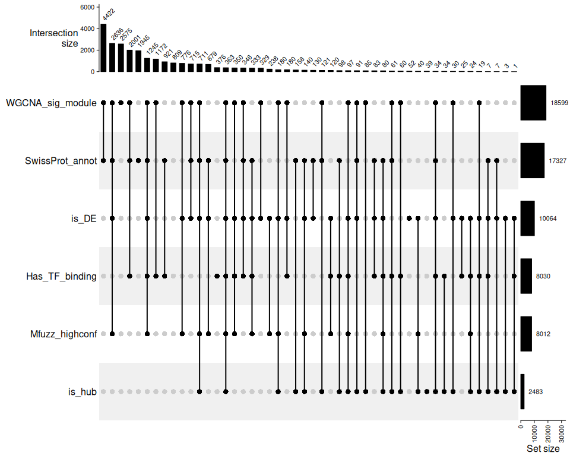

Integrate across analyses
================
Zoe Dellaert
2026-05-18

- [Analysis of Time Series bulk RNA-seq data: Combine results from all
  analyses](#analysis-of-time-series-bulk-rna-seq-data-combine-results-from-all-analyses)
  - [1. Load packages and functions](#1-load-packages-and-functions)
  - [2. Setup species-specific parameters and define
    directories](#2-setup-species-specific-parameters-and-define-directories)
  - [3. Load in filtered counts and expression results (ImpuseDE, Mfuzz,
    WGCNA, TFBS) and SwissProt
    annotations](#3-load-in-filtered-counts-and-expression-results-impusede-mfuzz-wgcna-tfbs-and-swissprot-annotations)
  - [4. Combine results across
    analyses](#4-combine-results-across-analyses)
  - [5. Visualize comparisons and overlaps across
    analyses](#5-visualize-comparisons-and-overlaps-across-analyses)
    - [Summary table](#summary-table)
    - [Visualize overlaps with upset
      plot](#visualize-overlaps-with-upset-plot)
  - [6. Save results](#6-save-results)

# Analysis of Time Series bulk RNA-seq data: Combine results from all analyses

------------------------------------------------------------------------

## 1. Load packages and functions

``` r
# set up file paths so that Rmd outputs can be viewed using github markdown
knitr::opts_knit$set(base.dir = normalizePath(paste0("../../output_RNA/reports/", params$species, "/")), base.url = "./")

knitr::opts_chunk$set(echo = TRUE, message = FALSE, fig.width = 10, fig.height = 8,
                      fig.path = "05_Integration_files/figure-gfm/")

#load packages
library(tidyverse)
```

    ## ── Attaching core tidyverse packages ──────────────────────── tidyverse 2.0.0 ──
    ## ✔ dplyr     1.1.4     ✔ readr     2.1.6
    ## ✔ forcats   1.0.0     ✔ stringr   1.6.0
    ## ✔ ggplot2   4.0.1     ✔ tibble    3.3.0
    ## ✔ lubridate 1.9.4     ✔ tidyr     1.3.1
    ## ✔ purrr     1.2.1     
    ## ── Conflicts ────────────────────────────────────────── tidyverse_conflicts() ──
    ## ✖ dplyr::filter() masks stats::filter()
    ## ✖ dplyr::lag()    masks stats::lag()
    ## ℹ Use the conflicted package (<http://conflicted.r-lib.org/>) to force all conflicts to become errors

``` r
library(knitr)
library(ComplexHeatmap)
```

    ## Loading required package: grid
    ## ========================================
    ## ComplexHeatmap version 2.26.0
    ## Bioconductor page: http://bioconductor.org/packages/ComplexHeatmap/
    ## Github page: https://github.com/jokergoo/ComplexHeatmap
    ## Documentation: http://jokergoo.github.io/ComplexHeatmap-reference
    ## 
    ## If you use it in published research, please cite either one:
    ## - Gu, Z. Complex Heatmap Visualization. iMeta 2022.
    ## - Gu, Z. Complex heatmaps reveal patterns and correlations in multidimensional 
    ##     genomic data. Bioinformatics 2016.
    ## 
    ## 
    ## The new InteractiveComplexHeatmap package can directly export static 
    ## complex heatmaps into an interactive Shiny app with zero effort. Have a try!
    ## 
    ## This message can be suppressed by:
    ##   suppressPackageStartupMessages(library(ComplexHeatmap))
    ## ========================================

``` r
#load in parameters and functions
source("species_parameters.R")
source("utils.R")

sessionInfo() #provides list of loaded packages and version of R
```

    ## R version 4.5.1 (2025-06-13)
    ## Platform: x86_64-pc-linux-gnu
    ## Running under: Ubuntu 24.04.1 LTS
    ## 
    ## Matrix products: default
    ## BLAS:   /usr/lib/x86_64-linux-gnu/openblas-pthread/libblas.so.3 
    ## LAPACK: /usr/lib/x86_64-linux-gnu/openblas-pthread/libopenblasp-r0.3.26.so;  LAPACK version 3.12.0
    ## 
    ## locale:
    ##  [1] LC_CTYPE=en_US.UTF-8       LC_NUMERIC=C              
    ##  [3] LC_TIME=en_US.UTF-8        LC_COLLATE=en_US.UTF-8    
    ##  [5] LC_MONETARY=en_US.UTF-8    LC_MESSAGES=en_US.UTF-8   
    ##  [7] LC_PAPER=en_US.UTF-8       LC_NAME=C                 
    ##  [9] LC_ADDRESS=C               LC_TELEPHONE=C            
    ## [11] LC_MEASUREMENT=en_US.UTF-8 LC_IDENTIFICATION=C       
    ## 
    ## time zone: Etc/UTC
    ## tzcode source: system (glibc)
    ## 
    ## attached base packages:
    ## [1] grid      stats     graphics  grDevices utils     datasets  methods  
    ## [8] base     
    ## 
    ## other attached packages:
    ##  [1] ComplexHeatmap_2.26.0 knitr_1.50            lubridate_1.9.4      
    ##  [4] forcats_1.0.0         stringr_1.6.0         dplyr_1.1.4          
    ##  [7] purrr_1.2.1           readr_2.1.6           tidyr_1.3.1          
    ## [10] tibble_3.3.0          ggplot2_4.0.1         tidyverse_2.0.0      
    ## [13] rmarkdown_2.30       
    ## 
    ## loaded via a namespace (and not attached):
    ##  [1] generics_0.1.4      shape_1.4.6.1       stringi_1.8.7      
    ##  [4] hms_1.1.4           digest_0.6.39       magrittr_2.0.4     
    ##  [7] evaluate_1.0.5      timechange_0.3.0    RColorBrewer_1.1-3 
    ## [10] iterators_1.0.14    circlize_0.4.17     fastmap_1.2.0      
    ## [13] foreach_1.5.2       doParallel_1.0.17   GlobalOptions_0.1.3
    ## [16] scales_1.4.0        codetools_0.2-20    cli_3.6.5          
    ## [19] rlang_1.2.0         crayon_1.5.3        withr_3.0.2        
    ## [22] yaml_2.3.12         tools_4.5.1         parallel_4.5.1     
    ## [25] tzdb_0.5.0          colorspace_2.1-2    BiocGenerics_0.56.0
    ## [28] GetoptLong_1.1.0    vctrs_0.7.0         R6_2.6.1           
    ## [31] png_0.1-8           stats4_4.5.1        matrixStats_1.5.0  
    ## [34] lifecycle_1.0.5     S4Vectors_0.48.0    IRanges_2.44.0     
    ## [37] clue_0.3-66         cluster_2.1.8.1     pkgconfig_2.0.3    
    ## [40] pillar_1.11.1       gtable_0.3.6        glue_1.8.0         
    ## [43] xfun_0.56           tidyselect_1.2.1    rstudioapi_0.17.1  
    ## [46] dichromat_2.0-0.1   rjson_0.2.23        farver_2.1.2       
    ## [49] htmltools_0.5.9     compiler_4.5.1      S7_0.2.1

## 2. Setup species-specific parameters and define directories

``` r
# get species
species <- params$species

# get parameters for this species
config <- get_params(species)
print_config(species)
```

    ## Species: Pacuta
    ## Count matrix: POC_PacutaV2_gene_count_matrix.csv
    ## Outliers: None
    ## WGCNA power: 12
    ## Mfuzz clusters: 6

``` r
# define preprocessing and analysis output directories (from 01_preprocessing.Rmd, 02_ImpulseDE2.Rmd, 03_WGCNA.Rmd, & 04_TFBS.Rmd)
input_dir <- file.path("../../output_RNA/counts_filt_norm", species)
impulse_dir <- file.path("../../output_RNA/ImpulseDE2", species)
mfuzz_dir <- file.path(impulse_dir, "Mfuzz")
wgcna_dir <- file.path("../../output_RNA/WGCNA", species)
tfbs_dir <- file.path("../../output_RNA/TFBS", species)

# set up necessary output directories if they don't exist
outdir <- file.path("../../output_RNA/analysis_integration", species)
outdir_plots <- file.path(outdir,"plots")
if (!dir.exists(outdir)) dir.create(outdir, recursive = TRUE)
if (!dir.exists(outdir_plots)) dir.create(outdir_plots, recursive = TRUE)

reportdir <- file.path("../../output_RNA/reports", params$species, "05_Integration_files/figure-gfm/")
if (!dir.exists(reportdir)) dir.create(reportdir, recursive = TRUE)
```

## 3. Load in filtered counts and expression results (ImpuseDE, Mfuzz, WGCNA, TFBS) and SwissProt annotations

``` r
# load in filtered counts data
filtered_counts <- read.csv(file.path(input_dir, "filtered_counts.csv"), row.names = 1)
all_genes <- rownames(filtered_counts)

# ImpulseDE2 results
impulse_results <- read.csv(file.path(impulse_dir, "ImpulseDE2_results.csv"))
impulse_sig <- impulse_results %>%
  filter(padj < global_params$padj_threshold)

# Mfuzz cluster assignments
mfuzz_clusters <- read.csv(file.path(mfuzz_dir, "cluster_assignments.csv"))
mfuzz_clusters_mem50 <- mfuzz_clusters %>% filter(membership > 0.5)

# WGCNA module assignments
wgcna_modules <- read.csv(file.path(wgcna_dir, "gene_modules.csv"))
hub_genes <- read.csv(file.path(wgcna_dir, "hub_genes.csv"))

# Module interaction stats (to ID significant modules)
module_stats <- read.csv(file.path(wgcna_dir, "module_interaction_stats.csv"))
sig_modules <- module_stats %>% filter(adj.P.Val < 0.05) %>% pull(module)

# TFBS Count data
tfbs <- read.csv(file.path(tfbs_dir, "TFBS_counts.csv"))

cat("Number of genes after filtering: ", nrow(filtered_counts), "\n")
```

    ## Number of genes after filtering:  24941

``` r
cat("ImpulseDE2 significant genes:", nrow(impulse_sig), "\n")
```

    ## ImpulseDE2 significant genes: 10064

``` r
cat("Mfuzz clustered genes:", nrow(mfuzz_clusters), "\n")
```

    ## Mfuzz clustered genes: 10064

``` r
cat("Mfuzz clustered genes with membership > 0.5:", nrow(mfuzz_clusters_mem50), "\n")
```

    ## Mfuzz clustered genes with membership > 0.5: 8012

``` r
cat("WGCNA modules:", n_distinct(wgcna_modules$module), "\n")
```

    ## WGCNA modules: 25

``` r
cat("Significant modules (treatment*time):", length(sig_modules), "\n")
```

    ## Significant modules (treatment*time): 16

``` r
cat("Genes with putative HSF1, FOXO3, or NRF2 transcription factor binding sites:", nrow(tfbs), "\n")
```

    ## Genes with putative HSF1, FOXO3, or NRF2 transcription factor binding sites: 8030

``` r
# SwissProt annotations
SwissProt <- read.delim(file.path(annot_dir,config$SwissProt))
cat("Annotations:", nrow(SwissProt), "Swissprot-annotated genes")
```

    ## Annotations: 19491 Swissprot-annotated genes

``` r
#loads the pattern mapping assessed by me after running ImpulseDE2 and comparing across species (see ../../output_RNA/ImpulseDE2/cluster_patterns.md)

Mfuzz_pattern_mapping <- NULL
source("../../output_RNA/ImpulseDE2/cluster_patterns.R")

Mfuzz_pattern_mapping <- pattern_mapping %>% filter(species ==  params$species) %>% dplyr::select(-species)
```

## 4. Combine results across analyses

``` r
# combine impulseDE results, Mfuzz clusters, WGCNA modules, and TFBS quantification into one master dataframe for downstream analysis and visualization

master_table <- data.frame(gene_id=all_genes) %>%
  left_join(impulse_results %>% select(Gene, padj, response_type), by = join_by(gene_id == Gene)) %>%
  mutate(is_DE = padj < 0.05) %>%
  left_join(mfuzz_clusters %>% select(Gene, cluster, membership), by = join_by(gene_id == Gene)) %>%
  mutate(Mfuzz_highconf = membership > 0.5) %>%
  left_join(Mfuzz_pattern_mapping, by = "cluster") %>%
  left_join(wgcna_modules %>% select(gene_id, module,kME_own), by = "gene_id") %>%
  mutate(is_hub = gene_id %in% hub_genes$gene_id) %>% 
  left_join(tfbs, by = join_by(gene_id == sequence_name)) %>%
  mutate(across(starts_with("count_"), ~ replace_na(.x, 0))) %>%
  mutate(has_HSF1 = count_HSF1 > 0, has_FOXO3 = count_FOXO3 > 0, has_NFE2L2 = count_NFE2L2 > 0) %>% 
  left_join(SwissProt, by = join_by(gene_id == query)) %>%
  dplyr::rename(ImpulseDE2_padj = padj,
         ImpulseDE2_response_type = response_type,
         Mfuzz_cluster = cluster,
         Mfuzz_membership = membership,
         Mfuzz_pattern = pattern,
         WGCNA_module = module,
         SwissProt_BlastHit = blast_hit,
         SwissProt_BlastEval = evalue,
         SwissProt_ProteinName = ProteinNames)
```

## 5. Visualize comparisons and overlaps across analyses

### Summary table

``` r
summary_stats <- tibble(
  metric = c(
    "Total genes (post-filtering)",
    "SwissProt-annotated genes",
    "Differentially expressed (ImpulseDE2, padj < 0.05)",
    "DE genes temporally clustered (Mfuzz, membership > 0.5)",
    "WGCNA assigned",
    "WGCNA modules",
    "WGCNA modules Sig. by Time*Treatment",
    "Hub genes (WGCNA, top 10% kME)",
    "Hub genes also differentially expressed (ImpulseDE2)",
    "Genes with HSF1 binding sites",
    "Genes with FOXO3 binding sites",
    "Genes with NRF2/NFE2L2 binding sites"
  ),
  count = c(
    nrow(master_table),
    sum(!is.na(master_table$SwissProt_ProteinName)),
    sum(master_table$is_DE, na.rm = TRUE),
    sum(master_table$Mfuzz_highconf, na.rm = TRUE),
    sum(!is.na(master_table$WGCNA_module)),
    length(unique(master_table$WGCNA_module)),
    sum(unique(master_table$WGCNA_module) %in% sig_modules),
    sum(master_table$is_hub),
    sum(master_table$is_DE & master_table$is_hub, na.rm = TRUE),
    sum(master_table$has_HSF1),
    sum(master_table$has_FOXO3),
    sum(master_table$has_NFE2L2)
  )
)

summary_stats %>% kable(format = "markdown")
```

| metric                                                   | count |
|:---------------------------------------------------------|------:|
| Total genes (post-filtering)                             | 24941 |
| SwissProt-annotated genes                                | 17327 |
| Differentially expressed (ImpulseDE2, padj \< 0.05)      | 10064 |
| DE genes temporally clustered (Mfuzz, membership \> 0.5) |  8012 |
| WGCNA assigned                                           | 24941 |
| WGCNA modules                                            |    25 |
| WGCNA modules Sig. by Time\*Treatment                    |    16 |
| Hub genes (WGCNA, top 10% kME)                           |  2483 |
| Hub genes also differentially expressed (ImpulseDE2)     |  1827 |
| Genes with HSF1 binding sites                            |  2702 |
| Genes with FOXO3 binding sites                           |  4234 |
| Genes with NRF2/NFE2L2 binding sites                     |  2115 |

### Visualize overlaps with upset plot

First make a true/false matrix for columns of interest

- is_DE = is differentially expressed (padj \< 0.05) by ImpulseDE2
- Mfuzz_highconf = of the DE genes, these had a membership of \> 0.5 in
  their Mfuzz cluster
- WGCNA_sig_module = member of a WGCNA module that was signfiicant for
  the interaction between temperature and timepoint by limma
- is_hub = is a hub gene for its module
- Has_TF_binding = has at least one match for the searched transcription
  factor bindinf motifs (HSF1, FOXO3, or NFE2L2/NRF2)
- SwissProt_annot = has a Swissprot annotation match

``` r
overlap_matrix <- master_table %>%
  mutate(Mfuzz_highconf = replace_na(Mfuzz_highconf, FALSE),
         WGCNA_sig_module = WGCNA_module %in% sig_modules,
         Has_TF_binding = has_HSF1 | has_FOXO3 | has_NFE2L2,
         SwissProt_annot = !is.na(SwissProt_BlastHit)) %>%
  select(gene_id, is_DE, Mfuzz_highconf,
         WGCNA_sig_module, is_hub,
         Has_TF_binding, SwissProt_annot) 
```

Upset plot from ComplexHeatmap package, documentation
[here](https://github.com/jokergoo/ComplexHeatmap-reference/blob/master/book/08-upset.md)

``` r
m <- make_comb_mat(as.matrix(overlap_matrix[,-1]))

pdf(file.path(outdir_plots, "analysis_overlap_upset.pdf"), width=12, height=6)
UpSet(m, 
      top_annotation = upset_top_annotation(m, add_numbers = TRUE),
      right_annotation = upset_right_annotation(m, add_numbers = TRUE),
      comb_order = order(comb_size(m), decreasing = TRUE))
dev.off()
```

    ## png 
    ##   2

``` r
png(file.path(outdir_plots, "analysis_overlap_upset.png"),width = 3000, height = 1500, res = 300)
UpSet(m, 
      top_annotation = upset_top_annotation(m, add_numbers = TRUE),
      right_annotation = upset_right_annotation(m, add_numbers = TRUE),
      comb_order = order(comb_size(m), decreasing = TRUE))
dev.off()
```

    ## png 
    ##   2

``` r
UpSet(m, 
      top_annotation = upset_top_annotation(m, add_numbers = TRUE),
      right_annotation = upset_right_annotation(m, add_numbers = TRUE),
      comb_order = order(comb_size(m), decreasing = TRUE))
```

<!-- -->

``` r
# Fisher's exact test: DE vs TF binding
contingency_DE_TF <- table(
  DE = overlap_matrix$is_DE,
  TF = overlap_matrix$Has_TF_binding)

fisher.test(contingency_DE_TF)
```

    ## 
    ##  Fisher's Exact Test for Count Data
    ## 
    ## data:  contingency_DE_TF
    ## p-value = 0.06621
    ## alternative hypothesis: true odds ratio is not equal to 1
    ## 95 percent confidence interval:
    ##  0.9964389 1.1110014
    ## sample estimates:
    ## odds ratio 
    ##    1.05218

``` r
# DE vs Hub genes  
contingency_DE_Hub <- table(
  DE = overlap_matrix$is_DE,
  Hub = overlap_matrix$is_hub)

fisher.test(contingency_DE_Hub)
```

    ## 
    ##  Fisher's Exact Test for Count Data
    ## 
    ## data:  contingency_DE_Hub
    ## p-value < 2.2e-16
    ## alternative hypothesis: true odds ratio is not equal to 1
    ## 95 percent confidence interval:
    ##  4.376935 5.286251
    ## sample estimates:
    ## odds ratio 
    ##   4.807895

``` r
# DE vs Significant module
contingency_DE_SigMod <- table(
  DE = overlap_matrix$is_DE,
  SigModule = overlap_matrix$WGCNA_sig_module)

fisher.test(contingency_DE_SigMod)
```

    ## 
    ##  Fisher's Exact Test for Count Data
    ## 
    ## data:  contingency_DE_SigMod
    ## p-value < 2.2e-16
    ## alternative hypothesis: true odds ratio is not equal to 1
    ## 95 percent confidence interval:
    ##  1.621066 1.831697
    ## sample estimates:
    ## odds ratio 
    ##   1.723015

``` r
# TF binding vs Hub genes
contingency_TF_Hub <- table(
  TF = overlap_matrix$Has_TF_binding,
  Hub = overlap_matrix$is_hub)

fisher.test(contingency_TF_Hub)
```

    ## 
    ##  Fisher's Exact Test for Count Data
    ## 
    ## data:  contingency_TF_Hub
    ## p-value = 0.0004133
    ## alternative hypothesis: true odds ratio is not equal to 1
    ## 95 percent confidence interval:
    ##  1.071973 1.278055
    ## sample estimates:
    ## odds ratio 
    ##     1.1707

## 6. Save results

``` r
# Most important: master gene table, one row per gene with all info
write.csv(master_table, file.path(outdir,"master_gene_table.csv"),row.names = FALSE)

# Also helpful: make lists of gene ids that may be useful downstream

gene_sets <- list(
  all_genes = master_table$gene_id,
  
  # ImpulseDE
  DE_all = master_table %>% filter(is_DE) %>% pull(gene_id),
  DE_transient = master_table %>% filter(is_DE, ImpulseDE2_response_type == "Transient") %>% pull(gene_id),
  
  # Mfuzz patterns (high membership)
  early_response = master_table %>% 
    filter(grepl("early", Mfuzz_pattern,ignore.case = TRUE), Mfuzz_membership > 0.5) %>% 
    pull(gene_id),
  sustained_response = master_table %>% 
    filter(grepl("sustained", Mfuzz_pattern,ignore.case = TRUE), Mfuzz_membership > 0.5) %>% 
    pull(gene_id),
  cluster_1 = master_table %>% 
    filter(Mfuzz_cluster=="1", Mfuzz_membership > 0.5) %>% pull(gene_id),
  cluster_2 = master_table %>% 
    filter(Mfuzz_cluster=="2", Mfuzz_membership > 0.5) %>% pull(gene_id),
  cluster_3 = master_table %>% 
    filter(Mfuzz_cluster=="3", Mfuzz_membership > 0.5) %>% pull(gene_id),
  cluster_4 = master_table %>% 
    filter(Mfuzz_cluster=="4", Mfuzz_membership > 0.5) %>% pull(gene_id),
  cluster_5 = master_table %>% 
    filter(Mfuzz_cluster=="5", Mfuzz_membership > 0.5) %>% pull(gene_id),
  cluster_6 = master_table %>% 
    filter(Mfuzz_cluster=="6", Mfuzz_membership > 0.5) %>% pull(gene_id),
  
  # WGCNA genes
  hub_genes = master_table %>% filter(is_hub) %>% pull(gene_id),
  sig_module_genes = master_table %>% filter(WGCNA_module %in% sig_modules) %>% pull(gene_id),
  
  # TFBS analysis
  HSF1_targets = master_table %>% filter(has_HSF1) %>% pull(gene_id),
  FOXO3_targets = master_table %>% filter(has_FOXO3) %>% pull(gene_id),
  NFE2L2_targets = master_table %>% filter(has_NFE2L2) %>% pull(gene_id),
  
  # Combined interesting sets
  DE_hub = master_table %>% filter(is_DE, is_hub) %>% pull(gene_id),
  DE_with_TF = master_table %>% 
    filter(is_DE, has_HSF1 | has_FOXO3 | has_NFE2L2) %>% 
    pull(gene_id),
  hub_with_TF = master_table %>% 
    filter(is_hub, has_HSF1 | has_FOXO3 | has_NFE2L2) %>% 
    pull(gene_id)
)

# Save gene sets
saveRDS(gene_sets, file.path(outdir, "gene_sets.rds"))
```
