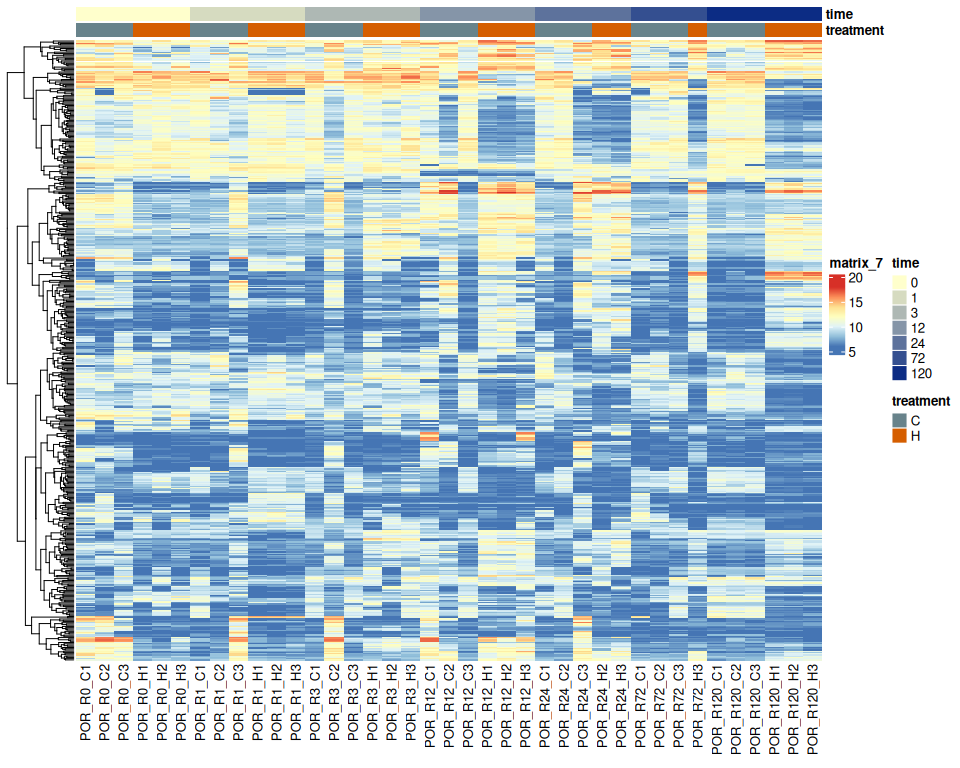
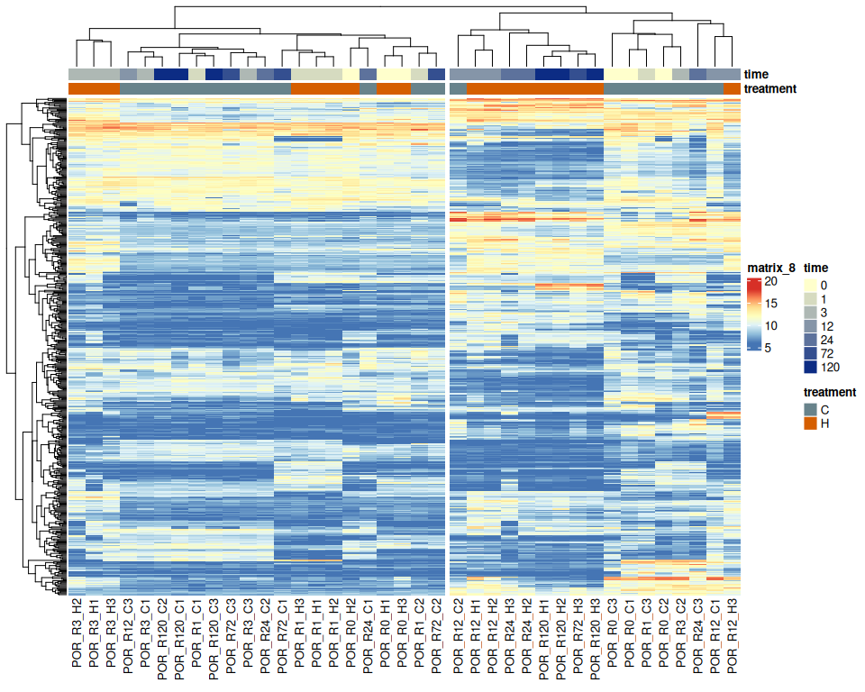

RNA-seq Preprocessing and Normalization
================
Zoe Dellaert
2026-05-09

- [Preproccessing of bulk RNA-seq
  data](#preproccessing-of-bulk-rna-seq-data)
  - [0. Setup species-specific
    parameters](#0-setup-species-specific-parameters)
  - [1. Read in raw count data](#1-read-in-raw-count-data)
  - [2. Extract metadata from sample
    names](#2-extract-metadata-from-sample-names)
  - [3. Remove outliers, if
    identified](#3-remove-outliers-if-identified)
  - [4. pOverA filtering to reduce
    dataset](#4-povera-filtering-to-reduce-dataset)
    - [Note to self: maybe replace this with treatment-specific
      filtering. To get genes expressed only at one timepoint in one
      treatment](#note-to-self-maybe-replace-this-with-treatment-specific-filtering-to-get-genes-expressed-only-at-one-timepoint-in-one-treatment)
  - [5. Create DESeq object and run
    DESeq2](#5-create-deseq-object-and-run-deseq2)
  - [6. VST-Transforming count data for
    visualization](#6-vst-transforming-count-data-for-visualization)
  - [7. Two tools to identiy potential
    outliers:](#7-two-tools-to-identiy-potential-outliers)
    - [PCA](#pca)
    - [Hierarchical Clustering](#hierarchical-clustering)
    - [Note: If outliers are identified, add them to
      species_parameters.R for this
      species.](#note-if-outliers-are-identified-add-them-to-species_parametersr-for-this-species)
  - [Final summary](#final-summary)
    - [Heatmap of variable genes](#heatmap-of-variable-genes)
    - [Text summary](#text-summary)

# Preproccessing of bulk RNA-seq data

``` r
# set up file paths so that Rmd outputs can be viewed using github markdown
knitr::opts_knit$set(base.dir = normalizePath(paste0("../../output_RNA/reports/", params$species, "/")), base.url = "./")

knitr::opts_chunk$set(echo = TRUE, message = FALSE, warning = FALSE,fig.width = 10, fig.height = 8,
                      fig.path = "01_preprocessing_files/figure-gfm/")

#load packages
library(tidyverse)
library(DESeq2)
library(pheatmap)
library(RColorBrewer)
library(genefilter)
library(ggnewscale)
library(BiocParallel)

#load in parameters and functions
source("species_parameters.R")
source("utils.R")

# set number of cores to use for parallel DESeq2 processing
register(MulticoreParam(workers = global_params$n_cores))

sessionInfo() #provides list of loaded packages and version of R
```

    ## R version 4.5.1 (2025-06-13)
    ## Platform: x86_64-pc-linux-gnu
    ## Running under: Ubuntu 24.04.1 LTS
    ## 
    ## Matrix products: default
    ## BLAS:   /usr/lib/x86_64-linux-gnu/openblas-pthread/libblas.so.3 
    ## LAPACK: /usr/lib/x86_64-linux-gnu/openblas-pthread/libopenblasp-r0.3.26.so;  LAPACK version 3.12.0
    ## 
    ## locale:
    ##  [1] LC_CTYPE=en_US.UTF-8       LC_NUMERIC=C              
    ##  [3] LC_TIME=en_US.UTF-8        LC_COLLATE=en_US.UTF-8    
    ##  [5] LC_MONETARY=en_US.UTF-8    LC_MESSAGES=en_US.UTF-8   
    ##  [7] LC_PAPER=en_US.UTF-8       LC_NAME=C                 
    ##  [9] LC_ADDRESS=C               LC_TELEPHONE=C            
    ## [11] LC_MEASUREMENT=en_US.UTF-8 LC_IDENTIFICATION=C       
    ## 
    ## time zone: Etc/UTC
    ## tzcode source: system (glibc)
    ## 
    ## attached base packages:
    ##  [1] tcltk     grid      stats4    stats     graphics  grDevices utils    
    ##  [8] datasets  methods   base     
    ## 
    ## other attached packages:
    ##  [1] Mfuzz_2.68.0                DynDoc_1.86.0              
    ##  [3] widgetTools_1.86.0          e1071_1.7-16               
    ##  [5] ComplexHeatmap_2.26.0       ImpulseDE2_0.99.10         
    ##  [7] BiocParallel_1.44.0         ggnewscale_0.5.2           
    ##  [9] genefilter_1.90.0           RColorBrewer_1.1-3         
    ## [11] pheatmap_1.0.13             DESeq2_1.50.2              
    ## [13] SummarizedExperiment_1.40.0 Biobase_2.70.0             
    ## [15] MatrixGenerics_1.22.0       matrixStats_1.5.0          
    ## [17] GenomicRanges_1.62.0        Seqinfo_1.0.0              
    ## [19] IRanges_2.44.0              S4Vectors_0.48.0           
    ## [21] BiocGenerics_0.56.0         generics_0.1.4             
    ## [23] lubridate_1.9.4             forcats_1.0.0              
    ## [25] stringr_1.6.0               dplyr_1.1.4                
    ## [27] purrr_1.2.1                 readr_2.1.6                
    ## [29] tidyr_1.3.1                 tibble_3.3.0               
    ## [31] ggplot2_4.0.1               tidyverse_2.0.0            
    ## [33] rmarkdown_2.30             
    ## 
    ## loaded via a namespace (and not attached):
    ##  [1] DBI_1.2.3               rlang_1.1.7             magrittr_2.0.4         
    ##  [4] clue_0.3-66             GetoptLong_1.1.0        compiler_4.5.1         
    ##  [7] RSQLite_2.4.5           png_0.1-8               systemfonts_1.3.1      
    ## [10] vctrs_0.7.0             shape_1.4.6.1           pkgconfig_2.0.3        
    ## [13] crayon_1.5.3            fastmap_1.2.0           magick_2.9.0           
    ## [16] XVector_0.50.0          labeling_0.4.3          tzdb_0.5.0             
    ## [19] UCSC.utils_1.4.0        ragg_1.5.0              bit_4.6.0              
    ## [22] xfun_0.56               cachem_1.1.0            GenomeInfoDb_1.44.3    
    ## [25] jsonlite_2.0.0          blob_1.2.4              DelayedArray_0.36.0    
    ## [28] cluster_2.1.8.1         parallel_4.5.1          R6_2.6.1               
    ## [31] stringi_1.8.7           Rcpp_1.1.1              iterators_1.0.14       
    ## [34] knitr_1.50              Matrix_1.6-4            splines_4.5.1          
    ## [37] timechange_0.3.0        tidyselect_1.2.1        rstudioapi_0.17.1      
    ## [40] dichromat_2.0-0.1       abind_1.4-8             yaml_2.3.12            
    ## [43] doParallel_1.0.17       codetools_0.2-20        lattice_0.22-7         
    ## [46] withr_3.0.2             KEGGREST_1.50.0         S7_0.2.1               
    ## [49] evaluate_1.0.5          survival_3.8-3          proxy_0.4-27           
    ## [52] circlize_0.4.17         Biostrings_2.78.0       pillar_1.11.1          
    ## [55] tkWidgets_1.86.0        foreach_1.5.2           vroom_1.6.7            
    ## [58] hms_1.1.4               scales_1.4.0            xtable_1.8-4           
    ## [61] class_7.3-23            glue_1.8.0              tools_4.5.1            
    ## [64] annotate_1.86.1         locfit_1.5-9.12         XML_3.99-0.18          
    ## [67] Cairo_1.7-0             cowplot_1.2.0           colorspace_2.1-2       
    ## [70] AnnotationDbi_1.72.0    GenomeInfoDbData_1.2.14 cli_3.6.5              
    ## [73] textshaping_1.0.4       S4Arrays_1.10.0         gtable_0.3.6           
    ## [76] digest_0.6.39           SparseArray_1.10.2      rjson_0.2.23           
    ## [79] farver_2.1.2            memoise_2.0.1           htmltools_0.5.9        
    ## [82] lifecycle_1.0.5         httr_1.4.7              GlobalOptions_0.1.3    
    ## [85] bit64_4.6.0-1

## 0. Setup species-specific parameters

``` r
# get species
species <- params$species

# get parameters for this species
config <- get_params(species)
print_config(species)
```

    ## Species: Pcomp
    ## Count matrix: POR_Pcomp_gene_count_matrix.csv
    ## Outliers: POR_R72_H1, POR_R72_H2, POR_R24_H1
    ## WGCNA power: 8
    ## Mfuzz clusters: 6

``` r
# set up necessary output directories if they don't exist
outdir <- file.path("../../output_RNA/counts_filt_norm", species)
if (!dir.exists(outdir)) dir.create(outdir, recursive = TRUE)

reportdir <- file.path("../../output_RNA/reports", params$species, "01_preprocessing_files/figure-gfm/")
if (!dir.exists(reportdir)) dir.create(reportdir, recursive = TRUE)
```

## 1. Read in raw count data

``` r
# load in data
counts_raw <- read.csv(file.path("../../output_RNA/count_matrices", config$count_matrix), row.names = 1)

# make list of samples 
samples <- colnames(counts_raw)
cat("Raw counts:", nrow(counts_raw), "genes x", ncol(counts_raw), "samples")
```

    ## Raw counts: 44130 genes x 42 samples

``` r
# read in SwissProt annotation
SwissProt <- read.delim(file.path(annot_dir,config$SwissProt))
cat("Annotations:", nrow(SwissProt), "Swissprot-annotated genes")
```

    ## Annotations: 22929 Swissprot-annotated genes

## 2. Extract metadata from sample names

``` r
# create metadata dataframe from sample names
meta <- data.frame(
  sample = samples, 
  species = str_split(samples, "_", simplify = TRUE)[,1], #extract first part of sample name to get species
  time = str_replace(str_split(samples, "_", simplify = TRUE)[,2],"R", ""), #extract "R##" part to get timepoint then remove R
  replicate = str_split(samples, "_", simplify = TRUE)[,3], #extract "R##" part to get timepoint then remove R
  treatment = str_replace(str_split(samples, "_", simplify = TRUE)[,3],"\\d", "")
)

# add rownames
rownames(meta) <- meta$sample

# make time and treatment factors
meta$time <- factor(meta$time, levels = as.character(sort(unique(as.numeric(meta$time)))))
meta$treatment <- factor(meta$treatment)

# save metadata
meta <- meta %>% arrange(time, treatment)
write.csv(meta, paste0("../../output_RNA/",species,"_RNA_seq_metadata.csv"))
cat("Metadata file saved to:", paste0("../../output_RNA/",species,"_RNA_seq_metadata.csv"))
```

    ## Metadata file saved to: ../../output_RNA/Pcomp_RNA_seq_metadata.csv

``` r
# reorder count matrix to be in order of metadata table (should be already but just in case)
counts_raw <- counts_raw[, meta$sample]
```

## 3. Remove outliers, if identified

``` r
outlier_samples <- config$outlier_samples

if(length(outlier_samples) > 0) {
    counts_raw <- counts_raw[, !colnames(counts_raw) %in% outlier_samples]
    meta <- meta[!rownames(meta) %in% outlier_samples, ]
}

#Confirm that sample names in metadata and count matrix match and are in the same order
stopifnot(all(meta$sample %in% colnames(counts_raw))) #are all of the sample names in the metadata column names in the gene count matrix?
stopifnot(all(meta$sample == colnames(counts_raw))) #are they the same in the same order?
```

## 4. pOverA filtering to reduce dataset

### Note to self: maybe replace this with treatment-specific filtering. To get genes expressed only at one timepoint in one treatment

``` r
# Keep genes expressed at 10+ counts in at least 7% of samples - expressed in all 3 samples at one timepoint from one treatment, can change parameters in species_parameters.R script

ffun<-filterfun(pOverA(global_params$pOverA_proportion,global_params$pOverA_counts))
counts_filt_poa <- genefilter((counts_raw), ffun) #apply filter

filtered_counts <- counts_raw[counts_filt_poa,] #keep only rows that passed filter

paste0("Number of genes after filtering: ", sum(counts_filt_poa))
```

    ## [1] "Number of genes after filtering: 27492"

``` r
paste0("% of genes kept: ", round(100*(sum(counts_filt_poa)/nrow(counts_raw)),digits=2),"%")
```

    ## [1] "% of genes kept: 62.3%"

``` r
write.csv(filtered_counts, file = file.path(outdir, "filtered_counts.csv"))
cat("Filtered counts saved to:", file.path(outdir, "filtered_counts.csv"))
```

    ## Filtered counts saved to: ../../output_RNA/counts_filt_norm/Pcomp/filtered_counts.csv

## 5. Create DESeq object and run DESeq2

``` r
dds <- DESeqDataSetFromMatrix(countData = filtered_counts,
                              colData = meta,
                              design= ~ treatment + time + treatment:time)

dds <- DESeq(dds, parallel = TRUE)

# Estimate size factors to determine if we can use VST
SF.dds <- estimateSizeFactors(dds) 
print(sort(sizeFactors(SF.dds))) #View size factors
```

    ##  POR_R12_C1 POR_R120_C3   POR_R1_H2   POR_R1_C1   POR_R1_H1  POR_R12_C3 
    ##   0.3261723   0.3505368   0.3787834   0.4125180   0.4390233   0.5440971 
    ##  POR_R24_C3   POR_R0_H1   POR_R3_C3 POR_R120_H3   POR_R0_C2  POR_R72_C3 
    ##   0.6317648   0.6349231   0.6367453   0.6428541   0.7312940   0.7463064 
    ##  POR_R24_C2  POR_R72_C1   POR_R0_H2   POR_R1_C3 POR_R120_C1   POR_R3_H3 
    ##   0.7507718   0.7557128   0.7910232   0.8204148   0.8242397   0.8863441 
    ##   POR_R0_C1   POR_R0_H3   POR_R3_C2   POR_R1_C2   POR_R1_H3  POR_R12_H3 
    ##   0.9436057   1.0619299   1.0964813   1.1494741   1.2062284   1.3180353 
    ##  POR_R72_C2   POR_R0_C3   POR_R3_C1  POR_R24_H2   POR_R3_H1  POR_R72_H3 
    ##   1.4015234   1.4077285   1.4626289   1.6148504   1.6569470   1.6651926 
    ##   POR_R3_H2  POR_R12_C2 POR_R120_C2  POR_R12_H1  POR_R24_H3  POR_R24_C1 
    ##   1.6931237   1.7537687   1.8108391   1.8299722   1.9486318   2.0596268 
    ##  POR_R12_H2 POR_R120_H2 POR_R120_H1 
    ##   2.0768756   2.9911963   3.5047915

``` r
# if all are less than 4 we can use the VST transformation
all(sizeFactors(SF.dds)) < 4
```

    ## [1] TRUE

## 6. VST-Transforming count data for visualization

``` r
vsd <- vst(dds, blind=FALSE)

#save the vsd transformation
vsd_mat <- assay(vsd)
write.csv(vsd_mat, file = file.path(outdir, "vsd_expression_matrix.csv"))
cat("VST matrix saved to:", file.path(outdir, "vsd_expression_matrix.csv"))
```

    ## VST matrix saved to: ../../output_RNA/counts_filt_norm/Pcomp/vsd_expression_matrix.csv

## 7. Two tools to identiy potential outliers:

### PCA

``` r
pcaData <- plotPCA(vsd, intgroup=c("time", "treatment"), returnData=TRUE)
percentVar <- round(100 * attr(pcaData, "percentVar"))

PCA <- ggplot() +
  geom_point(data = subset(pcaData, treatment == "C"),
             aes(x=PC1, y=PC2, color=time),
                 size=3) +
             scale_color_manual(values=brewer.pal(7, "Blues"), name = "Time (hrs) - Control") +
  
  #start new scale
  ggnewscale::new_scale_color() +
  geom_point(data = subset(pcaData, treatment == "H"),
             aes(x=PC1, y=PC2, color=time),
                 size=3) +
             scale_color_manual(values=brewer.pal(7, "Oranges"), name = "Time (hrs) - Heat") +

  xlab(paste0("PC1: ",percentVar[1],"% variance")) +
  ylab(paste0("PC2: ",percentVar[2],"% variance")) + 
  coord_fixed() + theme_bw() + ggtitle(paste(species, "- PCA of VST-transformed counts"))

print(PCA)
```

<!-- -->

``` r
save_ggplot(PCA, "PCA")

PCA_simple <- ggplot(data = pcaData, aes(x=PC1, y=PC2, color=treatment, shape=time)) +
  geom_point(size=4) +
  scale_color_manual(values= c("C"= "#4292C6", "H" = "#D94801"), labels = c("Control", "Heat")) +
  scale_shape_manual(values = c(16, 17, 15, 18, 0, 1, 2)) +
  xlab(paste0("PC1: ",percentVar[1],"% variance")) +
  ylab(paste0("PC2: ",percentVar[2],"% variance")) + 
  labs(color = "Treatment", shape = "Time (h)") +
  coord_fixed() + theme_bw() + ggtitle(paste(species, "- PCA of VST-transformed counts"))

print(PCA_simple)
```

<!-- -->

``` r
save_ggplot(PCA_simple, "PCA_simple", width = 8, height = 6)
```

### Hierarchical Clustering

``` r
sampleTree <- hclust(dist(t(vsd_mat)), method = "average")

par(mar = c(8, 4, 2, 2))
plot(sampleTree, 
     xlab = "", sub = "", cex = 0.7)
abline(h = 100, col = "red", lty = 2)
```

<!-- -->

### Note: If outliers are identified, add them to species_parameters.R for this species.

## Final summary

### Heatmap of variable genes

``` r
topVarGenes <- head(order(rowVars(vsd_mat), decreasing=TRUE), 500)

pheatmap(vsd_mat[topVarGenes, ], cluster_rows=TRUE, show_rownames=FALSE,
         cluster_cols=FALSE, 
         annotation_col= meta[,c("treatment","time")],
         annotation_colors = list("treatment" = treat_colors,
                                  "time" = time_colors))
```

<!-- -->

``` r
pheatmap(vsd_mat[topVarGenes, ], cluster_rows=TRUE, show_rownames=FALSE,
         cluster_cols=TRUE, cutree_cols = 2,
         annotation_col= meta[,c("treatment","time")],
         annotation_colors = list("treatment" = treat_colors,
                                  "time" = time_colors))
```

<!-- -->

### Text summary

    ## Preprocessing Summary: Pcomp

    ## Input

    ## ----------------------------------------

    ##   Count matrix: POR_Pcomp_gene_count_matrix.csv

    ##   Initial genes: 44130

    ##   Initial samples: 39

    ## Filtering

    ## ----------------------------------------

    ##   Outliers removed: 3

    ##      POR_R72_H1, POR_R72_H2, POR_R24_H1

    ##   Low-expression genes removed: 16638

    ##   pOverA filter: >= 10 counts in >= 7 % of samples

    ## Output

    ## ----------------------------------------

    ##   Final genes: 27492

    ##   Final samples: 39

    ##   Output directory: ../../output_RNA/counts_filt_norm/Pcomp

    ## QC Notes

    ## ----------------------------------------

    ##   Size factors range: 0.33 - 3.5

    ##   VST appropriate: Yes

    ##   PC1 variance: 44 %

    ##   PC2 variance: 16 %

``` r
sessionInfo()
```

    ## R version 4.5.1 (2025-06-13)
    ## Platform: x86_64-pc-linux-gnu
    ## Running under: Ubuntu 24.04.1 LTS
    ## 
    ## Matrix products: default
    ## BLAS:   /usr/lib/x86_64-linux-gnu/openblas-pthread/libblas.so.3 
    ## LAPACK: /usr/lib/x86_64-linux-gnu/openblas-pthread/libopenblasp-r0.3.26.so;  LAPACK version 3.12.0
    ## 
    ## locale:
    ##  [1] LC_CTYPE=en_US.UTF-8       LC_NUMERIC=C              
    ##  [3] LC_TIME=en_US.UTF-8        LC_COLLATE=en_US.UTF-8    
    ##  [5] LC_MONETARY=en_US.UTF-8    LC_MESSAGES=en_US.UTF-8   
    ##  [7] LC_PAPER=en_US.UTF-8       LC_NAME=C                 
    ##  [9] LC_ADDRESS=C               LC_TELEPHONE=C            
    ## [11] LC_MEASUREMENT=en_US.UTF-8 LC_IDENTIFICATION=C       
    ## 
    ## time zone: Etc/UTC
    ## tzcode source: system (glibc)
    ## 
    ## attached base packages:
    ##  [1] tcltk     grid      stats4    stats     graphics  grDevices utils    
    ##  [8] datasets  methods   base     
    ## 
    ## other attached packages:
    ##  [1] Mfuzz_2.68.0                DynDoc_1.86.0              
    ##  [3] widgetTools_1.86.0          e1071_1.7-16               
    ##  [5] ComplexHeatmap_2.26.0       ImpulseDE2_0.99.10         
    ##  [7] BiocParallel_1.44.0         ggnewscale_0.5.2           
    ##  [9] genefilter_1.90.0           RColorBrewer_1.1-3         
    ## [11] pheatmap_1.0.13             DESeq2_1.50.2              
    ## [13] SummarizedExperiment_1.40.0 Biobase_2.70.0             
    ## [15] MatrixGenerics_1.22.0       matrixStats_1.5.0          
    ## [17] GenomicRanges_1.62.0        Seqinfo_1.0.0              
    ## [19] IRanges_2.44.0              S4Vectors_0.48.0           
    ## [21] BiocGenerics_0.56.0         generics_0.1.4             
    ## [23] lubridate_1.9.4             forcats_1.0.0              
    ## [25] stringr_1.6.0               dplyr_1.1.4                
    ## [27] purrr_1.2.1                 readr_2.1.6                
    ## [29] tidyr_1.3.1                 tibble_3.3.0               
    ## [31] ggplot2_4.0.1               tidyverse_2.0.0            
    ## [33] rmarkdown_2.30             
    ## 
    ## loaded via a namespace (and not attached):
    ##  [1] DBI_1.2.3               rlang_1.1.7             magrittr_2.0.4         
    ##  [4] clue_0.3-66             GetoptLong_1.1.0        compiler_4.5.1         
    ##  [7] RSQLite_2.4.5           png_0.1-8               systemfonts_1.3.1      
    ## [10] vctrs_0.7.0             shape_1.4.6.1           pkgconfig_2.0.3        
    ## [13] crayon_1.5.3            fastmap_1.2.0           magick_2.9.0           
    ## [16] XVector_0.50.0          labeling_0.4.3          tzdb_0.5.0             
    ## [19] UCSC.utils_1.4.0        ragg_1.5.0              bit_4.6.0              
    ## [22] xfun_0.56               cachem_1.1.0            GenomeInfoDb_1.44.3    
    ## [25] jsonlite_2.0.0          blob_1.2.4              DelayedArray_0.36.0    
    ## [28] cluster_2.1.8.1         parallel_4.5.1          R6_2.6.1               
    ## [31] stringi_1.8.7           Rcpp_1.1.1              iterators_1.0.14       
    ## [34] knitr_1.50              Matrix_1.6-4            splines_4.5.1          
    ## [37] timechange_0.3.0        tidyselect_1.2.1        rstudioapi_0.17.1      
    ## [40] dichromat_2.0-0.1       abind_1.4-8             yaml_2.3.12            
    ## [43] doParallel_1.0.17       codetools_0.2-20        lattice_0.22-7         
    ## [46] withr_3.0.2             KEGGREST_1.50.0         S7_0.2.1               
    ## [49] evaluate_1.0.5          survival_3.8-3          proxy_0.4-27           
    ## [52] circlize_0.4.17         Biostrings_2.78.0       pillar_1.11.1          
    ## [55] tkWidgets_1.86.0        foreach_1.5.2           vroom_1.6.7            
    ## [58] hms_1.1.4               scales_1.4.0            xtable_1.8-4           
    ## [61] class_7.3-23            glue_1.8.0              tools_4.5.1            
    ## [64] annotate_1.86.1         locfit_1.5-9.12         XML_3.99-0.18          
    ## [67] Cairo_1.7-0             cowplot_1.2.0           colorspace_2.1-2       
    ## [70] AnnotationDbi_1.72.0    GenomeInfoDbData_1.2.14 cli_3.6.5              
    ## [73] textshaping_1.0.4       S4Arrays_1.10.0         gtable_0.3.6           
    ## [76] digest_0.6.39           SparseArray_1.10.2      rjson_0.2.23           
    ## [79] farver_2.1.2            memoise_2.0.1           htmltools_0.5.9        
    ## [82] lifecycle_1.0.5         httr_1.4.7              GlobalOptions_0.1.3    
    ## [85] bit64_4.6.0-1
