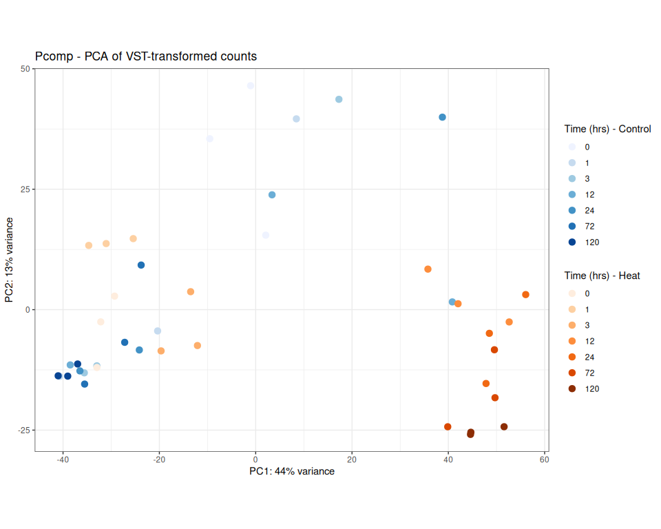
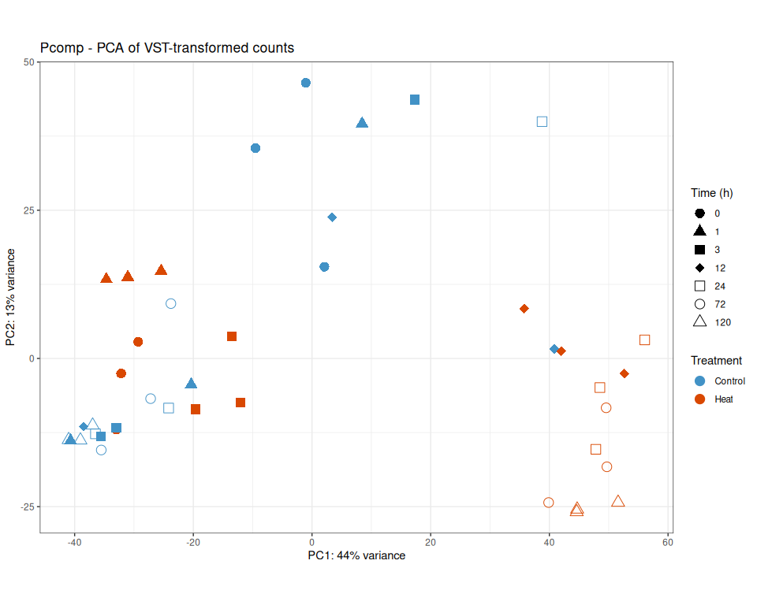
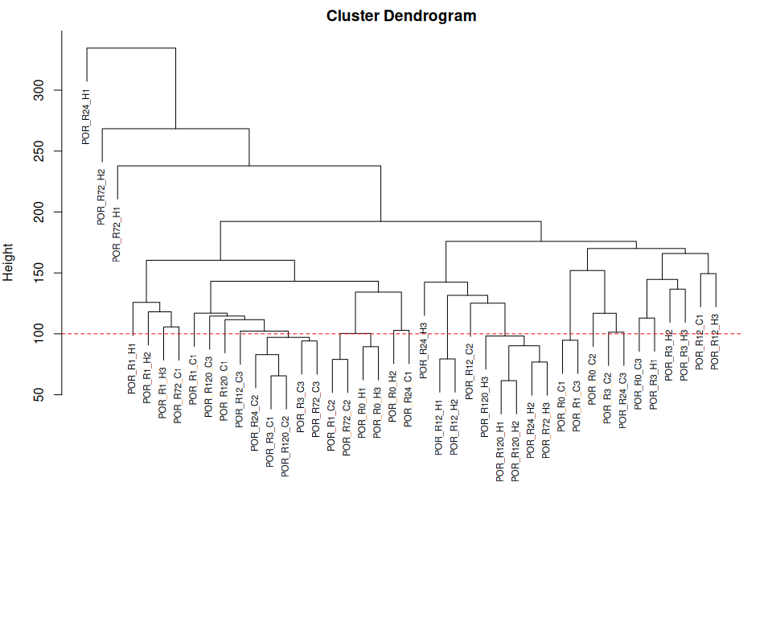

RNA-seq Preprocessing and Normalization
================
Zoe Dellaert
2026-05-08

- [Preproccessing of bulk RNA-seq
  data](#preproccessing-of-bulk-rna-seq-data)
  - [0. Setup species-specific
    parameters](#0-setup-species-specific-parameters)
  - [1. Read in raw count data](#1-read-in-raw-count-data)
  - [2. Extract metadata from sample
    names](#2-extract-metadata-from-sample-names)
  - [3. Remove outliers, if
    identified](#3-remove-outliers-if-identified)
  - [4. pOverA filtering to reduce
    dataset](#4-povera-filtering-to-reduce-dataset)
    - [Note to self: maybe replace this with treatment-specific
      filtering. To get genes expressed only at one timepoint in one
      treatment](#note-to-self-maybe-replace-this-with-treatment-specific-filtering-to-get-genes-expressed-only-at-one-timepoint-in-one-treatment)
  - [5. Create DESeq object and run
    DESeq2](#5-create-deseq-object-and-run-deseq2)
  - [6. VST-Transforming count data for
    visualization](#6-vst-transforming-count-data-for-visualization)
  - [7. Two tools to identiy potential
    outliers:](#7-two-tools-to-identiy-potential-outliers)
    - [PCA](#pca)
    - [Hierarchical Clustering](#hierarchical-clustering)
    - [Note: If outliers are identified, add them to
      species_parameters.R for this
      species.](#note-if-outliers-are-identified-add-them-to-species_parametersr-for-this-species)
  - [Final summary](#final-summary)

# Preproccessing of bulk RNA-seq data

``` r
# set up file paths so that Rmd outputs can be viewed using github markdown
knitr::opts_knit$set(base.dir = normalizePath(paste0("../../output_RNA/reports/", params$species, "/")), base.url = "./")

knitr::opts_chunk$set(echo = TRUE, message = FALSE, warning = FALSE,fig.width = 10, fig.height = 8,
                      fig.path = "01_preprocessing_files/figure-gfm/")

#load packages
library(tidyverse)
library(DESeq2)
library(pheatmap)
library(RColorBrewer)
library(genefilter)
library(ggnewscale)
library(BiocParallel)

#load in parameters and functions
source("species_parameters.R")
source("utils.R")

# set number of cores to use for parallel DESeq2 processing
register(MulticoreParam(workers = global_params$n_cores))

sessionInfo() #provides list of loaded packages and version of R
```

    ## R version 4.5.1 (2025-06-13)
    ## Platform: x86_64-pc-linux-gnu
    ## Running under: Ubuntu 24.04.1 LTS
    ## 
    ## Matrix products: default
    ## BLAS:   /usr/lib/x86_64-linux-gnu/openblas-pthread/libblas.so.3 
    ## LAPACK: /usr/lib/x86_64-linux-gnu/openblas-pthread/libopenblasp-r0.3.26.so;  LAPACK version 3.12.0
    ## 
    ## locale:
    ##  [1] LC_CTYPE=en_US.UTF-8       LC_NUMERIC=C              
    ##  [3] LC_TIME=en_US.UTF-8        LC_COLLATE=en_US.UTF-8    
    ##  [5] LC_MONETARY=en_US.UTF-8    LC_MESSAGES=en_US.UTF-8   
    ##  [7] LC_PAPER=en_US.UTF-8       LC_NAME=C                 
    ##  [9] LC_ADDRESS=C               LC_TELEPHONE=C            
    ## [11] LC_MEASUREMENT=en_US.UTF-8 LC_IDENTIFICATION=C       
    ## 
    ## time zone: Etc/UTC
    ## tzcode source: system (glibc)
    ## 
    ## attached base packages:
    ## [1] stats4    stats     graphics  grDevices utils     datasets  methods  
    ## [8] base     
    ## 
    ## other attached packages:
    ##  [1] BiocParallel_1.44.0         ggnewscale_0.5.2           
    ##  [3] genefilter_1.90.0           RColorBrewer_1.1-3         
    ##  [5] pheatmap_1.0.13             DESeq2_1.50.2              
    ##  [7] SummarizedExperiment_1.40.0 Biobase_2.70.0             
    ##  [9] MatrixGenerics_1.22.0       matrixStats_1.5.0          
    ## [11] GenomicRanges_1.62.0        Seqinfo_1.0.0              
    ## [13] IRanges_2.44.0              S4Vectors_0.48.0           
    ## [15] BiocGenerics_0.56.0         generics_0.1.4             
    ## [17] lubridate_1.9.4             forcats_1.0.0              
    ## [19] stringr_1.6.0               dplyr_1.1.4                
    ## [21] purrr_1.2.1                 readr_2.1.6                
    ## [23] tidyr_1.3.1                 tibble_3.3.0               
    ## [25] ggplot2_4.0.1               tidyverse_2.0.0            
    ## [27] rmarkdown_2.30             
    ## 
    ## loaded via a namespace (and not attached):
    ##  [1] tidyselect_1.2.1        farver_2.1.2            blob_1.2.4             
    ##  [4] Biostrings_2.78.0       S7_0.2.1                fastmap_1.2.0          
    ##  [7] XML_3.99-0.18           digest_0.6.39           timechange_0.3.0       
    ## [10] lifecycle_1.0.5         survival_3.8-3          KEGGREST_1.50.0        
    ## [13] RSQLite_2.4.5           magrittr_2.0.4          compiler_4.5.1         
    ## [16] rlang_1.1.7             tools_4.5.1             yaml_2.3.12            
    ## [19] knitr_1.50              labeling_0.4.3          S4Arrays_1.10.0        
    ## [22] bit_4.6.0               DelayedArray_0.36.0     abind_1.4-8            
    ## [25] withr_3.0.2             grid_4.5.1              xtable_1.8-4           
    ## [28] scales_1.4.0            dichromat_2.0-0.1       cli_3.6.5              
    ## [31] crayon_1.5.3            ragg_1.5.0              rstudioapi_0.17.1      
    ## [34] httr_1.4.7              tzdb_0.5.0              DBI_1.2.3              
    ## [37] cachem_1.1.0            splines_4.5.1           parallel_4.5.1         
    ## [40] AnnotationDbi_1.72.0    XVector_0.50.0          vctrs_0.7.0            
    ## [43] Matrix_1.6-4            jsonlite_2.0.0          hms_1.1.4              
    ## [46] bit64_4.6.0-1           systemfonts_1.3.1       locfit_1.5-9.12        
    ## [49] annotate_1.86.1         glue_1.8.0              codetools_0.2-20       
    ## [52] stringi_1.8.7           gtable_0.3.6            GenomeInfoDb_1.44.3    
    ## [55] UCSC.utils_1.4.0        pillar_1.11.1           htmltools_0.5.9        
    ## [58] GenomeInfoDbData_1.2.14 R6_2.6.1                textshaping_1.0.4      
    ## [61] evaluate_1.0.5          lattice_0.22-7          png_0.1-8              
    ## [64] memoise_2.0.1           Rcpp_1.1.1              SparseArray_1.10.2     
    ## [67] xfun_0.56               pkgconfig_2.0.3

## 0. Setup species-specific parameters

``` r
# get species
species <- params$species

# get parameters for this species
config <- get_params(species)
print_config(species)
```

    ## Species: Pcomp
    ## Count matrix: POR_Pcomp_gene_count_matrix.csv
    ## Outliers: None
    ## WGCNA power: 8
    ## Mfuzz clusters: 6
    ## 
    ## Output: ../../output_RNA/Pcomp

``` r
# set up necessary output directories if they don't exist
outdir <- file.path("../../output_RNA/counts_filt_norm", species)
if (!dir.exists(outdir)) dir.create(outdir, recursive = TRUE)

reportdir <- file.path("../../output_RNA/reports", params$species, "01_preprocessing_files/figure-gfm/")
if (!dir.exists(reportdir)) dir.create(reportdir, recursive = TRUE)
```

## 1. Read in raw count data

``` r
# load in data
counts_raw <- read.csv(file.path("../../output_RNA/count_matrices", config$count_matrix), row.names = 1)

# make list of samples 
samples <- colnames(counts_raw)
cat("Raw counts:", nrow(counts_raw), "genes x", ncol(counts_raw), "samples")
```

    ## Raw counts: 44130 genes x 42 samples

``` r
# read in SwissProt annotation
SwissProt <- read.delim(file.path(annot_dir,config$SwissProt))
cat("Annotations:", nrow(SwissProt), "Swissprot-annotated genes")
```

    ## Annotations: 22929 Swissprot-annotated genes

## 2. Extract metadata from sample names

``` r
# create metadata dataframe from sample names
meta <- data.frame(
  sample = samples, 
  species = str_split(samples, "_", simplify = TRUE)[,1], #extract first part of sample name to get species
  time = str_replace(str_split(samples, "_", simplify = TRUE)[,2],"R", ""), #extract "R##" part to get timepoint then remove R
  replicate = str_split(samples, "_", simplify = TRUE)[,3], #extract "R##" part to get timepoint then remove R
  treatment = str_replace(str_split(samples, "_", simplify = TRUE)[,3],"\\d", "")
)

# add rownames
rownames(meta) <- meta$sample

# make time and treatment factors
meta$time <- factor(meta$time, levels = as.character(sort(unique(as.numeric(meta$time)))))
meta$treatment <- factor(meta$treatment)

# save metadata
meta <- meta %>% arrange(time, treatment)
write.csv(meta, paste0("../../output_RNA/",species,"_RNA_seq_metadata.csv"))
cat("Metadata file saved to:", paste0("../../output_RNA/",species,"_RNA_seq_metadata.csv"))
```

    ## Metadata file saved to: ../../output_RNA/Pcomp_RNA_seq_metadata.csv

``` r
# reorder count matrix to be in order of metadata table (should be already but just in case)
counts_raw <- counts_raw[, meta$sample]
```

## 3. Remove outliers, if identified

``` r
outlier_samples <- config$outlier_samples

if(length(outlier_samples) > 0) {
    counts_raw <- counts_raw[, !colnames(counts_raw) %in% outlier_samples]
    meta <- meta[!rownames(meta) %in% outlier_samples, ]
}

#Confirm that sample names in metadata and count matrix match and are in the same order
stopifnot(all(meta$sample %in% colnames(counts_raw))) #are all of the sample names in the metadata column names in the gene count matrix?
stopifnot(all(meta$sample == colnames(counts_raw))) #are they the same in the same order?
```

## 4. pOverA filtering to reduce dataset

### Note to self: maybe replace this with treatment-specific filtering. To get genes expressed only at one timepoint in one treatment

``` r
# Keep genes expressed at 10+ counts in at least 7% of samples - expressed in all 3 samples at one timepoint from one treatment, can change parameters in species_parameters.R script

ffun<-filterfun(pOverA(global_params$pOverA_proportion,global_params$pOverA_counts))
counts_filt_poa <- genefilter((counts_raw), ffun) #apply filter

filtered_counts <- counts_raw[counts_filt_poa,] #keep only rows that passed filter

paste0("Number of genes after filtering: ", sum(counts_filt_poa))
```

    ## [1] "Number of genes after filtering: 27533"

``` r
paste0("% of genes kept: ", round(100*(sum(counts_filt_poa)/nrow(counts_raw)),digits=2),"%")
```

    ## [1] "% of genes kept: 62.39%"

``` r
write.csv(filtered_counts, file = file.path(outdir, "filtered_counts.csv"))
cat("Filtered counts saved to:", file.path(outdir, "filtered_counts.csv"))
```

    ## Filtered counts saved to: ../../output_RNA/counts_filt_norm/Pcomp/filtered_counts.csv

## 5. Create DESeq object and run DESeq2

``` r
dds <- DESeqDataSetFromMatrix(countData = filtered_counts,
                              colData = meta,
                              design= ~ treatment + time + treatment:time)

dds <- DESeq(dds, parallel = TRUE)

# Estimate size factors to determine if we can use VST
SF.dds <- estimateSizeFactors(dds) 
print(sort(sizeFactors(SF.dds))) #View size factors
```

    ##  POR_R72_H1  POR_R72_H2  POR_R24_H1 POR_R120_C3  POR_R12_C1   POR_R1_H2 
    ##   0.1915412   0.2704780   0.2788869   0.3622529   0.3981970   0.4029134 
    ##   POR_R1_C1   POR_R1_H1  POR_R12_C3   POR_R3_C3   POR_R0_H1 POR_R120_H3 
    ##   0.4150671   0.4640600   0.5738960   0.6649097   0.6777339   0.7298652 
    ##  POR_R24_C3  POR_R72_C3  POR_R72_C1  POR_R24_C2   POR_R0_H2 POR_R120_C1 
    ##   0.7411381   0.7425228   0.7770175   0.7805666   0.8281278   0.8354057 
    ##   POR_R0_C2   POR_R1_C3   POR_R3_H3   POR_R0_C1   POR_R0_H3   POR_R1_C2 
    ##   0.8719468   0.9875187   1.0852146   1.1064526   1.1440124   1.1759630 
    ##   POR_R1_H3   POR_R3_C2  POR_R72_C2   POR_R3_C1   POR_R0_C3  POR_R12_H3 
    ##   1.2567150   1.2841829   1.4041362   1.4963637   1.6057443   1.7302729 
    ## POR_R120_C2  POR_R72_H3  POR_R24_H2  POR_R12_C2   POR_R3_H1   POR_R3_H2 
    ##   1.8182241   1.8744531   1.8799754   1.9697598   2.0347063   2.0586128 
    ##  POR_R24_C1  POR_R12_H1  POR_R24_H3  POR_R12_H2 POR_R120_H2 POR_R120_H1 
    ##   2.1137645   2.3125857   2.3502852   2.6778535   3.3817337   3.8086275

``` r
# if all are less than 4 we can use the VST transformation
all(sizeFactors(SF.dds)) < 4
```

    ## [1] TRUE

## 6. VST-Transforming count data for visualization

``` r
vsd <- vst(dds, blind=FALSE)

#save the vsd transformation
vsd_mat <- assay(vsd)
write.csv(vsd_mat, file = file.path(outdir, "vsd_expression_matrix.csv"))
cat("VST matrix saved to:", file.path(outdir, "vsd_expression_matrix.csv"))
```

    ## VST matrix saved to: ../../output_RNA/counts_filt_norm/Pcomp/vsd_expression_matrix.csv

## 7. Two tools to identiy potential outliers:

### PCA

``` r
pcaData <- plotPCA(vsd, intgroup=c("time", "treatment"), returnData=TRUE)
percentVar <- round(100 * attr(pcaData, "percentVar"))

PCA <- ggplot() +
  geom_point(data = subset(pcaData, treatment == "C"),
             aes(x=PC1, y=PC2, color=time),
                 size=3) +
             scale_color_manual(values=brewer.pal(7, "Blues"), name = "Time (hrs) - Control") +
  
  #start new scale
  ggnewscale::new_scale_color() +
  geom_point(data = subset(pcaData, treatment == "H"),
             aes(x=PC1, y=PC2, color=time),
                 size=3) +
             scale_color_manual(values=brewer.pal(7, "Oranges"), name = "Time (hrs) - Heat") +

  xlab(paste0("PC1: ",percentVar[1],"% variance")) +
  ylab(paste0("PC2: ",percentVar[2],"% variance")) + 
  coord_fixed() + theme_bw() + ggtitle(paste(species, "- PCA of VST-transformed counts"))

print(PCA)
```

<!-- -->

``` r
save_ggplot(PCA, "PCA")

PCA_simple <- ggplot(data = pcaData, aes(x=PC1, y=PC2, color=treatment, shape=time)) +
  geom_point(size=4) +
  scale_color_manual(values= c("C"= "#4292C6", "H" = "#D94801"), labels = c("Control", "Heat")) +
  scale_shape_manual(values = c(16, 17, 15, 18, 0, 1, 2)) +
  xlab(paste0("PC1: ",percentVar[1],"% variance")) +
  ylab(paste0("PC2: ",percentVar[2],"% variance")) + 
  labs(color = "Treatment", shape = "Time (h)") +
  coord_fixed() + theme_bw() + ggtitle(paste(species, "- PCA of VST-transformed counts"))

print(PCA_simple)
```

<!-- -->

``` r
save_ggplot(PCA_simple, "PCA_simple", width = 8, height = 6)
```

### Hierarchical Clustering

``` r
sampleTree <- hclust(dist(t(vsd_mat)), method = "average")

par(mar = c(8, 4, 2, 2))
plot(sampleTree, 
     xlab = "", sub = "", cex = 0.7)
abline(h = 100, col = "red", lty = 2)
```

<!-- -->

### Note: If outliers are identified, add them to species_parameters.R for this species.

## Final summary

    ## Preprocessing Summary: Pcomp

    ## Input

    ## ----------------------------------------

    ##   Count matrix: POR_Pcomp_gene_count_matrix.csv

    ##   Initial genes: 44130

    ##   Initial samples: 42

    ## Filtering

    ## ----------------------------------------

    ##   Outliers removed: 0

    ##   Low-expression genes removed: 16597

    ##   pOverA filter: >= 10 counts in >= 7 % of samples

    ## Output

    ## ----------------------------------------

    ##   Final genes: 27533

    ##   Final samples: 42

    ##   Output directory: ../../output_RNA/counts_filt_norm/Pcomp

    ## QC Notes

    ## ----------------------------------------

    ##   Size factors range: 0.19 - 3.81

    ##   VST appropriate: Yes

    ##   PC1 variance: 44 %

    ##   PC2 variance: 13 %

``` r
sessionInfo()
```

    ## R version 4.5.1 (2025-06-13)
    ## Platform: x86_64-pc-linux-gnu
    ## Running under: Ubuntu 24.04.1 LTS
    ## 
    ## Matrix products: default
    ## BLAS:   /usr/lib/x86_64-linux-gnu/openblas-pthread/libblas.so.3 
    ## LAPACK: /usr/lib/x86_64-linux-gnu/openblas-pthread/libopenblasp-r0.3.26.so;  LAPACK version 3.12.0
    ## 
    ## locale:
    ##  [1] LC_CTYPE=en_US.UTF-8       LC_NUMERIC=C              
    ##  [3] LC_TIME=en_US.UTF-8        LC_COLLATE=en_US.UTF-8    
    ##  [5] LC_MONETARY=en_US.UTF-8    LC_MESSAGES=en_US.UTF-8   
    ##  [7] LC_PAPER=en_US.UTF-8       LC_NAME=C                 
    ##  [9] LC_ADDRESS=C               LC_TELEPHONE=C            
    ## [11] LC_MEASUREMENT=en_US.UTF-8 LC_IDENTIFICATION=C       
    ## 
    ## time zone: Etc/UTC
    ## tzcode source: system (glibc)
    ## 
    ## attached base packages:
    ## [1] stats4    stats     graphics  grDevices utils     datasets  methods  
    ## [8] base     
    ## 
    ## other attached packages:
    ##  [1] BiocParallel_1.44.0         ggnewscale_0.5.2           
    ##  [3] genefilter_1.90.0           RColorBrewer_1.1-3         
    ##  [5] pheatmap_1.0.13             DESeq2_1.50.2              
    ##  [7] SummarizedExperiment_1.40.0 Biobase_2.70.0             
    ##  [9] MatrixGenerics_1.22.0       matrixStats_1.5.0          
    ## [11] GenomicRanges_1.62.0        Seqinfo_1.0.0              
    ## [13] IRanges_2.44.0              S4Vectors_0.48.0           
    ## [15] BiocGenerics_0.56.0         generics_0.1.4             
    ## [17] lubridate_1.9.4             forcats_1.0.0              
    ## [19] stringr_1.6.0               dplyr_1.1.4                
    ## [21] purrr_1.2.1                 readr_2.1.6                
    ## [23] tidyr_1.3.1                 tibble_3.3.0               
    ## [25] ggplot2_4.0.1               tidyverse_2.0.0            
    ## [27] rmarkdown_2.30             
    ## 
    ## loaded via a namespace (and not attached):
    ##  [1] tidyselect_1.2.1        farver_2.1.2            blob_1.2.4             
    ##  [4] Biostrings_2.78.0       S7_0.2.1                fastmap_1.2.0          
    ##  [7] XML_3.99-0.18           digest_0.6.39           timechange_0.3.0       
    ## [10] lifecycle_1.0.5         survival_3.8-3          KEGGREST_1.50.0        
    ## [13] RSQLite_2.4.5           magrittr_2.0.4          compiler_4.5.1         
    ## [16] rlang_1.1.7             tools_4.5.1             yaml_2.3.12            
    ## [19] knitr_1.50              labeling_0.4.3          S4Arrays_1.10.0        
    ## [22] bit_4.6.0               DelayedArray_0.36.0     abind_1.4-8            
    ## [25] withr_3.0.2             grid_4.5.1              xtable_1.8-4           
    ## [28] scales_1.4.0            dichromat_2.0-0.1       cli_3.6.5              
    ## [31] crayon_1.5.3            ragg_1.5.0              rstudioapi_0.17.1      
    ## [34] httr_1.4.7              tzdb_0.5.0              DBI_1.2.3              
    ## [37] cachem_1.1.0            splines_4.5.1           parallel_4.5.1         
    ## [40] AnnotationDbi_1.72.0    XVector_0.50.0          vctrs_0.7.0            
    ## [43] Matrix_1.6-4            jsonlite_2.0.0          hms_1.1.4              
    ## [46] bit64_4.6.0-1           systemfonts_1.3.1       locfit_1.5-9.12        
    ## [49] annotate_1.86.1         glue_1.8.0              codetools_0.2-20       
    ## [52] stringi_1.8.7           gtable_0.3.6            GenomeInfoDb_1.44.3    
    ## [55] UCSC.utils_1.4.0        pillar_1.11.1           htmltools_0.5.9        
    ## [58] GenomeInfoDbData_1.2.14 R6_2.6.1                textshaping_1.0.4      
    ## [61] evaluate_1.0.5          lattice_0.22-7          png_0.1-8              
    ## [64] memoise_2.0.1           Rcpp_1.1.1              SparseArray_1.10.2     
    ## [67] xfun_0.56               pkgconfig_2.0.3
