WGCNA Analysis
================
Zoe Dellaert
2026-06-29

- [Network analysis of Time Series bulk RNA-seq
  data](#network-analysis-of-time-series-bulk-rna-seq-data)
  - [Introduction](#introduction)
  - [1. Load packages and functions](#1-load-packages-and-functions)
  - [2. Setup species-specific
    parameters](#2-setup-species-specific-parameters)
  - [3. Setup WGCNA Parameters and plotting
    function](#3-setup-wgcna-parameters-and-plotting-function)
  - [4. Load in transformed counts and
    metadata](#4-load-in-transformed-counts-and-metadata)
  - [5. Check for outliers](#5-check-for-outliers)
  - [6. Determine parameters for
    WGCNA](#6-determine-parameters-for-wgcna)
  - [7. WGCNA: One-step module
    detection](#7-wgcna-one-step-module-detection)
    - [Load saved WGCNA results](#load-saved-wgcna-results)
    - [Extract module eigengenes and save module information for each
      gene](#extract-module-eigengenes-and-save-module-information-for-each-gene)
    - [Visualize the network](#visualize-the-network)
  - [8. Treatment and Time Module
    Correlation](#8-treatment-and-time-module-correlation)
    - [Correlation Heatmaps](#correlation-heatmaps)
    - [Run linear model on each module
      vs. treatment](#run-linear-model-on-each-module-vs-treatment)
    - [Plot example module over time](#plot-example-module-over-time)
    - [Trajectory plots for all
      modules](#trajectory-plots-for-all-modules)
    - [Individual module heatmaps](#individual-module-heatmaps)
  - [9. Module Membership (kME) and Hub
    Genes](#9-module-membership-kme-and-hub-genes)
  - [10. Save outputs](#10-save-outputs)

# Network analysis of Time Series bulk RNA-seq data

## Introduction

The goal of this script is to identify co-expressed gene modules from
our time-course RNA-seq data. I hope to identify genes which respond to
the heat stress similarly over time.

Helpful *general* WGCNA tutorial to help with parameter decisions can be
found
[here](https://alexslemonade.github.io/refinebio-examples/04-advanced-topics/network-analysis_rnaseq_01_wgcna.html#46_Determine_parameters_for_WGCNA)
and another
[here](https://bioinformaticsworkbook.org/tutorials/wgcna.html#gsc.tab=0).

And other example code here: -
<https://github.com/fscucchia/HI_PhotoPhysio_TPC_geneExpr/blob/983b837e2dbd9bad2dfeda764dcc0b9da254073a/Gene_expression/scripts/WGCNA_Network_Analysis/WGCNA_Pacu.r>

How to install packages:

``` r
if (!require("BiocManager", quietly = TRUE))
    install.packages("BiocManager")

BiocManager::install("impute", type = "source")
BiocManager::install("WGCNA",force = TRUE)
```

------------------------------------------------------------------------

## 1. Load packages and functions

``` r
# set up file paths so that Rmd outputs can be viewed using github markdown
knitr::opts_knit$set(base.dir = normalizePath(paste0("../../output_RNA/reports/", params$species, "/")), base.url = "./")

knitr::opts_chunk$set(echo = TRUE, message = FALSE, fig.width = 10, fig.height = 8,
                      fig.path = "03_WGCNA_files/figure-gfm/")

#load packages
library(tidyverse)
library(WGCNA)

#load in parameters and functions
source("species_parameters.R")
source("utils.R")

sessionInfo() #provides list of loaded packages and version of R
```

    ## R version 4.5.1 (2025-06-13)
    ## Platform: x86_64-apple-darwin20
    ## Running under: macOS Tahoe 26.4.1
    ## 
    ## Matrix products: default
    ## BLAS:   /Library/Frameworks/R.framework/Versions/4.5-x86_64/Resources/lib/libRblas.0.dylib 
    ## LAPACK: /Library/Frameworks/R.framework/Versions/4.5-x86_64/Resources/lib/libRlapack.dylib;  LAPACK version 3.12.1
    ## 
    ## locale:
    ## [1] en_US.UTF-8/en_US.UTF-8/en_US.UTF-8/C/en_US.UTF-8/en_US.UTF-8
    ## 
    ## time zone: America/New_York
    ## tzcode source: internal
    ## 
    ## attached base packages:
    ##  [1] tcltk     grid      stats4    stats     graphics  grDevices utils    
    ##  [8] datasets  methods   base     
    ## 
    ## other attached packages:
    ##  [1] knitr_1.51                  WGCNA_1.74                 
    ##  [3] fastcluster_1.3.0           dynamicTreeCut_1.63-1      
    ##  [5] Mfuzz_2.70.0                DynDoc_1.88.0              
    ##  [7] widgetTools_1.88.0          e1071_1.7-17               
    ##  [9] ComplexHeatmap_2.26.1       ImpulseDE2_0.99.10         
    ## [11] BiocParallel_1.44.0         ggnewscale_0.5.2           
    ## [13] genefilter_1.92.0           RColorBrewer_1.1-3         
    ## [15] pheatmap_1.0.13             DESeq2_1.50.2              
    ## [17] SummarizedExperiment_1.40.0 Biobase_2.70.0             
    ## [19] MatrixGenerics_1.22.0       matrixStats_1.5.0          
    ## [21] GenomicRanges_1.62.1        Seqinfo_1.0.0              
    ## [23] IRanges_2.44.0              S4Vectors_0.48.1           
    ## [25] BiocGenerics_0.56.0         generics_0.1.4             
    ## [27] lubridate_1.9.5             forcats_1.0.1              
    ## [29] stringr_1.6.0               dplyr_1.2.1                
    ## [31] purrr_1.2.2                 readr_2.2.0                
    ## [33] tidyr_1.3.2                 tibble_3.3.1               
    ## [35] ggplot2_4.0.3               tidyverse_2.0.0            
    ## [37] rmarkdown_2.31             
    ## 
    ## loaded via a namespace (and not attached):
    ##  [1] rstudioapi_0.19.0     shape_1.4.6.1         magrittr_2.0.5       
    ##  [4] farver_2.1.2          GlobalOptions_0.1.4   ragg_1.5.2           
    ##  [7] vctrs_0.7.3           memoise_2.0.1         base64enc_0.1-6      
    ## [10] htmltools_0.5.9       S4Arrays_1.10.1       SparseArray_1.10.10  
    ## [13] Formula_1.2-5         htmlwidgets_1.6.4     impute_1.84.0        
    ## [16] cachem_1.1.0          lifecycle_1.0.5       iterators_1.0.14     
    ## [19] pkgconfig_2.0.3       Matrix_1.7-5          R6_2.6.1             
    ## [22] fastmap_1.2.0         clue_0.3-68           digest_0.6.39        
    ## [25] colorspace_2.1-2      AnnotationDbi_1.72.0  textshaping_1.0.5    
    ## [28] Hmisc_5.2-6           RSQLite_3.53.2        labeling_0.4.3       
    ## [31] timechange_0.4.0      mgcv_1.9-4            httr_1.4.8           
    ## [34] abind_1.4-8           compiler_4.5.1        proxy_0.4-29         
    ## [37] bit64_4.8.2           withr_3.0.3           doParallel_1.0.17    
    ## [40] backports_1.5.1       htmlTable_2.5.0       S7_0.2.2             
    ## [43] DBI_1.3.0             tkWidgets_1.88.0      DelayedArray_0.36.1  
    ## [46] rjson_0.2.23          tools_4.5.1           foreign_0.8-91       
    ## [49] otel_0.2.0            nnet_7.3-20           glue_1.8.1           
    ## [52] nlme_3.1-169          checkmate_2.3.4       cluster_2.1.8.2      
    ## [55] gtable_0.3.6          tzdb_0.5.0            preprocessCore_1.72.0
    ## [58] class_7.3-23          data.table_1.18.4     hms_1.1.4            
    ## [61] utf8_1.2.6            XVector_0.50.0        foreach_1.5.2        
    ## [64] pillar_1.11.1         limma_3.66.0          vroom_1.7.1          
    ## [67] circlize_0.4.18       splines_4.5.1         lattice_0.22-9       
    ## [70] survival_3.8-6        bit_4.6.0             annotate_1.88.0      
    ## [73] tidyselect_1.2.1      locfit_1.5-9.12       Biostrings_2.78.0    
    ## [76] gridExtra_2.3.1       xfun_0.59             statmod_1.5.2        
    ## [79] stringi_1.8.7         yaml_2.3.12           evaluate_1.0.5       
    ## [82] codetools_0.2-20      cli_3.6.6             rpart_4.1.27         
    ## [85] xtable_1.8-8          systemfonts_1.3.2     Rcpp_1.1.1-1.1       
    ## [88] png_0.1-9             XML_3.99-0.23         parallel_4.5.1       
    ## [91] blob_1.3.0            scales_1.4.0          crayon_1.5.3         
    ## [94] GetoptLong_1.1.1      rlang_1.2.0           cowplot_1.2.0        
    ## [97] KEGGREST_1.50.0

## 2. Setup species-specific parameters

``` r
# get species
species <- params$species

# get parameters for this species
config <- get_params(species)
print_config(species)
```

    ## Species: Pcomp
    ## Count matrix: POR_Pcomp_gene_count_matrix.csv
    ## Outliers: POR_R72_H1, POR_R72_H2, POR_R24_H1
    ## WGCNA power: 28
    ## Mfuzz clusters: 6

``` r
# define preprocessing output directory (from 01_preprocessing.Rmd)
input_dir <- file.path("../../output_RNA/counts_filt_norm", species)

# set up necessary output directories if they don't exist
outdir <- file.path("../../output_RNA/WGCNA", species)
outdir_plots <- file.path(outdir,"plots")
if (!dir.exists(outdir)) dir.create(outdir, recursive = TRUE)
if (!dir.exists(outdir_plots)) dir.create(outdir_plots, recursive = TRUE)

reportdir <- file.path("../../output_RNA/reports", params$species, "03_WGCNA_files/figure-gfm/")
if (!dir.exists(reportdir)) dir.create(reportdir, recursive = TRUE)
```

## 3. Setup WGCNA Parameters and plotting function

``` r
options(stringsAsFactors = FALSE)
enableWGCNAThreads(global_params$n_cores)
```

    ## Allowing parallel execution with up to 4 working processes.

Create Heatmap function based heavily off of the following tutorial:

<https://alexslemonade.github.io/refinebio-examples/04-advanced-topics/network-analysis_rnaseq_01_wgcna.html#46_Determine_parameters_for_WGCNA>

``` r
make_module_heatmap <- function(module_name,
                                expression_mat = normalized_counts,
                                metadata_df = meta,
                                gene_module_key_df = gene_module_df,
                                module_eigengenes_df = module_eigengenes) {
  # Create a summary heatmap of a given module.
  # based on https://alexslemonade.github.io/refinebio-examples/04-advanced-topics/network-analysis_rnaseq_01_wgcna.html#46_Determine_parameters_for_WGCNA

  # Set up the module eigengene with its sample
  module_eigengene <- module_eigengenes_df %>%
    dplyr::select(all_of(module_name)) %>%
    tibble::rownames_to_column("sample")

  # Set up column annotation from metadata
  col_annot_df <- metadata_df %>%
    # Only select the treatment, time, and sample ID columns
    dplyr::select(sample, treatment, time) %>%
    # Add on the eigengene expression by joining with sample IDs
    dplyr::inner_join(module_eigengene, by = "sample") %>%
    # Arrange by treatment and time point
    dplyr::arrange(treatment, time, sample) %>%
    # Store sample
    tibble::column_to_rownames("sample")

  # Create the ComplexHeatmap column annotation object
  col_annot <- ComplexHeatmap::HeatmapAnnotation(
    # Supply treatment and time labels
    treatment = col_annot_df$treatment,
    time = col_annot_df$time,
    # Add annotation barplot
    module_eigengene = ComplexHeatmap::anno_barplot(dplyr::select(col_annot_df, module_name)),
    # Pick colors for each experimental group in treatment
    col = list(treatment = c("C" = "lightblue4", "H" = "#D55E00"),
               time = time_colors)
  )

  # Get a vector of the gene IDs that correspond to this module
  module_genes <- gene_module_key_df %>%
    dplyr::filter(module == module_name) %>%
    dplyr::pull(gene_id)

  # Set up the gene expression data frame
  mod_mat <- expression_mat %>%
    t() %>%
    as.data.frame() %>%
    # Only keep genes from this module
    dplyr::filter(rownames(.) %in% module_genes) %>%
    # Order the samples to match col_annot_df
    dplyr::select(rownames(col_annot_df)) %>%
    # Data needs to be a matrix
    as.matrix()

  # Normalize the gene expression values
  mod_mat <- mod_mat %>%
    # Scale can work on matrices, but it does it by column so we will need to
    # transpose first
    t() %>%
    scale() %>%
    # And now we need to transpose back
    t()

  # Create a color function based on standardized scale
  color_func <- circlize::colorRamp2(
    c(-1.5, 0, 1.5),
    c("#67a9cf", "#f7f7f7", "#ef8a62")
  )

  # Plot on a heatmap
  heatmap <- ComplexHeatmap::Heatmap(mod_mat,
    name = module_name,
    # Supply color function
    col = color_func,
    # Supply column annotation
    bottom_annotation = col_annot,
    # We don't want to cluster samples
    cluster_columns = FALSE,
    # We don't need to show sample or gene labels
    show_row_names = FALSE,
    show_column_names = FALSE
  )

  # Return heatmap
  return(heatmap)
}
```

## 4. Load in transformed counts and metadata

``` r
# load in vst-transformed counts
vst <- read.csv(file.path(input_dir, "vst_expression_matrix.csv"))
vst <- vst %>% column_to_rownames(var = "X")

# transpose counts to format needed for WGCNA
normalized_counts <- t(vst)

# load in metadata
meta <- read.csv(paste0("../../output_RNA/",species,"_RNA_seq_metadata.csv"))
meta <- meta %>% column_to_rownames(var = "X") %>% select(-c(species, replicate))

# remove outliers that are still in metadata file but were removed prior to the vst transformation
outlier_samples <- config$outlier_samples

if(length(outlier_samples) > 0) {
    meta <- meta[!rownames(meta) %in% outlier_samples, ]
}

all(rownames(meta) %in% colnames(vst))
```

    ## [1] TRUE

``` r
all(rownames(meta) == colnames(vst))
```

    ## [1] TRUE

``` r
cat("Input data:", nrow(vst), "genes x", ncol(vst), "samples")
```

    ## Input data: 27492 genes x 39 samples

## 5. Check for outliers

Ideally these were removed during 01_preprocessing.Rmd. See line above
to confirm the number of samples matches what you expect after outlier
removal. But confirm by clustering the samples and view as a tree.

``` r
sampleTree = hclust(dist(normalized_counts), method = "average")
plot(sampleTree, main = paste(species, "- Sample Clustering"), 
     xlab = "", sub = "", cex = 0.6)
```

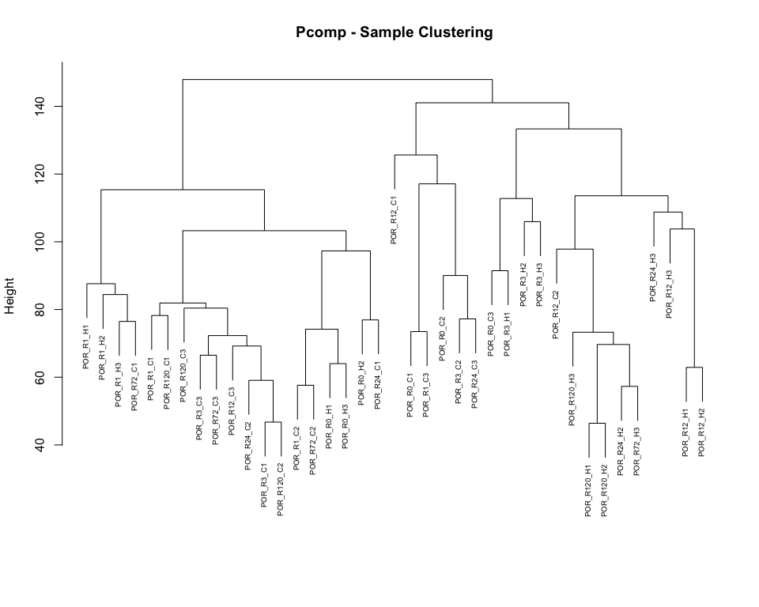<!-- -->

## 6. Determine parameters for WGCNA

The below takes a long time to run, so it is only run if TestParams is
set to TRUE. Otherwise, the pre-determined parameters for this species
dataset are loaded in from the species_parameters.R script. This should
be redone for any changes in data filtering and outlier removal.

``` r
if(params$TestParams == TRUE) {
  sft <- pickSoftThreshold(normalized_counts,
                           networkType = "signed",
                           RsquaredCut = 0.8,
                           powerVector = c(seq(1, 12, by = 1), seq(14, 30, by = 2)),
                           verbose=3)
  sft_df <- data.frame(sft$fitIndices) %>% dplyr::mutate(model_fit = -sign(slope) * SFT.R.sq)
  
  fit_plot <- ggplot(sft_df, aes(x = Power, y = model_fit, label = Power)) +
    geom_point() +
    geom_text(nudge_y = 0.1) +
    # We will plot what WGCNA recommends as an R^2 cutoff
    geom_hline(yintercept = 0.80, col = "red") +
    ylim(c(min(sft_df$model_fit), 1.05)) +
    xlab("Soft Threshold (power)") +
    ylab("Scale Free Topology Model Fit, signed R^2") +
    ggtitle("Scale independence") +
    theme_classic()
  
  print(fit_plot)
  
  mean_plot <- ggplot(sft_df, aes(x = Power, y = mean.k., label = Power)) +
    geom_point() +
    geom_text(nudge_y = 500) +
    xlab("Soft Threshold (power)") +
    ylab("Mean Connectivity") +
    ggtitle("Mean Connectivity") +
    theme_classic()
  
  print(mean_plot)
  
  soft_power = sft$powerEstimate
  
  if (is.na(sft$powerEstimate)) {
    stop("Soft power could not be automatically determined. Potenitally test a greater range of powers.")
}
  
  if (soft_power != config$soft_power) {
    warning(paste0(" Calculated power (" , sft$powerEstimate, 
                  ") differs from config value (", config$soft_power,"). Consider updating species_parameters.R with new value. Examine graph and confirm if the calculated power matches visual examination of the data."))
  }
  
} else {
  soft_power = config$soft_power
}

cat("Soft Power for WGCNA:", soft_power)
```

    ## Soft Power for WGCNA: 28

## 7. WGCNA: One-step module detection

``` r
if(params$run_WGCNA == TRUE) {
  temp_cor <- cor
  cor <- WGCNA::cor # Force it to use WGCNA cor function (fix a namespace conflict issue)
  netwk <- blockwiseModules(normalized_counts,
                            nThreads = global_params$n_cores,
  
                            # Adjacency Function
                            power = soft_power,
                            corType = "bicor",
                            networkType = "signed",
                            TOMType = "signed",
  
                            # Tree and Block Options
                            deepSplit = global_params$wgcna_default$deep_split,
                            pamRespectsDendro = F,
                            minModuleSize = global_params$wgcna_default$min_module_size,
                            maxBlockSize = 50000,
  
                            # topological overlap matrix, (TOM)
                            saveTOMs = TRUE,
                            saveTOMFileBase = file.path(outdir, "blockwiseTOM"),
                            #loadTOM = FALSE, #uncomment this if you are re-running with a previously saved TOM
  
                            # Output Options
                            mergeCutHeight = global_params$wgcna_default$merge_cut_height,
                            numericLabels = TRUE,
                            verbose = 3)
  
  cor <- temp_cor     # Return cor function to original namespace
  saveRDS(netwk, file.path(outdir, "wgcna_network.rds"))
}
```

### Load saved WGCNA results

``` r
netwk <- readRDS(file.path(outdir, "wgcna_network.rds"))

# what is stored in this object?
names(netwk)
```

    ##  [1] "colors"         "unmergedColors" "MEs"            "goodSamples"   
    ##  [5] "goodGenes"      "dendrograms"    "TOMFiles"       "blockGenes"    
    ##  [9] "blocks"         "MEsOK"

``` r
# save the module labels
moduleLabels <- netwk$colors

# how many modules are there?
paste("There are", length(unique(moduleLabels)), "modules in our current analysis.")
```

    ## [1] "There are 29 modules in our current analysis."

``` r
# see the distribution of genes across these labelled modules
table(moduleLabels)
```

    ## moduleLabels
    ##     0     1     2     3     4     5     6     7     8     9    10    11    12 
    ## 12032  5187  1801  1756  1503   649   577   500   463   310   288   287   259 
    ##    13    14    15    16    17    18    19    20    21    22    23    24    25 
    ##   235   178   175   154   146   140   132   128   127   118    74    65    62 
    ##    26    27    28 
    ##    60    49    37

``` r
# Convert labels to colors for plotting
moduleColors <- labels2colors(moduleLabels)
```

### Extract module eigengenes and save module information for each gene

``` r
# save the module information for each gene as a dataframe
gene_module_df <- data.frame(
  gene_id = names(netwk$colors),
  module = paste0("ME", netwk$colors),
  color = labels2colors(netwk$colors)
)

# extract the module eigengenes - average expression of that module for each sample
module_eigengenes <- netwk$MEs

# confirm that the sample metadata and sample labels for the module eigengenes are matching
all.equal(meta$sample, rownames(module_eigengenes))
```

    ## [1] TRUE

### Visualize the network

``` r
# Plot the dendrogram and the module colors underneath
plotDendroAndColors(
  netwk$dendrograms[[1]],
  moduleColors,
  "Module colors",
  dendroLabels = FALSE,
  hang = 0.03,
  addGuide = TRUE,
  guideHang = 0.05, main = "Consensus gene dendrogram and module colors")
```

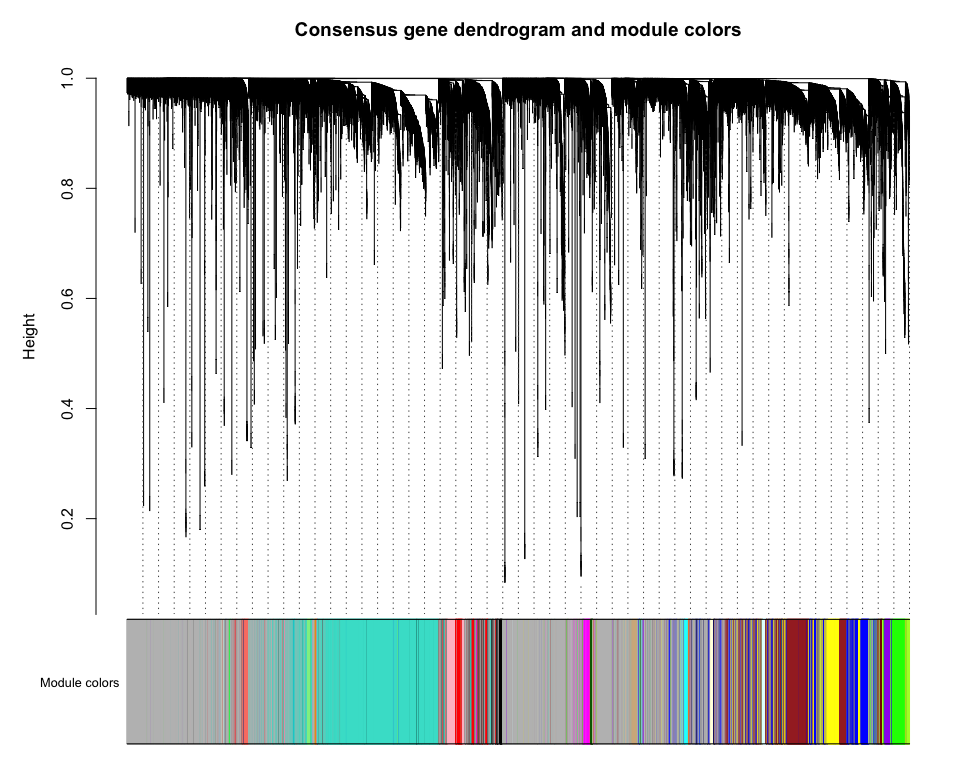<!-- -->

## 8. Treatment and Time Module Correlation

### Correlation Heatmaps

``` r
nSamples = nrow(normalized_counts)

time_treat_factorial <- meta %>%
  mutate(group = paste0(time, "hr-", ifelse(treatment == "C", "Control", "Heat"))) %>%
  select(sample, group) %>%
  mutate(value = 1) %>%
  tidyr::pivot_wider(names_from = group, values_from = value, values_fill = 0) %>%
  column_to_rownames(var = "sample") %>%
  relocate(contains("Control"), contains("Heat")) %>%
   mutate(across(everything(), as.factor))

# Reorder modules so similar modules are next to each other
module_eigengenes_ordered <- orderMEs(module_eigengenes)
module_order = names(module_eigengenes_ordered)

moduleTraitCor =  WGCNA::cor(module_eigengenes_ordered, time_treat_factorial, use = "p");
moduleTraitPvalue = corPvalueStudent(moduleTraitCor, nSamples);

textMatrix <- ifelse(moduleTraitPvalue < 0.05,
                     paste0(signif(moduleTraitCor, 2), "\n(",
                            signif(moduleTraitPvalue, 2), ")"),"")

#pdf(file.path(outdir_plots,"all_heatmap.pdf"),width=8, height=8)
# Will display correlations and their p-values

#par(mar = c(4, 3, 2, 2))
labeledHeatmap(Matrix = moduleTraitCor,
               textMatrix = textMatrix,
               xLabels = names(time_treat_factorial),
               yLabels = names(module_eigengenes_ordered),
               ySymbols = names(module_eigengenes_ordered),
               colorLabels = TRUE,
               colors = blueWhiteRed(100),
               setStdMargins = FALSE,
               cex.text = 0.5,
               cex.lab = 0.7,
               cex.colorLabels = 0.7,
               zlim = c(-1,1),
               main = paste(species, "- Module-trait relationships - all"))
```

    ## Warning in plot.window(xlim, ylim, log = log, ...): "cex.colorLabels" is not a
    ## graphical parameter

    ## Warning in title(main = main, sub = sub, xlab = xlab, ylab = ylab, ...):
    ## "cex.colorLabels" is not a graphical parameter

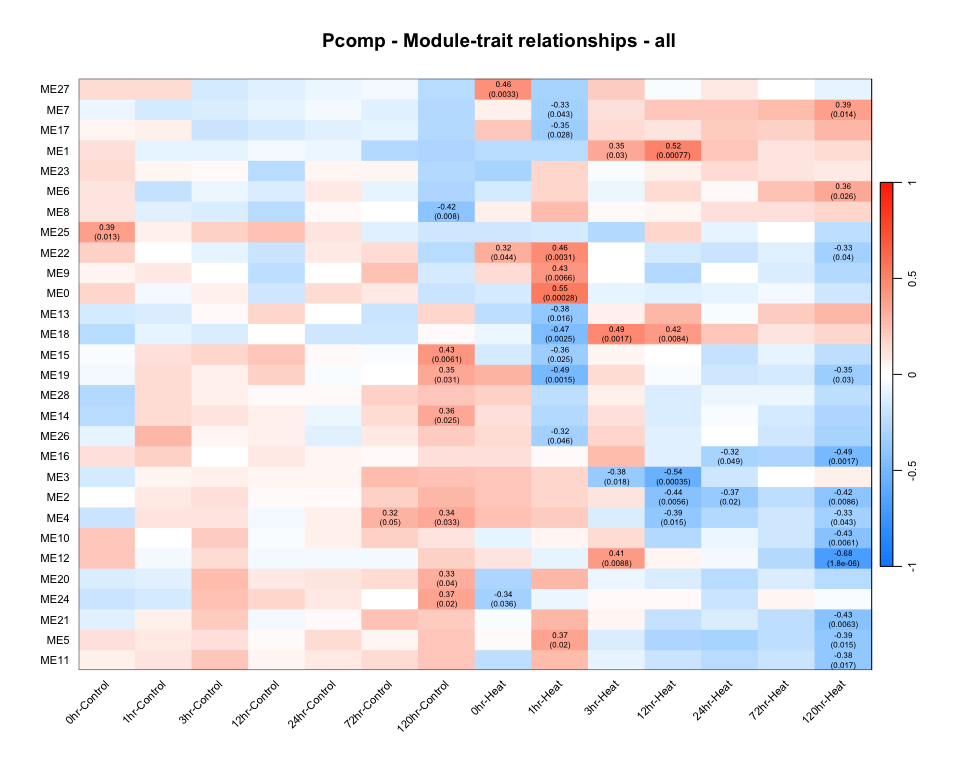<!-- -->

``` r
#dev.off()
```

#### ggplot version

``` r
# Add treatment names
module_eigengenes_ordered$treatment_time = paste0(meta$time,"hr","-",ifelse(meta$treatment == "C", "Control", "Heat"))
module_eigengenes_ordered$treatment = meta$treatment
module_eigengenes_ordered <- module_eigengenes_ordered %>% arrange(treatment)

mmPval = moduleTraitPvalue %>% as.data.frame() %>% rownames_to_column("module") %>%
  pivot_longer(-module, names_to = "treatment_time", values_to = "pvalue")

mmCor = moduleTraitCor %>% as.data.frame() %>% rownames_to_column("module") %>%
  pivot_longer(-module, names_to = "treatment_time", values_to = "correlation") %>%
  left_join(mmPval, by = c("module", "treatment_time")) %>%
  mutate(
    label = ifelse(pvalue < 0.05,
                   paste0(signif(correlation, 2)), ""),
    # use this if you want the p-value also plotted
    #label = ifelse(pvalue < 0.05,
    #               paste0(signif(correlation, 2), "\n(", signif(pvalue, 2), ")"), ""),
    module = factor(module, levels = rev(module_order)),
    treatment_time = factor(treatment_time, levels = unique(module_eigengenes_ordered$treatment_time)))

# save module trait correlation csv
write.csv(mmCor, file.path(outdir, "module_trait_correlations.csv"), row.names = FALSE)

# plot module trait correlation heatmap
ggplot(mmCor, aes(x=treatment_time, y=module, fill=correlation)) +
  geom_tile(color = "white", linewidth = 0.3) +
  geom_text(aes(label = label), size = 3, color = "black") +
  theme_minimal(base_size = 12) +
  scale_fill_gradient2(
    low = "#4575B4",
    high = "#D73027",
    mid = "white",
    midpoint = 0,
    limits = c(-1, 1)) +
  labs(title = "Module-trait Relationships", y = "Modules", fill="Correlation")+
  theme(
    axis.text.x = element_text(angle = 45, hjust = 1),
    panel.grid = element_blank(),
    axis.ticks = element_blank()
  ) #+coord_fixed(ratio = 0.7)
```

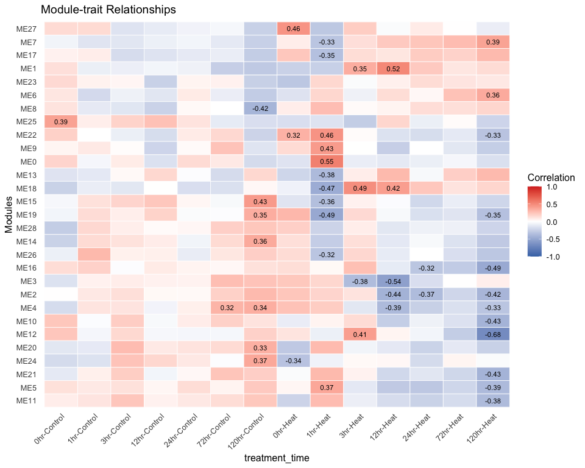<!-- -->

``` r
save_ggplot(plot = last_plot(), filename = "all_heatmap_ggplot", width = 8, height = 8)
```

### Run linear model on each module vs. treatment

``` r
# Create the design matrix for full (with interaction) models, use factor for time since non-evenly spaced intervals

meta$time_factor <- factor(meta$time)
des_mat_full <- model.matrix(~ treatment*time_factor, data = meta)
head(des_mat_full)
```

    ##           (Intercept) treatmentH time_factor1 time_factor3 time_factor12
    ## POR_R0_C1           1          0            0            0             0
    ## POR_R0_C2           1          0            0            0             0
    ## POR_R0_C3           1          0            0            0             0
    ## POR_R0_H1           1          1            0            0             0
    ## POR_R0_H2           1          1            0            0             0
    ## POR_R0_H3           1          1            0            0             0
    ##           time_factor24 time_factor72 time_factor120 treatmentH:time_factor1
    ## POR_R0_C1             0             0              0                       0
    ## POR_R0_C2             0             0              0                       0
    ## POR_R0_C3             0             0              0                       0
    ## POR_R0_H1             0             0              0                       0
    ## POR_R0_H2             0             0              0                       0
    ## POR_R0_H3             0             0              0                       0
    ##           treatmentH:time_factor3 treatmentH:time_factor12
    ## POR_R0_C1                       0                        0
    ## POR_R0_C2                       0                        0
    ## POR_R0_C3                       0                        0
    ## POR_R0_H1                       0                        0
    ## POR_R0_H2                       0                        0
    ## POR_R0_H3                       0                        0
    ##           treatmentH:time_factor24 treatmentH:time_factor72
    ## POR_R0_C1                        0                        0
    ## POR_R0_C2                        0                        0
    ## POR_R0_C3                        0                        0
    ## POR_R0_H1                        0                        0
    ## POR_R0_H2                        0                        0
    ## POR_R0_H3                        0                        0
    ##           treatmentH:time_factor120
    ## POR_R0_C1                         0
    ## POR_R0_C2                         0
    ## POR_R0_C3                         0
    ## POR_R0_H1                         0
    ## POR_R0_H2                         0
    ## POR_R0_H3                         0

``` r
# lmFit() needs a transposed version of the matrix
fit_full <- limma::lmFit(t(module_eigengenes), design = des_mat_full)

# Apply empirical Bayes to smooth standard errors
fit_full <- limma::eBayes(fit_full)

# Apply multiple testing correction and obtain stats
stats_df_full <- limma::topTable(fit_full,
                                 number = ncol(module_eigengenes)) %>%
  tibble::rownames_to_column("module")

## interaction <- treatment effect differs by time
## we care most about the interaction, the full model will pull out modules that vary in both treatments by time also (like a circadian rhythm 0hr vs 12hr difference)

interaction_coefs <- grep("treatment.*:time", colnames(des_mat_full), value = TRUE)

stats_interaction <- limma::topTable(fit_full,
                                     coef = interaction_coefs,
                                     number = ncol(module_eigengenes)) %>%
  tibble::rownames_to_column("module")

## which modules are significant by the interaction term
top_mod_sig_interaction <- stats_interaction %>% filter(adj.P.Val < 0.05)  %>% pull(module)

cat(length(top_mod_sig_interaction), "modules are significant for the interaction term (treatment*time).\n")
```

    ## 7 modules are significant for the interaction term (treatment*time).

``` r
# save the top 5 for further plotting:
top5_interaction <- stats_interaction %>% arrange(adj.P.Val)  %>% head(5) %>% pull(module)

cat("Top 5 modules significant by the interaction term:", paste(top5_interaction, collapse = ", "))
```

    ## Top 5 modules significant by the interaction term: ME12, ME4, ME19, ME1, ME2

``` r
# save interaction model stats
write.csv(stats_interaction, file.path(outdir, "module_interaction_stats.csv"), row.names = FALSE)
```

### Plot example module over time

``` r
eigengenes_treatment_df <- module_eigengenes %>%
  tibble::rownames_to_column("sample") %>%
  dplyr::inner_join(meta %>%
    dplyr::select(sample, treatment,time),
  by = c("sample" = "sample"))

toplot <- top5_interaction[1]

eigenplot <- ggplot(eigengenes_treatment_df, aes(x = factor(time), y = get(toplot),color = treatment)) +
  geom_point(alpha = 0.4, size = 2.5) +
  stat_summary(fun = mean, geom = "line", aes(group = treatment), linewidth = 0.8) +
  stat_summary(fun = mean, geom = "point", size = 3.5) +
  stat_summary(fun.data = mean_se, geom = "errorbar", width = 0.2) +
  scale_color_manual(values = treat_colors) +
  theme_classic() +
  labs(x = "Time (hours)", y = "Module Eigengene",
       title = paste(species, "-", toplot),
       subtitle = paste("Adj p-value for time*treatment interaction:", signif(stats_interaction %>% filter(module == toplot) %>% pull(adj.P.Val), 3))) 

print(eigenplot)
```

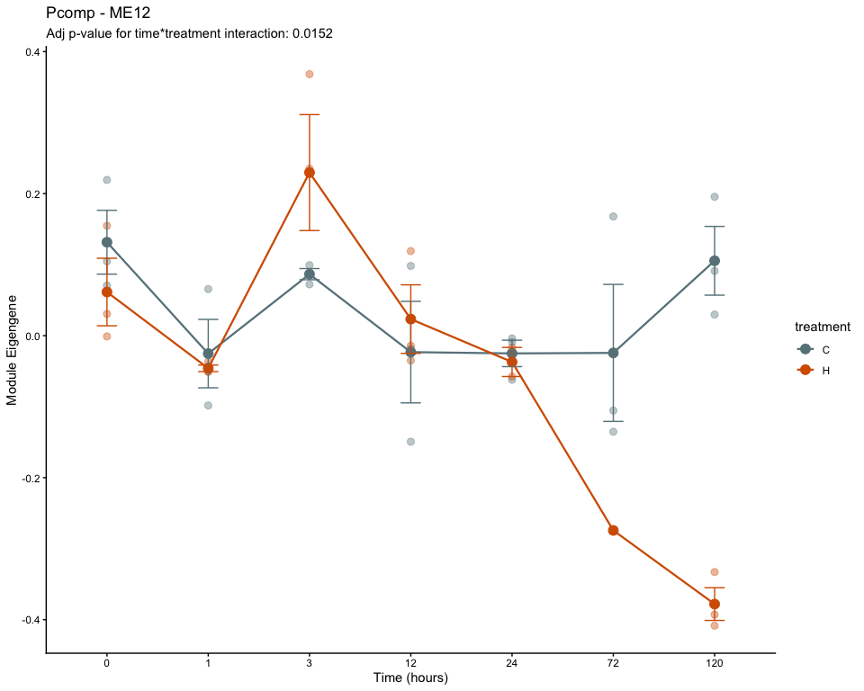<!-- -->

### Trajectory plots for all modules

``` r
eigengenes_treatment_df_long <- eigengenes_treatment_df %>%
  pivot_longer(cols = starts_with("ME"),
               names_to = "module",
               values_to = "eigengene_value") %>%
  mutate(module = factor(module, levels = module_order)) %>%
  mutate(module_label = ifelse(module %in% top_mod_sig_interaction,
                                paste0("*",module),
                                as.character(module)))

eigengenes_summary <- eigengenes_treatment_df_long %>%
  group_by(module, module_label, time, treatment) %>%
  summarize(mean_value = mean(eigengene_value),
            se = sd(eigengene_value) / sqrt(n()),
            .groups = "drop")

ggplot(eigengenes_summary, aes(x = factor(time), y = mean_value, color = treatment, group = treatment)) +
  geom_line(linewidth = 0.5) +
  geom_errorbar(aes(ymin = mean_value - se, ymax = mean_value + se), width = 0.2) +
  scale_color_manual(values = treat_colors) +
  facet_wrap(~module_label, ncol = 5, scales = "free_y") +
  theme_classic() +
  theme(
    strip.text = element_text(size = 8, face = "bold"),
    axis.text = element_text(size = 7),
    legend.position = "bottom") +
  labs(x = "Time (hours)", y = "Module Eigengene")
```

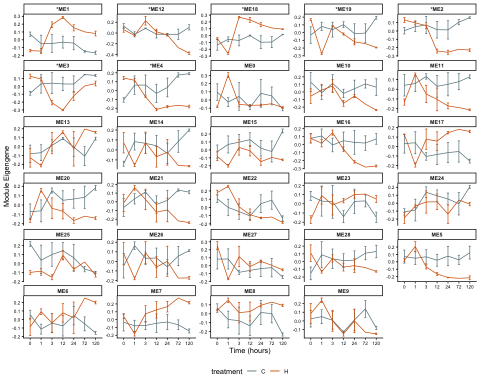<!-- -->

``` r
save_ggplot(plot = last_plot(), filename = "all_modules_lines", width = 14, height = 12)
```

### Individual module heatmaps

``` r
for (module in top5_interaction){
  print(make_module_heatmap(module_name = module))
}
```

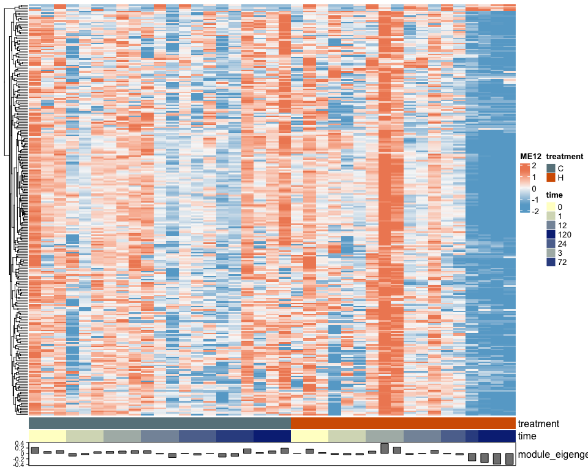<!-- -->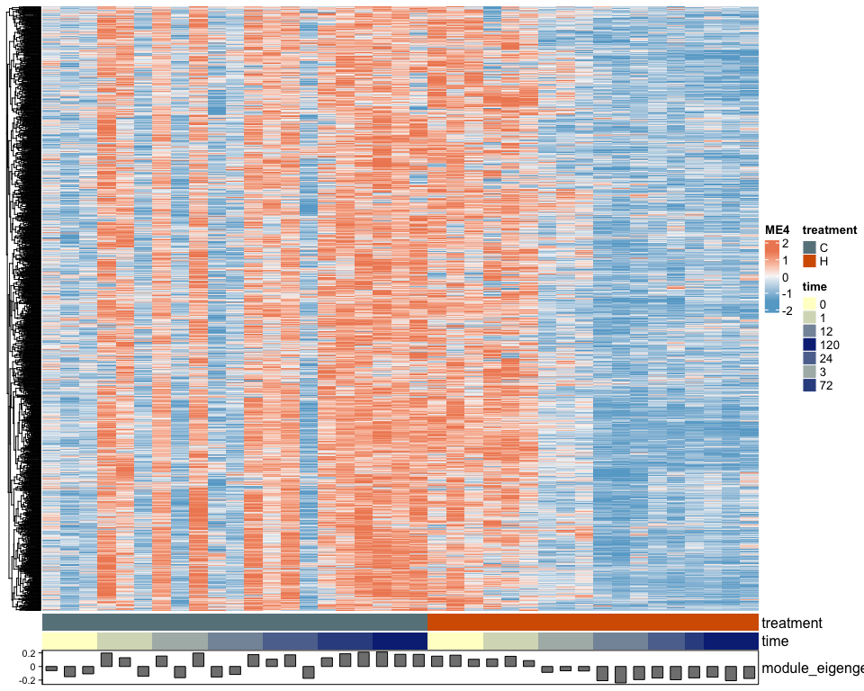<!-- -->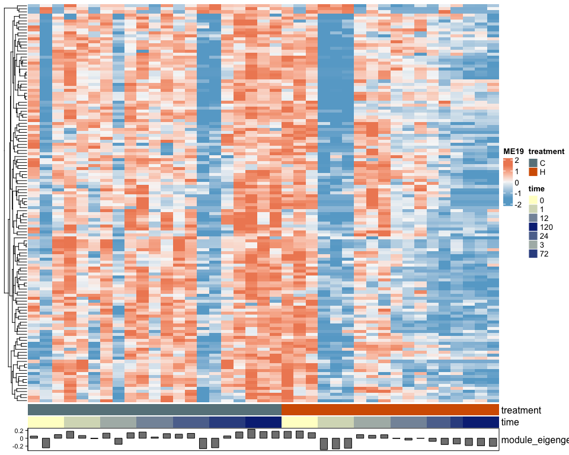<!-- -->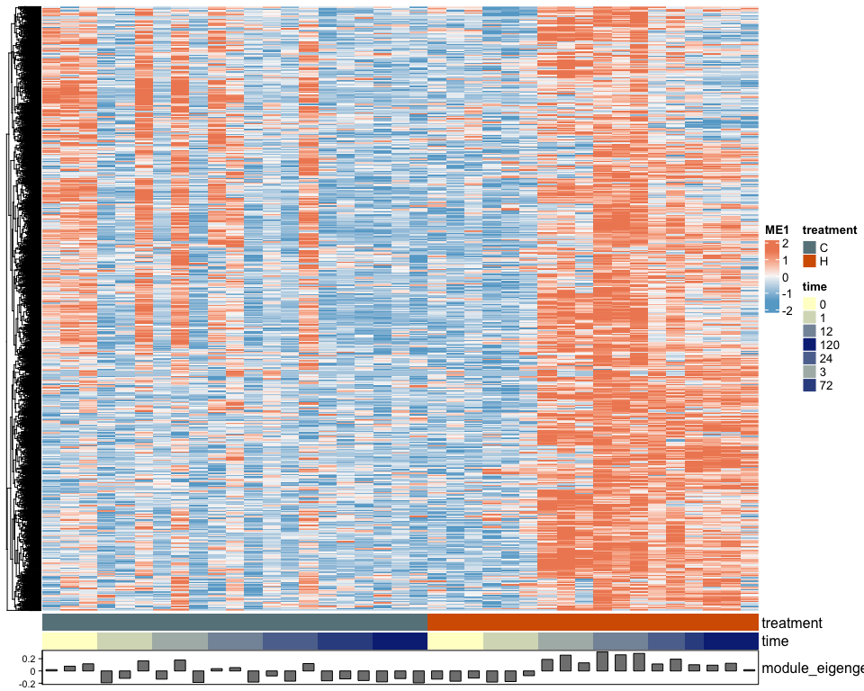<!-- -->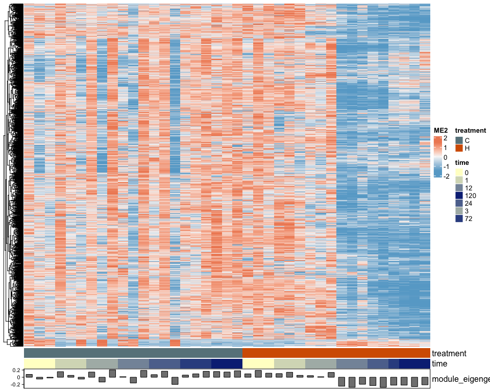<!-- -->

## 9. Module Membership (kME) and Hub Genes

``` r
# Calculate module membership (kME) - correlation of each gene with each module eigengene
kME <- signedKME(normalized_counts, module_eigengenes)
colnames(kME) <- str_replace(colnames(kME),"kME", "kME_")

# Add kME to gene_module_df
gene_module_df <- gene_module_df %>%
  bind_cols(kME) %>%
  rowwise() %>%
  # KME_own = the module membership for that gene in the module it was assigned to by WGCNA
  mutate(kME_own = get(paste0("kME_", str_remove(module,"ME")))) %>%
  ungroup() %>% select(gene_id, module, color, kME_own, everything())

# Identify hub genes: top 10% in each module by kME
hub_genes <- gene_module_df %>%
  group_by(module) %>%
  slice_max(kME_own, prop = 0.1) %>%
  ungroup()

cat("Hub genes per module:\n")
```

    ## Hub genes per module:

``` r
print(table(hub_genes$module))
```

    ## 
    ##  ME0  ME1 ME10 ME11 ME12 ME13 ME14 ME15 ME16 ME17 ME18 ME19  ME2 ME20 ME21 ME22 
    ## 1203  518   28   28   25   23   17   17   15   14   14   13  180   12   12   11 
    ## ME23 ME24 ME25 ME26 ME27 ME28  ME3  ME4  ME5  ME6  ME7  ME8  ME9 
    ##    7    6    6    6    4    3  175  150   64   57   50   46   31

``` r
cat("\nTotal hub genes:", nrow(hub_genes), "\n")
```

    ## 
    ## Total hub genes: 2735

## 10. Save outputs

``` r
#save modules and KME table as csv file
write.csv(gene_module_df, file.path(outdir, "gene_modules.csv"), row.names = FALSE)

# save the module eigengenes as a csv file
write.csv(module_eigengenes %>% rownames_to_column("sample"), 
          file.path(outdir, "module_eigengenes.csv"), row.names = FALSE)

#save hub genes as csv
write.csv(hub_genes, file.path(outdir, "hub_genes.csv"), row.names = FALSE)
```
