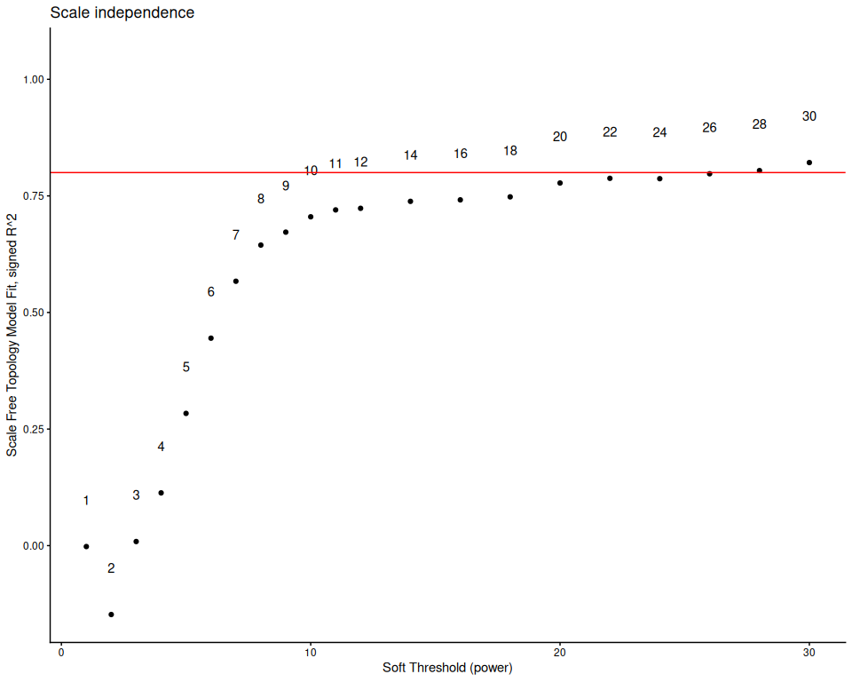
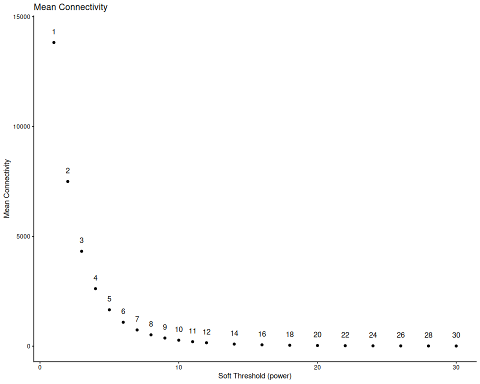

## 6. Determine parameters for WGCNA

The below takes a long time to run, so it is only run if TestParams is
set to TRUE. Otherwise, the pre-determined parameters for this species
dataset are loaded in from the species_parameters.R script. This should
be redone for any changes in data filtering and outlier removal.

``` r
if(params$TestParams == TRUE) {
  sft <- pickSoftThreshold(normalized_counts,
                           networkType = "signed",
                           RsquaredCut = 0.8,
                           powerVector = c(seq(1, 12, by = 1), seq(14, 30, by = 2)),
                           verbose=3)
  sft_df <- data.frame(sft$fitIndices) %>% dplyr::mutate(model_fit = -sign(slope) * SFT.R.sq)
  
  fit_plot <- ggplot(sft_df, aes(x = Power, y = model_fit, label = Power)) +
    geom_point() +
    geom_text(nudge_y = 0.1) +
    # We will plot what WGCNA recommends as an R^2 cutoff
    geom_hline(yintercept = 0.80, col = "red") +
    ylim(c(min(sft_df$model_fit), 1.05)) +
    xlab("Soft Threshold (power)") +
    ylab("Scale Free Topology Model Fit, signed R^2") +
    ggtitle("Scale independence") +
    theme_classic()
  
  print(fit_plot)
  
  mean_plot <- ggplot(sft_df, aes(x = Power, y = mean.k., label = Power)) +
    geom_point() +
    geom_text(nudge_y = 500) +
    xlab("Soft Threshold (power)") +
    ylab("Mean Connectivity") +
    ggtitle("Mean Connectivity") +
    theme_classic()
  
  print(mean_plot)
  
  soft_power = sft$powerEstimate
  
  if (is.na(sft$powerEstimate)) {
    stop("Soft power could not be automatically determined. Potenitally test a greater range of powers.")
}
  
  if (soft_power != config$soft_power) {
    warning(paste0(" Calculated power (" , sft$powerEstimate, 
                  ") differs from config value (", config$soft_power,"). Consider updating species_parameters.R with new value. Examine graph and confirm if the calculated power matches visual examination of the data."))
  }
  
} else {
  soft_power = config$soft_power
}
```

    ## pickSoftThreshold: will use block size 1627.
    ##  pickSoftThreshold: calculating connectivity for given powers...
    ##    ..working on genes 1 through 1627 of 27492
    ##    ..working on genes 1628 through 3254 of 27492
    ##    ..working on genes 3255 through 4881 of 27492
    ##    ..working on genes 4882 through 6508 of 27492
    ##    ..working on genes 6509 through 8135 of 27492
    ##    ..working on genes 8136 through 9762 of 27492
    ##    ..working on genes 9763 through 11389 of 27492
    ##    ..working on genes 11390 through 13016 of 27492
    ##    ..working on genes 13017 through 14643 of 27492
    ##    ..working on genes 14644 through 16270 of 27492
    ##    ..working on genes 16271 through 17897 of 27492
    ##    ..working on genes 17898 through 19524 of 27492
    ##    ..working on genes 19525 through 21151 of 27492
    ##    ..working on genes 21152 through 22778 of 27492
    ##    ..working on genes 22779 through 24405 of 27492
    ##    ..working on genes 24406 through 26032 of 27492
    ##    ..working on genes 26033 through 27492 of 27492
    ##    Power SFT.R.sq  slope truncated.R.sq  mean.k. median.k. max.k.
    ## 1      1  0.00202  2.910          0.984 13800.00  13800.00  14500
    ## 2      2  0.14800  8.130          0.995  7500.00   7490.00   8350
    ## 3      3  0.00875 -0.845          0.924  4320.00   4270.00   5560
    ## 4      4  0.11300 -1.850          0.876  2620.00   2540.00   3960
    ## 5      5  0.28400 -2.120          0.883  1660.00   1580.00   2960
    ## 6      6  0.44500 -2.190          0.901  1090.00   1010.00   2290
    ## 7      7  0.56700 -2.230          0.913   738.00    665.00   1830
    ## 8      8  0.64500 -2.230          0.921   516.00    448.00   1500
    ## 9      9  0.67200 -2.280          0.909   370.00    309.00   1240
    ## 10    10  0.70500 -2.260          0.913   271.00    217.00   1050
    ## 11    11  0.72000 -2.250          0.913   203.00    155.00    891
    ## 12    12  0.72300 -2.240          0.908   155.00    112.00    767
    ## 13    14  0.73800 -2.220          0.913    94.20     60.70    582
    ## 14    16  0.74100 -2.210          0.916    60.50     34.20    453
    ## 15    18  0.74800 -2.180          0.922    40.60     20.10    360
    ## 16    20  0.77800 -2.100          0.941    28.20     12.10    291
    ## 17    22  0.78800 -2.060          0.950    20.20      7.50    238
    ## 18    24  0.78700 -2.040          0.952    14.90      4.75    197
    ## 19    26  0.79700 -2.000          0.959    11.20      3.09    164
    ## 20    28  0.80400 -1.980          0.964     8.54      2.03    138
    ## 21    30  0.82100 -1.930          0.973     6.65      1.37    117

<!-- --><!-- -->

``` r
cat("Soft Power for WGCNA:", soft_power)
```

    ## Soft Power for WGCNA: 28

## 7. WGCNA: One-step module detection

``` r
if(params$run_WGCNA == TRUE) {
  temp_cor <- cor
  cor <- WGCNA::cor # Force it to use WGCNA cor function (fix a namespace conflict issue)
  netwk <- blockwiseModules(normalized_counts,
                            nThreads = global_params$n_cores,
  
                            # Adjacency Function
                            power = soft_power,
                            corType = "bicor",
                            networkType = "signed",
                            TOMType = "signed",
  
                            # Tree and Block Options
                            deepSplit = global_params$wgcna_default$deep_split,
                            pamRespectsDendro = F,
                            minModuleSize = global_params$wgcna_default$min_module_size,
                            maxBlockSize = 50000,
  
                            # topological overlap matrix, (TOM)
                            saveTOMs = TRUE,
                            saveTOMFileBase = file.path(outdir, "blockwiseTOM"),
                            #loadTOM = FALSE, #uncomment this if you are re-running with a previously saved TOM
  
                            # Output Options
                            mergeCutHeight = global_params$wgcna_default$merge_cut_height,
                            numericLabels = TRUE,
                            verbose = 3)
  
  cor <- temp_cor     # Return cor function to original namespace
  saveRDS(netwk, file.path(outdir, "wgcna_network.rds"))
}
```

    ##  Calculating module eigengenes block-wise from all genes
    ##    Flagging genes and samples with too many missing values...
    ##     ..step 1
    ##  ..Working on block 1 .
    ##     TOM calculation: adjacency..
    ##     ..will use 18 parallel threads.
    ##      Fraction of slow calculations: 0.000000
    ##     ..connectivity..
    ##     ..matrix multiplication (system BLAS)..
    ##     ..normalization..
    ##     ..done.
    ##    ..saving TOM for block 1 into file ../../output_RNA/WGCNA/Pcomp/blockwiseTOM-block.1.RData
    ##  ....clustering..
    ##  ....detecting modules..
    ##  ....calculating module eigengenes..
    ##  ....checking kME in modules..

    ## Warning in bicor(structure(c(10.7018582764136, 10.9634023210383,
    ## 10.9796724645939, : bicor: zero MAD in variable 'x'. Pearson correlation was
    ## used for individual columns with zero (or missing) MAD.

    ## Warning in bicor(structure(c(6.94897859608079, 7.978640913876,
    ## 7.96942779212254, : bicor: zero MAD in variable 'x'. Pearson correlation was
    ## used for individual columns with zero (or missing) MAD.

    ## Warning in bicor(structure(c(9.39320904349963, 9.30366745456756,
    ## 10.5833434147039, : bicor: zero MAD in variable 'x'. Pearson correlation was
    ## used for individual columns with zero (or missing) MAD.

    ## Warning in bicor(structure(c(5.95259633506775, 5.95259633506775,
    ## 6.21983541106235, : bicor: zero MAD in variable 'x'. Pearson correlation was
    ## used for individual columns with zero (or missing) MAD.

    ## Warning in bicor(structure(c(11.2267235146437, 10.6472560236128,
    ## 11.0461830299142, : bicor: zero MAD in variable 'x'. Pearson correlation was
    ## used for individual columns with zero (or missing) MAD.

    ## Warning in bicor(structure(c(5.95259633506775, 7.78083246737877,
    ## 5.95259633506775, : bicor: zero MAD in variable 'x'. Pearson correlation was
    ## used for individual columns with zero (or missing) MAD.

    ## Warning in bicor(structure(c(5.95259633506775, 5.95259633506775,
    ## 6.43889820858764, : bicor: zero MAD in variable 'x'. Pearson correlation was
    ## used for individual columns with zero (or missing) MAD.

    ##      ..removing 434 genes from module 7 because their KME is too low.

    ## Warning in bicor(structure(c(8.77590908602426, 9.16813950706608,
    ## 9.40812792100601, : bicor: zero MAD in variable 'x'. Pearson correlation was
    ## used for individual columns with zero (or missing) MAD.

    ## Warning in bicor(structure(c(13.6323963796486, 13.9631556331606,
    ## 13.0080587407298, : bicor: zero MAD in variable 'x'. Pearson correlation was
    ## used for individual columns with zero (or missing) MAD.

    ##      ..removing 1 genes from module 9 because their KME is too low.

    ## Warning in bicor(structure(c(7.6694558881064, 7.86555555272496,
    ## 8.10957596735691, : bicor: zero MAD in variable 'x'. Pearson correlation was
    ## used for individual columns with zero (or missing) MAD.

    ## Warning in bicor(structure(c(7.2435634405369, 7.36516993919981,
    ## 7.71974283979148, : bicor: zero MAD in variable 'x'. Pearson correlation was
    ## used for individual columns with zero (or missing) MAD.

    ## Warning in bicor(structure(c(6.65186700418949, 6.55456326539441,
    ## 5.95259633506775, : bicor: zero MAD in variable 'x'. Pearson correlation was
    ## used for individual columns with zero (or missing) MAD.

    ## Warning in bicor(structure(c(5.95259633506775, 5.95259633506775,
    ## 5.95259633506775, : bicor: zero MAD in variable 'x'. Pearson correlation was
    ## used for individual columns with zero (or missing) MAD.

    ##      ..removing 276 genes from module 14 because their KME is too low.

    ## Warning in bicor(structure(c(9.17013235040533, 9.39224774221985,
    ## 9.39590683586735, : bicor: zero MAD in variable 'x'. Pearson correlation was
    ## used for individual columns with zero (or missing) MAD.

    ## Warning in bicor(structure(c(5.95259633506775, 5.95259633506775,
    ## 6.66990681120475, : bicor: zero MAD in variable 'x'. Pearson correlation was
    ## used for individual columns with zero (or missing) MAD.

    ## Warning in bicor(structure(c(8.6570573787129, 9.86419554218902,
    ## 10.2438037583557, : bicor: zero MAD in variable 'x'. Pearson correlation was
    ## used for individual columns with zero (or missing) MAD.

    ## Warning in bicor(structure(c(8.65317313032137, 8.35232831502137,
    ## 6.68569345869961, : bicor: zero MAD in variable 'x'. Pearson correlation was
    ## used for individual columns with zero (or missing) MAD.

    ##      ..removing 5 genes from module 18 because their KME is too low.

    ## Warning in bicor(structure(c(6.60088297525971, 6.74472531284676,
    ## 7.73033824986998, : bicor: zero MAD in variable 'x'. Pearson correlation was
    ## used for individual columns with zero (or missing) MAD.

    ## Warning in bicor(structure(c(10.0180052018961, 8.96306971261975,
    ## 7.17129216768316, : bicor: zero MAD in variable 'x'. Pearson correlation was
    ## used for individual columns with zero (or missing) MAD.

    ## Warning in bicor(structure(c(6.82445651991215, 6.59051099023878,
    ## 6.83951133814853, : bicor: zero MAD in variable 'x'. Pearson correlation was
    ## used for individual columns with zero (or missing) MAD.

    ## Warning in bicor(structure(c(5.95259633506775, 5.95259633506775,
    ## 6.46239559044062, : bicor: zero MAD in variable 'x'. Pearson correlation was
    ## used for individual columns with zero (or missing) MAD.

    ## Warning in bicor(structure(c(9.48639732396549, 9.74682162655849,
    ## 9.42024464447297, : bicor: zero MAD in variable 'x'. Pearson correlation was
    ## used for individual columns with zero (or missing) MAD.

    ## Warning in bicor(structure(c(7.26750805941093, 7.82861220492148,
    ## 7.16253352433487, : bicor: zero MAD in variable 'x'. Pearson correlation was
    ## used for individual columns with zero (or missing) MAD.

    ## Warning in bicor(structure(c(6.51519300461467, 5.95259633506775,
    ## 6.43889820858764, : bicor: zero MAD in variable 'x'. Pearson correlation was
    ## used for individual columns with zero (or missing) MAD.

    ## Warning in bicor(structure(c(7.65278827854821, 7.5329310742759,
    ## 8.2325549136851, : bicor: zero MAD in variable 'x'. Pearson correlation was
    ## used for individual columns with zero (or missing) MAD.

    ## Warning in bicor(structure(c(7.89545568219065, 7.23177509710266,
    ## 6.65373531224829, : bicor: zero MAD in variable 'x'. Pearson correlation was
    ## used for individual columns with zero (or missing) MAD.

    ## Warning in bicor(structure(c(5.95259633506775, 5.95259633506775,
    ## 6.21983541106235, : bicor: zero MAD in variable 'x'. Pearson correlation was
    ## used for individual columns with zero (or missing) MAD.

    ## Warning in bicor(structure(c(8.58948385044762, 9.07120319495574,
    ## 8.61407020789929, : bicor: zero MAD in variable 'x'. Pearson correlation was
    ## used for individual columns with zero (or missing) MAD.

    ## Warning in bicor(structure(c(6.60088297525971, 7.62512739681341,
    ## 7.58472134488391, : bicor: zero MAD in variable 'x'. Pearson correlation was
    ## used for individual columns with zero (or missing) MAD.

    ## Warning in bicor(structure(c(7.46180136762379, 5.95259633506775,
    ## 7.2865572191768, : bicor: zero MAD in variable 'x'. Pearson correlation was
    ## used for individual columns with zero (or missing) MAD.

    ## Warning in bicor(structure(c(8.36401664686498, 8.53915125018367,
    ## 8.18547093940516, : bicor: zero MAD in variable 'x'. Pearson correlation was
    ## used for individual columns with zero (or missing) MAD.

    ## Warning in bicor(structure(c(7.12821389388501, 5.95259633506775,
    ## 6.7309767740428, : bicor: zero MAD in variable 'x'. Pearson correlation was
    ## used for individual columns with zero (or missing) MAD.

    ## Warning in bicor(structure(c(6.89789610059266, 7.36516993919981,
    ## 6.91203292519822, : bicor: zero MAD in variable 'x'. Pearson correlation was
    ## used for individual columns with zero (or missing) MAD.

    ## Warning in bicor(structure(c(6.62689159013794, 6.89449160108124,
    ## 7.10827164963024, : bicor: zero MAD in variable 'x'. Pearson correlation was
    ## used for individual columns with zero (or missing) MAD.

    ## Warning in bicor(structure(c(9.32509516932811, 9.80116928023121,
    ## 9.75111276236825, : bicor: zero MAD in variable 'x'. Pearson correlation was
    ## used for individual columns with zero (or missing) MAD.

    ## Warning in bicor(structure(c(6.57371089063187, 6.59051099023878,
    ## 7.29431851328239, : bicor: zero MAD in variable 'x'. Pearson correlation was
    ## used for individual columns with zero (or missing) MAD.

    ## Warning in bicor(structure(c(5.95259633506775, 8.12780237758703,
    ## 7.87919863473884, : bicor: zero MAD in variable 'x'. Pearson correlation was
    ## used for individual columns with zero (or missing) MAD.

    ## Warning in bicor(structure(c(6.74334374569212, 7.05960249154875,
    ## 6.77354380280829, : bicor: zero MAD in variable 'x'. Pearson correlation was
    ## used for individual columns with zero (or missing) MAD.

    ## Warning in bicor(structure(c(9.6808054397412, 10.0343812340862,
    ## 10.0787362095673, : bicor: zero MAD in variable 'x'. Pearson correlation was
    ## used for individual columns with zero (or missing) MAD.

    ##      ..removing 48 genes from module 44 because their KME is too low.

    ## Warning in bicor(structure(c(5.95259633506775, 6.77181523496766,
    ## 6.38796619965086, : bicor: zero MAD in variable 'x'. Pearson correlation was
    ## used for individual columns with zero (or missing) MAD.

    ## Warning in bicor(structure(c(6.60088297525971, 7.07826684557314,
    ## 6.70111972422225, : bicor: zero MAD in variable 'x'. Pearson correlation was
    ## used for individual columns with zero (or missing) MAD.

    ## Warning in bicor(structure(c(5.95259633506775, 5.95259633506775,
    ## 5.95259633506775, : bicor: zero MAD in variable 'x'. Pearson correlation was
    ## used for individual columns with zero (or missing) MAD.

    ## Warning in bicor(structure(c(6.65186700418949, 5.95259633506775,
    ## 6.65373531224829, : bicor: zero MAD in variable 'x'. Pearson correlation was
    ## used for individual columns with zero (or missing) MAD.

    ## Warning in bicor(structure(c(6.6759166670627, 5.95259633506775,
    ## 6.38796619965086, : bicor: zero MAD in variable 'x'. Pearson correlation was
    ## used for individual columns with zero (or missing) MAD.

    ## Warning in bicor(structure(c(5.95259633506775, 5.95259633506775,
    ## 5.95259633506775, : bicor: zero MAD in variable 'x'. Pearson correlation was
    ## used for individual columns with zero (or missing) MAD.

    ## Warning in bicor(structure(c(8.21668887295354, 8.24819854555918,
    ## 8.47587257780289, : bicor: zero MAD in variable 'x'. Pearson correlation was
    ## used for individual columns with zero (or missing) MAD.

    ## Warning in bicor(structure(c(5.95259633506775, 5.95259633506775,
    ## 6.65373531224829, : bicor: zero MAD in variable 'x'. Pearson correlation was
    ## used for individual columns with zero (or missing) MAD.

    ## Warning in bicor(structure(c(8.42973368543567, 8.6641715206386,
    ## 9.16476638690053, : bicor: zero MAD in variable 'x'. Pearson correlation was
    ## used for individual columns with zero (or missing) MAD.

    ## Warning in bicor(structure(c(6.27877852761627, 6.51618789528883,
    ## 6.29727362862977, : bicor: zero MAD in variable 'x'. Pearson correlation was
    ## used for individual columns with zero (or missing) MAD.

    ## Warning in bicor(structure(c(9.90728387608981, 8.86322871568561,
    ## 8.90560156069653, : bicor: zero MAD in variable 'x'. Pearson correlation was
    ## used for individual columns with zero (or missing) MAD.

    ## Warning in bicor(structure(c(6.27877852761627, 6.32288694397565,
    ## 6.50629005187505, : bicor: zero MAD in variable 'x'. Pearson correlation was
    ## used for individual columns with zero (or missing) MAD.

    ## Warning in bicor(structure(c(6.32897354903415, 5.95259633506775,
    ## 6.63715155679017, : bicor: zero MAD in variable 'x'. Pearson correlation was
    ## used for individual columns with zero (or missing) MAD.

    ## Warning in bicor(structure(c(5.95259633506775, 7.02110731411835,
    ## 6.29727362862977, : bicor: zero MAD in variable 'x'. Pearson correlation was
    ## used for individual columns with zero (or missing) MAD.

    ## Warning in bicor(structure(c(7.53831514341902, 8.05144323548272,
    ## 7.93857282092263, : bicor: zero MAD in variable 'x'. Pearson correlation was
    ## used for individual columns with zero (or missing) MAD.

    ##      ..removing 1 genes from module 62 because their KME is too low.

    ## Warning in (function (x, y = NULL, robustX = TRUE, robustY = TRUE, use =
    ## "all.obs", : bicor: zero MAD in variable 'x'. Pearson correlation was used for
    ## individual columns with zero (or missing) MAD.

    ##   ..reassigning 25 genes from module 1 to modules with higher KME.
    ##   ..reassigning 1 genes from module 2 to modules with higher KME.
    ##   ..reassigning 3 genes from module 3 to modules with higher KME.
    ##   ..reassigning 17 genes from module 4 to modules with higher KME.
    ##   ..reassigning 74 genes from module 6 to modules with higher KME.
    ##   ..reassigning 22 genes from module 12 to modules with higher KME.
    ##   ..reassigning 16 genes from module 13 to modules with higher KME.
    ##   ..reassigning 23 genes from module 14 to modules with higher KME.
    ##   ..reassigning 1 genes from module 16 to modules with higher KME.
    ##   ..reassigning 10 genes from module 17 to modules with higher KME.
    ##   ..reassigning 1 genes from module 18 to modules with higher KME.
    ##   ..reassigning 1 genes from module 21 to modules with higher KME.
    ##   ..reassigning 1 genes from module 22 to modules with higher KME.
    ##   ..reassigning 1 genes from module 23 to modules with higher KME.
    ##   ..reassigning 5 genes from module 24 to modules with higher KME.
    ##   ..reassigning 3 genes from module 25 to modules with higher KME.
    ##   ..reassigning 2 genes from module 28 to modules with higher KME.
    ##   ..reassigning 1 genes from module 32 to modules with higher KME.
    ##   ..reassigning 3 genes from module 33 to modules with higher KME.
    ##   ..reassigning 2 genes from module 34 to modules with higher KME.
    ##   ..reassigning 13 genes from module 42 to modules with higher KME.
    ##   ..reassigning 1 genes from module 44 to modules with higher KME.
    ##  ..merging modules that are too close..
    ##      mergeCloseModules: Merging modules whose distance is less than 0.25
    ##        Calculating new MEs...
