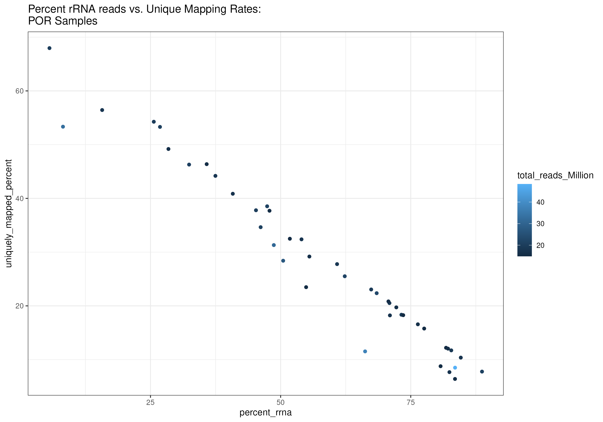

# Time Series RNA-seq Bioinformatic Processing <!-- omit from toc -->

Script Written By: Zoe Dellaert

Last Updated: 11/17/2024

## Quick directory references <!-- omit from toc -->

- raw data is located in `/project/pi_hputnam_uri_edu/raw_sequencing_data/20251117_Timeseries_3sp`
- all other project files are located in `/project/pi_hputnam_uri_edu/zdellaert/TimeSeries/4-multi-species`
- genomes are in `/work/pi_hputnam_uri_edu/HI_Genomes/`

## Project info <!-- omit from toc -->

- Sample prep: https://github.com/zdellaert/TimeSeries/blob/main/protocols/Sampling.md
- RNA extraction protocol: https://github.com/zdellaert/TimeSeries/blob/main/protocols/Bulk_DNA_RNA_Extractions_Zymo_Quick_Miniprep.md
- RNA plate sent: https://zdellaert.github.io/ZD_Putnam_Lab_Notebook/TimeSeries-Plate-Prep/
  - **Note to self update 2 re-extracted samples sent 10/22/2025**
- RNA extractions: 
- Sample list: https://github.com/zdellaert/TimeSeries/blob/main/4-multi-species/data/completed_bulk_RNA_extractions_3species.csv

### Sequencing information <!-- omit from toc -->

- Library prep and sequencing done by Genohub Service Provider: Oklahoma Medical Research Foundation NGS Core
- Library type: Illumina - RNA (poly-A selected)
- Library prep kit: Watchmaker Genomics mRNA kit
- Instrument: Illumina NovaSeq X Plus - 25B - PE 150 Cycle
- Read length: 2 x 150bp (Paired End)
- Number of samples: 126
- Guaranteed number of pass filter PE reads/sample: 30M (15M in each direction)

## Workflow <!-- omit from toc -->

- [Download genomes](#download-genomes)
  - [Convert gff3 files into gtf files](#convert-gff3-files-into-gtf-files)
- [Make directory structure on Unity](#make-directory-structure-on-unity)
- [Transfer data from genohub using AWS](#transfer-data-from-genohub-using-aws)
  - [Script: 01\_data\_download.sh](#script-01_data_downloadsh)
- [Check integrity of data transfer](#check-integrity-of-data-transfer)
- [QC raw files](#qc-raw-files)
  - [Script: 02\_raw\_qc.sh](#script-02_raw_qcsh)
  - [Interpretation of QC data](#interpretation-of-qc-data)
- [Trimming Reads](#trimming-reads)
  - [Script: 03\_trimming.sh](#script-03_trimmingsh)
  - [Interpretation of Post-Trim QC data](#interpretation-of-post-trim-qc-data)
- [Combining samples across runs](#combining-samples-across-runs)
  - [Script: 04\_combine\_files.sh](#script-04_combine_filessh)
- [Alignment with STAR](#alignment-with-star)
  - [First, write a general alignment script](#first-write-a-general-alignment-script)
    - [Script: 05\_STAR.sh](#script-05_starsh)
  - [MON Genome Version 3 (*Montipora capitata*)](#mon-genome-version-3-montipora-capitata)
  - [POC Genome Version 2 (*Pocillopora acuta*)](#poc-genome-version-2-pocillopora-acuta)
  - [POR Genome (*Porites compressa*)](#por-genome-porites-compressa)
- [Assess Mapping Quality](#assess-mapping-quality)
  - [Script: 06\_qualimap.sh](#script-06_qualimapsh)
  - [Run script on the alignments performed above](#run-script-on-the-alignments-performed-above)
- [Assembly with Stringtie](#assembly-with-stringtie)
  - [Script: 07\_stringtie.sh](#script-07_stringtiesh)
  - [Run script on the alignments performed above](#run-script-on-the-alignments-performed-above-1)
- [Generate gene count matrix](#generate-gene-count-matrix)
  - [Script: 08\_prepDE.sh](#script-08_prepdesh)
  - [Run script on the alignments performed above](#run-script-on-the-alignments-performed-above-2)
- [Contamination screen for poorly mapped samples](#contamination-screen-for-poorly-mapped-samples)
  - [Script: 09\_kraken.sh](#script-09_krakensh)
  - [Contamination screen results](#contamination-screen-results)
    - [MON\_R72\_H1](#mon_r72_h1)
    - [MON\_R72\_H2](#mon_r72_h2)
    - [run-2-MON\_R72\_H2](#run-2-mon_r72_h2)
    - [GOOD sample example: MON\_R72\_H3](#good-sample-example-mon_r72_h3)
    - [GOOD sample example: run-2-MON\_R72\_H3](#good-sample-example-run-2-mon_r72_h3)
- [rRNA contamination screen](#rrna-contamination-screen)
  - [Script: 011\_bbduk\_rRNA.sh](#script-011_bbduk_rrnash)
  - [POR rRNA contamination results](#por-rrna-contamination-results)
  - [POR rRNA-mRNA diversity rarefaction analysis](#por-rrna-mrna-diversity-rarefaction-analysis)
  - [Script: 012\_rarefaction\_analysis\_POR\_rRNA.sh](#script-012_rarefaction_analysis_por_rrnash)
  - [Script: 012\_rarefaction\_analysis\_POR\_rRNA\_stats.sh](#script-012_rarefaction_analysis_por_rrna_statssh)
- [POC rRNA contamination screen](#poc-rrna-contamination-screen)
- [MON rRNA contamination screen](#mon-rrna-contamination-screen)
- [species agnostic rRNA screen](#species-agnostic-rrna-screen)
  - [Script: 11\_bbduk\_rRNA\_SILVA.sh](#script-11_bbduk_rrna_silvash)
  - [Then, compile the results:](#then-compile-the-results)
- [Symbiont genomes](#symbiont-genomes)
  - [Cgoreaui\_V2 Genome (*Cladocopium goreaui*)](#cgoreaui_v2-genome-cladocopium-goreaui)
  - [Dtrenchii Genome (*Durusdinium trenchii*, CCMP2556 isolate)](#dtrenchii-genome-durusdinium-trenchii-ccmp2556-isolate)
  - [To add: a breviolum and a symbiodinium](#to-add-a-breviolum-and-a-symbiodinium)
  - [Then align](#then-align)
    - [Run STAR as follows:](#run-star-as-follows)
    - [All 3 coral species \> Cgoreaui\_V2 Genome](#all-3-coral-species--cgoreaui_v2-genome)
    - [All 3 coral species \> Dtrenchii Genome](#all-3-coral-species--dtrenchii-genome)
  - [Assess mapping: run multiQC on the STAR alignment reports performed above](#assess-mapping-run-multiqc-on-the-star-alignment-reports-performed-above)
- [Post-rRNA Removal Alignment with STAR](#post-rrna-removal-alignment-with-star)
  - [First, write a general alignment script](#first-write-a-general-alignment-script-1)
    - [Script: 12\_rRNA\_free\_STAR.sh](#script-12_rrna_free_starsh)
  - [MON Genome Version 3 (*Montipora capitata*)](#mon-genome-version-3-montipora-capitata-1)
  - [POC Genome Version 2 (*Pocillopora acuta*)](#poc-genome-version-2-pocillopora-acuta-1)
  - [POR Genome (*Porites compressa*)](#por-genome-porites-compressa-1)
- [Assess Mapping Quality](#assess-mapping-quality-1)
  - [Run script on the alignments performed above](#run-script-on-the-alignments-performed-above-3)
- [Assembly with stringtie](#assembly-with-stringtie-1)
- [rRNA-free Gene count matrices](#rrna-free-gene-count-matrices)

## Download genomes

All three genomes I am using can be downloaded from the following links. I am using ones I pre-downloaded. They were all generated by Rutgers University Stephens et al. 2022 [Publication](https://academic.oup.com/gigascience/article/doi/10.1093/gigascience/giac098/6815755). For the scripts to work as written, both the .fasta and .gff3 files need to be downloaded in the same directory and unzipped using `gunzip`.

- MON Genome Version 3 ([*Montipora capitata*](http://cyanophora.rutgers.edu/montipora/))
  - `wget http://cyanophora.rutgers.edu/montipora/Montipora_capitata_HIv3.assembly.fasta.gz`
  - Unity location: `/work/pi_hputnam_uri_edu/HI_Genomes/MCapV3/Montipora_capitata_HIv3.assembly.fasta`
- POC Genome Version 2 ([*Pocillopora acuta*](http://cyanophora.rutgers.edu/Pocillopora_acuta/))
  - `wget http://cyanophora.rutgers.edu/Pocillopora_acuta/Pocillopora_acuta_HIv2.assembly.fasta.gz`
  - Unity location: `/work/pi_hputnam_uri_edu/HI_Genomes/PacutaV2/Pocillopora_acuta_HIv2.assembly.fasta`
- POR Genome ([*Porites compressa*](http://cyanophora.rutgers.edu/porites_compressa/))
  - `wget http://cyanophora.rutgers.edu/porites_compressa/Porites_compressa_HIv1.assembly.fasta.gz`
  - Unity location: `/work/pi_hputnam_uri_edu/HI_Genomes/Pcompressa/Porites_compressa_HIv1.assembly.fasta`

### Convert gff3 files into gtf files

Do this for all three species. I've already done this for my genomes, example code is below.

The gff3 files provided with the Stephens et al. 2022 [genomes](https://academic.oup.com/gigascience/article/doi/10.1093/gigascience/giac098/6815755) are missing some features that are necessary for this pipeline (Stringtie specifically). I can correct the gff3 file and add those fields, but it is easier to convert the gff3 to a gtf file and automatically add those fields in the process. In order to do this, I am going to use the program [gffread](https://github.com/gpertea/gffread). Information and documentation about this package can be found on [the github examples page](https://github.com/gpertea/gffread/tree/master/examples).

```
cd /work/pi_hputnam_uri_edu/HI_Genomes/PacutaV2/

# load modules needed
module load gffread/0.12.7

# "Clean" GFF file if necessary, then convert cleaned file into a GTF
# -E : remove any "non-transcript features and optional attributes"

gffread -E Pocillopora_acuta_HIv2.genes.gff3 -T -o Pocillopora_acuta_HIv2.gtf 

echo "Check how many fields are in each row of the file; currently there are rows with two different lenghts: 10 and 12"
awk '{print NF}' Pocillopora_acuta_HIv2.gtf | sort -u

# Use awk to add "gene_id = TRANSCRIPT_ID" to each of the rows that only have a transcript id listed (the non-transcript lines)
awk 'BEGIN {FS=OFS="\t"} {if ($9 ~ /transcript_id/ && $9 !~ /gene_id/) {match($9, /transcript_id "([^"]+)";/, a); $9 = $9 " gene_id \"" a[1] "\";"}; print}' Pocillopora_acuta_HIv2.gtf > Pocillopora_acuta_HIv2_modified.gtf

echo "Check how many fields are in each row of the file; Now all the rows should be the same length and only one value should be printed, 12"
awk '{print NF}' Pocillopora_acuta_HIv2_modified.gtf | sort -u

# remove the non-modified file
rm Pocillopora_acuta_HIv2.gtf

# rename the modified file
mv Pocillopora_acuta_HIv2_modified.gtf Pocillopora_acuta_HIv2.gtf
```

## Make directory structure on Unity

```
#Make directory for raw data
mkdir /project/pi_hputnam_uri_edu/raw_sequencing_data/20251117_Timeseries_3sp

#Make directory for processed data, scripts, outputs, and symlinked raw data - clone repo
cd /project/pi_hputnam_uri_edu/zdellaert/
git clone https://github.com/zdellaert/TimeSeries.git

#Enter project directory
cd /project/pi_hputnam_uri_edu/zdellaert/TimeSeries/4-multi-species

#Make folder for scripts, script outputs, raw data, and output
mkdir scripts
mkdir scripts/outs_errs
mkdir data_RNA
mkdir output_RNA
```

## Transfer data from genohub using AWS

1. First, on unity login node, run `module load awscli-v2/2.15.53`
2. Then follow the prompts and enter the AWS Access Key ID and Secret Key as prompted and instructed in the genohub instructions
3. This writes your config information into a file in your home directory, located at `~/.aws/config`
4. Now we can download the data using a script without having to enter any other access info
5. To view what's in the bucket:
   1. `module load awscli-v2/2.15.53`
   2. `aws s3 ls s3://genohub####### --recursive`

```
cd /project/pi_hputnam_uri_edu/zdellaert/TimeSeries/4-multi-species/scripts
nano 01_data_download.sh

#enter text in next code chunk
```

### Script: 01_data_download.sh

```
#!/usr/bin/env bash
#SBATCH --cpus-per-task=1
#SBATCH --mem=24GB
#SBATCH --time 24:00:00
#SBATCH --error=../scripts/outs_errs/%x_error.%j
#SBATCH --output=../scripts/outs_errs/%x_output.%j
#SBATCH --mail-type=END,FAIL,TIME_LIMIT_80

#load AWS module
module load awscli-v2/2.15.53

#enter raw data directory
cd /project/pi_hputnam_uri_edu/raw_sequencing_data/20251117_Timeseries_3sp/

# sync data from aws bucket
aws s3 sync s3://genohub####### . --no-progress

#compute md5sum after sync is complete
md5sum *.fastq.gz > 20251118_URI.md5
```

## Check integrity of data transfer

```
cd /project/pi_hputnam_uri_edu/raw_sequencing_data/20251117_Timeseries_3sp/

#concatenate genohub-provided md5s
cat *gz.md5 > genohub.md5

#use diff command to see if there is a differnece between the checksums
diff -w genohub.md5 20251118_URI.md5 
```

There was no output, so there is no difference between the md5s. Data appears to have been transferred successfully from genohub.

```
# copy both md5s to data directory
cp genohub.md5 /project/pi_hputnam_uri_edu/zdellaert/TimeSeries/4-multi-species/data_RNA
cp 20251118_URI.md5  /project/pi_hputnam_uri_edu/zdellaert/TimeSeries/4-multi-species/data_RNA
```


## QC raw files

```
# Symlink raw data files into data_RNA
ln -s /project/pi_hputnam_uri_edu/raw_sequencing_data/20251117_Timeseries_3sp/*.fastq.gz /project/pi_hputnam_uri_edu/zdellaert/TimeSeries/4-multi-species/data_RNA
```

```
cd /project/pi_hputnam_uri_edu/zdellaert/TimeSeries/4-multi-species/scripts
nano 02_raw_qc.sh

#enter text in next code chunk
```

### Script: 02_raw_qc.sh

```
#!/usr/bin/env bash
#SBATCH --export=NONE
#SBATCH --nodes=1
#SBATCH --ntasks-per-node=20
#SBATCH --signal=2
#SBATCH --no-requeue
#SBATCH --mem=200GB
#SBATCH -t 12:00:00
#SBATCH --mail-type=BEGIN,END,FAIL #email you when job starts, stops and/or fails
#SBATCH --error=../scripts/outs_errs/%x_error.%j #if your job fails, the error report will be put in this file
#SBATCH --output=../scripts/outs_errs/%x_output.%j #once your job is completed, any final job report comments will be put in this file

# load modules needed
module load parallel/20240822
module load fastqc/0.12.1
module load uri/main
module load MultiQC/1.12-foss-2021b

#go into directory with raw data (symlinks)
cd /project/pi_hputnam_uri_edu/zdellaert/TimeSeries/4-multi-species/data_RNA

#make raw_qc output folder
mkdir -p ../output_RNA/raw_qc/

# Create an list of fastq files to process
files=( *.fastq.gz )

# Run fastqc in parallel
echo "Starting fastqc..." $(date)
parallel -j 20 "fastqc {} -o ../output_RNA/raw_qc/ && echo 'Processed {}'" ::: "${files[@]}"
echo "fastQC done." $(date)

#Compile MultiQC report from FastQC files
cd ../output_RNA/raw_qc/
multiqc --interactive .

echo "Initial QC of RNA-seq data complete." $(date)
```

### Interpretation of QC data

[View results here](https://github.com/zdellaert/TimeSeries/tree/main/4-multi-species/output_RNA/raw_qc), [MultiQC report](https://github.com/zdellaert/TimeSeries/blob/main/4-multi-species/output_RNA/raw_qc/multiqc_report.html)

Data exists and looks good but there is a lot to dig into!

Important notes:
- 12 samples have fewer than 15M reads in each direction
- MANY of the Porites samples have extremely high duplication rates
  - overrepresented seqs are matching to rRNA...
- 54 samples were run over 2 runs. I thought about concatenating the files across runs but for now am going to trim and align separately. Though, we could probably just ignore the files with fewer than 1M reads.
- Update 12/20/25: 12 samples were re-run "run-3" and I QC'd them and reran multiQC with them here. Since they encompass all three species, I will rerun all steps below with all the new files and the old files together. **Now, no samples have fewer than 15M reads**

## Trimming Reads

I am using [fastp](https://github.com/OpenGene/fastp) for trimming and quality control.

Example commented code:

```
fastp --in1 "$R1_file" --in2 "$R2_file" \
      --out1 "${out_dir}${sample_name}_R1_trim.fastq.gz" \
      --out2 "${out_dir}${sample_name}_R2_trim.fastq.gz" \
      --detect_adapter_for_pe \ # detect adapters even though paired-end
      --qualified_quality_phred 20 \ # remove reads with < 20 phred quality score
      --trim_poly_g \ # trim polyG, common with this sequencer type and present in FastQC data
      --trim_front1 10 --trim_front2 10 \ #remove first 10 bases of all reads, low quality seen in FastQC data
      --length_required 20 \ #after trimming, remove any reads less than 20 bp long
      --thread 2 \ #use 2 threads
      --overrepresentation_analysis \ #run the optional overrepresentation analysis
      --html "${qc_dir}${sample_name}_fastp.html" \
      --json "${qc_dir}${sample_name}_fastp.json"
```

```
cd /project/pi_hputnam_uri_edu/zdellaert/TimeSeries/4-multi-species/scripts
nano 03_trimming.sh

#enter text in next code chunk
```

### Script: 03_trimming.sh

```
#!/usr/bin/env bash
#SBATCH --export=NONE
#SBATCH --nodes=1
#SBATCH --ntasks-per-node=20
#SBATCH --signal=2
#SBATCH --no-requeue
#SBATCH --mem=80GB
#SBATCH -t 03:59:00 --qos=short
#SBATCH --mail-type=BEGIN,END,FAIL #email you when job starts, stops and/or fails
#SBATCH --error=../scripts/outs_errs/%x_error.%j #if your job fails, the error report will be put in this file
#SBATCH --output=../scripts/outs_errs/%x_output.%j #once your job is completed, any final job report comments will be put in this file

# load modules needed
module load parallel/20240822
module load fastp/0.23.4

# make and define directories needed
mkdir -p /scratch4/workspace/zdellaert_uri_edu-shared_TimeSeries/TimeSeries/trimmed/
mkdir -p /project/pi_hputnam_uri_edu/zdellaert/TimeSeries/4-multi-species/output_RNA/trimmed_qc/

data_dir="/project/pi_hputnam_uri_edu/zdellaert/TimeSeries/4-multi-species/data_RNA/"
out_dir="/scratch4/workspace/zdellaert_uri_edu-shared_TimeSeries/TimeSeries/trimmed/"
qc_dir="/project/pi_hputnam_uri_edu/zdellaert/TimeSeries/4-multi-species/output_RNA/trimmed_qc/"

# create an list of fastq files to process
R1_files=(${data_dir}*_R1_001.fastq.gz)

echo "There are ${#R1_files[@]} samples to process"
echo "Starting trimming at $(date)"

# define fastp function - with more than 300 files we need to parallelize

run_fastp() {
  R1_file=$1
  data_dir=$2
  out_dir=$3
  qc_dir=$4

  # extract sample name
  sample_name=$(basename "$R1_file" "_R1_001.fastq.gz")

  # define R2 file
  R2_file="${data_dir}${sample_name}_R2_001.fastq.gz"

  # fastp
  fastp --in1 "$R1_file" --in2 "$R2_file" \
        --out1 "${out_dir}${sample_name}_R1_trim.fastq.gz" \
        --out2 "${out_dir}${sample_name}_R2_trim.fastq.gz" \
        --detect_adapter_for_pe \
        --qualified_quality_phred 20 \
        --trim_poly_g \
        --trim_front1 10 --trim_front2 10 \
        --length_required 20 \
        --thread 2 \
        --overrepresentation_analysis \
        --html "${qc_dir}${sample_name}_fastp.html" \
        --json "${qc_dir}${sample_name}_fastp.json"

  echo "trimming of "${sample_name}" complete at $(date)"
}

export -f run_fastp

# run fastp in parallel
parallel -j 10 run_fastp {} "$data_dir" "$out_dir" "$qc_dir" ::: "${R1_files[@]}"

# now move onto qc
echo "Starting fastqc on trimmed files at" $(date)

# load modules needed
module load fastqc/0.12.1
module load uri/main
module load MultiQC/1.12-foss-2021b

# create an list of fastq files to process
trimmed_files=(${out_dir}*trim.fastq.gz)

# Run fastqc in parallel
parallel -j 20 "fastqc {} -o "${qc_dir}" && echo 'Processed {}'" ::: "${trimmed_files[@]}"
echo "fastQC done." $(date)

#Compile MultiQC report from FastQC files
echo "Running MultiQC"
cd "${qc_dir}"
multiqc --interactive .

echo "QC of trimmed RNA-seq data complete." $(date)
```

### Interpretation of Post-Trim QC data

[View results here](https://github.com/zdellaert/TimeSeries/tree/main/4-multi-species/output_RNA/trimmed_qc), [MultiQC report](https://github.com/zdellaert/TimeSeries/blob/main/4-multi-species/output_RNA/trimmed_qc/multiqc_report.html)

All adapter content is gone!

Important notes:
- Now 2 samples have fewer than 15M reads in each direction (they have 14.9M, so it's fine!)
- MANY of the Porites samples still have extremely high duplication rates

## Combining samples across runs

- sed command breakdown:
  - `s/^run-[0-9][-_]//` removes `run-2-` or `run-3_` from any file names that have it
  - `s/_S.*//` removes the `_S##` number and everything after (incl `_R1_trim.fastq.gz`) from all the file names

```
cd /project/pi_hputnam_uri_edu/zdellaert/TimeSeries/4-multi-species/scripts
nano 04_combine_files.sh

#enter text in next code chunk
```

### Script: 04_combine_files.sh

```
#!/usr/bin/env bash
#SBATCH --nodes=1
#SBATCH --ntasks=1
#SBATCH --cpus-per-task=4
#SBATCH --no-requeue
#SBATCH --mem=16GB
#SBATCH -t 03:59:00 --qos=short
#SBATCH --mail-type=END,FAIL,TIME_LIMIT_80
#SBATCH --error=../scripts/outs_errs/%x_error.%j #if your job fails, the error report will be put in this file
#SBATCH --output=../scripts/outs_errs/%x_output.%j #once your job is completed, any final job report comments will be put in this file

# enter trimmed data directory
cd /scratch4/workspace/zdellaert_uri_edu-shared_TimeSeries/TimeSeries/trimmed/

# make a directory to move combined files (and files from samples with only one run) into
mkdir -p combined_files

# get unique sample id
samples=$(ls *R1_trim.fastq.gz | \
  sed -E 's/^run-[0-9][-_]//; s/_S.*//' | \
  sort -u)

for sample in $samples; do
  # define output names
  combinedR1="combined_files/${sample}_R1_trim.fastq.gz"
  combinedR2="combined_files/${sample}_R2_trim.fastq.gz"

  # gather all matching R1 and R2 files across runs
  r1_files=( *${sample}*R1_trim.fastq.gz )
  r2_files=( *${sample}*R2_trim.fastq.gz )
  
  echo "Combining sample: $sample from files ${r1_files[@]} and ${r2_files[@]}"

  # concatenate the multiple r1 files (if there are multiple) and the multiple r2 files (if there are multiple)
    cat "${r1_files[@]}" > "$combinedR1"
    cat "${r2_files[@]}" > "$combinedR2"
done
```


## Alignment with STAR

I am using [STAR](https://github.com/alexdobin/STAR) for alignment, manual is [here](https://github.com/alexdobin/STAR/blob/master/doc/STARmanual.pdf)

### First, write a general alignment script

```
cd /project/pi_hputnam_uri_edu/zdellaert/TimeSeries/4-multi-species/scripts
nano 05_STAR.sh

#enter text in next code chunk
```

#### Script: 05_STAR.sh

```
#!/usr/bin/env bash
#SBATCH --export=NONE
#SBATCH --ntasks=1 --cpus-per-task=20
#SBATCH --mem=100GB
#SBATCH --time=24:00:00
#SBATCH --error=../scripts/outs_errs/%x_error.%j #if your job fails, the error report will be put in this file
#SBATCH --output=../scripts/outs_errs/%x_output.%j #once your job is completed, any final job report comments will be put in this file
#SBATCH --mail-type=END,FAIL,TIME_LIMIT_80
#SBATCH --no-requeue

species=$1
genome=$2
genome_path=$3
gff_path=$4
makeindex=$5

scratch_dir="/scratch4/workspace/zdellaert_uri_edu-shared_TimeSeries/TimeSeries"
data_dir="${scratch_dir}/trimmed/combined_files/"

genome_index_dir="${scratch_dir}/STAR_indexes/${genome}"
out_dir="${scratch_dir}/aligned/${species}_${genome}"

mkdir -p "${genome_index_dir}"
mkdir -p "${out_dir}"

cd "${scratch_dir}"

# load modules 
module load uri/main STAR/2.7.11b-GCC-12.3.0

# genome index generation
if [ "${makeindex}" = "T" ]; then
  STAR --runMode genomeGenerate \
      --runThreadN 20 \
      --genomeDir "${genome_index_dir}" \
      --genomeFastaFiles "${genome_path}" \
      --sjdbGTFfile "${gff_path}" \
      --sjdbGTFtagExonParentTranscript Parent \
      --genomeSAindexNbases 13
fi

trimmed=( "${data_dir}"*"${species}"*"R1_trim.fastq.gz" )

# run star

for R1_file in "${trimmed[@]}"; do

  # extract sample name
  sample_name=$(basename "${R1_file}" "_R1_trim.fastq.gz")

  # define R2 file
  R2_file="${data_dir}${sample_name}_R2_trim.fastq.gz"

  STAR --runMode alignReads \
       --genomeDir "${genome_index_dir}" \
       --runThreadN 10 \
       --readFilesCommand zcat \
       --readFilesIn "${R1_file}" "${R2_file}" \
       --outSAMtype BAM SortedByCoordinate \
       --outSAMunmapped Within \
       --outSAMattributes Standard \
       --outFileNamePrefix "${out_dir}/${sample_name}_" \
       --quantMode GeneCounts
done
```

Then run as follows:

```
# run STAR standard script
sbatch 05_STAR.sh "$species" "$genome" "$genome_path" "$gff_path" T/F
```

### MON Genome Version 3 ([*Montipora capitata*](http://cyanophora.rutgers.edu/montipora/))
  - `wget http://cyanophora.rutgers.edu/montipora/Montipora_capitata_HIv3.assembly.fasta.gz`
  - Unity location: `/work/pi_hputnam_uri_edu/HI_Genomes/MCapV3/Montipora_capitata_HIv3.assembly.fasta`

```
cd /project/pi_hputnam_uri_edu/zdellaert/TimeSeries/4-multi-species/scripts

sbatch 05_STAR.sh MON MCapV3 \
     "/work/pi_hputnam_uri_edu/HI_Genomes/MCapV3/Montipora_capitata_HIv3.assembly.fasta" \
     "/work/pi_hputnam_uri_edu/HI_Genomes/MCapV3/Montipora_capitata_HIv3.genes.gff3" \
     T
```

```
cd /project/pi_hputnam_uri_edu/zdellaert/TimeSeries/4-multi-species/scripts

sbatch 05_STAR.sh MON PacutaV2 \
     "/work/pi_hputnam_uri_edu/HI_Genomes/PacutaV2/Pocillopora_acuta_HIv2.assembly.fasta" \
     "/work/pi_hputnam_uri_edu/HI_Genomes/PacutaV2/Pocillopora_acuta_HIv2.genes.gff3" \
     F

sbatch 05_STAR.sh MON Pcomp \
     "/work/pi_hputnam_uri_edu/HI_Genomes/Pcompressa/Porites_compressa_HIv1.assembly.fasta" \
     "/work/pi_hputnam_uri_edu/HI_Genomes/Pcompressa/Porites_compressa_HIv1.gtf" \
     F
```

### POC Genome Version 2 ([*Pocillopora acuta*](http://cyanophora.rutgers.edu/Pocillopora_acuta/))
  - `wget http://cyanophora.rutgers.edu/Pocillopora_acuta/Pocillopora_acuta_HIv2.assembly.fasta.gz`
  - Unity location: `/work/pi_hputnam_uri_edu/HI_Genomes/PacutaV2/Pocillopora_acuta_HIv2.assembly.fasta`

```
cd /project/pi_hputnam_uri_edu/zdellaert/TimeSeries/4-multi-species/scripts

sbatch 05_STAR.sh POC PacutaV2 \
     "/work/pi_hputnam_uri_edu/HI_Genomes/PacutaV2/Pocillopora_acuta_HIv2.assembly.fasta" \
     "/work/pi_hputnam_uri_edu/HI_Genomes/PacutaV2/Pocillopora_acuta_HIv2.genes.gff3" \
     T
```

```
cd /project/pi_hputnam_uri_edu/zdellaert/TimeSeries/4-multi-species/scripts

sbatch 05_STAR.sh POC Pcomp \
     "/work/pi_hputnam_uri_edu/HI_Genomes/Pcompressa/Porites_compressa_HIv1.assembly.fasta" \
     "/work/pi_hputnam_uri_edu/HI_Genomes/Pcompressa/Porites_compressa_HIv1.gtf" \
     F

sbatch 05_STAR.sh POC MCapV3 \
     "/work/pi_hputnam_uri_edu/HI_Genomes/MCapV3/Montipora_capitata_HIv3.assembly.fasta" \
     "/work/pi_hputnam_uri_edu/HI_Genomes/MCapV3/Montipora_capitata_HIv3.genes.gff3" \
     F
```

### POR Genome ([*Porites compressa*](http://cyanophora.rutgers.edu/porites_compressa/))
  - `wget http://cyanophora.rutgers.edu/porites_compressa/Porites_compressa_HIv1.assembly.fasta.gz`
  - Unity location: `/work/pi_hputnam_uri_edu/HI_Genomes/Pcompressa/Porites_compressa_HIv1.assembly.fasta`

```
cd /project/pi_hputnam_uri_edu/zdellaert/TimeSeries/4-multi-species/scripts

sbatch 05_STAR.sh POR Pcomp \
     "/work/pi_hputnam_uri_edu/HI_Genomes/Pcompressa/Porites_compressa_HIv1.assembly.fasta" \
     "/work/pi_hputnam_uri_edu/HI_Genomes/Pcompressa/Porites_compressa_HIv1.gtf" \
     T
```

```
cd /project/pi_hputnam_uri_edu/zdellaert/TimeSeries/4-multi-species/scripts

sbatch 05_STAR.sh POR PacutaV2 \
     "/work/pi_hputnam_uri_edu/HI_Genomes/PacutaV2/Pocillopora_acuta_HIv2.assembly.fasta" \
     "/work/pi_hputnam_uri_edu/HI_Genomes/PacutaV2/Pocillopora_acuta_HIv2.genes.gff3" \
     F

sbatch 05_STAR.sh POR MCapV3 \
     "/work/pi_hputnam_uri_edu/HI_Genomes/MCapV3/Montipora_capitata_HIv3.assembly.fasta" \
     "/work/pi_hputnam_uri_edu/HI_Genomes/MCapV3/Montipora_capitata_HIv3.genes.gff3" \
     F
```

## Assess Mapping Quality

I am using [Qualimap](http://qualimap.conesalab.org/) to assess the STAR mapping quality, then performing multiqc on the Qualimap and STAR log files to get a cohesive mapping report. Qualimap is SUPER slow, so I am running it as an array job. 

```
cd /project/pi_hputnam_uri_edu/zdellaert/TimeSeries/4-multi-species/scripts
nano 06_qualimap.sh

#enter text in next code chunk
```

### Script: 06_qualimap.sh

```
#!/usr/bin/env bash
#SBATCH --export=NONE
#SBATCH --ntasks=1 --cpus-per-task=2
#SBATCH --mem=16GB
#SBATCH --time=04:00:00
#SBATCH --error=../scripts/outs_errs/%x_%A_%a_error #if your job fails, the error report will be put in this file
#SBATCH --output=../scripts/outs_errs/%x_%A_%a_output #once your job is completed, any final job report comments will be put in this file
#SBATCH --array=0-41
#SBATCH --mail-type=END,FAIL,TIME_LIMIT_80
#SBATCH --no-requeue

species=$1
genome=$2
gtf_path=$3

# load modules needed
module load qualimap/2.2.1

# list and make required directories
scratch_dir="/scratch4/workspace/zdellaert_uri_edu-shared_TimeSeries/TimeSeries"
alignments_dir="${scratch_dir}/aligned/${species}_${genome}"

qc_dir="/project/pi_hputnam_uri_edu/zdellaert/TimeSeries/4-multi-species/output_RNA/alignment_qc/${species}_${genome}"

# make the output directory if it does not exist (-p checks for this)
mkdir -p "${qc_dir}"

# make list of BAM files

bam_files=("${alignments_dir}"/*Aligned.sortedByCoord.out.bam)

# get the BAM for this array task
f="${bam_files[$SLURM_ARRAY_TASK_ID]}"
sample_name=$(basename "$f" | sed -E 's/_Aligned.*//')

echo "Running Qualimap on ${sample_name}..."

	qualimap rnaseq \
    --java-mem-size=8G \
    -gtf "${gtf_path}" \
    -pe \
    --sequencing-protocol strand-specific-reverse \
    -bam "${f}"  \
    -outdir "${qc_dir}"/"${sample_name}" 
```

Then run as follows:

```
# run Qualimap standard script
sbatch 06_qualimap.sh "$species" "$genome" "$gtf_path"
```

### Run script on the alignments performed above

```
cd /project/pi_hputnam_uri_edu/zdellaert/TimeSeries/4-multi-species/scripts

sbatch 06_qualimap.sh MON MCapV3 "/work/pi_hputnam_uri_edu/HI_Genomes/MCapV3/Montipora_capitata_HIv3.gtf"
sbatch 06_qualimap.sh MON PacutaV2 "/work/pi_hputnam_uri_edu/HI_Genomes/PacutaV2/Pocillopora_acuta_HIv2.gtf"
sbatch 06_qualimap.sh MON Pcomp "/work/pi_hputnam_uri_edu/HI_Genomes/Pcompressa/Porites_compressa_HIv1.gtf"

sbatch 06_qualimap.sh POC PacutaV2 "/work/pi_hputnam_uri_edu/HI_Genomes/PacutaV2/Pocillopora_acuta_HIv2.gtf"
sbatch 06_qualimap.sh POC Pcomp "/work/pi_hputnam_uri_edu/HI_Genomes/Pcompressa/Porites_compressa_HIv1.gtf"
sbatch 06_qualimap.sh POC MCapV3 "/work/pi_hputnam_uri_edu/HI_Genomes/MCapV3/Montipora_capitata_HIv3.gtf"

sbatch 06_qualimap.sh POR Pcomp "/work/pi_hputnam_uri_edu/HI_Genomes/Pcompressa/Porites_compressa_HIv1.gtf"
sbatch 06_qualimap.sh POR MCapV3 "/work/pi_hputnam_uri_edu/HI_Genomes/MCapV3/Montipora_capitata_HIv3.gtf"
sbatch 06_qualimap.sh POR PacutaV2 "/work/pi_hputnam_uri_edu/HI_Genomes/PacutaV2/Pocillopora_acuta_HIv2.gtf"
```

Then:

```
# load modules needed for multiqc
module purge
module load uri/main
module load MultiQC/1.12-foss-2021b

scratch_dir="/scratch4/workspace/zdellaert_uri_edu-shared_TimeSeries/TimeSeries"

species="MON"
genome="MCapV3"
alignments_dir="${scratch_dir}/aligned/${species}_${genome}"
qc_dir="/project/pi_hputnam_uri_edu/zdellaert/TimeSeries/4-multi-species/output_RNA/alignment_qc/${species}_${genome}"

cd "${qc_dir}"

multiqc . "${alignments_dir}"

species="POC"
genome="PacutaV2"
alignments_dir="${scratch_dir}/aligned/${species}_${genome}"
qc_dir="/project/pi_hputnam_uri_edu/zdellaert/TimeSeries/4-multi-species/output_RNA/alignment_qc/${species}_${genome}"

cd "${qc_dir}"

multiqc . "${alignments_dir}"

species="POR"
genome="Pcomp"
alignments_dir="${scratch_dir}/aligned/${species}_${genome}"
qc_dir="/project/pi_hputnam_uri_edu/zdellaert/TimeSeries/4-multi-species/output_RNA/alignment_qc/${species}_${genome}"

cd "${qc_dir}"

multiqc . "${alignments_dir}"
```

## Assembly with Stringtie

I will use [Stringtie](https://ccb.jhu.edu/software/stringtie/index.shtml?t=manual) to perform reference-guided assembly of the RNA-seq data. For initial analysis, I am running stringtie in estimation mode, with the -e flag. It will only assemble known transcripts from the gff/gtf file and not novel transcripts.

> StringTie will not attempt to assemble the input read alignments but instead it will only estimate the expression levels of the "reference" transcripts provided in the -G file. With this option, no "novel" transcript assemblies (isoforms) will be produced, and read alignments not overlapping any of the given reference transcripts will be ignored.

```
cd /project/pi_hputnam_uri_edu/zdellaert/TimeSeries/4-multi-species/scripts
nano 07_stringtie.sh

#enter text in next code chunk
```

### Script: 07_stringtie.sh

```
#!/usr/bin/env bash
#SBATCH --nodes=1
#SBATCH --ntasks=1
#SBATCH --cpus-per-task=16
#SBATCH --no-requeue
#SBATCH --mem=16GB
#SBATCH -t 03:59:00 --qos=short
#SBATCH --mail-type=END,FAIL,TIME_LIMIT_80
#SBATCH --error=../scripts/outs_errs/%x_error.%j #if your job fails, the error report will be put in this file
#SBATCH --output=../scripts/outs_errs/%x_output.%j #once your job is completed, any final job report comments will be put in this file

species=$1
genome=$2
gtf_path=$3

# load required modules
module load uri/main StringTie/2.2.1-GCC-11.2.0

# list and make required directories
scratch_dir="/scratch4/workspace/zdellaert_uri_edu-shared_TimeSeries/TimeSeries"
alignments_dir="${scratch_dir}/aligned/${species}_${genome}"

out_dir="${scratch_dir}/stringtie/${species}_${genome}"

# make the output directory if it does not exist (-p checks for this)
mkdir -p "${out_dir}"

cd "${alignments_dir}"

# call the STAR bam files into an array
bams=(*Aligned.sortedByCoord.out.bam)

for f in "${bams[@]}"; do 
    sample_name=$(echo "$f" | sed -E 's/_Aligned.*//')

    # -p 16 : use 16 cores
    # --rf : library is reverse-forward stranded
    # -e : exclude novel genes
    # -B : create Ballgown input files for downstream analysis
    # -v : enable verbose mode
    # -G : gtf annotation file
    # -A : output name for gene abundance estimate files
    # -o : output name for gtf file

    stringtie -p 16 --rf -e -B -v \
        -G "${gtf_path}" \
        -A "${out_dir}"/"${sample_name}".gene_abund.tab \
        -o "${out_dir}"/"${sample_name}".gtf \
        "$f" #input bam file

    echo "StringTie assembly for seq file ${f}" $(date)
done
```

Then run as follows:

```
# run stringtie standard script
sbatch 07_stringtie.sh "$species" "$genome" "$gtf_path"
```

### Run script on the alignments performed above

```
cd /project/pi_hputnam_uri_edu/zdellaert/TimeSeries/4-multi-species/scripts

sbatch 07_stringtie.sh MON MCapV3 "/work/pi_hputnam_uri_edu/HI_Genomes/MCapV3/Montipora_capitata_HIv3.gtf"
sbatch 07_stringtie.sh POC PacutaV2 "/work/pi_hputnam_uri_edu/HI_Genomes/PacutaV2/Pocillopora_acuta_HIv2.gtf"
sbatch 07_stringtie.sh POR Pcomp "/work/pi_hputnam_uri_edu/HI_Genomes/Pcompressa/Porites_compressa_HIv1.gtf"
```

## Generate gene count matrix

We will be using the [prepDE.py script from Stringtie](https://ccb.jhu.edu/software/stringtie/index.shtml?t=manual).

Download script from [stringtie website](https://ccb.jhu.edu/software/stringtie/dl/prepDE.py3) or [github repository](https://github.com/gpertea/stringtie/blob/master/prepDE.py3). I am using the python3 version, but this and the original version (prepDE.py) are very similar and should give the exact same result. I am using [this input file format](https://ccb.jhu.edu/software/stringtie/dl/sample_lst.txt).


```
cd /project/pi_hputnam_uri_edu/zdellaert/TimeSeries/4-multi-species/scripts
wget https://ccb.jhu.edu/software/stringtie/dl/prepDE.py3
nano 08_prepDE.sh

#enter text in next code chunk
```

### Script: 08_prepDE.sh

```
#!/usr/bin/env bash
#SBATCH --nodes=1
#SBATCH --ntasks=1
#SBATCH --cpus-per-task=16
#SBATCH --no-requeue
#SBATCH --mem=16GB
#SBATCH -t 03:59:00 --qos=short
#SBATCH --mail-type=END,FAIL,TIME_LIMIT_80
#SBATCH --error=../scripts/outs_errs/%x_error.%j #if your job fails, the error report will be put in this file
#SBATCH --output=../scripts/outs_errs/%x_output.%j #once your job is completed, any final job report comments will be put in this file

species=$1
genome=$2

# load required modules
module load uri/main StringTie/2.2.1-GCC-11.2.0

# list and make required directories
scratch_dir="/scratch4/workspace/zdellaert_uri_edu-shared_TimeSeries/TimeSeries"
stringtie_dir="${scratch_dir}/stringtie/${species}_${genome}"
out_dir="/project/pi_hputnam_uri_edu/zdellaert/TimeSeries/4-multi-species/output_RNA/count_matrices"
script_dir="/project/pi_hputnam_uri_edu/zdellaert/TimeSeries/4-multi-species/scripts"

# make the output directory if it does not exist (-p checks for this)
mkdir -p "${out_dir}"

# move into stringtie directory
cd "${stringtie_dir}"

# make input file
for filename in *.gtf; do
    sample_name=$(basename "$filename" .gtf)

    echo $sample_name $PWD/$filename
done > listGTF.txt

#Compile the gene count matrix
python "${script_dir}"/prepDE.py3 -g "${out_dir}"/"${species}"_"${genome}"_gene_count_matrix.csv -i listGTF.txt

echo "Gene count matrix compiled." $(date)
```

Then run as follows:

```
# run stringtie standard script
sbatch 08_prepDE.sh "$species" "$genome"
```

### Run script on the alignments performed above

```
cd /project/pi_hputnam_uri_edu/zdellaert/TimeSeries/4-multi-species/scripts

sbatch 08_prepDE.sh MON MCapV3
sbatch 08_prepDE.sh POC PacutaV2
sbatch 08_prepDE.sh POR Pcomp
```

Woohoo! [Gene count matrices complete.](https://github.com/zdellaert/TimeSeries/tree/main/4-multi-species/output_RNA/count_matrices).

## Contamination screen for poorly mapped samples

I am going to use [kraken](https://github.com/DerrickWood/kraken2) to screen for contaminants in files that are mapping poorly.

```
cd /project/pi_hputnam_uri_edu/zdellaert/TimeSeries/4-multi-species/scripts
nano 09_kraken.sh

#enter text in next code chunk
```

### Script: 09_kraken.sh

```
#!/usr/bin/env bash
#SBATCH --nodes=1
#SBATCH --ntasks=1
#SBATCH --cpus-per-task=16
#SBATCH --no-requeue
#SBATCH --mem=200GB
#SBATCH -t 03:59:00 --qos=short
#SBATCH --mail-type=END,FAIL,TIME_LIMIT_80
#SBATCH --error=../scripts/outs_errs/%x_error.%j #if your job fails, the error report will be put in this file
#SBATCH --output=../scripts/outs_errs/%x_output.%j #once your job is completed, any final job report comments will be put in this file

# load modules required
module load kraken2/2.1.2

# make and enter output directory
scratch_dir="/scratch4/workspace/zdellaert_uri_edu-shared_TimeSeries/TimeSeries"
data_dir="${scratch_dir}/trimmed/combined_files/"
out_dir="${scratch_dir}/kraken"

mkdir -p "${out_dir}"

trimmed=( "${data_dir}"*"R1_trim.fastq.gz" )

for R1_file in "${trimmed[@]}"; do
  # extract sample name
  sample_name=$(basename "${R1_file}" "_R1_trim.fastq.gz")

  # define R2 file
  R2_file="${data_dir}${sample_name}_R2_trim.fastq.gz"

  kraken2 \
    --db /datasets/bio/kraken2/kraken2-db/ \
    --threads 16 \
    --paired "$R1_file" "$R2_file" \
    --use-names \
    --report "${out_dir}/${sample_name}.report.txt" \
    --output "${out_dir}/${sample_name}.kraken"
done
```

Then, compile the results:

```
mkdir /project/pi_hputnam_uri_edu/zdellaert/TimeSeries/4-multi-species/output_RNA/contam_screen/
echo "sample,classification,percent_reads" > /project/pi_hputnam_uri_edu/zdellaert/TimeSeries/4-multi-species/output_RNA/contam_screen/contamination_kraken.csv

cd /scratch4/workspace/zdellaert_uri_edu-shared_TimeSeries/TimeSeries/kraken/

for f in *.report.txt; do
    sample=$(basename "$f" .report.txt)

    # Print percent in first row and first column
    top_percent=$(awk 'NR==1 {print $1}' "$f")

    # Print classification of the top contaminant (almost always unclassified) in first row and first column
    top_class=$(awk 'NR==1 {print $6}' "$f")

    echo "${sample},${top_class},${top_percent}" >> /project/pi_hputnam_uri_edu/zdellaert/TimeSeries/4-multi-species/output_RNA/contam_screen/contamination_kraken.csv

    # Print percent in fourth row and first column
    bac_percent=$(awk 'NR==4 {print $1}' "$f")

    # Print classification of the second top contaminant (almost always Bacteria) in fourth row and first column
    bac_class=$(awk 'NR==4 {print $5}' "$f")

    echo "${sample},${bac_class},${bac_percent}" >> /project/pi_hputnam_uri_edu/zdellaert/TimeSeries/4-multi-species/output_RNA/contam_screen/contamination_kraken.csv
done
```

### Contamination screen results

Coral reads will show up as unclassified, because they are not in the kraken database. Samples MON_R72_H1 and MON_R72_H2 showed 10-30% bacterial contamination, which is extremely high compared to the 2% seen in a sample that mapped well.

I am running these samples in particular because they showed 0.5% mapping, while all the other MON samples had > 70% mapping rates.

#### MON_R72_H1

- **89.0% unclassified**  
- **10.6% bacterial**  
  - 4.9% Pseudomonadota  
  - 3.9% Gammaproteobacteria  
  - 1.1% Alteromonadales

#### MON_R72_H2

- **67.5% unclassified**  
- **32.0% bacterial**  
  - 20.8% Pseudomonadota  
  - 17.9% Gammaproteobacteria  
  - 10.9% Alteromonadales

#### run-2-MON_R72_H2

- **64.7% unclassified**  
- **34.8% bacterial**  
  - 22.8% Pseudomonadota  
  - 19.8% Gammaproteobacteria  
  - 11.6% Alteromonadales

#### GOOD sample example: MON_R72_H3

- **97.8% unclassified**  
- **1.99% bacterial**  
  - 0.67% Terrabacteria  
  - 0.33% Bacillota

#### GOOD sample example: run-2-MON_R72_H3

- **97.5% unclassified**  
- **2.3% bacterial**  
  - 0.74% Terrabacteria  
  - 0.40% Bacillota

## rRNA contamination screen

I identified the following sequences to screen for *Porites* rRNA sequences, based on BLAST results from overrepresented sequences in 

- PREDICTED: Porites lutea large subunit ribosomal RNA (LOC140953427), rRNA
  - NCBI Reference Sequence: XR_012167455.1
- PREDICTED: Porites lutea large subunit ribosomal RNA (LOC140925451), rRNA
  - NCBI Reference Sequence: XR_012164410.1
- PREDICTED: Porites lutea large subunit ribosomal RNA (LOC140953428), rRNA
  - NCBI Reference Sequence: XR_012167456.1
- PREDICTED: Porites lutea large subunit ribosomal RNA (LOC140925447), rRNA
  - NCBI Reference Sequence: XR_012164406.1
- PREDICTED: Porites lutea small subunit ribosomal RNA (LOC140925449), rRNA
  - NCBI Reference Sequence: XR_012164408.1
- PREDICTED: Porites lutea small subunit ribosomal RNA (LOC140953426), rRNA
  - NCBI Reference Sequence: XR_012167454.1

Combine these sequences:

```
cd /scratch4/workspace/zdellaert_uri_edu-shared_TimeSeries/TimeSeries/references/
nano Plutea_rRNA.txt
```

```
XR_012167455.1
XR_012164410.1
XR_012167456.1
XR_012164406.1
XR_012164408.1
XR_012167454.1
```

Then, run the following accession script to gather the sequences into a fasta file.

```
# Read the input file line by line and fetch FASTA sequences
while read -r accession; do
  if [[ -n "$accession" ]]; then
    echo "Fetching $accession..."
    curl -s "https://eutils.ncbi.nlm.nih.gov/entrez/eutils/efetch.fcgi?db=nuccore&id=${accession}&rettype=fasta&retmode=text" >> "Plutea_rRNA.fasta"
    echo >> "Plutea_rRNA.fasta"  # Add a newline between sequences
    sleep 1  # Avoid hitting rate limits
  fi
done < "Plutea_rRNA.txt"
```

```
cd /project/pi_hputnam_uri_edu/zdellaert/TimeSeries/4-multi-species/scripts
nano 011_bbduk_rRNA.sh

#enter text in next code chunk
```

### Script: 011_bbduk_rRNA.sh

```
#!/usr/bin/env bash
#SBATCH --export=NONE
#SBATCH --ntasks=1 --cpus-per-task=4
#SBATCH --mem=16GB
#SBATCH -t 03:59:00
#SBATCH --array=0-41
#SBATCH --error=../scripts/outs_errs/%x_error.%j #if your job fails, the error report will be put in this file
#SBATCH --output=../scripts/outs_errs/%x_output.%j #once your job is completed, any final job report comments will be put in this file
#SBATCH --mail-type=END,FAIL,TIME_LIMIT_80
#SBATCH --no-requeue

data_dir="/scratch4/workspace/zdellaert_uri_edu-shared_TimeSeries/TimeSeries/trimmed/combined_files"
out_dir="/scratch4/workspace/zdellaert_uri_edu-shared_TimeSeries/TimeSeries/rRNA_decomp"
rrna_ref="/scratch4/workspace/zdellaert_uri_edu-shared_TimeSeries/TimeSeries/references/Plutea_rRNA.fasta"

mkdir -p "${out_dir}"
cd "${out_dir}"

module load bbmap/39.01

# Get array of sample files
samples=(${data_dir}/POR*R1_trim.fastq.gz)
R1_file="${samples[$SLURM_ARRAY_TASK_ID]}"
sample_name=$(basename "${R1_file}" _R1_trim.fastq.gz)
R2_file="${data_dir}/${sample_name}_R2_trim.fastq.gz"

echo "Processing ${sample_name}..."
echo "R1: ${R1_file}"
echo "R2: ${R2_file}"

# Run BBDuk to match against rRNA

bbduk.sh in1="${R1_file}" \
         in2="${R2_file}" \
         ref="${rrna_ref}" \
         outm="${sample_name}_rRNA.fq.gz" \
         outu="${sample_name}_clean.fq.gz" \
         stats="${sample_name}_stats.txt" \
         k=31 \
         hdist=1 \
         threads=4 \
         overwrite=t

echo "Completed ${sample_name}"
```

Then, compile the results:

```
mkdir /project/pi_hputnam_uri_edu/zdellaert/TimeSeries/4-multi-species/output_RNA/rRNA_screen/

cd /scratch4/workspace/zdellaert_uri_edu-shared_TimeSeries/TimeSeries/rRNA_decomp

echo "sample,total_reads,matched_reads,percent_rrna" > /project/pi_hputnam_uri_edu/zdellaert/TimeSeries/4-multi-species/output_RNA/rRNA_screen/rRNA_contamination_bbduk_POR.csv

for f in *_stats.txt; do
    sample=$(basename "$f" _stats.txt)

    # Get total reads
    total=$(grep "^#Total" "$f" | awk '{print $2}')

    # Get total rRNA matched
    matched=$(grep "^#Matched" "$f" | awk '{print $2}')

    # Get percent rRNA
    pct=$(grep "^#Matched" "$f" | awk '{print $3}' | tr -d '%')

    echo "${sample},${total},${matched},${pct}" >> /project/pi_hputnam_uri_edu/zdellaert/TimeSeries/4-multi-species/output_RNA/rRNA_screen/rRNA_contamination_bbduk_POR.csv
done
```

### POR rRNA contamination results

Unfortunately there is very clear rRNA contamination in our polyA selected libraries. When comparing this to the mapping rates, we can see a clear effect of rRNA amount and *unique* alignment to the genome:



| sample      | percent_rrna |
|-------------|--------------|
| POR_R120_C3 | 89           |
| POR_R1_H2   | 85           |
| POR_R120_C1 | 84           |
| POR_R72_H1  | 84           |
| POR_R1_H1   | 83           |
| POR_R24_H1  | 82           |
| POR_R1_C1   | 82           |
| POR_R12_C1  | 82           |
| POR_R72_H2  | 81           |
| POR_R12_C3  | 78           |
| POR_R0_H1   | 76           |
| POR_R3_C3   | 74           |
| POR_R0_H2   | 73           |
| POR_R24_C2  | 72           |
| POR_R120_H3 | 71           |
| POR_R0_C2   | 71           |
| POR_R72_C1  | 71           |
| POR_R0_C1   | 68           |
| POR_R0_H3   | 67           |
| POR_R24_C3  | 66           |
| POR_R1_H3   | 62           |
| POR_R3_H3   | 61           |
| POR_R1_C3   | 56           |
| POR_R72_C3  | 55           |
| POR_R72_C2  | 54           |
| POR_R1_C2   | 52           |
| POR_R3_C2   | 50           |
| POR_R3_H1   | 49           |
| POR_R3_C1   | 48           |
| POR_R24_C1  | 47           |
| POR_R120_C2 | 46           |
| POR_R12_H3  | 45           |
| POR_R0_C3   | 41           |
| POR_R12_C2  | 37           |
| POR_R24_H2  | 36           |
| POR_R24_H3  | 32           |
| POR_R72_H3  | 28           |
| POR_R12_H2  | 27           |
| POR_R3_H2   | 26           |
| POR_R12_H1  | 16           |
| POR_R120_H1 | 8            |
| POR_R120_H2 | 6            |

### POR rRNA-mRNA diversity rarefaction analysis

```
cd /project/pi_hputnam_uri_edu/zdellaert/TimeSeries/4-multi-species/scripts
nano 012_rarefaction_analysis_POR_rRNA.sh

#enter text in next code chunk
```

### Script: 012_rarefaction_analysis_POR_rRNA.sh

```
#!/usr/bin/env bash
#SBATCH --export=NONE
#SBATCH --ntasks=1 --cpus-per-task=8
#SBATCH --mem=24GB
#SBATCH -t 12:00:00
#SBATCH --array=0-41
#SBATCH --error=../scripts/outs_errs/%x_error.%j #if your job fails, the error report will be put in this file
#SBATCH --output=../scripts/outs_errs/%x_output.%j #once your job is completed, any final job report comments will be put in this file
#SBATCH --mail-type=END,FAIL,TIME_LIMIT_80
#SBATCH --no-requeue

## Set up directory paths for whole script
data_dir="/scratch4/workspace/zdellaert_uri_edu-shared_TimeSeries/TimeSeries/trimmed/combined_files"
cleaned_dir="/scratch4/workspace/zdellaert_uri_edu-shared_TimeSeries/TimeSeries/rRNA_decomp_paired"
out_dir="/scratch4/workspace/zdellaert_uri_edu-shared_TimeSeries/TimeSeries/rRNA_rarefaction"
rrna_ref="/scratch4/workspace/zdellaert_uri_edu-shared_TimeSeries/TimeSeries/references/Plutea_rRNA.fasta"
kallisto_dir="/scratch4/workspace/zdellaert_uri_edu-shared_TimeSeries/TimeSeries/kallisto/POR_Pcomp"

mkdir -p "${cleaned_dir}"
mkdir -p "${out_dir}"

## Run rRNA decontamination with paired-end output

### Get array of sample files for decontamination
samples=(${data_dir}/POR*R1_trim.fastq.gz)
R1_file="${samples[$SLURM_ARRAY_TASK_ID]}"
sample_name=$(basename "${R1_file}" _R1_trim.fastq.gz)
R2_file="${data_dir}/${sample_name}_R2_trim.fastq.gz"

echo "Processing ${sample_name}..."
echo "R1: ${R1_file}"
echo "R2: ${R2_file}"

### Run BBDuk to match against rRNA, output paired reads
module load bbmap/39.01

cd "${cleaned_dir}"
bbduk.sh in1="${R1_file}" \
         in2="${R2_file}" \
         ref="${rrna_ref}" \
         outm1="${sample_name}_rRNA_R1.fq.gz" \
         outm2="${sample_name}_rRNA_R2.fq.gz" \
         out1="${sample_name}_clean_R1.fq.gz" \
         out2="${sample_name}_clean_R2.fq.gz" \
         stats="${sample_name}_stats.txt" \
         k=31 hdist=1 threads=4 overwrite=t
         
echo "bbduk completed for ${sample_name}"

## Create kallisto index

### load modules 
#module load kallisto/0.50.1
#module load gffread/0.12.7

#mkdir -p "${kallisto_dir}"

### Extract transcriptome from your genome + GFF
#cd "${kallisto_dir}"
#gffread -w transcripts.fa -g /work/pi_hputnam_uri_edu/HI_Genomes/Pcompressa/Porites_compressa_HIv1.assembly.fasta /work/pi_hputnam_uri_edu/#HI_Genomes/Pcompressa/Porites_compressa_HIv1.gtf

### Build kallisto index
#kallisto index -i kallisto_index transcripts.fa

## Prepare for subsampling and mapping: find rRNA-cleaned samples
cd "${cleaned_dir}"

clean_R1_array=(${cleaned_dir}/*_clean_R1.fq.gz)
sample_R1="${clean_R1_array[$SLURM_ARRAY_TASK_ID]}"
sample_base=$(basename "${sample_R1}" _clean_R1.fq.gz)

R1="${cleaned_dir}/${sample_base}_clean_R1.fq.gz"
R2="${cleaned_dir}/${sample_base}_clean_R2.fq.gz"

echo "Processing sample: ${sample_base}"
echo "R1: ${R1}"
echo "R2: ${R2}"

### check that read counts match

r1_count=$(zcat ${R1} | wc -l); r1_count=$((r1_count/4))
r2_count=$(zcat ${R2} | wc -l); r2_count=$((r2_count/4))

if [[ "$r1_count" != "$r2_count" ]]; then
    echo "ERROR - Read counts differ for ${sample_base}: R1=$r1_count, R2=$r2_count" >&2
    exit 1
fi

echo "Total paired reads: ${r1_count}"

## Subsampling and mapping time

### load modules
module load bbmap/39.01
module load kallisto/0.50.1

### Create output directory and output csv file for each sample

sample_out_dir="${out_dir}/${sample_base}"
mkdir -p "${sample_out_dir}"

results_csv="${sample_out_dir}/${sample_base}_rarefaction.csv"
echo "sample,depth,pairs_processed,pairs_mapped,percent_mapped,percent_unique,genes_detected" > "${results_csv}"

### Subsampling depths (fraction of total read pairs)
depths=(0.01 0.02 0.05 0.1 0.2 0.5 1.0)

### subsample and map with kallisto

for depth in "${depths[@]}"; do
    echo "Subsampling depth = ${depth}"

    R1_subsampled="${sample_out_dir}/${sample_base}_${depth}_R1.fq.gz"
    R2_subsampled="${sample_out_dir}/${sample_base}_${depth}_R2.fq.gz"
    depth_dir="${sample_out_dir}/kallisto_${depth}"
    mkdir -p "${depth_dir}"

    # Subsample reads
    reformat.sh in1="${R1}" in2="${R2}" \
        out1="${R1_subsampled}" out2="${R2_subsampled}" \
        sampleseed=42 samplerate="${depth}" overwrite=t

    # Run kallisto quant
    kallisto quant -i "${kallisto_dir}"/kallisto_index \
        -o "${depth_dir}" \
        -t 8 \
        "${R1_subsampled}" "${R2_subsampled}"

    # Get stats from kallisto run
    processed=$(jq -r '.n_processed' "${depth_dir}/run_info.json")
    mapped=$(jq -r '.n_pseudoaligned' "${depth_dir}/run_info.json")
    perc_mapped=$(jq -r '.p_pseudoaligned' "${depth_dir}/run_info.json")
    perc_unique_mapped=$(jq -r '.p_unique' "${depth_dir}/run_info.json")

    # Count number of transcripts detected (TPM > 0.5)
    detected=$(awk -F'\t' 'NR>1 && $5>0.5 {c++} END{print c+0}' "${depth_dir}/abundance.tsv")

    echo "${sample_base},${depth},${processed},${mapped},${perc_mapped},${perc_unique_mapped},${detected}" >> "${results_csv}"
done

echo "Finished sample ${sample_base}"
echo "Results written to: ${results_csv}"
```


```
cd /project/pi_hputnam_uri_edu/zdellaert/TimeSeries/4-multi-species/scripts
nano 012_rarefaction_analysis_POR_rRNA_stats.sh

#enter text in next code chunk
```

### Script: 012_rarefaction_analysis_POR_rRNA_stats.sh

```
#!/usr/bin/env bash
#SBATCH --export=NONE
#SBATCH --ntasks=1
#SBATCH --mem=24GB
#SBATCH -t 00:30:00 --qos=short
#SBATCH --array=0-41
#SBATCH --error=../scripts/outs_errs/%x_error.%j #if your job fails, the error report will be put in this file
#SBATCH --output=../scripts/outs_errs/%x_output.%j #once your job is completed, any final job report comments will be put in this file
#SBATCH --mail-type=END,FAIL,TIME_LIMIT_80
#SBATCH --no-requeue

cleaned_dir="/scratch4/workspace/zdellaert_uri_edu-shared_TimeSeries/TimeSeries/rRNA_decomp_paired"
out_dir="/scratch4/workspace/zdellaert_uri_edu-shared_TimeSeries/TimeSeries/rRNA_rarefaction"

cd "${cleaned_dir}"

clean_R1_array=(${cleaned_dir}/*_clean_R1.fq.gz)
sample_R1="${clean_R1_array[$SLURM_ARRAY_TASK_ID]}"
sample_base=$(basename "${sample_R1}" _clean_R1.fq.gz)

sample_out_dir="${out_dir}/${sample_base}"

results_csv="${sample_out_dir}/${sample_base}_rarefaction.csv"
echo "sample,depth,pairs_processed,pairs_mapped,percent_mapped,percent_unique,genes_detected" > "${results_csv}"

### Subsampling depths (fraction of total read pairs)
depths=(0.01 0.02 0.05 0.1 0.2 0.5 1.0)

for depth in "${depths[@]}"; do
    echo "Subsampling depth = ${depth}"
    depth_dir="${sample_out_dir}/kallisto_${depth}"

    # Get stats from kallisto run
    processed=$(jq -r '.n_processed' "${depth_dir}/run_info.json")
    mapped=$(jq -r '.n_pseudoaligned' "${depth_dir}/run_info.json")
    perc_mapped=$(jq -r '.p_pseudoaligned' "${depth_dir}/run_info.json")
    perc_unique_mapped=$(jq -r '.p_unique' "${depth_dir}/run_info.json")

    # Count number of transcripts detected (TPM > 0.5)
    detected=$(awk -F'\t' 'NR>1 && $5>0.5 {c++} END{print c+0}' "${depth_dir}/abundance.tsv")

    echo "${sample_base},${depth},${processed},${mapped},${perc_mapped},${perc_unique_mapped},${detected}" >> "${results_csv}"
done

echo "Finished sample ${sample_base}"
echo "Results written to: ${results_csv}"
```

## POC rRNA contamination screen

I identified the following sequences to screen for *Pocilloporid* rRNA sequences, based on BLAST results from overrepresented sequences in FastQC

- CTGCCAGTTCTAAGTTCGCCGTTCGTCGCCTCCCGATCTGACCCGAGGGT
- AAGGATTTATCTCCGGAAACGTTCGAGTTGGCTATCGGTAGTGCAACGGG
- ATGTGCGCGAGTCTTTGGGTGAGAGAAACCCCGAGGCGCAATGAAAGTGA
- TGCCAGTTCTAAGTTCGCCGTTCGTCGCCTCCCGATCTGACCCGAGGGTC
- GTCATATGCTTGTCTCAAAGATTAAGCCATGCATGTCTAAGTATAAGCAC

- PREDICTED: Stylophora pistillata uncharacterized LOC111334680 (LOC111334680), misc_RNA
  - NCBI Reference Sequence: XR_002695259.1
- PREDICTED: Pocillopora verrucosa large subunit ribosomal RNA (LOC136279283), rRNA
  - NCBI Reference Sequence: XR_010716805.1
- PREDICTED: Pocillopora verrucosa large subunit ribosomal RNA (LOC131790787), rRNA
  - NCBI Reference Sequence: XR_009340716.2
- Pocillopora damicornis 28S large subunit ribosomal RNA gene, partial sequence
  - GenBank: EU262867.1
- Pocillopora meandrina 28S large subunit ribosomal RNA gene, partial sequence
  - GenBank: EU262803.1
- Pocillopora damicornis clone PD18 small subunit ribosomal RNA gene, partial sequence
  - GenBank: PQ434685.1

## MON rRNA contamination screen

There were no overrepresented sequences in any of the Montipora samples, but I compiled the following list of *Montipora* rRNA sequences to test.

- PREDICTED: Montipora foliosa large subunit ribosomal RNA (LOC138009140), rRNA
  - NCBI Reference Sequence: XR_011124347.1


## species agnostic rRNA screen

Downloading reference rRNA fasta files from [SILVA](https://www.arb-silva.de/documentation/release-1382). 

Chuvochina M, Gerken J, Frentrup M, Sandikci Y, Goldmann R, Freese HM, Göker M, Sikorski J, Yarza P, Quast C, Peplies J, Glöckner FO, Reimer LC (2026) SILVA in 2026: a global core biodata resource for rRNA within the DSMZ digital diversity. Nucleic Acids Research, gkaf1247.


First, download the files and confirm via md5s that they were downloaded 

```
cd /scratch4/workspace/zdellaert_uri_edu-shared_TimeSeries/TimeSeries/references/
wget https://www.arb-silva.de/fileadmin/silva_databases/current/Exports/SILVA_138.2_LSURef_NR99_tax_silva_trunc.fasta.gz
wget https://www.arb-silva.de/fileadmin/silva_databases/current/Exports/SILVA_138.2_LSURef_NR99_tax_silva_trunc.fasta.gz.md5
wget https://www.arb-silva.de/fileadmin/silva_databases/current/Exports/SILVA_138.2_SSURef_NR99_tax_silva_trunc.fasta.gz
wget https://www.arb-silva.de/fileadmin/silva_databases/current/Exports/SILVA_138.2_SSURef_NR99_tax_silva_trunc.fasta.gz.md5

md5sum SILVA_138.2_SSURef_NR99_tax_silva_trunc.fasta.gz
# 4fec6131012e9ad4ff0cdcbbb7405379  SILVA_138.2_SSURef_NR99_tax_silva_trunc.fasta.gz

md5sum SILVA_138.2_LSURef_NR99_tax_silva_trunc.fasta.gz
# 97bb7c30f48dcedb4ec33f1b50542426  SILVA_138.2_LSURef_NR99_tax_silva_trunc.fasta.gz

cat SILVA_138.2_SSURef_NR99_tax_silva_trunc.fasta.gz.md5 
# 4fec6131012e9ad4ff0cdcbbb7405379  SILVA_138.2_SSURef_NR99_tax_silva_trunc.fasta.gz

cat SILVA_138.2_LSURef_NR99_tax_silva_trunc.fasta.gz.md5 
# 97bb7c30f48dcedb4ec33f1b50542426  SILVA_138.2_LSURef_NR99_tax_silva_trunc.fasta.gz
```

```
cd /project/pi_hputnam_uri_edu/zdellaert/TimeSeries/4-multi-species/scripts
nano 11_bbduk_rRNA_SILVA.sh

#enter text in next code chunk
```

### Script: 11_bbduk_rRNA_SILVA.sh

```
#!/usr/bin/env bash
#SBATCH --export=NONE
#SBATCH --ntasks=1 --cpus-per-task=4
#SBATCH --mem=160GB
#SBATCH -t 8:00:00
#SBATCH --array=0-125
#SBATCH --error=../scripts/outs_errs/%x_%a.error
#SBATCH --output=../scripts/outs_errs/%x_%a.output
#SBATCH --mail-type=END,FAIL,TIME_LIMIT_80
#SBATCH --no-requeue

data_dir="/scratch4/workspace/zdellaert_uri_edu-shared_TimeSeries/TimeSeries/trimmed/combined_files"
out_dir="/scratch4/workspace/zdellaert_uri_edu-shared_TimeSeries/TimeSeries/rRNA_decomp_SILVA_paired"
rrna_ref="/scratch4/workspace/zdellaert_uri_edu-shared_TimeSeries/TimeSeries/references"

mkdir -p "${out_dir}"
cd "${out_dir}"

module load bbmap/39.01

# Get array of sample files
samples=(${data_dir}/*R1_trim.fastq.gz)
R1_file="${samples[$SLURM_ARRAY_TASK_ID]}"
sample_name=$(basename "${R1_file}" _R1_trim.fastq.gz)
R2_file="${data_dir}/${sample_name}_R2_trim.fastq.gz"

echo "Processing ${sample_name}..."
echo "R1: ${R1_file}"
echo "R2: ${R2_file}"

# Run BBDuk to match against rRNA Large Subunit Database

bbduk.sh -Xmx136g in1="${R1_file}" \
         in2="${R2_file}" \
         ref="${rrna_ref}/SILVA_138.2_LSURef_NR99_tax_silva_trunc.fasta.gz" \
         outm1="${sample_name}_R1_rRNA_LSU.fq.gz" \
         outm2="${sample_name}_R2_rRNA_LSU.fq.gz" \
         out1="${sample_name}_R1_clean_LSU.fq.gz" \
         out2="${sample_name}_R2_clean_LSU.fq.gz" \
         stats="${sample_name}_stats_LSU.txt" \
         k=31 \
         hdist=1 \
         threads=4 \
         overwrite=t

# Run BBDuk to match against rRNA Small Subunit Database against file cleaned in above code

bbduk.sh -Xmx136g in1="${sample_name}_R1_clean_LSU.fq.gz" \
         in2="${sample_name}_R2_clean_LSU.fq.gz" \
         ref="${rrna_ref}/SILVA_138.2_SSURef_NR99_tax_silva_trunc.fasta.gz" \
         outm1="${sample_name}_R1_rRNA_SSU.fq.gz" \
         outm2="${sample_name}_R2_rRNA_SSU.fq.gz" \
         out1="${sample_name}_R1_clean.fq.gz" \
         out2="${sample_name}_R2_clean.fq.gz" \
         stats="${sample_name}_stats_SSU.txt" \
         k=31 hdist=1 rskip=2 threads=4 overwrite=t

# Combine fastq and stats files
cat "${sample_name}_R1_rRNA_LSU.fq.gz" "${sample_name}_R1_rRNA_SSU.fq.gz" > "${sample_name}_R1_rRNA.fq.gz"
cat "${sample_name}_R2_rRNA_LSU.fq.gz" "${sample_name}_R2_rRNA_SSU.fq.gz" > "${sample_name}_R2_rRNA.fq.gz"
cat "${sample_name}_stats_LSU.txt" "${sample_name}_stats_SSU.txt" > "${sample_name}_stats.txt"

# Cleanup
#rm "${sample_name}"*_[LS]SU.fq.gz

echo "Completed ${sample_name}"
```

### Then, compile the results:

```
mkdir -p /project/pi_hputnam_uri_edu/zdellaert/TimeSeries/4-multi-species/output_RNA/rRNA_screen/

cd /scratch4/workspace/zdellaert_uri_edu-shared_TimeSeries/TimeSeries/rRNA_decomp_SILVA

echo "sample,in_reads_LSU,matched_reads_LSU,in_reads_SSU,matched_reads_SSU" > /project/pi_hputnam_uri_edu/zdellaert/TimeSeries/4-multi-species/output_RNA/rRNA_screen/rRNA_contamination_bbduk_SILVA.csv

for f in *_stats_LSU.txt; do
    sample=$(basename "$f" _stats_LSU.txt)

    # Get reads searched against Large Ribosomal Subunit (LSU)
    in_LSU=$(grep "^#Total" "$f" | awk '{print $2}')

    # Get reads searched against Small Ribosomal Subunit (SSU)
    in_SSU=$(grep "^#Total" "$sample"_stats_SSU.txt | awk '{print $2}')

    # Get total rRNA matched to LSU
    matched_LSU=$(grep "^#Matched" "$f" | awk '{print $2}')

    # Get reads searched against Small Ribosomal Subunit (SSU)
    matched_SSU=$(grep "^#Matched" "$sample"_stats_SSU.txt | awk '{print $2}')

    echo "${sample},${in_LSU},${matched_LSU},${in_SSU},${matched_SSU}" >> /project/pi_hputnam_uri_edu/zdellaert/TimeSeries/4-multi-species/output_RNA/rRNA_screen/rRNA_contamination_bbduk_SILVA.csv
done
```

## Symbiont genomes

I will also align all the samples to symbiont references and assess whether we should examine symbiont gene expression as well.

### Cgoreaui_V2 Genome ([*Cladocopium goreaui*](https://www.ncbi.nlm.nih.gov/datasets/genome/GCA_947184155.2/))
  - `wget https://ftp.ncbi.nlm.nih.gov/genomes/all/GCA/947/184/155/GCA_947184155.2_Cgoreaui_SCF055-01_v2.1/GCA_947184155.2_Cgoreaui_SCF055-01_v2.1_genomic.fna.gz`
  - Unity location: `/work/pi_hputnam_uri_edu/Dinos/Cgoreaui_V2.fasta`

### Dtrenchii Genome ([*Durusdinium trenchii*, CCMP2556 isolate](https://www.ncbi.nlm.nih.gov/datasets/genome/GCA_963970005.1/))
  - `wget https://ftp.ncbi.nlm.nih.gov/genomes/all/GCA/963/970/005/GCA_963970005.1_Durusdinium_trenchii_CCMP2556/GCA_963970005.1_Durusdinium_trenchii_CCMP2556_genomic.fna.gz`
  - Unity location: `/work/pi_hputnam_uri_edu/Dinos/Dtrenchii.fasta`

### To add: a breviolum and a symbiodinium

```
cd /work/pi_hputnam_uri_edu/Dinos

# 1 - Cladocopium goreaui Cgoreaui_SCF055-01_v2.1, assembled by Chen et al., 2022 https://doi.org/10.3390/microorganisms10081662

wget https://ftp.ncbi.nlm.nih.gov/genomes/all/GCA/947/184/155/GCA_947184155.2_Cgoreaui_SCF055-01_v2.1/GCA_947184155.2_Cgoreaui_SCF055-01_v2.1_genomic.fna.gz
wget https://ftp.ncbi.nlm.nih.gov/genomes/all/GCA/947/184/155/GCA_947184155.2_Cgoreaui_SCF055-01_v2.1/GCA_947184155.2_Cgoreaui_SCF055-01_v2.1_genomic.gtf.gz

mv GCA_947184155.2_Cgoreaui_SCF055-01_v2.1_genomic.fna.gz Cgoreaui_V2.fasta.gz
mv GCA_947184155.2_Cgoreaui_SCF055-01_v2.1_genomic.gtf.gz Cgoreaui_V2.gtf.gz

# 2 - Durusdinium trenchii CCMP2556 isolate, assembled by Dougan et al., 2024 https://doi.org/10.1126/sciadv.adn2218

wget https://ftp.ncbi.nlm.nih.gov/genomes/all/GCA/963/970/005/GCA_963970005.1_Durusdinium_trenchii_CCMP2556/GCA_963970005.1_Durusdinium_trenchii_CCMP2556_genomic.fna.gz
wget https://ftp.ncbi.nlm.nih.gov/genomes/all/GCA/963/970/005/GCA_963970005.1_Durusdinium_trenchii_CCMP2556/GCA_963970005.1_Durusdinium_trenchii_CCMP2556_genomic.gtf.gz

mv GCA_963970005.1_Durusdinium_trenchii_CCMP2556_genomic.fna.gz Dtrenchii.fasta.gz
mv GCA_963970005.1_Durusdinium_trenchii_CCMP2556_genomic.gtf.gz Dtrenchii.gtf.gz

gunzip *.gz
```

### Then align

I am using [STAR](https://github.com/alexdobin/STAR) for alignment, manual is [here](https://github.com/alexdobin/STAR/blob/master/doc/STARmanual.pdf)

####  Run STAR as follows:

```
# run STAR standard script
sbatch 05_STAR.sh "$species" "$genome" "$genome_path" "$gff_path" T/F
```

#### All 3 coral species > Cgoreaui_V2 Genome

```
cd /project/pi_hputnam_uri_edu/zdellaert/TimeSeries/4-multi-species/scripts

sbatch 05_STAR.sh MON Cgoreaui_V2 \
     "/work/pi_hputnam_uri_edu/Dinos/Cgoreaui_V2.fasta" \
     "/work/pi_hputnam_uri_edu/Dinos/Cgoreaui_V2.gtf" \
     T

sbatch 05_STAR.sh POC Cgoreaui_V2 \
     "/work/pi_hputnam_uri_edu/Dinos/Cgoreaui_V2.fasta" \
     "/work/pi_hputnam_uri_edu/Dinos/Cgoreaui_V2.gtf" \
     F

sbatch 05_STAR.sh POR Cgoreaui_V2 \
     "/work/pi_hputnam_uri_edu/Dinos/Cgoreaui_V2.fasta" \
     "/work/pi_hputnam_uri_edu/Dinos/Cgoreaui_V2.gtf" \
     F
```

#### All 3 coral species > Dtrenchii Genome

```
cd /project/pi_hputnam_uri_edu/zdellaert/TimeSeries/4-multi-species/scripts

sbatch 05_STAR.sh MON Dtrenchii \
     "/work/pi_hputnam_uri_edu/Dinos/Dtrenchii.fasta" \
     "/work/pi_hputnam_uri_edu/Dinos/Dtrenchii.gtf" \
     T

sbatch 05_STAR.sh POC Dtrenchii \
     "/work/pi_hputnam_uri_edu/Dinos/Dtrenchii.fasta" \
     "/work/pi_hputnam_uri_edu/Dinos/Dtrenchii.gtf" \
     F

sbatch 05_STAR.sh POR Dtrenchii \
     "/work/pi_hputnam_uri_edu/Dinos/Dtrenchii.fasta" \
     "/work/pi_hputnam_uri_edu/Dinos/Dtrenchii.gtf" \
     F
```

### Assess mapping: run multiQC on the STAR alignment reports performed above

Then:

```
# load modules needed for multiqc
module purge
module load uri/main
module load MultiQC/1.12-foss-2021b

scratch_dir="/scratch4/workspace/zdellaert_uri_edu-shared_TimeSeries/TimeSeries"

species="MON"
genome="Cgoreaui_V2"
alignments_dir="${scratch_dir}/aligned/${species}_${genome}"
qc_dir="/project/pi_hputnam_uri_edu/zdellaert/TimeSeries/4-multi-species/output_RNA/alignment_qc/${species}_${genome}"

cd "${qc_dir}"

multiqc . "${alignments_dir}"

genome="Dtrenchii"
alignments_dir="${scratch_dir}/aligned/${species}_${genome}"
qc_dir="/project/pi_hputnam_uri_edu/zdellaert/TimeSeries/4-multi-species/output_RNA/alignment_qc/${species}_${genome}"

cd "${qc_dir}"

multiqc . "${alignments_dir}"

species="POC"
genome="Cgoreaui_V2"
alignments_dir="${scratch_dir}/aligned/${species}_${genome}"
qc_dir="/project/pi_hputnam_uri_edu/zdellaert/TimeSeries/4-multi-species/output_RNA/alignment_qc/${species}_${genome}"

cd "${qc_dir}"

multiqc . "${alignments_dir}"

genome="Dtrenchii"
alignments_dir="${scratch_dir}/aligned/${species}_${genome}"
qc_dir="/project/pi_hputnam_uri_edu/zdellaert/TimeSeries/4-multi-species/output_RNA/alignment_qc/${species}_${genome}"

cd "${qc_dir}"

multiqc . "${alignments_dir}"

species="POR"
genome="Cgoreaui_V2"
alignments_dir="${scratch_dir}/aligned/${species}_${genome}"
qc_dir="/project/pi_hputnam_uri_edu/zdellaert/TimeSeries/4-multi-species/output_RNA/alignment_qc/${species}_${genome}"

cd "${qc_dir}"

multiqc . "${alignments_dir}"

genome="Dtrenchii"
alignments_dir="${scratch_dir}/aligned/${species}_${genome}"
qc_dir="/project/pi_hputnam_uri_edu/zdellaert/TimeSeries/4-multi-species/output_RNA/alignment_qc/${species}_${genome}"

cd "${qc_dir}"

multiqc . "${alignments_dir}"
```


## Post-rRNA Removal Alignment with STAR

I am using [STAR](https://github.com/alexdobin/STAR) for alignment, manual is [here](https://github.com/alexdobin/STAR/blob/master/doc/STARmanual.pdf)

### First, write a general alignment script

```
cd /project/pi_hputnam_uri_edu/zdellaert/TimeSeries/4-multi-species/scripts
nano 12_rRNA_free_STAR.sh

#enter text in next code chunk
```

#### Script: 12_rRNA_free_STAR.sh

```
#!/usr/bin/env bash
#SBATCH --export=NONE
#SBATCH --ntasks=1 --cpus-per-task=20
#SBATCH --mem=100GB
#SBATCH --time=24:00:00
#SBATCH --error=../scripts/outs_errs/%x_error.%j #if your job fails, the error report will be put in this file
#SBATCH --output=../scripts/outs_errs/%x_output.%j #once your job is completed, any final job report comments will be put in this file
#SBATCH --mail-type=END,FAIL,TIME_LIMIT_80
#SBATCH --no-requeue

species=$1
genome=$2
genome_path=$3
gff_path=$4
makeindex=$5

scratch_dir="/scratch4/workspace/zdellaert_uri_edu-shared_TimeSeries/TimeSeries"
data_dir="${scratch_dir}/rRNA_decomp_SILVA_paired/"

genome_index_dir="${scratch_dir}/STAR_indexes/${genome}"
out_dir="${scratch_dir}/aligned/${species}_${genome}_rRNA_removed"

mkdir -p "${genome_index_dir}"
mkdir -p "${out_dir}"

cd "${scratch_dir}"

# load modules 
module load uri/main STAR/2.7.11b-GCC-12.3.0

# genome index generation
if [ "${makeindex}" = "T" ]; then
  STAR --runMode genomeGenerate \
      --runThreadN 20 \
      --genomeDir "${genome_index_dir}" \
      --genomeFastaFiles "${genome_path}" \
      --sjdbGTFfile "${gff_path}" \
      --sjdbGTFtagExonParentTranscript Parent \
      --genomeSAindexNbases 13
fi

trimmed=( "${data_dir}"*"${species}"*"R1_clean.fq.gz" )

# run star

for R1_file in "${trimmed[@]}"; do

  # extract sample name
  sample_name=$(basename "${R1_file}" "_R1_clean.fq.gz")

  # define R2 file
  R2_file="${data_dir}${sample_name}_R2_clean.fq.gz"

  STAR --runMode alignReads \
       --genomeDir "${genome_index_dir}" \
       --runThreadN 10 \
       --readFilesCommand zcat \
       --readFilesIn "${R1_file}" "${R2_file}" \
       --outSAMtype BAM SortedByCoordinate \
       --outSAMunmapped Within \
       --outSAMattributes Standard \
       --outFileNamePrefix "${out_dir}/${sample_name}_" \
       --quantMode GeneCounts
done
```

Then run as follows:

```
# run STAR standard script
sbatch 12_rRNA_free_STAR.sh "$species" "$genome" "$genome_path" "$gff_path" T/F
```

### MON Genome Version 3 ([*Montipora capitata*](http://cyanophora.rutgers.edu/montipora/))
  - `wget http://cyanophora.rutgers.edu/montipora/Montipora_capitata_HIv3.assembly.fasta.gz`
  - Unity location: `/work/pi_hputnam_uri_edu/HI_Genomes/MCapV3/Montipora_capitata_HIv3.assembly.fasta`

```
cd /project/pi_hputnam_uri_edu/zdellaert/TimeSeries/4-multi-species/scripts

sbatch 12_rRNA_free_STAR.sh MON MCapV3 \
     "/work/pi_hputnam_uri_edu/HI_Genomes/MCapV3/Montipora_capitata_HIv3.assembly.fasta" \
     "/work/pi_hputnam_uri_edu/HI_Genomes/MCapV3/Montipora_capitata_HIv3.genes.gff3" \
     F
```

### POC Genome Version 2 ([*Pocillopora acuta*](http://cyanophora.rutgers.edu/Pocillopora_acuta/))
  - `wget http://cyanophora.rutgers.edu/Pocillopora_acuta/Pocillopora_acuta_HIv2.assembly.fasta.gz`
  - Unity location: `/work/pi_hputnam_uri_edu/HI_Genomes/PacutaV2/Pocillopora_acuta_HIv2.assembly.fasta`

```
cd /project/pi_hputnam_uri_edu/zdellaert/TimeSeries/4-multi-species/scripts

sbatch 12_rRNA_free_STAR.sh POC PacutaV2 \
     "/work/pi_hputnam_uri_edu/HI_Genomes/PacutaV2/Pocillopora_acuta_HIv2.assembly.fasta" \
     "/work/pi_hputnam_uri_edu/HI_Genomes/PacutaV2/Pocillopora_acuta_HIv2.genes.gff3" \
     F

sbatch --dependency=afterok:59421204_80,59421204_82 12_rRNA_free_STAR.sh POC PacutaV2 \
     "/work/pi_hputnam_uri_edu/HI_Genomes/PacutaV2/Pocillopora_acuta_HIv2.assembly.fasta" \
     "/work/pi_hputnam_uri_edu/HI_Genomes/PacutaV2/Pocillopora_acuta_HIv2.genes.gff3" \
     F
```

### POR Genome ([*Porites compressa*](http://cyanophora.rutgers.edu/porites_compressa/))
  - `wget http://cyanophora.rutgers.edu/porites_compressa/Porites_compressa_HIv1.assembly.fasta.gz`
  - Unity location: `/work/pi_hputnam_uri_edu/HI_Genomes/Pcompressa/Porites_compressa_HIv1.assembly.fasta`

```
cd /project/pi_hputnam_uri_edu/zdellaert/TimeSeries/4-multi-species/scripts

sbatch 12_rRNA_free_STAR.sh POR Pcomp \
     "/work/pi_hputnam_uri_edu/HI_Genomes/Pcompressa/Porites_compressa_HIv1.assembly.fasta" \
     "/work/pi_hputnam_uri_edu/HI_Genomes/Pcompressa/Porites_compressa_HIv1.gtf" \
     F
```

## Assess Mapping Quality

I am using [Qualimap](http://qualimap.conesalab.org/) to assess the STAR mapping quality, then performing multiqc on the Qualimap and STAR log files to get a cohesive mapping report. Qualimap is SUPER slow, so I am running it as an array job. We can use the same script as before, but just append "_rRNA_removed" to the genome argument since that is how we adapted the directory structure above.

### Run script on the alignments performed above

```
cd /project/pi_hputnam_uri_edu/zdellaert/TimeSeries/4-multi-species/scripts

sbatch 06_qualimap.sh MON MCapV3_rRNA_removed "/work/pi_hputnam_uri_edu/HI_Genomes/MCapV3/Montipora_capitata_HIv3.gtf"
sbatch 06_qualimap.sh POC PacutaV2_rRNA_removed "/work/pi_hputnam_uri_edu/HI_Genomes/PacutaV2/Pocillopora_acuta_HIv2.gtf"
sbatch 06_qualimap.sh POR Pcomp_rRNA_removed "/work/pi_hputnam_uri_edu/HI_Genomes/Pcompressa/Porites_compressa_HIv1.gtf"
```

Then:

```
# load modules needed for multiqc
module purge
module load uri/main
module load MultiQC/1.12-foss-2021b

scratch_dir="/scratch4/workspace/zdellaert_uri_edu-shared_TimeSeries/TimeSeries"

species="MON"
genome="MCapV3_rRNA_removed"
alignments_dir="${scratch_dir}/aligned/${species}_${genome}"
qc_dir="/project/pi_hputnam_uri_edu/zdellaert/TimeSeries/4-multi-species/output_RNA/alignment_qc/${species}_${genome}"

cd "${qc_dir}"

multiqc . "${alignments_dir}"

species="POC"
genome="PacutaV2_rRNA_removed"
alignments_dir="${scratch_dir}/aligned/${species}_${genome}"
qc_dir="/project/pi_hputnam_uri_edu/zdellaert/TimeSeries/4-multi-species/output_RNA/alignment_qc/${species}_${genome}"

cd "${qc_dir}"

multiqc . "${alignments_dir}"

species="POR"
genome="Pcomp_rRNA_removed"
alignments_dir="${scratch_dir}/aligned/${species}_${genome}"
qc_dir="/project/pi_hputnam_uri_edu/zdellaert/TimeSeries/4-multi-species/output_RNA/alignment_qc/${species}_${genome}"

cd "${qc_dir}"

multiqc . "${alignments_dir}"
```

## Assembly with stringtie

```
cd /project/pi_hputnam_uri_edu/zdellaert/TimeSeries/4-multi-species/scripts

sbatch 07_stringtie.sh MON MCapV3_rRNA_removed "/work/pi_hputnam_uri_edu/HI_Genomes/MCapV3/Montipora_capitata_HIv3.gtf"
sbatch 07_stringtie.sh POC PacutaV2_rRNA_removed "/work/pi_hputnam_uri_edu/HI_Genomes/PacutaV2/Pocillopora_acuta_HIv2.gtf"
sbatch 07_stringtie.sh POR Pcomp_rRNA_removed "/work/pi_hputnam_uri_edu/HI_Genomes/Pcompressa/Porites_compressa_HIv1.gtf"
```

## rRNA-free Gene count matrices

```
cd /project/pi_hputnam_uri_edu/zdellaert/TimeSeries/4-multi-species/scripts

sbatch 08_prepDE.sh MON MCapV3_rRNA_removed
sbatch 08_prepDE.sh POC PacutaV2_rRNA_removed
sbatch 08_prepDE.sh POR Pcomp_rRNA_removed
```

Woohoo! [Gene count matrices complete.](https://github.com/zdellaert/TimeSeries/tree/main/4-multi-species/output_RNA/count_matrices).
