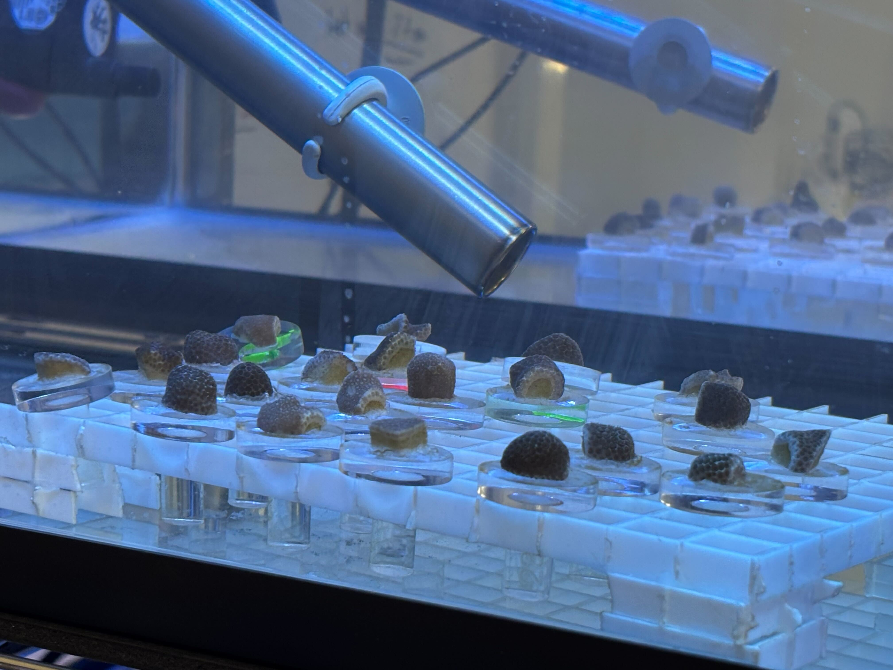
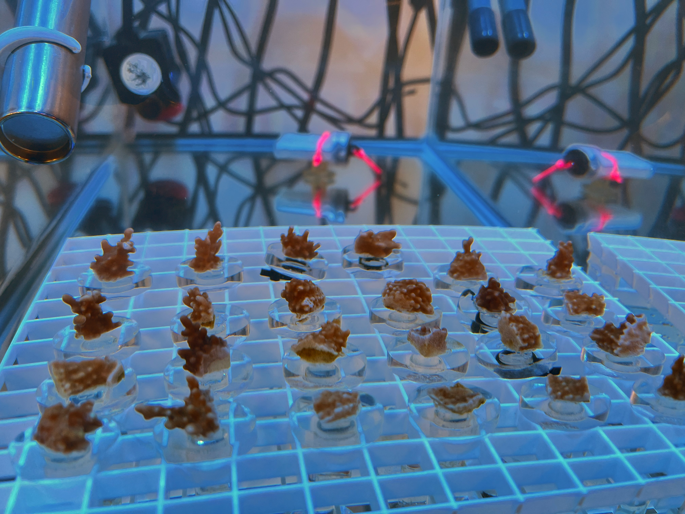
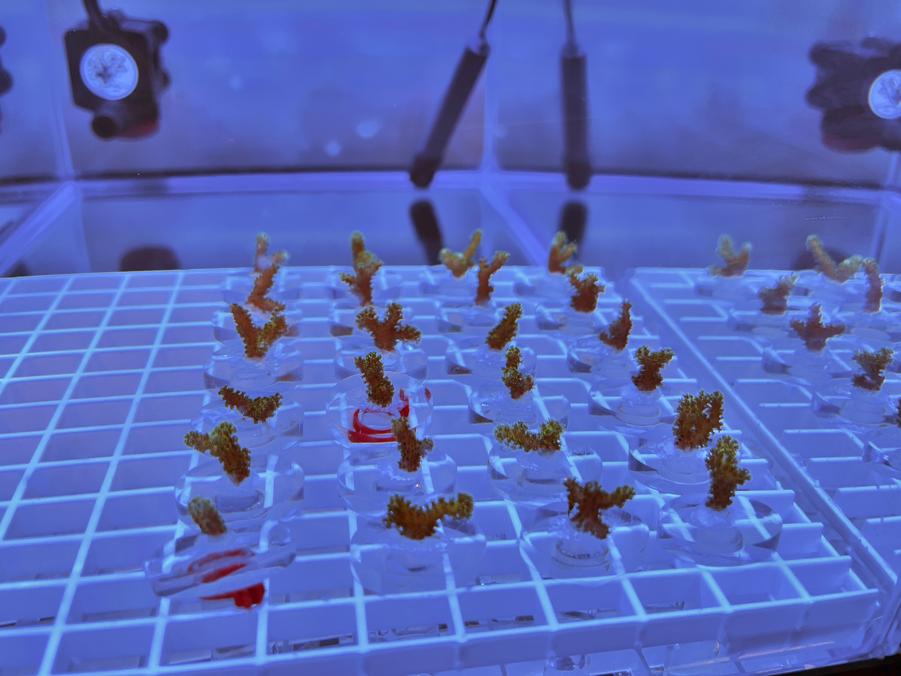
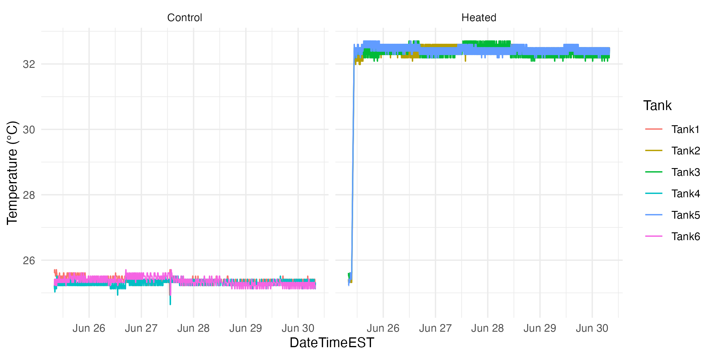
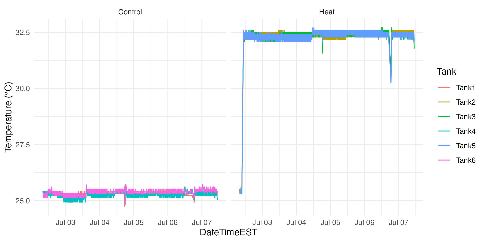
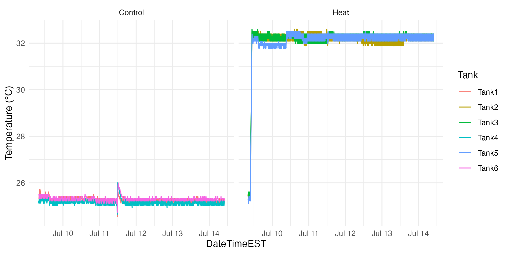

# TimeSeries

Data and methods for Chapter Four of my dissertation, a stort-term heat stress physiology & high-resolution gene expression time series performed on *Porites compressa*, *Montipora capitata*, and *Pocillopora acuta* in the experimental tank system at CBLS in Summer 2025.

## Protocols

- [Sampling protocol for each timepoint](https://github.com/zdellaert/TimeSeries/blob/main/protocols/Sampling.md)    
- [Example sampling schedule](https://github.com/zdellaert/TimeSeries/blob/main/protocols/Example_Sampling_Schedule.pdf)
- [Bulk RNA extraction protocol](https://github.com/zdellaert/TimeSeries/blob/main/protocols/Bulk_DNA_RNA_Extractions_Zymo_Quick_Miniprep.md)

## Google Drive Links:

### Extraction Tracking Google Sheets:

- [Finalized after RNA submission Oct 2025](https://docs.google.com/spreadsheets/d/1QHUKl4J3LPnZhpgZH4eT6g07zjvgPuXU1qO1aj64CPo/edit?usp=sharing)

### Images of all lab notebook pages and datasheets:

- [Notebook 66](https://drive.google.com/drive/folders/1gG0gzYWPyWYgEgFP1cWNjod15tXFpT9E?usp=drive_link)

### Full-size images for color score measurements: 

- [RAW_TIFF_ColorScore](https://drive.google.com/drive/folders/1VJvZi2nuNFpBn-t-O4A9bNAgSROkeTPa?usp=sharing)

## Quick summary of currently available data

| Species | *Porites compressa* | *Montipora capitata* | *Pocillopora acuta* |
|---------|---------|---------|---------|
| Species |  |  |  |
| Temperature |  |  |  |
| Fv/Fm trajectories |  |  |  |
