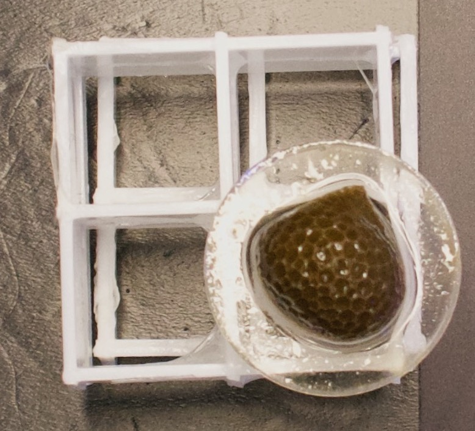
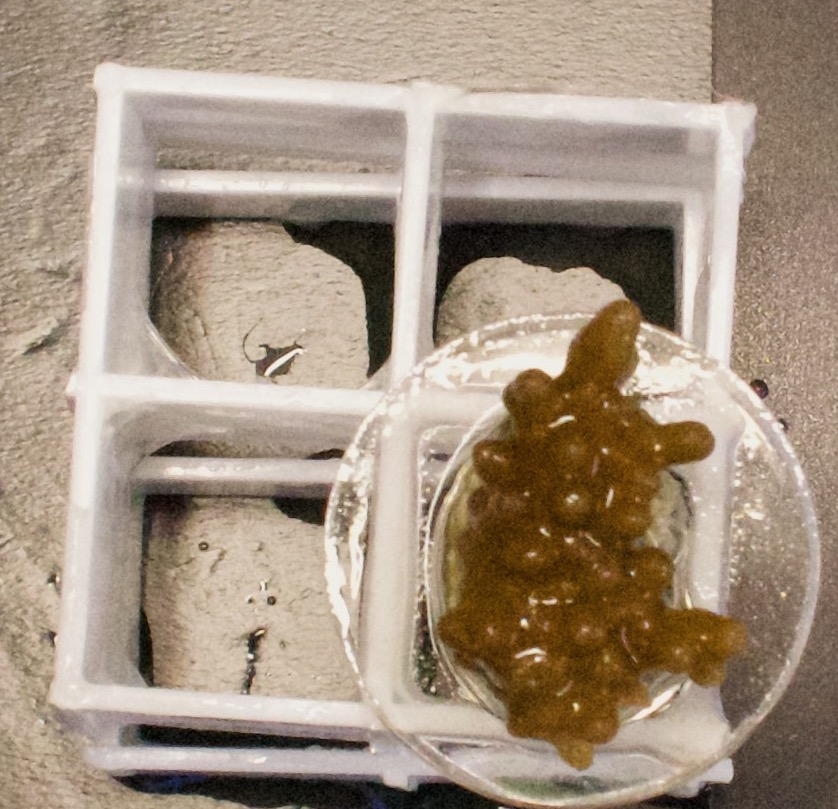
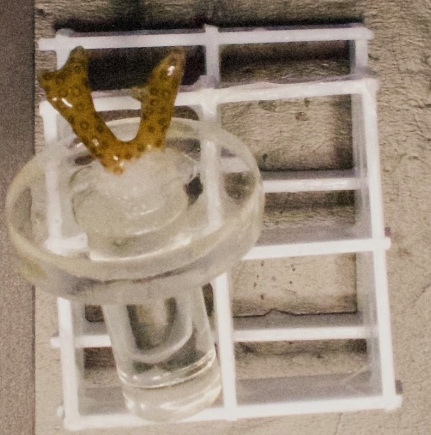
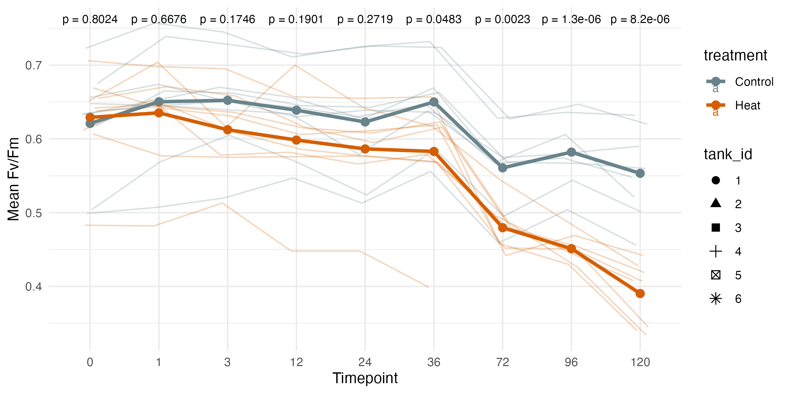
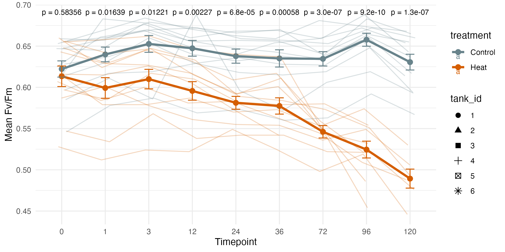
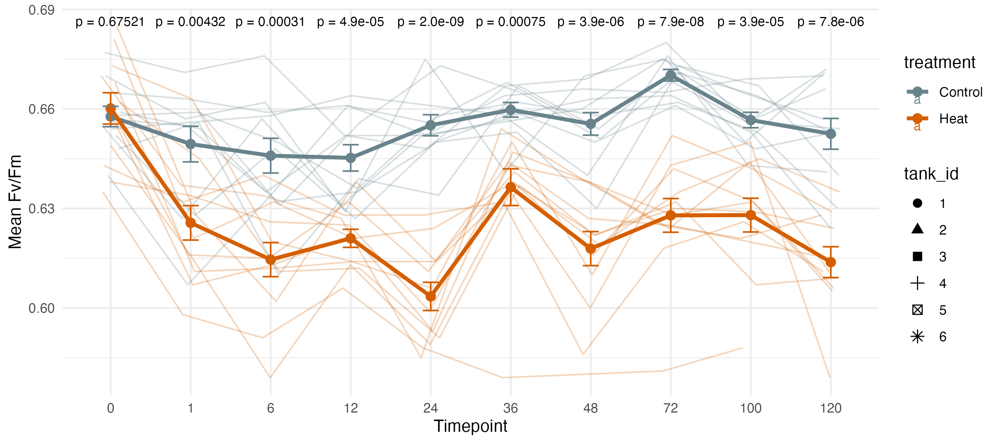

# TimeSeries

Data and methods for Chapter Four of my dissertation, a stort-term heat stress physiology & high-resolution gene expression time series performed on *Porites compressa*, *Montipora capitata*, and *Pocillopora acuta* in the experimental tank system at CBLS in Summer 2025.

## Protocols

- [Sampling protocol for each timepoint](https://github.com/zdellaert/TimeSeries/blob/main/protocols/Sampling.md)    
- [Example sampling schedule](https://github.com/zdellaert/TimeSeries/blob/main/protocols/Example_Sampling_Schedule.pdf)
- [Bulk RNA extraction protocol](https://github.com/zdellaert/TimeSeries/blob/main/protocols/Bulk_DNA_RNA_Extractions_Zymo_Quick_Miniprep.md)

## Google Drive Links:

### Extraction Tracking Google Sheets:

- [Porites](https://docs.google.com/spreadsheets/d/1YSbTec3CTiB_jzlPmmnUCw8G7EHQEp4lCAPvE5Y3PbQ/edit?usp=sharing)
- [Montipora](https://docs.google.com/spreadsheets/d/1N5znQ5vAMwiakrH98vXy5NZ-cQHXqJ8H3JobaCf9FuY/edit?usp=sharing)
- [Pocillopora](https://docs.google.com/spreadsheets/d/17fJv9rguI5UyHwK8QH_VLOt18IPXVOByG2DgnAi0dJQ/edit?usp=sharing)

### Images of all lab notebook pages and datasheets:

- [Notebook 66](https://drive.google.com/drive/folders/1gG0gzYWPyWYgEgFP1cWNjod15tXFpT9E?usp=drive_link)

### Full-size images for color score measurements: 

- [RAW_TIFF_ColorScore](https://drive.google.com/drive/folders/1VJvZi2nuNFpBn-t-O4A9bNAgSROkeTPa?usp=sharing)

## Pictures

| *Porites compressa* | *Montipora capitata* | *Pocillopora acuta* |
|---------|---------|---------|
|  |  |  |
|  |  |  |