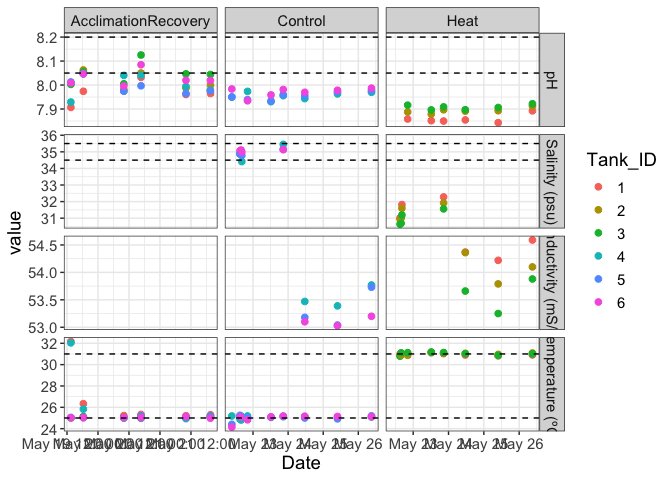
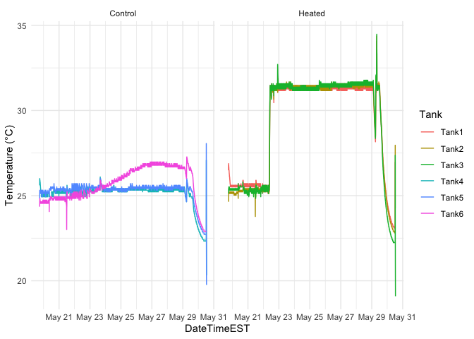

Daily measurement plotting
================
Zoe Dellaert
5/25/2025

- [0.1 Load packages](#01-load-packages)
- [0.2 Load data](#02-load-data)
- [0.3 Calculate total pH from Probe Set
  1](#03-calculate-total-ph-from-probe-set-1)
- [0.4 Change to long format](#04-change-to-long-format)
- [0.5 Plot](#05-plot)
- [0.6 HOBO Temps, based on Jill’s
  Script](#06-hobo-temps-based-on-jills-script)

This script plots daily measurements from the experiment, and is based
on the Putnam Lab script available here:
<https://github.com/Putnam-Lab/CBLS_Wetlab/tree/main>

## 0.1 Load packages

## 0.2 Load data

``` r
## Read in data
daily <- read.csv("../data/water_chemistry/DMs.csv")
head(daily)
```

    ##       Date           Treatment Tank_ID  Time AMPM Initials Temperature_C pH_mv
    ## 1 20250519 AcclimationRecovery       1 13:30  Mid    ZD;JA         32.17 -51.4
    ## 2 20250519 AcclimationRecovery       2 13:30  Mid    ZD;JA         25.02 -53.6
    ## 3 20250519 AcclimationRecovery       3 13:30  Mid    ZD;JA         25.02 -53.4
    ## 4 20250519 AcclimationRecovery       4 13:30  Mid    ZD;JA         32.04 -52.6
    ## 5 20250519 AcclimationRecovery       5 13:30  Mid    ZD;JA         25.05 -54.0
    ## 6 20250519 AcclimationRecovery       6 13:30  Mid    ZD;JA         25.02 -53.7
    ##   Salinity_psu Salinity_ATC_Mode Conductivity_mScm tris.date Probe.Set
    ## 1        41.40               MAN                NA  20250513    Probe1
    ## 2        35.54               MAN                NA  20250513    Probe1
    ## 3        35.64               MAN                NA  20250513    Probe1
    ## 4        41.91               MAN                NA  20250513    Probe1
    ## 5        35.85               MAN                NA  20250513    Probe1
    ## 6        36.00               MAN                NA  20250513    Probe1
    ##                                                   notes
    ## 1 No animals in tanks. Heated to 32C for test overnight
    ## 2                                 No animals in tanks. 
    ## 3                                 No animals in tanks. 
    ## 4 No animals in tanks. Heated to 32C for test overnight
    ## 5                                 No animals in tanks. 
    ## 6                                 No animals in tanks.

``` r
tail(daily) # check to make sure data from today is there
```

    ##         Date Treatment Tank_ID Time AMPM Initials Temperature_C pH_mv
    ## 139 20250529      Heat       1        AM    NB;JH         31.20 -50.8
    ## 140 20250529      Heat       2        AM    NB;JH         31.15 -52.7
    ## 141 20250529      Heat       3        AM    NB;JH         30.81 -52.5
    ## 142 20250529   Control       4        AM    NB;JH         24.82 -53.3
    ## 143 20250529   Control       5        AM    NB;JH         25.10 -53.0
    ## 144 20250529   Control       6        AM    NB;JH         25.16 -53.0
    ##     Salinity_psu Salinity_ATC_Mode Conductivity_mScm tris.date Probe.Set notes
    ## 139        36.70               MAN                NA  20250513    Probe1      
    ## 140        36.68               MAN                NA  20250513    Probe1      
    ## 141        36.61               MAN                NA  20250513    Probe1      
    ## 142        35.28               MAN                NA  20250513    Probe1      
    ## 143        35.29               MAN                NA  20250513    Probe1      
    ## 144        35.18               MAN                NA  20250513    Probe1

``` r
daily$Date <- as.Date(as.character(daily$Date), format = "%Y%m%d")
daily$tris.date <- as.character(daily$tris.date)
daily$Tank_ID <- as.character(daily$Tank_ID)

daily$DateTime <- as.POSIXct(paste(daily$Date, daily$Time), format="%Y-%m-%d %H:%M")
```

``` r
daily.probe1 <- daily %>% filter(Probe.Set == "Probe1") 

range(na.omit(daily.probe1$Temperature_C))
```

    ## [1] 24.15 32.17

``` r
range(na.omit(daily.probe1$pH_mv))
```

    ## [1] -60.8 -46.1

``` r
range(na.omit(daily.probe1$Salinity_psu))
```

    ## [1] 30.64 41.91

## 0.3 Calculate total pH from Probe Set 1

Calculate the calibration curve from the Tris calibration and calculate
pH on the total scale from pH.mV.

``` r
pHcalib <- read_csv("../data/water_chemistry/Tris_Calibration.csv")
```

    ## Rows: 13 Columns: 3
    ## ── Column specification ────────────────────────────────────────────────────────
    ## Delimiter: ","
    ## dbl (3): tris.date, mVTris, TTris
    ## 
    ## ℹ Use `spec()` to retrieve the full column specification for this data.
    ## ℹ Specify the column types or set `show_col_types = FALSE` to quiet this message.

``` r
pHcalib$tris.date<-as.character(pHcalib$tris.date)

pHSlope <- pHcalib %>%
  group_by(tris.date) %>%
  nest() %>%
  mutate(fitpH = map(data, ~ lm(mVTris ~ TTris, data = .x))) %>%
  mutate(tidy_fit = map(fitpH, broom::tidy)) %>%
  unnest(tidy_fit) %>%
  select(tris.date, term, estimate) %>%
  pivot_wider(names_from = term, values_from = estimate) %>%
  left_join(daily.probe1, ., by = "tris.date") %>%
  mutate(mVTris = Temperature_C * TTris + `(Intercept)`)

pHSlope <- pHSlope %>%
  mutate(pH.total = seacarb::pH(Ex = pH_mv, Etris = mVTris, S=Salinity_psu, T=Temperature_C))
```

    ## Warning: There was 1 warning in `mutate()`.
    ## ℹ In argument: `pH.total = seacarb::pH(Ex = pH_mv, Etris = mVTris, S =
    ##   Salinity_psu, T = Temperature_C)`.
    ## Caused by warning in `tris()`:
    ## ! S, T, and/or b is outside the range of validity for the TRIS buffer pH formulation by DelValls and Dickson (1998).

Convert date to ymd for plotting

``` r
pHSlope$Date <- ymd(pHSlope$Date) # convert 8 digit date into datetime format

pHSlope <- pHSlope %>% relocate("pH.total", .after = Salinity_psu) %>%
  relocate(pH_mv, .after = Probe.Set)  %>%
  relocate(Salinity_ATC_Mode, .after = Probe.Set)
```

## 0.4 Change to long format

Change data format to long format

``` r
pHSlope.long <-pHSlope %>% pivot_longer(cols=Temperature_C:Conductivity_mScm,
  names_to = "metric",
  values_to = "value")

pHSlope.long <- pHSlope.long %>% filter(!(metric=="Salinity_psu" & Salinity_ATC_Mode=="ATC"))
```

## 0.5 Plot

Make a list of dataframes, each containing a horizontal line that will
correspond to the upper and lower threshold of each parameter
(temperature, salinity, pH total)

``` r
hlines_data <- list(
  data.frame(yintercept = 25.0, metric = "Temperature_C"), # lower threshold for temperature in C°
  data.frame(yintercept = 31, metric = "Temperature_C"), # upper threshold for temperature in C°
  data.frame(yintercept = 34.5, metric = "Salinity_psu"), # lower threshold for salinity in psu
  data.frame(yintercept = 35.5, metric = "Salinity_psu"), # upper threshold for salinity in psu
  data.frame(yintercept = 8.05, metric = "pH.total"), # lower threshold for total pH
  data.frame(yintercept = 8.2, metric = "pH.total") # upper threshold for total pH
    )
```

``` r
facet_labels <- c(unique(pHSlope.long$metric), unique(pHSlope.long$Treatment))
names(facet_labels) = facet_labels
facet_labels <- replace(facet_labels, which(facet_labels == "pH.total"), "pH")
facet_labels <- replace(facet_labels, which(facet_labels == "Salinity_psu"), "Salinity (psu)")
facet_labels <- replace(facet_labels, which(facet_labels == "Conductivity_mScm"), "Conductivity (mS/cm)")
facet_labels <- replace(facet_labels, which(facet_labels == "Temperature_C"), "Temperature (ºC)")

daily_tank<-pHSlope.long %>% filter(Treatment !=  "Ramp") %>%
  ggplot(aes(x=DateTime, y=value, colour=Tank_ID))+
  geom_point(size=2)+
  xlab("Date")+
  facet_grid(factor(metric,c("pH.total","Salinity_psu","Conductivity_mScm","Temperature_C")) ~ Treatment, scales = "free", labeller = as_labeller(facet_labels))+
  geom_hline(data = hlines_data[[1]], aes(yintercept = yintercept), linetype = "dashed") +    
  geom_hline(data = hlines_data[[2]], aes(yintercept = yintercept), linetype = "dashed") +
  geom_hline(data = hlines_data[[3]], aes(yintercept = yintercept), linetype = "dashed") +
  geom_hline(data = hlines_data[[4]], aes(yintercept = yintercept), linetype = "dashed") +
  geom_hline(data = hlines_data[[5]], aes(yintercept = yintercept), linetype = "dashed") +
  geom_hline(data = hlines_data[[6]], aes(yintercept = yintercept), linetype = "dashed") +
  theme_bw() +
  theme(text = element_text(size = 14)); daily_tank
```

    ## Warning: Removed 261 rows containing missing values or values outside the scale range
    ## (`geom_point()`).

<!-- -->

``` r
daily_tank<-pHSlope.long %>% filter(Treatment !=  "AcclimationRecovery" & Treatment !=  "Ramp") %>%
  ggplot(aes(x=DateTime, y=value, colour=Tank_ID))+
  geom_point(size=2)+
  xlab("Date")+
  facet_grid(factor(metric,c("pH.total","Salinity_psu","Conductivity_mScm","Temperature_C")) ~ Treatment, scales = "free", labeller = as_labeller(facet_labels))+
  geom_hline(data = hlines_data[[1]], aes(yintercept = yintercept), linetype = "dashed") +    
  geom_hline(data = hlines_data[[2]], aes(yintercept = yintercept), linetype = "dashed") +
  geom_hline(data = hlines_data[[3]], aes(yintercept = yintercept), linetype = "dashed") +
  geom_hline(data = hlines_data[[4]], aes(yintercept = yintercept), linetype = "dashed") +
  geom_hline(data = hlines_data[[5]], aes(yintercept = yintercept), linetype = "dashed") +
  geom_hline(data = hlines_data[[6]], aes(yintercept = yintercept), linetype = "dashed") +
  theme_bw() +
  theme(text = element_text(size = 14)); daily_tank
```

    ## Warning: Removed 225 rows containing missing values or values outside the scale range
    ## (`geom_point()`).

<!-- -->

``` r
# Save plot 
ggsave("../output/Daily_Measurements_Exp.pdf", daily_tank, width = 10, height = 10, units = c("in"))
```

    ## Warning: Removed 225 rows containing missing values or values outside the scale range
    ## (`geom_point()`).

``` r
ggsave("../output/Daily_Measurements_Exp.png", daily_tank, width = 10, height = 10, units = c("in"))
```

    ## Warning: Removed 225 rows containing missing values or values outside the scale range
    ## (`geom_point()`).

Summarize daily measurements during the heat stress experiment

``` r
daily_exp <- pHSlope %>% 
  filter(Treatment != "AcclimationRecovery" & Treatment !=  "Ramp")

summary <- daily_exp%>%
  group_by(Tank_ID)%>%
  select(Temperature_C:Conductivity_mScm) %>%
  summarise(across(everything(), list(mean = mean, sd = sd), na.rm = TRUE)); summary
```

    ## Adding missing grouping variables: `Tank_ID`

    ## Warning: There was 1 warning in `summarise()`.
    ## ℹ In argument: `across(everything(), list(mean = mean, sd = sd), na.rm =
    ##   TRUE)`.
    ## ℹ In group 1: `Tank_ID = "1"`.
    ## Caused by warning:
    ## ! The `...` argument of `across()` is deprecated as of dplyr 1.1.0.
    ## Supply arguments directly to `.fns` through an anonymous function instead.
    ## 
    ##   # Previously
    ##   across(a:b, mean, na.rm = TRUE)
    ## 
    ##   # Now
    ##   across(a:b, \(x) mean(x, na.rm = TRUE))

    ## # A tibble: 6 × 9
    ##   Tank_ID Temperature_C_mean Temperature_C_sd Salinity_psu_mean Salinity_psu_sd
    ##   <chr>                <dbl>            <dbl>             <dbl>           <dbl>
    ## 1 1                     31.0            0.103              34.7           2.06 
    ## 2 2                     31.0            0.102              34.6           2.10 
    ## 3 3                     31.0            0.162              34.2           2.09 
    ## 4 4                     25.0            0.125              35.2           0.369
    ## 5 5                     25.0            0.210              35.1           0.230
    ## 6 6                     25.0            0.278              35.1           0.132
    ## # ℹ 4 more variables: pH.total_mean <dbl>, pH.total_sd <dbl>,
    ## #   Conductivity_mScm_mean <dbl>, Conductivity_mScm_sd <dbl>

## 0.6 HOBO Temps, based on [Jill’s Script](https://github.com/JillAshey/Astrangia_repo/blob/0041652d5b2a01145c1c049f10dbc53a8513cb86/scripts/Hobo_Temps.Rmd#L27)

``` r
library(lubridate)
library(tidyverse)
library(emmeans)
```

    ## Warning: package 'emmeans' was built under R version 4.3.3

    ## Welcome to emmeans.
    ## Caution: You lose important information if you filter this package's results.
    ## See '? untidy'

``` r
library(gridExtra)
```

    ## 
    ## Attaching package: 'gridExtra'

    ## The following object is masked from 'package:dplyr':
    ## 
    ##     combine

``` r
# Read in temp data 
Tank1 <- read.csv("../data/LoggerData/Tank1_9893752.csv", sep=",", skip=c(1), header=TRUE, na.strings = "NA")[ ,2:4]
Tank2 <- read.csv("../data/LoggerData/Tank2_10655123.csv", sep=",", skip=c(1), header=TRUE, na.strings = "NA")[ ,2:4]
Tank3 <- read.csv("../data/LoggerData/Tank3_10655130.csv", sep=",", skip=c(1), header=TRUE, na.strings = "NA")[ ,2:4]
Tank4 <- read.csv("../data/LoggerData/Tank4_10655129.csv", sep=",", skip=c(1), header=TRUE, na.strings = "NA")[ ,2:4]
Tank5 <- read.csv("../data/LoggerData/Tank5_10655120.csv", sep=",", skip=c(1), header=TRUE, na.strings = "NA")[ ,2:4]
Tank6 <- read.csv("../data/LoggerData/Tank6_10655122.csv", sep=",", skip=c(1), header=TRUE, na.strings = "NA")[ ,2:4]

col_names <- c("DateTimeGMTmin10","TempC","IntensityLux")

# combine all dataframes into list
Tanks <- list(Tank1 = Tank1,
              Tank2 = Tank2,
              Tank3 = Tank3,
              Tank4 = Tank4,
              Tank5 = Tank5,
              Tank6 = Tank6)

# find dataframe with the fewest number of rows
min_rows <- min(sapply(Tanks, nrow))

# trim them all to be this length
Tanks <- lapply(Tanks, function(df) {df[1:min_rows, ]
                                    colnames(df) <- col_names
                                    return(df)
})

Tank1 <- Tanks$Tank1
Tank2 <- Tanks$Tank2
Tank3 <- Tanks$Tank3
Tank4 <- Tanks$Tank4
Tank5 <- Tanks$Tank5
Tank6 <- Tanks$Tank6

Tank1$Tank <- "Tank1"
Tank2$Tank <- "Tank2"
Tank3$Tank <- "Tank3"
Tank4$Tank <- "Tank4"
Tank5$Tank <- "Tank5"
Tank6$Tank <- "Tank6"

Tank1$Treatment <- "Heated"
Tank2$Treatment <- "Heated"
Tank3$Treatment <- "Heated"
Tank4$Treatment <- "Control"
Tank5$Treatment <- "Control"
Tank6$Treatment <- "Control"

tank_df <- rbind(Tank1, Tank2, Tank3, Tank4, Tank5, Tank6)

tank_df$DateTimeGMTmin10 <- parse_date_time(tank_df$DateTimeGMTmin10, "%m/%d/%y %I:%M:%S %p")

# Assign raw timezone as GMT-10 (Hawaii)
tank_df$DateTimeGMTmin10 <- force_tz(tank_df$DateTimeGMTmin10, tzone = "Etc/GMT+10")

# Convert to Eastern Time
tank_df$DateTimeEST <- with_tz(tank_df$DateTimeGMTmin10, tzone = "America/New_York")

Temps <- tank_df %>% ggplot(aes(x=DateTimeEST, y=TempC)) +
  geom_line(aes(color = Tank), size = 0.5) +
  facet_grid(~Treatment)+
  ylab("Temperature (°C)") +theme_minimal()
```

    ## Warning: Using `size` aesthetic for lines was deprecated in ggplot2 3.4.0.
    ## ℹ Please use `linewidth` instead.
    ## This warning is displayed once every 8 hours.
    ## Call `lifecycle::last_lifecycle_warnings()` to see where this warning was
    ## generated.

``` r
Temps
```

    ## Warning: Removed 17 rows containing missing values or values outside the scale range
    ## (`geom_line()`).

<!-- -->

``` r
#remove commas from light data and make numeric
tank_df$IntensityLux <- as.numeric(gsub(",", "", tank_df$IntensityLux))

Light <- tank_df %>% ggplot(aes(x=DateTimeEST, y=IntensityLux)) +
  geom_line(aes(color = Tank), size = 0.5) +
  facet_grid(~Treatment)+
  ylab("Light (Lux)") +theme_minimal()

Light
```

    ## Warning: Removed 17 rows containing missing values or values outside the scale range
    ## (`geom_line()`).

<!-- -->

``` r
# filter for our experimental dates 
tank_df_Exp <- tank_df %>% filter(DateTimeEST >= "2025-05-22 00:00:00" & DateTimeEST <= "2025-05-29 12:00:00")

write.csv(tank_df_Exp,file="../output/Experimental_Tank_HoboTempLight_data.csv")

Temps <- tank_df_Exp %>% ggplot(aes(x=DateTimeEST, y=TempC)) +
  geom_line(aes(color = Tank), size = 0.5) +
  facet_grid(~Treatment)+
  ylab("Temperature (°C)") +theme_minimal()
Temps
```

<!-- -->

``` r
ggsave("../output/Experimental_Tank_HoboTemp.pdf", plot = last_plot(), width = 8, height = 4)
ggsave("../output/Experimental_Tank_HoboTemp.png", plot = last_plot(), width = 8, height = 4)

Light <- tank_df_Exp %>% ggplot(aes(x=DateTimeEST, y=IntensityLux)) +
  geom_line(aes(color = Tank), size = 0.5) +
  facet_grid(~Treatment)+
  ylab("Light (Lux)") +theme_minimal()

Light
```

<!-- -->

``` r
ggsave("../output/Experimental_Tank_HoboLight.pdf", plot = last_plot(), width = 8, height = 4)
ggsave("../output/Experimental_Tank_HoboLight.png", plot = last_plot(), width = 8, height = 4)
```
