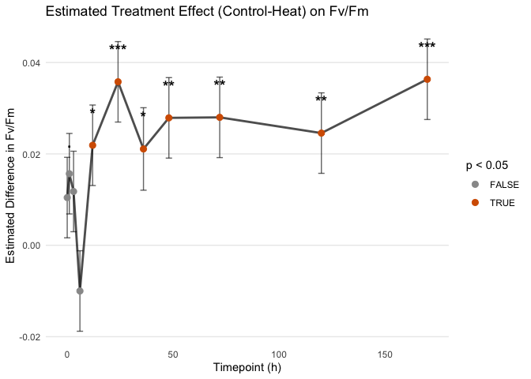

PAM
================
Zoe Dellaert
2025-05-21

- [0.1 Statistical Mixed Model by treatment, timepoint, and
  tank_id](#01-statistical-mixed-model-by-treatment-timepoint-and-tank_id)

``` r
library(tidyverse)
```

    ## Warning: package 'ggplot2' was built under R version 4.3.3

    ## Warning: package 'purrr' was built under R version 4.3.3

    ## Warning: package 'lubridate' was built under R version 4.3.3

    ## ── Attaching core tidyverse packages ──────────────────────── tidyverse 2.0.0 ──
    ## ✔ dplyr     1.1.4     ✔ readr     2.1.5
    ## ✔ forcats   1.0.0     ✔ stringr   1.5.1
    ## ✔ ggplot2   3.5.2     ✔ tibble    3.2.1
    ## ✔ lubridate 1.9.4     ✔ tidyr     1.3.1
    ## ✔ purrr     1.0.4     
    ## ── Conflicts ────────────────────────────────────────── tidyverse_conflicts() ──
    ## ✖ dplyr::filter() masks stats::filter()
    ## ✖ dplyr::lag()    masks stats::lag()
    ## ℹ Use the conflicted package (<http://conflicted.r-lib.org/>) to force all conflicts to become errors

``` r
library(janitor)
```

    ## Warning: package 'janitor' was built under R version 4.3.3

    ## 
    ## Attaching package: 'janitor'
    ## 
    ## The following objects are masked from 'package:stats':
    ## 
    ##     chisq.test, fisher.test

``` r
library(ggpubr)
library(lme4)
```

    ## Warning: package 'lme4' was built under R version 4.3.3

    ## Loading required package: Matrix
    ## 
    ## Attaching package: 'Matrix'
    ## 
    ## The following objects are masked from 'package:tidyr':
    ## 
    ##     expand, pack, unpack

``` r
library(lmerTest)
```

    ## 
    ## Attaching package: 'lmerTest'
    ## 
    ## The following object is masked from 'package:lme4':
    ## 
    ##     lmer
    ## 
    ## The following object is masked from 'package:stats':
    ## 
    ##     step

``` r
library(emmeans)
```

    ## Warning: package 'emmeans' was built under R version 4.3.3

    ## Welcome to emmeans.
    ## Caution: You lose important information if you filter this package's results.
    ## See '? untidy'

``` r
custom_colors <- c("Control" = "lightblue4", "Heat" = "#D55E00")

PAM <- read.csv("../data/PAM.csv") %>% clean_names() %>% filter(date != "20250519")
PAM <- PAM %>% mutate(date = as.factor(date)) %>% 
                mutate(timepoint = factor(timepoint,levels = c("0","1","3","6","12","24","36","48","72","120","170"), ordered = TRUE)) %>% 
                mutate(plug = as.factor(plug)) %>%
                mutate(treatment = factor(treatment,levels = c("Control","Heat", ordered=TRUE)))

ggplot(PAM,aes(x = date, y = fv_fm_y_1000)) + 
    geom_boxplot(aes(fill = tank_id)) + labs(x = "Date", y = "Fv/Fm", title = "Fv/Fm by Date and Tank") +
  theme_minimal()
```

    ## Warning: Removed 1 row containing non-finite outside the scale range
    ## (`stat_boxplot()`).

<!-- -->

``` r
PAM_exp <- PAM %>% filter(date!="20250521" & date!="20250520")
table(PAM_exp$plug)
```

    ## 
    ## 1100 1109 1133 1205 1253 1342 1555 1607 1614 1620 1621 1628 1748 1757 2002 2185 
    ##   11   11   11   11   11   11   11   11   11   11   11   11   11   11   11   11 
    ## 2360 2401 
    ##   11   11

``` r
ggplot(PAM_exp,aes(x = timepoint, y = fv_fm_y_1000)) + 
    geom_boxplot(aes(fill = treatment)) +theme_minimal() +scale_fill_manual(values = custom_colors) 
```

    ## Warning: Removed 1 row containing non-finite outside the scale range
    ## (`stat_boxplot()`).

<!-- -->

``` r
ggplot(PAM_exp,aes(x = timepoint, y = fv_fm_y_1000, group = plug)) + 
    geom_path(aes(color=plug)) + theme_minimal() +facet_wrap(tank_id~treatment)
```

<!-- -->

## 0.1 Statistical Mixed Model by treatment, timepoint, and tank_id

``` r
# mixed model
model <- lmer(fv_fm_y_1000 ~ treatment * timepoint + (1 | treatment:tank_id), data = PAM_exp)
summary(model)
```

    ## Linear mixed model fit by REML. t-tests use Satterthwaite's method [
    ## lmerModLmerTest]
    ## Formula: fv_fm_y_1000 ~ treatment * timepoint + (1 | treatment:tank_id)
    ##    Data: PAM_exp
    ## 
    ## REML criterion at convergence: -880.4
    ## 
    ## Scaled residuals: 
    ##     Min      1Q  Median      3Q     Max 
    ## -3.1723 -0.4964  0.0992  0.5258  3.0227 
    ## 
    ## Random effects:
    ##  Groups            Name        Variance  Std.Dev.
    ##  treatment:tank_id (Intercept) 2.511e-05 0.005011
    ##  Residual                      2.737e-04 0.016545
    ## Number of obs: 197, groups:  treatment:tank_id, 6
    ## 
    ## Fixed effects:
    ##                              Estimate Std. Error         df t value Pr(>|t|)
    ## (Intercept)                  0.726603   0.003342   4.022434 217.426 2.44e-09
    ## treatmentHeat               -0.020310   0.004723   4.010996  -4.301 0.012564
    ## timepoint.L                  0.034968   0.005518 171.013313   6.337 2.01e-09
    ## timepoint.Q                 -0.014667   0.005548 171.034281  -2.644 0.008962
    ## timepoint.C                 -0.033267   0.005531 171.022369  -6.015 1.06e-08
    ## timepoint^4                  0.022095   0.005535 171.024890   3.992 9.70e-05
    ## timepoint^5                  0.010506   0.005551 171.036260   1.893 0.060091
    ## timepoint^6                 -0.004329   0.005519 171.014244  -0.784 0.433944
    ## timepoint^7                  0.011665   0.005571 171.050363   2.094 0.037754
    ## timepoint^8                  0.015752   0.005517 171.012846   2.855 0.004836
    ## timepoint^9                 -0.028894   0.005578 171.055154  -5.180 6.19e-07
    ## timepoint^10                 0.015913   0.005598 171.068626   2.843 0.005018
    ## treatmentHeat:timepoint.L   -0.027521   0.007802 171.012182  -3.528 0.000539
    ## treatmentHeat:timepoint.Q   -0.001754   0.007823 171.022742  -0.224 0.822871
    ## treatmentHeat:timepoint.C    0.007538   0.007811 171.016727   0.965 0.335878
    ## treatmentHeat:timepoint^4   -0.010013   0.007813 171.017997  -1.282 0.201751
    ## treatmentHeat:timepoint^5   -0.012525   0.007825 171.023745  -1.601 0.111283
    ## treatmentHeat:timepoint^6    0.013011   0.007802 171.012648   1.668 0.097230
    ## treatmentHeat:timepoint^7   -0.005839   0.007839 171.030928  -0.745 0.457381
    ## treatmentHeat:timepoint^8   -0.015635   0.007801 171.011948  -2.004 0.046624
    ## treatmentHeat:timepoint^9    0.014803   0.007844 171.033381   1.887 0.060828
    ## treatmentHeat:timepoint^10   0.001638   0.007858 171.040316   0.208 0.835098
    ##                               
    ## (Intercept)                ***
    ## treatmentHeat              *  
    ## timepoint.L                ***
    ## timepoint.Q                ** 
    ## timepoint.C                ***
    ## timepoint^4                ***
    ## timepoint^5                .  
    ## timepoint^6                   
    ## timepoint^7                *  
    ## timepoint^8                ** 
    ## timepoint^9                ***
    ## timepoint^10               ** 
    ## treatmentHeat:timepoint.L  ***
    ## treatmentHeat:timepoint.Q     
    ## treatmentHeat:timepoint.C     
    ## treatmentHeat:timepoint^4     
    ## treatmentHeat:timepoint^5     
    ## treatmentHeat:timepoint^6  .  
    ## treatmentHeat:timepoint^7     
    ## treatmentHeat:timepoint^8  *  
    ## treatmentHeat:timepoint^9  .  
    ## treatmentHeat:timepoint^10    
    ## ---
    ## Signif. codes:  0 '***' 0.001 '**' 0.01 '*' 0.05 '.' 0.1 ' ' 1

    ## 
    ## Correlation matrix not shown by default, as p = 22 > 12.
    ## Use print(x, correlation=TRUE)  or
    ##     vcov(x)        if you need it

``` r
# Estimated marginal means (adjusted for random effects and model structure)
emm <- emmeans(model, ~ treatment | timepoint)
pairs(emm)
```

    ## timepoint = 0:
    ##  contrast       estimate      SE   df t.ratio p.value
    ##  Control - Heat   0.0104 0.00881 42.3   1.186  0.2423
    ## 
    ## timepoint = 1:
    ##  contrast       estimate      SE   df t.ratio p.value
    ##  Control - Heat   0.0157 0.00881 42.3   1.779  0.0825
    ## 
    ## timepoint = 3:
    ##  contrast       estimate      SE   df t.ratio p.value
    ##  Control - Heat   0.0118 0.00881 42.3   1.337  0.1883
    ## 
    ## timepoint = 6:
    ##  contrast       estimate      SE   df t.ratio p.value
    ##  Control - Heat  -0.0100 0.00881 42.3  -1.135  0.2626
    ## 
    ## timepoint = 12:
    ##  contrast       estimate      SE   df t.ratio p.value
    ##  Control - Heat   0.0219 0.00881 42.3   2.485  0.0170
    ## 
    ## timepoint = 24:
    ##  contrast       estimate      SE   df t.ratio p.value
    ##  Control - Heat   0.0358 0.00881 42.3   4.062  0.0002
    ## 
    ## timepoint = 36:
    ##  contrast       estimate      SE   df t.ratio p.value
    ##  Control - Heat   0.0211 0.00903 45.7   2.336  0.0239
    ## 
    ## timepoint = 48:
    ##  contrast       estimate      SE   df t.ratio p.value
    ##  Control - Heat   0.0279 0.00881 42.3   3.167  0.0029
    ## 
    ## timepoint = 72:
    ##  contrast       estimate      SE   df t.ratio p.value
    ##  Control - Heat   0.0280 0.00881 42.3   3.179  0.0028
    ## 
    ## timepoint = 120:
    ##  contrast       estimate      SE   df t.ratio p.value
    ##  Control - Heat   0.0246 0.00881 42.3   2.788  0.0079
    ## 
    ## timepoint = 170:
    ##  contrast       estimate      SE   df t.ratio p.value
    ##  Control - Heat   0.0363 0.00881 42.3   4.125  0.0002
    ## 
    ## Degrees-of-freedom method: kenward-roger

``` r
summary_table <- as.data.frame(pairs(emm)) %>%
  transmute(
    Timepoint = as.numeric(as.character(timepoint)),
    `Estimate (Control - Heat)` = round(estimate, 4),
    `SE` = round(SE, 4),
    `t-ratio` = round(t.ratio, 2),
    `p-value` = signif(p.value, 3),
    `Significant?` = case_when(
      p.value < 0.001 ~ "***",
      p.value < 0.01 ~ "**",
      p.value < 0.05 ~ "*",
      p.value < 0.1 ~ ".",
      TRUE ~ ""
    )
  )

print(summary_table)
```

    ##    Timepoint Estimate (Control - Heat)     SE t-ratio  p-value Significant?
    ## 1          0                    0.0104 0.0088    1.19 0.242000             
    ## 2          1                    0.0157 0.0088    1.78 0.082500            .
    ## 3          3                    0.0118 0.0088    1.34 0.188000             
    ## 4          6                   -0.0100 0.0088   -1.14 0.263000             
    ## 5         12                    0.0219 0.0088    2.49 0.017000            *
    ## 6         24                    0.0358 0.0088    4.06 0.000206          ***
    ## 7         36                    0.0211 0.0090    2.34 0.023900            *
    ## 8         48                    0.0279 0.0088    3.17 0.002860           **
    ## 9         72                    0.0280 0.0088    3.18 0.002760           **
    ## 10       120                    0.0246 0.0088    2.79 0.007910           **
    ## 11       170                    0.0363 0.0088    4.13 0.000170          ***

``` r
write.csv(summary_table, "../output/FvFm_treatment_effect_summary.csv", row.names = FALSE)
```

``` r
contrast_table <- as.data.frame(pairs(emm)) %>%
  mutate(
    timepoint = as.numeric(as.character(timepoint)),
    signif = case_when(
      p.value < 0.001 ~ "***",
      p.value < 0.01 ~ "**",
      p.value < 0.05 ~ "*",
      p.value < 0.1 ~ ".",
      TRUE ~ ""
    )
  )

ggplot(contrast_table, aes(x = timepoint, y = estimate)) +
  geom_errorbar(aes(ymin = estimate - SE, ymax = estimate + SE),width = 3, alpha = 0.6) +
  geom_line(size = 1, aes(group = 1), color = "black", alpha = 0.7) +
  geom_point(size = 2.5, aes(color = p.value < 0.05)) +
  geom_text(aes(label = signif), vjust = -2.5, size = 5, fontface = "bold", color = "black") +
  scale_color_manual(values = c("TRUE" = "#D55E00", "FALSE" = "grey60"), name = "p < 0.05") +
  labs(
    title = "Estimated Treatment Effect (Control – Heat) on Fv/Fm",
    x = "Timepoint (h)",
    y = "Estimated Difference in Fv/Fm") +
  theme_minimal() +
  theme(panel.grid.minor = element_blank(),panel.grid.major.x = element_blank())
```

    ## Warning: Using `size` aesthetic for lines was deprecated in ggplot2 3.4.0.
    ## ℹ Please use `linewidth` instead.
    ## This warning is displayed once every 8 hours.
    ## Call `lifecycle::last_lifecycle_warnings()` to see where this warning was
    ## generated.

<!-- -->

``` r
ggsave("../output/FvFm_line_treatment_tank_modelestimates.png", plot = last_plot(), width = 8, height = 4)
```

``` r
PAM_means_treatment <- PAM_exp %>%
  group_by(date, timepoint, treatment) %>%
  summarise(
    FvFm_mean = mean(fv_fm_y_1000, na.rm = TRUE),
    FvFm_SE = sd(fv_fm_y_1000, na.rm = TRUE) / sqrt(n()),
    .groups = 'drop'
  )

ggplot(PAM_means_treatment, aes(x = timepoint, y = FvFm_mean, color = treatment,group = treatment)) +
  geom_point(size = 2.5) +
  geom_errorbar(aes(ymin = FvFm_mean - FvFm_SE, ymax = FvFm_mean + FvFm_SE),
                width = 0.2) +
  geom_line(stat = "summary", fun = mean, size = 1.2, aes(group = treatment)) +
  labs(x = "Timepoint",y = "Mean Fv/Fm") +
  theme_minimal() +scale_color_manual(values = custom_colors)
```

<!-- -->

``` r
PAM_means <- PAM_exp %>%
  group_by(date, timepoint, treatment, tank_id) %>%
  summarise(
    FvFm_mean = mean(fv_fm_y_1000, na.rm = TRUE),
    FvFm_SE = sd(fv_fm_y_1000, na.rm = TRUE) / sqrt(n()),
    .groups = 'drop'
  )

ggplot(PAM_means, aes(x = timepoint, y = FvFm_mean, color = treatment, shape = tank_id)) +
  geom_point(stat = "summary", fun = mean, aes(group = treatment), size=2.5) +
  geom_point(position = position_dodge(width = 0.5), size = 2.5, alpha=0.5) +
  geom_errorbar(aes(ymin = FvFm_mean - FvFm_SE, ymax = FvFm_mean + FvFm_SE),
                width = 0.2, position = position_dodge(width = 0.5), alpha=0.5) +
  geom_line(stat = "summary", fun = mean, size = 1.2, aes(group = treatment)) +
  labs(x = "Timepoint",y = "Mean Fv/Fm") +
  theme_minimal() +scale_color_manual(values = custom_colors) +
  stat_compare_means(aes(group = treatment),method = "anova",label = "p.format",size = 2.5)
```

<!-- -->

``` r
ggsave("../output/FvFm_line_treatment_tank_means.png", plot = last_plot(), width = 8, height = 4)

ggplot(PAM_exp, aes(x = timepoint, y = fv_fm_y_1000, color = treatment, shape = tank_id)) +
  geom_point(stat = "summary", fun = mean, aes(group = treatment), size=2.5) +
  geom_point(position = position_dodge(width = 0.5), size = 2.5, alpha=0.5) +
  geom_line(stat = "summary", fun = mean, size = 1.2, aes(group = treatment)) +
  labs(x = "Timepoint",y = "Mean Fv/Fm") +
  theme_minimal() +scale_color_manual(values = custom_colors) +
  stat_compare_means(aes(group = treatment),method = "anova",label = "p.format",size = 3)
```

    ## Warning: Removed 1 row containing non-finite outside the scale range (`stat_summary()`).
    ## Removed 1 row containing non-finite outside the scale range (`stat_summary()`).

    ## Warning: Removed 1 row containing non-finite outside the scale range
    ## (`stat_compare_means()`).

    ## Warning: Removed 1 row containing missing values or values outside the scale range
    ## (`geom_point()`).

<!-- -->

``` r
ggplot(PAM_means, aes(x = timepoint, y = FvFm_mean, color = tank_id, group = tank_id)) +
  geom_line(size = 0.8, alpha = 0.7) +
  labs(x = "Timepoint",y = "Mean Fv/Fm") +
  theme_minimal() + facet_wrap(~treatment)
```

<!-- -->

``` r
ggplot(PAM_exp, aes(x = timepoint, y = fv_fm_y_1000, color = treatment)) +
  geom_boxplot(outlier.colour = "red", outlier.shape = 8) 
```

    ## Warning: Removed 1 row containing non-finite outside the scale range
    ## (`stat_boxplot()`).

<!-- -->
