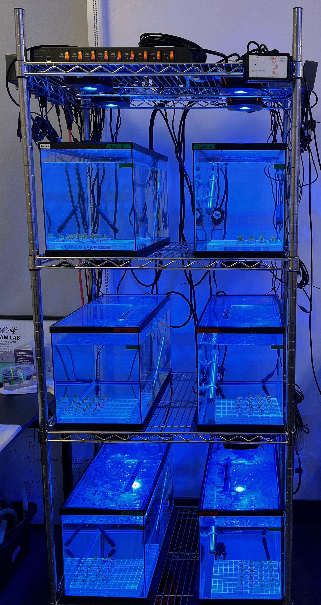

# Model numbers for all equipment used in experimental tank system

Our tank system consisted of six identical 10-gallon tanks (Aqua Culture 10 Gallon Transparent Glass Tank, https://www.walmart.com/ip/Aqua-Culture-10-Gallon-Transparent-Glass-Tank/1493029628) that measured 20×10×12.2 inches. The temperature of each tank was monitored and controlled using a Neptune Systems Apex Controller using an A2 Apex Base Unit (Product , Serial Number AC5:​86437) and a Neptune Systems Apex Energy Bar EB832. Each heater was plugged into a specific outlet of the energy bar programmed based on the temperature measured by the corresponding Neptune Systems Temperature Probe (Model #####) in each tank, each which was connected to the base unit with a PM1 module (Model #####).

In every tank, there was one of each:

1. Heater (Bulk Reef suppkly 300W)
2. Apex temperature probe
3. Recirculating pump (Hydor Pico 300)
4. HOBO logger (UA-002-64, Onset Computer Corp)

Every tank was below two Aquaillumination Prime 16HD lights.

Every day, water chemistry measurements were taken using an Orion Star A325 Conductivity and pH meter and a digital thermometer (4000EA, Traceable® Products for *Porites* and *Montipora* experiments and Fisherbrand™ Traceable™M Hi-Accuracy Thermometer for *Pocillopora* experiment).

1.  PAR meter